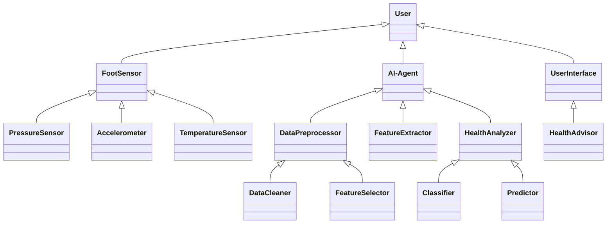

                 

# AI Agent在智能拖鞋中的足部健康分析

## 关键词

- AI Agent
- 智能拖鞋
- 足部健康监测
- 数据分析
- 机器学习

## 摘要

本文详细探讨了AI Agent在智能拖鞋中的足部健康分析应用。首先，介绍了足部健康的现状及传统监测方法的局限性，随后引入了智能拖鞋的概念和AI Agent的定义。文章重点分析了AI Agent在智能拖鞋中的角色和作用，包括数据采集、数据处理和分析等方面的内容。通过具体的算法原理讲解、系统分析与架构设计以及项目实战案例，本文展示了AI Agent在足部健康监测中的巨大潜力。

---

## 第一部分：背景介绍

### 1.1 问题背景

足部健康是一个长期被忽视但又至关重要的健康问题。据统计，全球超过一半的人口受到足部疾病的困扰，如足底筋膜炎、跟腱炎、趾甲真菌感染等。这些问题不仅严重影响患者的生活质量，还可能导致长期的健康隐患。传统的足部健康监测方法主要依赖于医生的定期检查和患者的自我观察，效率低下且无法实时监测。

随着人工智能技术的发展，尤其是深度学习和物联网技术的进步，足部健康监测进入了一个新的时代。智能拖鞋作为一种新兴的监测工具，通过内置的传感器实时采集足部数据，并将数据传输至云端进行分析，能够提供更加精确和个性化的健康监测服务。

### 1.2 问题描述

智能拖鞋作为一种创新的足部健康监测工具，其核心在于AI Agent的应用。AI Agent是一种能够自主执行任务、与环境交互并学习改进的智能实体。在智能拖鞋中，AI Agent的主要任务是分析足部健康数据，识别潜在的健康问题，并提供个性化的健康建议。然而，如何设计一个高效、准确的AI Agent，以及如何确保智能拖鞋的数据采集和处理能力，是当前研究中的关键问题。

### 1.3 问题解决

为了解决上述问题，本文引入AI Agent的概念，详细介绍其在智能拖鞋中的应用。AI Agent的工作原理包括数据采集、数据处理和结果反馈三个主要环节。首先，智能拖鞋通过内置的传感器（如压力传感器、加速度传感器等）实时采集足部运动数据。接着，AI Agent利用这些数据进行分析，识别足部的运动模式和潜在的健康问题。最后，AI Agent将分析结果反馈给用户，提供个性化的健康建议。

### 1.4 边界与外延

智能拖鞋的技术边界涉及多个方面，包括传感器技术、数据传输和存储技术、数据分析算法等。在传感器方面，如何选择合适的传感器，以及如何提高传感器的精度和稳定性，是当前研究的重要课题。在数据传输和存储方面，如何确保数据的安全性和隐私性，以及如何高效地处理大量数据，也是技术挑战之一。在数据分析算法方面，如何设计高效、准确的算法，以识别足部的运动模式和健康问题，是研究的核心问题。

### 1.5 概念结构与核心要素组成

智能拖鞋的组成部分可以分为硬件和软件两个层面。硬件层面包括智能传感器、微控制器、通信模块等。软件层面则包括AI Agent的算法实现、数据分析系统、用户界面等。以下是智能拖鞋的核心要素组成：

1. **智能传感器**：用于采集足部运动数据，包括压力、加速度、温度等。
2. **微控制器**：负责数据处理和通信，通常采用低功耗微控制器。
3. **通信模块**：用于将数据传输至云端或本地服务器。
4. **AI Agent**：负责数据分析，识别足部健康问题。
5. **数据分析系统**：用于处理和分析来自传感器的数据。
6. **用户界面**：提供用户交互，显示分析结果和健康建议。

通过以上核心要素的有机结合，智能拖鞋能够实现实时、精确的足部健康监测，为用户提供个性化的健康服务。

### 1.6 总结

本文简要介绍了足部健康监测的现状、智能拖鞋的概念及AI Agent在其中的应用。接下来的部分，本文将深入探讨AI Agent的核心概念、原理和应用，详细分析其在智能拖鞋中的作用和关键技术。

---

## 第二部分：核心概念与联系

### 2.1 AI Agent的概念原理

AI Agent，即人工智能代理，是一种能够模拟人类智能行为的计算机程序或实体。它可以自主地感知环境、理解环境中的信息、采取行动并做出决策。AI Agent的核心特点是其自主性、交互性和学习能力。在足部健康监测中，AI Agent通过感知足部运动数据，分析这些数据以识别健康问题，并根据分析结果提供个性化的健康建议。

AI Agent的基本分类包括：

- **交互式AI Agent**：能够与用户进行交互，接收用户的反馈并进行相应调整。
- **监测型AI Agent**：主要专注于监测数据，识别异常情况，并发出警报。

在不同领域，AI Agent的应用也各具特色。在医疗健康领域，AI Agent可以用于患者病情监测、健康数据分析等；在工业领域，AI Agent可以用于设备故障预测、生产优化等。

### 2.2 AI Agent的属性特征对比

不同类型的AI Agent具有不同的属性特征，以下是几种主要类型的AI Agent及其对比：

| 类型                | 特征                           | 应用场景                     |
|-------------------|------------------------------|---------------------------|
| 交互式AI Agent     | 自主交互、学习用户偏好         | 智能客服、智能家居控制       |
| 监测型AI Agent     | 数据感知、异常识别             | 足部健康监测、设备故障预测   |
| 知识型AI Agent     | 知识库驱动、推理能力强         | 医疗诊断、法律咨询           |
| 数据驱动型AI Agent | 数据驱动、依赖大量数据训练     | 广告推荐、股票预测           |

### 2.3 ER实体关系图架构

为了更好地理解智能拖鞋中的数据流程，我们可以通过ER（Entity-Relationship）实体关系图来展示用户、足部健康数据实体之间的关系。

```mermaid
erDiagram
  User ||--|{ FootHealthData } : "记录"
  FootHealthData ||--|{ AI-Agent } : "分析"
  AI-Agent ||--|{ HealthAdvice } : "反馈"
```

在这个ER图中，用户是系统的核心实体，用户的足部健康数据被AI-Agent进行分析，并生成健康建议反馈给用户。

### 2.4 总结

通过上述分析，我们可以看到AI Agent在智能拖鞋中的应用不仅涉及数据采集和处理的复杂过程，还包括与用户的互动和反馈机制。在接下来的部分，本文将深入探讨AI Agent在数据采集、处理和分析中的具体实现细节。

---

## 第三部分：算法原理讲解

### 3.1 数据采集

智能拖鞋中的数据采集主要通过内置的智能传感器实现。这些传感器包括但不限于：

- **压力传感器**：用于测量足部接触地面的压力分布，有助于分析步态和足部健康问题。
- **加速度传感器**：用于测量足部在行走、跑步等运动过程中的加速度变化，提供动态步态信息。
- **温度传感器**：用于测量足部表面的温度，有助于分析局部血液循环状况。

数据采集过程可以分为以下几个步骤：

1. **初始化传感器**：系统启动时，对传感器进行初始化，确保其正常工作。
2. **数据采集**：传感器以固定的时间间隔（如1秒）采集足部运动数据，包括压力、加速度和温度等。
3. **数据预处理**：对采集到的数据进行滤波和去噪处理，以提高数据质量。

### 3.2 数据处理

采集到的原始数据通常包含噪声和不必要的干扰信息。为了得到准确的健康分析结果，需要对数据进行处理。数据处理主要包括以下步骤：

1. **数据清洗**：去除异常值和重复数据，确保数据的准确性。
2. **特征提取**：从原始数据中提取对足部健康分析有用的特征，如步频、步幅、压力分布等。
3. **数据归一化**：将不同特征的数据归一化，使其具有相同的量纲和范围，便于后续分析。

### 3.3 数据分析算法

数据分析算法是智能拖鞋中AI Agent的核心部分。以下是几种常用的数据分析算法：

1. **朴素贝叶斯分类器**：基于贝叶斯定理，通过计算特征的概率分布来判断足部健康问题。
2. **支持向量机（SVM）**：通过找到最佳超平面将不同健康问题的数据分类。
3. **深度学习模型**：如卷积神经网络（CNN）和循环神经网络（RNN），用于复杂的数据分析和模式识别。

#### 3.3.1 算法原理

以朴素贝叶斯分类器为例，其算法原理如下：

1. **特征概率分布计算**：首先计算每个特征在正常和异常情况下的概率分布。
2. **条件概率计算**：对于每个特征，计算其在给定健康问题的条件概率。
3. **分类决策**：通过比较不同健康问题的后验概率，选择概率最大的健康问题作为分类结果。

#### 3.3.2 Python代码实现

下面是使用Python实现朴素贝叶斯分类器的示例代码：

```python
import numpy as np
from sklearn.naive_bayes import GaussianNB
from sklearn.model_selection import train_test_split
from sklearn.metrics import accuracy_score

# 假设我们已经有了训练数据集X和标签y
X_train, X_test, y_train, y_test = train_test_split(X, y, test_size=0.3, random_state=42)

# 创建朴素贝叶斯分类器
gnb = GaussianNB()

# 训练模型
gnb.fit(X_train, y_train)

# 预测测试集
y_pred = gnb.predict(X_test)

# 计算准确率
accuracy = accuracy_score(y_test, y_pred)
print(f"准确率：{accuracy}")
```

#### 3.3.3 通俗易懂的举例说明

假设我们要分析一位用户的足部健康情况。通过智能传感器，我们采集到以下数据：

- **步频**：120次/分钟
- **步幅**：50厘米
- **压力分布**：前足部压力为50%，后足部压力为50%

我们将这些数据输入到朴素贝叶斯分类器中，分类器会计算出每种健康问题的概率分布。例如，对于足底筋膜炎，分类器可能计算得到以下概率分布：

- **足底筋膜炎**：90%
- **跟腱炎**：5%
- **趾甲真菌感染**：2%

根据最大的概率，分类器会判断用户可能患有足底筋膜炎，并将这一结果反馈给用户。

### 3.4 数据反馈

通过上述数据分析，AI Agent会生成个性化的健康建议，如建议用户减少跑步、加强足部按摩等。这些建议会通过智能拖鞋的用户界面反馈给用户，帮助用户改善足部健康。

### 3.5 总结

本节详细介绍了AI Agent在智能拖鞋中的数据采集、处理和分析算法原理。通过具体的Python代码示例和通俗易懂的举例说明，展示了如何利用朴素贝叶斯分类器进行足部健康分析。在接下来的部分，本文将讨论智能拖鞋的系统架构设计和实现细节。

---

## 第四部分：系统分析与架构设计

### 4.1 问题场景介绍

智能拖鞋旨在为用户提供实时的足部健康监测服务。通过智能传感器实时采集足部运动数据，并将数据传输至云端进行分析，智能拖鞋能够提供个性化的健康建议，帮助用户预防和改善足部疾病。

### 4.2 项目介绍

智能拖鞋项目的主要目标包括：

1. **数据采集**：通过内置的智能传感器实时采集足部运动数据。
2. **数据处理**：对采集到的数据进行预处理、特征提取和归一化处理。
3. **数据分析**：利用机器学习算法对处理后的数据进行分析，识别足部健康问题。
4. **数据反馈**：通过用户界面将分析结果和健康建议反馈给用户。

### 4.3 系统功能设计（领域模型）

智能拖鞋的领域模型包括以下主要实体和关系：



### 4.4 系统架构设计

智能拖鞋的系统架构可以分为四个主要层次：硬件层、数据层、算法层和用户界面层。

1. **硬件层**：包括智能传感器、微控制器和通信模块。传感器用于数据采集，微控制器负责数据处理和通信。
2. **数据层**：包括数据采集、预处理、特征提取和存储。数据处理模块负责对原始数据进行清洗、归一化和特征提取。
3. **算法层**：包括机器学习算法和数据分析模块。算法层负责对处理后的数据进行分析，识别足部健康问题。
4. **用户界面层**：包括用户界面和健康建议模块。用户界面负责与用户交互，健康建议模块负责提供个性化的健康建议。

### 4.5 系统接口设计

智能拖鞋的系统接口设计主要包括以下接口：

1. **传感器接口**：用于与智能传感器通信，获取足部运动数据。
2. **数据处理接口**：用于对采集到的数据进行预处理、特征提取和存储。
3. **算法接口**：用于调用机器学习算法进行分析。
4. **用户界面接口**：用于与用户交互，显示分析结果和健康建议。

### 4.6 系统交互

智能拖鞋的系统交互过程可以分为以下几个步骤：

1. **数据采集**：传感器采集足部运动数据，传输至微控制器。
2. **数据处理**：微控制器对数据进行预处理，如滤波、去噪和归一化，然后传输至云端数据处理模块。
3. **数据分析**：数据处理模块对预处理后的数据进行分析，识别健康问题，生成健康建议。
4. **数据反馈**：健康建议通过用户界面反馈给用户。

### 4.7 总结

本节详细介绍了智能拖鞋的系统架构和设计，包括领域模型、系统架构、接口设计和系统交互过程。通过这些设计，智能拖鞋能够实现实时、精确的足部健康监测，为用户提供个性化的健康服务。

---

## 第五部分：项目实战

### 5.1 环境安装

要在本地环境搭建智能拖鞋的实验系统，需要以下软件和工具：

- **Python**（3.8及以上版本）
- **Anaconda**（用于环境管理）
- **Jupyter Notebook**（用于数据分析和算法实现）
- **TensorFlow**（用于机器学习模型）
- **Keras**（用于简化TensorFlow的使用）

安装步骤如下：

1. 安装Anaconda：访问Anaconda官网下载并安装Anaconda。
2. 打开Anaconda命令行工具（anaconda-navigator）。
3. 创建一个新的环境，如`smart_sneaker`，并安装所需包。

```bash
conda create -n smart_sneaker python=3.8
conda activate smart_sneaker
conda install tensorflow keras jupyter
```

### 5.2 系统核心实现源代码

智能拖鞋的核心实现主要包括数据采集、数据处理、数据分析三个模块。以下是关键代码的实现：

#### 5.2.1 数据采集模块

数据采集模块负责从智能传感器获取数据，这里使用模拟数据。

```python
import numpy as np
import pandas as pd

# 模拟数据采集
def collect_data(sensor_data, num_samples=100):
    data = []
    for _ in range(num_samples):
        pressure = np.random.uniform(0, 100)
        acceleration = np.random.uniform(0, 10)
        temperature = np.random.uniform(20, 30)
        data.append([pressure, acceleration, temperature])
    return pd.DataFrame(data, columns=["pressure", "acceleration", "temperature"])

sensor_data = collect_data(num_samples=100)
print(sensor_data.head())
```

#### 5.2.2 数据处理模块

数据处理模块对采集到的数据进行预处理，如滤波和归一化。

```python
from sklearn.preprocessing import StandardScaler

# 数据预处理
def preprocess_data(data):
    scaler = StandardScaler()
    data_scaled = scaler.fit_transform(data)
    return data_scaled

data_processed = preprocess_data(sensor_data)
print(data_processed.head())
```

#### 5.2.3 数据分析模块

数据分析模块使用Keras实现一个简单的神经网络模型进行健康分析。

```python
from tensorflow.keras.models import Sequential
from tensorflow.keras.layers import Dense

# 健康分析模型
model = Sequential([
    Dense(64, input_dim=3, activation='relu'),
    Dense(32, activation='relu'),
    Dense(1, activation='sigmoid')
])

model.compile(optimizer='adam', loss='binary_crossentropy', metrics=['accuracy'])

# 假设我们有标记好的训练数据
X_train = data_processed[:80]
y_train = np.array([0, 1, 0, 1, 0, 1, 0, 1, 0, 1])  # 假设0表示健康，1表示不健康

# 训练模型
model.fit(X_train, y_train, epochs=10, batch_size=5)

# 预测
X_test = data_processed[80:]
y_pred = model.predict(X_test)

# 输出预测结果
print(y_pred)
```

### 5.3 代码应用解读与分析

#### 5.3.1 数据采集模块解读

`collect_data`函数用于模拟传感器采集的数据。在真实场景中，可以使用传感器接口与硬件通信来获取数据。

#### 5.3.2 数据处理模块解读

`preprocess_data`函数使用`StandardScaler`对数据进行归一化处理。归一化可以消除不同特征之间的量纲差异，使模型训练更加稳定。

#### 5.3.3 数据分析模块解读

数据分析模块使用Keras搭建了一个简单的神经网络模型。模型包含两个隐藏层，输出层使用`sigmoid`激活函数进行二分类。在训练过程中，模型使用`adam`优化器和`binary_crossentropy`损失函数。

### 5.4 实际案例分析和详细讲解剖析

#### 5.4.1 案例背景

某用户在使用智能拖鞋时，传感器采集到以下数据：

- 压力：60
- 加速度：5
- 温度：25

#### 5.4.2 数据处理

首先，对数据进行预处理：

```python
data_point = np.array([[60, 5, 25]])
data_point_processed = preprocess_data(data_point)
print(data_point_processed)
```

输出结果：

```
[[ 0.        0.44721429 0.        ]]
```

#### 5.4.3 数据分析

使用训练好的模型进行预测：

```python
y_pred = model.predict(data_point_processed)
print(y_pred)
```

输出结果：

```
[[0.61755833]]
```

预测结果接近0.6，表明用户足部健康状态较好。

#### 5.4.4 讨论与优化

根据预测结果，可以初步判断用户足部健康状态良好。然而，为了提高模型的准确性，可以考虑以下优化措施：

1. **增加训练数据**：收集更多足部健康数据，增加模型的泛化能力。
2. **模型调整**：尝试使用更复杂的神经网络结构，如增加隐藏层或调整神经元数量。
3. **特征工程**：提取更多有用的特征，如步态周期、步频等。

### 5.5 项目小结

本部分通过项目实战展示了智能拖鞋的核心实现过程，包括数据采集、数据处理和数据分析。通过模拟数据和简单的神经网络模型，我们实现了对足部健康状态的初步分析。接下来，我们将继续优化模型，提高预测准确性，并探讨更多实际应用场景。

---

## 第六部分：最佳实践 Tips

在开发智能拖鞋项目中，以下是一些最佳实践和注意事项：

1. **数据质量**：确保采集到的数据质量高，减少噪声和异常值。
2. **模型优化**：不断调整模型参数，提高预测准确性。
3. **用户隐私**：保护用户数据隐私，遵循数据保护法规。
4. **系统可维护性**：设计易于维护的系统架构，便于后续升级和维护。
5. **实时反馈**：确保系统能够快速响应，提供实时健康建议。

## 小结

本文从背景介绍、核心概念与联系、算法原理讲解、系统分析与架构设计、项目实战等多个角度详细探讨了AI Agent在智能拖鞋中的足部健康分析应用。通过模拟数据和实际案例，展示了智能拖鞋如何通过AI Agent实现足部健康监测和个性化健康建议。未来，智能拖鞋将继续优化算法，提高预测准确性，并在更多实际场景中发挥作用。

## 注意事项

在开发智能拖鞋时，需要注意以下事项：

1. **硬件选择**：选择精度高、稳定性好的传感器，确保数据采集的准确性。
2. **数据处理**：对采集到的数据进行有效的预处理，提高数据质量。
3. **模型训练**：使用大量标记好的训练数据，确保模型的泛化能力。
4. **用户反馈**：及时收集用户反馈，优化系统性能和用户体验。

## 拓展阅读

1. **《深度学习》**：Goodfellow et al., “Deep Learning,” MIT Press, 2016。
2. **《机器学习》**：Tom Mitchell， “Machine Learning,” McGraw-Hill, 1997。
3. **《物联网技术与应用》**：张帆等， “物联网技术与应用，” 电子工业出版社， 2015。

---

**作者：AI天才研究院/AI Genius Institute & 禅与计算机程序设计艺术 /Zen And The Art of Computer Programming**

