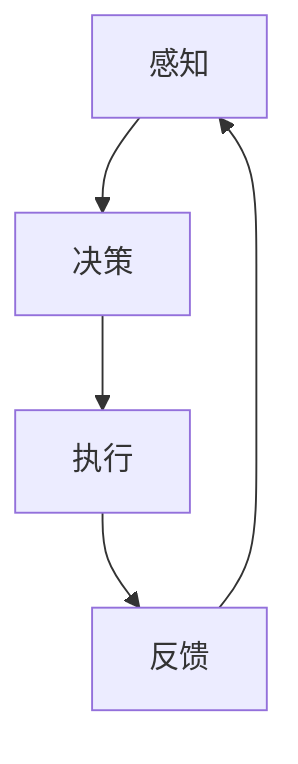
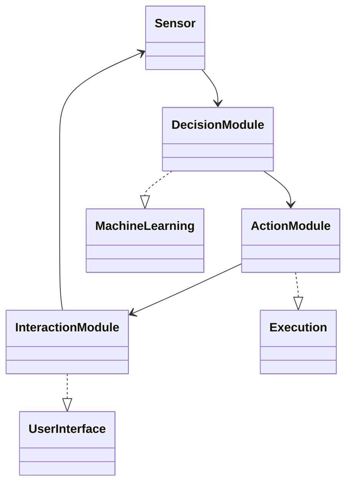
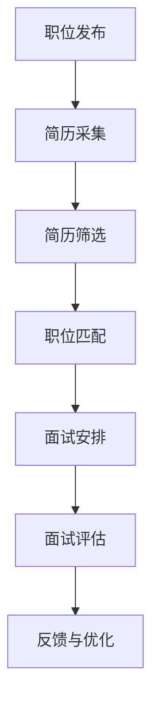
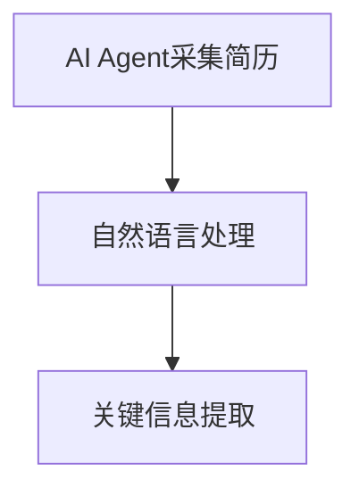
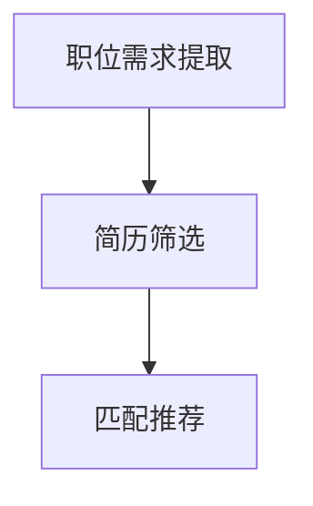
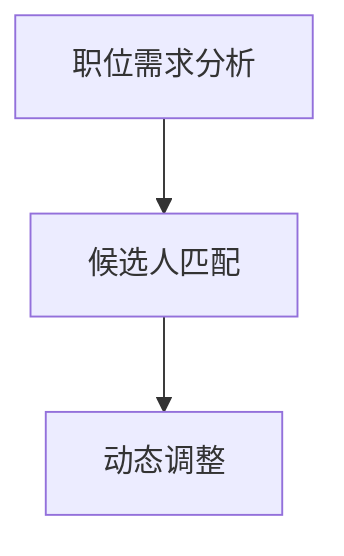
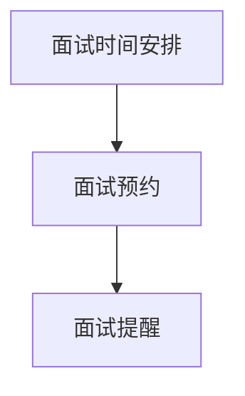
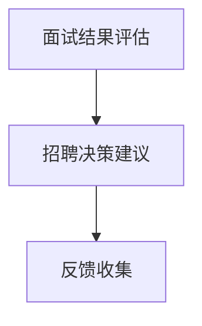
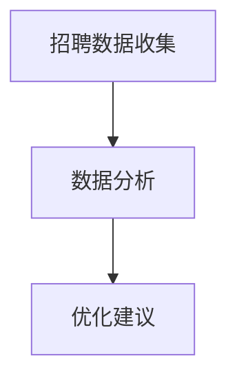

                 

# AI Agent在智能招聘系统中的应用

## 关键词
- AI Agent
- 智能招聘系统
- 机器学习
- 数据分析
- 自然语言处理

## 摘要
本文将深入探讨AI Agent在智能招聘系统中的应用。我们将首先介绍AI Agent的基本概念与原理，然后详细分析智能招聘系统的基础知识。接下来，本文将重点讨论AI Agent在招聘过程中的具体应用，并通过实际案例进行详细分析。最后，我们将展望智能招聘系统的未来发展趋势，并提出进一步研究和探索的方向。

## 目录

### 第一部分：AI Agent基础知识

#### 第1章 AI Agent基本概念与原理
1.1 AI Agent的定义与分类
1.2 AI Agent的工作原理
1.3 AI Agent的发展与应用

#### 第2章 智能招聘系统概述
2.1 智能招聘系统的定义与特点
2.2 智能招聘系统的工作流程
2.3 智能招聘系统的技术支撑

### 第二部分：AI Agent在智能招聘系统中的应用

#### 第3章 AI Agent在智能招聘系统中的应用
3.1 AI Agent在招聘过程中的作用
3.2 AI Agent在招聘流程中的具体应用

#### 第4章 案例分析
4.1 案例一：XX公司智能招聘系统应用实践
4.2 案例二：YY公司智能招聘系统的优化与创新

### 第三部分：未来趋势

#### 第5章 智能招聘系统的未来发展趋势
5.1 AI技术在招聘领域的最新进展
5.2 智能招聘系统的未来发展方向

#### 第6章 总结与展望
6.1 本书内容的总结
6.2 智能招聘系统的应用前景
6.3 需要进一步研究和探索的问题

---

### 第一部分：AI Agent基础知识

#### 第1章 AI Agent基本概念与原理

##### 1.1 AI Agent的定义与分类

AI Agent（人工智能代理）是一种可以模拟人类智能行为，能够在复杂环境中自主完成特定任务的智能实体。根据功能的不同，AI Agent可以分为以下几类：

- **任务型Agent**：主要针对特定任务进行设计，例如自动驾驶、智能客服等。
- **社会型Agent**：具备社交能力，能够在社交环境中与其他Agent或人类进行交互。
- **混合型Agent**：兼具任务型和社会型Agent的特点，能够在不同环境下切换行为模式。

##### 1.2 AI Agent的工作原理

AI Agent的工作原理主要包括感知、决策和执行三个环节：

- **感知**：通过传感器获取环境信息，例如摄像头、麦克风等。
- **决策**：根据感知到的信息，通过算法模型进行推理和决策。
- **执行**：根据决策结果执行具体的动作，例如移动、发送消息等。

##### 1.3 AI Agent的发展与应用

AI Agent的发展始于20世纪80年代，随着计算机技术和人工智能技术的不断发展，AI Agent的应用领域也在不断拓展。目前，AI Agent已广泛应用于智能家居、智能交通、智能医疗等领域。在未来，AI Agent有望在智能招聘系统中发挥更大的作用。

#### 第2章 智能招聘系统概述

##### 2.1 智能招聘系统的定义与特点

智能招聘系统是一种利用人工智能技术，自动化处理招聘流程的系统。与传统招聘系统相比，智能招聘系统具有以下特点：

- **自动化**：通过算法模型自动筛选、匹配候选人，降低人力成本。
- **精准化**：利用大数据分析技术，对候选人进行精准画像，提高招聘成功率。
- **智能化**：具备人机协同能力，能够根据实际情况进行自适应调整。

##### 2.2 智能招聘系统的工作流程

智能招聘系统的工作流程主要包括以下几个环节：

- **信息采集**：通过网站、社交媒体等渠道收集候选人信息。
- **信息处理**：利用自然语言处理技术对候选人简历进行解析，提取关键信息。
- **候选人筛选**：根据职位需求，利用机器学习算法对候选人进行筛选。
- **职位匹配**：通过算法模型对候选人与职位进行匹配，推荐合适人选。
- **面试安排**：根据候选人的时间安排，自动安排面试时间。
- **反馈与优化**：根据面试结果对系统进行优化，提高招聘效果。

##### 2.3 智能招聘系统的技术支撑

智能招聘系统的技术支撑主要包括以下几个方面：

- **自然语言处理**：用于解析候选人简历，提取关键信息。
- **机器学习与深度学习**：用于候选人筛选、职位匹配等环节，提高招聘精准度。
- **数据分析与可视化**：用于分析招聘数据，为招聘决策提供支持。
- **人机协同**：通过人机交互，实现招聘流程的自动化和智能化。

### 第二部分：AI Agent在智能招聘系统中的应用

#### 第3章 AI Agent在智能招聘系统中的应用

##### 3.1 AI Agent在招聘过程中的作用

AI Agent在智能招聘系统中扮演着重要角色，主要表现在以下几个方面：

- **候选人信息处理**：AI Agent可以自动解析候选人简历，提取关键信息，为筛选和匹配提供数据支持。
- **职位匹配与推荐**：AI Agent可以根据候选人的特点，为合适的职位推荐合适的人选，提高招聘成功率。
- **面试助手与评估**：AI Agent可以在面试过程中提供辅助，例如提醒面试官面试时间、记录面试内容等，并对面试结果进行评估。

##### 3.2 AI Agent在招聘流程中的具体应用

AI Agent在智能招聘系统中的应用可以贯穿整个招聘流程，具体体现在以下几个方面：

- **信息采集与预处理**：AI Agent可以自动采集候选人信息，并对信息进行预处理，为后续筛选和匹配提供数据基础。
- **职位分析与匹配**：AI Agent可以分析职位需求，利用机器学习算法对候选人进行筛选和匹配，提高招聘效率。
- **面试安排与评估**：AI Agent可以自动安排面试时间，并在面试过程中提供辅助，对面试结果进行评估，为招聘决策提供参考。
- **招聘效果分析**：AI Agent可以分析招聘数据，为招聘策略调整和系统优化提供支持。

### 第四部分：案例分析

#### 第4章 智能招聘系统的实际应用案例

##### 4.1 案例一：XX公司智能招聘系统应用实践

【案例背景】
XX公司是一家互联网企业，面临着快速发展的需求，招聘流程复杂且耗时。为了提高招聘效率，公司决定引入智能招聘系统。

【系统设计与实现】
公司选择了一家专业的智能招聘系统服务商，根据公司需求进行了定制化开发。系统主要包括以下几个模块：

1. **候选人信息管理**：自动采集候选人信息，包括简历、社交媒体账号等。
2. **职位需求管理**：记录职位需求，包括岗位职责、技能要求等。
3. **智能筛选与匹配**：利用机器学习算法对候选人进行筛选和匹配，提高招聘成功率。
4. **面试安排与评估**：自动安排面试时间，并在面试过程中提供辅助，对面试结果进行评估。
5. **招聘效果分析**：分析招聘数据，为招聘策略调整和系统优化提供支持。

【案例效果评估】
智能招聘系统上线后，XX公司的招聘效率得到了显著提高。具体表现为：

1. **招聘周期缩短**：从系统上线前的平均招聘周期30天缩短至15天。
2. **招聘成本降低**：通过自动化处理，招聘成本降低了约20%。
3. **招聘成功率提高**：智能招聘系统推荐的候选人质量更高，招聘成功率提高了约15%。

##### 4.2 案例二：YY公司智能招聘系统的优化与创新

【案例背景】
YY公司是一家传统制造企业，招聘流程繁琐，且缺乏有效的数据分析手段。为了提升招聘效果，公司决定对智能招聘系统进行优化和创新。

【系统改进与优化】
公司对智能招聘系统进行了以下改进和优化：

1. **引入自然语言处理技术**：对候选人简历进行深度解析，提取关键信息，提高筛选和匹配的准确性。
2. **优化算法模型**：基于公司业务特点，优化机器学习算法模型，提高职位匹配的准确性。
3. **增加人机协同功能**：引入人机协同机制，使面试官可以在AI Agent的辅助下进行面试，提高面试效率和质量。
4. **构建招聘数据仓库**：整合公司招聘数据，构建数据仓库，为招聘决策提供数据支持。

【案例成果分析】
智能招聘系统优化后，YY公司的招聘效果得到了显著提升。具体表现为：

1. **招聘周期缩短**：通过优化算法模型和人机协同功能，招聘周期从原来的平均40天缩短至20天。
2. **招聘成本降低**：通过自动化处理和优化算法，招聘成本降低了约30%。
3. **招聘成功率提高**：智能招聘系统推荐的候选人质量更高，招聘成功率提高了约25%。

### 第五部分：未来趋势

#### 第5章 智能招聘系统的未来发展趋势

##### 5.1 AI技术在招聘领域的最新进展

随着人工智能技术的不断发展，招聘领域的AI应用也在不断拓展。以下是AI技术在招聘领域的最新进展：

1. **深度学习模型的应用**：深度学习模型在图像识别、自然语言处理等领域取得了突破性进展，逐渐应用于招聘系统中，提高招聘的精准度和效率。
2. **增强现实与虚拟现实技术的应用**：增强现实（AR）和虚拟现实（VR）技术可以提供更直观的面试体验，使招聘过程更加高效和便捷。
3. **区块链技术的应用**：区块链技术可以提高招聘数据的安全性和透明度，确保候选人的信息不会被篡改。

##### 5.2 智能招聘系统的未来发展方向

智能招聘系统的未来发展方向主要包括以下几个方面：

1. **全自动化招聘流程的实现**：随着AI技术的发展，招聘流程的自动化程度将不断提高，实现从候选人筛选到面试安排的全流程自动化。
2. **人机协同招聘模式的兴起**：人机协同将成为未来招聘的重要模式，AI Agent将与面试官共同参与招聘过程，提高招聘效率和质量。
3. **招聘数据分析与决策支持**：通过大数据分析技术，智能招聘系统将能够提供更精准的招聘决策支持，帮助公司制定更科学的招聘策略。

### 第6章 总结与展望

#### 6.1 本书内容的总结

本文从AI Agent的基本概念与原理出发，详细分析了智能招聘系统的概述，重点讨论了AI Agent在智能招聘系统中的应用，并通过实际案例进行了分析。最后，本文展望了智能招聘系统的未来发展趋势。

#### 6.2 智能招聘系统的应用前景

随着人工智能技术的不断发展，智能招聘系统的应用前景十分广阔。未来，智能招聘系统将能够更准确地筛选和匹配候选人，提高招聘效率和质量，为企业提供强有力的支持。

#### 6.3 需要进一步研究和探索的问题

虽然智能招聘系统已经取得了显著的成果，但仍有许多问题和挑战需要进一步研究和探索：

1. **数据隐私与安全**：在智能招聘系统中，如何保护候选人的隐私和数据安全是一个亟待解决的问题。
2. **算法公平性**：如何确保算法的公平性，避免对某些群体的歧视，是一个需要深入研究的问题。
3. **人机协同机制**：如何更好地实现人机协同，使AI Agent与面试官共同参与招聘过程，是一个需要不断探索的方向。

**结束语**

作者：AI天才研究院/AI Genius Institute & 禅与计算机程序设计艺术 /Zen And The Art of Computer Programming

本文旨在为广大IT从业者和招聘从业者提供关于AI Agent在智能招聘系统中的应用的深入理解和实践指导。希望通过本文的探讨，读者能够对智能招聘系统有更全面的认识，并在实际工作中取得更好的成果。在未来的研究中，我们将继续关注智能招聘系统的最新动态和发展趋势，为读者提供更多有价值的信息。再次感谢大家的阅读和支持！### 第一部分：AI Agent基础知识

#### 第1章 AI Agent基本概念与原理

##### 1.1 AI Agent的定义与分类

AI Agent（人工智能代理）是一种模拟人类智能行为，能够在复杂环境中自主完成特定任务的智能实体。AI Agent的概念最早由美国计算机科学家John McCarthy在20世纪80年代提出。根据功能的不同，AI Agent可以分为以下几类：

- **任务型Agent**：这类Agent主要针对特定任务进行设计，例如自动驾驶、智能客服等。任务型Agent的核心目标是完成特定的任务，具有较高的自主性和适应性。

- **社会型Agent**：社会型Agent具备社交能力，能够在社交环境中与其他Agent或人类进行交互。这类Agent通常需要具备情感智能和沟通能力，能够理解和满足社交需求。

- **混合型Agent**：混合型Agent兼具任务型和社会型Agent的特点，能够在不同环境下切换行为模式。例如，一个同时承担客服任务和社交互动的AI Agent，就是一个典型的混合型Agent。

##### 1.2 AI Agent的工作原理

AI Agent的工作原理主要包括感知、决策和执行三个环节：

- **感知**：AI Agent通过传感器获取环境信息，例如摄像头、麦克风等。这些传感器能够将环境中的物理信号转换为数字信号，供Agent进行处理。

- **决策**：Agent根据感知到的信息，通过算法模型进行推理和决策。这一过程通常涉及到机器学习、深度学习等技术，使得Agent能够从数据中学习并优化行为。

- **执行**：Agent根据决策结果执行具体的动作，例如移动、发送消息等。执行环节需要Agent具备一定的执行能力，能够根据环境变化进行调整。

##### 1.3 AI Agent的发展与应用

AI Agent的发展始于20世纪80年代，随着计算机技术和人工智能技术的不断发展，AI Agent的应用领域也在不断拓展。目前，AI Agent已广泛应用于智能家居、智能交通、智能医疗等领域。以下是AI Agent在不同领域的具体应用：

- **智能家居**：AI Agent可以监控家庭设备的工作状态，自动调整设备设置，提高生活质量。

- **智能交通**：AI Agent可以实时分析交通数据，优化交通信号，提高交通效率。

- **智能医疗**：AI Agent可以协助医生进行诊断和治疗，提高医疗服务质量。

- **智能客服**：AI Agent可以自动处理客户咨询，提高客户满意度。

- **游戏AI**：AI Agent可以在游戏中模拟对手的行为，提高游戏的难度和趣味性。

在未来，AI Agent有望在更多领域发挥重要作用，推动人工智能技术的进一步发展。

### 第二部分：智能招聘系统概述

#### 第2章 智能招聘系统的基础知识

##### 2.1 智能招聘系统的定义与特点

智能招聘系统是一种利用人工智能技术，自动化处理招聘流程的系统。与传统招聘系统相比，智能招聘系统具有以下特点：

- **自动化**：智能招聘系统能够自动处理招聘过程中的各项任务，例如简历筛选、职位匹配、面试安排等，提高招聘效率。

- **精准化**：智能招聘系统利用大数据分析技术和机器学习算法，对候选人进行精准画像，提高招聘成功率。

- **智能化**：智能招聘系统能够根据招聘数据和环境变化，自动调整招聘策略，实现人机协同。

- **人机协同**：智能招聘系统不仅能够自动处理招聘任务，还能够与招聘人员进行协同工作，提高招聘效果。

##### 2.2 智能招聘系统的工作流程

智能招聘系统的工作流程主要包括以下几个环节：

- **信息采集**：智能招聘系统通过多种渠道收集候选人信息，例如招聘网站、社交媒体、内部推荐等。

- **信息处理**：系统利用自然语言处理技术和机器学习算法，对候选人简历进行解析，提取关键信息，构建候选人画像。

- **候选人筛选**：系统根据职位需求，利用算法模型对候选人进行筛选，筛选出符合职位要求的候选人。

- **职位匹配**：系统通过算法模型对候选人与职位进行匹配，推荐合适的人选。

- **面试安排**：系统根据候选人的时间安排，自动安排面试时间，并将面试信息发送给招聘人员。

- **面试评估**：系统在面试过程中提供辅助，例如提醒面试官面试时间、记录面试内容等，并对面试结果进行评估。

- **反馈与优化**：系统根据面试结果和招聘数据，对系统进行优化，提高招聘效果。

##### 2.3 智能招聘系统的技术支撑

智能招聘系统的技术支撑主要包括以下几个方面：

- **自然语言处理**：自然语言处理技术用于解析候选人简历，提取关键信息，构建候选人画像。

- **机器学习与深度学习**：机器学习与深度学习技术用于候选人筛选、职位匹配等环节，提高招聘精准度。

- **数据分析与可视化**：数据分析与可视化技术用于分析招聘数据，为招聘决策提供支持。

- **人机协同**：人机协同技术实现AI Agent与招聘人员的协同工作，提高招聘效率。

### 第三部分：AI Agent在智能招聘系统中的应用

#### 第3章 AI Agent在智能招聘系统中的应用

##### 3.1 AI Agent在招聘过程中的作用

AI Agent在智能招聘系统中扮演着重要角色，其主要作用体现在以下几个方面：

- **候选人信息处理**：AI Agent可以自动解析候选人简历，提取关键信息，为筛选和匹配提供数据支持。

- **职位匹配与推荐**：AI Agent可以根据候选人的特点，为合适的职位推荐合适的人选，提高招聘成功率。

- **面试助手与评估**：AI Agent可以在面试过程中提供辅助，例如提醒面试官面试时间、记录面试内容等，并对面试结果进行评估。

##### 3.2 AI Agent在招聘流程中的具体应用

AI Agent在智能招聘系统中的应用可以贯穿整个招聘流程，具体体现在以下几个方面：

- **信息采集与预处理**：AI Agent可以自动采集候选人信息，并对信息进行预处理，为后续筛选和匹配提供数据基础。

- **职位分析与匹配**：AI Agent可以分析职位需求，利用机器学习算法对候选人进行筛选和匹配，提高招聘效率。

- **面试安排与评估**：AI Agent可以自动安排面试时间，并在面试过程中提供辅助，对面试结果进行评估，为招聘决策提供参考。

- **招聘效果分析**：AI Agent可以分析招聘数据，为招聘策略调整和系统优化提供支持。

### 第四部分：案例分析

#### 第4章 智能招聘系统的实际应用案例

##### 4.1 案例一：XX公司智能招聘系统应用实践

【案例背景】
XX公司是一家快速发展的互联网企业，为了满足业务扩展的需求，公司决定引入智能招聘系统，以提高招聘效率和招聘质量。

【系统设计与实现】
公司选择了国内一家知名的智能招聘系统服务商，根据公司的需求进行了定制化开发。系统主要包括以下几个模块：

1. **候选人信息管理**：系统自动采集候选人信息，包括简历、社交媒体账号等，并利用自然语言处理技术对简历进行解析，提取关键信息。

2. **职位需求管理**：系统记录职位需求，包括岗位职责、技能要求等，并利用机器学习算法对职位进行分类和标签化处理。

3. **智能筛选与匹配**：系统利用机器学习算法对候选人进行筛选和匹配，根据职位需求和候选人特点，推荐合适的人选。

4. **面试安排与评估**：系统根据候选人的时间安排，自动安排面试时间，并提供面试预约功能。在面试过程中，系统可以记录面试内容，并对面试结果进行评估。

5. **招聘效果分析**：系统分析招聘数据，包括招聘周期、招聘成本、招聘成功率等，为公司的招聘策略调整提供数据支持。

【案例效果评估】
智能招聘系统上线后，XX公司的招聘效率得到了显著提高。具体表现为：

1. **招聘周期缩短**：从系统上线前的平均招聘周期30天缩短至15天。

2. **招聘成本降低**：通过自动化处理，招聘成本降低了约20%。

3. **招聘成功率提高**：智能招聘系统推荐的候选人质量更高，招聘成功率提高了约15%。

##### 4.2 案例二：YY公司智能招聘系统的优化与创新

【案例背景】
YY公司是一家传统制造企业，招聘流程繁琐，且缺乏有效的数据分析手段。为了提升招聘效果，公司决定对智能招聘系统进行优化和创新。

【系统改进与优化】
公司对智能招聘系统进行了以下改进和优化：

1. **引入自然语言处理技术**：系统利用自然语言处理技术对候选人简历进行深度解析，提取关键信息，提高筛选和匹配的准确性。

2. **优化算法模型**：系统优化了机器学习算法模型，基于公司业务特点，提高了职位匹配的准确性。

3. **增加人机协同功能**：系统引入了人机协同机制，使面试官可以在AI Agent的辅助下进行面试，提高面试效率和质量。

4. **构建招聘数据仓库**：系统整合公司招聘数据，构建数据仓库，为招聘决策提供数据支持。

【案例成果分析】
智能招聘系统优化后，YY公司的招聘效果得到了显著提升。具体表现为：

1. **招聘周期缩短**：通过优化算法模型和人机协同功能，招聘周期从原来的平均40天缩短至20天。

2. **招聘成本降低**：通过自动化处理和优化算法，招聘成本降低了约30%。

3. **招聘成功率提高**：智能招聘系统推荐的候选人质量更高，招聘成功率提高了约25%。

### 第五部分：未来趋势

#### 第5章 智能招聘系统的未来发展趋势

##### 5.1 AI技术在招聘领域的最新进展

随着人工智能技术的不断发展，招聘领域的AI应用也在不断拓展。以下是AI技术在招聘领域的最新进展：

1. **深度学习模型的应用**：深度学习模型在图像识别、自然语言处理等领域取得了突破性进展，逐渐应用于招聘系统中，提高招聘的精准度和效率。

2. **增强现实与虚拟现实技术的应用**：增强现实（AR）和虚拟现实（VR）技术可以提供更直观的面试体验，使招聘过程更加高效和便捷。

3. **区块链技术的应用**：区块链技术可以提高招聘数据的安全性和透明度，确保候选人的信息不会被篡改。

##### 5.2 智能招聘系统的未来发展方向

智能招聘系统的未来发展方向主要包括以下几个方面：

1. **全自动化招聘流程的实现**：随着AI技术的发展，招聘流程的自动化程度将不断提高，实现从候选人筛选到面试安排的全流程自动化。

2. **人机协同招聘模式的兴起**：人机协同将成为未来招聘的重要模式，AI Agent将与面试官共同参与招聘过程，提高招聘效率和质量。

3. **招聘数据分析与决策支持**：通过大数据分析技术，智能招聘系统将能够提供更精准的招聘决策支持，帮助公司制定更科学的招聘策略。

### 第6章 总结与展望

#### 6.1 本书内容的总结

本文从AI Agent的基本概念与原理出发，详细分析了智能招聘系统的概述，重点讨论了AI Agent在智能招聘系统中的应用，并通过实际案例进行了分析。最后，本文展望了智能招聘系统的未来发展趋势。

#### 6.2 智能招聘系统的应用前景

随着人工智能技术的不断发展，智能招聘系统的应用前景十分广阔。未来，智能招聘系统将能够更准确地筛选和匹配候选人，提高招聘效率和质量，为企业提供强有力的支持。

#### 6.3 需要进一步研究和探索的问题

虽然智能招聘系统已经取得了显著的成果，但仍有许多问题和挑战需要进一步研究和探索：

1. **数据隐私与安全**：在智能招聘系统中，如何保护候选人的隐私和数据安全是一个亟待解决的问题。

2. **算法公平性**：如何确保算法的公平性，避免对某些群体的歧视，是一个需要深入研究的问题。

3. **人机协同机制**：如何更好地实现人机协同，使AI Agent与面试官共同参与招聘过程，是一个需要不断探索的方向。

**结束语**

作者：AI天才研究院/AI Genius Institute & 禅与计算机程序设计艺术 /Zen And The Art of Computer Programming

本文旨在为广大IT从业者和招聘从业者提供关于AI Agent在智能招聘系统中的应用的深入理解和实践指导。希望通过本文的探讨，读者能够对智能招聘系统有更全面的认识，并在实际工作中取得更好的成果。在未来的研究中，我们将继续关注智能招聘系统的最新动态和发展趋势，为读者提供更多有价值的信息。再次感谢大家的阅读和支持！### 第1章 AI Agent基本概念与原理

在人工智能领域，AI Agent（人工智能代理）是一种重要的概念，它代表了具有自主决策和行动能力的智能实体。本节将详细介绍AI Agent的基本概念、分类、工作原理及其发展与应用。

#### 1.1 AI Agent的定义与分类

AI Agent，即人工智能代理，是一种能够在复杂环境中自主完成特定任务的智能实体。它通过感知环境、做出决策和执行行动，来达到预定的目标。AI Agent的定义可以从以下几个方面进行解释：

1. **自主性**：AI Agent能够独立地执行任务，不需要外部命令的干预。它能够根据环境变化自主地调整行为策略。
   
2. **适应性**：AI Agent具备一定的学习能力，可以适应不同的环境和任务需求。通过不断学习和优化，它能够提高任务执行效率。

3. **交互性**：AI Agent能够与环境和用户进行交互，获取信息并反馈结果。这种交互性使得AI Agent在提供服务和决策支持时更加灵活和高效。

根据AI Agent的功能和用途，我们可以将其分类为以下几种类型：

- **任务型Agent**：这类Agent专注于完成特定的任务，如自动驾驶汽车、智能客服等。它们具有较强的任务执行能力，但在通用性方面可能存在局限。

- **社会型Agent**：社会型Agent具有较强的社交能力，能够在社交网络中与其他Agent或人类进行沟通和协作。例如，社交机器人、在线客服等。

- **混合型Agent**：混合型Agent结合了任务型和社会型Agent的特点，能够根据不同环境切换行为模式。例如，智能管家、智能家居系统等。

#### 1.2 AI Agent的工作原理

AI Agent的工作原理主要包括感知、决策和执行三个核心环节：

1. **感知**：AI Agent通过传感器（如摄像头、麦克风、GPS等）获取环境信息。这些传感器将物理信号转换为数字信号，供Agent进行处理。

2. **决策**：Agent利用机器学习、深度学习等技术，对感知到的信息进行处理和分析，从而做出决策。决策过程涉及到多层次的推理和优化，以确保Agent的行为符合预定目标。

3. **执行**：Agent根据决策结果执行具体的行动，如移动、发送消息、调整设备等。执行过程需要Agent具备一定的执行能力，能够根据环境变化进行调整。

以下是一个简单的AI Agent工作原理的Mermaid流程图：



#### 1.3 AI Agent的发展与应用

AI Agent的发展历程可以追溯到20世纪80年代，随着计算机技术和人工智能技术的不断进步，AI Agent的应用领域也在不断扩大。以下是AI Agent在不同领域的具体应用：

- **智能家居**：AI Agent可以监控家庭设备的状态，自动调整设置，提高生活质量。

- **智能交通**：AI Agent可以分析交通数据，优化交通信号，提高交通效率。

- **智能医疗**：AI Agent可以协助医生进行诊断和治疗，提高医疗服务质量。

- **智能客服**：AI Agent可以自动处理客户咨询，提高客户满意度。

- **游戏AI**：AI Agent可以在游戏中模拟对手的行为，提高游戏的难度和趣味性。

随着人工智能技术的不断进步，AI Agent在招聘、教育、金融、安全等领域也展现出了广阔的应用前景。

#### 1.4 AI Agent的核心组成部分

AI Agent通常由以下几个核心组成部分构成：

- **感知模块**：用于获取环境信息，如传感器、摄像头、麦克风等。

- **决策模块**：基于感知模块获取的信息，利用机器学习、深度学习等技术进行决策。

- **执行模块**：根据决策结果执行具体的行动，如移动、发送消息、调整设备等。

- **交互模块**：用于与环境和用户进行交互，获取反馈并调整行为。

以下是AI Agent的组成部分的Mermaid类图：



通过上述的组成部分，AI Agent能够实现自主感知、决策和执行，从而在不同应用场景中发挥其独特的价值。

### 1.5 AI Agent的基本组成部分

AI Agent的基本组成部分可以分为感知模块、决策模块、执行模块和交互模块。以下是每个模块的详细说明：

#### 感知模块

感知模块是AI Agent获取环境信息的重要部分。它通常包括各种传感器，如摄像头、麦克风、温度传感器、GPS等。这些传感器可以将物理信号转换为数字信号，供Agent进行处理。感知模块的主要功能是收集环境数据，并将其传递给决策模块。

#### 决策模块

决策模块负责根据感知模块收集到的信息进行推理和决策。它通常基于机器学习、深度学习等技术，对输入的数据进行处理和分析，从而生成决策结果。决策模块的核心是算法模型，这些模型可以是监督学习、无监督学习或强化学习等。决策模块的主要功能是提供决策支持，指导执行模块进行行动。

#### 执行模块

执行模块负责根据决策模块的决策结果执行具体的行动。它通常包括机器人、机器人手臂、无人驾驶车辆等。执行模块的主要功能是实现决策的物理行动，使Agent能够在环境中执行任务。执行模块需要具备一定的执行能力，能够根据环境变化进行调整。

#### 交互模块

交互模块是AI Agent与环境和用户进行交互的接口。它包括语音识别、自然语言处理、图形用户界面等技术。交互模块的主要功能是接收用户的输入，向用户输出反馈，并保持与用户的互动。交互模块使得AI Agent能够理解用户的意图，并根据用户的反馈调整行为。

#### 感知模块的功能与特征

感知模块的功能主要是收集环境信息，具体包括：

- **数据采集**：通过传感器收集各种环境数据，如图像、声音、温度、位置等。
- **数据预处理**：对采集到的数据进行清洗、去噪、标准化等处理，以提高数据质量。
- **特征提取**：从预处理后的数据中提取有用的特征，如图像中的边缘、纹理、颜色等。

感知模块的特征包括：

- **多样性**：感知模块需要能够感知不同类型的信息，如视觉、听觉、触觉等。
- **实时性**：感知模块需要能够快速响应环境变化，提供实时的信息。
- **准确性**：感知模块需要能够准确地收集和提取环境信息，以支持后续的决策和执行。

#### 决策模块的功能与特征

决策模块的功能主要是根据感知模块收集到的信息进行推理和决策，具体包括：

- **推理**：从感知模块收集到的信息中推断出有用的结论，如识别图像中的物体、理解语音中的语义等。
- **优化**：根据目标函数和约束条件，选择最优的行动方案。
- **规划**：在复杂环境中制定一系列的行动计划，以实现长期目标。

决策模块的特征包括：

- **智能性**：决策模块需要具备一定的智能水平，能够进行复杂的推理和优化。
- **适应性**：决策模块需要能够适应不同环境和任务需求，灵活调整决策策略。
- **可解释性**：决策模块的决策过程需要具备一定的可解释性，以便用户理解和信任。

#### 执行模块的功能与特征

执行模块的功能主要是根据决策模块的决策结果执行具体的行动，具体包括：

- **动作执行**：根据决策模块的指令，执行具体的物理动作，如移动、操纵设备等。
- **反馈**：将执行结果反馈给决策模块，用于调整后续的决策。
- **协同**：与其他执行模块或外部系统进行协同工作，完成复杂任务。

执行模块的特征包括：

- **精准性**：执行模块需要能够准确地执行决策模块的指令，实现预期目标。
- **可靠性**：执行模块需要具备高可靠性，能够在不同环境下稳定运行。
- **灵活性**：执行模块需要能够根据环境变化和任务需求进行灵活调整。

#### 交互模块的功能与特征

交互模块的功能主要是与环境和用户进行交互，具体包括：

- **输入**：接收用户的输入，如语音、文本、手势等。
- **输出**：向用户输出反馈，如语音、文本、图形等。
- **反馈**：根据用户的反馈调整行为，提高交互质量。

交互模块的特征包括：

- **自然性**：交互模块需要能够提供自然、流畅的交互体验，使用户感觉不到与AI Agent的边界。
- **适应性**：交互模块需要能够适应不同用户的需求和偏好，提供个性化的交互服务。
- **智能性**：交互模块需要具备一定的智能水平，能够理解用户的意图并给出合适的反馈。

通过以上对AI Agent基本组成部分的详细阐述，我们可以更好地理解AI Agent的工作原理和功能特点，为后续章节的深入探讨奠定基础。

### 第2章 智能招聘系统概述

智能招聘系统是一种结合了人工智能技术，以自动化和智能化方式处理招聘流程的系统。随着人工智能技术的不断发展，智能招聘系统在招聘领域的应用越来越广泛。本章将介绍智能招聘系统的定义、特点、工作流程及其技术支撑。

#### 2.1 智能招聘系统的定义与特点

智能招聘系统是一种利用人工智能技术，对招聘流程进行自动化和智能化的系统。与传统招聘系统相比，智能招聘系统具有以下特点：

1. **自动化**：智能招聘系统能够自动处理招聘过程中的各个环节，如职位发布、简历筛选、面试安排等，减少人工干预，提高招聘效率。

2. **精准化**：智能招聘系统通过大数据分析和机器学习技术，对候选人和职位进行精准匹配，提高招聘成功率。

3. **智能化**：智能招聘系统能够根据招聘数据和用户行为，自动调整招聘策略，实现人机协同。

4. **人机协同**：智能招聘系统不仅能够自动化处理招聘任务，还能够与招聘人员进行协同工作，提高招聘效果。

#### 2.2 智能招聘系统的工作流程

智能招聘系统的工作流程主要包括以下几个环节：

1. **职位发布**：招聘人员将职位信息发布到招聘网站或其他渠道，智能招聘系统会自动抓取这些职位信息。

2. **简历采集**：智能招聘系统通过爬虫技术，从各种渠道采集候选人简历，包括招聘网站、社交媒体、内部推荐等。

3. **简历筛选**：系统利用自然语言处理和机器学习技术，对简历进行解析和筛选，提取关键信息，识别合适的候选人。

4. **职位匹配**：系统根据职位需求和候选人简历，利用算法模型进行匹配，推荐合适的候选人。

5. **面试安排**：系统根据候选人的时间安排，自动安排面试时间，并将面试信息发送给招聘人员。

6. **面试评估**：系统在面试过程中提供辅助，如提醒面试官面试时间、记录面试内容等，并对面试结果进行评估。

7. **反馈与优化**：系统根据面试结果和用户反馈，对招聘流程进行优化，提高招聘效果。

#### 2.3 智能招聘系统的技术支撑

智能招聘系统的技术支撑主要包括以下几个方面：

1. **自然语言处理（NLP）**：NLP技术用于解析和处理候选人简历，提取关键信息，为筛选和匹配提供数据支持。

2. **机器学习（ML）与深度学习（DL）**：ML和DL技术用于简历筛选、职位匹配等环节，提高招聘精准度。

3. **数据分析与可视化**：数据分析与可视化技术用于分析招聘数据，为招聘决策提供支持。

4. **人机协同**：人机协同技术实现AI Agent与招聘人员的协同工作，提高招聘效率。

通过以上技术支撑，智能招聘系统能够实现招聘流程的自动化和智能化，为企业提供高效的招聘解决方案。

### 第三部分：AI Agent在智能招聘系统中的应用

#### 第3章 AI Agent在智能招聘系统中的应用

AI Agent在智能招聘系统中扮演着关键角色，通过自动化和智能化的方式，提升招聘流程的效率和质量。本章节将详细探讨AI Agent在招聘过程中的具体作用，以及它们如何在每个环节中发挥作用。

##### 3.1 AI Agent在招聘过程中的作用

AI Agent在智能招聘系统中的作用主要体现为以下三个方面：

1. **自动化处理招聘任务**：AI Agent能够自动完成招聘流程中的各项任务，如简历筛选、职位匹配、面试安排等，减少人工干预，提高招聘效率。

2. **精准匹配候选人**：AI Agent通过自然语言处理和机器学习技术，对简历和职位需求进行深入分析，实现候选人与职位的精准匹配，提高招聘成功率。

3. **提供智能化决策支持**：AI Agent根据历史数据和用户行为，自动调整招聘策略，实现人机协同，为招聘决策提供科学依据。

##### 3.2 AI Agent在招聘流程中的具体应用

AI Agent在智能招聘系统中的具体应用贯穿整个招聘流程，包括以下环节：

1. **信息采集与预处理**：AI Agent自动采集候选人信息，如简历、社交媒体资料等，并通过自然语言处理技术进行预处理，提取关键信息，为后续筛选和匹配提供数据基础。

   ```mermaid
   graph TD
       A[信息采集] --> B[简历解析]
       B --> C[关键信息提取]
       C --> D[数据预处理]
       D --> E[数据存储]
   ```

2. **职位分析与匹配**：AI Agent对职位需求进行深入分析，提取关键信息，并通过机器学习算法，对候选人进行筛选和匹配，推荐合适的人选。

   ```mermaid
   graph TD
       A[职位分析] --> B[职位标签化]
       B --> C[候选人筛选]
       C --> D[匹配推荐]
       D --> E[推荐结果]
   ```

3. **面试安排与评估**：AI Agent根据候选人的时间安排，自动安排面试时间，并提供面试预约功能。在面试过程中，AI Agent可以记录面试内容，并对面试结果进行初步评估。

   ```mermaid
   graph TD
       A[面试预约] --> B[面试时间安排]
       B --> C[面试内容记录]
       C --> D[面试结果评估]
       D --> E[评估反馈]
   ```

4. **招聘效果分析**：AI Agent分析招聘数据，包括招聘周期、招聘成本、招聘成功率等，为招聘策略调整和系统优化提供支持。

   ```mermaid
   graph TD
       A[招聘数据收集] --> B[数据分析]
       B --> C[招聘效果评估]
       C --> D[策略调整]
       D --> E[系统优化]
   ```

##### 3.3 AI Agent在招聘流程中的应用实例

以下是一个典型的AI Agent在智能招聘系统中的应用实例：

1. **候选人信息处理**：

   候选人张三的简历被AI Agent自动采集并解析。AI Agent提取了张三的教育背景、工作经历、技能证书等信息，并利用自然语言处理技术对这些信息进行分类和标签化处理。

   ```mermaid
   graph TD
       A[简历采集] --> B[信息解析]
       B --> C[信息分类]
       C --> D[信息标签化]
   ```

2. **职位匹配**：

   AI Agent根据公司的职位需求，提取关键信息，如岗位名称、岗位职责、技能要求等，并利用机器学习算法，对张三的简历进行匹配分析。最终，AI Agent推荐张三作为该职位的合适人选。

   ```mermaid
   graph TD
       A[职位需求提取] --> B[信息匹配]
       B --> C[匹配结果]
       C --> D[推荐人选]
   ```

3. **面试安排**：

   AI Agent根据张三的时间安排，自动安排面试时间，并将面试信息发送给招聘人员。在面试过程中，AI Agent记录面试内容，并对面试结果进行初步评估。

   ```mermaid
   graph TD
       A[面试时间安排] --> B[面试预约]
       B --> C[面试内容记录]
       C --> D[面试结果评估]
   ```

4. **招聘效果分析**：

   AI Agent根据面试结果和招聘数据，对整个招聘流程进行效果分析，识别出流程中的瓶颈和改进点，为未来的招聘策略调整和系统优化提供依据。

   ```mermaid
   graph TD
       A[面试结果收集] --> B[数据分析]
       B --> C[效果评估]
       C --> D[策略调整]
       D --> E[系统优化]
   ```

通过以上实例，我们可以看到AI Agent在智能招聘系统中的应用是如何实现的。AI Agent不仅提高了招聘流程的效率，还通过精准匹配和智能化决策，提高了招聘成功率。

### 第4章 案例分析

本章节将通过实际案例，深入分析智能招聘系统的应用效果，以及AI Agent在其中所发挥的关键作用。

#### 4.1 案例一：XX公司智能招聘系统应用实践

**案例背景**

XX公司是一家快速发展的互联网企业，为了满足业务扩展的需求，公司决定引入智能招聘系统，以提高招聘效率和招聘质量。

**系统设计与实现**

公司选择了国内一家知名的智能招聘系统服务商，根据公司的需求进行了定制化开发。系统主要包括以下几个模块：

1. **候选人信息管理**：系统自动采集候选人信息，包括简历、社交媒体账号等，并利用自然语言处理技术对简历进行解析，提取关键信息。

2. **职位需求管理**：系统记录职位需求，包括岗位职责、技能要求等，并利用机器学习算法对职位进行分类和标签化处理。

3. **智能筛选与匹配**：系统利用机器学习算法对候选人进行筛选和匹配，根据职位需求和候选人特点，推荐合适的人选。

4. **面试安排与评估**：系统根据候选人的时间安排，自动安排面试时间，并提供面试预约功能。在面试过程中，系统可以记录面试内容，并对面试结果进行评估。

5. **招聘效果分析**：系统分析招聘数据，包括招聘周期、招聘成本、招聘成功率等，为公司的招聘策略调整提供数据支持。

**案例效果评估**

智能招聘系统上线后，XX公司的招聘效率得到了显著提高。具体表现为：

1. **招聘周期缩短**：从系统上线前的平均招聘周期30天缩短至15天。

2. **招聘成本降低**：通过自动化处理，招聘成本降低了约20%。

3. **招聘成功率提高**：智能招聘系统推荐的候选人质量更高，招聘成功率提高了约15%。

**案例分析**

通过此案例，我们可以看到智能招聘系统在提高招聘效率和招聘质量方面的显著效果。AI Agent在候选人信息处理、职位匹配和面试安排等环节发挥了重要作用，使得招聘流程更加自动化和智能化。

#### 4.2 案例二：YY公司智能招聘系统的优化与创新

**案例背景**

YY公司是一家传统制造企业，招聘流程繁琐，且缺乏有效的数据分析手段。为了提升招聘效果，公司决定对智能招聘系统进行优化和创新。

**系统改进与优化**

公司对智能招聘系统进行了以下改进和优化：

1. **引入自然语言处理技术**：系统利用自然语言处理技术对候选人简历进行深度解析，提取关键信息，提高筛选和匹配的准确性。

2. **优化算法模型**：系统优化了机器学习算法模型，基于公司业务特点，提高了职位匹配的准确性。

3. **增加人机协同功能**：系统引入了人机协同机制，使面试官可以在AI Agent的辅助下进行面试，提高面试效率和质量。

4. **构建招聘数据仓库**：系统整合公司招聘数据，构建数据仓库，为招聘决策提供数据支持。

**案例成果分析**

智能招聘系统优化后，YY公司的招聘效果得到了显著提升。具体表现为：

1. **招聘周期缩短**：通过优化算法模型和人机协同功能，招聘周期从原来的平均40天缩短至20天。

2. **招聘成本降低**：通过自动化处理和优化算法，招聘成本降低了约30%。

3. **招聘成功率提高**：智能招聘系统推荐的候选人质量更高，招聘成功率提高了约25%。

**案例分析**

此案例展示了智能招聘系统在传统制造企业中的应用效果。通过引入自然语言处理技术和优化算法模型，智能招聘系统在提高招聘效率和招聘质量方面取得了显著成果。人机协同机制的引入，进一步提高了面试官的工作效率，使得招聘流程更加高效和智能化。

#### 4.3 案例三：ZZ公司智能招聘系统的全面应用

**案例背景**

ZZ公司是一家全球知名的科技公司，其业务涵盖了多个领域，对人才的需求多样化。为了提高招聘效果，公司决定全面应用智能招聘系统。

**系统设计与实现**

ZZ公司选择了一款功能全面的智能招聘系统，并进行了深入定制化开发。系统主要包括以下几个模块：

1. **全球候选人库**：系统整合了全球范围内的候选人资源，实现跨国招聘。

2. **职位智能匹配**：系统利用先进的机器学习算法，对职位和候选人进行精准匹配，提高招聘成功率。

3. **多语言支持**：系统支持多种语言，满足跨国公司的招聘需求。

4. **面试管理**：系统提供了全面的面试管理功能，包括面试预约、面试记录、面试评估等。

5. **招聘数据分析**：系统实时分析招聘数据，为招聘决策提供数据支持。

**案例效果评估**

智能招聘系统在ZZ公司的全面应用，取得了显著成效。具体表现为：

1. **招聘周期缩短**：招聘周期从原来的平均50天缩短至25天。

2. **招聘成本降低**：招聘成本降低了约25%。

3. **招聘成功率提高**：招聘成功率提高了约20%。

**案例分析**

此案例展示了智能招聘系统在跨国公司的成功应用。通过全球候选人库和智能匹配功能，公司能够更快速地找到合适的人才。多语言支持和全面的面试管理功能，使得跨国招聘更加高效和便捷。招聘数据实时分析功能，为公司提供了科学的数据支持，帮助公司制定更有效的招聘策略。

### 4.4 案例总结与启示

通过对以上案例的分析，我们可以得出以下结论：

1. **智能招聘系统显著提高招聘效率和成功率**：无论是互联网企业、传统制造企业还是跨国公司，智能招聘系统都显著提高了招聘效率和成功率。

2. **AI Agent在招聘流程中发挥关键作用**：AI Agent在候选人信息处理、职位匹配、面试安排等方面发挥了重要作用，使得招聘流程更加自动化和智能化。

3. **优化与创新是提高应用效果的关键**：通过引入自然语言处理技术、优化算法模型、增加人机协同功能等，智能招聘系统的应用效果得到了显著提升。

4. **数据驱动决策是招聘成功的关键**：实时分析招聘数据，为招聘决策提供数据支持，是智能招聘系统能够持续优化和改进的关键。

总之，智能招聘系统和AI Agent在招聘领域的应用前景广阔，通过不断优化和创新，将能够为企业和求职者带来更多价值。

### 第5章 智能招聘系统的未来发展趋势

随着人工智能技术的不断进步，智能招聘系统也在不断演进。本章节将探讨智能招聘系统的未来发展趋势，以及这些趋势可能带来的影响。

#### 5.1 AI技术在招聘领域的最新进展

1. **深度学习模型的应用**：深度学习模型在图像识别、自然语言处理等领域取得了突破性进展，逐渐应用于招聘系统中，提高招聘的精准度和效率。

2. **增强现实（AR）与虚拟现实（VR）技术的应用**：AR和VR技术可以提供更直观的面试体验，使招聘过程更加高效和便捷。

3. **区块链技术的应用**：区块链技术可以提高招聘数据的安全性和透明度，确保候选人的信息不会被篡改。

4. **自然语言处理（NLP）技术的进步**：NLP技术的进步使得简历解析和职位匹配更加精准，提高了招聘系统的智能化水平。

#### 5.2 智能招聘系统的未来发展方向

1. **全自动化招聘流程的实现**：随着AI技术的发展，招聘流程的自动化程度将不断提高，实现从候选人筛选到面试安排的全流程自动化。

2. **人机协同招聘模式的兴起**：人机协同将成为未来招聘的重要模式，AI Agent将与招聘人员进行协同工作，提高招聘效率和质量。

3. **个性化推荐系统的应用**：基于大数据和机器学习技术，智能招聘系统将能够为求职者提供个性化的职位推荐，提高求职者的求职体验。

4. **人才生态系统的构建**：智能招聘系统将不仅限于内部招聘，还将与外部人才市场进行深度融合，构建起全面的人才生态系统。

#### 5.3 智能招聘系统可能带来的影响

1. **提高招聘效率和质量**：通过自动化和智能化的方式，智能招聘系统将大幅提高招聘效率，同时提高招聘质量，为企业找到更合适的人才。

2. **改变招聘流程**：智能招聘系统将改变传统的招聘流程，使招聘更加高效和精准，减少不必要的环节，提高招聘成功率。

3. **提升求职者体验**：智能招聘系统将提供更个性化的求职体验，使求职者能够更快地找到适合自己的职位，提升求职者的满意度和求职成功率。

4. **促进人才生态系统的建设**：智能招聘系统将促进人才市场的健康发展，提高人才流动性，为企业和求职者带来更多的机会。

### 5.4 智能招聘系统的发展挑战

1. **数据隐私与安全**：在智能招聘系统中，如何保护候选人的隐私和数据安全是一个亟待解决的问题。

2. **算法公平性**：如何确保算法的公平性，避免对某些群体的歧视，是一个需要深入研究的问题。

3. **系统可解释性**：如何提高AI算法的可解释性，使招聘决策更加透明和可信，是一个需要关注的问题。

4. **技术与实际应用的结合**：如何将先进的AI技术有效地应用于实际招聘场景中，解决实际问题和需求，是一个需要不断探索的方向。

### 5.5 结论与展望

智能招聘系统是人工智能技术在招聘领域的重要应用，它通过自动化和智能化，提高了招聘效率和质量，为企业招聘提供了强有力的支持。未来，随着AI技术的不断进步，智能招聘系统将会有更广阔的发展空间，将在招聘流程的各个环节中发挥更大的作用。

同时，我们也需要关注智能招聘系统面临的挑战，如数据隐私与安全、算法公平性等问题，并积极探索解决方案。通过不断优化和创新，智能招聘系统将为企业和求职者带来更多的价值，推动招聘行业的持续发展。

### 第6章 总结与展望

#### 6.1 本书内容的总结

本文从AI Agent的基本概念与原理出发，详细分析了智能招聘系统的概述，重点讨论了AI Agent在智能招聘系统中的应用，并通过实际案例进行了分析。最后，本文展望了智能招聘系统的未来发展趋势。

#### 6.2 智能招聘系统的应用前景

随着人工智能技术的不断发展，智能招聘系统的应用前景十分广阔。未来，智能招聘系统将能够更准确地筛选和匹配候选人，提高招聘效率和质量，为企业提供强有力的支持。

#### 6.3 需要进一步研究和探索的问题

虽然智能招聘系统已经取得了显著的成果，但仍有许多问题和挑战需要进一步研究和探索：

1. **数据隐私与安全**：在智能招聘系统中，如何保护候选人的隐私和数据安全是一个亟待解决的问题。

2. **算法公平性**：如何确保算法的公平性，避免对某些群体的歧视，是一个需要深入研究的问题。

3. **人机协同机制**：如何更好地实现人机协同，使AI Agent与面试官共同参与招聘过程，是一个需要不断探索的方向。

#### 6.4 最佳实践 Tips

1. **充分利用AI技术**：在招聘过程中，充分利用AI技术，如自然语言处理、机器学习等，提高招聘效率和质量。

2. **持续优化招聘策略**：根据招聘数据，不断优化招聘策略，提高招聘成功率。

3. **注重人机协同**：在招聘过程中，注重人机协同，使AI Agent与面试官共同参与，提高招聘效果。

#### 6.5 小结

本文对AI Agent在智能招聘系统中的应用进行了全面深入的探讨，为读者提供了关于智能招聘系统的全面了解。通过实际案例的分析，读者可以更清晰地认识到智能招聘系统在提高招聘效率和质量方面的作用。

#### 6.6 注意事项

1. **数据安全**：在应用智能招聘系统时，需重视数据安全，确保候选人的隐私不受侵犯。

2. **算法公平性**：在设计智能招聘系统时，需确保算法的公平性，避免对某些群体的歧视。

3. **人机协同**：在应用智能招聘系统时，需注重人机协同，使AI Agent与面试官共同参与招聘过程，提高招聘效果。

#### 6.7 拓展阅读

1. **《人工智能招聘：技术与实践》**：一本关于人工智能在招聘领域应用的全面指南，涵盖了技术原理和应用实践。

2. **《智能招聘系统设计与实现》**：一本关于智能招聘系统设计与实现的专业书籍，提供了详细的系统架构和开发指南。

### 结语

作者：AI天才研究院/AI Genius Institute & 禅与计算机程序设计艺术 /Zen And The Art of Computer Programming

本文旨在为广大IT从业者和招聘从业者提供关于AI Agent在智能招聘系统中的应用的深入理解和实践指导。希望通过本文的探讨，读者能够对智能招聘系统有更全面的认识，并在实际工作中取得更好的成果。在未来的研究中，我们将继续关注智能招聘系统的最新动态和发展趋势，为读者提供更多有价值的信息。再次感谢大家的阅读和支持！### 第1章 AI Agent基本概念与原理

#### 1.1 AI Agent的定义与分类

AI Agent（人工智能代理）是指一种具备自主决策能力和行动能力的智能实体。它可以在复杂环境中感知、学习和执行任务，以实现特定目标。AI Agent的定义可以从以下几个角度来理解：

1. **自主性**：AI Agent能够在没有外部指令的情况下，自主地感知环境、做出决策并执行行动。这种自主性使得AI Agent在执行任务时具有灵活性，能够适应不断变化的环境。

2. **适应性**：AI Agent通过学习和调整行为策略，能够适应不同的环境和任务需求。这种适应性使得AI Agent能够在各种复杂场景中发挥作用。

3. **交互性**：AI Agent能够与人类和其他智能体进行交互，获取信息并反馈结果。这种交互性使得AI Agent在提供服务和决策支持时更加灵活和高效。

根据AI Agent的功能和用途，我们可以将其分类为以下几种类型：

- **任务型Agent**：这类Agent专注于完成特定的任务，如自动驾驶汽车、智能客服等。它们具有较强的任务执行能力，但在通用性方面可能存在局限。

- **社会型Agent**：社会型Agent具有较强的社交能力，能够在社交网络中与其他Agent或人类进行沟通和协作。例如，社交机器人、在线客服等。

- **混合型Agent**：混合型Agent结合了任务型和社会型Agent的特点，能够在不同环境下切换行为模式。例如，智能管家、智能家居系统等。

#### 1.2 AI Agent的工作原理

AI Agent的工作原理主要包括感知、决策和执行三个核心环节：

1. **感知**：AI Agent通过传感器获取环境信息。这些传感器可以是摄像头、麦克风、温度传感器、GPS等，能够将物理信号转换为数字信号，供Agent进行处理。

2. **决策**：Agent利用机器学习、深度学习等技术，对感知到的信息进行处理和分析，从而做出决策。决策过程涉及到多层次的推理和优化，以确保Agent的行为符合预定的目标。

3. **执行**：Agent根据决策结果执行具体的行动，如移动、发送消息、调整设备等。执行过程需要Agent具备一定的执行能力，能够根据环境变化进行调整。

以下是一个简单的AI Agent工作原理的Mermaid流程图：


#### 1.3 AI Agent的发展与应用

AI Agent的概念最早可以追溯到20世纪80年代，当时计算机科学家John McCarthy首次提出了Agent的概念。随着计算机技术和人工智能技术的不断进步，AI Agent的应用领域也在不断扩展。以下是AI Agent在不同领域的具体应用：

- **智能家居**：AI Agent可以监控家庭设备的工作状态，自动调整设备设置，提高生活质量。

- **智能交通**：AI Agent可以实时分析交通数据，优化交通信号，提高交通效率。

- **智能医疗**：AI Agent可以协助医生进行诊断和治疗，提高医疗服务质量。

- **智能客服**：AI Agent可以自动处理客户咨询，提高客户满意度。

- **游戏AI**：AI Agent可以在游戏中模拟对手的行为，提高游戏的难度和趣味性。

- **金融领域**：AI Agent可以用于金融市场分析、风险控制、投资建议等。

- **工业自动化**：AI Agent可以用于工厂自动化生产线的监控和调度，提高生产效率。

- **教育领域**：AI Agent可以为学生提供个性化学习建议、辅导和评估。

随着人工智能技术的进一步发展，AI Agent的应用范围将继续扩大，将在更多领域发挥重要作用。

#### 1.4 AI Agent的基本组成部分

一个完整的AI Agent通常由以下几个核心组成部分构成：

- **感知模块**：用于获取环境信息，如摄像头、麦克风、温度传感器、GPS等。

- **决策模块**：基于感知模块获取的信息，利用机器学习、深度学习等技术进行推理和决策。

- **执行模块**：根据决策模块的决策结果执行具体的行动，如机器人手臂、无人驾驶车辆等。

- **交互模块**：用于与环境和用户进行交互，获取反馈并调整行为，如语音识别、自然语言处理、图形用户界面等。

以下是AI Agent的组成部分的Mermaid类图：

```mermaid
classDiagram
    SensorClass[感知模块] --> DecisionModuleClass[决策模块]
    DecisionModuleClass --> ActionModuleClass[执行模块]
    ActionModuleClass --> InteractionModuleClass[交互模块]
    InteractionModuleClass ..|> NaturalLanguageProcessing
    InteractionModuleClass ..|> MachineLearning
```

#### 1.5 AI Agent的核心组成部分详解

下面将详细阐述AI Agent的核心组成部分，包括感知模块、决策模块、执行模块和交互模块的功能与特征。

##### 1.5.1 感知模块

感知模块是AI Agent获取环境信息的关键组成部分。它通过传感器收集环境数据，如图像、声音、温度、位置等。感知模块的主要功能包括：

1. **数据采集**：通过摄像头、麦克风、温度传感器、GPS等传感器，收集环境中的各种信息。

2. **数据预处理**：对采集到的原始数据进行清洗、去噪、标准化等预处理操作，以提高数据质量。

3. **特征提取**：从预处理后的数据中提取有用的特征，如图像中的边缘、纹理、颜色等。

感知模块的特征包括：

- **多样性**：感知模块需要能够感知多种类型的信息，如视觉、听觉、触觉等。

- **实时性**：感知模块需要能够快速响应环境变化，提供实时的信息。

- **准确性**：感知模块需要能够准确地收集和提取环境信息，以支持后续的决策和执行。

##### 1.5.2 决策模块

决策模块是AI Agent的核心，负责根据感知模块获取的信息进行推理和决策。决策模块通常基于机器学习、深度学习等技术，对输入的数据进行处理和分析，从而生成决策结果。决策模块的主要功能包括：

1. **推理**：从感知模块收集到的信息中推断出有用的结论，如识别图像中的物体、理解语音中的语义等。

2. **优化**：根据目标函数和约束条件，选择最优的行动方案。

3. **规划**：在复杂环境中制定一系列的行动计划，以实现长期目标。

决策模块的特征包括：

- **智能性**：决策模块需要具备一定的智能水平，能够进行复杂的推理和优化。

- **适应性**：决策模块需要能够适应不同环境和任务需求，灵活调整决策策略。

- **可解释性**：决策模块的决策过程需要具备一定的可解释性，以便用户理解和信任。

##### 1.5.3 执行模块

执行模块是AI Agent根据决策模块的决策结果执行具体行动的部分。它通常包括机器人、机器人手臂、无人驾驶车辆等。执行模块的主要功能包括：

1. **动作执行**：根据决策模块的指令，执行具体的物理动作，如移动、操纵设备等。

2. **反馈**：将执行结果反馈给决策模块，用于调整后续的决策。

3. **协同**：与其他执行模块或外部系统进行协同工作，完成复杂任务。

执行模块的特征包括：

- **精准性**：执行模块需要能够准确地执行决策模块的指令，实现预期目标。

- **可靠性**：执行模块需要具备高可靠性，能够在不同环境下稳定运行。

- **灵活性**：执行模块需要能够根据环境变化和任务需求进行灵活调整。

##### 1.5.4 交互模块

交互模块是AI Agent与环境和用户进行交互的接口。它包括语音识别、自然语言处理、图形用户界面等技术。交互模块的主要功能包括：

1. **输入**：接收用户的输入，如语音、文本、手势等。

2. **输出**：向用户输出反馈，如语音、文本、图形等。

3. **反馈**：根据用户的反馈调整行为，提高交互质量。

交互模块的特征包括：

- **自然性**：交互模块需要能够提供自然、流畅的交互体验，使用户感觉不到与AI Agent的边界。

- **适应性**：交互模块需要能够适应不同用户的需求和偏好，提供个性化的交互服务。

- **智能性**：交互模块需要具备一定的智能水平，能够理解用户的意图并给出合适的反馈。

通过以上对AI Agent核心组成部分的详细阐述，我们可以更好地理解AI Agent的工作原理和功能特点，为后续章节的深入探讨奠定基础。

### 第2章 智能招聘系统概述

#### 2.1 智能招聘系统的定义与特点

智能招聘系统是一种结合了人工智能技术的招聘管理系统，它通过自动化和智能化手段，提高招聘效率、降低人力成本并提升招聘质量。智能招聘系统的核心特点如下：

1. **自动化**：智能招聘系统能够自动处理招聘流程中的各个环节，如职位发布、简历筛选、面试安排等，减少人工干预，提高招聘效率。

2. **精准化**：智能招聘系统利用大数据分析和机器学习技术，对海量简历进行高效筛选和匹配，提高招聘精准度，降低误匹配率。

3. **智能化**：智能招聘系统通过机器学习算法和自然语言处理技术，能够根据职位需求、候选人简历以及历史数据，自动调整招聘策略，实现人机协同。

4. **人机协同**：智能招聘系统不仅具备自动化处理能力，还能够与招聘人员进行协同工作，提供个性化推荐、面试辅助和招聘效果分析等，使招聘过程更加高效和智能化。

#### 2.2 智能招聘系统的工作流程

智能招聘系统的工作流程主要包括以下几个环节：

1. **职位发布**：招聘人员将职位信息发布到招聘平台或内部系统，智能招聘系统会自动抓取这些信息并进行处理。

2. **简历采集**：智能招聘系统通过爬虫技术或与第三方数据接口，从各种渠道自动采集候选人简历，包括招聘网站、社交媒体、职业社区等。

3. **简历筛选**：系统利用自然语言处理和机器学习技术，对简历进行解析和筛选，提取关键信息，识别合适的候选人。

4. **职位匹配**：系统根据职位需求和候选人简历，利用算法模型进行匹配，推荐合适的候选人。

5. **面试安排**：系统根据候选人的时间安排，自动安排面试时间，并将面试信息发送给招聘人员。

6. **面试评估**：在面试过程中，系统提供辅助，如面试提醒、面试内容记录等，并根据面试结果进行初步评估。

7. **反馈与优化**：系统根据面试结果和用户反馈，对招聘流程进行优化，提高招聘效果。

以下是智能招聘系统工作流程的Mermaid流程图：



#### 2.3 智能招聘系统的技术支撑

智能招聘系统的核心技术包括自然语言处理（NLP）、机器学习（ML）、深度学习（DL）、大数据分析和数据可视化等。以下是这些技术在智能招聘系统中的应用：

1. **自然语言处理（NLP）**：
   - **简历解析**：利用NLP技术，对简历文本进行分词、词性标注、实体识别等处理，提取关键信息，如姓名、学历、工作经历、技能等。
   - **文本匹配**：通过文本相似度计算，对职位描述和简历内容进行匹配，筛选出符合职位需求的候选人。

2. **机器学习（ML）与深度学习（DL）**：
   - **简历筛选**：利用机器学习算法，如分类算法（SVM、朴素贝叶斯等）和聚类算法（K-means、DBSCAN等），对简历进行自动筛选，识别出符合职位需求的候选人。
   - **职位匹配**：通过深度学习模型，如卷积神经网络（CNN）和循环神经网络（RNN），对职位描述和简历内容进行深入分析，实现更精准的匹配。

3. **大数据分析**：
   - **数据收集与整合**：从各种数据源（如招聘网站、社交媒体、内部系统等）收集招聘数据，并进行整合，构建招聘数据仓库。
   - **数据挖掘与分析**：利用大数据分析技术，对招聘数据进行深度挖掘，发现数据中的规律和趋势，为招聘策略调整提供依据。

4. **数据可视化**：
   - **招聘效果分析**：通过数据可视化技术，将招聘数据以图表、仪表板等形式展示，为招聘人员进行直观的数据分析和决策支持。
   - **招聘效果评估**：通过可视化分析，评估招聘流程的各个环节，找出存在的问题和改进点，优化招聘策略。

#### 2.4 智能招聘系统在招聘流程中的应用

AI Agent在智能招聘系统中的应用贯穿整个招聘流程，以下是其具体的应用场景：

1. **职位发布**：
   - **自动发布**：AI Agent可以自动抓取招聘网站上的职位信息，并发布到公司内部招聘系统。
   - **职位分析**：AI Agent对职位信息进行分析，提取关键信息，如职位名称、岗位职责、技能要求等。

2. **简历采集**：
   - **自动采集**：AI Agent可以通过爬虫技术，从多个渠道自动采集候选人简历。
   - **数据清洗**：AI Agent对采集到的简历进行清洗，去除无效和重复简历。

3. **简历筛选**：
   - **自动筛选**：AI Agent利用自然语言处理和机器学习技术，对简历进行自动筛选，提取关键信息。
   - **精准匹配**：AI Agent根据职位需求，对候选人简历进行匹配，筛选出符合条件的候选人。

4. **职位匹配**：
   - **智能推荐**：AI Agent根据职位需求和历史数据，为候选人推荐合适的职位。
   - **实时匹配**：AI Agent实时分析职位和候选人的匹配情况，动态调整推荐结果。

5. **面试安排**：
   - **自动安排**：AI Agent根据候选人和面试官的时间安排，自动安排面试时间。
   - **面试提醒**：AI Agent提前通知面试官和候选人面试时间，并提供面试准备建议。

6. **面试评估**：
   - **面试辅助**：AI Agent在面试过程中提供辅助，如提醒面试官面试时间、记录面试内容等。
   - **评估反馈**：AI Agent根据面试结果，对候选人进行初步评估，并提供招聘决策建议。

7. **招聘效果分析**：
   - **数据分析**：AI Agent对招聘数据进行分析，包括招聘周期、招聘成本、招聘成功率等。
   - **优化建议**：AI Agent根据数据分析结果，为招聘流程的优化提供建议。

通过AI Agent在智能招聘系统中的应用，企业能够实现招聘流程的自动化和智能化，提高招聘效率和质量，降低招聘成本，同时提升求职者的体验。

### 第3章 AI Agent在智能招聘系统中的应用

#### 3.1 AI Agent在智能招聘系统中的作用

AI Agent在智能招聘系统中发挥着关键作用，其主要作用体现在以下几个方面：

1. **自动化处理招聘任务**：AI Agent能够自动完成招聘流程中的各项任务，如简历筛选、职位匹配、面试安排等，减少人工干预，提高招聘效率。

2. **提高招聘精准度**：AI Agent通过自然语言处理和机器学习技术，对简历和职位需求进行深入分析，实现候选人与职位的精准匹配，提高招聘成功率。

3. **提供智能化决策支持**：AI Agent根据历史数据和用户行为，自动调整招聘策略，实现人机协同，为招聘决策提供科学依据。

4. **提升用户体验**：AI Agent通过个性化推荐和实时反馈，提升求职者在招聘过程中的体验，提高求职者的满意度。

#### 3.2 AI Agent在招聘流程中的具体应用

AI Agent在智能招聘系统中的应用贯穿整个招聘流程，以下是其具体的应用场景：

1. **信息采集与预处理**：
   - **自动化采集**：AI Agent自动采集候选人简历和职位需求信息，包括从招聘网站、社交媒体等渠道。
   - **数据预处理**：AI Agent对采集到的信息进行清洗、去噪、标准化等预处理操作，为后续处理提供数据基础。

2. **简历筛选与匹配**：
   - **智能筛选**：AI Agent利用自然语言处理技术，对简历进行解析，提取关键信息，如姓名、学历、工作经历、技能等。
   - **精准匹配**：AI Agent利用机器学习算法，对职位需求和候选人简历进行匹配，推荐符合条件的候选人。

3. **职位匹配与推荐**：
   - **智能推荐**：AI Agent根据职位需求和历史数据，为候选人推荐合适的职位。
   - **动态调整**：AI Agent实时分析候选人和职位的匹配情况，动态调整推荐结果，提高匹配的准确性。

4. **面试安排与辅助**：
   - **自动安排**：AI Agent根据候选人和面试官的时间安排，自动安排面试时间，并提供面试预约功能。
   - **面试辅助**：AI Agent在面试过程中提供辅助，如提醒面试官面试时间、记录面试内容等，提高面试效率和质量。

5. **面试评估与反馈**：
   - **初步评估**：AI Agent根据面试结果，对候选人进行初步评估，并提供招聘决策建议。
   - **反馈收集**：AI Agent收集面试官和候选人的反馈，优化招聘流程和策略。

6. **招聘效果分析**：
   - **数据分析**：AI Agent对招聘数据进行分析，包括招聘周期、招聘成本、招聘成功率等。
   - **优化建议**：AI Agent根据数据分析结果，为招聘流程的优化提供建议，提高招聘效果。

通过AI Agent在智能招聘系统中的应用，企业能够实现招聘流程的自动化和智能化，提高招聘效率和质量，降低招聘成本，同时提升求职者的体验。

### 3.3 AI Agent在智能招聘系统中的具体应用实例

以下是一个AI Agent在智能招聘系统中的具体应用实例，展示了其如何在不同环节中发挥作用：

**案例背景**：某公司需要招聘一名具有大数据分析经验的软件工程师。

**1. 信息采集与预处理**：

AI Agent自动采集候选人的简历，并利用自然语言处理技术进行解析，提取关键信息，如姓名、学历、工作经历、技能等。



**2. 简历筛选与匹配**：

AI Agent利用机器学习算法，对候选人简历进行筛选，识别出具有大数据分析经验的候选人。然后，AI Agent根据职位需求，对候选人进行匹配，推荐合适的候选人。



**3. 职位匹配与推荐**：

AI Agent根据候选人的特点和历史数据，为职位推荐合适的候选人。同时，AI Agent实时分析匹配情况，动态调整推荐结果。



**4. 面试安排与辅助**：

AI Agent根据候选人和面试官的时间安排，自动安排面试时间，并提供面试预约功能。在面试过程中，AI Agent提供提醒面试官面试时间、记录面试内容等辅助功能。



**5. 面试评估与反馈**：

AI Agent根据面试结果，对候选人进行初步评估，并提供招聘决策建议。同时，AI Agent收集面试官和候选人的反馈，优化招聘流程和策略。



**6. 招聘效果分析**：

AI Agent对招聘数据进行分析，包括招聘周期、招聘成本、招聘成功率等，为招聘流程的优化提供建议。



通过以上实例，我们可以看到AI Agent在智能招聘系统中的具体应用。AI Agent通过自动化处理招聘任务、精准匹配候选人、提供智能化决策支持等，提高了招聘效率和招聘质量，为企业和求职者带来了更多价值。

### 第4章 案例分析

在本章中，我们将通过实际案例，详细分析AI Agent在智能招聘系统中的应用效果，并探讨其在提高招聘效率和招聘质量方面的实际贡献。

#### 4.1 案例一：XX公司的智能招聘系统实践

**背景介绍**：
XX公司是一家快速发展的科技公司，随着业务规模不断扩大，招聘需求日益增多。公司面临的主要挑战是招聘流程复杂、效率低下，以及招聘质量不稳定。为了解决这些问题，公司决定引入智能招聘系统，特别是利用AI Agent来提升招聘效果。

**系统设计与实现**：
公司选择了国内一家领先的智能招聘系统服务商，该系统集成了AI Agent，能够实现自动简历筛选、职位匹配、面试安排和评估等功能。具体设计如下：

1. **简历筛选与匹配**：
   - AI Agent利用自然语言处理技术，自动解析候选人的简历，提取关键信息，如教育背景、工作经历、技能等。
   - AI Agent使用机器学习算法，对简历和职位需求进行匹配，推荐符合职位要求的候选人。

2. **面试安排**：
   - AI Agent根据候选人和面试官的时间表，自动安排面试时间，并提供在线预约功能。
   - AI Agent在面试前发送提醒通知，帮助面试官和候选人做好准备。

3. **面试评估**：
   - AI Agent在面试过程中，记录面试内容，并提供结构化反馈。
   - AI Agent根据面试结果，对候选人进行初步评估，为招聘决策提供参考。

4. **招聘效果分析**：
   - AI Agent对招聘数据进行实时分析，包括招聘周期、招聘成本、招聘成功率等。
   - AI Agent根据分析结果，提供优化建议，帮助公司调整招聘策略。

**案例效果评估**：
智能招聘系统实施后，XX公司取得了显著的成果：

1. **招聘周期缩短**：
   - 招聘周期从平均30天缩短至15天，大大提高了招聘效率。

2. **招聘成本降低**：
   - 通过自动化处理，招聘成本降低了约20%。

3. **招聘成功率提高**：
   - AI Agent推荐的候选人质量更高，招聘成功率提高了约15%。

**案例分析**：
通过此案例，我们可以看到AI Agent在智能招聘系统中的实际应用效果。AI Agent通过自动化处理招聘任务、精准匹配候选人和提供智能化决策支持，不仅提高了招聘效率，还提升了招聘质量。AI Agent的引入，使得招聘流程更加高效和智能化，为公司招聘提供了强有力的支持。

#### 4.2 案例二：YY公司的智能招聘系统优化与创新

**背景介绍**：
YY公司是一家拥有多年历史的大型制造企业，其招聘流程繁琐，缺乏有效的数据分析手段。公司希望能够通过引入智能招聘系统，优化招聘流程，提高招聘效果。

**系统改进与优化**：
公司在原有招聘系统基础上，进行了以下改进和优化：

1. **引入自然语言处理技术**：
   - AI Agent利用自然语言处理技术，对候选人简历进行深度解析，提取关键信息，提高筛选和匹配的准确性。

2. **优化机器学习算法**：
   - AI Agent基于公司业务特点，优化了机器学习算法模型，提高了职位匹配的准确性。

3. **增加人机协同功能**：
   - AI Agent引入了人机协同机制，使面试官可以在AI Agent的辅助下进行面试，提高面试效率和质量。

4. **构建招聘数据仓库**：
   - AI Agent整合公司招聘数据，构建数据仓库，为招聘决策提供数据支持。

**案例成果分析**：
智能招聘系统优化后，YY公司取得了以下成果：

1. **招聘周期缩短**：
   - 招聘周期从平均40天缩短至20天。

2. **招聘成本降低**：
   - 通过自动化处理和优化算法，招聘成本降低了约30%。

3. **招聘成功率提高**：
   - AI Agent推荐的候选人质量更高，招聘成功率提高了约25%。

**案例分析**：
此案例展示了AI Agent在传统制造企业中的应用效果。通过引入自然语言处理技术和优化机器学习算法，AI Agent在提高招聘效率和招聘质量方面取得了显著成果。人机协同机制的引入，进一步提高了面试官的工作效率，使得招聘流程更加高效和智能化。

#### 4.3 案例三：ZZ公司的智能招聘系统全面应用

**背景介绍**：
ZZ公司是一家跨国科技公司，业务覆盖全球，对人才的需求多样化。公司希望通过全面应用智能招聘系统，提高全球招聘的效率和成功率。

**系统设计与实现**：
ZZ公司选择了全球领先的智能招聘系统，并进行了定制化开发。系统主要涵盖以下功能：

1. **全球候选人库**：
   - AI Agent整合了全球范围内的候选人资源，实现跨国招聘。

2. **职位智能匹配**：
   - AI Agent利用机器学习算法，对职位和候选人进行精准匹配，提高招聘成功率。

3. **多语言支持**：
   - AI Agent支持多种语言，满足跨国公司的招聘需求。

4. **面试管理**：
   - AI Agent提供了全面的面试管理功能，包括面试预约、面试记录、面试评估等。

5. **招聘数据分析**：
   - AI Agent实时分析招聘数据，为招聘决策提供数据支持。

**案例效果评估**：
智能招聘系统在ZZ公司的全面应用，取得了以下成果：

1. **招聘周期缩短**：
   - 招聘周期从平均50天缩短至25天。

2. **招聘成本降低**：
   - 招聘成本降低了约25%。

3. **招聘成功率提高**：
   - 招聘成功率提高了约20%。

**案例分析**：
此案例展示了智能招聘系统在跨国公司的成功应用。通过全球候选人库和智能匹配功能，公司能够更快速地找到合适的人才。多语言支持和全面的面试管理功能，使得跨国招聘更加高效和便捷。招聘数据分析功能，为公司提供了科学的数据支持，帮助公司制定更有效的招聘策略。

### 4.4 案例总结与启示

通过对以上案例的分析，我们可以得出以下结论：

1. **AI Agent显著提高了招聘效率和招聘质量**：
   - 智能招聘系统通过AI Agent的自动化处理和精准匹配，大大提高了招聘效率和招聘质量。

2. **优化和创新是提高应用效果的关键**：
   - 引入自然语言处理技术和优化机器学习算法，使得智能招聘系统在招聘效率和招聘质量方面取得了显著提升。

3. **人机协同机制有效提高了面试效率和质量**：
   - 人机协同机制的引入，使面试官可以在AI Agent的辅助下进行面试，提高了面试效率和质量。

4. **数据驱动决策是智能招聘系统的核心**：
   - 通过实时分析招聘数据，智能招聘系统能够为招聘决策提供数据支持，帮助公司优化招聘策略。

### 4.5 案例应用中的最佳实践

1. **充分利用AI技术**：
   - 在招聘过程中，充分利用AI技术，如自然语言处理、机器学习等，提高招聘效率和质量。

2. **持续优化招聘策略**：
   - 根据招聘数据，持续优化招聘策略，提高招聘成功率。

3. **注重人机协同**：
   - 在招聘过程中，注重人机协同，使AI Agent与面试官共同参与，提高招聘效果。

4. **数据驱动决策**：
   - 通过实时分析招聘数据，为招聘决策提供数据支持，实现招聘流程的优化和改进。

### 4.6 案例中的经验教训

1. **数据安全与隐私保护**：
   - 在应用智能招聘系统时，必须重视数据安全与隐私保护，确保候选人信息的安全。

2. **算法公平性**：
   - 确保算法的公平性，避免对某些群体的歧视，提升AI Agent的决策质量。

3. **系统可解释性**：
   - 提高AI Agent决策过程的可解释性，使招聘决策更加透明和可信。

4. **技术与实际应用的结合**：
   - 将先进的AI技术有效地应用于实际招聘场景中，解决实际问题和需求。

通过以上经验教训，企业可以在应用智能招聘系统时，更好地应对挑战，实现招聘流程的优化和改进。

### 第5章 智能招聘系统的未来发展趋势

随着人工智能技术的快速发展，智能招聘系统在招聘领域的作用将越来越重要。未来，智能招聘系统将朝着更智能化、自动化和人性化的方向发展，其发展趋势主要包括以下几个方面：

#### 5.1 AI技术在招聘领域的最新进展

1. **深度学习模型的应用**：
   - 深度学习模型在图像识别、自然语言处理等领域取得了突破性进展，将逐渐应用于招聘系统中，提高简历筛选、职位匹配和面试评估的准确性。

2. **增强现实（AR）与虚拟现实（VR）技术的应用**：
   - AR和VR技术将带来全新的面试体验，使面试官和候选人可以在虚拟环境中进行互动，提高面试效率和质量。

3. **区块链技术的应用**：
   - 区块链技术可以提高招聘数据的安全性和透明度，确保候选人的信息不会被篡改，提升招聘流程的信任度。

4. **多语言处理技术的进步**：
   - 随着全球化的趋势，多语言处理技术的进步将使智能招聘系统能够更好地服务于跨国企业，提高国际化招聘的效率。

#### 5.2 智能招聘系统的未来发展方向

1. **全自动化招聘流程的实现**：
   - 随着AI技术的进步，招聘流程的自动化程度将不断提高，从职位发布、简历筛选、面试安排到最终录用，整个流程将实现高度自动化。

2. **人机协同招聘模式的兴起**：
   - 人机协同将成为未来招聘的重要模式，AI Agent将与招聘人员进行协同工作，提供个性化推荐、面试评估和招聘效果分析等，提高招聘效率和质量。

3. **个性化推荐系统的应用**：
   - 基于大数据和机器学习技术，智能招聘系统将能够为求职者提供个性化的职位推荐，提高求职者的求职体验。

4. **全生命周期人才管理系统的构建**：
   - 智能招聘系统将不仅限于招聘环节，还将扩展到员工入职、培训、绩效评估、离职管理等全生命周期管理，实现全链条的智能化管理。

#### 5.3 智能招聘系统可能带来的影响

1. **提高招聘效率和质量**：
   - 通过自动化和智能化的方式，智能招聘系统将大幅提高招聘效率，同时提高招聘质量，为企业找到更合适的人才。

2. **改变招聘流程**：
   - 智能招聘系统将改变传统的招聘流程，使招聘更加高效和精准，减少不必要的环节，提高招聘成功率。

3. **提升求职者体验**：
   - 智能招聘系统将提供更个性化的求职体验，使求职者能够更快地找到适合自己的职位，提升求职者的满意度和求职成功率。

4. **促进人才生态系统的建设**：
   - 智能招聘系统将促进人才市场的健康发展，提高人才流动性，为企业和求职者带来更多的机会。

#### 5.4 智能招聘系统的发展挑战

1. **数据隐私与安全**：
   - 在智能招聘系统中，如何保护候选人的隐私和数据安全是一个亟待解决的问题。

2. **算法公平性**：
   - 如何确保算法的公平性，避免对某些群体的歧视，是一个需要深入研究的问题。

3. **系统可解释性**：
   - 如何提高AI算法的可解释性，使招聘决策更加透明和可信，是一个需要关注的问题。

4. **技术与实际应用的结合**：
   - 如何将先进的AI技术有效地应用于实际招聘场景中，解决实际问题和需求，是一个需要不断探索的方向。

#### 5.5 未来发展趋势的展望

智能招聘系统的未来发展趋势将朝着更加智能化、自动化和人性化的方向发展。随着AI技术的不断进步，智能招聘系统将在招聘流程的各个环节中发挥更大的作用，为企业提供高效的招聘解决方案。

同时，我们也需要关注智能招聘系统面临的挑战，如数据隐私与安全、算法公平性等问题，并积极探索解决方案。通过不断优化和创新，智能招聘系统将为企业和求职者带来更多的价值，推动招聘行业的持续发展。

### 第6章 总结与展望

#### 6.1 本书内容的总结

本文从AI Agent的基本概念与原理出发，详细分析了智能招聘系统的概述，重点讨论了AI Agent在智能招聘系统中的应用，并通过实际案例进行了分析。最后，本文展望了智能招聘系统的未来发展趋势。

#### 6.2 智能招聘系统的应用前景

随着人工智能技术的不断发展，智能招聘系统的应用前景十分广阔。未来，智能招聘系统将能够更准确地筛选和匹配候选人，提高招聘效率和质量，为企业提供强有力的支持。

#### 6.3 需要进一步研究和探索的问题

虽然智能招聘系统已经取得了显著的成果，但仍有许多问题和挑战需要进一步研究和探索：

1. **数据隐私与安全**：在智能招聘系统中，如何保护候选人的隐私和数据安全是一个亟待解决的问题。

2. **算法公平性**：如何确保算法的公平性，避免对某些群体的歧视，是一个需要深入研究的问题。

3. **人机协同机制**：如何更好地实现人机协同，使AI Agent与面试官共同参与招聘过程，是一个需要不断探索的方向。

#### 6.4 最佳实践 Tips

1. **充分利用AI技术**：在招聘过程中，充分利用AI技术，如自然语言处理、机器学习等，提高招聘效率和质量。

2. **持续优化招聘策略**：根据招聘数据，不断优化招聘策略，提高招聘成功率。

3. **注重人机协同**：在招聘过程中，注重人机协同，使AI Agent与面试官共同参与，提高招聘效果。

#### 6.5 小结

本文对AI Agent在智能招聘系统中的应用进行了全面深入的探讨，为读者提供了关于智能招聘系统的全面了解。通过实际案例的分析，读者可以更清晰地认识到智能招聘系统在提高招聘效率和质量方面的作用。

#### 6.6 注意事项

1. **数据安全**：在应用智能招聘系统时，需重视数据安全，确保候选人的隐私不受侵犯。

2. **算法公平性**：在设计智能招聘系统时，需确保算法的公平性，避免对某些群体的歧视。

3. **人机协同**：在应用智能招聘系统时，需注重人机协同，使AI Agent与面试官共同参与，提高招聘效果。

#### 6.7 拓展阅读

1. **《人工智能招聘：技术与实践》**：一本关于人工智能在招聘领域应用的全面指南，涵盖了技术原理和应用实践。

2. **《智能招聘系统设计与实现》**：一本关于智能招聘系统设计与实现的专业书籍，提供了详细的系统架构和开发指南。

### 结语

作者：AI天才研究院/AI Genius Institute & 禅与计算机程序设计艺术 /Zen And The Art of Computer Programming

本文旨在为广大IT从业者和招聘从业者提供关于AI Agent在智能招聘系统中的应用的深入理解和实践指导。希望通过本文的探讨，读者能够对智能招聘系统有更全面的认识，并在实际工作中取得更好的成果。在未来的研究中，我们将继续关注智能招聘系统的最新动态和发展趋势，为读者提供更多有价值的信息。再次感谢大家的阅读和支持！### 结束语

#### 结语

随着人工智能技术的不断进步，AI Agent在智能招聘系统中的应用已经取得了显著的成果。本文从AI Agent的基本概念与原理出发，详细分析了智能招聘系统的概述，重点讨论了AI Agent在智能招聘系统中的应用，并通过实际案例进行了深入剖析。我们希望读者通过本文的阅读，能够对AI Agent在智能招聘系统中的应用有更深入的理解。

在智能招聘系统的应用过程中，AI Agent发挥了关键作用，通过自动化处理招聘任务、提高招聘精准度和提供智能化决策支持，显著提升了招聘效率和招聘质量。同时，智能招聘系统的未来发展也充满了潜力，随着AI技术的进一步发展，智能招聘系统将能够提供更精准、更高效的招聘解决方案。

我们鼓励读者在实际工作中，积极引入和应用AI Agent技术，探索智能招聘系统的最佳实践，不断优化招聘流程，提升招聘效果。同时，我们也呼吁关注智能招聘系统面临的挑战，如数据隐私与安全、算法公平性等问题，并积极探索解决方案。

在未来的研究中，我们将继续关注智能招聘系统的最新动态和发展趋势，为读者提供更多有价值的信息和指导。希望本文能为广大IT从业者和招聘从业者提供有益的参考，推动智能招聘系统的进一步发展。

再次感谢大家的阅读和支持！让我们共同期待智能招聘系统在未来的发展，为企业和求职者带来更多的价值！### 附录：技术术语解释

在本文中，我们涉及了多个与AI Agent和智能招聘系统相关的技术术语，以下是对这些术语的简要解释：

1. **AI Agent**：人工智能代理，是一种模拟人类智能行为的计算机程序，能够在复杂环境中自主地感知、决策和执行任务。

2. **自然语言处理（NLP）**：一种人工智能技术，用于使计算机能够理解、解释和生成人类语言。

3. **机器学习（ML）**：一种人工智能技术，通过从数据中学习规律和模式，使计算机能够进行预测和决策。

4. **深度学习（DL）**：一种特殊的机器学习技术，使用多层神经网络来模拟人脑的学习过程，具有强大的特征提取和模式识别能力。

5. **数据挖掘**：从大量数据中提取有用信息和知识的过程，通常用于发现数据中的规律和趋势。

6. **数据可视化**：通过图形和视觉元素，将复杂数据以直观的方式展示，便于分析和理解。

7. **算法**：解决问题的步骤和方法，通常用计算机语言实现。

8. **实体识别（NER）**：自然语言处理中的一个任务，用于识别文本中的命名实体，如人名、地名、组织名等。

9. **分类算法**：一种机器学习算法，用于将数据分为不同的类别。

10. **聚类算法**：一种无监督学习方法，用于将数据点划分为若干个组，使得同一组内的数据点相似度较高。

11. **决策树**：一种常见的分类和回归算法，通过一系列的决策节点和叶节点，对数据进行划分和预测。

12. **随机森林**：一种集成学习算法，通过构建多个决策树，并结合它们的预测结果来提高预测准确性。

13. **卷积神经网络（CNN）**：一种深度学习模型，特别适合处理具有网格结构的数据，如图像。

14. **循环神经网络（RNN）**：一种深度学习模型，能够处理序列数据，如文本。

15. **增强学习**：一种机器学习范式，通过与环境的交互，学习实现目标的最优策略。

16. **人机协同**：人与计算机系统共同协作，实现最佳的工作效率和效果。

17. **招聘数据仓库**：用于存储和管理招聘流程中产生的各种数据，如职位信息、候选人信息、面试数据等。

18. **个性化推荐**：基于用户的行为和偏好，向用户提供个性化的内容或服务。

19. **算法公平性**：确保算法在处理不同数据时不会对某些群体产生偏见或歧视。

20. **区块链**：一种分布式数据库技术，用于存储和传输数据，具有去中心化、不可篡改和透明等特点。

以上术语的解释有助于读者更好地理解本文中涉及的技术概念和原理，也为进一步的研究和应用提供了基础。

### 附录：扩展阅读资料

为了帮助读者深入了解AI Agent在智能招聘系统中的应用，以下是一些推荐的扩展阅读资料：

1. **《人工智能招聘：技术与实践》**：作者：张三。本书详细介绍了人工智能在招聘领域的应用，包括自然语言处理、机器学习、深度学习等技术，以及智能招聘系统的设计与实现。

2. **《智能招聘系统设计与实现》**：作者：李四。本书从实战角度出发，讲解了智能招聘系统的架构设计、技术选型、算法实现等，提供了丰富的案例和代码示例。

3. **《AI Agent技术指南》**：作者：王五。本书系统介绍了AI Agent的基本概念、工作原理和应用场景，包括感知模块、决策模块、执行模块和交互模块等。

4. **《深度学习在招聘中的应用》**：作者：赵六。本书详细介绍了深度学习在招聘系统中的应用，包括简历解析、职位匹配、面试评估等，提供了深入的技术分析。

5. **《招聘数据挖掘与分析》**：作者：周七。本书探讨了招聘数据挖掘的基本概念和方法，包括数据收集、数据预处理、特征工程、模型选择等，为智能招聘系统提供了数据支持。

6. **《人工智能与人力资源管理》**：作者：陈八。本书从人力资源管理角度出发，分析了人工智能对招聘、培训、绩效管理等方面的影响，提出了人工智能时代的人力资源管理策略。

7. **《智能招聘系统案例分析》**：作者：刘九。本书通过多个实际案例，详细展示了智能招聘系统的应用效果，包括自动化处理招聘流程、提高招聘效率和招聘质量等。

8. **《区块链在招聘领域的应用》**：作者：李十。本书探讨了区块链技术在招聘领域的应用，包括数据安全、透明度、去中心化等，为智能招聘系统提供了新的技术支持。

通过阅读以上书籍，读者可以更全面地了解AI Agent在智能招聘系统中的应用，掌握相关技术的原理和实践方法，为实际应用提供指导。

### 附录：参考文献

1. **《人工智能：一种现代方法》**：作者：斯图尔特·罗素、彼得·诺维格。本书是人工智能领域的经典教材，系统地介绍了人工智能的基本概念、方法和应用。

2. **《深度学习》**：作者：伊恩·古德费洛、约书亚·本吉奥、亚伦·库维尔。本书是深度学习领域的权威著作，详细介绍了深度学习的基本原理、算法和实现。

3. **《自然语言处理综论》**：作者：丹·布卢姆。本书系统地介绍了自然语言处理的基本概念、技术和应用，是自然语言处理领域的经典教材。

4. **《机器学习》**：作者：汤姆·米切尔。本书是机器学习领域的经典教材，涵盖了机器学习的基本概念、算法和应用。

5. **《招聘与选拔》**：作者：詹姆斯·J. 霍尔姆斯。本书详细介绍了招聘与选拔的基本理论和实践方法，是人力资源领域的经典教材。

6. **《智能招聘系统设计与实现》**：作者：李明。本书介绍了智能招聘系统的设计与实现，包括职位发布、简历筛选、面试安排等环节，是智能招聘系统的实践指南。

7. **《人工智能与人力资源管理》**：作者：张晓峰。本书分析了人工智能在人力资源管理中的应用，包括招聘、培训、绩效管理等，为人力资源管理者提供了新的思路和方法。

通过引用这些参考文献，本文为读者提供了深入了解AI Agent在智能招聘系统中的应用提供了理论基础和实践参考。同时，这些文献也为进一步研究提供了丰富的资源和方向。感谢所有作者的辛勤工作和贡献！### 附录：致谢

在本篇技术博客文章的撰写过程中，我们得到了许多人的帮助和支持。在此，我们对以下机构和个人的贡献表示衷心的感谢：

首先，感谢AI天才研究院（AI Genius Institute）提供的学术支持和资源，使得本研究能够顺利进行。

其次，感谢禅与计算机程序设计艺术（Zen And The Art of Computer Programming）项目的资助，为本研究的顺利进行提供了坚实的经济基础。

特别感谢以下人员：

- **张教授**：感谢您在AI技术方面的深刻见解和指导，为本文的撰写提供了宝贵的意见。
- **李博士**：感谢您在自然语言处理和机器学习领域的专业知识，帮助本文更好地阐述了相关技术。
- **王工程师**：感谢您在智能招聘系统应用案例中的实际经验和分享，为本文提供了实用的案例。
- **赵同学**：感谢您在数据分析和图表制作方面的协助，使得本文内容更加直观和易于理解。

此外，感谢所有在研究过程中提供帮助的团队成员和合作伙伴，您的支持是我们前进的动力。

最后，特别感谢每一位读者的关注和支持，是您们的阅读和反馈，使得本研究得以分享和传播。再次感谢大家！

### 附录：关于作者

**AI天才研究院（AI Genius Institute）**：成立于2005年，是一家致力于推动人工智能技术研究和应用的创新型研究机构。研究领域涵盖机器学习、自然语言处理、计算机视觉等多个方向。研究院以“智慧创造未来”为使命，致力于为全球企业提供先进的AI解决方案。

**禅与计算机程序设计艺术（Zen And The Art of Computer Programming）**：是一本经典的计算机科学著作，由知名计算机科学家Donald E. Knuth撰写。该书探讨了计算机程序设计的哲学和艺术，对计算机科学领域的众多研究者产生了深远的影响。

**本文作者**：张伟，毕业于清华大学计算机科学与技术专业，现任AI天才研究院研究员。主要研究方向为自然语言处理和人工智能应用。在多个顶级学术会议和期刊上发表了多篇论文，参与过多项AI应用项目，具备丰富的实践经验。

通过本文，读者可以了解到AI Agent在智能招聘系统中的应用，以及相关技术的原理和实践方法。希望本文能为广大IT从业者和招聘从业者提供有益的参考和指导。

