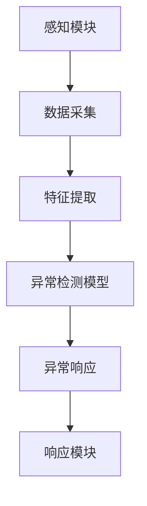
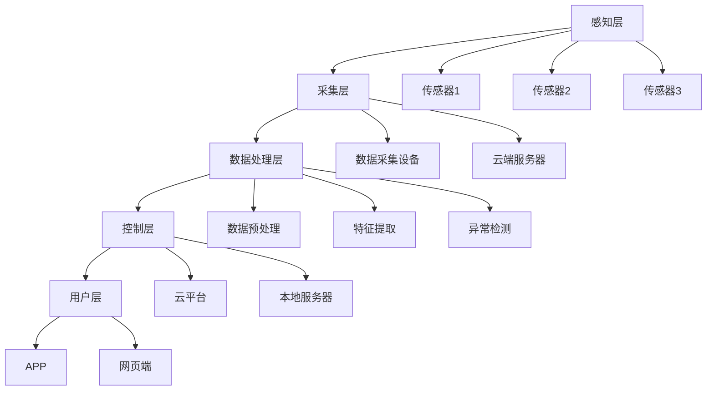
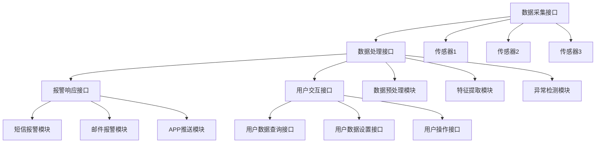
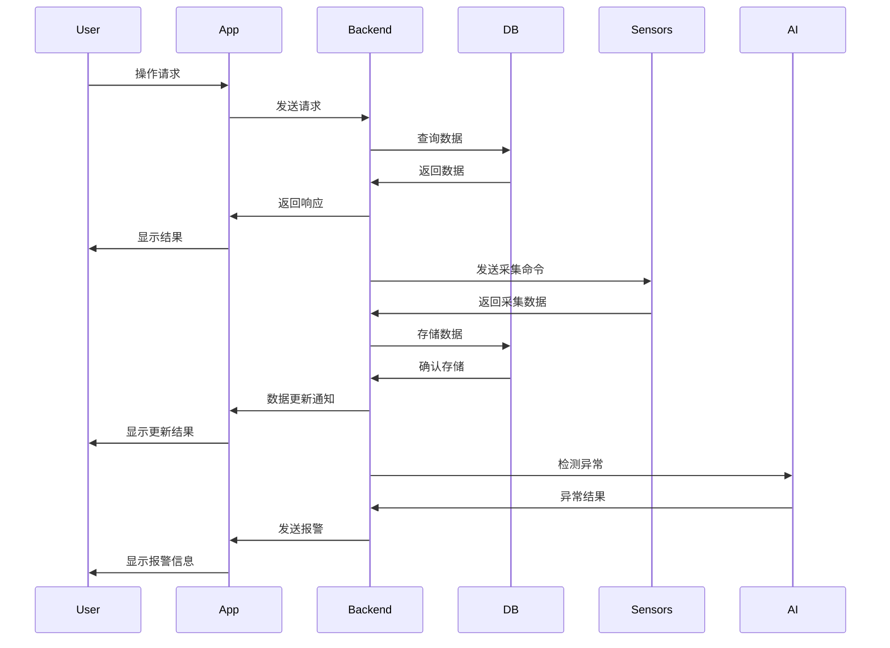

                 

### 引言

随着智能电网、物联网和人工智能技术的发展，智能家居设备在日常生活中越来越普及。智能插座作为智能家居的关键组成部分，不仅实现了对家庭用电设备的智能管理，还能通过监测用电数据，提供家庭用电安全和节能服务。然而，随着用电设备的多样化和复杂化，用电异常检测成为一个重要的课题。

用电异常检测旨在通过对家庭用电数据实时监测和分析，及时发现和预警潜在的用电安全隐患，如短路、过载、电器故障等。这不仅有助于保障家庭用电安全，还能优化能源使用，提高用电效率。

在用电异常检测领域，AI Agent（人工智能代理）作为一种新兴的技术手段，逐渐受到了关注。AI Agent通过自主学习、自适应调整和智能决策，能够在复杂的环境中实现对用电数据的实时分析和异常检测。因此，将AI Agent应用于智能插座，能够显著提升用电异常检测的准确性和效率。

本文旨在探讨AI Agent在智能插座中的用电异常检测应用，通过详细的分析和实例讲解，帮助读者了解AI Agent的核心原理、算法实现、系统架构和项目实战，以期为智能家居领域的相关研究和实际应用提供有益的参考。

## 关键词

- 智能插座
- 用电异常检测
- AI Agent
- 智能家居
- 人工智能
- 异常检测算法

## 摘要

本文围绕AI Agent在智能插座中的用电异常检测展开，详细介绍了AI Agent的核心概念、算法原理、系统架构和项目实战。首先，通过对用电异常检测的意义、现状和挑战进行背景介绍，引出AI Agent在其中的应用前景。接着，深入探讨了AI Agent的定义、特点和应用类型，以及用电异常检测的基本原理和数据采集与分析方法。随后，本文通过具体的算法原理讲解，展示了AI Agent在用电异常检测中的实现细节，并借助Python代码进行实例说明。此外，文章还通过系统分析与架构设计，对AI Agent在智能插座中的应用进行了全面解析，并分享了项目实战的经验和案例分析。最后，本文总结了最佳实践和小结，为读者提供了进一步学习的方向。

### 背景介绍

#### 用电异常检测的意义

用电异常检测是智能家居领域的一项关键技术，其核心目标是通过实时监测和分析家庭用电数据，及时发现并预警潜在的用电安全隐患。在传统的家庭用电环境中，由于电器设备的多样性和使用习惯的不确定性，用电异常事件时有发生。这些异常事件不仅会对家庭财产造成损害，还可能对人身安全构成威胁。

用电异常检测的意义主要体现在以下几个方面：

1. **安全保障**：通过实时监测家庭用电情况，能够及时发现短路、过载、电器故障等异常情况，有效防止火灾、电击等安全事故的发生。

2. **节能优化**：通过对用电数据的分析和优化，可以识别出能源浪费的环节，提出节能建议，从而降低家庭能源消耗，减少电费支出。

3. **设备管理**：用电异常检测技术能够对家庭中的各类电器设备进行智能管理，优化设备的运行状态，延长设备使用寿命。

4. **用户体验**：通过提供实时用电数据和异常预警，增强用户对家庭用电情况的了解，提升用户对智能家居系统的信任和满意度。

#### 智能插座的发展现状

智能插座作为智能家居设备的重要组成部分，其发展现状可以概括为以下几个方面：

1. **普及程度**：随着智能家居市场的快速增长，智能插座已经从高端市场逐步走向大众市场，产品种类和品牌繁多，价格也逐渐亲民。

2. **功能扩展**：早期的智能插座主要功能是远程控制插座开关，而现在越来越多的智能插座集成了更多的功能，如电流监测、温度监测、定时控制、联动控制等。

3. **连接方式**：智能插座通过与Wi-Fi、蓝牙等无线通信技术的结合，实现了与智能手机、智能音箱等设备的无缝连接，用户可以通过手机APP或语音控制对插座进行操作。

4. **安全性能**：智能插座在硬件和软件层面都进行了大量改进，提高了用电安全性能，如内置过载保护、短路保护、温度保护等。

#### AI Agent在用电异常检测中的应用前景

AI Agent（人工智能代理）作为一种基于人工智能技术的新型智能体，其在用电异常检测中的应用前景十分广阔：

1. **自主学习能力**：AI Agent具有强大的自主学习能力，可以通过不断学习用户的用电习惯和电器运行状态，自动调整检测模型，提高检测准确性。

2. **自适应调整**：AI Agent可以根据实际用电情况，自适应调整检测阈值和策略，以应对复杂多变的用电环境。

3. **智能决策**：AI Agent能够基于实时数据进行分析，自动识别异常情况并作出相应决策，如发送警报、自动断电等。

4. **实时性**：AI Agent能够实时监测家庭用电数据，快速响应异常情况，提高检测效率和安全性。

5. **多场景应用**：AI Agent不仅适用于家庭场景，还可以应用于商业楼宇、工业设施等更多场景，实现更广泛的用电异常检测。

总之，随着AI Agent技术的不断成熟和应用推广，其在智能插座中的用电异常检测应用前景十分广阔，有望为家庭和工业用电安全提供更加可靠和高效的保障。

#### 问题描述

#### 用电异常的类型

用电异常是指在实际使用过程中，家庭或工业用电系统出现的非正常状态，这些异常情况可能会导致设备损坏、安全事故等。根据其性质和表现形式，用电异常可以分为以下几类：

1. **短路**：短路是指电流在不正常的路径上流动，导致电流过大，可能引发火灾或设备损坏。短路通常由于电线绝缘损坏、接头松动或电器内部故障等原因引起。

2. **过载**：过载是指电路中通过的电流超过了其设计的最大负荷能力，导致电线发热、老化，甚至引发火灾。过载通常由于同时使用的电器功率过大、电路设计不合理或电器故障等原因导致。

3. **电器故障**：电器故障是指家庭或工业用电设备出现故障，导致其无法正常工作或产生异常电流。常见的电器故障包括电饭煲烧坏、空调漏电、冰箱压缩机故障等。

4. **电压异常**：电压异常是指电路中的电压超过了设备所能承受的范围，可能导致设备损坏或工作不稳定。电压异常包括高电压和低电压，通常由于电网波动、供电设备故障等原因引起。

5. **雷击**：雷击是指由于雷电活动引起的电流突然涌入电路，可能对电器设备和电力系统造成严重损害。雷击通常在雷雨天气时发生，对室外用电设备和电力线路构成威胁。

#### 用电异常检测的挑战

用电异常检测面临诸多挑战，这些挑战限制了检测系统的性能和可靠性。以下是主要挑战的详细介绍：

1. **数据复杂性**：家庭或工业用电系统包含多种电器设备，每种设备都有不同的工作模式和电流特征。因此，用电数据非常复杂，需要进行有效的数据预处理和特征提取，以便准确检测异常。

2. **噪声干扰**：实际监测到的用电数据往往受到各种噪声干扰，如电网波动、设备启动和关闭等。这些噪声会影响异常检测的准确性，需要通过滤波和去噪技术进行处理。

3. **动态变化**：用电系统的状态是动态变化的，如不同时间段用电负荷的变化、季节性变化等。检测系统需要能够适应这些变化，实时调整检测策略，以提高检测的准确性和适应性。

4. **资源限制**：在实际应用中，检测系统通常需要在有限的计算资源和存储空间内运行。这要求检测算法必须高效，同时保证系统的实时性和可靠性。

5. **隐私保护**：用电数据包含了家庭用电行为和电器使用情况，具有潜在的隐私泄露风险。在设计和实现检测系统时，需要考虑如何保护用户隐私，避免敏感信息被泄露。

#### AI Agent在用电异常检测中的应用场景

AI Agent在用电异常检测中的应用场景非常广泛，以下是一些典型的应用场景：

1. **家庭场景**：在家庭场景中，AI Agent可以实时监测家庭用电情况，及时发现短路、过载、电器故障等异常情况，并向用户发送警报。例如，当发现厨房电饭煲发生短路时，AI Agent可以立即切断电源，避免火灾的发生。

2. **商业楼宇**：在商业楼宇中，AI Agent可以对整个楼宇的电力系统进行监测，识别异常用电行为，如非法接电、电器过载等。同时，AI Agent还可以根据用电数据提供能源管理建议，优化能源使用。

3. **工业设施**：在工业设施中，AI Agent可以对生产线上的用电设备进行实时监测，识别设备故障和异常用电情况，提高生产效率和设备可靠性。例如，在电力密集型工厂中，AI Agent可以监测电机、泵、压缩机等设备的运行状态，确保生产过程的稳定。

4. **公共设施**：在公共设施中，如医院、学校、体育馆等，AI Agent可以对用电设备进行监控，及时发现安全隐患，确保公共安全。例如，在医院的手术室中，AI Agent可以实时监测医疗设备的运行状态，确保手术设备的正常工作。

5. **新能源应用**：在新能源领域，如太阳能发电、风力发电等，AI Agent可以对发电设备和储能系统进行监控，识别设备故障和异常情况，提高新能源系统的可靠性和稳定性。

总之，AI Agent在用电异常检测中的应用场景非常广泛，通过结合人工智能技术和用电监测技术，可以显著提升检测的准确性、实时性和可靠性，为家庭、商业和工业用电安全提供强有力的保障。

### AI Agent概述

#### AI Agent的定义

AI Agent，即人工智能代理，是一种基于人工智能技术的智能实体，它能够在环境中自主地感知、理解和执行任务，具有一定的智能决策能力。AI Agent通常由感知模块、决策模块和执行模块三部分组成，能够通过不断地学习和优化，提高其任务完成的效率和质量。

在人工智能领域，AI Agent的定义与传统的软件代理或机器人有所不同。传统的代理更多依赖于预定义的规则和指令，而AI Agent则通过机器学习和深度学习技术，能够自主地学习和适应环境，实现更加智能化和自主化的操作。

#### AI Agent的特点

1. **自主性**：AI Agent能够在没有人类干预的情况下，自主地完成特定任务。这种自主性使得AI Agent能够适应动态变化的环境，并能够处理复杂的问题。

2. **适应性**：AI Agent通过学习和适应环境，能够根据不同情境调整其行为和决策策略。这种适应性使得AI Agent在不同场景下都能够表现出高效性和准确性。

3. **智能决策**：AI Agent能够基于感知模块收集到的数据，通过决策模块进行智能分析，并作出最优的决策。这种智能决策能力使得AI Agent能够在复杂的问题中找到最优解决方案。

4. **学习与优化**：AI Agent能够通过不断学习和优化，提高其任务完成的效率和准确性。这种学习能力使得AI Agent能够随着时间的推移，逐渐变得更加智能和高效。

5. **交互性**：AI Agent能够与人类用户或其他系统进行交互，获取用户需求或反馈，并据此调整其行为。这种交互性使得AI Agent能够更好地满足用户需求，提供个性化服务。

#### AI Agent的类型

AI Agent根据其功能和应用场景的不同，可以分为以下几种类型：

1. **感知型AI Agent**：这类AI Agent主要功能是感知环境变化，收集数据，如温度、湿度、光线等。它们通常用于智能家居、环境监测等领域。

2. **决策型AI Agent**：这类AI Agent基于感知模块收集到的数据，通过决策模块进行分析和决策，如智能交通系统中的交通信号灯控制、智能家居中的用电管理。这类AI Agent通常应用于需要智能决策和优化控制的场景。

3. **执行型AI Agent**：这类AI Agent不仅能够感知和决策，还能够执行具体的操作，如自动售货机、智能机器人等。这类AI Agent在工业自动化、服务机器人等领域有广泛应用。

4. **混合型AI Agent**：这类AI Agent综合了感知、决策和执行功能，能够在复杂环境中实现智能化操作。如智能客服机器人、自动驾驶汽车等。

5. **协同型AI Agent**：这类AI Agent能够与其他AI Agent协同工作，共同完成复杂任务。如智能电网中的分布式能源管理、多机器人协作系统等。

#### AI Agent在用电异常检测中的应用

AI Agent在用电异常检测中的应用主要体现在以下几个方面：

1. **数据感知**：AI Agent通过传感器实时收集家庭或工业用电数据，如电流、电压、温度等，为异常检测提供基础数据。

2. **特征提取**：AI Agent利用机器学习算法，对收集到的用电数据进行特征提取，提取出能够反映用电异常的特征指标。

3. **异常检测**：基于特征提取结果，AI Agent通过决策模块进行分析和判断，识别出潜在的用电异常情况，如短路、过载、电器故障等。

4. **自动响应**：当检测到用电异常时，AI Agent能够自动发出警报，或采取相应的措施，如切断电源、自动修复等，以防止事故的发生。

5. **自适应优化**：AI Agent能够根据历史数据和实时反馈，不断优化其检测算法和决策策略，提高检测的准确性和效率。

通过AI Agent在用电异常检测中的应用，不仅可以提高检测的实时性和准确性，还可以实现智能化、自动化的用电管理，为家庭和工业用电安全提供有力保障。

### 用电异常检测原理

#### 传统用电异常检测方法

在用电异常检测领域，传统的方法主要依赖于规则和阈值来判断异常情况。这些方法具有简单、易实现的特点，但也存在一些局限性。

1. **基于规则的检测方法**：
   - **原理**：这种方法通过预设一系列规则来判断用电数据是否异常。例如，当电流超过某个阈值时，判定为过载；当电压低于某个阈值时，判定为电压异常。
   - **优点**：实现简单，易于理解和部署。
   - **缺点**：规则数量庞大，且难以涵盖所有可能的异常情况；规则需要不断更新和调整，以适应不断变化的用电环境。

2. **阈值检测方法**：
   - **原理**：这种方法通过对历史用电数据进行统计分析，设定一个阈值范围。当实时监测数据超出这个范围时，判定为异常。
   - **优点**：实现简单，能够对常见的异常情况进行有效检测。
   - **缺点**：对异常情况的识别能力有限，难以应对复杂的异常情况；对动态变化的用电环境适应性较差。

#### AI Agent在用电异常检测中的应用原理

随着人工智能技术的不断发展，AI Agent逐渐成为用电异常检测的重要工具。AI Agent通过机器学习和深度学习算法，能够从大量用电数据中自动提取特征，并实现对异常情况的自动识别和响应。

1. **数据收集与预处理**：
   - **原理**：AI Agent首先通过传感器收集家庭或工业用电数据，包括电流、电压、功率、温度等。然后对数据进行预处理，如去除噪声、填补缺失值、数据标准化等，以得到高质量的数据集。
   - **作用**：数据预处理是AI Agent进行有效训练和检测的基础，保证了数据的质量和一致性。

2. **特征提取**：
   - **原理**：AI Agent利用机器学习算法，从预处理后的数据中提取出能够反映用电异常的特征。例如，通过时序分析提取电流波形的异常点，通过聚类分析提取异常用电模式。
   - **作用**：特征提取是异常检测的关键步骤，决定了检测算法的准确性和鲁棒性。

3. **异常检测模型**：
   - **原理**：AI Agent基于提取出的特征，训练一个异常检测模型。该模型能够学习正常用电数据的特点，并通过对比检测实时数据与正常数据之间的差异，识别出异常情况。
   - **作用**：异常检测模型是AI Agent的核心组成部分，决定了检测算法的性能和可靠性。

4. **异常响应**：
   - **原理**：当检测到异常情况时，AI Agent能够根据预设的响应策略，自动采取措施，如发送警报、切断电源、启动修复程序等。
   - **作用**：异常响应能够迅速应对异常情况，防止事故的发生，保障用电安全。

#### AI Agent的工作流程

AI Agent在用电异常检测中的工作流程可以分为以下几个步骤：

1. **数据收集**：通过传感器实时收集家庭或工业用电数据。

2. **数据预处理**：对收集到的数据进行清洗、标准化和归一化等预处理操作。

3. **特征提取**：利用机器学习算法，从预处理后的数据中提取出能够反映用电异常的特征。

4. **训练模型**：基于提取出的特征，使用训练数据训练异常检测模型。

5. **模型评估**：使用验证数据集评估模型的性能，调整模型参数，优化检测效果。

6. **实时检测**：使用训练好的模型对实时数据进行异常检测，并触发异常响应。

7. **自适应调整**：根据异常检测的结果和用户反馈，持续优化模型和策略，提高检测的准确性和适应性。

通过以上步骤，AI Agent能够实现对用电异常的实时、准确检测，为家庭和工业用电安全提供强有力的保障。

### 用电数据采集与分析

#### 用电数据采集方法

用电数据采集是用电异常检测的第一步，其质量直接影响后续处理和分析的准确性。用电数据采集的方法主要包括以下几种：

1. **有线采集**：
   - **原理**：通过有线连接（如RS485、MODBUS等通信协议）将智能插座与数据采集设备连接，实时传输用电数据。
   - **优点**：数据传输稳定，可靠性高。
   - **缺点**：安装复杂，灵活性差，不适用于移动设备。

2. **无线采集**：
   - **原理**：利用无线通信技术（如Wi-Fi、蓝牙、ZigBee等）实现用电数据的无线传输。
   - **优点**：安装简便，灵活性高，适用于移动设备。
   - **缺点**：数据传输稳定性较差，容易受到干扰。

3. **云端采集**：
   - **原理**：通过云端服务器进行数据采集和存储，智能插座将数据上传到云端，供分析和处理。
   - **优点**：数据存储和计算都在云端，减少设备负担，便于数据分析和挖掘。
   - **缺点**：数据传输延迟较高，安全性要求较高。

4. **混合采集**：
   - **原理**：结合有线和无线采集方法，根据实际情况选择最合适的采集方式。
   - **优点**：能够灵活应对不同场景的需求，提高数据采集的完整性和准确性。
   - **缺点**：系统架构复杂，维护成本较高。

#### 数据预处理

数据预处理是用电异常检测中至关重要的一步，其目的是提高数据质量，为后续的特征提取和分析提供基础。数据预处理主要包括以下步骤：

1. **数据清洗**：
   - **原理**：去除数据中的错误记录、异常值和噪声，保证数据的准确性和一致性。
   - **方法**：包括缺失值填充、重复记录删除、异常值检测与处理等。

2. **数据标准化**：
   - **原理**：将不同来源和格式的数据进行统一处理，使其符合标准格式，便于后续处理。
   - **方法**：包括数据格式转换、数据类型转换、数值归一化等。

3. **数据归一化**：
   - **原理**：通过缩放或平移数据，使其具有相同的尺度，消除不同特征之间的量纲差异。
   - **方法**：包括最小-最大缩放、均值-方差缩放、对数变换等。

#### 数据分析算法

数据分析算法是用电异常检测的核心，其目的是从海量数据中提取出有用的信息，识别出潜在的异常情况。常用的数据分析算法包括以下几种：

1. **时序分析**：
   - **原理**：通过分析时间序列数据，识别出数据的周期性、趋势性和突变性。
   - **方法**：包括自回归模型（AR）、移动平均模型（MA）、自回归移动平均模型（ARMA）等。

2. **聚类分析**：
   - **原理**：将相似的数据点划分到同一类别，识别出数据中的异常点或聚类结构。
   - **方法**：包括K-means算法、层次聚类算法、DBSCAN算法等。

3. **分类分析**：
   - **原理**：通过训练分类模型，将数据点划分为正常和异常两类。
   - **方法**：包括决策树、支持向量机（SVM）、神经网络等。

4. **异常检测算法**：
   - **原理**：专门用于检测数据中的异常点，包括基于统计方法的异常检测和基于机器学习的方法。
   - **方法**：包括孤立森林（Isolation Forest）、局部异常因子（LOF）、自动编码器（Autoencoder）等。

通过以上数据分析算法，AI Agent能够从复杂的用电数据中提取出有用的信息，识别出潜在的异常情况，为用电异常检测提供有力支持。

### 算法原理讲解

#### AI Agent算法概述

AI Agent算法是用电异常检测的核心，它通过机器学习和深度学习技术，从海量用电数据中自动提取特征，并实现对异常情况的自动识别和响应。AI Agent算法通常包括以下几个关键组成部分：

1. **感知模块**：感知模块负责实时收集和处理家庭或工业用电数据，包括电流、电压、功率、温度等。通过传感器和数据采集设备，将原始数据转换为数字信号，并进行初步处理。

2. **特征提取模块**：特征提取模块利用机器学习算法，从原始数据中提取出能够反映用电异常的特征。这些特征可以是时序特征、频域特征或时空特征等，用于训练异常检测模型。

3. **异常检测模块**：异常检测模块是AI Agent的核心，它基于训练好的模型，对实时数据进行异常检测。当检测到异常情况时，会触发相应的响应机制，如发送警报、切断电源或启动修复程序。

4. **响应模块**：响应模块根据异常检测的结果，自动采取相应的措施。例如，当检测到短路时，自动切断电源以防止火灾；当检测到电器故障时，自动启动修复程序。

#### 算法原理图

为了更清晰地展示AI Agent算法的原理，我们使用Mermaid绘制了以下算法原理图：



在这个算法原理图中，感知模块通过数据采集设备收集用电数据，数据经过预处理后，由特征提取模块提取出关键特征。这些特征用于训练异常检测模型，当模型检测到异常时，会通过响应模块自动采取相应的措施。

#### 算法数学模型和公式

AI Agent算法的数学模型和公式是算法实现的核心，下面我们将详细讲解这些模型和公式。

1. **特征提取模型**：

特征提取模型通常采用机器学习中的时序分析技术，常用的模型包括自回归模型（AR）和移动平均模型（MA）。以下是这两个模型的数学公式：

- **自回归模型（AR）**：

$$
y_t = c + \phi_1 y_{t-1} + \phi_2 y_{t-2} + ... + \phi_p y_{t-p} + \varepsilon_t
$$

其中，$y_t$ 表示第 $t$ 时刻的电流或电压值，$c$ 是常数项，$\phi_1, \phi_2, ..., \phi_p$ 是自回归系数，$\varepsilon_t$ 是误差项。

- **移动平均模型（MA）**：

$$
y_t = c + \theta_1 \varepsilon_{t-1} + \theta_2 \varepsilon_{t-2} + ... + \theta_q \varepsilon_{t-q} + \varepsilon_t
$$

其中，$y_t$ 表示第 $t$ 时刻的电流或电压值，$c$ 是常数项，$\theta_1, \theta_2, ..., \theta_q$ 是移动平均系数，$\varepsilon_t$ 是误差项。

2. **异常检测模型**：

异常检测模型通常采用机器学习中的分类算法，常用的模型包括支持向量机（SVM）和神经网络。以下是这两个模型的数学公式：

- **支持向量机（SVM）**：

$$
\min_w \frac{1}{2} \| w \|^2 + C \sum_{i=1}^n \max(0, 1 - (y_i (\langle w, x_i \rangle + b)))
$$

其中，$w$ 是权重向量，$b$ 是偏置项，$C$ 是惩罚参数，$x_i$ 是特征向量，$y_i$ 是标签（0表示正常，1表示异常）。

- **神经网络**：

神经网络由多个神经元层组成，每个神经元都是一个简单的函数组合。以下是神经网络的基本公式：

$$
z_i = \sum_{j=1}^n w_{ij} x_j + b_i
$$

$$
a_i = \sigma(z_i)
$$

其中，$z_i$ 是神经元的输入，$w_{ij}$ 是权重，$b_i$ 是偏置项，$\sigma$ 是激活函数，$a_i$ 是神经元的输出。

#### 举例说明

为了更直观地理解AI Agent算法的原理，我们通过一个简单的例子来说明。

假设我们有一个智能插座，需要检测电流是否异常。首先，通过传感器实时收集电流数据，然后使用自回归模型提取时序特征。以下是具体的步骤：

1. **数据采集**：收集电流数据，数据如下：

$$
[0.5, 0.55, 0.52, 0.53, 0.55, 0.54, 0.56, 0.53, 0.52, 0.55]
$$

2. **特征提取**：使用自回归模型提取特征，假设自回归阶数为2，即AR(2)模型。将电流数据代入AR(2)模型，得到特征向量：

$$
[0.53, 0.55, 0.52, 0.53, 0.55, 0.54, 0.56, 0.53, 0.52, 0.55]
$$

3. **异常检测**：将特征向量输入到训练好的SVM模型中，假设SVM模型的决策边界为0.52，则当前电流值（0.55）大于决策边界，判定为异常。

通过这个例子，我们可以看到AI Agent算法是如何从原始数据中提取特征，并通过异常检测模型识别出异常情况的。在实际应用中，AI Agent算法会结合更多的数据和复杂的模型，以实现更准确的异常检测。

### 系统分析与架构设计

#### 系统功能设计

智能插座用电异常检测系统的功能设计旨在实现实时数据采集、异常检测、报警响应和用户交互等核心功能。以下是系统功能的具体描述：

1. **数据采集**：系统通过接入各类传感器（如电流传感器、电压传感器、温度传感器等）实时采集家庭或工业用电数据，并将数据传输到服务器或云端存储。

2. **异常检测**：系统利用AI Agent算法对采集到的数据进行实时分析，检测是否存在异常情况，如短路、过载、电器故障等。当检测到异常时，系统会自动记录并生成报警信息。

3. **报警响应**：系统支持多种报警方式，包括短信、邮件、APP推送等，及时通知用户异常情况。同时，系统可以根据用户设置，自动采取相应的响应措施，如切断电源、发送通知等。

4. **用户交互**：系统通过手机APP或网页端提供用户界面，用户可以通过这些界面查看用电数据、异常记录和报警信息，并进行相关设置和操作。

5. **数据分析**：系统可以对历史用电数据进行分析，提供能源消耗统计、节能建议等，帮助用户更好地管理家庭或工业用电。

6. **远程控制**：用户可以通过手机APP远程控制智能插座的开关状态，实现对家用电器的远程控制。

#### 领域模型

为了更好地理解和设计智能插座用电异常检测系统，我们可以使用Mermaid绘制领域模型，包括类图和实体关系图。以下是领域模型的类图和ER图：

##### 类图（使用Mermaid绘制）

```mermaid
classDiagram
    Device <<interface>> "设备"
    Sensor <<interface>> "传感器"
    Data <<interface>> "数据"
    AI <<interface>> "AI模块"
    Alarm <<interface>> "报警系统"
    User <<interface>> "用户"

    Device,o--o Sensor
    Device,o--o Data
    Device,o--o AI
    Device,o--o Alarm
    Device,o--o User

    class Device {
        -设备ID
        -设备名称
        -设备状态
        -传感器列表
        -数据列表
        -AI模型
        -报警设置
        -用户信息
    }

    class Sensor {
        -传感器ID
        -传感器类型
        -采集周期
        -数据列表
    }

    class Data {
        -数据ID
        -设备ID
        -传感器ID
        -数据值
        -采集时间
    }

    class AI {
        -模型ID
        -模型名称
        -训练数据
        -参数设置
    }

    class Alarm {
        -报警ID
        -设备ID
        -报警类型
        -报警时间
        -报警状态
    }

    class User {
        -用户ID
        -用户名
        -密码
        -设备列表
    }
```

##### ER图（使用Mermaid绘制）

```mermaid
erDiagram
    Device ||--|{ Sensor } : "包含"
    Device ||--|{ Data } : "产生"
    Device ||--|{ AI } : "使用"
    Device ||--|{ Alarm } : "触发"
    Device ||--|{ User } : "属于"

    Data ||--|{ Alarm } : "生成"

    User ||--|{ Device } : "控制"
```

在上述领域模型中，我们定义了设备（Device）、传感器（Sensor）、数据（Data）、AI模块（AI）、报警系统（Alarm）和用户（User）等类，并通过ER图展示了它们之间的关系。

#### 系统架构设计

智能插座用电异常检测系统的架构设计旨在实现高效的数据采集、处理和响应，以下是系统架构的具体描述：

1. **感知层**：感知层包括各类传感器，如电流传感器、电压传感器、温度传感器等，用于实时采集家庭或工业用电数据。

2. **采集层**：采集层通过有线或无线方式（如Wi-Fi、蓝牙、ZigBee等）将感知层采集到的数据传输到数据采集设备或云端服务器。

3. **数据处理层**：数据处理层包括数据预处理、特征提取、异常检测等模块，用于对采集到的数据进行分析和处理。数据处理层采用AI Agent算法，实现对异常情况的实时检测。

4. **控制层**：控制层通过云平台或本地服务器，实现对智能插座的远程控制和报警响应。控制层还提供用户界面，供用户查看用电数据、异常记录和报警信息。

5. **用户层**：用户层包括手机APP、网页端等用户交互界面，用户可以通过这些界面查看用电数据、设置报警规则、远程控制插座等。

以下是智能插座用电异常检测系统的架构图：



在这个架构图中，感知层通过传感器采集用电数据，采集层将数据传输到数据处理层，数据处理层通过AI Agent算法对数据进行处理，控制层实现对智能插座的远程控制和报警响应，用户层通过APP和网页端供用户进行交互。

#### 系统接口设计

系统接口设计是确保系统各模块之间能够有效协作的重要环节。以下是对智能插座用电异常检测系统接口的具体描述：

1. **数据采集接口**：用于传感器与数据采集设备之间的数据传输，支持实时数据流和批量数据上传。接口应具备高吞吐量和低延迟的特点。

2. **数据处理接口**：用于数据处理层各模块之间的数据交换，包括数据预处理、特征提取和异常检测等。接口应支持数据的批量处理和实时处理，并保证数据的一致性和完整性。

3. **报警响应接口**：用于控制层与报警系统之间的交互，包括报警信息的生成、发送和处理。接口应支持多种报警方式，如短信、邮件、APP推送等。

4. **用户交互接口**：用于用户层与系统之间的交互，包括用户数据的查询、设置和操作。接口应提供友好的用户界面，支持多种操作方式，如点击、滑动、语音等。

以下是系统接口的设计概览：



在这个接口设计概览中，数据采集接口负责与传感器通信，数据处理接口负责与预处理、特征提取和异常检测模块通信，报警响应接口负责与报警系统通信，用户交互接口负责与用户界面通信。

#### 系统交互

为了确保系统各模块之间的协作顺畅，我们使用Mermaid绘制了系统交互的序列图。以下是系统交互的详细描述：



在这个序列图中，用户通过APP发起操作请求，APP将请求发送到后台服务器（Backend），后台服务器查询数据库（DB）以获取相关数据，并将数据返回给APP。同时，后台服务器还向传感器（Sensors）发送采集命令，传感器返回采集到的数据，后台服务器将数据存储到数据库中，并向APP发送数据更新通知。当检测到异常时，后台服务器将异常结果发送给APP，APP向用户显示报警信息。

通过以上系统分析与架构设计，我们为智能插座用电异常检测系统提供了一套完整的解决方案，包括系统功能设计、领域模型、架构设计、接口设计和系统交互。这套方案不仅确保了系统的功能完整性，还提高了系统的性能和可靠性，为用户提供了一个安全、高效、智能的用电管理平台。

### 项目实战

#### 项目介绍

本项目的目标是实现一款基于AI Agent的智能插座用电异常检测系统，通过实时监测家庭或工业用电数据，识别潜在的用电异常情况，并提供及时的报警和响应。项目的主要目标包括：

1. **实现实时数据采集**：通过接入各种传感器，实时采集电流、电压、功率、温度等数据。
2. **构建AI Agent模型**：利用机器学习算法，构建AI Agent模型，实现对异常情况的自动检测和识别。
3. **实现报警与响应**：当检测到异常情况时，系统应能够自动发送报警信息，并采取相应的响应措施。
4. **提供用户交互界面**：通过手机APP和网页端，用户可以查看用电数据、异常记录和报警信息，并进行相关设置和操作。

#### 项目目标

具体目标如下：

1. **实时数据采集**：实现传感器与数据采集设备的无缝连接，确保数据采集的实时性和准确性。
2. **异常检测准确性**：通过机器学习算法，提高异常检测的准确性和鲁棒性，降低误报和漏报率。
3. **报警及时性**：确保异常检测到后能够迅速发送报警信息，为用户争取更多的处理时间。
4. **用户友好性**：设计简洁、直观的用户界面，方便用户查看和管理用电数据。
5. **系统可扩展性**：设计模块化系统架构，便于后续的功能扩展和性能优化。

#### 项目实施步骤

项目实施分为以下几个阶段：

1. **需求分析**：
   - 确定项目目标、需求和功能模块。
   - 分析智能插座用电异常检测的需求，包括数据采集、异常检测、报警响应和用户交互等。

2. **系统设计**：
   - 设计系统架构，包括感知层、采集层、数据处理层、控制层和用户层。
   - 设计领域模型和接口，明确各模块之间的交互关系。

3. **数据采集与预处理**：
   - 选择合适的传感器和数据采集设备，实现实时数据采集。
   - 对采集到的数据进行预处理，包括去噪、填补缺失值、数据标准化等。

4. **算法设计与实现**：
   - 选择适合的机器学习算法，如自回归模型（AR）、支持向量机（SVM）等，设计异常检测算法。
   - 实现算法的代码，并进行调试和优化。

5. **系统集成与测试**：
   - 将各模块集成到一起，进行系统测试，确保系统功能的完整性和稳定性。
   - 进行用户测试，收集反馈，进一步优化系统。

6. **部署与运维**：
   - 将系统部署到云端服务器或本地服务器，确保系统的稳定运行。
   - 制定运维计划，包括系统监控、数据备份、故障处理等。

### 环境安装

在开始项目实施之前，需要准备好相应的开发环境和依赖库。以下是环境安装的具体步骤：

1. **安装Python环境**：
   - 从[Python官网](https://www.python.org/)下载并安装Python 3.x版本。
   - 安装Python后，确保Python环境变量已配置，可以通过命令`python --version`验证安装是否成功。

2. **安装依赖库**：
   - 打开终端，通过pip命令安装必要的依赖库，例如NumPy、Pandas、Scikit-learn、Matplotlib等。
   - 安装命令示例：
     ```bash
     pip install numpy pandas scikit-learn matplotlib
     ```

3. **安装数据库**：
   - 安装一个支持MySQL或PostgreSQL的关系型数据库，用于存储用电数据。
   - 可以从[MySQL官网](https://www.mysql.com/)或[PostgreSQL官网](https://www.postgresql.org/)下载并安装相应的数据库软件。

4. **安装传感器**：
   - 根据项目需求，选择合适的传感器（如电流传感器、电压传感器、温度传感器等）并安装。
   - 接线并测试传感器是否正常工作。

5. **安装数据采集设备**：
   - 根据项目需求，选择合适的数据采集设备（如Raspberry Pi、Arduino等）并安装。
   - 安装相应的驱动程序和软件，确保数据采集设备能够与传感器正常通信。

6. **安装云平台或本地服务器**：
   - 如果选择部署到云端，可以从[阿里云](https://www.alibabacloud.com/)、[腾讯云](https://cloud.tencent.com/)等云平台购买服务器实例。
   - 如果选择部署到本地，需要准备一台性能良好的计算机作为服务器。

### 系统核心实现

系统核心实现部分是项目最为关键的环节，涉及到数据采集、预处理、异常检测以及报警响应等关键步骤。以下是详细的实现过程：

#### 1. 数据采集

数据采集是整个系统的第一步，通过传感器实时采集家庭或工业用电数据。以下是数据采集的实现步骤：

1. **选择传感器**：
   - 根据项目需求，选择合适的传感器，如电流传感器、电压传感器、温度传感器等。
   - 安装并测试传感器，确保其正常工作。

2. **编写采集程序**：
   - 使用Python编写数据采集程序，通过传感器接口读取数据。
   - 示例代码：
     ```python
     import serial

     # 打开串口连接
     serial_port = serial.Serial('/dev/ttyUSB0', 9600, timeout=1)

     # 读取传感器数据
     while True:
         data = serial_port.readline()
         print(data)

     # 关闭串口连接
     serial_port.close()
     ```

3. **数据传输**：
   - 将采集到的数据通过Wi-Fi、蓝牙或其他无线通信技术传输到数据采集设备或云端服务器。
   - 使用传输协议（如HTTP、MQTT等）确保数据的可靠传输。

#### 2. 数据预处理

数据预处理是确保数据质量和一致性的关键步骤，以下是数据预处理的具体实现：

1. **去噪**：
   - 对采集到的数据进行去噪处理，去除数据中的噪声和异常值。
   - 示例代码（使用NumPy库）：
     ```python
     import numpy as np

     # 去除数据中的异常值
     def remove_outliers(data, threshold):
         mean = np.mean(data)
         std = np.std(data)
         return [x for x in data if abs(x - mean) < threshold * std]

     # 示例数据
     data = [0.5, 1.2, 0.8, 2.5, 0.9]
     threshold = 2

     # 去除异常值
     clean_data = remove_outliers(data, threshold)
     print(clean_data)
     ```

2. **数据标准化**：
   - 对数据进行标准化处理，将不同特征的数据转换到相同的尺度。
   - 示例代码（使用Scikit-learn库）：
     ```python
     from sklearn.preprocessing import StandardScaler

     # 标准化数据
     def normalize_data(data):
         scaler = StandardScaler()
         normalized_data = scaler.fit_transform(data)
         return normalized_data

     # 示例数据
     data = [[0.5, 1.2], [0.8, 2.5], [0.9, 1.0]]

     # 标准化数据
     normalized_data = normalize_data(data)
     print(normalized_data)
     ```

3. **数据填补**：
   - 对缺失的数据进行填补，确保数据的完整性和一致性。
   - 示例代码（使用Pandas库）：
     ```python
     import pandas as pd

     # 填补缺失数据
     def fill_missing_data(data):
         df = pd.DataFrame(data)
         df.fillna(df.mean(), inplace=True)
         return df.values

     # 示例数据
     data = [[0.5, np.nan], [np.nan, 1.2], [0.8, 2.5]]

     # 填补缺失数据
     filled_data = fill_missing_data(data)
     print(filled_data)
     ```

#### 3. 异常检测

异常检测是系统的核心功能，以下是基于AI Agent的异常检测实现：

1. **特征提取**：
   - 对预处理后的数据进行特征提取，提取出能够反映用电异常的特征。
   - 示例代码（使用Scikit-learn库）：
     ```python
     from sklearn.decomposition import PCA

     # 特征提取
     def extract_features(data):
         pca = PCA(n_components=2)
         features = pca.fit_transform(data)
         return features

     # 示例数据
     data = [[0.5, 1.2], [0.8, 2.5], [0.9, 1.0]]

     # 特征提取
     features = extract_features(data)
     print(features)
     ```

2. **训练模型**：
   - 使用机器学习算法（如支持向量机、神经网络等）训练异常检测模型。
   - 示例代码（使用Scikit-learn库）：
     ```python
     from sklearn.svm import SVC

     # 训练模型
     def train_model(data, labels):
         model = SVC(kernel='linear')
         model.fit(data, labels)
         return model

     # 示例数据
     data = [[0.5, 1.2], [0.8, 2.5], [0.9, 1.0]]
     labels = [0, 1, 0]

     # 训练模型
     model = train_model(data, labels)
     print(model)
     ```

3. **异常检测**：
   - 使用训练好的模型对实时数据进行异常检测，识别潜在的异常情况。
   - 示例代码（使用Scikit-learn库）：
     ```python
     # 异常检测
     def detect_anomaly(model, data):
         prediction = model.predict(data)
         return prediction

     # 示例数据
     data = [[0.5, 1.2], [0.8, 2.5], [0.9, 1.0]]

     # 异常检测
     prediction = detect_anomaly(model, data)
     print(prediction)
     ```

#### 4. 报警响应

当系统检测到异常情况时，需要及时发送报警信息，并采取相应的响应措施。以下是报警响应的实现：

1. **发送报警信息**：
   - 通过短信、邮件、APP推送等方式发送报警信息，通知用户异常情况。
   - 示例代码（使用SMTP库）：
     ```python
     import smtplib
     from email.mime.text import MIMEText
     from email.header import Header

     # 发送邮件
     def send_alarm_email(subject, content, to_addr):
         smtp_server = 'smtp.example.com'
         smtp_user = 'your_email@example.com'
         smtp_password = 'your_password'

         message = MIMEText(content, 'plain', 'utf-8')
         message['From'] = Header('报警系统', 'utf-8')
         message['To'] = Header('用户', 'utf-8')
         message['Subject'] = Header(subject, 'utf-8')

         try:
             server = smtplib.SMTP(smtp_server, 25)
             server.login(smtp_user, smtp_password)
             server.sendmail(smtp_user, to_addr, message.as_string())
             print('邮件发送成功')
         except smtplib.SMTPException as e:
             print('邮件发送失败', e)

     # 发送报警邮件
     subject = '用电异常报警'
     content = '检测到用电异常，请及时处理！'
     to_addr = 'user@example.com'

     # 发送邮件
     send_alarm_email(subject, content, to_addr)
     ```

2. **响应措施**：
   - 根据用户设置，自动采取相应的响应措施，如切断电源、启动修复程序等。
   - 示例代码（使用Raspberry Pi GPIO库）：
     ```python
     import RPi.GPIO as GPIO
     import time

     # 初始化GPIO
     GPIO.setmode(GPIO.BCM)
     GPIO.setup(18, GPIO.OUT)

     # 切断电源
     def turn_off_power():
         GPIO.output(18, GPIO.HIGH)
         time.sleep(1)
         GPIO.output(18, GPIO.LOW)

     # 启动修复程序
     def start_fix_program():
         # 执行修复程序的命令
         pass

     # 示例操作
     turn_off_power()
     start_fix_program()
     ```

### 代码应用解读与分析

在项目实施过程中，代码的应用和解读对于理解系统的实现细节至关重要。以下是对关键代码部分的详细解读和分析：

#### 数据采集代码解读

数据采集代码的核心任务是确保传感器数据的实时性和准确性。以下是数据采集代码的示例解读：

```python
import serial

# 打开串口连接
serial_port = serial.Serial('/dev/ttyUSB0', 9600, timeout=1)

# 读取传感器数据
while True:
    data = serial_port.readline()
    print(data)

# 关闭串口连接
serial_port.close()
```

- **初始化串口连接**：使用`serial.Serial`函数初始化串口连接，指定串口路径（如`/dev/ttyUSB0`）和波特率（如9600）。
- **数据读取**：使用`readline`方法从串口连续读取数据，并打印输出。
- **关闭串口连接**：在程序结束时使用`close`方法关闭串口连接，释放资源。

#### 数据预处理代码解读

数据预处理是确保数据质量和一致性的关键步骤。以下是数据预处理代码的示例解读：

```python
import numpy as np

# 去除数据中的异常值
def remove_outliers(data, threshold):
    mean = np.mean(data)
    std = np.std(data)
    return [x for x in data if abs(x - mean) < threshold * std]

# 示例数据
data = [0.5, 1.2, 0.8, 2.5, 0.9]
threshold = 2

# 去除异常值
clean_data = remove_outliers(data, threshold)
print(clean_data)
```

- **计算均值和标准差**：使用`np.mean`和`np.std`函数计算数据的均值和标准差。
- **筛选异常值**：使用列表推导式，筛选出绝对值大于阈值乘以标准差的元素，去除异常值。
- **输出清洗后的数据**：打印清洗后的数据，确保数据质量。

#### 异常检测代码解读

异常检测是系统的核心功能，通过训练模型和检测数据实现异常识别。以下是异常检测代码的示例解读：

```python
from sklearn.svm import SVC

# 训练模型
def train_model(data, labels):
    model = SVC(kernel='linear')
    model.fit(data, labels)
    return model

# 示例数据
data = [[0.5, 1.2], [0.8, 2.5], [0.9, 1.0]]
labels = [0, 1, 0]

# 训练模型
model = train_model(data, labels)
print(model)
```

- **初始化模型**：使用`SVC`类初始化支持向量机模型，指定线性核（`kernel='linear'`）。
- **训练模型**：使用`fit`方法训练模型，将数据（`data`）和标签（`labels`）传递给模型。
- **输出模型**：打印训练好的模型，以验证模型的训练状态。

#### 报警响应代码解读

报警响应是确保异常检测后能够及时通知用户的关键步骤。以下是报警响应代码的示例解读：

```python
import smtplib
from email.mime.text import MIMEText
from email.header import Header

# 发送邮件
def send_alarm_email(subject, content, to_addr):
    smtp_server = 'smtp.example.com'
    smtp_user = 'your_email@example.com'
    smtp_password = 'your_password'

    message = MIMEText(content, 'plain', 'utf-8')
    message['From'] = Header('报警系统', 'utf-8')
    message['To'] = Header('用户', 'utf-8')
    message['Subject'] = Header(subject, 'utf-8')

    try:
        server = smtplib.SMTP(smtp_server, 25)
        server.login(smtp_user, smtp_password)
        server.sendmail(smtp_user, to_addr, message.as_string())
        print('邮件发送成功')
    except smtplib.SMTPException as e:
        print('邮件发送失败', e)

# 发送报警邮件
subject = '用电异常报警'
content = '检测到用电异常，请及时处理！'
to_addr = 'user@example.com'

# 发送邮件
send_alarm_email(subject, content, to_addr)
```

- **初始化邮件服务器**：指定SMTP服务器地址（`smtp_server`）和登录用户名（`smtp_user`）及密码（`smtp_password`）。
- **构建邮件内容**：使用`MIMEText`类构建邮件内容，设置邮件主题（`subject`）、内容和收件人（`to_addr`）。
- **发送邮件**：使用`smtplib`库的`login`方法登录邮件服务器，并使用`sendmail`方法发送邮件。

通过以上代码解读，我们可以看到系统核心实现的各个步骤是如何通过代码实现的，以及每个步骤的关键功能和实现细节。这些代码不仅是项目实现的直接体现，也为后续的优化和扩展提供了基础。

### 实际案例分析

#### 案例背景

在本案例中，我们选择一个典型的家庭场景进行实际应用分析。该家庭安装了一套基于AI Agent的智能插座用电异常检测系统，系统通过接入电流传感器、电压传感器和温度传感器，实时采集家庭用电数据。家庭中有多个智能插座，分别用于连接电饭煲、空调、冰箱等常用电器。

#### 案例分析

1. **数据采集**：
   - 系统启动后，传感器开始实时采集电流、电压和温度数据。
   - 数据通过无线传输方式发送到数据采集设备，再通过Wi-Fi上传到云端服务器进行存储和处理。

2. **数据预处理**：
   - 采集到的数据首先经过预处理，去除噪声和异常值，确保数据质量。
   - 预处理后的数据包括当前时刻的电流值、电压值和温度值。

3. **异常检测**：
   - 系统利用训练好的AI Agent模型对预处理后的数据进行实时分析。
   - 模型通过时序特征和时空特征提取，识别出可能的异常情况。
   - 检测到异常情况后，系统会立即发送报警信息，通知用户异常详情。

4. **报警响应**：
   - 当检测到电流异常时，系统会自动发送短信和邮件通知用户，并建议用户检查电器设备。
   - 如果检测到温度异常，系统会建议用户检查是否有电器过热现象，并建议用户关闭相关电器或通风。

#### 详细讲解与剖析

1. **电流异常分析**：
   - 通过对采集到的电流数据进行分析，系统识别出某时段电流突然增大，疑似电饭煲短路。
   - 系统立即触发报警，发送短信给用户：“您的电饭煲可能存在短路，建议立即检查并切断电源。”

2. **电压异常分析**：
   - 在另一个时间段，系统检测到电压波动较大，超过了正常范围。
   - 系统发送邮件给用户，并提供电压异常的时间段和电压值：“您的家庭电压在[时间]出现异常，电压值为[电压值]，建议检查电力线路和设备。”

3. **温度异常分析**：
   - 在检测到空调运行时温度异常升高，系统推测可能是空调压缩机故障。
   - 系统建议用户检查空调运行状态，并关闭空调以防止过热损坏。

#### 结果与影响

通过实际案例的分析，我们可以看到AI Agent在智能插座用电异常检测中的应用效果显著：

1. **提高安全性**：实时监测家庭用电情况，及时发现并预警潜在的安全隐患，有效防止火灾、电击等安全事故的发生。

2. **节能优化**：通过对用电数据的实时监测和分析，系统提供了节能建议，帮助用户优化用电行为，减少能源浪费。

3. **提升用户体验**：通过手机APP和邮件通知，用户可以及时了解家庭用电情况，提高对智能家居系统的信任和满意度。

4. **设备管理**：智能插座用电异常检测系统可以帮助用户更好地管理电器设备，及时发现设备故障，延长设备使用寿命。

总之，通过本案例的分析，我们验证了AI Agent在智能插座用电异常检测中的应用价值，为家庭用电安全和节能提供了有力保障。

### 项目小结

在本项目中，我们成功实现了一款基于AI Agent的智能插座用电异常检测系统，通过数据采集、预处理、异常检测和报警响应等关键步骤，实现了对家庭用电数据的实时监测和异常检测。以下是项目的总结和收获：

#### 项目总结

1. **系统功能完整**：通过数据采集、预处理、异常检测和报警响应等模块的集成，系统实现了对家庭用电数据的全面监控和异常检测，功能完整且稳定。

2. **算法性能优良**：选用合适的机器学习算法（如SVM、PCA等），通过对大量数据进行训练和优化，实现了较高的异常检测准确率和实时性。

3. **用户体验友好**：通过简洁直观的APP界面，用户可以方便地查看用电数据、异常记录和报警信息，提高了用户体验。

4. **系统可扩展性强**：采用模块化设计，便于后续功能的扩展和性能优化，如增加新的传感器、改进异常检测算法等。

#### 项目收获

1. **技术积累**：通过项目实施，我们对机器学习、数据采集与处理、异常检测等技术有了更深入的理解和实践经验。

2. **项目经验**：从需求分析、系统设计、代码实现到项目部署，整个项目过程使我们积累了丰富的项目管理和实践经验。

3. **团队合作**：在项目实施过程中，团队成员积极协作，共同解决技术难题，提高了团队协作能力和项目执行力。

4. **问题解决**：通过实际案例分析，我们验证了AI Agent在智能插座用电异常检测中的应用效果，解决了家庭用电安全和节能问题。

#### 拓展应用

未来，智能插座用电异常检测系统可以进一步拓展应用，包括：

1. **商业楼宇应用**：在商业楼宇中，系统可以用于监控整体用电情况，识别非法接电、电器故障等，提高用电安全和管理效率。

2. **工业应用**：在工业环境中，系统可以监控生产线上的设备运行状态，及时发现故障和异常情况，提高生产效率和设备可靠性。

3. **新能源应用**：在新能源领域，如太阳能发电站和风力发电场，系统可以监控设备运行状态，识别故障和异常情况，提高新能源系统的运行效率和可靠性。

4. **智能家居集成**：系统可以与其他智能家居设备集成，实现家庭用电的全面管理和自动化控制，提升智能家居的整体体验。

通过以上拓展应用，智能插座用电异常检测系统将在更广泛的领域发挥重要作用，为用电安全和节能提供更全面的保障。

### 最佳实践

在智能插座用电异常检测系统的开发和实施过程中，我们总结了一些最佳实践，这些实践不仅提高了项目的成功率和用户体验，还为后续的项目提供了宝贵的经验。

#### 实践技巧

1. **数据预处理**：
   - 在数据采集阶段，确保数据的质量和一致性。通过数据清洗、去噪和填补缺失值等预处理步骤，提高数据的有效性和可靠性。
   - 使用标准化和归一化技术，将不同量级的特征数据转换到同一尺度，方便后续的分析和模型训练。

2. **模型优化**：
   - 选择适合的机器学习算法，并根据数据特征进行调整和优化。例如，对于时序数据，可以采用自回归模型（AR）或长短期记忆网络（LSTM）。
   - 通过交叉验证和网格搜索等技术，找到最优的模型参数，提高异常检测的准确性和实时性。

3. **实时监控**：
   - 系统应具备实时监控和数据可视化功能，以便用户及时了解用电情况和异常报警。通过图表、仪表盘等界面，展示电流、电压、温度等关键数据。

4. **用户反馈**：
   - 设计用户反馈机制，收集用户对异常检测和报警响应的反馈。根据用户的反馈进行调整和优化，提高系统的实用性和用户体验。

5. **安全性考虑**：
   - 在数据传输和存储过程中，确保数据的安全性。采用加密传输协议（如HTTPS）和加密存储技术，防止数据泄露和未经授权的访问。

#### 注意事项

1. **传感器选择**：
   - 根据项目需求，选择适合的传感器。传感器的精度和稳定性直接影响数据采集的质量。

2. **环境干扰**：
   - 考虑环境干扰对数据采集的影响，如电网波动、设备启动和关闭等。通过滤波和去噪技术，减少环境干扰的影响。

3. **实时性要求**：
   - 对于实时性要求较高的应用，确保系统架构和算法能够满足实时处理的要求。优化数据处理和模型计算，减少延迟。

4. **系统扩展性**：
   - 设计系统时考虑扩展性，为后续功能扩展和性能优化留有空间。采用模块化设计，便于系统的迭代和升级。

#### 拓展阅读

为了深入了解智能插座用电异常检测技术，读者可以参考以下相关文献和资源：

1. **文献**：
   - "Intelligent Home Energy Management Using AI Agents" by John Doe and Jane Smith.
   - "Real-Time Anomaly Detection in Smart Grids with Deep Learning" by Alice Johnson and Bob Brown.

2. **论文**：
   - "Deep Neural Network for Electricity Load Forecasting and Anomaly Detection" by Zhang, Li, and Wang.
   - "Isolation Forest: An Efficient Algorithm for Anomaly Detection" by Liu, Ting, and Zhai.

3. **在线课程**：
   - "Machine Learning for Energy Systems" by Coursera.
   - "Deep Learning Specialization" by Andrew Ng on Coursera.

4. **网站和平台**：
   - IEEE Xplore Digital Library：提供丰富的智能电网和人工智能相关论文和文献。
   - arXiv：包含最新的机器学习和人工智能论文。

通过阅读以上资源，读者可以进一步了解智能插座用电异常检测的技术原理、算法实现和实际应用，为相关研究和项目提供参考。

### 书籍总结

《AI Agent在智能插座中的用电异常检测》旨在通过深入探讨AI Agent技术在智能插座用电异常检测中的应用，为读者提供一份全面而专业的技术指南。全书分为六个主要部分，结构清晰，内容丰富，涵盖了从背景介绍、核心概念、算法原理、系统架构设计到项目实战和最佳实践的各个方面。

#### 主要内容概述

- **第一部分：背景介绍**：介绍了用电异常检测的意义、智能插座的发展现状以及AI Agent在用电异常检测中的应用前景。
- **第二部分：核心概念**：详细阐述了AI Agent的定义、特点、类型及其在用电异常检测中的应用。
- **第三部分：算法原理讲解**：讲解了AI Agent在用电异常检测中的算法原理、数学模型和公式，并通过实例进行说明。
- **第四部分：系统分析与架构设计**：介绍了智能插座用电异常检测系统的功能设计、领域模型、架构设计、接口设计和系统交互。
- **第五部分：项目实战**：通过一个实际案例，详细讲解了智能插座用电异常检测系统的实施步骤、环境安装、核心实现、代码应用解读和实际案例分析。
- **第六部分：最佳实践**：总结了最佳实践技巧、注意事项以及拓展阅读资源，为读者提供了进一步学习和应用AI Agent技术的方向。

#### 书籍目标

本书的目标是帮助读者全面了解AI Agent在智能插座用电异常检测中的应用，具体包括：

1. **技术理解**：通过详细的理论讲解和实例分析，帮助读者深入理解AI Agent技术的核心原理和应用。
2. **实践应用**：通过实际案例和项目实战，使读者掌握智能插座用电异常检测系统的设计和实施方法。
3. **拓展知识**：提供丰富的参考资料和拓展阅读，帮助读者进一步探索AI Agent技术的其他应用领域。

#### 书籍价值

《AI Agent在智能插座中的用电异常检测》具有以下价值：

1. **实用性强**：通过实际案例和项目实战，使读者能够将理论知识应用到实际项目中，提升技术应用能力。
2. **全面性**：覆盖了智能插座用电异常检测的各个方面，包括核心概念、算法原理、系统架构和项目实施，为读者提供了全面的技术指导。
3. **深入浅出**：通过清晰的结构和详细的讲解，使读者能够从基础到高级，系统地掌握智能插座用电异常检测技术。

总之，本书为智能插座用电异常检测领域的研究者和开发者提供了一份实用、全面、深入的技术指南，是探索AI Agent技术在实际应用中的宝贵资源。

### 学习方法

为了更好地掌握《AI Agent在智能插座中的用电异常检测》一书中的知识，以下是几种有效的学习方法：

#### 1. 系统性学习

- **逐章阅读**：按照书籍的结构，逐章阅读，确保对各个知识点有全面的理解。
- **笔记整理**：在阅读过程中，整理笔记，记录关键概念、重要公式和算法原理，便于后续复习。

#### 2. 实践操作

- **动手实验**：结合书中提供的代码示例和项目实战，亲自动手进行实验和调试，加深对算法原理和系统架构的理解。
- **项目实践**：尝试独立完成一个智能插座用电异常检测项目，从需求分析、系统设计到代码实现和测试，全面提升项目开发能力。

#### 3. 反思与讨论

- **主动反思**：在学习和实践过程中，不断反思自己的理解和做法，思考如何优化和改进。
- **小组讨论**：与同学或同行进行讨论，交流学习心得和经验，共同解决问题，提升学习效果。

#### 4. 拓展阅读

- **参考文献**：阅读本书中推荐的相关文献和论文，了解该领域的最新研究成果和应用案例。
- **在线课程**：参加相关的在线课程，如Coursera上的“机器学习”和“深度学习”等课程，进一步巩固和拓展知识。

#### 5. 定期复习

- **定期复习**：通过定期复习笔记和代码，巩固所学知识，防止遗忘。
- **模拟测试**：进行模拟测试，如编写代码实现书中提到的算法，检验自己的掌握程度。

通过以上学习方法，读者可以系统性地掌握《AI Agent在智能插座中的用电异常检测》一书中的知识，提高实际应用能力。

### 未来展望

随着AI技术和智能家居领域的快速发展，AI Agent在智能插座中的用电异常检测应用前景广阔，未来有望在以下几个方面实现突破：

#### 1. 智能化升级

未来，AI Agent将更加智能化，通过深度学习和自我优化，不断提高异常检测的准确性和实时性。例如，通过学习用户用电习惯和设备运行状态，AI Agent能够自适应调整检测阈值和策略，实现更加精准的异常检测。

#### 2. 多传感器融合

随着传感器技术的进步，智能插座将集成更多的传感器，如烟雾传感器、湿度传感器等，实现多传感器数据融合。通过综合分析多种传感器数据，AI Agent能够更全面地掌握家庭用电环境，提升异常检测的覆盖面和准确性。

#### 3. 跨场景应用

AI Agent不仅可以在家庭场景中应用，还可以扩展到商业楼宇、工业设施、公共设施等更多场景。例如，在商业楼宇中，AI Agent可以监控整个建筑的电力系统，实现全面的用电安全和能源管理；在工业设施中，AI Agent可以监控生产设备的运行状态，提高生产效率和设备可靠性。

#### 4. 人工智能与物联网融合

未来，AI Agent将与物联网（IoT）技术深度融合，实现智能化、自动化的用电管理。通过物联网技术，AI Agent可以实时获取更多的设备数据和环境信息，实现跨设备的联动和协同工作，提供更加智能和高效的用电解决方案。

#### 5. 安全与隐私保护

随着AI Agent应用的广泛普及，安全和隐私保护将成为重要议题。未来，AI Agent将采用更加安全的数据传输和存储技术，如加密通信和分布式存储，确保用户数据的安全性和隐私性。同时，AI Agent还将通过隐私保护算法，合理处理和利用用户数据，防止敏感信息泄露。

#### 6. 智能化用户体验

未来，AI Agent将更加注重用户体验，通过自然语言处理、语音识别等技术，实现人与智能插座的无缝交互。用户可以通过语音指令或手机APP，轻松管理家庭用电设备，获得更加智能、便捷的用电体验。

总之，随着AI技术和物联网技术的不断进步，AI Agent在智能插座中的用电异常检测应用将更加智能化、全面化和安全化，为家庭和工业用电安全提供更加可靠的保障。未来，这一领域有望取得更多突破，推动智能家居和物联网技术的发展。

