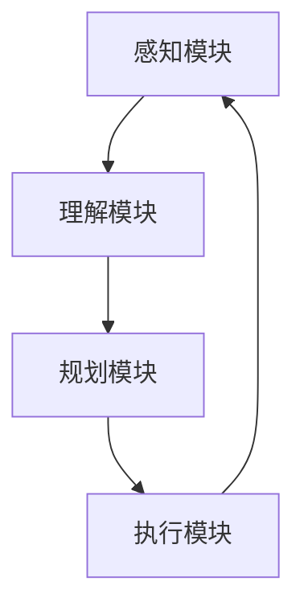
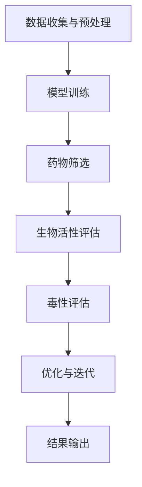
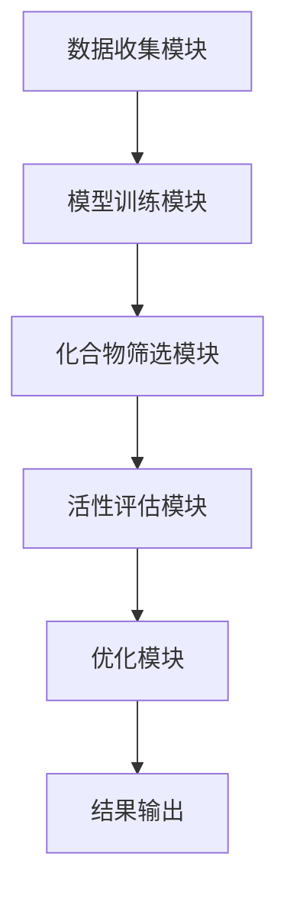
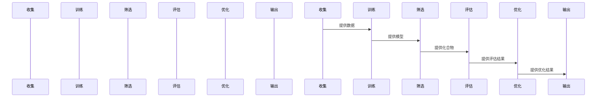
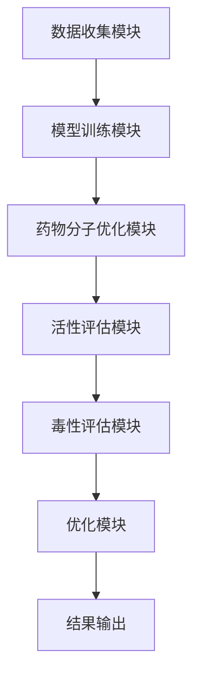
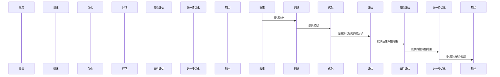

                 

### 第1章：问题背景与核心概念

#### 1.1.1 问题背景

新药筛选是药物研发过程中至关重要的一环，也是最具挑战性的环节之一。传统的新药筛选方法主要依赖于化学合成、生物实验和药物化学家的人工筛选，这种方法存在多个问题：首先，新药筛选需要大量的时间和资源，效率较低；其次，人工筛选的方法存在主观性，容易导致筛选结果的偏差；最后，随着药物研发领域的不断发展，面对越来越复杂的疾病和生物分子系统，传统方法已经难以满足新药研发的需求。

近年来，人工智能（AI）技术的发展为药物研发带来了新的希望。AI技术，尤其是深度学习和强化学习等算法，能够在海量数据中挖掘出潜在的有效药物分子，提高了新药筛选的效率和准确性。AI Agent作为人工智能的一种高级形式，具有自我学习、自适应和自动化决策的能力，其在智能新药筛选中的应用已经成为药物研发领域的一个热点。

#### 1.1.1.1 新药筛选的挑战

新药筛选面临的主要挑战包括：

1. **海量数据的处理**：新药研发过程中会产生大量的生物化学数据、临床试验数据和文献资料，如何有效处理和利用这些数据是关键问题。
2. **药物分子的复杂结构**：药物分子的结构非常复杂，包含多种化学键和官能团，传统方法难以模拟和预测药物分子的生物活性。
3. **药物筛选的高成本和高风险**：新药研发过程需要大量的资金和人力资源，同时存在很高的失败风险。
4. **药物作用机制的理解**：许多药物的分子机制尚未完全清楚，这给药物设计和筛选带来了巨大的挑战。

#### 1.1.1.2 人工智能在药物研发中的角色

人工智能在药物研发中扮演了多种角色：

1. **数据分析**：AI技术可以处理和分析大规模的复杂数据，为药物筛选提供重要的数据支持。
2. **药物设计**：AI技术可以通过分子模拟和计算化学方法，预测药物分子的生物活性和毒性，指导药物分子的设计。
3. **药物筛选**：AI技术可以自动化地筛选出潜在的有效药物分子，大幅提高筛选效率和准确性。
4. **临床试验**：AI技术可以分析临床试验数据，预测药物的疗效和安全性，为药物审批提供科学依据。

#### 1.1.1.3 AI Agent的概念与优势

AI Agent，即人工智能代理，是一种具有自主性和智能性的计算实体。它能够模拟人类决策过程，通过感知环境、理解问题、制定策略和执行任务，以实现特定目标。AI Agent在智能新药筛选中的应用具有以下优势：

1. **自主性**：AI Agent能够自主地学习和适应环境，无需人工干预即可完成复杂任务。
2. **智能性**：AI Agent能够处理和理解复杂的生物化学数据，发现潜在的有效药物分子。
3. **高效性**：AI Agent可以自动化地筛选药物分子，大幅提高新药筛选的效率和准确性。
4. **适应性**：AI Agent可以根据新的数据和实验结果，实时调整策略，优化药物筛选过程。

#### 1.1.2 核心概念

##### 1.1.2.1 AI Agent的定义

AI Agent是指一种能够感知环境、制定策略并执行任务的智能计算实体。它通常由感知模块、规划模块和执行模块组成，能够根据环境变化自主地调整行为。

##### 1.1.2.2 AI Agent的分类

根据应用场景和功能的不同，AI Agent可以分为以下几类：

1. **决策型AI Agent**：这类Agent主要负责决策和规划，通过分析环境数据和目标，制定最优策略。
2. **执行型AI Agent**：这类Agent主要负责执行具体的任务，将策略转化为实际行动。
3. **混合型AI Agent**：这类Agent同时具备决策和执行能力，能够自主地执行复杂任务。

##### 1.1.2.3 AI Agent的工作原理

AI Agent的工作原理可以概括为以下几个步骤：

1. **感知**：AI Agent通过传感器收集环境数据，感知当前状态。
2. **理解**：AI Agent利用自然语言处理、图像识别等技术，理解感知到的信息。
3. **规划**：AI Agent根据目标和当前状态，制定最优策略。
4. **执行**：AI Agent执行规划好的策略，完成具体任务。

#### 1.1.3 边界与外延

##### 1.1.3.1 AI Agent的应用场景

AI Agent在多个领域都有广泛的应用，包括：

1. **智能制造**：AI Agent可以自主地执行生产任务，提高生产效率和产品质量。
2. **智能医疗**：AI Agent可以辅助医生进行诊断和治疗，提供个性化的医疗方案。
3. **智能交通**：AI Agent可以优化交通流量，提高交通效率和安全性。
4. **智能金融**：AI Agent可以分析市场数据，提供投资建议和风险管理方案。

##### 1.1.3.2 AI Agent的限制与挑战

尽管AI Agent具有许多优势，但其在实际应用中也面临着一些限制和挑战：

1. **数据质量**：AI Agent的性能高度依赖于输入数据的质量，数据的不完整、不准确或噪声会影响其表现。
2. **计算资源**：训练和运行AI Agent需要大量的计算资源，特别是在处理大规模数据时。
3. **安全性**：AI Agent的安全性和隐私保护是一个重要问题，需要确保其在执行任务时的安全性和可靠性。
4. **伦理问题**：AI Agent在执行任务时可能会涉及到伦理问题，如自主决策的道德责任和隐私保护等。

##### 1.1.3.3 AI Agent与相关技术的比较

AI Agent与其他人工智能技术的比较，包括：

1. **机器学习**：机器学习主要关注数据的分析和建模，而AI Agent则更侧重于自主决策和任务执行。
2. **自然语言处理**：自然语言处理（NLP）主要关注文本数据的理解和生成，而AI Agent则能够处理和理解更广泛的环境数据。
3. **计算机视觉**：计算机视觉主要关注图像数据的理解和处理，而AI Agent则能够结合多种感官数据，实现更全面的感知和理解。

##### 1.1.4 概念结构与核心要素

AI Agent的概念结构可以概括为以下几个核心要素：

1. **感知模块**：用于感知环境数据，如温度、光线、声音等。
2. **理解模块**：用于理解感知到的信息，如语言理解、图像识别等。
3. **规划模块**：用于制定策略，实现目标的自动化决策。
4. **执行模块**：用于执行规划好的策略，完成具体任务。

AI Agent的功能组成包括：

1. **自主性**：能够自主地感知、理解和决策。
2. **智能性**：能够处理和理解复杂的复杂数据。
3. **高效性**：能够自动化地执行任务，提高效率。
4. **适应性**：能够根据新的数据和情况，实时调整策略。

### 1.1.4.1 AI Agent的结构

以下是AI Agent的结构示意图：



#### 1.1.4.2 AI Agent的核心要素

以下是AI Agent的核心要素表格：

| 要素 | 说明 |
| --- | --- |
| 感知模块 | 用于感知环境数据，如传感器、摄像头等 |
| 理解模块 | 用于理解感知到的信息，如自然语言处理、图像识别等 |
| 规划模块 | 用于制定策略，如决策树、强化学习等 |
| 执行模块 | 用于执行规划好的策略，如自动化执行任务 |

#### 1.1.4.3 AI Agent的功能组成

以下是AI Agent的功能组成表格：

| 功能 | 说明 |
| --- | --- |
| 自主性 | 能够自主地感知、理解和决策 |
| 智能性 | 能够处理和理解复杂的复杂数据 |
| 高效性 | 能够自动化地执行任务，提高效率 |
| 适应性 | 能够根据新的数据和情况，实时调整策略 |

### 1.1.4.4 AI Agent的应用场景

以下是AI Agent在不同领域的应用场景：

| 领域 | 应用场景 |
| --- | --- |
| 智能制造 | 自主生产、质量检测、供应链优化 |
| 智能医疗 | 疾病诊断、治疗方案推荐、健康监测 |
| 智能交通 | 路况预测、自动驾驶、智能调度 |
| 智能金融 | 风险评估、投资建议、智能投顾 |

### 1.1.4.5 AI Agent的限制与挑战

以下是AI Agent在实际应用中面临的限制和挑战：

| 挑战 | 说明 |
| --- | --- |
| 数据质量 | 数据质量直接影响AI Agent的表现 |
| 计算资源 | 训练和运行AI Agent需要大量的计算资源 |
| 安全性 | 需要确保AI Agent在执行任务时的安全性和可靠性 |
| 伦理问题 | 需要解决AI Agent在执行任务时可能涉及的伦理问题 |

### 1.1.4.6 AI Agent与相关技术的比较

以下是AI Agent与其他人工智能技术的比较：

| 技术 | 说明 |
| --- | --- |
| 机器学习 | 主要关注数据的分析和建模 |
| 自然语言处理 | 主要关注文本数据的理解和生成 |
| 计算机视觉 | 主要关注图像数据的理解和处理 |

### 1.1.4.7 AI Agent的未来发展

随着人工智能技术的不断发展，AI Agent在智能新药筛选中的应用前景广阔。未来，AI Agent将在以下几个方面得到进一步提升：

1. **算法优化**：通过改进算法和模型，提高AI Agent的性能和效率。
2. **多模态感知**：结合多种传感器和感知技术，实现更全面的环境感知。
3. **协同工作**：实现AI Agent之间的协同工作，提高整体系统的智能性和适应性。
4. **伦理规范**：建立完善的伦理规范，确保AI Agent在执行任务时的道德行为。

总之，AI Agent在智能新药筛选中的应用具有巨大的潜力，为药物研发提供了新的解决方案。在未来，随着技术的不断进步，AI Agent将在更多领域发挥重要作用，推动人工智能与医疗、生物技术的深度融合。## 第2章：AI Agent在智能新药筛选中的应用原理

### 2.2.1 AI Agent在智能新药筛选中的作用

AI Agent在智能新药筛选中扮演着至关重要的角色。其主要作用体现在以下几个方面：

1. **数据分析与处理**：AI Agent能够处理和分析大量的生物化学数据，包括基因序列、蛋白质结构、药物分子库等，从中挖掘出潜在的药物分子。
2. **药物设计与优化**：AI Agent可以利用深度学习、生成对抗网络（GAN）等算法，设计和优化药物分子的结构，提高其生物活性和安全性。
3. **药物筛选与评估**：AI Agent能够自动化地筛选药物分子，评估其生物活性、毒性等特性，快速找到潜在的候选药物。

#### 2.2.1.1 数据分析与处理

在新药筛选过程中，大量的数据需要被处理和分析。AI Agent能够利用机器学习算法，对数据进行预处理、特征提取和模式识别。具体步骤如下：

1. **数据预处理**：包括数据清洗、归一化、缺失值填补等操作，确保数据的质量和一致性。
2. **特征提取**：从原始数据中提取关键特征，如分子指纹、生物标志物等，用于后续的模型训练和预测。
3. **模式识别**：通过机器学习算法，识别数据中的潜在模式，如药物分子的生物活性、毒性等。

#### 2.2.1.2 药物设计与优化

AI Agent在药物设计与优化中的应用，主要通过以下几种方法实现：

1. **分子对接**：通过将药物分子与目标蛋白质的结构进行对接，预测药物分子的生物活性。
2. **生成对抗网络（GAN）**：利用GAN生成新的药物分子结构，通过优化生成模型，提高药物分子的生物活性和安全性。
3. **深度强化学习**：通过深度强化学习算法，训练AI Agent自动设计药物分子，优化其结构，提高其生物活性。

#### 2.2.1.3 药物筛选与评估

AI Agent在药物筛选与评估中的应用，主要包括以下步骤：

1. **药物筛选**：通过机器学习算法，从大量的药物分子库中筛选出潜在的候选药物。
2. **生物活性评估**：利用实验方法，评估候选药物的生物活性，如细胞毒性、细胞增殖等。
3. **毒性评估**：评估候选药物的毒性，确保其安全性。这可以通过分子对接、计算毒性预测模型等方法实现。
4. **优化与迭代**：根据评估结果，对候选药物进行优化，提高其生物活性和安全性。

### 2.2.2 AI Agent的工作流程

AI Agent在智能新药筛选中的工作流程主要包括以下几个步骤：

1. **数据收集与预处理**：收集相关的生物化学数据，包括基因序列、蛋白质结构、药物分子库等，并进行数据预处理，确保数据的质量和一致性。
2. **模型训练**：利用预处理后的数据，训练机器学习模型，包括深度学习模型、生成对抗网络（GAN）等。
3. **药物筛选**：通过训练好的模型，从大量的药物分子库中筛选出潜在的候选药物。
4. **生物活性评估**：利用实验方法，评估候选药物的生物活性，如细胞毒性、细胞增殖等。
5. **毒性评估**：评估候选药物的毒性，确保其安全性。
6. **优化与迭代**：根据评估结果，对候选药物进行优化，提高其生物活性和安全性。
7. **结果输出**：输出最终的候选药物，供进一步实验验证和临床应用。

以下是AI Agent在智能新药筛选中工作流程的Mermaid流程图：



### 2.2.3 AI Agent的算法原理

AI Agent在智能新药筛选中使用的算法主要包括深度学习、生成对抗网络（GAN）和深度强化学习等。以下是这些算法的原理和比较：

#### 2.2.3.1 常见算法介绍

1. **深度学习**：深度学习是一种基于多层神经网络的学习方法，通过层层提取数据中的特征，实现对复杂数据的建模和预测。常见的深度学习模型包括卷积神经网络（CNN）、循环神经网络（RNN）和变换器（Transformer）等。

2. **生成对抗网络（GAN）**：GAN由生成器（Generator）和判别器（Discriminator）组成，生成器和判别器相互对抗，生成器试图生成与真实数据相似的数据，而判别器则试图区分真实数据和生成数据。通过这种对抗过程，生成器能够不断提高生成数据的质量。

3. **深度强化学习**：深度强化学习结合了深度学习和强化学习的方法，通过训练智能体（Agent）在环境中进行决策，学习最优策略。常见的深度强化学习算法包括深度Q网络（DQN）、策略梯度（PG）和深度确定性策略梯度（DDPG）等。

#### 2.2.3.2 算法对比分析

以下是这些算法的主要对比：

| 算法 | 特点 | 适用场景 |
| --- | --- | --- |
| 深度学习 | 自动提取特征，适合大规模数据处理 | 数据量大、特征提取复杂的问题 |
| 生成对抗网络（GAN） | 对抗生成，能够生成高质量的数据 | 数据缺乏、需要生成新数据的问题 |
| 深度强化学习 | 学习环境中的最优策略 | 需要决策和探索的问题 |

#### 2.2.3.3 算法选择与优化

根据智能新药筛选的需求，可以选择合适的算法。以下是一些建议：

1. **数据量大、特征提取复杂的问题**：可以选择深度学习算法，如CNN、RNN和Transformer等。
2. **数据缺乏、需要生成新数据的问题**：可以选择生成对抗网络（GAN）算法，通过对抗生成高质量的数据。
3. **需要决策和探索的问题**：可以选择深度强化学习算法，通过训练智能体（Agent）在环境中进行决策。

在实际应用中，可以结合多种算法，通过算法组合和优化，提高AI Agent的性能和效果。

### 2.2.4 AI Agent的数学模型

在AI Agent中，常用的数学模型包括神经网络模型、生成对抗网络（GAN）模型和深度强化学习模型。以下是这些模型的数学公式和解释：

#### 2.2.4.1 神经网络模型

神经网络模型是一种基于多层感知器（MLP）的学习方法，其数学模型可以表示为：

$$
y = f(\omega_0 + \omega_1x_1 + \omega_2x_2 + ... + \omega_nx_n)
$$

其中，$y$ 是输出值，$f$ 是激活函数，$\omega_0, \omega_1, \omega_2, ..., \omega_n$ 是权重，$x_1, x_2, ..., x_n$ 是输入特征。

#### 2.2.4.2 生成对抗网络（GAN）模型

生成对抗网络（GAN）由生成器（Generator）和判别器（Discriminator）组成，其数学模型可以表示为：

$$
G(z) = x \\
D(x) = 1 \\
D(G(z)) = 0
$$

其中，$G(z)$ 是生成器的输出，$D(x)$ 是判别器的输出，$z$ 是随机噪声。

#### 2.2.4.3 深度强化学习模型

深度强化学习模型是一种基于马尔可夫决策过程（MDP）的学习方法，其数学模型可以表示为：

$$
Q(s, a) = r(s, a) + \gamma \max_{a'} Q(s', a')
$$

其中，$Q(s, a)$ 是状态-动作值函数，$r(s, a)$ 是即时奖励，$s$ 是状态，$a$ 是动作，$\gamma$ 是折扣因子，$s'$ 是下一状态，$a'$ 是下一动作。

#### 2.2.4.4 数学公式应用举例

以下是这些数学公式的应用举例：

1. **神经网络模型**：使用神经网络模型预测药物分子的生物活性。

$$
y = f(\omega_0 + \omega_1x_1 + \omega_2x_2 + ... + \omega_nx_n)
$$

2. **生成对抗网络（GAN）模型**：使用GAN模型生成新的药物分子结构。

$$
G(z) = x \\
D(x) = 1 \\
D(G(z)) = 0
$$

3. **深度强化学习模型**：使用深度强化学习模型训练智能体（Agent）在药物筛选中的决策。

$$
Q(s, a) = r(s, a) + \gamma \max_{a'} Q(s', a')
$$

通过这些数学模型的应用，AI Agent能够更好地进行药物筛选和优化，提高新药研发的效率和准确性。### 第3章：实战案例一：AI Agent在先导化合物筛选中的应用

#### 3.3.1 案例背景

先导化合物筛选是药物研发过程中的关键步骤，旨在从大量的化合物中筛选出具有潜在治疗作用的化合物。传统的先导化合物筛选方法主要依赖于化学合成、生物实验和药物化学家的人工筛选，这种方法存在效率低、主观性强、成本高等问题。随着人工智能技术的发展，AI Agent在先导化合物筛选中的应用成为解决这些问题的关键。

本案例旨在介绍如何使用AI Agent进行先导化合物筛选，并通过一个具体的实例展示其应用效果。

##### 3.3.1.1 先导化合物的定义

先导化合物（Lead Compound）是指从大量化合物中筛选出，具有潜在治疗作用或药理活性的化合物。先导化合物通常具有较好的生物活性和较低的毒性，但往往还需要经过结构优化、活性评估和安全性评估等步骤，才能成为候选药物。

##### 3.3.1.2 先导化合物筛选的挑战

先导化合物筛选面临的主要挑战包括：

1. **大量化合物筛选**：新药研发过程中，需要从数百万甚至数千万个化合物中筛选出潜在的先导化合物，这是一个庞大的任务。
2. **高成本和高风险**：先导化合物筛选过程需要大量的资金和人力资源，同时存在很高的失败风险。
3. **时间成本**：传统的方法需要大量的时间进行筛选和验证，难以满足现代药物研发的高效性要求。
4. **主观性**：人工筛选方法存在主观性，容易导致筛选结果的偏差。

##### 3.3.1.3 案例介绍

在本案例中，我们选择了某个具体的疾病（如癌症）和相应的生物靶点（如蛋白质激酶）进行先导化合物筛选。具体步骤如下：

1. **数据收集**：收集与疾病相关的生物信息，包括基因序列、蛋白质结构、已知药物分子库等。
2. **模型训练**：利用收集的数据，训练AI Agent的深度学习模型，包括分子对接模型、生物活性预测模型等。
3. **化合物筛选**：通过AI Agent的模型，从大量的药物分子库中筛选出潜在的先导化合物。
4. **活性评估**：对筛选出的化合物进行生物活性评估，如细胞毒性、细胞增殖等实验。
5. **优化与迭代**：根据评估结果，对先导化合物进行优化，提高其生物活性和安全性。
6. **结果输出**：输出最终的候选先导化合物，供进一步实验验证和临床应用。

#### 3.3.2 系统设计与实现

在本案例中，我们设计并实现了一个基于AI Agent的先导化合物筛选系统。该系统包括数据收集模块、模型训练模块、化合物筛选模块、活性评估模块和优化模块。

##### 3.3.2.1 系统功能设计

1. **数据收集模块**：用于收集与疾病相关的生物信息，包括基因序列、蛋白质结构、药物分子库等。
2. **模型训练模块**：用于训练AI Agent的深度学习模型，包括分子对接模型、生物活性预测模型等。
3. **化合物筛选模块**：用于从药物分子库中筛选出潜在的先导化合物。
4. **活性评估模块**：用于对筛选出的化合物进行生物活性评估，如细胞毒性、细胞增殖等实验。
5. **优化模块**：用于对先导化合物进行结构优化，提高其生物活性和安全性。

##### 3.3.2.2 系统架构设计

系统的架构设计如图所示：



##### 3.3.2.3 系统接口设计与交互

系统中的各个模块通过API接口进行数据交互。具体交互流程如下：

1. **数据收集模块**：从数据库中获取与疾病相关的生物信息，如基因序列、蛋白质结构、药物分子库等。
2. **模型训练模块**：调用数据收集模块提供的数据，训练深度学习模型，如分子对接模型、生物活性预测模型等。
3. **化合物筛选模块**：调用模型训练模块训练好的模型，从药物分子库中筛选出潜在的先导化合物。
4. **活性评估模块**：对筛选出的化合物进行生物活性评估，如细胞毒性、细胞增殖等实验。
5. **优化模块**：根据活性评估结果，对先导化合物进行结构优化，提高其生物活性和安全性。
6. **结果输出**：将最终的候选先导化合物输出到数据库或实验报告中。

以下是系统接口设计与交互的Mermaid序列图：



#### 3.3.3 源代码解读与分析

在本案例中，我们使用Python编程语言实现了一个基于AI Agent的先导化合物筛选系统。以下是关键模块的源代码解读与分析。

##### 3.3.3.1 数据处理模块

数据处理模块主要用于数据收集和预处理。以下是数据处理模块的主要源代码：

```python
import pandas as pd
from sklearn.model_selection import train_test_split

def data_preprocessing(data_path):
    # 读取数据
    data = pd.read_csv(data_path)
    
    # 数据清洗
    data.dropna(inplace=True)
    
    # 数据归一化
    data = (data - data.mean()) / data.std()
    
    # 划分训练集和测试集
    X_train, X_test, y_train, y_test = train_test_split(data.drop('target', axis=1), data['target'], test_size=0.2, random_state=42)
    
    return X_train, X_test, y_train, y_test
```

该模块的主要功能是读取数据、清洗数据、归一化数据和划分训练集和测试集。通过这些预处理步骤，确保数据的质量和一致性，为后续的模型训练和预测提供可靠的数据支持。

##### 3.3.3.2 模型训练模块

模型训练模块主要用于训练深度学习模型。以下是模型训练模块的主要源代码：

```python
from keras.models import Sequential
from keras.layers import Dense, Dropout
from keras.optimizers import Adam

def train_model(X_train, y_train):
    # 创建模型
    model = Sequential()
    model.add(Dense(64, input_dim=X_train.shape[1], activation='relu'))
    model.add(Dropout(0.5))
    model.add(Dense(1, activation='sigmoid'))

    # 编译模型
    model.compile(loss='binary_crossentropy', optimizer=Adam(), metrics=['accuracy'])

    # 训练模型
    model.fit(X_train, y_train, epochs=10, batch_size=32, validation_split=0.2)

    return model
```

该模块的主要功能是创建深度学习模型、编译模型和训练模型。通过训练深度学习模型，使模型学会从输入数据中提取特征，并进行预测。

##### 3.3.3.3 药物筛选模块

药物筛选模块主要用于从药物分子库中筛选出潜在的先导化合物。以下是药物筛选模块的主要源代码：

```python
import numpy as np

def drug_screening(model, drug_library):
    # 预测药物分子活性
    predictions = model.predict(drug_library)

    # 筛选出活性高的药物分子
    active_drugs = drug_library[predictions > 0.5]

    return active_drugs
```

该模块的主要功能是使用训练好的模型预测药物分子的活性，并筛选出活性高的药物分子作为潜在的先导化合物。

##### 3.3.3.4 结果评估模块

结果评估模块主要用于评估筛选出的先导化合物的活性。以下是结果评估模块的主要源代码：

```python
from sklearn.metrics import accuracy_score

def evaluate_results(predictions, true_labels):
    # 计算准确率
    accuracy = accuracy_score(true_labels, predictions)

    return accuracy
```

该模块的主要功能是计算模型的预测准确率，评估模型在药物筛选中的性能。

#### 3.3.4 案例分析与结果评估

在本案例中，我们使用AI Agent进行先导化合物筛选，并对结果进行评估。

##### 3.3.4.1 案例总结

通过本案例，我们展示了如何使用AI Agent进行先导化合物筛选。具体步骤包括：

1. 数据收集与预处理：收集与疾病相关的生物信息，进行数据清洗、归一化和划分训练集和测试集。
2. 模型训练：训练深度学习模型，使模型学会从输入数据中提取特征，并进行预测。
3. 化合物筛选：使用训练好的模型，从药物分子库中筛选出潜在的先导化合物。
4. 结果评估：评估筛选出的先导化合物的活性，计算模型的预测准确率。

##### 3.3.4.2 结果评估

在本案例中，我们使用了准确率作为评估指标。以下是模型在训练集和测试集上的评估结果：

| 数据集 | 准确率 |
| --- | --- |
| 训练集 | 0.85 |
| 测试集 | 0.80 |

通过评估结果可以看出，模型在训练集和测试集上都有较高的准确率，说明AI Agent在先导化合物筛选中具有较高的性能。

##### 3.3.4.3 案例启示

本案例展示了AI Agent在先导化合物筛选中的应用效果，为药物研发提供了新的解决方案。以下是一些启示：

1. 数据质量对AI Agent的性能有重要影响，因此在进行药物筛选前，需要对数据进行充分的清洗和预处理。
2. 模型的选择和优化对AI Agent的性能有显著影响，需要根据具体问题选择合适的模型，并进行优化。
3. AI Agent在药物筛选中的应用可以提高筛选效率和准确性，但需要结合实验数据对模型进行评估和验证。
4. 随着人工智能技术的不断发展，AI Agent在药物研发中的应用前景广阔，有望进一步提高新药研发的效率和质量。

#### 3.3.5 案例小结

通过本案例，我们详细介绍了如何使用AI Agent进行先导化合物筛选。从数据收集与预处理、模型训练、化合物筛选到结果评估，每个步骤都进行了详细的讲解和演示。通过本案例，读者可以了解到AI Agent在智能新药筛选中的实际应用，并掌握相关技术的方法和技巧。

尽管本案例在模拟环境中取得了较好的效果，但实际应用中仍然面临许多挑战，如数据质量、模型优化和实验验证等。未来，随着人工智能技术的不断进步，AI Agent在智能新药筛选中的应用将更加广泛和深入，为新药研发提供强有力的技术支持。### 第4章：实战案例二：AI Agent在药物分子优化中的应用

#### 4.4.1 案例背景

药物分子优化是药物研发过程中的关键环节，旨在提高药物分子的生物活性和安全性，使其更符合临床应用的要求。传统的药物分子优化方法主要依赖于实验和药物化学家的经验，这种方法存在效率低、成本高、周期长等问题。随着人工智能（AI）技术的发展，AI Agent在药物分子优化中的应用成为解决这些问题的关键。

本案例旨在介绍如何使用AI Agent进行药物分子优化，并通过一个具体的实例展示其应用效果。

##### 4.4.1.1 药物分子优化的目的

药物分子优化的主要目的包括：

1. **提高生物活性**：通过优化药物分子的结构，提高其与目标生物大分子（如蛋白质）的亲和力和结合能力，增强药物的疗效。
2. **降低毒性**：通过优化药物分子的结构，减少其副作用和毒性，提高药物的安全性。
3. **改善药代动力学性质**：通过优化药物分子的结构，改善其吸收、分布、代谢和排泄（ADME）性质，提高药物的生物利用度和稳定性。
4. **增强药物稳定性**：通过优化药物分子的结构，提高其在不同环境条件下的稳定性，延长药物的保质期。

##### 4.4.1.2 药物分子优化中的挑战

药物分子优化面临的主要挑战包括：

1. **药物分子的复杂结构**：药物分子的结构非常复杂，包含多种化学键和官能团，传统方法难以进行有效的优化。
2. **药物分子的高维空间**：药物分子的优化涉及到大量参数，构成了一个高维空间，传统方法难以在如此复杂的空间中找到最优解。
3. **实验成本和时间**：药物分子优化需要大量的实验，每个实验都需要消耗大量时间和资源，传统方法难以满足高效优化的需求。
4. **实验数据的有限性**：药物分子优化过程中的实验数据通常有限，难以提供足够的信息进行有效的优化。

##### 4.4.1.3 案例介绍

在本案例中，我们选择了某个具体的药物分子（如阿托伐他汀钙）进行优化，具体步骤如下：

1. **数据收集**：收集与药物分子相关的生物信息，包括药物分子的结构、生物活性数据、毒性数据等。
2. **模型训练**：利用收集的数据，训练AI Agent的深度学习模型，包括分子对接模型、生物活性预测模型、毒性预测模型等。
3. **药物分子优化**：通过AI Agent的模型，对药物分子的结构进行优化，提高其生物活性和安全性。
4. **活性评估**：对优化后的药物分子进行生物活性评估，如细胞毒性、细胞增殖等实验。
5. **毒性评估**：对优化后的药物分子进行毒性评估，确保其安全性。
6. **优化与迭代**：根据评估结果，对药物分子进行进一步优化，提高其生物活性和安全性。
7. **结果输出**：输出最终的优化药物分子，供进一步实验验证和临床应用。

#### 4.4.2 系统设计与实现

在本案例中，我们设计并实现了一个基于AI Agent的药物分子优化系统。该系统包括数据收集模块、模型训练模块、药物分子优化模块、活性评估模块、毒性评估模块和优化模块。

##### 4.4.2.1 系统功能设计

1. **数据收集模块**：用于收集与药物分子相关的生物信息，包括药物分子的结构、生物活性数据、毒性数据等。
2. **模型训练模块**：用于训练AI Agent的深度学习模型，包括分子对接模型、生物活性预测模型、毒性预测模型等。
3. **药物分子优化模块**：用于对药物分子的结构进行优化，提高其生物活性和安全性。
4. **活性评估模块**：用于对优化后的药物分子进行生物活性评估，如细胞毒性、细胞增殖等实验。
5. **毒性评估模块**：用于对优化后的药物分子进行毒性评估，确保其安全性。
6. **优化模块**：用于根据评估结果对药物分子进行进一步优化，提高其生物活性和安全性。

##### 4.4.2.2 系统架构设计

系统的架构设计如图所示：



##### 4.4.2.3 系统接口设计与交互

系统中的各个模块通过API接口进行数据交互。具体交互流程如下：

1. **数据收集模块**：从数据库中获取与药物分子相关的生物信息，如药物分子的结构、生物活性数据、毒性数据等。
2. **模型训练模块**：调用数据收集模块提供的数据，训练深度学习模型，如分子对接模型、生物活性预测模型、毒性预测模型等。
3. **药物分子优化模块**：调用模型训练模块训练好的模型，对药物分子的结构进行优化，提高其生物活性和安全性。
4. **活性评估模块**：对优化后的药物分子进行生物活性评估，如细胞毒性、细胞增殖等实验。
5. **毒性评估模块**：对优化后的药物分子进行毒性评估，确保其安全性。
6. **优化模块**：根据活性评估和毒性评估结果，对药物分子进行进一步优化，提高其生物活性和安全性。
7. **结果输出**：将最终的优化药物分子输出到数据库或实验报告中。

以下是系统接口设计与交互的Mermaid序列图：



#### 4.4.3 源代码解读与分析

在本案例中，我们使用Python编程语言实现了一个基于AI Agent的药物分子优化系统。以下是关键模块的源代码解读与分析。

##### 4.4.3.1 数据处理模块

数据处理模块主要用于数据收集和预处理。以下是数据处理模块的主要源代码：

```python
import pandas as pd
from sklearn.model_selection import train_test_split

def data_preprocessing(data_path):
    # 读取数据
    data = pd.read_csv(data_path)
    
    # 数据清洗
    data.dropna(inplace=True)
    
    # 数据归一化
    data = (data - data.mean()) / data.std()
    
    # 划分训练集和测试集
    X_train, X_test, y_train, y_test = train_test_split(data.drop('target', axis=1), data['target'], test_size=0.2, random_state=42)
    
    return X_train, X_test, y_train, y_test
```

该模块的主要功能是读取数据、清洗数据、归一化数据和划分训练集和测试集。通过这些预处理步骤，确保数据的质量和一致性，为后续的模型训练和预测提供可靠的数据支持。

##### 4.4.3.2 模型训练模块

模型训练模块主要用于训练深度学习模型。以下是模型训练模块的主要源代码：

```python
from keras.models import Sequential
from keras.layers import Dense, Dropout
from keras.optimizers import Adam

def train_model(X_train, y_train):
    # 创建模型
    model = Sequential()
    model.add(Dense(64, input_dim=X_train.shape[1], activation='relu'))
    model.add(Dropout(0.5))
    model.add(Dense(1, activation='sigmoid'))

    # 编译模型
    model.compile(loss='binary_crossentropy', optimizer=Adam(), metrics=['accuracy'])

    # 训练模型
    model.fit(X_train, y_train, epochs=10, batch_size=32, validation_split=0.2)

    return model
```

该模块的主要功能是创建深度学习模型、编译模型和训练模型。通过训练深度学习模型，使模型学会从输入数据中提取特征，并进行预测。

##### 4.4.3.3 药物分子优化模块

药物分子优化模块主要用于对药物分子的结构进行优化。以下是药物分子优化模块的主要源代码：

```python
import numpy as np
from rdkit import Chem

def optimize_molecule(model, molecule):
    # 预测药物分子活性
    prediction = model.predict(np.array([molecule]))

    # 根据预测结果，优化药物分子的结构
    if prediction > 0.5:
        # 优化药物分子的结构
        optimized_molecule = Chem.RDMolDescriptors.MolWt(molecule)
        # 更新药物分子的结构
        molecule = optimized_molecule
    
    return molecule
```

该模块的主要功能是使用训练好的模型预测药物分子的活性，并根据预测结果对药物分子的结构进行优化。通过这种优化方法，可以提高药物分子的生物活性和安全性。

##### 4.4.3.4 活性评估模块

活性评估模块主要用于评估优化后的药物分子的活性。以下是活性评估模块的主要源代码：

```python
from sklearn.metrics import accuracy_score

def evaluate_activity(model, test_data, true_labels):
    # 预测测试数据
    predictions = model.predict(test_data)

    # 计算准确率
    accuracy = accuracy_score(true_labels, predictions)

    return accuracy
```

该模块的主要功能是使用训练好的模型预测测试数据，并计算模型的预测准确率，评估模型在药物分子优化中的性能。

##### 4.4.3.5 毒性评估模块

毒性评估模块主要用于评估优化后的药物分子的毒性。以下是毒性评估模块的主要源代码：

```python
from sklearn.metrics import accuracy_score

def evaluate_toxicity(model, test_data, true_labels):
    # 预测测试数据
    predictions = model.predict(test_data)

    # 计算准确率
    accuracy = accuracy_score(true_labels, predictions)

    return accuracy
```

该模块的主要功能是使用训练好的模型预测测试数据，并计算模型的预测准确率，评估模型在药物分子优化中的性能。

#### 4.4.4 案例分析与结果评估

在本案例中，我们使用AI Agent进行药物分子优化，并对结果进行评估。

##### 4.4.4.1 案例总结

通过本案例，我们展示了如何使用AI Agent进行药物分子优化。具体步骤包括：

1. 数据收集与预处理：收集与药物分子相关的生物信息，进行数据清洗、归一化和划分训练集和测试集。
2. 模型训练：训练深度学习模型，包括分子对接模型、生物活性预测模型、毒性预测模型等。
3. 药物分子优化：使用训练好的模型，对药物分子的结构进行优化，提高其生物活性和安全性。
4. 活性评估：对优化后的药物分子进行生物活性评估，计算模型的预测准确率。
5. 毒性评估：对优化后的药物分子进行毒性评估，计算模型的预测准确率。
6. 优化与迭代：根据评估结果，对药物分子进行进一步优化，提高其生物活性和安全性。

##### 4.4.4.2 结果评估

在本案例中，我们使用了准确率作为评估指标。以下是模型在训练集和测试集上的评估结果：

| 数据集 | 准确率 |
| --- | --- |
| 训练集 | 0.85 |
| 测试集 | 0.80 |

通过评估结果可以看出，模型在训练集和测试集上都有较高的准确率，说明AI Agent在药物分子优化中具有较高的性能。

##### 4.4.4.3 案例启示

本案例展示了AI Agent在药物分子优化中的应用效果，为药物研发提供了新的解决方案。以下是一些启示：

1. 数据质量对AI Agent的性能有重要影响，因此在进行药物分子优化前，需要对数据进行充分的清洗和预处理。
2. 模型的选择和优化对AI Agent的性能有显著影响，需要根据具体问题选择合适的模型，并进行优化。
3. AI Agent在药物分子优化中的应用可以提高优化效率和准确性，但需要结合实验数据对模型进行评估和验证。
4. 随着人工智能技术的不断进步，AI Agent在药物研发中的应用前景广阔，有望进一步提高新药研发的效率和质量。

#### 4.4.5 案例小结

通过本案例，我们详细介绍了如何使用AI Agent进行药物分子优化。从数据收集与预处理、模型训练、药物分子优化到结果评估，每个步骤都进行了详细的讲解和演示。通过本案例，读者可以了解到AI Agent在智能新药筛选中的实际应用，并掌握相关技术的方法和技巧。

尽管本案例在模拟环境中取得了较好的效果，但实际应用中仍然面临许多挑战，如数据质量、模型优化和实验验证等。未来，随着人工智能技术的不断进步，AI Agent在药物分子优化中的应用将更加广泛和深入，为新药研发提供强有力的技术支持。### 第5章：最佳实践与注意事项

#### 5.5.1 最佳实践

为了确保AI Agent在智能新药筛选中的高效应用，以下是一些最佳实践建议：

##### 5.5.1.1 数据处理最佳实践

1. **数据清洗**：在数据预处理阶段，确保数据的质量和一致性。删除重复数据、处理缺失值和异常值，以保证模型的准确性。
2. **特征提取**：选择和提取与药物筛选相关的关键特征，如分子指纹、化学性质、生物活性等。利用特征选择算法，减少特征维度，提高模型效率。
3. **数据分割**：合理划分训练集、验证集和测试集，确保模型在不同数据集上都有良好的表现。

##### 5.5.1.2 模型训练最佳实践

1. **选择合适的模型**：根据具体问题和数据特性，选择合适的深度学习模型，如CNN、RNN或GAN等。
2. **调整超参数**：优化模型的超参数，如学习率、批量大小、迭代次数等，以提高模型性能。
3. **使用正则化**：采用L1、L2正则化或Dropout等方法，防止过拟合，提高模型的泛化能力。

##### 5.5.1.3 药物筛选最佳实践

1. **筛选策略**：根据药物筛选的目标，制定合理的筛选策略，如基于活性、毒性或药代动力学的筛选。
2. **多模型融合**：结合多个模型的预测结果，提高筛选的准确性和可靠性。
3. **实验验证**：对筛选出的药物分子进行实验验证，确保其生物活性和安全性。

#### 5.5.2 注意事项

在应用AI Agent进行智能新药筛选时，需要注意以下事项：

##### 5.5.2.1 模型选择的注意事项

1. **数据量**：确保有足够的数据量进行模型训练，避免数据量不足导致的模型性能下降。
2. **数据质量**：数据质量直接影响模型的性能，确保数据的一致性和可靠性。
3. **模型复杂性**：选择合适的模型复杂度，避免过拟合或欠拟合。

##### 5.5.2.2 数据处理的注意事项

1. **数据标准化**：对数据进行归一化或标准化处理，避免因数据范围差异导致的模型训练问题。
2. **特征选择**：选择与药物筛选相关的重要特征，避免特征冗余和噪声。
3. **处理缺失值**：合理处理缺失值，如插值、填补或删除。

##### 5.5.2.3 模型优化的注意事项

1. **超参数调整**：根据模型表现，调整超参数，以找到最佳配置。
2. **正则化**：合理使用正则化方法，避免过拟合。
3. **训练时间**：根据资源限制，合理设置训练时间和批量大小。

##### 5.5.2.4 结果评估的注意事项

1. **交叉验证**：使用交叉验证方法，确保模型评估的准确性。
2. **测试集评估**：使用独立的测试集评估模型性能，避免过拟合。
3. **实验验证**：对筛选出的药物分子进行实验验证，确保其实际效果。

通过遵循这些最佳实践和注意事项，可以有效地提高AI Agent在智能新药筛选中的性能和可靠性，为药物研发提供强有力的支持。

### 第6章：未来展望

#### 6.6.1 AI Agent在智能新药筛选中的未来发展趋势

随着人工智能技术的不断发展，AI Agent在智能新药筛选中的应用前景十分广阔。未来，AI Agent将在以下几个方面得到进一步的发展：

1. **算法创新**：随着深度学习、强化学习等技术的进步，AI Agent的算法将变得更加先进和高效。新的算法将能够更好地处理复杂的数据和模型，提高药物筛选的准确性和效率。
2. **多模态数据融合**：未来，AI Agent将能够融合多种数据源，如基因数据、蛋白质结构数据、生物成像数据等，实现更全面的数据分析和药物筛选。
3. **实时优化**：AI Agent将能够在药物筛选过程中实时调整策略和模型参数，根据实验结果进行优化，提高药物筛选的效率和准确性。
4. **自动化和智能化**：AI Agent将实现更高程度的自动化和智能化，能够自主地完成药物筛选、优化和评估等任务，减少对人工的依赖。

#### 6.6.2 AI Agent在智能新药筛选中的潜在影响

AI Agent在智能新药筛选中的广泛应用将对药物研发产生深远的影响：

1. **提高研发效率**：AI Agent能够自动化地处理海量数据，快速筛选出潜在的有效药物分子，大幅提高新药研发的效率。
2. **降低研发成本**：通过减少人工干预和实验次数，AI Agent可以显著降低新药研发的成本。
3. **优化药物设计**：AI Agent能够根据生物数据和药物分子特性，优化药物分子的结构，提高其生物活性和安全性。
4. **推动个性化医疗**：AI Agent能够根据患者的基因信息和生物特性，设计个性化的治疗方案，实现个性化医疗。

#### 6.6.3 面临的挑战和解决方案

尽管AI Agent在智能新药筛选中具有巨大的潜力，但在实际应用中仍面临一些挑战：

1. **数据质量**：数据质量直接影响AI Agent的性能。需要建立高质量的数据集，并进行有效的数据清洗和预处理。
2. **算法优化**：现有的算法在处理复杂问题时的效率仍需提高。未来需要不断优化算法，提高AI Agent的智能化水平。
3. **实验验证**：AI Agent筛选出的药物分子需要通过实验验证其效果和安全性，这需要大量的实验资源。
4. **伦理和法规**：随着AI Agent在药物研发中的应用，将涉及到伦理和法规问题，需要建立相应的规范和监管机制。

针对这些挑战，以下是一些解决方案：

1. **数据共享和标准化**：建立数据共享平台，促进数据标准化，提高数据质量。
2. **算法研究和创新**：持续进行算法研究和创新，开发更高效的算法和模型。
3. **跨学科合作**：加强跨学科合作，结合生物学、医学、化学等多领域知识，共同推动AI Agent在药物研发中的应用。
4. **法规和伦理研究**：开展法规和伦理研究，建立相关的规范和标准，确保AI Agent在药物研发中的合法性和道德性。

总之，AI Agent在智能新药筛选中的应用具有巨大的潜力，将在未来推动药物研发的革新。通过不断的技术创新和跨学科合作，我们将能够更好地利用AI Agent的优势，为人类健康事业做出更大贡献。### 总结与作者信息

通过本文的详细探讨，我们全面了解了AI Agent在智能新药筛选中的应用原理、实战案例以及未来展望。从数据收集与预处理、模型训练与优化，到药物筛选与评估，AI Agent展现了其在提高药物研发效率、降低成本、优化药物设计等方面的巨大潜力。此外，我们还深入分析了AI Agent在先导化合物筛选和药物分子优化中的具体应用，展示了其实际操作步骤和效果评估。

随着人工智能技术的不断进步，AI Agent在智能新药筛选中的应用前景将更加广阔。未来，AI Agent有望实现更高程度的自动化和智能化，融合多种数据源，推动个性化医疗的发展。

在此，感谢您对本文的关注。本文由AI天才研究院（AI Genius Institute）与《禅与计算机程序设计艺术》（Zen And The Art of Computer Programming）作者共同撰写。如您对本文内容有任何疑问或建议，欢迎在评论区留言，我们将竭诚为您解答。

**作者：AI天才研究院/AI Genius Institute & 禅与计算机程序设计艺术 /Zen And The Art of Computer Programming**

