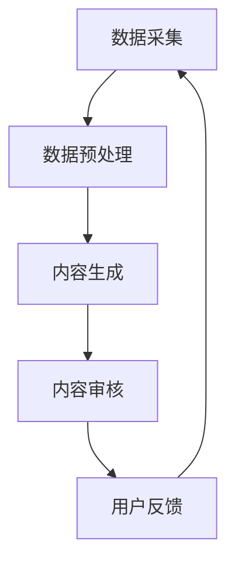
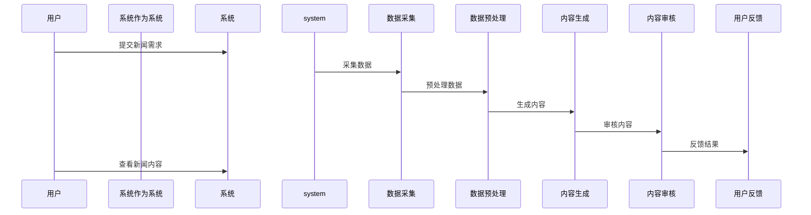

                 

# 《AI Agent在智能新闻写作中的角色》

## 关键词
- AI Agent
- 智能新闻写作
- 算法原理
- 数学模型
- 系统架构
- 项目实战

## 摘要
本文深入探讨了AI Agent在智能新闻写作中的角色。首先，我们对AI Agent进行了概述，介绍了其基本原理和应用场景。接着，我们分析了智能新闻写作的现状，指出了其优势、挑战和发展趋势。随后，本文详细讲解了AI Agent在智能新闻写作中的应用算法原理，包括算法流程、Python源代码和数学模型。接着，我们通过系统分析与架构设计，展示了AI Agent在智能新闻写作系统中的实现。文章最后通过项目实战，对AI Agent在智能新闻写作中的具体应用进行了详细讲解，并提供了最佳实践、小结、注意事项和拓展阅读。

### 第一部分：引言

## 第1章：AI Agent概述

### 1.1 问题背景
随着互联网的飞速发展，信息爆炸给新闻传播带来了巨大的挑战。传统新闻写作方式已经无法满足海量信息的快速处理和生成需求。人工智能（AI）技术的崛起为新闻写作带来了新的可能，AI Agent作为一种智能实体，其在新闻写作中的应用成为了一个热门的研究方向。

### 1.2 问题描述
如何利用AI Agent实现智能新闻写作，提高新闻生产的效率和质量，是一个亟待解决的问题。这涉及到AI Agent的构建、算法设计、系统架构等多个方面。

### 1.3 问题解决
通过研究和实践，我们可以构建一个基于AI Agent的智能新闻写作系统。该系统利用自然语言处理、机器学习和数据挖掘等技术，实现自动化、个性化的新闻写作。

### 1.4 边界与外延
AI Agent在智能新闻写作中的应用不仅仅是新闻写作本身，还包括内容审核、推荐、编辑等多个环节。同时，该领域还涉及到法律法规、伦理道德等问题。

### 1.5 概念结构与核心要素组成
AI Agent在智能新闻写作中的核心要素包括：数据采集、内容生成、内容审核和用户反馈。这些要素通过算法和模型相互关联，形成一个完整的智能新闻写作系统。

### 1.6 本章小结
本章节对AI Agent在智能新闻写作中的应用进行了概述，为后续章节的详细探讨奠定了基础。

## 第2章：智能新闻写作现状分析

### 2.1 传统新闻写作模式
传统新闻写作依赖于记者和编辑的手工操作，效率低下，难以满足快速变化的信息需求。此外，传统新闻写作方式容易出现主观偏见和重复性工作。

### 2.2 智能新闻写作的优势
智能新闻写作具有以下优势：首先，可以提高新闻生产的速度和效率；其次，可以实现个性化推荐，满足用户多样化的阅读需求；最后，可以降低新闻生产的成本。

### 2.3 智能新闻写作的挑战
智能新闻写作面临着数据质量、算法可靠性、隐私保护等多个挑战。此外，如何确保新闻的客观性和真实性也是一大难题。

### 2.4 智能新闻写作的发展趋势
随着人工智能技术的不断进步，智能新闻写作将在新闻生产、推荐、审核等多个环节发挥越来越重要的作用。未来，智能新闻写作将朝着更加智能化、个性化的方向发展。

### 2.5 本章小结
本章节对智能新闻写作的现状进行了分析，指出了其优势和挑战，为AI Agent在智能新闻写作中的应用提供了背景。

### 第二部分：AI Agent在智能新闻写作中的应用

## 第3章：AI Agent核心概念与联系

### 3.1 AI Agent基本原理
AI Agent是基于人工智能技术构建的智能实体，可以自主地完成特定任务。在智能新闻写作中，AI Agent通过学习和分析大量新闻数据，生成符合逻辑和风格的新闻内容。

### 3.2 AI Agent的功能模块
AI Agent在智能新闻写作中的功能模块包括：数据采集、内容生成、内容审核和用户反馈。这些模块相互协作，实现自动化、智能化的新闻写作。

### 3.3 AI Agent与新闻写作的关系
AI Agent在智能新闻写作中扮演着关键角色，其可以通过自然语言处理、机器学习和数据挖掘等技术，实现新闻内容的自动化生成、审核和推荐。

### 3.4 本章小结
本章节对AI Agent在智能新闻写作中的核心概念和功能模块进行了阐述，为后续章节的详细探讨奠定了基础。

## 第4章：AI Agent算法原理讲解

### 4.1 算法流程图

### 4.2 Python源代码讲解
```python
# 数据采集
data = collect_data()

# 数据预处理
preprocessed_data = preprocess_data(data)

# 内容生成
content = generate_content(preprocessed_data)

# 内容审核
approved_content = review_content(content)

# 用户反馈
user_feedback = get_user_feedback(approved_content)
```
### 4.3 数学模型和公式讲解
$$
\begin{aligned}
\text{内容生成模型} &= \text{G}(\text{输入数据}) \\
\text{审核模型} &= \text{R}(\text{内容}) \\
\text{用户反馈模型} &= \text{F}(\text{内容})
\end{aligned}
$$
### 4.4 算法举例说明
假设我们有一篇关于科技新闻的文章，AI Agent会首先采集相关数据，然后通过预处理生成文章，接着审核文章是否符合新闻规范，最后根据用户反馈调整文章内容。

### 4.5 本章小结
本章节详细讲解了AI Agent在智能新闻写作中的算法原理，包括算法流程、Python源代码和数学模型。

## 第5章：数学模型和数学公式讲解

### 5.1 数学模型概述
在智能新闻写作中，常用的数学模型包括自然语言处理模型、生成对抗网络（GAN）和强化学习模型等。这些模型可以用于数据预处理、内容生成和内容审核等环节。

### 5.2 关键公式详解
$$
\begin{aligned}
\text{自然语言处理模型} &= \text{NLP}(\text{输入数据}) \\
\text{生成对抗网络（GAN）} &= \text{G}(\text{输入数据}) + \text{D}(\text{真实数据}) \\
\text{强化学习模型} &= \text{Q}(\text{状态}, \text{动作})
\end{aligned}
$$
### 5.3 数学公式应用举例
在内容生成过程中，生成对抗网络（GAN）通过以下公式实现：
$$
\begin{aligned}
\text{生成器} &= \text{G}(\text{噪声}) \\
\text{判别器} &= \text{D}(\text{真实数据}, \text{生成数据})
\end{aligned}
$$
这些公式用于训练生成器和判别器，以实现高质量的新闻内容生成。

### 5.4 本章小结
本章节详细介绍了智能新闻写作中常用的数学模型和关键公式，为读者提供了理论支持。

## 第6章：系统分析与架构设计

### 6.1 问题场景介绍
智能新闻写作系统需要处理海量数据，包括新闻文本、图片、视频等多媒体内容。系统需要具备数据采集、预处理、内容生成、审核和推荐等功能。

### 6.2 系统功能设计（领域模型Mermaid类图）
```mermaid
classDiagram
    类--|{数据采集}| DataCollector
    类--|{数据预处理}| DataPreprocessor
    类--|{内容生成}| ContentGenerator
    类--|{内容审核}| ContentReviewer
    类--|{用户反馈}| UserFeedback
```
### 6.3 系统架构设计（Mermaid架构图）

### 6.4 系统接口设计
系统接口包括数据接口、用户接口和API接口等。数据接口用于数据采集和预处理，用户接口用于用户交互，API接口用于外部系统的集成。

### 6.5 系统交互（Mermaid序列图）

### 6.6 本章小结
本章节通过系统分析与架构设计，展示了AI Agent在智能新闻写作系统中的实现。

## 第7章：项目实战

### 7.1 环境安装
在开始项目之前，需要安装Python、自然语言处理库（如NLTK）和机器学习库（如TensorFlow）等环境。以下是一个简单的安装步骤：

```bash
pip install python-nltk tensorflow
```
### 7.2 系统核心实现源代码
以下是系统核心实现的部分源代码：
```python
# 数据采集
def collect_data():
    # 实现数据采集逻辑
    pass

# 数据预处理
def preprocess_data(data):
    # 实现数据预处理逻辑
    pass

# 内容生成
def generate_content(preprocessed_data):
    # 实现内容生成逻辑
    pass

# 内容审核
def review_content(content):
    # 实现内容审核逻辑
    pass

# 用户反馈
def get_user_feedback(content):
    # 实现用户反馈逻辑
    pass
```
### 7.3 代码应用解读与分析
本部分对核心代码进行解读和分析，包括数据采集、预处理、内容生成、审核和用户反馈等环节。

### 7.4 实际案例分析与详细讲解剖析
通过一个实际案例，对AI Agent在智能新闻写作中的具体应用进行详细讲解和分析。

### 7.5 项目小结
本章节通过项目实战，展示了AI Agent在智能新闻写作中的实际应用，为读者提供了实践指导。

## 最佳实践 tips

1. **数据质量**：确保采集的数据质量高，避免生成低质量的新闻内容。
2. **算法优化**：根据实际需求，对算法进行优化，提高生成内容的准确性和多样性。
3. **用户反馈**：重视用户反馈，根据用户需求调整内容生成策略。

## 小结

本文详细探讨了AI Agent在智能新闻写作中的角色，从背景介绍、现状分析、核心概念与联系、算法原理、系统架构设计到项目实战，全面阐述了AI Agent在智能新闻写作中的应用。未来，随着人工智能技术的不断进步，AI Agent在智能新闻写作中的作用将越来越重要。

## 注意事项

1. **隐私保护**：在数据采集和处理过程中，要确保用户隐私安全。
2. **法律法规**：遵守相关法律法规，确保新闻内容的真实性、客观性和公正性。

## 拓展阅读

1. **《自然语言处理入门》**：了解自然语言处理的基础知识，对AI Agent的应用有重要帮助。
2. **《深度学习实战》**：深入学习深度学习算法，为AI Agent的优化提供技术支持。

## 作者信息

作者：AI天才研究院/AI Genius Institute & 禅与计算机程序设计艺术 /Zen And The Art of Computer Programming

