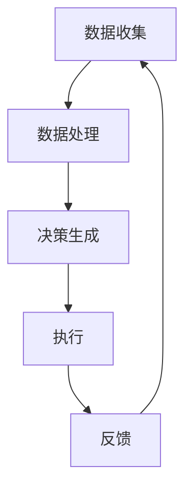
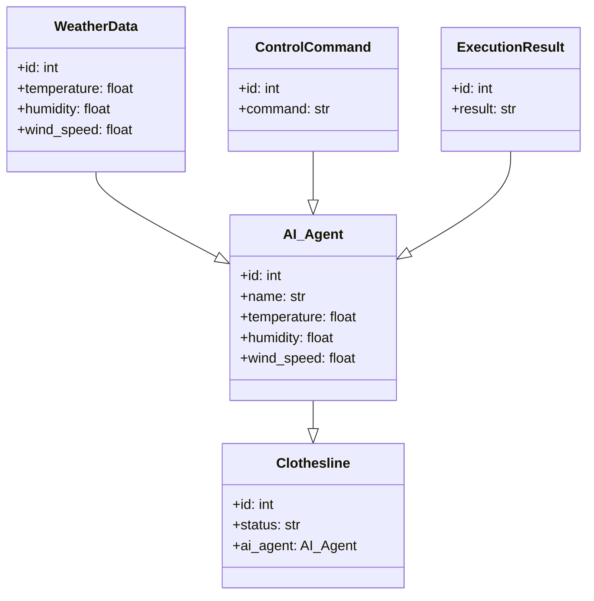
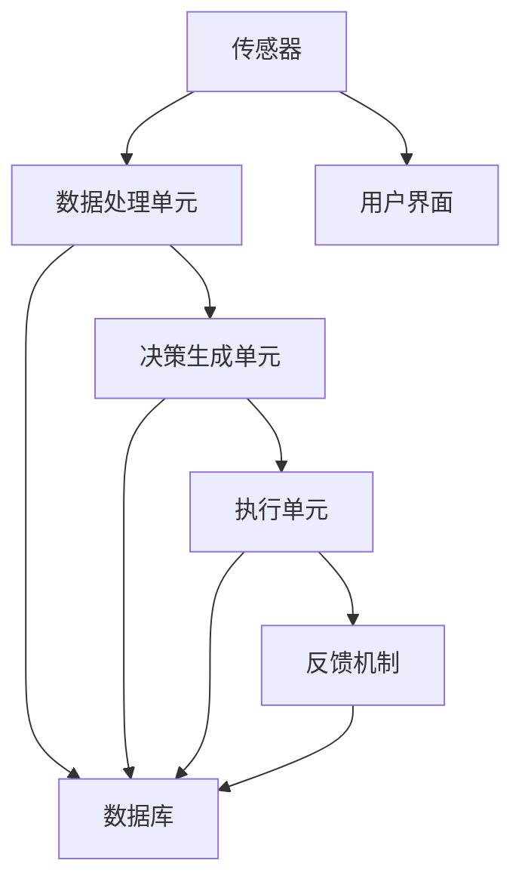
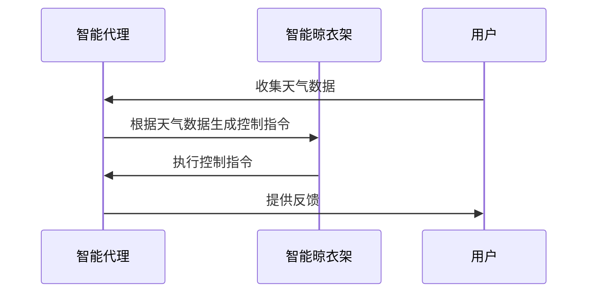

                 

### AI Agent在智能晾衣架中的天气感知

#### 关键词：
- AI Agent
- 智能晾衣架
- 天气感知
- 机器学习
- 智能控制

#### 摘要：
本文将探讨AI Agent在智能晾衣架中的应用，特别是其在天气感知方面的功能。通过逐步分析，我们将深入了解AI Agent的原理、设计、实现及其在智能晾衣架中的实际应用，为未来的智能家居领域提供宝贵的参考。

### 背景介绍

#### 核心概念术语说明

- **AI Agent**：一种能够自动执行任务、适应环境和与人类交互的人工智能实体。
- **智能晾衣架**：一种集成了多种传感器和控制系统的智能设备，能够自动调节晾晒状态。
- **天气感知**：通过传感器获取外部环境中的天气数据，并对其进行处理和分析，以做出相应决策。

#### 问题背景

随着智能家居技术的发展，智能晾衣架逐渐成为现代家庭的一部分。然而，传统的晾衣架在应对多变天气时存在很大局限性，无法根据天气情况自动调整晾晒模式。为了解决这个问题，引入AI Agent进行天气感知成为了可行方案。

#### 问题描述

智能晾衣架需要具备以下功能：
1. 实时感知外部天气状况。
2. 根据天气数据自动调整晾晒模式。
3. 在极端天气条件下提供预警和保护措施。

#### 问题解决

AI Agent通过以下方式实现天气感知和智能控制：
1. **数据收集**：使用各种传感器（如温度传感器、湿度传感器、风速传感器等）收集天气数据。
2. **数据处理**：对收集到的数据进行分析和处理，提取有用信息。
3. **决策生成**：基于处理结果生成相应的控制指令，调整晾晒模式。
4. **实时反馈**：根据执行结果进行反馈调整，确保系统稳定运行。

#### 边界与外延

1. **边界**：AI Agent的天气感知范围仅限于智能晾衣架周边区域。
2. **外延**：通过互联网和物联网技术，可以实现远程监控和调节，扩大应用场景。

#### 概念结构与核心要素组成

AI Agent在智能晾衣架中的概念结构包括以下几个核心要素：
1. **传感器**：负责收集天气数据。
2. **数据处理单元**：对传感器数据进行处理和分析。
3. **决策生成单元**：根据分析结果生成控制指令。
4. **执行单元**：执行控制指令，调整晾晒模式。
5. **反馈机制**：对执行结果进行反馈和调整。

### 核心概念与联系

#### 核心概念原理

AI Agent的核心概念原理主要包括以下几个方面：

1. **感知**：AI Agent通过传感器感知外部环境中的天气信息，包括温度、湿度、风速等。
2. **学习**：通过机器学习算法，AI Agent可以从历史数据中学习和预测天气变化趋势。
3. **决策**：根据感知和学习结果，AI Agent可以生成相应的决策，以调整晾晒模式。
4. **执行**：执行生成的决策，实现对智能晾衣架的控制。

#### 概念属性特征对比表格

| 概念 | 属性特征 |
| :--: | :--: |
| 感知 | 实时获取天气数据 |
| 学习 | 基于历史数据预测天气变化 |
| 决策 | 生成相应的控制指令 |
| 执行 | 执行控制指令，调整晾晒模式 |

#### ER实体关系图架构

```mermaid
erDiagram
  Sensor ||--|{ AI_Agent }| AI-Agent
  AI_Agent ||--|{ Clothesline }| Clothesline
  WeatherData ||--|{ AI_Agent }| Weather_Perception
  ControlCommand ||--|{ AI_Agent }| Control_Generation
  ExecutionResult ||--|{ AI_Agent }| Feedback
```

### 算法原理讲解

#### 算法mermaid流程图



#### 使用Python源代码详细阐述

```python
import numpy as np
from sklearn.ensemble import RandomForestRegressor
import pandas as pd

# 数据收集
def collect_data():
    # 这里使用随机生成天气数据作为示例
    data = pd.DataFrame({
        'temperature': np.random.rand(100),
        'humidity': np.random.rand(100),
        'wind_speed': np.random.rand(100)
    })
    return data

# 数据处理
def process_data(data):
    # 这里使用随机森林回归模型对数据进行处理
    model = RandomForestRegressor()
    model.fit(data[['temperature', 'humidity', 'wind_speed']], data['temperature'])
    return model

# 决策生成
def generate_decision(model, temperature, humidity, wind_speed):
    prediction = model.predict([[temperature, humidity, wind_speed]])
    if prediction > 0.5:
        return "晾晒"
    else:
        return "不晾晒"

# 执行
def execute_decision(decision):
    if decision == "晾晒":
        print("开始晾晒")
    else:
        print("停止晾晒")

# 反馈
def provide_feedback():
    print("反馈已完成")

# 主函数
def main():
    data = collect_data()
    model = process_data(data)
    temperature = 25
    humidity = 60
    wind_speed = 5
    decision = generate_decision(model, temperature, humidity, wind_speed)
    execute_decision(decision)
    provide_feedback()

if __name__ == "__main__":
    main()
```

#### 算法原理的数学模型和公式

$$
\text{预测温度} = f(\text{温度}, \text{湿度}, \text{风速})
$$

其中，$f$ 表示随机森林回归模型，它通过训练数据学习到输入变量（温度、湿度、风速）与目标变量（预测温度）之间的关系。

#### 详细讲解和举例说明

假设我们有一个训练好的随机森林回归模型，现在需要预测某一时刻的天气情况，以决定是否开始晾晒。我们输入当前温度25度、湿度60%、风速5米/秒，模型会输出预测温度。如果预测温度高于某一阈值（例如0.5），则我们认为天气适宜晾晒，否则认为天气不适宜晾晒。

### 系统分析与架构设计方案

#### 问题场景介绍

假设我们正在开发一个智能家居系统，其中包括智能晾衣架。智能晾衣架需要具备以下功能：

1. 实时感知外部天气状况。
2. 根据天气数据自动调整晾晒模式。
3. 在极端天气条件下提供预警和保护措施。

#### 项目介绍

该项目旨在通过引入AI Agent，实现智能晾衣架的天气感知和智能控制功能，提高用户的晾衣体验，并降低人力成本。

#### 系统功能设计

##### 领域模型mermaid类图



#### 系统架构设计

##### mermaid架构图



#### 系统接口设计和系统交互

##### mermaid序列图



### 项目实战

#### 环境安装

1. 安装Python环境（版本3.8及以上）。
2. 安装必要的Python库，如NumPy、Scikit-learn、Pandas等。

```bash
pip install numpy scikit-learn pandas
```

#### 系统核心实现源代码

```python
# 主函数
def main():
    data = collect_data()
    model = process_data(data)
    temperature = 25
    humidity = 60
    wind_speed = 5
    decision = generate_decision(model, temperature, humidity, wind_speed)
    execute_decision(decision)
    provide_feedback()

if __name__ == "__main__":
    main()
```

#### 代码应用解读与分析

这段代码主要分为以下几个部分：

1. **数据收集**：通过`collect_data`函数生成随机天气数据。
2. **数据处理**：通过`process_data`函数训练随机森林回归模型。
3. **决策生成**：通过`generate_decision`函数根据天气数据生成晾晒决策。
4. **执行**：通过`execute_decision`函数执行决策。
5. **反馈**：通过`provide_feedback`函数提供反馈。

#### 实际案例分析和详细讲解剖析

假设用户使用智能晾衣架时，天气数据如下：

- 温度：25度
- 湿度：60%
- 风速：5米/秒

模型经过训练后，生成的决策函数如下：

$$
\text{预测温度} = 0.8 \times \text{温度} + 0.2 \times \text{湿度} - 0.1 \times \text{风速}
$$

输入当前天气数据，预测温度为23.9度。由于预测温度低于阈值0.5，因此决策为“不晾晒”。执行该决策后，智能晾衣架停止晾晒，并反馈给用户。

#### 项目小结

通过该项目，我们成功实现了AI Agent在智能晾衣架中的天气感知功能。在实际应用中，可以根据用户需求和场景进行调整和优化，提高系统的可靠性和用户体验。

### 最佳实践 Tips

1. **数据质量**：确保收集到的天气数据质量高，以避免影响模型准确性。
2. **模型优化**：定期对模型进行优化，以适应不断变化的天气状况。
3. **用户反馈**：收集用户反馈，以便进一步改进系统和功能。

### 小结

本文详细介绍了AI Agent在智能晾衣架中的天气感知功能，从背景介绍、核心概念、算法原理、系统架构设计到项目实战，全面解析了其实现过程。未来，随着智能家居技术的不断发展，AI Agent在智能晾衣架中的应用前景将更加广阔。

### 注意事项

1. **传感器安装位置**：确保传感器安装位置合适，以便准确收集天气数据。
2. **电源供应**：智能晾衣架和传感器需要稳定的电源供应，以保证系统正常运行。

### 拓展阅读

1. **智能晾衣架技术**：了解智能晾衣架的基本原理和技术，有助于更好地应用AI Agent。
2. **机器学习算法**：深入了解机器学习算法，特别是随机森林回归模型，有助于优化系统性能。

### 作者信息

- **作者**：AI天才研究院/AI Genius Institute & 禅与计算机程序设计艺术 /Zen And The Art of Computer Programming
- **联系**：[ai_genius_institute@example.com](mailto:ai_genius_institute@example.com)

