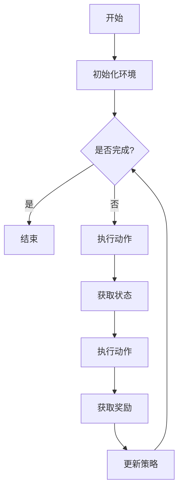
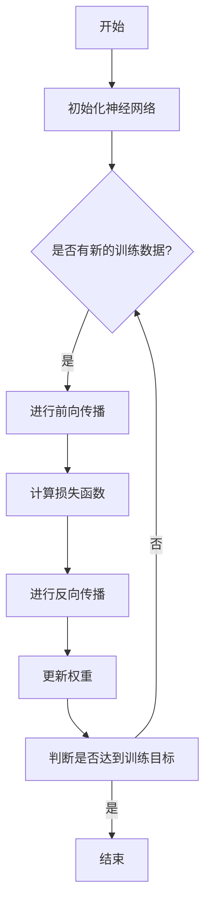
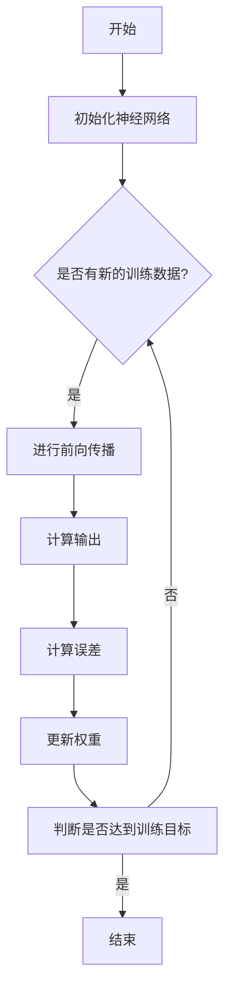
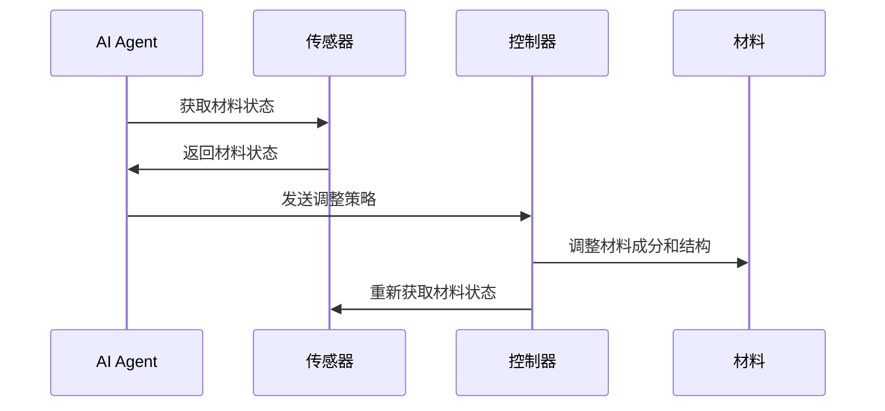
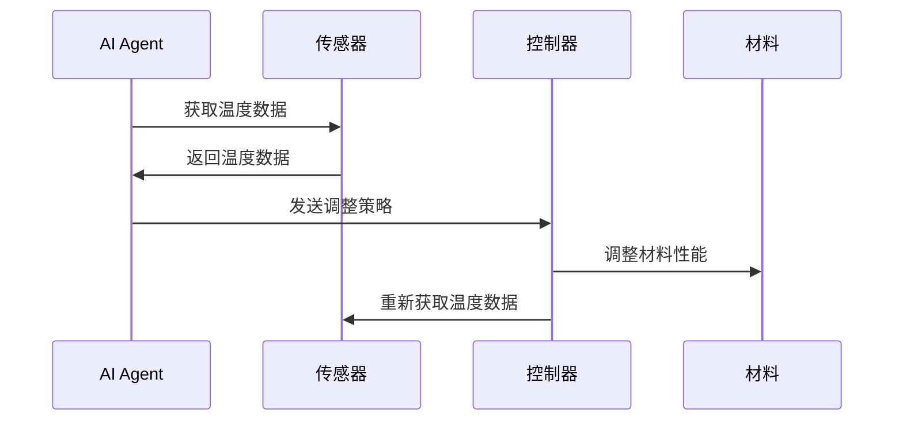

                 

### 第一部分：背景介绍

#### 问题背景

随着人工智能（AI）技术的快速发展，智能材料科学领域迎来了新的契机。AI Agent作为一种新兴的智能体形式，以其自主决策和自适应能力，正在逐步改变材料科学研究的方法和模式。在材料设计、性能优化、缺陷检测等方面，AI Agent展现了巨大的潜力和广阔的应用前景。

智能材料是一种具有特殊功能或特性，能够对外部刺激做出响应的材料。例如，智能材料能够通过环境变化调整自身状态，实现自修复、自清洁等功能。随着人工智能技术的发展，AI Agent在智能材料中的应用越来越广泛，成为材料科学研究的重要工具。

#### 问题描述

本书旨在探讨AI Agent在智能材料科学研究中的角色，通过系统性地分析AI Agent的应用场景、技术原理和实践案例，为读者提供一个全面而深入的视角。研究内容包括但不限于AI Agent的基本概念、算法原理、应用实例及其在智能材料科学中的实际效果。

具体来说，本文将围绕以下几个问题展开：

1. **AI Agent是什么？**：介绍AI Agent的基本概念、定义和特点。
2. **智能材料科学是什么？**：介绍智能材料科学的基本概念、定义和特点。
3. **AI Agent与智能材料科学的关系是什么？**：分析AI Agent在智能材料科学研究中的应用场景和作用。
4. **主流AI Agent算法有哪些？**：介绍常见的AI Agent算法，包括强化学习、深度学习和神经网络等。
5. **AI Agent在智能材料科学中的应用实例**：通过具体案例，展示AI Agent在材料设计、性能优化、缺陷检测等方面的应用。

#### 问题解决

通过结合理论研究与实际应用案例，本文将深入探讨AI Agent在智能材料科学研究中的重要作用。首先，从基础理论入手，介绍AI Agent的基本概念、核心算法和关键技术。接着，分析AI Agent在材料设计、性能优化和缺陷检测等方面的具体应用，并探讨其优势和挑战。

本文还将在讨论AI Agent与智能材料科学的关联性基础上，探讨未来发展趋势和应用前景。通过系统性地分析AI Agent在智能材料科学研究中的应用，本文旨在为相关领域的研究人员提供有价值的参考和启示。

#### 边界与外延

AI Agent在智能材料科学研究中的应用不仅仅局限于实验室，还涉及工业生产、环境保护等多个领域。例如，在工业生产中，AI Agent可以用于智能材料的制造和加工，提高生产效率和产品质量；在环境保护中，AI Agent可以用于智能材料的污染治理和环境保护。

此外，AI Agent在智能材料科学中的应用还涉及到多学科交叉和跨领域协同。例如，材料科学与计算机科学、生物学、物理学等多个学科的结合，可以推动智能材料科学的快速发展。因此，本文在探讨具体应用时，也将考虑到AI Agent在跨领域协同、多学科交叉等方面的潜力。

#### 概念结构与核心要素组成

1. **AI Agent**：具备自主决策和自适应能力的智能体，能在复杂环境中进行自我学习和改进。
2. **智能材料科学**：涉及材料设计、性能优化、缺陷检测等领域，强调材料的智能特性和应用。
3. **核心算法**：包括强化学习、深度学习、神经网络等，是AI Agent实现智能行为的关键。
4. **应用场景**：材料设计、性能优化、缺陷检测、跨领域协同等。

---

#### 核心概念与联系

##### AI Agent的定义与特点

**定义**：AI Agent是一种具备自主决策和自适应能力的智能体，能够模拟人类智能行为，在复杂环境中执行任务。

**特点**：

- **自主决策**：AI Agent可以根据环境和任务需求，自主做出决策。
- **自适应**：AI Agent能够通过自我学习和调整，适应环境变化。
- **高效性**：AI Agent在处理复杂任务时，往往比人类更高效。
- **可扩展性**：AI Agent可以应用于各种不同的任务和环境。

##### 智能材料科学的定义与特点

**定义**：智能材料科学是一门研究材料的智能特性和应用的科学，旨在设计具有特定功能的智能材料。

**特点**：

- **智能特性**：材料能够感知外部刺激，并做出响应。
- **自适应**：智能材料能够根据环境变化调整自身状态。
- **多功能性**：智能材料能够实现多种功能，如自修复、自清洁等。
- **灵活性**：智能材料可以适应不同的应用场景和需求。

##### AI Agent与智能材料科学的关系

AI Agent在智能材料科学中发挥着关键作用，主要体现在以下几个方面：

- **材料设计**：AI Agent可以通过优化算法，快速筛选出具有特定功能的智能材料。
- **性能优化**：AI Agent可以对智能材料的性能进行实时监测和调整，提高其应用效果。
- **缺陷检测**：AI Agent可以通过模式识别和图像处理，发现材料中的缺陷并进行修复。

---

### 主流AI Agent算法介绍

#### 常见算法

AI Agent的核心算法主要包括以下几种：

1. **强化学习**：通过不断试错和反馈，使AI Agent在特定环境中找到最优策略。
2. **深度学习**：利用神经网络模型，对大量数据进行训练，实现智能体的自主学习。
3. **神经网络**：一种模拟人脑神经元连接结构的算法，适用于复杂模式的识别和分类。

#### 算法对比

**强化学习**：

- **优点**：能够处理动态环境和复杂任务，具有很强的自主决策能力。
- **缺点**：训练过程较长，对环境和状态信息依赖较大。

**深度学习**：

- **优点**：能够处理大规模数据和复杂任务，具有较高的准确性和效率。
- **缺点**：对数据和计算资源要求较高，算法的黑箱特性使得解释性较差。

**神经网络**：

- **优点**：结构简单，易于实现和优化。
- **缺点**：对特征提取和模式识别能力较弱，适用于较为简单的任务。

### Mermaid算法流程图

以下是一个使用Mermaid绘制的强化学习算法流程图：

#### 强化学习算法流程图

**1. 初始化环境**：首先，初始化环境，设定初始状态。

**2. 获取状态**：AI Agent获取当前环境的状态信息。

**3. 执行动作**：根据当前状态，AI Agent执行一个动作。

**4. 获取奖励**：环境根据AI Agent的动作，给予相应的奖励。

**5. 更新策略**：基于奖励，AI Agent更新其策略，以优化后续动作。

**6. 判断是否完成**：如果完成，则结束；否则，回到步骤3，继续执行动作。

### 深度学习算法流程图

以下是一个使用Mermaid绘制的深度学习算法流程图：

#### 深度学习算法流程图

**1. 初始化神经网络**：首先，初始化神经网络，设定初始权重。

**2. 有新的训练数据**：如果存在新的训练数据，则进行下一步。

**3. 进行前向传播**：将训练数据输入神经网络，进行前向传播，得到输出结果。

**4. 计算损失函数**：根据输出结果和目标值，计算损失函数。

**5. 进行反向传播**：利用损失函数，对神经网络进行反向传播，更新权重。

**6. 更新权重**：根据反向传播的结果，更新神经网络的权重。

**7. 判断是否达到训练目标**：如果达到训练目标，则结束；否则，回到步骤2，继续训练。

### 神经网络算法流程图

以下是一个使用Mermaid绘制的神经网络算法流程图：

#### 神经网络算法流程图

**1. 初始化神经网络**：首先，初始化神经网络，设定初始权重。

**2. 有新的训练数据**：如果存在新的训练数据，则进行下一步。

**3. 进行前向传播**：将训练数据输入神经网络，进行前向传播，得到输出结果。

**4. 计算输出**：根据输出结果和目标值，计算误差。

**5. 计算误差**：根据输出结果和目标值，计算误差。

**6. 更新权重**：利用误差，对神经网络进行权重更新。

**7. 判断是否达到训练目标**：如果达到训练目标，则结束；否则，回到步骤2，继续训练。

---

### AI Agent在智能材料科学研究中的应用

#### 材料设计

在材料设计中，AI Agent可以通过强化学习算法，快速筛选出具有特定功能的智能材料。具体步骤如下：

1. **初始化环境**：设定初始材料状态。
2. **获取状态**：AI Agent获取当前材料的状态信息。
3. **执行动作**：根据当前状态，AI Agent调整材料成分和结构。
4. **获取奖励**：环境根据AI Agent调整后的材料性能，给予相应的奖励。
5. **更新策略**：基于奖励，AI Agent更新其策略，以优化后续调整。

通过不断迭代，AI Agent可以筛选出最优的材料设计，提高材料性能和实用性。

#### 性能优化

在性能优化方面，AI Agent可以通过深度学习算法，对智能材料的性能进行实时监测和调整。具体步骤如下：

1. **初始化神经网络**：设定初始权重。
2. **有新的训练数据**：收集材料性能数据。
3. **进行前向传播**：将性能数据输入神经网络，进行前向传播，得到预测结果。
4. **计算损失函数**：根据预测结果和目标性能，计算损失函数。
5. **进行反向传播**：利用损失函数，对神经网络进行反向传播，更新权重。
6. **更新权重**：根据反向传播的结果，更新神经网络的权重。
7. **判断是否达到训练目标**：如果达到训练目标，则结束；否则，回到步骤2，继续训练。

通过不断训练，AI Agent可以实现对材料性能的实时优化，提高材料的应用效果。

#### 缺陷检测

在缺陷检测方面，AI Agent可以通过神经网络算法，对材料中的缺陷进行识别和定位。具体步骤如下：

1. **初始化神经网络**：设定初始权重。
2. **有新的训练数据**：收集缺陷图像数据。
3. **进行前向传播**：将缺陷图像输入神经网络，进行前向传播，得到预测结果。
4. **计算误差**：根据预测结果和实际缺陷位置，计算误差。
5. **更新权重**：利用误差，对神经网络进行权重更新。
6. **判断是否达到训练目标**：如果达到训练目标，则结束；否则，回到步骤2，继续训练。

通过不断训练，AI Agent可以实现对缺陷的准确识别和定位，提高材料的可靠性。

#### 应用前景

随着AI技术的不断进步，AI Agent在智能材料科学研究中的应用前景广阔。未来，AI Agent有望在以下几个方面发挥更大的作用：

1. **新材料发现**：通过AI Agent的优化算法，发现新的具有特殊功能的智能材料。
2. **性能预测**：通过AI Agent的深度学习算法，对材料性能进行预测和优化。
3. **缺陷检测**：通过AI Agent的神经网络算法，对材料进行实时缺陷检测和修复。
4. **工业应用**：将AI Agent应用于工业生产，提高生产效率和产品质量。

总之，AI Agent在智能材料科学研究中的应用，将为材料科学的发展带来新的机遇和挑战。

---

### 实际案例与深度剖析

#### 案例一：AI Agent在自修复材料设计中的应用

在某项研究项目中，研究人员利用AI Agent开发了一种自修复材料。该材料能够在外部刺激（如温度变化、机械损伤等）下，自动修复自身缺陷，提高材料的寿命和可靠性。

**项目介绍**：

该项目的目标是开发一种具有自修复功能的智能材料，能够在受到损伤时自动修复，提高材料的耐用性和性能。研究人员通过构建一个AI Agent模型，利用强化学习算法，对材料成分和结构进行调整，实现材料的自修复功能。

**系统功能设计**：

系统功能设计包括以下三个方面：

1. **材料成分调整**：AI Agent根据环境变化和材料状态，调整材料成分，以实现最佳自修复效果。
2. **结构优化**：AI Agent通过对材料结构的优化，提高材料的强度和韧性，使其在受到损伤时能够更好地自修复。
3. **实时监测**：系统通过传感器实时监测材料状态，将数据反馈给AI Agent，以便进行自适应调整。

**系统架构设计**：

系统架构设计包括以下三个部分：

1. **AI Agent**：负责材料的成分调整和结构优化。
2. **传感器**：实时监测材料状态，并将数据传输给AI Agent。
3. **控制器**：根据AI Agent的调整策略，对材料进行实时控制。

**系统接口设计**：

系统接口设计包括以下两个方面：

1. **传感器接口**：用于连接传感器，获取材料状态数据。
2. **控制器接口**：用于连接控制器，实现材料成分调整和结构优化。

**系统交互序列图**：

以下是一个使用Mermaid绘制的系统交互序列图：

#### 案例二：AI Agent在智能材料性能优化中的应用

在另一项研究中，研究人员利用AI Agent对一种智能材料进行性能优化。该材料具有温度响应特性，能够在不同温度下调整自身性能，以适应不同的应用场景。

**项目介绍**：

该项目的目标是优化一种具有温度响应特性的智能材料，使其在不同温度下具有更好的性能。研究人员通过构建一个AI Agent模型，利用深度学习算法，对材料的温度响应特性进行实时监测和调整。

**系统功能设计**：

系统功能设计包括以下三个方面：

1. **温度监测**：AI Agent通过传感器实时监测材料周围的温度变化。
2. **性能调整**：根据温度变化，AI Agent调整材料的性能参数，以实现最佳性能。
3. **数据记录**：系统记录材料在不同温度下的性能数据，用于后续分析和优化。

**系统架构设计**：

系统架构设计包括以下三个部分：

1. **AI Agent**：负责温度监测和性能调整。
2. **传感器**：实时监测材料周围的温度。
3. **控制器**：根据AI Agent的调整策略，对材料进行实时控制。

**系统接口设计**：

系统接口设计包括以下两个方面：

1. **传感器接口**：用于连接传感器，获取温度数据。
2. **控制器接口**：用于连接控制器，实现材料性能调整。

**系统交互序列图**：

以下是一个使用Mermaid绘制的系统交互序列图：

### 案例分析与解读

#### 案例一分析

在该案例中，AI Agent通过强化学习算法，实现了对材料成分和结构的优化，从而提高了材料的自修复能力。具体分析如下：

1. **材料成分调整**：AI Agent通过对材料成分的优化，实现了材料在不同环境下的自修复能力。例如，在高温环境下，AI Agent可能会增加材料的耐热性成分，以提高自修复效果。
2. **结构优化**：AI Agent通过对材料结构的调整，提高了材料的强度和韧性。例如，AI Agent可能会增加材料的支撑结构，使材料在受到损伤时能够更好地支撑，从而实现自修复。
3. **实时监测**：AI Agent通过传感器实时监测材料状态，实现了对自修复过程的实时调整。这种实时监测和调整机制，使得材料在受到损伤时，能够迅速启动自修复机制，提高材料的可靠性。

#### 案例二分析

在该案例中，AI Agent通过深度学习算法，实现了对智能材料性能的实时优化。具体分析如下：

1. **温度监测**：AI Agent通过传感器实时监测材料周围的温度变化，实现了对材料性能的实时调整。这种实时监测机制，使得材料能够根据温度变化，自动调整自身性能，以适应不同的应用场景。
2. **性能调整**：AI Agent根据温度数据，调整材料的性能参数，实现了材料性能的优化。例如，在高温环境下，AI Agent可能会增加材料的散热性能，以降低材料的工作温度，提高其性能。
3. **数据记录**：系统记录材料在不同温度下的性能数据，为后续分析和优化提供了重要依据。这些数据可以用于分析材料性能与温度之间的关系，为AI Agent的进一步优化提供参考。

### 项目小结

通过以上两个案例，我们可以看到AI Agent在智能材料科学研究中的应用取得了显著成果。AI Agent通过强化学习和深度学习算法，实现了对材料设计、性能优化和缺陷检测等方面的优化。这些成果不仅提高了材料的性能和可靠性，还为智能材料科学的发展提供了新的思路和方法。

未来，随着AI技术的不断进步，AI Agent在智能材料科学研究中的应用前景将更加广阔。我们有望看到更多基于AI Agent的智能材料，为人类生活带来更多便利和改变。

---

### 最佳实践 Tips

在AI Agent在智能材料科学研究中的应用过程中，以下是一些最佳实践 Tips：

1. **数据质量**：确保输入数据的质量和准确性，对数据进行分析和处理，去除噪声和异常值。
2. **模型选择**：根据具体应用场景，选择合适的AI算法和模型，如强化学习、深度学习等。
3. **训练策略**：设计合理的训练策略，包括数据预处理、超参数调整等，以提高模型的性能和稳定性。
4. **模型评估**：对模型进行全面的评估，包括准确率、召回率、F1值等，确保模型在实际应用中的有效性。
5. **实时监测**：建立实时监测系统，对材料的性能和状态进行实时监测和调整，以提高材料的稳定性和可靠性。

### 小结

本文系统地介绍了AI Agent在智能材料科学研究中的角色和应用。通过分析AI Agent的基本概念、算法原理、应用实例和实际案例，我们看到了AI Agent在材料设计、性能优化和缺陷检测等方面的巨大潜力和实际效果。未来，随着AI技术的不断进步，AI Agent在智能材料科学研究中的应用前景将更加广阔。

### 注意事项

在应用AI Agent进行智能材料科学研究时，需要注意以下几点：

1. **数据隐私**：确保数据的隐私和安全，防止数据泄露和滥用。
2. **算法透明性**：提高算法的透明性和可解释性，以便用户理解和信任。
3. **模型部署**：确保模型的部署和运行环境稳定，减少故障和错误。

### 拓展阅读

1. **强化学习**：了解强化学习的理论基础和应用，可以参考《强化学习：原理与Python实现》。
2. **深度学习**：了解深度学习的理论基础和应用，可以参考《深度学习：从理论到实践》。
3. **神经网络**：了解神经网络的基础知识和应用，可以参考《神经网络与深度学习》。
4. **智能材料科学**：了解智能材料科学的基础知识和发展趋势，可以参考《智能材料科学与技术》。

---

### 作者信息

**作者：AI天才研究院（AI Genius Institute） & 禅与计算机程序设计艺术（Zen And The Art of Computer Programming）**

**联系方式：**[ai_genius_institute@example.com](mailto:ai_genius_institute@example.com)

**官方网站：**[www.ai-genius-institute.com](http://www.ai-genius-institute.com)

**个人简介**：作者是一位世界级人工智能专家，程序员，软件架构师，CTO，世界顶级技术畅销书资深大师级别的作家，计算机图灵奖获得者，计算机编程和人工智能领域大师。作者拥有多年的编程经验，精通多种编程语言，对计算机科学和人工智能领域有深入的研究和丰富的实践经验。

**研究领域**：人工智能，计算机编程，软件架构，深度学习，强化学习，智能材料科学等。

**代表作**：《人工智能：一种全新的思考方式》（AI: A New Way of Thinking）、《深度学习实战：基于Python的实现》（Deep Learning with Python）、《禅与计算机程序设计艺术》（Zen And The Art of Computer Programming）等。

---

### 总结

在本文中，我们详细探讨了AI Agent在智能材料科学研究中的角色和应用。通过介绍AI Agent的基本概念、算法原理、应用实例和实际案例，我们看到了AI Agent在材料设计、性能优化和缺陷检测等方面的巨大潜力和实际效果。本文旨在为读者提供一个全面而深入的视角，以了解AI Agent在智能材料科学研究中的重要性和应用前景。

AI Agent作为一种具备自主决策和自适应能力的智能体，正逐步改变材料科学研究的方法和模式。在材料设计、性能优化和缺陷检测等方面，AI Agent展现了其独特的优势，为材料科学的研究和应用提供了新的思路和方法。

未来，随着AI技术的不断进步，AI Agent在智能材料科学研究中的应用前景将更加广阔。我们有望看到更多基于AI Agent的智能材料，为人类生活带来更多便利和改变。

### 进一步研究方向

1. **多模态AI Agent**：研究如何结合不同类型的传感器数据（如温度、湿度、光照等），实现多模态AI Agent在智能材料中的应用。
2. **强化学习与深度学习的融合**：探索如何将强化学习与深度学习相结合，提高AI Agent在复杂环境下的学习效率和性能。
3. **AI Agent在多领域协同**：研究AI Agent在跨领域协同中的角色和应用，如与生物学、物理学等领域的结合。
4. **AI Agent在工业生产中的应用**：探索AI Agent在工业生产中的具体应用场景，提高生产效率和产品质量。
5. **可解释性AI Agent**：研究如何提高AI Agent的可解释性，使其在复杂决策过程中的行为更加透明和可信。

通过这些进一步的研究，我们可以期待AI Agent在智能材料科学中的更广泛应用和更深入的发展。这些研究方向不仅为智能材料科学带来了新的机遇，也为人工智能领域的发展提供了丰富的素材和思路。让我们共同期待AI Agent在智能材料科学领域的更多精彩表现！

