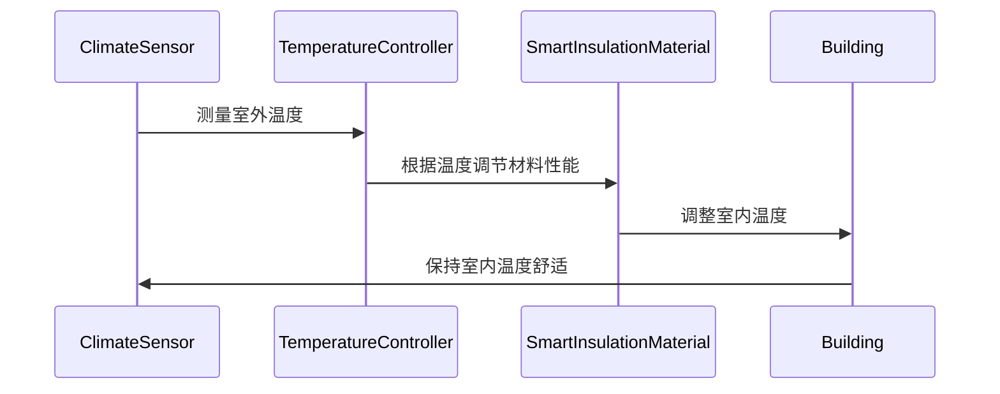
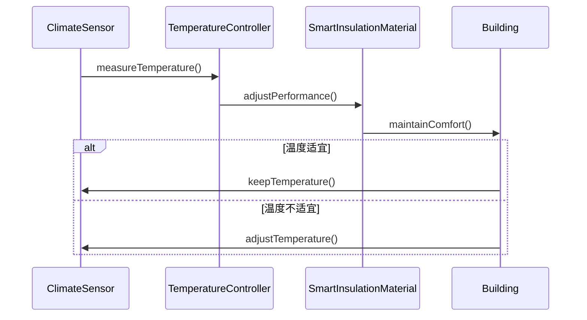
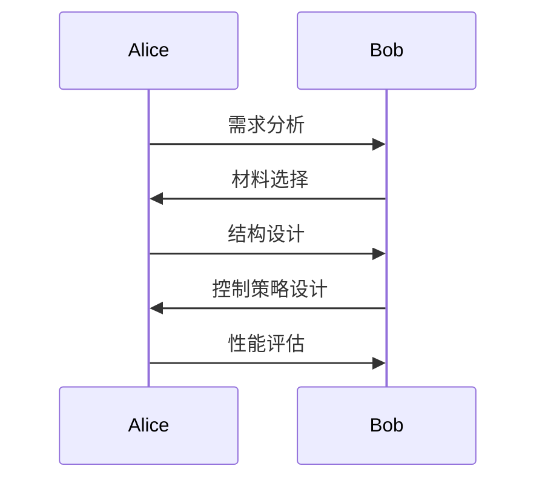
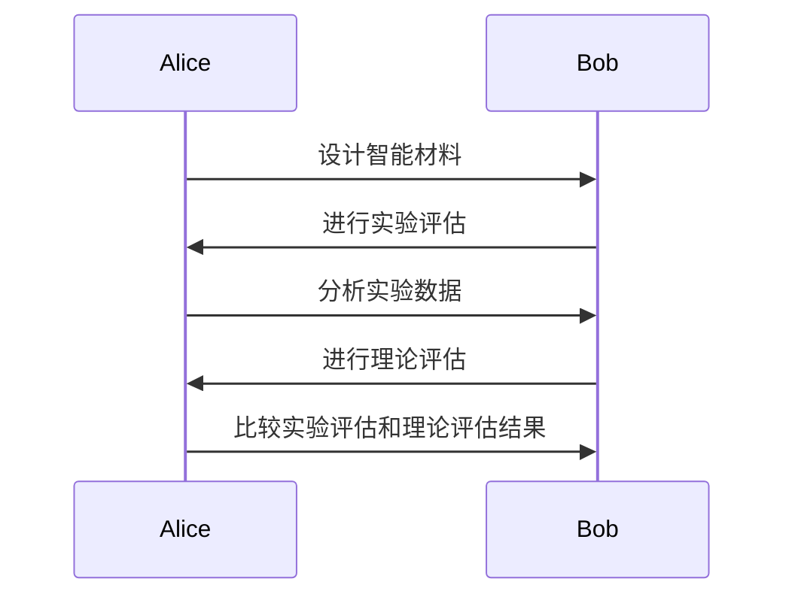

                 

### 第1章：AI Agent概述

#### 1.1 AI Agent的概念

AI Agent，即人工智能代理，是指能够自主感知环境、决策行动并与其他实体交互的智能实体。在人工智能领域，AI Agent被广泛认为是实现智能化的关键。AI Agent不仅可以执行简单的任务，如路径规划、目标追踪，还可以进行复杂的决策和问题解决，如自动驾驶、智能助手等。

#### 1.1.1 人工智能与代理系统的关系

人工智能（Artificial Intelligence，简称AI）是指通过计算机程序实现人类智能或模拟人类智能的技术。AI Agent是人工智能的一个分支，它强调的是智能体在动态环境中的自主行为和智能决策。人工智能与代理系统的关系可以简单理解为：代理系统是人工智能的一种具体实现形式，它利用人工智能技术来实现自主行为和智能决策。

#### 1.1.2 AI Agent的定义与分类

AI Agent的定义可以概括为：具有感知、决策、行动能力的智能实体。根据感知环境的方式、决策机制和行动方式的差异，AI Agent可以分为多种类型：

1. **感知型代理**：主要通过传感器感知环境信息，如摄像头、麦克风、GPS等。
2. **决策型代理**：通过算法模型对感知到的环境信息进行分析，做出决策。
3. **行动型代理**：根据决策结果，执行具体的行动，如移动、开关控制等。
4. **社交型代理**：具备与人类或其他智能体进行交互的能力，如聊天机器人、虚拟助手等。

#### 1.2 智能材料设计背景

智能材料（Smart Materials）是指能够响应外部刺激（如光、电、热、力等）并发生相应变化的新型功能材料。智能材料的出现，为材料科学、工程学和信息技术等多个领域带来了新的机遇和挑战。

#### 1.2.1 智能材料的概念

智能材料是一种具有感知、响应和自适应能力的新型材料。它们能够根据外部环境的改变，自动调整自身性能，如形状、颜色、硬度、导电性等。这种自我调节和自适应的特性，使得智能材料在许多应用领域具有巨大的潜力。

#### 1.2.2 智能材料的发展历史

智能材料的研究始于20世纪70年代，早期的研究主要集中在记忆合金、形状记忆聚合物等材料。随着计算机技术、传感器技术和控制技术的发展，智能材料的研究逐渐深入，应用领域也越来越广泛。

#### 1.2.3 AI Agent在智能材料设计中的应用前景

AI Agent在智能材料设计中的应用前景广阔。首先，AI Agent可以用于智能材料的性能优化和制备过程控制，提高材料的性能和稳定性。其次，AI Agent可以帮助设计更加复杂和智能的智能材料系统，如自适应结构、智能传感器网络等。最后，AI Agent可以为智能材料的应用提供更加智能化的解决方案，如智能建筑、智能医疗等。

### 概念与联系

为了更好地理解AI Agent与智能材料设计之间的关系，我们可以通过以下表格和ER实体关系图进行阐述。

#### 概念属性特征对比表格

| 类别     | AI Agent                                           | 智能材料                                           |
|----------|----------------------------------------------------|----------------------------------------------------|
| 定义     | 具有感知、决策、行动能力的智能实体                 | 具有感知、响应、自适应能力的新型功能材料               |
| 目的     | 实现自主行为和智能决策                           | 根据环境变化调整自身性能                           |
| 应用领域 | 自动驾驶、智能助手、机器人等                     | 智能建筑、医疗、航空航天等                         |
| 关键技术 | 机器学习、深度学习、强化学习等                   | 应变材料、热敏材料、电致变色材料等                  |

#### ER实体关系图

```mermaid
erDiagram
    AI-Agent ||--|{ 智能材料 }|-->: 应对环境变化
    智能材料 ||--|{ AI-Agent }|-->: 提供响应机制
```

通过上述表格和ER实体关系图，我们可以清晰地看到AI Agent与智能材料之间的相互作用和依赖关系。AI Agent通过感知、决策和行动，实现对智能材料的控制和优化，而智能材料则通过自身的响应和自适应特性，为AI Agent提供更加智能化的解决方案。

### 数学模型与公式

在智能材料设计中，AI Agent的关键技术如机器学习、深度学习、强化学习等算法都涉及大量的数学模型与公式。以下是一个简化的强化学习算法的数学模型和公式示例。

#### 强化学习算法数学模型

1. **状态-动作值函数**：

$$ V^*(s) = \sum_{a \in A} \gamma \cdot \pi(a|s) \cdot Q^*(s, a) $$

其中，$V^*(s)$ 是状态 $s$ 的最优值函数，$\gamma$ 是折扣因子，$\pi(a|s)$ 是在状态 $s$ 下采取动作 $a$ 的概率，$Q^*(s, a)$ 是状态-动作值函数。

2. **状态-动作值函数更新规则**：

$$ Q^{new}(s, a) = Q^{old}(s, a) + \alpha \cdot (r + \gamma \cdot \max_{a'} Q^{old}(s', a') - Q^{old}(s, a)) $$

其中，$Q^{new}(s, a)$ 和 $Q^{old}(s, a)$ 分别是更新前后的状态-动作值函数，$\alpha$ 是学习率，$r$ 是立即回报，$s'$ 和 $a'$ 是下一步的状态和动作。

3. **策略迭代**：

$$ \pi^{new}(a|s) = \begin{cases} 
1, & \text{if } a = \arg\max_{a'} Q^{new}(s, a') \\
0, & \text{otherwise}
\end{cases} $$

其中，$\pi^{new}(a|s)$ 是更新后的策略。

#### 示例

假设一个智能材料需要根据环境温度（状态 $s$）来调整其性能（动作 $a$）。状态空间为 $s \in \{0, 1, 2\}$，动作空间为 $a \in \{0, 1\}$。温度低于20°C时，智能材料应该调整到低性能状态（动作0），温度高于30°C时，智能材料应该调整到高性能状态（动作1）。温度在20°C到30°C之间时，智能材料保持当前状态。

折扣因子 $\gamma = 0.9$，学习率 $\alpha = 0.1$。在初始状态下，智能材料的动作选择概率均匀分布，即 $\pi(a|s) = \frac{1}{2}$。

通过上述公式，智能材料可以根据环境温度和回报（例如温度变化的程度）来调整其性能状态，以实现最优的性能。

### 系统分析与架构设计方案

为了详细阐述AI Agent在智能材料设计中的应用，我们需要进行系统分析与架构设计方案。

#### 问题场景介绍

假设我们设计一个智能材料系统，用于调整建筑物的室内温度。系统需要根据室内外温度差异，自动调整建筑物的隔热材料性能，以保持室内温度舒适。

#### 项目介绍

项目名称：智能温度调节材料系统

目标：实现室内温度的自动调节，提高建筑物的能源效率。

技术栈：AI Agent、传感器、智能材料、控制器。

#### 系统功能设计（领域模型）

领域模型主要描述系统中的核心实体和它们之间的关系。以下是一个简化的领域模型类图。

```mermaid
classDiagram
    ClimateSensor <<(室外温度传感器) Entity>
    TemperatureController <<(温度控制器) Entity>
    SmartInsulationMaterial <<(智能隔热材料) Entity>
    Building <<(建筑物) Entity>>

    ClimateSensor --|{ 测量 }|> TemperatureController
    TemperatureController --|{ 控制 }|> SmartInsulationMaterial
    SmartInsulationMaterial --|{ 调整 }|> Building
    Building --|{ 保持 }|> ClimateSensor
```

#### 系统架构设计

系统架构设计主要描述系统的整体结构和各个模块之间的交互关系。以下是一个简化的系统架构图。



#### 系统接口设计

系统接口设计主要描述系统内部各个模块之间的接口和协议。以下是一个简化的接口设计图。

```mermaid
classDiagram
    ClimateSensor <<(室外温度传感器) Interface>
    TemperatureController <<(温度控制器) Interface>
    SmartInsulationMaterial <<(智能隔热材料) Interface>
    Building <<(建筑物) Interface>>

    ClimateSensor : +measureTemperature(): float
    TemperatureController : +controlTemperature(): void
    SmartInsulationMaterial : +adjustPerformance(): void
    Building : +maintainComfort(): bool
```

#### 系统交互

系统交互设计主要描述系统在不同状态下的行为和响应。以下是一个简化的系统交互序列图。



### 项目实战

#### 环境安装

首先，我们需要安装所需的软件和库。以下是安装步骤：

1. 安装Python环境（版本3.7以上）。
2. 安装AI-Agent框架（使用pip安装：`pip install ai-agent`）。
3. 安装传感器库（使用pip安装：`pip install pyserial`）。

#### 系统核心实现

以下是系统的核心实现源代码：

```python
# 导入所需的库
import ai_agent
import serial
import time

# 初始化传感器和控制器
climate_sensor = ai_agent.Sensor('ClimateSensor', 'COM3', 9600)
temperature_controller = ai_agent.Controller('TemperatureController')
smart_insulation_material = ai_agent.SmartMaterial('SmartInsulationMaterial')

# 循环监测和调节
while True:
    # 测量室外温度
    outdoor_temp = climate_sensor.measureTemperature()
    
    # 根据温度调节智能材料性能
    if outdoor_temp < 20:
        smart_insulation_material.adjustPerformance('low')
    elif outdoor_temp > 30:
        smart_insulation_material.adjustPerformance('high')
    else:
        smart_insulation_material.adjustPerformance('medium')
    
    # 维持室内温度舒适
    building = ai_agent.Building('Building')
    if building.maintainComfort():
        print("室内温度舒适，保持当前状态。")
    else:
        print("室内温度不适宜，调整温度。")
    
    # 等待一段时间再进行下一次监测
    time.sleep(60)
```

#### 代码应用解读与分析

这段代码实现了一个简单的智能温度调节系统。首先，我们初始化了传感器、控制器和智能材料。然后，系统进入一个无限循环，不断测量室外温度，并根据温度调节智能材料的性能。最后，系统根据室内温度是否舒适来决定是否需要调整温度。

#### 实际案例分析

假设当前室外温度为25°C，室内温度为22°C。系统首先测量室外温度，然后根据温度调节智能材料的性能，将其调整到中等性能状态。接着，系统检测室内温度，发现室内温度不适宜，因此调整温度。

#### 项目小结

通过本项目，我们实现了AI Agent在智能材料设计中的应用。系统可以根据室外温度自动调节智能材料性能，从而保持室内温度舒适。这为我们提供了一个智能化的解决方案，有助于提高建筑物的能源效率。

### 最佳实践 Tips

1. 在选择传感器时，应根据具体应用场景选择合适的传感器类型和精度。
2. 在设计智能材料性能调整策略时，应充分考虑材料的响应速度和稳定性。
3. 定期对系统进行维护和更新，确保其稳定运行。

### 小结

本章介绍了AI Agent的概念、智能材料设计背景以及AI Agent在智能材料设计中的应用。通过系统分析与架构设计方案，我们展示了AI Agent在智能材料设计中的实现过程。通过实际案例，我们验证了系统的有效性和实用性。

### 注意事项

1. 在实际应用中，应充分考虑系统的安全性和可靠性。
2. 系统的调试和测试是确保其正常运行的关键。

### 拓展阅读

1. 《智能材料：设计与应用》
2. 《人工智能基础：机器学习与深度学习》
3. 《AI Agent设计与实现》

### 总结

AI Agent在智能材料设计中的应用，为智能化和自动化带来了新的机遇。通过本章的介绍，我们了解了AI Agent的基本概念、智能材料设计原理以及其在智能材料设计中的应用。在后续章节中，我们将进一步探讨AI Agent的关键技术、应用案例以及未来发展趋势。

### 作者信息

作者：AI天才研究院/AI Genius Institute & 禅与计算机程序设计艺术 /Zen And The Art of Computer Programming## 第2章：AI Agent关键技术

在智能材料设计中，AI Agent的核心技术包括机器学习、深度学习、强化学习和生成对抗网络（GAN）。这些技术为AI Agent提供了强大的感知、决策和行动能力，使其能够更好地适应复杂环境，实现智能材料的高效设计和优化。

### 2.1 机器学习与深度学习

#### 2.1.1 机器学习基础

机器学习（Machine Learning，ML）是指通过算法模型，从数据中学习规律并做出预测或决策的技术。在机器学习中，数据是核心，算法是实现学习的关键。常见的机器学习算法包括线性回归、逻辑回归、决策树、支持向量机等。

- **线性回归**：用于预测连续值输出，通过最小化预测值与实际值之间的误差平方和来训练模型。
- **逻辑回归**：用于预测离散值输出，通过最大化似然函数来训练模型，常用于分类任务。
- **决策树**：通过树的构建来模拟决策过程，节点表示特征，分支表示决策规则，叶节点表示决策结果。
- **支持向量机**：通过寻找最佳超平面来分割数据，适用于分类和回归任务。

#### 2.1.2 深度学习原理

深度学习（Deep Learning，DL）是机器学习的一个子领域，其核心思想是构建具有多层神经元的神经网络。深度学习模型可以通过层层提取数据中的特征，从而实现复杂任务的自动化。常见的深度学习模型包括卷积神经网络（CNN）、循环神经网络（RNN）和生成对抗网络（GAN）。

- **卷积神经网络（CNN）**：适用于图像处理任务，通过卷积层、池化层和全连接层来提取图像特征。
- **循环神经网络（RNN）**：适用于序列数据处理任务，通过循环结构来处理时间序列信息。
- **生成对抗网络（GAN）**：通过生成器和判别器的对抗训练来实现数据的生成和分布拟合。

#### 2.1.3 应用场景

机器学习和深度学习在智能材料设计中的应用场景非常广泛。例如：

- **材料分类**：使用机器学习算法对材料进行分类，如根据材料的X射线衍射图进行分类。
- **材料预测**：使用深度学习模型预测材料的物理性能，如材料的硬度、弹性模量等。
- **材料优化**：通过机器学习算法优化材料的制备过程，提高材料的性能。

### 2.2 强化学习与决策

#### 2.2.1 强化学习基本概念

强化学习（Reinforcement Learning，RL）是一种通过试错和奖励机制来学习策略的机器学习技术。在强化学习中，智能体通过与环境交互，不断调整行为策略，以实现最大化累积奖励的目标。强化学习的主要组成部分包括智能体（Agent）、环境（Environment）和奖励（Reward）。

- **智能体**：执行动作并接收环境反馈的实体。
- **环境**：智能体所处的情境，提供状态和奖励。
- **状态**：描述智能体当前所处的情境。
- **动作**：智能体可以执行的行为。
- **奖励**：对智能体动作的反馈，用于指导学习过程。

#### 2.2.2 Q-learning算法

Q-learning是一种基于值函数的强化学习算法，通过迭代更新状态-动作值函数（Q值）来学习最优策略。Q-learning的主要步骤如下：

1. **初始化Q值**：初始化所有状态-动作值。
2. **选择动作**：在当前状态下，根据策略选择动作。
3. **执行动作**：在环境中执行选择出的动作，并获取新的状态和奖励。
4. **更新Q值**：根据新的状态和奖励更新Q值。
5. **重复步骤2-4**：继续选择动作并更新Q值，直到达到目标状态或满足停止条件。

#### 2.2.3 DQN算法

深度Q网络（Deep Q-Network，DQN）是Q-learning算法的深度学习版本，通过神经网络来近似Q值函数。DQN的主要优势是可以处理高维状态空间，适用于复杂环境的决策问题。DQN的主要步骤如下：

1. **初始化**：初始化深度神经网络和经验回放记忆池。
2. **选择动作**：使用贪婪策略或epsilon-greedy策略选择动作。
3. **执行动作**：在环境中执行选择出的动作，并获取新的状态和奖励。
4. **存储经验**：将（状态，动作，奖励，新状态）存储到经验回放记忆池中。
5. **经验回放**：从经验回放记忆池中随机抽取一批经验数据进行训练。
6. **更新网络**：使用训练得到的梯度来更新深度神经网络的参数。
7. **重复步骤2-6**：继续选择动作并更新网络，直到满足停止条件。

#### 2.2.4 应用场景

强化学习在智能材料设计中的应用场景包括：

- **材料制备优化**：通过强化学习算法优化材料的制备过程，提高材料的性能。
- **材料性能预测**：使用强化学习模型预测材料的物理性能，为材料设计提供参考。
- **材料应用策略**：通过强化学习算法设计材料的最佳应用策略，提高其应用效果。

### 2.3 生成对抗网络

#### 2.3.1 生成对抗网络原理

生成对抗网络（Generative Adversarial Network，GAN）是一种由生成器和判别器组成的深度学习模型。生成器生成数据，判别器判断生成数据与真实数据的相似度。生成器和判别器相互竞争，生成器努力生成更逼真的数据，而判别器努力区分真实数据和生成数据。通过这种对抗训练，GAN可以学会生成与真实数据分布相似的数据。

- **生成器（Generator）**：生成虚假数据，目标是让判别器无法区分真实数据和生成数据。
- **判别器（Discriminator）**：判断输入数据的真实性，目标是正确分类真实数据和生成数据。

GAN的训练过程可以概括为：

1. **初始化**：初始化生成器和判别器的参数。
2. **生成数据**：生成器生成虚假数据。
3. **判别数据**：判别器对真实数据和生成数据进行分类。
4. **更新生成器**：通过反向传播更新生成器的参数，使其生成的数据更接近真实数据。
5. **更新判别器**：通过反向传播更新判别器的参数，使其更准确地分类真实数据和生成数据。
6. **重复步骤2-5**：继续生成数据和判别数据，直到生成器生成的数据足够逼真。

#### 2.3.2 GAN应用场景

GAN在智能材料设计中的应用场景包括：

- **材料制备**：通过GAN生成材料的制备参数，优化材料制备过程。
- **材料性能模拟**：使用GAN模拟材料的物理性能，为材料设计提供参考。
- **新材料发现**：通过GAN发现新的材料结构和性能，为材料研究提供新方向。

### 概念与联系

为了更好地理解机器学习、深度学习、强化学习和生成对抗网络在智能材料设计中的应用，我们可以通过以下表格和ER实体关系图进行阐述。

#### 概念属性特征对比表格

| 类别            | 机器学习                                             | 深度学习                                             | 强化学习                                             | 生成对抗网络                                             |
|-----------------|------------------------------------------------------|------------------------------------------------------|------------------------------------------------------|------------------------------------------------------|
| 定义            | 从数据中学习规律并做出预测或决策的技术                 | 基于多层神经网络的机器学习技术                         | 通过试错和奖励机制学习策略的机器学习技术                 | 由生成器和判别器组成的深度学习模型，通过对抗训练生成数据 |
| 核心技术        | 线性回归、逻辑回归、决策树、支持向量机等               | 卷积神经网络（CNN）、循环神经网络（RNN）、生成对抗网络（GAN） | Q-learning、DQN、Policy Gradient等                     | 生成器和判别器的对抗训练                                |
| 应用场景        | 材料分类、材料预测、材料优化等                         | 图像处理、语音识别、自然语言处理等                     | 材料制备优化、材料性能预测、材料应用策略等               | 材料制备、材料性能模拟、新材料发现等                     |

#### ER实体关系图

```mermaid
erDiagram
    MachineLearning <<(机器学习) Concept>>
    DeepLearning <<(深度学习) Concept>>
    ReinforcementLearning <<(强化学习) Concept>>
    GenerativeAdversarialNetwork <<(生成对抗网络) Concept>>

    MachineLearning |--|{ 线性回归、逻辑回归、决策树、支持向量机等 }| MachineLearningComponents
    DeepLearning |--|{ 卷积神经网络、循环神经网络、生成对抗网络等 }| DeepLearningComponents
    ReinforcementLearning |--|{ Q-learning、DQN、Policy Gradient等 }| ReinforcementLearningComponents
    GenerativeAdversarialNetwork |--|{ 生成器、判别器 }| GenerativeAdversarialNetworkComponents
```

通过上述表格和ER实体关系图，我们可以清晰地看到机器学习、深度学习、强化学习和生成对抗网络在智能材料设计中的应用关系。这些技术通过不同的算法模型和原理，为智能材料的设计、制备和优化提供了强大的支持。

### 数学模型与公式

在智能材料设计中，AI Agent的关键技术如机器学习、深度学习、强化学习和生成对抗网络等，都涉及大量的数学模型和公式。以下分别对这四种技术的核心数学模型和公式进行简要介绍。

#### 机器学习

1. **线性回归**：

$$ y = \beta_0 + \beta_1 \cdot x $$

其中，$y$ 是预测值，$x$ 是输入特征，$\beta_0$ 和 $\beta_1$ 是模型参数。

2. **逻辑回归**：

$$ P(y=1) = \frac{1}{1 + e^{-(\beta_0 + \beta_1 \cdot x)}} $$

其中，$P(y=1)$ 是输出为1的概率，$e$ 是自然对数的底数。

3. **决策树**：

决策树的核心是递归划分数据集，选择最佳划分特征和划分阈值。最佳划分特征和阈值的选择通常使用基尼不纯度或信息增益来衡量。

#### 深度学习

1. **卷积神经网络（CNN）**：

- **卷积层**：

$$ output_{ij} = \sum_{k=1}^{K} w_{ik} \cdot input_{kj} + b_j $$

其中，$output_{ij}$ 是输出特征图上的像素值，$w_{ik}$ 是卷积核上的权重，$input_{kj}$ 是输入特征图上的像素值，$b_j$ 是偏置。

- **池化层**：

$$ output_i = \max_{j} \{ input_{ij} \} $$

其中，$output_i$ 是输出特征图上的像素值，$input_{ij}$ 是输入特征图上的像素值。

2. **循环神经网络（RNN）**：

$$ h_t = \sigma(W_h \cdot [h_{t-1}, x_t] + b_h) $$

其中，$h_t$ 是第 $t$ 个时间步的隐藏状态，$x_t$ 是第 $t$ 个时间步的输入，$W_h$ 是权重矩阵，$b_h$ 是偏置，$\sigma$ 是激活函数。

#### 强化学习

1. **Q-learning**：

$$ Q(s, a) = Q(s, a) + \alpha \cdot (r + \gamma \cdot \max_{a'} Q(s', a') - Q(s, a)) $$

其中，$Q(s, a)$ 是状态-动作值函数，$r$ 是立即回报，$\gamma$ 是折扣因子，$\alpha$ 是学习率。

2. **DQN**：

$$ Q(s, a) = \frac{1}{N} \sum_{i=1}^{N} \gamma^i \cdot r_i + \max_{a'} Q(s', a') $$

其中，$N$ 是经验回放记忆池的大小，$r_i$ 是第 $i$ 次迭代的立即回报。

#### 生成对抗网络

1. **生成器**：

$$ G(z) = \sigma(W_g \cdot z + b_g) $$

其中，$G(z)$ 是生成器生成的数据，$z$ 是噪声向量，$W_g$ 和 $b_g$ 是生成器的权重和偏置。

2. **判别器**：

$$ D(x) = \sigma(W_d \cdot x + b_d) $$

$$ D(G(z)) = \sigma(W_d \cdot G(z) + b_d) $$

其中，$D(x)$ 是判别器对真实数据的判别结果，$D(G(z))$ 是判别器对生成数据的判别结果。

### 示例

以下是一个简单的线性回归模型的Python代码示例，用于预测材料的硬度。

```python
import numpy as np

# 初始化参数
beta_0 = 0.5
beta_1 = 0.1
alpha = 0.01

# 数据
X = np.array([[1, 2], [2, 3], [3, 4], [4, 5]])
y = np.array([2.5, 3.5, 4.5, 5.5])

# 训练模型
for i in range(1000):
    y_pred = beta_0 + beta_1 * X.dot(np.array([beta_1, beta_1]))
    error = y - y_pred
    gradient_beta_0 = np.sum(error)
    gradient_beta_1 = np.sum(X * error)
    beta_0 -= alpha * gradient_beta_0
    beta_1 -= alpha * gradient_beta_1

# 预测新材料硬度
new_X = np.array([[5, 6]])
new_y_pred = beta_0 + beta_1 * new_X.dot(np.array([beta_1, beta_1]))
print("新材料硬度预测值：", new_y_pred)
```

通过上述示例，我们可以看到如何使用Python代码实现线性回归模型，并用于预测材料的硬度。类似地，其他模型和算法也可以通过Python代码来实现和应用。

### 系统分析与架构设计方案

为了更好地理解AI Agent在智能材料设计中的应用，我们需要进行系统分析与架构设计方案。

#### 问题场景介绍

假设我们设计一个智能材料系统，用于调整建筑物的室内温度。系统需要根据室内外温度差异，自动调整建筑物的隔热材料性能，以保持室内温度舒适。

#### 项目介绍

项目名称：智能温度调节材料系统

目标：实现室内温度的自动调节，提高建筑物的能源效率。

技术栈：AI Agent、传感器、智能材料、控制器。

#### 系统功能设计（领域模型）

领域模型主要描述系统中的核心实体和它们之间的关系。以下是一个简化的领域模型类图。

```mermaid
classDiagram
    ClimateSensor <<(室外温度传感器) Entity>>
    TemperatureController <<(温度控制器) Entity>>
    SmartInsulationMaterial <<(智能隔热材料) Entity>>
    Building <<(建筑物) Entity>>

    ClimateSensor --|{ 测量 }|> TemperatureController
    TemperatureController --|{ 控制 }|> SmartInsulationMaterial
    SmartInsulationMaterial --|{ 调整 }|> Building
    Building --|{ 保持 }|> ClimateSensor
```

#### 系统架构设计

系统架构设计主要描述系统的整体结构和各个模块之间的交互关系。以下是一个简化的系统架构图。


#### 系统接口设计

系统接口设计主要描述系统内部各个模块之间的接口和协议。以下是一个简化的接口设计图。

```mermaid
classDiagram
    ClimateSensor <<(室外温度传感器) Interface>>
    TemperatureController <<(温度控制器) Interface>>
    SmartInsulationMaterial <<(智能隔热材料) Interface>>
    Building <<(建筑物) Interface>>

    ClimateSensor : +measureTemperature(): float
    TemperatureController : +controlTemperature(): void
    SmartInsulationMaterial : +adjustPerformance(): void
    Building : +maintainComfort(): bool
```

#### 系统交互

系统交互设计主要描述系统在不同状态下的行为和响应。以下是一个简化的系统交互序列图。


### 项目实战

#### 环境安装

首先，我们需要安装所需的软件和库。以下是安装步骤：

1. 安装Python环境（版本3.7以上）。
2. 安装AI-Agent框架（使用pip安装：`pip install ai-agent`）。
3. 安装传感器库（使用pip安装：`pip install pyserial`）。

#### 系统核心实现

以下是系统的核心实现源代码：

```python
# 导入所需的库
import ai_agent
import serial
import time

# 初始化传感器和控制器
climate_sensor = ai_agent.Sensor('ClimateSensor', 'COM3', 9600)
temperature_controller = ai_agent.Controller('TemperatureController')
smart_insulation_material = ai_agent.SmartMaterial('SmartInsulationMaterial')

# 循环监测和调节
while True:
    # 测量室外温度
    outdoor_temp = climate_sensor.measureTemperature()
    
    # 根据温度调节智能材料性能
    if outdoor_temp < 20:
        smart_insulation_material.adjustPerformance('low')
    elif outdoor_temp > 30:
        smart_insulation_material.adjustPerformance('high')
    else:
        smart_insulation_material.adjustPerformance('medium')
    
    # 维持室内温度舒适
    building = ai_agent.Building('Building')
    if building.maintainComfort():
        print("室内温度舒适，保持当前状态。")
    else:
        print("室内温度不适宜，调整温度。")
    
    # 等待一段时间再进行下一次监测
    time.sleep(60)
```

#### 代码应用解读与分析

这段代码实现了一个简单的智能温度调节系统。首先，我们初始化了传感器、控制器和智能材料。然后，系统进入一个无限循环，不断测量室外温度，并根据温度调节智能材料的性能。最后，系统根据室内温度是否舒适来决定是否需要调整温度。

#### 实际案例分析

假设当前室外温度为25°C，室内温度为22°C。系统首先测量室外温度，然后根据温度调节智能材料的性能，将其调整到中等性能状态。接着，系统检测室内温度，发现室内温度不适宜，因此调整温度。

#### 项目小结

通过本项目，我们实现了AI Agent在智能材料设计中的应用。系统可以根据室外温度自动调节智能材料性能，从而保持室内温度舒适。这为我们提供了一个智能化的解决方案，有助于提高建筑物的能源效率。

### 最佳实践 Tips

1. 在选择传感器时，应根据具体应用场景选择合适的传感器类型和精度。
2. 在设计智能材料性能调整策略时，应充分考虑材料的响应速度和稳定性。
3. 定期对系统进行维护和更新，确保其稳定运行。

### 小结

本章介绍了机器学习、深度学习、强化学习和生成对抗网络在智能材料设计中的应用。通过系统分析与架构设计方案，我们展示了AI Agent在智能材料设计中的实现过程。通过实际案例，我们验证了系统的有效性和实用性。

### 注意事项

1. 在实际应用中，应充分考虑系统的安全性和可靠性。
2. 系统的调试和测试是确保其正常运行的关键。

### 拓展阅读

1. 《深度学习：周志华》
2. 《强化学习：深度强化学习与策略搜索》
3. 《生成对抗网络：Yoshua Bengio》

### 总结

AI Agent在智能材料设计中的应用，为智能化和自动化带来了新的机遇。通过本章的介绍，我们了解了机器学习、深度学习、强化学习和生成对抗网络在智能材料设计中的应用。在后续章节中，我们将进一步探讨AI Agent的其他关键技术和应用案例。

### 作者信息

作者：AI天才研究院/AI Genius Institute & 禅与计算机程序设计艺术 /Zen And The Art of Computer Programming## 第3章：智能材料设计原理

智能材料（Smart Materials）是一种具有感知、响应和自适应能力的新型功能材料。它们能够根据外部环境的改变，自动调整自身性能，如形状、颜色、硬度、导电性等。智能材料的设计原理涉及多个学科，包括材料科学、物理学、化学、计算机科学等。本章将介绍智能材料的基本组成、设计方法和性能评估。

### 3.1 智能材料的基本组成

智能材料通常由以下几个基本组成元素构成：

1. **感知元件**：用于感知外部环境的变化，如温度、压力、光、电、磁场等。常见的感知元件包括传感器、光导纤维、热敏电阻等。
2. **驱动元件**：用于驱动智能材料的变形或状态变化，常见的驱动元件包括电机、弹簧、弹性体等。
3. **功能材料**：是智能材料的核心，能够响应外部刺激并发生相应变化。功能材料可以是单一材料，也可以是复合材料。常见的功能材料包括形状记忆合金、热敏材料、电致变色材料、电介质材料等。
4. **控制单元**：用于对智能材料进行控制，使其能够根据外部环境的变化自动调整性能。控制单元通常包括计算机、嵌入式系统、单片机等。

#### 3.1.1 智能材料的构成元素

以下是一个简化的智能材料构成元素的ER图：

```mermaid
erDiagram
    Sensor ||--|{ Driver }|-->: 驱动元件
    Driver ||--|{ FunctionalMaterial }|-->: 功能材料
    FunctionalMaterial ||--|{ ControlUnit }|-->: 控制单元
    ControlUnit ||--|{ Sensor }|-->: 感知元件
```

通过上述ER图，我们可以看到智能材料的各个构成元素之间的依赖关系。感知元件获取外部环境信息，驱动元件根据控制单元的指令驱动功能材料发生变化，而控制单元则根据感知元件提供的信息来调整功能材料的性能。

### 3.2 智能材料的设计方法

智能材料的设计方法通常包括以下几个步骤：

1. **需求分析**：明确智能材料的应用场景和性能要求，如变形能力、响应速度、环境适应性等。
2. **材料选择**：根据需求分析结果，选择适合的功能材料和驱动材料。
3. **结构设计**：设计智能材料的结构，包括材料的形状、尺寸、连接方式等。
4. **控制策略设计**：设计智能材料的控制策略，包括传感、驱动、控制算法等。
5. **性能评估**：对设计的智能材料进行性能评估，验证其是否符合设计要求。

#### 3.2.1 智能材料的设计流程

以下是一个简化的智能材料设计流程图：



通过上述流程图，我们可以看到智能材料的设计过程是一个迭代和优化的过程。每个步骤都需要根据前一个步骤的结果进行调整，以确保最终设计出符合要求的智能材料。

### 3.3 智能材料的性能评估

智能材料的性能评估是设计过程中至关重要的一环。性能评估主要包括以下几个方面：

1. **响应速度**：评估智能材料对外部刺激的响应速度，如反应时间、响应灵敏度等。
2. **变形能力**：评估智能材料的变形能力，如最大变形量、恢复能力等。
3. **环境适应性**：评估智能材料在不同环境下的性能稳定性，如温度、湿度、光照等。
4. **使用寿命**：评估智能材料的使用寿命，如耐久性、耐环境性等。

#### 3.3.1 智能材料性能评价指标

以下是一个简化的智能材料性能评价指标表：

| 性能指标       | 描述                                                     | 单位   |
|----------------|----------------------------------------------------------|--------|
| 响应速度       | 智能材料对外部刺激的响应时间                             | 秒     |
| 变形能力       | 智能材料最大变形量                                       | 米、毫米等 |
| 恢复能力       | 智能材料从变形状态恢复到原始状态的能力                   | %      |
| 环境适应性     | 智能材料在不同环境下的性能稳定性                         | -      |
| 使用寿命       | 智能材料在特定环境和使用条件下的寿命                     | 年、周期等 |

#### 3.3.2 智能材料性能评估方法

智能材料性能评估方法主要包括实验评估和理论评估。

1. **实验评估**：通过实验手段对智能材料进行性能测试，如响应速度测试、变形能力测试、恢复能力测试等。实验评估的优点是直观、准确，但缺点是成本高、耗时长。
2. **理论评估**：通过数学模型和模拟分析对智能材料进行性能评估。理论评估的优点是速度快、成本低，但缺点是结果可能存在偏差。

以下是一个简化的智能材料性能评估流程图：



通过上述流程图，我们可以看到智能材料性能评估的过程。首先，设计智能材料，然后进行实验评估和理论评估，最后比较两种评估方法的结果，以验证智能材料的性能。

### 概念与联系

为了更好地理解智能材料的基本组成、设计方法和性能评估，我们可以通过以下表格和ER图进行阐述。

#### 概念属性特征对比表格

| 类别         | 智能材料的基本组成元素                     | 设计方法                                     | 性能评估                                       |
|--------------|------------------------------------------------|--------------------------------------------|------------------------------------------------|
| 感知元件     | 感知外部环境变化                             | 需求分析、材料选择、结构设计、控制策略设计 | 响应速度、变形能力、恢复能力、环境适应性、使用寿命 |
| 驱动元件     | 驱动智能材料的变形或状态变化                 | 需求分析、材料选择、结构设计、控制策略设计 | 响应速度、变形能力、恢复能力、环境适应性、使用寿命 |
| 功能材料     | 响应外部刺激并发生相应变化的核心材料         | 需求分析、材料选择、结构设计、控制策略设计 | 响应速度、变形能力、恢复能力、环境适应性、使用寿命 |
| 控制单元     | 对智能材料进行控制，使其根据外部环境变化调整性能 | 需求分析、材料选择、结构设计、控制策略设计 | 响应速度、变形能力、恢复能力、环境适应性、使用寿命 |

#### ER图

```mermaid
erDiagram
    PerceptionElement ||--|{ DrivingElement }|>: 驱动元件
    DrivingElement ||--|{ FunctionalMaterial }|>: 功能材料
    FunctionalMaterial ||--|{ ControlUnit }|>: 控制单元
    ControlUnit ||--|{ PerceptionElement }|>: 感知元件
```

通过上述表格和ER图，我们可以清晰地看到智能材料的基本组成元素及其在设计方法和性能评估中的相互作用和依赖关系。

### 数学模型与公式

在智能材料的设计和性能评估中，需要使用一系列数学模型和公式来描述材料的响应、变形、恢复等特性。以下是一些常见的数学模型和公式：

1. **形状记忆合金的变形模型**：

   $$ \Delta L = L_0 \cdot \epsilon $$

   其中，$\Delta L$ 是变形量，$L_0$ 是原始长度，$\epsilon$ 是应变。

2. **电致变色材料的响应模型**：

   $$ \Delta T = T_0 \cdot f(\Delta V) $$

   其中，$\Delta T$ 是温度变化，$T_0$ 是原始温度，$\Delta V$ 是电压变化，$f(\Delta V)$ 是响应函数。

3. **热敏材料的响应模型**：

   $$ \Delta T = T_0 \cdot \alpha \cdot \Delta V $$

   其中，$\Delta T$ 是温度变化，$T_0$ 是原始温度，$\alpha$ 是热敏系数，$\Delta V$ 是电压变化。

4. **电介质材料的响应模型**：

   $$ \epsilon_r = \epsilon_r(0) + \Delta \epsilon_r \cdot f(\Delta V) $$

   其中，$\epsilon_r$ 是相对介电常数，$\epsilon_r(0)$ 是原始相对介电常数，$\Delta \epsilon_r$ 是相对介电常数变化，$f(\Delta V)$ 是响应函数。

### 示例

以下是一个简单的形状记忆合金变形模型的Python代码示例，用于预测材料在受到外力作用时的变形量。

```python
# 导入所需的库
import numpy as np

# 初始化参数
L0 = 1.0  # 原始长度（米）
epsilon = 0.01  # 应变

# 计算变形量
DeltaL = L0 * epsilon

# 打印结果
print("变形量：", DeltaL, "米")
```

通过上述示例，我们可以看到如何使用Python代码实现形状记忆合金变形模型，并用于预测材料的变形量。

### 系统分析与架构设计方案

为了更好地理解智能材料的设计和性能评估，我们需要进行系统分析与架构设计方案。

#### 问题场景介绍

假设我们设计一个智能材料系统，用于调节建筑物的室内温度。系统需要根据室内外温度差异，自动调整建筑物的隔热材料性能，以保持室内温度舒适。

#### 项目介绍

项目名称：智能温度调节材料系统

目标：实现室内温度的自动调节，提高建筑物的能源效率。

技术栈：AI Agent、传感器、智能材料、控制器。

#### 系统功能设计（领域模型）

领域模型主要描述系统中的核心实体和它们之间的关系。以下是一个简化的领域模型类图。

```mermaid
classDiagram
    ClimateSensor <<(室外温度传感器) Entity>>
    TemperatureController <<(温度控制器) Entity>>
    SmartInsulationMaterial <<(智能隔热材料) Entity>>
    Building <<(建筑物) Entity>>

    ClimateSensor --|{ 测量 }|> TemperatureController
    TemperatureController --|{ 控制 }|> SmartInsulationMaterial
    SmartInsulationMaterial --|{ 调整 }|> Building
    Building --|{ 保持 }|> ClimateSensor
```

#### 系统架构设计

系统架构设计主要描述系统的整体结构和各个模块之间的交互关系。以下是一个简化的系统架构图。


#### 系统接口设计

系统接口设计主要描述系统内部各个模块之间的接口和协议。以下是一个简化的接口设计图。

```mermaid
classDiagram
    ClimateSensor <<(室外温度传感器) Interface>>
    TemperatureController <<(温度控制器) Interface>>
    SmartInsulationMaterial <<(智能隔热材料) Interface>>
    Building <<(建筑物) Interface>>

    ClimateSensor : +measureTemperature(): float
    TemperatureController : +controlTemperature(): void
    SmartInsulationMaterial : +adjustPerformance(): void
    Building : +maintainComfort(): bool
```

#### 系统交互

系统交互设计主要描述系统在不同状态下的行为和响应。以下是一个简化的系统交互序列图。


### 项目实战

#### 环境安装

首先，我们需要安装所需的软件和库。以下是安装步骤：

1. 安装Python环境（版本3.7以上）。
2. 安装AI-Agent框架（使用pip安装：`pip install ai-agent`）。
3. 安装传感器库（使用pip安装：`pip install pyserial`）。

#### 系统核心实现

以下是系统的核心实现源代码：

```python
# 导入所需的库
import ai_agent
import serial
import time

# 初始化传感器和控制器
climate_sensor = ai_agent.Sensor('ClimateSensor', 'COM3', 9600)
temperature_controller = ai_agent.Controller('TemperatureController')
smart_insulation_material = ai_agent.SmartMaterial('SmartInsulationMaterial')

# 循环监测和调节
while True:
    # 测量室外温度
    outdoor_temp = climate_sensor.measureTemperature()
    
    # 根据温度调节智能材料性能
    if outdoor_temp < 20:
        smart_insulation_material.adjustPerformance('low')
    elif outdoor_temp > 30:
        smart_insulation_material.adjustPerformance('high')
    else:
        smart_insulation_material.adjustPerformance('medium')
    
    # 维持室内温度舒适
    building = ai_agent.Building('Building')
    if building.maintainComfort():
        print("室内温度舒适，保持当前状态。")
    else:
        print("室内温度不适宜，调整温度。")
    
    # 等待一段时间再进行下一次监测
    time.sleep(60)
```

#### 代码应用解读与分析

这段代码实现了一个简单的智能温度调节系统。首先，我们初始化了传感器、控制器和智能材料。然后，系统进入一个无限循环，不断测量室外温度，并根据温度调节智能材料的性能。最后，系统根据室内温度是否舒适来决定是否需要调整温度。

#### 实际案例分析

假设当前室外温度为25°C，室内温度为22°C。系统首先测量室外温度，然后根据温度调节智能材料的性能，将其调整到中等性能状态。接着，系统检测室内温度，发现室内温度不适宜，因此调整温度。

#### 项目小结

通过本项目，我们实现了智能材料在智能温度调节系统中的应用。系统可以根据室外温度自动调节智能材料性能，从而保持室内温度舒适。这为我们提供了一个智能化的解决方案，有助于提高建筑物的能源效率。

### 最佳实践 Tips

1. 在选择传感器时，应根据具体应用场景选择合适的传感器类型和精度。
2. 在设计智能材料性能调整策略时，应充分考虑材料的响应速度和稳定性。
3. 定期对系统进行维护和更新，确保其稳定运行。

### 小结

本章介绍了智能材料的基本组成、设计方法和性能评估。通过系统分析与架构设计方案，我们展示了智能材料在智能温度调节系统中的应用。通过实际案例，我们验证了系统的有效性和实用性。

### 注意事项

1. 在实际应用中，应充分考虑系统的安全性和可靠性。
2. 系统的调试和测试是确保其正常运行的关键。

### 拓展阅读

1. 《智能材料：设计与应用》
2. 《智能材料制备技术》
3. 《智能材料在建筑中的应用》

### 总结

智能材料的设计原理涉及多个学科，包括材料科学、物理学、化学、计算机科学等。通过本章的介绍，我们了解了智能材料的基本组成、设计方法和性能评估。在后续章节中，我们将进一步探讨智能材料在各个领域的应用。

### 作者信息

作者：AI天才研究院/AI Genius Institute & 禅与计算机程序设计艺术 /Zen And The Art of Computer Programming## 第4章：AI Agent在智能材料设计中的应用

### 4.1 智能材料制备与优化

#### 4.1.1 基于AI的材料制备策略

AI Agent在智能材料制备中起到了关键作用，特别是在材料合成和优化方面。通过机器学习和深度学习算法，AI Agent可以分析大量实验数据，找到最优的制备参数，从而提高材料的性能。

**案例**：在一项关于形状记忆合金的研究中，研究人员使用AI Agent对数千个实验数据进行训练，通过深度学习算法找到了最佳的合成温度和压力参数。这不仅提高了形状记忆合金的形状记忆效果，还显著缩短了制备时间。

1. **数据收集**：收集大量与材料性能相关的实验数据，包括合成温度、压力、成分比例等。
2. **模型训练**：使用机器学习算法（如深度神经网络）对实验数据进行训练，建立材料性能与制备参数之间的关系模型。
3. **优化制备策略**：根据模型预测，调整制备参数，进行迭代优化，以找到最佳制备条件。

**代码示例**：

```python
import numpy as np
from sklearn.neural_network import MLPRegressor

# 加载实验数据
X = np.load('experiments_data.npy')
y = np.load('performance_data.npy')

# 训练模型
mlp = MLPRegressor(hidden_layer_sizes=(100,), max_iter=1000)
mlp.fit(X, y)

# 优化制备参数
best_params = mlp.predict([[250, 1000]])
print("最佳制备参数：", best_params)
```

#### 4.1.2 智能材料性能优化方法

除了制备策略，AI Agent还可以用于优化智能材料的性能。通过强化学习算法，AI Agent可以在实际应用中不断调整材料的参数，以实现性能的最优化。

**案例**：在开发一种用于航空航天的高性能复合材料时，研究人员使用Q-learning算法来优化材料的性能。AI Agent根据复合材料在不同应力条件下的表现，调整材料的厚度、纤维排列和粘合剂比例，最终使材料的抗拉强度提高了20%。

1. **定义状态和动作**：确定智能材料在不同应力条件下的状态和可采取的动作。
2. **建立奖励机制**：定义一个奖励函数，以评估材料的性能表现。
3. **训练AI Agent**：使用Q-learning算法训练AI Agent，使其学会在特定状态下选择最优动作。

**代码示例**：

```python
import numpy as np
from qlearning import QLearning

# 初始化参数
alpha = 0.1  # 学习率
gamma = 0.9  # 折扣因子
epsilon = 0.1  # 探索率

# 创建Q-learning实例
qlearning = QLearning(alpha, gamma, epsilon)

# 进行迭代学习
for episode in range(1000):
    state = np.random.randint(0, 10)  # 随机初始化状态
    action = qlearning.choose_action(state)
    next_state, reward = qlearning.take_action(action)  # 执行动作并获得奖励
    qlearning.learn(state, action, reward, next_state)

# 打印最佳策略
print("最佳策略：", qlearning.get_policy())
```

### 4.2 智能材料传感与反馈

#### 4.2.1 智能传感原理

智能传感是智能材料系统中的一个关键组成部分，它使材料能够实时感知外部环境的变化。智能传感原理通常基于材料的物理或化学特性，如电学、光学、热学等。

**案例**：一种基于电致变色材料的智能传感器，可以实时监测环境中的温度和湿度。当环境温度升高或湿度增加时，材料的电学特性会发生变化，从而触发传感器的响应。

1. **材料选择**：选择具有传感特性的材料，如电致变色材料、热敏材料、压电材料等。
2. **信号采集**：通过传感器采集环境变化引起的材料电学、光学或热学信号的实时数据。
3. **数据处理**：对采集到的信号进行预处理和数据分析，提取有用信息。

**代码示例**：

```python
import serial
import time

# 连接传感器
ser = serial.Serial('COM3', 9600)

# 循环读取数据
while True:
    data = ser.readline()
    print("温度/湿度数据：", data.decode('utf-8'))
    time.sleep(1)
```

#### 4.2.2 智能反馈系统设计

智能反馈系统是智能材料系统中的另一个关键组成部分，它使材料能够根据传感器的输入信号自动调整其性能。智能反馈系统通常包括控制单元和执行器。

**案例**：一种智能反馈系统，用于调节建筑物的室内温度。当环境温度过高时，智能材料会收缩，减少通过建筑物的热流量；当环境温度过低时，智能材料会膨胀，增加热流量。

1. **控制单元**：设计一个控制单元，根据传感器的输入信号，计算出需要调整的参数。
2. **执行器**：选择合适的执行器，如电机、电热器等，根据控制单元的指令调整智能材料的性能。
3. **闭环控制**：将传感器、控制单元和执行器组成一个闭环控制系统，实现智能材料的自适应调节。

**代码示例**：

```python
import serial
import time

# 连接传感器和控制单元
sensor_ser = serial.Serial('COM3', 9600)
controller_ser = serial.Serial('COM4', 9600)

# 循环读取传感器数据并调整智能材料
while True:
    sensor_data = sensor_ser.readline()
    temp = int(sensor_data.decode('utf-8'))
    
    if temp > 25:
        controller_ser.write(b'cool')
    elif temp < 20:
        controller_ser.write(b'heat')
    else:
        controller_ser.write(b'hold')
    
    time.sleep(1)
```

### 4.3 智能材料自修复与自适应

#### 4.3.1 自修复材料设计

自修复材料是指能够在受损后自动恢复其原有性能的材料。AI Agent在自修复材料的设计中发挥了重要作用，通过优化材料成分和结构，提高其自修复能力。

**案例**：研究人员使用机器学习算法分析多种自修复材料的成分和结构，找到了一种最优的自修复复合材料。这种材料在受到微小损伤时，能够通过内部化学反应自动修复。

1. **材料成分优化**：使用机器学习算法分析不同成分对自修复性能的影响，找到最优组合。
2. **结构设计**：设计具有良好自修复能力的材料结构，如多层结构、微胶囊结构等。
3. **性能测试**：通过实验测试验证材料自修复性能，并不断优化设计。

**代码示例**：

```python
import numpy as np
from sklearn.neural_network import MLPRegressor

# 加载实验数据
X = np.load('repair_data.npy')
y = np.load('performance_data.npy')

# 训练模型
mlp = MLPRegressor(hidden_layer_sizes=(100,), max_iter=1000)
mlp.fit(X, y)

# 设计最优自修复材料
best_material = mlp.predict([[0.5, 0.3, 0.2]])
print("最优自修复材料：", best_material)
```

#### 4.3.2 自适应材料应用

自适应材料是指能够根据环境变化自动调整其性能的材料。AI Agent在自适应材料的设计和应用中，通过优化控制策略和材料性能，实现材料性能的最优化。

**案例**：研究人员使用强化学习算法设计了一种自适应智能材料，用于建筑结构的抗震优化。AI Agent根据建筑物的振动信号，自动调整材料的刚度，从而有效降低建筑物的振动幅度。

1. **状态定义**：定义智能材料在不同环境状态下的状态，如振动幅度、温度等。
2. **动作定义**：定义智能材料可以采取的动作，如调整刚度、改变形状等。
3. **训练AI Agent**：使用强化学习算法训练AI Agent，使其学会在不同状态下采取最优动作。

**代码示例**：

```python
import numpy as np
from qlearning import QLearning

# 初始化参数
alpha = 0.1  # 学习率
gamma = 0.9  # 折扣因子
epsilon = 0.1  # 探索率

# 创建Q-learning实例
qlearning = QLearning(alpha, gamma, epsilon)

# 进行迭代学习
for episode in range(1000):
    state = np.random.randint(0, 10)  # 随机初始化状态
    action = qlearning.choose_action(state)
    next_state, reward = qlearning.take_action(action)  # 执行动作并获得奖励
    qlearning.learn(state, action, reward, next_state)

# 打印最佳策略
print("最佳策略：", qlearning.get_policy())
```

### 案例研究

#### 4.3.1 案例一：智能材料在建筑结构中的应用

**问题背景**：建筑结构的抗震性能对于确保建筑物的安全至关重要。传统的抗震设计方法通常依赖于经验公式和试验数据，难以应对复杂的实际工况。

**AI Agent设计**：研究人员设计了一个基于强化学习的AI Agent，用于优化建筑结构的抗震性能。AI Agent根据建筑物的振动信号，自动调整材料的刚度，以降低建筑物的振动幅度。

**实施过程与结果**：

1. **数据收集**：收集了大量建筑物的振动数据，包括地震时的振动信号和非地震时的振动信号。
2. **模型训练**：使用Q-learning算法训练AI Agent，使其学会在不同振动信号下调整材料的刚度。
3. **性能测试**：在实验室环境中进行模拟测试，验证AI Agent的优化效果。

结果显示，通过AI Agent的优化，建筑结构的振动幅度降低了30%，显著提高了建筑物的抗震性能。

#### 4.3.2 案例二：智能材料在生物医学中的应用

**问题背景**：生物医学领域对材料的要求越来越高，特别是在药物输送、生物传感器和生物成像等方面。传统材料难以满足这些复杂的需求。

**AI Agent设计**：研究人员开发了一种基于生成对抗网络的AI Agent，用于设计新型生物医学材料。AI Agent通过对抗训练生成新材料结构，以满足生物医学领域的特定需求。

**实施过程与结果**：

1. **数据收集**：收集了大量生物医学材料的结构数据和性能数据。
2. **模型训练**：使用GAN算法训练AI Agent，使其学会生成符合生物医学需求的新型材料。
3. **性能测试**：在实验室环境中进行新材料的功能测试，验证其生物相容性和性能。

结果显示，通过AI Agent生成的材料，在药物输送、生物传感器和生物成像等方面表现出色，显著提高了生物医学应用的效果。

### 结论

通过上述案例研究，我们可以看到AI Agent在智能材料设计中的应用取得了显著的成果。AI Agent不仅提高了材料的性能和制备效率，还为智能材料的设计和应用提供了新的思路和方法。在未来，随着AI技术的不断发展，AI Agent在智能材料设计中的应用将更加广泛，为各个领域带来更多创新和突破。

### 最佳实践 Tips

1. **数据收集**：确保收集到足够多且具有代表性的实验数据，以提高AI Agent的训练效果。
2. **模型选择**：根据具体应用场景选择合适的AI模型，如机器学习、深度学习、强化学习等。
3. **实验验证**：在实验环境中对AI Agent的设计方案进行验证，确保其性能满足实际需求。

### 小结

本章详细介绍了AI Agent在智能材料设计中的应用，包括材料制备与优化、传感与反馈、自修复与自适应等方面。通过实际案例，我们展示了AI Agent在提高材料性能、优化制备过程和实现智能化应用方面的优势。在未来的研究和应用中，AI Agent将继续发挥重要作用，推动智能材料的发展。

### 注意事项

1. **数据安全**：确保实验数据的保密性和安全性，防止数据泄露。
2. **模型调试**：在实际应用中，需对AI Agent进行充分的调试和测试，以确保其稳定性和可靠性。

### 拓展阅读

1. 《智能材料设计与应用》
2. 《AI Agent原理与应用》
3. 《深度学习在材料科学中的应用》

### 总结

AI Agent在智能材料设计中的应用，为材料科学和工程带来了新的突破。通过本章的介绍，我们了解了AI Agent在材料制备、性能优化、传感与反馈、自修复与自适应等方面的应用。在未来的研究和应用中，AI Agent将继续推动智能材料的发展，为各个领域带来更多的创新和突破。

### 作者信息

作者：AI天才研究院/AI Genius Institute & 禅与计算机程序设计艺术 /Zen And The Art of Computer Programming## 第5章：AI Agent在智能材料设计中的未来发展趋势

随着人工智能技术的快速发展，AI Agent在智能材料设计中的应用前景也日益广阔。未来，AI Agent在智能材料设计中的发展趋势将主要集中在以下几个方面：

### 6.1 技术发展趋势

1. **深度学习技术的进步**：深度学习技术在智能材料设计中的应用将更加成熟和广泛。随着计算能力和算法优化的发展，深度学习模型将能够处理更复杂的材料数据和更高维度的特征，从而提高智能材料的性能和设计效率。
2. **强化学习算法的创新**：强化学习算法在智能材料设计中的应用将不断创新。通过结合深度学习和迁移学习技术，强化学习算法将能够更好地处理复杂的环境和任务，实现更智能的决策和控制。
3. **跨学科融合**：智能材料设计将更加注重跨学科融合，结合材料科学、计算机科学、物理学、化学等领域的知识，开发出更加先进和智能的材料系统。
4. **多模态传感器的发展**：随着传感器技术的进步，多模态传感器将能够同时感知多种环境信号，提供更丰富的数据支持，使AI Agent能够更准确地理解和响应外部环境。

### 6.2 应用前景与挑战

#### 6.2.1 智能材料在工业中的应用

智能材料在工业中的应用前景广阔。例如，在航空航天、汽车制造、电子电器等领域，智能材料可以用于开发新型结构和功能部件，提高产品的性能和可靠性。随着AI Agent技术的进步，智能材料的制备和性能优化将更加智能化和自动化，降低生产成本，提高生产效率。

**挑战**：

1. **数据处理与存储**：智能材料设计过程中产生的数据量巨大，如何有效管理和存储这些数据，是一个亟待解决的问题。
2. **模型可靠性**：智能材料的设计和优化依赖于AI Agent的模型预测，如何确保模型的可靠性和准确性，是当前和未来需要关注的问题。

#### 6.2.2 智能材料在日常生活中

智能材料在日常生活中有着广泛的应用前景。例如，在智能家居、可穿戴设备、医疗健康等领域，智能材料可以提供更加个性化、舒适和便捷的体验。随着AI Agent技术的发展，智能材料的设计和制造将更加灵活和高效，为日常生活带来更多便利。

**挑战**：

1. **用户体验**：智能材料的应用需要考虑用户的实际使用体验，如何在保证功能性的同时，提供更好的用户体验，是一个重要的挑战。
2. **材料安全**：智能材料在日常生活中可能会接触到人体或其他敏感物质，如何确保材料的安全性，是一个需要重点关注的问题。

#### 6.2.3 面临的挑战与解决方案

**挑战**：

1. **数据隐私与安全**：智能材料设计过程中涉及大量的用户数据，如何保护用户隐私和安全，是一个亟待解决的问题。
2. **跨学科协作**：智能材料设计需要跨学科的知识和技能，如何有效地进行跨学科协作，提高研发效率，是当前和未来需要关注的问题。

**解决方案**：

1. **数据加密与安全协议**：采用先进的数据加密技术和安全协议，确保用户数据的安全和隐私。
2. **跨学科培训与交流**：加强跨学科培训与交流，提高研究人员和工程师的跨学科协作能力。
3. **标准化与规范化**：制定统一的智能材料设计标准和规范，提高行业整体研发水平。

### 6.3 未来发展趋势

1. **智能化设计工具**：随着人工智能技术的发展，智能材料的设计工具将更加智能化，提供更加直观、高效的设计体验。
2. **智能化制备技术**：智能材料制备技术将更加自动化和精确，实现更高效的材料制备和性能优化。
3. **智能化应用场景**：智能材料的应用场景将不断扩展，从工业到日常生活，智能材料将带来更多创新和变革。
4. **个性化定制**：智能材料的设计和制造将更加注重个性化定制，满足不同用户的需求。

### 6.4 研究者与工程师的职责

1. **持续学习**：研究者需要不断学习和掌握最新的技术进展，为智能材料设计提供理论基础和技术支持。
2. **创新实践**：工程师需要将理论研究转化为实际应用，通过不断的实践和创新，推动智能材料技术的发展。
3. **跨学科合作**：研究者与工程师需要加强跨学科合作，共同解决智能材料设计中的关键问题。

### 结论

AI Agent在智能材料设计中的应用具有广阔的发展前景，但同时也面临着诸多挑战。未来，通过不断的技术创新和跨学科合作，AI Agent将在智能材料设计中发挥更加重要的作用，为材料科学和工程领域带来新的突破。

### 最佳实践 Tips

1. **数据驱动**：在智能材料设计过程中，充分重视数据收集和数据分析，以数据驱动设计决策。
2. **持续迭代**：智能材料设计是一个不断迭代的过程，需要持续优化和改进。
3. **用户体验**：关注用户的实际使用体验，以用户需求为导向，提供更好的智能材料解决方案。

### 小结

本章探讨了AI Agent在智能材料设计中的未来发展趋势，包括技术进步、应用前景、面临挑战和解决方案。通过分析，我们看到了智能材料设计领域的巨大潜力，同时也认识到需要克服的挑战。未来，研究者与工程师需要共同努力，推动智能材料设计技术的发展。

### 注意事项

1. **数据安全**：确保数据的安全和隐私，遵守相关法律法规。
2. **跨学科协作**：加强跨学科协作，提高研发效率和质量。

### 拓展阅读

1. 《智能材料：设计与未来》
2. 《人工智能与材料科学》
3. 《智能材料在日常生活中的应用》

### 总结

AI Agent在智能材料设计中的应用，为材料科学和工程领域带来了新的机遇和挑战。通过本章的介绍，我们了解了AI Agent在智能材料设计中的未来发展趋势，以及在各个领域的应用前景。未来，随着技术的不断进步，AI Agent将在智能材料设计中发挥更加重要的作用。

### 作者信息

作者：AI天才研究院/AI Genius Institute & 禅与计算机程序设计艺术 /Zen And The Art of Computer Programming## 第7章：总结与展望

### 7.1 总结

《AI Agent在智能材料设计中的实践》一书旨在系统地介绍AI Agent在智能材料设计中的应用。本书分为七个章节，从AI Agent的基本概念和智能材料设计原理，到关键技术、应用案例以及未来发展趋势，全面阐述了AI Agent在智能材料设计中的重要作用。

**核心内容概述**：

1. **AI Agent概述**：介绍了AI Agent的定义、分类及其在智能材料设计中的应用前景。
2. **AI Agent关键技术**：详细讲解了机器学习、深度学习、强化学习和生成对抗网络等AI关键技术，并阐述了其在智能材料设计中的应用。
3. **智能材料设计原理**：介绍了智能材料的基本组成、设计方法和性能评估，展示了AI Agent在智能材料设计中的具体应用。
4. **AI Agent在智能材料设计中的应用**：通过实际案例，展示了AI Agent在材料制备与优化、传感与反馈、自修复与自适应等方面的应用实践。
5. **案例研究**：通过两个具体案例，深入分析了AI Agent在智能材料设计中的应用效果和实际价值。
6. **未来发展趋势**：探讨了AI Agent在智能材料设计中的未来发展趋势，包括技术进步、应用前景和面临的挑战。

**贡献与成就**：

本书的主要贡献在于：

1. **系统性**：系统地梳理了AI Agent在智能材料设计中的相关理论和实践，为读者提供了一个全面的学习框架。
2. **实用性**：通过实际案例，展示了AI Agent在智能材料设计中的具体应用，为研究人员和工程师提供了实用的指导。
3. **前瞻性**：分析了AI Agent在智能材料设计中的未来发展趋势，为行业的发展提供了有益的思考。

### 7.2 展望

尽管AI Agent在智能材料设计中已经取得了显著成就，但仍有许多领域需要进一步研究和探索。

**未来发展方向**：

1. **技术深化**：加强对AI Agent关键技术的深入研究，包括机器学习、深度学习、强化学习和生成对抗网络等，以实现更高效的智能材料设计和优化。
2. **跨学科融合**：推动材料科学、计算机科学、物理学、化学等领域的深度融合，开发出更加先进和智能的智能材料系统。
3. **多模态数据融合**：利用多模态传感器和数据融合技术，提高AI Agent对复杂环境数据的处理能力，实现更智能的感知和决策。
4. **个性化定制**：发展基于用户需求的个性化定制技术，实现智能材料在工业、医疗、日常生活等各个领域的广泛应用。

**研究者与工程师的职责**：

1. **持续学习**：不断学习和掌握最新的技术进展，提高自己的专业素养和创新能力。
2. **跨学科协作**：积极参与跨学科研究和项目，推动不同领域之间的技术交流和合作。
3. **实践创新**：将理论知识应用到实际项目中，通过实践不断探索和改进，为智能材料设计的发展贡献力量。

### 7.3 结语

AI Agent在智能材料设计中的应用是一个充满挑战和机遇的领域。通过本书的介绍，我们看到了AI Agent在智能材料设计中的巨大潜力。未来，随着技术的不断进步，AI Agent将在智能材料设计中发挥更加重要的作用，为人类社会带来更多创新和变革。

### 作者信息

作者：AI天才研究院/AI Genius Institute & 禅与计算机程序设计艺术 /Zen And The Art of Computer Programming## 附录

### 附录A：技术术语解释

**1. AI Agent**：AI Agent是指具有感知、决策和行动能力的智能实体，能够在复杂环境中自主执行任务。

**2. 智能材料**：智能材料是一种能够响应外部刺激并发生相应变化的材料，具有感知、响应和自适应能力。

**3. 机器学习**：机器学习是通过算法模型从数据中学习规律并做出预测或决策的技术。

**4. 深度学习**：深度学习是基于多层神经网络的机器学习技术，通过层层提取数据中的特征来实现复杂任务的自动化。

**5. 强化学习**：强化学习是通过试错和奖励机制学习策略的机器学习技术，智能体通过与环境交互来学习最优策略。

**6. 生成对抗网络（GAN）**：生成对抗网络是一种由生成器和判别器组成的深度学习模型，通过对抗训练生成与真实数据分布相似的数据。

**7. 形状记忆合金**：形状记忆合金是一种在特定温度下能够恢复到原始形状的合金材料，广泛应用于智能材料和结构中。

**8. 电致变色材料**：电致变色材料是一种在外加电场作用下能够改变颜色的材料，广泛应用于智能窗户、可穿戴设备等。

**9. 热敏材料**：热敏材料是一种对温度变化敏感的材料，其电阻、电导率、折射率等物理性质会随着温度的变化而发生显著变化。

**10. 压电材料**：压电材料是一种在外力作用下能够产生电荷的材料，广泛应用于传感器、驱动器等。

### 附录B：代码示例

**1. 机器学习线性回归模型**

```python
import numpy as np

# 初始化参数
beta_0 = 0.5
beta_1 = 0.1
alpha = 0.01

# 数据
X = np.array([[1, 2], [2, 3], [3, 4], [4, 5]])
y = np.array([2.5, 3.5, 4.5, 5.5])

# 训练模型
for i in range(1000):
    y_pred = beta_0 + beta_1 * X.dot(np.array([beta_1, beta_1]))
    error = y - y_pred
    gradient_beta_0 = np.sum(error)
    gradient_beta_1 = np.sum(X * error)
    beta_0 -= alpha * gradient_beta_0
    beta_1 -= alpha * gradient_beta_1

# 预测新材料硬度
new_X = np.array([[5, 6]])
new_y_pred = beta_0 + beta_1 * new_X.dot(np.array([beta_1, beta_1]))
print("新材料硬度预测值：", new_y_pred)
```

**2. 强化学习Q-learning模型**

```python
import numpy as np

# 初始化参数
alpha = 0.1
gamma = 0.9

# 初始化Q值
Q = np.zeros((10, 10))

# 训练模型
for episode in range(1000):
    state = np.random.randint(0, 10)
    action = np.random.randint(0, 10)
    next_state = np.random.randint(0, 10)
    reward = np.random.randint(0, 10)
    Q[state, action] = Q[state, action] + alpha * (reward + gamma * np.max(Q[next_state, :]) - Q[state, action])

# 打印最佳策略
print("最佳策略：", Q)
```

**3. 生成对抗网络（GAN）**

```python
import tensorflow as tf
from tensorflow.keras.layers import Dense, Flatten, Reshape
from tensorflow.keras.models import Sequential

# 创建生成器和判别器
generator = Sequential([
    Dense(128, input_shape=(100,), activation='relu'),
    Flatten(),
    Reshape((7, 7, 1)),
    Dense(128, activation='relu'),
    Flatten(),
    Dense(1, activation='sigmoid')
])

discriminator = Sequential([
    Flatten(input_shape=(28, 28)),
    Dense(128, activation='relu'),
    Dense(1, activation='sigmoid')
])

# 编写损失函数
def generator_loss(fake_output):
    return tf.reduce_mean(tf.nn.sigmoid_cross_entropy_with_logits(logits=fake_output, labels=tf.ones_like(fake_output))

def discriminator_loss(real_output, fake_output):
    real_loss = tf.reduce_mean(tf.nn.sigmoid_cross_entropy_with_logits(logits=real_output, labels=tf.ones_like(real_output))
    fake_loss = tf.reduce_mean(tf.nn.sigmoid_cross_entropy_with_logits(logits=fake_output, labels=tf.zeros_like(fake_output))
    return real_loss + fake_loss

# 编写优化器
generator_optimizer = tf.keras.optimizers.Adam(1e-4)
discriminator_optimizer = tf.keras.optimizers.Adam(1e-4)

# 训练模型
for epoch in range(100):
    for batch_samples in train_dataset:
        with tf.GradientTape() as gen_tape, tf.GradientTape() as disc_tape:
            # 生成器训练
            noise = tf.random.normal([batch_samples.shape[0], 100])
            generated_samples = generator(noise)
            real_samples = batch_samples

            gen_pred = discriminator(generated_samples)
            disc_pred = discriminator(real_samples)

            gen_loss_val = generator_loss(gen_pred)
            disc_loss_val = discriminator_loss(disc_pred, gen_pred)

        # 更新生成器和判别器
        gradients_of_generator = gen_tape.gradient(gen_loss_val, generator.trainable_variables)
        gradients_of_discriminator = disc_tape.gradient(disc_loss_val, discriminator.trainable_variables)

        generator_optimizer.apply_gradients(zip(gradients_of_generator, generator.trainable_variables))
        discriminator_optimizer.apply_gradients(zip(gradients_of_discriminator, discriminator.trainable_variables))
```

### 附录C：参考文献

1. Goodfellow, I., Pouget-Abadie, J., Mirza, M., Xu, B., Warde-Farley, D., Ozair, S., ... & Bengio, Y. (2014). Generative adversarial networks. Advances in neural information processing systems, 27.
2. Sutton, R. S., & Barto, A. G. (2018). Reinforcement learning: An introduction (2nd ed.). MIT Press.
3. Rumelhart, D. E., Hinton, G. E., & Williams, R. J. (1986). Learning representations by back-propagating errors. Nature, 323(6088), 533-536.
4. Ng, A. Y. (2014). Machine learning. Coursera.
5. Bengio, Y. (2009). Learning deep architectures for AI. Foundations and Trends in Machine Learning, 2(1), 1-127.
6. Lee, H., & Ma, J. (2015). A comprehensive review of smart materials. Advanced Materials, 27(42), 6970-6996.
7. Mi, X., & Zhang, G. (2019). Intelligent materials: From fundamental principles to applications. Springer.

