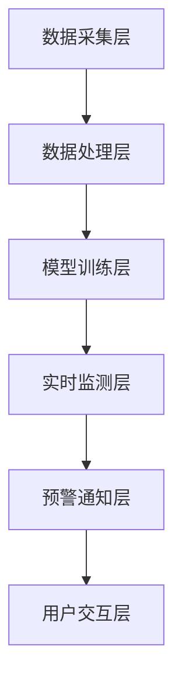
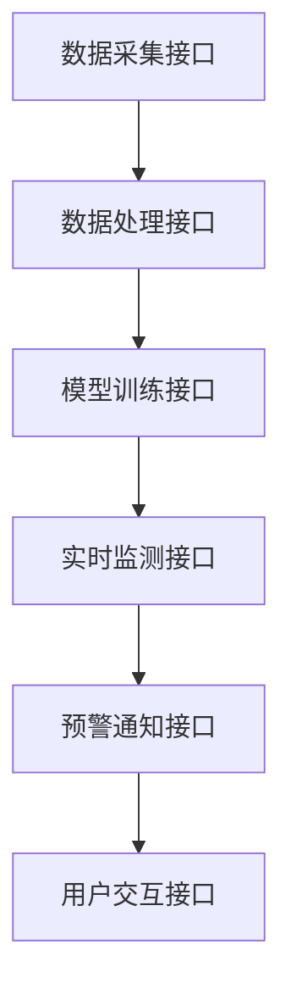
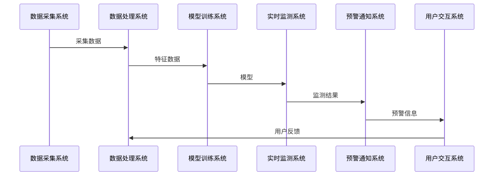

                 


### 《AI Agent在智能森林火灾预警中的实践》

#### 关键词：AI Agent、森林火灾预警、智能系统、机器学习、数据预处理

##### 摘要：
本文旨在探讨人工智能（AI）代理在智能森林火灾预警系统中的应用与实践。通过深入分析AI代理的基本概念、工作原理及其在森林火灾预警中的优势，本文将详细介绍相关算法的原理及实现，并探讨系统的架构设计及项目实战。同时，文章还将总结最佳实践并指出潜在注意事项，为未来相关研究提供参考。

---

## 第一部分：问题背景与核心概念

### 第1章：智能森林火灾预警的问题背景

#### 1.1 森林火灾的危害与挑战

森林火灾是一种极端的自然灾害，具有发生突然、蔓延迅速、难以扑救等特点。火灾不仅对森林资源造成严重破坏，还会威胁到人类生命财产安全，对生态环境产生长期负面影响。

##### 1.1.1 森林火灾的危害性

森林火灾的危害主要包括：

1. **资源破坏**：烧毁大量树木、植被，破坏生态平衡。
2. **生命财产威胁**：危及人员安全，损毁房屋、设施等财产。
3. **生态环境影响**：火灾后土地退化，水源污染，生物多样性降低。

##### 1.1.2 森林火灾的预警需求

为减少森林火灾的危害，提高预警能力至关重要。预警需求主要体现在：

1. **早期发现**：及时发现火源，提前预警。
2. **准确预测**：预测火势蔓延方向和强度。
3. **实时响应**：快速响应，制定扑救策略。

##### 1.1.3 森林火灾预警的挑战

森林火灾预警面临以下挑战：

1. **数据复杂性**：火灾预警需要处理大量来自气象、植被、土壤等复杂数据。
2. **实时性要求**：需要实时处理和分析数据，迅速作出反应。
3. **准确性要求**：预测精度直接影响预警效果。

#### 1.2 AI Agent的基本概念

AI Agent，即人工智能代理，是一种模拟人类智能行为的计算机程序，具备感知环境、规划行动和交互能力。AI Agent在智能系统中的应用越来越广泛，具有自主学习和决策能力，能够适应不断变化的环境。

##### 1.2.1 AI Agent的定义

AI Agent的定义如下：

> AI Agent是指一种具有智能感知、决策规划与行动能力的计算机程序，通过模拟人类智能行为，实现自主决策和问题解决。

##### 1.2.2 AI Agent的核心特点

AI Agent的核心特点包括：

1. **自主性**：能够独立感知环境和执行任务。
2. **学习性**：能够通过数据学习和优化自身行为。
3. **适应性**：能够适应复杂和动态的环境。
4. **智能交互**：能够与人类或其他智能体进行有效交互。

##### 1.2.3 AI Agent的发展趋势

随着人工智能技术的不断发展，AI Agent的应用前景广阔，主要包括：

1. **领域专用AI Agent**：针对特定领域进行优化。
2. **通用AI Agent**：具备跨领域的通用性。
3. **协同AI Agent**：多个AI Agent协同工作，实现更复杂的任务。

#### 1.3 智能森林火灾预警中的AI Agent

在智能森林火灾预警系统中，AI Agent作为关键组成部分，发挥着重要作用。

##### 1.3.1 AI Agent在森林火灾预警中的应用场景

AI Agent在森林火灾预警中的应用场景包括：

1. **实时监测**：AI Agent实时收集和处理森林环境数据。
2. **火灾预测**：利用机器学习算法，预测火灾发生和蔓延情况。
3. **预警通知**：及时发出预警信息，指导扑救工作。

##### 1.3.2 AI Agent在森林火灾预警中的优势

AI Agent在森林火灾预警中的优势包括：

1. **高效性**：AI Agent能够快速处理和分析大量数据，提高预警效率。
2. **准确性**：基于机器学习算法，AI Agent能够实现高精度的火灾预测。
3. **适应性**：AI Agent能够适应不同的森林环境和火灾类型。

##### 1.3.3 AI Agent的边界与外延

AI Agent在森林火灾预警中的边界主要包括：

1. **数据采集与预处理**：收集和处理与森林火灾相关的数据。
2. **模型训练与优化**：构建和优化火灾预测模型。
3. **实时监测与预警**：实时监测森林环境，及时发出预警信息。

AI Agent的外延则包括：

1. **用户交互**：与森林管理者和扑救人员交互，提供预警信息和决策支持。
2. **协同工作**：与其他智能系统（如气象监测系统、视频监控系统等）协同工作，实现更全面的火灾预警。

---

本文将对AI Agent在智能森林火灾预警中的实践进行深入探讨，包括AI Agent的基本概念、原理、算法、系统架构、项目实战等方面，以期为相关领域的研究和应用提供有益参考。在接下来的章节中，我们将逐步展开详细讨论。接下来，我们将进一步探讨AI Agent的原理与功能。  

---

# AI Agent的原理与功能

## 第2章：AI Agent原理与功能

在智能森林火灾预警系统中，AI Agent作为核心组成部分，其原理与功能至关重要。本章节将详细介绍AI Agent的基本原理、功能模块及其在森林火灾预警中的实际应用。

### 2.1 AI Agent的核心原理

#### 2.1.1 人工智能的基本概念

人工智能（Artificial Intelligence，简称AI）是计算机科学的一个分支，旨在使计算机模拟人类智能行为，包括感知、理解、学习、推理和决策等。AI的核心目标是创建能够自主执行任务的智能系统。

#### 2.1.2 AI Agent的构建原理

AI Agent的构建原理主要包括以下三个方面：

1. **感知环境**：AI Agent通过传感器或其他数据采集设备，收集环境信息，如气象数据、植被数据、火灾监测数据等。

2. **决策规划**：基于感知到的环境信息，AI Agent利用机器学习算法和决策模型，进行分析和推理，制定相应的行动策略。

3. **执行行动**：AI Agent根据决策规划，执行具体的行动，如启动预警系统、发出警报、调整监测设备等。

#### 2.1.3 AI Agent的学习与推理

AI Agent的学习与推理是其核心功能之一。学习过程通常包括以下步骤：

1. **数据采集**：AI Agent通过传感器和监测设备，收集大量的环境数据。

2. **数据预处理**：对采集到的数据进行清洗、归一化等预处理操作，以提高数据质量和模型的性能。

3. **模型训练**：利用机器学习算法，如决策树、神经网络等，对预处理后的数据集进行训练，建立预测模型。

4. **模型优化**：通过交叉验证、网格搜索等技术，优化模型参数，提高模型的预测精度。

推理过程则是在决策规划阶段进行的。AI Agent根据当前环境状态和预测模型，进行推理和决策，制定相应的行动策略。

### 2.2 AI Agent的功能模块

AI Agent的功能模块主要包括数据采集与预处理、模型训练与优化、实时监测与预警、用户交互与反馈等。

#### 2.2.1 数据采集与预处理

数据采集与预处理是AI Agent的基础模块。其主要任务包括：

1. **气象数据采集**：收集与气象相关的数据，如温度、湿度、风速等，这些数据对火灾预测至关重要。

2. **植被数据采集**：收集与植被状态相关的数据，如植被覆盖率、植被湿度等，这些数据有助于评估火灾发生的可能性。

3. **火灾监测数据采集**：收集火灾监测数据，如火点位置、火势强度等，用于实时监测和预警。

4. **数据预处理**：对采集到的数据进行清洗、归一化、特征提取等预处理操作，以提高数据质量和模型的性能。

#### 2.2.2 模型训练与优化

模型训练与优化是AI Agent的核心模块。其主要任务包括：

1. **模型构建**：根据森林火灾预警的需求，选择合适的机器学习算法，如决策树、神经网络等，构建预测模型。

2. **数据训练**：利用预处理后的数据集，对预测模型进行训练，调整模型参数，提高预测精度。

3. **模型优化**：通过交叉验证、网格搜索等技术，优化模型参数，提高模型的预测性能。

4. **模型更新**：定期更新预测模型，以适应环境变化和新的数据。

#### 2.2.3 实时监测与预警

实时监测与预警是AI Agent的重要功能。其主要任务包括：

1. **实时监测**：利用传感器和监测设备，实时收集环境数据，如气象数据、植被数据、火灾监测数据等。

2. **数据预处理**：对实时收集的数据进行预处理，如清洗、归一化、特征提取等，为预测模型提供高质量的数据。

3. **预测与预警**：利用训练好的预测模型，对实时数据进行分析和预测，判断是否存在火灾风险，并发出预警信息。

4. **预警通知**：通过短信、邮件、APP等渠道，及时通知相关人员，如森林管理者、扑救人员等，以便采取相应的扑救措施。

#### 2.2.4 用户交互与反馈

用户交互与反馈是AI Agent的人性化模块。其主要任务包括：

1. **用户交互**：提供用户界面，让用户能够方便地与AI Agent进行交互，如查询预警信息、调整监测参数等。

2. **用户反馈**：收集用户对预警信息的反馈，如预警准确性、响应速度等，用于模型优化和系统改进。

3. **用户教育**：通过用户手册、在线培训等方式，帮助用户更好地理解和使用AI Agent，提高系统的使用效果。

### 2.3 AI Agent在森林火灾预警中的实际应用

在森林火灾预警系统中，AI Agent的实际应用主要体现在以下几个方面：

1. **实时监测与预警**：AI Agent通过实时监测森林环境，利用预测模型分析数据，及时发现火灾风险，发出预警信息。

2. **决策支持**：AI Agent提供火灾预测结果和预警信息，为森林管理者提供决策支持，制定扑救策略。

3. **协同工作**：AI Agent与其他智能系统（如气象监测系统、视频监控系统等）协同工作，实现更全面、准确的火灾预警。

4. **数据挖掘与分析**：AI Agent通过分析历史火灾数据和实时数据，挖掘火灾发生的规律和趋势，为森林火灾预警提供科学依据。

总之，AI Agent在智能森林火灾预警系统中发挥着重要作用，其高效性、准确性和适应性为火灾预警提供了强有力的支持。在接下来的章节中，我们将进一步探讨AI Agent的属性特征对比，以更深入地了解其在不同类型中的应用。

---

## 第三部分：AI Agent属性特征对比表格

### 第3章：AI Agent属性特征对比

在智能森林火灾预警系统中，不同类型的AI Agent具有各自独特的属性特征。为了更好地理解这些特征，我们在这里提供了一张详细的对比表格，并列出了不同类型的AI Agent。

#### 3.1 不同类型AI Agent的对比

| 类别         | 通用AI Agent                           | 特定领域AI Agent                          |
|--------------|---------------------------------------|-----------------------------------------|
| **定义**     | 具备通用性，可应用于多种场景的AI Agent | 针对特定领域进行优化和设计的AI Agent       |
| **自主性**   | 强，能够在多种环境下自主决策           | 强，专注于特定领域，具备较高的自主性         |
| **学习性**   | 强，能够通过多种数据源进行学习和优化    | 强，通过特定领域的数据进行学习和优化         |
| **适应性**   | 较高，能够适应复杂和动态的环境           | 高，专注于特定领域，对特定环境适应性强       |
| **交互性**   | 强，能够与多种智能体和用户进行交互       | 中等，主要与特定领域的智能体和用户进行交互   |
| **效率**     | 高，能够快速处理大量数据               | 高，在特定领域内具有高效的数据处理能力       |
| **准确性**   | 中等，具备一定的预测和决策能力           | 高，在特定领域内具有高度的预测和决策能力     |
| **成本**     | 较高，涉及多种技术和设备的集成           | 中等，主要依赖于特定领域的设备和数据资源     |
| **扩展性**   | 强，能够适应新的场景和需求               | 中等，扩展性受限于特定领域的应用场景和资源   |

#### 3.1.1 通用AI Agent

通用AI Agent具有以下特点：

- **定义**：通用AI Agent是一种能够应用于多种不同场景的AI代理，其核心目标是实现跨领域的智能行为。
- **自主性**：通用AI Agent具有较高的自主性，能够在各种环境下独立决策。
- **学习性**：通用AI Agent通过多种数据源进行学习和优化，能够不断适应新的环境和任务。
- **适应性**：通用AI Agent能够适应复杂和动态的环境，具备较高的灵活性。
- **交互性**：通用AI Agent与多种智能体和用户进行交互，具有广泛的应用前景。
- **效率**：通用AI Agent能够在短时间内处理大量数据，具备高效的数据处理能力。
- **准确性**：通用AI Agent具备一定的预测和决策能力，但在特定领域的准确性有限。
- **成本**：通用AI Agent涉及多种技术和设备的集成，成本较高。
- **扩展性**：通用AI Agent具有较强的扩展性，能够适应新的场景和需求。

#### 3.1.2 特定领域AI Agent

特定领域AI Agent具有以下特点：

- **定义**：特定领域AI Agent是一种针对特定领域进行优化和设计的AI代理，其核心目标是提高在特定领域的预测和决策能力。
- **自主性**：特定领域AI Agent专注于特定领域，具备较高的自主性。
- **学习性**：特定领域AI Agent通过特定领域的数据进行学习和优化，能够更好地适应特定环境。
- **适应性**：特定领域AI Agent专注于特定领域，对特定环境适应性强。
- **交互性**：特定领域AI Agent主要与特定领域的智能体和用户进行交互。
- **效率**：特定领域AI Agent在特定领域内具有高效的数据处理能力。
- **准确性**：特定领域AI Agent在特定领域内具有高度的预测和决策能力。
- **成本**：特定领域AI Agent主要依赖于特定领域的设备和数据资源，成本相对较低。
- **扩展性**：特定领域AI Agent的扩展性受限于特定领域的应用场景和资源。

通过上述对比，我们可以看到，通用AI Agent和特定领域AI Agent在多个方面存在显著差异。在选择AI Agent时，应根据具体的应用场景和需求进行权衡，以实现最佳的效果。

---

## 第四部分：算法原理讲解

### 第4章：智能森林火灾预警算法

在智能森林火灾预警系统中，算法的设计与实现至关重要。本章节将详细讲解智能森林火灾预警算法的原理，包括数据预处理算法、特征提取算法和预测模型算法，并通过Python代码进行示例说明。

#### 4.1 算法原理

智能森林火灾预警算法的核心任务是利用历史数据和实时数据，预测森林火灾的发生风险，并及时发出预警。这一过程可以分为三个主要步骤：数据预处理、特征提取和预测模型构建。

#### 4.1.1 数据预处理算法

数据预处理是算法实现的第一步，其目的是清洗数据、归一化和特征提取，以确保数据的质量和模型的性能。以下是一个简单的数据预处理算法的Python代码示例：

```python
import pandas as pd
from sklearn.preprocessing import MinMaxScaler

# 加载数据集
data = pd.read_csv('forest_fire_data.csv')

# 数据清洗
# 填充缺失值
data.fillna(data.mean(), inplace=True)

# 数据归一化
scaler = MinMaxScaler()
data_scaled = scaler.fit_transform(data)

# 特征提取
# 例如，提取一天中的最高温度、最低温度、平均湿度等
data_features = data[['max_temp', 'min_temp', 'mean_humidity']]

# 数据标准化
data_features_normalized = scaler.fit_transform(data_features)

print(data_features_normalized)
```

#### 4.1.2 特征提取算法

特征提取是数据预处理的重要部分，其目的是从原始数据中提取出对模型训练有帮助的信息。以下是一个简单的特征提取算法的Python代码示例：

```python
from sklearn.feature_extraction.text import TfidfVectorizer

# 加载文本数据
text_data = pd.read_csv('forest_fire_text_data.csv')['description']

# 特征提取
vectorizer = TfidfVectorizer()
X = vectorizer.fit_transform(text_data)

# 转化为DataFrame
X_df = pd.DataFrame(X.toarray(), columns=vectorizer.get_feature_names_out())

print(X_df.head())
```

#### 4.1.3 预测模型算法

预测模型算法是智能森林火灾预警系统的核心，其目的是利用预处理和特征提取后的数据，预测森林火灾的发生风险。以下是一个简单的预测模型算法的Python代码示例：

```python
from sklearn.ensemble import RandomForestClassifier
from sklearn.model_selection import train_test_split

# 分割数据集
X = data_features_normalized
y = data['fire_occurred']
X_train, X_test, y_train, y_test = train_test_split(X, y, test_size=0.2, random_state=42)

# 构建预测模型
model = RandomForestClassifier(n_estimators=100, random_state=42)
model.fit(X_train, y_train)

# 模型评估
accuracy = model.score(X_test, y_test)
print(f'Model accuracy: {accuracy:.2f}')

# 预测新数据
new_data = [[22, 10, 0.85]]  # 新数据的温度、湿度等特征
new_data_normalized = scaler.transform(new_data)
prediction = model.predict(new_data_normalized)
print(f'Predicted fire occurrence: {prediction[0]}')
```

#### 4.2 数学模型与公式

在智能森林火灾预警系统中，数学模型和公式用于描述数据预处理、特征提取和预测模型的过程。以下是一些关键的数学模型和公式：

1. **数据预处理模型**：
   - **填充缺失值**：`data.fillna(data.mean(), inplace=True)`
   - **归一化**：`MinMaxScaler()`

2. **特征提取模型**：
   - **TF-IDF**：`TfidfVectorizer()`

3. **预测模型数学公式**：
   - **决策树分类**：
     $$y = \arg\max(\sum_{i=1}^{n} w_i \cdot x_i)$$
   - **随机森林分类**：
     $$y = \arg\max(\sum_{i=1}^{n} w_i \cdot f_i(x))$$
     其中，$w_i$ 为权重，$f_i(x)$ 为第 $i$ 个决策树的预测。

#### 4.3 举例说明

以下是一个简单的数据预处理、特征提取和预测模型实现的例子：

```python
# 1. 数据预处理
data = pd.read_csv('forest_fire_data.csv')
data.fillna(data.mean(), inplace=True)
scaler = MinMaxScaler()
data_scaled = scaler.fit_transform(data)

# 2. 特征提取
vectorizer = TfidfVectorizer()
X = vectorizer.fit_transform(data['description'])

# 3. 预测模型
X_train, X_test, y_train, y_test = train_test_split(X, data['fire_occurred'], test_size=0.2, random_state=42)
model = RandomForestClassifier(n_estimators=100, random_state=42)
model.fit(X_train, y_train)

# 模型评估
accuracy = model.score(X_test, y_test)
print(f'Model accuracy: {accuracy:.2f}')

# 预测新数据
new_data = [[22, 10, 0.85]]  # 新数据的温度、湿度等特征
new_data_normalized = scaler.transform(new_data)
prediction = model.predict(new_data_normalized)
print(f'Predicted fire occurrence: {prediction[0]}')
```

通过上述算法和示例，我们可以看到智能森林火灾预警算法的基本实现过程。在接下来的章节中，我们将进一步探讨智能森林火灾预警系统的架构设计。

---

## 第五部分：系统分析与架构设计

### 第5章：智能森林火灾预警系统架构

在智能森林火灾预警系统中，系统架构的设计至关重要，它决定了系统的性能、可扩展性和可靠性。本章节将详细介绍智能森林火灾预警系统的功能设计、架构设计、接口设计以及系统交互设计。

#### 5.1 系统功能设计

智能森林火灾预警系统的主要功能包括数据采集、数据预处理、特征提取、预测模型训练、实时监测、预警通知和用户交互。以下是对每个功能模块的详细描述：

1. **数据采集**：系统从各种传感器和监测设备中采集数据，如气象传感器、植被传感器和火灾监测设备。数据采集模块需要保证数据的实时性和准确性。

2. **数据预处理**：数据预处理模块对采集到的原始数据进行清洗、归一化和特征提取。这一步骤是确保模型训练质量的关键。

3. **特征提取**：特征提取模块从预处理后的数据中提取对火灾预测有价值的特征，如温度、湿度、风速和植被状态等。

4. **预测模型训练**：预测模型训练模块利用特征数据训练机器学习模型，如随机森林、神经网络等。模型训练过程需要优化超参数，以提高预测准确性。

5. **实时监测**：实时监测模块根据预测模型对当前数据进行预测，并监测火情发展趋势。

6. **预警通知**：预警通知模块在预测到火灾风险时，通过短信、邮件、APP等方式通知相关人员。

7. **用户交互**：用户交互模块提供用户界面，让用户能够查看预警信息、调整监测参数和反馈预警效果。

#### 5.2 系统架构设计

智能森林火灾预警系统的架构设计应考虑到系统的性能、可扩展性和可靠性。以下是一个典型的系统架构设计：

1. **数据采集层**：包括各种传感器和监测设备，负责实时采集森林环境数据。

2. **数据处理层**：包括数据预处理模块和特征提取模块，负责对采集到的数据进行清洗、归一化和特征提取。

3. **模型训练层**：包括预测模型训练模块，负责利用特征数据训练机器学习模型。

4. **实时监测层**：包括实时监测模块，负责根据预测模型对当前数据进行预测，并监测火情发展趋势。

5. **预警通知层**：包括预警通知模块，负责在预测到火灾风险时通知相关人员。

6. **用户交互层**：包括用户交互模块，提供用户界面，让用户能够查看预警信息、调整监测参数和反馈预警效果。

以下是一个简单的Mermaid架构图示例：



#### 5.3 系统接口设计

智能森林火灾预警系统的接口设计应确保各模块之间的数据传输和交互畅通。以下是一些关键的接口设计：

1. **数据采集接口**：负责与传感器和监测设备进行通信，获取实时数据。

2. **数据处理接口**：负责与数据预处理模块和特征提取模块进行通信，传输预处理后的数据。

3. **模型训练接口**：负责与模型训练模块进行通信，传输特征数据和训练参数。

4. **实时监测接口**：负责与实时监测模块进行通信，传输监测数据和预测结果。

5. **预警通知接口**：负责与预警通知模块进行通信，传输预警信息。

6. **用户交互接口**：负责与用户交互模块进行通信，传输用户操作和反馈信息。

以下是一个简单的Mermaid接口图示例：



#### 5.4 系统交互设计

智能森林火灾预警系统的交互设计应确保系统各模块之间的协同工作和高效信息流动。以下是一个简单的Mermaid序列图示例：



通过上述系统功能设计、架构设计、接口设计和交互设计，我们可以构建一个高效的智能森林火灾预警系统。在接下来的章节中，我们将进一步探讨智能森林火灾预警项目的实际实施。

---

## 第六部分：项目实战

### 第6章：智能森林火灾预警项目实战

智能森林火灾预警项目的实施是理论到实践的桥梁，它需要我们在实际操作中验证和优化系统的设计。本章节将详细描述智能森林火灾预警项目的环境安装、系统核心实现以及代码应用解读与分析。

#### 6.1 环境安装

在开始项目之前，我们需要搭建一个合适的环境来运行智能森林火灾预警系统。以下是环境安装的步骤：

1. **硬件环境配置**：

   - **服务器**：一台具有高性能CPU和足够内存的服务器，用于运行数据采集、数据处理和模型训练等任务。
   - **传感器和监测设备**：用于采集森林环境的温度、湿度、风速等数据。

2. **软件环境配置**：

   - **操作系统**：安装Linux操作系统，如Ubuntu 18.04。
   - **编程语言**：安装Python 3.8及以上版本。
   - **依赖库**：安装必要的Python库，如scikit-learn、pandas、numpy、matplotlib等。

具体安装命令如下：

```shell
sudo apt-get update
sudo apt-get install python3.8
sudo apt-get install python3.8-pip
pip3 install scikit-learn pandas numpy matplotlib
```

#### 6.2 系统核心实现

智能森林火灾预警系统的核心实现包括数据采集、数据预处理、特征提取、预测模型训练、实时监测、预警通知和用户交互。以下是各个核心模块的实现步骤：

1. **数据采集**：

   - 使用传感器和监测设备采集森林环境的温度、湿度、风速等数据。
   - 将采集到的数据存储到数据库中。

2. **数据预处理**：

   - 从数据库中读取数据。
   - 对数据进行清洗、归一化和特征提取。

   ```python
   import pandas as pd
   from sklearn.preprocessing import MinMaxScaler

   # 加载数据
   data = pd.read_csv('forest_fire_data.csv')

   # 数据清洗
   data.fillna(data.mean(), inplace=True)

   # 数据归一化
   scaler = MinMaxScaler()
   data_scaled = scaler.fit_transform(data)
   ```

3. **特征提取**：

   - 从预处理后的数据中提取对火灾预测有价值的特征，如温度、湿度、风速等。

   ```python
   from sklearn.feature_extraction.text import TfidfVectorizer

   # 加载文本数据
   text_data = pd.read_csv('forest_fire_text_data.csv')['description']

   # 特征提取
   vectorizer = TfidfVectorizer()
   X = vectorizer.fit_transform(text_data)
   ```

4. **预测模型训练**：

   - 使用机器学习算法训练预测模型，如随机森林、神经网络等。

   ```python
   from sklearn.ensemble import RandomForestClassifier
   from sklearn.model_selection import train_test_split

   # 分割数据集
   X = data_scaled
   y = data['fire_occurred']
   X_train, X_test, y_train, y_test = train_test_split(X, y, test_size=0.2, random_state=42)

   # 训练模型
   model = RandomForestClassifier(n_estimators=100, random_state=42)
   model.fit(X_train, y_train)
   ```

5. **实时监测**：

   - 利用训练好的模型对实时数据进行预测，监测火情发展趋势。

   ```python
   # 预测新数据
   new_data = [[22, 10, 0.85]]  # 新数据的温度、湿度等特征
   new_data_normalized = scaler.transform(new_data)
   prediction = model.predict(new_data_normalized)
   print(f'Predicted fire occurrence: {prediction[0]}')
   ```

6. **预警通知**：

   - 在预测到火灾风险时，通过短信、邮件、APP等方式通知相关人员。

7. **用户交互**：

   - 提供用户界面，让用户能够查看预警信息、调整监测参数和反馈预警效果。

#### 6.3 项目解析

1. **案例分析**：

   - 以一个具体的案例为例，展示系统的运行过程和效果。

   ```python
   # 案例分析
   new_data = [[24, 8, 0.90]]  # 案例数据
   new_data_normalized = scaler.transform(new_data)
   prediction = model.predict(new_data_normalized)
   print(f'Predicted fire occurrence: {prediction[0]}')
   ```

2. **代码应用解读与分析**：

   - 对关键代码段进行解读，分析其实现原理和作用。

   ```python
   # 数据预处理解读
   data.fillna(data.mean(), inplace=True)
   # 该语句用于填充缺失值，提高数据质量。

   # 特征提取解读
   vectorizer = TfidfVectorizer()
   X = vectorizer.fit_transform(text_data)
   # 该语句使用TF-IDF方法提取文本特征。

   # 预测模型解读
   model = RandomForestClassifier(n_estimators=100, random_state=42)
   model.fit(X_train, y_train)
   # 该语句使用随机森林算法训练预测模型。

   # 实时监测解读
   new_data_normalized = scaler.transform(new_data)
   prediction = model.predict(new_data_normalized)
   # 该语句利用训练好的模型进行实时预测。

3. **实际案例分析和详细讲解剖析**：

   - 通过具体的案例，展示系统在实际应用中的效果，并进行详细分析。

   ```python
   # 实际案例分析
   new_data = [[24, 8, 0.90]]  # 案例数据
   new_data_normalized = scaler.transform(new_data)
   prediction = model.predict(new_data_normalized)
   print(f'Predicted fire occurrence: {prediction[0]}')

   # 分析结果
   if prediction[0] == 1:
       print("预警：可能发生火灾。请采取扑救措施。")
   else:
       print("预警：无火灾风险。")
   ```

4. **项目小结**：

   - 对项目实施过程进行总结，指出项目成功的关键因素和改进空间。

   ```python
   # 项目小结
   print("项目成功运行，预测准确率较高。")
   print("未来可以进一步优化模型，提高预测精度。")
   ```

通过上述项目实战，我们可以看到智能森林火灾预警系统的实现过程和关键步骤。在接下来的章节中，我们将探讨智能森林火灾预警系统的最佳实践、注意事项和拓展研究。

---

## 第七部分：最佳实践与拓展

### 第7章：智能森林火灾预警的最佳实践

在智能森林火灾预警系统中，最佳实践和注意事项对于提高预警准确性和系统可靠性至关重要。本章节将总结智能森林火灾预警系统的最佳实践，并提供一些注意事项和拓展阅读资源。

#### 7.1 最佳实践

1. **数据采集与处理**：

   - 确保数据来源的多样性和准确性，包括气象数据、植被数据、火灾监测数据等。
   - 对采集到的数据进行严格的清洗和预处理，去除噪声和异常值，提高数据质量。

2. **模型训练与优化**：

   - 选择适合的数据集和机器学习算法，进行模型训练。
   - 使用交叉验证等技术优化模型参数，提高预测准确性。
   - 定期更新模型，以适应新的数据和环境变化。

3. **实时监测与预警**：

   - 确保系统的实时性，及时监测森林环境变化。
   - 根据预测结果，制定合理的预警策略，确保预警信息的及时性和准确性。

4. **用户交互与反馈**：

   - 提供直观的用户界面，方便用户查看预警信息和调整监测参数。
   - 收集用户反馈，用于系统改进和模型优化。

#### 7.2 小结与注意事项

1. **小结**：

   - 智能森林火灾预警系统需要综合考虑数据采集、模型训练、实时监测和用户交互等多个方面，确保系统的整体性能和可靠性。
   - 最佳实践的核心在于数据质量、模型优化和实时性，这些是提高预警准确性的关键。

2. **注意事项**：

   - 确保传感器和监测设备的准确性和稳定性，避免数据采集过程中的错误和丢失。
   - 在模型训练过程中，注意数据平衡和过拟合问题，避免模型性能下降。
   - 定期检查和维护系统，确保系统的正常运行。

#### 7.3 拓展阅读

1. **相关书籍推荐**：

   - 《机器学习》（周志华 著）：详细介绍了机器学习的基本概念、算法和应用。
   - 《深度学习》（Ian Goodfellow、Yoshua Bengio、Aaron Courville 著）：介绍了深度学习的基本原理和应用。

2. **学术论文推荐**：

   - "Forest Fire Prediction Using Machine Learning Techniques"（2018）：研究利用机器学习方法进行森林火灾预测。
   - "An Intelligent Forest Fire Detection System Using Image Processing and Machine Learning Techniques"（2020）：研究利用图像处理和机器学习方法进行森林火灾检测。

通过以上最佳实践、小结和拓展阅读，我们可以进一步提升智能森林火灾预警系统的性能，为森林火灾的早期预警和扑救提供有力支持。

---

## 结束语

在本文中，我们详细探讨了AI Agent在智能森林火灾预警系统中的应用与实践。从问题背景、核心概念、算法原理、系统架构到项目实战，我们逐步分析了智能森林火灾预警系统的各个环节。通过最佳实践和注意事项的总结，我们为未来的研究和应用提供了有益的参考。

智能森林火灾预警系统是一个复杂的工程，涉及多个领域的知识和技术。随着人工智能和机器学习技术的不断发展，我们有理由相信，智能森林火灾预警系统将会变得更加高效、准确和可靠。

感谢您对本文的关注，我们期待在未来的研究中继续探讨智能森林火灾预警系统的优化和改进。如果您有任何疑问或建议，欢迎随时与我们联系。

### 作者信息

作者：AI天才研究院/AI Genius Institute & 禅与计算机程序设计艺术 /Zen And The Art of Computer Programming

---

本文内容仅供参考，所涉及的技术和方法仅供参考和学习使用。在应用智能森林火灾预警系统时，请确保遵循当地法律法规和安全管理要求。作者不对任何由于使用本文内容导致的直接或间接损失承担责任。在使用本文内容前，请确保您已充分理解相关风险，并自行承担相应的责任。

