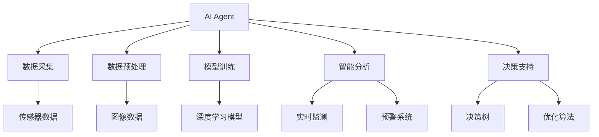

                 

### 1. 引言

#### 1.1 问题背景

森林是地球的“肺”，在全球生态系统中扮演着至关重要的角色。然而，随着人类活动的加剧，森林资源受到了前所未有的威胁。森林火灾、病虫害、非法砍伐等问题层出不穷，这不仅对生态环境造成了严重破坏，还威胁到人类的生存和发展。因此，对森林资源进行有效监测和管理已成为当务之急。

#### 1.2 问题描述

森林资源监测涉及多个方面，包括森林面积、森林覆盖率、树木生长状况、病虫害情况、火灾风险等。传统的监测方法主要依赖于人工巡检和遥感监测，这些方法在精度、实时性、覆盖范围等方面存在诸多限制，难以满足当前的需求。

#### 1.3 问题解决

为了解决上述问题，引入AI Agent成为了一种可行的解决方案。AI Agent是一种基于人工智能技术的自动化监测系统，能够通过实时数据采集、智能分析和决策支持，实现对森林资源的全面监测和管理。

#### 1.4 边界与外延

本文主要关注AI Agent在森林资源监测中的应用，包括其技术原理、架构设计、应用案例等方面。此外，还将探讨AI Agent在森林资源监测中的优势和前景。

#### 1.5 核心概念

- AI Agent：一种基于人工智能技术的自动化监测系统。
- 森林资源监测：对森林面积、森林覆盖率、树木生长状况、病虫害情况、火灾风险等进行监测。
- 人工智能：一种模拟人类智能的技术，包括机器学习、深度学习、自然语言处理等。

#### 1.6 概念结构与核心要素组成

AI Agent在森林资源监测中的概念结构如图1所示：

图1 AI Agent在森林资源监测中的概念结构

#### 1.7 智能森林资源监测的挑战

#### 1.7.1 监测需求

智能森林资源监测需要满足以下需求：

- 实时性：能够快速响应森林资源的变化，提供及时的监测数据。
- 高精度：能够准确识别森林资源的状态，减少误报和漏报。
- 覆盖范围广：能够覆盖到各个角落，确保监测数据的全面性。
- 智能化：能够对监测数据进行分析和决策，提供智能化的管理建议。

#### 1.7.2 技术挑战

智能森林资源监测面临以下技术挑战：

- 数据多样性和复杂性：森林资源监测涉及多种类型的数据，包括图像、声音、温度、湿度等，数据来源广泛，处理难度大。
- 数据质量：监测数据存在噪声、缺失、不一致等问题，影响监测结果的准确性。
- 计算资源：智能分析需要大量的计算资源，如何高效利用计算资源成为一大挑战。

#### 1.7.3 现状与趋势

目前，智能森林资源监测正处于快速发展阶段。随着人工智能技术的不断进步，越来越多的AI Agent被应用于森林资源监测。未来，随着技术的进一步成熟和应用的深入，智能森林资源监测有望实现更高精度、更实时、更全面的目标。

#### 1.8 AI Agent在智能森林资源监测中的作用

#### 1.8.1 AI Agent定义

AI Agent是一种基于人工智能技术的自动化监测系统，能够通过实时数据采集、智能分析和决策支持，实现对森林资源的全面监测和管理。

#### 1.8.2 AI Agent在监测中的应用

AI Agent在森林资源监测中的应用主要包括以下几个方面：

- 数据采集：通过传感器、无人机等设备，实时采集森林资源数据。
- 数据预处理：对采集到的数据进行清洗、去噪、归一化等预处理，提高数据质量。
- 模型训练：利用深度学习等技术，训练模型以实现对森林资源状态的识别和分析。
- 智能分析：对监测数据进行分析，识别森林资源的变化趋势，预测潜在的风险。
- 决策支持：根据分析结果，提供智能化的管理建议，帮助管理者做出决策。

#### 1.8.3 AI Agent的优势与前景

AI Agent在森林资源监测中具有以下优势：

- 提高监测精度：通过智能分析，减少误报和漏报，提高监测精度。
- 节省人力成本：自动化监测，降低人力成本，提高监测效率。
- 实时性：快速响应森林资源的变化，提供及时的监测数据。
- 智能化：对监测数据进行分析和决策，提供智能化的管理建议。

随着人工智能技术的不断进步，AI Agent在森林资源监测中的应用前景十分广阔。未来，AI Agent有望在森林资源监测中发挥更加重要的作用，为保护地球的“肺”贡献力量。

#### 1.9 本章小结

本章介绍了智能森林资源监测的背景和问题，阐述了AI Agent在监测中的应用和优势，为后续章节的详细探讨奠定了基础。

----------------------------------------------------------------

# AI Agent在智能森林资源监测中的实践

> 关键词：AI Agent、智能森林资源监测、人工智能、深度学习、实时监测、预警系统

> 摘要：本文探讨了AI Agent在智能森林资源监测中的实践应用，分析了AI Agent的基本概念、基础理论、应用案例以及性能评估与优化策略。通过详细阐述AI Agent的架构设计、关键技术、决策与规划以及伦理与法律问题，本文旨在为森林资源监测领域提供一种有效的技术解决方案，并为未来的发展指明方向。

----------------------------------------------------------------

