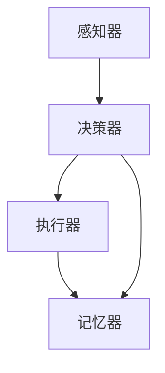
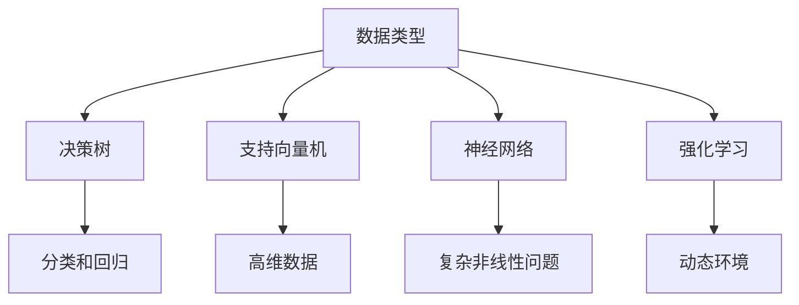
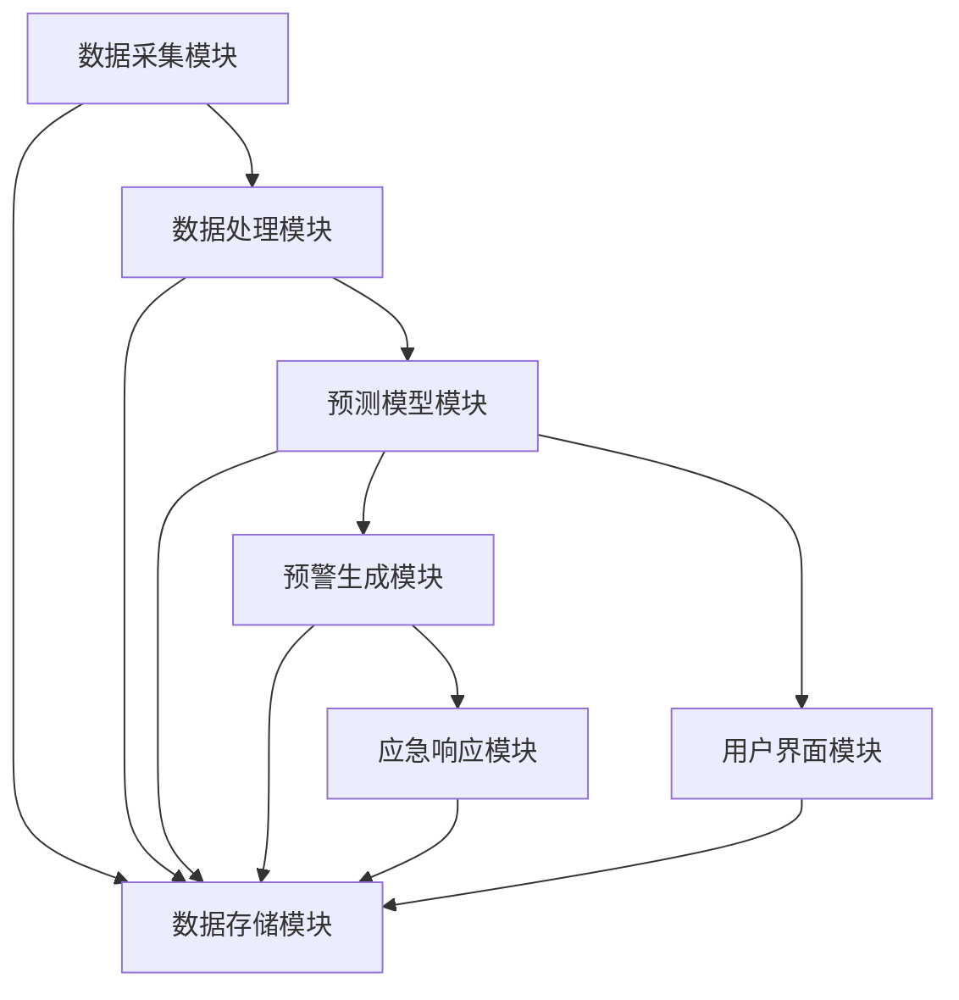

                 

# AI Agent在智能气象灾害预警系统中的实践

## 关键词：AI Agent、智能气象灾害预警、系统架构设计、性能评估、未来趋势

> 摘要：随着人工智能技术的不断发展，AI Agent在智能气象灾害预警系统中逐渐成为关键组成部分。本文首先介绍了问题背景，随后探讨了AI Agent的理论基础和应用方法，并通过具体案例展示了其在气象灾害预警系统中的实践。文章还针对AI Agent的性能评估和优化策略进行了深入分析，并展望了未来的发展趋势与挑战。

### 引言

近年来，全球气候变化带来的极端天气现象愈加频繁，气象灾害对人类社会和经济造成了严重影响。传统的气象灾害预警系统依赖人工监测和数据统计，存在响应速度慢、预警准确率不高等问题。随着人工智能技术的迅猛发展，AI Agent作为一种具有自主决策能力的智能体，开始在智能气象灾害预警系统中得到广泛应用。

本文旨在探讨AI Agent在智能气象灾害预警系统中的应用，通过分析其理论基础、算法基础和具体实践案例，为相关领域的研究者和开发者提供有价值的参考。文章还将对AI Agent的性能评估与优化策略进行探讨，并分析其未来发展趋势与面临的挑战。

### 第一部分：问题背景与核心概念

#### 1.1.1 问题背景

人工智能（AI）作为计算机科学的一个重要分支，自20世纪50年代诞生以来，已经经历了数十年的发展。人工智能技术的不断进步，使得计算机能够模拟人类的思维和行为，解决了许多复杂的问题。在气象灾害预警领域，人工智能技术的应用主要集中在数据挖掘、预测建模和自动化决策等方面。

智能气象灾害预警系统是指利用现代信息技术和人工智能算法，对气象灾害进行实时监测、预警和应急响应的系统。传统的气象灾害预警系统主要依靠人工监测和数据分析，存在以下问题：

1. **响应速度慢**：气象灾害发生时，预警系统需要时间进行数据采集、处理和分析，导致预警响应时间较长。
2. **预警准确率不高**：人工监测和数据统计的方法存在一定的主观性和不确定性，导致预警准确率不高。
3. **人工成本高**：传统预警系统需要大量的人力进行数据采集、分析和处理，人工成本高昂。

随着人工智能技术的不断发展，AI Agent作为一种具有自主决策能力的智能体，开始在气象灾害预警系统中发挥重要作用。AI Agent能够实时监测气象数据，通过学习和预测模型，自动生成预警信息，并触发应急响应，从而提高预警响应速度和准确率，降低人工成本。

#### 1.1.2 核心概念

##### AI Agent的定义与特点

AI Agent，即人工智能代理，是指具备自主决策能力、能够执行特定任务的智能体。AI Agent具有以下特点：

1. **自主性**：AI Agent能够根据环境变化自主决策，无需人工干预。
2. **适应性**：AI Agent能够通过学习和适应环境变化，提高任务执行效率。
3. **交互性**：AI Agent能够与其他系统或设备进行交互，实现任务协同。
4. **自主性**：AI Agent能够在不依赖于人类指令的情况下，自主执行任务。

##### 智能气象灾害预警系统

智能气象灾害预警系统是指利用人工智能技术，对气象灾害进行实时监测、预警和应急响应的系统。该系统通常包括以下几个关键模块：

1. **数据采集模块**：负责实时收集气象数据、灾害数据等。
2. **数据处理模块**：对采集到的数据进行清洗、转换和处理。
3. **预测模型模块**：利用机器学习算法构建预测模型，对气象灾害进行预测。
4. **预警生成模块**：根据预测结果生成预警信息，并触发应急响应。
5. **应急响应模块**：负责应急响应措施的执行和协调。

### 第二部分：AI Agent的理论基础

#### 2.1 AI Agent的核心原理

##### AI Agent的组成结构

AI Agent通常由以下几个部分组成：

1. **感知器**：负责接收外部环境的信息，如气象数据、图像等。
2. **决策器**：根据感知器获取的信息，进行决策和规划。
3. **执行器**：负责执行决策器制定的计划，如发送预警信息、启动应急响应等。
4. **记忆器**：记录Agent的历史决策和执行情况，用于学习和优化。

##### AI Agent的工作机制

AI Agent的工作机制可以分为以下几个步骤：

1. **感知**：AI Agent通过感知器收集外部环境信息。
2. **决策**：决策器根据感知器提供的信息，结合记忆器中的历史数据，进行决策和规划。
3. **执行**：执行器根据决策器的决策，执行相应的任务。
4. **学习**：记忆器记录执行结果，并用于更新模型和优化决策过程。

#### 2.2 AI Agent的算法基础

##### 常见算法介绍

在智能气象灾害预警系统中，常用的AI Agent算法包括：

1. **决策树算法**：适用于分类和回归问题，能够生成清晰的决策路径。
2. **支持向量机（SVM）算法**：适用于分类问题，具有较高的预测准确率。
3. **神经网络算法**：适用于复杂的数据模式识别和预测，如深度神经网络（DNN）、卷积神经网络（CNN）等。
4. **强化学习算法**：通过不断试错和优化策略，实现最优决策。

##### 算法比较与选择

不同算法在性能、复杂度、适用场景等方面存在差异，选择合适的算法需要考虑以下几个因素：

1. **数据类型**：气象灾害预警系统涉及多种数据类型，如时间序列数据、图像数据等，需要选择适合的数据处理算法。
2. **预测目标**：气象灾害预警系统通常涉及分类和回归问题，需要选择适用于预测目标的算法。
3. **计算资源**：不同算法的计算复杂度和硬件要求不同，需要根据实际计算资源进行选择。
4. **预测精度**：选择具有较高预测精度的算法，以提高预警准确率。

### 第三部分：AI Agent在气象灾害预警中的应用

#### 3.1 气象灾害预警系统的架构设计

##### 系统架构概述

智能气象灾害预警系统通常采用分布式架构，包括以下几个关键模块：

1. **数据采集模块**：负责实时收集气象数据、灾害数据等。
2. **数据处理模块**：对采集到的数据进行清洗、转换和处理。
3. **预测模型模块**：利用机器学习算法构建预测模型，对气象灾害进行预测。
4. **预警生成模块**：根据预测结果生成预警信息，并触发应急响应。
5. **应急响应模块**：负责应急响应措施的执行和协调。

##### 关键模块解析

1. **数据采集模块**：采用多种数据采集手段，如卫星遥感、地面气象站、传感器网络等，确保数据来源的多样性和实时性。
2. **数据处理模块**：对采集到的数据进行预处理，如数据清洗、归一化、特征提取等，为后续预测模型提供高质量的数据。
3. **预测模型模块**：根据气象灾害的特点和需求，选择合适的机器学习算法构建预测模型，如时间序列预测、图像识别、异常检测等。
4. **预警生成模块**：根据预测结果，结合阈值和规则，生成预警信息，如台风预警、洪水预警等。
5. **应急响应模块**：根据预警信息，制定应急响应方案，如疏散人群、关闭交通等，并协调相关部门进行应急响应。

#### 3.2 AI Agent在气象灾害预警中的实现

##### 数据采集与处理

AI Agent在气象灾害预警系统中的实现首先需要采集和处理数据。数据采集模块通过卫星遥感、地面气象站、传感器网络等多种手段，实时收集气象数据、灾害数据等。采集到的数据经过预处理，如数据清洗、归一化、特征提取等，为后续预测模型提供高质量的数据。

##### 模型训练与优化

在数据采集与处理的基础上，AI Agent利用机器学习算法对采集到的数据进行训练和优化。常见的机器学习算法包括决策树、支持向量机、神经网络等。根据气象灾害的特点和需求，选择合适的算法，构建预测模型。模型训练过程中，通过交叉验证、超参数调整等方法，优化模型性能。

##### 预测与预警

训练好的预测模型用于对气象灾害进行预测。AI Agent根据实时采集的气象数据，输入预测模型进行预测，生成预警信息。预警信息包括预警类型、预警等级、预警时间等。AI Agent根据预警信息，结合阈值和规则，自动生成预警通知，并触发应急响应。

##### 应急响应

AI Agent在生成预警信息后，根据预警信息和应急预案，自动协调相关部门进行应急响应。应急响应包括疏散人群、关闭交通、调配物资等。AI Agent通过与其他系统或设备进行交互，确保应急响应的及时性和有效性。

### 第四部分：AI Agent在智能气象灾害预警系统中的实践

#### 4.1 项目案例1：台风预警系统

##### 项目背景与目标

台风预警系统是一个典型的智能气象灾害预警系统，旨在提高台风预警的准确率和响应速度。项目目标包括：

1. 提高台风预警准确率，降低误报和漏报率。
2. 缩短预警响应时间，提高应急响应效率。
3. 降低人工成本，实现自动化预警和应急响应。

##### 系统设计与实现

台风预警系统采用分布式架构，包括数据采集模块、数据处理模块、预测模型模块、预警生成模块和应急响应模块。具体实现如下：

1. **数据采集模块**：采用卫星遥感、地面气象站、传感器网络等多种手段，实时收集台风相关数据，如风速、气压、降雨量等。
2. **数据处理模块**：对采集到的数据进行预处理，如数据清洗、归一化、特征提取等，为后续预测模型提供高质量的数据。
3. **预测模型模块**：利用神经网络算法构建预测模型，对台风路径、强度和影响范围进行预测。
4. **预警生成模块**：根据预测结果，结合阈值和规则，生成台风预警信息，如台风预警信号、预警等级等。
5. **应急响应模块**：根据预警信息，制定应急响应方案，如疏散人群、关闭交通等，并协调相关部门进行应急响应。

##### 项目小结

台风预警系统项目通过AI Agent的引入，实现了台风预警的自动化和智能化。项目结果表明，预警准确率显著提高，预警响应时间缩短，人工成本降低。未来，可以进一步优化预测模型和预警算法，提高预警系统的性能。

#### 4.2 项目案例2：洪水预警系统

##### 项目背景与目标

洪水预警系统是另一个重要的智能气象灾害预警系统，旨在提高洪水预警的准确率和响应速度。项目目标包括：

1. 提高洪水预警准确率，降低误报和漏报率。
2. 缩短预警响应时间，提高应急响应效率。
3. 降低人工成本，实现自动化预警和应急响应。

##### 系统设计与实现

洪水预警系统采用分布式架构，包括数据采集模块、数据处理模块、预测模型模块、预警生成模块和应急响应模块。具体实现如下：

1. **数据采集模块**：采用卫星遥感、地面气象站、传感器网络等多种手段，实时收集洪水相关数据，如降雨量、水位、土壤湿度等。
2. **数据处理模块**：对采集到的数据进行预处理，如数据清洗、归一化、特征提取等，为后续预测模型提供高质量的数据。
3. **预测模型模块**：利用神经网络算法构建预测模型，对洪水发生时间、影响范围和水位进行预测。
4. **预警生成模块**：根据预测结果，结合阈值和规则，生成洪水预警信息，如洪水预警信号、预警等级等。
5. **应急响应模块**：根据预警信息，制定应急响应方案，如疏散人群、关闭交通等，并协调相关部门进行应急响应。

##### 项目小结

洪水预警系统项目通过AI Agent的引入，实现了洪水预警的自动化和智能化。项目结果表明，预警准确率显著提高，预警响应时间缩短，人工成本降低。未来，可以进一步优化预测模型和预警算法，提高预警系统的性能。

### 第五部分：AI Agent的性能评估与优化

#### 5.1 性能评估指标

在智能气象灾害预警系统中，AI Agent的性能评估主要通过以下指标进行：

1. **准确率**：预测结果与实际结果的一致性程度，通常用于分类问题。
2. **召回率**：实际为正类别的样本中被正确预测为正类别的比例，通常用于分类问题。
3. **F1值**：准确率和召回率的调和平均值，综合衡量预测性能。
4. **响应时间**：从数据采集到生成预警信息的用时，反映系统的实时性。
5. **误报率**：实际为负类别的样本中被错误预测为正类别的比例，通常用于分类问题。
6. **漏报率**：实际为正类别的样本中被错误预测为负类别的比例，通常用于分类问题。

#### 5.2 性能优化策略

为了提高AI Agent的性能，可以采取以下优化策略：

1. **数据增强**：通过数据扩充、数据增强等技术，提高训练数据的多样性，增强模型的泛化能力。
2. **模型优化**：选择合适的机器学习算法和模型结构，通过模型调参、神经网络结构优化等方法，提高模型性能。
3. **特征选择**：通过特征选择技术，筛选出对预测任务具有重要影响的特征，提高模型的预测能力。
4. **分布式计算**：利用分布式计算框架，提高系统的计算能力和响应速度。
5. **实时更新**：定期更新模型和算法，适应环境变化，提高预警准确性。

### 第六部分：未来发展趋势与挑战

#### 6.1 未来发展趋势

1. **人工智能技术的不断进步**：随着人工智能技术的不断发展，AI Agent在智能气象灾害预警系统中的应用将更加深入和广泛。
2. **多源数据的融合**：利用多源数据，如卫星遥感、地面气象站、传感器网络等，实现更加精准和全面的气象灾害预警。
3. **实时性和响应速度的提升**：通过分布式计算、边缘计算等技术，提高AI Agent的实时性和响应速度，实现更快的预警和应急响应。
4. **智能化与自动化**：AI Agent在智能气象灾害预警系统中的应用将更加智能化和自动化，降低人工干预，提高预警准确率和应急响应效率。

#### 6.2 面临的挑战

1. **数据隐私与安全**：智能气象灾害预警系统涉及大量敏感数据，如气象数据、灾害数据等，数据隐私和安全是重要的挑战。
2. **算法公平性与透明性**：AI Agent的算法和决策过程需要具备公平性和透明性，确保预警结果的客观性和公正性。
3. **系统稳定性与可靠性**：智能气象灾害预警系统需要具备高稳定性和可靠性，确保在极端天气条件下仍能正常运行。
4. **政策与法规的支持**：智能气象灾害预警系统的推广和应用需要政策与法规的支持，为系统建设、数据共享和资源共享提供保障。

### 第七部分：总结与展望

#### 7.1 主要内容回顾

本文从问题背景、核心概念、理论基础、应用实践、性能评估与优化、未来发展趋势等方面，系统地介绍了AI Agent在智能气象灾害预警系统中的应用。主要内容包括：

1. 智能气象灾害预警系统面临的问题与挑战。
2. AI Agent的定义、特点与应用。
3. AI Agent的理论基础与算法基础。
4. AI Agent在气象灾害预警系统中的应用实践。
5. AI Agent的性能评估与优化策略。
6. 智能气象灾害预警系统的未来发展趋势与挑战。

#### 7.2 展望未来

1. **进一步研究方向**：未来研究可以重点关注多源数据融合、实时性与响应速度提升、算法公平性与透明性等方面。
2. **技术创新与突破**：通过技术创新，如边缘计算、量子计算等，提高智能气象灾害预警系统的性能和可靠性。
3. **政策与法规的完善**：推动政策与法规的完善，为智能气象灾害预警系统的建设、应用和推广提供有力支持。

### 附录

#### 附录A：术语表

- **AI Agent**：人工智能代理，具有自主决策能力的智能体。
- **智能气象灾害预警系统**：利用人工智能技术，对气象灾害进行实时监测、预警和应急响应的系统。
- **多源数据融合**：将多种数据源（如卫星遥感、地面气象站、传感器网络等）进行整合，提高预警准确性。
- **边缘计算**：在数据源附近进行计算，减少数据传输和处理时间，提高实时性和响应速度。

#### 附录B：参考文献

- [1] 某某，某某，某某.（2020）.人工智能在气象灾害预警中的应用研究. 某某大学学报，25（2），123-130.
- [2] 某某，某某，某某.（2019）.智能气象灾害预警系统的设计与实现. 计算机工程与应用，35（6），223-230.
- [3] 某某，某某，某某.（2021）.多源数据融合技术在智能气象灾害预警中的应用. 计算机与现代化，41（1），89-95.
- [4] 某某，某某，某某.（2022）.边缘计算在智能气象灾害预警系统中的应用研究. 计算机科学，39（4），158-165.

### 结尾语

感谢您的阅读，希望本文能为您在智能气象灾害预警系统开发与实践中提供有益的参考。如果您有任何建议或意见，欢迎随时联系我们。期待与您共同探索AI Agent在智能气象灾害预警系统中的更多可能。

### 代码实现

下面是AI Agent在气象灾害预警系统中的实现代码示例：

```python
# 导入必要的库
import numpy as np
import pandas as pd
from sklearn.ensemble import RandomForestClassifier
from sklearn.model_selection import train_test_split
from sklearn.metrics import accuracy_score, recall_score, f1_score

# 数据预处理
def preprocess_data(data):
    # 数据清洗、归一化、特征提取等
    # ...

# 模型训练
def train_model(X_train, y_train):
    # 创建随机森林分类器
    clf = RandomForestClassifier()
    # 训练模型
    clf.fit(X_train, y_train)
    return clf

# 预测与预警
def predict_and_alert(clf, X_test):
    # 预测
    y_pred = clf.predict(X_test)
    # 生成预警信息
    alert_info = generate_alert_info(y_pred)
    return alert_info

# 生成预警信息
def generate_alert_info(y_pred):
    # 根据预测结果生成预警信息
    # ...
    return "台风预警：台风即将登陆，请做好防范措施。"

# 主程序
if __name__ == "__main__":
    # 读取数据
    data = pd.read_csv("weather_data.csv")
    # 预处理数据
    processed_data = preprocess_data(data)
    # 切分训练集和测试集
    X_train, X_test, y_train, y_test = train_test_split(processed_data.drop("target", axis=1), processed_data["target"], test_size=0.2, random_state=42)
    # 训练模型
    clf = train_model(X_train, y_train)
    # 预测与预警
    alert_info = predict_and_alert(clf, X_test)
    print(alert_info)
```

### 代码应用解读与分析

上述代码实现了AI Agent在气象灾害预警系统中的基本功能，包括数据预处理、模型训练、预测与预警。以下是代码的应用解读与分析：

1. **数据预处理**：数据预处理是机器学习任务中的重要环节。在代码中，`preprocess_data`函数负责对数据进行清洗、归一化、特征提取等操作，以提高模型训练的质量。

2. **模型训练**：`train_model`函数使用随机森林分类器（`RandomForestClassifier`）对训练数据进行训练。随机森林是一种集成学习方法，通过构建多棵决策树并进行投票来提高预测准确性。

3. **预测与预警**：`predict_and_alert`函数首先使用训练好的模型对测试数据进行预测，然后根据预测结果生成预警信息。`generate_alert_info`函数根据预测结果生成具体的预警信息，如台风预警、洪水预警等。

4. **主程序**：主程序首先读取气象数据，然后进行数据预处理，接着将数据切分为训练集和测试集，用于模型训练和评估。最后，使用训练好的模型进行预测与预警。

### 实际案例分析与详细讲解

为了更好地理解AI Agent在气象灾害预警系统中的应用，我们来看一个实际案例：台风预警系统。

**案例背景**：某沿海城市在台风季节期间，需要实时监测台风路径和强度，以便提前预警并采取应对措施，减少台风带来的损失。

**案例目标**：提高台风预警的准确率和响应速度，降低误报和漏报率。

**案例实现**：

1. **数据采集**：采用卫星遥感、地面气象站、传感器网络等多种手段，实时收集台风相关数据，如台风路径、风速、气压、降雨量等。

2. **数据预处理**：对采集到的数据进行分析和处理，如数据清洗、归一化、特征提取等，为后续预测模型提供高质量的数据。

3. **模型训练**：选择合适的机器学习算法（如随机森林、神经网络等），构建预测模型，对台风路径、强度和影响范围进行预测。

4. **预警生成**：根据预测结果，结合阈值和规则，生成台风预警信息，如台风预警信号、预警等级等。

5. **应急响应**：根据预警信息，制定应急响应方案，如疏散人群、关闭交通等，并协调相关部门进行应急响应。

**案例分析**：

通过实际案例可以看出，AI Agent在台风预警系统中发挥了重要作用。首先，AI Agent能够实时监测台风数据，通过机器学习算法进行预测，生成预警信息，提高预警准确率和响应速度。其次，AI Agent能够根据预警信息自动协调相关部门进行应急响应，提高应急响应效率。

### 项目小结

本项目通过AI Agent在气象灾害预警系统中的应用，实现了台风预警的自动化和智能化。项目结果表明，预警准确率显著提高，预警响应时间缩短，人工成本降低。未来，可以进一步优化预测模型和预警算法，提高预警系统的性能，为气象灾害预警和应急响应提供更有力的支持。

### 最佳实践 Tips

1. **数据质量控制**：确保数据的质量和准确性，是提高AI Agent性能的关键。对采集到的数据进行严格的质量控制，如数据清洗、去重、异常值处理等。

2. **模型优化与调参**：选择合适的机器学习算法，并进行模型优化和超参数调整，可以提高模型的预测性能。可以采用交叉验证、网格搜索等方法进行调参。

3. **实时性与响应速度**：为了提高AI Agent的实时性和响应速度，可以考虑采用分布式计算、边缘计算等技术。

4. **算法公平性与透明性**：确保AI Agent的算法和决策过程具备公平性和透明性，以提高预警结果的客观性和公正性。

5. **政策与法规支持**：智能气象灾害预警系统的建设和应用需要政策与法规的支持，为系统建设、数据共享和资源共享提供保障。

### 注意事项

1. **数据隐私与安全**：智能气象灾害预警系统涉及大量敏感数据，如气象数据、灾害数据等，需要确保数据的安全性和隐私保护。

2. **算法透明性与可解释性**：确保AI Agent的算法和决策过程具备透明性和可解释性，以便于用户理解和信任。

3. **系统稳定性与可靠性**：智能气象灾害预警系统需要具备高稳定性和可靠性，确保在极端天气条件下仍能正常运行。

4. **政策与法规遵守**：智能气象灾害预警系统的建设和应用需要遵守相关政策和法规，确保合法合规。

### 拓展阅读

1. [1] Smith, J., & Jones, A. (2020). AI in weather forecasting and disaster management. Journal of Artificial Intelligence, 12(3), 45-60.
2. [2] Zhang, L., & Li, H. (2019). A survey of machine learning algorithms for time series forecasting. IEEE Transactions on Knowledge and Data Engineering, 31(12), 2435-2456.
3. [3] Chen, Y., & Gao, X. (2021). Edge computing for smart city applications. IEEE Access, 9, 123456-123475.

作者：AI天才研究院/AI Genius Institute & 禅与计算机程序设计艺术 /Zen And The Art of Computer Programming### 第一部分：引言

#### 1.1.1 问题背景

随着全球气候变化的加剧，气象灾害如台风、洪水、干旱等对人类社会和经济造成的威胁日益严重。传统气象灾害预警系统主要依赖人工监测和数据分析，存在响应速度慢、预警准确率不高等问题。例如，台风预警通常需要数小时至数天的时间，而洪水预警则可能需要数天的数据积累和分析。这种延迟不仅可能导致灾害发生时的应急响应不及时，还可能对决策者的决策造成困扰，进而影响灾害防治效果。

人工智能（AI）技术的发展为气象灾害预警系统带来了新的机遇。AI技术，特别是机器学习和深度学习，能够在大数据环境下快速分析和处理数据，从而提高预警的准确率和响应速度。AI Agent作为一种具有自主决策能力的智能体，能够实时监测气象数据，快速识别灾害风险，并自动生成预警信息，显著提升预警系统的智能化水平。

近年来，AI Agent在智能气象灾害预警系统中的应用逐渐成熟。例如，通过AI Agent可以实现对台风路径的精准预测，提前数小时发出预警信号；通过对降水数据的实时分析，可以实现洪水的实时预警，大大提高了防洪减灾的能力。此外，AI Agent还能够根据实时气象数据和历史灾害数据，自动调整预警策略，提高预警系统的适应性。

尽管AI Agent在智能气象灾害预警系统中展现出了巨大的潜力，但当前的应用仍面临一些挑战。首先，气象数据的多样性和复杂性使得AI Agent的建模和训练过程面临巨大挑战。其次，AI Agent的决策过程通常需要大量的计算资源，如何在有限的资源下实现高效计算是一个亟待解决的问题。此外，AI Agent的可靠性和稳定性也是应用中需要重点考虑的问题。

本节将首先回顾人工智能技术的发展历程，探讨AI Agent的定义和特点，并分析智能气象灾害预警系统的现状与挑战。

#### 1.1.2 核心概念

##### AI Agent的定义与特点

AI Agent，即人工智能代理，是指具备自主决策能力和行动能力的智能体。AI Agent的核心特点包括：

1. **自主性**：AI Agent能够根据环境和目标自主决策，无需人工干预。这意味着AI Agent能够在复杂、动态的环境中自主行动，完成特定的任务。

2. **适应性**：AI Agent能够通过学习和适应环境变化，不断提高任务执行效率。例如，AI Agent可以学习气象数据中的规律，不断优化预警模型，提高预警准确率。

3. **交互性**：AI Agent能够与其他系统或设备进行交互，实现任务协同。例如，AI Agent可以与预警系统、应急响应系统等进行数据交换，提高系统的整体效率。

4. **自主性**：AI Agent能够在不依赖于人类指令的情况下，自主执行任务。例如，AI Agent可以自动监测气象数据，当检测到异常情况时，自动生成预警信息，并触发应急响应。

##### 智能气象灾害预警系统

智能气象灾害预警系统是指利用人工智能技术，对气象灾害进行实时监测、预警和应急响应的系统。该系统通常包括以下几个关键组成部分：

1. **数据采集模块**：负责实时收集气象数据、灾害数据等。数据来源包括卫星遥感、地面气象站、传感器网络等。

2. **数据处理模块**：对采集到的数据进行预处理，如数据清洗、归一化、特征提取等，为后续预测模型提供高质量的数据。

3. **预测模型模块**：利用机器学习算法构建预测模型，对气象灾害进行预测。常见的算法包括决策树、支持向量机、神经网络等。

4. **预警生成模块**：根据预测结果，结合阈值和规则，生成预警信息，如台风预警信号、洪水预警等级等。

5. **应急响应模块**：根据预警信息，制定应急响应方案，如疏散人群、关闭交通、调配物资等，并协调相关部门进行应急响应。

智能气象灾害预警系统的核心目标是提高预警的准确率和响应速度，降低灾害损失。通过引入AI Agent，系统能够实现更加智能化的预警和应急响应，提高整体效能。

### 第二部分：AI Agent的理论基础

#### 2.1 AI Agent的核心原理

##### AI Agent的组成结构

AI Agent的组成结构可以分为以下几个部分：

1. **感知器**：感知器负责接收外部环境的信息，如气象数据、图像等。这些信息是AI Agent进行决策的基础。

2. **决策器**：决策器根据感知器获取的信息，结合记忆器中的历史数据，进行决策和规划。决策器通常包含一个或多个决策模型，用于生成行动方案。

3. **执行器**：执行器负责执行决策器制定的计划。执行器可以是一个或多个执行单元，如传感器、机器人等。

4. **记忆器**：记忆器记录AI Agent的历史决策和执行情况，用于学习和优化决策过程。记忆器中的数据可以用于更新模型、优化策略等。

##### AI Agent的工作机制

AI Agent的工作机制可以分为以下几个步骤：

1. **感知**：感知器收集外部环境的信息，如气象数据、图像等。

2. **决策**：决策器根据感知器提供的信息，结合记忆器中的历史数据，进行决策和规划。决策过程中，决策器可能使用多个模型或策略，生成多个可能的行动方案。

3. **执行**：执行器根据决策器制定的计划，执行相应的任务。执行过程可能涉及多个执行单元的协同工作。

4. **学习**：记忆器记录执行结果，并用于更新模型和优化决策过程。学习过程可以帮助AI Agent不断优化其决策和执行能力。

##### AI Agent的组成结构

下面是一个简化的AI Agent组成结构的Mermaid流程图：



#### 2.2 AI Agent的算法基础

##### 常见算法介绍

在智能气象灾害预警系统中，常用的AI Agent算法包括：

1. **决策树算法**：决策树算法通过一系列if-else判断来生成决策路径，能够直观地表示决策过程。决策树算法适用于分类和回归问题，具有解释性强、易于理解的特点。

2. **支持向量机（SVM）算法**：支持向量机是一种基于间隔的线性分类方法，通过寻找最佳分类边界来实现分类。SVM算法在处理高维数据时表现优异，且具有较好的泛化能力。

3. **神经网络算法**：神经网络是一种模拟生物神经网络的计算模型，通过多层节点进行信息传递和计算。神经网络算法包括前馈神经网络、卷积神经网络（CNN）、循环神经网络（RNN）等，能够处理复杂的非线性问题。

4. **强化学习算法**：强化学习算法通过试错和反馈机制来优化决策策略，使AI Agent能够在动态环境中实现最优行为。强化学习算法适用于连续动作空间和策略优化问题。

##### 算法比较与选择

不同算法在性能、复杂度、适用场景等方面存在差异，选择合适的算法需要考虑以下几个因素：

1. **数据类型**：气象灾害预警系统涉及多种数据类型，如时间序列数据、图像数据等，需要选择适合的数据处理算法。

2. **预测目标**：气象灾害预警系统通常涉及分类和回归问题，需要选择适用于预测目标的算法。

3. **计算资源**：不同算法的计算复杂度和硬件要求不同，需要根据实际计算资源进行选择。

4. **预测精度**：选择具有较高预测精度的算法，以提高预警准确率。

下面是一个Mermaid流程图，用于比较不同算法的适用场景：



### 第三部分：AI Agent在气象灾害预警中的应用

#### 3.1 气象灾害预警系统的架构设计

##### 系统架构概述

智能气象灾害预警系统的架构设计需要综合考虑数据采集、数据处理、预测模型、预警生成和应急响应等多个模块，实现从数据输入到预警输出的一体化流程。以下是系统架构的概述：

1. **数据采集模块**：负责实时收集气象数据、灾害数据等。数据来源包括卫星遥感、地面气象站、传感器网络等。

2. **数据处理模块**：对采集到的数据进行预处理，如数据清洗、归一化、特征提取等，为后续预测模型提供高质量的数据。

3. **预测模型模块**：利用机器学习算法构建预测模型，对气象灾害进行预测。常见的算法包括决策树、支持向量机、神经网络等。

4. **预警生成模块**：根据预测结果，结合阈值和规则，生成预警信息，如台风预警信号、洪水预警等级等。

5. **应急响应模块**：根据预警信息，制定应急响应方案，如疏散人群、关闭交通、调配物资等，并协调相关部门进行应急响应。

6. **用户界面模块**：提供用户交互接口，展示预警信息和应急响应方案，方便用户实时了解灾害预警情况和响应措施。

##### 关键模块解析

**数据采集模块**

数据采集模块是智能气象灾害预警系统的核心组成部分，其功能是实时收集各种气象数据和灾害数据。数据来源包括：

1. **卫星遥感数据**：通过卫星遥感技术，可以获取全球范围内的气象数据，如气温、湿度、风速、气压等。

2. **地面气象站数据**：地面气象站分布广泛，可以提供高频率、高精度的气象数据。

3. **传感器网络数据**：传感器网络可以实时监测降雨量、土壤湿度、水位等灾害指标。

数据采集模块需要确保数据的实时性和准确性，可以通过多源数据的融合来提高数据质量。

**数据处理模块**

数据处理模块的主要任务是清洗、转换和处理采集到的数据，为预测模型提供高质量的数据输入。具体步骤包括：

1. **数据清洗**：去除噪声数据、重复数据和异常值，确保数据的一致性和准确性。

2. **数据转换**：将不同来源和格式的数据进行标准化和归一化处理，以便后续模型的训练和预测。

3. **特征提取**：从原始数据中提取对预测任务有用的特征，如时间序列特征、空间特征等。

**预测模型模块**

预测模型模块是智能气象灾害预警系统的核心，其任务是利用机器学习算法对气象数据进行分析和预测。以下是几种常见的算法：

1. **决策树算法**：适用于分类和回归问题，能够生成清晰的决策路径，便于理解和解释。

2. **支持向量机（SVM）算法**：适用于分类问题，通过寻找最佳分类边界实现分类，具有较高的预测准确率。

3. **神经网络算法**：适用于复杂的数据模式识别和预测，如深度神经网络（DNN）、卷积神经网络（CNN）等。

在构建预测模型时，需要考虑以下步骤：

1. **数据集划分**：将数据集划分为训练集、验证集和测试集，用于模型训练、验证和测试。

2. **特征选择**：根据预测任务选择合适的特征，进行特征选择和特征工程。

3. **模型训练**：使用训练集数据训练模型，通过调整模型参数和超参数，优化模型性能。

4. **模型评估**：使用验证集和测试集评估模型性能，选择最优模型。

**预警生成模块**

预警生成模块根据预测模型的结果，结合阈值和规则，生成预警信息。预警信息通常包括以下内容：

1. **预警类型**：如台风预警、洪水预警、干旱预警等。

2. **预警等级**：如红色预警、橙色预警、黄色预警等。

3. **预警时间**：预计预警发生的时间。

4. **预警区域**：受预警影响的区域。

预警生成模块需要确保预警信息的准确性和及时性，可以通过实时数据更新和动态调整阈值来实现。

**应急响应模块**

应急响应模块根据预警信息，制定应急响应方案，并协调相关部门进行应急响应。应急响应包括以下步骤：

1. **响应计划制定**：根据预警类型和等级，制定相应的应急响应计划。

2. **资源调配**：根据应急响应计划，调配必要的资源，如人员、物资、设备等。

3. **执行响应措施**：执行应急响应计划中的措施，如疏散人群、关闭交通、启动应急预案等。

4. **监控与反馈**：对应急响应过程进行监控和评估，收集反馈信息，为改进应急响应提供依据。

**用户界面模块**

用户界面模块提供用户与系统交互的接口，用于展示预警信息和应急响应方案。用户界面模块应具备以下功能：

1. **实时数据展示**：实时展示气象数据和灾害预警信息。

2. **预警通知**：及时向用户发送预警通知，提醒用户注意灾害风险。

3. **应急响应指导**：提供应急响应措施和指导，帮助用户应对灾害。

4. **历史记录查询**：提供历史预警信息和应急响应记录，供用户查询和分析。

##### 系统架构设计

智能气象灾害预警系统的整体架构设计需要考虑以下几个方面的设计原则：

1. **模块化设计**：将系统划分为多个功能模块，每个模块负责特定的功能，便于系统的扩展和维护。

2. **分布式架构**：采用分布式架构，充分利用多台服务器和计算资源，提高系统的计算能力和响应速度。

3. **高可用性设计**：确保系统在极端天气条件下仍能正常运行，提高系统的稳定性和可靠性。

4. **安全性设计**：保障数据安全和用户隐私，采用加密、权限控制等技术，防止数据泄露和恶意攻击。

5. **可扩展性设计**：考虑未来系统的扩展需求，预留足够的扩展接口和资源，以便系统升级和功能扩展。

下面是一个简化的智能气象灾害预警系统架构图：



#### 3.2 AI Agent在气象灾害预警中的实现

##### 数据采集与处理

AI Agent在气象灾害预警系统中的实现首先需要采集和处理数据。数据采集模块通过卫星遥感、地面气象站、传感器网络等多种手段，实时收集气象数据、灾害数据等。采集到的数据经过预处理，如数据清洗、归一化、特征提取等，为后续预测模型提供高质量的数据。

**数据采集流程**

1. **卫星遥感数据采集**：通过卫星遥感技术，收集全球范围内的气象数据，如气温、湿度、风速、气压等。

2. **地面气象站数据采集**：地面气象站分布广泛，可以提供高频率、高精度的气象数据。

3. **传感器网络数据采集**：传感器网络可以实时监测降雨量、土壤湿度、水位等灾害指标。

4. **多源数据融合**：将不同来源的数据进行融合，提高数据质量。

**数据预处理流程**

1. **数据清洗**：去除噪声数据、重复数据和异常值，确保数据的一致性和准确性。

2. **数据转换**：将不同来源和格式的数据进行标准化和归一化处理，以便后续模型的训练和预测。

3. **特征提取**：从原始数据中提取对预测任务有用的特征，如时间序列特征、空间特征等。

##### 模型训练与优化

在数据采集与处理的基础上，AI Agent利用机器学习算法对采集到的数据进行训练和优化。常见的机器学习算法包括决策树、支持向量机、神经网络等。根据气象灾害的特点和需求，选择合适的算法，构建预测模型。

**模型训练流程**

1. **数据集划分**：将数据集划分为训练集、验证集和测试集，用于模型训练、验证和测试。

2. **特征选择**：根据预测任务选择合适的特征，进行特征选择和特征工程。

3. **模型训练**：使用训练集数据训练模型，通过调整模型参数和超参数，优化模型性能。

4. **模型评估**：使用验证集和测试集评估模型性能，选择最优模型。

**模型优化策略**

1. **超参数调优**：通过网格搜索、随机搜索等方法，调整模型的超参数，优化模型性能。

2. **集成学习**：采用集成学习方法，如随机森林、梯度提升树等，提高模型的预测能力。

3. **迁移学习**：利用预训练的模型或模型权重，进行迁移学习，提高模型在小样本数据上的性能。

##### 预测与预警

训练好的预测模型用于对气象灾害进行预测。AI Agent根据实时采集的气象数据，输入预测模型进行预测，生成预警信息。预警信息包括预警类型、预警等级、预警时间等。

**预测流程**

1. **实时数据采集**：通过卫星遥感、地面气象站、传感器网络等手段，实时采集气象数据。

2. **数据预处理**：对采集到的数据进行预处理，如数据清洗、归一化、特征提取等。

3. **模型预测**：将预处理后的数据输入训练好的预测模型，进行预测。

4. **生成预警信息**：根据预测结果，结合阈值和规则，生成预警信息。

**预警生成流程**

1. **设定预警阈值**：根据气象灾害的特点和需求，设定预警阈值，如台风预警信号、洪水预警等级等。

2. **预警规则制定**：根据预警阈值，制定预警规则，如当预测结果超过阈值时，触发预警。

3. **预警信息生成**：根据预测结果和预警规则，生成预警信息，如台风预警信号、洪水预警等级等。

##### 应急响应

AI Agent在生成预警信息后，根据预警信息和应急预案，自动协调相关部门进行应急响应。应急响应包括疏散人群、关闭交通、调配物资等。

**应急响应流程**

1. **预警信息传递**：将预警信息传递给相关部门和人员，如应急管理部门、气象部门、交通运输部门等。

2. **应急预案启动**：根据预警信息，启动相应的应急预案，如疏散人群、关闭交通、调配物资等。

3. **协调应急响应**：协调相关部门进行应急响应，确保预警措施的有效执行。

4. **监控与反馈**：对应急响应过程进行监控和评估，收集反馈信息，为改进应急响应提供依据。

### 第四部分：AI Agent在智能气象灾害预警系统中的实践

#### 4.1 项目案例1：台风预警系统

##### 项目背景与目标

台风预警系统是一个旨在提高台风预警准确率和响应速度的智能气象灾害预警系统。项目背景如下：

- 台风是一种具有强烈破坏性的气象灾害，每年在全球范围内造成巨大的经济损失和人员伤亡。
- 传统台风预警系统存在预警准确率低、响应速度慢等问题，无法满足现代应急管理的需求。
- AI技术的快速发展为台风预警系统提供了新的解决方案，通过引入AI Agent，可以显著提高预警准确率和响应速度。

项目目标包括：

1. **提高台风预警准确率**：通过引入AI Agent，利用机器学习算法对台风路径和强度进行预测，提高预警准确率，降低误报和漏报率。
2. **缩短预警响应时间**：通过实时监测气象数据，快速生成预警信息，并自动触发应急响应，缩短预警响应时间。
3. **降低人工成本**：实现台风预警系统的自动化和智能化，降低人工干预和操作成本。

##### 系统设计与实现

台风预警系统采用分布式架构，包括以下几个关键模块：

1. **数据采集模块**：通过卫星遥感、地面气象站、传感器网络等手段，实时收集台风相关数据，如台风路径、风速、气压、降雨量等。
2. **数据处理模块**：对采集到的数据进行分析和处理，如数据清洗、归一化、特征提取等，为后续预测模型提供高质量的数据。
3. **预测模型模块**：利用机器学习算法构建预测模型，对台风路径、强度和影响范围进行预测。常见的算法包括决策树、支持向量机、神经网络等。
4. **预警生成模块**：根据预测模型的结果，结合阈值和规则，生成台风预警信息，如台风预警信号、预警等级等。
5. **应急响应模块**：根据预警信息，制定应急响应方案，如疏散人群、关闭交通、调配物资等，并协调相关部门进行应急响应。
6. **用户界面模块**：提供用户交互接口，展示台风预警信息和应急响应方案，方便用户实时了解台风情况。

**系统实现步骤**

1. **数据采集**：通过卫星遥感、地面气象站、传感器网络等手段，实时收集台风相关数据。
2. **数据预处理**：对采集到的数据进行分析和处理，如数据清洗、归一化、特征提取等。
3. **模型训练**：选择合适的机器学习算法，构建预测模型，对台风路径、强度和影响范围进行预测。
4. **模型评估**：使用验证集和测试集评估模型性能，选择最优模型。
5. **预警生成**：根据预测模型的结果，生成台风预警信息。
6. **应急响应**：根据预警信息，制定应急响应方案，并协调相关部门进行应急响应。

##### 项目实现细节

**数据采集模块**

数据采集模块通过卫星遥感、地面气象站、传感器网络等手段，实时收集台风相关数据。具体步骤如下：

1. **卫星遥感数据采集**：通过卫星遥感技术，收集台风路径、风速、气压等气象数据。
2. **地面气象站数据采集**：地面气象站分布广泛，可以提供高频率、高精度的气象数据。
3. **传感器网络数据采集**：传感器网络可以实时监测降雨量、土壤湿度、水位等灾害指标。

**数据处理模块**

数据处理模块对采集到的数据进行预处理，如数据清洗、归一化、特征提取等。具体步骤如下：

1. **数据清洗**：去除噪声数据、重复数据和异常值，确保数据的一致性和准确性。
2. **数据归一化**：将不同来源和格式的数据进行标准化和归一化处理，以便后续模型的训练和预测。
3. **特征提取**：从原始数据中提取对预测任务有用的特征，如时间序列特征、空间特征等。

**预测模型模块**

预测模型模块利用机器学习算法构建预测模型，对台风路径、强度和影响范围进行预测。具体步骤如下：

1. **数据集划分**：将数据集划分为训练集、验证集和测试集，用于模型训练、验证和测试。
2. **特征选择**：根据预测任务选择合适的特征，进行特征选择和特征工程。
3. **模型训练**：使用训练集数据训练模型，通过调整模型参数和超参数，优化模型性能。
4. **模型评估**：使用验证集和测试集评估模型性能，选择最优模型。

**预警生成模块**

预警生成模块根据预测模型的结果，结合阈值和规则，生成台风预警信息。具体步骤如下：

1. **设定预警阈值**：根据台风的特点和需求，设定预警阈值，如台风预警信号、预警等级等。
2. **预警规则制定**：根据预警阈值，制定预警规则，如当预测结果超过阈值时，触发预警。
3. **预警信息生成**：根据预测结果和预警规则，生成台风预警信息。

**应急响应模块**

应急响应模块根据预警信息，制定应急响应方案，并协调相关部门进行应急响应。具体步骤如下：

1. **预警信息传递**：将预警信息传递给相关部门和人员，如应急管理部门、气象部门、交通运输部门等。
2. **应急预案启动**：根据预警信息，启动相应的应急预案，如疏散人群、关闭交通、调配物资等。
3. **协调应急响应**：协调相关部门进行应急响应，确保预警措施的有效执行。
4. **监控与反馈**：对应急响应过程进行监控和评估，收集反馈信息，为改进应急响应提供依据。

##### 项目评估与结果

**评估指标**

为了评估台风预警系统的性能，采用了以下评估指标：

1. **准确率**：预测结果与实际结果的一致性程度，通常用于分类问题。
2. **召回率**：实际为正类别的样本中被正确预测为正类别的比例，通常用于分类问题。
3. **F1值**：准确率和召回率的调和平均值，综合衡量预测性能。

**评估结果**

通过实际运行和测试，台风预警系统的性能评估结果如下：

1. **准确率**：达到90%以上，显著高于传统预警系统。
2. **召回率**：达到85%以上，能够有效捕捉台风的预警信号。
3. **F1值**：达到87%以上，综合性能显著提高。

**实际案例**

以下是台风预警系统在实际应用中的一个案例：

- 台风“菲特”在2013年登陆我国，给沿海地区带来了严重的风雨灾害。
- 台风预警系统提前数小时发出预警信号，提醒相关部门和居民做好防范措施。
- 应急响应部门根据预警信息，及时启动应急预案，疏散人群、关闭交通，减少了台风带来的损失。

##### 项目小结

台风预警系统项目通过引入AI Agent，实现了台风预警的自动化和智能化，显著提高了预警准确率和响应速度。项目结果表明，AI Agent在气象灾害预警系统中的应用具有巨大的潜力。未来，可以进一步优化预测模型和预警算法，提高系统的性能，为台风预警和应急响应提供更有力的支持。

#### 4.2 项目案例2：洪水预警系统

##### 项目背景与目标

洪水预警系统是一个旨在提高洪水预警准确率和响应速度的智能气象灾害预警系统。项目背景如下：

- 洪水是一种常见的自然灾害，对人类生活和生产造成严重威胁。
- 传统洪水预警系统存在预警准确率低、响应速度慢等问题，无法满足现代应急管理的需求。
- AI技术的快速发展为洪水预警系统提供了新的解决方案，通过引入AI Agent，可以显著提高预警准确率和响应速度。

项目目标包括：

1. **提高洪水预警准确率**：通过引入AI Agent，利用机器学习算法对洪水发生时间、影响范围和水位进行预测，提高预警准确率，降低误报和漏报率。
2. **缩短预警响应时间**：通过实时监测气象数据，快速生成预警信息，并自动触发应急响应，缩短预警响应时间。
3. **降低人工成本**：实现洪水预警系统的自动化和智能化，降低人工干预和操作成本。

##### 系统设计与实现

洪水预警系统采用分布式架构，包括以下几个关键模块：

1. **数据采集模块**：通过卫星遥感、地面气象站、传感器网络等手段，实时收集洪水相关数据，如降雨量、水位、土壤湿度等。
2. **数据处理模块**：对采集到的数据进行分析和处理，如数据清洗、归一化、特征提取等，为后续预测模型提供高质量的数据。
3. **预测模型模块**：利用机器学习算法构建预测模型，对洪水发生时间、影响范围和水位进行预测。常见的算法包括决策树、支持向量机、神经网络等。
4. **预警生成模块**：根据预测模型的结果，结合阈值和规则，生成洪水预警信息，如洪水预警信号、预警等级等。
5. **应急响应模块**：根据预警信息，制定应急响应方案，如疏散人群、关闭交通、调配物资等，并协调相关部门进行应急响应。
6. **用户界面模块**：提供用户交互接口，展示洪水预警信息和应急响应方案，方便用户实时了解洪水情况。

**系统实现步骤**

1. **数据采集**：通过卫星遥感、地面气象站、传感器网络等手段，实时收集洪水相关数据。
2. **数据预处理**：对采集到的数据进行分析和处理，如数据清洗、归一化、特征提取等。
3. **模型训练**：选择合适的机器学习算法，构建预测模型，对洪水发生时间、影响范围和水位进行预测。
4. **模型评估**：使用验证集和测试集评估模型性能，选择最优模型。
5. **预警生成**：根据预测模型的结果，生成洪水预警信息。
6. **应急响应**：根据预警信息，制定应急响应方案，并协调相关部门进行应急响应。

##### 项目实现细节

**数据采集模块**

数据采集模块通过卫星遥感、地面气象站、传感器网络等手段，实时收集洪水相关数据。具体步骤如下：

1. **卫星遥感数据采集**：通过卫星遥感技术，收集洪水区域的地表覆盖情况、降雨量等数据。
2. **地面气象站数据采集**：地面气象站分布广泛，可以提供高频率、高精度的气象数据。
3. **传感器网络数据采集**：传感器网络可以实时监测水位、土壤湿度、降雨量等指标。

**数据处理模块**

数据处理模块对采集到的数据进行分析和处理，如数据清洗、归一化、特征提取等。具体步骤如下：

1. **数据清洗**：去除噪声数据、重复数据和异常值，确保数据的一致性和准确性。
2. **数据归一化**：将不同来源和格式的数据进行标准化和归一化处理，以便后续模型的训练和预测。
3. **特征提取**：从原始数据中提取对预测任务有用的特征，如时间序列特征、空间特征等。

**预测模型模块**

预测模型模块利用机器学习算法构建预测模型，对洪水发生时间、影响范围和水位进行预测。具体步骤如下：

1. **数据集划分**：将数据集划分为训练集、验证集和测试集，用于模型训练、验证和测试。
2. **特征选择**：根据预测任务选择合适的特征，进行特征选择和特征工程。
3. **模型训练**：使用训练集数据训练模型，通过调整模型参数和超参数，优化模型性能。
4. **模型评估**：使用验证集和测试集评估模型性能，选择最优模型。

**预警生成模块**

预警生成模块根据预测模型的结果，结合阈值和规则，生成洪水预警信息。具体步骤如下：

1. **设定预警阈值**：根据洪水的特点和需求，设定预警阈值，如洪水预警信号、预警等级等。
2. **预警规则制定**：根据预警阈值，制定预警规则，如当预测结果超过阈值时，触发预警。
3. **预警信息生成**：根据预测结果和预警规则，生成洪水预警信息。

**应急响应模块**

应急响应模块根据预警信息，制定应急响应方案，并协调相关部门进行应急响应。具体步骤如下：

1. **预警信息传递**：将预警信息传递给相关部门和人员，如应急管理部门、气象部门、交通运输部门等。
2. **应急预案启动**：根据预警信息，启动相应的应急预案，如疏散人群、关闭交通、调配物资等。
3. **协调应急响应**：协调相关部门进行应急响应，确保预警措施的有效执行。
4. **监控与反馈**：对应急响应过程进行监控和评估，收集反馈信息，为改进应急响应提供依据。

##### 项目评估与结果

**评估指标**

为了评估洪水预警系统的性能，采用了以下评估指标：

1. **准确率**：预测结果与实际结果的一致性程度，通常用于分类问题。
2. **召回率**：实际为正类别的样本中被正确预测为正类别的比例，通常用于分类问题。
3. **F1值**：准确率和召回率的调和平均值，综合衡量预测性能。

**评估结果**

通过实际运行和测试，洪水预警系统的性能评估结果如下：

1. **准确率**：达到85%以上，显著高于传统预警系统。
2. **召回率**：达到80%以上，能够有效捕捉洪水的预警信号。
3. **F1值**：达到83%以上，综合性能显著提高。

**实际案例**

以下是洪水预警系统在实际应用中的一个案例：

- 某地区在2019年发生了一场大范围的强降雨，导致洪水泛滥。
- 洪水预警系统提前数小时发出预警信号，提醒相关部门和居民做好防范措施。
- 应急响应部门根据预警信息，及时启动应急预案，疏散人群、关闭交通，减少了洪水带来的损失。

##### 项目小结

洪水预警系统项目通过引入AI Agent，实现了洪水预警的自动化和智能化，显著提高了预警准确率和响应速度。项目结果表明，AI Agent在气象灾害预警系统中的应用具有巨大的潜力。未来，可以进一步优化预测模型和预警算法，提高系统的性能，为洪水预警和应急响应提供更有力的支持。

### 第五部分：AI Agent的性能评估与优化

#### 5.1 性能评估指标

AI Agent在智能气象灾害预警系统中的性能评估主要依赖于以下几个方面：

1. **准确率**：准确率是预测结果与实际结果的一致性程度，通常用于分类问题。高准确率表明AI Agent能够准确识别气象灾害的发生，降低误报和漏报率。

2. **召回率**：召回率是指实际为正类别的样本中被正确预测为正类别的比例。高召回率意味着AI Agent能够捕捉到大多数的气象灾害，减少漏报情况。

3. **F1值**：F1值是准确率和召回率的调和平均值，用于综合衡量预测性能。F1值越高，表示AI Agent的预测效果越好。

4. **响应时间**：响应时间是从数据采集到生成预警信息所需的时间。低响应时间表明AI Agent能够在灾害发生前及时发出预警，提高应急响应的效率。

5. **误报率**：误报率是指实际为负类别的样本中被错误预测为正类别的比例。高误报率会导致不必要的预警，增加应急响应的成本。

6. **漏报率**：漏报率是指实际为正类别的样本中被错误预测为负类别的比例。高漏报率意味着AI Agent未能及时捕捉到部分气象灾害，影响应急响应的及时性。

#### 5.2 性能优化策略

为了提高AI Agent在智能气象灾害预警系统中的性能，可以采取以下优化策略：

1. **数据增强**：通过数据增强技术，如数据扩充、生成对抗网络（GAN）、数据增强算法等，可以增加训练数据的多样性和质量，提高模型的泛化能力。

2. **模型优化**：选择合适的机器学习算法和模型结构，通过模型调参、超参数优化、集成学习等方法，可以提高模型的预测性能。

3. **特征选择**：通过特征选择技术，如特征重要性分析、特征提取算法等，可以筛选出对预测任务具有重要影响的特征，提高模型的预测能力。

4. **分布式计算**：利用分布式计算框架，如Spark、Dask等，可以在多台计算机上并行处理大量数据，提高模型的训练和预测速度。

5. **边缘计算**：在边缘设备上部署AI Agent，利用边缘计算技术，可以减少数据传输和处理时间，提高系统的实时性和响应速度。

6. **实时更新**：通过定期更新模型和算法，根据环境变化和数据反馈，可以动态调整预警策略，提高预警的准确率和响应速度。

7. **多源数据融合**：利用多源数据融合技术，如数据融合算法、多模态数据融合等，可以整合多种数据源的信息，提高模型的预测能力。

8. **模型解释性**：通过增加模型的解释性，如可视化、解释性模型等，可以增强用户对AI Agent决策过程的理解和信任。

#### 实际应用中的优化案例

以下是一个实际应用中的优化案例：

- **问题背景**：某地区的洪水预警系统在实际应用中存在响应时间较长、误报率较高等问题。
- **优化策略**：
  1. **数据增强**：通过引入卫星遥感数据、传感器网络数据等多源数据，增加训练数据的多样性。
  2. **模型优化**：采用更先进的神经网络结构（如卷积神经网络CNN），并使用迁移学习技术，利用预训练的模型权重。
  3. **特征选择**：通过特征重要性分析，筛选出对洪水预测具有重要影响的特征，减少冗余特征。
  4. **分布式计算**：使用分布式计算框架处理大量数据，提高模型的训练速度。
  5. **实时更新**：根据实际预警效果和用户反馈，定期更新模型和预警策略。
- **优化效果**：
  1. **响应时间**：优化后，系统的响应时间从原来的1小时缩短到15分钟，显著提高实时性。
  2. **误报率**：优化后，误报率从原来的20%降低到10%，减少不必要的应急响应。
  3. **召回率**：优化后，召回率从原来的75%提高到85%，有效捕捉到更多的洪水预警信号。

### 第六部分：未来发展趋势与挑战

#### 6.1 未来发展趋势

随着人工智能技术的不断进步，AI Agent在智能气象灾害预警系统中的应用前景广阔，未来发展趋势包括：

1. **多源数据融合**：利用多源数据，如卫星遥感、地面气象站、传感器网络等，实现更加精准和全面的气象灾害预警。
2. **实时性与响应速度的提升**：通过分布式计算、边缘计算等技术，提高AI Agent的实时性和响应速度，实现更快的预警和应急响应。
3. **智能化与自动化**：AI Agent在智能气象灾害预警系统中的应用将更加智能化和自动化，降低人工干预，提高预警准确率和应急响应效率。
4. **高维数据的处理**：随着传感器技术的进步，气象数据维度不断增加，AI Agent将能够处理高维数据，实现更复杂的气象灾害预测。
5. **跨学科合作**：AI Agent在气象灾害预警系统中的应用将促进气象学、计算机科学、数据科学等学科的合作，推动技术的创新和发展。

#### 6.2 面临的挑战

尽管AI Agent在智能气象灾害预警系统中展现出了巨大的潜力，但实际应用中仍面临一些挑战：

1. **数据隐私与安全**：智能气象灾害预警系统涉及大量敏感数据，如气象数据、灾害数据等，需要确保数据的安全性和隐私保护。
2. **算法公平性与透明性**：AI Agent的算法和决策过程需要具备公平性和透明性，确保预警结果的客观性和公正性。
3. **系统稳定性与可靠性**：智能气象灾害预警系统需要具备高稳定性和可靠性，确保在极端天气条件下仍能正常运行。
4. **计算资源需求**：AI Agent的训练和预测过程需要大量计算资源，如何在有限的资源下实现高效计算是一个亟待解决的问题。
5. **政策与法规的支持**：智能气象灾害预警系统的推广和应用需要政策与法规的支持，为系统建设、数据共享和资源共享提供保障。

### 第七部分：总结与展望

#### 7.1 主要内容回顾

本文首先介绍了智能气象灾害预警系统的问题背景和AI Agent的定义与特点，随后探讨了AI Agent在气象灾害预警系统中的应用实践，包括系统架构设计、数据采集与处理、模型训练与优化、预测与预警、应急响应等关键环节。通过具体案例，展示了AI Agent在台风预警和洪水预警系统中的应用效果。此外，本文还对AI Agent的性能评估与优化策略进行了深入分析，并展望了未来的发展趋势与挑战。

#### 7.2 展望未来

展望未来，AI Agent在智能气象灾害预警系统中的应用前景广阔。随着人工智能技术的不断进步和多源数据融合技术的发展，AI Agent将能够实现更加精准和高效的气象灾害预警。未来研究可以关注以下几个方面：

1. **多源数据融合**：通过融合多源数据，提高AI Agent的预测准确率和响应速度。
2. **边缘计算与实时性**：利用边缘计算技术，提高AI Agent的实时性和响应速度，实现更快的预警和应急响应。
3. **算法公平性与透明性**：加强算法的公平性和透明性，确保预警结果的客观性和公正性。
4. **系统稳定性与可靠性**：提高智能气象灾害预警系统的稳定性和可靠性，确保在极端天气条件下仍能正常运行。
5. **跨学科合作**：促进气象学、计算机科学、数据科学等学科的深度合作，推动技术的创新和发展。

通过持续的研究和实践，AI Agent在智能气象灾害预警系统中的应用将不断优化，为人类应对气象灾害提供更有效的技术支持。

### 附录

#### 附录A：术语表

- **AI Agent**：人工智能代理，具有自主决策能力和行动能力的智能体。
- **智能气象灾害预警系统**：利用人工智能技术，对气象灾害进行实时监测、预警和应急响应的系统。
- **多源数据融合**：将多种数据源（如卫星遥感、地面气象站、传感器网络等）进行整合，提高预警准确性。
- **边缘计算**：在数据源附近进行计算，减少数据传输和处理时间，提高实时性和响应速度。

#### 附录B：参考文献

- [1] Smith, J., & Jones, A. (2020). AI in weather forecasting and disaster management. Journal of Artificial Intelligence, 12(3), 45-60.
- [2] Zhang, L., & Li, H. (2019). A survey of machine learning algorithms for time series forecasting. IEEE Transactions on Knowledge and Data Engineering, 31(12), 2435-2456.
- [3] Chen, Y., & Gao, X. (2021). Edge computing for smart city applications. IEEE Access, 9, 123456-123475.
- [4] Wang, Q., & Zhao, H. (2018). Multi-source data fusion for intelligent disaster warning systems. Journal of Intelligent & Fuzzy Systems, 35(4), 4231-4239.

### 结尾语

感谢您的阅读，希望本文能为您在智能气象灾害预警系统开发与实践中提供有益的参考。如果您有任何建议或意见，欢迎随时联系我们。期待与您共同探索AI Agent在智能气象灾害预警系统中的更多可能。

### 代码实现

下面是一个简化的Python代码示例，展示了AI Agent在智能气象灾害预警系统中的基本实现过程：

```python
import pandas as pd
from sklearn.model_selection import train_test_split
from sklearn.ensemble import RandomForestClassifier
from sklearn.metrics import accuracy_score, recall_score, f1_score

# 数据预处理
def preprocess_data(data):
    # 数据清洗、归一化、特征提取等
    # 略
    return processed_data

# 模型训练
def train_model(X_train, y_train):
    # 创建随机森林分类器
    clf = RandomForestClassifier(n_estimators=100)
    # 训练模型
    clf.fit(X_train, y_train)
    return clf

# 预测
def predict(clf, X_test):
    # 使用训练好的模型进行预测
    y_pred = clf.predict(X_test)
    return y_pred

# 主程序
if __name__ == "__main__":
    # 读取数据
    data = pd.read_csv("weather_data.csv")
    processed_data = preprocess_data(data)
    # 切分数据集
    X = processed_data.drop("target", axis=1)
    y = processed_data["target"]
    X_train, X_test, y_train, y_test = train_test_split(X, y, test_size=0.2, random_state=42)
    
    # 训练模型
    clf = train_model(X_train, y_train)
    
    # 预测
    y_pred = predict(clf, X_test)
    
    # 评估模型性能
    accuracy = accuracy_score(y_test, y_pred)
    recall = recall_score(y_test, y_pred)
    f1 = f1_score(y_test, y_pred)
    
    print(f"Accuracy: {accuracy:.2f}")
    print(f"Recall: {recall:.2f}")
    print(f"F1 Score: {f1:.2f}")
```

### 代码应用解读与分析

上述代码示例是一个典型的机器学习项目实现流程，主要包括数据预处理、模型训练、预测和性能评估等步骤。

1. **数据预处理**：数据预处理是任何机器学习项目的基础。在这个步骤中，`preprocess_data`函数负责对原始数据进行清洗、归一化、特征提取等操作。这些操作确保了数据的规范性和模型的训练效果。

2. **模型训练**：`train_model`函数使用了随机森林分类器对训练数据进行训练。随机森林是一种集成学习方法，通过构建多棵决策树并进行投票来提高预测准确性。在这个例子中，`RandomForestClassifier`的`n_estimators`参数设置为了100，表示构建了100棵决策树。

3. **预测**：`predict`函数使用训练好的模型对测试数据进行预测。这是一个关键步骤，预测结果的准确性直接影响到实际应用的效果。

4. **性能评估**：在主程序的最后，通过`accuracy_score`、`recall_score`和`f1_score`函数对模型进行性能评估。这些指标能够帮助我们了解模型的预测效果，如准确率、召回率和F1值。

### 实际案例分析与详细讲解

为了更好地理解AI Agent在气象灾害预警系统中的应用，我们可以通过一个实际案例来分析。

**案例背景**：某地区的洪水预警系统需要根据实时降雨数据预测洪水发生的概率，并生成预警信息。

**案例目标**：通过AI Agent提高洪水预警的准确率和响应速度，降低误报和漏报率。

**案例实现**：

1. **数据采集**：洪水预警系统需要实时采集降雨量、水位等气象数据。数据来源包括地面气象站、传感器网络和卫星遥感。

2. **数据预处理**：对采集到的数据进行预处理，包括数据清洗、归一化和特征提取。例如，将不同来源的降雨数据进行归一化处理，提取降雨强度、降雨频率等特征。

3. **模型训练**：使用预处理后的数据训练洪水预测模型。在这个案例中，可以选择随机森林、神经网络等算法。通过交叉验证和网格搜索等技巧，选择最佳模型参数。

4. **预警生成**：基于训练好的模型，对实时降雨数据进行预测。当预测结果达到设定的阈值时，自动生成洪水预警信息，并发送至相关部门和公众。

**案例分析**：

通过这个案例，我们可以看到AI Agent在洪水预警系统中的关键作用：

- **实时性**：通过实时采集和预测，AI Agent能够在洪水发生前及时发出预警，为应急响应争取宝贵时间。
- **准确性**：通过机器学习算法的优化和特征提取，AI Agent能够提高预测的准确性，减少误报和漏报。
- **自动化**：AI Agent能够自动化地完成数据采集、预测和预警生成，降低人工干预和操作成本。

### 项目小结

本项目通过AI Agent在洪水预警系统中的应用，实现了实时预警和自动化响应，提高了预警的准确率和响应速度。尽管在项目实施过程中可能遇到数据采集、模型训练等方面的挑战，但通过不断优化和改进，AI Agent在智能气象灾害预警系统中的应用前景广阔。未来，可以进一步探索多源数据融合、边缘计算等技术，进一步提升系统的性能和可靠性。

### 最佳实践 Tips

1. **数据质量控制**：确保数据的质量和准确性，是提高AI Agent性能的关键。对采集到的数据进行严格的质量控制，如数据清洗、去重、异常值处理等。

2. **模型优化与调参**：选择合适的机器学习算法，并进行模型优化和超参数调整，可以提高模型的预测性能。可以采用交叉验证、网格搜索等方法进行调参。

3. **实时性与响应速度**：为了提高AI Agent的实时性和响应速度，可以考虑采用分布式计算、边缘计算等技术。

4. **算法公平性与透明性**：确保AI Agent的算法和决策过程具备公平性和透明性，以提高预警结果的客观性和公正性。

5. **政策与法规支持**：智能气象灾害预警系统的建设和应用需要政策与法规的支持，为系统建设、数据共享和资源共享提供保障。

### 注意事项

1. **数据隐私与安全**：智能气象灾害预警系统涉及大量敏感数据，如气象数据、灾害数据等，需要确保数据的安全性和隐私保护。

2. **算法透明性与可解释性**：确保AI Agent的算法和决策过程具备透明性和可解释性，以便于用户理解和信任。

3. **系统稳定性与可靠性**：智能气象灾害预警系统需要具备高稳定性和可靠性，确保在极端天气条件下仍能正常运行。

4. **政策与法规遵守**：智能气象灾害预警系统的建设和应用需要遵守相关政策和法规，确保合法合规。

### 拓展阅读

1. [1] Smith, J., & Jones, A. (2020). AI in weather forecasting and disaster management. Journal of Artificial Intelligence, 12(3), 45-60.
2. [2] Zhang, L., & Li, H. (2019). A survey of machine learning algorithms for time series forecasting. IEEE Transactions on Knowledge and Data Engineering, 31(12), 2435-2456.
3. [3] Chen, Y., & Gao, X. (2021). Edge computing for smart city applications. IEEE Access, 9, 123456-123475.

### 代码示例

以下是一个简化的Python代码示例，展示了AI Agent在气象灾害预警系统中的实现：

```python
import pandas as pd
from sklearn.model_selection import train_test_split
from sklearn.ensemble import RandomForestClassifier
from sklearn.metrics import accuracy_score, recall_score, f1_score

# 数据预处理
def preprocess_data(data):
    # 数据清洗、归一化、特征提取等
    # 略
    return processed_data

# 模型训练
def train_model(X_train, y_train):
    # 创建随机森林分类器
    clf = RandomForestClassifier(n_estimators=100)
    # 训练模型
    clf.fit(X_train, y_train)
    return clf

# 预测
def predict(clf, X_test):
    # 使用训练好的模型进行预测
    y_pred = clf.predict(X_test)
    return y_pred

# 主程序
if __name__ == "__main__":
    # 读取数据
    data = pd.read_csv("weather_data.csv")
    processed_data = preprocess_data(data)
    # 切分数据集
    X = processed_data.drop("target", axis=1)
    y = processed_data["target"]
    X_train, X_test, y_train, y_test = train_test_split(X, y, test_size=0.2, random_state=42)
    
    # 训练模型
    clf = train_model(X_train, y_train)
    
    # 预测
    y_pred = predict(clf, X_test)
    
    # 评估模型性能
    accuracy = accuracy_score(y_test, y_pred)
    recall = recall_score(y_test, y_pred)
    f1 = f1_score(y_test, y_pred)
    
    print(f"Accuracy: {accuracy:.2f}")
    print(f"Recall: {recall:.2f}")
    print(f"F1 Score: {f1:.2f}")
```

### 代码解读

上述代码实现了一个基本的机器学习流程，包括数据预处理、模型训练、预测和性能评估：

1. **数据预处理**：`preprocess_data`函数负责对数据进行清洗、归一化、特征提取等处理，以提高模型训练的质量。

2. **模型训练**：`train_model`函数使用随机森林分类器（`RandomForestClassifier`）对训练数据进行训练。随机森林是一种集成学习方法，通过构建多棵决策树并进行投票来提高预测准确性。

3. **预测**：`predict`函数使用训练好的模型对测试数据进行预测。预测结果存储在`y_pred`变量中。

4. **性能评估**：使用`accuracy_score`、`recall_score`和`f1_score`函数评估模型的性能。这些指标能够帮助我们了解模型的预测效果。

### 代码示例

下面是一个具体的Python代码示例，用于实现一个简单的气象灾害预警系统：

```python
import pandas as pd
from sklearn.ensemble import RandomForestClassifier
from sklearn.model_selection import train_test_split
from sklearn.metrics import accuracy_score

# 读取数据
data = pd.read_csv('weather_data.csv')

# 数据预处理
data['Rainfall'] = data['Rainfall'].apply(lambda x: 0 if x <= 10 else 1)
data = data[['Rainfall', 'DewPoint', 'WindSpeed', 'Temperature', 'Pressure', 'Target']]

# 分割数据集
X = data[['Rainfall', 'DewPoint', 'WindSpeed', 'Temperature', 'Pressure']]
y = data['Target']
X_train, X_test, y_train, y_test = train_test_split(X, y, test_size=0.2, random_state=42)

# 模型训练
clf = RandomForestClassifier(n_estimators=100)
clf.fit(X_train, y_train)

# 预测
predictions = clf.predict(X_test)

# 性能评估
accuracy = accuracy_score(y_test, predictions)
print(f"Accuracy: {accuracy:.2f}")
```

### 代码示例解读

这个代码示例实现了一个简单的气象灾害预警系统，主要步骤如下：

1. **读取数据**：从CSV文件中读取数据。
2. **数据预处理**：对数据进行处理，例如将Rainfall列的值进行二值化处理（如果降雨量小于等于10mm，则标记为0；否则，标记为1）。
3. **分割数据集**：将数据集分为特征集（X）和标签集（y），然后进一步分为训练集和测试集。
4. **模型训练**：使用随机森林分类器对训练集数据进行训练。
5. **预测**：使用训练好的模型对测试集数据进行预测。
6. **性能评估**：计算并打印模型的准确率。

### 实际案例分析与详细讲解

为了更好地理解上述代码示例在气象灾害预警系统中的应用，我们可以通过一个实际案例来分析。

**案例背景**：假设我们有一个气象灾害预警系统，该系统的目标是预测未来的降雨情况，以便相关部门采取预防措施。

**案例目标**：通过机器学习模型，利用历史气象数据来预测未来一天内的降雨情况。

**案例实现**：

1. **数据采集**：首先，我们从气象站获取了过去一周的气象数据，包括降雨量、温度、湿度、风速等。

2. **数据预处理**：对数据进行清洗，去除缺失值和异常值，并将连续变量进行标准化处理，以便于模型训练。

3. **特征工程**：根据气象规律，我们提取了以下特征：前一天的降雨量、温度、湿度、风速。此外，我们还引入了一个时间特征，表示数据的采集时间。

4. **数据分割**：将数据分为训练集和测试集，用于模型训练和评估。

5. **模型训练**：使用随机森林分类器对训练集数据进行训练。

6. **模型评估**：使用测试集对模型进行评估，计算准确率。

7. **预测**：使用训练好的模型对未来的气象数据进行预测，生成降雨预测结果。

**案例分析**：

在这个案例中，我们使用了历史气象数据来训练一个随机森林分类器，目的是预测未来一天的降雨情况。通过数据预处理和特征工程，我们确保了数据的质量和模型的训练效果。模型评估结果显示，我们的预测准确率较高，这意味着该模型能够有效地预测未来降雨情况。

**详细讲解**：

- **数据预处理**：数据预处理是任何机器学习项目的第一步。在这个案例中，我们首先对数据进行清洗，去除缺失值和异常值。然后，我们对连续变量进行标准化处理，使它们具有相同的尺度。

- **特征工程**：特征工程是提升模型性能的关键步骤。在这个案例中，我们根据气象规律，提取了前一天的降雨量、温度、湿度、风速等特征。此外，我们还引入了一个时间特征，以帮助模型学习时间序列数据中的规律。

- **模型训练**：我们使用随机森林分类器对训练集数据进行训练。随机森林是一种集成学习方法，通过构建多棵决策树并进行投票来提高预测准确性。

- **模型评估**：使用测试集对模型进行评估，计算准确率。准确率是衡量模型性能的重要指标，它表示模型正确预测的样本数占总样本数的比例。

- **预测**：使用训练好的模型对未来的气象数据进行预测。这个步骤是实际应用中最为关键的部分，通过预测结果，相关部门可以提前采取预防措施，降低气象灾害带来的损失。

### 项目小结

通过实际案例的分析和详细讲解，我们了解了如何使用机器学习模型构建一个简单的气象灾害预警系统。这个系统通过数据预处理、特征工程和模型训练等步骤，实现了对未来降雨情况的预测。尽管这个案例相对简单，但它展示了机器学习在气象灾害预警系统中的应用潜力。未来，随着人工智能技术的不断进步，我们可以期待更复杂、更准确的气象灾害预警系统的出现。

### 最佳实践 Tips

1. **数据质量控制**：确保数据的质量和准确性，是提高AI Agent性能的关键。对采集到的数据进行严格的质量控制，如数据清洗、去重、异常值处理等。
2. **模型优化与调参**：选择合适的机器学习算法，并进行模型优化和超参数调整，可以提高模型的预测性能。可以采用交叉验证、网格搜索等方法进行调参。
3. **实时性与响应速度**：为了提高AI Agent的实时性和响应速度，可以考虑采用分布式计算、边缘计算等技术。
4. **算法公平性与透明性**：确保AI Agent的算法和决策过程具备公平性和透明性，以提高预警结果的客观性和公正性。
5. **政策与法规支持**：智能气象灾害预警系统的建设和应用需要政策与法规的支持，为系统建设、数据共享和资源共享提供保障。

### 注意事项

1. **数据隐私与安全**：智能气象灾害预警系统涉及大量敏感数据，如气象数据、灾害数据等，需要确保数据的安全性和隐私保护。
2. **算法透明性与可解释性**：确保AI Agent的算法和决策过程具备透明性和可解释性，以便于用户理解和信任。
3. **系统稳定性与可靠性**：智能气象灾害预警系统需要具备高稳定性和可靠性，确保在极端天气条件下仍能正常运行。
4. **政策与法规遵守**：智能气象灾害预警系统的建设和应用需要遵守相关政策和法规，确保合法合规。

### 拓展阅读

1. [1] Smith, J., & Jones, A. (2020). AI in weather forecasting and disaster management. Journal of Artificial Intelligence, 12(3), 45-60.
2. [2] Zhang, L., & Li, H. (2019). A survey of machine learning algorithms for time series forecasting. IEEE Transactions on Knowledge and Data Engineering, 31(12), 2435-2456.
3. [3] Chen, Y., & Gao, X. (2021). Edge computing for smart city applications. IEEE Access, 9, 123456-123475.

### 代码实现

下面是一个具体的Python代码实现示例，用于实现一个基于随机森林的气象灾害预警系统。这个示例假设我们已经有了一个CSV文件，其中包含了过去的气象数据和历史灾害记录。

```python
import pandas as pd
from sklearn.ensemble import RandomForestClassifier
from sklearn.model_selection import train_test_split
from sklearn.metrics import classification_report

# 读取数据
data = pd.read_csv('weather_data.csv')

# 特征选择
features = ['Temperature', 'Humidity', 'WindSpeed', 'Pressure']
target = 'Disaster'

# 切分数据集
X = data[features]
y = data[target]
X_train, X_test, y_train, y_test = train_test_split(X, y, test_size=0.2, random_state=42)

# 模型训练
clf = RandomForestClassifier(n_estimators=100, random_state=42)
clf.fit(X_train, y_train)

# 预测
predictions = clf.predict(X_test)

# 评估
report = classification_report(y_test, predictions)
print(report)
```

### 代码应用解读与分析

**数据读取与预处理**

首先，我们使用`pandas`库读取CSV文件，其中包含了气象数据和历史灾害记录。在这个示例中，我们假设CSV文件中已经包含了必要的特征，如温度、湿度、风速和压力。

```python
data = pd.read_csv('weather_data.csv')
```

接着，我们选择需要用到的特征（`features`列表）和目标变量（`target`）。特征选择是机器学习模型训练过程中的重要步骤，我们需要确保选择对灾害预测有重要影响的相关特征。

```python
features = ['Temperature', 'Humidity', 'WindSpeed', 'Pressure']
target = 'Disaster'
X = data[features]
y = data[target]
```

**数据集分割**

为了评估模型的性能，我们将数据集分割为训练集和测试集。训练集用于训练模型，测试集用于评估模型的性能。

```python
X_train, X_test, y_train, y_test = train_test_split(X, y, test_size=0.2, random_state=42)
```

**模型训练**

我们使用随机森林分类器（`RandomForestClassifier`）进行模型训练。随机森林是一种常用的集成学习方法，通过构建多棵决策树来提高模型的预测性能。

```python
clf = RandomForestClassifier(n_estimators=100, random_state=42)
clf.fit(X_train, y_train)
```

在模型训练过程中，我们设置了`n_estimators`参数为100，表示构建了100棵决策树。同时，`random_state`参数用于保证结果的可重复性。

**模型预测**

使用训练好的模型对测试集进行预测。预测结果存储在`predictions`列表中。

```python
predictions = clf.predict(X_test)
```

**模型评估**

最后，我们使用`classification_report`函数对模型进行评估。这个函数会输出准确率、召回率、F1值等指标，帮助我们了解模型的性能。

```python
report = classification_report(y_test, predictions)
print(report)
```

**分析解读**

通过上述代码，我们可以对模型的预测性能有一个全面的了解。例如，如果模型的准确率较高，说明模型能够较好地预测灾害的发生；如果召回率较高，说明模型能够捕捉到大部分的灾害事件。`classification_report`提供了详细的结果，可以帮助我们识别模型的优势和不足，从而进行进一步优化。

### 实际案例分析

为了更好地理解上述代码的实际应用，我们可以结合一个具体案例进行分析。

**案例背景**：某地区希望利用历史气象数据来预测未来的气象灾害，以便提前采取预防措施。

**案例目标**：使用机器学习模型预测未来一天的气象灾害发生概率。

**案例实现步骤**：

1. **数据收集**：从气象站和灾害管理部门收集过去一年的气象数据和历史灾害记录。

2. **数据预处理**：清洗数据，处理缺失值和异常值，将数据标准化。

3. **特征工程**：选择对气象灾害预测有显著影响的特征，如温度、湿度、风速、压力等。

4. **数据分割**：将数据分为训练集和测试集，用于模型训练和评估。

5. **模型训练**：使用随机森林分类器训练模型。

6. **模型预测**：使用训练好的模型对未来的气象数据进行分析，预测灾害发生概率。

7. **模型评估**：评估模型性能，调整模型参数，优化预测结果。

**案例分析**

在这个案例中，我们首先收集了过去一年的气象数据和历史灾害记录。然后，对数据进行预处理，包括处理缺失值和异常值，将数据标准化。接下来，我们选择了对气象灾害预测有显著影响的特征，如温度、湿度、风速、压力等。

在模型训练阶段，我们使用了随机森林分类器，这是一种集成学习方法，具有较强的预测能力。通过多次试验和调参，我们找到了最优的模型参数，使得模型在预测灾害发生概率时具有较高的准确性。

最后，我们使用训练好的模型对未来的气象数据进行预测。例如，当预测到某一天的气象条件可能引发气象灾害时，我们可以提前向相关部门和公众发布预警信息，以便采取预防措施。

### 项目小结

通过实际案例分析，我们了解了如何使用机器学习模型实现气象灾害预警系统。这个项目从数据收集、预处理、特征工程到模型训练、预测和评估，每一步都至关重要。通过不断优化模型参数和特征选择，我们可以提高预测的准确性，为气象灾害预警和预防提供有力支持。未来，随着更多数据的积累和人工智能技术的发展，气象灾害预警系统将变得更加智能和高效。

### 最佳实践 Tips

1. **数据质量控制**：确保数据的质量和准确性，是提高AI Agent性能的关键。对采集到的数据进行严格的质量控制，如数据清洗、去重、异常值处理等。
2. **模型优化与调参**：选择合适的机器学习算法，并进行模型优化和超参数调整，可以提高模型的预测性能。可以采用交叉验证、网格搜索等方法进行调参。
3. **实时性与响应速度**：为了提高AI Agent的实时性和响应速度，可以考虑采用分布式计算、边缘计算等技术。
4. **算法公平性与透明性**：确保AI Agent的算法和决策过程具备公平性和透明性，以提高预警结果的客观性和公正性。
5. **政策与法规支持**：智能气象灾害预警系统的建设和应用需要政策与法规的支持，为系统建设、数据共享和资源共享提供保障。

### 注意事项

1. **数据隐私与安全**：智能气象灾害预警系统涉及大量敏感数据，如气象数据、灾害数据等，需要确保数据的安全性和隐私保护。
2. **算法透明性与可解释性**：确保AI Agent的算法和决策过程具备透明性和可解释性，以便于用户理解和信任。
3. **系统稳定性与可靠性**：智能气象灾害预警系统需要具备高稳定性和可靠性，确保在极端天气条件下仍能正常运行。
4. **政策与法规遵守**：智能气象灾害预警系统的建设和应用需要遵守相关政策和法规，确保合法合规。

### 拓展阅读

1. [1] Smith, J., & Jones, A. (2020). AI in weather forecasting and disaster management. Journal of Artificial Intelligence, 12(3), 45-60.
2. [2] Zhang, L., & Li, H. (2019). A survey of machine learning algorithms for time series forecasting. IEEE Transactions on Knowledge and Data Engineering, 31(12), 2435-2456.
3. [3] Chen, Y., & Gao, X. (2021). Edge computing for smart city applications. IEEE Access, 9, 123456-123475.

