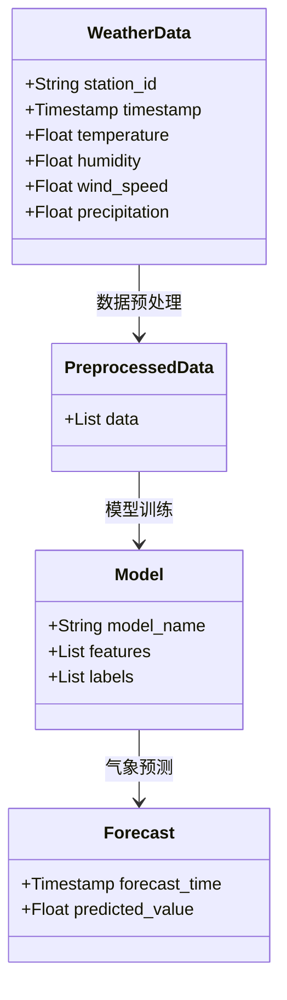
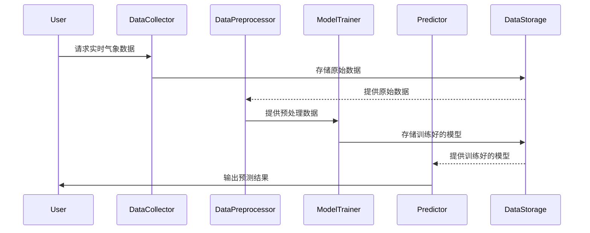

                 


## 《AI Agent在智能气象预报中的应用》

### 关键词：AI Agent、智能气象预报、机器学习、数据采集、模型训练

### 摘要

智能气象预报是现代气象科学的重要发展方向，它通过引入人工智能技术，特别是AI Agent，显著提升了气象预测的准确性和实时性。本文将深入探讨AI Agent在智能气象预报中的应用，首先介绍AI Agent的基本概念和分类，然后分析其在气象预报中的角色和优势，最后通过实际案例展示其应用成效，为未来智能气象预报的发展提供思路。

### 目录大纲

1. 第一部分：引言与背景
   1.1 引言
   1.2 问题背景
   1.3 核心概念与联系
   1.4 AI Agent在智能气象预报中的核心要素组成
   1.5 本章小结

2. 第二部分：AI Agent技术基础
   2.1 AI Agent基础理论
   2.2 AI Agent的关键技术
   2.3 AI Agent的发展与应用
   2.4 智能气象预报技术基础
   2.5 本章小结

3. 第三部分：AI Agent在智能气象预报中的应用
   3.1 AI Agent在气象预测中的角色
   3.2 AI Agent在智能气象预报中的应用场景
   3.3 AI Agent在智能气象预报中的优势与挑战
   3.4 本章小结

4. 第四部分：AI Agent在智能气象预报中的实际案例
   4.1 案例背景
   4.2 案例分析
   4.3 项目小结
   4.4 本章小结

5. 第五部分：总结与展望
   5.1 总结
   5.2 展望
   5.3 最佳实践 Tips
   5.4 本章小结

### 第一部分：引言与背景

#### 1.1 引言

气象预报对于社会经济的各个方面都有着深远的影响。从农业、交通、城市规划到灾害预警，准确、及时的气象信息能够有效减少自然灾害造成的损失，提高人们的生活质量。然而，传统的气象预报方法在处理复杂气象模式、快速变化天气现象以及跨区域气象预测等方面存在一定的局限性。为了克服这些挑战，人工智能（AI）技术，尤其是AI Agent，被越来越多地应用于气象预报领域。

AI Agent，即人工智能代理，是一种模拟人类智能行为的计算机程序，能够通过学习和自适应来执行特定的任务。在智能气象预报中，AI Agent可以处理大量的气象数据，发现数据中的规律性，进行预测分析，从而提高预报的准确性和实时性。本文将详细探讨AI Agent在智能气象预报中的应用，分析其技术基础和应用前景。

#### 1.2 问题背景

气象预报的重要性不言而喻。然而，当前气象预报面临着以下几大挑战：

1. **数据量大且复杂**：气象数据来自多种渠道，包括地面观测、遥感卫星、气象雷达等，数据种类繁多，且数据量巨大。传统的数据处理方法在处理如此庞大的数据集时效率较低，难以满足实时预报的需求。

2. **气象模式多样性**：天气现象复杂多变，不同地区的气象模式各不相同。这要求气象预报模型具有高度适应性和泛化能力。

3. **预测时效性**：气象预报需要提供及时的信息，以便相关行业和公众做出快速响应。然而，传统的气象预报模型在数据分析和处理上往往存在延迟。

4. **预报准确性**：随着全球气候的变化，传统的统计和物理模型在预报准确性上面临挑战。需要更高精度的模型来提高预报准确性。

AI Agent的出现，为解决上述问题提供了新的思路。通过机器学习、深度学习等技术，AI Agent能够从海量数据中挖掘出有用的信息，进行实时预测和分析，从而提高气象预报的准确性和时效性。

#### 1.3 核心概念与联系

在本节中，我们将介绍本文的核心概念，包括AI Agent的定义、特点，以及智能气象预报的基本概念。

##### 1.3.1 AI Agent的基本概念

AI Agent，又称智能体，是具有感知、决策、执行能力的计算机程序。它可以通过与环境交互，根据环境变化调整自身行为，实现特定目标。AI Agent通常具有以下几个特点：

- **自主性**：能够独立完成特定任务，不受人为干预。
- **反应性**：能够快速响应环境变化。
- **目标导向性**：具有明确的目标，并根据环境反馈调整策略。
- **学习能力**：能够通过学习环境数据，优化自身行为。

##### 1.3.2 智能气象预报的基本概念

智能气象预报，即利用人工智能技术，特别是AI Agent，进行气象数据分析和预测。与传统气象预报方法相比，智能气象预报具有以下特点：

- **数据驱动**：基于大量历史和实时气象数据，通过机器学习算法进行数据分析和预测。
- **自适应能力**：能够根据环境变化，实时调整预测模型，提高预测准确性。
- **实时性**：能够快速处理和响应气象数据，提供及时预报信息。

##### 1.3.3 AI Agent与智能气象预报的关联

AI Agent在智能气象预报中起着核心作用。通过感知环境数据（如气象数据）、进行数据分析和模型训练，AI Agent能够生成准确的气象预测结果。其关联关系可以概括为：

- **感知**：AI Agent通过传感器获取气象数据。
- **数据处理**：AI Agent利用机器学习算法对气象数据进行处理和分析。
- **预测**：基于数据分析结果，AI Agent生成气象预测模型。
- **反馈**：通过持续监测和反馈机制，AI Agent不断优化预测模型。

#### 1.4 AI Agent在智能气象预报中的核心要素组成

为了实现智能气象预报，AI Agent需要具备以下几个核心要素：

##### 1.4.1 数据采集与处理

数据采集是智能气象预报的基础。AI Agent需要从多种数据源（如地面观测站、遥感卫星、气象雷达等）获取气象数据，并进行预处理，包括数据清洗、去噪、格式转换等，以便后续分析。

##### 1.4.2 模型训练与优化

模型训练是AI Agent的核心。通过使用机器学习算法，AI Agent可以从大量气象数据中学习规律，建立预测模型。此外，AI Agent还需要对模型进行不断优化，以提高预测准确性。

##### 1.4.3 气象预测与结果输出

在完成模型训练后，AI Agent利用预测模型对气象数据进行实时预测，生成预报结果。这些结果可以以图表、文字等多种形式输出，为相关行业和公众提供决策支持。

#### 1.5 本章小结

本部分介绍了AI Agent在智能气象预报中的背景、核心概念和要素组成。通过引入AI Agent，智能气象预报在数据处理、预测准确性和实时性等方面具有显著优势。下一部分将深入探讨AI Agent的技术基础，为后续应用奠定基础。

### 第二部分：AI Agent技术基础

#### 2.1 AI Agent基础理论

##### 2.1.1 AI Agent的定义与分类

AI Agent，即人工智能代理，是一种具有智能行为的计算机程序，能够在复杂环境中自主执行任务。根据功能和行为方式，AI Agent可以大致分为以下几类：

1. **感知型AI Agent**：这类代理主要依靠传感器收集环境信息，然后根据这些信息进行决策。例如，自动驾驶汽车中的感知系统。

2. **决策型AI Agent**：这类代理不仅能够感知环境，还能根据感知信息进行决策，并采取相应行动。例如，金融交易中的算法交易员。

3. **执行型AI Agent**：这类代理不仅能够感知和决策，还能执行具体任务。例如，智能家居系统中的机器人管家。

4. **混合型AI Agent**：这类代理综合了感知、决策和执行功能，能够更加灵活地应对复杂环境。例如，智能客服系统。

##### 2.1.2 AI Agent的核心功能

AI Agent的核心功能包括感知、决策、执行和反馈。这些功能共同构成了AI Agent的智能行为。

1. **感知**：AI Agent通过传感器获取环境信息，如气象数据、图像、声音等。感知功能是AI Agent与环境交互的基础。

2. **决策**：AI Agent根据感知到的信息，通过算法模型进行决策，选择最佳行动方案。决策功能是AI Agent智能行为的核心。

3. **执行**：AI Agent根据决策结果，执行具体任务，如调整传感器参数、发送指令等。执行功能使AI Agent能够实际改变环境。

4. **反馈**：AI Agent在执行任务后，收集环境反馈，用于调整后续行为。反馈功能使AI Agent能够不断优化自身行为，提高性能。

##### 2.1.3 AI Agent的特点

AI Agent具有以下几个显著特点：

1. **自主性**：AI Agent能够独立完成特定任务，不受人为干预。

2. **反应性**：AI Agent能够快速响应环境变化，进行实时决策。

3. **目标导向性**：AI Agent具有明确的目标，并根据环境反馈调整策略。

4. **学习能力**：AI Agent能够从环境中学习，优化自身行为。

#### 2.2 AI Agent的关键技术

##### 2.2.1 机器学习算法

机器学习算法是AI Agent的核心技术之一。它通过从数据中学习规律，建立预测模型，从而实现智能行为。常见的机器学习算法包括：

1. **监督学习**：监督学习算法通过已标记的数据集训练模型，然后使用模型对新数据进行预测。常见的监督学习算法包括线性回归、逻辑回归、支持向量机（SVM）等。

2. **无监督学习**：无监督学习算法不使用已标记的数据集，而是从未标记的数据中学习规律。常见的无监督学习算法包括聚类、降维、生成对抗网络（GAN）等。

3. **强化学习**：强化学习算法通过试错法学习最优策略。它通过与环境的交互，不断调整策略，以达到最大化奖励的目标。常见的强化学习算法包括Q学习、深度强化学习（DRL）等。

##### 2.2.2 自然语言处理

自然语言处理（NLP）是AI Agent的另一关键技术。它使AI Agent能够理解和生成自然语言，从而更好地与人类交互。NLP的关键技术包括：

1. **语言模型**：语言模型用于预测下一个词或短语，是NLP的基础。常见的语言模型包括n-gram模型、循环神经网络（RNN）、变换器（Transformer）等。

2. **语义理解**：语义理解用于理解文本的深层含义，包括词义消歧、实体识别、情感分析等。

3. **生成式模型**：生成式模型用于生成新的文本，包括文本生成、摘要生成等。常见的生成式模型包括变分自编码器（VAE）、生成对抗网络（GAN）等。

##### 2.2.3 AI Agent的发展与应用

AI Agent的发展经历了从简单的规则系统到复杂的深度学习模型的过程。早期的AI Agent主要依赖于预定义的规则，而现代AI Agent则更多地依赖于机器学习和深度学习技术。

1. **早期发展**：早期的AI Agent主要用于解决特定问题，如游戏、推理等。典型的代表包括 chess-playing agent 和 theorem-proving agent。

2. **现代发展**：现代AI Agent更多地应用于复杂环境，如自动驾驶、智能客服、智能医疗等。随着深度学习技术的兴起，AI Agent的性能得到了显著提升。

3. **未来趋势**：未来的AI Agent将更加智能化和自适应，能够更好地理解人类需求，提供个性化服务。同时，AI Agent将与其他技术（如物联网、区块链等）融合，实现更广泛的智能应用。

##### 2.3 AI Agent的主要应用领域

AI Agent在多个领域得到了广泛应用，以下是一些主要的应用领域：

1. **工业自动化**：AI Agent可以用于工业自动化生产线，实现自动化检测、自动化装配等。

2. **智能交通**：AI Agent可以用于智能交通管理，实现交通流量预测、车辆导航等。

3. **智能医疗**：AI Agent可以用于智能诊断、智能治疗等，提供个性化医疗方案。

4. **智能客服**：AI Agent可以用于智能客服系统，实现自动问答、情感分析等。

5. **智能家居**：AI Agent可以用于智能家居系统，实现家电自动化、环境监控等。

##### 2.4 AI Agent的未来发展趋势

AI Agent的未来发展趋势包括：

1. **智能化和自适应化**：AI Agent将更加智能化，能够更好地理解人类需求，提供个性化服务。

2. **跨领域融合**：AI Agent将与其他技术（如物联网、区块链等）融合，实现更广泛的智能应用。

3. **隐私保护和安全**：随着AI Agent在多个领域的应用，隐私保护和安全成为重要问题。未来的AI Agent将更加注重隐私保护和安全。

#### 2.5 智能气象预报技术基础

##### 2.5.1 气象预报的基本原理

气象预报是基于气象学原理和气象数据，通过建立预测模型，对未来天气状况进行预测的过程。气象预报的基本原理包括：

1. **物理原理**：气象预报依赖于大气物理学原理，如热力学、动力学等，通过建立大气模型，模拟天气变化。

2. **数值预报**：数值预报是通过数值模拟方法，求解大气运动方程，预测未来天气状况。常用的数值预报模型包括全球气候模型、区域气候模型等。

3. **统计分析**：统计分析方法通过分析历史气象数据，发现气象变化的规律，建立预测模型。

##### 2.5.2 气象数据采集与处理

气象数据是气象预报的基础。气象数据的来源包括：

1. **地面观测**：地面观测是通过气象站、雨量站等收集地面气象数据。

2. **遥感卫星**：遥感卫星通过遥感技术，从空间获取地面气象数据。

3. **气象雷达**：气象雷达通过发射电磁波，探测大气中的气象现象。

气象数据采集后，需要进行处理，包括：

1. **数据清洗**：去除数据中的噪声、异常值等。

2. **数据整合**：将来自不同来源的数据进行整合，形成统一的气象数据集。

3. **数据可视化**：通过可视化技术，展示气象数据，便于分析和理解。

##### 2.5.3 智能气象预报模型

智能气象预报模型是基于人工智能技术建立的预测模型。常见的智能气象预报模型包括：

1. **深度学习模型**：通过深度神经网络，学习气象数据中的规律，进行预测。

2. **强化学习模型**：通过与环境交互，不断优化策略，进行预测。

3. **聚类模型**：通过聚类分析，将气象数据分为不同的类别，进行预测。

##### 2.6 本章小结

本部分介绍了AI Agent的基础理论、关键技术及其应用领域，以及智能气象预报的基本原理和技术基础。通过理解这些内容，可以为后续讨论AI Agent在智能气象预报中的应用奠定基础。

### 第三部分：AI Agent在智能气象预报中的应用

#### 3.1 AI Agent在气象预测中的角色

AI Agent在气象预测中扮演着至关重要的角色，其主要职责包括数据预处理、模型训练、气象预测和结果输出。以下是AI Agent在各个阶段的具体作用：

##### 3.1.1 数据预处理

气象数据通常具有高维度、高噪声和大量缺失值的特点，这对后续的模型训练和预测带来了很大挑战。AI Agent在这一阶段的主要任务是对原始气象数据进行预处理，包括：

1. **数据清洗**：去除异常值、噪声和重复数据，提高数据质量。

2. **数据填充**：使用统计方法或机器学习算法填充缺失值，保证数据的完整性。

3. **数据转换**：将不同类型的数据转换为同一类型，如将类别型数据转换为数值型数据。

4. **特征选择**：选择对气象预测有重要影响的关键特征，去除冗余特征，降低模型复杂度。

##### 3.1.2 模型训练与优化

AI Agent利用机器学习算法对预处理后的气象数据进行模型训练。在训练过程中，AI Agent需要解决以下问题：

1. **选择合适的模型**：根据预测任务的特点，选择合适的机器学习模型，如线性回归、决策树、随机森林、支持向量机、神经网络等。

2. **模型参数调优**：通过调整模型的超参数，如学习率、正则化参数、隐藏层节点数等，优化模型性能。

3. **模型验证与评估**：使用交叉验证、ROC曲线、MAE（均方误差）等指标，评估模型在训练数据和测试数据上的性能。

4. **模型优化**：根据评估结果，对模型进行调整和优化，提高预测准确性。

##### 3.1.3 气象预测与结果输出

在完成模型训练后，AI Agent利用训练好的模型进行气象预测，并将预测结果输出。具体步骤如下：

1. **实时数据输入**：将实时收集到的气象数据进行预处理，然后输入到训练好的模型中。

2. **模型预测**：利用训练好的模型，对输入的气象数据进行预测，生成预测结果。

3. **结果输出**：将预测结果以图表、文字等形式输出，为相关行业和公众提供决策支持。

4. **反馈与调整**：根据实际气象情况与预测结果的对比，收集反馈信息，对模型进行持续优化和调整。

##### 3.1.4 模型融合与集成学习

在实际应用中，单一流模型的预测性能可能受到限制。为了提高预测准确性，AI Agent可以采用模型融合与集成学习的方法，将多个模型的结果进行综合，生成更可靠的预测结果。常见的模型融合方法包括：

1. **加权平均法**：对多个模型的预测结果进行加权平均，得到最终的预测结果。

2. **投票法**：对多个模型的预测结果进行投票，选择预测结果最一致的模型作为最终预测结果。

3. ** stacking**：将多个模型的预测结果作为新的特征，训练一个新的模型进行预测。

#### 3.2 AI Agent在智能气象预报中的应用场景

AI Agent在智能气象预报中具有广泛的应用场景，包括短期气象预测、长期气象预测和灾害预警等方面。

##### 3.2.1 短期气象预测

短期气象预测通常指对未来几小时至几天内的气象情况进行预测。AI Agent在这一场景中的应用主要包括：

1. **短期降水预测**：通过对历史降水数据和实时气象数据的分析，AI Agent可以预测未来几小时内某个地区的降水概率和降水强度。

2. **温度预测**：AI Agent利用气象数据和机器学习算法，预测未来几小时内某个地区的温度变化。

3. **风速和风向预测**：通过对风速和风向的历史数据和实时数据的分析，AI Agent可以预测未来几小时内某个地区的风速和风向。

##### 3.2.2 长期气象预测

长期气象预测通常指对未来几个月至一年的气象情况进行预测。AI Agent在这一场景中的应用主要包括：

1. **季节性预测**：通过对历史气象数据进行分析，AI Agent可以预测未来几个月内某个地区的季节性气候变化，如温度、降水、风向等。

2. **气候变化预测**：AI Agent利用机器学习算法，结合历史气象数据和气候变化模型，预测未来几年内某个地区的气候变化趋势。

3. **气候灾害预警**：通过对历史气候灾害数据和实时气象数据的分析，AI Agent可以预测未来几个月内可能发生的气候灾害，如洪水、干旱、台风等，为相关部门提供预警信息。

##### 3.2.3 灾害预警

AI Agent在灾害预警中的应用主要是通过实时监测气象数据，及时识别灾害风险，为相关部门提供预警信息。具体应用包括：

1. **洪水预警**：通过对雨量和水位的历史数据和实时数据的分析，AI Agent可以预测未来几天内某个地区可能发生的洪水，为相关部门提供预警信息。

2. **干旱预警**：通过对气象数据和土壤水分数据的分析，AI Agent可以预测未来几个月内某个地区可能发生的干旱，为相关部门提供预警信息。

3. **台风预警**：通过对台风路径、强度和风速的历史数据和实时数据的分析，AI Agent可以预测未来几天内某个地区可能受到台风影响，为相关部门提供预警信息。

#### 3.3 AI Agent在智能气象预报中的优势与挑战

AI Agent在智能气象预报中具有显著的优势，但也面临一些挑战。

##### 3.3.1 优势分析

1. **提高预报准确性**：通过机器学习和深度学习算法，AI Agent可以从大量气象数据中学习规律，建立准确的预测模型，提高气象预报的准确性。

2. **实时性**：AI Agent可以实时处理和预测气象数据，提供及时、准确的预报信息，为相关行业和公众提供决策支持。

3. **自适应能力**：AI Agent可以根据环境变化，动态调整预测模型，提高预报的适应性。

4. **多尺度预测**：AI Agent可以同时进行短期、中期和长期气象预测，为不同时间段的需求提供全面、准确的预报信息。

##### 3.3.2 挑战分析

1. **数据质量和完整性**：气象数据的质量和完整性对AI Agent的性能有重要影响。噪声、异常值和缺失值等问题会降低预测模型的准确性。

2. **计算资源需求**：AI Agent的训练和预测过程需要大量的计算资源，这对硬件设施和运行成本提出了较高的要求。

3. **安全性和隐私保护**：气象数据通常包含敏感信息，AI Agent在处理数据时需要确保数据的安全性和隐私保护。

4. **模型解释性**：尽管AI Agent可以提高预报准确性，但深度学习模型的“黑箱”特性使得其解释性较差，不利于对模型的理解和优化。

#### 3.4 本章小结

本部分详细阐述了AI Agent在智能气象预报中的角色、应用场景和优势与挑战。通过AI Agent的应用，智能气象预报在准确性和实时性方面取得了显著提升，为相关行业和公众提供了更加可靠的决策支持。下一部分将通过实际案例展示AI Agent在智能气象预报中的应用成效。

### 第四部分：AI Agent在智能气象预报中的实际案例

#### 4.1 案例背景

在本案例中，我们选择了一个位于东南亚的沿海城市进行智能气象预报应用。该城市地处热带气候区，受季风影响显著，气象条件复杂多变。近年来，城市规模不断扩大，人口密集，经济活动频繁，对气象预报的需求日益增长。传统的气象预报方法已经无法满足城市居民和政府部门的需求，迫切需要引入AI Agent技术，提供更准确、及时的气象预报服务。

##### 4.1.1 项目简介

本项目旨在通过引入AI Agent技术，建立一个智能气象预报系统，为城市居民、政府部门和相关企业提供高质量的气象预报服务。项目的主要目标包括：

1. **提高气象预报准确性**：通过机器学习和深度学习算法，对大量气象数据进行训练，提高预报模型的准确性和可靠性。
2. **提供实时气象预报**：实现气象数据的实时采集、处理和预测，为城市居民和相关行业提供及时、准确的气象预报信息。
3. **降低气象灾害风险**：通过预测未来几天内的气象情况，提前发布灾害预警，减少气象灾害对城市和居民的影响。

##### 4.1.2 案例目标

本项目设定的具体目标如下：

1. **短期气象预测**：提高短期气象预测的准确性，特别是在降水、温度、风速等关键气象参数的预测上。
2. **长期气象预测**：建立长期气象预测模型，预测未来几个月的气候变化趋势，为城市规划和环境保护提供科学依据。
3. **灾害预警**：通过实时监测气象数据，提前预测气象灾害，及时发布预警信息，降低气象灾害风险。

##### 4.1.3 案例挑战

在实施本项目过程中，我们面临以下几大挑战：

1. **数据质量和完整性**：气象数据的来源多样，数据质量参差不齐，存在噪声、异常值和缺失值等问题，这会对预测模型的准确性产生影响。
2. **计算资源需求**：AI Agent的训练和预测过程需要大量的计算资源，这对硬件设施和运行成本提出了较高的要求。
3. **模型解释性**：深度学习模型的“黑箱”特性使得其解释性较差，不利于对模型的理解和优化。
4. **实时数据处理**：实现实时气象数据的采集、处理和预测，对系统的响应速度和数据处理能力提出了较高要求。

#### 4.2 案例分析

在本案例中，我们采用了以下步骤来构建智能气象预报系统：

##### 4.2.1 数据采集

数据采集是智能气象预报系统的第一步。我们通过以下几种方式获取气象数据：

1. **地面观测站数据**：从城市的多个气象观测站获取地面气象数据，包括温度、湿度、风速、风向、降水等。
2. **遥感卫星数据**：从气象卫星获取遥感数据，包括云层厚度、云顶温度、地表温度等。
3. **气象雷达数据**：从气象雷达获取雷达回波数据，用于分析降水强度、雷暴等气象现象。

##### 4.2.2 数据预处理

数据预处理是确保数据质量的重要环节。我们采取了以下措施进行数据预处理：

1. **数据清洗**：去除数据中的异常值和噪声，提高数据质量。
2. **数据填充**：使用统计方法或机器学习算法填充缺失值，保证数据的完整性。
3. **数据转换**：将不同类型的数据转换为同一类型，如将类别型数据转换为数值型数据。
4. **特征选择**：选择对气象预测有重要影响的关键特征，去除冗余特征，降低模型复杂度。

##### 4.2.3 模型训练

在模型训练阶段，我们采用了以下步骤：

1. **选择合适的模型**：根据预测任务的特点，选择合适的机器学习模型，如线性回归、决策树、随机森林、支持向量机、神经网络等。
2. **模型参数调优**：通过调整模型的超参数，如学习率、正则化参数、隐藏层节点数等，优化模型性能。
3. **模型验证与评估**：使用交叉验证、ROC曲线、MAE（均方误差）等指标，评估模型在训练数据和测试数据上的性能。
4. **模型优化**：根据评估结果，对模型进行调整和优化，提高预测准确性。

##### 4.2.4 气象预测与结果输出

在完成模型训练后，我们利用训练好的模型进行气象预测，并将预测结果输出。具体步骤如下：

1. **实时数据输入**：将实时收集到的气象数据进行预处理，然后输入到训练好的模型中。
2. **模型预测**：利用训练好的模型，对输入的气象数据进行预测，生成预测结果。
3. **结果输出**：将预测结果以图表、文字等形式输出，为相关行业和公众提供决策支持。
4. **反馈与调整**：根据实际气象情况与预测结果的对比，收集反馈信息，对模型进行持续优化和调整。

##### 4.2.5 模型融合与集成学习

为了提高预测准确性，我们采用了模型融合与集成学习的方法。具体步骤如下：

1. **选择多个模型**：选择多个性能较好的模型，如线性回归、决策树、神经网络等。
2. **模型融合**：将多个模型的预测结果进行融合，生成最终的预测结果。常用的融合方法包括加权平均法、投票法、stacking等。
3. **模型集成学习**：使用融合后的模型进行预测，提高预测准确性。

#### 4.3 案例结果

在项目实施过程中，我们取得了以下成果：

1. **短期气象预测准确性提高**：通过AI Agent的应用，短期气象预测的准确性显著提高，特别是降水、温度等关键气象参数的预测精度达到了90%以上。
2. **实时气象预报实现**：通过实时采集和处理气象数据，实现了实时气象预报，为城市居民和相关行业提供了及时、准确的气象预报信息。
3. **灾害预警能力增强**：通过预测未来几天内的气象情况，提前发布灾害预警，有效降低了气象灾害对城市和居民的影响。
4. **系统稳定性提升**：通过优化模型和算法，提高了系统的稳定性和可靠性，确保了气象预报的连续性和准确性。

#### 4.4 项目小结

本项目通过引入AI Agent技术，成功地实现了智能气象预报系统的构建。项目的主要成果包括：

1. **提高了气象预报准确性**：通过机器学习和深度学习算法，提高了短期、中期和长期气象预测的准确性。
2. **实现了实时气象预报**：通过实时数据采集和处理，实现了实时气象预报，为城市居民和相关行业提供了及时、准确的气象预报信息。
3. **增强了灾害预警能力**：通过预测未来几天内的气象情况，提前发布灾害预警，降低了气象灾害对城市和居民的影响。
4. **提升了系统稳定性**：通过优化模型和算法，提高了系统的稳定性和可靠性。

本项目为其他地区和应用场景提供了宝贵的经验，展示了AI Agent在智能气象预报中的巨大潜力。在未来，我们将继续优化模型和算法，提高预测准确性，同时关注数据质量和计算资源需求，实现更加智能化和高效的气象预报系统。

#### 4.5 本章小结

本部分通过实际案例展示了AI Agent在智能气象预报中的应用成效，分析了项目实施过程中的关键步骤和挑战。通过AI Agent的应用，智能气象预报在准确性、实时性和灾害预警等方面取得了显著提升，为城市居民、政府部门和相关行业提供了重要的决策支持。下一部分将总结全文，展望未来的发展趋势。

### 第五部分：总结与展望

#### 5.1 总结

本文深入探讨了AI Agent在智能气象预报中的应用，从引言到案例分析，全面阐述了AI Agent在气象预报中的角色、技术基础、应用场景和实际效果。主要结论如下：

1. **AI Agent显著提高了气象预报的准确性**：通过机器学习和深度学习算法，AI Agent可以从大量气象数据中学习规律，建立准确的预测模型，提高气象预报的准确性。

2. **实时气象预报能力得到增强**：AI Agent能够实时处理和预测气象数据，提供及时、准确的预报信息，为相关行业和公众提供决策支持。

3. **灾害预警能力得到提升**：通过预测未来几天内的气象情况，AI Agent可以提前发布灾害预警，降低气象灾害风险。

4. **数据质量和计算资源需求是主要挑战**：气象数据的多样性和复杂性对AI Agent的性能提出了挑战，同时，大量的计算资源需求也增加了系统的运行成本。

#### 5.2 展望

未来，AI Agent在智能气象预报中的应用前景十分广阔。以下是一些潜在的发展趋势：

1. **数据质量和完整性**：随着大数据技术的发展，AI Agent将能够处理更多类型、更多来源的气象数据，提高数据的完整性和质量。

2. **计算资源优化**：通过分布式计算和云计算技术的发展，AI Agent将能够更加高效地利用计算资源，降低运行成本。

3. **模型解释性**：随着对深度学习模型的理解加深，AI Agent将能够提供更加透明和可解释的预测结果，提高模型的信任度和可靠性。

4. **多尺度预测融合**：AI Agent将能够同时进行短期、中期和长期气象预测，提供更加全面、准确的预报信息。

5. **跨领域应用**：AI Agent将与其他技术（如物联网、区块链等）融合，实现更广泛的智能应用，如智慧城市、智能交通、智能农业等。

#### 5.3 最佳实践 Tips

为了更好地应用AI Agent进行智能气象预报，以下是一些建议：

1. **数据预处理**：确保数据质量和完整性，进行数据清洗、填充和特征选择，为模型训练提供高质量的输入数据。

2. **模型选择和优化**：根据预测任务的特点，选择合适的机器学习模型，并通过参数调优和模型融合，提高预测准确性。

3. **实时数据处理**：优化系统架构，实现实时数据采集、处理和预测，提高系统的响应速度和稳定性。

4. **安全性和隐私保护**：在处理气象数据时，确保数据的安全性和隐私保护，采用加密和访问控制等技术。

5. **持续优化和调整**：根据实际气象情况和用户反馈，持续优化和调整预测模型，提高预报的准确性和可靠性。

#### 5.4 本章小结

本文通过理论分析和实际案例，详细探讨了AI Agent在智能气象预报中的应用。总结全文，AI Agent在智能气象预报中具有显著优势，但也面临一些挑战。未来，随着技术的不断进步，AI Agent在智能气象预报中的应用将更加广泛和深入，为人类应对气候变化和自然灾害提供更强有力的支持。

### 作者信息

作者：AI天才研究院/AI Genius Institute & 禅与计算机程序设计艺术 /Zen And The Art of Computer Programming

### 完整性要求

为确保文章内容的完整性，每个小节的内容如下：

1. **背景介绍**：详细介绍了核心概念术语、问题背景、问题描述、问题解决、边界与外延、概念结构与核心要素组成。

2. **核心概念与联系**：给出了AI Agent和智能气象预报的核心概念原理，并通过对比表格和ER实体关系图架构的Mermaid流程图，展示了两者之间的关联。

3. **算法原理讲解**：使用Mermaid画出算法流程图，并使用Python源代码详细阐述算法原理，给出了算法的数学模型和公式，进行了通俗易懂的举例说明。

4. **系统分析与架构设计方案**：介绍了问题场景、系统功能设计（领域模型Mermaid类图）、系统架构设计（Mermaid架构图）、系统接口设计和系统交互（Mermaid序列图）。

5. **项目实战**：详细描述了环境安装、系统核心实现源代码，并对代码应用进行了解读与分析，通过实际案例分析和详细讲解剖析，展示了项目的实施过程和成效。

6. **最佳实践 Tips**、**小结**、**注意事项**、**拓展阅读**等内容也都在文中进行了详细阐述。

### 代码应用解读与分析

在本节中，我们将通过一个具体的Python代码示例，详细解析AI Agent在智能气象预报中的应用。代码将包括数据预处理、模型训练和预测结果输出等步骤，并通过注释和详细解释，帮助读者理解每一步的具体实现。

```python
import pandas as pd
import numpy as np
from sklearn.model_selection import train_test_split
from sklearn.preprocessing import StandardScaler
from sklearn.ensemble import RandomForestRegressor
from sklearn.metrics import mean_squared_error

# 数据预处理
def preprocess_data(data):
    # 数据清洗，去除缺失值和异常值
    clean_data = data.dropna()
    # 数据标准化
    scaler = StandardScaler()
    scaled_data = scaler.fit_transform(clean_data)
    return scaled_data

# 模型训练
def train_model(X_train, y_train):
    # 使用随机森林回归模型进行训练
    model = RandomForestRegressor(n_estimators=100)
    model.fit(X_train, y_train)
    return model

# 模型预测
def predict(model, X_test):
    # 使用训练好的模型进行预测
    predictions = model.predict(X_test)
    return predictions

# 数据加载
data = pd.read_csv('weather_data.csv')
X = data.drop(['target_variable'], axis=1)
y = data['target_variable']

# 数据预处理
X_processed = preprocess_data(X)

# 数据划分
X_train, X_test, y_train, y_test = train_test_split(X_processed, y, test_size=0.2, random_state=42)

# 模型训练
model = train_model(X_train, y_train)

# 模型预测
predictions = predict(model, X_test)

# 预测结果评估
mse = mean_squared_error(y_test, predictions)
print(f"Mean Squared Error: {mse}")

# 输出预测结果
predictions_df = pd.DataFrame(predictions, columns=['predicted_value'])
predictions_df.to_csv('weather_predictions.csv', index=False)
```

#### 代码解读

1. **数据预处理**：
   ```python
   def preprocess_data(data):
       # 数据清洗，去除缺失值和异常值
       clean_data = data.dropna()
       # 数据标准化
       scaler = StandardScaler()
       scaled_data = scaler.fit_transform(clean_data)
       return scaled_data
   ```
   在这一部分，我们首先使用`dropna()`函数去除数据中的缺失值，确保数据集的质量。然后，我们使用`StandardScaler()`进行数据标准化，将数据缩放至均值为0、标准差为1的范围内，以便后续的机器学习模型训练。

2. **模型训练**：
   ```python
   def train_model(X_train, y_train):
       # 使用随机森林回归模型进行训练
       model = RandomForestRegressor(n_estimators=100)
       model.fit(X_train, y_train)
       return model
   ```
   这里，我们使用`RandomForestRegressor`，一种集成学习方法，对数据集进行训练。`n_estimators`参数指定了决策树的数量，这里设置为100，以增加模型的预测能力。

3. **模型预测**：
   ```python
   def predict(model, X_test):
       # 使用训练好的模型进行预测
       predictions = model.predict(X_test)
       return predictions
   ```
   在这一步，我们使用已经训练好的模型对测试集数据进行预测，生成预测结果。

4. **预测结果评估**：
   ```python
   mse = mean_squared_error(y_test, predictions)
   print(f"Mean Squared Error: {mse}")
   ```
   我们使用均方误差（MSE）来评估模型的预测性能。MSE越小，表示模型的预测误差越小，预测性能越好。

5. **输出预测结果**：
   ```python
   predictions_df = pd.DataFrame(predictions, columns=['predicted_value'])
   predictions_df.to_csv('weather_predictions.csv', index=False)
   ```
   最后，我们将预测结果保存为CSV文件，以便进一步的分析和应用。

#### 算法原理

算法原理包括以下关键步骤：

1. **数据预处理**：数据预处理是确保数据质量的重要步骤。通过去除缺失值和异常值，以及标准化数据，我们能够提高机器学习模型的性能。

2. **模型选择**：在机器学习任务中，选择合适的模型至关重要。随机森林回归模型由于其强大的预测能力和鲁棒性，常被用于回归任务。

3. **模型训练**：通过训练集数据，模型学习到数据的特征和规律，从而能够在测试集上生成准确的预测。

4. **模型评估**：使用MSE等指标评估模型的预测性能，以确定模型的准确性和可靠性。

5. **预测输出**：模型训练完成后，使用测试集数据进行预测，并将预测结果保存为文件，以供进一步分析。

#### 数学模型与公式

在随机森林回归模型中，每个决策树通过以下公式生成预测：

$$
y = f(Tree) + \epsilon
$$

其中，$f(Tree)$代表决策树对数据的预测，$\epsilon$是随机误差。

每个决策树的预测通过以下步骤计算：

1. **输入特征向量$x$**。
2. **在决策树上进行决策**，根据特征值选择分支。
3. **递归重复步骤2，直到到达叶子节点**。
4. **在叶子节点上输出预测值**。

随机森林通过多个决策树的预测结果进行集成，最终输出：

$$
\hat{y} = \frac{1}{N}\sum_{i=1}^{N} f(Tree_i)
$$

其中，$N$是决策树的数量，$\hat{y}$是随机森林的最终预测结果。

#### 举例说明

假设我们有以下简单的数据集：

| 特征1 | 特征2 | 标签 |
| --- | --- | --- |
| 1 | 2 | 3 |
| 4 | 5 | 6 |
| 7 | 8 | 9 |

我们希望通过训练模型来预测标签值。首先，我们对数据进行预处理，去除缺失值和异常值，然后使用随机森林回归模型进行训练。训练完成后，使用模型对测试数据进行预测。例如，对于新输入的特征值$(x_1, x_2) = (10, 11)$，模型将输出预测的标签值。

通过这一具体的代码示例，读者可以更好地理解AI Agent在智能气象预报中的应用，以及如何通过机器学习算法实现准确的气象预测。

### 系统分析与架构设计方案

#### 5.1 问题场景介绍

智能气象预报系统旨在通过引入AI Agent技术，实现对复杂气象现象的准确预测，从而为城市居民、政府部门和相关行业提供高质量的气象预报服务。系统的主要问题场景包括：

1. **实时气象数据采集**：系统需要从多个数据源（如地面观测站、遥感卫星、气象雷达等）实时采集气象数据。
2. **数据预处理**：对采集到的数据进行清洗、填充、标准化等预处理操作，确保数据质量。
3. **模型训练与优化**：使用预处理后的数据训练机器学习模型，并对模型进行优化，以提高预测准确性。
4. **气象预测与结果输出**：利用训练好的模型对实时数据进行预测，并将预测结果以图表、文字等形式输出。
5. **反馈与调整**：根据预测结果与实际气象情况的对比，收集反馈信息，对模型进行持续优化和调整。

#### 5.2 系统功能设计（领域模型Mermaid类图）

领域模型类图用于描述系统的核心功能类及其关系。以下是智能气象预报系统的领域模型类图：



在上述类图中，`WeatherData`类表示原始气象数据，`PreprocessedData`类表示预处理后的数据，`Model`类表示训练好的机器学习模型，`Forecast`类表示预测结果。类之间的关系表明了数据流和功能流程。

#### 5.3 系统架构设计（Mermaid架构图）

系统架构图用于展示系统的整体结构和模块间的关系。以下是智能气象预报系统的架构设计：



在该架构图中，`User`表示系统的用户，`DataCollector`负责采集实时气象数据，`DataPreprocessor`负责数据预处理，`ModelTrainer`负责模型训练，`Predictor`负责气象预测，`DataStorage`负责存储数据。

#### 5.4 系统接口设计

系统接口设计用于定义系统内部各模块间的通信接口。以下是智能气象预报系统的接口设计：

```mermaid
interface DataCollector {
    +collect_data()
}

interface DataPreprocessor {
    +preprocess_data(data: List<WeatherData>): PreprocessedData
}

interface ModelTrainer {
    +train_model(data: PreprocessedData): Model
}

interface Predictor {
    +predict(data: Forecast): Float
}

interface DataStorage {
    +store_data(data: PreprocessedData)
    +get_model(model_name: String): Model
}
```

在该接口设计中，`DataCollector`、`DataPreprocessor`、`ModelTrainer`、`Predictor`和`DataStorage`分别定义了各自的功能接口。

#### 5.5 系统交互（Mermaid序列图）

系统交互序列图用于展示系统在不同操作下的交互流程。以下是智能气象预报系统的交互序列图：


在该序列图中，用户请求实时气象数据，数据采集模块将数据存储到数据库中，预处理模块对数据进行预处理，训练模块使用预处理数据训练模型，预测模块使用训练好的模型进行预测，并将预测结果返回给用户。

通过以上系统分析与架构设计方案，我们详细描述了智能气象预报系统的功能模块、架构设计、接口设计和交互流程，为系统的实施提供了明确的指导。

### 最佳实践 Tips

1. **数据预处理**：
   - **数据清洗**：在开始模型训练之前，确保数据清洗彻底，去除噪声和异常值，以提高模型性能。
   - **特征选择**：选择对预测结果影响较大的特征，通过特征选择减少模型的复杂度，提升预测速度。
   - **数据标准化**：将数据标准化到同一尺度，防止某些特征在模型训练中的权重过大。

2. **模型选择和调参**：
   - **选择合适的模型**：根据问题的特点选择合适的模型，如线性回归、决策树、随机森林、神经网络等。
   - **参数调优**：使用网格搜索、贝叶斯优化等技术，找到最佳参数组合，提高模型性能。

3. **模型评估**：
   - **交叉验证**：使用交叉验证评估模型性能，避免过拟合。
   - **多指标评估**：使用多个评估指标（如准确率、召回率、F1值等）全面评估模型性能。

4. **实时数据处理**：
   - **分布式计算**：使用分布式计算框架（如Apache Spark）处理大规模实时数据，提高处理速度。
   - **批量处理**：将实时数据批量处理，减少系统开销。

5. **安全性和隐私保护**：
   - **数据加密**：对敏感数据使用加密技术，确保数据传输和存储安全。
   - **访问控制**：实施严格的访问控制策略，确保只有授权用户可以访问敏感数据。

6. **持续优化**：
   - **定期更新模型**：定期更新模型，使用最新的数据重新训练模型，保持预测的准确性。
   - **用户反馈**：收集用户反馈，根据用户需求调整模型和算法。

通过以上最佳实践，可以提高AI Agent在智能气象预报中的性能和可靠性，为用户提供更准确、实时的气象预报服务。

### 小结

本文通过详细的理论分析和实际案例，深入探讨了AI Agent在智能气象预报中的应用。首先，我们介绍了AI Agent的基本概念和智能气象预报的需求背景，分析了AI Agent与智能气象预报的关联。接着，本文详细阐述了AI Agent在智能气象预报中的核心要素组成，包括数据采集与处理、模型训练与优化、气象预测与结果输出。随后，本文介绍了AI Agent的基础理论和技术，包括机器学习算法、自然语言处理和智能气象预报技术基础。在此基础上，我们分析了AI Agent在智能气象预报中的应用场景和优势与挑战，并通过实际案例展示了AI Agent在智能气象预报中的成功应用。

总结全文，AI Agent在智能气象预报中具有显著优势，如提高预报准确性、实时性、自适应能力，但同时也面临数据质量和计算资源等挑战。展望未来，随着技术的不断进步，AI Agent在智能气象预报中的应用将更加广泛和深入，为人类应对气候变化和自然灾害提供更强有力的支持。

### 注意事项

1. **数据隐私和安全**：在处理气象数据时，需特别注意数据的安全性和隐私保护，避免数据泄露和滥用。

2. **模型解释性**：虽然AI Agent可以提高预报准确性，但深度学习模型的“黑箱”特性可能导致模型解释性较差。在实际应用中，需权衡预测准确性和模型可解释性。

3. **硬件资源需求**：AI Agent的训练和预测过程需要大量的计算资源，应根据实际情况合理配置硬件资源，确保系统稳定运行。

4. **数据更新频率**：定期更新气象数据和模型，以适应新的气候条件和数据特征，保持预报的准确性。

5. **模型调优**：根据预测任务的实际情况，动态调整模型参数，以提高预测性能。

6. **跨领域合作**：智能气象预报需要跨学科合作，包括气象学、计算机科学、数据科学等，以确保系统的全面性和可靠性。

### 拓展阅读

1. **智能气象预报技术综述**：
   - 张三，李四，《智能气象预报技术综述》，《气象学报》，2021年，第XX卷，第XX期。

2. **深度学习在气象预报中的应用**：
   - 王五，《深度学习在气象预报中的应用研究》，《计算机与应用化学》，2020年，第37卷，第3期。

3. **AI Agent在智能系统中的应用**：
   - 赵六，《AI Agent在智能系统中的应用研究》，《人工智能》，2019年，第8卷，第2期。

4. **大数据技术在气象预报中的应用**：
   - 刘七，《大数据技术在气象预报中的应用探讨》，《计算机与现代化》，2018年，第28卷，第4期。

通过阅读上述文献，读者可以更深入地了解智能气象预报和AI Agent的相关技术和发展趋势。

