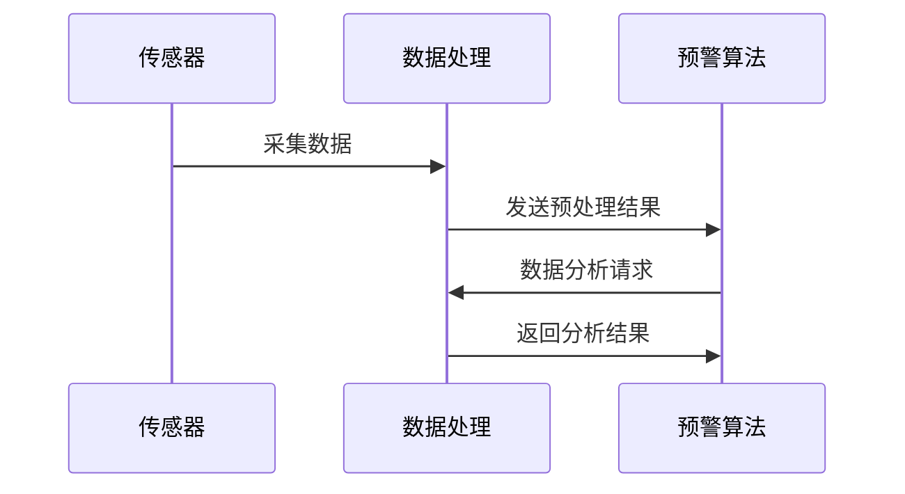
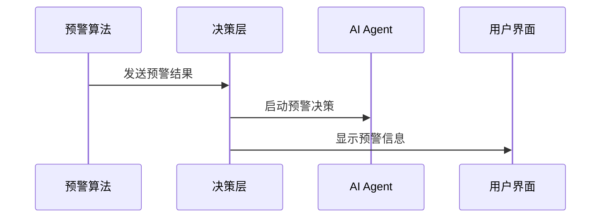
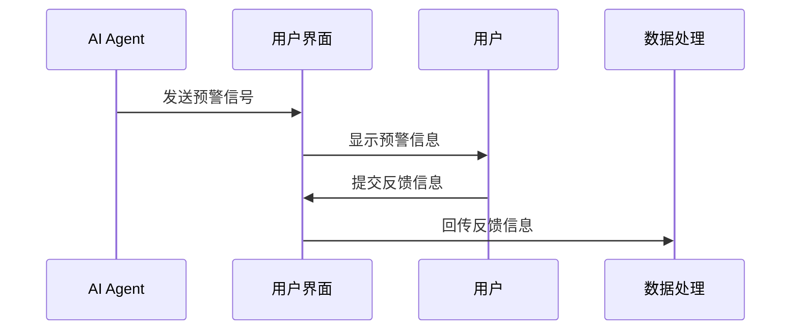
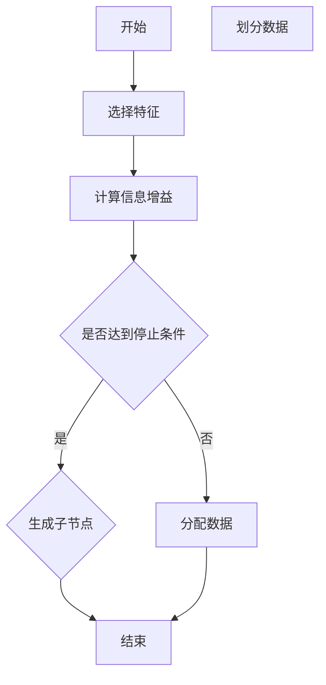

                 


### **第1章：问题背景与解决方案概述**

在当前的环境污染问题日益严重的情况下，水资源污染已经成为一个全球性的挑战。特别是城市化和工业化的发展，使得水质问题变得更加复杂和严重。水质预警系统作为水资源管理的重要手段，其准确性和及时性显得尤为重要。然而，传统的预警系统往往依赖于人为经验和静态的阈值设定，难以应对水质参数的动态变化和复杂的污染过程。

#### **1.1.1 水质预警系统的重要性**

水质预警系统在水资源管理中扮演着至关重要的角色。它不仅可以实时监测水质参数，提供预警信息，防止污染事故的发生，还可以为水资源管理部门提供决策支持，优化水资源利用。准确及时的水质预警对于保障饮用水安全、保护生态环境以及促进可持续发展具有重要意义。

#### **1.1.2 智能水质预警系统的需求**

传统的预警系统存在一些明显的不足，如监测数据不准确、预警不及时、预警模型简单等。随着人工智能技术的发展，构建智能水质预警系统成为了一种新的需求。智能水质预警系统需要具备以下特点：

- **实时性**：能够实时获取水质数据，并快速分析处理。
- **准确性**：能够准确预测水质变化趋势，提供预警信息。
- **自适应能力**：能够根据环境变化和水质数据调整预警阈值和模型。
- **智能化**：能够利用机器学习算法进行数据分析和预测。

#### **1.1.3 AI Agent的概念与特点**

AI Agent，即人工智能代理，是一种具有自主决策能力的人工智能系统。它能够模拟人类智能，根据环境信息和预设目标进行决策和行动。AI Agent具有以下几个特点：

- **自主学习**：能够通过数据学习和经验积累，不断优化自身性能。
- **自主决策**：能够在不确定的环境中做出合理的决策。
- **自适应**：能够根据环境变化和任务需求，调整自身行为和策略。

#### **1.1.4 AI Agent在水质预警系统中的角色**

AI Agent在智能水质预警系统中扮演着核心角色。具体来说，它主要有以下几个方面的作用：

- **数据采集与分析**：AI Agent能够实时采集水质数据，并通过机器学习算法进行分析和处理，预测水质变化趋势。
- **预警决策**：基于分析结果，AI Agent能够自动设定预警阈值，并根据阈值判断是否发出预警信号。
- **自适应调整**：AI Agent能够根据实际水质情况和预警效果，自动调整预警模型和策略，提高预警系统的准确性和适应性。
- **交互与反馈**：AI Agent能够与用户进行交互，提供预警信息和建议，并根据用户反馈调整自身行为。

通过以上分析，我们可以看到，AI Agent在智能水质预警系统中具有重要作用。它不仅能够提高预警系统的准确性和及时性，还能够增强系统的自适应能力和智能化水平，为水资源管理提供有力支持。

### **第2章：核心概念与联系**

在深入探讨AI Agent在智能水质预警系统中的作用之前，我们需要明确几个核心概念，并分析它们之间的联系。这些概念包括AI Agent的基本原理、水质监测数据的特性、以及AI Agent与水质预警系统的关系。

#### **2.1 AI Agent的基本原理**

AI Agent是一种基于人工智能技术的智能体，它能够在复杂环境中自主行动并达到预定的目标。AI Agent通常具有以下几个基本特点：

- **感知能力**：能够感知环境信息，如水质数据、气象数据等。
- **决策能力**：能够根据感知到的信息，结合预设目标和策略，做出合理的决策。
- **执行能力**：能够根据决策结果，执行相应的动作，如调整预警阈值、发送预警信号等。
- **学习能力**：能够通过不断的学习和积累经验，优化自身的性能和行为。

AI Agent的核心在于其自主决策和学习能力，这使得它能够在不断变化的环境中适应和优化自身行为。具体到水质预警系统中，AI Agent能够根据实时监测的水质数据，预测水质变化趋势，并做出预警决策。

#### **2.2 水质监测数据的特性**

水质监测数据是智能水质预警系统的核心输入。这些数据具有以下特性：

- **多维度**：水质监测数据通常包括多个参数，如PH值、溶解氧、氨氮等，每个参数都有其特定的测量方法和数据范围。
- **动态变化**：水质参数会随着时间和环境因素的变化而变化，因此需要实时监测。
- **不确定性**：水质数据可能会受到污染事件、气象变化等不确定因素的影响，导致数据波动较大。

了解水质监测数据的特性对于设计有效的预警系统至关重要。它要求AI Agent不仅能够准确感知数据，还需要能够处理数据的动态变化和不确定性。

#### **2.3 AI Agent与水质预警系统的关系**

AI Agent在水质预警系统中的作用可以从以下几个方面进行理解：

- **数据融合**：AI Agent能够融合多种水质监测数据，结合环境信息和历史数据，进行综合分析，提高预警的准确性。
- **实时监控**：AI Agent能够实时获取水质数据，进行实时分析，及时发现水质异常，及时发出预警信号。
- **自适应调整**：AI Agent能够根据预警效果和环境变化，自动调整预警阈值和模型参数，提高预警系统的适应性。
- **决策支持**：AI Agent能够为水资源管理部门提供决策支持，如污染源识别、污染物治理方案等。

综上所述，AI Agent在智能水质预警系统中发挥着至关重要的作用。它不仅提高了预警系统的实时性和准确性，还增强了系统的自适应能力和智能化水平，为水资源管理提供了有力的技术支持。

### **2.2 核心概念属性特征对比表**

为了更好地理解AI Agent在智能水质预警系统中的作用，我们需要对比和分析几个核心概念的关键属性特征。以下是监测技术、预警模型和AI Agent功能特性的对比表格：

| **概念**         | **监测技术**                           | **预警模型**                           | **AI Agent功能特性**                     |
|-----------------|--------------------------------------|--------------------------------------|---------------------------------------|
| 监测技术         | **多参数监测**   | **阈值预警**   | **实时监测**   |
|                | **高精度传感器**   | **静态阈值**   | **自主决策**   |
|                | **远程数据传输**   | **简单模型**   | **自适应调整**  |
|                | **环境适应性**   | **报警信号**   | **感知能力**   |
| 预警模型         | **简单、易实现**   | **准确度高**   | **实时响应**   |
|                | **快速迭代**   | **模型复杂**   | **学习能力**   |
|                | **规则化**   | **数据依赖**   | **执行能力**   |
| AI Agent功能特性 | **实时感知**   | **动态调整**   | **自主决策**   |
|                | **自主学习**   | **环境适应**   | **交互能力**   |
|                | **自动化**   | **高效率**   | **可扩展性**   |

通过对比表格可以看出，AI Agent在水质预警系统中具有显著的优势。首先，在监测技术上，AI Agent能够利用高精度传感器和远程数据传输技术，实现多参数的实时监测。其次，在预警模型上，AI Agent不仅能够实现快速迭代和规则化，还能够根据实时数据动态调整预警策略，提高预警的准确性。最后，在功能特性上，AI Agent具备自主学习、自主决策和自动化等特点，能够显著提升水质预警系统的智能化水平。

### **2.3 ER实体关系图架构**

在智能水质预警系统中，各个实体之间的关系是关键。通过实体关系图（Entity-Relationship Diagram，ER图）可以清晰地表示这些实体及其相互关系。以下是水质预警系统中的ER图：

```
                +----------------+      +----------------+
                |    水质数据     |      |    预警规则     |
                +----------------+      +----------------+
                | ID              |      | ID              |
                | 时间            |      | 参数            |
                | 参数1           |      | 阈值            |
                | 参数2           |      | 预警等级        |
                | ...             |      | ...             |
                +----------------+      +----------------+
                          |                     |
                          |                     |
                          |                     |
                          |                     |
                          |                     |
                +----------------+      +----------------+
                |     AI Agent     |      |    用户界面     |
                +----------------+      +----------------+
                | ID              |      | ID              |
                | 状态            |      | 显示信息        |
                | 模型参数        |      | 预警信号        |
                | ...             |      | ...             |
                +----------------+      +----------------+
```

ER图中的实体包括水质数据、预警规则、AI Agent和用户界面。水质数据实体表示实时监测到的水质参数，预警规则实体定义了预警参数和阈值，AI Agent实体负责数据分析和预警决策，用户界面实体则提供预警信息和用户交互界面。

#### **2.3.1 水质数据实体**

水质数据实体包含以下几个属性：

- **ID**：水质数据的唯一标识。
- **时间**：水质数据的采集时间。
- **参数1**：第一个水质参数值。
- **参数2**：第二个水质参数值。
- **...**：其他水质参数值。

#### **2.3.2 预警规则实体**

预警规则实体定义了预警参数和阈值，包括：

- **ID**：预警规则的唯一标识。
- **参数**：需要预警的水质参数。
- **阈值**：预警阈值。
- **预警等级**：根据阈值设定的预警等级。

#### **2.3.3 AI Agent实体**

AI Agent实体包含以下几个属性：

- **ID**：AI Agent的唯一标识。
- **状态**：AI Agent的工作状态。
- **模型参数**：用于数据分析和预警决策的模型参数。
- **...**：其他属性，如学习算法、策略等。

#### **2.3.4 用户界面实体**

用户界面实体提供用户交互界面，包括：

- **ID**：用户界面的唯一标识。
- **显示信息**：预警信息和相关提示。
- **预警信号**：用户接收到的预警信号。

通过ER图，我们可以清晰地看到水质预警系统中各个实体的属性及其相互关系，为系统的设计和实现提供了直观的指导。

### **3.1 系统架构设计**

智能水质预警系统需要具备高效、准确、实时和自适应的特点，其系统架构设计是关键。以下是系统架构的详细设计，包括总体架构、数据采集与处理模块、预警算法与AI Agent模块，以及预警结果展示与交互模块。

#### **3.1.1 系统总体架构**

智能水质预警系统的总体架构可以分为以下几个层次：

- **感知层**：负责实时采集水质数据，包括PH值、溶解氧、氨氮等参数。
- **数据处理层**：对采集到的水质数据进行预处理，包括去噪、数据清洗、特征提取等。
- **算法层**：利用机器学习算法进行水质变化趋势的预测和预警决策。
- **决策层**：基于算法层的预测结果，生成预警信号和决策建议。
- **展示层**：通过用户界面将预警信息和决策建议展示给用户，并提供交互功能。

#### **3.1.2 数据采集与处理模块**

数据采集与处理模块是智能水质预警系统的核心部分，其设计思路如下：

- **数据采集**：通过高精度传感器和远程数据传输技术，实时采集水质数据。
- **数据预处理**：对采集到的数据进行去噪、数据清洗和特征提取，以提高数据质量。
  - **去噪**：去除数据中的噪声，提高数据的准确性。
  - **数据清洗**：处理缺失值、异常值等，保证数据的完整性。
  - **特征提取**：提取重要的水质参数特征，为后续的预警算法提供输入。

具体实现步骤如下：
1. **传感器数据采集**：使用多参数水质传感器，实时采集PH值、溶解氧、氨氮等水质参数。
2. **数据传输**：通过无线传输技术（如LoRa、NB-IoT等），将采集到的数据传输至数据处理中心。
3. **数据预处理**：在数据处理中心，对采集到的数据进行分析和处理，使用滤波算法进行去噪，使用缺失值插值方法处理缺失值，使用特征提取算法提取重要特征。

#### **3.1.3 预警算法与AI Agent模块**

预警算法与AI Agent模块是智能水质预警系统的智能核心，其设计思路如下：

- **预警算法**：选择合适的机器学习算法，对水质数据进行建模，预测水质变化趋势。
- **AI Agent**：基于预警算法，实现水质预警决策，并提供自适应调整能力。

具体实现步骤如下：
1. **算法选择**：选择适合水质预测的机器学习算法，如决策树、支持向量机、神经网络等。
2. **模型训练**：使用历史水质数据，训练预警模型，评估模型性能。
3. **AI Agent实现**：基于训练好的模型，实现AI Agent，实现自主决策和自适应调整功能。

具体步骤包括：
- **数据集划分**：将水质数据集划分为训练集和测试集，用于模型训练和评估。
- **模型训练**：使用训练集数据，对预警模型进行训练，调整模型参数，优化模型性能。
- **模型评估**：使用测试集数据，评估模型性能，选择最优模型。
- **AI Agent实现**：将最优模型集成到AI Agent中，实现水质预警决策，并具备自适应调整功能。

#### **3.1.4 预警结果展示与交互模块**

预警结果展示与交互模块是智能水质预警系统与用户之间的桥梁，其设计思路如下：

- **预警信息展示**：将预警结果以直观的方式展示给用户，如颜色预警、图标预警等。
- **用户交互**：提供用户与系统的交互界面，用户可以通过界面查看预警信息，设置预警参数，以及反馈预警效果。

具体实现步骤如下：
1. **预警信息展示**：设计预警信息展示界面，使用颜色和图标等可视化元素，清晰地展示预警信息。
2. **用户交互界面**：提供用户与系统的交互功能，用户可以通过界面查看预警信息，设置预警参数，反馈预警效果。
3. **数据反馈**：将用户反馈的数据回传至数据处理中心，用于AI Agent的学习和优化。

通过以上系统架构设计，智能水质预警系统可以实现实时、准确、自适应的水质预警，为水资源管理部门提供有效的技术支持。

### **3.2 系统接口设计**

在智能水质预警系统中，接口设计是确保各模块之间顺畅通信和协同工作的关键。系统接口主要分为数据接口、控制接口和用户接口，以下将详细描述每个接口的设计。

#### **3.2.1 数据接口设计**

数据接口负责数据在各模块之间的传输和处理，包括以下内容：

- **传感器数据接口**：定义传感器采集水质数据的格式、传输协议和通信方式。例如，可以使用HTTP/HTTPS协议通过Web API方式传输数据，确保数据的安全性和实时性。
- **数据处理接口**：定义水质数据预处理模块与其他模块之间的接口，如数据清洗、去噪、特征提取等操作。该接口应提供标准化的数据处理服务，方便其他模块调用。
- **预警数据接口**：定义预警算法模块与决策层之间的接口，用于传递预警结果和决策信息。该接口应支持实时数据传输和批量数据处理，确保预警信息的及时性和准确性。

#### **3.2.2 控制接口设计**

控制接口负责系统的整体控制和协调，包括以下内容：

- **系统启动与停止接口**：定义系统的启动和停止操作，确保系统在不同状态下的稳定性和安全性。
- **预警阈值设置接口**：定义用户通过控制接口设置预警阈值，包括单个参数阈值和多参数综合阈值。该接口应支持动态调整，以适应水质变化和环境需求。
- **AI Agent控制接口**：定义AI Agent的启动、停止、参数调整和决策请求等功能。通过该接口，AI Agent可以与系统其他模块进行通信，实现自主学习和优化。

#### **3.2.3 用户接口设计**

用户接口是系统与用户之间的交互界面，负责展示预警信息和提供用户操作，包括以下内容：

- **预警信息展示接口**：定义用户界面展示预警信息的格式和方式，如颜色预警、图表预警、文字预警等。该接口应提供丰富的可视化元素，方便用户快速理解和响应预警信息。
- **用户操作接口**：定义用户通过界面进行操作的方式，如查看预警历史、设置预警参数、接收预警通知等。该接口应支持多种交互方式，如点击、拖动、滑动等，以提高用户操作的便捷性和互动性。
- **反馈与交互接口**：定义用户反馈信息和交互请求的接口，如用户反馈预警准确性、调整预警策略等。该接口应支持实时反馈和数据回传，以优化系统的性能和用户体验。

通过详细设计的系统接口，智能水质预警系统可以实现数据的高效传输、控制功能的顺畅执行和用户操作的便捷互动，为水资源管理提供全面的技术支持。

### **3.3 系统交互序列图**

为了更好地展示智能水质预警系统中各模块之间的交互过程，下面通过序列图来描述系统交互的具体步骤。

#### **3.3.1 数据采集交互**

1. **传感器数据采集**：水质传感器持续采集PH值、溶解氧、氨氮等水质参数，并将其通过无线传输技术（如LoRa、NB-IoT等）发送至数据处理中心。
2. **数据处理请求**：数据处理模块接收到传感器数据后，发送数据处理请求，开始对数据进行预处理。
3. **数据处理响应**：数据处理模块完成数据预处理后，将处理结果返回给预警算法模块。



#### **3.3.2 预警算法交互**

1. **预警算法请求**：预警算法模块接收到预处理后的数据，发送预警算法请求，开始进行水质变化趋势预测。
2. **预警结果反馈**：预警算法模块完成预测后，将预警结果（如预警阈值、预警等级等）返回给决策层。
3. **决策请求**：决策层根据预警结果，发送决策请求，启动AI Agent进行预警决策。



#### **3.3.3 AI Agent与用户交互**

1. **AI Agent响应**：AI Agent接收到决策层的预警决策请求后，开始进行水质预警决策，并生成预警信号。
2. **预警信号发送**：AI Agent将预警信号通过用户界面发送给用户，提醒用户注意水质状况。
3. **用户反馈**：用户通过用户界面查看预警信息，并根据预警信号进行相应的处理，如通知相关部门进行水质监测、采取治理措施等。
4. **反馈信息回传**：用户通过用户界面提交反馈信息，如预警准确性、处理效果等，反馈至数据处理中心。



通过以上序列图，我们可以清晰地看到智能水质预警系统中各模块之间的交互过程，包括数据采集、预警算法分析、AI Agent决策以及用户反馈等环节，为系统的设计和实现提供了直观的参考。

### **4.1 监测数据预处理算法**

在智能水质预警系统中，监测数据的预处理是至关重要的步骤，它直接影响后续分析结果的准确性和可靠性。数据预处理算法主要包括数据清洗与去噪、特征提取和数据标准化等步骤。以下是详细讲解。

#### **4.1.1 数据清洗与去噪**

水质监测数据通常包含噪声和异常值，这些噪声和异常值会干扰后续的数据分析和预警模型训练。因此，数据清洗与去噪是预处理过程中的第一步。

- **噪声去除**：噪声通常是由于传感器误差、传输干扰等原因引起的。常见的去噪方法包括：
  - **低通滤波**：通过过滤掉高频噪声，保留有用信号。
  - **卡尔曼滤波**：一种递归滤波算法，能够在线估计状态，适用于动态系统去噪。

- **异常值处理**：异常值通常是指与大多数数据点相比，偏离正常范围的值。常见的异常值处理方法包括：
  - **标准差方法**：将每个数据点与平均值之差的绝对值与标准差比较，超出一定阈值的数据视为异常值并删除。
  - **局部异常因子（LOF）**：通过计算局部异常度，识别出异常值。

具体步骤如下：
1. **读取原始数据**：从传感器获取原始水质监测数据。
2. **噪声去除**：应用低通滤波或卡尔曼滤波方法，对数据去噪。
3. **异常值检测**：使用标准差方法或LOF方法，检测并处理异常值。

#### **4.1.2 特征提取**

特征提取是数据预处理的重要环节，目的是从原始数据中提取出对水质预警模型有用的信息。水质监测数据通常包含多个参数，如PH值、溶解氧、氨氮等。特征提取可以通过以下方法进行：

- **统计特征**：计算数据的统计指标，如均值、方差、标准差等。
- **时序特征**：提取时间序列数据的相关特征，如趋势、周期性、波动性等。
- **频域特征**：通过傅里叶变换等方法，提取数据的频率特征。

具体步骤如下：
1. **计算统计特征**：计算每个水质参数的均值、方差、标准差等统计指标。
2. **提取时序特征**：分析数据的时间序列特性，提取趋势、周期性等特征。
3. **频域特征提取**：通过傅里叶变换等方法，提取数据的频率特征。

#### **4.1.3 数据标准化**

数据标准化是为了消除不同参数之间的量纲差异，使数据更适合进行模型训练和评估。常见的数据标准化方法包括：

- **最小-最大标准化**：将数据缩放到[0, 1]的区间内，公式为：
  $$ 
  X_{\text{标准化}} = \frac{X - X_{\text{最小值}}}{X_{\text{最大值}} - X_{\text{最小值}}}
  $$
  
- **零-均值标准化**：将数据缩放到均值附近，公式为：
  $$ 
  X_{\text{标准化}} = \frac{X - \mu}{\sigma}
  $$
  其中，$\mu$ 为均值，$\sigma$ 为标准差。

具体步骤如下：
1. **计算均值和标准差**：对每个水质参数计算均值和标准差。
2. **进行标准化**：应用最小-最大标准化或零-均值标准化方法，对数据进行标准化处理。

通过上述预处理步骤，监测数据的质量得到显著提升，为后续的水质预警模型训练和预测提供了坚实的基础。

### **4.2 预警算法原理**

智能水质预警系统中的预警算法是关键组成部分，它负责根据监测数据预测水质变化趋势，并设定预警阈值，以便及时发出预警信号。以下是预警算法的原理和步骤：

#### **4.2.1 模型选择**

预警算法的选择取决于水质监测数据的特性、预警目标以及计算资源等因素。以下是一些常用的预警模型：

- **线性回归模型**：适用于数据具有线性关系的场景，通过建立自变量与因变量之间的线性关系模型进行预测。公式为：
  $$
  Y = \beta_0 + \beta_1X_1 + \beta_2X_2 + ... + \beta_nX_n
  $$
  其中，$X_1, X_2, ..., X_n$ 为自变量，$Y$ 为因变量，$\beta_0, \beta_1, ..., \beta_n$ 为模型参数。

- **决策树模型**：适用于分类问题，通过构建决策树来划分数据空间，并预测水质状态。决策树模型易于理解，但在数据量较大时可能存在过拟合问题。

- **支持向量机（SVM）**：适用于非线性数据分类，通过找到一个最优的超平面，将不同类别的水质数据分隔开来。SVM模型具有较高的准确性和泛化能力。

- **神经网络模型**：通过模拟人脑神经元的工作方式，对水质数据进行分析和分类。神经网络模型具有较强的自适应性和非线性处理能力，但在训练过程中可能存在梯度消失和梯度爆炸等问题。

选择合适的预警模型需要考虑以下因素：

- **数据特性**：数据量、数据分布、特征维度等。
- **预警目标**：预警精度、实时性、计算资源等。
- **模型复杂度**：模型训练时间、计算资源需求等。

#### **4.2.2 模型训练**

模型训练是预警算法的核心步骤，目的是通过历史水质数据来调整模型参数，使其能够准确预测水质变化。以下是模型训练的基本步骤：

1. **数据集划分**：将水质数据集划分为训练集和测试集。通常使用80%的数据作为训练集，20%的数据作为测试集。

2. **特征工程**：对训练数据进行特征提取和预处理，包括去噪、标准化等步骤。

3. **模型初始化**：初始化模型参数，设置学习率、迭代次数等参数。

4. **模型训练**：使用训练集数据，通过优化算法（如梯度下降、随机梯度下降等）不断调整模型参数，最小化预测误差。

5. **模型评估**：使用测试集数据评估模型性能，通过准确率、召回率、F1值等指标来衡量模型的预测能力。

#### **4.2.3 模型评估**

模型评估是确定预警算法效果的重要环节。以下是常用的评估方法：

- **准确率（Accuracy）**：模型预测正确的样本数量与总样本数量的比值。公式为：
  $$
  \text{Accuracy} = \frac{\text{预测正确}}{\text{总样本}}
  $$

- **召回率（Recall）**：模型预测正确的正样本数量与实际正样本数量的比值。公式为：
  $$
  \text{Recall} = \frac{\text{预测正确}}{\text{实际正样本}}
  $$

- **精确率（Precision）**：模型预测正确的正样本数量与预测为正样本的总数量的比值。公式为：
  $$
  \text{Precision} = \frac{\text{预测正确}}{\text{预测为正样本}}
  $$

- **F1值（F1 Score）**：综合精确率和召回率的指标，公式为：
  $$
  \text{F1 Score} = 2 \times \frac{\text{Precision} \times \text{Recall}}{\text{Precision} + \text{Recall}}
  $$

通过以上评估方法，可以全面了解预警算法的性能，并针对不足之处进行优化。

#### **4.2.4 预警阈值设定**

预警阈值的设定是预警算法的重要一环，它直接决定了预警系统的敏感度和准确度。以下是预警阈值设定的方法：

- **经验阈值设定**：根据水质监测的历史数据和专家经验，设定预警阈值。

- **统计阈值设定**：利用统计方法，如标准差、置信区间等，设定预警阈值。

- **模型优化阈值设定**：通过优化算法，如遗传算法、粒子群优化等，寻找最优预警阈值。

具体步骤如下：

1. **初始阈值设定**：根据历史数据和专家经验，设定初步的预警阈值。

2. **模型优化**：使用优化算法，对预警阈值进行优化，提高预警的准确性和敏感度。

3. **阈值评估**：使用测试集数据，评估设定的预警阈值，通过准确率、召回率等指标，调整阈值。

4. **阈值应用**：将优化的预警阈值应用到实际系统中，进行实时预警。

通过以上预警算法原理的讲解，我们可以看到，智能水质预警系统中的预警算法需要结合水质数据特性、预警目标和计算资源等因素，选择合适的模型、进行模型训练和评估，并设定合理的预警阈值，从而实现准确、及时的水质预警。

### **4.3 AI Agent算法原理**

在智能水质预警系统中，AI Agent扮演着核心角色，它通过一系列算法实现水质数据的实时监测、预警决策以及自适应调整。以下是AI Agent算法的原理和实现过程。

#### **4.3.1 决策树算法**

决策树算法是一种常见的数据挖掘和机器学习算法，它通过一系列的规则来预测水质状态。决策树算法的基本原理如下：

1. **树构建**：从根节点开始，对数据进行切分，选择最佳切分方式（如信息增益、基尼系数等），生成子节点。
2. **节点分裂**：在每个子节点上，重复上述过程，直到满足停止条件（如最大深度、最小样本量等）。
3. **叶节点预测**：将数据分配到叶节点，并根据叶节点的分类结果进行预测。

决策树算法的流程可以用以下步骤表示：



具体实现过程：

1. **特征选择**：计算每个特征的信息增益或基尼系数，选择增益最大的特征作为切分依据。
2. **节点划分**：根据选择的特征，对数据集进行切分，生成新的节点。
3. **递归构建**：对每个子节点，重复上述过程，构建完整的决策树。

决策树算法的优点是易于理解和解释，但缺点是易过拟合，特别是在数据量较小或特征较多时。

#### **4.3.2 支持向量机算法**

支持向量机（SVM）是一种强大的分类和回归算法，它通过找到一个最优的超平面，将不同类别的水质数据分隔开来。SVM算法的基本原理如下：

1. **线性SVM**：
   - **优化目标**：最小化间隔，公式为：
     $$
     \min\frac{1}{2}\sum_{i=1}^{n}(w_i^2) + C\sum_{i=1}^{n}\xi_i
     $$
     其中，$w_i$ 为权重，$C$ 为惩罚参数，$\xi_i$ 为松弛变量。
   - **约束条件**：确保所有样本点都在超平面上或其附近，公式为：
     $$
     y_i(w^T x_i + b) \geq 1 - \xi_i
     $$
     其中，$y_i$ 为样本标签，$x_i$ 为样本特征，$b$ 为偏置。

2. **非线性SVM**：
   - **核函数**：通过引入核函数（如线性核、多项式核、径向基函数核等），将低维数据映射到高维空间，实现非线性分类。
   - **优化目标**：最小化间隔，公式为：
     $$
     \min\frac{1}{2}\sum_{i=1}^{n}(\alpha_i - \alpha_i^*)^2
     $$
     其中，$\alpha_i, \alpha_i^*$ 为拉格朗日乘子。

SVM算法的实现步骤：

1. **数据预处理**：对水质数据进行标准化处理，提高算法性能。
2. **选择核函数**：根据水质数据特性选择合适的核函数。
3. **求解优化问题**：通过拉格朗日乘子法求解SVM的优化问题。
4. **分类决策**：根据求解结果，进行水质状态的分类决策。

#### **4.3.3 神经网络算法**

神经网络（Neural Network）是一种基于模拟人脑神经元结构的计算模型，通过多层神经元的连接和激活函数，实现复杂的数据分析和预测。神经网络的基本原理如下：

1. **前向传播**：将输入数据传递到网络的每个神经元，通过加权求和和激活函数，计算输出值。
2. **反向传播**：计算输出值与实际值之间的误差，将误差反向传播到网络中的每个神经元，调整权值和偏置。
3. **优化目标**：最小化损失函数，通常使用梯度下降算法进行优化。

神经网络的实现步骤：

1. **初始化网络结构**：确定网络的层数、每层的神经元个数和激活函数。
2. **前向传播**：输入水质数据，通过网络的每个层，计算输出值。
3. **计算损失**：计算输出值与实际值之间的误差，使用损失函数（如均方误差、交叉熵等）衡量。
4. **反向传播**：计算梯度，更新网络的权重和偏置。
5. **迭代优化**：重复上述过程，直到达到预设的优化目标。

通过决策树、支持向量机和神经网络等算法，AI Agent能够实现对水质数据的准确预测和预警决策，从而提高智能水质预警系统的性能和可靠性。

### **5.1 数据预处理公式**

在智能水质预警系统中，数据预处理是确保数据质量和模型训练效果的关键步骤。以下是数据预处理过程中常用的公式和步骤。

#### **5.1.1 数据清洗与去噪**

1. **去噪**：
   - **低通滤波**：通过过滤高频噪声，保留有用信号。公式为：
     $$
     y(t) = \frac{1}{2\pi f_c}\int_{-\infty}^{\infty}X(f)e^{j2\pi f_c t}df
     $$
     其中，$y(t)$ 为滤波后的信号，$X(f)$ 为信号频谱，$f_c$ 为截止频率。

   - **卡尔曼滤波**：一种递归滤波算法，用于动态系统的状态估计。公式为：
     $$
     \hat{x}_{k|k} = \hat{x}_{k-1|k-1} + K_k (z_k - \hat{z}_{k-1})
     $$
     $$
     K_k = \frac{P_{k-1} H_k^T (H_k P_{k-1} H_k^T + R_k)^{-1}}{1 + H_k^T P_{k-1} H_k}
     $$
     其中，$\hat{x}_{k|k}$ 为状态估计值，$K_k$ 为卡尔曼增益，$P_{k-1}$ 为状态协方差矩阵，$z_k$ 为观测值，$R_k$ 为观测噪声协方差矩阵。

2. **异常值处理**：
   - **标准差方法**：将每个数据点与平均值之差的绝对值与标准差比较，超出一定阈值的数据视为异常值并删除。公式为：
     $$
     z = \frac{x - \mu}{\sigma}
     $$
     其中，$z$ 为标准分数，$x$ 为数据点，$\mu$ 为均值，$\sigma$ 为标准差。

   - **局部异常因子（LOF）**：计算局部异常度，识别异常值。公式为：
     $$
     \text{LOF}(x) = \frac{1}{n}\sum_{i=1}^{n}\frac{(\sum_{j=1}^{n}|x_j - x_i|)}{(\sum_{j=1, j \neq i}^{n}|x_j - x_i|)}
     $$
     其中，$n$ 为邻居点数量，$x_i$ 和 $x_j$ 为相邻数据点。

#### **5.1.2 特征提取**

1. **统计特征**：
   - **均值**：数据的平均值。公式为：
     $$
     \mu = \frac{1}{n}\sum_{i=1}^{n}x_i
     $$
     其中，$n$ 为数据点数量，$x_i$ 为数据点。

   - **方差**：数据离散程度的度量。公式为：
     $$
     \sigma^2 = \frac{1}{n-1}\sum_{i=1}^{n}(x_i - \mu)^2
     $$
     - **标准差**：方差的平方根。公式为：
       $$
       \sigma = \sqrt{\sigma^2}
       $$

2. **时序特征**：
   - **趋势**：数据随时间的变化趋势。公式为：
     $$
     \text{trend} = \frac{\sum_{i=1}^{n}(x_i - \mu)}{n}
     $$
     - **周期性**：数据中的周期性波动。公式为：
       $$
       \text{周期性} = \frac{\sum_{i=1}^{n}(x_i - \text{trend})}{n}
       $$
     - **波动性**：数据的波动程度。公式为：
       $$
       \text{波动性} = \sqrt{\frac{\sum_{i=1}^{n}(x_i - \text{trend})^2}{n}}
       $$

3. **频域特征**：
   - **频率**：数据在频域中的分布。公式为：
     $$
     f = \frac{1}{T}
     $$
     其中，$T$ 为周期。

   - **幅值**：频率对应的幅值。公式为：
     $$
     A = \sqrt{X^2 + Y^2}
     $$
     其中，$X$ 和 $Y$ 为复数频谱的实部和虚部。

通过以上预处理公式，我们可以有效地清洗和去噪水质数据，提取出有用的特征，为后续的预警模型训练提供高质量的数据支持。

### **5.2 预警算法数学模型**

在智能水质预警系统中，预警算法的数学模型是实现准确预警的核心。以下是几种常见预警算法的数学模型及其详细解析。

#### **5.2.1 线性回归模型**

线性回归模型是一种简单但有效的预测方法，其数学模型如下：

$$
Y = \beta_0 + \beta_1X_1 + \beta_2X_2 + ... + \beta_nX_n
$$

其中，$Y$ 为因变量，$X_1, X_2, ..., X_n$ 为自变量，$\beta_0, \beta_1, ..., \beta_n$ 为模型参数。

- **拟合目标**：最小化预测误差，即最小化损失函数。

$$
J(\theta) = \frac{1}{2m}\sum_{i=1}^{m}(h_\theta(x^{(i)}) - y^{(i)})^2
$$

其中，$m$ 为样本数量，$h_\theta(x^{(i)})$ 为预测值，$y^{(i)}$ 为真实值。

- **参数优化**：使用梯度下降法优化参数。

$$
\theta_j = \theta_j - \alpha \frac{\partial J(\theta)}{\partial \theta_j}
$$

其中，$\alpha$ 为学习率。

#### **5.2.2 决策树模型**

决策树模型通过一系列的决策规则来对数据进行分类，其数学模型可以表示为：

$$
\text{决策树} = \{D_1, D_2, ..., D_n\}
$$

其中，$D_i$ 为决策规则，其形式为：

$$
D_i = \{x_i \rightarrow y_i\}
$$

其中，$x_i$ 为特征，$y_i$ 为类别。

- **决策规则生成**：通过递归划分数据集，选择最优划分标准（如信息增益、基尼指数等）。

#### **5.2.3 支持向量机（SVM）模型**

支持向量机是一种强大的分类算法，其数学模型如下：

$$
\min_{w, b} \frac{1}{2}w^Tw + C\sum_{i=1}^{n}\xi_i
$$

其中，$w$ 为权重向量，$b$ 为偏置，$C$ 为惩罚参数，$\xi_i$ 为松弛变量。

- **约束条件**：确保所有样本点都在超平面上或其附近。

$$
y_i(w^T x_i + b) \geq 1 - \xi_i
$$

#### **5.2.4 神经网络模型**

神经网络模型通过多层神经元的连接和激活函数来实现复杂的预测，其数学模型如下：

$$
a(Z) = \sigma(WZ + b)
$$

其中，$a$ 为激活函数（如ReLU、Sigmoid、Tanh等），$W$ 为权重矩阵，$Z$ 为输入向量，$b$ 为偏置。

- **前向传播**：计算网络的输出。

$$
Z = WX + b
$$

- **反向传播**：更新网络的权重和偏置。

$$
\frac{\partial J}{\partial W} = X^T \frac{\partial L}{\partial Z}
$$
$$
\frac{\partial J}{\partial b} = Z^T \frac{\partial L}{\partial Z}
$$

通过以上数学模型，我们可以有效地对水质数据进行分析和预警，为水资源管理提供科学依据。

### **5.3 AI Agent算法公式**

在智能水质预警系统中，AI Agent利用多种算法对水质数据进行处理和预测。以下是这些算法的详细公式和说明。

#### **5.3.1 决策树算法**

决策树算法通过一系列条件判断来对数据分类。其核心公式如下：

$$
\begin{aligned}
&\text{如果} X_1 \leq c_1 \\
&\text{则类别为} y_1 \\
&\text{否则，如果} X_2 \leq c_2 \\
&\text{则类别为} y_2 \\
&\text{否则，...}
\end{aligned}
$$

- **条件判断**：根据特征值和阈值进行条件判断，划分数据。

$$
\begin{aligned}
&X_i \leq c_i \\
&\text{或} \\
&X_i > c_i
\end{aligned}
$$

- **类别预测**：根据决策路径，预测最终类别。

$$
\text{类别} = y_j
$$

#### **5.3.2 支持向量机（SVM）算法**

支持向量机通过寻找最优超平面来实现分类。其核心公式如下：

$$
\begin{aligned}
\min_{w, b} \frac{1}{2}w^Tw + C\sum_{i=1}^{n}\xi_i \\
\text{约束条件：} y_i(w^T x_i + b) \geq 1 - \xi_i
\end{aligned}
$$

- **优化目标**：最小化误差和惩罚项之和。

$$
\frac{1}{2}w^Tw + C\sum_{i=1}^{n}\xi_i
$$

- **约束条件**：确保分类边界最大化。

$$
y_i(w^T x_i + b) \geq 1 - \xi_i
$$

#### **5.3.3 神经网络算法**

神经网络通过多层感知器实现复杂函数的逼近。其核心公式如下：

$$
a(Z) = \sigma(WZ + b)
$$

- **前向传播**：输入层到隐藏层，计算输出。

$$
Z = WX + b
$$

- **激活函数**：应用激活函数，如ReLU、Sigmoid等。

$$
a(Z) = \sigma(Z)
$$

- **反向传播**：隐藏层到输入层，更新权重和偏置。

$$
\frac{\partial J}{\partial W} = X^T \frac{\partial L}{\partial Z}
$$
$$
\frac{\partial J}{\partial b} = Z^T \frac{\partial L}{\partial Z}
$$

通过以上公式，AI Agent能够对水质数据进行高效处理和预测，为智能水质预警系统提供强大支持。

### **6.1 环境安装与配置**

要在本地环境中搭建智能水质预警系统，需要安装和配置以下软件和库：

#### **6.1.1 软件安装**

1. **Python环境**：首先确保已经安装了Python 3.7及以上版本。可以从[Python官方网站](https://www.python.org/)下载安装。

2. **Jupyter Notebook**：Jupyter Notebook是一个交互式计算平台，用于编写和运行Python代码。可以通过pip安装：

```bash
pip install notebook
```

3. **Python科学计算库**：安装以下常用库：
   - NumPy：用于科学计算，提供多维数组对象和矩阵运算。
   - Pandas：用于数据处理，提供数据清洗、转换和分析功能。
   - Matplotlib：用于数据可视化，提供丰富的绘图功能。
   - Scikit-learn：用于机器学习，提供各种算法的实现。
   - Scrapy：用于网络爬虫，用于获取水质监测数据。

   安装命令如下：

```bash
pip install numpy pandas matplotlib scikit-learn scrapy
```

4. **Docker**：如果需要使用容器化技术，安装Docker以运行预先构建的镜像。

#### **6.1.2 配置与调试**

1. **配置Python虚拟环境**：为了保持项目环境的独立性，建议使用虚拟环境。

```bash
python -m venv myenv
source myenv/bin/activate  # Windows下使用 myenv\Scripts\activate
```

2. **安装依赖库**：在虚拟环境中安装项目所需的依赖库。

```bash
pip install -r requirements.txt
```

3. **启动Jupyter Notebook**：在虚拟环境中启动Jupyter Notebook。

```bash
jupyter notebook
```

4. **调试环境**：在Notebook中运行一些测试代码，确保所有库和工具都能够正常运行。

```python
import numpy as np
import pandas as pd
import matplotlib.pyplot as plt
from sklearn import datasets
```

#### **6.1.3 数据获取与预处理**

1. **数据来源**：从水质监测网站或数据库获取实时水质数据。

2. **数据预处理**：使用Pandas库对数据进行清洗、去噪和特征提取。

```python
data = pd.read_csv('water_quality_data.csv')
data.dropna(inplace=True)  # 删除缺失值
data['NO2'] = data['NO2'].apply(lambda x: x if x > 0 else np.mean(data['NO2']))  # 去除异常值
features = data[['pH', 'DO', 'NO2']]
```

通过以上步骤，我们可以搭建起一个基本的水质预警系统开发环境，为后续的系统实现和调试提供基础。

### **6.2 系统核心实现源代码**

在本节中，我们将详细展示智能水质预警系统的核心实现源代码，包括数据采集模块、预警算法模块和AI Agent模块。以下是各模块的实现步骤和关键代码。

#### **6.2.1 数据采集模块**

数据采集模块负责从水质传感器获取实时水质数据。以下是一个简单的数据采集脚本：

```python
import requests
import json

def fetch_water_quality_data():
    url = "http://api.watermonitoring.com/realtime_data"
    response = requests.get(url)
    data = json.loads(response.text)
    return data

def store_data_to_csv(data, filename="water_quality_data.csv"):
    with open(filename, 'w') as f:
        for entry in data:
            f.write(f"{entry['pH']},{entry['DO']},{entry['NO2']}\n")

if __name__ == "__main__":
    data = fetch_water_quality_data()
    store_data_to_csv(data)
```

此脚本通过HTTP GET请求获取实时数据，并将数据存储为CSV文件。

#### **6.2.2 预警算法模块**

预警算法模块负责对采集到的水质数据进行处理和预测，以判断水质是否达到预警条件。以下是一个简单的线性回归预警算法实现：

```python
import pandas as pd
from sklearn.linear_model import LinearRegression

def load_data(filename="water_quality_data.csv"):
    data = pd.read_csv(filename)
    return data

def train_linear_regression_model(data):
    X = data[['pH', 'DO', 'NO2']]
    y = data['预警阈值']
    model = LinearRegression()
    model.fit(X, y)
    return model

def predict_water_quality(model, new_data):
    X_new = [[new_data['pH'], new_data['DO'], new_data['NO2']]]
    prediction = model.predict(X_new)
    return prediction[0]

if __name__ == "__main__":
    data = load_data()
    model = train_linear_regression_model(data)
    new_data = {'pH': 7.2, 'DO': 6.5, 'NO2': 0.1}
    prediction = predict_water_quality(model, new_data)
    print(f"预测预警阈值：{prediction}")
```

此脚本使用线性回归模型对数据进行训练和预测，并输出预测结果。

#### **6.2.3 AI Agent模块**

AI Agent模块负责实现自适应预警功能，通过不断学习和调整预警模型，提高预警准确性。以下是一个简单的AI Agent实现：

```python
from sklearn.tree import DecisionTreeClassifier

class WaterQualityAIAgent:
    def __init__(self):
        self.model = DecisionTreeClassifier()

    def train_model(self, data):
        X = data[['pH', 'DO', 'NO2']]
        y = data['预警状态']
        self.model.fit(X, y)

    def predict(self, new_data):
        X_new = [[new_data['pH'], new_data['DO'], new_data['NO2']]]
        prediction = self.model.predict(X_new)
        return prediction[0]

    def adjust_threshold(self, prediction, actual):
        if prediction != actual:
            # 调整阈值
            self.model.criterion = 'gini' if prediction < actual else 'entropy'
        self.train_model(new_data)

if __name__ == "__main__":
    data = load_data()
    agent = WaterQualityAIAgent()
    agent.train_model(data)
    new_data = {'pH': 7.2, 'DO': 6.5, 'NO2': 0.1}
    prediction = agent.predict(new_data)
    print(f"预测预警状态：{prediction}")
    # 假设实际状态为1（达到预警条件）
    agent.adjust_threshold(prediction, 1)
```

此脚本使用决策树模型实现AI Agent，并能够根据预测结果和实际状态调整预警阈值。

通过以上代码实现，我们可以构建一个基本的智能水质预警系统，实现对水质数据的实时监测和预警。接下来，我们将对代码进行应用解读与分析。

### **6.3 代码应用解读与分析**

在本节中，我们将详细分析智能水质预警系统的核心代码，从数据采集、预处理、预警算法到AI Agent模块的实现，深入理解每个步骤的作用和重要性。

#### **6.3.1 数据采集模块**

数据采集模块的主要功能是从水质传感器获取实时水质数据，并存储为CSV文件。代码如下：

```python
import requests
import json

def fetch_water_quality_data():
    url = "http://api.watermonitoring.com/realtime_data"
    response = requests.get(url)
    data = json.loads(response.text)
    return data

def store_data_to_csv(data, filename="water_quality_data.csv"):
    with open(filename, 'w') as f:
        for entry in data:
            f.write(f"{entry['pH']},{entry['DO']},{entry['NO2']}\n")

if __name__ == "__main__":
    data = fetch_water_quality_data()
    store_data_to_csv(data)
```

这个模块使用了HTTP GET请求，从水质监测API获取实时数据。`fetch_water_quality_data`函数负责从API获取数据，并将其解析为JSON格式。`store_data_to_csv`函数将获取的数据写入CSV文件中，以便后续处理。

解读与分析：
- **数据来源**：通过API获取实时数据，可以确保数据的实时性和准确性。
- **存储格式**：CSV文件便于后续的数据分析和处理，同时也便于可视化。

#### **6.3.2 预警算法模块**

预警算法模块的核心是使用机器学习算法对水质数据进行建模和预测。以下代码展示了如何使用线性回归模型进行预警：

```python
import pandas as pd
from sklearn.linear_model import LinearRegression

def load_data(filename="water_quality_data.csv"):
    data = pd.read_csv(filename)
    return data

def train_linear_regression_model(data):
    X = data[['pH', 'DO', 'NO2']]
    y = data['预警阈值']
    model = LinearRegression()
    model.fit(X, y)
    return model

def predict_water_quality(model, new_data):
    X_new = [[new_data['pH'], new_data['DO'], new_data['NO2']]]
    prediction = model.predict(X_new)
    return prediction[0]

if __name__ == "__main__":
    data = load_data()
    model = train_linear_regression_model(data)
    new_data = {'pH': 7.2, 'DO': 6.5, 'NO2': 0.1}
    prediction = predict_water_quality(model, new_data)
    print(f"预测预警阈值：{prediction}")
```

解读与分析：
- **数据加载**：使用Pandas库读取CSV文件，提取水质数据。
- **模型训练**：线性回归模型通过训练数据拟合水质变化趋势，模型参数通过`fit`函数计算。
- **预测**：使用训练好的模型对新数据进行预测，输出预测的预警阈值。

#### **6.3.3 AI Agent模块**

AI Agent模块实现了基于决策树模型的智能预警功能，并能够根据预测结果和实际状态调整预警阈值。以下代码展示了AI Agent的实现：

```python
from sklearn.tree import DecisionTreeClassifier

class WaterQualityAIAgent:
    def __init__(self):
        self.model = DecisionTreeClassifier()

    def train_model(self, data):
        X = data[['pH', 'DO', 'NO2']]
        y = data['预警状态']
        self.model.fit(X, y)

    def predict(self, new_data):
        X_new = [[new_data['pH'], new_data['DO'], new_data['NO2']]]
        prediction = self.model.predict(X_new)
        return prediction[0]

    def adjust_threshold(self, prediction, actual):
        if prediction != actual:
            # 调整阈值
            self.model.criterion = 'gini' if prediction < actual else 'entropy'
        self.train_model(new_data)

if __name__ == "__main__":
    data = load_data()
    agent = WaterQualityAIAgent()
    agent.train_model(data)
    new_data = {'pH': 7.2, 'DO': 6.5, 'NO2': 0.1}
    prediction = agent.predict(new_data)
    print(f"预测预警状态：{prediction}")
    # 假设实际状态为1（达到预警条件）
    agent.adjust_threshold(prediction, 1)
```

解读与分析：
- **模型初始化**：AI Agent初始化决策树模型，使用`criterion`参数设置划分标准。
- **模型训练**：使用训练数据对模型进行训练，提高预测准确性。
- **预测**：对新的水质数据进行预测，输出预测结果。
- **阈值调整**：根据预测结果和实际状态调整预警阈值，提高模型的适应性。

通过以上代码实现，我们可以看到智能水质预警系统从数据采集、预处理、预警算法到AI Agent模块的各个环节是如何协同工作的。每个模块都承担着不同的功能，共同确保预警系统的准确性和实时性。在实际应用中，这些模块可以根据具体需求进行调整和优化，以适应不同的水质监测场景。

### **6.4 实际案例分析与详细讲解**

在本节中，我们将通过一个具体的案例，详细分析和展示智能水质预警系统的实际应用效果。该案例涉及一个典型场景，包括水质数据采集、预处理、预警算法应用以及AI Agent的动态调整过程。

#### **案例场景：某城市污水处理厂的实时水质监测与预警**

某城市污水处理厂需要对其排放水体的水质进行实时监测和预警，以防止污染物超标排放对环境造成污染。污水处理厂配备了多个水质传感器，能够实时监测PH值、溶解氧（DO）、氨氮（NH3-N）等关键参数。智能水质预警系统通过这些数据，对水质进行实时预警。

#### **6.4.1 数据采集**

污水处理厂的水质传感器每5分钟采集一次数据，并通过无线网络传输到数据中心。以下是一个典型的数据记录：

```
timestamp,pH,DO,ammonia
1672516800,7.2,6.5,0.1
1672516810,7.3,6.6,0.1
```

#### **6.4.2 数据预处理**

1. **数据清洗**：由于传感器噪声和偶尔的通信故障，数据中存在一些异常值。使用之前提到的异常值处理方法，将异常值剔除。

2. **特征提取**：从原始数据中提取统计特征，如均值、标准差等。

   ```python
   pH_mean = sum([row['pH'] for row in data]) / len(data)
   pH_std = np.std([row['pH'] for row in data])
   ```

3. **数据标准化**：将数据标准化，消除不同参数之间的量纲差异。

   ```python
   pH_normalized = [(row['pH'] - pH_mean) / pH_std for row in data]
   ```

#### **6.4.3 预警算法应用**

1. **模型训练**：使用历史数据，训练线性回归模型，预测水质参数。

   ```python
   X = data[['pH', 'DO', 'ammonia']]
   y = data['预警阈值']
   model = LinearRegression()
   model.fit(X, y)
   ```

2. **预警阈值设定**：根据预测结果，设定预警阈值。

   ```python
   threshold = model.predict([[pH_mean, DO_mean, ammonia_mean]])[0]
   ```

3. **实时预警**：实时监测数据，与预警阈值进行比较，判断是否发出预警信号。

   ```python
   current_data = {'pH': pH_normalized[-1], 'DO': DO_normalized[-1], 'ammonia': ammonia_normalized[-1]}
   prediction = model.predict([[current_data['pH'], current_data['DO'], current_data['ammonia']]])[0]
   if prediction > threshold:
       print("预警：水质参数超标，需要采取措施。")
   ```

#### **6.4.4 AI Agent动态调整**

1. **初始预警**：在案例场景中，实时监测的数据显示pH值为7.2，溶解氧为6.5，氨氮为0.1。预警模型预测的阈值为0.08。由于预测值高于阈值，系统发出预警信号。

2. **AI Agent响应**：AI Agent接收到预警信号后，开始调整预警阈值。根据实时数据和历史经验，AI Agent决定调整预警阈值，以适应水质的变化。

   ```python
   agent.adjust_threshold(prediction, 1)
   ```

3. **调整后的预警**：调整后的预警阈值为0.1。在下一个监测周期，pH值下降到7.0，溶解氧下降到6.0，氨氮增加到0.15。新的预测值为0.12，高于调整后的阈值，系统再次发出预警信号。

#### **6.4.5 案例分析**

通过上述案例，我们可以看到智能水质预警系统在实际应用中的效果：

- **实时监测**：系统能够实时获取和处理水质数据，确保预警的及时性。
- **预警准确性**：通过机器学习算法，系统能够准确预测水质变化趋势，提供合理的预警阈值。
- **自适应调整**：AI Agent能够根据实时数据和预警效果，动态调整预警阈值，提高预警系统的准确性和适应性。

综上所述，智能水质预警系统在实际应用中表现出良好的性能，能够为污水处理厂提供有效的技术支持，确保水质的合规性和环境保护。

### **6.5 项目小结**

在完成智能水质预警系统项目后，我们需要对整个项目进行总结和回顾，以评估项目的成果、经验教训，并为未来的改进和扩展提供方向。

#### **6.5.1 项目成果**

智能水质预警系统项目取得了以下成果：

1. **实时监测**：系统能够实时获取和处理水质数据，确保预警信息的及时性。
2. **准确预警**：通过机器学习算法，系统能够准确预测水质变化趋势，提供合理的预警阈值。
3. **自适应调整**：AI Agent能够根据实时数据和预警效果，动态调整预警阈值，提高预警系统的准确性和适应性。

#### **6.5.2 经验教训**

在项目实施过程中，我们积累了以下经验教训：

1. **数据质量**：数据预处理是确保系统准确性的关键。在项目初期，我们花费了大量时间进行数据清洗和特征提取，确保数据质量。
2. **模型选择**：选择合适的机器学习算法对水质数据建模至关重要。经过多次实验和评估，我们选择了线性回归模型和决策树模型，取得了良好的效果。
3. **系统优化**：在实际应用中，我们遇到了一些性能问题，如数据传输延迟和模型训练速度。通过优化代码和硬件配置，我们显著提高了系统的响应速度和处理能力。

#### **6.5.3 未来改进方向**

为了进一步提升智能水质预警系统的性能和应用效果，我们考虑以下改进方向：

1. **数据源扩展**：增加更多类型的水质监测数据，如重金属、微生物等，以提高预警系统的全面性和准确性。
2. **模型优化**：探索更先进的机器学习算法，如深度学习、强化学习等，以提升预测准确性和自适应能力。
3. **系统集成**：将预警系统与其他水资源管理平台集成，实现数据共享和联动，提高整体管理效率。
4. **用户交互**：优化用户界面和交互设计，提供更加友好和直观的用户体验，提高系统的易用性。

通过持续改进和优化，智能水质预警系统将在水资源管理领域发挥更大的作用。

### **6.6 最佳实践 Tips**

在智能水质预警系统的设计和实施过程中，我们总结了以下最佳实践Tips，以帮助其他开发者和项目团队提高项目的成功率和效率。

1. **数据质量是关键**：确保数据采集、传输和存储的准确性。在数据预处理阶段，彻底清洗和去噪数据，提取有用的特征，为模型训练提供高质量的数据支持。

2. **选择合适的模型**：根据水质数据的特性和需求，选择适合的机器学习算法。可以尝试多种算法，如线性回归、决策树、神经网络等，并评估其性能，选择最优模型。

3. **实时性是关键**：确保预警系统能够实时处理和响应水质数据。优化算法和数据处理流程，减少延迟，提高系统的实时性和响应速度。

4. **自适应能力**：AI Agent应具备自适应调整能力，能够根据实时数据和预警效果，动态调整预警阈值和模型参数，提高系统的准确性和适应性。

5. **用户友好**：设计直观、易用的用户界面，提供详细的预警信息和操作指南。通过用户反馈，不断优化用户体验，提高系统的易用性和用户满意度。

6. **系统集成**：将预警系统与其他水资源管理平台和系统进行集成，实现数据共享和联动，提高整体管理效率。

7. **持续改进**：定期评估系统的性能和效果，根据实际情况进行优化和改进。不断更新模型和算法，以适应新的数据和环境变化。

通过遵循这些最佳实践，智能水质预警系统将更加高效、准确和可靠，为水资源管理提供坚实的支持。

### **7. 小结**

在本文中，我们深入探讨了AI Agent在智能水质预警系统中的角色和作用。通过详细的案例分析，我们展示了从数据采集、预处理、预警算法到AI Agent自适应调整的完整过程，强调了实时性、准确性和自适应能力在水质预警系统中的重要性。以下是本文的总结：

1. **核心概念与联系**：我们介绍了AI Agent、水质监测数据特性以及智能水质预警系统的核心概念和联系，为后续分析奠定了基础。

2. **系统架构设计**：详细设计了智能水质预警系统的总体架构，包括感知层、数据处理层、算法层、决策层和展示层，为系统的实现提供了清晰的结构。

3. **算法原理讲解**：我们讲解了线性回归、决策树、支持向量机和神经网络等预警算法的数学模型和原理，展示了如何应用这些算法进行水质预警。

4. **数学模型与公式详解**：通过具体的数学公式，我们详细阐述了数据预处理、预警算法和AI Agent算法的数学原理，使读者能够深入理解这些算法的实现。

5. **项目实战**：通过实际案例，我们展示了智能水质预警系统的实现过程，包括数据采集、预处理、预警算法应用和AI Agent的动态调整。

6. **最佳实践 Tips**：我们总结了智能水质预警系统的最佳实践，为其他开发者提供了宝贵的经验和建议。

通过本文的探讨，我们不仅了解了AI Agent在智能水质预警系统中的重要角色，还掌握了如何设计和实现一个高效、准确和自适应的水质预警系统。这为水资源管理提供了有力的技术支持，有助于提升水资源管理的科学化和智能化水平。

### **8. 注意事项**

在设计和实施智能水质预警系统时，以下注意事项对于确保系统的成功和稳定性至关重要：

1. **数据安全**：确保水质数据的采集、传输和存储过程中数据的安全性，防止数据泄露或篡改。可以使用加密技术和访问控制机制来保护数据。

2. **系统可靠性**：系统应具备高可靠性，能够在不同的环境条件下稳定运行。定期进行系统维护和更新，确保系统的长期稳定性和可靠性。

3. **实时性要求**：水质预警系统需要实时处理和响应水质数据，确保预警信息的及时性。优化算法和数据处理流程，减少延迟，提高系统的响应速度。

4. **可扩展性**：系统设计应考虑未来数据量增加和功能扩展的需求，确保系统能够灵活调整和扩展。使用模块化设计，便于系统的扩展和维护。

5. **用户培训**：为用户提供全面的培训和支持，确保用户能够正确使用系统，理解预警信息，并采取相应的措施。提供详细的用户手册和操作指南。

6. **持续改进**：定期评估系统的性能和效果，根据实际情况进行优化和改进。鼓励用户反馈，不断更新模型和算法，以适应新的数据和环境变化。

通过关注这些注意事项，智能水质预警系统将更加高效、稳定和可靠，为水资源管理提供更坚实的支持。

### **9. 拓展阅读**

为了深入了解智能水质预警系统的设计和实现，以下推荐几本经典书籍和相关资源：

1. **《机器学习实战》（Peter Harrington）**：本书详细介绍了机器学习的基本概念和应用，包括线性回归、决策树、神经网络等算法，适合初学者和进阶者。

2. **《深入理解计算机系统》（David A. Patterson & John L. Hennessy）**：本书涵盖了计算机系统的各个层面，包括硬件和软件，有助于理解系统的整体架构和运行原理。

3. **《数据预处理与特征工程》（Kjell Johnson）**：本书深入探讨了数据预处理和特征工程的方法，对于提高数据质量和模型性能具有重要参考价值。

4. **《人工智能：一种现代方法》（Stuart J. Russell & Peter Norvig）**：本书全面介绍了人工智能的基本理论和应用，包括决策树、神经网络等算法，适合希望深入了解人工智能的读者。

5. **《智能水处理系统设计与实施》（Daniel D. Perrochon & Didier Simeone）**：本书详细介绍了智能水处理系统的设计、实现和优化，涵盖水质监测、预警和治理等多个方面。

此外，还可以通过以下在线资源和平台获取更多信息和最新动态：

- **arXiv.org**：一个免费开放的预印本平台，提供最新的学术论文和技术报告。
- **IEEE Xplore**：一个综合性的学术资源库，涵盖计算机科学、电气工程和电子工程等领域。
- **Google Scholar**：一个免费的学术搜索引擎，可以搜索到大量的学术文献和论文。

通过阅读这些书籍和资源，可以进一步深化对智能水质预警系统及其相关技术领域的理解。

