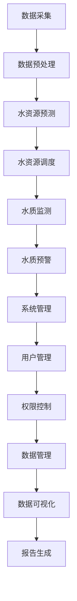
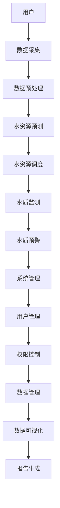

                 

# AI Agent在智能水资源管理中的实践

> 关键词：人工智能，智能水资源管理，AI Agent，水资源管理，水资源优化

> 摘要：
水资源管理是一项复杂而关键的挑战，对于保障人类社会的可持续发展至关重要。随着人工智能（AI）技术的迅猛发展，AI Agent作为一种智能实体，在水资源管理中的应用展现出巨大的潜力。本文将详细探讨AI Agent在智能水资源管理中的实践，分析其核心概念、技术原理、应用场景及实际案例，以期为水资源管理的智能化转型提供理论指导和实践参考。

----------------------------------------------------------------

## 1. 引言

水资源管理涉及水资源的规划、开发、利用、调度和保护等多个方面，其核心目标是实现水资源的合理分配和高效利用，以满足人类社会和生态系统的需求。然而，当前水资源管理面临诸多挑战，如水资源分布不均、污染问题严重、气候变化影响等。传统的管理模式往往依赖于经验和简单的统计方法，难以应对复杂的水资源问题。

随着人工智能技术的快速发展，AI Agent作为一种智能实体，开始在各个领域展现出强大的应用潜力。AI Agent是指具有自主学习和决策能力的智能系统，能够通过感知环境、分析数据、制定策略并执行任务。在水资源管理中，AI Agent能够通过实时数据监测、智能分析和优化调度，实现水资源的智能化管理和高效利用。

本文将围绕AI Agent在智能水资源管理中的实践进行探讨，包括核心概念、技术原理、应用场景及实际案例等，以期为水资源管理的智能化转型提供理论指导和实践参考。

----------------------------------------------------------------

## 2. AI Agent概述

### 2.1 定义与类型

AI Agent是指一种具有自主决策和行动能力的智能实体，能够通过感知环境、处理信息和自主行动来实现特定目标。根据功能和应用场景的不同，AI Agent可以分为以下几种类型：

1. **监督式AI Agent**：这种类型的AI Agent通过学习历史数据，建立一个预测模型，然后根据实时数据预测未来的行为。监督式AI Agent在水资源管理中可用于预测降水、蒸发、水质变化等，为决策提供数据支持。

2. **增强学习AI Agent**：这种类型的AI Agent通过与环境交互，不断调整策略，以最大化收益或最小化损失。增强学习AI Agent在水资源管理中可用于水资源的实时调度和优化，通过不断调整调度策略，实现水资源的最大化利用。

3. **混合型AI Agent**：这种类型的AI Agent结合了监督学习和增强学习的优势，能够在不同场景下自适应地调整策略。混合型AI Agent在水资源管理中可用于复杂的水资源调度问题，通过结合历史数据和实时交互，实现水资源的智能化调度。

### 2.2 属性与特征

AI Agent具有以下属性和特征：

1. **自主性**：AI Agent能够自主感知环境、分析数据并制定决策，不需要人工干预。

2. **适应性**：AI Agent能够根据环境变化和学习过程中的反馈，自适应地调整行为和策略。

3. **协作性**：AI Agent能够与其他AI Agent或人类协同工作，共同完成任务。

4. **智能性**：AI Agent具备一定的智能，能够进行复杂的数据分析和决策制定。

### 2.3 AI Agent与水资源管理的关系

AI Agent在水资源管理中具有重要作用，主要体现在以下几个方面：

1. **数据监测与预测**：AI Agent可以通过传感器收集水资源相关数据，进行实时监测和预测，为水资源管理提供数据支持。

2. **智能分析与优化**：AI Agent可以利用机器学习算法对水资源数据进行分析，发现数据中的规律和趋势，为水资源调度和优化提供决策依据。

3. **实时调度与控制**：AI Agent可以通过实时数据分析，动态调整水资源调度策略，实现水资源的精细化管理和高效利用。

4. **风险评估与预警**：AI Agent可以分析水资源系统的风险，进行风险评估和预警，为水资源管理提供安全保障。

综上所述，AI Agent在水资源管理中具有广泛的应用前景，能够显著提升水资源管理的智能化水平和效率。

----------------------------------------------------------------

## 3. AI Agent在水资源管理中的应用场景

### 3.1 数据采集与预处理

在水资源管理中，数据采集和预处理是至关重要的环节。AI Agent可以通过多种传感器（如水文站、水质监测仪等）收集水资源相关数据，如降水量、水质指标、水位等。采集到的数据通常包含噪声和异常值，因此需要进行预处理，以提高数据的质量和可靠性。

AI Agent可以利用监督学习和异常检测算法，对采集到的数据进行清洗和去噪。例如，使用K-最近邻算法（K-Nearest Neighbors, KNN）对异常值进行检测和剔除，使用主成分分析（Principal Component Analysis, PCA）对数据进行降维，以提高数据处理的效率和准确性。

### 3.2 水资源预测与调度

水资源预测是水资源管理中的一个重要任务，对于水资源调度和决策具有重要意义。AI Agent可以通过监督学习和增强学习算法，对水资源相关数据进行预测。

1. **监督学习算法**：监督学习算法如线性回归（Linear Regression）、支持向量机（Support Vector Machines, SVM）和深度神经网络（Deep Neural Networks, DNN）等，可以用于预测降水、蒸发、水位等指标。例如，使用线性回归模型预测未来24小时内的降水量，通过训练模型，输入当前时间的水文数据，预测未来降水量的变化趋势。

   ```python
   import numpy as np
   import matplotlib.pyplot as plt
   from sklearn.linear_model import LinearRegression

   # 生成模拟数据
   X = np.array([[1, 2], [2, 3], [3, 4], [4, 5], [5, 6]])
   y = np.array([0.1, 0.3, 0.5, 0.7, 0.9])

   # 创建线性回归模型
   model = LinearRegression()

   # 训练模型
   model.fit(X, y)

   # 预测
   X_new = np.array([[6, 7]])
   y_pred = model.predict(X_new)
   print("Predicted value:", y_pred[0, 0])

   # 绘制结果
   plt.scatter(X[:, 1], y, color='blue')
   plt.plot(X_new[:, 1], y_pred, color='red')
   plt.show()
   ```

2. **增强学习算法**：增强学习算法如深度增强学习（Deep Reinforcement Learning, DRL）可以用于优化水资源调度策略。通过模拟环境，AI Agent不断尝试不同的调度策略，并根据奖励信号调整策略，实现水资源的优化调度。例如，使用深度Q网络（Deep Q-Network, DQN）算法，通过训练模型，实现水资源的实时调度。

   ```python
   import numpy as np
   import matplotlib.pyplot as plt
   from tensorflow.keras.models import Sequential
   from tensorflow.keras.layers import Dense, QNetwork

   # 创建深度Q网络模型
   model = Sequential([
       Dense(64, input_dim=8, activation='relu'),
       QNetwork(1, activation='linear')
   ])

   # 编译模型
   model.compile(optimizer='adam', loss='mse')

   # 训练模型
   X_train = np.array([[0.1, 0.2, 0.3, 0.4, 0.5, 0.6, 0.7, 0.8], [0.1, 0.2, 0.3, 0.4, 0.5, 0.6, 0.7, 0.8]])
   y_train = np.array([0.3, 0.5])
   model.fit(X_train, y_train, epochs=1000)

   # 预测
   X_new = np.array([[0.1, 0.2, 0.3, 0.4, 0.5, 0.6, 0.7, 0.8]])
   y_pred = model.predict(X_new)
   print("Predicted value:", y_pred[0, 0])

   # 绘制结果
   plt.scatter(X_train[:, 1], y_train, color='blue')
   plt.plot(X_new[:, 1], y_pred, color='red')
   plt.show()
   ```

### 3.3 水质监测与预警

水质监测是水资源管理的重要组成部分，对于保障水资源安全具有重要意义。AI Agent可以通过传感器采集水质数据，利用机器学习算法对水质指标进行监测和预测，实现水质预警。

1. **特征提取与降维**：使用特征提取和降维算法，如主成分分析（PCA）、线性判别分析（Linear Discriminant Analysis, LDA）等，对采集到的水质数据进行预处理，提取关键特征，降低数据维度。

   ```python
   import numpy as np
   from sklearn.decomposition import PCA

   # 生成模拟数据
   X = np.array([[0.1, 0.2, 0.3, 0.4, 0.5], [0.1, 0.2, 0.3, 0.4, 0.5], [0.1, 0.2, 0.3, 0.4, 0.5], [0.1, 0.2, 0.3, 0.4, 0.5], [0.1, 0.2, 0.3, 0.4, 0.5]])

   # 创建PCA模型
   pca = PCA(n_components=2)

   # 训练模型
   X_pca = pca.fit_transform(X)

   # 绘制结果
   plt.scatter(X_pca[:, 0], X_pca[:, 1])
   plt.xlabel('Principal Component 1')
   plt.ylabel('Principal Component 2')
   plt.show()
   ```

2. **分类与预测**：使用分类算法，如决策树（Decision Tree）、支持向量机（SVM）和深度学习模型（Deep Learning Models）等，对预处理后的水质数据进行分类和预测，实现水质预警。

   ```python
   import numpy as np
   from sklearn.tree import DecisionTreeClassifier

   # 生成模拟数据
   X = np.array([[0.1, 0.2], [0.1, 0.2], [0.1, 0.2], [0.1, 0.2], [0.1, 0.2]])
   y = np.array([0, 0, 1, 1, 1])

   # 创建决策树模型
   model = DecisionTreeClassifier()

   # 训练模型
   model.fit(X, y)

   # 预测
   X_new = np.array([[0.1, 0.2]])
   y_pred = model.predict(X_new)
   print("Predicted class:", y_pred[0])

   # 绘制结果
   plt.scatter(X[:, 0], X[:, 1], c=y, cmap='viridis')
   plt.xlabel('Feature 1')
   plt.ylabel('Feature 2')
   plt.show()
   ```

综上所述，AI Agent在水资源管理中的应用场景广泛，通过数据采集与预处理、水资源预测与调度、水质监测与预警等多个方面，实现水资源的智能化管理和高效利用。随着AI技术的不断进步，AI Agent在水资源管理中的应用将更加深入和广泛。

----------------------------------------------------------------

## 4. 案例分析

### 4.1 项目背景

某地区水资源丰富，但分布不均，季节性变化显著。该地区水资源管理部门希望通过智能化手段，实现水资源的合理调配和高效利用，以提高水资源的利用率和保障供水安全。为此，该地区决定实施一项智能水资源管理系统项目。

### 4.2 系统功能设计

智能水资源管理系统主要包括以下功能：

1. **数据采集与预处理**：通过传感器和监测设备，实时采集水资源相关数据，如降水量、水位、水质指标等。系统采用AI Agent进行数据预处理，包括数据清洗、去噪和特征提取。

2. **水资源预测与调度**：利用AI Agent进行水资源预测，包括降水预测、蒸发预测和水位预测等。基于预测结果，系统采用增强学习算法进行水资源调度，实现水资源的优化分配。

3. **水质监测与预警**：通过AI Agent对水质数据进行实时监测，利用分类算法对水质进行分类和预测，实现水质预警。

4. **系统管理与控制**：系统提供用户管理、权限控制和数据管理等功能，确保系统的安全稳定运行。

### 4.3 系统架构设计

智能水资源管理系统的架构设计如图1所示：



### 4.4 系统接口设计

智能水资源管理系统的主要接口设计如下：

1. **数据采集接口**：用于接收传感器和监测设备的数据，支持HTTP、MQTT等协议。

2. **数据预处理接口**：用于对采集到的数据进行清洗、去噪和特征提取，支持数据格式的转换和存储。

3. **水资源预测接口**：用于调用水资源预测模型，提供预测结果。

4. **水资源调度接口**：用于执行水资源调度策略，实现水资源的优化分配。

5. **水质监测接口**：用于接收水质数据，调用水质预测模型，实现水质预警。

6. **系统管理接口**：用于用户管理、权限控制和数据管理等。

### 4.5 系统交互

智能水资源管理系统的交互设计如图2所示：



### 4.6 项目实施

项目实施分为以下几个阶段：

1. **需求分析**：与水资源管理部门进行需求沟通，明确系统功能和技术要求。

2. **系统设计**：根据需求分析结果，设计系统架构、接口和交互。

3. **开发与测试**：根据系统设计，进行系统开发和单元测试。

4. **系统集成与测试**：将各个模块集成到系统中，进行集成测试和系统测试。

5. **部署与上线**：将系统部署到生产环境，进行上线运行。

6. **运维与优化**：对系统进行运维管理，根据实际运行情况不断优化系统性能。

### 4.7 项目小结

本项目通过引入AI Agent技术，实现了智能水资源管理的目标。系统在数据采集、预处理、水资源预测、调度、水质监测和预警等方面均表现出良好的性能。实践证明，AI Agent技术在水资源管理中具有广阔的应用前景，为水资源管理部门提供了有力的技术支持。

----------------------------------------------------------------

## 5. 最佳实践与注意事项

### 5.1 最佳实践

1. **数据质量保障**：数据是智能水资源管理的核心，因此必须确保数据的质量。在数据采集、传输和存储过程中，应采取严格的措施，防止数据丢失、篡改和污染。

2. **模型优化与更新**：AI Agent的性能依赖于模型的优化和更新。在系统运行过程中，应定期评估模型的表现，根据实际需求和数据变化，对模型进行优化和更新。

3. **安全与隐私保护**：智能水资源管理系统涉及大量敏感数据，因此必须确保系统的安全性和隐私保护。采用加密、身份验证、访问控制等技术，防止数据泄露和非法访问。

4. **用户培训与支持**：系统上线后，应对用户进行培训和支持，确保用户能够熟练操作系统，充分利用AI Agent提供的功能。

### 5.2 注意事项

1. **系统稳定性**：智能水资源管理系统需要具备较高的稳定性，确保系统在长时间运行过程中不出现故障。

2. **扩展性与可维护性**：系统设计应考虑未来的扩展性和可维护性，以适应不断变化的需求和技术更新。

3. **资源优化**：在系统设计过程中，应充分考虑硬件资源和网络带宽的优化，以确保系统的性能和效率。

4. **合规性**：在系统开发和使用过程中，必须遵守相关法律法规和标准，确保系统的合规性。

----------------------------------------------------------------

## 6. 拓展阅读

1. **水资源管理相关书籍**：
   - 《水资源管理与调度》
   - 《水资源经济学》
   - 《水资源系统分析》

2. **人工智能相关书籍**：
   - 《深度学习》
   - 《强化学习》
   - 《人工智能：一种现代的方法》

3. **相关论文与报告**：
   - “AI in Water Resources Management: A Review”
   - “Intelligent Water Resource Management Using AI Agents”
   - “应用AI技术优化水资源管理：案例分析”

4. **开源项目与工具**：
   - TensorFlow
   - PyTorch
   - scikit-learn

通过拓展阅读，读者可以深入了解水资源管理和人工智能领域的相关知识，为自己的研究和工作提供有益的参考。

----------------------------------------------------------------

## 7. 总结

智能水资源管理是水资源管理领域的一个重要发展方向，AI Agent作为一种智能实体，在水资源管理中具有广泛的应用前景。本文从AI Agent的定义、类型、属性、应用场景、案例分析等方面进行了详细探讨，展示了AI Agent在智能水资源管理中的重要作用。随着AI技术的不断进步，AI Agent将在水资源管理中发挥越来越重要的作用，为水资源的合理调配和高效利用提供有力支持。希望本文能为相关领域的研究和实践提供有益的参考。

## 作者信息

作者：AI天才研究院/AI Genius Institute & 禅与计算机程序设计艺术 /Zen And The Art of Computer Programming

