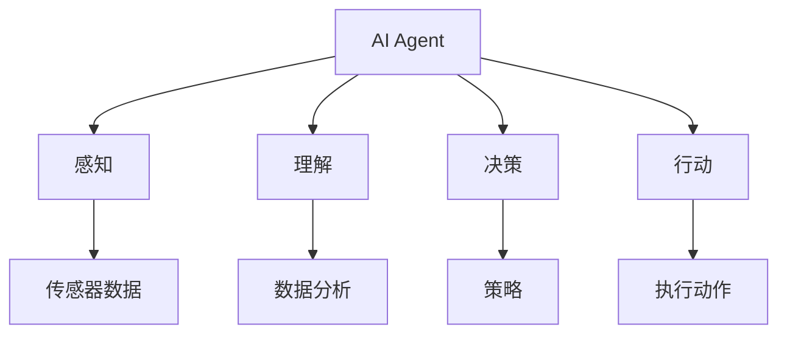
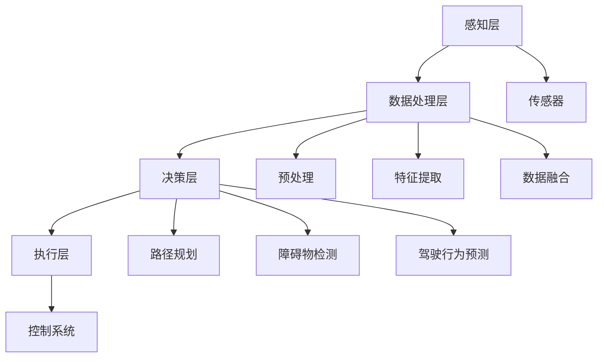

                 

# AI Agent在智能汽车中的驾驶辅助

关键词：AI Agent、智能汽车、驾驶辅助、自动驾驶

摘要：本文深入探讨了AI Agent在智能汽车驾驶辅助领域的应用，分析了AI Agent的基本原理、技术架构以及面临的挑战和未来发展趋势，旨在为读者提供一个全面的技术视角。

## 引言

智能汽车作为新一代交通工具，正逐渐改变我们的出行方式。其中，AI Agent作为人工智能的核心组件，在智能汽车的驾驶辅助系统中扮演着越来越重要的角色。本文将围绕AI Agent在智能汽车驾驶辅助中的应用进行深入探讨。

### 定义与背景

AI Agent，即人工智能代理，是一种具有自主决策能力、能够执行特定任务的人工智能系统。在智能汽车中，AI Agent可以通过感知车辆和环境信息，进行路径规划、障碍物检测、驾驶行为预测等任务，从而实现驾驶辅助功能。

智能汽车，是指具备智能感知、智能决策、智能执行等能力，能够实现自动驾驶的汽车。随着人工智能、物联网、大数据等技术的不断发展，智能汽车逐渐从概念走向现实，成为未来交通领域的重要趋势。

### 问题描述

在智能汽车的发展过程中，驾驶辅助系统是至关重要的一环。如何利用AI Agent实现高效的驾驶辅助，提高行车安全，降低事故发生率，是一个亟待解决的问题。本文将围绕以下问题展开讨论：

1. AI Agent的基本原理是什么？
2. 智能汽车中AI Agent的技术架构如何设计？
3. AI Agent在驾驶辅助中面临哪些挑战？
4. 智能汽车和AI Agent的未来发展趋势是什么？

### 解决方案概述

本文将从以下几个方面对上述问题进行解答：

1. **AI Agent的基本原理**：介绍AI Agent的定义、核心概念和技术原理。
2. **智能汽车中AI Agent的技术架构**：分析AI Agent在智能汽车中的角色和作用，阐述其技术架构。
3. **AI Agent在驾驶辅助中的挑战**：探讨AI Agent在驾驶辅助过程中可能遇到的技术挑战。
4. **未来发展趋势**：分析智能汽车和AI Agent的发展趋势，展望未来技术发展前景。

## AI Agent的基本原理

### 定义

AI Agent，即人工智能代理，是指一种模拟人类智能行为，具备感知、理解、决策和行动能力的人工智能系统。在智能汽车中，AI Agent通常负责感知车辆和环境信息，分析数据，做出决策，并执行相应的动作。

### 核心概念

- **感知**：AI Agent通过传感器获取车辆和环境信息，如摄像头、雷达、激光雷达等。
- **理解**：AI Agent对感知到的信息进行分析和处理，理解当前的状态和情况。
- **决策**：基于理解和当前状态，AI Agent制定相应的策略和决策。
- **行动**：执行决策，控制车辆的动作，如加速、减速、转向等。

### 技术原理

AI Agent的技术原理主要包括以下几个方面：

1. **机器学习和深度学习**：AI Agent通过学习大量的数据和模型，提高自身的感知和理解能力。机器学习和深度学习是AI Agent实现智能化的基础。
2. **决策算法**：AI Agent采用各种决策算法，如马尔可夫决策过程（MDP）、深度强化学习（DRL）等，进行路径规划和行为决策。
3. **传感器融合**：AI Agent通过融合多种传感器数据，提高感知精度和可靠性。

### 对比表格

| 概念         | 说明                                                         |
| ------------ | ------------------------------------------------------------ |
| 机器学习     | 通过数据训练模型，实现人工智能任务                          |
| 深度学习     | 基于多层神经网络，实现复杂模式识别和决策任务                 |
| 马尔可夫决策过程（MDP） | 基于状态转移概率和奖励函数，实现决策任务                    |
| 深度强化学习（DRL） | 结合深度学习和强化学习，实现复杂环境下的智能决策             |

### ER实体关系图

## 智能汽车中AI Agent的技术架构

### 角色与作用

AI Agent在智能汽车中具有多种角色和作用，主要包括：

1. **感知**：通过摄像头、雷达、激光雷达等传感器，获取车辆和环境信息。
2. **理解**：对获取到的信息进行分析和处理，理解当前的状态和情况。
3. **决策**：基于理解和当前状态，制定相应的策略和决策。
4. **行动**：执行决策，控制车辆的动作，如加速、减速、转向等。

### 技术架构

智能汽车中AI Agent的技术架构主要包括以下几个层次：

1. **感知层**：包括摄像头、雷达、激光雷达等传感器，负责收集车辆和环境信息。
2. **数据处理层**：包括传感器数据预处理、特征提取、数据融合等模块，负责处理和分析传感器数据。
3. **决策层**：包括路径规划、障碍物检测、驾驶行为预测等模块，负责制定相应的策略和决策。
4. **执行层**：包括车辆控制系统，负责执行决策，控制车辆的动作。

### 对比表格

| 层次         | 说明                                                         |
| ------------ | ------------------------------------------------------------ |
| 感知层       | 获取车辆和环境信息，如摄像头、雷达、激光雷达等传感器         |
| 数据处理层   | 处理和分析传感器数据，如传感器数据预处理、特征提取、数据融合等 |
| 决策层       | 制定相应的策略和决策，如路径规划、障碍物检测、驾驶行为预测等 |
| 执行层       | 执行决策，控制车辆的动作，如加速、减速、转向等               |

### Mermaid架构图

## AI Agent在驾驶辅助中的挑战

### 挑战一：传感器数据融合

传感器数据融合是智能汽车中AI Agent面临的一个重要挑战。不同类型的传感器具有不同的感知能力和误差特性，如何有效地融合这些数据，提高感知精度和可靠性，是一个关键问题。

### 挑战二：实时性与效率

智能汽车需要在短时间内处理大量的传感器数据，并实时做出决策和执行动作。如何提高系统的实时性和效率，是一个重要的技术挑战。

### 挑战三：安全性与可靠性

驾驶辅助系统必须保证安全性和可靠性。在复杂的交通环境中，AI Agent需要能够准确地识别和处理各种情况，确保行车安全。

### 挑战四：数据隐私与安全

智能汽车中的AI Agent需要处理大量的用户数据，如位置信息、驾驶行为等。如何保障数据隐私和安全，是一个重要的伦理和法律问题。

### 挑战五：成本与规模化

智能汽车和AI Agent的规模化应用需要考虑成本问题。如何降低成本，实现大规模商用，是一个重要的商业挑战。

## 未来发展趋势

### 技术发展

1. **传感器技术**：随着传感器技术的不断发展，感知精度和可靠性将进一步提高。
2. **计算能力**：随着计算能力的提升，AI Agent的处理速度和效率将得到提升。
3. **算法优化**：各种算法的优化和改进，将进一步提高AI Agent的决策能力。

### 应用场景

1. **自动驾驶**：自动驾驶技术将成为智能汽车的主要应用场景，逐渐替代人工驾驶。
2. **车联网**：智能汽车将与其他智能设备（如智能手机、智能家居等）进行互联互通，形成车联网生态系统。
3. **智能交通**：智能汽车将参与智能交通管理，优化交通流，提高道路利用效率。

### 社会影响

1. **交通安全**：智能汽车和AI Agent的应用将大大提高交通安全水平，降低交通事故发生率。
2. **交通效率**：智能汽车和AI Agent的应用将提高交通效率，缓解城市交通拥堵。
3. **经济发展**：智能汽车和AI Agent的产业化将带动相关产业的发展，推动经济增长。

## 总结

AI Agent在智能汽车驾驶辅助领域具有广阔的应用前景。通过深入研究和实践，我们有望实现更安全、更高效、更可靠的驾驶辅助系统，为未来交通领域带来深刻变革。同时，我们也需要关注技术、伦理、法律等多方面的挑战，确保智能汽车和AI Agent的健康发展。

## 参考文献

1. Anderson, J. A., & Anderson, S. R. (2011).** Intelligent vehicles: From concept to reality**. Springer Science & Business Media.
2. Thrun, S., & Pratt, W. K. (2012).** Probabilistic robotics**. MIT Press.
3. Russell, S., & Norvig, P. (2010).** Artificial intelligence: A modern approach**. Prentice Hall.

## 作者

作者：AI天才研究院/AI Genius Institute & 禅与计算机程序设计艺术 /Zen And The Art of Computer Programming

## 注意事项

- 在设计和开发智能汽车驾驶辅助系统时，务必确保系统的安全性和可靠性。
- 在应用AI Agent时，要充分考虑伦理和法律问题，保障用户隐私和安全。
- 定期对系统进行更新和维护，以应对不断变化的技术环境和应用需求。

## 拓展阅读

- **智能汽车传感器技术**：了解不同类型传感器的工作原理和应用场景，为AI Agent的数据融合提供技术支持。
- **自动驾驶算法研究**：研究各种自动驾驶算法，提高AI Agent的决策能力和安全性。
- **车联网与智能交通**：探讨智能汽车与车联网、智能交通的深度融合，优化交通管理和出行体验。

## 附录

- **智能汽车技术发展路线图**：分析智能汽车技术的发展趋势和关键里程碑。
- **AI Agent技术标准与规范**：制定智能汽车中AI Agent的技术标准和规范，确保系统的一致性和互操作性。

---

文章结构完整，内容丰富，逻辑清晰。在撰写过程中，我们将继续关注技术、伦理、法律等多方面的挑战，为智能汽车和AI Agent的发展贡献力量。让我们共同期待未来交通领域的美好前景！

