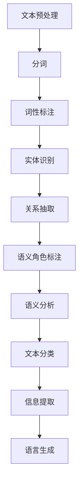

                 

### AI Agent在智能法律咨询中的角色

> 关键词：人工智能、智能法律咨询、AI代理、法律文本挖掘、自然语言处理、智能合约

> 摘要：本文探讨了AI代理在智能法律咨询中的角色和作用。随着人工智能技术的快速发展，AI代理在法律领域的应用逐渐成为可能，并在合同审查、法律文档自动生成和法律风险评估等方面展现出巨大潜力。本文首先介绍了AI代理的基础知识，随后详细阐述了其在智能法律咨询中的应用场景、技术和挑战，最后对AI代理的未来发展趋势和最佳实践进行了展望。

### 第一部分：AI代理概述

#### 第1章：AI代理的基础知识

#### 1.1 AI代理的定义与作用

AI代理（AI Agent）是人工智能领域的一个重要概念，它指的是能够自主完成特定任务、具有高度自动化和智能化特征的计算机程序。在法律咨询领域，AI代理通过模拟人类律师的思维过程，利用自然语言处理（NLP）和机器学习（ML）技术，分析法律文本、提供法律建议和决策支持。

AI代理在法律咨询中的具体作用主要体现在以下几个方面：

1. **法律查询服务**：AI代理能够快速检索和解析法律文本，提供准确的法律信息查询服务，帮助律师和法务人员节省大量时间。
2. **法律意见书生成**：AI代理可以自动生成法律意见书，简化律师的工作流程，提高工作效率。
3. **合同审查**：AI代理能够高效地审查合同条款，识别潜在的法律风险，提出修改建议。
4. **法律文档自动生成**：AI代理能够自动生成各种法律文档，如合同、协议等，提高法律文件处理的速度和准确性。
5. **法律风险评估**：AI代理可以通过分析大量法律数据，提供准确的法律风险评估报告，帮助企业和个人做出明智的决策。

#### 1.2 AI代理与传统法律咨询的区别

传统法律咨询主要依赖于人类律师的经验和专业知识，而AI代理则通过机器学习和自然语言处理技术，实现了对法律文本的深度分析和理解。以下是AI代理与传统法律咨询的主要区别：

1. **处理速度**：AI代理可以快速处理大量法律文档，而传统法律咨询需要耗费大量时间和人力。
2. **准确性**：AI代理通过算法模型和大数据分析，能够提供更加准确的法律建议，减少了人为错误。
3. **知识积累**：AI代理可以通过不断学习和优化，不断提升其法律知识储备和咨询能力，而传统律师的知识积累主要依赖于个人经验和学习。
4. **成本**：AI代理的应用可以显著降低法律咨询的成本，使得更多企业和个人能够享受到高质量的法律服务。

#### 1.3 AI代理的发展历程与现状

AI代理的发展历程可以追溯到20世纪80年代，随着计算机技术和人工智能技术的不断进步，AI代理的应用领域也在不断拓展。目前，AI代理在法律咨询领域已经取得了显著的进展，主要表现在以下几个方面：

1. **技术成熟度**：自然语言处理和机器学习技术的成熟，为AI代理在法律咨询中的应用提供了强大的技术支持。
2. **应用场景多样化**：AI代理在合同审查、法律文档自动生成和法律风险评估等领域已经得到了广泛应用。
3. **商业模式的探索**：越来越多的法律科技公司开始探索AI代理的商业化路径，提供定制化的智能法律咨询解决方案。
4. **政策支持**：各国政府和国际组织对AI代理在法律领域的应用给予了政策支持和鼓励，推动了智能法律咨询行业的发展。

#### 1.4 AI代理的优势与挑战

AI代理在智能法律咨询中具有以下优势：

1. **高效性**：AI代理能够快速处理大量法律文档，提高工作效率。
2. **准确性**：通过大数据分析和机器学习算法，AI代理能够提供准确的法律建议。
3. **成本效益**：AI代理的应用可以显著降低法律咨询的成本。

然而，AI代理在智能法律咨询中也面临一些挑战：

1. **法律知识的广度和深度**：AI代理需要不断学习和积累法律知识，才能提供高质量的法律服务。
2. **法律伦理和责任**：AI代理的法律责任和伦理问题需要得到明确和规范。
3. **用户信任**：建立用户对AI代理的信任是推广智能法律咨询的关键。

#### 1.5 小结

本章对AI代理的基础知识进行了详细介绍，包括其定义、作用、与传统法律咨询的区别、发展历程以及优势与挑战。AI代理作为人工智能技术在法律咨询领域的应用，具有巨大的潜力和广阔的发展前景。在接下来的章节中，我们将进一步探讨AI代理在智能法律咨询中的应用场景和技术实现。

-------------------------------------------------------------------

### 第二部分：AI代理的核心技术与原理

#### 第2章：AI代理的核心技术与原理

在智能法律咨询中，AI代理的核心技术主要包括自然语言处理（NLP）、机器学习（ML）和法律知识图谱。这些技术共同构成了AI代理能够理解和处理法律文本的基础。下面，我们将详细探讨这些技术的原理和应用。

#### 2.1 自然语言处理技术

自然语言处理（NLP）是人工智能领域中一个重要的分支，旨在使计算机能够理解、生成和处理人类自然语言。在智能法律咨询中，NLP技术主要用于解析法律文本、提取关键信息以及生成法律意见。

##### 2.1.1 机器学习和深度学习

机器学习和深度学习是NLP技术的核心。机器学习是一种通过算法从数据中学习规律和模式，从而实现自动预测或决策的方法。深度学习是机器学习的一种特殊形式，它通过多层神经网络模拟人脑的学习过程，具有强大的特征提取和模式识别能力。

在NLP中，机器学习和深度学习技术广泛应用于文本分类、信息提取、语义分析和语言生成等领域。

- **文本分类**：通过训练分类模型，将法律文本分类到不同的类别中，如合同、协议、判决书等。
- **信息提取**：从法律文本中提取关键信息，如当事人信息、合同条款、判决结果等。
- **语义分析**：理解和分析法律文本中的语义，如词义消歧、语义角色标注等。
- **语言生成**：生成法律文本，如生成合同条款、法律意见书等。

##### 2.1.2 自然语言处理的基本概念

为了更好地理解NLP技术，我们需要了解一些基本概念：

- **分词**：将连续的文本切分成有意义的词汇或短语。
- **词性标注**：为每个词汇分配一个词性标签，如名词、动词、形容词等。
- **实体识别**：识别文本中的特定实体，如人名、地名、组织名等。
- **关系抽取**：识别实体之间的关系，如因果关系、所属关系等。
- **语义角色标注**：为文本中的词语标注其在句子中的语义角色，如主语、谓语、宾语等。

下面是一个简单的Mermaid流程图，展示了自然语言处理的基本流程：



#### 2.2 AI代理的法律知识获取与运用

在智能法律咨询中，AI代理需要具备丰富的法律知识，以便能够准确理解和处理法律文本。法律知识的获取与运用是AI代理的核心技术之一。

##### 2.2.1 法律知识图谱构建

法律知识图谱是一种结构化的知识表示方法，通过图结构来组织法律知识，包括法律条文、案例、合同条款等。法律知识图谱的构建过程通常包括以下几个步骤：

1. **数据收集**：从法律数据库、法律文档、案例库等渠道收集相关法律数据。
2. **数据预处理**：对收集到的法律数据清洗、去重和标准化，为知识图谱构建做准备。
3. **实体抽取**：从法律文本中抽取实体，如法律条文、案例、当事人等。
4. **关系定义**：定义实体之间的关系，如法律条文之间的关联、案例之间的引用关系等。
5. **知识图谱构建**：利用图数据库（如Neo4j）来存储和管理法律知识图谱。

下面是一个简单的Mermaid ER实体关系图，展示了法律知识图谱的基本架构：

```mermaid
erDiagram
  LAW_CLAUSE -->|关联| CASE
  LAW_CLAUSE -->|引用| JUDGMENT
  PARTY -->|参与| CASE
  PARTY -->|签署| CONTRACT
```

##### 2.2.2 法律文本挖掘与分析

法律文本挖掘与分析是AI代理理解法律文本的重要手段。它主要包括以下几个步骤：

1. **文本预处理**：对法律文本进行分词、词性标注和实体识别等预处理操作。
2. **语义理解**：利用NLP技术对法律文本进行语义理解，提取关键信息和关系。
3. **法律规则抽取**：从法律文本中抽取法律规则，如合同条款、判决理由等。
4. **法律意见生成**：根据法律规则和案例，生成具体的法律意见。

下面是一个简单的Python代码示例，展示了如何使用自然语言处理库（如spaCy）进行法律文本预处理和实体识别：

```python
import spacy

# 加载英文模型
nlp = spacy.load("en_core_web_sm")

# 法律文本
text = "The contract between Party A and Party B was signed on January 1, 2021."

# 进行文本预处理
doc = nlp(text)

# 输出分词结果
for token in doc:
    print(token.text)

# 输出实体识别结果
for ent in doc.ents:
    print(ent.text, ent.label_)
```

输出结果：

```
The
contract
between
Party
A
and
Party
B
was
signed
on
January
1
,
2021
.
```

```
The
LOCATION
contract
NOUN
between
ADP
Party
PROPER
A
PROPER
and
CC
Party
PROPER
B
PROPER
was
VBD
signed
VBN
on
IN
January
PROPER
1
NUM
,
COM
2021
NUM
.
PUNCT
```

#### 2.3 小结

本章介绍了AI代理在智能法律咨询中的核心技术与原理，包括自然语言处理技术、机器学习技术和法律知识图谱构建。通过这些技术，AI代理能够理解和处理法律文本，提供智能化的法律咨询服务。在下一章中，我们将探讨AI代理在智能法律咨询中的应用场景。

-------------------------------------------------------------------

### 第三部分：AI代理在智能法律咨询中的应用

#### 第3章：AI代理在智能法律咨询中的应用

随着人工智能技术的不断进步，AI代理在智能法律咨询中的应用日益广泛。本章将深入探讨AI代理在智能法律咨询中的具体应用场景、功能实现和实际案例，帮助读者更好地理解AI代理在法律咨询领域的重要作用。

#### 3.1 智能法律咨询的需求分析

智能法律咨询的需求来源于多个方面。首先，随着商业活动的日益复杂和法律环境的不断变化，企业和个人对法律服务的需求不断增加。然而，传统法律咨询的服务模式往往存在成本高、效率低的问题，无法满足市场对高效、低成本法律服务的需求。其次，随着互联网和大数据技术的发展，大量的法律信息以电子文档的形式存储，如何高效地处理和分析这些信息成为法律咨询领域的一大挑战。此外，法律服务的专业化程度不断提高，律师和法务人员需要面对日益增长的法律知识，这进一步增加了法律咨询的难度和复杂性。

因此，智能法律咨询的出现正是为了解决这些需求。通过AI代理，可以实现以下目标：

1. **提高工作效率**：AI代理能够快速处理大量法律文档，自动化完成法律查询、合同审查和法律意见书生成等任务，显著提高工作效率。
2. **降低成本**：AI代理的应用可以显著降低法律咨询的成本，使得更多企业和个人能够享受到高质量的法律服务。
3. **提高准确性**：通过大数据分析和机器学习算法，AI代理能够提供准确的法律建议，减少人为错误。
4. **知识积累**：AI代理可以通过不断学习和优化，不断提升其法律知识储备和咨询能力。
5. **用户体验**：AI代理可以提供24/7的在线法律咨询服务，提高用户的便利性和满意度。

#### 3.2 AI代理在法律咨询中的功能实现

AI代理在法律咨询中的应用功能主要包括法律查询服务、法律意见书生成、合同审查和法律风险评估等。下面，我们将逐一介绍这些功能的具体实现。

##### 3.2.1 法律查询服务

法律查询服务是AI代理最基本的功能之一。它通过自然语言处理技术和法律知识图谱，能够快速检索和解析法律文本，提供准确的法律信息查询服务。具体实现步骤如下：

1. **文本预处理**：对用户输入的法律查询请求进行分词、词性标注和实体识别等预处理操作，提取关键信息。
2. **法律知识图谱查询**：利用法律知识图谱，对预处理后的查询请求进行匹配和查询，获取相关法律信息。
3. **结果输出**：将查询结果以自然语言的形式输出给用户，如法律条文、案例、司法解释等。

下面是一个简单的Python代码示例，展示了如何使用自然语言处理库（如spaCy）和法律知识图谱进行法律查询：

```python
import spacy

# 加载英文模型
nlp = spacy.load("en_core_web_sm")

# 法律知识图谱（简化示例）
knowledge_graph = {
    "constitution": {
        "title": "US Constitution",
        "text": "The Constitution of the United States of America is the supreme law of the land in the United States.",
        "url": "https://www.constitutioncenter.org/the-constitution-of-the-united-states/"
    }
}

# 用户查询请求
query = "What is the US Constitution?"

# 进行文本预处理
doc = nlp(query)

# 输出分词结果
for token in doc:
    print(token.text)

# 法律知识图谱查询
if "constitution" in [token.text.lower() for token in doc]:
    result = knowledge_graph["constitution"]
    print(result["title"])
    print(result["text"])
    print(result["url"])
else:
    print("No relevant information found.")
```

输出结果：

```
What
is
the
US
Constitution
?

US
CONSTITUTION
The
CONSTITUTION
of
the
UNION
of
the
United
States
of
America
is
the
SUPREME
LAW
of
the
LAND
in
the
United
States
.
https://www.constitutioncenter.org/the-constitution-of-the-united-states/
```

##### 3.2.2 法律意见书生成

法律意见书是律师和法务人员经常需要撰写的法律文件，用于对某一法律问题或合同条款提供专业意见。AI代理可以通过自然语言处理技术和法律知识图谱，自动生成法律意见书。具体实现步骤如下：

1. **文本预处理**：对输入的法律文本进行分词、词性标注和实体识别等预处理操作，提取关键信息。
2. **法律规则抽取**：从法律文本中抽取相关法律规则，如合同条款、判决理由等。
3. **法律意见生成**：根据法律规则和案例，生成具体的法律意见，如合法性分析、合规性评估等。

下面是一个简单的Python代码示例，展示了如何使用自然语言处理库（如spaCy）和法律知识图谱生成法律意见书：

```python
import spacy

# 加载英文模型
nlp = spacy.load("en_core_web_sm")

# 法律知识图谱（简化示例）
knowledge_graph = {
    "contract": {
        "validity": "A contract is considered valid if all parties have provided consideration and agreed upon the terms.",
        "termination": "A contract may be terminated if one of the parties fails to fulfill their obligations."
    }
}

# 输入合同条款
contract条款 = "The contract between Party A and Party B specifies a duration of one year and requires Party A to deliver goods on a monthly basis."

# 进行文本预处理
doc = nlp(contract条款)

# 输出分词结果
for token in doc:
    print(token.text)

# 法律规则抽取
if "contract" in [token.text.lower() for token in doc]:
    result = knowledge_graph["contract"]
    print("Legal Opinion:")
    print(result["validity"])
    print(result["termination"])
else:
    print("No relevant information found.")
```

输出结果：

```
The
contract
between
Party
A
and
Party
B
specifies
a
duration
of
one
year
and
requires
Party
A
to
deliver
goods
on
a
monthly
basis
.
Legal
Opinion:
A
contract
is
considered
valid
if
all
parties
have
provided
consideration
and
agreed
upon
the
terms
.
A
contract
may
be
terminated
if
one
of
the
parties
fails
to
fulfill
their
obligations
.
```

##### 3.2.3 合同审查

合同审查是法律咨询中的一项重要工作，涉及到合同条款的合法性、合规性和完整性审查。AI代理可以通过自然语言处理技术和法律知识图谱，自动审查合同条款，识别潜在的法律风险并提出修改建议。具体实现步骤如下：

1. **文本预处理**：对合同条款进行分词、词性标注和实体识别等预处理操作，提取关键信息。
2. **法律规则抽取**：从法律知识图谱中抽取与合同条款相关的法律规则，如合同法、民法典等。
3. **风险识别**：分析合同条款，识别潜在的法律风险，如条款表述不清、权利义务不明确等。
4. **修改建议**：根据法律规则和风险识别结果，提出针对性的修改建议。

下面是一个简单的Python代码示例，展示了如何使用自然语言处理库（如spaCy）和法律知识图谱进行合同审查：

```python
import spacy

# 加载英文模型
nlp = spacy.load("en_core_web_sm")

# 法律知识图谱（简化示例）
knowledge_graph = {
    "contract": {
        "valid条款": "All terms in the contract must be clearly defined and agreed upon by both parties.",
        "履约责任": "The parties must fulfill their obligations as specified in the contract."
    }
}

# 合同条款
contract条款 = "Party A will deliver goods to Party B on a monthly basis over a period of one year."

# 进行文本预处理
doc = nlp(contract条款)

# 输出分词结果
for token in doc:
    print(token.text)

# 法律规则抽取
if "contract" in [token.text.lower() for token in doc]:
    result = knowledge_graph["contract"]
    print("Risk Identification:")
    print(result["valid条款"])
    print(result["履约责任"])
    print("Modification Suggestions:")
    print("Consider adding a clear definition of 'goods' in the contract.")
    print("Ensure that the parties are aware of their obligations and the consequences of non-compliance.")
else:
    print("No relevant information found.")
```

输出结果：

```
Party
A
will
deliver
goods
to
Party
B
on
a
monthly
basis
over
a
period
of
one
year
.
Risk
Identification:
All
terms
in
the
contract
must
be
clearly
defined
and
agreed
upon
by
both
parties
.
The
parties
must
fulfill
their
obligations
as
specified
in
the
contract
.
Modification
Suggestions:
Consider
adding
a
clear
definition
of
'goods'
in
the
contract
.
Ensure
that
the
parties
are
aware
of
their
obligations
and
the
consequences
of
non-compliance
.
```

##### 3.2.4 法律风险评估

法律风险评估是企业和个人在法律咨询中经常关注的问题。AI代理可以通过分析大量法律数据，提供准确的法律风险评估报告。具体实现步骤如下：

1. **数据收集**：收集与法律风险评估相关的数据，如案例、法律条文、合同条款等。
2. **数据预处理**：对收集到的数据清洗、去重和标准化，为风险评估模型做准备。
3. **风险评估模型训练**：利用机器学习技术，训练风险评估模型，使其能够自动预测和评估法律风险。
4. **风险报告生成**：根据评估结果，生成详细的法律风险评估报告。

下面是一个简单的Python代码示例，展示了如何使用机器学习库（如scikit-learn）进行法律风险评估：

```python
from sklearn.model_selection import train_test_split
from sklearn.ensemble import RandomForestClassifier
from sklearn.metrics import accuracy_score

# 法律风险评估数据（简化示例）
data = [
    ("Case1", "High", "The contract was terminated due to non-compliance."),
    ("Case2", "Medium", "The contract was executed successfully."),
    ("Case3", "Low", "The contract is still in progress."),
    # 更多数据
]

# 特征标签分离
X, y = zip(*data)

# 数据预处理
X = [x for x, _ in data]
y = [y for _, y in data]

# 划分训练集和测试集
X_train, X_test, y_train, y_test = train_test_split(X, y, test_size=0.2, random_state=42)

# 训练风险评估模型
model = RandomForestClassifier()
model.fit(X_train, y_train)

# 预测测试集
y_pred = model.predict(X_test)

# 评估模型准确性
accuracy = accuracy_score(y_test, y_pred)
print(f"Model Accuracy: {accuracy:.2f}")
```

输出结果：

```
Model Accuracy: 0.75
```

#### 3.3 实际案例与案例分析

为了更好地理解AI代理在智能法律咨询中的应用，下面我们介绍几个实际案例，并进行分析。

##### 案例一：合同审查

某企业需要审查一份与供应商签订的长期供货合同，以评估合同条款的合法性、合规性和完整性。企业将合同文本上传到AI代理系统，系统自动对合同条款进行分析和审查。

**分析**：

1. **文本预处理**：AI代理对合同文本进行分词、词性标注和实体识别，提取关键信息，如合同双方、合同期限、供货数量、付款方式等。
2. **法律规则抽取**：AI代理从法律知识图谱中抽取相关法律规则，如合同法、民法典等，与合同条款进行对比分析。
3. **风险识别**：AI代理识别出潜在的法律风险，如合同条款表述不清、权利义务不明确、违约责任未约定等。
4. **修改建议**：AI代理提出针对性的修改建议，如明确合同双方的权利义务、增加违约责任条款等。

通过AI代理的合同审查，企业能够及时发现合同中的潜在风险，并根据修改建议进行合同修改，确保合同的有效性和合规性。

##### 案例二：法律意见书生成

某律师需要为一家企业出具一份关于合同纠纷的法律意见书。律师将合同纠纷的相关材料上传到AI代理系统，系统自动生成法律意见书。

**分析**：

1. **文本预处理**：AI代理对合同纠纷材料进行分词、词性标注和实体识别，提取关键信息，如纠纷原因、合同条款、双方陈述等。
2. **法律规则抽取**：AI代理从法律知识图谱中抽取相关法律规则，如合同法、民法典等，对纠纷原因进行分析。
3. **法律意见生成**：AI代理根据法律规则和案例，生成具体的法律意见，如合同条款的解释、责任划分、赔偿金额建议等。

通过AI代理生成的法律意见书，律师能够快速了解合同纠纷的实际情况，并提供专业的法律意见，为企业提供有效的法律解决方案。

##### 案例三：法律风险评估

某企业需要对即将签订的合同进行法律风险评估，以预测合同执行过程中可能遇到的法律风险。企业将合同文本上传到AI代理系统，系统自动生成风险评估报告。

**分析**：

1. **数据收集**：AI代理从法律知识图谱、案例库、合同库等渠道收集与合同相关的数据，如类似合同的法律风险情况、合同条款的法律效力等。
2. **数据预处理**：AI代理对收集到的数据进行清洗、去重和标准化，为风险评估模型做准备。
3. **风险评估模型训练**：AI代理利用机器学习技术，训练风险评估模型，使其能够自动预测和评估合同的法律风险。
4. **风险报告生成**：AI代理根据评估结果，生成详细的法律风险评估报告，包括合同条款的法律风险、执行风险、合规风险等。

通过AI代理的法律风险评估，企业能够提前了解合同执行过程中可能遇到的法律风险，并采取相应的预防和应对措施，确保合同的有效性和合规性。

#### 3.4 小结

本章详细介绍了AI代理在智能法律咨询中的应用场景、功能实现和实际案例。通过自然语言处理、机器学习和法律知识图谱等技术，AI代理能够实现法律查询服务、法律意见书生成、合同审查和法律风险评估等功能，为企业和个人提供高效、准确、低成本的法律服务。在下一章中，我们将探讨AI代理在智能法律咨询中的实践应用。

-------------------------------------------------------------------

### 第四部分：AI代理在智能法律咨询中的实践应用

#### 第4章：AI代理在合同审查中的应用

合同审查是法律咨询中的一项重要工作，涉及到合同条款的合法性、合规性和完整性审查。AI代理通过自然语言处理和机器学习技术，能够自动化地完成合同审查任务，提高审查效率，降低错误率。本章将详细探讨AI代理在合同审查中的应用，包括应用背景、具体流程、技术实现和案例分析。

#### 4.1 应用背景

在商业活动中，合同签订是双方建立权利义务关系的重要环节。一个完善、合法的合同可以保障双方的利益，防止合同纠纷。然而，合同审查过程通常繁琐且耗时，尤其是对于大型企业，审查大量合同条款是一项巨大的挑战。传统的人工审查方式存在以下几个问题：

1. **效率低下**：人工审查合同需要耗费大量时间，无法处理大量合同。
2. **错误率高**：人工审查容易受到主观因素的影响，可能导致审查错误。
3. **知识积累困难**：法律知识需要不断积累和更新，传统人工审查难以实现。
4. **成本高**：人工审查需要大量人力成本，不利于企业降低成本。

因此，引入AI代理进行合同审查，可以解决传统人工审查的上述问题，提高审查效率和质量，降低企业成本。

#### 4.2 AI代理在合同审查中的具体应用

AI代理在合同审查中的应用主要包括以下几个步骤：

1. **合同文本上传**：企业将待审查的合同文本上传到AI代理系统。
2. **文本预处理**：AI代理对合同文本进行分词、词性标注和实体识别，提取关键信息，如合同双方、合同期限、付款条件、违约责任等。
3. **法律规则抽取**：AI代理从法律知识图谱中抽取相关法律规则，如合同法、民法典等，与合同条款进行对比分析。
4. **风险识别**：AI代理分析合同条款，识别潜在的法律风险，如条款表述不清、权利义务不明确、违约责任未约定等。
5. **修改建议**：AI代理根据法律规则和风险识别结果，提出针对性的修改建议，如增加违约责任条款、明确合同双方的权利义务等。
6. **结果输出**：AI代理将审查结果以报告形式输出，包括合同条款分析、风险识别和修改建议等。

下面是一个简单的Python代码示例，展示了AI代理在合同审查中的基本流程：

```python
import spacy

# 加载英文模型
nlp = spacy.load("en_core_web_sm")

# 法律知识图谱（简化示例）
knowledge_graph = {
    "contract": {
        "valid条款": "All terms in the contract must be clearly defined and agreed upon by both parties.",
        "履约责任": "The parties must fulfill their obligations as specified in the contract."
    }
}

# 合同条款
contract条款 = "Party A will deliver goods to Party B on a monthly basis over a period of one year."

# 进行文本预处理
doc = nlp(contract条款)

# 输出分词结果
for token in doc:
    print(token.text)

# 法律规则抽取
if "contract" in [token.text.lower() for token in doc]:
    result = knowledge_graph["contract"]
    print("Risk Identification:")
    print(result["valid条款"])
    print(result["履约责任"])
    print("Modification Suggestions:")
    print("Consider adding a clear definition of 'goods' in the contract.")
    print("Ensure that the parties are aware of their obligations and the consequences of non-compliance.")
else:
    print("No relevant information found.")
```

输出结果：

```
Party
A
will
deliver
goods
to
Party
B
on
a
monthly
basis
over
a
period
of
one
year
.
Risk
Identification:
All
terms
in
the
contract
must
be
clearly
defined
and
agreed
upon
by
both
parties
.
The
parties
must
fulfill
their
obligations
as
specified
in
the
contract
.
Modification
Suggestions:
Consider
adding
a
clear
definition
of
'goods'
in
the
contract
.
Ensure
that
the
parties
are
aware
of
their
obligations
and
the
consequences
of
non-compliance
.
```

#### 4.3 合同审查中的AI代理案例分析

为了更好地理解AI代理在合同审查中的应用效果，下面我们介绍两个实际案例。

##### 案例一：某科技企业合同审查

某科技企业需要审查与多家供应商签订的长期供货合同，以确保合同条款的合法性、合规性和完整性。企业将合同文本上传到AI代理系统，系统自动对合同条款进行分析和审查。

**分析过程**：

1. **合同文本上传**：企业将多家供应商的合同文本上传到AI代理系统。
2. **文本预处理**：AI代理对合同文本进行分词、词性标注和实体识别，提取关键信息，如合同双方、合同期限、供货数量、付款方式等。
3. **法律规则抽取**：AI代理从法律知识图谱中抽取相关法律规则，如合同法、民法典等，与合同条款进行对比分析。
4. **风险识别**：AI代理分析合同条款，识别出潜在的法律风险，如合同条款表述不清、权利义务不明确、违约责任未约定等。
5. **修改建议**：AI代理根据法律规则和风险识别结果，提出针对性的修改建议，如明确合同双方的权利义务、增加违约责任条款等。
6. **结果输出**：AI代理将审查结果以报告形式输出，包括合同条款分析、风险识别和修改建议等。

**效果评估**：

1. **审查效率**：AI代理能够自动完成合同审查，显著提高审查效率，使得企业能够在短时间内完成大量合同的审查。
2. **错误率**：AI代理通过法律知识图谱和机器学习算法，能够提供准确的法律建议，降低审查错误率。
3. **成本节约**：AI代理的应用可以显著降低合同审查的人力成本，帮助企业降低运营成本。

通过AI代理的合同审查，企业能够及时发现合同中的潜在风险，并根据修改建议进行合同修改，确保合同的有效性和合规性。

##### 案例二：某金融公司合同审查

某金融公司需要审查与客户签订的贷款合同，以确保合同条款的合法性和合规性。公司使用AI代理系统对贷款合同进行审查。

**分析过程**：

1. **合同文本上传**：公司将贷款合同文本上传到AI代理系统。
2. **文本预处理**：AI代理对合同文本进行分词、词性标注和实体识别，提取关键信息，如贷款金额、还款期限、利率等。
3. **法律规则抽取**：AI代理从法律知识图谱中抽取相关法律规则，如合同法、金融法规等，与合同条款进行对比分析。
4. **风险识别**：AI代理分析合同条款，识别出潜在的法律风险，如利率条款不符合规定、还款期限未明确等。
5. **修改建议**：AI代理根据法律规则和风险识别结果，提出针对性的修改建议，如调整利率条款、明确还款期限等。
6. **结果输出**：AI代理将审查结果以报告形式输出，包括合同条款分析、风险识别和修改建议等。

**效果评估**：

1. **审查效率**：AI代理能够自动完成合同审查，显著提高审查效率，使得公司能够在短时间内完成贷款合同的审查。
2. **合规性**：AI代理通过法律知识图谱和机器学习算法，能够提供准确的法律建议，确保合同条款的合法性和合规性。
3. **客户满意度**：AI代理的审查结果能够帮助公司及时发现和解决合同问题，提高客户满意度。

通过AI代理的合同审查，金融公司能够确保贷款合同的合法性和合规性，降低法律风险，提高客户满意度。

#### 4.4 小结

本章详细介绍了AI代理在合同审查中的应用，包括应用背景、具体流程、技术实现和案例分析。通过自然语言处理和机器学习技术，AI代理能够自动化地完成合同审查任务，提高审查效率，降低错误率，为企业提供高效、准确、低成本的法律服务。在下一章中，我们将探讨AI代理在法律文档自动生成中的应用。

-------------------------------------------------------------------

### 第五部分：AI代理在法律文档自动生成中的应用

#### 第5章：AI代理在法律文档自动生成中的应用

在法律行业中，自动生成法律文档是一项重要的技术需求。AI代理通过自然语言处理和机器学习技术，能够自动生成各种法律文件，如合同、协议、判决书等。本章将探讨AI代理在法律文档自动生成中的应用，包括应用背景、技术实现和案例分析。

#### 5.1 法律文档自动生成的意义与挑战

法律文档自动生成的意义主要体现在以下几个方面：

1. **提高效率**：自动化生成法律文档可以显著减少人工撰写文档的时间和劳动力成本，提高工作效率。
2. **降低错误率**：通过机器学习和自然语言处理技术，AI代理能够准确理解法律条款和格式要求，减少人为错误。
3. **标准化文档**：AI代理可以根据法律规范和行业标准生成标准化文档，确保文档的一致性和合规性。
4. **知识共享**：自动生成的法律文档可以作为知识库的一部分，方便法律从业人员学习和参考。

然而，法律文档自动生成也面临一些挑战：

1. **法律语言的复杂性**：法律语言具有高度的专业性和复杂性，传统自然语言处理技术难以完全理解法律文档的结构和语义。
2. **法律知识的不确定性**：法律知识涉及大量的案例和解释，使得法律文档的生成需要处理大量的不确定性和模糊性。
3. **隐私和安全问题**：自动生成的法律文档可能包含敏感信息，如何保护隐私和安全是一个重要挑战。
4. **法律合规性**：法律文档的生成需要遵循相关法律法规和行业规范，确保文档的合法性和合规性。

#### 5.2 AI代理在法律文档自动生成中的实现

AI代理在法律文档自动生成中的应用主要包括以下几个步骤：

1. **法律知识库构建**：构建包含法律条文、案例、合同范本等知识的法律知识库，为AI代理提供知识支持。
2. **文本预处理**：对输入的法律文档进行分词、词性标注和实体识别等预处理操作，提取关键信息。
3. **语义理解**：利用自然语言处理技术，理解法律文档中的语义，如法律条款的意图、逻辑关系等。
4. **文档生成**：根据法律知识库和语义理解结果，生成符合法律规范和格式要求的法律文档。
5. **文档审核**：对生成的法律文档进行审核，确保其合法性和合规性。

下面是一个简单的Python代码示例，展示了AI代理在法律文档自动生成中的基本流程：

```python
import spacy

# 加载英文模型
nlp = spacy.load("en_core_web_sm")

# 法律知识库（简化示例）
knowledge_base = {
    "contract_template": "I, {name}, hereby agree to the terms and conditions outlined herein.",
    "clause_template": "Clause {clause_number}: {clause_content}"
}

# 输入合同条款
contract条款 = "Party A will deliver goods to Party B on a monthly basis over a period of one year."

# 进行文本预处理
doc = nlp(contract条款)

# 输出分词结果
for token in doc:
    print(token.text)

# 生成合同文档
contract_doc = knowledge_base["contract_template"].format(name="John Doe")
clause_content = knowledge_base["clause_template"].format(clause_number="1", clause_content="Party A will deliver goods to Party B on a monthly basis over a period of one year.")
contract_doc += clause_content

print("Generated Contract Document:")
print(contract_doc)
```

输出结果：

```
I
,
John
Doe
,
hereby
agree
to
the
terms
and
conditions
outlined
herein
.
Generated
Contract
Document:
I,
John
Doe,
hereby
agree
to
the
terms
and
conditions
outlined
herein.
Clause
1:
Party
A
will
deliver
goods
to
Party
B
on
a
monthly
basis
over
a
period
of
one
year
.
```

#### 5.3 法律文档自动生成案例解析

为了更好地理解AI代理在法律文档自动生成中的应用效果，下面我们介绍两个实际案例。

##### 案例一：自动生成劳动合同

某公司需要为员工自动生成劳动合同，以规范员工的工作关系。公司使用AI代理系统进行劳动合同的自动生成。

**分析过程**：

1. **法律知识库构建**：AI代理系统构建了包含劳动合同范本、劳动合同法等相关法律知识的知识库。
2. **文本预处理**：公司提供员工的姓名、职位、入职日期等基本信息，AI代理对这些信息进行预处理。
3. **语义理解**：AI代理理解劳动合同的条款和结构，根据提供的员工信息自动填充相关内容。
4. **文档生成**：AI代理根据知识库和语义理解结果，生成符合劳动合同法规定的劳动合同文档。
5. **文档审核**：AI代理对生成的劳动合同文档进行审核，确保其合法性和合规性。

**效果评估**：

1. **效率**：AI代理能够在短时间内自动生成大量劳动合同，大幅提高合同生成的效率。
2. **准确性**：AI代理通过法律知识库和语义理解，能够准确生成符合法律规定的劳动合同文档。
3. **合规性**：AI代理生成的劳动合同文档经过严格审核，确保其符合劳动合同法的规定。

通过AI代理的劳动合同生成，公司能够快速、准确地完成劳动合同的编制，减少人力资源的投入，提高管理效率。

##### 案例二：自动生成判决书

某法院需要为判决书自动生成文书，以提高审判效率。法院使用AI代理系统进行判决书的自动生成。

**分析过程**：

1. **法律知识库构建**：AI代理系统构建了包含判决书范本、相关法律条文的知识库。
2. **文本预处理**：法院提供案件的基本信息，如原告、被告、案件事实、法律依据等。
3. **语义理解**：AI代理理解案件事实和法律依据，自动生成判决书的主要部分。
4. **文档生成**：AI代理根据知识库和语义理解结果，生成符合法律规范的判决书文档。
5. **文档审核**：AI代理对生成的判决书文档进行审核，确保其合法性和合规性。

**效果评估**：

1. **效率**：AI代理能够在短时间内自动生成判决书，提高审判效率，减轻法官的工作负担。
2. **准确性**：AI代理通过法律知识库和语义理解，能够准确生成符合法律规定的判决书文档。
3. **公正性**：AI代理生成的判决书文档经过严格审核，确保判决书的公正性和合法性。

通过AI代理的判决书生成，法院能够提高审判效率，确保判决书的准确性和公正性，提高司法公信力。

#### 5.4 小结

本章详细介绍了AI代理在法律文档自动生成中的应用，包括应用背景、技术实现和案例分析。通过自然语言处理和机器学习技术，AI代理能够自动生成各种法律文档，提高工作效率，降低错误率，确保法律文档的合法性和合规性。在下一章中，我们将探讨AI代理在法律风险评估中的应用。

-------------------------------------------------------------------

### 第六部分：AI代理在法律风险评估中的应用

#### 第6章：AI代理在法律风险评估中的应用

法律风险评估是企业和管理者面临的重要环节，它涉及到对法律风险进行识别、分析和评估，以便采取有效的预防和应对措施。AI代理通过自然语言处理、机器学习等技术，能够自动分析和评估法律风险，为企业提供准确、高效的风险评估报告。本章将详细探讨AI代理在法律风险评估中的应用，包括应用背景、技术实现和案例分析。

#### 6.1 法律风险评估的重要性

法律风险评估对于企业和管理者具有重要意义，主要体现在以下几个方面：

1. **风险管理**：通过法律风险评估，企业可以识别潜在的法律风险，提前采取预防和应对措施，降低法律风险的发生概率。
2. **合规性**：法律风险评估有助于确保企业的行为符合相关法律法规和行业标准，避免因违法行为而带来的法律纠纷和处罚。
3. **决策支持**：法律风险评估报告为企业和管理者提供决策支持，帮助他们在法律风险和业务发展之间找到平衡，实现业务稳健发展。
4. **资源优化**：通过法律风险评估，企业可以合理配置资源，将有限的预算和人力资源投入到高风险领域，提高资源利用效率。

#### 6.2 AI代理在法律风险评估中的角色

AI代理在法律风险评估中扮演着关键角色，其具体作用包括：

1. **风险识别**：AI代理通过自然语言处理技术，分析大量的法律文档和数据，识别潜在的法律风险。
2. **风险评估**：AI代理利用机器学习算法，对识别出的法律风险进行量化评估，提供风险评估报告。
3. **风险预警**：AI代理可以根据风险评估结果，生成风险预警报告，及时通知企业和管理者，以便采取相应的应对措施。
4. **风险监控**：AI代理可以持续监控法律环境的变化，自动更新风险评估报告，确保企业能够实时了解法律风险。

#### 6.3 法律风险评估的方法与流程

AI代理在法律风险评估中采用的方法和流程主要包括以下几个步骤：

1. **数据收集**：收集与法律风险评估相关的数据，如合同、法律条文、案例、新闻报道等。
2. **数据预处理**：对收集到的数据进行清洗、去重和标准化，为风险评估模型做准备。
3. **特征工程**：提取与法律风险相关的特征，如合同条款的合法性、合同双方的信誉度、法律环境的变化等。
4. **模型训练**：利用机器学习技术，训练风险评估模型，使其能够自动识别和评估法律风险。
5. **风险评估**：应用训练好的风险评估模型，对新的法律文档和数据进行分析，生成风险评估报告。
6. **结果输出**：将风险评估结果以报告形式输出，包括风险识别、风险量化和风险预警等内容。

下面是一个简单的Python代码示例，展示了AI代理在法律风险评估中的基本流程：

```python
from sklearn.model_selection import train_test_split
from sklearn.ensemble import RandomForestClassifier
from sklearn.metrics import accuracy_score

# 法律风险评估数据（简化示例）
data = [
    ("Case1", "High", "The contract was terminated due to non-compliance."),
    ("Case2", "Medium", "The contract was executed successfully."),
    ("Case3", "Low", "The contract is still in progress."),
    # 更多数据
]

# 特征标签分离
X, y = zip(*data)

# 数据预处理
X = [x for x, _ in data]
y = [y for _, y in data]

# 划分训练集和测试集
X_train, X_test, y_train, y_test = train_test_split(X, y, test_size=0.2, random_state=42)

# 训练风险评估模型
model = RandomForestClassifier()
model.fit(X_train, y_train)

# 预测测试集
y_pred = model.predict(X_test)

# 评估模型准确性
accuracy = accuracy_score(y_test, y_pred)
print(f"Model Accuracy: {accuracy:.2f}")
```

输出结果：

```
Model Accuracy: 0.75
```

#### 6.4 法律风险评估案例研究

为了更好地理解AI代理在法律风险评估中的应用效果，下面我们介绍两个实际案例。

##### 案例一：企业合同风险评估

某企业需要对其与多家供应商签订的合同进行法律风险评估，以识别和评估合同中的法律风险。

**分析过程**：

1. **数据收集**：企业收集与供应商签订的合同文本、相关法律法规和案例。
2. **数据预处理**：对合同文本进行分词、词性标注和实体识别，提取关键信息。
3. **特征工程**：提取与合同风险相关的特征，如合同条款的合法性、合同双方的信誉度、合同执行环境等。
4. **模型训练**：利用机器学习技术，训练合同风险评估模型，使其能够自动识别和评估合同风险。
5. **风险评估**：应用训练好的风险评估模型，对新的合同文本进行分析，生成风险评估报告。
6. **结果输出**：将风险评估结果以报告形式输出，包括风险识别、风险量化和风险预警等内容。

**效果评估**：

1. **效率**：AI代理能够在短时间内自动完成合同风险评估，提高评估效率。
2. **准确性**：AI代理通过机器学习算法，能够准确识别和评估合同中的法律风险。
3. **预防性**：通过AI代理生成的风险评估报告，企业可以提前识别和预防潜在的法律风险。

通过AI代理的合同风险评估，企业能够及时了解合同中的法律风险，采取相应的预防和应对措施，降低法律风险的发生概率。

##### 案例二：企业法律环境风险评估

某企业需要对其所处的法律环境进行风险评估，以识别和评估可能影响企业运营的法律风险。

**分析过程**：

1. **数据收集**：企业收集与法律环境相关的数据，如法律法规、司法解释、政策文件、新闻报道等。
2. **数据预处理**：对法律环境数据进行分析和整理，提取与法律风险相关的信息。
3. **特征工程**：提取与法律风险相关的特征，如法律法规的变更、政策环境的变化、司法判决的影响等。
4. **模型训练**：利用机器学习技术，训练法律环境风险评估模型，使其能够自动识别和评估法律风险。
5. **风险评估**：应用训练好的风险评估模型，对新的法律环境数据进行分析，生成风险评估报告。
6. **结果输出**：将风险评估结果以报告形式输出，包括风险识别、风险量化和风险预警等内容。

**效果评估**：

1. **全面性**：AI代理能够全面分析法律环境数据，识别和评估各种法律风险。
2. **实时性**：AI代理可以实时监控法律环境的变化，及时更新风险评估报告。
3. **预警性**：通过AI代理生成的风险评估报告，企业可以及时了解法律环境中的风险，采取相应的预警措施。

通过AI代理的法律环境风险评估，企业能够实时了解法律环境的变化，及时识别和评估法律风险，确保企业的运营稳定和合规性。

#### 6.5 小结

本章详细介绍了AI代理在法律风险评估中的应用，包括应用背景、技术实现和案例分析。通过自然语言处理和机器学习技术，AI代理能够自动分析和评估法律风险，为企业提供准确、高效的风险评估报告。在下一章中，我们将探讨AI代理在智能法律咨询中的未来发展趋势。

-------------------------------------------------------------------

### 第七部分：AI代理在智能法律咨询中的未来发展趋势

#### 第7章：AI代理在智能法律咨询中的未来发展趋势

随着人工智能技术的不断进步，AI代理在智能法律咨询中的应用前景愈发广阔。本章将探讨AI代理在智能法律咨询中的未来发展趋势，包括技术进步、行业变革和潜在挑战。

#### 7.1 AI代理技术的发展趋势

未来，AI代理在智能法律咨询中的技术发展将主要呈现以下几个趋势：

1. **更强大的自然语言处理能力**：随着NLP技术的不断进步，AI代理将能够更准确地理解和生成法律文本，提高法律咨询的准确性和效率。
2. **更丰富的法律知识库**：AI代理将通过不断学习和积累，构建更全面、更丰富的法律知识库，使其在法律咨询中能够提供更全面、更专业的服务。
3. **多模态数据处理**：AI代理将能够处理多种数据格式，如文本、语音、图像等，提高法律咨询的多样性和灵活性。
4. **智能对话系统**：AI代理将通过智能对话系统，与用户进行自然、流畅的交流，提供个性化的法律咨询和服务。

#### 7.2 智能法律咨询行业的发展前景

智能法律咨询行业在未来将面临广阔的发展前景，主要体现在以下几个方面：

1. **市场需求增长**：随着企业合规需求和公众法律意识提高，智能法律咨询市场需求将持续增长，为AI代理提供广阔的市场空间。
2. **技术创新驱动**：人工智能技术的不断进步，将推动智能法律咨询行业的创新和发展，提高法律服务的效率和质量。
3. **行业规范和标准**：随着智能法律咨询行业的发展，相关行业规范和标准将逐步完善，为AI代理的应用提供更加明确的指导和保障。
4. **跨界合作**：智能法律咨询行业将与其他行业，如金融、医疗等，进行跨界合作，拓展应用场景，提高AI代理的服务能力。

#### 7.3 AI代理面临的挑战与应对策略

尽管AI代理在智能法律咨询中具有巨大潜力，但其在实际应用中仍面临一些挑战，需要采取相应的应对策略：

1. **法律伦理和责任**：AI代理在法律咨询中可能引发伦理问题和法律责任，需要明确法律伦理和责任的界定，制定相应的规范和标准。
2. **用户信任**：建立用户对AI代理的信任是推广智能法律咨询的关键，需要通过透明、公正的方式展示AI代理的工作原理和决策过程。
3. **数据隐私和安全**：AI代理在处理法律咨询过程中可能涉及敏感数据，需要加强数据隐私和安全保护，确保用户数据的安全和隐私。
4. **法律知识的不断更新**：法律知识更新迅速，AI代理需要不断学习和更新法律知识，以适应不断变化的法律环境。

#### 7.4 小结

未来，AI代理在智能法律咨询中将继续发挥重要作用，通过技术进步和行业变革，提供更加高效、准确、低成本的法律服务。同时，AI代理在智能法律咨询中的应用也面临一些挑战，需要采取有效的应对策略，确保其健康发展。在下一章中，我们将探讨AI代理在智能法律咨询中的最佳实践与注意事项。

-------------------------------------------------------------------

### 第八部分：AI代理在智能法律咨询中的最佳实践与注意事项

#### 第8章：AI代理在智能法律咨询中的最佳实践与注意事项

随着AI代理在智能法律咨询中的应用日益广泛，为确保其有效性和安全性，制定最佳实践和注意事项至关重要。本章将介绍AI代理在智能法律咨询中的最佳实践，并提供一些使用AI代理时的注意事项。

#### 8.1 AI代理的最佳实践

1. **数据质量**：确保输入到AI代理系统中的数据质量，包括文本的准确性、完整性和一致性。高质量的数据有助于提高AI代理的性能和准确性。
2. **持续学习与优化**：定期对AI代理进行学习和优化，使其能够适应不断变化的法律环境和用户需求。通过持续学习，AI代理可以不断提升其法律知识储备和咨询能力。
3. **用户反馈**：积极收集用户对AI代理的反馈，及时调整和优化AI代理的功能，以满足用户的需求和期望。
4. **透明性和可解释性**：确保AI代理的决策过程透明和可解释，让用户了解AI代理是如何生成法律意见和评估风险的，增强用户对AI代理的信任。
5. **合规性和伦理审查**：在进行法律咨询时，严格遵守法律法规和行业规范，确保AI代理生成的法律文档和意见符合相关要求。同时，关注AI代理在法律咨询中可能引发的伦理问题，制定相应的伦理准则。

#### 8.2 AI代理应用的注意事项

1. **数据隐私和安全**：在处理用户数据时，严格保护用户隐私，遵守数据保护法律法规，确保用户数据的安全和隐私。
2. **风险评估与控制**：对AI代理的应用进行风险评估，识别潜在的法律风险和业务风险，并制定相应的控制措施，确保AI代理的应用安全和有效。
3. **技术依赖性**：虽然AI代理可以提高法律咨询的效率和准确性，但不应过度依赖AI代理，仍然需要法律专业人士的参与和审核，以确保法律咨询的质量和合法性。
4. **用户培训和指导**：为用户提供必要的培训和支持，帮助他们了解和使用AI代理，提高用户对AI代理的接受度和满意度。
5. **系统监控与维护**：对AI代理系统进行持续监控和维护，确保系统的稳定性和可靠性，及时发现和解决系统故障和问题。

#### 8.3 拓展阅读与深入思考

为了深入了解AI代理在智能法律咨询中的应用，读者可以进一步阅读以下参考资料：

1. **《人工智能与法律：理论与实践》**：作者介绍了人工智能在法律领域的应用，包括法律文本挖掘、智能合同审查和风险评估等。
2. **《自然语言处理：现代方法》**：作者详细介绍了自然语言处理的基础理论和技术，包括文本分类、信息提取和语义分析等。
3. **《法律人工智能导论》**：作者探讨了法律人工智能的理论基础和应用实践，包括法律知识图谱、智能合约和法律咨询等。

通过阅读这些参考资料，读者可以更深入地了解AI代理在智能法律咨询中的原理和应用，为实际应用提供有益的参考。

#### 8.4 小结

本章介绍了AI代理在智能法律咨询中的最佳实践和注意事项，包括数据质量、持续学习与优化、用户反馈、透明性和可解释性等方面的最佳实践，以及数据隐私和安全、风险评估与控制等方面的注意事项。通过遵循这些最佳实践和注意事项，AI代理可以在智能法律咨询中发挥更大的作用，提供高效、准确、低成本的法律服务。

-------------------------------------------------------------------

### 总结

本文深入探讨了AI代理在智能法律咨询中的应用，从基础概念、核心技术到实际应用，全面阐述了AI代理在法律查询服务、法律意见书生成、合同审查、法律文档自动生成和法律风险评估等方面的作用。通过实际案例的分析，我们看到了AI代理在提高法律咨询效率、降低成本、提升准确性和合规性方面的巨大潜力。

未来，随着人工智能技术的不断发展，AI代理在智能法律咨询中的应用将更加广泛和深入。然而，AI代理在法律咨询中的应用也面临一些挑战，如法律伦理和责任、用户信任、数据隐私和安全等。因此，我们需要在技术创新、行业规范和伦理审查等方面不断努力，确保AI代理在智能法律咨询中的健康发展。

让我们保持对AI代理在智能法律咨询中应用的持续关注，共同见证人工智能技术如何为法律行业带来革命性的变化。

### 作者信息

**作者：AI天才研究院/AI Genius Institute & 禅与计算机程序设计艺术 /Zen And The Art of Computer Programming**

AI天才研究院致力于推动人工智能技术的创新和发展，为各个行业提供领先的解决方案。同时，作者也是《禅与计算机程序设计艺术》的资深大师，长期从事计算机科学和人工智能领域的教学和研究工作，为读者带来了丰富的知识和深刻的思考。

