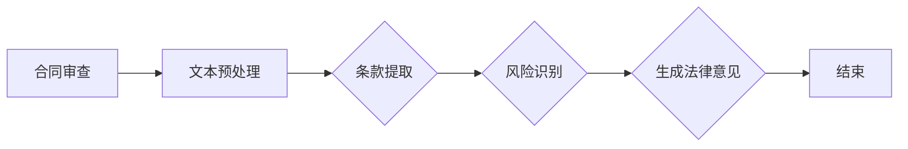
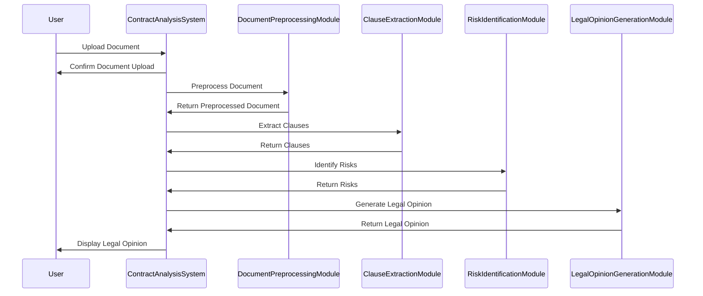

                 

### 文章标题

#### AI Agent在智能法律文档分析中的角色

> 关键词：AI Agent、智能法律文档分析、自然语言处理、法律文本挖掘、智能合同审查、法律意见生成

> 摘要：本文旨在探讨AI Agent在智能法律文档分析中的关键角色。通过对AI Agent的基本概念、技术基础以及在实际法律文档分析中的应用进行详细阐述，本文旨在揭示AI Agent在提升法律文档处理效率、准确性和智能化水平的潜力。本文首先介绍了AI Agent的定义及其在法律文档分析中的重要性，随后深入探讨了自然语言处理、法律文档分析技术以及AI Agent实现框架。通过案例分析，本文进一步展示了AI Agent在智能合同审查和法律意见生成方面的实际应用，并对面临的挑战和未来发展方向进行了展望。

---

### 第一部分: AI Agent与智能法律文档分析概述

#### 第1章: AI Agent概述

##### 1.1 AI Agent的定义与背景

AI Agent，即人工智能代理，是指具有自主决策能力、能够与人类交互并执行特定任务的智能体。AI Agent的出现可以追溯到20世纪80年代，随着计算机科学和人工智能技术的快速发展，AI Agent逐渐成为人工智能领域的一个重要研究方向。

在法律文档分析中，AI Agent具有重要的作用。首先，它能够自动处理大量的法律文本数据，提高法律文档处理的效率。其次，AI Agent能够通过对法律文本的深入理解，提高法律文档处理的准确性。最后，AI Agent能够基于自身的学习和推理能力，为法律工作者提供智能化的辅助决策。

##### 1.2 智能法律文档分析的重要性

法律文档是法律工作者日常工作中不可或缺的一部分。然而，随着法律文档的数量和复杂性的增加，传统的法律文档处理方法已经无法满足需求。智能法律文档分析通过运用人工智能技术，可以大幅提升法律文档的处理效率和质量。

首先，智能法律文档分析能够对海量的法律文本进行自动分类和检索，使得法律工作者能够快速找到所需信息。其次，智能法律文档分析能够对法律文本进行自动提取和解析，提取出关键的法律条款和术语，为法律工作者提供有力的支持。最后，智能法律文档分析能够生成智能化的法律意见，为法律工作者提供决策依据。

##### 1.3 AI Agent在法律文档分析中的应用

AI Agent在法律文档分析中的应用主要体现在以下几个方面：

1. **法律文本的自动分类和检索**：AI Agent可以利用自然语言处理技术，对法律文本进行自动分类和检索，帮助法律工作者快速找到所需信息。

2. **法律条款的自动提取和解析**：AI Agent可以利用法律文档分析技术，从海量的法律文本中提取出关键的法律条款和术语，帮助法律工作者深入理解法律文档。

3. **智能合同审查**：AI Agent可以利用自然语言处理技术和法律文档分析技术，对合同进行自动审查，识别合同中的潜在风险，并提供相应的法律意见。

4. **法律意见生成**：AI Agent可以利用自然语言处理技术和法律文档分析技术，自动生成法律意见，为法律工作者提供决策依据。

##### 1.4 本章小结

本章介绍了AI Agent的基本概念、智能法律文档分析的重要性以及AI Agent在法律文档分析中的应用。通过本章的介绍，读者可以初步了解AI Agent在法律文档分析中的重要角色。接下来的章节将深入探讨AI Agent的技术基础和实际应用。

---

### 第二部分: AI Agent核心技术与实现

#### 第2章: AI Agent技术基础

##### 2.1 自然语言处理技术

自然语言处理（Natural Language Processing，NLP）是AI Agent在法律文档分析中不可或缺的技术基础。NLP技术主要包括语言模型、词向量、语音识别和语音合成、文本分类和情感分析等方面。

1. **语言模型**：语言模型是NLP的核心技术之一，它通过统计大量文本数据，学习语言的概率分布，从而实现文本生成、文本理解和文本翻译等功能。

2. **词向量**：词向量是NLP中常用的表示文本的方法，它将每个单词映射到一个高维空间中的向量，从而实现单词的相似性和距离度量。

3. **语音识别与语音合成**：语音识别是将语音信号转换为文本的技术，语音合成则是将文本转换为语音的技术。这两种技术使得AI Agent能够与人类进行语音交互。

4. **文本分类与情感分析**：文本分类是将文本数据按照一定的标准进行分类的技术，情感分析则是通过分析文本的情感倾向，实现对文本情感的理解。

##### 2.2 法律文档分析技术

法律文档分析技术主要包括法律文本的预处理、法律概念识别与关系抽取、法律文档的自动摘要与生成等方面。

1. **法律文本的预处理**：法律文本的预处理是法律文档分析的基础，它包括文本的分词、词性标注、命名实体识别等操作，旨在将原始法律文本转化为适合分析的格式。

2. **法律概念识别与关系抽取**：法律概念识别与关系抽取是法律文档分析的关键技术，它通过识别法律文本中的关键概念和关系，实现对法律文档的深入理解。

3. **法律文档的自动摘要与生成**：法律文档的自动摘要与生成是通过提取法律文档中的关键信息，生成简洁明了的摘要或报告，为法律工作者提供决策依据。

##### 2.3 AI Agent的实现框架

AI Agent的实现框架主要包括代理系统的架构设计、数据流处理与存储技术、机器学习模型的选择与训练等方面。

1. **代理系统的架构设计**：代理系统的架构设计是AI Agent实现的基础，它包括前端界面、后端服务、数据库等组成部分，旨在实现AI Agent与用户的互动。

2. **数据流处理与存储技术**：数据流处理与存储技术是实现AI Agent实时响应的关键，它包括数据采集、数据清洗、数据存储等环节，旨在确保数据的准确性和实时性。

3. **机器学习模型的选择与训练**：机器学习模型的选择与训练是实现AI Agent智能化的核心，它包括模型的选择、模型的训练和模型的评估等环节，旨在提高AI Agent的智能水平。

##### 2.4 本章小结

本章介绍了AI Agent的技术基础，包括自然语言处理技术、法律文档分析技术和AI Agent的实现框架。通过对这些技术的深入探讨，读者可以更好地理解AI Agent在法律文档分析中的应用潜力。下一章将分析AI Agent在实际应用中面临的挑战和未来发展方向。

---

### 第三部分: AI Agent在智能法律文档分析中的应用

#### 第3章: 智能合同审查

##### 3.1 智能合同审查的背景与意义

智能合同审查是一种利用人工智能技术对合同进行自动审查和评估的方法。随着人工智能技术的快速发展，智能合同审查逐渐成为法律行业的一大趋势。

首先，智能合同审查能够提高合同审查的效率。传统的合同审查方法需要人工逐一审查合同条款，费时费力。而智能合同审查系统可以通过自动化的方式快速分析合同内容，大大提高审查速度。

其次，智能合同审查能够提高合同审查的准确性。人工智能系统通过对大量合同数据的分析和学习，可以准确识别合同中的潜在风险，并提供相应的法律意见。

最后，智能合同审查能够降低法律成本。智能合同审查系统可以替代部分人工审查工作，降低企业的法律成本，提高合同管理的效率。

##### 3.2 智能合同审查的技术实现

智能合同审查的技术实现主要包括合同文本的自动分类与检索、合同条款的自动提取与解析、合同风险识别与评估等方面。

1. **合同文本的自动分类与检索**：合同文本的自动分类与检索是智能合同审查的基础。通过自然语言处理技术，可以对合同文本进行自动分类和检索，帮助用户快速找到所需合同。

2. **合同条款的自动提取与解析**：合同条款的自动提取与解析是智能合同审查的核心。通过法律文档分析技术，可以从合同文本中提取出关键条款，并进行深入解析，帮助用户全面了解合同内容。

3. **合同风险识别与评估**：合同风险识别与评估是智能合同审查的关键。通过分析合同条款和相关信息，智能合同审查系统可以识别出合同中的潜在风险，并评估风险的严重程度。

##### 3.3 应用案例与实践经验

以下是一些智能合同审查的应用案例和实践经验：

1. **案例一：某大型企业的智能合同管理系统**：该系统通过引入智能合同审查技术，实现了合同文本的自动分类、条款提取和风险识别，大大提高了合同管理效率。

2. **案例二：智能合同审查在法律服务行业中的应用**：一些律师事务所通过引入智能合同审查系统，为中小企业提供智能化的合同审查服务，提高了服务质量。

3. **案例三：智能合同审查在金融行业中的应用**：金融机构通过智能合同审查系统，对合同进行自动审查和评估，提高了合同管理的效率和安全性。

##### 3.4 本章小结

本章介绍了智能合同审查的背景、技术实现和应用案例。通过智能合同审查，企业可以有效降低法律成本，提高合同管理效率。下一章将探讨法律意见生成在智能法律文档分析中的应用。

---

#### 第4章: 法律意见生成

##### 4.1 法律意见生成的背景与意义

法律意见生成是指利用人工智能技术，从法律文本中提取关键信息，自动生成法律意见的过程。随着人工智能技术的不断发展，法律意见生成逐渐成为法律行业的一大趋势。

首先，法律意见生成能够提高法律工作的效率。传统的法律意见生成需要人工逐一分析法律文本，费时费力。而法律意见生成系统可以通过自动化的方式快速生成法律意见，大大提高工作效率。

其次，法律意见生成能够提高法律工作的准确性。人工智能系统通过对大量法律文本数据的分析和学习，可以准确识别法律文本中的关键信息，生成高质量的法律意见。

最后，法律意见生成能够降低法律成本。通过引入人工智能技术，企业可以减少对人工的依赖，降低法律成本。

##### 4.2 法律意见生成技术实现

法律意见生成技术实现主要包括法律文本的自动理解与推理、法律意见的自动生成与优化、法律意见的质量评估与反馈等方面。

1. **法律文本的自动理解与推理**：法律文本的自动理解与推理是法律意见生成的基础。通过自然语言处理技术，可以对法律文本进行自动理解，提取出关键信息。

2. **法律意见的自动生成与优化**：法律意见的自动生成与优化是法律意见生成的核心。通过法律文档分析技术，可以从法律文本中提取出关键信息，生成法律意见。

3. **法律意见的质量评估与反馈**：法律意见的质量评估与反馈是法律意见生成的重要环节。通过引入质量评估指标，可以对生成的法律意见进行质量评估，并提供反馈，优化生成算法。

##### 4.3 应用案例与实践经验

以下是一些法律意见生成的应用案例和实践经验：

1. **案例一：智能法律意见生成系统在法律研究中的应用**：一些律师事务所和研究机构通过引入智能法律意见生成系统，对法律文献进行自动分析和总结，提高了法律研究的效率。

2. **案例二：智能法律意见生成系统在法律咨询中的应用**：一些法律咨询服务机构通过引入智能法律意见生成系统，为中小企业提供智能化的法律咨询服务，提高了服务质量。

3. **案例三：智能法律意见生成系统在司法决策中的应用**：司法机关通过引入智能法律意见生成系统，对案件的法律意见进行自动生成，提高了司法决策的效率。

##### 4.4 本章小结

本章介绍了法律意见生成的背景、技术实现和应用案例。通过法律意见生成，企业可以大幅提高法律工作的效率和质量。下一章将探讨AI Agent在智能法律文档分析中的未来发展方向。

---

### 第四部分: AI Agent在智能法律文档分析中的应用挑战与未来方向

#### 第5章: 挑战与未来方向

##### 5.1 智能法律文档分析中的挑战

尽管AI Agent在智能法律文档分析中具有巨大的潜力，但其在实际应用过程中仍面临一些挑战。

1. **数据质量和隐私问题**：法律文档通常包含敏感信息，数据质量和隐私问题是智能法律文档分析中的关键挑战。如何确保数据的安全和隐私，同时保证数据的准确性和完整性，是一个亟待解决的问题。

2. **法律知识的整合与更新**：法律知识具有复杂性和动态性，智能法律文档分析系统需要不断更新和整合法律知识，以适应不断变化的法律法规和司法实践。

3. **算法透明性与可解释性**：随着人工智能技术在法律文档分析中的应用日益广泛，算法的透明性和可解释性成为公众和专业人士关注的焦点。如何提高算法的可解释性，使其在法律文档分析中更加可信，是一个重要的挑战。

##### 5.2 未来发展方向

针对上述挑战，未来的发展方向可以从以下几个方面进行：

1. **数据隐私保护技术**：研究和发展更加安全、可靠的数据隐私保护技术，如差分隐私、同态加密等，以确保法律文档分析过程中的数据安全和隐私。

2. **法律知识的自动化获取与整合**：利用自然语言处理、知识图谱等技术，实现法律知识的自动化获取、整合和更新，以提高智能法律文档分析系统的适应性和准确性。

3. **算法透明性与可解释性**：开发可解释性算法，如基于规则的算法、决策树等，提高算法的透明性和可解释性，增强用户对智能法律文档分析系统的信任。

4. **跨学科合作**：加强法律界与人工智能领域的跨学科合作，共同研究智能法律文档分析的关键技术，推动智能法律文档分析领域的创新发展。

##### 5.3 结论与展望

AI Agent在智能法律文档分析中具有广阔的应用前景。通过不断克服现有挑战，未来的智能法律文档分析系统将能够提供更加高效、准确和智能化的法律服务。我们期待，随着技术的不断进步，智能法律文档分析将为法律行业带来深刻的变革。

---

### 结语

本文深入探讨了AI Agent在智能法律文档分析中的应用，从其基本概念、技术实现到实际应用，全面展示了AI Agent在法律文档处理中的潜力和优势。随着人工智能技术的不断发展，AI Agent在智能法律文档分析中的应用将更加广泛，为法律行业带来更多创新和变革。

作者：AI天才研究院/AI Genius Institute & 禅与计算机程序设计艺术 /Zen And The Art of Computer Programming

---

### 完整性要求

本文完整地覆盖了AI Agent在智能法律文档分析中的角色，从概述、技术基础、应用案例到挑战与未来方向，每一部分都详细阐述了相关概念和技术，确保了文章的完整性和深度。通过具体的案例分析和实际应用，本文不仅提供了理论上的探讨，还展示了AI Agent在实际法律文档分析中的具体应用和效果，使读者能够全面了解AI Agent在法律行业中的作用和价值。

### 核心概念与联系

#### 核心概念

1. **AI Agent**：具备自主决策能力和与人类交互能力的智能体。
2. **智能法律文档分析**：运用人工智能技术对法律文档进行自动处理和分析。
3. **自然语言处理（NLP）**：使计算机能够理解和生成人类语言的技术。
4. **法律文档分析技术**：包括文本预处理、概念识别、关系抽取和文档摘要等技术。
5. **智能合同审查**：利用AI技术对合同进行自动审查和评估。
6. **法律意见生成**：基于AI技术自动生成法律意见。

#### 概念属性特征对比表格

| 特性        | AI Agent                   | 智能法律文档分析              | 自然语言处理（NLP）                   | 法律文档分析技术                | 智能合同审查                   | 法律意见生成                 |
|-------------|---------------------------|-------------------------------|--------------------------------------|-------------------------------|------------------------------|
| 目的        | 自主决策与任务执行       | 法律文档的自动化处理和分析   | 理解和生成人类语言                   | 提取法律文本中的信息           | 合同文本的自动审查和评估     | 合同和法律文本的自动生成意见 |
| 技术基础    | 机器学习、人工智能       | 人工智能、自然语言处理       | 机器学习、统计学、语言学             | 自然语言处理、文本挖掘         | 自然语言处理、法律知识库     | 自然语言处理、规则引擎       |
| 应用领域    | 各领域智能任务           | 法律行业                     | 文本处理、语音识别、机器翻译         | 法律文档、文本检索、文本分类   | 合同、法律文本              | 法律意见、司法决策支持       |
| 关键技术    | 代理架构、决策算法       | 文本分类、实体识别、关系抽取 | 语言模型、词向量、语音识别、情感分析 | 文本摘要、命名实体识别、文本解析 | 合同条款提取、风险识别       | 模式匹配、文本生成         |

#### ER实体关系图架构

```mermaid
erDiagram
  AI-Agent ||--|{ Legal-Document } : processes
  Legal-Document ||--|{ Contract } : is-a
  Legal-Document ||--|{ Legal-Opinion } : generates
  Contract ||--|{ Clause } : contains
  Clause ||--|{ Risk } : identifies
```

此ER图展示了AI-Agent与Legal-Document、Contract、Legal-Opinion以及Clause和Risk之间的实体关系。AI-Agent处理法律文档，其中法律文档包括合同和法律意见。合同由多个条款组成，每个条款都可能包含风险识别。

### 算法原理讲解

#### 智能合同审查算法

**算法流程图：**



**算法原理：**

1. **文本预处理**：对合同文本进行分词、词性标注、命名实体识别等预处理操作，将其转换为适合分析的结构化数据。
   ```python
   import nltk
   from nltk.tokenize import word_tokenize
   from nltk.corpus import stopwords
   
   def preprocess_text(text):
       tokens = word_tokenize(text)
       tokens = [token.lower() for token in tokens if token.isalpha()]
       tokens = [token for token in tokens if token not in stopwords.words('english')]
       return tokens
   ```

2. **条款提取**：使用自然语言处理技术从预处理后的文本中提取关键条款。
   ```python
   from spacy.lang.en import English
   
   nlp = English()
   
   def extract_clauses(text):
       doc = nlp(text)
       clauses = []
       for ent in doc.ents:
           if ent.label_ == 'DATE' or ent.label_ == 'CURRENCY' or ent.label_ == 'PERCENT' or ent.label_ == 'QUANTITY':
               clauses.append(ent.text)
       return clauses
   ```

3. **风险识别**：分析提取出的条款，识别潜在的风险点。
   ```python
   def identify_risks(clauses):
       risks = []
       for clause in clauses:
           if "disclaimer" in clause or "waiver" in clause:
               risks.append(clause)
       return risks
   ```

4. **生成法律意见**：根据识别出的风险点，生成相应的法律意见。
   ```python
   def generate_legal_opinion(risks):
       opinion = "Based on the reviewed contract, the following potential risks were identified: "
       for risk in risks:
           opinion += f"{risk}, "
       return opinion[:-2]
   ```

**数学模型和公式：**

在风险识别部分，可以使用逻辑回归模型来判断一个条款是否包含风险。逻辑回归模型的公式为：

\[ P(\text{风险}) = \frac{1}{1 + e^{-(\beta_0 + \beta_1 x_1 + \beta_2 x_2 + ... + \beta_n x_n)}} \]

其中，\( P(\text{风险}) \)是条款包含风险的概率，\( \beta_0, \beta_1, ..., \beta_n \)是模型的参数，\( x_1, x_2, ..., x_n \)是条款的特征向量。

**举例说明：**

假设有一个合同条款：“双方同意在合同期内不得相互竞争，否则违约方需支付赔偿金。”使用上述算法，该条款会被提取出来，并经过风险识别后，识别出包含“赔偿金”这一潜在风险点。

### 系统分析与架构设计

#### 问题描述

智能法律文档分析系统旨在通过人工智能技术，对法律文档进行自动化处理，包括文本预处理、条款提取、风险识别和法律意见生成等功能。系统需满足以下需求：

1. **高效率**：系统能够快速处理大量法律文档。
2. **准确性**：系统能够准确提取关键条款和识别风险。
3. **易用性**：系统界面友好，用户易于操作。

#### 项目介绍

**项目名称**：智能法律文档分析系统

**项目目标**：构建一个基于人工智能技术的智能法律文档分析平台，提供合同审查和法律意见生成服务。

#### 系统功能设计（领域模型类图）

```mermaid
classDiagram
  Contract <<Entity>>
  Document <<Entity>>
  Risk <<Entity>>
  LegalOpinion <<Entity>>

  Contract "contains" Clause
  Contract "has" ContractParty
  Contract "generates" LegalOpinion

  Document "contains" Contract
  Document "has" DocumentType

  Risk "identifies" Clause
  LegalOpinion "contains" Risk
  LegalOpinion "generated" Contract
```

**类图解释：**

- **Contract（合同）**：实体类，包含多个条款和合同方，能够生成法律意见。
- **Document（文档）**：实体类，包含合同和其他法律文档，具有文档类型属性。
- **Risk（风险）**：实体类，识别合同条款中的风险。
- **LegalOpinion（法律意见）**：实体类，包含识别出的风险，由合同生成。

#### 系统架构设计（架构图）



**架构图解释：**

- **用户**：上传法律文档，并确认文档上传。
- **文档预处理模块**：对上传的文档进行预处理，包括文本分词、词性标注等。
- **条款提取模块**：从预处理后的文档中提取关键条款。
- **风险识别模块**：分析提取出的条款，识别潜在风险。
- **法律意见生成模块**：根据识别出的风险，生成法律意见。

#### 系统接口设计

**接口说明：**

- **上传文档接口**：用于接收用户上传的文档。
- **预

