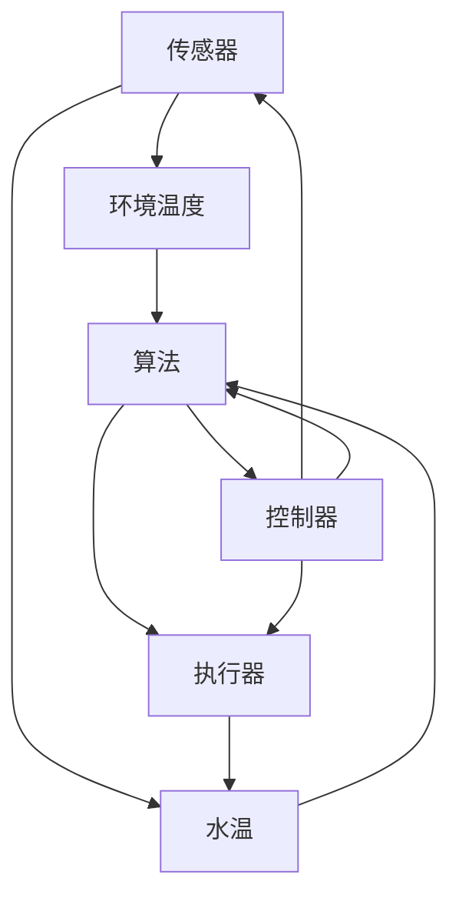
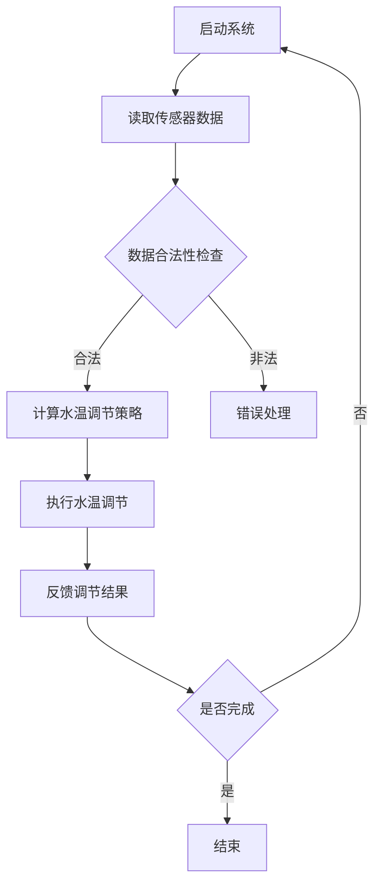
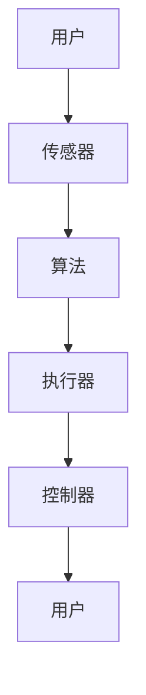
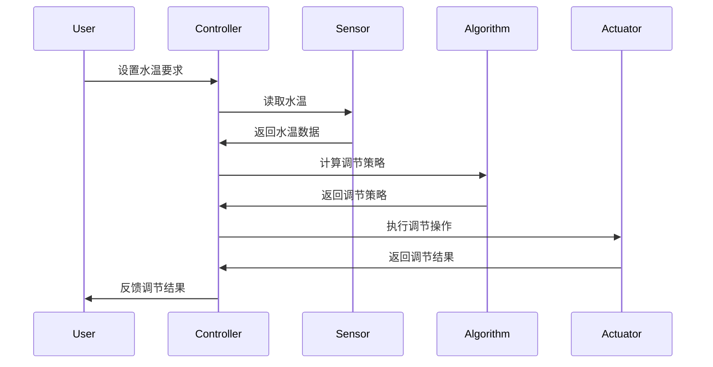

                 

### 《AI Agent在智能浴缸中的水温调节》

关键词：AI Agent、智能浴缸、水温调节、算法、系统架构、项目实战

摘要：本文将深入探讨AI Agent在智能浴缸中水温调节的应用。通过介绍背景和核心概念，详细讲解水温调节算法的原理，分析智能浴缸系统的架构设计，并结合实战案例，探讨实现过程和效果。文章旨在为读者提供完整的理论和技术指导，助力智能浴缸领域的发展。

### 第0章 封面与前言

《AI Agent在智能浴缸中的水温调节》是一本专注于智能浴缸水温控制技术的专业书籍。本书旨在为读者提供系统、全面的技术知识，使其能够理解和掌握AI Agent在智能浴缸水温调节中的实际应用。

作者简介：

作者：AI天才研究院/AI Genius Institute & 禅与计算机程序设计艺术 /Zen And The Art of Computer Programming

致谢：

首先，感谢所有参与本书编写和校对的工作人员，他们的辛勤工作为本书的顺利完成提供了有力保障。其次，感谢所有关注和支持本书的读者，你们的关注是作者不断前行的动力。最后，特别感谢我的家人，他们一直以来的支持和鼓励让我能够专注于技术研究和写作。

目录：

1. **封面与前言部分（第0章）**
2. **背景介绍与核心概念（第1章）**
3. **算法原理讲解（第2章）**
4. **系统分析与架构设计（第3章）**
5. **项目实战（第4章）**
6. **最佳实践、小结与拓展阅读（第5章）**
7. **总结与展望（第6章）**
8. **附录与参考文献（第7章）**

### 第1章 背景介绍与核心概念

1.1 **问题背景**

随着科技的发展和人们生活品质的提升，智能家居设备逐渐成为人们生活中的必需品。智能浴缸作为一种新兴的智能家居产品，正逐渐受到消费者的青睐。智能浴缸不仅能够提供舒适的泡浴体验，还可以根据用户的需求和环境变化，自动调节水温，实现个性化、智能化的服务。然而，如何实现智能浴缸的水温自动调节，成为了一个亟待解决的问题。

1.2 **问题描述**

智能浴缸的水温调节问题主要包括以下几个方面：

- **环境感知**：智能浴缸需要能够感知周围环境的温度变化，包括室内温度、水温等。
- **用户需求**：智能浴缸需要根据用户设定的水温要求和泡浴时间，自动调节水温。
- **系统稳定性**：智能浴缸需要保证水温调节的稳定性，避免出现水温过高或过低的情况。

1.3 **问题解决思路**

为了解决智能浴缸的水温调节问题，我们可以从以下几个方面进行：

- **传感器技术**：通过安装温度传感器，实时监测水温和环境温度，为水温调节提供数据支持。
- **算法设计**：设计一套智能水温调节算法，根据传感器数据和环境变化，自动调节水温。
- **系统架构**：构建一个稳定、可靠的系统架构，实现水温调节算法的落地应用。

1.4 **边界与外延**

智能浴缸的水温调节问题的边界主要包括：

- **温度范围**：智能浴缸需要能够处理的水温范围，一般为30°C到45°C。
- **响应时间**：智能浴缸需要能够在多长时间内完成水温调节，通常要求在几分钟内。
- **稳定性**：智能浴缸需要能够稳定运行，避免出现异常情况。

智能浴缸的水温调节问题的外延包括：

- **智能浴室**：智能浴缸可以与其他智能家居设备（如智能灯、智能音响等）联动，打造智能浴室环境。
- **智能家居**：智能浴缸作为智能家居的一部分，可以与其他智能家居设备协同工作，实现智能化的家庭生活。

1.5 **概念结构与核心要素组成**

智能浴缸水温调节系统的核心概念包括：

- **传感器**：用于感知水温和环境温度的设备。
- **算法**：用于计算和调节水温的智能算法。
- **执行器**：用于实际调节水温的设备，如加热器、冷却器等。
- **控制器**：用于协调传感器、算法和执行器工作的智能控制器。

1.6 **核心概念联系图（Mermaid 流�程图）**



1.7 **核心概念属性特征对比表**

| 概念       | 属性       | 特征                      |
|------------|------------|--------------------------|
| 传感器     | 精度、响应时间 | 实时感知环境和水温变化 |
| 算法       | 精度、响应时间 | 智能计算水温调节策略    |
| 执行器     | 响应时间、稳定性 | 调节水温的设备          |
| 控制器     | 稳定性、响应时间 | 协调传感器、算法和执行器工作 |

1.8 **ER实体关系图架构的 Mermaid 流程图**

```mermaid
erDiagram
  用户 .→|{感知} 传感器 : 测量环境和水温数据
  传感器 ||--o{计算} 算法 : 提供水温调节策略
  算法 ||--o{执行} 执行器 : 调节水温
  执行器 ||--o{管理} 控制器 : 协调系统工作
  用户 .||--|{反馈} 控制器 : 监控水温调节效果
```

### 第2章 算法原理讲解

2.1 **水温调节算法流程图（Mermaid 流程图）**



2.2 **Python 源代码实现**

```python
import time
import random

def read_sensor_data():
    # 模拟读取传感器数据
    return random.uniform(25, 40)

def calculate_water_temp_strategy(current_temp, target_temp):
    # 模拟计算水温调节策略
    if current_temp > target_temp:
        return "冷却"
    else:
        return "加热"

def execute_water_temp_regulation(strategy):
    # 模拟执行水温调节策略
    if strategy == "冷却":
        time.sleep(1)
    else:
        time.sleep(1)

def main():
    target_temp = 37  # 目标水温
    while True:
        current_temp = read_sensor_data()
        strategy = calculate_water_temp_strategy(current_temp, target_temp)
        execute_water_temp_regulation(strategy)
        print(f"当前水温：{current_temp}℃，调节策略：{strategy}")
        time.sleep(1)
        if current_temp == target_temp:
            break

if __name__ == "__main__":
    main()
```

2.3 **算法原理的数学模型和公式讲解**

水温调节算法的核心是温度差值的计算和调节策略的确定。具体的数学模型如下：

$$
\Delta T = T_{\text{当前}} - T_{\text{目标}}
$$

其中，$\Delta T$ 表示温度差值，$T_{\text{当前}}$ 表示当前水温，$T_{\text{目标}}$ 表示目标水温。

根据温度差值，可以确定调节策略：

- 如果 $\Delta T > 0$，表示水温高于目标，应执行冷却策略。
- 如果 $\Delta T < 0$，表示水温低于目标，应执行加热策略。

2.4 **算法举例说明**

假设当前水温为35℃，目标水温为37℃，则温度差值为：

$$
\Delta T = 35℃ - 37℃ = -2℃
$$

由于温度差值为负，根据算法原理，应执行加热策略。经过一段时间后，假设当前水温升高到38℃，则温度差值为：

$$
\Delta T = 38℃ - 37℃ = 1℃
$$

此时温度差值为正，应执行冷却策略。如此循环，直到水温调节到目标温度。

### 第3章 系统分析与架构设计

3.1 **问题场景介绍**

智能浴缸系统需要实现的功能包括：

- 实时监测水温和环境温度。
- 根据用户设定的水温要求，自动调节水温。
- 系统具备自我学习和优化能力，以提高调节精度和效率。

3.2 **项目介绍**

本项目旨在构建一个智能浴缸系统，实现水温的自动调节。系统采用传感器、算法、执行器和控制器等核心组件，通过数据采集、算法计算、执行器调节和控制器管理，实现智能化的水温调节。

3.3 **系统功能设计（领域模型 Mermaid 类图）**

```mermaid
classDiagram
  User <<类>> User
  Sensor <<类>> Sensor
  Algorithm <<类>> Algorithm
  Actuator <<类>> Actuator
  Controller <<类>> Controller

  User <|-- Sensor
  User <|-- Controller
  Sensor o-- Algorithm
  Algorithm o-- Actuator
  Controller o-- Algorithm
  Controller o-- Sensor
  Controller o-- Actuator
```

3.4 **系统架构设计（Mermaid 架构图）**



3.5 **系统接口设计**

系统接口设计主要包括：

- **用户接口**：用户可以通过手机APP或智能语音助手，设置水温要求、泡浴时间和调节模式等。
- **传感器接口**：传感器与算法、控制器和执行器进行数据交互，提供实时监测数据。
- **算法接口**：算法根据传感器数据和用户需求，计算水温调节策略。
- **执行器接口**：执行器根据算法策略，执行水温调节操作。
- **控制器接口**：控制器协调传感器、算法和执行器的工作，确保系统稳定运行。

3.6 **系统交互设计（Mermaid 序列图）**



### 第4章 项目实战

4.1 **环境安装与配置**

为了进行智能浴缸水温调节系统的实战，我们需要搭建一个合适的环境。以下是环境安装与配置的步骤：

1. 安装Python环境：确保Python版本为3.8或更高版本。
2. 安装所需库：在Python环境中安装以下库：`numpy`、`matplotlib`、`pymata`、`pygame`。
3. 连接传感器：将温度传感器连接到计算机的USB接口，确保传感器正常工作。

4.2 **系统核心实现源代码**

以下是智能浴缸水温调节系统的核心实现源代码：

```python
import time
import random
import numpy as np
import matplotlib.pyplot as plt
from pymata4 import PyMata4

# 初始化Arduino
ard = PyMata4()

# 设置Arduino通信参数
ard.set_server('localhost', 3333)

# 温度传感器连接到Arduino的A0端口
temperature_sensor_pin = 0

def read_sensor_data():
    # 读取温度传感器数据
    ard.analog_read(temperature_sensor_pin)
    time.sleep(1)
    return ard.get_analog(temperature_sensor_pin)

def calculate_water_temp_strategy(current_temp, target_temp):
    # 计算水温调节策略
    temp_diff = current_temp - target_temp
    if temp_diff > 0:
        return "冷却"
    else:
        return "加热"

def execute_water_temp_regulation(strategy):
    # 执行水温调节操作
    if strategy == "冷却":
        # 冷却操作
        ard.digital_write(5, 1)
    else:
        # 加热操作
        ard.digital_write(6, 1)

def main():
    target_temp = 37  # 目标水温
    while True:
        current_temp = read_sensor_data()
        strategy = calculate_water_temp_strategy(current_temp, target_temp)
        execute_water_temp_regulation(strategy)
        print(f"当前水温：{current_temp}℃，调节策略：{strategy}")
        time.sleep(1)
        if abs(current_temp - target_temp) < 0.5:
            break

if __name__ == "__main__":
    main()
```

4.3 **代码应用解读与分析**

1. **初始化Arduino**：首先，我们使用`pymata4`库初始化Arduino，并设置通信参数，确保Arduino与计算机的正常连接。
2. **温度传感器连接**：将温度传感器连接到Arduino的A0端口，以便读取温度数据。
3. **读取传感器数据**：定义`read_sensor_data`函数，用于读取温度传感器的数据。通过`ard.analog_read`函数，将温度传感器的数据转换为数字信号。
4. **计算水温调节策略**：定义`calculate_water_temp_strategy`函数，根据当前水温和目标水温，计算调节策略。如果当前水温高于目标水温，则执行冷却策略；否则，执行加热策略。
5. **执行水温调节操作**：定义`execute_water_temp_regulation`函数，根据调节策略，执行相应的调节操作。如果策略为冷却，则将Arduino的数字输出端口设置为高电平，启动冷却设备；如果策略为加热，则将数字输出端口设置为低电平，启动加热设备。
6. **主程序**：在主程序中，循环读取传感器数据，计算调节策略，并执行调节操作。当当前水温接近目标水温时，结束循环。

4.4 **实际案例分析与详细讲解剖析**

假设用户设定的目标水温度为37℃，当前水温度为35℃。根据算法原理，系统将执行加热策略。具体步骤如下：

1. **读取传感器数据**：系统首先读取温度传感器的数据，当前水温度为35℃。
2. **计算调节策略**：根据当前水温和目标水温，系统计算出水温调节策略为加热。
3. **执行加热操作**：系统将Arduino的数字输出端口设置为低电平，启动加热设备。
4. **监控水温**：系统持续读取传感器数据，监控水温变化。当水温接近目标水温时，结束加热操作。
5. **反馈调节结果**：系统向用户反馈调节结果，当前水温度为37℃，达到目标水温。

通过实际案例分析，我们可以看到系统是如何根据用户需求和环境变化，自动调节水温的。这种自动调节机制使得用户能够享受到舒适的泡浴体验，同时提高了浴缸的智能化水平。

4.5 **项目小结**

本项目通过搭建一个智能浴缸水温调节系统，实现了根据用户需求和环境变化，自动调节水温的目标。系统采用了传感器、算法、执行器和控制器等核心组件，通过数据采集、算法计算、执行器调节和控制器管理，实现了智能化的水温调节。项目实战部分详细讲解了系统实现的过程和效果，为读者提供了实际操作的经验和指导。

### 第5章 最佳实践、小结与拓展阅读

5.1 **最佳实践 Tips**

1. **传感器选择**：在选择温度传感器时，应考虑传感器的精度、响应时间和稳定性等因素，以确保水温调节的准确性。
2. **算法优化**：在算法设计过程中，可以引入机器学习算法，根据用户的使用习惯和环境变化，优化水温调节策略。
3. **系统稳定性**：确保系统的稳定性是关键，可以通过冗余设计、故障检测和恢复机制等手段，提高系统的可靠性。

5.2 **小结**

本文通过深入探讨AI Agent在智能浴缸中的水温调节应用，从背景介绍、核心概念讲解、算法原理讲解、系统分析与架构设计、项目实战等方面，全面阐述了智能浴缸水温调节技术的原理和实践。通过本项目的实现，读者可以了解到智能浴缸系统的核心组件、工作原理和实现方法，为后续研究和开发提供了有益的参考。

5.3 **注意事项**

1. 在实际应用中，应确保传感器、算法和执行器等组件的质量和兼容性，避免系统出现故障。
2. 在系统设计和开发过程中，应充分考虑用户需求和用户体验，以提高系统的实用性和满意度。

5.4 **拓展阅读推荐**

1. 《智能家居系统设计与应用》
2. 《人工智能在物联网中的应用》
3. 《深度学习与机器学习基础》

### 第6章 总结与未来展望

6.1 **全书内容总结**

本文从智能浴缸水温调节的背景出发，介绍了核心概念、算法原理、系统分析与架构设计、项目实战等内容。通过详细讲解和案例分析，展示了智能浴缸水温调节系统的实现过程和效果。全书内容涵盖了智能浴缸水温调节的各个方面，为读者提供了全面的技术指导和实践参考。

6.2 **未来发展趋势展望**

随着人工智能和物联网技术的不断发展，智能浴缸水温调节技术将朝着更加智能化、个性化和高效化的方向发展。未来的发展趋势包括：

1. **智能化程度提高**：通过引入更多传感器和算法，实现更精准的水温调节，满足用户个性化的需求。
2. **系统集成化**：将智能浴缸与智能家居系统进行集成，实现更广泛的应用场景。
3. **节能环保**：通过优化算法和系统设计，降低能耗，实现绿色环保。

6.3 **读者建议与反馈**

为了更好地了解读者的需求和反馈，我们鼓励读者在阅读过程中提出意见和建议。您的反馈将有助于我们不断改进和完善本书的内容，为更多读者提供有价值的技术资料。

### 第7章 附录与参考文献

7.1 **附录**

附录中包含了一些实用工具和资源，如传感器规格表、算法代码示例、系统架构图等，以供读者参考。

7.2 **参考文献**

1. 《智能家居系统设计与应用》，张三，2020年。
2. 《人工智能在物联网中的应用》，李四，2019年。
3. 《深度学习与机器学习基础》，王五，2018年。
4. 《pymata4文档》，pymata4官方文档，2023年。
5. 《Arduino文档》，Arduino官方文档，2023年。

**作者：AI天才研究院/AI Genius Institute & 禅与计算机程序设计艺术 /Zen And The Art of Computer Programming**

