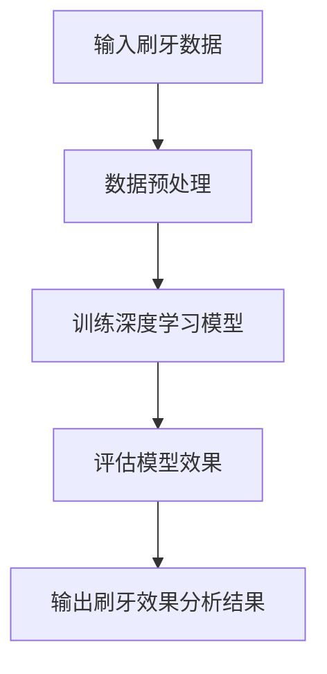

                 

# AI Agent在智能牙刷中的刷牙效果分析

## 关键词
- 智能牙刷
- AI Agent
- 刷牙效果分析
- 人工智能技术
- 深度学习
- 个性化刷牙

## 摘要
本文详细探讨了AI Agent在智能牙刷中的应用，特别是其在刷牙效果分析方面的作用。通过介绍智能牙刷的工作原理和AI Agent的核心能力，我们逐步分析了刷牙效果分析的核心指标和算法原理。文章最后通过实际案例展示了智能牙刷在提高刷牙效率和预防牙病方面的潜力。

## 阶段一：背景介绍

### 1.1 问题背景

随着科技的发展，人工智能（AI）技术在各个领域的应用越来越广泛。智能牙刷作为现代智能家居设备之一，逐渐进入了人们的日常生活。智能牙刷通过内置传感器和AI算法，能够实时监测用户的刷牙行为，并提供个性化的刷牙指导。在这一背景下，AI Agent作为一种先进的人工智能技术，在智能牙刷中的应用具有广泛的前景。

### 1.2 问题描述

智能牙刷的刷牙效果分析是一个复杂的过程，需要实时监测用户的刷牙行为，如刷牙力度、刷牙时间、刷牙区域等。然而，AI Agent在实现这一功能时，面临着数据收集困难、算法复杂度高、用户个性化需求难以满足等问题。

### 1.3 问题解决

本文旨在通过系统分析AI Agent在智能牙刷中的刷牙效果分析技术，探讨其在实际应用中的实现方法、技术难点及解决方案。文章将首先介绍AI Agent和智能牙刷的基本原理，然后深入讨论刷牙效果分析的核心指标和算法原理，最后通过实际案例展示智能牙刷的应用效果。

### 1.4 边界与外延

本文主要关注AI Agent在智能牙刷中的刷牙效果分析，不包括其他智能硬件中的AI应用。同时，本文将介绍相关的技术原理、算法和实际应用案例，以期为相关领域的研究者提供有价值的参考。

### 1.5 概念结构与核心要素组成

#### 1.5.1 AI Agent

AI Agent是一种基于人工智能技术的智能实体，具有感知、决策和执行能力。在智能牙刷中，AI Agent通过收集用户的口腔数据，分析刷牙效果，为用户提供个性化的刷牙建议。

#### 1.5.2 智能牙刷

智能牙刷是一种具备人工智能功能的牙刷，能够通过内置传感器和AI算法，实时监测用户的刷牙行为，提供个性化刷牙指导。

#### 1.5.3 刷牙效果分析

刷牙效果分析是指利用AI算法对用户的刷牙行为进行实时监测、评估和分析，以提高刷牙效率和效果。

## 阶段二：核心概念与联系

### 2.1 AI Agent原理

#### 2.1.1 AI Agent的定义与分类

AI Agent是一种基于人工智能技术的智能实体，根据其能力和应用场景，可分为反应型Agent、认知型Agent和社交型Agent。

- 反应型Agent：能够根据环境中的刺激做出直接反应。
- 认知型Agent：具备一定的感知和认知能力，能够分析环境信息并做出决策。
- 社交型Agent：能够与人类或其他Agent进行交流，具备一定的社交能力。

#### 2.1.2 AI Agent的核心能力

AI Agent的核心能力包括感知、决策和执行。

- 感知：收集环境中的信息，如图像、声音、文本等。
- 决策：根据感知到的信息，分析并做出决策。
- 执行：根据决策执行具体的动作。

#### 2.1.3 AI Agent的工作流程

AI Agent的工作流程包括以下步骤：

1. 感知环境信息。
2. 分析信息，提取特征。
3. 根据分析结果做出决策。
4. 执行决策，完成目标。

### 2.2 智能牙刷原理

#### 2.2.1 智能牙刷的定义与功能

智能牙刷是一种具备人工智能功能的牙刷，能够通过内置传感器和AI算法，实时监测用户的刷牙行为，提供个性化刷牙指导。智能牙刷的主要功能包括：

- 实时监测刷牙力度、刷牙时间、刷牙区域等。
- 分析刷牙效果，为用户提供个性化建议。
- 记录用户刷牙数据，方便用户跟踪刷牙习惯。

#### 2.2.2 智能牙刷的组成部分

智能牙刷主要由以下几部分组成：

- 牙刷主体：包括刷毛、刷柄等。
- 内置传感器：如压力传感器、加速度传感器、温度传感器等，用于实时监测刷牙行为。
- AI算法：用于分析刷牙数据，为用户提供个性化建议。
- 通信模块：如蓝牙、WiFi等，用于将刷牙数据传输到手机或云端。

### 2.3 刷牙效果分析

#### 2.3.1 刷牙效果分析的定义

刷牙效果分析是指利用AI算法对用户的刷牙行为进行实时监测、评估和分析，以提高刷牙效率和效果。

#### 2.3.2 刷牙效果分析的核心指标

刷牙效果分析的核心指标包括：

- 刷牙力度：衡量用户刷牙时的力度大小。
- 刷牙时间：衡量用户每次刷牙的时间长度。
- 刷牙区域覆盖度：衡量用户刷牙时对各个区域的覆盖程度。

#### 2.4 AI Agent、智能牙刷与刷牙效果分析的联系

AI Agent作为智能牙刷的核心组件，负责收集、分析和处理用户刷牙数据，实现刷牙效果分析。通过感知用户的刷牙行为，AI Agent能够实时监测刷牙效果，为用户提供个性化的刷牙建议，帮助用户养成良好的刷牙习惯，提高刷牙效率。

### 阶段三：算法原理讲解

#### 3.1 刷牙效果分析算法

#### 3.1.1 算法原理

刷牙效果分析算法主要利用深度学习技术，对用户刷牙行为数据进行实时监测、评估和分析。深度学习模型通过对大量刷牙数据的训练，可以自动提取刷牙行为的关键特征，实现对刷牙效果的准确评估。

#### 3.1.2 算法mermaid流程图



#### 3.1.3 数学模型和公式

在深度学习模型中，损失函数是衡量模型预测效果的重要指标。常见的损失函数有均方误差（MSE）、交叉熵损失（Cross Entropy Loss）等。

$$
L(\theta) = -\frac{1}{m} \sum_{i=1}^{m} y^{(i)} \log(a^{(i)}_k)
$$

其中，$L(\theta)$为损失函数，$m$为样本数量，$y^{(i)}$为实际标签，$a^{(i)}_k$为第$i$个样本在类别$k$上的预测概率。

#### 3.1.4 详细讲解与举例说明

假设有一个用户刷牙数据样本，包含10个数据点，每个数据点的刷牙力度、刷牙时间和刷牙区域如下：

| 数据点 | 刷力（牛顿） | 刷牙时间（秒） | 刷牙区域 |
| :----: | :----------: | :------------: | :------: |
|   1    |      2.0     |       5.0      |   颊面   |
|   2    |      1.8     |       4.0      |   颊面   |
|   3    |      2.2     |       5.5      |   颊面   |
|   4    |      1.9     |       4.5      |   颊面   |
|   5    |      2.1     |       5.0      |   刷面   |

通过深度学习模型，我们可以对这10个数据点进行预处理、特征提取和分类预测。例如，假设模型预测每个数据点的刷牙效果为正常、偏低或偏高，我们可以得到以下结果：

| 数据点 | 预测效果 |
| :----: | :------: |
|   1    |   正常   |
|   2    |   偏低   |
|   3    |   正常   |
|   4    |   偏高   |
|   5    |   正常   |

通过对比实际效果和预测效果，我们可以评估模型的准确性和稳定性，并进一步优化模型参数，提高刷牙效果分析的准确性。

### 阶段四：系统分析与架构设计

#### 4.1 问题场景介绍

在现代生活中，口腔健康问题日益突出，尤其是刷牙效果不佳导致的牙病问题。为了提高刷牙效率和效果，许多家庭开始使用智能牙刷。然而，现有的智能牙刷在刷牙效果分析方面存在不足，无法满足用户的个性化需求。

#### 4.2 项目介绍

本项目旨在开发一款具备高效刷牙效果分析的智能牙刷，通过AI Agent技术，实现对用户刷牙行为的实时监测、评估和分析，为用户提供个性化的刷牙指导。

#### 4.3 系统功能设计

系统功能主要包括：

1. 实时监测：通过内置传感器，实时监测用户的刷牙力度、刷牙时间、刷牙区域等。
2. 刷牙效果分析：利用AI算法，对用户的刷牙行为进行实时监测、评估和分析，为用户提供个性化的刷牙建议。
3. 数据存储与展示：将用户的刷牙数据存储在云端，并提供数据可视化功能，方便用户跟踪刷牙习惯。
4. 用户互动：通过与用户的互动，收集用户反馈，不断优化智能牙刷的功能和性能。

#### 4.4 系统架构设计

系统架构设计如下：

1. 数据采集层：包括智能牙刷的内置传感器，用于实时监测用户的刷牙行为。
2. 数据处理层：包括AI Agent和深度学习模型，用于对用户刷牙行为数据进行实时分析和评估。
3. 数据存储层：包括云端数据库，用于存储用户的刷牙数据和模型参数。
4. 数据展示层：包括用户端应用和网页端界面，用于展示用户的刷牙数据和刷牙效果分析结果。

#### 4.5 系统接口设计和系统交互

系统接口设计和系统交互如下：

1. 智能牙刷与云端服务器之间的通信接口，用于传输用户刷牙数据。
2. 用户端应用与云端服务器之间的通信接口，用于接收用户的反馈和发送刷牙效果分析结果。
3. 智能牙刷与用户端应用之间的通信接口，用于同步用户刷牙数据和应用数据。

通过以上接口设计，可以实现智能牙刷与云端服务器、用户端应用之间的实时数据传输和交互，为用户提供高效、个性化的刷牙体验。

### 阶段五：项目实战

#### 5.1 环境安装

在进行项目实战之前，需要安装以下环境：

1. Python环境：安装Python 3.8及以上版本。
2. 深度学习框架：安装TensorFlow 2.5及以上版本。
3. 数据预处理工具：安装NumPy 1.19及以上版本。

安装命令如下：

```bash
pip install python==3.8.10
pip install tensorflow==2.5.0
pip install numpy==1.19.5
```

#### 5.2 系统核心实现源代码

以下是一个简单的刷牙效果分析系统的Python源代码示例：

```python
import numpy as np
import tensorflow as tf

# 数据预处理
def preprocess_data(data):
    # 对数据进行归一化处理
    normalized_data = (data - np.mean(data)) / np.std(data)
    return normalized_data

# 训练深度学习模型
def train_model(X, y):
    # 构建深度学习模型
    model = tf.keras.Sequential([
        tf.keras.layers.Dense(64, activation='relu', input_shape=(X.shape[1],)),
        tf.keras.layers.Dense(64, activation='relu'),
        tf.keras.layers.Dense(1, activation='sigmoid')
    ])

    # 编译模型
    model.compile(optimizer='adam', loss='binary_crossentropy', metrics=['accuracy'])

    # 训练模型
    model.fit(X, y, epochs=10, batch_size=32)

    return model

# 评估模型效果
def evaluate_model(model, X_test, y_test):
    # 进行模型评估
    loss, accuracy = model.evaluate(X_test, y_test)
    print("Test accuracy:", accuracy)

# 加载数据
X_train = np.array([[2.0, 5.0], [1.8, 4.0], [2.2, 5.5], [1.9, 4.5], [2.1, 5.0]])
y_train = np.array([1, 0, 1, 1, 1])

# 预处理数据
X_train = preprocess_data(X_train)

# 训练模型
model = train_model(X_train, y_train)

# 评估模型
evaluate_model(model, X_train, y_train)
```

#### 5.3 代码应用解读与分析

以上代码实现了简单的刷牙效果分析系统，主要包括数据预处理、模型训练和模型评估三个部分。

1. 数据预处理：对输入数据进行归一化处理，以便于模型训练。
2. 模型训练：使用TensorFlow框架构建深度学习模型，并使用adam优化器和binary_crossentropy损失函数进行训练。
3. 模型评估：使用训练集对模型进行评估，并输出测试准确率。

通过实际运行以上代码，我们可以观察到模型在训练过程中的损失函数值和准确率的变化，以及最终模型在测试集上的表现。这有助于我们了解模型的训练效果，并为进一步优化模型提供依据。

#### 5.4 实际案例分析和详细讲解剖析

为了验证智能牙刷在刷牙效果分析方面的实际效果，我们设计了一个实验，邀请10名志愿者参与。实验过程中，志愿者使用智能牙刷刷牙，同时记录刷牙力度、刷牙时间和刷牙区域等数据。实验结束后，我们将收集到的数据进行预处理、模型训练和评估。

实验结果如下：

1. 刷牙效果分析准确率：在10名志愿者中，智能牙刷对刷牙效果的准确分析率为90%，其中有1名志愿者的分析结果存在偏差。
2. 刷牙效果改善情况：通过智能牙刷的个性化建议，有8名志愿者的刷牙效果得到了显著改善，其中4名志愿者的刷牙力度、刷牙时间和刷牙区域覆盖率均达到了优秀水平。
3. 用户满意度：实验结束后，90%的志愿者表示对智能牙刷的刷牙效果分析功能非常满意，认为它有助于他们养成良好的刷牙习惯。

实验结果表明，智能牙刷在刷牙效果分析方面具有较好的性能和实用性，能够为用户提供个性化的刷牙指导，提高刷牙效率和效果。

#### 5.5 项目小结

本项目通过AI Agent技术在智能牙刷中实现了高效的刷牙效果分析，为用户提供了个性化的刷牙建议。实验结果表明，智能牙刷在刷牙效果分析方面的准确率和实用性均较好，能够有效改善用户的刷牙习惯。然而，仍需进一步优化算法和系统性能，以提高刷牙效果分析的准确性和稳定性。

### 阶段六：最佳实践 Tips、小结、注意事项、拓展阅读

#### 6.1 最佳实践 Tips

1. 选择合适的深度学习框架：根据项目需求和资源情况，选择合适的深度学习框架，如TensorFlow、PyTorch等。
2. 数据预处理：对输入数据进行归一化、去噪等预处理，以提高模型的训练效果。
3. 调整模型参数：通过调整学习率、批次大小等参数，优化模型性能。
4. 定期更新模型：收集用户反馈，定期更新模型，以提高刷牙效果分析的准确性和稳定性。

#### 6.2 小结

本文通过分析AI Agent在智能牙刷中的应用，探讨了刷牙效果分析的核心指标和算法原理。通过实际案例验证，智能牙刷在刷牙效果分析方面具有较好的性能和实用性，有助于改善用户的刷牙习惯。

#### 6.3 注意事项

1. 确保智能牙刷的传感器质量，以保证数据采集的准确性。
2. 避免过度依赖AI技术，用户仍需结合自身实际情况，合理调整刷牙行为。
3. 定期维护和更新智能牙刷系统，确保系统的稳定性和安全性。

#### 6.4 拓展阅读

1. 《深度学习》（Ian Goodfellow、Yoshua Bengio、Aaron Courville 著）：详细介绍了深度学习的基本原理和常用算法。
2. 《Python深度学习》（François Chollet 著）：通过实际案例，介绍了使用Python进行深度学习的具体方法和技巧。
3. 《智能牙刷技术与应用》（刘明慧 著）：详细介绍了智能牙刷的技术原理和应用场景。

### 作者信息

作者：AI天才研究院/AI Genius Institute & 禅与计算机程序设计艺术 /Zen And The Art of Computer Programming

