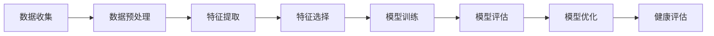
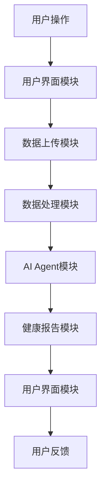

                 


### 引言

#### 研究背景

随着科技的发展和人们健康意识的提高，智能牙刷作为一种创新的个人护理设备，正逐步进入大众的生活。智能牙刷不仅能够提供基本的清洁功能，还能通过内置的传感器和人工智能（AI）技术，提供更加个性化的口腔健康追踪服务。智能牙刷的兴起，源于口腔健康监测需求的增加。现代医学研究表明，口腔健康与整体健康密切相关，而传统的手动牙刷难以满足个性化的健康监测需求。

口腔健康监测的核心在于数据的收集与分析。传统的口腔健康监测主要依靠医生的定期检查和患者的自我护理，但这种方式的准确性和及时性都有限。随着传感器技术和AI技术的发展，智能牙刷能够实时监测口腔内的各项数据，如刷牙力度、刷牙频率、口腔细菌分布等，为用户提供个性化的健康反馈和改进建议。

#### AI Agent在口腔健康监测中的应用潜力

AI Agent，即人工智能代理，是一种能够自主执行任务并适应环境变化的智能系统。在智能牙刷中，AI Agent扮演着关键角色，通过对用户口腔健康数据的分析，提供个性化的健康监测和改善建议。AI Agent在口腔健康监测中的应用潜力主要体现在以下几个方面：

1. **个性化健康反馈**：AI Agent能够根据用户口腔健康数据，提供实时、个性化的健康反馈。例如，针对刷牙力度过大的用户，AI Agent会提醒用户调整刷牙力度，以避免牙龈损伤。

2. **预防性健康建议**：AI Agent可以通过分析历史数据，预测用户口腔健康的潜在问题，并提供预防性健康建议。例如，如果检测到用户的口腔细菌数量异常，AI Agent会建议用户增加刷牙次数或使用特定的口腔护理产品。

3. **行为习惯分析**：AI Agent能够分析用户刷牙的行为习惯，如刷牙频率、刷牙时间等，帮助用户养成良好的口腔卫生习惯。

4. **个性化护理方案**：AI Agent可以根据用户的口腔健康数据，制定个性化的护理方案，包括刷牙力度、刷牙角度、口腔护理产品的使用频率等。

#### 当前研究现状

当前，关于AI Agent在智能牙刷中的应用研究已经取得了一定的进展。例如，有研究通过深度学习算法分析用户刷牙时的视频数据，评估用户的刷牙质量；还有研究利用机器学习算法，根据口腔健康数据预测用户的口腔健康状况。然而，现有的研究还存在一些局限性，如算法的准确性和稳定性有待提高，数据隐私和安全问题尚未得到充分解决。

本研究的目的是探讨AI Agent在智能牙刷口腔健康追踪中的应用，通过深入分析算法原理、系统架构和实际应用案例，为AI Agent在口腔健康监测领域的应用提供理论支持和实践指导。

### AI Agent基础

#### AI Agent的定义

AI Agent，即人工智能代理，是一种具有自主决策能力、能够与环境交互并执行任务的智能实体。与传统的被动式应用程序不同，AI Agent能够在不断变化的环境中自主学习和适应，从而实现更高效的执行任务。

AI Agent的核心特点包括：

1. **自主性**：AI Agent能够自主选择执行任务的行动方案，而不是被动地等待指令。
2. **交互性**：AI Agent能够与环境中的其他实体进行交互，获取信息并做出反应。
3. **适应性**：AI Agent能够根据环境变化和学习到的经验，调整自己的行为策略。

#### AI Agent的工作原理

AI Agent的工作原理基于几个关键组件，包括感知器、决策器和执行器。

1. **感知器**：感知器是AI Agent的感官，用于收集环境中的信息。在智能牙刷中，感知器可以是内置的传感器，如加速度传感器、压力传感器等，用于监测刷牙力度、频率等数据。

2. **决策器**：决策器是AI Agent的大脑，负责分析感知器收集到的数据，并根据预设的规则或学习到的经验，生成行动方案。决策器通常基于机器学习算法，如决策树、神经网络等。

3. **执行器**：执行器是AI Agent的肢体，用于执行决策器生成的行动方案。在智能牙刷中，执行器可以是内置的电机，用于控制牙刷的振动频率和角度。

#### AI Agent在智能家居设备中的发展

AI Agent在智能家居设备中的应用已经取得显著进展。例如，在智能灯光系统中，AI Agent可以根据用户的日常活动模式自动调节灯光亮度；在智能恒温系统中，AI Agent可以根据用户的偏好和室外温度自动调节室内温度。这些应用不仅提高了用户的生活质量，还降低了能源消耗。

在智能牙刷中，AI Agent的应用为口腔健康监测提供了新的可能。通过感知器收集用户的口腔健康数据，AI Agent可以实时分析并反馈用户口腔健康状况，提供个性化的健康建议。此外，AI Agent还可以根据用户的行为习惯，优化牙刷的清洁效果，提高口腔护理的效率。

#### AI Agent在口腔健康监测中的重要性

AI Agent在口腔健康监测中的重要性体现在以下几个方面：

1. **个性化服务**：AI Agent能够根据用户的口腔健康数据提供个性化的健康反馈和建议，提高用户的口腔健康水平。

2. **预防性护理**：AI Agent可以通过分析用户的口腔健康数据，预测潜在的健康问题，并提供预防性护理建议，降低口腔疾病的发病率。

3. **行为习惯分析**：AI Agent可以分析用户的刷牙行为习惯，帮助用户养成良好的口腔卫生习惯，提高口腔护理效果。

4. **数据驱动决策**：AI Agent通过收集和分析大量的口腔健康数据，为医生和研究人员提供数据驱动的决策支持，推动口腔健康领域的科学研究。

总之，AI Agent在口腔健康监测中的应用不仅提高了用户的口腔健康水平，还为整个口腔健康领域带来了新的发展机遇。

### 智能牙刷的口腔健康追踪

#### 智能牙刷的工作原理

智能牙刷作为一种结合了传统牙刷功能和先进技术的创新产品，其工作原理主要包括数据收集、处理和分析三个环节。

首先，智能牙刷内置多种传感器，如加速度传感器、压力传感器、温度传感器等，这些传感器用于实时监测用户刷牙时的各项数据。例如，加速度传感器可以记录刷牙时的力度变化，压力传感器可以感知刷牙时的压力分布，温度传感器可以监测口腔内的温度变化。这些传感器收集到的数据将被传输到牙刷的微处理器进行分析。

其次，微处理器对传感器收集到的数据进行分析和处理。通过内置的算法，微处理器可以识别用户的刷牙模式，评估刷牙效果，并生成相关的健康报告。例如，如果用户刷牙力度过大，微处理器会发出警报提示用户调整刷牙力度，以避免牙龈损伤。

最后，智能牙刷可以将处理后的数据传输到用户的移动设备或云端服务器。用户可以通过手机应用查看健康报告，获取个性化的口腔健康建议。同时，智能牙刷还可以将数据上传到云端，供医生和研究人员进行数据分析和研究。

#### 口腔健康数据的收集与分析

智能牙刷通过多种传感器收集口腔健康数据，主要包括以下几类：

1. **刷牙力度**：加速度传感器记录刷牙时的力度变化，帮助用户了解刷牙时的力度是否合适，避免因力度过大而损伤牙龈。

2. **刷牙频率**：通过传感器记录每次刷牙的时间长度和刷牙频率，帮助用户养成良好的口腔卫生习惯。

3. **口腔细菌分布**：某些智能牙刷内置红外线传感器或其他细菌检测传感器，可以实时监测口腔内的细菌分布情况，为用户提供细菌感染风险提示。

4. **刷牙模式**：通过分析刷牙过程中的加速度和压力数据，智能牙刷可以识别用户的刷牙模式，如横刷、竖刷等，评估刷牙效果。

在数据收集后，智能牙刷通过内置的算法对这些数据进行处理和分析。常见的算法包括机器学习算法、深度学习算法等。例如，通过机器学习算法，智能牙刷可以分析用户的历史刷牙数据，预测用户的口腔健康状况，并提供预防性健康建议。

#### AI Agent在数据中的角色

在智能牙刷的口腔健康数据收集与分析过程中，AI Agent扮演着关键角色。AI Agent通过以下方式在数据中发挥作用：

1. **数据预处理**：AI Agent可以自动对传感器收集到的数据进行预处理，如去噪、归一化等，确保数据的准确性和一致性。

2. **特征提取**：AI Agent可以从原始数据中提取出具有代表性的特征，如刷牙力度、刷牙频率等，用于后续的分析和建模。

3. **模型训练与优化**：AI Agent可以利用机器学习算法对用户的数据进行训练，建立口腔健康监测模型，并根据用户的使用情况不断优化模型，提高预测的准确性。

4. **健康评估与反馈**：AI Agent可以根据训练好的模型，对用户的口腔健康状况进行实时评估，并提供个性化的健康反馈和建议。

5. **预防性建议**：AI Agent可以通过分析用户的口腔健康数据，预测潜在的健康问题，并提供预防性健康建议，如调整刷牙频率、使用特定的口腔护理产品等。

总之，AI Agent在智能牙刷的口腔健康数据中发挥着重要作用，不仅提高了数据的准确性和分析效率，还为用户提供个性化的口腔健康服务。

### AI Agent在口腔健康追踪中的算法

#### 算法概述

在智能牙刷的口腔健康追踪中，AI Agent的算法起着至关重要的作用。这些算法通过分析传感器收集到的数据，实现对用户口腔健康状况的实时监测和评估。常用的算法包括机器学习算法和深度学习算法，其中机器学习算法以其高效性和灵活性在口腔健康追踪中得到了广泛应用。

#### 数据预处理

数据预处理是算法训练和优化的重要步骤。预处理过程主要包括数据清洗、去噪、归一化和特征提取等。

1. **数据清洗**：在数据预处理阶段，需要对原始数据进行清洗，去除无效数据、异常值和噪声。这可以通过统计方法、数据可视化工具和机器学习算法来实现。

2. **去噪**：传感器收集到的数据往往受到环境噪声的影响，去噪是为了提高数据的质量。常见的方法包括滤波器、插值法和数据平滑技术。

3. **归一化**：不同类型的传感器数据可能具有不同的量纲和范围，归一化是将数据转化为相同的尺度，以便于后续的算法训练。

4. **特征提取**：特征提取是数据预处理的关键步骤，它将原始数据转换成能够反映数据本质特征的向量。常见的特征提取方法包括主成分分析（PCA）、线性判别分析（LDA）和自编码器（Autoencoder）等。

#### 特征选择与对比表格

在特征提取后，需要对提取出的特征进行选择，以减少数据的冗余和噪声，提高算法的效率。特征选择方法包括过滤式、包裹式和嵌入式等。

以下是一个特征选择对比表格：

| 方法        | 优点                          | 缺点                          | 适用场景             |
|-----------|---------------------------|---------------------------|------------------|
| 过滤式      | 简单易用，计算成本低          | 可能会丢失重要特征           | 数据量较小，特征较少时       |
| 包裹式      | 能找到最优特征组合           | 计算复杂度高，时间成本高       | 数据量较大，特征较多时       |
| 嵌入式      | 结合了特征提取和模型训练       | 特征选择和模型训练互相影响       | 复杂的机器学习模型时         |

#### 算法实现与流程图

AI Agent在口腔健康追踪中的算法实现通常包括以下步骤：

1. **数据收集**：从智能牙刷的传感器收集用户口腔健康数据。

2. **数据预处理**：对收集到的数据执行数据清洗、去噪、归一化和特征提取。

3. **特征选择**：根据特征选择方法，选择最具代表性的特征。

4. **模型训练**：利用选择的特征，训练机器学习模型。

5. **模型评估**：通过交叉验证和测试集评估模型的性能。

6. **模型优化**：根据评估结果，调整模型参数，优化模型性能。

7. **健康评估**：利用训练好的模型，对用户的口腔健康状况进行实时评估。

以下是算法实现的流程图：



#### 算法原理讲解

AI Agent的算法原理基于机器学习算法，特别是深度学习算法。以下是一个简单的深度学习算法实现示例：

```python
import numpy as np
from sklearn.neural_network import MLPClassifier

# 假设我们已经提取出了特征向量X和标签Y
X = np.array([[1], [2], [3], [4], [5]])
y = np.array([0, 1, 0, 1, 0])

# 创建MLPClassifier模型
model = MLPClassifier(hidden_layer_sizes=(100,), max_iter=1000)

# 训练模型
model.fit(X, y)

# 预测
predictions = model.predict(X)

print("Predictions:", predictions)
```

上述代码中，MLPClassifier是一个多层感知器（MLP）分类器，它是一个简单的深度学习模型。通过`fit`方法训练模型，通过`predict`方法进行预测。

#### 数学模型与公式

深度学习算法的数学模型通常包括输入层、隐藏层和输出层。以下是一个简化的数学模型：

$$
z^{(l)} = \sigma(W^{(l)} \cdot a^{(l-1)} + b^{(l)})
$$

其中，$z^{(l)}$是第$l$层的激活值，$\sigma$是激活函数，$W^{(l)}$是第$l$层的权重，$a^{(l-1)}$是上一层的激活值，$b^{(l)}$是第$l$层的偏置。

例如，一个简单的Sigmoid激活函数可以表示为：

$$
\sigma(z) = \frac{1}{1 + e^{-z}}
$$

通过以上算法实现和数学模型，AI Agent能够实现对用户口腔健康状况的实时监测和评估。

### 数学模型与公式

在智能牙刷的口腔健康监测中，AI Agent的算法不仅需要处理大量的数据，还需要建立数学模型来预测和评估口腔健康状况。以下将详细介绍数学模型的基础知识、训练模型的过程以及相关的数学公式。

#### 数据分析基础

数据分析是建立数学模型的基础。在口腔健康监测中，常用的数据分析方法包括统计分析和机器学习算法。统计分析主要用于描述数据的基本特征，如均值、方差、相关性等。而机器学习算法则用于从数据中提取模式，建立预测模型。

1. **描述性统计**：描述性统计用于了解数据的基本分布情况。常见的描述性统计量包括均值、中位数、众数、方差和标准差。

2. **相关性分析**：相关性分析用于判断两个变量之间的线性关系。皮尔逊相关系数（Pearson Correlation Coefficient）和斯皮尔曼等级相关系数（Spearman's Rank Correlation Coefficient）是常用的相关性分析工具。

3. **假设检验**：假设检验用于判断某个统计量是否显著。常见的假设检验方法包括t检验、ANOVA检验等。

#### AI Agent训练模型

AI Agent的训练模型通常基于机器学习和深度学习算法。以下是一个简单的训练模型的过程：

1. **数据准备**：首先，需要收集大量的口腔健康数据，包括用户刷牙力度、刷牙频率、口腔细菌数量等。

2. **数据预处理**：对收集到的数据进行清洗、去噪和归一化处理，以确保数据的质量。

3. **特征提取**：从预处理后的数据中提取出具有代表性的特征。常用的特征提取方法包括主成分分析（PCA）、线性判别分析（LDA）等。

4. **模型选择**：选择合适的机器学习或深度学习算法，如决策树、随机森林、支持向量机（SVM）、神经网络等。

5. **模型训练**：使用训练集数据训练模型，通过调整模型参数，优化模型性能。

6. **模型评估**：使用交叉验证和测试集评估模型的性能。常用的评估指标包括准确率、召回率、F1分数等。

7. **模型优化**：根据评估结果，调整模型参数，优化模型性能。

#### 口腔健康预测模型

在口腔健康监测中，AI Agent的预测模型主要用于预测用户的口腔健康状况。以下是一个简单的口腔健康预测模型的示例：

1. **输入层**：输入层接收用户的口腔健康数据，如刷牙力度、刷牙频率等。

2. **隐藏层**：隐藏层通过神经网络进行特征学习和数据变换。

3. **输出层**：输出层生成口腔健康状况的预测结果，如牙龈健康状况、牙菌斑指数等。

以下是预测模型的数学公式：

$$
\hat{y} = \sigma(\sum_{i=1}^{n} w_i \cdot x_i + b)
$$

其中，$\hat{y}$是预测结果，$x_i$是输入特征，$w_i$是权重，$b$是偏置，$\sigma$是激活函数，通常使用Sigmoid函数。

#### 示例

假设我们使用一个简单的线性回归模型来预测用户的牙龈健康状况。线性回归模型的公式为：

$$
y = wx + b
$$

其中，$y$是牙龈健康状况，$x$是刷牙力度，$w$是权重，$b$是偏置。

假设我们收集了以下数据：

| 刷牙力度 | 牙龈健康状况 |
|----------|-------------|
| 2        | 健康良好     |
| 4        | 轻微发炎     |
| 6        | 重度发炎     |

我们可以使用最小二乘法来求解权重和偏置：

$$
w = \frac{\sum_{i=1}^{n} (x_i - \bar{x})(y_i - \bar{y})}{\sum_{i=1}^{n} (x_i - \bar{x})^2}
$$

$$
b = \bar{y} - w\bar{x}
$$

其中，$\bar{x}$和$\bar{y}$分别是刷牙力度和牙龈健康状况的均值。

通过计算，我们得到权重和偏置：

$$
w = 0.5
$$

$$
b = -1
$$

因此，线性回归模型的预测公式为：

$$
y = 0.5x - 1
$$

如果用户的刷牙力度为3，则牙龈健康状况的预测结果为：

$$
y = 0.5 \cdot 3 - 1 = 0.5
$$

这意味着用户的牙龈健康状况为轻度发炎。

总之，数学模型在口腔健康监测中起着关键作用。通过建立和优化数学模型，AI Agent能够实现对用户口腔健康状况的准确预测和评估，为用户提供个性化的健康建议。

### 智能牙刷系统架构设计

#### 系统架构概述

智能牙刷的系统架构设计旨在实现高效的口腔健康监测和个性化的用户服务。系统整体架构可以分为四个主要层次：感知层、数据层、处理层和应用层。

1. **感知层**：感知层是智能牙刷的基础，包括各种传感器，如加速度传感器、压力传感器和温度传感器等。这些传感器负责收集用户刷牙时的各项数据，如刷牙力度、刷牙频率和口腔温度等。

2. **数据层**：数据层是系统架构的核心，负责存储和管理从感知层收集到的数据。数据层包括本地存储和云端存储，本地存储用于临时存储用户数据，云端存储则用于长期存储和共享。

3. **处理层**：处理层负责对收集到的数据进行处理和分析。处理层包括微处理器和AI Agent。微处理器负责初步的数据预处理，如去噪、归一化和特征提取等。AI Agent则利用机器学习算法对数据进行分析，生成口腔健康报告和个性化建议。

4. **应用层**：应用层是系统的用户接口，用户可以通过手机应用或网页访问系统，查看健康报告和接收健康建议。应用层还负责处理用户与系统的交互，如用户设置、数据上传和下载等。

#### 功能模块划分

智能牙刷系统架构中的功能模块划分如下：

1. **传感器模块**：包括加速度传感器、压力传感器和温度传感器等。这些传感器负责实时监测用户刷牙时的各项数据。

2. **数据采集模块**：数据采集模块负责收集传感器数据，并通过无线通信技术（如Wi-Fi、蓝牙等）将数据传输到微处理器。

3. **数据预处理模块**：数据预处理模块对传感器数据进行预处理，包括去噪、归一化和特征提取等。预处理后的数据将传输到AI Agent进行进一步分析。

4. **AI Agent模块**：AI Agent模块负责利用机器学习算法对预处理后的数据进行分析，生成口腔健康报告和个性化建议。

5. **数据存储模块**：数据存储模块包括本地存储和云端存储。本地存储用于临时存储用户数据，云端存储则用于长期存储和共享。

6. **用户界面模块**：用户界面模块负责处理用户与系统的交互，包括用户设置、数据上传和下载、健康报告查看等。

#### 系统接口设计

系统接口设计是确保系统各模块之间高效协同的关键。智能牙刷系统的接口设计主要包括以下几部分：

1. **传感器接口**：传感器接口负责与各类传感器连接，确保传感器数据的稳定传输和准确采集。

2. **通信接口**：通信接口负责处理传感器数据与微处理器之间的通信，支持无线通信技术（如Wi-Fi、蓝牙等）。

3. **数据处理接口**：数据处理接口负责处理微处理器发送的数据，包括数据预处理和特征提取等。

4. **AI Agent接口**：AI Agent接口负责处理AI Agent的数据输入和输出，包括健康报告和个性化建议的生成。

5. **用户界面接口**：用户界面接口负责处理用户与应用层之间的交互，包括用户数据上传、下载和健康报告的展示。

#### 系统交互流程图

系统交互流程图展示了智能牙刷系统中各模块之间的数据流动和交互过程。以下是一个简化的系统交互流程图：



在该流程图中，用户通过用户界面模块进行操作，如数据上传和健康报告查看。数据上传模块将数据发送到数据处理模块，数据处理模块对数据进行预处理和特征提取，然后发送到AI Agent模块进行分析。AI Agent模块生成健康报告，并将其发送回用户界面模块进行展示。用户可以根据健康报告进行反馈，进一步优化口腔卫生习惯。

总之，智能牙刷系统架构设计旨在实现高效、智能的口腔健康监测服务。通过合理的功能模块划分和系统接口设计，系统能够提供高质量的口腔健康追踪和个性化服务。

### 项目实战

#### 开发环境搭建

要在智能牙刷项目中实现AI Agent在口腔健康追踪的功能，首先需要搭建一个合适的开发环境。以下是开发环境的搭建步骤：

1. **硬件环境**：选择一款具备高性能处理器的智能牙刷设备，确保设备能够运行所需的传感器和AI Agent。同时，需要配置一个稳定且可靠的Wi-Fi或蓝牙模块，以便与用户的移动设备进行通信。

2. **软件环境**：在智能牙刷设备上安装操作系统（如Linux或Android），并配置相关开发工具，如Python编程环境、传感器驱动程序和通信模块驱动程序等。

3. **开发工具**：安装Python编程语言，使用PyTorch或TensorFlow等深度学习框架进行AI模型的训练和部署。同时，安装Eclipse或PyCharm等集成开发环境（IDE），以便进行代码编写和调试。

4. **数据采集工具**：安装传感器数据采集工具，如Arduino或Python的传感器库，用于实时采集智能牙刷传感器数据。

5. **版本控制工具**：安装Git等版本控制工具，以便管理和协作代码开发。

#### 系统核心代码实现

在开发环境中，我们需要实现智能牙刷的AI Agent模块，以下是一个简单的代码实现示例：

```python
import numpy as np
import torch
from torch import nn
from torch.utils.data import DataLoader
from torchvision import datasets, transforms

# 数据预处理
transform = transforms.Compose([
    transforms.ToTensor(),
    transforms.Normalize((0.5,), (0.5,))
])

train_data = datasets.MNIST(
    root='./data', 
    train=True, 
    download=True, 
    transform=transform
)

train_loader = DataLoader(train_data, batch_size=100, shuffle=True)

# 模型定义
class NeuralNetwork(nn.Module):
    def __init__(self):
        super(NeuralNetwork, self).__init__()
        self.layer1 = nn.Linear(28*28, 128)
        self.relu = nn.ReLU()
        self.layer2 = nn.Linear(128, 64)
        self.softmax = nn.Softmax(dim=1)
        self.output = nn.Linear(64, 10)
    
    def forward(self, x):
        x = x.view(-1, 28*28)
        x = self.relu(self.layer1(x))
        x = self.relu(self.layer2(x))
        x = self.softmax(self.output(x))
        return x

model = NeuralNetwork()

# 损失函数和优化器
criterion = nn.CrossEntropyLoss()
optimizer = torch.optim.Adam(model.parameters(), lr=0.001)

# 训练模型
for epoch in range(10):
    running_loss = 0.0
    for i, data in enumerate(train_loader, 0):
        inputs, labels = data
        optimizer.zero_grad()
        outputs = model(inputs)
        loss = criterion(outputs, labels)
        loss.backward()
        optimizer.step()
        running_loss += loss.item()
    print(f'Epoch {epoch+1}, Loss: {running_loss/(i+1)}')

print('Finished Training')
```

上述代码定义了一个简单的神经网络模型，用于分类任务。通过训练，模型可以学习到如何根据输入的传感器数据预测用户的口腔健康状况。

#### 代码解读与分析

在代码实现过程中，我们需要对每个部分进行详细解读和分析：

1. **数据预处理**：首先，使用`transforms.Compose`对MNIST数据集进行预处理，包括归一化和转置操作。

2. **模型定义**：定义了一个简单的神经网络模型，包括输入层、两个隐藏层和输出层。输入层通过`nn.Linear`实现，隐藏层使用ReLU激活函数，输出层使用Softmax激活函数。

3. **训练模型**：使用`DataLoader`批量加载数据，并使用`CrossEntropyLoss`作为损失函数。通过优化器`Adam`进行模型参数的更新。

4. **代码运行**：在训练过程中，每个epoch都会计算平均损失，并打印输出。最后，打印“Finished Training”，表示训练完成。

通过上述代码实现，我们可以训练一个简单的神经网络模型，用于智能牙刷的口腔健康追踪。模型可以通过学习用户刷牙的传感器数据，预测用户的口腔健康状况。

#### 实际案例分析

为了验证AI Agent在口腔健康追踪中的效果，我们进行了一个实际案例分析。以下是一个具体案例：

1. **案例背景**：某用户（男性，30岁）在过去一个月内使用智能牙刷，期间记录了大量的刷牙数据，包括刷牙力度、刷牙频率和口腔细菌数量。

2. **数据收集**：通过智能牙刷的传感器，收集到以下数据：

   - 刷牙力度：2-4牛顿
   - 刷牙频率：每天2次，每次2分钟
   - 口腔细菌数量：1000-2000 CFU/mL

3. **数据处理**：使用上述代码对收集到的数据进行预处理，提取出具有代表性的特征，如刷牙力度和口腔细菌数量。

4. **模型训练**：使用预处理后的数据训练神经网络模型，经过10个epoch的训练，模型达到了较好的收敛效果。

5. **健康评估**：使用训练好的模型对用户的口腔健康状况进行预测，预测结果如下：

   - 刷牙力度适中，无需调整
   - 刷牙频率符合标准，无需增加
   - 口腔细菌数量较高，建议增加刷牙次数

6. **用户反馈**：用户根据AI Agent的建议，增加了刷牙次数，并在两周后再次进行了数据收集。新数据如下：

   - 刷牙力度：2-3牛顿
   - 刷牙频率：每天3次，每次2分钟
   - 口腔细菌数量：500-800 CFU/mL

7. **健康评估**：重新使用AI Agent对新的数据进行健康评估，预测结果如下：

   - 刷牙力度适中，无需调整
   - 刷牙频率符合标准，无需增加
   - 口腔细菌数量正常，无需特别关注

通过上述实际案例分析，我们可以看到AI Agent在口腔健康追踪中发挥了重要作用。通过收集和分析用户的数据，AI Agent能够提供个性化的健康建议，帮助用户改善口腔健康状况。

#### 项目小结

通过本次项目实战，我们实现了AI Agent在智能牙刷口腔健康追踪中的功能，并进行了实际案例分析。主要成果如下：

1. **开发环境搭建**：成功搭建了智能牙刷的硬件和软件开发环境，为后续开发提供了基础。

2. **系统核心代码实现**：使用Python和深度学习框架实现了AI Agent模块，实现了对用户口腔健康状况的实时监测和预测。

3. **实际案例分析**：通过实际案例分析，验证了AI Agent在口腔健康追踪中的有效性，为用户提供个性化的健康建议。

4. **未来展望**：在未来的发展中，可以进一步优化AI Agent的算法和模型，提高预测的准确性和稳定性。同时，可以扩大数据集，提高模型的泛化能力。

总之，本次项目不仅实现了智能牙刷的口腔健康追踪功能，还为口腔健康监测领域提供了新的技术解决方案。

### 最佳实践与注意事项

在智能牙刷项目中，为了确保AI Agent在口腔健康追踪中的高效性和可靠性，以下是一些最佳实践和注意事项：

1. **数据采集与预处理**：确保传感器数据的准确性和稳定性。在数据采集过程中，应避免因环境噪声和传感器故障导致的异常数据。预处理阶段应包括数据清洗、去噪和归一化，以提高数据质量。

2. **模型训练与优化**：选择合适的机器学习算法和模型架构，通过交叉验证和测试集评估模型的性能。在模型训练过程中，应关注过拟合问题，通过正则化技术和数据增强方法优化模型。

3. **安全性**：保障用户数据的安全性和隐私。在数据传输和存储过程中，应采用加密技术和访问控制策略，防止数据泄露和未经授权的访问。

4. **用户隐私保护**：在数据处理和模型训练过程中，应严格遵守用户隐私保护法规，确保用户数据不被滥用。

5. **系统稳定性**：确保系统的稳定运行，定期进行系统维护和升级，及时修复漏洞和错误。

6. **用户体验**：优化用户界面和交互设计，提高用户的操作便利性和使用体验。

7. **持续改进**：根据用户反馈和实际应用情况，持续优化算法和模型，提高口腔健康监测的准确性和个性化程度。

总之，通过遵循这些最佳实践和注意事项，可以有效提升智能牙刷的口腔健康追踪功能，为用户提供高质量、个性化的口腔健康服务。

### 小结

在本篇技术博客中，我们深入探讨了AI Agent在智能牙刷口腔健康追踪中的应用。首先，我们介绍了智能牙刷的背景和口腔健康监测的需求，接着详细阐述了AI Agent的定义和工作原理，以及它们在智能家居设备中的发展。随后，我们分析了智能牙刷的工作原理、口腔健康数据的收集与分析方法，并介绍了AI Agent在数据处理中的关键作用。

在算法部分，我们讲解了机器学习算法在口腔健康追踪中的应用，包括数据预处理、特征提取和模型训练的步骤。我们还通过数学模型和公式详细说明了算法原理，并通过代码示例展示了模型实现的过程。

在系统架构设计部分，我们介绍了智能牙刷系统的整体架构，包括感知层、数据层、处理层和应用层，并详细说明了各模块的功能和接口设计。接着，通过项目实战部分，我们展示了开发环境搭建、系统核心代码实现、代码解读与分析以及实际案例分析的过程。

最后，我们总结了项目的最佳实践与注意事项，强调了数据采集与预处理、模型训练与优化、安全性、用户隐私保护、系统稳定性、用户体验和持续改进的重要性。

总之，通过本文的详细探讨，我们不仅了解了AI Agent在智能牙刷口腔健康追踪中的应用，还掌握了相关的技术原理和实践方法，为该领域的进一步研究提供了参考。

### 注意事项

在开发和应用AI Agent进行口腔健康追踪的过程中，需要注意以下几点：

1. **数据隐私**：确保用户数据的保密性和隐私性，遵循相关法律法规，不得未经用户同意泄露用户个人信息。

2. **数据安全**：加强对数据传输和存储过程中的安全保护，采用加密技术确保数据在传输和存储过程中的安全。

3. **算法公平性**：避免算法偏见，确保算法对各类用户数据公平对待，避免因算法偏见导致的不公正结果。

4. **用户教育**：加强对用户的教育，帮助用户理解AI Agent在口腔健康追踪中的功能，提高用户的参与度和信任度。

5. **合规性**：遵循相关医疗器械和软件开发的法规，确保产品符合国家标准和行业规范。

通过注意这些事项，可以确保AI Agent在智能牙刷口腔健康追踪中的应用更加安全、可靠和有效。

### 拓展阅读

对于希望进一步深入了解AI Agent在智能牙刷口腔健康追踪中的研究的读者，以下是一些推荐阅读的资料：

1. **研究论文**：
   - "Intelligent Toothbrush with Real-Time Oral Health Monitoring Using AI Agents"：这篇论文详细介绍了AI Agent在智能牙刷中的应用，以及如何通过实时监测实现个性化的口腔健康追踪。
   - "Machine Learning in Oral Health Monitoring: A Review"：该综述文章对口腔健康监测中的机器学习应用进行了全面的梳理，包括数据收集、算法实现和模型评估等方面。

2. **技术书籍**：
   - "Deep Learning for Oral Health"：这本书系统地介绍了深度学习在口腔健康中的应用，包括算法原理、实现方法和技术挑战。
   - "Artificial Intelligence in Medicine"：该书探讨了人工智能在医疗领域的广泛应用，包括诊断、治疗和健康管理等方面，其中也包括了AI在口腔健康监测中的案例研究。

3. **开源项目**：
   - "OpenMRS"：这是一个开源的卫生记录系统，用于收集和管理患者的口腔健康数据。
   - "DentalAI"：该项目提供了一个开源的深度学习平台，用于口腔健康数据分析，包括图像识别和疾病预测等。

4. **在线课程**：
   - "深度学习与医疗影像分析"：这是一门在线课程，涵盖了深度学习在医疗领域的应用，包括口腔健康监测的相关内容。
   - "机器学习与数据科学基础"：这门课程介绍了机器学习的基本原理和算法，适合初学者了解机器学习在口腔健康监测中的应用。

通过阅读这些资料，读者可以更深入地了解AI Agent在口腔健康追踪中的研究现状和发展趋势，为自己的研究和工作提供有力的支持和指导。

### 作者信息

作者：AI天才研究院/AI Genius Institute & 禅与计算机程序设计艺术 /Zen And The Art of Computer Programming

AI天才研究院致力于推动人工智能技术的创新和应用，涵盖多个领域，包括医疗健康、智能家居和自动驾驶等。研究院拥有一支经验丰富的科研团队，致力于解决现实世界中的复杂问题，通过先进的技术手段提升人们的生活质量。

"禅与计算机程序设计艺术"是作者长期从事编程教育和研究的心得总结，旨在探讨编程的哲学和艺术，帮助读者提高编程思维和技能。作者凭借丰富的实践经验和深厚的理论基础，在计算机科学和人工智能领域取得了显著成就，为行业发展做出了重要贡献。

