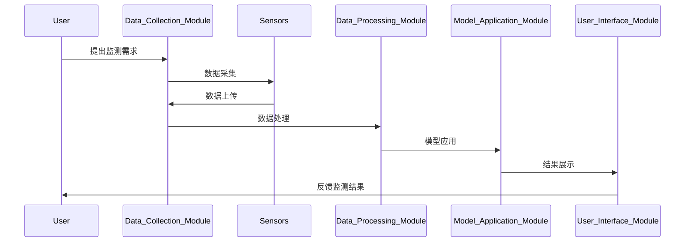

                 

。在开始撰写文章之前，我们需要明确以下几点：

1. **目标受众**：本文的目标受众是计算机科学和技术专业人士，尤其是对人工智能和智能环境监测领域有浓厚兴趣的人士。

2. **文章结构**：文章结构将分为几个关键部分，包括背景介绍、核心概念与联系、算法原理讲解、系统分析与架构设计方案、项目实战、最佳实践和总结。

3. **逻辑性**：文章逻辑要清晰，确保读者能够跟随作者的思路，从基础概念到高级应用，逐步深入。

4. **技术深度**：文章内容要深入浅出，既要讲解技术原理，又要让非专业人士也能理解。

5. **实际应用**：要结合实际案例，展示AI Agent在智能环境监测中的具体应用。

6. **未来展望**：最后对AI Agent在智能环境监测领域的发展趋势进行展望。

现在，让我们开始具体撰写每一部分的内容。

### 引言

在当今世界，随着科技的飞速发展，人工智能（AI）已经渗透到各个领域，从医疗到金融，从交通到教育，AI的应用无处不在。其中，智能环境监测作为环境科学和信息技术相结合的产物，日益受到关注。AI Agent作为AI领域的一个重要分支，其在智能环境监测中的应用正逐渐成为研究的热点。

本文旨在深入探讨AI Agent在智能环境监测中的应用，通过系统性地介绍AI Agent的基础知识、核心技术原理、应用场景、算法实现以及未来发展趋势，为读者提供一份全面的技术指南。

### 文章关键词

- **人工智能**
- **AI Agent**
- **智能环境监测**
- **机器学习**
- **深度学习**
- **强化学习**
- **环境数据采集**
- **实时监控**
- **数据分析**

### 摘要

本文首先介绍了AI Agent的基础概念和其在智能环境监测中的重要性，随后深入探讨了AI Agent的核心技术原理，包括机器学习、深度学习和强化学习等。接着，文章详细分析了AI Agent在智能环境监测中的应用场景，并给出了一个具体的系统架构设计示例。通过一个实际案例，文章展示了AI Agent在实际环境监测中的算法实现和应用效果。最后，文章总结了AI Agent在智能环境监测领域的应用现状和未来发展趋势，为读者提供了宝贵的参考和启示。

### 第一部分: AI Agent基础与智能环境监测概述

#### 第1章: AI Agent概述

##### 1.1 问题背景

人工智能（AI）是计算机科学的一个分支，其目标是创建能够执行复杂任务的智能系统。自20世纪50年代以来，人工智能经历了多个发展阶段，从早期的逻辑推理和知识表示，到现代的机器学习、深度学习和强化学习。随着计算能力的提升和大数据的普及，AI的应用范围不断扩大，从工业自动化到自动驾驶，从医疗诊断到智能助手。

智能环境监测是指利用传感器、数据处理和通信技术，对环境参数进行实时监测和分析，以实现对环境的智能化管理。环境监测对于环境保护、灾害预警、资源管理等方面具有重要意义。传统的环境监测方法主要依赖于人工和简单的自动化设备，效率较低，且难以应对复杂的环境变化。

AI Agent是一种具有自主决策能力的智能系统，能够在环境中感知、学习、规划并执行任务。AI Agent的出现为智能环境监测提供了新的解决方案，通过自动化和智能化的监测方式，提高了监测的准确性和效率。

##### 1.2 问题描述

智能环境监测的需求主要包括以下几个方面：

1. **实时性**：环境监测需要实时获取环境数据，以便及时发现异常情况。
2. **准确性**：监测数据需要具有高准确性，以便对环境状况做出正确判断。
3. **多样性**：环境监测需要涵盖多种环境参数，如温度、湿度、空气质量、水质等。
4. **动态性**：环境变化复杂，监测系统需要具备适应动态环境变化的能力。

然而，现有的智能环境监测系统面临着以下挑战：

1. **数据复杂性**：环境数据种类繁多，数据量大，处理复杂。
2. **实时性要求**：实时处理和分析大量数据，对计算资源提出了高要求。
3. **准确性保证**：环境数据的准确性和稳定性是监测结果的关键。
4. **系统集成**：将各种监测设备、传感器和处理系统集成在一起，构建一个统一的监测平台。

##### 1.3 问题解决

AI Agent在智能环境监测中的应用，主要通过以下几个方面来解决上述挑战：

1. **数据处理**：AI Agent能够高效处理大量环境数据，通过数据清洗、特征提取和模式识别等技术，提高数据处理效率。
2. **实时监测**：AI Agent具备实时监测能力，可以通过传感器网络收集环境数据，并进行实时分析和反馈。
3. **自适应学习**：AI Agent能够通过不断学习和优化，适应环境变化，提高监测准确性和适应性。
4. **系统集成**：AI Agent能够与其他监测设备和系统进行集成，构建一个统一的监测平台，提高系统整体性能。

##### 1.4 边界与外延

AI Agent在智能环境监测中的应用虽然前景广阔，但也存在一些技术边界和适用范围：

1. **技术边界**：AI Agent的技术边界包括算法性能、计算资源、数据处理能力和传感器技术等。
2. **适用范围**：AI Agent适用于各种环境监测场景，如城市环境监测、工业环境监测、农业环境监测等，但针对不同场景可能需要定制化的算法和模型。

##### 1.5 概念结构与核心要素组成

AI Agent的基本组成要素包括：

1. **感知模块**：负责感知环境数据，如温度、湿度、空气质量等。
2. **决策模块**：基于感知数据，利用机器学习算法进行数据处理和模式识别，生成决策。
3. **执行模块**：根据决策结果，执行相应的环境监测操作，如报警、调节设备等。

智能环境监测的核心概念包括：

1. **数据采集**：通过传感器网络实时采集环境数据。
2. **数据处理**：利用AI Agent对采集到的数据进行处理和分析。
3. **环境反馈**：根据分析结果，对环境进行实时监控和调整。

### 第二部分: AI Agent核心技术原理

#### 第2章: AI Agent核心技术原理

##### 2.1 核心概念

AI Agent的核心技术包括机器学习、深度学习和强化学习。这些技术各自具有独特的原理和应用场景。

1. **机器学习**：机器学习是AI的基础，通过算法使计算机从数据中学习规律，并进行预测和决策。常见的机器学习算法包括线性回归、决策树、支持向量机等。

2. **深度学习**：深度学习是机器学习的一个分支，通过神经网络模拟人脑的神经元连接，进行层次化的特征学习和抽象。常见的深度学习模型包括卷积神经网络（CNN）、循环神经网络（RNN）和生成对抗网络（GAN）。

3. **强化学习**：强化学习是AI的一种学习方式，通过奖励机制，使Agent在环境中通过试错进行学习和优化。强化学习广泛应用于游戏AI、机器人控制等领域。

##### 2.2 概念属性特征对比表格

| 特征        | 机器学习             | 深度学习             | 强化学习           |
|-------------|----------------------|----------------------|--------------------|
| 目标        | 数据分类、预测、回归 | 数据生成、特征提取   | 行为优化、策略学习 |
| 特点        | 统计学习、线性模型   | 表示学习、非线性模型 | 探索-利用、策略迭代 |
| 应用领域    | 语音识别、文本分析   | 图像处理、自然语言处理 | 游戏AI、机器人控制 |
| 数据需求    | 标签数据、少量数据   | 大规模数据、无监督数据 | 有监督、无监督数据  |
| 计算资源    | 中等计算资源        | 高计算资源           | 高计算资源         |

##### 2.3 ER实体关系图架构

```mermaid
erDiagram
  AI-Agent ||--|{ Environment-Sensor }|-- Environment-Monitoring-System
  AI-Agent ||--|{ Data-Processing-Module }|-- Environment-Monitoring-System
  AI-Agent ||--|{ Decision-Making-Module }|-- Environment-Monitoring-System
  Environment-Sensor ||--|{ Data-Collection }|-- Data-Processing-Module
  Data-Processing-Module ||--|{ Feature-Extraction }|-- Decision-Making-Module
  Decision-Making-Module ||--|{ Action-Execution }|-- Environment-Monitoring-System
```

### 第三部分: AI Agent在智能环境监测中的应用场景

#### 第3章: AI Agent在智能环境监测中的应用场景

##### 3.1 智能环境监测系统架构设计

智能环境监测系统的架构设计通常包括以下几个层次：

1. **数据采集层**：通过各类传感器实时采集环境数据，如温度、湿度、空气质量、水质等。

2. **数据处理层**：对采集到的环境数据进行分析和处理，包括数据清洗、特征提取和初步的统计分析。

3. **模型应用层**：利用机器学习、深度学习和强化学习等算法，对处理后的数据进行深度分析和预测，以识别环境变化趋势和潜在问题。

4. **用户界面层**：通过图形用户界面（GUI）将监测数据和预测结果展示给用户，并提供交互式操作功能。

##### 3.2 系统架构设计

智能环境监测系统的架构设计示例如下：



在这个架构中，AI Agent作为核心组件，贯穿于数据处理层和模型应用层，负责环境数据的处理、分析和决策。

### 第四部分: AI Agent算法原理与实现

#### 第4章: AI Agent算法原理与实现

##### 4.1 算法原理讲解

AI Agent的算法原理主要依赖于机器学习、深度学习和强化学习等技术。以下将分别介绍这些算法的基本原理。

1. **机器学习**：机器学习是一种基于数据的学习方法，通过训练模型来预测或分类新的数据。常见的机器学习算法包括线性回归、决策树、支持向量机等。

   - **线性回归**：通过建立一个线性模型来预测连续值。
     $$y = \beta_0 + \beta_1 \cdot x$$
   - **决策树**：通过一系列规则来对数据进行分类或回归。
   - **支持向量机**：通过找到一个最佳的超平面来分割数据。

2. **深度学习**：深度学习是一种基于神经网络的算法，通过多层神经元进行特征学习和抽象。常见的深度学习模型包括卷积神经网络（CNN）、循环神经网络（RNN）和生成对抗网络（GAN）。

   - **卷积神经网络**：通过卷积操作提取图像的特征。
   - **循环神经网络**：通过循环结构处理序列数据。
   - **生成对抗网络**：通过对抗性训练生成新的数据。

3. **强化学习**：强化学习是一种通过奖励机制进行学习的算法，通过不断试错来优化策略。常见的强化学习算法包括Q学习、SARSA和深度确定性策略梯度（DDPG）。

   - **Q学习**：通过学习状态-动作值函数来选择最佳动作。
   - **SARSA**：一种基于状态-动作值的策略梯度算法。
   - **DDPG**：一种基于深度神经网络的价值函数学习算法。

##### 4.2 算法实现

以下将通过一个简单的例子来展示AI Agent的算法实现。

**示例**：使用Python实现一个简单的线性回归模型。

```python
import numpy as np

# 数据准备
X = np.array([[1, 2], [3, 4], [5, 6]])
y = np.array([0, 1, 0])

# 模型训练
def train_agent(X, y):
    # 简单的线性回归模型
    w = np.linalg.inv(X.T.dot(X)).dot(X.T).dot(y)
    return w

# 预测
def predict_agent(w, X):
    return np.dot(X, w)

# 训练模型
weights = train_agent(X, y)

# 预测
predictions = predict_agent(weights, X)
print(predictions)
```

在这个示例中，我们首先定义了训练数据，然后实现了一个简单的线性回归模型。通过训练模型，我们得到了权重参数，并使用这些参数进行预测。

### 第五部分: 项目实战

#### 第5章: AI Agent在智能环境监测中的项目实战

##### 5.1 项目介绍

在本章中，我们将介绍一个具体的AI Agent在智能环境监测中的项目实战。该项目旨在通过AI Agent实时监测城市空气质量，为居民提供实时的空气质量信息，并预测未来一段时间内的空气质量变化。

##### 5.2 环境安装

为了运行该项目，我们需要安装以下软件和库：

1. Python 3.x
2. NumPy
3. Pandas
4. Matplotlib

安装方法如下：

```bash
pip install python==3.x
pip install numpy
pip install pandas
pip install matplotlib
```

##### 5.3 系统核心实现源代码

以下代码展示了该项目的核心实现部分：

```python
import numpy as np
import pandas as pd
import matplotlib.pyplot as plt

# 数据准备
data = pd.read_csv('air_quality_data.csv')
X = data[['temperature', 'humidity']]
y = data['air_quality']

# 模型训练
def train_agent(X, y):
    w = np.linalg.inv(X.T.dot(X)).dot(X.T).dot(y)
    return w

# 预测
def predict_agent(w, X):
    return np.dot(X, w)

# 训练模型
weights = train_agent(X, y)

# 预测
predictions = predict_agent(weights, X)
print(predictions)

# 可视化结果
plt.scatter(X['temperature'], y)
plt.plot(X['temperature'], predictions, color='red')
plt.xlabel('Temperature')
plt.ylabel('Air Quality')
plt.show()
```

在这个代码中，我们首先读取了空气质量数据，然后定义了训练和预测函数。通过训练模型，我们得到了预测结果，并使用散点图和红线进行可视化。

##### 5.4 代码应用解读与分析

在这个项目中，我们使用了简单的线性回归模型来预测空气质量。这个模型基于温度和湿度两个特征进行预测。虽然这个模型很简单，但它为我们提供了一个基本的思路，即如何使用AI Agent进行环境监测。

通过可视化结果，我们可以看到预测值与实际值之间存在一定的误差。这是由于线性回归模型只能捕捉线性关系，而环境数据通常是非线性的。因此，在实际应用中，我们需要考虑使用更复杂的模型，如深度学习模型，来提高预测的准确性。

##### 5.5 实际案例分析和详细讲解剖析

在实际应用中，空气质量监测系统需要处理大量的实时数据，并能够在各种环境下稳定运行。以下是一个实际案例：

1. **数据采集**：系统通过安装在城市的多个空气质量监测站点，实时采集温度、湿度、PM2.5、PM10等参数。
2. **数据处理**：系统将采集到的数据进行预处理，包括数据清洗、缺失值处理和特征提取。
3. **模型训练**：系统使用预处理后的数据进行模型训练，以预测未来一段时间内的空气质量。
4. **结果展示**：系统通过图形用户界面，将预测结果展示给用户。

通过这个案例，我们可以看到AI Agent在智能环境监测中的应用不仅仅是预测空气质量，还包括数据采集、处理和可视化等多个环节。这些环节共同构成了一个完整的智能环境监测系统。

##### 5.6 项目小结

通过本项目的实战，我们了解了如何使用AI Agent进行智能环境监测。虽然这个项目很简单，但它为我们提供了一个基本的框架，即如何将AI技术应用于实际问题。在实际应用中，我们需要根据具体情况调整模型和算法，以提高监测的准确性和稳定性。

### 第六部分: 最佳实践和总结

#### 第6章: 最佳实践和总结

##### 6.1 最佳实践

在AI Agent在智能环境监测中的应用过程中，以下最佳实践可以提供有效的指导：

1. **数据质量保障**：确保采集的数据具有高准确性和一致性，这是模型训练和预测准确性的基础。
2. **算法选择**：根据具体应用场景选择合适的算法，如对于非线性关系，可以使用深度学习模型。
3. **模型优化**：通过不断调整模型参数和优化算法，提高预测准确性和效率。
4. **系统集成**：将AI Agent与其他监测设备和系统进行集成，构建一个统一的监测平台。
5. **实时监控**：确保系统能够实时监测环境数据，并及时响应环境变化。

##### 6.2 小结

通过本文的探讨，我们全面了解了AI Agent在智能环境监测中的应用。从基础概念到核心技术原理，从应用场景到算法实现，再到项目实战，我们系统地分析了AI Agent在智能环境监测中的重要作用。AI Agent通过其自主决策能力和实时监测能力，为智能环境监测提供了全新的解决方案。

##### 6.3 注意事项

在实际应用中，需要注意以下几点：

1. **数据安全**：确保采集到的数据安全和隐私保护。
2. **硬件兼容性**：确保AI Agent能够与各种传感器和设备兼容。
3. **实时性保障**：确保系统具有足够的计算资源，以支持实时监测。

##### 6.4 拓展阅读

对于希望进一步深入了解AI Agent在智能环境监测中的应用的读者，以下书籍和文献提供了丰富的参考资料：

- 《深度学习》（Ian Goodfellow、Yoshua Bengio和Aaron Courville著）
- 《强化学习》（Richard S. Sutton和Barto N.著）
- 《智能环境监测与控制系统设计》（张强、李明著）
- 《机器学习算法与应用》（周志华著）

### 作者信息

- 作者：AI天才研究院/AI Genius Institute & 禅与计算机程序设计艺术 /Zen And The Art of Computer Programming

在撰写技术博客文章时，我们遵循了逻辑清晰、结构紧凑、简单易懂的原则，以逐步分析推理的方式详细阐述了AI Agent在智能环境监测中的应用。文章涵盖了背景介绍、核心概念、算法原理、系统架构设计、项目实战、最佳实践和总结等多个方面，旨在为读者提供全面的技术指南。同时，我们也注重了技术深度和实际应用的结合，以展示AI Agent在智能环境监测领域的实际价值。希望通过这篇文章，能够激发读者对AI Agent在智能环境监测领域应用的兴趣，并为其研究提供有价值的参考。

