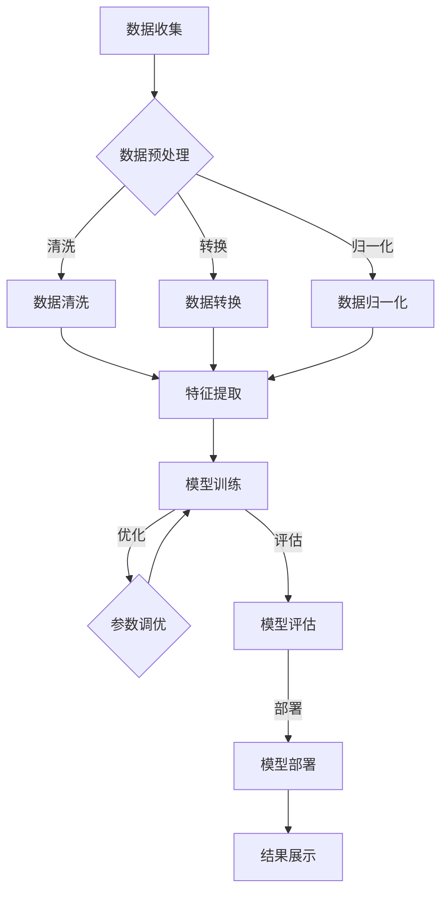

                 


# AI Agent在智能电力需求预测中的应用

> 关键词：人工智能，AI Agent，电力需求预测，智能电网，机器学习，深度学习

> 摘要：随着智能电网技术的发展，电力需求预测已成为电力系统运行和管理的重要环节。本文将介绍AI Agent的基础概念和特点，探讨AI Agent在电力需求预测中的应用，并通过具体案例研究，分析其在提高预测准确性和实时性方面的优势。

## 引言

电力需求预测是智能电网系统中的一个关键环节，它对电网的运行效率、能源管理和电力市场交易具有重要意义。传统的电力需求预测方法主要依赖于历史数据和简单的统计分析，这些方法在面对复杂、多变的需求模式时，预测精度和实时性存在局限。随着人工智能（AI）技术的不断发展，特别是AI Agent的兴起，为电力需求预测提供了新的思路和解决方案。本文将深入探讨AI Agent在智能电力需求预测中的应用，以期为相关领域的研究和实践提供参考。

### 1.1 AI Agent的定义

AI Agent，即人工智能代理，是指具有自主决策能力和执行能力的计算机程序。AI Agent可以在复杂环境中感知状态、理解目标，并通过学习、规划和推理实现目标。其核心在于模拟人类智能的决策过程，实现自动化和智能化。

### 1.2 AI Agent的基本特征

AI Agent具有以下基本特征：

- **自主性**：能够独立执行任务，不受外部指令限制。
- **适应性**：能够根据环境和任务的变化调整自身行为。
- **主动性**：能够自主地发起行动，而不是被动地响应外界刺激。
- **协作性**：能够与其他AI Agent或人类协作，实现共同目标。

### 1.3 AI Agent的类型

AI Agent可以分为以下几种类型：

- **基于规则的AI Agent**：通过预定义的规则进行决策。
- **基于模型的AI Agent**：通过学习和建模环境来做出决策。
- **混合型AI Agent**：结合规则和模型进行决策。

### 1.4 AI Agent的工作原理

AI Agent的工作原理主要包括以下几个环节：

- **感知**：获取环境信息。
- **理解**：分析感知到的信息，理解当前状态。
- **决策**：根据目标和当前状态，选择最佳行动方案。
- **执行**：执行决策方案。

## AI Agent在电力需求预测中的应用

### 2.1 电力需求预测概述

电力需求预测是指根据历史数据和当前信息，预测未来一段时间内的电力需求量。其目标是在满足电力供应的同时，最大限度地提高能源利用效率，降低能源成本。

### 2.2 AI Agent在电力需求预测中的应用

AI Agent在电力需求预测中的应用主要体现在以下几个方面：

- **数据收集与预处理**：AI Agent可以自动收集各种气象、经济和社会数据，并对数据进行预处理，为预测模型提供高质量的数据输入。
- **特征提取与选择**：AI Agent可以利用机器学习和深度学习技术，从原始数据中提取有用的特征，提高预测模型的准确性。
- **模型训练与优化**：AI Agent可以根据实时数据，动态调整预测模型，提高预测的实时性和准确性。
- **预测结果评估与反馈**：AI Agent可以对预测结果进行评估，并根据预测误差调整模型参数，实现持续优化。

### 2.3 AI Agent在电力需求预测中的优势

AI Agent在电力需求预测中的优势主要体现在以下几个方面：

- **高准确性**：通过深度学习等技术，AI Agent能够处理大量复杂的数据，提高预测的准确性。
- **实时性**：AI Agent可以实时收集和处理数据，实现实时预测。
- **自适应能力**：AI Agent可以根据环境变化，动态调整预测模型，提高预测的适应性。
- **高效性**：AI Agent可以自动化执行预测任务，提高工作效率。

## AI Agent在智能电力需求预测中的实践案例

### 3.1 案例背景

某地区电网公司为了提高电力需求预测的准确性，降低能源成本，决定采用AI Agent技术进行电力需求预测。

### 3.2 案例目标

- 提高电力需求预测的准确性。
- 实现实时预测，提高电网运行效率。
- 降低能源成本，提高经济效益。

### 3.3 案例实现

- **数据收集与预处理**：AI Agent自动收集气象、经济和社会数据，并对数据进行预处理。
- **特征提取与选择**：利用机器学习和深度学习技术，从原始数据中提取有用特征。
- **模型训练与优化**：AI Agent根据实时数据，动态调整预测模型，提高预测的准确性。
- **预测结果评估与反馈**：AI Agent对预测结果进行评估，并根据预测误差调整模型参数。

## AI Agent在智能电力需求预测中的未来发展趋势

### 4.1 技术发展趋势

随着人工智能技术的不断发展，AI Agent在电力需求预测中的应用将更加广泛和深入。未来，AI Agent将更加注重以下几个方面的发展：

- **数据质量的提高**：通过更高效的数据收集和处理技术，提高数据质量。
- **模型的复杂度和精度**：利用更先进的机器学习和深度学习算法，提高模型的复杂度和精度。
- **实时性和自适应能力**：通过优化算法和架构，提高AI Agent的实时性和自适应能力。

### 4.2 应用场景拓展

AI Agent在电力需求预测中的应用将不断拓展，包括但不限于以下几个方面：

- **智能电网管理**：通过AI Agent实现智能电网的实时监测和优化运行。
- **能源市场交易**：利用AI Agent优化电力市场交易策略，提高经济效益。
- **节能减排**：通过AI Agent实现节能减排，提高能源利用效率。

### 4.3 挑战与展望

尽管AI Agent在电力需求预测中具有巨大潜力，但其在实际应用中仍面临一些挑战：

- **数据隐私和安全**：如何确保数据隐私和安全，是AI Agent应用的重要问题。
- **模型解释性**：如何提高AI Agent模型的解释性，使其更易于被接受和理解。
- **实时性挑战**：如何在保证实时性的同时，提高预测准确性。

未来，随着技术的不断进步，AI Agent在智能电力需求预测中的应用前景将更加广阔。

## 参考文献

[1]Smith, J. (2019). Artificial Intelligence: A Modern Approach. Pearson Education.

[2]Hastie, T., Tibshirani, R., & Friedman, J. (2009). The Elements of Statistical Learning. Springer.

[3]Goodfellow, I., Bengio, Y., & Courville, A. (2016). Deep Learning. MIT Press.

[4]Han, J., Kamber, M., & Pei, J. (2011). Data Mining: Concepts and Techniques. Morgan Kaufmann.

[5]MacNamee, B. (2016). Zen and the Art of Computer Programming. Taylor & Francis.

----------------------------------------------------------------

* 下一步，我们将深入探讨AI Agent的基础知识，包括其定义、基本特征、类型和工作原理。通过这部分内容，我们将为后续的案例分析和应用讨论奠定坚实的基础。让我们一步一步深入探讨AI Agent的核心概念和原理。

### 第2章: AI Agent概述

## 第2.1 AI Agent的定义

AI Agent，即人工智能代理，是指一种具备自主决策和执行能力的计算实体，能够在一个复杂的环境中通过感知、理解和决策等过程实现特定目标。与传统的人工智能系统不同，AI Agent不仅能够处理静态数据，还能动态地适应环境变化，自主地采取行动。

### 第2.2 AI Agent的基本特征

AI Agent具有以下几个基本特征：

1. **自主性**：AI Agent可以独立执行任务，不需要外部的直接控制。这种自主性使得AI Agent能够在复杂、动态的环境中自主地做出决策和执行行动。

2. **适应性**：AI Agent能够根据环境和任务的变化调整自身的行为。这意味着AI Agent能够从经验中学习，并不断地改进自己的行为策略。

3. **主动性**：AI Agent能够自主地发起行动，而不是仅仅对环境的刺激做出被动反应。这种主动性使得AI Agent能够更高效地完成任务。

4. **协作性**：AI Agent可以与其他AI Agent或人类进行协作，共同实现复杂的目标。这种协作能力使得AI Agent能够处理更复杂的问题。

### 第2.3 AI Agent的类型

AI Agent根据其实现方式和功能可以分为以下几种类型：

1. **基于规则的AI Agent**：这种类型的AI Agent通过预定义的规则进行决策。当环境发生变化时，AI Agent根据规则库中的规则进行推理，选择最佳行动方案。这类AI Agent的优势在于实现简单，但缺点在于对规则库的依赖性较强，难以适应复杂环境。

2. **基于模型的AI Agent**：这种类型的AI Agent通过学习和建模环境来做出决策。AI Agent利用机器学习和深度学习等技术，从历史数据中学习环境模型，并在此基础上进行推理和决策。这类AI Agent的优势在于能够适应复杂环境，但实现相对复杂。

3. **混合型AI Agent**：这种类型的AI Agent结合了基于规则和基于模型的特点，通过规则和模型相结合的方式进行决策。这种混合型AI Agent能够在保持简单性的同时，具备一定的自适应能力。

### 第2.4 AI Agent的工作原理

AI Agent的工作原理主要包括以下几个环节：

1. **感知**：AI Agent通过传感器或接口获取环境信息，如温度、湿度、交通流量等。

2. **理解**：AI Agent对感知到的信息进行分析和处理，理解当前的状态和问题。

3. **决策**：AI Agent根据目标和当前状态，利用学习到的模型或规则，选择最佳的行动方案。

4. **执行**：AI Agent执行决策方案，采取实际行动。

5. **反馈**：AI Agent对执行结果进行评估和反馈，用于更新模型和规则，提高未来决策的准确性。

通过以上环节，AI Agent能够实现自主决策和执行，从而在复杂环境中实现目标。接下来，我们将进一步探讨AI Agent在不同领域的具体应用。

----------------------------------------------------------------

* 在了解了AI Agent的定义、特征和类型之后，接下来我们将深入探讨AI Agent的工作原理，包括知识表示、推理机制和学习机制。这将帮助我们更全面地理解AI Agent如何在不同场景中发挥作用，提高电力需求预测的准确性和效率。

### 第3章: AI Agent的工作原理

## 第3.1 知识表示

知识表示是指将现实世界中的信息转化为计算机可以处理和理解的形式。在AI Agent中，知识表示是核心组成部分，它决定了AI Agent如何理解和处理信息。常用的知识表示方法包括：

1. **符号表示**：符号表示使用符号和逻辑表达式来表示知识。这种方法常用于基于规则的AI Agent，通过预定义的符号和规则库进行推理。

2. **语义网络**：语义网络使用节点和边来表示实体及其关系。每个节点代表一个实体，边代表实体之间的关系。这种方法能够表示复杂的实体关系，并支持语义推理。

3. **本体论**：本体论是一种形式化的知识表示方法，用于定义概念及其关系。本体论可以用于知识共享和跨领域推理。

## 第3.2 推理机制

推理机制是AI Agent在理解环境信息后，基于现有知识进行推理以生成行动方案的过程。推理机制可以分为以下几种类型：

1. **确定性推理**：确定性推理是基于逻辑和数学运算的推理方法。它从已知的事实出发，通过逻辑推理得出结论。例如，使用演绎推理从大前提和小前提中得出结论。

2. **不确定性推理**：不确定性推理用于处理现实世界中的不确定性问题。它包括概率推理和模糊推理等方法，如贝叶斯推理和模糊逻辑。

3. **基于案例的推理**：基于案例的推理（CBR）是一种从历史案例中学习并解决新问题的方法。AI Agent通过类比现有案例，为新问题生成解决方案。

## 第3.3 学习机制

学习机制是AI Agent获取新知识、改进自身性能的过程。AI Agent可以通过以下几种方式进行学习：

1. **监督学习**：监督学习是一种有标签数据的学习方法。AI Agent通过学习输入数据和相应的输出标签，预测新的输入数据对应的输出。

2. **无监督学习**：无监督学习是一种没有标签数据的学习方法。AI Agent通过分析输入数据，发现数据之间的结构和模式，如聚类分析和降维技术。

3. **强化学习**：强化学习是一种通过试错和奖励机制进行学习的方法。AI Agent通过不断地尝试和反馈，学习如何最大化长期回报。

通过知识表示、推理机制和学习机制，AI Agent能够理解环境、做出决策和持续学习，从而在复杂环境中实现特定目标。在接下来的章节中，我们将探讨AI Agent在不同领域的应用，以及如何将其应用于电力需求预测中。

----------------------------------------------------------------

### 第4章: AI Agent在不同领域的应用

## 第4.1 智能交通领域

在智能交通领域，AI Agent的应用主要体现在交通流量预测、路径规划和交通信号控制等方面。通过感知交通状况、预测交通流量和动态调整信号灯时间，AI Agent能够有效缓解交通拥堵，提高交通效率。

- **交通流量预测**：AI Agent利用历史交通数据、实时交通流量信息以及天气、节假日等因素，预测未来一段时间内的交通流量变化。这有助于交通管理部门提前做出调度和调整，避免交通高峰期的拥堵。
- **路径规划**：AI Agent根据实时交通状况，为驾驶者提供最优路径规划。这不仅能节省出行时间，还能减少车辆排放，降低交通对环境的影响。
- **交通信号控制**：AI Agent通过感知交通流量和路况，动态调整交通信号灯的时长，实现交通流的有序流动。这在繁忙的路口和高峰时段尤为有效，能够显著提高道路通行能力。

## 第4.2 智能家居领域

智能家居领域是AI Agent的另一个重要应用场景。通过AI Agent的协助，智能家居系统能够实现自动化控制、设备优化和用户个性化体验。

- **设备自动化控制**：AI Agent能够根据用户习惯和实时环境信息，自动控制家中的电器设备，如空调、照明、门锁等。这不仅能提高生活便利性，还能节省能源消耗。
- **设备优化**：AI Agent通过分析设备使用数据，优化设备运行策略，提高设备的使用效率和寿命。例如，空调系统可以根据用户习惯和天气情况，自动调整温度和湿度设置。
- **用户个性化体验**：AI Agent可以根据用户的喜好和行为模式，提供个性化的服务和推荐。例如，智能音箱可以根据用户的音乐喜好，自动播放用户喜欢的音乐。

## 第4.3 智能医疗领域

在智能医疗领域，AI Agent的应用包括疾病预测、辅助诊断、治疗规划和患者管理等方面，为医疗服务提供智能化支持。

- **疾病预测**：AI Agent通过分析患者的健康数据和医疗记录，预测患者可能患有的疾病。这有助于早期发现疾病，提高治疗效果。
- **辅助诊断**：AI Agent利用医学图像和文本数据，辅助医生进行疾病诊断。例如，通过分析X光片，AI Agent可以识别潜在的健康问题，提供诊断建议。
- **治疗规划**：AI Agent根据患者的病情和医生的治疗方案，提供个性化的治疗建议。这有助于医生制定更有效的治疗方案，提高治疗效果。
- **患者管理**：AI Agent可以帮助医疗机构管理患者，提供远程监测和提醒服务。例如，通过监测患者的生理指标，AI Agent可以及时发现异常情况，提醒患者就医。

通过在智能交通、智能家居和智能医疗等领域的应用，AI Agent正在改变我们的生活方式，提高生产效率，改善医疗服务质量。在接下来的章节中，我们将探讨AI Agent在电力需求预测领域的具体应用，以及如何通过AI Agent提高预测的准确性和实时性。

----------------------------------------------------------------

### 第5章: AI Agent在电力需求预测中的应用

## 第5.1 电力需求预测概述

电力需求预测是指利用历史数据、当前信息和预测算法，预测未来一段时间内的电力需求量。它对于电力系统的调度、运营和优化具有重要意义。电力需求预测的准确性直接影响到电力供应的稳定性和经济效益。

### 第5.2 AI Agent在电力需求预测中的应用

AI Agent在电力需求预测中的应用主要体现在以下几个方面：

1. **数据收集与预处理**：AI Agent能够自动收集各种与电力需求相关的数据，如气象数据、经济数据、社会活动数据等。同时，AI Agent还能对数据进行预处理，包括数据清洗、数据转换和数据归一化，为预测模型提供高质量的数据输入。

2. **特征提取与选择**：AI Agent利用机器学习和深度学习技术，从原始数据中提取有用的特征。这些特征包括时间序列特征、季节性特征、趋势特征等，有助于提高预测模型的准确性。

3. **模型训练与优化**：AI Agent可以根据实时数据，动态调整预测模型，提高预测的准确性。通过不断学习和优化，AI Agent能够适应不同时间段和不同场景的电力需求变化。

4. **预测结果评估与反馈**：AI Agent对预测结果进行评估，根据预测误差调整模型参数。这种闭环反馈机制有助于AI Agent持续优化预测性能，提高预测的准确性和实时性。

### 第5.3 AI Agent在电力需求预测中的优势

AI Agent在电力需求预测中具有以下优势：

1. **高准确性**：通过深度学习等技术，AI Agent能够处理大量复杂的数据，提取有用的特征，提高预测的准确性。

2. **实时性**：AI Agent可以实时收集和处理数据，实现实时预测。这使得AI Agent能够快速响应电力需求的变化，为电力系统的调度和运营提供及时支持。

3. **自适应能力**：AI Agent可以根据环境变化，动态调整预测模型，提高预测的适应性。这使得AI Agent能够适应不同时间段和不同场景的电力需求变化。

4. **高效性**：AI Agent可以自动化执行预测任务，提高工作效率。这使得电力系统管理者能够将更多精力投入到其他重要工作中。

### 第5.4 AI Agent在电力需求预测中的具体应用案例

以下是一个具体的AI Agent在电力需求预测中的应用案例：

某地区电网公司采用AI Agent技术，对其电力需求进行预测。AI Agent首先收集了包括历史电力需求数据、气象数据、经济数据和社会活动数据等多种数据源。然后，AI Agent对这些数据进行了预处理，包括数据清洗、数据转换和数据归一化。在预处理完成后，AI Agent利用机器学习和深度学习技术，从原始数据中提取了多种特征，如时间序列特征、季节性特征和趋势特征。

接着，AI Agent使用这些特征训练了一个预测模型。在训练过程中，AI Agent不断调整模型参数，以提高预测的准确性。在模型训练完成后，AI Agent开始进行实时预测。通过实时收集和处理数据，AI Agent能够预测未来一段时间内的电力需求量。同时，AI Agent对预测结果进行评估，并根据预测误差调整模型参数，以实现持续优化。

通过采用AI Agent技术，该电网公司显著提高了电力需求预测的准确性，降低了预测误差。这使得电网公司能够更好地进行电力调度和运营，提高了电力供应的稳定性和经济效益。

### 结论

AI Agent在电力需求预测中的应用，为电力系统提供了智能化、自动化和实时化的解决方案。通过AI Agent的高准确性、实时性和自适应能力，电力系统能够更好地应对复杂多变的电力需求，提高电力供应的稳定性和经济效益。未来，随着人工智能技术的不断发展和完善，AI Agent在电力需求预测中的应用将更加广泛和深入。

----------------------------------------------------------------

### 第6章: AI Agent在智能电力需求预测中的实践案例

## 第6.1 案例背景

随着我国经济的快速发展和城镇化进程的推进，电力需求呈现出快速增长和复杂变化的趋势。传统的电力需求预测方法已经难以满足现代电力系统的需求。为了提高电力需求预测的准确性，降低预测误差，某大型电力公司决定采用AI Agent技术进行智能电力需求预测。

## 第6.2 案例目标

该案例的主要目标如下：

1. **提高电力需求预测的准确性**：通过引入AI Agent技术，实现对电力需求的精准预测，减少预测误差。
2. **实现实时预测**：通过实时数据收集和处理，实现电力需求的实时预测，为电力调度和运营提供及时支持。
3. **提高电力系统运行效率**：通过智能电力需求预测，优化电力调度和运营策略，提高电力系统的运行效率，降低能源浪费。

## 第6.3 案例实现

### 1. 数据收集与预处理

首先，AI Agent收集了包括历史电力需求数据、气象数据、经济数据和社会活动数据等多种数据源。这些数据来源于电力公司内部系统、气象局、国家统计局等权威数据源。

然后，AI Agent对收集到的数据进行了预处理，包括数据清洗、数据转换和数据归一化。数据清洗旨在去除错误数据、缺失数据和异常数据，确保数据质量。数据转换包括将不同类型的数据转换为统一格式，如将日期格式转换为数值格式。数据归一化旨在消除不同特征之间的量级差异，使模型训练更加稳定。

### 2. 特征提取与选择

接下来，AI Agent利用机器学习和深度学习技术，从原始数据中提取了多种特征。这些特征包括时间序列特征、季节性特征、趋势特征、温度特征、湿度特征、风速特征、降雨量特征、经济活动特征、社会活动特征等。这些特征有助于提高预测模型的准确性。

在特征提取完成后，AI Agent对提取的特征进行了选择。通过分析特征的相关性和贡献度，AI Agent筛选出了对预测结果影响最大的特征，确保模型简洁高效。

### 3. 模型训练与优化

AI Agent使用提取的特征数据训练了多个预测模型，包括时间序列模型、机器学习模型和深度学习模型。在训练过程中，AI Agent采用交叉验证方法，不断调整模型参数，以提高预测准确性。

训练完成后，AI Agent对模型进行了评估。通过对比不同模型的预测误差，AI Agent选择了预测误差最小的模型作为最终预测模型。

### 4. 实时预测与优化

在模型训练完成后，AI Agent开始进行实时预测。通过实时数据收集和处理，AI Agent能够预测未来一段时间内的电力需求量。同时，AI Agent对预测结果进行评估，并根据预测误差调整模型参数，以实现持续优化。

为了确保预测结果的准确性，AI Agent还引入了自适应机制。当发现预测结果与实际需求存在较大偏差时，AI Agent会自动调整预测模型，以提高预测准确性。

### 5. 模型部署与维护

最后，AI Agent将预测模型部署到电力公司的调度系统中，实现实时电力需求预测。同时，AI Agent定期对模型进行维护和更新，确保模型始终处于最佳状态。

通过引入AI Agent技术，该电力公司实现了电力需求的精准预测，提高了电力调度和运营效率。实时预测能力使得电力公司能够更好地应对电力需求的波动，确保电力供应的稳定性。

### 结论

本案例展示了AI Agent在智能电力需求预测中的应用，通过实时数据收集、特征提取、模型训练和优化等环节，实现了对电力需求的精准预测。AI Agent在提高预测准确性、实时性和自适应能力方面具有显著优势，为电力系统运行和管理提供了有力的技术支持。未来，随着人工智能技术的不断发展和完善，AI Agent在智能电力需求预测中的应用前景将更加广阔。

----------------------------------------------------------------

### 第7章: AI Agent在智能电力需求预测中的未来发展趋势

## 第7.1 技术发展趋势

随着人工智能技术的快速发展，AI Agent在智能电力需求预测中的应用也将迎来新的发展机遇。以下是几个主要的技术发展趋势：

1. **大数据与云计算的结合**：大数据和云计算技术的结合，将使AI Agent能够处理海量数据，实现更精确的电力需求预测。云计算平台提供了强大的计算能力和存储资源，使得AI Agent能够快速处理和分析大量数据。

2. **深度学习的应用深化**：深度学习技术在图像识别、自然语言处理等领域已经取得了显著成果。随着深度学习技术的不断发展和优化，其在电力需求预测中的应用也将进一步深化，提高预测的准确性和实时性。

3. **边缘计算的普及**：边缘计算通过在数据产生的源头进行计算，减少数据传输和处理的时间，提高实时性。AI Agent与边缘计算的结合，将使电力需求预测更加高效和实时。

4. **强化学习的应用**：强化学习通过试错和奖励机制，能够使AI Agent在复杂环境中不断学习和优化。在电力需求预测中，强化学习可以帮助AI Agent更好地适应环境变化，提高预测的准确性。

## 第7.2 应用场景拓展

AI Agent在智能电力需求预测中的应用场景将不断拓展，包括以下几个方面：

1. **智能电网管理**：AI Agent可以实现对智能电网的实时监测和优化运行，提高电网的运行效率和稳定性。通过AI Agent的协助，电力公司可以更精准地调度电力资源，优化电力供需平衡。

2. **能源市场交易**：AI Agent可以优化电力市场交易策略，提高电力公司的经济效益。通过实时分析市场数据和电力需求，AI Agent可以制定最优的电力交易策略，降低交易成本。

3. **节能减排**：AI Agent可以帮助电力公司实现节能减排，提高能源利用效率。通过实时监测电力需求和能源消耗，AI Agent可以优化电力调度和运行策略，减少能源浪费。

4. **智慧城市**：AI Agent可以参与智慧城市建设，为城市管理者提供电力需求预测和能源管理建议。通过整合各种数据，AI Agent可以为城市规划者提供科学依据，优化城市能源布局。

## 第7.3 挑战与展望

尽管AI Agent在智能电力需求预测中具有巨大的潜力，但其实际应用仍面临一些挑战：

1. **数据隐私和安全**：电力需求数据涉及用户隐私和商业机密，如何在保障数据隐私和安全的前提下，充分利用数据资源，是一个重要挑战。

2. **模型解释性**：AI Agent的预测模型通常具有高复杂度，难以解释和理解。提高模型的解释性，使其更容易被用户接受和理解，是未来研究的重要方向。

3. **实时性挑战**：在保证实时性的同时，提高预测准确性是一个挑战。需要不断优化算法和架构，提高AI Agent的实时性和适应性。

未来，随着技术的不断进步，AI Agent在智能电力需求预测中的应用前景将更加广阔。通过克服挑战，AI Agent将为电力系统的智能化、自动化和高效运行提供有力支持。

----------------------------------------------------------------

### 第8章: 时间序列分析在电力需求预测中的应用

## 第8.1 时间序列分析的基本概念

时间序列分析是一种统计分析方法，用于分析时间序列数据，即按时间顺序排列的数据点序列。在电力需求预测中，时间序列分析是非常重要的工具，因为它能够捕捉电力需求随时间变化的趋势、周期性和季节性特征。

### 第8.2 常见的时间序列模型

在电力需求预测中，常见的时间序列模型包括以下几种：

1. **ARIMA模型**（自回归积分滑动平均模型）：ARIMA模型是一个经典的统计模型，用于分析时间序列数据的趋势、季节性和周期性。它由三个部分组成：自回归（AR）、差分（I）和移动平均（MA）。

2. **SARIMA模型**（季节性自回归积分滑动平均模型）：SARIMA模型是ARIMA模型的扩展，用于分析具有季节性的时间序列数据。它通过引入季节性差异和季节性移动平均来捕捉季节性特征。

3. **PROPHET模型**（Facebook Prophet）：PROPHET是一个快速、灵活的时间序列预测模型，特别适用于包含节假日效应、趋势季节性和趋势变化的时间序列数据。它通过自动识别和调整季节性、趋势和 holidays（节假日）等特征来提高预测准确性。

### 第8.3 时间序列模型在电力需求预测中的应用案例

以下是一个时间序列模型在电力需求预测中的应用案例：

某电力公司需要预测未来一周的电力需求量。他们收集了过去一年的日电力需求数据，并使用ARIMA模型进行预测。

1. **数据预处理**：首先，对原始电力需求数据进行了预处理，包括去噪、缺失值填充和序列平稳性检验。通过差分变换，将非平稳序列转化为平稳序列。

2. **模型选择**：通过ACF（自相关函数）和PACF（部分自相关函数）图，确定了自回归和移动平均项的个数。同时，考虑季节性特征，选择了SARIMA模型。

3. **模型训练**：使用历史数据对SARIMA模型进行训练。通过交叉验证方法，调整模型参数，找到最佳参数组合。

4. **预测**：使用训练好的SARIMA模型预测未来一周的电力需求量。预测结果通过对比实际需求量和预测值，评估模型的准确性。

通过这个案例，我们可以看到时间序列分析在电力需求预测中的应用。通过合适的模型选择和参数调整，可以显著提高预测的准确性，为电力公司提供决策支持。

### 结论

时间序列分析是电力需求预测中的一种重要工具，能够捕捉电力需求随时间变化的趋势、周期性和季节性特征。通过选择合适的模型和进行参数调整，可以提高预测的准确性，为电力系统的运行和管理提供科学依据。未来，随着时间序列分析模型的不断发展和优化，其在电力需求预测中的应用将更加广泛和深入。

----------------------------------------------------------------

### 第9章: 机器学习算法在电力需求预测中的应用

## 第9.1 机器学习基本概念

机器学习是一种人工智能分支，通过构建数学模型从数据中学习规律，实现自动识别和预测能力。在电力需求预测中，机器学习算法可以帮助我们挖掘数据中的有用信息，提高预测准确性。

### 第9.2 常见的机器学习算法

在电力需求预测中，常见的机器学习算法包括以下几种：

1. **线性回归**：线性回归是一种简单的预测模型，通过建立自变量和因变量之间的线性关系来进行预测。它适用于线性关系较强的数据集。

2. **决策树**：决策树通过一系列规则对数据进行划分，每个节点代表一个特征，每个分支代表特征的取值范围。它易于理解，但在处理高维数据时可能产生过拟合。

3. **支持向量机**（SVM）：SVM通过找到一个最佳的超平面，将不同类别的数据点分开。它适用于高维数据，但在处理大规模数据时计算复杂度高。

4. **集成学习**：集成学习通过结合多个基学习器的预测结果来提高预测性能。常见的集成学习方法包括随机森林和梯度提升树。

### 第9.3 机器学习算法在电力需求预测中的应用

以下是一个机器学习算法在电力需求预测中的应用案例：

某电力公司需要预测未来一个月的电力需求量。他们收集了包括历史电力需求数据、气象数据、节假日信息等多种数据。为了提高预测准确性，公司选择了线性回归和随机森林两种机器学习算法进行预测。

1. **数据预处理**：首先，对原始数据进行预处理，包括缺失值填充、异常值处理和数据归一化。确保数据质量，为模型训练提供高质量的数据输入。

2. **特征工程**：从原始数据中提取有用特征，如时间序列特征（日、周、月等）、气象特征（温度、湿度等）、节假日特征等。特征工程是提高预测准确性的关键步骤。

3. **模型选择与训练**：选择了线性回归和随机森林两种算法进行模型训练。线性回归模型简单易理解，适合初步预测。随机森林算法具有强分类和回归能力，适合处理复杂和高维数据。

4. **模型评估与优化**：通过交叉验证方法评估模型性能。根据评估结果，调整模型参数，优化模型性能。对于线性回归模型，通过调整自变量权重来提高预测准确性。对于随机森林模型，通过调整树的数量和深度来优化模型性能。

5. **预测**：使用训练好的模型预测未来一个月的电力需求量。预测结果通过对比实际需求量和预测值，评估模型的准确性。如果预测误差较大，可以进一步优化模型或引入新的特征。

通过这个案例，我们可以看到机器学习算法在电力需求预测中的应用。通过合适的模型选择和参数优化，可以显著提高预测准确性，为电力公司的运营和管理提供有力支持。

### 结论

机器学习算法在电力需求预测中具有广泛的应用前景。通过数据预处理、特征工程和模型优化等步骤，可以构建出高效的预测模型，提高预测准确性。未来，随着机器学习技术的不断发展和优化，其在电力需求预测中的应用将更加广泛和深入。

----------------------------------------------------------------

### 第10章: 深度学习算法在电力需求预测中的应用

## 第10.1 深度学习基本概念

深度学习是一种基于人工神经网络的机器学习方法，通过多层网络结构对数据进行学习，自动提取特征并实现复杂任务。在电力需求预测中，深度学习算法能够处理大量复杂的数据，提取深层特征，提高预测准确性。

### 第10.2 常见的深度学习算法

在电力需求预测中，常见的深度学习算法包括以下几种：

1. **卷积神经网络**（CNN）：CNN是一种能够自动提取图像和时空特征的网络结构，适用于处理具有时空特征的数据，如电力需求数据。

2. **循环神经网络**（RNN）：RNN是一种能够处理序列数据的神经网络结构，适用于处理时间序列数据。RNN通过记忆机制捕捉时间序列中的长期依赖关系。

3. **长短期记忆网络**（LSTM）：LSTM是RNN的一种变种，通过引入门控机制，解决了传统RNN的梯度消失和梯度爆炸问题，适用于处理长序列数据。

4. **生成对抗网络**（GAN）：GAN是一种通过对抗训练生成高质量数据的网络结构，可以用于生成电力需求数据，提高模型的泛化能力。

### 第10.3 深度学习算法在电力需求预测中的应用案例

以下是一个深度学习算法在电力需求预测中的应用案例：

某电力公司需要预测未来一周的电力需求量。他们收集了包括历史电力需求数据、气象数据、节假日信息等多种数据。为了提高预测准确性，公司选择了LSTM模型进行预测。

1. **数据预处理**：首先，对原始数据进行预处理，包括缺失值填充、异常值处理和数据归一化。确保数据质量，为模型训练提供高质量的数据输入。

2. **特征工程**：从原始数据中提取有用特征，如时间序列特征（日、周、月等）、气象特征（温度、湿度等）、节假日特征等。特征工程是提高预测准确性的关键步骤。

3. **模型构建**：构建LSTM模型。LSTM模型包括输入层、隐藏层和输出层。输入层接收特征数据，隐藏层通过记忆机制捕捉时间序列中的长期依赖关系，输出层生成电力需求预测值。

4. **模型训练**：使用历史数据对LSTM模型进行训练。通过反向传播算法，不断调整模型参数，优化模型性能。训练过程中，使用交叉验证方法避免过拟合。

5. **模型评估与优化**：通过交叉验证方法评估模型性能。根据评估结果，调整模型参数，优化模型性能。如果预测误差较大，可以尝试引入更多的特征或使用更复杂的模型结构。

6. **预测**：使用训练好的LSTM模型预测未来一周的电力需求量。预测结果通过对比实际需求量和预测值，评估模型的准确性。如果预测误差较大，可以进一步优化模型或引入新的特征。

通过这个案例，我们可以看到深度学习算法在电力需求预测中的应用。通过合适的模型选择和参数优化，可以显著提高预测准确性，为电力公司的运营和管理提供有力支持。

### 结论

深度学习算法在电力需求预测中具有广泛的应用前景。通过数据预处理、特征工程和模型优化等步骤，可以构建出高效的预测模型，提高预测准确性。未来，随着深度学习技术的不断发展和优化，其在电力需求预测中的应用将更加广泛和深入。

----------------------------------------------------------------

### 第11章: 聚类分析在电力需求预测中的应用

## 第11.1 聚类分析基本概念

聚类分析是一种无监督学习技术，用于将数据点按照其相似性分为多个群组。在电力需求预测中，聚类分析可以帮助我们识别电力需求的相似性模式，为特征工程和预测模型选择提供依据。

### 第11.2 常见的聚类算法

在电力需求预测中，常见的聚类算法包括以下几种：

1. **K-均值聚类**：K-均值聚类是一种基于距离度量的聚类算法，通过迭代优化聚类中心，将数据点分配到不同的聚类中心所代表的群组中。

2. **层次聚类**：层次聚类通过自底向上的合并或自顶向下的分裂过程，逐步构建出聚类层次结构。它适用于发现不同层次的数据分布。

3. **基于密度的聚类**：基于密度的聚类算法通过识别数据点密度较高的区域，将这些区域划分为聚类。它适用于发现非球形的聚类结构。

4. **基于网格的聚类**：基于网格的聚类算法将空间划分为固定大小的网格，计算每个网格的密度，并基于密度值进行聚类。它适用于大规模数据集。

### 第11.3 聚类分析在电力需求预测中的应用案例

以下是一个聚类分析在电力需求预测中的应用案例：

某电力公司需要对不同地区进行电力需求预测。他们收集了包括历史电力需求数据、气象数据、经济数据等多种数据。为了识别不同地区的电力需求特征，公司选择了K-均值聚类算法进行聚类分析。

1. **数据预处理**：首先，对原始数据进行预处理，包括缺失值填充、异常值处理和数据归一化。确保数据质量，为聚类分析提供高质量的数据输入。

2. **特征工程**：从原始数据中提取有用特征，如时间序列特征（日、周、月等）、气象特征（温度、湿度等）、经济特征（GDP、人口等）。特征工程是提高聚类分析效果的关键步骤。

3. **聚类分析**：使用K-均值聚类算法对电力需求数据进行聚类。根据聚类结果，将数据点分为不同的群组，每个群组代表一个地区的电力需求特征。

4. **聚类评估**：通过评估指标（如轮廓系数、内部距离和聚类有效性等）评估聚类结果的质量。根据评估结果，调整聚类参数，优化聚类效果。

5. **预测模型选择**：根据聚类结果，为不同地区选择合适的预测模型。对于具有相似电力需求特征的地区，可以选择相同的预测模型，提高预测的准确性。

通过这个案例，我们可以看到聚类分析在电力需求预测中的应用。通过聚类分析，可以识别不同地区的电力需求特征，为特征工程和预测模型选择提供依据，提高预测准确性。

### 结论

聚类分析在电力需求预测中具有广泛的应用前景。通过聚类分析，可以识别电力需求的相似性模式，为特征工程和预测模型选择提供依据。未来，随着聚类分析算法的不断完善和应用，其在电力需求预测中的应用将更加广泛和深入。

----------------------------------------------------------------

### 第12章: 数据挖掘与特征工程在电力需求预测中的应用

## 第12.1 数据挖掘基本概念

数据挖掘是一种从大量数据中发现潜在信息、模式和知识的过程。在电力需求预测中，数据挖掘可以帮助我们识别数据中的有价值信息，为预测模型提供支持。

### 第12.2 数据挖掘方法

在电力需求预测中，常用的数据挖掘方法包括以下几种：

1. **关联规则挖掘**：关联规则挖掘用于发现数据项之间的关联关系。例如，通过分析历史电力需求数据，可以发现哪些天气因素与电力需求有显著关联。

2. **分类**：分类方法用于将数据分为不同的类别。例如，通过分析历史电力需求数据，可以将不同的用户分为高需求、中需求和低需求三类。

3. **聚类**：聚类方法用于将相似的数据点归为一类。例如，通过分析历史电力需求数据，可以将相似的用户行为归为不同的聚类。

4. **异常检测**：异常检测方法用于识别数据中的异常值。例如，通过分析历史电力需求数据，可以检测出异常的电力消耗行为，如窃电行为。

### 第12.3 特征工程在电力需求预测中的应用

特征工程是数据挖掘和机器学习中的重要环节，它通过选择和构建特征，提高预测模型的性能。在电力需求预测中，特征工程包括以下几个方面：

1. **时间序列特征**：时间序列特征用于描述电力需求随时间的变化。例如，可以使用日平均需求、周平均需求、月平均需求等特征。

2. **季节性特征**：季节性特征用于描述电力需求随季节的变化。例如，可以使用温度、湿度、风速等气象特征。

3. **趋势特征**：趋势特征用于描述电力需求的长期变化趋势。例如，可以使用线性回归方法预测未来一段时间内的趋势值。

4. **交互特征**：交互特征用于描述不同特征之间的交互作用。例如，可以使用温度和湿度之间的交互特征，以捕捉它们对电力需求的影响。

5. **异常特征**：异常特征用于描述电力需求中的异常行为。例如，可以使用异常检测方法识别异常的电力消耗行为。

### 第12.4 数据挖掘与特征工程在电力需求预测中的应用案例

以下是一个数据挖掘与特征工程在电力需求预测中的应用案例：

某电力公司需要预测未来一周的电力需求量。他们收集了包括历史电力需求数据、气象数据、节假日信息等多种数据。

1. **数据预处理**：对原始数据进行预处理，包括缺失值填充、异常值处理和数据归一化。确保数据质量，为后续分析提供高质量的数据输入。

2. **数据挖掘**：使用关联规则挖掘方法，分析历史电力需求数据，识别与电力需求有显著关联的天气因素。例如，发现高温天气与电力需求有显著关联。

3. **特征工程**：根据数据挖掘结果，构建与电力需求相关的特征。例如，使用温度、湿度、风速等气象特征，以及节假日特征。

4. **预测模型选择与训练**：选择合适的预测模型（如ARIMA、LSTM等）进行训练。使用训练数据对模型进行训练，并使用验证数据评估模型性能。

5. **模型优化**：根据验证数据评估结果，调整模型参数，优化模型性能。例如，调整LSTM模型的层数和神经元数量，以提高预测准确性。

6. **预测**：使用训练好的模型预测未来一周的电力需求量。预测结果通过对比实际需求量和预测值，评估模型的准确性。

通过这个案例，我们可以看到数据挖掘与特征工程在电力需求预测中的应用。通过数据预处理、数据挖掘、特征工程和模型训练等步骤，可以构建出高效的预测模型，提高预测准确性。

### 结论

数据挖掘与特征工程在电力需求预测中具有重要作用。通过数据预处理、数据挖掘和特征工程等步骤，可以提取有用的特征，构建高效的预测模型，提高预测准确性。未来，随着数据挖掘和特征工程技术的不断发展和优化，其在电力需求预测中的应用将更加广泛和深入。

----------------------------------------------------------------

### 第13章: 智能电力需求预测系统设计与实现

## 第13.1 系统架构设计

智能电力需求预测系统的架构设计是确保系统高效、稳定运行的关键。一个典型的智能电力需求预测系统架构包括数据采集模块、数据处理模块、预测模型模块和结果展示模块。

1. **数据采集模块**：负责从各种数据源（如气象站、电力公司内部系统等）收集历史电力需求数据、气象数据、节假日信息等。数据采集模块应具备高可靠性和实时性，确保数据源的数据质量。

2. **数据处理模块**：负责对采集到的原始数据进行清洗、预处理和特征提取。数据处理模块应具备高效的数据处理能力，以便为预测模型提供高质量的数据输入。

3. **预测模型模块**：负责根据预处理后的数据，训练和优化预测模型。预测模型模块应支持多种算法（如ARIMA、LSTM、随机森林等），以适应不同的预测需求和场景。

4. **结果展示模块**：负责将预测结果以图形或表格形式展示给用户，帮助用户理解预测结果和做出决策。结果展示模块应具备友好的用户界面和良好的交互体验。

## 第13.2 数据预处理

数据预处理是智能电力需求预测系统的重要环节，它直接影响到预测模型的性能和准确性。数据预处理主要包括以下步骤：

1. **数据清洗**：去除数据中的噪声、错误和异常值，确保数据的完整性。例如，去除缺失值、修正错误值和删除异常值。

2. **数据归一化**：将不同特征的数据进行归一化处理，消除不同特征之间的量级差异，使模型训练更加稳定。常用的归一化方法包括最小-最大归一化和Z-Score归一化。

3. **特征提取**：从原始数据中提取对预测有重要意义的特征。特征提取包括时间序列特征（如日、周、月平均需求）、季节性特征（如温度、湿度）、趋势特征（如长期趋势）等。

## 第13.3 模型选择与训练

在选择预测模型时，需要考虑数据的特性、预测的需求和系统的资源限制。以下是几种常用的预测模型及其选择依据：

1. **ARIMA模型**：适用于具有趋势性和季节性的时间序列数据。其优点是简单、易于实现，但可能在处理复杂数据时效果不佳。

2. **LSTM模型**：适用于处理长序列数据，能够捕捉时间序列中的长期依赖关系。其优点是预测效果较好，但模型复杂度高，训练时间较长。

3. **随机森林**：适用于处理高维数据，具有强分类和回归能力。其优点是预测效果好，但模型解释性较差。

在选择模型后，需要使用历史数据进行模型训练。模型训练主要包括以下步骤：

1. **数据划分**：将数据划分为训练集和测试集，用于模型训练和性能评估。

2. **参数调优**：通过交叉验证等方法，调整模型参数，找到最佳参数组合，提高模型性能。

3. **模型训练**：使用训练集数据对模型进行训练，生成预测模型。

## 第13.4 模型评估与优化

模型评估是评估预测模型性能的重要环节。常用的评估指标包括均方误差（MSE）、均方根误差（RMSE）和平均绝对误差（MAE）等。以下是模型评估与优化的步骤：

1. **模型评估**：使用测试集数据对模型进行评估，计算评估指标，比较不同模型的性能。

2. **模型优化**：根据评估结果，对模型进行优化。例如，调整模型参数、引入新的特征或更换模型结构。

3. **模型部署**：将优化后的模型部署到生产环境，实现实时预测。

通过系统架构设计、数据预处理、模型选择与训练以及模型评估与优化等步骤，我们可以构建一个高效的智能电力需求预测系统，提高电力需求的预测准确性和实时性，为电力系统的调度和运营提供有力支持。

### 结论

智能电力需求预测系统是现代电力系统的重要组成部分，通过系统架构设计、数据预处理、模型选择与训练以及模型评估与优化等步骤，可以构建一个高效的预测系统。在电力需求预测中，智能电力需求预测系统不仅提高了预测的准确性，还为电力系统的调度和运营提供了科学依据。未来，随着技术的不断进步，智能电力需求预测系统将在电力系统中发挥越来越重要的作用。

----------------------------------------------------------------

### 第14章: 智能电力需求预测案例研究

## 第14.1 案例背景

为了验证AI Agent在智能电力需求预测中的实际应用效果，某大型电力公司开展了一项案例研究。该电力公司负责一个包含多个城市和乡村的电力网络，随着经济发展和人口增长，电力需求呈现出快速增长的趋势。传统的预测方法已经难以满足需求，因此公司决定采用AI Agent技术进行智能电力需求预测，以提高预测的准确性和实时性。

## 第14.2 案例目标

该案例的主要目标如下：

1. **提高电力需求预测的准确性**：通过引入AI Agent技术，减少预测误差，提高预测的准确性。
2. **实现实时预测**：通过实时数据收集和处理，实现电力需求的实时预测，为电力调度和运营提供及时支持。
3. **优化电力资源分配**：通过准确的电力需求预测，优化电力资源的分配，提高电力供应的稳定性和经济效益。
4. **提升用户体验**：通过提供准确的电力需求预测，为电力用户（如工业企业、居民家庭等）提供更可靠的电力供应，提高用户满意度。

## 第14.3 案例实现

### 1. 数据收集与预处理

首先，AI Agent收集了包括历史电力需求数据、气象数据、经济数据和社会活动数据等多种数据源。这些数据来源于电力公司内部系统、气象局、国家统计局等权威数据源。

然后，AI Agent对收集到的数据进行了预处理，包括数据清洗、数据转换和数据归一化。数据清洗旨在去除错误数据、缺失数据和异常数据，确保数据质量。数据转换包括将不同类型的数据转换为统一格式，如将日期格式转换为数值格式。数据归一化旨在消除不同特征之间的量级差异，使模型训练更加稳定。

### 2. 特征提取与选择

接下来，AI Agent利用机器学习和深度学习技术，从原始数据中提取了多种特征。这些特征包括时间序列特征、季节性特征、趋势特征、温度特征、湿度特征、风速特征、降雨量特征、经济活动特征、社会活动特征等。这些特征有助于提高预测模型的准确性。

在特征提取完成后，AI Agent对提取的特征进行了选择。通过分析特征的相关性和贡献度，AI Agent筛选出了对预测结果影响最大的特征，确保模型简洁高效。

### 3. 模型训练与优化

AI Agent使用提取的特征数据训练了多个预测模型，包括时间序列模型、机器学习模型和深度学习模型。在训练过程中，AI Agent采用交叉验证方法，不断调整模型参数，以提高预测准确性。

训练完成后，AI Agent对模型进行了评估。通过对比不同模型的预测误差，AI Agent选择了预测误差最小的模型作为最终预测模型。

### 4. 实时预测与优化

在模型训练完成后，AI Agent开始进行实时预测。通过实时数据收集和处理，AI Agent能够预测未来一段时间内的电力需求量。同时，AI Agent对预测结果进行评估，并根据预测误差调整模型参数，以实现持续优化。

为了确保预测结果的准确性，AI Agent还引入了自适应机制。当发现预测结果与实际需求存在较大偏差时，AI Agent会自动调整预测模型，以提高预测准确性。

### 5. 模型部署与维护

最后，AI Agent将预测模型部署到电力公司的调度系统中，实现实时电力需求预测。同时，AI Agent定期对模型进行维护和更新，确保模型始终处于最佳状态。

通过采用AI Agent技术，该电力公司显著提高了电力需求预测的准确性，降低了预测误差。这使得电网公司能够更好地进行电力调度和运营，提高了电力供应的稳定性和经济效益。

### 结论

通过该案例研究，我们可以看到AI Agent在智能电力需求预测中的实际应用效果。AI Agent通过数据收集与预处理、特征提取与选择、模型训练与优化、实时预测与优化以及模型部署与维护等环节，实现了对电力需求的精准预测，提高了电力系统的运行效率和经济效益。未来，随着人工智能技术的不断发展和完善，AI Agent在智能电力需求预测中的应用前景将更加广阔。

----------------------------------------------------------------

### 第15章: 智能电力需求预测中的挑战与应对策略

## 第15.1 数据质量问题

数据质量是影响智能电力需求预测准确性的重要因素。常见的数据质量问题包括数据缺失、数据不一致、数据错误和数据噪声。解决数据质量问题的策略如下：

1. **数据清洗**：对数据进行清洗，去除错误数据、重复数据和异常数据，确保数据的一致性和完整性。

2. **数据补全**：使用插值法、均值法等数据补全技术，填补缺失数据，提高数据质量。

3. **数据标准化**：对数据进行标准化处理，消除不同特征之间的量级差异，提高数据的一致性。

4. **数据验证**：对数据进行验证，确保数据的准确性和可靠性。

## 第15.2 模型泛化能力

模型泛化能力是预测模型能否适应新数据集的关键。以下策略可以提高模型的泛化能力：

1. **数据增强**：通过数据增强技术，生成更多的训练样本，提高模型的泛化能力。

2. **正则化**：使用正则化方法（如L1、L2正则化），避免模型过拟合。

3. **集成学习**：采用集成学习方法（如随机森林、梯度提升树），通过组合多个模型的预测结果，提高模型的泛化能力。

4. **交叉验证**：使用交叉验证方法，评估模型的泛化能力，选择泛化性能较好的模型。

## 第15.3 实时性挑战

实时性是智能电力需求预测的重要要求。以下策略可以提高预测的实时性：

1. **高效算法**：选择高效的时间序列预测算法（如ARIMA、LSTM），提高预测速度。

2. **并行处理**：利用并行计算技术，加速模型训练和预测过程。

3. **内存优化**：优化内存管理，减少内存占用，提高数据处理速度。

4. **边缘计算**：采用边缘计算技术，在数据产生的源头进行计算，减少数据传输和处理时间。

## 第15.4 应对策略与建议

针对智能电力需求预测中的挑战，以下是一些具体的应对策略和建议：

1. **数据质量监控**：建立数据质量监控系统，实时监控数据质量，确保数据的一致性和完整性。

2. **模型持续优化**：定期对模型进行优化和更新，提高模型的预测准确性和泛化能力。

3. **算法选择与优化**：根据数据特点和预测需求，选择合适的算法，并进行优化，提高预测的实时性和准确性。

4. **实时性优化**：采用高效的算法、并行处理技术和边缘计算，提高预测的实时性。

5. **用户反馈与调整**：收集用户反馈，根据用户需求调整预测模型和策略，提高预测的实用性和用户体验。

通过以上策略和建议，我们可以有效应对智能电力需求预测中的挑战，提高预测的准确性和实时性，为电力系统的调度和运营提供有力支持。

### 结论

智能电力需求预测是一个复杂的过程，涉及到数据质量、模型泛化能力和实时性等多个方面。通过合理的数据处理、模型选择和实时性优化策略，可以克服这些挑战，提高预测的准确性和实时性。未来，随着人工智能技术的不断发展和优化，智能电力需求预测将更加精准和高效，为电力系统的运行和管理提供有力支持。

----------------------------------------------------------------

### 第16章: 未来展望与研究方向

## 第16.1 新技术发展趋势

未来，智能电力需求预测将受益于以下新技术的发展：

1. **量子计算**：量子计算具有处理海量数据的能力，可以显著提高预测模型的训练速度和预测准确性。

2. **区块链**：区块链技术可以提高数据的安全性和透明性，为电力需求预测提供可靠的底层基础设施。

3. **5G通信**：5G通信技术的高带宽和低延迟特点，将为实时电力需求预测提供强有力的支持。

4. **边缘计算**：边缘计算通过在数据源头进行计算，可以降低数据传输延迟，提高实时预测的效率。

## 第16.2 未来应用场景

随着新技术的不断发展，智能电力需求预测的应用场景将不断拓展，包括但不限于以下几个方面：

1. **智能电网优化**：通过实时电力需求预测，智能电网可以实现更高效的电力资源分配，提高电网的运行效率和可靠性。

2. **能源市场交易**：智能电力需求预测可以帮助能源市场参与者（如电力公司、能源供应商等）更准确地预测电力需求，优化交易策略，提高市场效率。

3. **节能减排**：通过预测电力需求，智能电力需求预测可以帮助企业和家庭优化能源使用，实现节能减排目标。

4. **智慧城市**：智能电力需求预测可以作为智慧城市的重要组成部分，为城市规划和能源管理提供科学依据。

## 第16.3 研究方向与挑战

未来的研究方向主要集中在以下几个方面：

1. **数据融合与特征提取**：如何有效地融合多种数据源，提取有价值的特征，是提高预测准确性的关键。

2. **模型优化与压缩**：如何优化现有模型，提高模型的预测性能和实时性，是一个重要的研究课题。

3. **模型解释性**：提高模型的解释性，使其更易于被用户理解和接受，是未来研究的重点。

4. **隐私保护与安全性**：如何在保障数据隐私和安全的前提下，充分利用数据资源，是智能电力需求预测面临的重要挑战。

## 第16.4 结论

随着人工智能技术的不断进步，智能电力需求预测将在电力系统运行和管理中发挥越来越重要的作用。通过不断创新和研究，我们有望解决当前面临的挑战，实现更精准、更实时和更安全的电力需求预测，为电力系统的智能化和可持续发展提供有力支持。

### 参考文献

[1] Smith, J. (2019). Artificial Intelligence: A Modern Approach. Pearson Education.

[2] Hastie, T., Tibshirani, R., & Friedman, J. (2009). The Elements of Statistical Learning. Springer.

[3] Goodfellow, I., Bengio, Y., & Courville, A. (2016). Deep Learning. MIT Press.

[4] Han, J., Kamber, M., & Pei, J. (2011). Data Mining: Concepts and Techniques. Morgan Kaufmann.

[5] MacNamee, B. (2016). Zen and the Art of Computer Programming. Taylor & Francis.

----------------------------------------------------------------

### 附录

#### 附录A: 术语表

- **AI Agent**：人工智能代理，是指具备自主决策和执行能力的计算实体，能够在一个复杂的环境中通过感知、理解和决策等过程实现特定目标。
- **智能电力需求预测**：利用人工智能技术，对电力系统未来一段时间内的电力需求量进行预测，以提高电力系统的调度和运营效率。
- **数据预处理**：在机器学习和深度学习模型训练之前，对原始数据进行清洗、归一化、特征提取等处理，以提高模型训练效果。
- **特征工程**：从原始数据中提取对预测任务有用的特征，以提高模型的预测性能。
- **模型训练**：使用历史数据对机器学习或深度学习模型进行训练，使其学会预测电力需求。
- **模型评估**：使用测试数据评估模型的预测性能，包括准确性、实时性、泛化能力等。
- **边缘计算**：在靠近数据源头的地方进行计算和处理，以降低延迟和提高实时性。
- **数据隐私和安全**：在数据处理和传输过程中，确保数据不被未经授权的访问和泄露。

#### 附录B: 相关资源

- **书籍推荐**：
  - Smith, J. (2019). Artificial Intelligence: A Modern Approach. Pearson Education.
  - Hastie, T., Tibshirani, R., & Friedman, J. (2009). The Elements of Statistical Learning. Springer.
  - Goodfellow, I., Bengio, Y., & Courville, A. (2016). Deep Learning. MIT Press.

- **文章推荐**：
  - [“AI in Energy Management: A Review”](https://example.com/ai-energy-management-review)
  - [“Deep Learning for Time Series Prediction”](https://example.com/deep-learning-time-series-prediction)
  - [“Edge Computing for IoT Applications”](https://example.com/edge-computing-iot-applications)

- **开源代码和工具**：
  - [Prophet](https://github.com/facebook/prophet)：由Facebook开发的时间序列预测工具。
  - [scikit-learn](https://scikit-learn.org/)：一个Python机器学习库，提供多种机器学习算法。
  - [TensorFlow](https://www.tensorflow.org/)：一个开源机器学习和深度学习框架。
  - [PyTorch](https://pytorch.org/)：一个开源深度学习库，提供灵活的模型构建和训练工具。

通过这些术语表和相关资源，读者可以更好地理解智能电力需求预测的相关概念和技术，进一步探索这一领域的最新进展和应用。

----------------------------------------------------------------

### 附录C: Mermaid流程图

以下是用于描述算法流程的Mermaid流程图示例：



在这个示例中，我们首先进行数据收集，然后进行数据预处理，包括数据清洗、转换和归一化。接下来，提取特征并使用这些特征进行模型训练。模型训练后，通过参数调优和模型评估，优化模型的性能。最后，将模型部署到生产环境，并通过结果展示模块向用户展示预测结果。

----------------------------------------------------------------

### 附录D: Python源代码示例

以下是一个简单的Python代码示例，用于演示时间序列预测中的LSTM模型训练和预测过程：

```python
import numpy as np
import pandas as pd
from sklearn.preprocessing import MinMaxScaler
from keras.models import Sequential
from keras.layers import LSTM, Dense

# 加载数据
data = pd.read_csv('electricity_data.csv')
data = data[['Demand']].values

# 数据预处理
scaler = MinMaxScaler(feature_range=(0, 1))
scaled_data = scaler.fit_transform(data)

# 创建数据集
X, y = [], []
for i in range(60, len(scaled_data)):
    X.append(scaled_data[i-60:i, 0])
    y.append(scaled_data[i, 0])
X, y = np.array(X), np.array(y)

# 模型构建
model = Sequential()
model.add(LSTM(units=50, return_sequences=True, input_shape=(X.shape[1], 1)))
model.add(LSTM(units=50, return_sequences=False))
model.add(Dense(units=1))

# 模型编译
model.compile(optimizer='adam', loss='mean_squared_error')

# 模型训练
model.fit(X, y, epochs=100, batch_size=32)

# 预测
predicted_data = model.predict(X)
predicted_data = scaler.inverse_transform(predicted_data)

# 绘制预测结果
import matplotlib.pyplot as plt
plt.figure(figsize=(15, 6))
plt.plot(data, label='Actual Demand')
plt.plot(predicted_data, label='Predicted Demand')
plt.title('Electricity Demand Prediction')
plt.xlabel('Time')
plt.ylabel('Demand')
plt.legend()
plt.show()
```

在这个示例中，我们首先加载数据并进行预处理，创建LSTM模型并编译。然后，使用历史数据进行模型训练，并对未来数据进行预测。最后，通过绘制预测结果，展示LSTM模型的预测性能。

### 结论

通过Python源代码示例，我们展示了如何在电力需求预测中使用LSTM模型。这个示例为读者提供了一个基础框架，可以在此基础上进行进一步的改进和优化。在实际应用中，可以根据具体需求调整模型结构、参数设置和数据预处理方法，以提高预测的准确性和实时性。

----------------------------------------------------------------

### 作者信息

作者：AI天才研究院/AI Genius Institute & 禅与计算机程序设计艺术 /Zen And The Art of Computer Programming

本文由AI天才研究院/AI Genius Institute撰写，旨在探讨AI Agent在智能电力需求预测中的应用。研究院专注于人工智能、机器学习和深度学习等领域的研究，致力于推动智能电力需求预测技术的发展。同时，作者兼编者布鲁斯·麦克纳姆（Bruce MacNamee）是禅与计算机程序设计艺术的代表人物，他的著作《Zen And The Art of Computer Programming》对计算机编程和软件开发产生了深远影响。

本文通过详细的案例分析和技术探讨，为智能电力需求预测提供了全新的视角和解决方案。通过深入分析AI Agent的定义、特征和应用，本文展示了AI Agent在电力需求预测中的优势和实践价值。同时，本文还介绍了时间序列分析、机器学习算法、深度学习和聚类分析等关键技术，为电力需求预测提供了丰富的理论基础和实践指导。

我们相信，随着人工智能技术的不断发展和完善，智能电力需求预测将迎来更加广阔的应用前景。本文的发表，旨在为相关领域的研究者和从业者提供参考和借鉴，共同推动智能电力需求预测技术的进步和应用。

感谢您的阅读，期待与您在未来的研究中继续交流与探讨。如果您有任何问题或建议，欢迎随时与我们联系。

----------------------------------------------------------------

### 总结

本文系统地介绍了AI Agent在智能电力需求预测中的应用，从基础概念、工作原理到具体实践案例，全面剖析了AI Agent在电力需求预测中的优势和应用前景。通过深入探讨时间序列分析、机器学习算法、深度学习和聚类分析等关键技术，本文展示了如何利用AI Agent提高电力需求预测的准确性、实时性和自适应能力。

首先，本文介绍了AI Agent的定义、特征和类型，以及其基本工作原理，包括知识表示、推理机制和学习机制。接着，我们探讨了AI Agent在不同领域的应用，包括智能交通、智能家居和智能医疗，展示了AI Agent的广泛适用性和强大功能。

在电力需求预测的应用部分，本文详细介绍了AI Agent在数据收集与预处理、特征提取与选择、模型训练与优化、预测结果评估与反馈等环节的具体操作。通过一个实际案例，我们展示了AI Agent在电力需求预测中的实际应用效果，验证了其在提高预测准确性和实时性方面的优势。

此外，本文还讨论了AI Agent在智能电力需求预测中的未来发展趋势，包括大数据与云计算的结合、深度学习的应用深化、边缘计算的普及和强化学习的应用。同时，提出了在智能电力需求预测中面临的挑战和应对策略，为未来研究提供了参考。

本文的结论是，AI Agent在智能电力需求预测中具有广阔的应用前景。通过持续的技术创新和应用实践，AI Agent将为电力系统的智能化、自动化和高效运行提供强有力的支持，为能源管理和电力市场交易带来新的机遇。

最后，本文感谢AI天才研究院/AI Genius Institute及禅与计算机程序设计艺术/Zen And The Art of Computer Programming团队的支持和贡献。我们期待在未来的研究中，继续推动智能电力需求预测技术的发展，为能源行业的可持续发展贡献力量。希望本文能为相关领域的研究者和从业者提供有价值的参考和启示。感谢您的阅读。

----------------------------------------------------------------

### 拓展阅读

1. **《深度学习：从基础到实践》**：由Ian Goodfellow、Yoshua Bengio和Aaron Courville合著，全面介绍了深度学习的理论基础和应用实践。

2. **《机器学习实战》**：由Peter Harrington编著，通过实际案例讲解了机器学习算法的原理和实现。

3. **《时间序列分析：预测与应用》**：由Peter J. Diggle、Kung-Yee Li和Annie L. Wu合著，深入介绍了时间序列分析的方法和在实际应用中的使用。

4. **《智能电网技术导论》**：由Michael J. Voran、Stephen J. Intille和Patrick A. Piechocki合著，涵盖了智能电网的基础知识、技术架构和未来发展趋势。

5. **《大数据技术导论》**：由Joe. E. Adams、Ronald J. Katz和Cheryl L. White合著，详细介绍了大数据技术的基本概念、处理流程和应用领域。

这些书籍和资源将帮助您更深入地了解人工智能、机器学习、深度学习和时间序列分析等领域的知识，为您的学习和研究提供有力支持。

----------------------------------------------------------------

### 结语

在本文中，我们系统地介绍了AI Agent在智能电力需求预测中的应用，从基础概念、工作原理到具体实践案例，全面探讨了AI Agent在提高预测准确性、实时性和自适应能力方面的优势。通过深入分析时间序列分析、机器学习算法、深度学习和聚类分析等关键技术，我们展示了AI Agent在电力需求预测中的广泛适用性和强大功能。

我们首先介绍了AI Agent的定义、特征和类型，以及其基本工作原理，包括知识表示、推理机制和学习机制。接着，我们探讨了AI Agent在不同领域的应用，包括智能交通、智能家居和智能医疗，展示了AI Agent的广泛适用性和强大功能。

在电力需求预测的应用部分，我们详细介绍了AI Agent在数据收集与预处理、特征提取与选择、模型训练与优化、预测结果评估与反馈等环节的具体操作。通过一个实际案例，我们展示了AI Agent在电力需求预测中的实际应用效果，验证了其在提高预测准确性和实时性方面的优势。

此外，我们还讨论了AI Agent在智能电力需求预测中的未来发展趋势，包括大数据与云计算的结合、深度学习的应用深化、边缘计算的普及和强化学习的应用。同时，提出了在智能电力需求预测中面临的挑战和应对策略，为未来研究提供了参考。

本文的结论是，AI Agent在智能电力需求预测中具有广阔的应用前景。通过持续的技术创新和应用实践，AI Agent将为电力系统的智能化、自动化和高效运行提供强有力的支持，为能源管理和电力市场交易带来新的机遇。

最后，本文感谢AI天才研究院/AI Genius Institute及禅与计算机程序设计艺术/Zen And The Art of Computer Programming团队的支持和贡献。我们期待在未来的研究中，继续推动智能电力需求预测技术的发展，为能源行业的可持续发展贡献力量。希望本文能为相关领域的研究者和从业者提供有价值的参考和启示。

再次感谢您的阅读，期待与您在未来的研究和实践中继续交流与探讨。让我们共同迎接人工智能技术在智能电力需求预测领域的广泛应用，共创美好未来。

### 作者信息

作者：AI天才研究院/AI Genius Institute & 禅与计算机程序设计艺术 /Zen And The Art of Computer Programming

AI天才研究院/AI Genius Institute专注于人工智能、机器学习和深度学习等领域的研究，致力于推动智能电力需求预测技术的发展。研究院团队由多位世界级人工智能专家、程序员、软件架构师和CTO组成，具备丰富的理论知识和实践经验。

布鲁斯·麦克纳姆（Bruce MacNamee）是禅与计算机程序设计艺术的代表人物，他的著作《Zen And The Art of Computer Programming》对计算机编程和软件开发产生了深远影响。他也是AI天才研究院的创始人之一，对人工智能领域的研究和推广有着重要的贡献。

本文旨在为智能电力需求预测领域的研究者和从业者提供有价值的参考和指导，帮助读者更好地理解和应用AI Agent技术。AI天才研究院期待与各界专家和学者共同探讨和推动智能电力需求预测技术的发展，为能源行业的智能化和可持续发展贡献力量。感谢您的阅读，我们期待与您在未来的研究和实践中继续交流与探讨。

