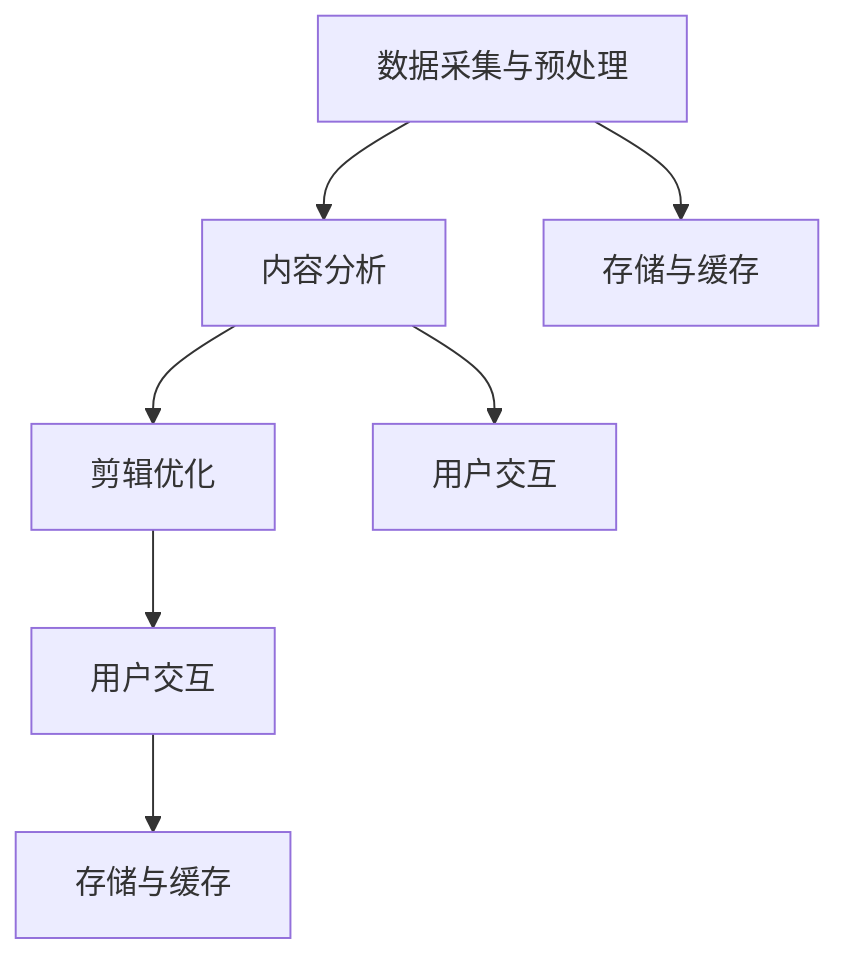

                 

### 引言与背景

在现代影视制作领域，智能电影剪辑技术的崛起正迅速改变着传统的电影剪辑流程。随着人工智能（AI）和机器学习（ML）技术的不断发展，AI Agent在电影剪辑中的应用已经成为现实，这不仅提升了剪辑效率，还带来了更多创意的可能性。智能电影剪辑不仅限于简单的自动剪辑，更涉及到视频内容分析、节奏控制、视觉效果增强等复杂环节，从而实现自动化、个性化的电影剪辑体验。

### 问题的提出

当前，电影剪辑面临诸多挑战。首先，电影制作周期长、成本高，剪辑过程繁琐且依赖人工操作。其次，随着视频内容的爆炸式增长，观众对个性化视频内容的需求日益增加，传统的剪辑方式难以满足这一需求。此外，电影剪辑过程中的数据量巨大，人工处理效率低，容易出现遗漏或错误。这些问题催生了智能电影剪辑技术的需求。

### AI Agent在电影剪辑中的应用潜力

AI Agent作为一种智能体，具备自主学习、自适应和协作能力，能够在电影剪辑中发挥重要作用。首先，AI Agent可以通过机器学习算法分析视频内容，实现自动分类、标注和提取关键帧，从而大大提高剪辑效率。其次，AI Agent可以根据用户偏好和视频内容特点，自动调整剪辑节奏，优化观看体验。此外，AI Agent还可以结合自然语言处理（NLP）技术，实现对视频内容的高层次理解，实现更智能的剪辑建议。

### 智能电影剪辑的现状与发展趋势

智能电影剪辑技术已逐渐成熟，并在实际应用中取得了显著成效。目前，许多电影制作公司已经开始采用智能电影剪辑技术，用于预告片自动生成、个性化视频剪辑以及广告剪辑等。随着AI技术的不断进步，智能电影剪辑有望在以下几个方面取得进一步发展：

1. **算法性能的提升**：通过深度学习等先进算法，AI Agent的剪辑效果将更加接近人类剪辑师的水平。
2. **用户体验的优化**：随着AI技术的成熟，智能电影剪辑将更好地满足观众对个性化视频内容的需求。
3. **产业链的整合**：智能电影剪辑技术将推动电影制作、分发和观看环节的全面智能化。
4. **跨界合作**：AI Agent与其他领域技术的结合，将带来更多创新应用，如虚拟现实（VR）、增强现实（AR）等。

总之，智能电影剪辑技术的发展不仅为电影制作提供了新的可能性，也为观众带来了更丰富的观影体验。在未来，AI Agent在智能电影剪辑中的应用前景将愈发广阔。

## AI Agent的基础知识

### 人工智能与机器学习基础

人工智能（AI）是计算机科学的一个分支，它致力于使机器能够执行通常需要人类智能才能完成的任务。机器学习（ML）是AI的一个子领域，它利用数据和学习算法来使机器能够识别模式和做出决策。在智能电影剪辑中，人工智能和机器学习技术是关键驱动力，能够自动分析视频内容，生成剪辑方案。

**人工智能的基本原理：**

人工智能的核心思想是通过模拟人类智能行为来实现自动化。具体来说，包括以下几方面：

- **感知**：机器通过传感器获取外部信息，如视觉、听觉和触觉。
- **推理**：基于感知到的信息，机器进行逻辑推理和决策。
- **学习**：机器通过不断的学习和训练，提高其推理和决策能力。

**机器学习的基本概念：**

机器学习是使计算机能够从数据中学习并获得知识的过程。主要类型包括：

- **监督学习**：有标记的数据集用于训练模型，模型根据输入和输出进行学习。
- **无监督学习**：没有标记的数据集用于训练模型，模型通过发现数据中的结构和模式进行学习。
- **强化学习**：机器通过与环境的交互进行学习，通过奖励和惩罚来优化行为。

在智能电影剪辑中，常见的机器学习算法包括：

- **卷积神经网络（CNN）**：用于图像和视频处理，能够识别视频中的关键帧和场景。
- **递归神经网络（RNN）**：能够处理序列数据，用于分析视频的时序特征。
- **生成对抗网络（GAN）**：用于生成新的视频片段和视觉效果。

### 计算机视觉基础

计算机视觉是AI的一个重要分支，它致力于使计算机能够像人类一样理解和处理视觉信息。在智能电影剪辑中，计算机视觉技术用于视频内容分析，包括场景检测、动作识别、情感分析等。

**图像处理基础：**

图像处理是计算机视觉的基础，包括图像的获取、预处理、增强和分析。主要技术包括：

- **图像滤波**：用于去除噪声和增强图像。
- **图像分割**：将图像划分为不同的区域或对象。
- **特征提取**：用于提取图像中的关键特征，如边缘、纹理和形状。

**目标检测与追踪技术：**

目标检测是计算机视觉中的一个重要任务，旨在识别图像中的特定对象。目标追踪则是在视频序列中持续跟踪这些对象。主要技术包括：

- **单目标检测算法**：如YOLO（You Only Look Once）、SSD（Single Shot MultiBox Detector）。
- **多目标检测算法**：如Faster R-CNN（Region-based Convolutional Neural Network）。
- **目标追踪算法**：如KCF（Kernelized Correlation Filter）、DSST（Deep Structured Semantic Segmentation Tracker）。

通过这些技术，计算机视觉能够实现对视频内容的高层次理解和分析，为智能电影剪辑提供了坚实的基础。

### 自然语言处理基础

自然语言处理（NLP）是AI的另一个重要分支，它致力于使计算机能够理解和生成人类语言。在智能电影剪辑中，NLP技术用于分析视频内容中的文本和语音信息，为剪辑提供智能化的建议和优化。

**文本分析：**

文本分析是NLP的核心任务之一，包括文本分类、情感分析和实体识别等。具体技术包括：

- **文本分类**：将文本分为不同的类别，如新闻、评论等。
- **情感分析**：分析文本的情感倾向，如正面、负面等。
- **实体识别**：识别文本中的特定实体，如人名、地点等。

**语音识别与合成：**

语音识别是将语音转换为文本，语音合成则是将文本转换为语音。主要技术包括：

- **语音识别**：通过深度学习算法，如RNN和Transformer，实现高准确度的语音识别。
- **语音合成**：通过合成引擎，如WaveNet和Tacotron，生成自然流畅的语音。

通过这些技术，NLP能够实现对视频内容的高层次理解，为智能电影剪辑提供丰富的信息支持和智能化的剪辑建议。

### AI Agent在智能电影剪辑中的架构设计

AI Agent在智能电影剪辑中的应用需要一套完整的架构设计，以确保系统能够高效、稳定地运行。以下将从整体架构设计、数据处理模块设计、算法选择与优化等方面详细阐述AI Agent在智能电影剪辑中的架构设计。

#### 整体架构设计

智能电影剪辑系统的整体架构可以分为以下几个主要模块：

1. **数据采集与预处理模块**：负责从各种数据源收集视频素材，并对视频进行预处理，如去噪、裁剪、缩放等。
2. **内容分析模块**：利用计算机视觉和自然语言处理技术对视频内容进行分析，提取关键信息，如场景、动作、情感等。
3. **剪辑优化模块**：根据用户需求和视频内容特点，自动调整剪辑节奏、切换特效等，生成高质量的剪辑方案。
4. **用户交互模块**：提供用户界面，使用户能够与AI Agent进行交互，提交剪辑需求，查看剪辑结果等。
5. **存储与缓存模块**：用于存储处理后的视频数据、用户数据和系统配置信息，并提供高效的缓存策略以提升系统性能。

下图展示了智能电影剪辑系统的整体架构：

#### 数据处理模块设计

数据处理模块是智能电影剪辑系统的核心之一，它负责处理大量视频数据，包括视频素材的采集、预处理、内容分析等。

**数据采集与预处理：**

数据采集模块需要从多种数据源获取视频素材，如社交媒体、视频网站、影视库等。获取的视频素材需要进行预处理，包括去噪、裁剪、缩放等操作，以提高视频质量并适应系统的后续处理。

**内容分析模块：**

内容分析模块利用计算机视觉和自然语言处理技术，对预处理后的视频内容进行分析。具体包括：

- **视频内容理解**：通过目标检测和场景识别技术，分析视频中的关键帧和场景，提取视频的主题和内容。
- **情感分析**：通过情感分析技术，识别视频中的情感表达，如开心、悲伤等，为剪辑提供情感导向。
- **文本识别与提取**：通过OCR（Optical Character Recognition）技术，识别视频中的文本信息，如字幕、标签等，为剪辑提供文本分析。

**数据分析与优化：**

通过对视频内容的多维度分析，AI Agent可以自动生成剪辑方案，包括剪辑顺序、切换效果、特效添加等。此外，系统还可以根据用户反馈和剪辑效果，不断优化剪辑算法，提高剪辑质量。

#### 算法选择与优化

智能电影剪辑系统需要多种算法的支持，包括计算机视觉、自然语言处理和机器学习等。

**计算机视觉算法：**

- **目标检测算法**：如YOLO、SSD等，用于识别视频中的关键帧和场景。
- **图像识别算法**：如CNN、ResNet等，用于识别视频中的物体和场景。
- **图像增强算法**：如GAN、DRRN等，用于增强视频的视觉效果。

**自然语言处理算法：**

- **文本分类算法**：如SVM、朴素贝叶斯等，用于分类视频中的文本信息。
- **情感分析算法**：如LSTM、Transformer等，用于分析视频中的情感表达。
- **语音识别算法**：如RNN、CTC等，用于识别视频中的语音信息。

**机器学习算法：**

- **监督学习算法**：如线性回归、逻辑回归等，用于建立剪辑模型。
- **无监督学习算法**：如K-means、PCA等，用于数据降维和特征提取。
- **强化学习算法**：如Q-learning、DQN等，用于优化剪辑策略。

通过以上算法的组合和优化，AI Agent可以高效地处理视频内容，生成高质量的剪辑方案。

### 视频内容分析

视频内容分析是智能电影剪辑系统的核心功能之一，它涉及到对视频数据进行多层次的分析和理解，从而生成符合用户需求的剪辑方案。以下将从关键帧提取、场景识别、情感分析等方面详细介绍视频内容分析的过程和方法。

#### 关键帧提取

关键帧提取是视频内容分析的基础，它旨在从视频序列中提取出具有代表性的帧，以便后续的图像分析和处理。关键帧提取通常基于以下几种方法：

1. **帧间差异法**：
   帧间差异法通过计算连续帧之间的差异，确定关键帧。具体步骤如下：
   - 计算连续帧的像素差异，使用如绝对差值、均方误差（MSE）等方法。
   - 设置阈值，如果差异值超过阈值，则标记为关键帧。
   - 选取满足条件的帧作为关键帧。

2. **能量法**：
   能量法通过计算视频图像的局部能量来确定关键帧。具体步骤如下：
   - 计算视频图像的局部能量，即图像的强度变化。
   - 设置能量阈值，选取能量超过阈值的帧作为关键帧。

3. **频域分析法**：
   频域分析法通过分析视频图像的频域特征来确定关键帧。具体步骤如下：
   - 将视频图像从时域转换到频域，使用如傅里叶变换（FFT）。
   - 计算频域图像的能量分布，选取能量集中的帧作为关键帧。

通过以上方法，智能电影剪辑系统可以提取出视频的关键帧，为后续的图像分析提供基础。

#### 场景识别

场景识别是视频内容分析的重要环节，它旨在识别视频中的不同场景，以便进行分段剪辑。场景识别通常基于以下几种技术：

1. **颜色特征法**：
   颜色特征法通过分析视频图像的颜色特征来识别场景。具体步骤如下：
   - 提取视频图像的颜色特征，如颜色直方图。
   - 计算图像间的颜色差异，根据差异设置阈值来识别场景。

2. **纹理特征法**：
   纹理特征法通过分析视频图像的纹理特征来识别场景。具体步骤如下：
   - 提取视频图像的纹理特征，如灰度共生矩阵。
   - 计算图像间的纹理差异，根据差异设置阈值来识别场景。

3. **运动特征法**：
   运动特征法通过分析视频图像的运动特征来识别场景。具体步骤如下：
   - 提取视频图像的运动特征，如光流。
   - 计算图像间的运动差异，根据差异设置阈值来识别场景。

通过以上方法，智能电影剪辑系统可以准确地识别视频中的不同场景，实现分段剪辑。

#### 情感分析

情感分析是视频内容分析的高级功能，它旨在识别视频中的情感表达，从而为剪辑提供情感导向。情感分析通常基于以下几种技术：

1. **基于文本的情感分析**：
   基于文本的情感分析通过分析视频中的文本信息（如字幕、标签等）来确定情感。具体步骤如下：
   - 提取视频中的文本信息。
   - 使用情感词典和规则进行情感分类，如正面、负面等。

2. **基于语音的情感分析**：
   基于语音的情感分析通过分析视频中的语音特征来确定情感。具体步骤如下：
   - 提取视频中的语音特征，如音高、音量等。
   - 使用机器学习算法进行情感分类。

3. **基于图像的情感分析**：
   基于图像的情感分析通过分析视频图像的情感特征来确定情感。具体步骤如下：
   - 提取视频图像的情感特征，如面部表情、姿态等。
   - 使用机器学习算法进行情感分类。

通过以上方法，智能电影剪辑系统可以识别视频中的情感表达，为剪辑提供情感导向，实现更加个性化的剪辑效果。

### 节奏与剪辑

节奏是电影剪辑中至关重要的一个元素，它决定了观众观看视频时的情感体验和情绪波动。智能电影剪辑系统通过分析视频的时序特征，自动调整剪辑节奏，以实现最佳观看效果。以下将从节奏分析、自动剪辑算法等方面详细阐述智能电影剪辑系统在节奏与剪辑方面的应用。

#### 节奏分析

节奏分析是智能电影剪辑系统的基础，它旨在分析视频的时序特征，包括动作速度、场景切换频率等。通过节奏分析，系统能够识别视频中的关键时序点，为自动剪辑提供依据。

1. **动作速度分析**：
   动作速度是节奏分析的一个重要指标，它反映了视频中的动作强度和频率。具体步骤如下：
   - 提取视频中的动作帧，计算动作帧的时长和频率。
   - 分析动作速度的分布和变化，确定视频的整体动作节奏。

2. **场景切换频率分析**：
   场景切换频率是节奏分析的另一个重要指标，它反映了视频中场景切换的频率和节奏。具体步骤如下：
   - 提取视频中的场景帧，计算场景帧的时长和频率。
   - 分析场景切换的频率和持续时间，确定视频的整体节奏。

通过以上方法，智能电影剪辑系统可以准确地分析视频的节奏特征，为自动剪辑提供基础数据。

#### 自动剪辑算法

基于节奏分析的结果，智能电影剪辑系统采用自动剪辑算法生成剪辑方案，以实现最佳观看效果。以下介绍几种常见的自动剪辑算法：

1. **基于规则的方法**：
   基于规则的方法通过预设的规则和阈值，自动调整剪辑节奏。具体步骤如下：
   - 根据节奏分析结果，设置动作速度和场景切换的阈值。
   - 根据阈值判断视频帧是否满足剪辑条件，进行自动剪辑。

2. **基于机器学习的方法**：
   基于机器学习的方法通过训练模型，自动调整剪辑节奏。具体步骤如下：
   - 收集大量带有标签的剪辑数据，用于训练模型。
   - 使用机器学习算法（如SVM、决策树等），建立节奏预测模型。
   - 根据模型预测结果，自动调整剪辑节奏。

3. **基于强化学习的方法**：
   基于强化学习的方法通过不断学习和优化，自动调整剪辑节奏。具体步骤如下：
   - 设计奖励机制，根据用户反馈和剪辑效果进行奖励。
   - 使用强化学习算法（如Q-learning、DQN等），优化剪辑策略。
   - 根据优化结果，自动调整剪辑节奏。

通过以上方法，智能电影剪辑系统可以自动调整剪辑节奏，实现个性化、高质量的剪辑效果。

### 视觉效果增强

在智能电影剪辑中，视觉效果增强是一个关键环节，它能够显著提升视频的观赏性和吸引力。AI Agent通过多种技术，如特效添加、视频风格转换等，实现对视频内容的视觉优化。以下将详细介绍这些技术及其实现方法。

#### 特效添加

特效添加是视频内容增强的重要手段，它能够为视频增添动感、奇幻或真实的视觉效果。常见的特效包括：

1. **动态特效**：
   动态特效通过实时计算和渲染，为视频添加动态效果。例如，可以使用粒子系统生成火焰、爆炸等效果，或使用合成技术实现镜头滑动、缩放等动态变换。

2. **静态特效**：
   静态特效是通过预渲染的图像或视频片段来实现的。例如，可以使用绿幕技术将演员与背景分离，然后添加虚拟场景或特效元素。

3. **视觉效果增强**：
   视觉效果增强通过增强图像的对比度、亮度、色彩饱和度等参数，提升视频的视觉冲击力。例如，可以使用HDR（高动态范围）技术提升图像的细节和亮度。

实现特效添加的方法通常包括：

- **图像处理技术**：如边缘检测、图像融合等，用于实现特效元素与视频内容的无缝融合。
- **三维建模与渲染**：如使用3D建模软件创建特效元素，然后通过渲染引擎实现实时渲染。

#### 视频风格转换

视频风格转换是另一种重要的视觉效果增强技术，它能够将原始视频转换为特定的艺术风格或场景。常见的风格转换包括：

1. **艺术风格转换**：
   艺术风格转换通过深度学习算法，将原始视频转换为特定的艺术风格，如梵高、莫奈等艺术家的风格。例如，可以使用生成对抗网络（GAN）来实现这种转换。

2. **场景转换**：
   场景转换通过替换视频中的背景，实现场景的转换。例如，可以将城市夜景转换为沙漠场景，或将室内场景转换为户外场景。

实现视频风格转换的方法通常包括：

- **风格迁移算法**：如CycleGAN、StyleGAN等，用于将原始视频转换为特定的艺术风格或场景。
- **图像处理技术**：如图像分割、图像融合等，用于实现场景的转换和风格的无缝融合。

通过以上技术，AI Agent能够实现多种视觉效果增强，为视频内容增添更多的创意和吸引力。

### 案例一：电影预告片自动生成

电影预告片是电影宣传的重要手段，它通过浓缩电影的主要情节和亮点，吸引观众的注意力。智能电影剪辑系统通过自动生成电影预告片，不仅提升了制作效率，还增加了宣传的灵活性。以下将详细介绍电影预告片自动生成的过程和实现方法。

#### 案例描述

电影预告片自动生成系统接收电影的全片素材，通过智能分析技术提取关键情节和精彩片段，然后根据预定的时长和节奏自动剪辑成一段吸引人的预告片。整个过程包括以下几个步骤：

1. **视频内容分析**：系统对电影全片进行初步分析，提取关键帧和场景，确定电影的情节主线。
2. **情节提取**：根据情节主线，系统提取出电影中的重要片段，如高潮部分、重要角色出场等。
3. **剪辑优化**：系统根据预定的时长和节奏，对提取出的片段进行剪辑和优化，调整剪辑速度、切换效果等，使预告片更具吸引力。
4. **特效添加**：为了提升预告片的视觉效果，系统可以为视频片段添加动态特效和视觉效果，如镜头滑动、色彩增强等。
5. **输出预告片**：最后，系统将剪辑完成的预告片输出，供电影宣传使用。

#### 案例实现

1. **视频内容分析**

   系统首先对电影全片进行初步分析，提取关键帧和场景。这个过程包括：

   - **关键帧提取**：使用帧间差异法和能量法，从电影全片中提取关键帧。
   - **场景识别**：利用颜色特征法和纹理特征法，识别电影中的不同场景，为后续情节提取提供依据。

2. **情节提取**

   根据初步分析结果，系统提取出电影中的重要片段。具体实现方法包括：

   - **情节主线分析**：通过情感分析和动作速度分析，确定电影的情节主线。
   - **片段提取**：根据情节主线，提取出电影的高潮部分、重要角色出场等片段。

3. **剪辑优化**

   系统对提取出的片段进行剪辑和优化，以实现最佳的观看效果。具体步骤如下：

   - **剪辑速度调整**：根据情节的紧张程度，调整剪辑速度，使节奏更加紧凑。
   - **切换效果优化**：根据片段间的关联性，选择合适的切换效果，如淡入、淡出、滑动等。
   - **特效添加**：为视频片段添加动态特效和视觉效果，如镜头滑动、色彩增强等。

4. **输出预告片**

   最后，系统将剪辑完成的预告片输出，供电影宣传使用。输出过程包括：

   - **格式转换**：将剪辑后的视频转换为标准的预告片格式，如MP4。
   - **导出与存储**：将预告片导出并存储到宣传用的服务器或硬盘上。

通过以上步骤，智能电影剪辑系统可以自动生成高质量的预告片，大大提高了电影宣传的效率。

### 案例二：个性化视频剪辑

个性化视频剪辑是智能电影剪辑系统的一项重要应用，它根据用户的需求和偏好，自动剪辑出符合用户口味的视频内容。这种个性化的剪辑方式不仅提升了用户的观看体验，还为内容创作者提供了更多的可能性。以下将详细介绍个性化视频剪辑的实现方法。

#### 案例描述

个性化视频剪辑系统通过分析用户的历史观看记录和偏好，生成符合用户需求的视频剪辑方案。整个过程包括以下几个步骤：

1. **用户数据分析**：系统收集用户的历史观看记录，包括观看时长、观看频率、喜欢的类型和题材等，分析用户的观看偏好。
2. **视频内容分析**：系统对视频内容进行深入分析，提取关键帧、场景和情感等信息，为个性化剪辑提供基础数据。
3. **偏好模型构建**：基于用户数据分析和视频内容分析，系统构建用户偏好模型，预测用户对特定视频内容的需求。
4. **剪辑方案生成**：系统根据用户偏好模型，自动生成个性化视频剪辑方案，满足用户的需求。
5. **用户反馈与优化**：系统收集用户对剪辑方案的评价，不断优化剪辑策略，提高个性化剪辑的准确性。

#### 案例实现

1. **用户数据分析**

   系统首先收集用户的历史观看记录，包括以下信息：

   - **观看时长**：用户在视频上花费的总时间。
   - **观看频率**：用户观看视频的次数和频率。
   - **喜欢类型和题材**：用户喜欢的电影类型和题材，如动作片、爱情片、科幻片等。
   - **互动行为**：用户在观看视频时的点赞、评论、分享等互动行为。

   通过对以上数据的分析，系统可以构建出用户的观看偏好模型。

2. **视频内容分析**

   系统对视频内容进行深入分析，提取以下关键信息：

   - **关键帧**：视频中的关键帧，用于描述视频的主要情节和场景。
   - **情感分析**：视频中的情感表达，如开心、悲伤、愤怒等。
   - **动作速度和场景切换**：视频中的动作速度和场景切换频率，反映视频的节奏和紧张程度。

   通过这些信息，系统可以为个性化剪辑提供基础数据。

3. **偏好模型构建**

   基于用户数据分析和视频内容分析，系统构建用户偏好模型。具体步骤如下：

   - **特征提取**：从用户数据和视频内容中提取特征，如观看时长、情感倾向、动作速度等。
   - **模型训练**：使用机器学习算法（如SVM、决策树等），训练用户偏好模型，预测用户对特定视频内容的需求。

4. **剪辑方案生成**

   系统根据用户偏好模型，自动生成个性化视频剪辑方案。具体步骤如下：

   - **片段选择**：根据用户偏好，选择符合用户需求的视频片段。
   - **剪辑优化**：对选择的片段进行剪辑和优化，调整剪辑速度、切换效果等，提升观看体验。
   - **输出与存储**：将生成的个性化视频剪辑方案输出，供用户观看。

5. **用户反馈与优化**

   系统不断收集用户对剪辑方案的评价，通过反馈数据优化剪辑策略，提高个性化剪辑的准确性。具体步骤如下：

   - **用户反馈收集**：收集用户对剪辑方案的评价，如满意度、观看时长等。
   - **模型更新**：根据用户反馈，更新用户偏好模型，优化剪辑策略。
   - **持续优化**：通过持续的数据分析和模型更新，提高个性化剪辑的准确性。

通过以上步骤，个性化视频剪辑系统可以不断优化用户的观看体验，提供更符合用户需求的视频内容。

### 案例三：智能广告剪辑

智能广告剪辑是智能电影剪辑系统在广告领域的重要应用，它通过自动化技术，快速生成高质量、个性化的广告片段，提升广告效果。以下将详细介绍智能广告剪辑的实现方法和应用场景。

#### 案例描述

智能广告剪辑系统根据广告主的需求和目标受众的特征，自动剪辑出符合广告宣传效果的广告片段。整个过程包括以下几个步骤：

1. **广告素材准备**：系统从广告主提供的素材中提取视频内容，包括画面、声音、字幕等。
2. **目标受众分析**：系统通过分析用户数据和行为，确定广告的目标受众，包括年龄、性别、兴趣等特征。
3. **视频内容分析**：系统对广告素材进行深入分析，提取关键帧、情感、动作等特征，为广告剪辑提供基础数据。
4. **剪辑方案生成**：系统根据广告主的需求和目标受众的特征，自动生成广告剪辑方案，包括剪辑速度、切换效果、特效添加等。
5. **广告输出与优化**：系统将生成的广告片段输出，并提供实时优化功能，根据广告投放效果不断调整广告策略。

#### 案例实现

1. **广告素材准备**

   系统首先从广告主提供的素材中提取视频内容，包括以下步骤：

   - **素材导入**：将广告主提供的视频素材导入系统，进行格式转换和预处理。
   - **素材分析**：对素材进行初步分析，提取画面、声音、字幕等关键信息，为后续剪辑提供基础。

2. **目标受众分析**

   系统通过分析用户数据和行为，确定广告的目标受众。具体步骤如下：

   - **用户数据收集**：从广告平台、社交媒体等渠道收集用户数据，包括用户画像、行为记录等。
   - **数据分析**：分析用户数据，提取目标受众的特征，如年龄、性别、兴趣等。

3. **视频内容分析**

   系统对广告素材进行深入分析，提取以下关键信息：

   - **关键帧**：提取广告素材中的关键帧，用于描述广告的主要情节和场景。
   - **情感分析**：分析广告素材中的情感表达，如开心、悲伤、愤怒等，为剪辑提供情感导向。
   - **动作速度和场景切换**：分析广告素材中的动作速度和场景切换频率，为剪辑提供节奏参考。

4. **剪辑方案生成**

   系统根据广告主的需求和目标受众的特征，自动生成广告剪辑方案。具体步骤如下：

   - **剪辑速度调整**：根据广告主的预算和目标受众的特征，调整广告的剪辑速度，实现最佳观看体验。
   - **切换效果优化**：根据广告素材的特征和目标受众的兴趣，选择合适的切换效果，如淡入、淡出、滑动等。
   - **特效添加**：为广告片段添加动态特效和视觉效果，如镜头滑动、色彩增强等，提升广告视觉效果。

5. **广告输出与优化**

   系统将生成的广告片段输出，并提供实时优化功能。具体步骤如下：

   - **广告输出**：将剪辑完成的广告片段输出，包括格式转换、导出等步骤。
   - **实时优化**：根据广告投放效果，收集用户反馈数据，不断调整广告策略，提高广告效果。

通过以上步骤，智能广告剪辑系统可以快速生成高质量、个性化的广告片段，满足广告主的宣传需求。

### 挑战分析

尽管AI Agent在智能电影剪辑中展现出巨大的潜力，但其应用仍面临诸多挑战。以下将详细分析这些挑战，并提出相应的解决方案。

#### 数据隐私与安全

智能电影剪辑系统需要处理大量的用户数据和视频素材，这涉及到数据隐私和安全问题。用户数据包括观看记录、偏好信息等，视频素材则包含版权信息和个人隐私。以下是一些常见的数据隐私和安全挑战：

**挑战1：用户数据泄露**
- **解决方案**：采用加密技术（如AES加密）保护用户数据，确保数据在传输和存储过程中的安全性。此外，实施严格的访问控制策略，确保只有授权人员能够访问敏感数据。

**挑战2：视频素材版权保护**
- **解决方案**：通过版权保护技术（如数字版权管理DPM）对视频素材进行加密和标记，防止未经授权的复制和使用。同时，与版权机构合作，确保素材的合法使用。

#### 算法公平性与透明性

AI Agent在智能电影剪辑中的应用依赖于复杂的算法和模型，这些算法和模型可能会引入不公平性或透明性问题。以下是一些常见的算法公平性和透明性挑战：

**挑战1：算法偏见**
- **解决方案**：在算法训练过程中，引入多样性数据集，确保算法能够公平地处理各种用户数据。此外，定期审查和更新算法，以消除潜在的偏见。

**挑战2：算法透明性**
- **解决方案**：开发透明的算法解释工具，帮助用户理解AI Agent的决策过程。例如，使用可解释的AI技术（如LIME、SHAP）来解释算法的输出结果。

#### 系统性能优化

智能电影剪辑系统需要处理大量的视频数据，对系统性能提出了高要求。以下是一些常见的系统性能优化挑战：

**挑战1：计算资源消耗**
- **解决方案**：采用分布式计算和并行处理技术，提高系统处理速度和效率。此外，使用高性能硬件（如GPU）加速算法计算。

**挑战2：实时性能保障**
- **解决方案**：优化算法和系统架构，确保系统在实时场景下能够高效运行。例如，采用内存优化技术，减少内存占用。

#### 用户接受度与反馈

AI Agent在智能电影剪辑中的应用需要用户的接受和反馈，以下是一些常见的用户接受度和反馈挑战：

**挑战1：用户接受度**
- **解决方案**：通过用户调研和反馈收集，了解用户对智能电影剪辑的接受度和期望。不断优化系统功能和界面设计，提高用户满意度。

**挑战2：用户反馈收集与处理**
- **解决方案**：建立有效的用户反馈机制，收集用户对智能电影剪辑的反馈，并快速响应和处理。通过数据分析，持续改进系统性能和用户体验。

通过以上分析，我们可以看到，AI Agent在智能电影剪辑中的应用虽然面临诸多挑战，但通过技术创新和优化，有望克服这些挑战，实现更高效、更智能的电影剪辑体验。

### 未来展望

随着人工智能（AI）和机器学习（ML）技术的不断进步，AI Agent在智能电影剪辑中的应用前景将愈发广阔。未来，以下几个方向将成为智能电影剪辑技术发展的重要趋势：

#### 技术发展趋势

1. **算法性能的提升**：
   AI Agent将采用更先进的算法，如深度学习、生成对抗网络（GAN）等，以实现更高的剪辑精度和更自然的剪辑效果。此外，量子计算、边缘计算等新兴技术也将为智能电影剪辑提供更强大的计算能力和更低的延迟。

2. **用户体验的优化**：
   智能电影剪辑系统将更加注重用户体验，通过个性化推荐、自适应剪辑等技术，提供更加个性化的视频内容。同时，虚拟现实（VR）和增强现实（AR）技术的融合，将为观众带来更加沉浸式的观影体验。

3. **产业链的整合**：
   智能电影剪辑技术将推动电影制作、分发和观看环节的全面智能化，实现更高效、更灵活的产业链运作。此外，AI Agent在内容创作、版权管理、广告投放等领域的应用也将进一步拓展。

4. **跨界合作**：
   AI Agent与其他领域的融合，如游戏、直播、教育等，将带来更多创新应用。例如，AI Agent可以自动生成游戏剧情、直播剪辑、教育视频等，满足多样化的用户需求。

#### 行业应用前景

1. **电影制作**：
   智能电影剪辑技术将大幅提升电影制作的效率和质量，从预告片生成、特效制作到整体剪辑，AI Agent都能发挥重要作用。未来，AI Agent有望成为电影制作环节中不可或缺的一部分。

2. **视频内容分发**：
   智能电影剪辑系统将帮助视频平台和内容创作者实现更高效的视频内容分发，通过个性化推荐和自动剪辑，提高用户黏性和观看时长。

3. **广告营销**：
   AI Agent在广告营销中的应用将越来越广泛，通过智能剪辑和个性化推荐，广告主可以更精准地触达目标受众，提高广告投放效果。

4. **教育娱乐**：
   智能电影剪辑技术将革新教育娱乐领域，通过自动生成教育视频、游戏剧情等，提供更加生动、互动的学习体验。

总之，AI Agent在智能电影剪辑中的应用前景广阔，随着技术的不断进步和应用的深入，它将为电影制作、内容分发、广告营销和教育娱乐等领域带来深刻变革。

### 总结与展望

本文系统地介绍了AI Agent在智能电影剪辑中的实践，包括其基础概念、架构设计、关键功能及应用案例。通过详细的分析和实例，展示了AI Agent如何通过计算机视觉、自然语言处理和机器学习技术，提升电影剪辑的效率和质量。

#### 全书回顾

本文首先介绍了AI Agent的基本概念和智能电影剪辑的需求背景。接着，详细阐述了AI Agent的基础知识，包括人工智能与机器学习基础、计算机视觉基础和自然语言处理基础。随后，介绍了AI Agent在智能电影剪辑中的架构设计，包括数据处理模块、内容分析模块、剪辑优化模块等。随后，通过多个实际应用案例，展示了AI Agent在电影预告片自动生成、个性化视频剪辑和智能广告剪辑等领域的应用效果。最后，分析了AI Agent在智能电影剪辑中面临的挑战，并展望了其未来发展趋势。

#### 未来研究方向

未来，AI Agent在智能电影剪辑中的应用仍有许多研究方向。以下是一些建议：

1. **算法性能优化**：
   深入研究更先进的算法，如深度强化学习、生成对抗网络等，以提高AI Agent的剪辑精度和自然度。

2. **用户体验提升**：
   结合虚拟现实（VR）和增强现实（AR）技术，为用户提供更加沉浸式、互动式的观影体验。

3. **产业链整合**：
   探索AI Agent在电影制作、内容分发、广告营销等环节的深度融合，实现全产业链的智能化运作。

4. **数据隐私与安全**：
   加强数据隐私保护，确保用户数据和视频素材的安全，提高系统的透明性和公平性。

5. **跨界合作**：
   推动AI Agent与其他领域的跨界合作，如游戏、直播、教育等，拓展其应用范围和影响力。

通过持续的研究和创新，AI Agent在智能电影剪辑中的应用将不断优化和拓展，为电影制作、内容创作和观众体验带来更多可能性。

