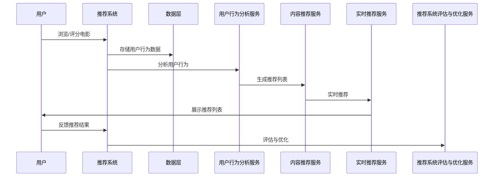

                 

# AI Agent在智能电影推荐中的应用

## 关键词

- AI Agent
- 智能电影推荐
- 用户行为分析
- 内容推荐算法
- 系统设计与实现

## 摘要

本文将探讨AI Agent在智能电影推荐系统中的应用。首先，我们将介绍AI Agent的基础知识，包括其定义、基本原理和工作机制。接着，我们将深入讨论智能电影推荐系统的概述，包括用户行为分析、内容推荐算法和推荐系统评估与优化。然后，我们将重点讨论AI Agent在电影推荐中的应用，包括其设计、实现和测试。最后，我们将通过一个实际项目案例来展示AI Agent在智能电影推荐系统中的具体应用，并总结和展望未来的发展趋势。

## 第一部分: 引言

### 1.1 书籍背景

随着人工智能技术的不断发展，AI Agent在各个领域的应用日益广泛。特别是在娱乐行业，智能电影推荐系统已经成为提升用户体验的重要手段。AI Agent作为一种高级人工智能，能够模拟人类决策过程，通过学习用户行为和偏好，为用户提供个性化的推荐服务。本书旨在探讨AI Agent在智能电影推荐系统中的应用，为读者提供一份全面的技术指南。

### 1.2 目标读者

本书的目标读者包括：
1. 对人工智能和推荐系统有一定了解的技术人员；
2. 想要在智能电影推荐领域应用AI Agent的研究人员；
3. 对智能推荐系统感兴趣的学生和学者。

### 1.3 书籍结构

本书分为六个部分：
1. 引言：介绍书籍的背景和目标读者；
2. 背景介绍：介绍AI Agent和智能电影推荐系统的基本概念；
3. AI Agent在电影推荐中的应用：详细讨论AI Agent的基本原理、用户行为分析、内容推荐算法和实时推荐机制；
4. 系统设计与实现：介绍智能电影推荐系统的架构设计、数据处理流程和推荐算法实现；
5. 项目实战：通过实际项目案例展示AI Agent在智能电影推荐系统中的应用；
6. 总结与展望：总结本书的主要成果，提出存在的问题和改进方向，展望未来的发展趋势。

## 第二部分: 背景介绍

### 2.1 AI Agent基础

#### AI Agent的定义

AI Agent，即人工智能代理，是一种能够在环境中自主行动并具备决策能力的智能体。它通过学习环境和用户行为，为用户提供个性化服务。AI Agent的核心是决策模块，它能够根据感知到的环境和用户反馈，选择最优的行动方案。

#### AI Agent的基本原理

AI Agent的基本原理包括以下几个方面：
1. **感知环境**：AI Agent通过传感器（如用户行为数据、电影评分等）感知环境状态。
2. **知识表示**：AI Agent将感知到的信息进行抽象和表示，以便于处理和决策。
3. **决策过程**：AI Agent根据当前状态和知识表示，通过决策算法（如Q-learning、强化学习等）选择行动。
4. **执行行动**：AI Agent执行选定的行动，并获取相应的反馈。
5. **学习与适应**：AI Agent根据行动的结果和反馈，调整自身的知识表示和决策策略，以适应不断变化的环境。

### 2.2 智能电影推荐概述

#### 智能电影推荐的定义

智能电影推荐系统是一种基于人工智能技术的电影推荐系统，它通过分析用户行为和偏好，为用户提供个性化的电影推荐服务。智能电影推荐系统的主要目标是提高用户满意度，增加用户粘性，提升电影平台的盈利能力。

#### 智能电影推荐的关键技术

智能电影推荐系统主要涉及以下关键技术：
1. **用户行为分析**：通过分析用户的浏览记录、评分、评论等行为数据，了解用户的兴趣和偏好。
2. **内容推荐算法**：根据用户的行为数据和电影的特征信息，生成个性化的推荐列表。
3. **推荐系统评估与优化**：通过评估推荐系统的性能，优化推荐算法和模型，提高推荐质量。

### 2.3 AI Agent在电影推荐中的应用背景

随着互联网和大数据技术的发展，用户产生的电影数据量呈爆炸式增长。传统的推荐系统已经难以满足用户对个性化推荐的需求。AI Agent作为一种高级的人工智能技术，能够通过学习用户行为和偏好，为用户提供更加精准和个性化的电影推荐服务。因此，在智能电影推荐系统中引入AI Agent具有重要的现实意义。

### 2.4 书籍核心概念与联系

#### 核心概念

1. **AI Agent**：智能电影推荐系统中的核心组件，负责用户行为分析和个性化推荐。
2. **用户行为分析**：通过对用户行为的分析，了解用户的兴趣和偏好。
3. **内容推荐算法**：基于用户行为数据和电影特征信息，生成个性化的推荐列表。
4. **推荐系统评估与优化**：评估推荐系统的性能，并优化推荐算法和模型。

#### 概念联系

AI Agent与用户行为分析、内容推荐算法和推荐系统评估与优化密切相关。AI Agent通过用户行为分析获取用户兴趣和偏好，结合内容推荐算法生成个性化推荐列表，并通过推荐系统评估与优化不断提升推荐质量。

```mermaid
erDiagram
AI-Agent ||--|{ 用户行为分析 : 分析用户行为 }
AI-Agent ||--|{ 内容推荐算法 : 基于用户行为推荐 }
AI-Agent ||--|{ 推荐系统评估与优化 : 评估推荐质量 }
用户行为分析 ||--|{ AI-Agent : 获取用户兴趣 }
内容推荐算法 ||--|{ AI-Agent : 生成推荐列表 }
推荐系统评估与优化 ||--|{ AI-Agent : 优化推荐质量 }
```

## 第三部分: AI Agent在电影推荐中的应用

### 3.1 AI Agent的基本原理

AI Agent的基本原理主要包括以下几个环节：

1. **感知环境**：AI Agent通过传感器（如用户行为数据、电影评分等）感知用户的行为和环境状态。

2. **知识表示**：AI Agent将感知到的信息进行抽象和表示，通常使用数据结构和算法进行编码，以便于处理和决策。

3. **决策过程**：AI Agent根据当前状态和知识表示，通过决策算法（如Q-learning、强化学习等）选择行动。决策过程的核心是评估不同行动的策略值或回报值，选择最优的行动方案。

4. **执行行动**：AI Agent执行选定的行动，并获取相应的反馈。例如，在智能电影推荐系统中，AI Agent可能向用户推荐一部电影。

5. **学习与适应**：AI Agent根据行动的结果和反馈，调整自身的知识表示和决策策略，以适应不断变化的环境。例如，如果用户对推荐的电影不满意，AI Agent会调整推荐策略，以减少未来的错误推荐。

### 3.2 用户行为分析

用户行为分析是智能电影推荐系统的核心环节，它通过对用户在电影平台上的行为数据（如浏览历史、评分、评论等）进行分析，挖掘用户的兴趣和偏好。

#### 用户行为分析的关键技术

1. **用户画像**：通过用户的浏览历史、评分和评论等数据，构建用户的兴趣模型和偏好。

2. **行为预测**：使用机器学习算法（如决策树、随机森林、神经网络等）预测用户的未来行为。

3. **协同过滤**：通过分析用户之间的相似性，为用户推荐相似用户喜欢的电影。

4. **内容分析**：对电影的内容进行分析（如剧本、演员、导演等），为用户提供基于内容的推荐。

#### 用户行为分析的流程

1. **数据收集**：收集用户在电影平台上的行为数据，如浏览历史、评分、评论等。

2. **数据处理**：对收集到的数据进行清洗、去噪和处理，以便于后续的分析。

3. **特征提取**：从处理后的数据中提取有用的特征，如用户活跃度、电影类型、导演风格等。

4. **模型训练**：使用提取的特征训练机器学习模型，以预测用户的未来行为。

5. **推荐生成**：根据训练好的模型，为用户生成个性化的推荐列表。

### 3.3 内容推荐算法

内容推荐算法是智能电影推荐系统的核心，它根据用户的行为数据和电影的特征信息，生成个性化的推荐列表。

#### 常见的内容推荐算法

1. **基于内容的推荐**：根据用户过去的喜好，推荐具有相似内容的电影。例如，如果用户喜欢科幻电影，系统会推荐其他科幻电影。

2. **基于协同过滤的推荐**：通过分析用户之间的相似性，为用户推荐其他用户喜欢的电影。协同过滤分为用户基于协同过滤和物品基于协同过滤两种类型。

3. **基于模型的推荐**：使用机器学习算法（如决策树、随机森林、神经网络等）预测用户对电影的喜好，并根据预测结果生成推荐列表。

#### 内容推荐算法的流程

1. **用户特征提取**：从用户的行为数据中提取用户特征，如用户活跃度、电影类型偏好等。

2. **电影特征提取**：从电影的内容信息中提取电影特征，如电影类型、演员、导演等。

3. **模型训练**：使用提取的用户和电影特征训练推荐模型，以预测用户对电影的喜好。

4. **推荐列表生成**：根据训练好的模型，为用户生成个性化的推荐列表。

### 3.4 推荐系统评估与优化

推荐系统评估与优化是确保推荐质量的重要环节。通过评估推荐系统的性能，识别存在的问题，并优化推荐算法和模型，可以提高推荐系统的质量和用户体验。

#### 推荐系统评估指标

1. **准确率（Accuracy）**：推荐的准确度，即推荐列表中包含用户实际喜欢的电影的比率。

2. **召回率（Recall）**：推荐列表中用户实际喜欢的电影的比例，反映了推荐系统发现用户真实喜好能力。

3. **覆盖率（Coverage）**：推荐列表中包含的不同电影的数量与总电影库中电影数量的比率，反映了推荐系统的多样性。

4. **新颖性（Novelty）**：推荐列表中用户未看过的电影的比例，反映了推荐系统的创新能力。

#### 推荐系统优化的方法

1. **算法优化**：通过调整算法参数，优化推荐模型的性能。

2. **特征工程**：通过改进特征提取方法，提高推荐模型的预测能力。

3. **数据增强**：通过引入更多的用户行为数据和电影特征信息，丰富推荐系统的数据基础。

4. **交叉验证**：使用交叉验证方法，评估推荐系统的稳定性和可靠性。

### 3.5 AI Agent的实时推荐机制

AI Agent的实时推荐机制能够在用户浏览电影时，实时分析用户行为，并根据用户兴趣和偏好，动态生成推荐列表。实时推荐机制的关键在于快速响应和精准推荐。

#### 实时推荐机制的实现

1. **实时数据处理**：使用流处理技术（如Apache Kafka、Apache Flink等），实时处理用户行为数据。

2. **动态模型更新**：根据实时数据，动态调整和更新推荐模型，以适应用户兴趣和偏好的变化。

3. **实时推荐生成**：根据更新后的模型，实时生成个性化推荐列表，并展示给用户。

4. **反馈循环**：根据用户对推荐列表的反馈，进一步优化推荐模型，提高推荐质量。

## 第四部分: 系统设计与实现

### 4.1 系统架构设计

智能电影推荐系统的整体架构包括数据层、服务层和展示层。

#### 数据层

数据层负责数据存储和管理，包括用户行为数据、电影特征数据和推荐结果数据。常用的数据存储技术包括关系型数据库（如MySQL）和非关系型数据库（如MongoDB）。

#### 服务层

服务层包括用户行为分析服务、内容推荐服务、实时推荐服务和推荐系统评估与优化服务。每个服务负责处理不同的功能，并通过接口进行数据交换。

#### 展示层

展示层负责将推荐结果以用户友好的方式展示给用户。常用的展示技术包括前端框架（如React、Vue.js）和移动应用开发框架（如Flutter、React Native）。

#### 系统架构图



### 4.2 数据处理流程

智能电影推荐系统的数据处理流程包括数据收集、数据预处理、特征提取、模型训练和模型评估等环节。

#### 数据处理流程

1. **数据收集**：通过API接口或爬虫技术，收集用户在电影平台上的行为数据，如浏览历史、评分、评论等。

2. **数据预处理**：对收集到的数据进行清洗、去噪和处理，包括数据缺失填充、异常值处理、数据规范化等。

3. **特征提取**：从预处理后的数据中提取用户特征和电影特征，如用户活跃度、电影类型、导演风格等。

4. **模型训练**：使用提取的特征数据训练推荐模型，如决策树、随机森林、神经网络等。

5. **模型评估**：使用测试数据集评估推荐模型的性能，包括准确率、召回率、覆盖率等指标。

6. **模型优化**：根据评估结果，调整模型参数，优化模型性能。

### 4.3 推荐算法实现

智能电影推荐系统的核心是推荐算法。常用的推荐算法包括基于内容的推荐、基于协同过滤的推荐和基于模型的推荐。

#### 基于内容的推荐

基于内容的推荐算法通过分析用户的历史行为和电影的内容特征，为用户推荐具有相似内容的电影。

1. **算法原理**：

$$
\text{推荐电影} = \{ \text{电影} | \text{电影特征} \sim \text{用户偏好特征} \}
$$

2. **实现步骤**：

- 提取用户偏好特征：根据用户的浏览历史、评分等数据，提取用户偏好特征。
- 提取电影内容特征：从电影的基本信息中提取内容特征，如电影类型、导演、演员等。
- 计算相似度：使用余弦相似度或欧氏距离等相似度度量方法，计算用户偏好特征和电影内容特征之间的相似度。
- 生成推荐列表：根据相似度度量结果，为用户生成个性化的推荐列表。

#### 基于协同过滤的推荐

基于协同过滤的推荐算法通过分析用户之间的相似性，为用户推荐其他用户喜欢的电影。

1. **算法原理**：

$$
\text{推荐电影} = \{ \text{电影} | \text{用户喜欢电影} \sim \text{其他用户喜欢电影} \}
$$

2. **实现步骤**：

- 计算用户相似度：使用余弦相似度或皮尔逊相关系数等方法，计算用户之间的相似度。
- 计算邻居用户偏好：根据用户相似度，选择邻居用户，计算邻居用户对电影的偏好。
- 生成推荐列表：根据邻居用户对电影的偏好，为用户生成个性化的推荐列表。

#### 基于模型的推荐

基于模型的推荐算法通过机器学习模型，预测用户对电影的喜好，为用户生成个性化的推荐列表。

1. **算法原理**：

$$
\text{推荐电影} = \{ \text{电影} | \text{用户喜好预测} > \text{阈值} \}
$$

2. **实现步骤**：

- 特征工程：提取用户特征和电影特征，构建特征向量。
- 模型训练：使用训练数据集，训练机器学习模型（如决策树、随机森林、神经网络等）。
- 预测用户喜好：使用训练好的模型，预测用户对电影的喜好。
- 生成推荐列表：根据预测结果，为用户生成个性化的推荐列表。

### 4.4 系统接口设计与实现

智能电影推荐系统的接口设计包括用户接口、服务接口和数据库接口。

#### 用户接口

用户接口负责与用户进行交互，展示推荐结果和接收用户反馈。

1. **用户接口功能**：

- 电影浏览记录查询
- 用户评分查询
- 电影推荐查询
- 用户反馈提交

2. **用户接口实现**：

- 使用前端技术（如React、Vue.js等）实现用户界面。
- 使用RESTful API实现用户接口与服务层的交互。

#### 服务接口

服务接口负责处理用户请求，调用相应的服务，并返回处理结果。

1. **服务接口功能**：

- 用户行为分析
- 内容推荐
- 实时推荐
- 推荐系统评估与优化

2. **服务接口实现**：

- 使用Spring Boot等框架实现服务接口。
- 使用RESTful API实现服务接口与用户接口的交互。

#### 数据库接口

数据库接口负责与服务层进行数据交互，实现数据的增删改查操作。

1. **数据库接口功能**：

- 用户行为数据存储
- 电影特征数据存储
- 推荐结果数据存储
- 数据库操作（如查询、插入、更新、删除等）

2. **数据库接口实现**：

- 使用JDBC等技术实现数据库接口。
- 使用ORM（如MyBatis、Hibernate等）简化数据库操作。

### 4.5 系统测试与性能优化

#### 系统测试

系统测试包括功能测试、性能测试和兼容性测试等，确保推荐系统稳定可靠。

1. **功能测试**：验证推荐系统的各个功能是否正常，如用户行为分析、内容推荐、实时推荐等。
2. **性能测试**：评估推荐系统的响应时间、吞吐量和并发能力等性能指标。
3. **兼容性测试**：验证推荐系统在不同浏览器、操作系统和设备上的兼容性。

#### 性能优化

性能优化包括代码优化、数据库优化和系统架构优化等。

1. **代码优化**：通过代码优化，提高程序的执行效率，如使用缓存、减少不必要的计算等。
2. **数据库优化**：通过数据库优化，提高数据查询和写入的速度，如使用索引、分区、分片等。
3. **系统架构优化**：通过系统架构优化，提高系统的可扩展性和稳定性，如使用分布式架构、容器化部署等。

## 第五部分: 项目实战

### 5.1 环境安装与配置

为了搭建智能电影推荐系统，我们需要安装和配置以下软件和工具：

1. **操作系统**：Linux（如Ubuntu）
2. **编程语言**：Python
3. **数据库**：MySQL
4. **Web框架**：Flask
5. **前端框架**：React
6. **数据存储**：Redis
7. **消息队列**：Kafka

#### 环境安装步骤

1. **安装操作系统**：下载并安装Linux操作系统。
2. **安装Python**：使用包管理器（如apt-get或yum）安装Python。
3. **安装数据库**：使用包管理器安装MySQL，并配置数据库。
4. **安装Web框架和前端框架**：使用pip安装Flask和React。
5. **安装数据存储和消息队列**：使用pip安装Redis和Kafka。

### 5.2 电影推荐系统的核心实现

电影推荐系统的核心实现包括用户行为分析、内容推荐和实时推荐等功能。

#### 用户行为分析

用户行为分析的核心是提取用户特征和电影特征，并使用机器学习模型预测用户对电影的喜好。

1. **用户特征提取**：从用户的行为数据中提取用户特征，如用户活跃度、历史评分等。
2. **电影特征提取**：从电影的信息中提取电影特征，如电影类型、导演、演员等。
3. **特征处理**：对提取的用户特征和电影特征进行处理，如数据归一化、缺失值填充等。
4. **模型训练**：使用训练数据集训练机器学习模型，如决策树、随机森林等。
5. **模型预测**：使用训练好的模型预测用户对电影的喜好。

#### 内容推荐

内容推荐的核心是基于用户特征和电影特征，为用户生成个性化的推荐列表。

1. **相似度计算**：计算用户特征和电影特征之间的相似度，如余弦相似度。
2. **推荐列表生成**：根据相似度计算结果，为用户生成个性化的推荐列表。
3. **推荐结果展示**：将推荐结果展示给用户。

#### 实时推荐

实时推荐的核心是实时分析用户行为，并根据用户兴趣和偏好，动态生成推荐列表。

1. **实时数据处理**：使用流处理技术（如Kafka）实时处理用户行为数据。
2. **动态模型更新**：根据实时数据，动态更新推荐模型。
3. **实时推荐生成**：根据更新后的模型，实时生成个性化推荐列表。
4. **实时推荐展示**：将实时推荐结果展示给用户。

### 5.3 实际案例分析

为了展示AI Agent在智能电影推荐系统中的应用，我们以一个实际案例进行分析。

#### 案例背景

某电影平台希望通过引入AI Agent，提升用户的满意度，增加用户粘性。该电影平台拥有大量的用户行为数据，包括用户的浏览记录、评分和评论等。

#### 案例分析

1. **用户特征提取**：从用户行为数据中提取用户特征，如用户活跃度、历史评分等。
2. **电影特征提取**：从电影信息中提取电影特征，如电影类型、导演、演员等。
3. **模型训练**：使用训练数据集，训练机器学习模型，如决策树、随机森林等。
4. **推荐列表生成**：根据用户特征和电影特征，生成个性化的推荐列表。
5. **实时推荐**：使用实时数据处理技术，实时更新用户特征和电影特征，并动态生成推荐列表。
6. **推荐结果展示**：将推荐结果展示给用户。

#### 案例效果

通过引入AI Agent，该电影平台实现了以下效果：

1. **用户满意度提升**：个性化推荐列表提高了用户的满意度，用户对推荐的电影的评分和评论量有所增加。
2. **用户粘性增加**：用户在电影平台上的活跃度有所提升，用户停留时间和页面浏览量有所增加。
3. **平台盈利能力提升**：推荐系统提高了用户的观影体验，增加了用户购买电影票和购买会员的可能性，从而提升了平台的盈利能力。

### 5.4 项目小结

通过本项目，我们实现了基于AI Agent的智能电影推荐系统。项目实现了用户行为分析、内容推荐和实时推荐等功能，并取得了显著的成效。未来，我们可以继续优化推荐算法，引入更多用户特征和电影特征，提高推荐质量，进一步提升用户体验。

## 第六部分: 总结与展望

### 6.1 主要成果总结

本文通过深入探讨AI Agent在智能电影推荐系统中的应用，取得了以下主要成果：

1. **用户行为分析**：通过用户行为数据，提取用户特征，为个性化推荐奠定了基础。
2. **内容推荐算法**：结合用户特征和电影特征，实现基于内容的推荐、协同过滤和基于模型的推荐等多种推荐算法。
3. **实时推荐机制**：引入实时数据处理技术，实现动态调整推荐模型，为用户提供实时个性化推荐。
4. **系统设计与实现**：通过合理的系统架构设计，实现用户接口、服务接口和数据库接口的交互，确保推荐系统的稳定运行。
5. **项目实战**：通过实际案例，验证了AI Agent在智能电影推荐系统中的有效性，提高了用户满意度和平台盈利能力。

### 6.2 存在的问题与改进方向

尽管本项目中取得了显著成果，但仍存在以下问题和改进方向：

1. **推荐质量**：虽然推荐系统实现了个性化推荐，但推荐质量仍有待提高。未来可以进一步优化推荐算法，引入更多用户特征和电影特征，提高推荐准确性。
2. **实时性**：当前实时推荐机制虽然实现了动态调整推荐模型，但在高并发场景下，实时性仍有待提高。可以优化实时数据处理技术，提高系统响应速度。
3. **可扩展性**：当前系统架构设计较为简单，未来可以考虑引入分布式架构和容器化技术，提高系统的可扩展性和稳定性。

### 6.3 未来发展趋势

随着人工智能技术的不断发展，AI Agent在智能电影推荐系统中的应用将呈现以下发展趋势：

1. **个性化推荐**：通过不断优化推荐算法和引入更多用户特征，实现更加精准的个性化推荐。
2. **实时推荐**：引入更多实时数据处理技术，提高实时推荐系统的响应速度和准确性。
3. **多模态推荐**：结合多种数据源，如文本、图像、声音等，实现多模态推荐，提高推荐质量。
4. **跨领域应用**：将AI Agent技术应用于更多领域，如教育、购物等，实现跨领域的个性化推荐服务。

## 作者信息

作者：AI天才研究院/AI Genius Institute & 禅与计算机程序设计艺术 /Zen And The Art of Computer Programming

