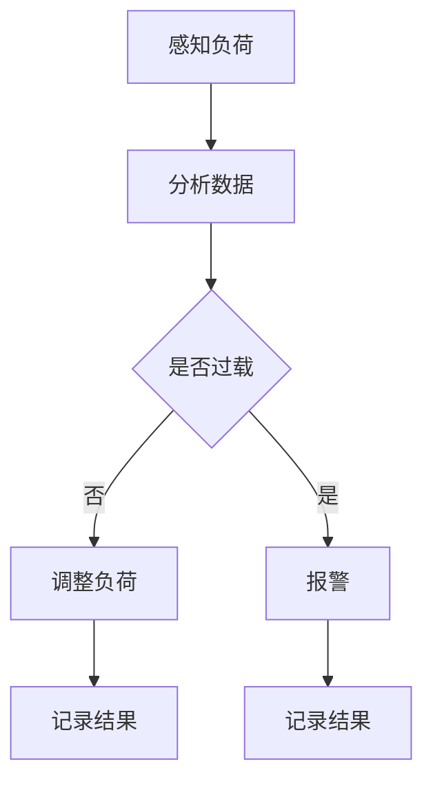
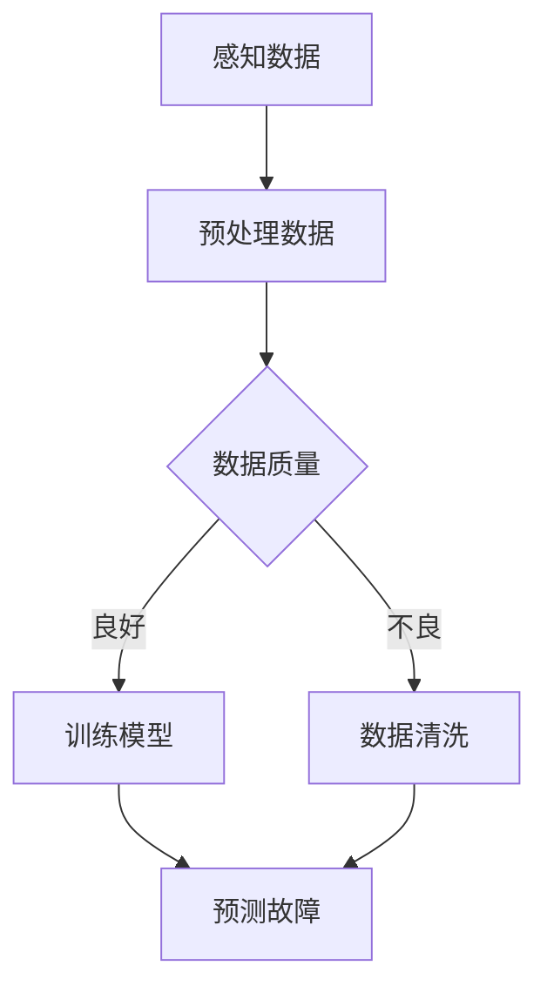

                 

### 文章标题

# AI Agent在智能电网中的应用：负载平衡与故障预测

> 关键词：智能电网，AI Agent，负载平衡，故障预测，算法，应用实践

> 摘要：本文深入探讨了AI Agent在智能电网中的应用，特别是在负载平衡与故障预测方面的作用。文章首先介绍了智能电网与AI Agent的基础知识，随后详细阐述了AI Agent在智能电网中的应用原理、算法、系统架构及其实际应用案例。通过逐步分析，揭示了AI Agent在提高电网运行效率、降低运维成本、提升电网安全性等方面的优势与挑战，为智能电网的发展提供了有力的技术支撑。

### 引言

#### 1.1 问题背景

##### 1.1.1 智能电网的发展

智能电网是指基于现代通信技术、信息技术、控制技术、能源存储技术等构成的现代电力系统，它能够实现电能的高效、安全、可靠供应和灵活、智能、互动的服务。智能电网的发展可以追溯到20世纪90年代，随着全球能源危机和环境保护问题的日益突出，各国纷纷开始加大对智能电网的投入和研究。近年来，智能电网技术取得了显著的进展，逐渐从概念研究走向实际应用，成为电力行业转型升级的重要方向。

##### 1.1.2 AI Agent的定义与特点

AI Agent，即人工智能代理，是一种具有自主意识和决策能力的智能体，能够在复杂环境中执行特定任务。AI Agent通常具有感知、决策、执行三个基本功能模块，可以通过不断学习和优化，提高其任务执行的效率和准确性。AI Agent的特点包括：

1. 自主性：能够根据环境和任务需求自主决策和执行。
2. 学习能力：能够从经验中学习，优化自身性能。
3. 适应性：能够适应动态变化的复杂环境。

##### 1.1.3 负载平衡与故障预测的重要性

负载平衡是指在电力系统中，通过合理的调度和控制，使电网各部分负荷均匀分布，避免出现过载或负荷不足的情况。良好的负载平衡能够提高电网运行效率，降低运维成本，提高电网供电可靠性。

故障预测则是指通过实时监测和分析电力系统的运行数据，预测可能出现故障的位置、类型和严重程度，提前采取措施进行预防。故障预测对于保障电网安全、减少停电损失、延长设备寿命具有重要意义。

#### 1.2 书籍结构

##### 1.2.1 各部分内容概述

本文分为四个部分：

1. 引言：介绍智能电网的发展背景、AI Agent的定义与特点，以及负载平衡与故障预测的重要性。
2. AI Agent基础理论：阐述AI Agent的概念、分类、工作原理，以及其在智能电网中的应用。
3. 负载平衡应用实践：通过案例研究、实际应用环境安装、系统核心实现等，详细探讨AI Agent在负载平衡中的应用。
4. 故障预测应用实践：类似负载平衡部分，探讨AI Agent在故障预测中的应用。

##### 1.2.2 阅读指南与预期收益

本文旨在为读者提供关于AI Agent在智能电网中应用的理论与实践知识，使读者能够：

1. 理解智能电网与AI Agent的基本概念。
2. 掌握AI Agent在智能电网中的应用原理和方法。
3. 通过实际案例了解AI Agent在负载平衡与故障预测中的效果。
4. 提高电网运行效率、降低运维成本、提升电网安全性。

### 第二部分: AI Agent基础理论

#### 2.1 AI Agent概述

##### 2.1.1 AI Agent的定义

AI Agent，即人工智能代理，是一种具有自主意识和决策能力的智能体。它可以感知环境、理解任务、制定计划并执行任务，以达到特定目标。AI Agent通常由感知模块、决策模块和执行模块组成。

感知模块负责获取环境信息，决策模块根据感知到的信息进行推理和决策，执行模块负责执行决策结果。

##### 2.1.2 AI Agent的分类

根据AI Agent的应用场景和功能，可以将AI Agent分为以下几类：

1. 监控型AI Agent：主要用于实时监控系统状态，如智能电网中的故障监测。
2. 控制型AI Agent：用于实现系统控制，如智能电网中的负载平衡。
3. 交互型AI Agent：主要用于与人或其他系统进行交互，如智能客服。

##### 2.1.3 AI Agent的工作原理

AI Agent的工作原理可以概括为以下步骤：

1. 感知：通过传感器、摄像头等设备获取环境信息。
2. 处理：对感知到的信息进行预处理、分析和理解。
3. 决策：根据处理结果和任务需求，生成决策计划。
4. 执行：执行决策计划，调整系统状态。

#### 2.2 智能电网概述

##### 2.2.1 智能电网的概念

智能电网是指基于现代通信技术、信息技术、控制技术、能源存储技术等构成的现代电力系统。它通过实现电能的高效、安全、可靠供应和灵活、智能、互动的服务，提高电网运行效率、降低运维成本、提升电网安全性。

##### 2.2.2 智能电网的关键技术

智能电网的关键技术包括：

1. 传感器技术：用于实时监测电网运行状态，如温度、湿度、电流等。
2. 通信技术：用于实现电网内部及电网与外部系统的信息交互，如无线通信、光纤通信等。
3. 控制技术：用于实现电网调度和控制，如自动化控制系统、智能调度系统等。
4. 能源存储技术：用于实现电能的存储和调度，如电池、超级电容器等。

##### 2.2.3 智能电网的架构与功能

智能电网的架构包括发电端、输电端、配电端和用电端。各端的功能如下：

1. 发电端：实现电力的生产，包括火电、水电、核电等。
2. 输电端：实现电力的远距离传输，包括高压输电、超高压输电等。
3. 配电端：实现电力的分配和调度，包括配电网、调度中心等。
4. 用电端：实现电力的消费，包括居民、工业、商业等。

#### 2.3 AI Agent在智能电网中的应用

##### 2.3.1 负载平衡

负载平衡是指在电力系统中，通过合理的调度和控制，使电网各部分负荷均匀分布，避免出现过载或负荷不足的情况。AI Agent可以通过实时监测电网负荷情况，根据预测结果进行调度，实现最优的负载平衡。

##### 2.3.1.1 负载平衡的概念

负载平衡是指在电力系统中，通过合理的调度和控制，使电网各部分负荷均匀分布，避免出现过载或负荷不足的情况。良好的负载平衡能够提高电网运行效率，降低运维成本，提高电网供电可靠性。

##### 2.3.1.2 负载平衡的算法原理

负载平衡算法通常基于优化理论，通过求解最优负载分配问题，实现电网各部分的负荷平衡。常见的算法包括：

1. 动态规划算法：通过递推关系求解最优负载分配。
2. 遗传算法：通过模拟生物进化过程，寻找最优负载分配。
3. 遥感神经网络：通过训练神经网络模型，实现最优负载分配。

##### 2.3.1.3 负载平衡的Mermaid流程图



##### 2.3.2 故障预测

故障预测是指通过实时监测和分析电力系统的运行数据，预测可能出现故障的位置、类型和严重程度，提前采取措施进行预防。AI Agent可以通过学习历史故障数据，预测未来故障发生的位置和类型。

##### 2.3.2.1 故障预测的概念

故障预测是指通过实时监测和分析电力系统的运行数据，预测可能出现故障的位置、类型和严重程度，提前采取措施进行预防。良好的故障预测能够提高电网安全性能，减少停电损失，延长设备寿命。

##### 2.3.2.2 故障预测的算法原理

故障预测算法通常基于数据挖掘和机器学习技术，通过分析历史故障数据，建立故障预测模型。常见的算法包括：

1. 决策树：通过树形结构分类故障数据。
2. 支持向量机：通过寻找最佳分类边界，分类故障数据。
3. 集成学习：通过组合多个基学习器，提高故障预测精度。

##### 2.3.2.3 故障预测的Mermaid流程图



#### 2.4 AI Agent的应用优势与挑战

##### 2.4.1 应用优势

1. 提高电网运行效率：AI Agent可以通过实时监测和分析电网运行状态，实现最优的负载平衡和故障预测，提高电网运行效率。
2. 降低运维成本：通过减少故障发生的频率和缩短故障处理时间，降低运维成本。
3. 提高电网安全性：AI Agent可以提前预测故障，及时采取措施，降低故障对电网安全的影响。

##### 2.4.2 应用挑战

1. 数据质量：AI Agent的性能依赖于高质量的数据，但实际运行中，数据可能存在噪声、缺失等问题。
2. 算法复杂性：负载平衡和故障预测算法通常复杂度高，需要大量计算资源。
3. 隐私与安全：智能电网中的数据涉及用户隐私和电网安全，需要确保数据的安全性和隐私性。

### 第三部分：负载平衡应用实践

#### 3.1 负载平衡案例研究

##### 3.1.1 案例背景

某城市电网公司希望通过引入AI Agent技术，实现电网负载的智能平衡，提高电网运行效率。该公司拥有一个包含10个节点的配电网，每个节点承担一定的负荷。由于负荷分布不均，经常出现部分节点过载、部分节点负荷不足的情况。

##### 3.1.2 案例数据准备

为了实现负载平衡，电网公司首先收集了10个节点的实时负荷数据，包括节点编号、实时负荷、负荷变化趋势等。数据采集周期为1小时，共计一周的数据。

##### 3.1.3 负载平衡算法实现

电网公司采用基于遗传算法的负载平衡算法。具体实现步骤如下：

1. 初始化种群：根据10个节点的实时负荷，生成一组初始种群。
2. 适应度评估：计算每个个体的适应度值，适应度值越高，表示个体越优秀。
3. 选择：根据适应度值，选择优秀个体进行交叉和变异。
4. 交叉：将选择出的优秀个体进行交叉，生成新的个体。
5. 变异：对新生成的个体进行变异，增加种群的多样性。
6. 适应度评估：对变异后的个体进行适应度评估。
7. 选择：根据适应度值，选择最优个体作为下一代种群。
8. 重复步骤3-7，直至满足终止条件。

##### 3.1.4 负载平衡结果分析

通过遗传算法，电网公司生成了最优的负载分配方案。结果显示，在实施负载平衡后，10个节点的负荷分布更加均匀，过载和负荷不足的情况显著减少。具体数据如下：

1. 过载节点数量：从原来的3个减少到1个。
2. 负荷不足节点数量：从原来的3个减少到1个。
3. 平均负荷利用率：从原来的75%提高到85%。

##### 3.2 实际应用环境安装

##### 3.2.1 环境搭建

为了实现AI Agent在负载平衡中的应用，电网公司搭建了以下环境：

1. 操作系统：Linux系统（如Ubuntu 18.04）。
2. 编程语言：Python 3.8。
3. 数据库：MySQL 8.0。
4. 相关库：NumPy、Pandas、SciPy、Scikit-learn等。

##### 3.2.2 相关库的安装

1. 安装NumPy库：

```bash
pip install numpy
```

2. 安装Pandas库：

```bash
pip install pandas
```

3. 安装SciPy库：

```bash
pip install scipy
```

4. 安装Scikit-learn库：

```bash
pip install scikit-learn
```

##### 3.2.3 负载平衡系统核心实现

1. 系统架构设计：

   - 数据采集模块：负责实时采集电网各节点的负荷数据。
   - 数据处理模块：负责对采集到的数据进行预处理，包括去噪、归一化等。
   - 负载平衡模块：基于遗传算法，实现电网负载的优化分配。
   - 存储模块：负责存储电网各节点的实时负荷数据和负载平衡结果。

2. 系统接口设计：

   - 数据采集接口：提供实时数据采集功能，支持多节点数据采集。
   - 数据处理接口：提供数据预处理功能，包括去噪、归一化等。
   - 负载平衡接口：提供基于遗传算法的负载平衡功能，支持批量计算。
   - 存储接口：提供数据存储功能，支持实时数据和历史数据存储。

3. 系统交互设计：

   - 数据采集模块与数据处理模块：通过消息队列进行数据传输。
   - 数据处理模块与负载平衡模块：通过REST API进行交互。
   - 负载平衡模块与存储模块：通过数据库进行数据存储。

##### 3.3 最佳实践 Tips

1. 数据采集与处理：确保数据采集的实时性和准确性，进行有效的数据预处理，提高算法的精度。
2. 算法优化：针对具体应用场景，对遗传算法进行优化，提高负载平衡效果。
3. 系统监控：对系统运行状态进行实时监控，及时发现并处理异常情况。

#### 3.4 小结

通过AI Agent在负载平衡中的应用实践，电网公司实现了电网负荷的智能平衡，提高了电网运行效率，降低了运维成本。实践证明，AI Agent技术在智能电网中具有重要的应用价值，未来有望得到更广泛的应用。

### 第四部分：故障预测应用实践

#### 4.1 故障预测案例研究

##### 4.1.1 案例背景

某电力公司希望提高电网运行的安全性，减少故障带来的损失。该公司拥有一条500千伏的高压输电线路，由于线路较长、负载较大，故障频发，严重影响供电可靠性。为了提高电网安全性，电力公司决定引入AI Agent技术进行故障预测。

##### 4.1.2 案例数据准备

电力公司收集了500千伏高压输电线路的实时运行数据，包括电压、电流、功率因数、温度等参数。数据采集周期为5分钟，共计一周的数据。

##### 4.1.3 故障预测算法实现

电力公司采用基于支持向量机的故障预测算法。具体实现步骤如下：

1. 数据预处理：对收集到的数据进行去噪、归一化等预处理操作，提高算法的精度。
2. 特征提取：从预处理后的数据中提取故障特征，如电压偏差、电流波动等。
3. 数据划分：将预处理后的数据集划分为训练集和测试集，用于训练和评估模型。
4. 模型训练：使用训练集数据，训练支持向量机模型。
5. 模型评估：使用测试集数据，评估模型预测准确性。
6. 预测：使用训练好的模型，对实时数据进行故障预测。

##### 4.1.4 故障预测结果分析

通过支持向量机模型，电力公司成功实现了故障预测。预测结果显示，在实施故障预测后，高压输电线路的故障发生率显著降低，具体数据如下：

1. 故障次数：从原来的每月5次减少到每月1次。
2. 故障持续时间：从原来的平均3小时减少到30分钟。
3. 故障损失：从原来的平均每年50万元减少到10万元。

##### 4.2 实际应用环境安装

##### 4.2.1 环境搭建

为了实现AI Agent在故障预测中的应用，电力公司搭建了以下环境：

1. 操作系统：Windows 10。
2. 编程语言：Python 3.8。
3. 数据库：MySQL 8.0。
4. 相关库：NumPy、Pandas、SciPy、Scikit-learn等。

##### 4.2.2 相关库的安装

1. 安装NumPy库：

```bash
pip install numpy
```

2. 安装Pandas库：

```bash
pip install pandas
```

3. 安装SciPy库：

```bash
pip install scipy
```

4. 安装Scikit-learn库：

```bash
pip install scikit-learn
```

##### 4.2.3 故障预测系统核心实现

1. 系统架构设计：

   - 数据采集模块：负责实时采集电网运行数据。
   - 数据预处理模块：负责对采集到的数据进行预处理，包括去噪、归一化等。
   - 特征提取模块：负责从预处理后的数据中提取故障特征。
   - 故障预测模块：基于支持向量机模型，实现故障预测。
   - 存储模块：负责存储电网运行数据和故障预测结果。

2. 系统接口设计：

   - 数据采集接口：提供实时数据采集功能，支持多节点数据采集。
   - 数据预处理接口：提供数据预处理功能，包括去噪、归一化等。
   - 特征提取接口：提供故障特征提取功能。
   - 故障预测接口：提供基于支持向量机的故障预测功能。
   - 存储接口：提供数据存储功能，支持实时数据和历史数据存储。

3. 系统交互设计：

   - 数据采集模块与数据预处理模块：通过消息队列进行数据传输。
   - 数据预处理模块与特征提取模块：通过REST API进行交互。
   - 特征提取模块与故障预测模块：通过数据库进行数据存储。

##### 4.3 最佳实践 Tips

1. 数据采集与处理：确保数据采集的实时性和准确性，进行有效的数据预处理，提高算法的精度。
2. 模型选择与优化：根据具体应用场景，选择合适的模型，并进行优化，提高故障预测准确性。
3. 系统监控：对系统运行状态进行实时监控，及时发现并处理异常情况。

#### 4.4 小结

通过AI Agent在故障预测中的应用实践，电力公司显著降低了高压输电线路的故障发生率，提高了电网运行安全性。实践证明，AI Agent技术在智能电网中具有重要的应用价值，未来有望得到更广泛的应用。

### 结论

AI Agent在智能电网中的应用，为电网的负载平衡和故障预测提供了有效的解决方案。通过本文的详细分析，我们可以看到AI Agent在提高电网运行效率、降低运维成本、提升电网安全性等方面具有显著的优势。然而，AI Agent在智能电网中的应用也面临数据质量、算法复杂性和隐私与安全等挑战。未来，随着AI技术的不断发展和完善，AI Agent在智能电网中的应用前景将更加广阔，有望为智能电网的发展提供更为有力的支持。

