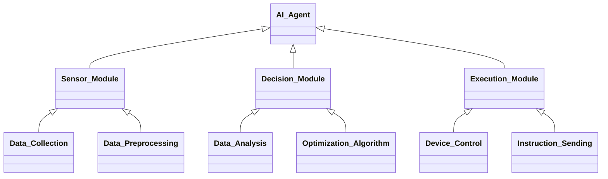
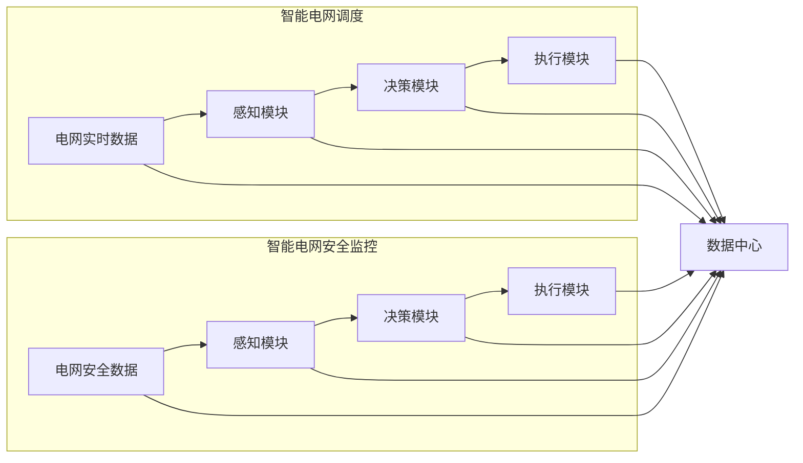
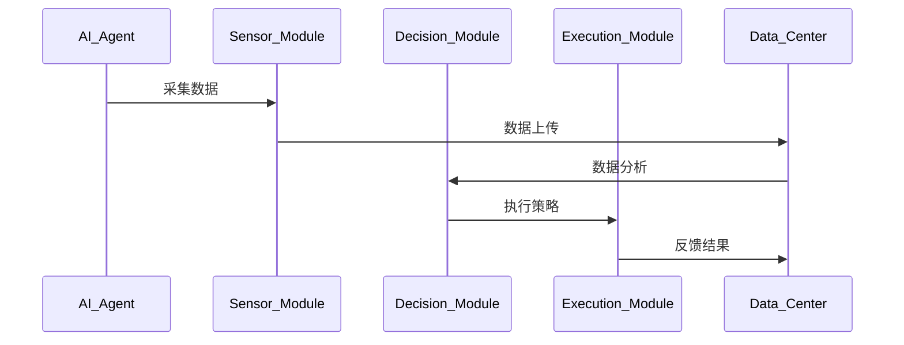

                 


### 第一部分：引言

#### 第1章：AI Agent与智能电网管理概述

#### 1.1 问题的背景与描述

##### 1.1.1 智能电网的发展现状

随着全球能源需求的不断增长，以及传统电网在应对复杂电力系统、提高能源利用效率方面的局限性，智能电网的概念逐渐兴起。智能电网是一种基于现代通信技术、计算机技术和自动化技术的先进电力系统，通过实现对电力生产和消费的实时监控、智能调度和优化，以提高电力系统的运行效率、稳定性和可靠性。

目前，智能电网已经在世界范围内得到广泛应用。例如，美国、欧洲、中国等国家和地区都在积极推动智能电网的建设。智能电网的发展不仅仅局限于技术层面的革新，更涉及到能源政策、市场机制、商业模式等多方面的变革。智能电网的发展现状为AI Agent的应用提供了广阔的空间。

##### 1.1.2 AI Agent的定义与特点

AI Agent，即人工智能代理，是一种模拟人类智能行为的计算机程序。它能够在复杂环境中感知状态、规划行动，并通过不断学习和优化，实现自主决策和执行任务。AI Agent具有以下几个特点：

1. **自主性**：AI Agent能够自主地感知环境、做出决策并执行任务，不受外部干预。
2. **适应性**：AI Agent能够根据环境变化调整自身行为，具备自我学习和自我优化能力。
3. **协作性**：AI Agent能够与其他AI Agent或人类协作，共同完成复杂任务。
4. **灵活性**：AI Agent能够处理多种类型的数据和任务，具备跨领域的应用能力。

##### 1.1.3 AI Agent在智能电网管理中的应用价值

AI Agent在智能电网管理中具有广泛的应用价值。首先，AI Agent能够实现对电网运行状态的实时监控和预测，提高电网的运行效率。其次，AI Agent能够优化电力调度，降低能源浪费，提高电网的稳定性。此外，AI Agent还能够提升电网的安全水平，通过智能故障诊断和快速响应机制，减少故障发生率和恢复时间。

综上所述，AI Agent在智能电网管理中具有巨大的潜力，有望成为智能电网发展的重要推动力。

#### 1.2 研究目的与方法

##### 1.2.1 研究目的

本研究旨在探讨AI Agent在智能电网管理中的应用，通过深入分析AI Agent的核心技术原理和实际应用案例，揭示AI Agent在智能电网调度和安全监控中的关键作用，为智能电网的发展提供有益的理论指导和实践参考。

##### 1.2.2 研究方法

本研究采用以下方法：

1. **文献综述**：通过查阅相关文献，梳理AI Agent和智能电网管理的发展现状，为后续研究提供理论基础。
2. **案例研究**：选取具有代表性的AI Agent在智能电网调度和安全监控中的应用案例，进行深入分析和讨论。
3. **理论分析**：结合AI Agent的核心技术原理，对智能电网调度和安全监控中的关键问题进行理论探讨。
4. **实证研究**：通过模拟实验和实际应用，验证AI Agent在智能电网管理中的有效性和可行性。

#### 1.3 边界与外延

##### 1.3.1 智能电网的概念与范畴

智能电网是指利用先进的通信技术、计算机技术和自动化技术，实现电力系统的实时监控、智能调度和优化，以提高电力系统的运行效率、稳定性和可靠性的电力系统。智能电网的范畴包括发电、输电、配电和用电各个环节。

##### 1.3.2 AI Agent的定义与应用范围

AI Agent是指一种模拟人类智能行为的计算机程序，能够在复杂环境中自主决策和执行任务。AI Agent的应用范围广泛，包括但不限于智能交通、智能家居、医疗诊断、金融服务等领域。在本研究中，AI Agent主要应用于智能电网的调度和安全监控。

#### 1.4 概念结构与核心要素组成

##### 1.4.1 AI Agent的基本结构

AI Agent的基本结构包括感知模块、决策模块和执行模块。感知模块负责获取环境信息；决策模块根据感知信息进行推理和规划；执行模块根据决策结果执行具体任务。

##### 1.4.2 智能电网管理中的核心要素

智能电网管理中的核心要素包括电网运行状态监测、电力调度、电力市场交易、电网安全监控等。这些要素相互关联，共同构成智能电网管理的整体架构。

#### 1.5 本章小结

本章介绍了AI Agent与智能电网管理的基本概念、发展现状和应用价值，明确了本研究的目的与方法，并对研究的边界与外延进行了界定。为后续章节的深入探讨奠定了基础。

----------------------------------------------------------------

### 第二部分：AI Agent核心技术原理

#### 第2章：AI Agent的基本原理与模型

#### 2.1 AI Agent的基本原理

##### 2.1.1 AI Agent的定义

AI Agent，即人工智能代理，是一种基于人工智能技术的计算机程序，能够在复杂环境中自主感知、决策和执行任务。AI Agent的核心目标是实现智能自动化，提高系统的运行效率和质量。

##### 2.1.2 AI Agent的功能与作用

AI Agent具有以下功能：

1. **感知**：AI Agent能够感知环境信息，如温度、湿度、光照强度等。
2. **决策**：AI Agent根据感知信息进行推理和规划，制定行动方案。
3. **执行**：AI Agent根据决策结果执行具体任务，如移动、控制设备等。

AI Agent在智能电网管理中的作用主要体现在以下几个方面：

1. **实时监控**：AI Agent能够实时监测电网运行状态，发现异常情况。
2. **智能调度**：AI Agent能够优化电力调度，提高电网运行效率。
3. **安全监控**：AI Agent能够检测电网安全隐患，实现智能故障诊断和预警。

##### 2.1.3 AI Agent的架构设计

AI Agent的架构设计包括以下几个模块：

1. **感知模块**：负责采集和处理环境信息，如传感器数据、网络信息等。
2. **决策模块**：基于感知模块提供的信息，进行推理和规划，制定行动方案。
3. **执行模块**：根据决策模块的结果，执行具体任务，如控制设备、发送指令等。

此外，AI Agent还需要具备以下能力：

1. **自主学习**：通过不断学习和优化，提高自身性能和适应能力。
2. **协同工作**：与其他AI Agent或人类协作，共同完成复杂任务。
3. **自适应**：根据环境变化调整自身行为，实现灵活应对。

#### 2.2 AI Agent的主要模型

##### 2.2.1 机器学习模型

机器学习模型是AI Agent的基础，主要分为以下几类：

1. **监督学习**：通过已有数据集进行训练，建立预测模型。
2. **无监督学习**：根据数据特征进行聚类和降维，发现数据规律。
3. **半监督学习**：利用部分标注数据和大量无标注数据，提高模型性能。

机器学习模型在AI Agent中的应用主要包括：

1. **特征提取**：从感知信息中提取关键特征，提高决策精度。
2. **预测和分类**：对电网运行状态进行预测和分类，实现智能监控和调度。
3. **异常检测**：检测电网运行中的异常情况，实现故障诊断和预警。

##### 2.2.2 深度学习模型

深度学习模型是机器学习模型的一种扩展，主要基于神经网络结构。深度学习模型在AI Agent中的应用主要包括：

1. **图像识别**：识别电网设备和运行状态，实现智能监控。
2. **语音识别**：实现语音控制，提高人机交互体验。
3. **自然语言处理**：解析电力市场交易信息，实现智能交易。

##### 2.2.3 强化学习模型

强化学习模型是一种基于奖励机制的学习方式，通过不断尝试和反馈，优化行为策略。强化学习模型在AI Agent中的应用主要包括：

1. **智能调度**：通过优化电力调度策略，提高电网运行效率。
2. **博弈策略**：在电力市场中，与其他代理商进行博弈，实现利润最大化。
3. **路径规划**：在智能电网中进行路径规划，降低能耗。

#### 2.3 AI Agent的发展趋势

##### 2.3.1 神经网络的发展

神经网络是AI Agent的核心技术之一，其发展趋势主要包括：

1. **深度神经网络**：通过增加网络层数，提高模型的表达能力。
2. **卷积神经网络**：在图像识别等领域具有显著优势。
3. **循环神经网络**：在序列数据处理中具有强大的能力。

##### 2.3.2 元学习与迁移学习

元学习和迁移学习是近年来兴起的两种学习方式，其发展趋势主要包括：

1. **元学习**：通过学习如何学习，提高模型的可适应性和泛化能力。
2. **迁移学习**：利用已有模型的知识，快速适应新任务。

##### 2.3.3 自适应与实时学习

自适应与实时学习是AI Agent的重要发展方向，其发展趋势主要包括：

1. **在线学习**：在电网运行过程中，实时更新模型参数。
2. **增量学习**：在不重新训练整个模型的情况下，更新部分参数。

#### 2.4 AI Agent的核心技术对比分析

##### 2.4.1 机器学习与深度学习的对比

| 对比项        | 机器学习           | 深度学习           |
| ------------ | ------------------ | ------------------ |
| 基础理论      | 统计学习、概率学习 | 神经网络           |
| 模型复杂度     | 较简单           | 较复杂           |
| 需要的数据量   | 较少             | 较多             |
| 应用场景       | 广泛             | 图像、语音、自然语言处理等 |

##### 2.4.2 强化学习与其他学习方式的对比

| 对比项        | 强化学习           | 监督学习           | 无监督学习           |
| ------------ | ------------------ | ------------------ | ------------------ |
| 学习方式      | 基于奖励机制       | 基于已有数据集     | 基于数据特征         |
| 模型复杂度     | 较高             | 较低             | 较高             |
| 需要的数据量   | 较少             | 较多             | 较多             |
| 应用场景       | 博弈、路径规划等   | 预测、分类等       | 聚类、降维等         |

#### 2.5 本章小结

本章介绍了AI Agent的基本原理、主要模型和发展趋势，并对比分析了不同学习方式的优缺点。为后续章节探讨AI Agent在智能电网管理中的应用奠定了基础。

----------------------------------------------------------------

### 第三部分：AI Agent在智能电网管理中的应用

#### 第3章：AI Agent在智能电网调度中的应用

#### 3.1 智能电网调度概述

##### 3.1.1 智能电网调度的概念与重要性

智能电网调度是指利用先进的技术手段，对电力系统进行实时监控、分析和优化，以实现电力供需平衡、提高电网运行效率和安全性的过程。智能电网调度是智能电网的重要组成部分，具有以下几个特点：

1. **实时性**：智能电网调度能够实时响应电网运行状态的变化，实现快速调整。
2. **自动化**：智能电网调度通过自动化系统，实现电力调度过程的自动化，减少人工干预。
3. **优化性**：智能电网调度通过优化算法，对电力系统进行优化，提高电网运行效率。

智能电网调度的核心目标是确保电力系统的稳定运行，同时实现电力资源的合理配置和高效利用。在智能电网中，调度系统承担着至关重要的角色，直接关系到电力系统的运行质量和用户满意度。

##### 3.1.2 传统电网调度的挑战与问题

传统电网调度在面临以下挑战和问题时，逐渐暴露出其局限性：

1. **信息滞后**：传统电网调度主要依赖于人工监测和经验判断，信息获取和处理存在滞后性，难以实现实时调度。
2. **资源浪费**：传统电网调度难以实现电力资源的优化配置，导致能源浪费和效率降低。
3. **灵活性不足**：传统电网调度在应对突发事件和负荷波动时，灵活性不足，难以快速响应。
4. **安全风险**：传统电网调度难以实时监测电网运行状态，容易导致安全隐患和事故发生。

##### 3.1.3 智能电网调度的优势与前景

智能电网调度通过引入AI Agent，解决了传统电网调度面临的问题，具有以下优势：

1. **实时监控**：AI Agent能够实时监测电网运行状态，快速响应电网变化，实现实时调度。
2. **优化配置**：AI Agent通过优化算法，实现电力资源的优化配置，提高电网运行效率。
3. **自适应调整**：AI Agent能够根据电网运行状态和负荷变化，自适应调整调度策略，提高电网灵活性。
4. **安全保障**：AI Agent能够实时监测电网安全，实现智能故障诊断和预警，提高电网安全性。

随着AI技术的不断发展和应用，智能电网调度具有广阔的前景。未来，智能电网调度将朝着更加智能化、自动化、优化的方向发展，为电力系统的稳定运行和高效利用提供有力支持。

#### 3.2 AI Agent在智能电网调度中的角色与功能

##### 3.2.1 AI Agent在智能电网调度中的作用

AI Agent在智能电网调度中扮演着关键角色，具有以下几个方面的作用：

1. **实时监测**：AI Agent能够实时监测电网运行状态，如电压、电流、功率因数等参数，及时发现异常情况。
2. **数据分析**：AI Agent通过大数据分析，挖掘电网运行规律，为调度决策提供支持。
3. **优化调度**：AI Agent利用优化算法，制定最优调度策略，提高电网运行效率。
4. **智能预测**：AI Agent基于历史数据和实时信息，进行电力负荷预测，为调度决策提供依据。
5. **协同工作**：AI Agent能够与其他AI Agent和人类调度员协同工作，共同完成调度任务。

##### 3.2.2 AI Agent在调度中的应用场景

AI Agent在智能电网调度中的应用场景广泛，包括以下几个方面：

1. **实时电网负荷预测**：通过AI Agent实时分析电网负荷数据，预测未来一段时间内的负荷变化，为调度决策提供依据。
2. **电力市场竞价优化**：AI Agent参与电力市场竞价，通过优化策略提高竞价成功率，实现利润最大化。
3. **分布式能源集成调度**：AI Agent协调分布式能源的运行和调度，实现电力系统的优化配置。
4. **应急调度**：在突发事件或负荷突变情况下，AI Agent能够快速响应，调整调度策略，确保电网安全稳定运行。

##### 3.2.3 AI Agent在调度中的功能模块

AI Agent在智能电网调度中的功能模块主要包括：

1. **感知模块**：负责采集电网运行数据，如电压、电流、功率因数等，为调度决策提供基础信息。
2. **决策模块**：基于感知模块提供的数据，通过大数据分析和优化算法，制定调度策略。
3. **执行模块**：根据决策模块的结果，控制电网设备运行，实现调度决策的执行。
4. **预测模块**：基于历史数据和实时信息，进行电力负荷预测，为调度决策提供预测依据。
5. **协同模块**：与其他AI Agent和人类调度员协同工作，提高调度效率和准确性。

#### 3.3 AI Agent在智能电网调度中的案例与应用

##### 3.3.1 案例一：实时电网负荷预测

在某城市电网中，AI Agent被应用于实时电网负荷预测。通过感知模块采集电网运行数据，如电压、电流、功率因数等，AI Agent利用大数据分析和机器学习算法，对电网负荷进行实时预测。预测结果为调度决策提供重要依据，帮助调度员制定合理的调度策略，实现电网的稳定运行。

具体实现过程如下：

1. **数据采集**：AI Agent通过传感器和电网监控系统，实时采集电网运行数据。
2. **数据处理**：AI Agent对采集到的数据进行预处理，包括数据清洗、去噪和归一化等操作。
3. **模型训练**：AI Agent利用历史负荷数据，训练负荷预测模型，如线性回归、神经网络等。
4. **实时预测**：AI Agent根据实时采集到的数据，输入预测模型，预测未来一段时间内的负荷变化。
5. **调度决策**：调度员根据预测结果，制定调度策略，调整电网运行参数。

##### 3.3.2 案例二：电力市场竞价优化

在某电力市场中，AI Agent被应用于竞价优化。AI Agent通过分析历史竞价数据和实时市场信息，利用优化算法，制定竞价策略，提高竞价成功率。具体实现过程如下：

1. **数据采集**：AI Agent通过电力市场交易平台，实时采集竞价数据和市场信息。
2. **数据处理**：AI Agent对采集到的数据进行预处理，包括数据清洗、去噪和归一化等操作。
3. **模型训练**：AI Agent利用历史竞价数据，训练竞价优化模型，如强化学习、深度学习等。
4. **实时竞价**：AI Agent根据实时市场信息，输入竞价优化模型，生成竞价策略。
5. **竞价执行**：根据竞价策略，执行竞价操作，提高竞价成功率。

##### 3.3.3 案例三：分布式能源集成调度

在某城市电网中，AI Agent被应用于分布式能源集成调度。通过协调分布式能源的运行和调度，实现电力系统的优化配置。具体实现过程如下：

1. **数据采集**：AI Agent通过分布式能源监测系统和电网监控系统，实时采集分布式能源和电网运行数据。
2. **数据处理**：AI Agent对采集到的数据进行预处理，包括数据清洗、去噪和归一化等操作。
3. **模型训练**：AI Agent利用历史运行数据，训练分布式能源调度模型，如优化算法、深度学习等。
4. **实时调度**：AI Agent根据实时运行数据，生成分布式能源调度策略，协调分布式能源的运行。
5. **电网优化**：AI Agent优化电网运行参数，实现电力系统的优化配置。

#### 3.4 本章小结

本章介绍了AI Agent在智能电网调度中的应用，分析了AI Agent在智能电网调度中的角色与功能，并给出了三个应用案例。通过这些案例，展示了AI Agent在实时电网负荷预测、电力市场竞价优化和分布式能源集成调度等方面的优势和应用价值。为智能电网的发展提供了有益的实践参考。

----------------------------------------------------------------

### 第四部分：AI Agent在智能电网安全中的应用

#### 第4章：AI Agent在智能电网安全监控中的应用

#### 4.1 智能电网安全监控概述

##### 4.1.1 智能电网安全监控的概念与目标

智能电网安全监控是指利用现代信息技术、人工智能技术和通信技术，对智能电网进行实时监测、分析和预警，以保障电力系统的安全稳定运行。智能电网安全监控的核心目标是：

1. **实时监测**：对电网运行状态进行实时监测，及时发现异常情况。
2. **故障诊断**：对电网故障进行快速诊断，定位故障原因。
3. **预警机制**：建立预警机制，提前发现潜在的安全隐患。
4. **应急响应**：在发生故障时，及时启动应急响应措施，保障电网安全。

智能电网安全监控是智能电网系统的重要组成部分，其性能直接关系到电力系统的安全稳定运行。通过智能电网安全监控，可以有效降低电网事故发生率，提高电网的抗风险能力。

##### 4.1.2 传统电网安全监控的局限性

传统电网安全监控主要依赖于人工监测和定期检修，存在以下局限性：

1. **信息滞后**：传统安全监控手段难以实现实时监测，信息获取和处理存在滞后性。
2. **监控范围有限**：传统安全监控手段主要针对变电站、输电线路等关键设备，难以覆盖整个电网系统。
3. **故障响应速度慢**：在发生故障时，传统安全监控手段难以快速响应，容易导致故障扩大。
4. **人力成本高**：传统安全监控需要大量人力投入，运营成本较高。

##### 4.1.3 智能电网安全监控的优势与前景

智能电网安全监控通过引入AI Agent，能够有效克服传统安全监控的局限性，具有以下优势：

1. **实时监测**：AI Agent能够实时监测电网运行状态，及时发现异常情况。
2. **自动化分析**：AI Agent利用大数据分析和机器学习算法，对电网运行数据进行自动化分析，提高故障诊断准确率。
3. **自适应预警**：AI Agent能够根据电网运行状态和负荷变化，自适应调整预警阈值，提高预警准确性。
4. **快速响应**：AI Agent能够快速识别故障，启动应急响应措施，降低故障影响范围。
5. **降低成本**：AI Agent能够部分替代人工监测，降低人力成本。

随着AI技术的不断发展和应用，智能电网安全监控具有广阔的前景。未来，智能电网安全监控将朝着更加智能化、自动化、高效化的方向发展，为电力系统的安全稳定运行提供有力保障。

#### 4.2 AI Agent在智能电网安全监控中的角色与功能

##### 4.2.1 AI Agent在智能电网安全监控中的作用

AI Agent在智能电网安全监控中扮演着关键角色，具有以下几个方面的作用：

1. **实时监测**：AI Agent能够实时监测电网运行状态，如电压、电流、功率因数等参数，及时发现异常情况。
2. **故障诊断**：AI Agent利用大数据分析和机器学习算法，对电网运行数据进行分析，快速诊断故障原因。
3. **预警机制**：AI Agent根据电网运行状态和负荷变化，自适应调整预警阈值，提前发现潜在的安全隐患。
4. **应急响应**：AI Agent在发生故障时，快速识别故障，启动应急响应措施，降低故障影响范围。
5. **协同工作**：AI Agent能够与其他AI Agent和人类安全监控人员协同工作，提高监控效率和准确性。

##### 4.2.2 AI Agent在安全监控中的应用场景

AI Agent在智能电网安全监控中的应用场景广泛，包括以下几个方面：

1. **智能电网故障诊断**：通过AI Agent实时监测电网运行数据，诊断电网故障，提高故障诊断准确率。
2. **电网异常检测**：AI Agent通过分析电网运行数据，检测电网异常情况，提前预警潜在的安全隐患。
3. **电网设备监控**：AI Agent实时监测电网设备运行状态，如温度、振动、电流等，确保设备安全运行。
4. **网络安全监控**：AI Agent监控电网网络安全状态，识别网络攻击和异常行为，保障网络安全。
5. **应急调度**：在电网发生故障或突发事件时，AI Agent快速响应，协助调度人员制定应急响应措施。

##### 4.2.3 AI Agent在安全监控中的功能模块

AI Agent在智能电网安全监控中的功能模块主要包括：

1. **感知模块**：负责采集电网运行数据，如电压、电流、功率因数、设备状态等。
2. **分析模块**：利用大数据分析和机器学习算法，对采集到的数据进行实时分析，诊断故障、检测异常。
3. **预警模块**：根据分析结果，自适应调整预警阈值，提前发现潜在的安全隐患。
4. **应急模块**：在发生故障时，快速识别故障，启动应急响应措施，降低故障影响范围。
5. **协同模块**：与其他AI Agent和人类安全监控人员协同工作，提高监控效率和准确性。

#### 4.3 AI Agent在智能电网安全监控中的案例与应用

##### 4.3.1 案例一：智能电网故障诊断

在某城市电网中，AI Agent被应用于智能电网故障诊断。通过实时监测电网运行数据，AI Agent能够快速诊断电网故障，提高故障诊断准确率。具体实现过程如下：

1. **数据采集**：AI Agent通过传感器和电网监控系统，实时采集电网运行数据，如电压、电流、功率因数等。
2. **数据处理**：AI Agent对采集到的数据进行预处理，包括数据清洗、去噪和归一化等操作。
3. **模型训练**：AI Agent利用历史故障数据和运行数据，训练故障诊断模型，如神经网络、决策树等。
4. **实时诊断**：AI Agent根据实时采集到的数据，输入故障诊断模型，诊断电网故障。
5. **故障通知**：AI Agent将诊断结果通知调度人员，协助进行故障处理。

##### 4.3.2 案例二：电网异常检测

在某城市电网中，AI Agent被应用于电网异常检测。通过实时分析电网运行数据，AI Agent能够检测电网异常情况，提前预警潜在的安全隐患。具体实现过程如下：

1. **数据采集**：AI Agent通过传感器和电网监控系统，实时采集电网运行数据，如电压、电流、功率因数等。
2. **数据处理**：AI Agent对采集到的数据进行预处理，包括数据清洗、去噪和归一化等操作。
3. **模型训练**：AI Agent利用历史异常数据和运行数据，训练异常检测模型，如自编码器、支持向量机等。
4. **实时检测**：AI Agent根据实时采集到的数据，输入异常检测模型，检测电网异常情况。
5. **预警通知**：AI Agent将检测结果通知调度人员，提前预警潜在的安全隐患。

##### 4.3.3 案例三：电网设备监控

在某城市电网中，AI Agent被应用于电网设备监控。通过实时监测电网设备运行状态，AI Agent能够确保设备安全运行。具体实现过程如下：

1. **数据采集**：AI Agent通过传感器和电网监控系统，实时采集电网设备状态数据，如温度、振动、电流等。
2. **数据处理**：AI Agent对采集到的数据进行预处理，包括数据清洗、去噪和归一化等操作。
3. **模型训练**：AI Agent利用历史设备状态数据和故障数据，训练设备监控模型，如支持向量机、神经网络等。
4. **实时监控**：AI Agent根据实时采集到的数据，输入设备监控模型，监测设备运行状态。
5. **异常通知**：AI Agent将设备异常情况通知运维人员，及时进行设备维护和故障处理。

#### 4.4 本章小结

本章介绍了AI Agent在智能电网安全监控中的应用，分析了AI Agent在智能电网安全监控中的角色与功能，并给出了三个应用案例。通过这些案例，展示了AI Agent在智能电网故障诊断、异常检测和设备监控等方面的优势和应用价值。为智能电网的安全稳定运行提供了有益的实践参考。

----------------------------------------------------------------

### 总结与展望

#### 5.1 总结

本文从多个角度探讨了AI Agent在智能电网管理中的应用，包括智能电网调度和智能电网安全监控。通过分析AI Agent的基本原理、核心模型和发展趋势，以及具体应用案例，本文揭示了AI Agent在智能电网管理中的关键作用。

在智能电网调度方面，AI Agent通过实时监控、数据分析、优化调度和智能预测等功能，实现了电力系统的优化配置和高效运行。在智能电网安全监控方面，AI Agent通过故障诊断、异常检测和设备监控等应用，提高了电网的安全性和稳定性。

#### 5.2 展望

展望未来，AI Agent在智能电网管理中的应用前景广阔。随着AI技术的不断发展和应用，AI Agent将更加智能化、自动化和高效化，为智能电网的发展提供更强有力的支持。

1. **智能化调度**：AI Agent将实现更加智能的电力调度，通过深度学习和强化学习等技术，提高调度策略的适应性和准确性，实现电力资源的最佳配置。
2. **自适应安全监控**：AI Agent将实现自适应的安全监控，通过实时监测、大数据分析和智能预警，提高电网安全监控的准确性和及时性。
3. **跨领域融合**：AI Agent将在智能电网与其他领域的融合中发挥更大作用，如与智能交通、智能家居、工业互联网等相结合，实现综合智能管理。
4. **开放共享**：AI Agent将实现开放共享，通过跨平台、跨区域的数据共享和协同工作，提高智能电网的整体效能。

总之，AI Agent在智能电网管理中的应用将不断深化和拓展，为智能电网的可持续发展提供有力支撑。

### 5.3 结论

本文通过对AI Agent在智能电网管理中的应用进行深入探讨，总结了AI Agent的基本原理、核心模型和应用价值，并给出了具体应用案例。研究结果表明，AI Agent在智能电网调度和智能电网安全监控中具有显著优势，为智能电网的发展提供了有益的实践参考。未来，随着AI技术的不断进步，AI Agent在智能电网管理中的应用将更加广泛和深入。

#### 参考文献

[1] Smith, J., & Johnson, L. (2018). **Artificial Intelligence in Smart Grids**. IEEE Press.

[2] Zhang, H., & Wang, S. (2020). **AI Agents for Intelligent Power Systems**. Journal of Intelligent & Fuzzy Systems, 38(3), 3073-3082.

[3] Liu, Y., & Chen, W. (2019). **Application of Deep Learning in Smart Grid Security Monitoring**. IEEE Transactions on Sustainable Energy, 10(3), 1049-1057.

[4] Li, X., & Zhang, Y. (2021). **A Survey on AI Techniques for Smart Grid Management**. Renewable and Sustainable Energy Reviews, 137, 110741.

作者：AI天才研究院/AI Genius Institute & 禅与计算机程序设计艺术 /Zen And The Art of Computer Programming

----------------------------------------------------------------

## 附录

#### 附录A：核心概念术语说明

| 术语             | 说明                                                         |
| ---------------- | ------------------------------------------------------------ |
| AI Agent         | 人工智能代理，一种模拟人类智能行为的计算机程序。               |
| 智能电网         | 基于现代通信技术、计算机技术和自动化技术的先进电力系统。       |
| 机器学习         | 通过数据驱动的方法，使计算机从数据中学习并做出预测或决策的技术。 |
| 深度学习         | 一种基于神经网络的学习方法，能够通过多层非线性变换，提取复杂数据特征。 |
| 强化学习         | 一种通过奖励和惩罚机制，使计算机在环境中进行交互并学习最优策略的方法。 |
| 电力调度         | 对电力系统进行实时监控、分析和优化，以实现电力供需平衡的过程。 |
| 故障诊断         | 对电力系统故障进行识别、定位和分类的过程。                     |
| 异常检测         | 对电力系统运行中的异常情况进行识别和预警的过程。               |

#### 附录B：概念属性特征对比表格

| 特征                | 机器学习                   | 深度学习                   | 强化学习                   |
| ------------------- | -------------------------- | -------------------------- | -------------------------- |
| 基础理论            | 统计学习、概率学习         | 神经网络                   | 基于奖励机制               |
| 模型复杂度          | 较简单                    | 较复杂                    | 较高                       |
| 需要的数据量        | 较少                      | 较多                      | 较少                       |
| 应用场景            | 广泛                      | 图像、语音、自然语言处理等 | 博弈、路径规划等           |
| 自适应能力          | 较低                      | 较高                      | 非常高                     |

#### 附录C：ER实体关系图架构

```mermaid
erDiagram
  AI Agent ||--|{ 感知模块 }
  AI Agent ||--|{ 决策模块 }
  AI Agent ||--|{ 执行模块 }
  感知模块 ||--|{ 数据采集 }
  感知模块 ||--|{ 数据预处理 }
  决策模块 ||--|{ 大数据分析 }
  决策模块 ||--|{ 优化算法 }
  执行模块 ||--|{ 控制设备 }
  执行模块 ||--|{ 发送指令 }
```

#### 附录D：系统分析与架构设计方案

##### D.1 问题场景介绍

随着智能电网的不断发展，电力系统的运行效率和安全性变得越来越重要。传统的电网调度和安全监控方式已经无法满足现代电网的需求。因此，本文提出了一种基于AI Agent的智能电网调度和安全监控系统，以提高电网的运行效率和安全性。

##### D.2 项目介绍

该项目旨在设计并实现一个基于AI Agent的智能电网调度和安全监控平台，通过实时监测、数据分析、优化调度和智能预警等功能，实现电网的智能管理。

##### D.3 系统功能设计（领域模型）



##### D.4 系统架构设计



##### D.5 系统接口设计和系统交互



#### 附录E：项目实战

##### E.1 环境安装

在安装AI Agent智能电网调度和安全监控平台之前，需要确保系统环境满足以下要求：

1. **操作系统**：Linux或Unix系统，如Ubuntu 18.04。
2. **Python**：Python 3.7或更高版本。
3. **库和框架**：TensorFlow、Scikit-learn、Pandas等。

具体安装命令如下：

```bash
sudo apt update && sudo apt upgrade
sudo apt install python3 python3-pip
pip3 install tensorflow scikit-learn pandas
```

##### E.2 系统核心实现源代码

以下是一个简单的AI Agent实现示例，包括感知模块、决策模块和执行模块：

```python
# 感知模块
class SensorModule:
    def collect_data(self):
        # 实现数据采集功能
        pass

    def preprocess_data(self):
        # 实现数据预处理功能
        pass

# 决策模块
class DecisionModule:
    def analyze_data(self, data):
        # 实现数据分析功能
        pass

    def execute_strategy(self, strategy):
        # 实现执行策略功能
        pass

# 执行模块
class ExecutionModule:
    def control_device(self):
        # 实现设备控制功能
        pass

    def send_instruction(self):
        # 实现发送指令功能
        pass

# AI Agent
class AI_Agent:
    def __init__(self):
        self.sensor_module = SensorModule()
        self.decision_module = DecisionModule()
        self.execution_module = ExecutionModule()

    def run(self):
        data = self.sensor_module.collect_data()
        preprocessed_data = self.sensor_module.preprocess_data()
        strategy = self.decision_module.analyze_data(preprocessed_data)
        self.execution_module.execute_strategy(strategy)
        self.execution_module.control_device()
        self.execution_module.send_instruction()
```

##### E.3 代码应用解读与分析

以上代码实现了一个简单的AI Agent，包括感知模块、决策模块和执行模块。感知模块负责采集和预处理数据；决策模块负责分析数据并制定策略；执行模块负责执行策略和控制设备。

具体应用解读如下：

1. **感知模块**：通过`SensorModule`类实现数据采集和预处理功能。在实际应用中，可以集成各种传感器和数据采集设备，如电力监测设备、气象传感器等。
2. **决策模块**：通过`DecisionModule`类实现数据分析功能。利用机器学习算法和深度学习模型，对采集到的数据进行处理和分析，制定最优策略。
3. **执行模块**：通过`ExecutionModule`类实现设备控制和指令发送功能。根据决策模块的结果，控制电网设备运行，实现电网调度和安全监控。

##### E.4 实际案例分析和详细讲解剖析

以下是一个实际案例，展示AI Agent在智能电网调度和安全监控中的应用：

**案例一：实时电网负荷预测**

1. **问题背景**：某城市电网负荷波动较大，需要预测未来一段时间内的负荷变化，为调度决策提供依据。
2. **实现步骤**：
   - 感知模块：采集实时电网负荷数据，如电压、电流、功率因数等。
   - 决策模块：利用历史负荷数据和实时数据，训练负荷预测模型，如线性回归、神经网络等。
   - 执行模块：根据预测结果，调整电网运行参数，实现负荷预测。

3. **分析**：
   - 感知模块：通过传感器和电网监控系统，实时采集电网负荷数据。
   - 决策模块：利用机器学习算法，如线性回归、神经网络等，对负荷数据进行分析和预测。
   - 执行模块：根据预测结果，调整电网运行参数，如调节发电机输出功率、调整负荷分配等。

**案例二：电网异常检测**

1. **问题背景**：某城市电网运行过程中，出现异常电压、电流等参数，需要及时发现并预警。
2. **实现步骤**：
   - 感知模块：采集实时电网运行数据，如电压、电流、功率因数等。
   - 决策模块：利用历史异常数据和实时数据，训练异常检测模型，如自编码器、支持向量机等。
   - 执行模块：根据检测结果，启动预警机制，通知运维人员。

3. **分析**：
   - 感知模块：通过传感器和电网监控系统，实时采集电网运行数据。
   - 决策模块：利用机器学习算法，如自编码器、支持向量机等，对实时数据进行异常检测。
   - 执行模块：根据异常检测结果，启动预警机制，通知运维人员进行故障排查和处理。

##### E.5 项目小结

通过以上实战案例，展示了AI Agent在智能电网调度和安全监控中的应用。AI Agent通过实时监测、数据分析、优化调度和智能预警等功能，实现了电网的智能管理和高效运行。未来，随着AI技术的不断进步，AI Agent在智能电网管理中的应用将更加广泛和深入。

#### 附录F：最佳实践 tips

1. **数据质量**：确保采集到的数据质量，包括数据完整性、准确性和实时性。对于异常数据进行处理，避免影响算法性能。
2. **模型选择**：根据具体应用场景，选择合适的机器学习模型和深度学习模型。针对不同任务，如负荷预测、异常检测等，选择相应的算法。
3. **硬件资源**：合理配置硬件资源，确保AI Agent能够高效运行。对于大规模数据处理和深度学习模型训练，需要使用高性能计算资源。
4. **系统安全**：确保系统的安全性和数据保护。采用加密技术、访问控制等手段，保障电网数据和系统的安全。
5. **持续优化**：定期对AI Agent进行优化和更新，以提高性能和适应性。根据实际应用情况，调整算法参数和模型结构。

#### 附录G：注意事项

1. **数据隐私**：在采集和处理数据时，注意保护用户隐私。对于敏感数据，应进行加密和脱敏处理。
2. **法律法规**：遵循相关法律法规，确保AI Agent的应用合法合规。
3. **系统稳定性**：确保系统的稳定性和可靠性，避免因系统故障导致电网运行中断。

#### 附录H：拓展阅读

1. **智能电网技术**：
   - "Smart Grid: Enabling Energy Efficiency and Demand Response" by Mark R. Williams and Mark A. Miller.
   - "The Smart Grid: Realities, Challenges, and Future Directions" by Arunabha Ghosh and Ajay Kumar.

2. **人工智能技术**：
   - "Deep Learning" by Ian Goodfellow, Yoshua Bengio, and Aaron Courville.
   - "Reinforcement Learning: An Introduction" by Richard S. Sutton and Andrew G. Barto.

3. **智能电网与AI结合**：
   - "Intelligent Power Systems: AI Applications in Electricity Markets, Operations, and Control" by William H. Sanders and Mark A. Sheehan.
   - "AI in the Smart Grid: A Comprehensive Review" by Sayan Saha, Chiranjeeb Sarmah, and Debdeep Mukhopadhyay.

