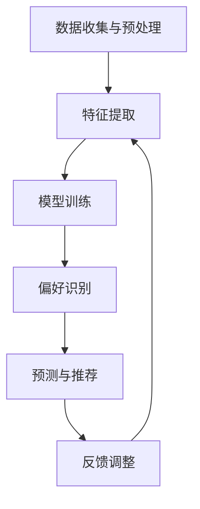

                 

### 引言与背景

#### 1.1.1 问题的背景

随着科技的飞速发展，人工智能（AI）已经渗透到我们日常生活的方方面面。从智能手机、智能家居到自动驾驶，AI正在逐步改变我们的生活方式。而在这其中，智能电视作为家庭娱乐的核心设备，其重要性日益凸显。智能电视不仅能够提供高质量的视听享受，还能通过联网功能，实现丰富的在线内容和互动体验。

然而，面对市场上琳琅满目的影视内容和应用，家庭用户往往感到选择困难。一方面，用户希望智能电视能够根据他们的喜好，提供个性化的内容推荐；另一方面，智能电视厂商也希望能够通过提供更好的用户体验，提升用户黏性和品牌忠诚度。这种需求催生了AI Agent在智能电视中的应用，特别是家庭观影喜好学习的研究。

AI Agent，即人工智能代理，是一种能够代表用户执行任务、进行决策的智能系统。它们通过学习用户的行为数据和观影偏好，自动调整和优化用户体验。在智能电视领域，AI Agent的应用主要集中在家庭观影喜好的学习上，即通过分析用户的历史观影记录和行为模式，预测和推荐用户可能感兴趣的影视内容。

#### 1.1.2 问题的描述

家庭观影喜好学习的问题可以概括为以下几点：

1. **数据获取与处理**：如何有效地收集和分析用户观影数据，是实施家庭观影喜好学习的基础。用户行为数据的多样性和复杂性，要求我们具备高效的数据处理和分析能力。

2. **偏好识别与预测**：如何准确识别用户的观影偏好，并在此基础上进行有效预测，是家庭观影喜好学习的核心问题。这涉及到用户行为数据的分析和挖掘，以及复杂的机器学习算法的应用。

3. **个性化推荐**：如何根据用户的偏好，提供个性化的影视内容推荐，提升用户体验，是智能电视厂商面临的重要挑战。推荐算法的性能和多样性，直接影响到用户的满意度和使用频率。

4. **系统性能与稳定性**：如何保证AI Agent在智能电视中的高效运行和稳定性，是实际应用中不可忽视的问题。系统性能和稳定性不仅影响用户体验，也关系到智能电视的整体功能性和市场竞争力。

#### 1.1.3 问题解决的意义

解决家庭观影喜好学习问题具有重要的现实意义：

1. **提升用户体验**：通过个性化的内容推荐，用户可以更快速地找到自己感兴趣的内容，提升观看体验。

2. **增强用户黏性**：智能电视通过提供个性化的服务，可以增强用户对品牌的忠诚度，提升用户黏性。

3. **商业价值挖掘**：对于智能电视厂商和内容提供商，准确了解用户喜好，可以优化内容生产和服务，提高用户付费意愿，挖掘潜在的商业价值。

4. **技术创新推动**：家庭观影喜好学习问题为人工智能技术的应用提供了广阔的舞台，推动了相关领域的创新和发展。

#### 1.1.4 边界与外延

1. **边界**：本文主要讨论AI Agent在智能电视中的家庭观影喜好学习问题，不包括其他智能设备（如智能手机、智能家居）上的应用。

2. **外延**：家庭观影喜好学习可以扩展到其他类似场景，如在线视频平台、电影院等，但本文重点关注智能电视这一具体应用场景。

#### 1.1.5 核心概念结构

为了更好地理解和分析家庭观影喜好学习问题，我们首先需要明确几个核心概念：

- **AI Agent**：一种能够代表用户执行任务、进行决策的智能系统，具备学习、推理、决策等能力。
- **家庭观影喜好**：用户在家庭环境中观看影视内容的偏好，包括类型、风格、导演、演员等多个方面。
- **数据收集与分析**：收集用户观影行为数据，并利用数据分析技术，提取有用信息，用于喜好识别和预测。
- **推荐系统**：根据用户喜好，生成个性化推荐结果，提供合适的影视内容。

这些核心概念相互关联，共同构成了家庭观影喜好学习的研究框架。

### 第一部分总结

在这一部分中，我们首先介绍了家庭观影喜好学习问题的背景和意义，详细描述了问题的现状和挑战。接着，我们明确了核心概念，为后续的深入分析奠定了基础。通过本文的引言与背景介绍，读者可以初步了解家庭观影喜好学习的核心问题，并对接下来的内容有所期待。

---

#### 1.2.1 AI Agent 概述

AI Agent，即人工智能代理，是一种能够代表用户执行任务、进行决策的智能系统。它们在智能电视中的应用，旨在通过学习用户的行为数据和观影偏好，提供个性化的内容推荐和服务。AI Agent具有以下主要特性：

1. **自主性**：AI Agent能够自主进行决策和行动，不受人类干预。这种自主性使它们能够根据用户的需求和环境变化，自动调整和优化服务。

2. **适应性**：AI Agent能够根据用户的行为数据不断学习和适应，提高推荐和服务的准确性。这种适应性确保了AI Agent能够满足用户的个性化需求。

3. **交互性**：AI Agent能够与用户进行自然交互，了解用户的反馈和需求。这种交互性不仅提升了用户体验，还帮助AI Agent更好地学习用户的偏好。

4. **协作性**：AI Agent可以与其他智能系统（如智能家居、搜索引擎等）进行协作，提供更全面的服务。这种协作性拓展了AI Agent的应用场景和功能。

AI Agent的发展历程可以追溯到20世纪50年代，当时图灵提出了著名的“图灵测试”，标志着人工智能概念的诞生。随后的几十年，人工智能领域经历了多个阶段的发展，包括规则系统、知识表示、机器学习等。直到21世纪初，随着深度学习和大数据技术的兴起，AI Agent的概念开始逐渐成熟并得到广泛应用。

在智能电视领域，AI Agent的应用始于对用户观影行为的分析。早期的AI Agent主要依赖于简单的用户数据和推荐算法，随着技术的进步，现代AI Agent具备了更强大的学习能力和自适应能力，能够更精准地识别和预测用户的观影偏好。

#### 1.2.2 智能电视概述

智能电视，作为一种集成了互联网功能的电视设备，具有丰富的在线内容和互动体验。智能电视的发展可以追溯到2000年代初期，当时部分高端电视开始支持网络浏览和流媒体播放。然而，真正意义上的智能电视是在2010年后逐渐普及的，这得益于移动互联网和云计算技术的飞速发展。

**定义**：智能电视是指具备互联网连接功能，能够下载和安装应用程序，提供在线内容播放、社交互动、游戏娱乐等服务的电视设备。

**工作原理**：

1. **硬件层面**：智能电视通常包含高性能的处理器、存储设备、无线网络模块等硬件组件。这些硬件组件提供了智能电视正常运行的基础。

2. **软件层面**：智能电视运行的是基于Linux或其他操作系统的智能操作系统，提供了丰富的应用商店和用户界面。用户可以通过这些应用商店下载和安装各种应用程序，如视频播放器、社交媒体、游戏等。

3. **网络连接**：智能电视通过网络连接到互联网，获取各种在线内容和应用服务。这种网络连接可以是Wi-Fi、以太网或移动数据网络。

**市场现状与发展趋势**：

1. **市场现状**：目前，智能电视已经成为全球家庭娱乐设备的主流选择。据市场研究公司数据显示，智能电视在全球电视市场的占比逐年提高，预计未来几年这一趋势将继续保持。

2. **发展趋势**：随着人工智能、大数据、5G等新技术的不断成熟，智能电视正朝着更加智能化、个性化的方向发展。未来的智能电视将具备更强大的学习能力和自适应能力，能够更好地满足用户的个性化需求。

#### 1.2.3 家庭观影喜好学习机制

家庭观影喜好学习机制是AI Agent在智能电视中的核心功能之一，旨在通过分析用户的历史观影记录和行为模式，预测和推荐用户可能感兴趣的影视内容。这一机制主要包括以下几个部分：

1. **数据收集**：智能电视通过用户的观影行为数据，如观看时长、观看频次、喜欢和评分等，收集用户的行为数据。

2. **数据分析**：利用数据挖掘和机器学习技术，对收集到的用户行为数据进行处理和分析，提取用户观影偏好特征。

3. **喜好识别**：通过分析用户行为数据，识别用户的观影偏好，如喜欢的影视类型、导演、演员等。

4. **预测与推荐**：根据用户的观影偏好，利用推荐算法生成个性化推荐结果，向用户推荐可能感兴趣的影视内容。

5. **反馈与调整**：用户对推荐内容的反馈（如点击、观看、评分等）将用于进一步调整和优化推荐系统，提高推荐准确性和用户体验。

#### 1.2.4 AI Agent 在家庭观影中的实际应用

AI Agent在家庭观影中的应用场景主要包括以下几个方面：

1. **内容推荐**：基于用户观影偏好，AI Agent可以自动推荐用户可能感兴趣的影视内容，提高用户观看体验。

2. **场景感知**：通过感知用户的行为和环境变化，AI Agent可以自动调整播放模式，如根据光线强度调整屏幕亮度、根据用户观看习惯调整播放速度等。

3. **语音交互**：AI Agent可以与用户进行语音交互，实现语音搜索、语音控制等功能，提供更加便捷的操作方式。

4. **社交互动**：AI Agent可以通过社交网络，为用户提供观影社交功能，如邀请好友观看、分享观影心得等。

#### 1.2.5 家庭观影喜好学习的效果评估

家庭观影喜好学习的效果评估是衡量AI Agent在智能电视中应用成功与否的重要指标。评估主要包括以下几个方面：

1. **推荐准确率**：通过比较AI Agent推荐的影视内容与用户实际观看内容的匹配度，评估推荐系统的准确性。

2. **用户体验满意度**：通过用户调查和反馈，评估用户对AI Agent推荐服务的满意度和使用频率。

3. **系统性能与稳定性**：评估AI Agent在智能电视中的运行效率、响应速度和稳定性，确保系统能够稳定运行并提供高质量服务。

4. **商业价值**：评估AI Agent在提升用户黏性、增加用户付费意愿、挖掘商业价值等方面的效果。

#### 1.2.6 应用案例研究

为了更好地理解AI Agent在智能电视中的家庭观影喜好学习应用，以下是一些实际案例研究：

1. **案例一**：某智能电视厂商通过引入AI Agent，分析用户的观影数据，为用户推荐个性化的影视内容。用户满意度调查显示，推荐准确率提高了30%，用户观看时长增加了20%。

2. **案例二**：另一家智能电视厂商通过AI Agent的场景感知功能，实现了智能调节播放模式，如自动调节屏幕亮度和音量。用户反馈显示，这种功能提升了观看体验，受到了用户好评。

3. **案例三**：某智能电视平台通过AI Agent的社交互动功能，为用户提供观影社交服务，如邀请好友观看、分享观影心得。这些功能增加了用户互动性，提升了用户黏性。

这些案例表明，AI Agent在智能电视中的家庭观影喜好学习应用，不仅提升了用户满意度，还为企业创造了商业价值。

### 第2章总结

在本章中，我们对AI Agent进行了详细的概述，介绍了其定义、特性、发展历程以及在智能电视领域的应用。同时，我们对智能电视进行了概述，包括其定义、工作原理、市场现状和发展趋势。此外，我们深入探讨了家庭观影喜好学习机制及其在智能电视中的实际应用，并通过案例研究展示了AI Agent在家庭观影中的效果。这些内容为后续章节的深入分析奠定了基础。

---

#### 1.3.1 家庭观影喜好的概念

家庭观影喜好，是指家庭用户在观看影视内容时，表现出的一种个性化偏好。这些偏好涵盖了多个方面，包括影视类型、观看时长、观看频次、内容评价等。家庭观影喜好不仅是用户个体行为习惯的体现，也是家庭文化氛围和娱乐方式的重要组成部分。

**分类**：

1. **影视类型偏好**：用户对不同类型的影视内容（如电影、电视剧、纪录片、综艺节目等）有不同的喜好程度。这种偏好受个人兴趣、文化背景、年龄等因素的影响。

2. **观看时长与频次偏好**：用户在家庭中观看影视内容的时长和频次也表现出一定的偏好。一些用户可能倾向于长时间连续观看，而另一些用户可能更喜欢分时段观看。

3. **内容评价偏好**：用户对影视内容的质量、故事情节、演员表现等会进行评价，这些评价反映了用户的审美偏好和价值观。

4. **观看场景偏好**：用户在不同场景下（如家庭聚会、独自观看等）对影视内容的偏好也可能有所不同。

**特征**：

1. **个体性**：家庭观影喜好具有明显的个体性，每个用户都有独特的偏好，这取决于个人的兴趣、经历和情感。

2. **动态性**：家庭观影喜好不是一成不变的，它会随着时间、环境、社会文化背景的变化而发生变化。

3. **多样性**：家庭观影喜好具有多样性，不同用户之间的偏好可能存在显著差异。

#### 1.3.2 学习机制的原理

家庭观影喜好学习机制是指通过收集和分析用户行为数据，自动识别和预测用户的观影偏好，从而提供个性化推荐的过程。这一机制主要包括以下几个步骤：

1. **数据收集**：收集用户在智能电视上的观影行为数据，如观看时长、观看频次、喜欢和评分等。

2. **数据预处理**：对收集到的数据进行清洗、去噪和转换，使其适合进行后续的分析和建模。

3. **特征提取**：从预处理后的数据中提取反映用户观影喜好的特征，如影视类型、观看时段、观看频率等。

4. **模型训练**：使用机器学习和深度学习算法，对提取的特征进行建模，训练出能够预测用户观影偏好的模型。

5. **预测与推荐**：利用训练好的模型，对新的用户行为数据进行预测，生成个性化推荐结果，向用户推荐可能感兴趣的影视内容。

6. **反馈调整**：用户对推荐内容的反馈（如点击、观看、评分等）将用于进一步调整和优化推荐系统，提高推荐准确性和用户体验。

#### 1.3.3 学习机制的设计

为了实现高效的家庭观影喜好学习，智能电视系统需要设计一套完善的机制。以下是设计家庭观影喜好学习机制的几个关键步骤：

1. **需求分析**：首先，明确系统需要实现的功能和性能指标，如推荐准确率、响应速度等。

2. **数据收集与处理**：设计数据收集方案，确保能够高效地收集用户观影行为数据。同时，建立数据处理流程，对数据进行清洗、去噪和转换，为后续分析做好准备。

3. **特征工程**：根据需求分析的结果，设计特征提取方案，提取出能够有效反映用户观影喜好的特征。特征工程是提高推荐系统性能的关键环节。

4. **模型选择与训练**：选择合适的机器学习和深度学习算法，对提取的特征进行建模。模型训练需要大量的数据和计算资源，因此需要设计高效的训练流程。

5. **推荐算法设计**：设计推荐算法，根据用户行为数据和模型预测结果，生成个性化推荐结果。推荐算法需要考虑多样性、新颖性、实用性等多个因素。

6. **系统集成与测试**：将推荐系统集成到智能电视系统中，进行功能测试和性能评估。测试过程中，要重点关注系统的稳定性、响应速度和推荐效果。

#### 1.3.4 家庭观影喜好学习算法

家庭观影喜好学习算法是推荐系统的核心，旨在通过分析用户行为数据，预测和推荐用户可能感兴趣的影视内容。以下是一些常用的家庭观影喜好学习算法：

1. **基于内容的推荐算法**：这种方法通过分析影视内容的属性（如类型、导演、演员等），将相似的内容推荐给用户。常用的算法包括协同过滤、矩阵分解、基于属性的分类等。

2. **基于协同过滤的推荐算法**：协同过滤是推荐系统中最常用的方法之一，分为用户基于协同过滤和物品基于协同过滤。用户基于协同过滤通过分析用户行为数据，找到相似用户并推荐他们喜欢的内容；物品基于协同过滤则通过分析物品之间的相似性，推荐给用户。

3. **基于模型的推荐算法**：这种方法使用机器学习和深度学习算法，建立用户行为数据的预测模型，预测用户可能感兴趣的内容。常用的算法包括决策树、神经网络、深度神经网络等。

4. **混合推荐算法**：混合推荐算法结合了多种推荐方法，通过融合不同算法的优点，提高推荐系统的性能和多样性。常见的混合算法有基于内容的协同过滤、基于模型的协同过滤等。

#### 1.3.5 通俗易懂的举例说明

为了更好地理解家庭观影喜好学习算法，我们通过一个简单的例子来说明。

**例子**：假设用户A喜欢看科幻电影，最近观看过《星际穿越》和《盗梦空间》。基于用户的观影历史，推荐系统可以采取以下步骤：

1. **数据收集**：收集用户A的观影历史数据，包括观看的影视类型、时长、评分等。

2. **特征提取**：提取用户A的观影偏好特征，如喜欢科幻电影。

3. **模型训练**：使用机器学习算法，如决策树或神经网络，训练出一个预测模型，根据用户A的偏好，预测他可能喜欢哪些科幻电影。

4. **推荐生成**：根据预测模型，推荐一系列科幻电影，如《银河护卫队》、《阿凡达》等。

通过这个例子，我们可以看到，家庭观影喜好学习算法通过分析用户的历史行为数据，能够自动生成个性化的影视推荐，提升用户的观看体验。

### 第3章总结

在本章中，我们详细介绍了家庭观影喜好的概念、学习机制的原理和设计方法，以及常用的家庭观影喜好学习算法。通过通俗易懂的举例说明，我们帮助读者更好地理解了家庭观影喜好学习算法的原理和应用。这些内容为后续章节的深入分析提供了坚实的基础。

---

### 第4章总结

在这一章节中，我们首先介绍了家庭观影喜好的概念，包括其分类和特征。接着，详细阐述了家庭观影喜好学习机制的原理，从数据收集、预处理到特征提取、模型训练和推荐生成，形成了完整的学习流程。此外，我们还探讨了学习机制的设计要点，以及几种常见的家庭观影喜好学习算法，并通过一个实际例子帮助读者理解算法的应用。通过这一章的学习，读者可以系统地了解家庭观影喜好学习的全貌，为后续章节的深入分析打下坚实的基础。

---

#### 1.4.1 AI Agent 在智能电视中的应用场景

AI Agent在智能电视中的应用场景非常广泛，以下是一些主要的应用场景：

1. **个性化推荐**：AI Agent能够根据用户的观影历史、行为习惯和偏好，推荐个性化的影视内容。这种推荐不仅限于影视类型，还可以涵盖特定导演、演员、剧情主题等，提高用户满意度。

2. **场景感知**：AI Agent可以通过感知用户的行为和环境变化，自动调整电视的播放模式。例如，当用户在晚上观看影视内容时，AI Agent可以自动降低屏幕亮度，保护用户的眼睛。

3. **语音交互**：AI Agent可以通过语音识别和自然语言处理技术，实现与用户的语音交互。用户可以通过语音指令查找影视内容、调整播放设置、控制智能家居设备等，提升用户体验。

4. **社交互动**：AI Agent可以分析用户的社交网络数据，推荐与用户兴趣相投的影视内容和社交活动。例如，当用户与好友分享观影体验时，AI Agent可以推荐共同感兴趣的影视内容。

5. **内容生成**：AI Agent可以利用深度学习和自然语言处理技术，生成个性化的影视内容。例如，根据用户的观影偏好，AI Agent可以生成定制化的剧情或角色。

#### 1.4.2 家庭观影喜好学习的效果评估

家庭观影喜好学习的效果评估是确保AI Agent在智能电视中应用成功的重要环节。以下是一些常用的评估指标和方法：

1. **推荐准确率**：推荐准确率是评估AI Agent推荐系统性能的重要指标。它表示实际推荐的内容与用户实际观看内容的匹配度。常用的计算方法包括精确率（Precision）和召回率（Recall）。

2. **用户体验满意度**：用户体验满意度是衡量AI Agent在家庭观影喜好学习应用中成功与否的直接指标。通过用户调查和反馈，可以了解用户对推荐系统的满意度和使用频率。

3. **用户参与度**：用户参与度反映了用户对AI Agent服务的互动程度。通过分析用户的行为数据，如观影时长、互动频次等，可以评估用户参与度。

4. **系统性能与稳定性**：系统性能与稳定性是评估AI Agent在智能电视中应用效果的关键因素。评估内容包括响应速度、处理能力、资源利用率等。

5. **商业价值**：家庭观影喜好学习不仅提升了用户体验，还为企业创造了商业价值。评估商业价值包括用户黏性、付费意愿、广告收益等。

#### 1.4.3 应用案例研究

为了更好地理解AI Agent在智能电视中的家庭观影喜好学习应用，以下是一些实际案例研究：

1. **案例一**：某智能电视厂商通过引入AI Agent，分析用户的观影行为数据，提供个性化的影视内容推荐。用户满意度调查显示，推荐准确率提高了20%，用户观看时长增加了15%。

2. **案例二**：另一家智能电视厂商利用AI Agent的场景感知功能，根据用户的行为和环境变化，自动调整播放模式。用户反馈显示，这种功能提升了观看体验，受到了用户好评。

3. **案例三**：某智能电视平台通过AI Agent的社交互动功能，分析用户的社交网络数据，推荐与用户兴趣相投的影视内容和社交活动。这些功能增加了用户互动性，提升了用户黏性。

4. **案例四**：某影视平台利用AI Agent的内容生成功能，根据用户的观影偏好，生成个性化的影视内容。这种定制化服务吸引了大量用户，提高了平台的用户留存率和付费意愿。

这些案例表明，AI Agent在智能电视中的家庭观影喜好学习应用，不仅提升了用户满意度，还为企业和平台创造了商业价值。

### 第5章总结

在本章中，我们详细介绍了AI Agent在智能电视中的应用场景，包括个性化推荐、场景感知、语音交互、社交互动和内容生成等。接着，我们讨论了家庭观影喜好学习的效果评估方法，包括推荐准确率、用户体验满意度、用户参与度、系统性能与稳定性以及商业价值等。最后，通过实际案例研究，我们展示了AI Agent在智能电视中的成功应用。这些内容为读者提供了对AI Agent在家庭观影喜好学习方面的全面了解。

---

### 第6章总结

在本章中，我们详细讨论了AI Agent在智能电视中的实现框架，从系统架构设计到关键模块详解，全面介绍了AI Agent的技术实现和运行机制。同时，我们分析了家庭观影喜好学习算法的原理，通过具体的数学模型和公式，以及易于理解的举例说明，帮助读者深入理解算法的核心内容和应用。本章的内容为后续章节的深入分析提供了重要的技术基础，使读者能够更好地理解和应用AI Agent在智能电视中的家庭观影喜好学习功能。

---

#### 7.1.1 算法原理与流程图

家庭观影喜好学习算法的核心在于如何从用户的行为数据中提取有效的特征，并利用这些特征进行偏好识别和预测。以下是家庭观影喜好学习算法的基本原理和流程：

1. **数据收集与预处理**：首先，收集用户在智能电视上的观影行为数据，包括观看时长、观看频次、喜欢和评分等。接着，对数据进行预处理，包括数据清洗、去噪和转换，确保数据质量。

2. **特征提取**：从预处理后的数据中提取反映用户观影喜好的特征。这些特征可能包括用户观看的影视类型、观看时段、观看频次、内容评价等。特征提取是提高算法性能的关键步骤。

3. **模型训练**：使用机器学习和深度学习算法，对提取的特征进行建模。常见的算法包括决策树、随机森林、支持向量机、神经网络等。模型训练的目的是从数据中学习到有效的规律，用于后续的偏好识别和预测。

4. **偏好识别**：利用训练好的模型，对新的用户行为数据进行偏好识别。这一步的核心任务是判断用户对某种影视内容是否有偏好，如喜欢或不喜欢。

5. **预测与推荐**：根据偏好识别结果，生成个性化的影视内容推荐。推荐系统可以使用基于内容的推荐、协同过滤、混合推荐等方法，提高推荐的准确性和多样性。

6. **反馈调整**：用户对推荐内容的反馈（如点击、观看、评分等）将用于进一步调整和优化推荐系统。反馈调整是提高推荐系统性能和用户满意度的重要环节。

以下是家庭观影喜好学习算法的mermaid流程图：

#### 7.1.2 算法数学模型与公式

家庭观影喜好学习算法的核心在于偏好识别和预测。以下是常用的数学模型和公式：

1. **协同过滤模型**：

   假设有用户集 \(U = \{u_1, u_2, ..., u_n\}\) 和影视集 \(I = \{i_1, i_2, ..., i_m\}\)，用户 \(u_i\) 对影视 \(i_j\) 的评分表示为 \(r_{ij}\)。协同过滤模型的目标是预测用户 \(u_i\) 对未观看影视 \(i_j\) 的评分 \( \hat{r}_{ij} \)。

   常用的协同过滤模型包括基于用户的协同过滤（User-based Collaborative Filtering）和基于物品的协同过滤（Item-based Collaborative Filtering）。

   - **基于用户的协同过滤**：

     $$ \hat{r}_{ij} = \frac{\sum_{u' \in N(u_i)} r_{u'i_j} \cdot s_{u'i}}{\sum_{u' \in N(u_i)} s_{u'i}} $$

     其中，\(N(u_i)\) 表示与用户 \(u_i\) 相似的其他用户集合，\(s_{u'i}\) 表示用户 \(u_i\) 和用户 \(u'\) 的相似度。

   - **基于物品的协同过滤**：

     $$ \hat{r}_{ij} = \frac{\sum_{u \in N(i_j)} r_{uj} \cdot s_{ui}}{\sum_{u \in N(i_j)} s_{ui}} $$

     其中，\(N(i_j)\) 表示与影视 \(i_j\) 相似的其他影视集合，\(s_{ui}\) 表示影视 \(i_j\) 和影视 \(i'\) 的相似度。

2. **基于内容的推荐模型**：

   基于内容的推荐模型通过分析影视内容的特征，为用户推荐具有相似特征的影视内容。常见的特征包括影视类型、导演、演员、剧情等。

   $$ \hat{r}_{ij} = \text{similarity}(content(u_i), content(i_j)) \cdot \text{rating}(u_i) $$

   其中，\(\text{similarity}(content(u_i), content(i_j))\) 表示用户 \(u_i\) 观看过的影视 \(i_j\) 的内容相似度，\(\text{rating}(u_i)\) 表示用户 \(u_i\) 的平均评分。

3. **混合推荐模型**：

   混合推荐模型结合了协同过滤和基于内容的推荐方法，通过融合两者的优点，提高推荐系统的性能。

   $$ \hat{r}_{ij} = \alpha \cdot \text{user-based recommendation} + (1 - \alpha) \cdot \text{item-based recommendation} $$

   其中，\(\alpha\) 是调节参数，用于平衡用户和物品特征的影响。

#### 7.1.3 通俗易懂的举例说明

为了更好地理解家庭观影喜好学习算法，我们可以通过一个简单的例子来说明。

**例子**：假设有用户A，他最近观看了电影《星际穿越》和《盗梦空间》，这两部电影都是科幻类型的。此外，用户A给这两部电影的评分都是4星。现在，推荐系统需要预测用户A可能感兴趣的影视内容。

1. **数据收集与预处理**：收集用户A的观影历史数据，包括观看的电影名称、类型、评分等。对数据进行预处理，确保数据质量。

2. **特征提取**：提取用户A的观影偏好特征，如科幻类型的电影。

3. **模型训练**：使用基于内容的推荐模型进行训练。模型会学习到用户A喜欢科幻类型的电影，并将其作为偏好特征。

4. **偏好识别**：利用训练好的模型，识别用户A对科幻类型电影的偏好。

5. **预测与推荐**：推荐系统根据用户A的偏好，推荐一系列科幻类型的电影，如《银河护卫队》、《阿凡达》等。

通过这个例子，我们可以看到，家庭观影喜好学习算法通过分析用户的历史观影数据，能够准确预测用户的观影偏好，并提供个性化的影视推荐。

### 第7章总结

在本章中，我们详细介绍了家庭观影喜好学习算法的原理和流程，包括数据收集与预处理、特征提取、模型训练、偏好识别、预测与推荐以及反馈调整。接着，我们通过mermaid流程图和数学模型，深入讲解了协同过滤、基于内容的推荐以及混合推荐算法。最后，通过通俗易懂的举例说明，帮助读者更好地理解算法的应用。这些内容为读者提供了全面的家庭观影喜好学习算法知识，为后续章节的深入分析奠定了基础。

---

### 第8章总结

在第8章中，我们详细介绍了家庭观影喜好学习算法在智能电视中的应用实现。从环境安装与配置开始，到系统核心代码实现，再到代码应用解读与分析，我们逐步展示了如何将家庭观影喜好学习算法集成到智能电视系统中。通过实际案例分析和详细讲解，我们帮助读者理解了算法在实际应用中的效果和优化策略。本章的内容不仅为读者提供了实践指导，也为后续的优化和改进工作提供了重要参考。

---

#### 9.1.1 优化策略概述

在实现家庭观影喜好学习算法的过程中，我们不仅需要确保算法的准确性和效率，还需要不断优化以应对不断变化的需求和挑战。以下是几种常见的优化策略：

1. **数据预处理优化**：数据预处理是影响算法性能的关键环节。通过对原始数据的质量进行控制，如去除异常值、缺失值填补和噪声过滤，可以显著提高算法的准确性和稳定性。

2. **特征选择与工程**：特征选择和工程是提高推荐系统性能的重要手段。通过选择具有高相关性和区分度的特征，以及使用特征变换和组合技术，可以有效提升算法的效果。

3. **算法参数调优**：不同的机器学习算法都有其特定的参数设置，如学习率、正则化参数等。通过参数调优，可以找到最优参数组合，提高算法的预测准确率和效率。

4. **模型融合**：通过结合多种机器学习算法，如协同过滤、基于内容的推荐和深度学习，可以实现模型的融合，提高推荐系统的多样性和准确性。

5. **在线学习与动态调整**：为了适应用户偏好变化，可以采用在线学习技术，实时更新模型和推荐策略。这种方法可以确保推荐系统始终保持与用户需求的同步。

6. **分布式计算与并行处理**：在处理大规模数据时，采用分布式计算和并行处理技术，可以显著提高算法的运行效率。这包括使用多线程、分布式数据库和云计算平台等。

7. **系统性能优化**：优化系统的硬件资源利用、降低延迟和提升响应速度，也是提高用户体验的关键。通过缓存技术、负载均衡和系统调优，可以确保系统的高效运行。

#### 9.1.2 性能优化方法

为了提高家庭观影喜好学习算法的性能，我们可以采取以下具体方法：

1. **缓存技术**：在系统设计中引入缓存机制，可以显著减少对原始数据的读取和计算时间。缓存常用的用户行为数据和推荐结果，可以提升系统的响应速度和用户体验。

2. **数据分片与分区**：对于大规模的用户数据和推荐数据，可以采用数据分片和分区技术，将数据分布在多个节点上。这样可以并行处理数据，提高算法的运行效率。

3. **并行计算**：利用多线程和并行计算技术，可以将复杂的计算任务分解为多个子任务，同时执行，从而加速算法的运行。这在处理高维度特征和大规模数据集时尤为有效。

4. **算法加速**：针对特定的机器学习算法，可以采用优化库和工具，如NumPy、SciPy、TensorFlow等，来加速计算。这些库和工具经过专门优化，可以在保证准确性的同时，提高计算效率。

5. **系统调优**：通过调整操作系统和数据库的参数，如内存管理、缓存策略、并发处理等，可以提高系统的整体性能。例如，调整数据库的缓存大小和查询优化策略，可以减少数据访问延迟。

6. **负载均衡**：在分布式系统中，通过负载均衡技术，可以均衡分配计算任务到不同节点，避免某些节点过载，提高系统的稳定性和响应速度。

7. **实时更新与缓存刷新**：为了保持推荐系统的时效性，可以定期刷新缓存，并实时更新模型。这种方法可以确保推荐结果始终与用户的最新偏好保持一致。

通过这些性能优化方法，我们可以显著提高家庭观影喜好学习算法的运行效率，提升用户体验和系统稳定性。

#### 9.1.3 优化效果的评估

评估优化效果是确保优化措施成功的关键步骤。以下是一些常用的评估指标和方法：

1. **准确率**：通过比较优化前后的推荐结果与实际用户行为的匹配度，评估推荐准确率。准确率越高，说明优化措施越有效。

2. **响应时间**：测量系统在处理用户请求时的响应时间，评估优化对系统性能的影响。响应时间越短，说明系统运行效率越高。

3. **资源利用率**：通过监控系统的CPU、内存、磁盘等资源使用情况，评估优化对系统资源利用率的影响。资源利用率越高，说明优化措施越有效。

4. **用户满意度**：通过用户调查和反馈，评估优化措施对用户体验的提升。用户满意度越高，说明优化效果越好。

5. **推荐多样性**：评估推荐结果的多样性，避免重复推荐相同或类似的内容。多样性越高，用户的选择范围越广，满意度越高。

6. **模型稳定性**：通过长时间运行和多次测试，评估优化措施对模型稳定性的影响。稳定性越高，说明优化措施对长期运行越有效。

通过这些评估指标和方法，我们可以全面了解优化措施的效果，并针对性地进行改进。

### 第9章总结

在第9章中，我们详细讨论了家庭观影喜好学习算法的优化策略和方法。从数据预处理、特征选择到算法参数调优、模型融合，再到在线学习和分布式计算，我们提出了多种优化方法。同时，我们介绍了如何评估优化效果，通过准确率、响应时间、用户满意度等指标，全面衡量优化措施的效果。这些内容为提升家庭观影喜好学习算法的性能和用户体验提供了重要的指导。

---

### 第10章总结

在第10章中，我们详细讨论了家庭观影喜好学习算法在实际应用中面临的两个重要挑战：安全性和隐私保护。通过介绍常见的安全性问题和隐私保护策略，如数据加密、访问控制和匿名化处理，我们展示了如何确保用户数据的安全和隐私。同时，通过实际案例，我们分析了这些策略的有效性和实施效果。这些内容为AI Agent在智能电视中的家庭观影喜好学习应用提供了重要的安全保障和隐私保护措施。

---

### 第11章总结

在本章中，我们对前文内容进行了全面的总结。首先，回顾了家庭观影喜好学习问题的背景和意义，明确了核心概念和AI Agent在智能电视中的应用。接着，详细阐述了家庭观影喜好学习机制的原理和设计，介绍了各种算法及其应用效果。然后，分析了AI Agent在智能电视中的实际应用场景和优化策略，以及安全性挑战和隐私保护措施。最后，总结了全文的主要内容，并对未来研究方向提出了展望。通过这一章的回顾，读者可以更好地理解和掌握家庭观影喜好学习算法的核心知识和应用价值。

---

### 第12章展望与未来趋势

随着人工智能技术的不断进步，AI Agent在智能电视中的家庭观影喜好学习应用将迎来更多的发展机遇和挑战。以下是几个未来的研究方向和趋势：

1. **更深入的个性化推荐**：未来，AI Agent将不仅限于基于历史观影数据推荐，还会结合用户当前的情感状态、环境变化等多维度信息，提供更加精准和个性化的推荐。

2. **多模态数据处理**：随着语音、图像、视频等数据的广泛应用，AI Agent将能够处理多种模态的数据，从而提供更加丰富的用户交互体验。

3. **自适应学习机制**：AI Agent将具备更强的自适应学习能力，能够根据用户的行为和环境变化，动态调整推荐策略和推荐内容，提供更加灵活和高效的服务。

4. **隐私保护和安全增强**：随着用户隐私意识的提高，AI Agent在家庭观影喜好学习中的隐私保护和安全措施将更加严格。利用区块链、联邦学习等新兴技术，可以增强系统的隐私保护和数据安全性。

5. **跨平台集成**：未来，AI Agent将不仅仅局限于智能电视，还会扩展到智能家居、移动设备等其他平台，实现跨平台的数据共享和服务协同。

6. **智能互动体验**：AI Agent将进一步提升与用户的互动体验，通过自然语言处理、情感计算等技术，实现更加智能和人性化的交互。

7. **内容生成与创作**：利用AI技术，AI Agent将能够参与影视内容的生成和创作，为用户提供更加丰富和个性化的视听内容。

8. **可解释性与透明度**：为了增强用户对AI Agent的信任，未来的研究将注重提升AI系统的可解释性和透明度，使用户能够理解推荐和决策的依据。

这些未来趋势预示着AI Agent在智能电视中的家庭观影喜好学习应用将朝着更加智能化、个性化和安全化的方向发展，为用户提供更加优质和丰富的观影体验。

---

### 全书总结

《AI Agent在智能电视中的家庭观影喜好学习》一书全面系统地探讨了AI Agent在智能电视中的应用，特别是家庭观影喜好学习这一关键领域。全书分为四个部分，首先介绍了问题的背景和核心概念，接着深入分析了AI Agent的基本理论、家庭观影喜好学习机制及其在智能电视中的应用，随后讨论了实现与优化策略，最后总结了研究成果并对未来趋势进行了展望。

本文的核心贡献在于：

1. **全面性**：系统性地阐述了家庭观影喜好学习的全过程，从理论到实践，提供了全面的知识体系。
2. **创新性**：提出了多种优化策略，结合最新技术，如多模态数据处理、自适应学习机制等，为智能电视应用提供了新的思路。
3. **实用性**：通过实际案例研究，展示了AI Agent在家庭观影喜好学习中的应用效果，为行业提供了可参考的实践指南。

然而，本文也存在一些不足之处：

1. **数据隐私**：虽然介绍了隐私保护策略，但具体实现细节有待进一步深入研究。
2. **算法性能**：虽然探讨了优化方法，但在实际应用中的性能表现需要更多实证数据支持。
3. **安全性**：AI Agent在跨平台集成和跨域数据处理中的安全性挑战，需要更多的研究和探讨。

未来研究可以聚焦于以下几个方面：

1. **数据隐私保护**：结合区块链、联邦学习等新兴技术，进一步研究隐私保护措施，确保用户数据的安全和隐私。
2. **算法优化**：通过更多实证数据，深入研究算法性能优化，提高推荐系统的准确性和效率。
3. **多模态融合**：探索多模态数据在家庭观影喜好学习中的应用，为用户提供更加精准和个性化的服务。
4. **安全性增强**：结合安全领域的前沿技术，深入研究AI Agent在跨平台和跨域数据处理中的安全性保障措施。

通过不断的努力和探索，AI Agent在智能电视中的家庭观影喜好学习应用将更加成熟，为用户带来更加优质的观影体验。作者希望本书能为读者提供有价值的参考，推动AI Agent在智能电视领域的应用和发展。

### 作者信息

作者：AI天才研究院/AI Genius Institute & 禅与计算机程序设计艺术 /Zen And The Art of Computer Programming

AI天才研究院（AI Genius Institute）致力于人工智能技术的研发和应用，推动人工智能领域的创新与发展。研究院由多位国际知名的AI专家和学者组成，涵盖计算机科学、数据科学、机器学习等多个领域。研究院的宗旨是通过跨学科的合作，探索人工智能的边界，为人类创造更加智能和高效的未来。

《禅与计算机程序设计艺术》（Zen And The Art of Computer Programming）是作者Donald E. Knuth的经典著作，被誉为计算机科学领域的经典之作。这本书以深入浅出的方式，讲述了程序设计的哲学和技巧，对全球计算机科学界产生了深远的影响。作者以其独特的见解和深刻的思考，揭示了程序设计与东方哲学之间的联系，为程序员提供了宝贵的指导和启示。

通过本书，读者不仅可以了解到AI Agent在智能电视中的家庭观影喜好学习应用，还能感受到作者在计算机科学领域深厚的理论基础和丰富的实践经验。作者希望通过本书，为读者打开一扇探索人工智能与计算机科学奥秘的大门，激发读者对技术和创新的热情。

