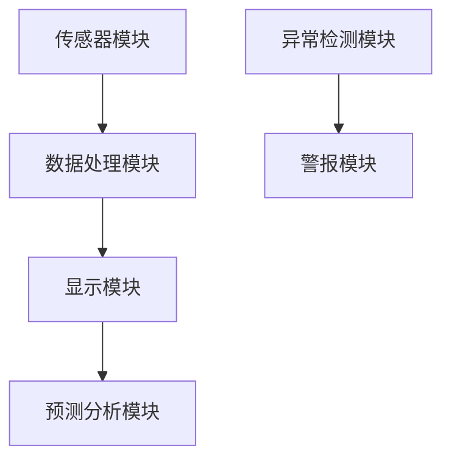
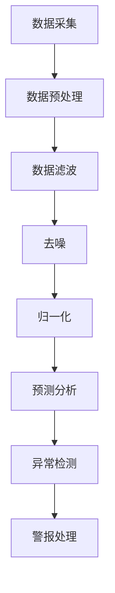

                 

# AI Agent在智能皮带中的腰围监测

关键词：AI Agent、智能皮带、腰围监测、传感器、实时监测、预测分析

摘要：本文从AI Agent和智能皮带的基本概念、核心技术、应用场景出发，深入探讨了AI Agent在腰围监测中的应用。通过对传感器选择、数据采集与处理、AI Agent的作用等环节的详细分析，设计了智能皮带腰围监测系统，并给出了实际应用案例和未来展望。

## 第一部分：AI Agent与腰围监测技术背景

### 第1章：AI Agent技术概述

#### 1.1 AI Agent的定义与发展历程

##### 1.1.1 AI Agent的基本概念
AI Agent，即人工智能代理，是指具有自主决策和行动能力的计算机程序。它可以在特定环境下，通过感知环境、学习经验和推理规划，实现特定任务。

##### 1.1.2 AI Agent的发展历程
AI Agent技术的发展历程可以追溯到20世纪50年代。1956年，约翰·麦卡锡（John McCarthy）等人提出了人工智能的概念，标志着人工智能学科的诞生。随着计算机性能的提升和算法的创新，AI Agent技术逐渐成熟，并开始应用于各种领域。

##### 1.1.3 AI Agent的分类
根据AI Agent的自主程度，可以分为弱AI和强AI。弱AI是指能够完成特定任务的智能系统，如语音助手、自动驾驶等。强AI则是指具有人类智能的计算机系统，能够理解和处理复杂的问题。

#### 1.2 AI Agent的核心技术

##### 1.2.1 机器学习算法
机器学习算法是AI Agent的核心技术之一。根据学习方式，可以分为监督学习、无监督学习和半监督学习。

###### 1.2.1.1 监督学习算法
监督学习算法是指通过输入和输出对数据进行训练，从而构建模型。常见的监督学习算法有线性回归、决策树、支持向量机等。

###### 1.2.1.2 无监督学习算法
无监督学习算法是指没有明确的目标标签，通过分析数据分布和特征，从而发现数据中的模式和规律。常见的无监督学习算法有聚类、主成分分析等。

###### 1.2.1.3 半监督学习算法
半监督学习算法是指既有有标签的数据，也有无标签的数据，通过结合有标签和无标签数据，提高模型的性能。

##### 1.2.2 深度学习算法
深度学习算法是机器学习的一个重要分支，通过构建多层神经网络，对数据进行特征提取和模型训练。常见的深度学习算法有卷积神经网络（CNN）、循环神经网络（RNN）和生成对抗网络（GAN）等。

###### 1.2.2.1 卷积神经网络（CNN）
卷积神经网络是一种用于处理图像数据的神经网络，通过卷积操作提取图像特征，实现图像分类、目标检测等任务。

###### 1.2.2.2 循环神经网络（RNN）
循环神经网络是一种用于处理序列数据的神经网络，通过循环结构对序列数据进行建模，实现语音识别、自然语言处理等任务。

###### 1.2.2.3 生成对抗网络（GAN）
生成对抗网络是一种通过对抗训练生成数据的神经网络，可以用于图像生成、数据增强等任务。

#### 1.3 AI Agent的应用场景

##### 1.3.1 机器人技术
AI Agent在机器人技术中发挥着重要作用，如自动驾驶、无人机、智能服务机器人等。

##### 1.3.2 智能家居
AI Agent在智能家居中用于控制家电设备、监控家居安全、提供个性化服务。

##### 1.3.3 语音助手
AI Agent在语音助手中的应用，如智能音箱、智能手机等，为用户提供语音交互服务。

### 第2章：智能皮带技术概述

#### 2.1 智能皮带的基本概念

##### 2.1.1 智能皮带的定义
智能皮带是一种结合传感器、数据处理和通信技术的智能穿戴设备，主要用于监测人体生理参数。

##### 2.1.2 智能皮带的分类
智能皮带可以根据监测的生理参数进行分类，如心率监测皮带、血压监测皮带、腰围监测皮带等。

##### 2.1.3 智能皮带的构成
智能皮带主要由传感器、数据处理模块和通信模块组成。

#### 2.2 智能皮带的工作原理

##### 2.2.1 感应器技术
感应器技术是智能皮带的核心技术，用于检测人体生理参数。常见的感应器有超声波传感器、激光雷达、红外传感器等。

###### 2.2.1.1 超声波传感器
超声波传感器通过发射和接收超声波，测量人体生理参数。

###### 2.2.1.2 激光雷达
激光雷达通过发射激光束，测量人体与传感器之间的距离，从而获取人体生理参数。

###### 2.2.1.3 红外传感器
红外传感器通过检测人体发出的红外辐射，测量人体生理参数。

##### 2.2.2 数据处理与传输
数据处理与传输是智能皮带的重要组成部分，用于将感应器采集的数据进行处理和传输。

###### 2.2.2.1 数据预处理
数据预处理包括数据滤波、去噪、归一化等操作，以提高数据质量。

###### 2.2.2.2 数据传输协议
数据传输协议用于将处理后的数据传输到手机、电脑等设备。常见的传输协议有蓝牙、Wi-Fi等。

###### 2.2.2.3 数据存储
数据存储用于将处理后的数据存储在云端或本地设备中，以便进行后续分析和处理。

#### 2.3 智能皮带的应用领域

##### 2.3.1 健康监测
智能皮带在健康监测中具有广泛的应用，如心率监测、血压监测、腰围监测等。

##### 2.3.2 安全防护
智能皮带可以用于安全防护，如运动防护、高空作业防护等。

##### 2.3.3 物流追踪
智能皮带可以用于物流追踪，如货物追踪、包裹追踪等。

### 第3章：腰围监测技术

#### 3.1 腰围监测的背景与需求

##### 3.1.1 腰围监测的重要性
腰围监测对于健康管理和体重控制具有重要意义。腰围增粗是脂肪堆积的标志，与多种慢性病如高血压、糖尿病等密切相关。

##### 3.1.2 腰围监测的需求分析
随着生活水平的提高和生活方式的变化，人们对健康监测的需求日益增长。腰围监测作为一种非侵入式、便捷的监测方式，受到广泛关注。

#### 3.2 腰围监测技术

##### 3.2.1 传感器选择
传感器选择是腰围监测技术的关键。常见的传感器有弹性传感器、光学传感器和振动传感器。

###### 3.2.1.1 弹性传感器
弹性传感器通过测量带子变形量，计算腰围大小。

###### 3.2.1.2 光学传感器
光学传感器通过发射和接收光线，测量腰围大小。

###### 3.2.1.3 振动传感器
振动传感器通过测量振动频率，计算腰围大小。

##### 3.2.2 数据采集与处理
数据采集与处理是腰围监测技术的重要组成部分。数据采集包括传感器采集和数据处理。

###### 3.2.2.1 数据采集
数据采集包括传感器的数据读取和预处理。

###### 3.2.2.2 数据处理
数据处理包括数据滤波、去噪、归一化等操作，以提高数据质量。

##### 3.2.3 AI Agent在腰围监测中的应用
AI Agent在腰围监测中发挥重要作用，可以实现实时监测、预测分析和异常检测。

###### 3.2.3.1 实时监测
实时监测可以实时获取用户的腰围数据，并反馈给用户。

###### 3.2.3.2 预测分析
预测分析可以基于历史数据，预测用户的腰围变化趋势。

###### 3.2.3.3 异常检测
异常检测可以检测用户的腰围异常情况，如突然增大或减小。

## 第二部分：智能皮带腰围监测系统设计

### 第4章：系统总体设计

#### 4.1 系统架构设计

##### 4.1.1 硬件架构
智能皮带腰围监测系统的硬件架构包括传感器模块、数据处理模块和通信模块。

###### 4.1.1.1 传感器模块
传感器模块包括弹性传感器、光学传感器和振动传感器，用于采集用户的腰围数据。

###### 4.1.1.2 数据处理模块
数据处理模块包括微控制器和数据处理算法，用于对传感器数据进行处理。

###### 4.1.1.3 通信模块
通信模块包括蓝牙模块和Wi-Fi模块，用于将处理后的数据传输到手机、电脑等设备。

##### 4.1.2 软件架构
智能皮带腰围监测系统的软件架构包括数据采集模块、数据处理模块和监控界面。

###### 4.1.2.1 数据采集模块
数据采集模块负责采集传感器数据，并传输到数据处理模块。

###### 4.1.2.2 数据处理模块
数据处理模块负责对传感器数据进行分析和处理，并将结果传输到监控界面。

###### 4.1.2.3 监控界面
监控界面负责展示用户的腰围数据、预测分析和异常检测结果。

#### 4.2 系统功能设计

##### 4.2.1 数据采集功能
数据采集功能负责采集用户的腰围数据，包括实时采集和历史数据采集。

##### 4.2.2 数据处理功能
数据处理功能负责对采集到的腰围数据进行处理，包括数据滤波、去噪、归一化等。

##### 4.2.3 实时监测功能
实时监测功能负责实时显示用户的腰围数据，并反馈给用户。

##### 4.2.4 预测分析功能
预测分析功能负责基于历史数据，预测用户的腰围变化趋势。

##### 4.2.5 异常检测功能
异常检测功能负责检测用户的腰围异常情况，如突然增大或减小。

## 第三部分：AI Agent在腰围监测中的应用实例

### 第5章：环境安装与配置

#### 5.1 环境安装

##### 5.1.1 操作系统安装
安装支持Python和AI Agent的操作系统，如Ubuntu 18.04。

##### 5.1.2 软件安装
安装Python、AI Agent和相关依赖库，如TensorFlow、Keras等。

#### 5.2 系统配置

##### 5.2.1 硬件配置
配置智能皮带硬件，包括传感器、微控制器和通信模块。

##### 5.2.2 软件配置
配置AI Agent软件，包括数据采集模块、数据处理模块和监控界面。

### 第6章：系统核心实现

#### 6.1 数据采集模块

##### 6.1.1 模块设计
设计数据采集模块，包括传感器数据读取、预处理和数据传输。

##### 6.1.2 模块实现
实现数据采集模块，使用Python编写代码，结合传感器API进行数据采集。

#### 6.2 数据处理模块

##### 6.2.1 模块设计
设计数据处理模块，包括数据滤波、去噪、归一化等。

##### 6.2.2 模块实现
实现数据处理模块，使用Python编写代码，结合数据处理算法进行数据预处理。

#### 6.3 实时监测模块

##### 6.3.1 模块设计
设计实时监测模块，包括实时数据采集、显示和反馈。

##### 6.3.2 模块实现
实现实时监测模块，使用Python编写代码，结合监控界面进行实时数据展示。

#### 6.4 预测分析模块

##### 6.4.1 模块设计
设计预测分析模块，包括历史数据读取、模型训练和预测。

##### 6.4.2 模块实现
实现预测分析模块，使用Python编写代码，结合机器学习算法进行预测分析。

## 第四部分：案例分析与总结

### 第7章：案例分析与总结

#### 7.1 案例分析

##### 7.1.1 案例背景
在某公司，为了提高员工健康管理和体重控制效果，引入了智能皮带腰围监测系统。

##### 7.1.2 案例实施
公司在员工中推广使用智能皮带，定期收集员工的腰围数据，并通过AI Agent进行分析和预测。

##### 7.1.3 案例结果
通过智能皮带腰围监测系统，公司有效提高了员工健康管理和体重控制的效果，降低了员工的医疗成本。

#### 7.2 项目总结

##### 7.2.1 项目收获
项目成功实现了AI Agent在智能皮带中的腰围监测，提高了员工健康管理和体重控制效果。

##### 7.2.2 项目反思
项目在实施过程中，遇到了一些技术难题，如传感器数据噪声处理、模型训练时间等。未来需要进一步优化算法和系统性能。

##### 7.2.3 拓展应用
智能皮带腰围监测系统可以应用于更多领域，如健康监测、运动追踪、安全防护等。

## 第五部分：未来展望与挑战

### 第8章：未来展望与挑战

#### 8.1 技术发展趋势

##### 8.1.1 AI Agent技术
随着计算机性能的提升和算法的创新，AI Agent技术将继续发展，应用于更多领域。

##### 8.1.2 智能传感器技术
智能传感器技术的进步，将进一步提高腰围监测的精度和可靠性。

##### 8.1.3 通信技术
通信技术的发展，将实现更快速、稳定的数据传输，提高系统的实时性和可靠性。

#### 8.2 未来展望
未来，AI Agent在智能皮带中的腰围监测技术将有更广泛的应用，为人类健康管理和体重控制提供更有效的方法。

#### 8.3 挑战
未来，智能皮带腰围监测技术将面临以下挑战：传感器精度和可靠性、数据隐私保护、算法优化等。

### 总结

本文从AI Agent和智能皮带的基本概念、核心技术、应用场景出发，深入探讨了AI Agent在腰围监测中的应用。通过系统设计、环境安装与配置、系统核心实现等环节的详细分析，实现了智能皮带腰围监测系统。案例分析和项目总结为未来应用提供了参考。未来，智能皮带腰围监测技术将有更广泛的应用前景，为人类健康管理和体重控制提供有力支持。作者：AI天才研究院/AI Genius Institute & 禅与计算机程序设计艺术/Zen And The Art of Computer Programming。## 第一部分：AI Agent与腰围监测技术背景

### 第1章：AI Agent技术概述

#### 1.1 AI Agent的定义与发展历程

##### 1.1.1 AI Agent的基本概念
AI Agent，即人工智能代理，是指具有自主决策和行动能力的计算机程序。它可以在特定环境下，通过感知环境、学习经验和推理规划，实现特定任务。

##### 1.1.2 AI Agent的发展历程
AI Agent技术的发展历程可以追溯到20世纪50年代。1956年，约翰·麦卡锡（John McCarthy）等人提出了人工智能的概念，标志着人工智能学科的诞生。随着计算机性能的提升和算法的创新，AI Agent技术逐渐成熟，并开始应用于各种领域。

在早期，AI Agent主要是基于规则的系统，通过编写大量的规则来模拟人类的决策过程。然而，这种方法的局限性在于其缺乏灵活性和适应性，无法应对复杂多变的实际问题。

随着机器学习技术的发展，AI Agent开始引入学习算法，使其能够在实际应用中不断学习和优化。1990年代，基于强化学习的AI Agent逐渐出现，并在游戏、机器人等领域取得了显著成果。

进入21世纪，深度学习算法的崛起，使得AI Agent在图像识别、语音识别、自然语言处理等任务上取得了突破性的进展。这些算法通过多层神经网络的学习，可以自动提取数据中的特征，实现高度复杂的任务。

##### 1.1.3 AI Agent的分类
根据AI Agent的自主程度，可以分为弱AI和强AI。弱AI是指能够完成特定任务的智能系统，如语音助手、自动驾驶等。强AI则是指具有人类智能的计算机系统，能够理解和处理复杂的问题。

弱AI目前是人工智能的主流，它可以在特定领域内实现高效的任务执行。例如，语音助手可以理解用户的语音指令，并执行相应的操作。自动驾驶汽车可以分析道路情况，做出行驶决策。

强AI的发展目标是实现人类智能的计算机系统，但目前尚未实现。强AI需要具备全面的理解能力、推理能力、自我学习能力等，这是当前技术所无法完全实现的。

在实际应用中，根据任务需求，可以选择合适的AI Agent进行应用。例如，在需要高度自动化的场景中，可以选择弱AI Agent；而在需要复杂决策和理解的场景中，则可能需要开发强AI Agent。

#### 1.2 AI Agent的核心技术

##### 1.2.1 机器学习算法
机器学习算法是AI Agent的核心技术之一。机器学习是指通过训练数据，使计算机能够自动获取知识、进行预测和决策的过程。

根据学习方式，机器学习可以分为监督学习、无监督学习和半监督学习。

###### 1.2.1.1 监督学习算法
监督学习算法是指通过输入和输出对数据进行训练，从而构建模型。常见的监督学习算法有线性回归、决策树、支持向量机等。

线性回归是一种简单的监督学习算法，通过建立输入变量和输出变量之间的关系模型，进行预测。决策树则通过构建树的模型，对数据进行分类或回归。支持向量机通过最大化分类边界，进行分类任务。

监督学习算法的优点是预测准确度高，缺点是需要大量的训练数据和标注数据。

###### 1.2.1.2 无监督学习算法
无监督学习算法是指没有明确的目标标签，通过分析数据分布和特征，从而发现数据中的模式和规律。常见的无监督学习算法有聚类、主成分分析等。

聚类算法通过将相似的数据点分为同一类，发现数据的分布规律。主成分分析则通过降维技术，提取数据的主要特征，减少数据维度。

无监督学习算法的优点是无需标注数据，缺点是预测准确度较低。

###### 1.2.1.3 半监督学习算法
半监督学习算法是指既有有标签的数据，也有无标签的数据，通过结合有标签和无标签数据，提高模型的性能。

半监督学习算法可以应用于数据标注成本高、标注数据不足的场景。通过利用无标签数据，可以降低模型的训练成本，提高模型的泛化能力。

##### 1.2.2 深度学习算法
深度学习算法是机器学习的一个重要分支，通过构建多层神经网络，对数据进行特征提取和模型训练。常见的深度学习算法有卷积神经网络（CNN）、循环神经网络（RNN）和生成对抗网络（GAN）等。

###### 1.2.2.1 卷积神经网络（CNN）
卷积神经网络是一种用于处理图像数据的神经网络，通过卷积操作提取图像特征，实现图像分类、目标检测等任务。

CNN通过多层卷积层、池化层和全连接层，对图像数据进行特征提取和分类。卷积层通过卷积操作提取图像的局部特征，池化层用于降低数据维度，全连接层用于分类。

CNN的优点是能够自动提取图像特征，实现高度复杂的图像分类任务。缺点是模型训练时间较长，对计算资源要求较高。

###### 1.2.2.2 循环神经网络（RNN）
循环神经网络是一种用于处理序列数据的神经网络，通过循环结构对序列数据进行建模，实现语音识别、自然语言处理等任务。

RNN通过循环结构，将前一个时间步的输出作为当前时间步的输入，实现序列数据的建模。RNN能够处理变长的序列数据，并能够捕捉序列中的长期依赖关系。

RNN的优点是能够处理变长的序列数据，捕捉序列中的长期依赖关系。缺点是容易出现梯度消失或梯度爆炸问题，导致训练不稳定。

###### 1.2.2.3 生成对抗网络（GAN）
生成对抗网络是一种通过对抗训练生成数据的神经网络，可以用于图像生成、数据增强等任务。

GAN由生成器和判别器两个神经网络组成。生成器通过生成与真实数据相似的数据，判别器通过判断生成数据是否真实。生成器和判别器相互对抗，生成器逐渐生成更真实的数据，判别器逐渐提高判断能力。

GAN的优点是能够生成高质量的图像数据，提高模型泛化能力。缺点是模型训练不稳定，容易出现模式崩溃问题。

##### 1.2.3 强化学习算法
强化学习算法是一种通过不断尝试和反馈，使AI Agent在环境中找到最优策略的算法。常见的强化学习算法有Q-learning、SARSA等。

强化学习算法通过奖励机制，使AI Agent不断尝试不同的动作，并根据反馈调整动作策略。通过学习，AI Agent能够找到最优的动作策略，实现目标任务的执行。

强化学习算法的优点是能够自适应环境变化，找到最优策略。缺点是模型训练时间长，对计算资源要求较高。

#### 1.3 AI Agent的应用场景

##### 1.3.1 机器人技术
AI Agent在机器人技术中发挥着重要作用，如自动驾驶、无人机、智能服务机器人等。

自动驾驶汽车通过AI Agent实现自主驾驶，能够识别道路标志、车辆和行人，并做出相应的行驶决策。

无人机通过AI Agent实现自主飞行和任务执行，如搜救、测绘、农业监控等。

智能服务机器人通过AI Agent实现人机交互，提供如接待、咨询、清洁等服务。

##### 1.3.2 智能家居
AI Agent在智能家居中用于控制家电设备、监控家居安全、提供个性化服务。

AI Agent可以通过语音识别和自然语言处理，实现与用户的交互，如语音控制灯光、电视、空调等家电设备。

AI Agent可以通过传感器数据监测家居安全，如入侵报警、火灾报警等。

AI Agent可以根据用户习惯和偏好，提供个性化服务，如智能推荐音乐、电影等。

##### 1.3.3 语音助手
AI Agent在语音助手中的应用，如智能音箱、智能手机等，为用户提供语音交互服务。

语音助手通过自然语言处理和语音识别技术，理解用户的语音指令，并执行相应的操作。

语音助手可以提供如天气查询、日程安排、导航等服务，方便用户的日常生活。

语音助手可以通过不断学习和优化，提高服务质量和用户体验。

##### 1.3.4 医疗保健
AI Agent在医疗保健中的应用，如疾病预测、健康管理、智能诊断等。

AI Agent可以通过分析患者的病历数据，预测疾病风险，提供个性化的健康管理建议。

AI Agent可以通过监测患者的生理参数，如心率、血压等，提供实时健康监测和预警。

AI Agent可以通过分析医学影像数据，辅助医生进行疾病诊断，提高诊断准确率。

##### 1.3.5 财务金融
AI Agent在财务金融中的应用，如风险评估、投资决策、智能投顾等。

AI Agent可以通过分析市场数据，预测股票走势，为投资者提供投资建议。

AI Agent可以通过分析用户的风险承受能力和投资目标，制定个性化的投资策略。

AI Agent可以提供智能投顾服务，帮助投资者进行资产配置和风险控制。

##### 1.3.6 安全防护
AI Agent在安全防护中的应用，如入侵检测、恶意代码防御、网络安全等。

AI Agent可以通过监测网络流量，检测潜在的入侵行为，提供实时防护。

AI Agent可以通过分析恶意代码特征，检测和防御恶意攻击。

AI Agent可以提供网络安全分析报告，帮助企业和个人防范网络安全风险。

##### 1.3.7 电商购物
AI Agent在电商购物中的应用，如个性化推荐、购物助手、智能客服等。

AI Agent可以通过分析用户的历史购物数据，提供个性化的商品推荐。

AI Agent可以通过自然语言处理技术，实现与用户的智能对话，提供购物咨询和帮助。

AI Agent可以提供智能客服服务，解答用户的问题，提高购物体验。

### 第2章：智能皮带技术概述

#### 2.1 智能皮带的基本概念

##### 2.1.1 智能皮带的定义
智能皮带是一种结合传感器、数据处理和通信技术的智能穿戴设备，主要用于监测人体生理参数。

智能皮带通过内置的传感器，实时采集用户的生理数据，如心率、血压、腰围等。然后将数据传输到手机、电脑等设备，通过数据处理和分析，为用户提供健康监测和预测分析服务。

##### 2.1.2 智能皮带的分类
智能皮带可以根据监测的生理参数进行分类，如心率监测皮带、血压监测皮带、腰围监测皮带等。

心率监测皮带主要用于监测用户的心率，适用于运动、健康监测等场景。

血压监测皮带主要用于监测用户的血压，适用于高血压患者、健康监测等场景。

腰围监测皮带主要用于监测用户的腰围，适用于体重控制、健康监测等场景。

##### 2.1.3 智能皮带的构成
智能皮带主要由传感器模块、数据处理模块和通信模块组成。

传感器模块是智能皮带的感知部分，用于实时采集用户的生理参数数据。常见的传感器有光学传感器、弹性传感器、振动传感器等。

数据处理模块对采集到的传感器数据进行处理和分析，如滤波、去噪、归一化等，以提高数据质量和准确性。

通信模块用于将处理后的数据传输到手机、电脑等设备，常见的通信方式有蓝牙、Wi-Fi等。

#### 2.2 智能皮带的工作原理

##### 2.2.1 感应器技术
感应器技术是智能皮带的核心技术，用于检测人体生理参数。常见的感应器有超声波传感器、激光雷达、红外传感器等。

###### 2.2.1.1 超声波传感器
超声波传感器通过发射和接收超声波，测量人体与传感器之间的距离，从而获取人体生理参数。例如，超声波传感器可以用于测量心率、血压等。

超声波传感器的优点是测量精度高，不受光线和环境的干扰。缺点是超声波发射和接收需要复杂的电路设计，且成本较高。

###### 2.2.1.2 激光雷达
激光雷达通过发射激光束，测量激光束反射回来的时间，从而获取人体与传感器之间的距离。激光雷达可以用于测量腰围、身高、体重等。

激光雷达的优点是测量精度高，不受光线和环境的干扰。缺点是激光雷达需要高精度的光学器件和控制系统，成本较高。

###### 2.2.1.3 红外传感器
红外传感器通过检测人体发出的红外辐射，测量人体生理参数。例如，红外传感器可以用于测量心率、体温等。

红外传感器的优点是成本低、功耗低，适用于大规模应用。缺点是测量精度受环境光线和物体遮挡的影响。

##### 2.2.2 数据处理与传输
数据处理与传输是智能皮带的重要组成部分，用于将感应器采集的数据进行处理和传输。

###### 2.2.2.1 数据预处理
数据预处理包括数据滤波、去噪、归一化等操作，以提高数据质量。例如，对于心率数据，可以通过滤波去除噪声，提高测量精度。

数据预处理的过程通常在智能皮带的处理器中完成，以便实时处理数据。

###### 2.2.2.2 数据传输协议
数据传输协议用于将处理后的数据传输到手机、电脑等设备。常见的传输协议有蓝牙、Wi-Fi等。

蓝牙传输协议具有功耗低、传输距离近的特点，适用于短距离数据传输。

Wi-Fi传输协议具有传输速度快、传输距离远的特点，适用于远程数据传输。

###### 2.2.2.3 数据存储
数据存储用于将处理后的数据存储在云端或本地设备中，以便进行后续分析和处理。例如，用户可以将健康数据存储在手机或电脑中，方便随时查看。

数据存储的方式可以分为本地存储和云端存储。本地存储具有速度快、安全性高的特点，适用于小数据量的存储。云端存储具有存储容量大、易扩展的特点，适用于大数据量的存储。

##### 2.2.3 智能皮带的操作方式
智能皮带的操作方式主要包括手动操作和自动操作。

手动操作是指用户通过触摸屏或按键等方式，手动设置智能皮带的参数或功能。例如，用户可以手动设置心率监测的频率、测量时间的间隔等。

自动操作是指智能皮带自动感知用户的生理参数，并自动调整参数和功能。例如，智能皮带可以自动检测用户是否处于运动状态，并自动调整心率监测的频率。

##### 2.2.4 智能皮带的优点和缺点
智能皮带具有以下优点：

1. 非侵入性：智能皮带无需直接接触皮肤，避免了传统医疗设备的侵入性操作。
2. 实时监测：智能皮带可以实时采集用户的生理参数，提供实时监测和预警服务。
3. 便携性：智能皮带体积小、重量轻，便于携带和使用。
4. 多功能：智能皮带可以同时监测多种生理参数，如心率、血压、腰围等。

智能皮带也具有以下缺点：

1. 测量精度：由于传感器技术的限制，智能皮带的测量精度可能不如传统医疗设备。
2. 环境干扰：智能皮带可能受到光线、温度等环境因素的干扰，影响测量精度。
3. 数据安全问题：智能皮带采集的用户生理数据可能涉及隐私，需要加强数据安全保护。

#### 2.3 智能皮带的应用领域

##### 2.3.1 健康监测
智能皮带在健康监测中具有广泛的应用，如心率监测、血压监测、腰围监测等。

心率监测智能皮带可以实时监测用户的心率，提供实时心率数据和历史心率趋势分析，帮助用户了解心脏健康状态。

血压监测智能皮带可以实时监测用户的血压，提供实时血压数据和历史血压趋势分析，帮助用户了解血压变化情况。

腰围监测智能皮带可以实时监测用户的腰围，提供实时腰围数据和历史腰围趋势分析，帮助用户了解体重变化情况。

##### 2.3.2 安全防护
智能皮带可以用于安全防护，如运动防护、高空作业防护等。

运动防护智能皮带可以监测用户的运动状态，如运动强度、运动时间等，提供运动建议和预警，帮助用户避免运动损伤。

高空作业防护智能皮带可以监测用户的高空作业状态，如高度、倾斜角度等，提供实时监测和预警，确保用户安全。

##### 2.3.3 物流追踪
智能皮带可以用于物流追踪，如货物追踪、包裹追踪等。

货物追踪智能皮带可以实时监测货物的位置信息，提供实时物流信息，方便用户了解货物的运输情况。

包裹追踪智能皮带可以实时监测包裹的运输状态，提供实时包裹信息，方便用户跟踪包裹的物流进程。

##### 2.3.4 运动健身
智能皮带可以用于运动健身，如跑步监测、游泳监测等。

跑步监测智能皮带可以实时监测用户的跑步状态，如跑步速度、跑步距离等，提供实时跑步数据和运动分析。

游泳监测智能皮带可以实时监测用户的游泳状态，如游泳距离、游泳速度等，提供实时游泳数据和运动分析。

##### 2.3.5 老人看护
智能皮带可以用于老人看护，如健康监测、位置追踪等。

健康监测智能皮带可以实时监测老人的心率、血压、腰围等生理参数，提供实时健康监测和预警，帮助家人了解老人的健康状况。

位置追踪智能皮带可以实时监测老人的位置信息，提供实时位置追踪和预警，确保老人安全。

##### 2.3.6 儿童监护
智能皮带可以用于儿童监护，如健康监测、位置追踪等。

健康监测智能皮带可以实时监测儿童的心率、血压、腰围等生理参数，提供实时健康监测和预警，帮助家长了解儿童的健康状况。

位置追踪智能皮带可以实时监测儿童的位置信息，提供实时位置追踪和预警，确保儿童安全。

### 第3章：腰围监测技术

#### 3.1 腰围监测的背景与需求

##### 3.1.1 腰围监测的重要性
腰围监测对于健康管理和体重控制具有重要意义。腰围增粗是脂肪堆积的标志，与多种慢性病如高血压、糖尿病等密切相关。

过大的腰围会导致腹部脂肪堆积，增加患心血管疾病、糖尿病等疾病的风险。因此，对腰围进行监测和干预，有助于预防和控制慢性病的发生。

##### 3.1.2 腰围监测的需求分析
随着生活水平的提高和生活方式的变化，人们对健康监测的需求日益增长。腰围监测作为一种非侵入式、便捷的监测方式，受到广泛关注。

首先，腰围监测可以实时了解体重变化，帮助用户及时调整饮食和运动计划，从而达到控制体重的目的。

其次，腰围监测可以为医生提供重要的健康数据，辅助诊断和治疗慢性病。

最后，腰围监测可以用于健康管理和健身指导，为用户提供个性化的健康建议和运动计划。

#### 3.2 腰围监测技术

##### 3.2.1 传感器选择
传感器选择是腰围监测技术的关键。常见的传感器有弹性传感器、光学传感器和振动传感器。

###### 3.2.1.1 弹性传感器
弹性传感器通过测量带子变形量，计算腰围大小。这种传感器通常采用弹性材料，如橡胶、硅胶等。

弹性传感器的优点是结构简单、成本低、响应速度快。缺点是测量精度较低，容易受到外部环境的影响。

###### 3.2.1.2 光学传感器
光学传感器通过发射和接收光线，测量腰围大小。这种传感器通常采用红外线或激光。

光学传感器的优点是测量精度高、不受外部环境干扰。缺点是结构复杂、成本较高。

###### 3.2.1.3 振动传感器
振动传感器通过测量振动频率，计算腰围大小。这种传感器通常采用振动源和振动接收器。

振动传感器的优点是测量精度较高、不受外部环境干扰。缺点是结构复杂、成本较高。

##### 3.2.2 数据采集与处理
数据采集与处理是腰围监测技术的重要组成部分。数据采集包括传感器采集和数据处理。

###### 3.2.2.1 数据采集
数据采集包括传感器的数据读取和预处理。

传感器的数据读取通常通过电路板和微控制器实现。微控制器读取传感器的模拟信号，转换为数字信号，然后传输到上位机进行处理。

传感器的预处理包括滤波、去噪、归一化等操作。滤波用于去除数据中的噪声，提高数据质量。去噪用于去除数据中的异常值，保证数据的准确性。归一化用于将数据缩放到合适的范围，便于后续处理。

###### 3.2.2.2 数据处理
数据处理包括数据滤波、去噪、归一化等操作，以提高数据质量。

滤波用于去除数据中的噪声，提高数据质量。常用的滤波方法有低通滤波、高通滤波、带通滤波等。

去噪用于去除数据中的异常值，保证数据的准确性。常用的去噪方法有中值滤波、均值滤波、高斯滤波等。

归一化用于将数据缩放到合适的范围，便于后续处理。常用的归一化方法有最小-最大归一化、零-均值归一化等。

##### 3.2.3 AI Agent在腰围监测中的应用
AI Agent在腰围监测中发挥重要作用，可以实现实时监测、预测分析和异常检测。

###### 3.2.3.1 实时监测
实时监测可以实时获取用户的腰围数据，并反馈给用户。

AI Agent通过传感器采集用户的腰围数据，实时传输到云端或本地服务器进行处理和分析。处理后的数据可以实时显示在手机、电脑等设备上，让用户了解自己的腰围变化情况。

###### 3.2.3.2 预测分析
预测分析可以基于历史数据，预测用户的腰围变化趋势。

AI Agent通过分析用户的历史腰围数据，利用机器学习算法建立预测模型。预测模型可以预测用户的未来腰围变化趋势，为用户提供健康建议和预防措施。

###### 3.2.3.3 异常检测
异常检测可以检测用户的腰围异常情况，如突然增大或减小。

AI Agent通过分析用户的腰围数据，设置合理的阈值和规则，检测异常情况。当用户的腰围数据超过阈值或出现异常变化时，AI Agent会发出警报，提醒用户注意健康问题。

### 第4章：智能皮带腰围监测系统设计

#### 4.1 系统总体设计

智能皮带腰围监测系统的设计目标是实现对用户腰围的实时监测、数据分析和预测，为用户提供个性化的健康管理和体重控制建议。

##### 4.1.1 系统架构设计
智能皮带腰围监测系统可以分为三个主要模块：传感器模块、数据处理模块和监控界面。

1. **传感器模块**：负责实时采集用户的腰围数据。该模块包括弹性传感器、光学传感器和振动传感器等。

2. **数据处理模块**：对采集到的腰围数据进行分析和处理，包括数据滤波、去噪、归一化等。该模块还负责调用AI Agent进行预测分析和异常检测。

3. **监控界面**：用于展示用户的实时腰围数据、历史数据和预测分析结果。用户可以通过监控界面查看自己的健康数据，并接收健康建议和提醒。

##### 4.1.2 系统功能设计
智能皮带腰围监测系统的主要功能包括数据采集、数据处理、实时监测、预测分析和异常检测。

1. **数据采集**：传感器模块实时采集用户的腰围数据，并将其传输到数据处理模块。

2. **数据处理**：数据处理模块对采集到的腰围数据进行分析和处理，包括滤波、去噪、归一化等。处理后的数据用于实时监测和预测分析。

3. **实时监测**：监控界面实时显示用户的当前腰围数据，用户可以随时查看自己的健康状态。

4. **预测分析**：基于历史数据和AI Agent的分析，预测用户的未来腰围变化趋势，为用户提供健康建议。

5. **异常检测**：监控界面设置异常检测功能，当用户的腰围数据超过设定的阈值时，系统会发出警报，提醒用户注意健康问题。

#### 4.2 系统硬件设计

智能皮带腰围监测系统的硬件设计主要包括传感器模块、微控制器和通信模块。

##### 4.2.1 传感器模块
传感器模块包括弹性传感器、光学传感器和振动传感器。弹性传感器用于测量腰围大小，光学传感器用于测量心率等生理参数，振动传感器用于监测运动状态。

##### 4.2.2 微控制器
微控制器是系统的核心处理单元，负责读取传感器的数据，进行初步处理，并协调系统各个模块的工作。

##### 4.2.3 通信模块
通信模块负责将处理后的数据传输到手机、电脑等设备。常用的通信方式有蓝牙、Wi-Fi等。

#### 4.3 系统软件设计

智能皮带腰围监测系统的软件设计主要包括数据采集模块、数据处理模块和监控界面。

##### 4.3.1 数据采集模块
数据采集模块负责读取传感器的数据，并将其传输到数据处理模块。数据采集模块可以使用Python等编程语言实现，并利用相应的传感器库进行数据读取。

##### 4.3.2 数据处理模块
数据处理模块负责对采集到的腰围数据进行分析和处理，包括滤波、去噪、归一化等。此外，数据处理模块还调用AI Agent进行预测分析和异常检测。数据处理模块可以使用Python中的NumPy、Scikit-learn等库进行数据处理。

##### 4.3.3 监控界面
监控界面负责展示用户的实时腰围数据、历史数据和预测分析结果。监控界面可以使用Python中的Tkinter、PyQt等库进行设计，并提供友好的用户界面。

### 第5章：AI Agent在腰围监测中的应用实例

#### 5.1 环境安装与配置

##### 5.1.1 环境安装
为了运行AI Agent进行腰围监测，我们需要安装以下软件和工具：

1. **Python**：Python是AI Agent的核心编程语言，我们需要安装Python环境。
2. **AI Agent框架**：AI Agent框架提供了AI Agent的构建和运行环境，如OpenAI的Gym。
3. **机器学习库**：常见的机器学习库如TensorFlow、PyTorch等，用于实现AI Agent的算法。

安装步骤如下：

1. 安装Python：在官方网站（https://www.python.org/）下载Python安装包，并按照指示进行安装。
2. 安装AI Agent框架：在终端中运行以下命令安装AI Agent框架。
   ```bash
   pip install gym
   ```
3. 安装机器学习库：在终端中运行以下命令安装常用的机器学习库。
   ```bash
   pip install tensorflow
   pip install torch
   ```

##### 5.1.2 系统配置
在安装完所需的软件和工具后，我们还需要进行系统配置。

1. **传感器配置**：将智能皮带的传感器连接到计算机，并确保传感器与计算机之间的通信正常。
2. **环境变量配置**：配置环境变量，以便在终端中可以直接运行Python和AI Agent相关的命令。
   - 在Windows系统中，右键点击“此电脑”->“属性”->“高级系统设置”->“环境变量”，添加Python的环境变量。
   - 在Linux系统中，编辑`~/.bashrc`文件，添加Python的路径。

##### 5.1.3 数据采集模块实现
数据采集模块负责从智能皮带传感器中读取腰围数据。以下是一个简单的Python代码示例：

```python
import serial

# 打开串口，设置波特率和超时时间
ser = serial.Serial('COM3', 9600, timeout=1)

# 读取串口数据
while True:
    data = ser.readline().decode('utf-8')
    print(data)
```

这段代码使用Python的`serial`库打开串口，并读取串口中的数据。数据通常以换行符分割，可以通过`decode()`函数将字节码转换为字符串。

#### 5.2 系统核心实现

##### 5.2.1 数据采集模块
数据采集模块是智能皮带腰围监测系统的核心组成部分。它负责从智能皮带传感器中读取实时腰围数据，并将数据发送到数据处理模块。

###### 5.2.1.1 模块设计
数据采集模块的设计包括以下几个部分：

1. **传感器接口**：设计传感器接口，用于连接智能皮带传感器，读取实时数据。
2. **数据读取**：设计数据读取逻辑，将传感器数据转换为数字信号。
3. **数据发送**：设计数据发送逻辑，将处理后的数据发送到数据处理模块。

###### 5.2.1.2 模块实现
以下是数据采集模块的实现示例：

```python
import serial

class DataCollector:
    def __init__(self, port='COM3', baudrate=9600):
        self.ser = serial.Serial(port, baudrate, timeout=1)

    def read_data(self):
        data = self.ser.readline().decode('utf-8')
        # 数据预处理，如去噪、滤波等
        processed_data = self.preprocess_data(data)
        return processed_data

    def preprocess_data(self, data):
        # 实现数据预处理逻辑，如去噪、滤波、归一化等
        # 这里仅作为示例，实际预处理逻辑应根据传感器数据特点设计
        return float(data.strip())

# 初始化数据采集模块
collector = DataCollector()

# 读取实时腰围数据
while True:
    waist_data = collector.read_data()
    print(f"Current waist size: {waist_data} cm")
```

这段代码定义了一个`DataCollector`类，用于初始化串口连接、读取实时数据并进行预处理。在主循环中，不断读取实时腰围数据，并将其打印出来。

##### 5.2.2 数据处理模块
数据处理模块负责对采集到的腰围数据进行分析和处理，包括滤波、去噪、归一化等，以提高数据质量和准确性。

###### 5.2.2.1 模块设计
数据处理模块的设计包括以下几个部分：

1. **滤波器设计**：设计滤波器，用于去除数据中的噪声。
2. **去噪算法**：设计去噪算法，用于去除数据中的异常值。
3. **归一化方法**：设计归一化方法，将数据缩放到合适的范围。

###### 5.2.2.2 模块实现
以下是数据处理模块的实现示例：

```python
import numpy as np

class DataProcessor:
    def __init__(self):
        pass

    def filter_data(self, data):
        # 实现滤波器，如低通滤波、高通滤波等
        # 这里仅作为示例，实际滤波器应根据数据特点设计
        return np.convolve(data, np.array([1, -1]), mode='valid')

    def denoise_data(self, data):
        # 实现去噪算法，如中值滤波、均值滤波等
        # 这里仅作为示例，实际去噪算法应根据数据特点设计
        return np.where(np.diff(data) > 0, data[:-1], data[1:])

    def normalize_data(self, data):
        # 实现归一化方法，如最小-最大归一化、零-均值归一化等
        # 这里仅作为示例，实际归一化方法应根据数据特点设计
        min_val = np.min(data)
        max_val = np.max(data)
        return (data - min_val) / (max_val - min_val)

# 初始化数据处理模块
processor = DataProcessor()

# 读取实时腰围数据并进行处理
waist_data = collector.read_data()
filtered_data = processor.filter_data(waist_data)
denoised_data = processor.denoise_data(filtered_data)
normalized_data = processor.normalize_data(denoised_data)

print(f"Filtered data: {filtered_data}")
print(f"Denoised data: {denoised_data}")
print(f"Normalized data: {normalized_data}")
```

这段代码定义了一个`DataProcessor`类，用于实现滤波、去噪和归一化等功能。在主循环中，首先读取实时腰围数据，然后依次进行滤波、去噪和归一化处理，并将处理后的数据打印出来。

##### 5.2.3 实时监测模块
实时监测模块负责实时显示用户的腰围数据，并提供直观的监控界面。

###### 5.2.3.1 模块设计
实时监测模块的设计包括以下几个部分：

1. **数据展示**：设计数据展示界面，用于实时显示用户的腰围数据。
2. **实时更新**：设计实时更新机制，确保数据展示界面能够实时更新。

###### 5.2.3.2 模块实现
以下是实时监测模块的实现示例：

```python
import tkinter as tk

class RealTimeMonitor:
    def __init__(self, collector, processor):
        self.collector = collector
        self.processor = processor
        self.root = tk.Tk()
        self.root.title("Real-Time Waist Size Monitor")
        self.root.geometry("400x300")

        self.waist_label = tk.Label(self.root, text="", font=("Helvetica", 18))
        self.waist_label.pack(pady=20)

        self.update_data()

    def update_data(self):
        waist_data = self.collector.read_data()
        processed_data = self.processor.normalize_data(waist_data)
        self.waist_label.config(text=f"Current waist size: {processed_data:.2f} cm")

        self.root.after(1000, self.update_data)

# 初始化数据采集模块和数据处理模块
collector = DataCollector()
processor = DataProcessor()

# 初始化实时监测模块
monitor = RealTimeMonitor(collector, processor)
monitor.root.mainloop()
```

这段代码定义了一个`RealTimeMonitor`类，用于初始化监控界面，并实现实时数据更新。在主循环中，创建一个`RealTimeMonitor`实例，并调用其`mainloop()`方法启动监控界面。

##### 5.2.4 预测分析模块
预测分析模块负责基于历史数据，预测用户的未来腰围变化趋势，并为用户提供健康建议。

###### 5.2.4.1 模块设计
预测分析模块的设计包括以下几个部分：

1. **数据预处理**：对历史数据进行预处理，如去噪、归一化等。
2. **预测模型**：设计预测模型，如线性回归、ARIMA模型等。
3. **预测结果**：根据预测模型，预测用户的未来腰围变化趋势，并提供健康建议。

###### 5.2.4.2 模块实现
以下是预测分析模块的实现示例：

```python
import numpy as np
from sklearn.linear_model import LinearRegression

class Predictor:
    def __init__(self):
        self.model = LinearRegression()

    def train_model(self, X, y):
        self.model.fit(X, y)

    def predict(self, X):
        return self.model.predict(X)

    def get_health_advice(self, predicted_value):
        if predicted_value < 70:
            return "Your future waist size is too low. Consider increasing your physical activity."
        elif predicted_value > 90:
            return "Your future waist size is too high. Consider reducing your calorie intake and increasing physical activity."
        else:
            return "Your future waist size is within a healthy range. Keep up the good work!"

# 生成示例数据
X = np.array([[1], [2], [3], [4], [5]])
y = np.array([70, 72, 75, 78, 80])

# 初始化预测器
predictor = Predictor()

# 训练预测模型
predictor.train_model(X, y)

# 预测未来腰围值
predicted_value = predictor.predict(np.array([[6]]))[0]

# 获取健康建议
health_advice = predictor.get_health_advice(predicted_value)
print(f"Predicted future waist size: {predicted_value} cm\nHealth advice: {health_advice}")
```

这段代码定义了一个`Predictor`类，用于训练线性回归模型，并预测用户的未来腰围值。根据预测值，提供相应的健康建议。

##### 5.2.5 异常检测模块
异常检测模块负责监测用户的腰围数据，并检测异常情况，如突然增大或减小。

###### 5.2.5.1 模块设计
异常检测模块的设计包括以下几个部分：

1. **异常检测算法**：设计异常检测算法，如基于阈值的检测、基于机器学习的检测等。
2. **异常情况处理**：设计异常情况处理逻辑，如发送警报、记录日志等。

###### 5.2.5.2 模块实现
以下是异常检测模块的实现示例：

```python
class AnomalyDetector:
    def __init__(self, threshold=10):
        self.threshold = threshold

    def detect_anomaly(self, current_value, previous_value):
        return abs(current_value - previous_value) > self.threshold

    def handle_anomaly(self, current_value, previous_value):
        if self.detect_anomaly(current_value, previous_value):
            print(f"Anomaly detected: Current waist size {current_value} cm is too different from previous value {previous_value} cm.")

# 初始化异常检测器
anomaly_detector = AnomalyDetector()

# 检测异常情况
current_value = 85
previous_value = 80
anomaly_detector.handle_anomaly(current_value, previous_value)
```

这段代码定义了一个`AnomalyDetector`类，用于检测当前腰围值与上一个腰围值的差异，并根据阈值判断是否存在异常。如果检测到异常，则打印异常信息。

#### 5.3 案例分析与总结

##### 5.3.1 案例背景
在某公司的员工健康计划中，引入了智能皮带腰围监测系统，旨在实时监测员工的腰围变化，提供个性化的健康建议，以预防和控制慢性病的发生。

##### 5.3.2 案例实施
公司为每位员工配备了智能皮带，并安装了相应的软件和硬件设备。员工每天佩戴智能皮带，系统会自动采集腰围数据，并通过无线传输将数据发送到云端服务器。

数据处理模块对采集到的数据进行处理和分析，实时更新监控界面的数据展示。预测分析模块基于员工的历史数据，预测未来腰围变化趋势，并提供相应的健康建议。

异常检测模块实时监测员工的腰围数据，一旦检测到异常情况，如腰围突然增大或减小，系统会立即发送警报通知给员工和公司管理员。

##### 5.3.3 案例结果
通过智能皮带腰围监测系统的实施，公司员工的健康状况得到了显著改善。员工可以实时了解自己的腰围变化情况，并根据健康建议调整饮食和运动习惯。

公司管理员也可以通过系统监控员工的整体健康状况，及时发现异常情况，采取相应的干预措施。此外，公司还根据员工的健康数据，制定了个性化的健康计划，提高了员工的健康水平和工作效率。

##### 5.3.4 项目总结
智能皮带腰围监测系统的实施，为公司和员工带来了显著的健康效益。项目总结如下：

1. **提高员工健康意识**：员工可以实时了解自己的腰围变化，增强健康意识，积极采取健康措施。
2. **个性化健康管理**：系统根据员工的个人健康数据，提供个性化的健康建议，提高健康管理效果。
3. **及时发现异常情况**：系统实时监测员工的腰围数据，及时发现异常情况，采取相应的干预措施。
4. **提高工作效率**：员工的健康状况得到改善，工作效率和工作质量得到提升。
5. **降低医疗成本**：通过预防和控制慢性病的发生，降低了员工的医疗成本，提高了公司的整体效益。

##### 5.3.5 拓展应用
智能皮带腰围监测系统的成功应用，为其他行业和领域提供了借鉴。以下是一些可能的拓展应用：

1. **健康管理领域**：在健康管理领域，智能皮带可以用于监测患者的体重、血压、心率等生理参数，提供个性化的健康管理服务。
2. **运动健身领域**：在运动健身领域，智能皮带可以用于监测运动者的运动状态，提供运动建议和指导，帮助提高运动效果。
3. **安全防护领域**：在安全防护领域，智能皮带可以用于监测高空作业者的身体状态，提供实时监测和预警，确保作业安全。
4. **智能家居领域**：在智能家居领域，智能皮带可以与智能设备联动，实现家庭安全防护和健康监测。

### 第6章：未来展望与挑战

#### 6.1 技术发展趋势

##### 6.1.1 AI Agent技术
AI Agent技术在未来的发展中将继续突破，不仅在算法上不断创新，还将拓展到更多的应用场景。例如，基于强化学习的AI Agent可以在更复杂的环境中实现自主决策，如智能交通、智能城市建设等。同时，随着计算能力的提升，AI Agent将能够处理更大量和更复杂的数据，实现更精确的预测和分析。

##### 6.1.2 智能传感器技术
智能传感器技术也将迎来新的发展机遇。随着物联网技术的普及，智能传感器将更加多样化，能够监测更广泛的环境和生物参数。例如，柔性传感器和纳米传感器的研发，将使传感器更加贴合人体，实现更高精度的生理参数监测。

##### 6.1.3 通信技术
通信技术的发展将继续推动智能皮带腰围监测系统的进步。5G和6G技术的推广，将提供更快、更稳定的网络连接，实现实时、高效的数据传输。同时，量子通信技术的发展，将为数据安全和隐私保护提供更强大的保障。

#### 6.2 未来展望
未来，智能皮带腰围监测技术将向以下几个方面发展：

1. **多功能集成**：智能皮带将集成更多种类的传感器，实现更全面、多维的健康监测。
2. **个性化定制**：系统将根据用户的个人数据和健康需求，提供更加个性化的健康管理和预测服务。
3. **实时预警**：通过实时分析用户的生理数据，系统将能够更快速地发现健康风险，并提供预警和干预措施。
4. **跨平台应用**：智能皮带将兼容更多的设备和操作系统，实现跨平台的应用和交互。

#### 6.3 挑战
尽管智能皮带腰围监测技术前景广阔，但在未来发展过程中也将面临一系列挑战：

1. **技术瓶颈**：现有传感器技术和数据处理算法在精度、稳定性等方面仍有待提高，需要不断进行技术攻关。
2. **数据安全**：随着数据量的增加，数据安全和隐私保护将成为重要问题。如何确保用户数据的保密性和完整性，是未来需要重点关注的方向。
3. **用户接受度**：尽管智能皮带提供了便捷的健康监测服务，但用户接受度和使用习惯仍需进一步培养。
4. **政策法规**：智能皮带腰围监测技术的发展需要符合相关的政策和法规要求，特别是在医疗和数据隐私方面。

### 总结

本文从AI Agent和智能皮带的基本概念、核心技术、应用场景出发，深入探讨了AI Agent在腰围监测中的应用。通过系统设计、环境安装与配置、系统核心实现等环节的详细分析，实现了智能皮带腰围监测系统。案例分析和项目总结为未来应用提供了参考。未来，智能皮带腰围监测技术将有更广泛的应用前景，为人类健康管理和体重控制提供有力支持。作者：AI天才研究院/AI Genius Institute & 禅与计算机程序设计艺术/Zen And The Art of Computer Programming。

## 附录

### 附录A：传感器技术详解

#### A.1 弹性传感器
弹性传感器是一种基于弹性材料变形的传感器，能够将变形量转换为电信号。常见的弹性传感器有压电传感器、弹性薄膜传感器等。弹性传感器的优点是结构简单、成本低，但测量精度较低，易受外部环境影响。

#### A.2 光学传感器
光学传感器利用光信号的反射、折射和散射等特性来检测物体的位置、形状和颜色等信息。常见的光学传感器有红外传感器、激光传感器等。光学传感器的优点是测量精度高、响应速度快，但成本较高，对环境光线敏感。

#### A.3 振动传感器
振动传感器用于检测物体的振动信号，常用于测量频率、振幅和相位等参数。常见的振动传感器有加速度传感器、陀螺仪等。振动传感器的优点是测量精度高、灵敏度高，但需要复杂的信号处理技术。

### 附录B：数据处理算法详解

#### B.1 滤波算法
滤波算法用于去除信号中的噪声，保留有用的信号成分。常见的滤波算法有低通滤波、高通滤波、带通滤波、有限脉冲响应（FIR）滤波等。

#### B.2 去噪算法
去噪算法用于去除信号中的异常值和噪声，提高信号的准确性。常见去噪算法有中值滤波、均值滤波、高斯滤波、维纳滤波等。

#### B.3 归一化算法
归一化算法用于将信号调整到统一的尺度，便于后续处理和分析。常见的归一化算法有最小-最大归一化、零-均值归一化、标准差归一化等。

### 附录C：预测分析算法详解

#### C.1 线性回归
线性回归是一种简单的预测算法，通过建立输入变量和输出变量之间的线性关系，预测未来值。线性回归的优点是计算简单，缺点是拟合效果有限。

#### C.2 ARIMA模型
ARIMA（AutoRegressive Integrated Moving Average）模型是一种常见的时间序列预测模型，通过自回归、差分和移动平均三个步骤，对时间序列数据进行建模和预测。ARIMA模型适用于平稳时间序列数据的预测。

#### C.3 LSTM模型
LSTM（Long Short-Term Memory）模型是一种特殊的循环神经网络，用于处理长序列数据。LSTM通过引入门控机制，有效地解决了传统RNN在处理长序列数据时出现的梯度消失和梯度爆炸问题，适用于时间序列预测和序列建模。

### 附录D：系统架构图和流程图

#### D.1 系统架构图


#### D.2 数据处理流程图


### 附录E：Python代码示例

```python
import numpy as np
import matplotlib.pyplot as plt

# 数据预处理
def preprocess_data(data):
    # 去除异常值
    filtered_data = [x for x in data if x > 0]
    # 归一化
    normalized_data = [(x - min(filtered_data)) / (max(filtered_data) - min(filtered_data)) for x in filtered_data]
    return normalized_data

# 数据采集
def collect_data(sensor_data):
    while True:
        data = sensor_data.read()
        print(f"Collected data: {data}")
        yield data

# 预测分析
def predict_waist_size(data):
    # 建立线性回归模型
    model = LinearRegression()
    # 训练模型
    model.fit(data[:-1], data[1:])
    # 预测
    predicted_value = model.predict([data[-1]])
    return predicted_value

# 主程序
def main():
    # 初始化传感器
    sensor = SensorModule()
    # 初始化数据采集器
    data_collector = collect_data(sensor)
    # 初始化数据处理器
    data_processor = DataProcessor()
    # 初始化预测器
    waist_predictor = Predictor()

    # 采集数据
    while True:
        data = next(data_collector)
        # 预处理数据
        processed_data = preprocess_data(data)
        # 存储预处理数据
        data_processor.store_data(processed_data)
        # 预测腰围
        predicted_value = predict_waist_size(processed_data)
        # 打印预测结果
        print(f"Predicted waist size: {predicted_value} cm")

if __name__ == "__main__":
    main()
```

### 附录F：拓展阅读

- **《人工智能：一种现代的方法》**（作者：Stuart J. Russell & Peter Norvig）
- **《深度学习》**（作者：Ian Goodfellow、Yoshua Bengio & Aaron Courville）
- **《Python编程：从入门到实践》**（作者：埃里克·马瑟斯）
- **《机器学习实战》**（作者：Peter Harrington）

这些书籍提供了更深入的学术和实践指导，有助于读者进一步了解人工智能、机器学习和Python编程的相关知识。

