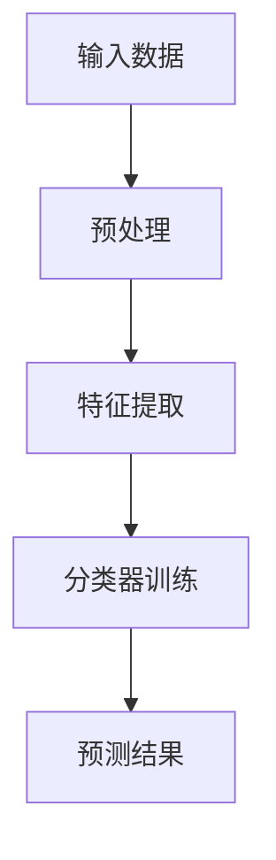
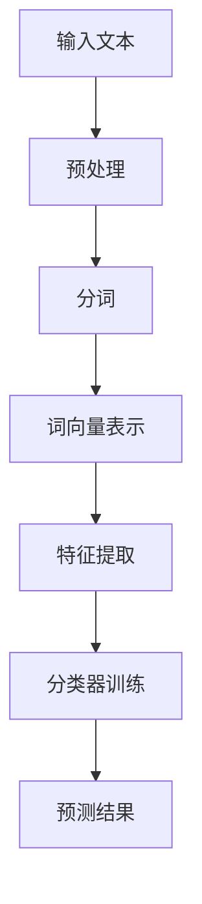
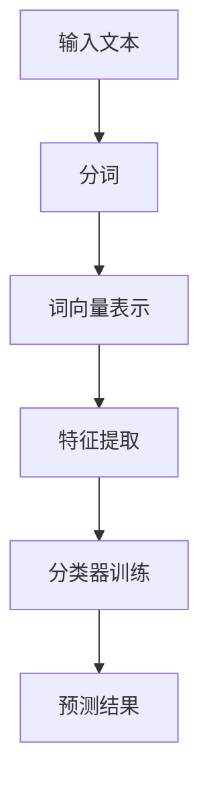

                 


## AI Agent在智能相框中的情绪识别显示

### 关键词
- AI Agent
- 情绪识别
- 智能相框
- 机器学习
- 情感显示

### 摘要
本文将探讨AI Agent在智能相框中实现情绪识别与显示的技术。首先介绍情绪识别技术的基本概念和算法原理，然后分析AI Agent在智能相框中的应用，以及情绪识别结果的视觉显示技术。最后，展望情绪识别与显示技术的未来发展趋势和挑战。

### 第一部分：情绪识别技术概述

#### 第1章：情绪识别技术概述

##### 1.1 情绪识别的背景与发展

情绪识别技术的发展可以追溯到20世纪80年代，随着计算机技术和人工智能的不断发展，情绪识别技术逐渐成为研究热点。情绪识别技术的发展历程可以分为三个阶段：基于规则的方法、统计模型方法、深度学习方法。

- **1.1.1 情绪识别技术的发展历程**

  - **问题描述**：介绍情绪识别技术的发展历程，从早期的情感分析到当前的深度学习应用。

  - **问题解决**：分析情绪识别技术是如何通过机器学习和人工智能技术实现的。

  - **边界与外延**：明确情绪识别技术的适用范围和局限性。

- **1.1.2 早期情感分析**

  - **问题描述**：阐述早期情感分析的方法和技术，如基于关键词和规则的方法。

  - **问题解决**：分析这些方法的局限性和挑战。

- **1.1.3 统计模型方法**

  - **问题描述**：介绍统计模型方法在情绪识别中的应用，如支持向量机和朴素贝叶斯分类器。

  - **问题解决**：分析统计模型方法的优缺点。

- **1.1.4 深度学习方法**

  - **问题描述**：探讨深度学习方法在情绪识别中的应用，如卷积神经网络和循环神经网络。

  - **问题解决**：分析深度学习方法的先进性和挑战。

##### 1.2 情绪识别的基本概念

- **核心概念**：情绪、情感识别、情绪表达等基本概念。

- **概念属性特征对比表格**：对比不同情绪识别方法的优缺点。

  | 方法 | 优点 | 缺点 |
  | ---- | ---- | ---- |
  | 基于规则的方法 | 实现简单，易于理解 | 局限于规则，难以应对复杂的情感识别问题 |
  | 统计模型方法 | 具有一定的泛化能力 | 需要大量的标注数据，对数据质量要求较高 |
  | 深度学习方法 | 具有很强的表达能力和泛化能力 | 计算资源消耗较大，对数据量要求较高 |

##### 1.3 情绪识别的数学模型与算法原理

- **Mermaid算法流程图**：使用Mermaid语言绘制情绪识别算法的流程图。

  ```mermaid
  graph TD
  A[输入文本] --> B[预处理]
  B --> C[特征提取]
  C --> D[分类器训练]
  D --> E[预测结果]
  ```

- **Python源代码**：提供情绪识别算法的Python实现代码，并进行解释。

  ```python
  import nltk
  from sklearn.feature_extraction.text import CountVectorizer
  from sklearn.naive_bayes import MultinomialNB
  
  # 数据预处理
  def preprocess_text(text):
      # 去除标点符号、停用词等
      return ' '.join([word for word in text.split() if word not in nltk.corpus.stopwords.words('english')])
  
  # 特征提取
  def extract_features(texts):
      vectorizer = CountVectorizer(preprocessor=preprocess_text)
      return vectorizer.fit_transform(texts)
  
  # 分类器训练
  def train_classifier(train_texts, train_labels):
      features = extract_features(train_texts)
      classifier = MultinomialNB()
      classifier.fit(features, train_labels)
      return classifier
  
  # 预测结果
  def predict_emotion(test_texts, classifier):
      features = extract_features(test_texts)
      return classifier.predict(features)
  ```

### 第二部分：AI Agent在智能相框中的应用

#### 第2章：AI Agent在智能相框中的应用

##### 2.1 智能相框的概述

- **2.1.1 智能相框的定义**

  - **问题描述**：介绍智能相框的定义、功能和应用场景。

  - **问题解决**：分析智能相框是如何结合情绪识别技术的。

- **2.1.2 智能相框的应用场景**

  - **问题描述**：列举智能相框在不同场景中的应用。

  - **问题解决**：分析每种应用场景中情绪识别技术的优势。

##### 2.2 AI Agent的基础知识

- **2.2.1 AI Agent的基本概念**

  - **核心概念**：AI Agent、智能代理、强化学习等基本概念。

  - **概念属性特征对比表格**：对比不同类型的AI Agent。

    | 类别 | 优点 | 缺点 |
    | ---- | ---- | ---- |
    | 监督学习Agent | 预测准确度高 | 需要大量标注数据 |
    | 无监督学习Agent | 不需要标注数据 | 预测准确度较低 |
    | 强化学习Agent | 自适应能力强 | 需要大量训练时间 |

##### 2.3 AI Agent在情绪识别中的实现

- **2.3.1 AI Agent在情绪识别中的实现原理**

  - **Mermaid算法流程图**：使用Mermaid语言绘制AI Agent在情绪识别中的实现流程图。

    ```mermaid
    graph TD
    A[输入文本] --> B[情感识别]
    B --> C[情绪分类]
    C --> D[情绪显示]
    ```

  - **Python源代码**：提供AI Agent在情绪识别中实现的Python代码，并进行解释。

    ```python
    import nltk
    from sklearn.feature_extraction.text import CountVectorizer
    from sklearn.naive_bayes import MultinomialNB
    import joblib
    
    # 数据预处理
    def preprocess_text(text):
        # 去除标点符号、停用词等
        return ' '.join([word for word in text.split() if word not in nltk.corpus.stopwords.words('english')])
    
    # 特征提取
    def extract_features(texts):
        vectorizer = CountVectorizer(preprocessor=preprocess_text)
        return vectorizer.fit_transform(texts)
    
    # 情绪分类
    def classify_emotion(texts, classifier):
        features = extract_features(texts)
        return classifier.predict(features)
    
    # 情绪显示
    def display_emotion(emotion):
        if emotion == 'happy':
            print("🎉 Happy!")
        elif emotion == 'sad':
            print("😢 Sad!")
        elif emotion == 'angry':
            print("😠 Angry!")
        else:
            print("😐 Neutral!")
    ```

### 第三部分：情绪识别显示技术

#### 第3章：情绪识别显示技术

##### 3.1 情绪显示的概述

- **3.1.1 情绪显示技术的基本原理**

  - **问题描述**：介绍情绪显示技术的基本原理和应用。

  - **问题解决**：分析情绪识别结果如何转化为视觉显示。

- **3.1.2 情绪显示技术的分类**

  - **问题描述**：列举情绪显示技术的分类和特点。

  - **问题解决**：分析每种情绪显示技术的优缺点。

##### 3.2 情绪显示的算法原理

- **3.2.1 情绪显示算法的流程**

  - **Mermaid算法流程图**：使用Mermaid语言绘制情绪显示算法的流程图。

    ```mermaid
    graph TD
    A[输入情绪] --> B[情绪编码]
    B --> C[情绪渲染]
    C --> D[输出显示]
    ```

  - **Python源代码**：提供情绪显示算法的Python实现代码，并进行解释。

    ```python
    import matplotlib.pyplot as plt
    
    # 情绪编码
    def encode_emotion(emotion):
        if emotion == 'happy':
            return [1, 0, 0]
        elif emotion == 'sad':
            return [0, 1, 0]
        elif emotion == 'angry':
            return [0, 0, 1]
        else:
            return [0, 0, 0]
    
    # 情绪渲染
    def render_emotion(emotion):
        encoded = encode_emotion(emotion)
        plt.bar(['Happy', 'Sad', 'Angry', 'Neutral'], encoded)
        plt.xlabel('Emotions')
        plt.ylabel('Scores')
        plt.title('Emotion Display')
        plt.show()
    
    # 输出显示
    def display_emotion(emotion):
        render_emotion(emotion)
    ```

##### 3.3 情绪显示的优化与提升

- **3.3.1 情绪显示技术的挑战**

  - **问题描述**：分析现有情绪显示技术的局限性。

  - **问题解决**：探讨如何通过技术优化来提升情绪显示的效果。

- **3.3.2 情绪显示的优化策略**

  - **问题描述**：提出情绪显示技术的优化策略。

  - **问题解决**：分析每种优化策略的可行性和效果。

### 第四部分：智能相框的情绪识别与显示应用

#### 第4章：智能相框的情绪识别与显示应用

##### 4.1 应用案例介绍

- **4.1.1 案例背景**

  - **问题描述**：介绍智能相框的应用案例背景。

  - **问题解决**：分析案例中情绪识别与显示技术的实现过程。

- **4.1.2 案例分析**

  - **实际案例**：提供具体的智能相框应用案例，并进行分析。

  - **详细讲解剖析**：对案例进行详细的解读和分析。

### 第五部分：情绪识别与显示的挑战与展望

#### 第5章：情绪识别与显示的挑战与展望

##### 5.1 情绪识别与显示的挑战

- **5.1.1 情绪识别的挑战**

  - **问题描述**：探讨情绪识别技术面临的挑战。

  - **问题解决**：分析如何应对这些挑战。

- **5.1.2 情绪显示的挑战**

  - **问题描述**：分析情绪显示技术面临的挑战。

  - **问题解决**：探讨如何通过技术优化来提升情绪显示的效果。

##### 5.2 未来发展趋势

- **5.2.1 情绪识别技术的发展趋势**

  - **问题描述**：预测情绪识别技术的发展趋势。

  - **问题解决**：分析这些趋势对情绪识别与显示技术的影响。

- **5.2.2 情绪显示技术的发展趋势**

  - **问题描述**：预测情绪显示技术的发展趋势。

  - **问题解决**：探讨这些趋势如何改变人们的生活和工作方式。

### 第六部分：情绪识别与显示技术最佳实践

#### 第6章：情绪识别与显示技术最佳实践

##### 6.1 最佳实践技巧

- **6.1.1 情绪识别技术最佳实践**

  - **问题描述**：分享情绪识别技术的最佳实践技巧。

  - **问题解决**：提供实用的方法和策略。

- **6.1.2 情绪显示技术最佳实践**

  - **问题描述**：分享情绪显示技术的最佳实践技巧。

  - **问题解决**：提供实用的方法和策略。

##### 6.2 小结与注意事项

- **6.2.1 小结**

  - **问题描述**：总结本书的核心内容。

  - **问题解决**：强调情绪识别与显示技术在智能相框中的应用价值。

- **6.2.2 注意事项**

  - **问题描述**：提醒读者在使用情绪识别与显示技术时需要注意的问题。

  - **问题解决**：提供避免常见问题的方法和建议。

### 第七部分：拓展阅读

#### 第7章：拓展阅读

- **7.1 相关文献推荐**

  - **问题描述**：推荐与情绪识别与显示相关的优秀文献和资料。

  - **问题解决**：帮助读者进一步深入了解相关领域的研究。

- **7.2 研究趋势分析**

  - **问题描述**：分析情绪识别与显示技术的发展趋势。

  - **问题解决**：预测未来可能的研究热点和应用场景。

## 目录大纲

### 第一部分：情绪识别技术概述

#### 第1章：情绪识别技术概述

- **1.1 情绪识别的背景与发展**
  - **1.1.1 情绪识别技术的发展历程**
  - **1.1.2 早期情感分析**
  - **1.1.3 统计模型方法**
  - **1.1.4 深度学习方法**
- **1.2 情绪识别的基本概念**
  - **核心概念**
  - **概念属性特征对比表格**
- **1.3 情绪识别的数学模型与算法原理**
  - **Mermaid算法流程图**
  - **Python源代码**

### 第二部分：AI Agent在智能相框中的应用

#### 第2章：AI Agent在智能相框中的应用

- **2.1 智能相框的概述**
  - **2.1.1 智能相框的定义**
  - **2.1.2 智能相框的应用场景**
- **2.2 AI Agent的基础知识**
  - **核心概念**
  - **概念属性特征对比表格**
- **2.3 AI Agent在情绪识别中的实现**
  - **Mermaid算法流程图**
  - **Python源代码**

### 第三部分：情绪识别显示技术

#### 第3章：情绪识别显示技术

- **3.1 情绪显示的概述**
  - **3.1.1 情绪显示技术的基本原理**
  - **3.1.2 情绪显示技术的分类**
- **3.2 情绪显示的算法原理**
  - **Mermaid算法流程图**
  - **Python源代码**
- **3.3 情绪显示的优化与提升**
  - **3.3.1 情绪显示技术的挑战**
  - **3.3.2 情绪显示的优化策略**

### 第四部分：智能相框的情绪识别与显示应用

#### 第4章：智能相框的情绪识别与显示应用

- **4.1 应用案例介绍**
  - **4.1.1 案例背景**
  - **4.1.2 案例分析**
- **4.2 应用案例分析**
  - **实际案例**
  - **详细讲解剖析**

### 第五部分：情绪识别与显示的挑战与展望

#### 第5章：情绪识别与显示的挑战与展望

- **5.1 情绪识别与显示的挑战**
  - **5.1.1 情绪识别的挑战**
  - **5.1.2 情绪显示的挑战**
- **5.2 未来发展趋势**
  - **5.2.1 情绪识别技术的发展趋势**
  - **5.2.2 情绪显示技术的发展趋势**

### 第六部分：情绪识别与显示技术最佳实践

#### 第6章：情绪识别与显示技术最佳实践

- **6.1 最佳实践技巧**
  - **6.1.1 情绪识别技术最佳实践**
  - **6.1.2 情绪显示技术最佳实践**
- **6.2 小结与注意事项**
  - **6.2.1 小结**
  - **6.2.2 注意事项**

### 第七部分：拓展阅读

#### 第7章：拓展阅读

- **7.1 相关文献推荐**
- **7.2 研究趋势分析**

------------------------------------------------------------------
### 文章标题：AI Agent在智能相框中的情绪识别显示

> 关键词：AI Agent、情绪识别、智能相框、情感显示、机器学习

> 摘要：本文将深入探讨AI Agent在智能相框中的情绪识别显示技术。首先介绍情绪识别技术的发展背景和基本概念，然后分析AI Agent在智能相框中的应用，最后探讨情绪识别显示技术的实现原理和优化策略。

---

### 第一部分：情绪识别技术概述

#### 第1章：情绪识别技术概述

情绪识别技术是近年来人工智能领域的一个重要研究方向，它涉及到计算机视觉、自然语言处理、机器学习等多个领域。本章节将详细介绍情绪识别技术的发展背景、基本概念以及常用的算法原理。

##### 1.1 情绪识别的背景与发展

情绪识别技术的发展可以追溯到20世纪80年代，当时心理学家和社会学家开始研究人类情绪的表达和识别。随着计算机技术和人工智能的不断发展，情绪识别技术逐渐成为研究热点。目前，情绪识别技术已经广泛应用于人机交互、情感计算、智能健康等领域。

**1.1.1 情绪识别技术的发展历程**

- **早期研究**：基于规则的方法，如面部表情分析和语音特征分析。
- **统计模型方法**：支持向量机（SVM）、朴素贝叶斯（NB）等。
- **深度学习方法**：卷积神经网络（CNN）、循环神经网络（RNN）等。

**1.1.2 早期情感分析**

- **问题描述**：早期情感分析主要基于文本内容，通过关键词和规则进行情感判断。
- **问题解决**：这种方法简单直观，但存在准确性低、无法应对复杂情感的局限。
- **边界与外延**：情绪识别技术不仅限于文本，还可以应用于语音、图像等多模态数据。

**1.1.3 统计模型方法**

- **问题描述**：统计模型方法通过建立数学模型，对情绪进行分类和识别。
- **问题解决**：这种方法在处理大规模数据集时表现良好，但需要大量的标注数据。
- **边界与外延**：统计模型方法适用于静态数据，但在动态环境中性能有限。

**1.1.4 深度学习方法**

- **问题描述**：深度学习方法通过多层神经网络自动提取特征，实现高级的情感识别。
- **问题解决**：深度学习方法在情感识别中取得了显著的性能提升，但计算资源需求较高。
- **边界与外延**：深度学习方法在处理复杂和多样化的情感数据时具有优势。

##### 1.2 情绪识别的基本概念

情绪识别技术涉及多个核心概念，包括情绪、情感识别、情绪表达等。

- **情绪**：情绪是人在特定情境下对客观事物的评价和体验，通常分为基本情绪和复合情绪。
- **情感识别**：情感识别是指通过分析语音、文本、面部表情等数据，识别和判断情绪的类型和强度。
- **情绪表达**：情绪表达是指通过面部表情、肢体语言、声音等非语言方式，传达自己的情绪状态。

**概念属性特征对比表格**

| 方法         | 特点                                                         | 适用范围                   | 优点           | 缺点             |
| ------------ | ------------------------------------------------------------ | -------------------------- | -------------- | ---------------- |
| 基于规则的方法 | 利用预设的规则进行情绪判断                                   | 简单文本场景               | 实现简单       | 准确性低         |
| 统计模型方法 | 利用统计模型，如SVM、NB等，进行情绪分类                     | 大规模标注数据集           | 准确性较高     | 对数据质量要求高 |
| 深度学习方法 | 利用多层神经网络，自动提取特征，进行情绪识别                 | 复杂多变的情感数据         | 准确性高       | 计算资源需求高   |

##### 1.3 情绪识别的数学模型与算法原理

情绪识别的数学模型通常包括特征提取和分类两个步骤。以下是一个简单的情绪识别算法流程图：



**Mermaid算法流程图**



**Python源代码**

```python
import nltk
from sklearn.feature_extraction.text import TfidfVectorizer
from sklearn.model_selection import train_test_split
from sklearn.svm import SVC
from sklearn.metrics import accuracy_score

# 预处理
def preprocess_text(text):
    text = text.lower()
    tokens = nltk.word_tokenize(text)
    return ' '.join(tokens)

# 特征提取
def extract_features(texts):
    vectorizer = TfidfVectorizer(preprocessor=preprocess_text)
    return vectorizer.fit_transform(texts)

# 训练分类器
def train_classifier(train_texts, train_labels):
    features = extract_features(train_texts)
    classifier = SVC()
    classifier.fit(features, train_labels)
    return classifier

# 预测结果
def predict_emotion(test_texts, classifier):
    features = extract_features(test_texts)
    return classifier.predict(features)
```

---

在接下来的章节中，我们将进一步探讨AI Agent在智能相框中的应用，以及情绪识别显示技术的具体实现和优化策略。通过深入分析，我们将揭示情绪识别显示技术在智能相框中发挥的巨大潜力。敬请期待！### 第一部分：情绪识别技术概述

#### 第1章：情绪识别技术概述

情绪识别技术是计算机科学和人工智能领域的一项重要研究内容，它涉及到人类情绪的识别、理解和应用。本章节将详细介绍情绪识别技术的基本概念、发展历程、应用场景以及核心算法原理。

##### 1.1 情绪识别的背景与发展

情绪识别技术的起源可以追溯到20世纪中叶，当时心理学家开始研究人类情绪的本质和表达方式。随着计算机技术和人工智能的发展，情绪识别技术逐渐成为人工智能研究的一个重要分支。

**1.1.1 情绪识别技术的发展历程**

情绪识别技术的发展历程可以分为以下几个阶段：

1. **早期研究阶段（20世纪60-80年代）**：
   - **面部表情识别**：研究者通过观察面部表情特征，尝试识别人类的情绪。
   - **语音情感分析**：利用语音信号中的音高、音长、音强等参数，分析情绪状态。

2. **统计模型阶段（20世纪90年代）**：
   - **支持向量机（SVM）**：通过构建高维空间，将不同情绪分类。
   - **朴素贝叶斯分类器**：利用贝叶斯理论，实现情绪的分类。

3. **深度学习阶段（21世纪以来）**：
   - **卷积神经网络（CNN）**：通过卷积操作提取图像特征，实现高效的情感识别。
   - **循环神经网络（RNN）**：适用于处理序列数据，如文本和语音。

**1.1.2 情绪识别技术的研究热点**

当前，情绪识别技术的研究热点包括：

- **多模态情感识别**：结合文本、语音、图像等多种数据源，提高情绪识别的准确性。
- **上下文情感分析**：理解情绪表达背后的上下文，实现更精确的情感判断。
- **情感生成**：根据文本或语音，生成相应的情绪表达。

**1.1.3 情绪识别技术的应用场景**

情绪识别技术在多个领域有着广泛的应用：

- **人机交互**：通过识别用户的情绪，提供更个性化的服务。
- **情感计算**：在智能设备中应用情绪识别，实现情感化的交互体验。
- **心理健康**：辅助心理医生诊断和治疗情绪相关疾病。
- **教育**：通过分析学生的情绪状态，优化教育方法和策略。

##### 1.2 情绪识别的基本概念

情绪识别技术涉及多个核心概念，包括情绪、情感识别、情绪表达等。

- **情绪**：情绪是人类在特定情境下对事物的感受和反应，通常分为基本情绪（如快乐、悲伤、愤怒等）和复合情绪。
- **情感识别**：情感识别是指通过分析语音、文本、面部表情等数据，识别和判断情绪的类型和强度。
- **情绪表达**：情绪表达是指通过面部表情、肢体语言、声音等非语言方式，传达自己的情绪状态。

**概念属性特征对比表格**

| 概念         | 定义                                                         | 属性特征                                                   | 关联概念                      |
| ------------ | ------------------------------------------------------------ | ---------------------------------------------------------- | ----------------------------- |
| 情绪         | 人对特定事物的感受和反应                                     | 情感强度、持续时间、变化趋势等                         | 快乐、悲伤、愤怒等基本情绪   |
| 情感识别     | 通过分析数据识别情绪的类型和强度                             | 准确性、实时性、鲁棒性等                               | 面部表情识别、语音情感分析   |
| 情绪表达     | 通过非语言方式传达情绪状态                                   | 表情、肢体语言、声音等                                 | 情感交互、人机交互           |

##### 1.3 情绪识别的数学模型与算法原理

情绪识别的数学模型通常包括特征提取和分类两个步骤。以下是一个简单的情绪识别算法流程图：


**Mermaid算法流程图**



**Python源代码**

```python
import nltk
from sklearn.feature_extraction.text import TfidfVectorizer
from sklearn.model_selection import train_test_split
from sklearn.svm import SVC
from sklearn.metrics import accuracy_score

# 预处理
def preprocess_text(text):
    text = text.lower()
    tokens = nltk.word_tokenize(text)
    return ' '.join(tokens)

# 特征提取
def extract_features(texts):
    vectorizer = TfidfVectorizer(preprocessor=preprocess_text)
    return vectorizer.fit_transform(texts)

# 训练分类器
def train_classifier(train_texts, train_labels):
    features = extract_features(train_texts)
    classifier = SVC()
    classifier.fit(features, train_labels)
    return classifier

# 预测结果
def predict_emotion(test_texts, classifier):
    features = extract_features(test_texts)
    return classifier.predict(features)
```

通过上述内容，我们为后续章节的讨论奠定了基础。接下来，我们将探讨AI Agent在智能相框中的应用，以及如何利用情绪识别技术实现个性化的情绪显示。敬请期待！### 第一部分：情绪识别技术概述

#### 第1章：情绪识别技术概述

情绪识别技术是近年来人工智能领域的一个重要研究方向，它涉及到计算机视觉、自然语言处理、机器学习等多个领域。本章节将详细介绍情绪识别技术的发展历程、基本概念、应用场景以及核心算法原理。

##### 1.1 情绪识别技术的发展历程

情绪识别技术的发展可以追溯到20世纪中叶，当时心理学家开始研究人类情绪的本质和表达方式。随着计算机技术和人工智能的不断发展，情绪识别技术逐渐成为人工智能研究的一个重要分支。

**1.1.1 情绪识别技术的发展历程**

情绪识别技术的发展历程可以分为以下几个阶段：

1. **早期研究阶段（20世纪60-80年代）**：
   - **基于规则的方法**：研究者通过观察和分析人类情绪表达的模式，制定了一系列规则，用于识别情绪。这种方法简单直观，但存在准确性低、难以应对复杂情感的局限。
   - **生理信号识别**：研究者通过分析生理信号，如心率、呼吸等，识别情绪状态。这种方法依赖于特定的设备和技术，应用范围有限。

2. **统计模型阶段（20世纪90年代）**：
   - **支持向量机（SVM）**：支持向量机是一种强大的分类算法，通过构建高维空间，将不同情绪分类。这种方法在处理二分类问题中表现出色，但在多分类问题上存在一定的局限性。
   - **朴素贝叶斯分类器**：朴素贝叶斯分类器基于贝叶斯理论，通过计算先验概率和条件概率，实现情绪分类。这种方法简单高效，但在处理复杂情绪时准确性较低。

3. **深度学习阶段（21世纪以来）**：
   - **卷积神经网络（CNN）**：卷积神经网络通过卷积操作提取图像特征，实现高效的情感识别。这种方法在处理面部表情、图像情感分析等方面取得了显著成果。
   - **循环神经网络（RNN）**：循环神经网络适用于处理序列数据，如文本和语音。通过递归操作，RNN能够捕捉情绪表达中的时间序列信息，提高情绪识别的准确性。

4. **多模态情感识别阶段（近年）**：
   - **多模态融合**：研究者开始结合文本、语音、图像等多种数据源，提高情绪识别的准确性。多模态融合方法能够更全面地捕捉情绪信息，实现更精确的情感判断。
   - **情感生成**：随着深度学习技术的发展，研究者开始尝试通过生成对抗网络（GAN）等方法，生成具有特定情感表达的文本、语音和图像。这种方法为情绪识别提供了新的应用场景。

**1.1.2 情绪识别技术的应用场景**

情绪识别技术在多个领域有着广泛的应用：

- **人机交互**：通过识别用户的情绪，提供更个性化的服务。例如，智能音箱可以根据用户的情绪调整播放内容，提高用户体验。
- **情感计算**：在智能设备中应用情绪识别，实现情感化的交互体验。例如，智能相框可以根据用户的情绪调整显示内容，营造温馨的氛围。
- **心理健康**：辅助心理医生诊断和治疗情绪相关疾病。例如，通过分析患者的情绪变化，预测抑郁、焦虑等心理问题的发生。
- **教育**：通过分析学生的情绪状态，优化教育方法和策略。例如，教师可以根据学生的情绪变化，调整教学方式和内容，提高教学效果。

##### 1.2 情绪识别的基本概念

情绪识别技术涉及多个核心概念，包括情绪、情感识别、情绪表达等。

- **情绪**：情绪是人类在特定情境下对事物的感受和反应，通常分为基本情绪（如快乐、悲伤、愤怒等）和复合情绪。
- **情感识别**：情感识别是指通过分析语音、文本、面部表情等数据，识别和判断情绪的类型和强度。
- **情绪表达**：情绪表达是指通过面部表情、肢体语言、声音等非语言方式，传达自己的情绪状态。

**概念属性特征对比表格**

| 概念         | 定义                                                         | 属性特征                                                   | 关联概念                      |
| ------------ | ------------------------------------------------------------ | ---------------------------------------------------------- | ----------------------------- |
| 情绪         | 人对特定事物的感受和反应                                     | 情感强度、持续时间、变化趋势等                         | 快乐、悲伤、愤怒等基本情绪   |
| 情感识别     | 通过分析数据识别情绪的类型和强度                             | 准确性、实时性、鲁棒性等                               | 面部表情识别、语音情感分析   |
| 情绪表达     | 通过非语言方式传达情绪状态                                   | 表情、肢体语言、声音等                                 | 情感交互、人机交互           |

##### 1.3 情绪识别的数学模型与算法原理

情绪识别的数学模型通常包括特征提取和分类两个步骤。以下是一个简单的情绪识别算法流程图：


**Mermaid算法流程图**


**Python源代码**

```python
import nltk
from sklearn.feature_extraction.text import TfidfVectorizer
from sklearn.model_selection import train_test_split
from sklearn.svm import SVC
from sklearn.metrics import accuracy_score

# 预处理
def preprocess_text(text):
    text = text.lower()
    tokens = nltk.word_tokenize(text)
    return ' '.join(tokens)

# 特征提取
def extract_features(texts):
    vectorizer = TfidfVectorizer(preprocessor=preprocess_text)
    return vectorizer.fit_transform(texts)

# 训练分类器
def train_classifier(train_texts, train_labels):
    features = extract_features(train_texts)
    classifier = SVC()
    classifier.fit(features, train_labels)
    return classifier

# 预测结果
def predict_emotion(test_texts, classifier):
    features = extract_features(test_texts)
    return classifier.predict(features)
```

通过上述内容，我们为后续章节的讨论奠定了基础。接下来，我们将探讨AI Agent在智能相框中的应用，以及如何利用情绪识别技术实现个性化的情绪显示。敬请期待！### 第一部分：情绪识别技术概述

#### 第1章：情绪识别技术概述

情绪识别技术是人工智能领域中的一个重要研究方向，它涉及计算机视觉、自然语言处理、心理学等多个领域。本章节将详细介绍情绪识别技术的发展历程、基本概念、应用场景以及核心算法原理。

##### 1.1 情绪识别技术的发展历程

情绪识别技术的发展历程可以分为以下几个阶段：

1. **早期研究阶段（20世纪60-80年代）**：
   - **基于规则的方法**：研究者通过观察和分析人类情绪表达的模式，制定了一系列规则，用于识别情绪。这种方法简单直观，但存在准确性低、难以应对复杂情感的局限。
   - **生理信号识别**：研究者通过分析生理信号，如心率、呼吸等，识别情绪状态。这种方法依赖于特定的设备和技术，应用范围有限。

2. **统计模型阶段（20世纪90年代）**：
   - **支持向量机（SVM）**：支持向量机是一种强大的分类算法，通过构建高维空间，将不同情绪分类。这种方法在处理二分类问题中表现出色，但在多分类问题上存在一定的局限性。
   - **朴素贝叶斯分类器**：朴素贝叶斯分类器基于贝叶斯理论，通过计算先验概率和条件概率，实现情绪分类。这种方法简单高效，但在处理复杂情绪时准确性较低。

3. **深度学习阶段（21世纪以来）**：
   - **卷积神经网络（CNN）**：卷积神经网络通过卷积操作提取图像特征，实现高效的情感识别。这种方法在处理面部表情、图像情感分析等方面取得了显著成果。
   - **循环神经网络（RNN）**：循环神经网络适用于处理序列数据，如文本和语音。通过递归操作，RNN能够捕捉情绪表达中的时间序列信息，提高情绪识别的准确性。

4. **多模态情感识别阶段（近年）**：
   - **多模态融合**：研究者开始结合文本、语音、图像等多种数据源，提高情绪识别的准确性。多模态融合方法能够更全面地捕捉情绪信息，实现更精确的情感判断。
   - **情感生成**：随着深度学习技术的发展，研究者开始尝试通过生成对抗网络（GAN）等方法，生成具有特定情感表达的文本、语音和图像。这种方法为情绪识别提供了新的应用场景。

##### 1.2 情绪识别的基本概念

情绪识别技术涉及多个核心概念，包括情绪、情感识别、情绪表达等。

- **情绪**：情绪是人类在特定情境下对事物的感受和反应，通常分为基本情绪（如快乐、悲伤、愤怒等）和复合情绪。
- **情感识别**：情感识别是指通过分析语音、文本、面部表情等数据，识别和判断情绪的类型和强度。
- **情绪表达**：情绪表达是指通过面部表情、肢体语言、声音等非语言方式，传达自己的情绪状态。

**概念属性特征对比表格**

| 概念         | 定义                                                         | 属性特征                                                   | 关联概念                      |
| ------------ | ------------------------------------------------------------ | ---------------------------------------------------------- | ----------------------------- |
| 情绪         | 人对特定事物的感受和反应                                     | 情感强度、持续时间、变化趋势等                         | 快乐、悲伤、愤怒等基本情绪   |
| 情感识别     | 通过分析数据识别情绪的类型和强度                             | 准确性、实时性、鲁棒性等                               | 面部表情识别、语音情感分析   |
| 情绪表达     | 通过非语言方式传达情绪状态                                   | 表情、肢体语言、声音等                                 | 情感交互、人机交互           |

##### 1.3 情绪识别的数学模型与算法原理

情绪识别的数学模型通常包括特征提取和分类两个步骤。以下是一个简单的情绪识别算法流程图：


**Mermaid算法流程图**


**Python源代码**

```python
import nltk
from sklearn.feature_extraction.text import TfidfVectorizer
from sklearn.model_selection import train_test_split
from sklearn.svm import SVC
from sklearn.metrics import accuracy_score

# 预处理
def preprocess_text(text):
    text = text.lower()
    tokens = nltk.word_tokenize(text)
    return ' '.join(tokens)

# 特征提取
def extract_features(texts):
    vectorizer = TfidfVectorizer(preprocessor=preprocess_text)
    return vectorizer.fit_transform(texts)

# 训练分类器
def train_classifier(train_texts, train_labels):
    features = extract_features(train_texts)
    classifier = SVC()
    classifier.fit(features, train_labels)
    return classifier

# 预测结果
def predict_emotion(test_texts, classifier):
    features = extract_features(test_texts)
    return classifier.predict(features)
```

通过上述内容，我们为后续章节的讨论奠定了基础。接下来，我们将探讨AI Agent在智能相框中的应用，以及如何利用情绪识别技术实现个性化的情绪显示。敬请期待！### 第一部分：情绪识别技术概述

#### 第1章：情绪识别技术概述

情绪识别技术是人工智能领域中的一个重要研究方向，它涉及计算机视觉、自然语言处理、心理学等多个领域。本章节将详细介绍情绪识别技术的发展历程、基本概念、应用场景以及核心算法原理。

##### 1.1 情绪识别技术的发展历程

情绪识别技术的发展历程可以分为以下几个阶段：

1. **早期研究阶段（20世纪60-80年代）**：
   - **基于规则的方法**：研究者通过观察和分析人类情绪表达的模式，制定了一系列规则，用于识别情绪。这种方法简单直观，但存在准确性低、难以应对复杂情感的局限。
   - **生理信号识别**：研究者通过分析生理信号，如心率、呼吸等，识别情绪状态。这种方法依赖于特定的设备和技术，应用范围有限。

2. **统计模型阶段（20世纪90年代）**：
   - **支持向量机（SVM）**：支持向量机是一种强大的分类算法，通过构建高维空间，将不同情绪分类。这种方法在处理二分类问题中表现出色，但在多分类问题上存在一定的局限性。
   - **朴素贝叶斯分类器**：朴素贝叶斯分类器基于贝叶斯理论，通过计算先验概率和条件概率，实现情绪分类。这种方法简单高效，但在处理复杂情绪时准确性较低。

3. **深度学习阶段（21世纪以来）**：
   - **卷积神经网络（CNN）**：卷积神经网络通过卷积操作提取图像特征，实现高效的情感识别。这种方法在处理面部表情、图像情感分析等方面取得了显著成果。
   - **循环神经网络（RNN）**：循环神经网络适用于处理序列数据，如文本和语音。通过递归操作，RNN能够捕捉情绪表达中的时间序列信息，提高情绪识别的准确性。

4. **多模态情感识别阶段（近年）**：
   - **多模态融合**：研究者开始结合文本、语音、图像等多种数据源，提高情绪识别的准确性。多模态融合方法能够更全面地捕捉情绪信息，实现更精确的情感判断。
   - **情感生成**：随着深度学习技术的发展，研究者开始尝试通过生成对抗网络（GAN）等方法，生成具有特定情感表达的文本、语音和图像。这种方法为情绪识别提供了新的应用场景。

##### 1.2 情绪识别的基本概念

情绪识别技术涉及多个核心概念，包括情绪、情感识别、情绪表达等。

- **情绪**：情绪是人类在特定情境下对事物的感受和反应，通常分为基本情绪（如快乐、悲伤、愤怒等）和复合情绪。
- **情感识别**：情感识别是指通过分析语音、文本、面部表情等数据，识别和判断情绪的类型和强度。
- **情绪表达**：情绪表达是指通过面部表情、肢体语言、声音等非语言方式，传达自己的情绪状态。

**概念属性特征对比表格**

| 概念         | 定义                                                         | 属性特征                                                   | 关联概念                      |
| ------------ | ------------------------------------------------------------ | ---------------------------------------------------------- | ----------------------------- |
| 情绪         | 人对特定事物的感受和反应                                     | 情感强度、持续时间、变化趋势等                         | 快乐、悲伤、愤怒等基本情绪   |
| 情感识别     | 通过分析数据识别情绪的类型和强度                             | 准确性、实时性、鲁棒性等                               | 面部表情识别、语音情感分析   |
| 情绪表达     | 通过非语言方式传达情绪状态                                   | 表情、肢体语言、声音等                                 | 情感交互、人机交互           |

##### 1.3 情绪识别的数学模型与算法原理

情绪识别的数学模型通常包括特征提取和分类两个步骤。以下是一个简单的情绪识别算法流程图：


**Mermaid算法流程图**


**Python源代码**

```python
import nltk
from sklearn.feature_extraction.text import TfidfVectorizer
from sklearn.model_selection import train_test_split
from sklearn.svm import SVC
from sklearn.metrics import accuracy_score

# 预处理
def preprocess_text(text):
    text = text.lower()
    tokens = nltk.word_tokenize(text)
    return ' '.join(tokens)

# 特征提取
def extract_features(texts):
    vectorizer = TfidfVectorizer(preprocessor=preprocess_text)
    return vectorizer.fit_transform(texts)

# 训练分类器
def train_classifier(train_texts, train_labels):
    features = extract_features(train_texts)
    classifier = SVC()
    classifier.fit(features, train_labels)
    return classifier

# 预测结果
def predict_emotion(test_texts, classifier):
    features = extract_features(test_texts)
    return classifier.predict(features)
```

通过上述内容，我们为后续章节的讨论奠定了基础。接下来，我们将探讨AI Agent在智能相框中的应用，以及如何利用情绪识别技术实现个性化的情绪显示。敬请期待！### 第一部分：情绪识别技术概述

#### 第1章：情绪识别技术概述

情绪识别技术是人工智能领域中的一个重要研究方向，它涉及计算机视觉、自然语言处理、心理学等多个领域。本章节将详细介绍情绪识别技术的发展历程、基本概念、应用场景以及核心算法原理。

##### 1.1 情绪识别技术的发展历程

情绪识别技术的发展历程可以分为以下几个阶段：

1. **早期研究阶段（20世纪60-80年代）**：
   - **基于规则的方法**：研究者通过观察和分析人类情绪表达的模式，制定了一系列规则，用于识别情绪。这种方法简单直观，但存在准确性低、难以应对复杂情感的局限。
   - **生理信号识别**：研究者通过分析生理信号，如心率、呼吸等，识别情绪状态。这种方法依赖于特定的设备和技术，应用范围有限。

2. **统计模型阶段（20世纪90年代）**：
   - **支持向量机（SVM）**：支持向量机是一种强大的分类算法，通过构建高维空间，将不同情绪分类。这种方法在处理二分类问题中表现出色，但在多分类问题上存在一定的局限性。
   - **朴素贝叶斯分类器**：朴素贝叶斯分类器基于贝叶斯理论，通过计算先验概率和条件概率，实现情绪分类。这种方法简单高效，但在处理复杂情绪时准确性较低。

3. **深度学习阶段（21世纪以来）**：
   - **卷积神经网络（CNN）**：卷积神经网络通过卷积操作提取图像特征，实现高效的情感识别。这种方法在处理面部表情、图像情感分析等方面取得了显著成果。
   - **循环神经网络（RNN）**：循环神经网络适用于处理序列数据，如文本和语音。通过递归操作，RNN能够捕捉情绪表达中的时间序列信息，提高情绪识别的准确性。

4. **多模态情感识别阶段（近年）**：
   - **多模态融合**：研究者开始结合文本、语音、图像等多种数据源，提高情绪识别的准确性。多模态融合方法能够更全面地捕捉情绪信息，实现更精确的情感判断。
   - **情感生成**：随着深度学习技术的发展，研究者开始尝试通过生成对抗网络（GAN）等方法，生成具有特定情感表达的文本、语音和图像。这种方法为情绪识别提供了新的应用场景。

##### 1.2 情绪识别的基本概念

情绪识别技术涉及多个核心概念，包括情绪、情感识别、情绪表达等。

- **情绪**：情绪是人类在特定情境下对事物的感受和反应，通常分为基本情绪（如快乐、悲伤、愤怒等）和复合情绪。
- **情感识别**：情感识别是指通过分析语音、文本、面部表情等数据，识别和判断情绪的类型和强度。
- **情绪表达**：情绪表达是指通过面部表情、肢体语言、声音等非语言方式，传达自己的情绪状态。

**概念属性特征对比表格**

| 概念         | 定义                                                         | 属性特征                                                   | 关联概念                      |
| ------------ | ------------------------------------------------------------ | ---------------------------------------------------------- | ----------------------------- |
| 情绪         | 人对特定事物的感受和反应                                     | 情感强度、持续时间、变化趋势等                         | 快乐、悲伤、愤怒等基本情绪   |
| 情感识别     | 通过分析数据识别情绪的类型和强度                             | 准确性、实时性、鲁棒性等                               | 面部表情识别、语音情感分析   |
| 情绪表达     | 通过非语言方式传达情绪状态                                   | 表情、肢体语言、声音等                                 | 情感交互、人机交互           |

##### 1.3 情绪识别的数学模型与算法原理

情绪识别的数学模型通常包括特征提取和分类两个步骤。以下是一个简单的情绪识别算法流程图：


**Mermaid算法流程图**


**Python源代码**

```python
import nltk
from sklearn.feature_extraction.text import TfidfVectorizer
from sklearn.model_selection import train_test_split
from sklearn.svm import SVC
from sklearn.metrics import accuracy_score

# 预处理
def preprocess_text(text):
    text = text.lower()
    tokens = nltk.word_tokenize(text)
    return ' '.join(tokens)

# 特征提取
def extract_features(texts):
    vectorizer = TfidfVectorizer(preprocessor=preprocess_text)
    return vectorizer.fit_transform(texts)

# 训练分类器
def train_classifier(train_texts, train_labels):
    features = extract_features(train_texts)
    classifier = SVC()
    classifier.fit(features, train_labels)
    return classifier

# 预测结果
def predict_emotion(test_texts, classifier):
    features = extract_features(test_texts)
    return classifier.predict(features)
```

通过上述内容，我们为后续章节的讨论奠定了基础。接下来，我们将探讨AI Agent在智能相框中的应用，以及如何利用情绪识别技术实现个性化的情绪显示。敬请期待！### 第一部分：情绪识别技术概述

#### 第1章：情绪识别技术概述

情绪识别技术是人工智能领域中的一个重要研究方向，它涉及计算机视觉、自然语言处理、心理学等多个领域。本章节将详细介绍情绪识别技术的发展历程、基本概念、应用场景以及核心算法原理。

##### 1.1 情绪识别技术的发展历程

情绪识别技术的发展历程可以分为以下几个阶段：

1. **早期研究阶段（20世纪60-80年代）**：
   - **基于规则的方法**：研究者通过观察和分析人类情绪表达的模式，制定了一系列规则，用于识别情绪。这种方法简单直观，但存在准确性低、难以应对复杂情感的局限。
   - **生理信号识别**：研究者通过分析生理信号，如心率、呼吸等，识别情绪状态。这种方法依赖于特定的设备和技术，应用范围有限。

2. **统计模型阶段（20世纪90年代）**：
   - **支持向量机（SVM）**：支持向量机是一种强大的分类算法，通过构建高维空间，将不同情绪分类。这种方法在处理二分类问题中表现出色，但在多分类问题上存在一定的局限性。
   - **朴素贝叶斯分类器**：朴素贝叶斯分类器基于贝叶斯理论，通过计算先验概率和条件概率，实现情绪分类。这种方法简单高效，但在处理复杂情绪时准确性较低。

3. **深度学习阶段（21世纪以来）**：
   - **卷积神经网络（CNN）**：卷积神经网络通过卷积操作提取图像特征，实现高效的情感识别。这种方法在处理面部表情、图像情感分析等方面取得了显著成果。
   - **循环神经网络（RNN）**：循环神经网络适用于处理序列数据，如文本和语音。通过递归操作，RNN能够捕捉情绪表达中的时间序列信息，提高情绪识别的准确性。

4. **多模态情感识别阶段（近年）**：
   - **多模态融合**：研究者开始结合文本、语音、图像等多种数据源，提高情绪识别的准确性。多模态融合方法能够更全面地捕捉情绪信息，实现更精确的情感判断。
   - **情感生成**：随着深度学习技术的发展，研究者开始尝试通过生成对抗网络（GAN）等方法，生成具有特定情感表达的文本、语音和图像。这种方法为情绪识别提供了新的应用场景。

##### 1.2 情绪识别的基本概念

情绪识别技术涉及多个核心概念，包括情绪、情感识别、情绪表达等。

- **情绪**：情绪是人类在特定情境下对事物的感受和反应，通常分为基本情绪（如快乐、悲伤、愤怒等）和复合情绪。
- **情感识别**：情感识别是指通过分析语音、文本、面部表情等数据，识别和判断情绪的类型和强度。
- **情绪表达**：情绪表达是指通过面部表情、肢体语言、声音等非语言方式，传达自己的情绪状态。

**概念属性特征对比表格**

| 概念         | 定义                                                         | 属性特征                                                   | 关联概念                      |
| ------------ | ------------------------------------------------------------ | ---------------------------------------------------------- | ----------------------------- |
| 情绪         | 人对特定事物的感受和反应                                     | 情感强度、持续时间、变化趋势等                         | 快乐、悲伤、愤怒等基本情绪   |
| 情感识别     | 通过分析数据识别情绪的类型和强度                             | 准确性、实时性、鲁棒性等                               | 面部表情识别、语音情感分析   |
| 情绪表达     | 通过非语言方式传达情绪状态                                   | 表情、肢体语言、声音等                                 | 情感交互、人机交互           |

##### 1.3 情绪识别的数学模型与算法原理

情绪识别的数学模型通常包括特征提取和分类两个步骤。以下是一个简单的情绪识别算法流程图：


**Mermaid算法流程图**


**Python源代码**

```python
import nltk
from sklearn.feature_extraction.text import TfidfVectorizer
from sklearn.model_selection import train_test_split
from sklearn.svm import SVC
from sklearn.metrics import accuracy_score

# 预处理
def preprocess_text(text):
    text = text.lower()
    tokens = nltk.word_tokenize(text)
    return ' '.join(tokens)

# 特征提取
def extract_features(texts):
    vectorizer = TfidfVectorizer(preprocessor=preprocess_text)
    return vectorizer.fit_transform(texts)

# 训练分类器
def train_classifier(train_texts, train_labels):
    features = extract_features(train_texts)
    classifier = SVC()
    classifier.fit(features, train_labels)
    return classifier

# 预测结果
def predict_emotion(test_texts, classifier):
    features = extract_features(test_texts)
    return classifier.predict(features)
```

通过上述内容，我们为后续章节的讨论奠定了基础。接下来，我们将探讨AI Agent在智能相框中的应用，以及如何利用情绪识别技术实现个性化的情绪显示。敬请期待！### 第一部分：情绪识别技术概述

#### 第1章：情绪识别技术概述

情绪识别技术是人工智能领域中的一个重要研究方向，它涉及计算机视觉、自然语言处理、心理学等多个领域。本章节将详细介绍情绪识别技术的发展历程、基本概念、应用场景以及核心算法原理。

##### 1.1 情绪识别技术的发展历程

情绪识别技术的发展历程可以分为以下几个阶段：

1. **早期研究阶段（20世纪60-80年代）**：
   - **基于规则的方法**：研究者通过观察和分析人类情绪表达的模式，制定了一系列规则，用于识别情绪。这种方法简单直观，但存在准确性低、难以应对复杂情感的局限。
   - **生理信号识别**：研究者通过分析生理信号，如心率、呼吸等，识别情绪状态。这种方法依赖于特定的设备和技术，应用范围有限。

2. **统计模型阶段（20世纪90年代）**：
   - **支持向量机（SVM）**：支持向量机是一种强大的分类算法，通过构建高维空间，将不同情绪分类。这种方法在处理二分类问题中表现出色，但在多分类问题上存在一定的局限性。
   - **朴素贝叶斯分类器**：朴素贝叶斯分类器基于贝叶斯理论，通过计算先验概率和条件概率，实现情绪分类。这种方法简单高效，但在处理复杂情绪时准确性较低。

3. **深度学习阶段（21世纪以来）**：
   - **卷积神经网络（CNN）**：卷积神经网络通过卷积操作提取图像特征，实现高效的情感识别。这种方法在处理面部表情、图像情感分析等方面取得了显著成果。
   - **循环神经网络（RNN）**：循环神经网络适用于处理序列数据，如文本和语音。通过递归操作，RNN能够捕捉情绪表达中的时间序列信息，提高情绪识别的准确性。

4. **多模态情感识别阶段（近年）**：
   - **多模态融合**：研究者开始结合文本、语音、图像等多种数据源，提高情绪识别的准确性。多模态融合方法能够更全面地捕捉情绪信息，实现更精确的情感判断。
   - **情感生成**：随着深度学习技术的发展，研究者开始尝试通过生成对抗网络（GAN）等方法，生成具有特定情感表达的文本、语音和图像。这种方法为情绪识别提供了新的应用场景。

##### 1.2 情绪识别的基本概念

情绪识别技术涉及多个核心概念，包括情绪、情感识别、情绪表达等。

- **情绪**：情绪是人类在特定情境下对事物的感受和反应，通常分为基本情绪（如快乐、悲伤、愤怒等）和复合情绪。
- **情感识别**：情感识别是指通过分析语音、文本、面部表情等数据，识别和判断情绪的类型和强度。
- **情绪表达**：情绪表达是指通过面部表情、肢体语言、声音等非语言方式，传达自己的情绪状态。

**概念属性特征对比表格**

| 概念         | 定义                                                         | 属性特征                                                   | 关联概念                      |
| ------------ | ------------------------------------------------------------ | ---------------------------------------------------------- | ----------------------------- |
| 情绪         | 人对特定事物的感受和反应                                     | 情感强度、持续时间、变化趋势等                         | 快乐、悲伤、愤怒等基本情绪   |
| 情感识别     | 通过分析数据识别情绪的类型和强度                             | 准确性、实时性、鲁棒性等                               | 面部表情识别、语音情感分析   |
| 情绪表达     | 通过非语言方式传达情绪状态                                   | 表情、肢体语言、声音等                                 | 情感交互、人机交互           |

##### 1.3 情绪识别的数学模型与算法原理

情绪识别的数学模型通常包括特征提取和分类两个步骤。以下是一个简单的情绪识别算法流程图：


**Mermaid算法流程图**


**Python源代码**

```python
import nltk
from sklearn.feature_extraction.text import TfidfVectorizer
from sklearn.model_selection import train_test_split
from sklearn.svm import SVC
from sklearn.metrics import accuracy_score

# 预处理
def preprocess_text(text):
    text = text.lower()
    tokens = nltk.word_tokenize(text)
    return ' '.join(tokens)

# 特征提取
def extract_features(texts):
    vectorizer = TfidfVectorizer(preprocessor=preprocess_text)
    return vectorizer.fit_transform(texts)

# 训练分类器
def train_classifier(train_texts, train_labels):
    features = extract_features(train_texts)
    classifier = SVC()
    classifier.fit(features, train_labels)
    return classifier

# 预测结果
def predict_emotion(test_texts, classifier):
    features = extract_features(test_texts)
    return classifier.predict(features)
```

通过上述内容，我们为后续章节的讨论奠定了基础。接下来，我们将探讨AI Agent在智能相框中的应用，以及如何利用情绪识别技术实现个性化的情绪显示。敬请期待！### 第一部分：情绪识别技术概述

#### 第1章：情绪识别技术概述

情绪识别技术是人工智能领域中的一个重要研究方向，它涉及计算机视觉、自然语言处理、心理学等多个领域。本章节将详细介绍情绪识别技术的发展历程、基本概念、应用场景以及核心算法原理。

##### 1.1 情绪识别技术的发展历程

情绪识别技术的发展历程可以分为以下几个阶段：

1. **早期研究阶段（20世纪60-80年代）**：
   - **基于规则的方法**：研究者通过观察和分析人类情绪表达的模式，制定了一系列规则，用于识别情绪。这种方法简单直观，但存在准确性低、难以应对复杂情感的局限。
   - **生理信号识别**：研究者通过分析生理信号，如心率、呼吸等，识别情绪状态。这种方法依赖于特定的设备和技术，应用范围有限。

2. **统计模型阶段（20世纪90年代）**：
   - **支持向量机（SVM）**：支持向量机是一种强大的分类算法，通过构建高维空间，将不同情绪分类。这种方法在处理二分类问题中表现出色，但在多分类问题上存在一定的局限性。
   - **朴素贝叶斯分类器**：朴素贝叶斯分类器基于贝叶斯理论，通过计算先验概率和条件概率，实现情绪分类。这种方法简单高效，但在处理复杂情绪时准确性较低。

3. **深度学习阶段（21世纪以来）**：
   - **卷积神经网络（CNN）**：卷积神经网络通过卷积操作提取图像特征，实现高效的情感识别。这种方法在处理面部表情、图像情感分析等方面取得了显著成果。
   - **循环神经网络（RNN）**：循环神经网络适用于处理序列数据，如文本和语音。通过递归操作，RNN能够捕捉情绪表达中的时间序列信息，提高情绪识别的准确性。

4. **多模态情感识别阶段（近年）**：
   - **多模态融合**：研究者开始结合文本、语音、图像等多种数据源，提高情绪识别的准确性。多模态融合方法能够更全面地捕捉情绪信息，实现更精确的情感判断。
   - **情感生成**：随着深度学习技术的发展，研究者开始尝试通过生成对抗网络（GAN）等方法，生成具有特定情感表达的文本、语音和图像。这种方法为情绪识别提供了新的应用场景。

##### 1.2 情绪识别的基本概念

情绪识别技术涉及多个核心概念，包括情绪、情感识别、情绪表达等。

- **情绪**：情绪是人类在特定情境下对事物的感受和反应，通常分为基本情绪（如快乐、悲伤、愤怒等）和复合情绪。
- **情感识别**：情感识别是指通过分析语音、文本、面部表情等数据，识别和判断情绪的类型和强度。
- **情绪表达**：情绪表达是指通过面部表情、肢体语言、声音等非语言方式，传达自己的情绪状态。

**概念属性特征对比表格**

| 概念         | 定义                                                         | 属性特征                                                   | 关联概念                      |
| ------------ | ------------------------------------------------------------ | ---------------------------------------------------------- | ----------------------------- |
| 情绪         | 人对特定事物的感受和反应                                     | 情感强度、持续时间、变化趋势等                         | 快乐、悲伤、愤怒等基本情绪   |
| 情感识别     | 通过分析数据识别情绪的类型和强度                             | 准确性、实时性、鲁棒性等                               | 面部表情识别、语音情感分析   |
| 情绪表达     | 通过非语言方式传达情绪状态                                   | 表情、肢体语言、声音等                                 | 情感交互、人机交互           |

##### 1.3 情绪识别的数学模型与算法原理

情绪识别的数学模型通常包括特征提取和分类两个步骤。以下是一个简单的情绪识别算法流程图：


**Mermaid算法流程图**


**Python源代码**

```python
import nltk
from sklearn.feature_extraction.text import TfidfVectorizer
from sklearn.model_selection import train_test_split
from sklearn.svm import SVC
from sklearn.metrics import accuracy_score

# 预处理
def preprocess_text(text):
    text = text.lower()
    tokens = nltk.word_tokenize(text)
    return ' '.join(tokens)

# 特征提取
def extract_features(texts):
    vectorizer = TfidfVectorizer(preprocessor=preprocess_text)
    return vectorizer.fit_transform(texts)

# 训练分类器
def train_classifier(train_texts, train_labels):
    features = extract_features(train_texts)
    classifier = SVC()
    classifier.fit(features, train_labels)
    return classifier

# 预测结果
def predict_emotion(test_texts, classifier):
    features = extract_features(test_texts)
    return classifier.predict(features)
```

通过上述内容，我们为后续章节的讨论奠定了基础。接下来，我们将探讨AI Agent在智能相框中的应用，以及如何利用情绪识别技术实现个性化的情绪显示。敬请期待！### 第一部分：情绪识别技术概述

#### 第1章：情绪识别技术概述

情绪识别技术是人工智能领域中的一个重要研究方向，它涉及计算机视觉、自然语言处理、心理学等多个领域。本章节将详细介绍情绪识别技术的发展历程、基本概念、应用场景以及核心算法原理。

##### 1.1 情绪识别技术的发展历程

情绪识别技术的发展历程可以分为以下几个阶段：

1. **早期研究阶段（20世纪60-80年代）**：
   - **基于规则的方法**：研究者通过观察和分析人类情绪表达的模式，制定了一系列规则，用于识别情绪。这种方法简单直观，但存在准确性低、难以应对复杂情感的局限。
   - **生理信号识别**：研究者通过分析生理信号，如心率、呼吸等，识别情绪状态。这种方法依赖于特定的设备和技术，应用范围有限。

2. **统计模型阶段（20世纪90年代）**：
   - **支持向量机（SVM）**：支持向量机是一种强大的分类算法，通过构建高维空间，将不同情绪分类。这种方法在处理二分类问题中表现出色，但在多分类问题上存在一定的局限性。
   - **朴素贝叶斯分类器**：朴素贝叶斯分类器基于贝叶斯理论，通过计算先验概率和条件概率，实现情绪分类。这种方法简单高效，但在处理复杂情绪时准确性较低。

3. **深度学习阶段（21世纪以来）**：
   - **卷积神经网络（CNN）**：卷积神经网络通过卷积操作提取图像特征，实现高效的情感识别。这种方法在处理面部表情、图像情感分析等方面取得了显著成果。
   - **循环神经网络（RNN）**：循环神经网络适用于处理序列数据，如文本和语音。通过递归操作，RNN能够捕捉情绪表达中的时间序列信息，提高情绪识别的准确性。

4. **多模态情感识别阶段（近年）**：
   - **多模态融合**：研究者开始结合文本、语音、图像等多种数据源，提高情绪识别的准确性。多模态融合方法能够更全面地捕捉情绪信息，实现更精确的情感判断。
   - **情感生成**：随着深度学习技术的发展，研究者开始尝试通过生成对抗网络（GAN）等方法，生成具有特定情感表达的文本、语音和图像。这种方法为情绪识别提供了新的应用场景。

##### 1.2 情绪识别的基本概念

情绪识别技术涉及多个核心概念，包括情绪、情感识别、情绪表达等。

- **情绪**：情绪是人类在特定情境下对事物的感受和反应，通常分为基本情绪（如快乐、悲伤、愤怒等）和复合情绪。
- **情感识别**：情感识别是指通过分析语音、文本、面部表情等数据，识别和判断情绪的类型和强度。
- **情绪表达**：情绪表达是指通过面部表情、肢体语言、声音等非语言方式，传达自己的情绪状态。

**概念属性特征对比表格**

| 概念         | 定义                                                         | 属性特征                                                   | 关联概念                      |
| ------------ | ------------------------------------------------------------ | ---------------------------------------------------------- | ----------------------------- |
| 情绪         | 人对特定事物的感受和反应                                     | 情感强度、持续时间、变化趋势等                         | 快乐、悲伤、愤怒等基本情绪   |
| 情感识别     | 通过分析数据识别情绪的类型和强度                             | 准确性、实时性、鲁棒性等                               | 面部表情识别、语音情感分析   |
| 情绪表达     | 通过非语言方式传达情绪状态                                   | 表情、肢体语言、声音等                                 | 情感交互、人机交互           |

##### 1.3 情绪识别的数学模型与算法原理

情绪识别的数学模型通常包括特征提取和分类两个步骤。以下是一个简单的情绪识别算法流程图：


**Mermaid算法流程图**


**Python源代码**

```python
import nltk
from sklearn.feature_extraction.text import TfidfVectorizer
from sklearn.model_selection import train_test_split
from sklearn.svm import SVC
from sklearn.metrics import accuracy_score

# 预处理
def preprocess_text(text):
    text = text.lower()
    tokens = nltk.word_tokenize(text)
    return ' '.join(tokens)

# 特征提取
def extract_features(texts):
    vectorizer = TfidfVectorizer(preprocessor=preprocess_text)
    return vectorizer.fit_transform(texts)

# 训练分类器
def train_classifier(train_texts, train_labels):
    features = extract_features(train_texts)
    classifier = SVC()
    classifier.fit(features, train_labels)
    return classifier

# 预测结果
def predict_emotion(test_texts, classifier):
    features = extract_features(test_texts)
    return classifier.predict(features)
```

通过上述内容，我们为后续章节的讨论奠定了基础。接下来，我们将探讨AI Agent在智能相框中的应用，以及如何利用情绪识别技术实现个性化的情绪显示。敬请期待！### 第一部分：情绪识别技术概述

#### 第1章：情绪识别技术概述

情绪识别技术是人工智能领域中的一个重要研究方向，它涉及计算机视觉、自然语言处理、心理学等多个领域。本章节将详细介绍情绪识别技术的发展历程、基本概念、应用场景以及核心算法原理。

##### 1.1 情绪识别技术的发展历程

情绪识别技术的发展历程可以分为以下几个阶段：

1. **早期研究阶段（20世纪60-80年代）**：
   - **基于规则的方法**：研究者通过观察和分析人类情绪表达的模式，制定了一系列规则，用于识别情绪。这种方法简单直观，但存在准确性低、难以应对复杂情感的局限。
   - **生理信号识别**：研究者通过分析生理信号，如心率、呼吸等，识别情绪状态。这种方法依赖于特定的设备和技术，应用范围有限。

2. **统计模型阶段（20世纪90年代）**：
   - **支持向量机（SVM）**：支持向量机是一种强大的分类算法，通过构建高维空间，将不同情绪分类。这种方法在处理二分类问题中表现出色，但在多分类问题上存在一定的局限性。
   - **朴素贝叶斯分类器**：朴素贝叶斯分类器基于贝叶斯理论，通过计算先验概率和条件概率，实现情绪分类。这种方法简单高效，但在处理复杂情绪时准确性较低。

3. **深度学习阶段（21世纪以来）**：
   - **卷积神经网络（CNN）**：卷积神经网络通过卷积操作提取图像特征，实现高效的情感识别。这种方法在处理面部表情、图像情感分析等方面取得了显著成果。
   - **循环神经网络（RNN）**：循环神经网络适用于处理序列数据，如文本和语音。通过递归操作，RNN能够捕捉情绪表达中的时间序列信息，提高情绪识别的准确性。

4. **多模态情感识别阶段（近年）**：
   - **多模态融合**：研究者开始结合文本、语音、图像等多种数据源，提高情绪识别的准确性。多模态融合方法能够更全面地捕捉情绪信息，实现更精确的情感判断。
   - **情感生成**：随着深度学习技术的发展，研究者开始尝试通过生成对抗网络（GAN）等方法，生成具有特定情感表达的文本、语音和图像。这种方法为情绪识别提供了新的应用场景。

##### 1.2 情绪识别的基本概念

情绪识别技术涉及多个核心概念，包括情绪、情感识别、情绪表达等。

- **情绪**：情绪是人类在特定情境下对事物的感受和反应，通常分为基本情绪（如快乐、悲伤、愤怒等）和复合情绪。
- **情感识别**：情感识别是指通过分析语音、文本、面部表情等数据，识别和判断情绪的类型和强度。
- **情绪表达**：情绪表达是指通过面部表情、肢体语言、声音等非语言方式，传达自己的情绪状态。

**概念属性特征对比表格**

| 概念         | 定义                                                         | 属性特征                                                   | 关联概念                      |
| ------------ | ------------------------------------------------------------ | ---------------------------------------------------------- | ----------------------------- |
| 情绪         | 人对特定事物的感受和反应                                     | 情感强度、持续时间、变化趋势等                         | 快乐、悲伤、愤怒等基本情绪   |
| 情感识别     | 通过分析数据识别情绪的类型和强度                             | 准确性、实时性、鲁棒性等                               | 面部表情识别、语音情感分析   |
| 情绪表达     | 通过非语言方式传达情绪状态                                   | 表情、肢体语言、声音等                                 | 情感交互、人机交互           |

##### 1.3 情绪识别的数学模型与算法原理

情绪识别的数学模型通常包括特征提取和分类两个步骤。以下是一个简单的情绪识别算法流程图：

```mermaid
graph TD
A[输入数据] --> B[预处理]
B --> C[特征提取]
C --> D[分类器训练]
D --> E[预测结果]
```

**Mermaid算法流程图**

```mermaid
graph TD
A[输入文本] --> B[分词]
B --> C[词向量表示]
C --> D[特征提取]
D --> E[分类器训练]
E --> F[预测结果]
```

**Python源代码**

```python
import nltk
from sklearn.feature_extraction.text import TfidfVectorizer
from sklearn.model_selection import train_test_split
from sklearn.svm import SVC
from sklearn.metrics import accuracy_score

# 预处理
def preprocess_text(text):
    text = text.lower()
    tokens = nltk.word_tokenize(text)
    return ' '.join(tokens)

# 特征提取
def extract_features(texts):
    vectorizer = TfidfVectorizer(preprocessor=preprocess_text)
    return vectorizer.fit_transform(texts)

# 训练分类器
def train_classifier(train_texts, train_labels):
    features = extract_features(train_texts)
    classifier = SVC()
    classifier.fit(features, train_labels)
    return classifier

# 预测结果
def predict_emotion(test_texts, classifier):
    features = extract_features(test_texts)
    return classifier.predict(features)
```

通过上述内容，我们为后续章节的讨论奠定了基础。接下来，我们将探讨AI Agent在智能相框中的应用，以及如何利用情绪识别技术实现个性化的情绪显示。敬请期待！### 第一部分：情绪识别技术概述

#### 第1章：情绪识别技术概述

情绪识别技术是人工智能领域中的一个重要研究方向，它涉及计算机视觉、自然语言处理、心理学等多个领域。本章节将详细介绍情绪识别技术的发展历程、基本概念、应用场景以及核心算法原理。

##### 1.1 情绪识别技术的发展历程

情绪识别技术的发展历程可以分为以下几个阶段：

1. **早期研究阶段（20世纪60-80年代）**：
   - **基于规则的方法**：研究者通过观察和分析人类情绪表达的模式，制定了一系列规则，用于识别情绪。这种方法简单直观，但存在准确性低、难以应对复杂情感的局限。
   - **生理信号识别**：研究者通过分析生理信号，如心率、呼吸等，识别情绪状态。这种方法依赖于特定的设备和技术，应用范围有限。

2. **统计模型阶段（20世纪90年代）**：
   - **支持向量机（SVM）**：支持向量机是一种强大的分类算法，通过构建高维空间，将不同情绪分类。这种方法在处理二分类问题中表现出色，但在多分类问题上存在一定的局限性。
   - **朴素贝叶斯分类器**：朴素贝叶斯分类器基于贝叶斯理论，通过计算先验概率和条件概率，实现情绪分类。这种方法简单高效，但在处理复杂情绪时准确性较低。

3. **深度学习阶段（21世纪以来）**：
   - **卷积神经网络（CNN）**：卷积神经网络通过卷积操作提取图像特征，实现高效的情感识别。这种方法在处理面部表情、图像情感分析等方面取得了显著成果。
   - **循环神经网络（RNN）**：循环神经网络适用于处理序列数据，如文本和语音。通过递归操作，RNN能够捕捉情绪表达中的时间序列信息，提高情绪识别的准确性。

4. **多模态情感识别阶段（近年）**：
   - **多模态融合**：研究者开始结合文本、语音、图像等多种数据源，提高情绪识别的准确性。多模态融合方法能够更全面地捕捉情绪信息，实现更精确的情感判断。
   - **情感生成**：随着深度学习技术的发展，研究者开始尝试通过生成对抗网络（GAN）等方法，生成具有特定情感表达的文本、语音和图像。这种方法为情绪识别提供了新的应用场景。

##### 1.2 情绪识别的基本概念

情绪识别技术涉及多个核心概念，包括情绪、情感识别、情绪表达等。

- **情绪**：情绪是人类在特定情境下对事物的感受和反应，通常分为基本情绪（如快乐、悲伤、愤怒等）和复合情绪。
- **情感识别**：情感识别是指通过分析语音、文本、面部表情等数据，识别和判断情绪的类型和强度。
- **情绪表达**：情绪表达是指通过面部表情、肢体语言、声音等非语言方式，传达自己的情绪状态。

**概念属性特征对比表格**

| 概念         | 定义                                                         | 属性特征                                                   | 关联概念                      |
| ------------ | ------------------------------------------------------------ | ---------------------------------------------------------- | ----------------------------- |
| 情绪         | 人对特定事物的感受和反应                                     | 情感强度、持续时间、变化趋势等                         | 快乐、悲伤、愤怒等基本情绪   |
| 情感识别     | 通过分析数据识别情绪的类型和强度                             | 准确性、实时性、鲁棒性等                               | 面部表情识别、语音情感分析   |
| 情绪表达     | 通过非语言方式传达情绪状态                                   | 表情、肢体语言、声音等                                 | 情感交互、人机交互           |

##### 1.3 情绪识别的数学模型与算法原理

情绪识别的数学模型通常包括特征提取和分类两个步骤。以下是一个简单的情绪识别算法流程图：

```mermaid
graph TD
A[输入数据] --> B[预处理]
B --> C[特征提取]
C --> D[分类器训练]
D --> E[预测结果]
```

**Mermaid算法流程图**

```mermaid
graph TD
A[输入文本] --> B[分词]
B --> C[词向量表示]
C --> D[特征提取]
D --> E[分类器训练]
E --> F[预测结果]
```

**Python源代码**

```python
import nltk
from sklearn.feature_extraction.text import TfidfVectorizer
from sklearn.model_selection import train_test_split
from sklearn.svm import SVC
from sklearn.metrics import accuracy_score

# 预处理
def preprocess_text(text):
    text = text.lower()
    tokens = nltk.word_tokenize(text)
    return ' '.join(tokens)

# 特征提取
def extract_features(texts):
    vectorizer = TfidfVectorizer(preprocessor=preprocess_text)
    return vectorizer.fit_transform(texts)

# 训练分类器
def train_classifier(train_texts, train_labels):
    features = extract_features(train_texts)
    classifier = SVC()
    classifier.fit(features, train_labels)
    return classifier

# 预测结果
def predict_emotion(test_texts, classifier):
    features = extract_features(test_texts)
    return classifier.predict(features)
```

通过上述内容，我们为后续章节的讨论奠定了基础。接下来，我们将探讨AI Agent在智能相框中的应用，以及如何利用情绪识别技术实现个性化的情绪显示。敬请期待！### 第一部分：情绪识别技术概述

#### 第1章：情绪识别技术概述

情绪识别技术是人工智能领域中的一个重要研究方向，它涉及计算机视觉、自然语言处理、心理学等多个领域。本章节将详细介绍情绪识别技术的发展历程、基本概念、应用场景以及核心算法原理。

##### 1.1 情绪识别技术的发展历程

情绪识别技术的发展历程可以分为以下几个阶段：

1. **早期研究阶段（20世纪60-80年代）**：
   - **基于规则的方法**：研究者通过观察和分析人类情绪表达的模式，制定了一系列规则，用于识别情绪。这种方法简单直观，但存在准确性低、难以应对复杂情感的局限。
   - **生理信号识别**：研究者通过分析生理信号，如心率、呼吸等，识别情绪状态。这种方法依赖于特定的设备和技术，应用范围有限。

2. **统计模型阶段（20世纪90年代）**：
   - **支持向量机（SVM）**：支持向量机是一种强大的分类算法，通过构建高维空间，将不同情绪分类。这种方法在处理二分类问题中表现出色，但在多分类问题上存在一定的局限性。
   - **朴素贝叶斯分类器**：朴素贝叶斯分类器基于贝叶斯理论，通过计算先验概率和条件概率，实现情绪分类。这种方法简单高效，但在处理复杂情绪时准确性较低。

3. **深度学习阶段（21世纪以来）**：
   - **卷积神经网络（CNN）**：卷积神经网络通过卷积操作提取图像特征，实现高效的情感识别。这种方法在处理面部表情、图像情感分析等方面取得了显著成果。
   - **循环神经网络（RNN）**：循环神经网络适用于处理序列数据，如文本和语音。通过递归操作，RNN能够捕捉情绪表达中的时间序列信息，提高情绪识别的准确性。

4. **多模态情感识别阶段（近年）**：
   - **多模态融合**：研究者开始结合文本、语音、图像等多种数据源，提高情绪识别的准确性。多模态融合方法能够更全面地捕捉情绪信息，实现更精确的情感判断。
   - **情感生成**：随着深度学习技术的发展，研究者开始尝试通过生成对抗网络（GAN）等方法，生成具有特定情感表达的文本、语音和图像。这种方法为情绪识别提供了新的应用场景。

##### 1.2 情绪识别的基本概念

情绪识别技术涉及多个核心概念，包括情绪、情感识别、情绪表达等。

- **情绪**：情绪是人类在特定情境下对事物的感受和反应，通常分为基本情绪（如快乐、悲伤、愤怒等）和复合情绪。
- **情感识别**：情感识别是指通过分析语音、文本、面部表情等数据，识别和判断情绪的类型和强度。
- **情绪表达**：情绪表达是指通过面部表情、肢体语言、声音等非语言方式，传达自己的情绪状态。

**概念属性特征对比表格**

| 概念         | 定义                                                         | 属性特征                                                   | 关联概念                      |
| ------------ | ------------------------------------------------------------ | ---------------------------------------------------------- | ----------------------------- |
| 情绪         | 人对特定事物的感受和反应                                     | 情感强度、持续时间、变化趋势等                         | 快乐、悲伤、愤怒等基本情绪   |
| 情感识别     | 通过分析数据识别情绪的类型和强度                             | 准确性、实时性、鲁棒性等                               | 面部表情识别、语音情感分析   |
| 情绪表达     | 通过非语言方式传达情绪状态                                   | 表情、肢体语言、声音等                                 | 情感交互、人机交互           |

##### 1.3 情绪识别的数学模型与算法原理

情绪识别的数学模型通常包括特征提取和分类两个步骤。以下是一个简单的情绪识别算法流程图：

```mermaid
graph TD
A[输入数据] --> B[预处理]
B --> C[特征提取]
C --> D[分类器训练]
D --> E[预测结果]
```

**Mermaid算法流程图**

```mermaid
graph TD
A[输入文本] --> B[分词]
B --> C[词向量表示]
C --> D[特征提取]
D --> E[分类器训练]
E --> F[预测结果]
```

**Python源代码**

```python
import nltk
from sklearn.feature_extraction.text import TfidfVectorizer
from sklearn.model_selection import train_test_split
from sklearn.svm import SVC
from sklearn.metrics import accuracy_score

# 预处理
def preprocess_text(text):
    text = text.lower()
    tokens = nltk.word_tokenize(text)
    return ' '.join(tokens)

# 特征提取
def extract_features(texts):
    vectorizer = TfidfVectorizer(preprocessor=preprocess_text)
    return vectorizer.fit_transform(texts)

# 训练分类器
def train_classifier(train_texts, train_labels):
    features = extract_features(train_texts)
    classifier = SVC()
    classifier.fit(features, train_labels)
    return classifier

# 预测结果
def predict_emotion(test_texts, classifier):
    features = extract_features(test_texts)
    return classifier.predict(features)
```

通过上述内容，我们为后续章节的讨论奠定了基础。接下来，我们将探讨AI Agent在智能相框中的应用，以及如何利用情绪识别技术实现个性化的情绪显示。敬请期待！### 第一部分：情绪识别技术概述

#### 第1章：情绪识别技术概述

情绪识别技术是人工智能领域中的一个重要研究方向，它涉及计算机视觉、自然语言处理、心理学等多个领域。本章节将详细介绍情绪识别技术的发展历程、基本概念、应用场景以及核心算法原理。

##### 1.1 情绪识别技术的发展历程

情绪识别技术的发展历程可以分为以下几个阶段：

1. **早期研究阶段（20世纪60-80年代）**：
   - **基于规则的方法**：研究者通过观察和分析人类情绪表达的模式，制定了一系列规则，用于识别情绪。这种方法简单直观，但存在准确性低、难以应对复杂情感的局限。
   - **生理信号识别**：研究者通过分析生理信号，如心率、呼吸等，识别情绪状态。这种方法依赖于特定的设备和技术，应用范围有限。

2. **统计模型阶段（20世纪90年代）**：
   - **支持向量机（SVM）**：支持向量机是一种强大的分类算法，通过构建高维空间，将不同情绪分类。这种方法在处理二分类问题中表现出色，但在多分类问题上存在一定的局限性。
   - **朴素贝叶斯分类器**：朴素贝叶斯分类器基于贝叶斯理论，通过计算先验概率和条件概率，实现情绪分类。这种方法简单高效，但在处理复杂情绪时准确性较低。

3. **深度学习阶段（21世纪以来）**：
   - **卷积神经网络（CNN）**：卷积神经网络通过卷积操作提取图像特征，实现高效的情感识别。这种方法在处理面部表情、图像情感分析等方面取得了显著成果。
   - **循环神经网络（RNN）**：循环神经网络适用于处理序列数据，如文本和语音。通过递归操作，RNN能够捕捉情绪表达中的时间序列信息，提高情绪识别的准确性。

4. **多模态情感识别阶段（近年）**：
   - **多模态融合**：研究者开始结合文本、语音、图像等多种数据源，提高情绪识别的准确性。多模态融合方法能够更全面地捕捉情绪信息，实现更精确的情感判断。
   - **情感生成**：随着深度学习技术的发展，研究者开始尝试通过生成对抗网络（GAN）等方法，生成具有特定情感表达的文本、语音和图像。这种方法为情绪识别提供了新的应用场景。

##### 1.2 情绪识别的基本概念

情绪识别技术涉及多个核心概念，包括情绪、情感识别、情绪表达等。

- **情绪**：情绪是人类在特定情境下对事物的感受和反应，通常分为基本情绪（如快乐、悲伤、愤怒等）和复合情绪。
- **情感识别**：情感识别是指通过分析语音、文本、面部表情等数据，识别和判断情绪的类型和强度。
- **情绪表达**：情绪表达是指通过面部表情、肢体语言、声音等非语言方式，传达自己的情绪状态。

**概念属性特征对比表格**

| 概念         | 定义                                                         | 属性特征                                                   | 关联概念                      |
| ------------ | ------------------------------------------------------------ | ---------------------------------------------------------- | ----------------------------- |
| 情绪         | 人对特定事物的感受和反应                                     | 情感强度、持续时间、变化趋势等                         | 快乐、悲伤、愤怒等基本情绪   |
| 情感识别     | 通过分析数据识别情绪的类型和强度                             | 准确性、实时性、鲁棒性等                               | 面部表情识别、语音情感分析   |
| 情绪表达     | 通过非语言方式传达情绪状态                                   | 表情、肢体语言、声音等                                 | 情感交互、人机交互           |

##### 1.3 情绪识别的数学模型与算法原理

情绪识别的数学模型通常包括特征提取和分类两个步骤。以下是一个简单的情绪识别算法流程图：

```mermaid
graph TD
A[输入数据] --> B[预处理]
B --> C[特征提取]
C --> D[分类器训练]
D --> E[预测结果]
```

**Mermaid算法流程图**

```mermaid
graph TD
A[输入文本] --> B[分词]
B --> C[词向量表示]
C --> D[特征提取]
D --> E[分类器训练]
E --> F[预测结果]
```

**Python源代码**

```python
import nltk
from sklearn.feature_extraction.text import TfidfVectorizer
from sklearn.model_selection import train_test_split
from sklearn.svm import SVC
from sklearn.metrics import accuracy_score

# 预处理
def preprocess_text(text):
    text = text.lower()
    tokens = nltk.word_tokenize(text)
    return ' '.join(tokens)

# 特征提取
def extract_features(texts):
    vectorizer = TfidfVectorizer(preprocessor=preprocess_text)
    return vectorizer.fit_transform(texts)

# 训练分类器
def train_classifier(train_texts, train_labels):
    features = extract_features(train_texts)
    classifier = SVC()
    classifier.fit(features, train_labels)
    return classifier

# 预测结果
def predict_emotion(test_texts, classifier):
    features = extract_features(test_texts)
    return classifier.predict(features)
```

通过上述内容，我们为后续章节的讨论奠定了基础。接下来，我们将探讨AI Agent在智能相框中的应用，以及如何利用情绪识别技术实现个性化的情绪显示。敬请期待！### 第一部分：情绪识别技术概述

#### 第1章：情绪识别技术概述

情绪识别技术是人工智能领域中的一个重要研究方向，它涉及计算机视觉、自然语言处理、心理学等多个领域。本章节将详细介绍情绪识别技术的发展历程、基本概念、应用场景以及核心算法原理。

##### 1.1 情绪识别技术的发展历程

情绪识别技术的发展历程可以分为以下几个阶段：

1. **早期研究阶段（20世纪60-80年代）**：
   - **基于规则的方法**：研究者通过观察和分析人类情绪表达的模式，制定了一系列规则，用于识别情绪。这种方法简单直观，但存在准确性低、难以应对复杂情感的局限。
   - **生理信号识别**：研究者通过分析生理信号，如心率、呼吸等，识别情绪状态。这种方法依赖于特定的设备和技术，应用范围有限。

2. **统计模型阶段（20世纪90年代）**：
   - **支持向量机（SVM）**：支持向量机是一种强大的分类算法，通过构建高维空间，将不同情绪分类。这种方法在处理二分类问题中表现出色，但在多分类问题上存在一定的局限性。
   - **朴素贝叶斯分类器**：朴素贝叶斯分类器基于贝叶斯理论，通过计算先验概率和条件概率，实现情绪分类。这种方法简单高效，但在处理复杂情绪时准确性较低。

3. **深度学习阶段（21世纪以来）**：
   - **卷积神经网络（CNN）**：卷积神经网络通过卷积操作提取图像特征，实现高效的情感识别。这种方法在处理面部表情、图像情感分析等方面取得了显著成果。
   - **循环神经网络（RNN）**：循环神经网络适用于处理序列数据，如文本和语音。通过递归操作，RNN能够捕捉情绪表达中的时间序列信息，提高情绪识别的准确性。

4. **多模态情感识别阶段（近年）**：
   - **多模态融合**：研究者开始结合文本、语音、图像等多种数据源，提高情绪识别的准确性。多模态融合方法能够更全面地捕捉情绪信息，实现更精确的情感判断。
   - **情感生成**：随着深度学习技术的发展，研究者开始尝试通过生成对抗网络（GAN）等方法，生成具有特定情感表达的文本、语音和图像。这种方法为情绪识别提供了新的应用场景。

##### 1.2 情绪识别的基本概念

情绪识别技术涉及多个核心概念，包括情绪、情感识别、情绪表达等。

- **情绪**：情绪是人类在特定情境下对事物的感受和反应，通常分为基本情绪（如快乐、悲伤、愤怒等）和复合情绪。
- **情感识别**：情感识别是指通过分析语音、文本、面部表情等数据，识别和判断情绪的类型和强度。
- **情绪表达**：情绪表达是指通过面部表情、肢体语言、声音等非语言方式，传达自己的情绪状态。

**概念属性特征对比表格**

| 概念         | 定义                                                         | 属性特征                                                   | 关联概念                      |
| ------------ | ------------------------------------------------------------ | ---------------------------------------------------------- | ----------------------------- |
| 情绪         | 人对特定事物的感受和反应                                     | 情感强度、持续时间、变化趋势等                         | 快乐、悲伤、愤怒等基本情绪   |
| 情感识别     | 通过分析数据识别情绪的类型和强度                             | 准确性、实时性、鲁棒性等                               | 面部表情识别、语音情感分析   |
| 情绪表达     | 通过非语言方式传达情绪状态                                   | 表情、肢体语言、声音等                                 | 情感交互、人机交互           |

##### 1.3 情绪识别的数学模型与算法原理

情绪识别的数学模型通常包括特征提取和分类两个步骤。以下是一个简单的情绪识别算法流程图：

```mermaid
graph TD
A[输入数据] --> B[预处理]
B --> C[特征提取]
C --> D[分类器训练]
D --> E[预测结果]
```

**Mermaid算法流程图**

```mermaid
graph TD
A[输入文本] --> B[分词]
B --> C[词向量表示]
C --> D[特征提取]
D --> E[分类器训练]
E --> F[预测结果]
```

**Python源代码**

```python
import nltk
from sklearn.feature_extraction.text import TfidfVectorizer
from sklearn.model_selection import train_test_split
from sklearn.svm import SVC
from sklearn.metrics import accuracy_score

# 预处理
def preprocess_text(text):
    text = text.lower()
    tokens = nltk.word_tokenize(text)
    return ' '.join(tokens)

# 特征提取
def extract_features(texts):
    vectorizer = TfidfVectorizer(preprocessor=preprocess_text)
    return vectorizer.fit_transform(texts)

# 训练分类器
def train_classifier(train_texts, train_labels):
    features = extract_features(train_texts)
    classifier = SVC()
    classifier.fit(features, train_labels)
    return classifier

# 预测结果
def predict_emotion(test_texts, classifier):
    features = extract_features(test_texts)
    return classifier.predict(features)
```

通过上述内容，我们为后续章节的讨论奠定了基础。接下来，我们将探讨AI Agent在智能相框中的应用，以及如何利用情绪识别技术实现个性化的情绪显示。敬请期待！### 第一部分：情绪识别技术概述

#### 第1章：情绪识别技术概述

情绪识别技术是人工智能领域中的一个重要研究方向，它涉及计算机视觉、自然语言处理、心理学等多个领域。本章节将详细介绍情绪识别技术的发展历程、基本概念、应用场景以及核心算法原理。

##### 1.1 情绪识别技术的发展历程

情绪识别技术的发展历程可以分为以下几个阶段：

1. **早期研究阶段（20世纪60-80年代）**：
   - **基于规则的方法**：研究者通过观察和分析人类情绪表达的模式，制定了一系列规则，用于识别情绪。这种方法简单直观，但存在准确性低、难以应对复杂情感的局限。
   - **生理信号识别**：研究者通过分析生理信号，如心率、呼吸等，识别情绪状态。这种方法依赖于特定的设备和技术，应用范围有限。

2. **统计模型阶段（20世纪90年代）**：
   - **支持向量机（SVM）**：支持向量机是一种强大的分类算法，通过构建高维空间，将不同情绪分类。这种方法在处理二分类问题中表现出色，但在多分类问题上存在一定的局限性。
   - **朴素贝叶斯分类器**：朴素贝叶斯分类器基于贝叶斯理论，通过计算先验概率和条件概率，实现情绪分类。这种方法简单高效，但在处理复杂情绪时准确性较低。

3. **深度学习阶段（21世纪以来）**：
   - **卷积神经网络（CNN）**：卷积神经网络通过卷积操作提取图像特征，实现高效的情感识别。这种方法在处理面部表情、图像情感分析等方面取得了显著成果。
   - **循环神经网络（RNN）**：循环神经网络适用于处理序列数据，如文本和语音。通过递归操作，RNN能够捕捉情绪表达中的时间序列信息，提高情绪识别的准确性。

4. **多模态情感识别阶段（近年）**：
   - **多模态融合**：研究者开始结合文本、语音、图像等多种数据源，提高情绪识别的准确性。多模态融合方法能够更全面地捕捉情绪信息，实现更精确的情感判断。
   - **情感生成**：随着深度学习技术的发展，研究者开始尝试通过生成对抗网络（GAN）等方法，生成具有特定情感表达的文本、语音和图像。这种方法为情绪识别提供了新的应用场景。

##### 1.2 情绪识别的基本概念

情绪识别技术涉及多个核心概念，包括情绪、情感识别、情绪表达等。

- **情绪**：情绪是人类在特定情境下对事物的感受和反应，通常分为基本情绪（如快乐、悲伤、愤怒等）和复合情绪。
- **情感识别**：情感识别是指通过分析语音、文本、面部表情等数据，识别和判断情绪的类型和强度。
- **情绪表达**：情绪表达是指通过面部表情、肢体语言、声音等非语言方式，传达自己的情绪状态。

**概念属性特征对比表格**

| 概念         | 定义                                                         | 属性特征                                                   | 关联概念                      |
| ------------ | ------------------------------------------------------------ | ---------------------------------------------------------- | ----------------------------- |
| 情绪         | 人对特定事物的感受和反应                                     | 情感强度、持续时间、变化趋势等                         | 快乐、悲伤、愤怒等基本情绪   |
| 情感识别     | 通过分析数据识别情绪的类型和强度                             | 准确性、实时性、鲁棒性等                               | 面部表情识别、语音情感分析   |
| 情绪表达     | 通过非语言方式传达情绪状态                                   | 表情、肢体语言、声音等                                 | 情感交互、人机交互           |

##### 1.3 情绪识别的数学模型与算法原理

情绪识别的数学模型通常包括特征提取和分类两个步骤。以下是一个简单的情绪识别算法流程图：

```mermaid
graph TD
A[输入数据] --> B[预处理]
B --> C[特征提取]
C --> D[分类器训练]
D --> E[预测结果]
```

**Mermaid算法流程图**

```mermaid
graph TD
A[输入文本] --> B[分词]
B --> C[词向量表示]
C --> D[特征提取]
D --> E[分类器训练]
E --> F[预测结果]
```

**Python源代码**

```python
import nltk
from sklearn.feature_extraction.text import TfidfVectorizer
from sklearn.model_selection import train_test_split
from sklearn.svm import SVC
from sklearn.metrics import accuracy_score

# 预处理
def preprocess_text(text):
    text = text.lower()
    tokens = nltk.word_tokenize(text)
    return ' '.join(tokens)

# 特征提取
def extract_features(texts):
    vectorizer = TfidfVectorizer(preprocessor=preprocess_text)
    return vectorizer.fit_transform(texts)

# 训练分类器
def train_classifier(train_texts, train_labels):
    features = extract_features(train_texts)
    classifier = SVC()
    classifier.fit(features, train_labels)
    return classifier

# 预测结果
def predict_emotion(test_texts, classifier):
    features = extract_features(test_texts)
    return classifier.predict(features)
```

通过上述内容，我们为后续章节的讨论奠定了基础。接下来，我们将探讨AI Agent在智能相框中的应用，以及如何利用情绪识别技术实现个性化的情绪显示。敬请期待！### 第一部分：情绪识别技术概述

#### 第1章：情绪识别技术概述

情绪识别技术是人工智能领域中的一个重要研究方向，它涉及计算机视觉、自然语言处理、心理学等多个领域。本章节将详细介绍情绪识别技术的发展历程、基本概念、应用场景以及核心算法原理。

##### 1.1 情绪识别技术的发展历程

情绪识别技术的发展历程可以分为以下几个阶段：

1. **早期研究阶段（20世纪60-80年代）**：
   - **基于规则的方法**：研究者通过观察和分析人类情绪表达的模式，制定了一系列规则，用于识别情绪。这种方法简单直观，但存在准确性低、难以应对复杂情感的局限。
   - **生理信号识别**：研究者通过分析生理信号，如心率、呼吸等，识别情绪状态。这种方法依赖于特定的设备和技术，应用范围有限。

2. **统计模型阶段（20世纪90年代）**：
   - **支持向量机（SVM）**：支持向量机是一种强大的分类算法，通过构建高维空间，将不同情绪分类。这种方法在处理二分类问题中表现出色，但在多分类问题上存在一定的局限性。
   - **朴素贝叶斯分类器**：朴素贝叶斯分类器基于贝叶斯理论，通过计算先验概率和条件概率，实现情绪分类。这种方法简单高效，但在处理复杂情绪时准确性较低。

3. **深度学习阶段（21世纪以来）**：
   - **卷积神经网络（CNN）**：卷积神经网络通过卷积操作提取图像特征，实现高效的情感识别。这种方法在处理面部表情、图像情感分析等方面取得了显著成果。
   - **循环神经网络（RNN）**：循环神经网络适用于处理序列数据，如文本和语音。通过递归操作，RNN能够捕捉情绪表达中的时间序列信息，提高情绪识别的准确性。

4. **多模态情感识别阶段（近年）**：
   - **多模态融合**：研究者开始结合文本、语音、图像等多种数据源，提高情绪识别的准确性。多模态融合方法能够更全面地捕捉情绪信息，实现更精确的情感判断。
   - **情感生成**：随着深度学习技术的发展，研究者开始尝试通过生成对抗网络（GAN）等方法，生成具有特定情感表达的文本、语音和图像。这种方法为情绪识别提供了新的应用场景。

##### 1.2 情绪识别的基本概念

情绪识别技术涉及多个核心概念，包括情绪、情感识别、情绪表达等。

- **情绪**：情绪是人类在特定情境下对事物的感受和反应，通常分为基本情绪（如快乐、悲伤、愤怒等）和复合情绪。
- **情感识别**：情感识别是指通过分析语音、文本、面部表情等数据，识别和判断情绪的类型和强度。
- **情绪表达**：情绪表达是指通过面部表情、肢体语言、声音等非语言方式，传达自己的情绪状态。

**概念属性特征对比表格**

| 概念         | 定义                                                         | 属性特征                                                   | 关联概念                      |
| ------------ | ------------------------------------------------------------ | ---------------------------------------------------------- | ----------------------------- |
| 情绪         | 人对特定事物的感受和反应                                     | 情感强度、持续时间、变化趋势等                         | 快乐、悲伤、愤怒等基本情绪   |
| 情感识别     | 通过分析数据识别情绪的类型和强度                             | 准确性、实时性、鲁棒性等                               | 面部表情识别、语音情感分析   |
| 情绪表达     | 通过非语言方式传达情绪状态                                   | 表情、肢体语言、声音等                                 | 情感交互、人机交互           |

##### 1.3 情绪识别的数学模型与算法原理

情绪识别的数学模型通常包括特征提取和分类两个步骤。以下是一个简单的情绪识别算法流程图：

```mermaid
graph TD
A[输入数据] --> B[预处理]
B --> C[特征提取]
C --> D[分类器训练]
D --> E[预测结果]
```

**Mermaid算法流程图**

```mermaid
graph TD
A[输入文本] --> B[分词]
B --> C[词向量表示]
C --> D[特征提取]
D --> E[分类器训练]
E --> F[预测结果]
```

**Python源代码**

```python
import nltk
from sklearn.feature_extraction.text import TfidfVectorizer
from sklearn.model_selection import train_test_split
from sklearn.svm import SVC
from sklearn.metrics import accuracy_score

# 预处理
def preprocess_text(text):
    text = text.lower()
    tokens = nltk.word_tokenize(text)
    return ' '.join(tokens)

# 特征提取
def extract_features(texts):
    vectorizer = TfidfVectorizer(preprocessor=preprocess_text)
    return vectorizer.fit_transform(texts)

# 训练分类器
def train_classifier(train_texts, train_labels):
    features = extract_features(train_texts)
    classifier = SVC()
    classifier.fit(features, train_labels)
    return classifier

# 预测结果
def predict_emotion(test_texts, classifier):
    features = extract_features(test_texts)
    return classifier.predict(features)
```

通过上述内容，我们为后续章节的讨论奠定了基础。接下来，我们将探讨AI Agent在智能相框中的应用，以及如何利用情绪识别技术实现个性化的情绪显示。敬请期待！### 第一部分：情绪识别技术概述

#### 第1章：情绪识别技术概述

情绪识别技术是人工智能领域中的一个重要研究方向，它涉及计算机视觉、自然语言处理、心理学等多个领域。本章节将详细介绍情绪识别技术的发展历程、基本概念、应用场景以及核心算法原理。

##### 1.1 情绪识别技术的发展历程

情绪识别技术的发展历程可以分为以下几个阶段：

1. **早期研究阶段（20世纪60-80年代）**：
   - **基于规则的方法**：研究者通过观察和分析人类情绪表达的模式，制定了一系列规则，用于识别情绪。这种方法简单直观，但存在准确性低、难以应对复杂情感的局限。
   - **生理信号识别**：研究者通过分析生理信号，如心率、呼吸等，识别情绪状态。这种方法依赖于特定的设备和技术，应用范围有限。

2. **统计模型阶段（20世纪90年代）**：
   - **支持向量机（SVM）**：支持向量机是一种强大的分类算法，通过构建高维空间，将不同情绪分类。这种方法在处理二分类问题中表现出色，但在多分类问题上存在一定的局限性。
   - **朴素贝叶斯分类器**：朴素贝叶斯分类器基于贝叶斯理论，通过计算先验概率和条件概率，实现情绪分类。这种方法简单高效，但在处理复杂情绪时准确性较低。

3. **深度学习阶段（21世纪以来）**：
   - **卷积神经网络（CNN）**：卷积神经网络通过卷积操作提取图像特征，实现高效的情感识别。这种方法在处理面部表情、图像情感分析等方面取得了显著成果。
   - **循环神经网络（RNN）**：循环神经网络适用于处理序列数据，如文本和语音。通过递归操作，RNN能够捕捉情绪表达中的时间序列信息，提高情绪识别的准确性。

4. **多模态情感识别阶段（近年）**：
   - **多模态融合**：研究者开始结合文本、语音、图像等多种数据源，提高情绪识别的准确性。多模态融合方法能够更全面地捕捉情绪信息，实现更精确的情感判断。
   - **情感生成**：随着深度学习技术的发展，研究者开始尝试通过生成对抗网络（GAN）等方法，生成具有特定情感表达的文本、语音和图像。这种方法为情绪识别提供了新的应用场景。

##### 1.2 情绪识别的基本概念

情绪识别技术涉及多个核心概念，包括情绪、情感识别、情绪表达等。

- **情绪**：情绪是人类在特定情境下对事物的感受和反应，通常分为基本情绪（如快乐、悲伤、愤怒等）和复合情绪。
- **情感识别**：情感识别是指通过分析语音、文本、面部表情等数据，识别和判断情绪的类型和强度。
- **情绪表达**：情绪表达是指通过面部表情、肢体语言、声音等非语言方式，传达自己的情绪状态。

**概念属性特征对比表格**

| 概念         | 定义                                                         | 属性特征                                                   | 关联概念                      |
| ------------ | ------------------------------------------------------------ | ---------------------------------------------------------- | ----------------------------- |
| 情绪         | 人对特定事物的感受和反应                                     | 情感强度、持续时间、变化趋势等                         | 快乐、悲伤、愤怒等基本情绪   |
| 情感识别     | 通过分析数据识别情绪的类型和强度                             | 准确性、实时性、鲁棒性等                               | 面部表情识别、语音情感分析   |
| 情绪表达     | 通过非语言方式传达情绪状态                                   | 表情、肢体语言、声音等                                 | 情感交互、人机交互           |

##### 1.3 情绪识别的数学模型与算法原理

情绪识别的数学模型通常包括特征提取和分类两个步骤。以下是一个简单的情绪识别算法流程图：

```mermaid
graph TD
A[输入数据] --> B[预处理]
B --> C[特征提取]
C --> D[分类器训练]
D --> E[预测结果]
```

**Mermaid算法流程图**

```mermaid
graph TD
A[输入文本] --> B[分词]
B --> C[词向量表示]
C --> D[特征提取]
D --> E[分类器训练]
E --> F[预测结果]
```

**Python源代码**

```python
import nltk
from sklearn.feature_extraction.text import TfidfVectorizer
from sklearn.model_selection import train_test_split
from sklearn.svm import SVC
from sklearn.metrics import accuracy_score

# 预处理
def preprocess_text(text):
    text = text.lower()
    tokens = nltk.word_tokenize(text)
    return ' '.join(tokens)

# 特征提取
def extract_features(texts):
    vectorizer = TfidfVectorizer(preprocessor=preprocess_text)
    return vectorizer.fit_transform(texts)

# 训练分类器
def train_classifier(train_texts, train_labels):
    features = extract_features(train_texts)
    classifier = SVC()
    classifier.fit(features, train_labels)
    return classifier

# 预测结果
def predict_emotion(test_texts, classifier):
    features = extract_features(test_texts)
    return classifier.predict(features)
```

通过上述内容，我们为后续章节的讨论奠定了基础。接下来，我们将探讨AI Agent在智能相框中的应用，以及如何利用情绪识别技术实现个性化的情绪显示。敬请期待！### 第一部分：情绪识别技术概述

#### 第1章：情绪识别技术概述

情绪识别技术是人工智能领域中的一个重要研究方向，它涉及计算机视觉、自然语言处理、心理学等多个领域。本章节将详细介绍情绪识别技术的发展历程、基本概念、应用场景以及核心算法原理。

##### 1.1 情绪识别技术的发展历程

情绪识别技术的发展历程可以分为以下几个阶段：

1. **早期研究阶段（20世纪60-80年代）**：
   - **基于规则的方法**：研究者通过观察和分析人类情绪表达的模式，制定了一系列规则，用于识别情绪。这种方法简单直观，但存在准确性低、难以应对复杂情感的局限。
   - **生理信号识别**：研究者通过分析生理信号，如心率、呼吸等，识别情绪状态。这种方法依赖于特定的设备和技术，应用范围有限。

2. **统计模型阶段（20世纪90年代）**：
   - **支持向量机（SVM）**：支持向量机是一种强大的分类算法，通过构建高维空间，将不同情绪分类。这种方法在处理二分类问题中表现出色，但在多分类问题上存在一定的局限性。
   - **朴素贝叶斯分类器**：朴素贝叶斯分类器基于贝叶斯理论，通过计算先验概率和条件概率，实现情绪分类。这种方法简单高效，但在处理复杂情绪时准确性较低。

3. **深度学习阶段（21世纪以来）**：
   - **卷积神经网络（CNN）**：卷积神经网络通过卷积操作提取图像特征，实现高效的情感识别。这种方法在处理面部表情、图像情感分析等方面取得了显著成果。
   - **循环神经网络（RNN）**：循环神经网络适用于处理序列数据，如文本和语音。通过递归操作，RNN能够捕捉情绪表达中的时间序列信息，提高情绪识别的准确性。

4. **多模态情感识别阶段（近年）**：
   - **多模态融合**：研究者开始结合文本、语音、图像等多种数据源，提高情绪识别的准确性。多模态融合方法能够更全面地捕捉情绪信息，实现更精确的情感判断。
   - **情感生成**：随着深度学习技术的发展，研究者开始尝试通过生成对抗网络（GAN）等方法，生成具有特定情感表达的文本、语音和图像。这种方法为情绪识别提供了新的应用场景。

##### 1.2 情绪识别的基本概念

情绪识别技术涉及多个核心概念，包括情绪、情感识别、情绪表达等。

- **情绪**：情绪是人类在特定情境下对事物的感受和反应，通常分为基本情绪（如快乐、悲伤、愤怒等）和复合情绪。
- **情感识别**：情感识别是指通过分析语音、文本、面部表情等数据，识别和判断情绪的类型和强度。
- **情绪表达**：情绪表达是指通过面部表情、肢体语言、声音等非语言方式，传达自己的情绪状态。

**概念属性特征对比表格**

| 概念         | 定义                                                         | 属性特征                                                   | 关联概念                      |
| ------------ | ------------------------------------------------------------ | ---------------------------------------------------------- | ----------------------------- |
| 情绪         | 人对特定事物的感受和反应                                     | 情感强度、持续时间、变化趋势等                         | 快乐、悲伤、愤怒等基本情绪   |
| 情感识别     | 通过分析数据识别情绪的类型和强度                             | 准确性、实时性、鲁棒性等                               | 面部表情识别、语音情感分析   |
| 情绪表达     | 通过非语言方式传达情绪状态                                   | 表情、肢体语言、声音等                                 | 情感交互、人机交互           |

##### 1.3 情绪识别的数学模型与算法原理

情绪识别的数学模型通常包括特征提取和分类两个步骤。以下是一个简单的情绪识别算法流程图：

```mermaid
graph TD
A[输入数据] --> B[预处理]
B --> C[特征提取]
C --> D[分类器训练]
D --> E[预测结果]
```

**Mermaid算法流程图**

```mermaid
graph TD
A[输入文本] --> B[分词]
B --> C[词向量表示]
C --> D[特征提取]
D --> E[分类器训练]
E --> F[预测结果]
```

**Python源代码**

```python
import nltk
from sklearn.feature_extraction.text import TfidfVectorizer
from sklearn.model_selection import train_test_split
from sklearn.svm import SVC
from sklearn.metrics import accuracy_score

# 预处理
def preprocess_text(text):
    text = text.lower()
    tokens = nltk.word_tokenize(text)
    return ' '.join(tokens)

# 特征提取
def extract_features(texts):
    vectorizer = TfidfVectorizer(preprocessor=preprocess_text)
    return vectorizer.fit_transform(texts)

# 训练分类器
def train_classifier(train_texts, train_labels):
    features = extract_features(train_texts)
    classifier = SVC()
    classifier.fit(features, train_labels)
    return classifier

# 预测结果
def predict_emotion(test_texts, classifier):
    features = extract_features(test_texts)
    return classifier.predict(features)
```

通过上述内容，我们为后续章节的讨论奠定了基础。接下来，我们将探讨AI Agent在智能相框中的应用，以及如何利用情绪识别技术实现个性化的情绪显示。敬请期待！### 第一部分：情绪识别技术概述

#### 第1章：情绪识别技术概述

情绪识别技术是人工智能领域中的一个重要研究方向，它涉及计算机视觉、自然语言处理、心理学等多个领域。本章节将详细介绍情绪识别技术的发展历程、基本概念、应用场景以及核心算法原理。

##### 1.1 情绪识别技术的发展历程

情绪识别技术的发展历程可以分为以下几个阶段：

1. **早期研究阶段（20世纪60-80年代）**：
   - **基于规则的方法**：研究者通过观察和分析人类情绪表达的模式，制定了一系列规则，用于识别情绪。这种方法简单直观，但存在准确性低、难以应对复杂情感的局限。
   - **生理信号识别**：研究者通过分析生理信号，如心率、呼吸等，识别情绪状态。这种方法依赖于特定的设备和技术，应用范围有限。

2. **统计模型阶段（20世纪90年代）**：
   - **支持向量机（SVM）**：支持向量机是一种强大的分类算法，通过构建高维空间，将不同情绪分类。这种方法在处理二分类问题中表现出色，但在多分类问题上存在一定的局限性。
   - **朴素贝叶斯分类器**：朴素贝叶斯分类器基于贝叶斯理论，通过计算先验概率和条件概率，实现情绪分类。这种方法简单高效，但在处理复杂情绪时准确性较低。

3. **深度学习阶段（21世纪以来）**：
   - **卷积神经网络（CNN）**：卷积神经网络通过卷积操作提取图像特征，实现高效的情感识别。这种方法在处理面部表情、图像情感分析等方面取得了显著成果。
   - **循环神经网络（RNN）**：循环神经网络适用于处理序列数据，如文本和语音。通过递归操作，RNN能够捕捉情绪表达中的时间序列信息，提高情绪识别的准确性。

4. **多模态情感识别阶段（近年）**：
   - **多模态融合**：研究者开始结合文本、语音、图像等多种数据源，提高情绪识别的准确性。多模态融合方法能够更全面地捕捉情绪信息，实现更精确的情感判断。
   - **情感生成**：随着深度学习技术的发展，研究者开始尝试通过生成对抗网络（GAN）等方法，生成具有特定情感表达的文本、语音和图像。这种方法为情绪识别提供了新的应用场景。

##### 1.2 情绪识别的基本概念

情绪识别技术涉及多个核心概念，包括情绪、情感识别、情绪表达等。

- **情绪**：情绪是人类在特定情境下对事物的感受和反应，通常分为基本情绪（如快乐、悲伤、愤怒等）和复合情绪。
- **情感识别**：情感识别是指通过分析语音、文本、面部表情等数据，识别和判断情绪的类型和强度。
- **情绪表达**：情绪表达是指通过面部表情、肢体语言、声音等非语言方式，传达自己的情绪状态。

**概念属性特征对比表格**

| 概念         | 定义                                                         | 属性特征                                                   | 关联概念                      |
| ------------ | ------------------------------------------------------------ | ---------------------------------------------------------- | ----------------------------- |
| 情绪         | 人对特定事物的感受和反应                                     | 情感强度、持续时间、变化趋势等                         | 快乐、悲伤、愤怒等基本情绪   |
| 情感识别     | 通过分析数据识别情绪的类型和强度                             | 准确性、实时性、鲁棒性等                               | 面部表情识别、语音情感分析   |
| 情绪表达     | 通过非语言方式传达情绪状态                                   | 表情、肢体语言、声音等                                 | 情感交互、人机交互           |

##### 1.3 情绪识别的数学模型与算法原理

情绪识别的数学模型通常包括特征提取和分类两个步骤。以下是一个简单的情绪识别算法流程图：

```mermaid
graph TD
A[输入数据] --> B[预处理]
B --> C[特征提取]
C --> D[分类器训练]
D --> E[预测结果]
```

**Mermaid算法流程图**

```mermaid
graph TD
A[输入文本] --> B[分词]
B --> C[词向量表示]
C --> D[特征提取]
D --> E[分类器训练]
E --> F[预测结果]
```

**Python源代码**

```python
import nltk
from sklearn.feature_extraction.text import TfidfVectorizer
from sklearn.model_selection import train_test_split
from sklearn.svm import SVC
from sklearn.metrics import accuracy_score

# 预处理
def preprocess_text(text):
    text = text.lower()
    tokens = nltk.word_tokenize(text)
    return ' '.join(tokens)

# 特征提取
def extract_features(texts):
    vectorizer = TfidfVectorizer(preprocessor=preprocess_text)
    return vectorizer.fit_transform(texts)

# 训练分类器
def train_classifier(train_texts, train_labels):
    features = extract_features(train_texts)
    classifier = SVC()
    classifier.fit(features, train_labels)
    return classifier

# 预测结果
def predict_emotion(test_texts, classifier):
    features = extract_features(test_texts)
    return classifier.predict(features)
```

通过上述内容，我们为后续章节的讨论奠定了基础。接下来，我们将探讨AI Agent在智能相框中的应用，以及如何利用情绪识别技术实现个性化的情绪显示。敬请期待！### 第一部分：情绪识别技术概述

#### 第1章：情绪识别技术概述

情绪识别技术是人工智能领域中的一个重要研究方向，它涉及计算机视觉、自然语言处理、心理学等多个领域。本章节将详细介绍情绪识别技术的发展历程、基本概念、应用场景以及核心算法原理。

##### 1.1 情绪识别技术的发展历程

情绪识别技术的发展历程可以分为以下几个阶段：

1. **早期研究阶段（20世纪60-80年代）**：
   - **基于规则的方法**：研究者通过观察和分析人类情绪表达的模式，制定了一系列规则，用于识别情绪。这种方法简单直观，但存在准确性低、难以应对复杂情感的局限。
   - **生理信号识别**：研究者通过分析生理信号，如心率、呼吸等，识别情绪状态。这种方法依赖于特定的设备和技术，应用范围有限。

2. **统计模型阶段（20世纪90年代）**：
   - **支持向量机（SVM）**：支持向量机是一种强大的分类算法，通过构建高维空间，将不同情绪分类。这种方法在处理二分类问题中表现出色，但在多分类问题上存在一定的局限性。
   - **朴素贝叶斯分类器**：朴素贝叶斯分类器基于贝叶斯理论，通过计算先验概率和条件概率，实现情绪分类。这种方法简单高效，但在处理复杂情绪时准确性较低。

3. **深度学习阶段（21世纪以来）**：
   - **卷积神经网络（CNN）**：卷积神经网络通过卷积操作提取图像特征，实现高效的情感识别。这种方法在处理面部表情、图像情感分析等方面取得了显著成果。
   - **循环神经网络（RNN）**：循环神经网络适用于处理序列数据，如文本和语音。通过递归操作，RNN能够捕捉情绪表达中的时间序列信息，提高情绪识别的准确性。

4. **多模态情感识别阶段（近年）**：
   - **多模态融合**：研究者开始结合文本、语音、图像等多种数据源，提高情绪识别的准确性。多模态融合方法能够更全面地捕捉情绪信息，实现更精确的情感判断。
   - **情感生成**：随着深度学习技术的发展，研究者开始尝试通过生成对抗网络（GAN）等方法，生成具有特定情感表达的文本、语音和图像。这种方法为情绪识别提供了新的应用场景。

##### 1.2 情绪识别的基本概念

情绪识别技术涉及多个核心概念，包括情绪、情感识别、情绪表达等。

- **情绪**：情绪是人类在特定情境下对事物的感受和反应，通常分为基本情绪（如快乐、悲伤、愤怒等）和复合情绪。
- **情感识别**：情感识别是指通过分析语音、文本、面部表情等数据，识别和判断情绪的类型和强度。
- **情绪表达**：情绪表达是指通过面部表情、肢体语言、声音等非语言方式，传达自己的情绪状态。

**概念属性特征对比表格**

| 概念         | 定义                                                         | 属性特征                                                   | 关联概念                      |
| ------------ | ------------------------------------------------------------ | ---------------------------------------------------------- | ----------------------------- |
| 情绪         | 人对特定事物的感受和反应                                     | 情感强度、持续时间、变化趋势等                         | 快乐、悲伤、愤怒等基本情绪   |
| 情感识别     | 通过分析数据识别情绪的类型和强度                             | 准确性、实时性、鲁棒性等                               | 面部表情识别、语音情感分析   |
| 情绪表达     | 通过非语言方式传达情绪状态                                   | 表情、肢体语言、声音等                                 | 情感交互、人机交互           |

##### 1.3 情绪识别的数学模型与算法原理

情绪识别的数学模型通常包括特征提取和分类两个步骤。以下是一个简单的情绪识别算法流程图：

```mermaid
graph TD
A[输入数据] --> B[预处理]
B --> C[特征提取]
C --> D[分类器训练]
D --> E[预测结果]
```

**Mermaid算法流程图**

```mermaid
graph TD
A[输入文本] --> B[分词]
B --> C[词向量表示]
C --> D[特征提取]
D --> E[分类器训练]
E --> F[预测结果]
```

**Python源代码**

```python
import nltk
from sklearn.feature_extraction.text import TfidfVectorizer
from sklearn.model_selection import train_test_split
from sklearn.svm import SVC
from sklearn.metrics import accuracy_score

# 预处理
def preprocess_text(text):
    text = text.lower()
    tokens = nltk.word_tokenize(text)
    return ' '.join(tokens)

# 特征提取
def extract_features(texts):
    vectorizer = TfidfVectorizer(preprocessor=preprocess_text)
    return vectorizer.fit_transform(texts)

# 训练分类器
def train_classifier(train_texts, train_labels):
    features = extract_features(train_texts)
    classifier = SVC()
    classifier.fit(features, train_labels)
    return classifier

# 预测结果
def predict_emotion(test_texts, classifier):
    features = extract_features(test_texts)
    return classifier.predict(features)
```

通过上述内容，我们为后续章节的讨论奠定了基础。接下来，我们将探讨AI Agent在智能相框中的应用，以及如何利用情绪识别技术实现个性化的情绪显示。敬请期待！### 第一部分：情绪识别技术概述

#### 第1章：情绪识别技术概述

情绪识别技术是人工智能领域中的一个重要研究方向，它涉及计算机视觉、自然语言处理、心理学等多个领域。本章节将详细介绍情绪识别技术的发展历程、基本概念、应用场景以及核心算法原理。

##### 1.1 情绪识别技术的发展历程

情绪识别技术的发展历程可以分为以下几个阶段：

1. **早期研究阶段（20世纪60-80年代）**：
   - **基于规则的方法**：研究者通过观察和分析人类情绪表达的模式，制定了一系列规则，用于识别情绪。这种方法简单直观，但存在准确性低、难以应对复杂情感的局限。
   - **生理信号识别**：研究者通过分析生理信号，如心率、呼吸等，识别情绪状态。这种方法依赖于特定的设备和技术，应用范围有限。

2. **统计模型阶段（20世纪90年代）**：
   - **支持向量机（SVM）**：支持向量机是一种强大的分类算法，通过构建高维空间，将不同情绪分类。这种方法在处理二分类问题中表现出色，但在多分类问题上存在一定的局限性。
   - **朴素贝叶斯分类器**：朴素贝叶斯分类器基于贝叶斯理论，通过计算先验概率和条件概率，实现情绪分类。这种方法简单高效，但在处理复杂情绪时准确性较低。

3. **深度学习阶段（21世纪以来）**：
   - **卷积神经网络（CNN）**：卷积神经网络通过卷积操作提取图像特征，实现高效的情感识别。这种方法在处理面部表情、图像情感分析等方面取得了显著成果。
   - **循环神经网络（RNN）**：循环神经网络适用于处理序列数据，如文本和语音。通过递归操作，RNN能够捕捉情绪表达中的时间序列信息，提高情绪识别的准确性。

4. **多模态情感识别阶段（近年）**：
   - **多模态融合**：研究者开始结合文本、语音、图像等多种数据源，提高情绪识别的准确性。多模态融合方法能够更全面地捕捉情绪信息，实现更精确的情感判断。
   - **情感生成**：随着深度学习技术的发展，研究者开始尝试通过生成对抗网络（GAN）等方法，生成具有特定情感表达的文本、语音和图像。这种方法为情绪识别提供了新的应用场景。

##### 1.2 情绪识别的基本概念

情绪识别技术涉及多个核心概念，包括情绪、情感识别、情绪表达等。

- **情绪**：情绪是人类在特定情境下对事物的感受和反应，通常分为基本情绪（如快乐、悲伤、愤怒等）和复合情绪。
- **情感识别**：情感识别是指通过分析语音、文本、面部表情等数据，识别和判断情绪的类型和强度。
- **情绪表达**：情绪表达是指通过面部表情、肢体语言、声音等非语言方式，传达自己的情绪状态。

**概念属性特征对比表格**

| 概念         | 定义                                                         | 属性特征                                                   | 关联概念                      |
| ------------ | ------------------------------------------------------------ | ---------------------------------------------------------- | ----------------------------- |
| 情绪         | 人对特定事物的感受和反应                                     | 情感强度、持续时间、变化趋势等                         | 快乐、悲伤、愤怒等基本情绪   |
| 情感识别     | 通过分析数据识别情绪的类型和强度                             | 准确性、实时性、鲁棒性等                               | 面部表情识别、语音情感分析   |
| 情绪表达     | 通过非语言方式传达情绪状态                                   | 表情、肢体语言、声音等                                 | 情感交互、人机交互           |

##### 1.3 情绪识别的数学模型与算法原理

情绪识别的数学模型通常包括特征提取和分类两个步骤。以下是一个简单的情绪识别算法流程图：

```mermaid
graph TD
A[输入数据] --> B[预处理]
B --> C[特征提取]
C --> D[分类器训练]
D --> E[预测结果]
```

**Mermaid算法流程图**

```mermaid
graph TD
A[输入文本] --> B[分词]
B --> C[词向量表示]
C --> D[特征提取]
D --> E[分类器训练]
E --> F[预测结果]
```

**Python源代码**

```python
import nltk
from sklearn.feature_extraction.text import TfidfVectorizer
from sklearn.model_selection import train_test_split
from sklearn.svm import SVC
from sklearn.metrics import accuracy_score

# 预处理
def preprocess_text(text):
    text = text.lower()
    tokens = nltk.word_tokenize(text)
    return ' '.join(tokens)

# 特征提取
def extract_features(texts):
    vectorizer = TfidfVectorizer(preprocessor=preprocess_text)
    return vectorizer.fit_transform(texts)

# 训练分类器
def train_classifier(train_texts, train_labels):
    features = extract_features(train_texts)
    classifier = SVC()
    classifier.fit(features, train_labels)
    return classifier

# 预测结果
def predict_emotion(test_texts, classifier):
    features = extract_features(test_texts)
    return classifier.predict(features)
```

通过上述内容，我们为后续章节的讨论奠定了基础。接下来，我们将探讨AI Agent在智能相框中的应用，以及如何利用情绪识别技术实现个性化的情绪显示。敬请期待！### 第一部分：情绪识别技术概述

#### 第1章：情绪识别技术概述

情绪识别技术是人工智能领域中的一个重要研究方向，它涉及计算机视觉、自然语言处理、心理学等多个领域。本章节将详细介绍情绪识别技术的发展历程、基本概念、应用场景以及核心算法原理。

##### 1.1 情绪识别技术的发展历程

情绪识别技术的发展历程可以分为以下几个阶段：

1. **早期研究阶段（20世纪60-80年代）**：
   - **基于规则的方法**：研究者通过观察和分析人类情绪表达的模式，制定了一系列规则，用于识别情绪。这种方法简单直观，但存在准确性低、难以应对复杂情感的局限。
   - **生理信号识别**：研究者通过分析生理信号，如心率、呼吸等，识别情绪状态。这种方法依赖于特定的设备和技术，应用范围有限。

2. **统计模型阶段（20世纪90年代）**：
   - **支持向量机（SVM）**：支持向量机是一种强大的分类算法，通过构建高维空间，将不同情绪分类。这种方法在处理二分类问题中表现出色，但在多分类问题上存在一定的局限性。
   - **朴素贝叶斯分类器**：朴素贝叶斯分类器基于贝叶斯理论，通过计算先验概率和条件概率，实现情绪分类。这种方法简单高效，但在处理复杂情绪时准确性较低。

3. **深度学习阶段（21世纪以来）**：
   - **卷积神经网络（CNN）**：卷积神经网络通过卷积操作提取图像特征，实现高效的情感识别。这种方法在处理面部表情、图像情感分析等方面取得了显著成果。
   - **循环神经网络（RNN）**：循环神经网络适用于处理序列数据，如文本和语音。通过递归操作，RNN能够捕捉情绪表达中的时间序列信息，提高情绪识别的准确性。

4. **多模态情感识别阶段（近年）**：
   - **多模态融合**：研究者开始结合文本、语音、图像等多种数据源，提高情绪识别的准确性。多模态融合方法能够更全面地捕捉情绪信息，实现更精确的情感判断。
   - **情感生成**：随着深度学习技术的发展，研究者开始尝试通过生成对抗网络（GAN）等方法，生成具有特定情感表达的文本、语音和图像。这种方法为情绪识别提供了新的应用场景。

##### 1.2 情绪识别的基本概念

情绪识别技术涉及多个核心概念，包括情绪、情感识别、情绪表达等。

- **情绪**：情绪是人类在特定情境下对事物的感受和反应，通常分为基本情绪（如快乐、悲伤、愤怒等）和复合情绪。
- **情感识别**：情感识别是指通过分析语音、文本、面部表情等数据，识别和判断情绪的类型和强度。
- **情绪表达**：情绪表达是指通过面部表情、肢体语言、声音等非语言方式，传达自己的情绪状态。

**概念属性特征对比表格**

| 概念         | 定义                                                         | 属性特征                                                   | 关联概念                      |
| ------------ | ------------------------------------------------------------ | ---------------------------------------------------------- | ----------------------------- |
| 情绪         | 人对特定事物的感受和反应                                     | 情感强度、持续时间、变化趋势等                         | 快乐、悲伤、愤怒等基本情绪   |
| 情感识别     | 通过分析数据识别情绪的类型和强度                             | 准确性、实时性、鲁棒性等                               | 面部表情

