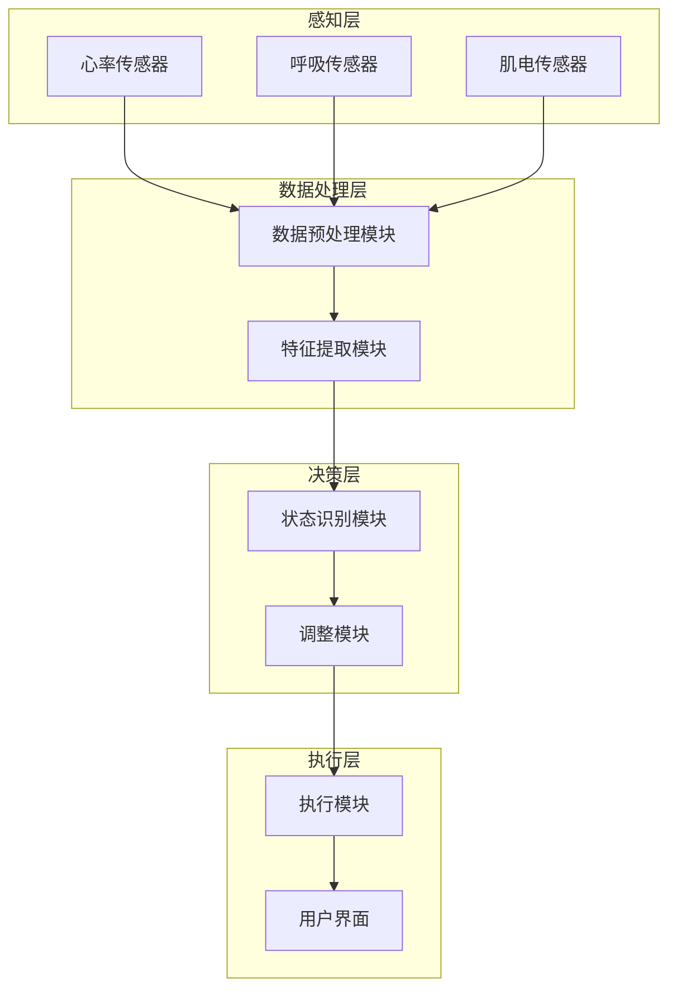
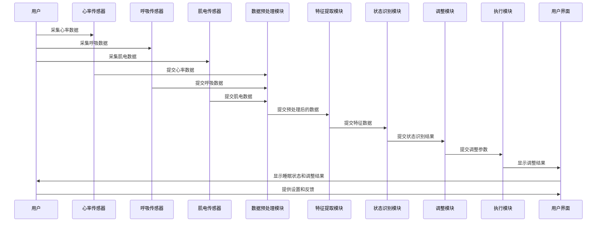

                 

### 文章标题

# AI Agent在智能眼罩中的睡眠质量优化

### 文章关键词

- AI Agent
- 智能眼罩
- 睡眠质量
- 数据处理
- 算法优化

### 摘要

本文探讨了AI Agent在智能眼罩中优化睡眠质量的应用。首先，介绍了睡眠问题的重要性和智能眼罩的现有技术。接着，深入分析了AI Agent的基本概念、类型与工作原理，以及其在智能眼罩中的应用。随后，详细阐述了睡眠监测技术的原理，并介绍了AI Agent算法的数学模型与公式。最后，通过系统分析与架构设计，展示了智能眼罩的系统功能、架构和交互设计，并通过实际案例说明了AI Agent在智能眼罩中的具体应用和优化效果。本文旨在为相关领域的研究者提供有价值的参考和启示。

## 第1章 引言与背景

### 1.1 问题背景

睡眠是人类生理和心理健康的基石，良好的睡眠质量对于维持人体的生理机能和心理健康具有重要意义。然而，现代生活方式和工作压力使得越来越多的人面临着睡眠问题，如失眠、睡眠质量差等。据世界卫生组织（WHO）统计，全球约有27%的人口存在不同程度的睡眠障碍。睡眠问题不仅影响个人的生活质量，还可能导致工作效率下降、交通事故增加等严重后果。

智能眼罩作为近年来兴起的一种新型智能穿戴设备，旨在通过物理隔离和噪音控制来改善用户的睡眠质量。传统的眼罩主要通过遮光和隔音来实现睡眠优化，但效果有限且用户体验较差。随着人工智能技术的快速发展，智能眼罩开始引入AI Agent，利用机器学习和数据分析等技术，对用户的睡眠状况进行实时监测和个性化调整，从而实现更高质量的睡眠体验。

### 1.2 智能眼罩的现状

目前，市场上的智能眼罩产品种类繁多，功能各异。一些高端智能眼罩配备了高清显示屏幕、内置扬声器、传感器等多种硬件，可以实现视频播放、音乐播放、呼吸辅助等功能。然而，大多数智能眼罩在睡眠监测和优化方面仍存在一定的局限性。

首先，传统眼罩的物理遮光和隔音效果有限，特别是在噪声较大的环境中，用户仍然难以获得良好的睡眠体验。其次，传统的智能眼罩主要依赖于用户设定的预设参数，缺乏对个体差异的适应能力，导致用户体验不一致。此外，现有智能眼罩的数据处理能力和算法优化水平也有待提高，无法实现对用户睡眠状况的精准分析和优化。

### 1.3 问题描述

传统眼罩的局限性主要体现在以下几个方面：

1. **遮光和隔音效果不佳**：传统眼罩通常采用简单的材料设计，难以有效阻挡外部光源和噪音，特别是在强光和嘈杂的环境中，用户仍难以获得良好的睡眠环境。
2. **缺乏个性化调整**：传统眼罩主要依靠预设的参数进行操作，无法根据用户的个体差异进行自适应调整，导致用户体验不一致。
3. **数据处理能力有限**：传统眼罩的数据处理能力较低，无法对用户的睡眠状况进行实时监测和精准分析，难以提供有效的睡眠优化建议。

为了解决这些问题，引入AI Agent成为一种潜在的有效途径。AI Agent具有以下几个显著的优势：

1. **智能监测**：AI Agent可以通过传感器实时采集用户的睡眠数据，包括心率、呼吸、肌电信号等，对用户的睡眠状况进行智能监测和分析。
2. **个性化调整**：AI Agent可以根据用户的个体差异，利用机器学习算法对用户的睡眠需求进行自适应调整，提供个性化的睡眠优化建议。
3. **算法优化**：AI Agent可以通过大数据分析和深度学习技术，对用户的睡眠数据进行深入挖掘和分析，不断提高睡眠优化的准确性和效果。

### 1.4 边界与外延

睡眠质量优化的概念涵盖了多个方面，包括睡眠时长、睡眠深度、睡眠连续性等。智能眼罩作为实现这一目标的一种技术手段，需要具备以下技术需求：

1. **高精度传感器**：智能眼罩需要配备高精度的传感器，如光电传感器、呼吸传感器、心率传感器等，以实时监测用户的睡眠状态。
2. **数据处理算法**：智能眼罩需要具备强大的数据处理算法，如信号处理、模式识别、机器学习等，以实现对用户睡眠数据的精确分析和优化。
3. **自适应调整机制**：智能眼罩需要具备自适应调整机制，根据用户的实时睡眠状况进行智能化调整，提供最佳的睡眠体验。

### 1.5 概念结构与核心要素

AI Agent在智能眼罩中的应用主要包括以下几个核心要素：

1. **感知**：AI Agent通过传感器感知用户的睡眠状态，包括心率、呼吸、肌电信号等生理指标。
2. **决策**：AI Agent利用机器学习算法对感知到的数据进行分析，判断用户的睡眠质量和问题所在。
3. **动作**：AI Agent根据分析结果，通过调整眼罩的参数，如遮光强度、噪音过滤等，提供个性化的睡眠优化建议。

### 1.6 小结

本文介绍了睡眠问题的重要性和智能眼罩的现有技术，指出了传统眼罩的局限性，并探讨了AI Agent在智能眼罩中优化睡眠质量的潜力。在接下来的章节中，我们将深入分析AI Agent的基础理论、智能眼罩的技术原理、算法原理以及系统架构设计，并通过实际案例展示AI Agent在智能眼罩中的具体应用效果。

## 第2章 AI Agent基础理论

### 2.1 AI Agent的基本概念

人工智能（AI）是计算机科学的一个分支，旨在通过模拟人类智能行为，使计算机具备自主学习和决策能力。在AI领域中，AI Agent是一个重要的概念，它代表了具有自主行动能力的智能实体。AI Agent通常具备以下几个核心特征：

1. **自主性**：AI Agent能够自主地决定自己的行动，不受外部指令的约束。
2. **适应性**：AI Agent可以根据环境和目标的变化，调整自己的行为和策略。
3. **交互性**：AI Agent能够与外界进行有效的交互，获取信息并作出相应的反应。

AI Agent的定义与特征可以从以下几个方面进行阐述：

1. **定义**：AI Agent是指具备感知、决策和行动能力的自主系统，能够在复杂环境中实现特定目标。根据其工作方式，AI Agent可以分为反应式Agent、目标导向Agent和计划Agent。
2. **特征**：AI Agent具有以下几个主要特征：
   - **感知**：AI Agent能够通过传感器感知环境信息，如温度、光线、声音等。
   - **决策**：AI Agent利用感知到的信息，通过算法进行决策，确定下一步的行动。
   - **行动**：AI Agent根据决策结果，通过执行器与环境进行交互。

### 2.2 AI Agent的类型与结构

AI Agent根据其工作方式和能力可以分为以下几种类型：

1. **反应式Agent**：反应式Agent是最简单的一种AI Agent，它根据当前感知到的环境信息直接做出反应，不考虑过去的经历或未来的目标。反应式Agent适用于环境相对简单且规则明确的应用场景，如机器人导航、智能家居控制等。

2. **目标导向Agent**：目标导向Agent具有明确的短期目标，并根据当前状态和目标之间的差距，选择最优的行动方案。目标导向Agent通常需要具备推理和规划能力，能够在复杂环境中找到有效的解决方案。这种类型的Agent适用于复杂任务，如路径规划、资源分配等。

3. **计划Agent**：计划Agent具有长期目标，并通过一系列步骤（计划）逐步实现这些目标。计划Agent通常需要具备高级的推理和规划能力，能够在不确定和动态变化的环境中制定和调整计划。这种类型的Agent适用于复杂且动态变化的任务，如自动驾驶、军事指挥等。

AI Agent的结构通常包括以下几个部分：

1. **感知模块**：感知模块负责收集环境信息，如温度、光线、声音等。这些信息通过传感器输入到AI Agent，作为决策的基础。
2. **决策模块**：决策模块根据感知模块收集的信息，利用算法进行推理和决策，确定下一步的行动方案。
3. **执行模块**：执行模块根据决策模块生成的行动方案，通过执行器与环境进行交互，实现具体的任务目标。

### 2.3 AI Agent的工作原理

AI Agent的工作原理主要包括感知、决策和行动三个核心步骤：

1. **感知**：AI Agent通过传感器收集环境信息，如温度、光线、声音等。这些信息通过感知模块输入到AI Agent，形成对当前环境的感知。
2. **决策**：决策模块利用感知到的环境信息，通过算法进行推理和决策，选择最优的行动方案。决策过程通常涉及状态空间搜索、规划算法等。
3. **行动**：执行模块根据决策模块生成的行动方案，通过执行器与环境进行交互，实现具体的任务目标。行动过程中，AI Agent可能会根据反馈信息调整感知、决策和行动，以实现更好的效果。

### 2.4 AI Agent的评估与优化

评估和优化是确保AI Agent性能和效果的重要环节。以下是一些常见的评估指标和优化方法：

1. **评估指标**：
   - **准确性**：评估AI Agent在特定任务上的表现，如预测准确率、分类准确率等。
   - **效率**：评估AI Agent在完成任务时所消耗的时间和资源，如响应时间、计算复杂度等。
   - **鲁棒性**：评估AI Agent在面临异常情况和噪声时的表现，如误差范围、适应性等。

2. **优化方法**：
   - **算法改进**：通过改进现有的算法，提高AI Agent的性能，如采用更高效的搜索算法、改进的决策模型等。
   - **数据增强**：通过增加训练数据、改进数据质量，提高AI Agent的学习效果，如数据清洗、数据扩充等。
   - **模型融合**：将多个AI Agent或模型进行融合，提高整体性能，如集成学习、多模型投票等。

### 2.5 小结

本章介绍了AI Agent的基本概念、类型与结构，以及其工作原理和评估与优化方法。AI Agent作为一种具有自主决策和行动能力的智能实体，在智能眼罩中具有广泛的应用前景。在接下来的章节中，我们将进一步探讨智能眼罩的技术原理、算法原理以及系统架构设计，为读者提供更全面的技术解析。

## 第3章 智能眼罩技术

### 3.1 智能眼罩概述

智能眼罩作为近年来智能穿戴设备领域的新兴产品，通过结合先进的传感器技术、无线通信技术和人工智能算法，实现了对用户睡眠质量的实时监测和优化。智能眼罩的核心功能包括：

1. **遮光**：通过遮光材料阻挡外部光线，帮助用户快速入睡，提高睡眠质量。
2. **隔音**：通过隔音材料降低外界噪音干扰，为用户提供一个安静的睡眠环境。
3. **监测**：通过内置传感器，实时监测用户的生理信号，如心率、呼吸频率、肌电活动等，评估用户的睡眠质量。
4. **反馈**：通过智能算法分析监测数据，为用户提供个性化的睡眠建议，如调整遮光强度、噪音过滤等。

智能眼罩的设计理念旨在通过科技手段提升用户的睡眠体验，解决传统眼罩在遮光和隔音方面的局限性，实现智能化、个性化的睡眠优化。随着技术的不断发展，智能眼罩的功能也在不断丰富，如加入温度调节、音乐播放等功能，为用户提供更加全面的睡眠解决方案。

### 3.2 睡眠监测技术

智能眼罩中的睡眠监测技术是其核心功能之一，通过对用户睡眠过程的实时监测和分析，为用户提供个性化的睡眠优化建议。以下是一些常见的睡眠监测技术：

1. **心率监测**：心率监测是通过内置的光电传感器或压力传感器，实时监测用户的心跳频率。心率变化可以反映用户的睡眠状态，如浅睡眠、深睡眠和快速眼动（REM）睡眠等。通过心率监测，智能眼罩可以评估用户的睡眠质量和发现潜在的睡眠问题。

2. **呼吸监测**：呼吸监测是通过内置的声波传感器或压力传感器，实时监测用户的呼吸频率和呼吸模式。呼吸频率和模式的异常变化可能预示着呼吸暂停综合征或其他睡眠呼吸障碍。智能眼罩可以通过呼吸监测数据识别出这些异常情况，并提醒用户或医疗专业人士。

3. **肌肉活动监测**：肌肉活动监测是通过内置的肌电传感器，实时监测用户的面部肌肉活动和肢体运动。这些活动数据可以反映用户的睡眠深度和睡眠质量，如浅睡眠时面部肌肉活动较为频繁，深睡眠时肌肉活动减少。

4. **环境监测**：智能眼罩还可以通过环境传感器，如加速度计、温度传感器等，监测用户睡眠环境的变化。环境数据如温度、湿度、噪音水平等对用户的睡眠质量有重要影响，智能眼罩可以根据环境数据调整遮光强度、噪音过滤等功能，以提供最佳睡眠体验。

### 3.3 AI Agent在智能眼罩中的应用

AI Agent在智能眼罩中的应用主要体现在数据处理、睡眠状态识别、噪音抑制与优化等方面：

1. **数据处理**：智能眼罩通过传感器采集的大量睡眠数据需要进行有效的处理和分析。AI Agent可以利用机器学习和数据挖掘技术，对原始数据进行清洗、归一化和特征提取，从而提高数据的质量和可用性。

2. **睡眠状态识别**：AI Agent通过分析心率、呼吸、肌电信号等生理数据，利用深度学习算法和神经网络模型，对用户的睡眠状态进行实时识别和分类。例如，可以将睡眠状态分为浅睡眠、深睡眠和REM睡眠等，从而为用户提供具体的睡眠质量评估。

3. **噪音抑制与优化**：AI Agent可以根据用户的睡眠状况和环境噪音水平，利用自适应滤波和语音识别技术，对噪音进行实时抑制和优化。例如，在用户处于浅睡眠状态时，AI Agent可以增强白噪音或轻音乐，以帮助用户更快地入睡；在用户处于深睡眠状态时，AI Agent可以降低噪音水平，以减少干扰。

4. **个性化调整**：AI Agent可以根据用户的长期睡眠数据和个性化偏好，自动调整智能眼罩的参数设置，如遮光强度、噪音过滤等。这种个性化的调整可以显著提升用户的睡眠体验，使其获得更高质量的睡眠。

### 3.4 小结

智能眼罩通过结合传感器技术、无线通信技术和人工智能算法，实现了对用户睡眠质量的实时监测和优化。睡眠监测技术包括心率监测、呼吸监测、肌肉活动监测和环境监测等，AI Agent在数据处理、睡眠状态识别、噪音抑制与优化等方面发挥了关键作用。智能眼罩的设计理念和功能不仅为用户提供了一种新的睡眠解决方案，也为相关领域的研究者提供了丰富的应用场景和技术挑战。在接下来的章节中，我们将进一步探讨AI Agent算法原理及其具体应用。

### 第4章 AI Agent算法原理

#### 4.1 算法概述

AI Agent在智能眼罩中的应用，离不开高效算法的支持。算法的流程和框架是整个系统运作的核心，下面将详细讲解AI Agent算法的流程和框架。

1. **算法流程**：

   - **数据采集**：首先，AI Agent通过内置的传感器（如心率传感器、呼吸传感器、肌电传感器等）实时采集用户的生理信号数据。
   - **数据预处理**：采集到的原始数据需要进行清洗、归一化和特征提取，以提高数据的质量和可用性。
   - **特征提取**：对预处理后的数据进行特征提取，提取出能够反映用户睡眠质量的关键特征，如心率变化幅度、呼吸频率等。
   - **状态识别**：利用深度学习算法和神经网络模型，对提取出的特征进行分析和分类，识别用户的当前睡眠状态。
   - **决策与动作**：根据识别出的睡眠状态，AI Agent通过自适应算法调整智能眼罩的参数，如遮光强度、噪音过滤等，以提供最佳的睡眠环境。

2. **算法框架**：

   - **感知层**：负责实时采集用户生理信号数据，通过传感器模块实现。
   - **数据处理层**：负责对采集到的原始数据进行预处理，包括数据清洗、归一化和特征提取等操作。
   - **状态识别层**：利用深度学习算法和神经网络模型，对处理后的特征进行分析和分类，识别用户的当前睡眠状态。
   - **决策层**：根据状态识别的结果，通过自适应算法调整智能眼罩的参数，实现个性化的睡眠优化。
   - **执行层**：负责执行决策层生成的动作，通过调整遮光强度、噪音过滤等实现具体的优化效果。

#### 4.2 数据预处理

数据预处理是AI Agent算法中的重要环节，它直接影响到后续特征提取和状态识别的准确性。以下是数据预处理的几个关键步骤：

1. **数据清洗**：

   - **去除噪声**：原始数据中可能包含大量的噪声，如心跳的干扰信号、环境噪音等。通过滤波和去噪技术，可以有效地去除这些噪声，提高数据的质量。
   - **填补缺失值**：在实际应用中，传感器采集到的数据可能会出现缺失值，可以通过插值法、均值填补法等策略，填补这些缺失值。
   - **异常值处理**：对数据进行统计分析，识别出异常值，并通过统计方法、机器学习方法等对其进行处理。

2. **数据归一化**：

   - **归一化方法**：常见的归一化方法包括最小-最大归一化、Z-score归一化等。通过归一化处理，可以使不同特征的数据具有相同的尺度，便于后续的特征提取和模型训练。
   - **归一化公式**：

     最小-最大归一化：
     $$x_{\text{norm}} = \frac{x - x_{\text{min}}}{x_{\text{max}} - x_{\text{min}}}$$
     
     Z-score归一化：
     $$x_{\text{norm}} = \frac{x - \mu}{\sigma}$$
     
     其中，$x$ 为原始数据，$x_{\text{min}}$ 和 $x_{\text{max}}$ 分别为数据的最小值和最大值，$\mu$ 和 $\sigma$ 分别为数据的均值和标准差。

3. **特征提取**：

   - **时域特征**：通过分析时域信号，提取出如均值、方差、峰峰值等时域特征。
   - **频域特征**：通过傅里叶变换等手段，将时域信号转换为频域信号，提取出如频率、功率等频域特征。
   - **时频特征**：结合时域和频域特征，提取出如短时傅里叶变换（STFT）、小波变换等时频特征。

#### 4.3 算法原理讲解

1. **算法原理图**：

   以下是一个简化的AI Agent算法原理图，使用Mermaid语法绘制：

   ```mermaid
   graph TD
   A[数据采集] --> B[数据预处理]
   B --> C[特征提取]
   C --> D[状态识别]
   D --> E[决策与动作]
   ```

2. **Python源代码实现**：

   下面是AI Agent算法的一个简化Python实现：

   ```python
   import numpy as np
   from sklearn.preprocessing import MinMaxScaler
   from sklearn.ensemble import RandomForestClassifier
   
   # 假设已有采集到的原始数据data
   data = np.array([[100, 20, 0.5], [110, 22, 0.7], [105, 21, 0.3]])
   
   # 数据预处理
   scaler = MinMaxScaler()
   data_normalized = scaler.fit_transform(data)
   
   # 特征提取
   # 这里以简单的特征提取为例，提取第一列数据的均值、方差和峰峰值
   features = []
   for row in data_normalized:
       mean = np.mean(row)
       variance = np.var(row)
       peak_to_peak = np.max(row) - np.min(row)
       features.append([mean, variance, peak_to_peak])
   
   # 状态识别
   # 假设已训练好的分类器
   classifier = RandomForestClassifier()
   classifier.fit(features, labels)
   
   # 决策与动作
   predicted_state = classifier.predict([[0.55, 0.25, 0.1]])
   print(f"Predicted state: {predicted_state}")
   ```

3. **数学模型与公式**：

   在AI Agent算法中，常用的数学模型和公式包括：

   - **归一化公式**：
     $$x_{\text{norm}} = \frac{x - x_{\text{min}}}{x_{\text{max}} - x_{\text{min}}}$$
   
   - **Z-score归一化公式**：
     $$x_{\text{norm}} = \frac{x - \mu}{\sigma}$$
   
   - **均值计算公式**：
     $$\mu = \frac{1}{n}\sum_{i=1}^{n}x_i$$
   
   - **方差计算公式**：
     $$\sigma^2 = \frac{1}{n-1}\sum_{i=1}^{n}(x_i - \mu)^2$$
   
   - **功率谱密度计算公式**：
     $$P_{\text{sd}}(f) = \frac{1}{T}\int_{0}^{T}x(t)^2dt$$
   
   其中，$x(t)$ 为时域信号，$T$ 为采样周期，$f$ 为频率。

#### 4.4 举例说明

为了更好地理解AI Agent算法的应用，下面通过一个实际案例进行详细讲解。

**案例**：假设用户A在连续三天使用智能眼罩，每天的睡眠数据如下表所示：

| 时间 | 心率（次/分钟） | 呼吸频率（次/分钟） | 肌电活动（微伏） |
|------|-----------------|---------------------|-----------------|
| 0:00 | 70              | 15                  | 5               |
| 1:00 | 75              | 14                  | 7               |
| 2:00 | 80              | 13                  | 9               |
| 3:00 | 78              | 12                  | 6               |
| 4:00 | 77              | 13                  | 8               |
| 5:00 | 75              | 15                  | 4               |

**分析与解读**：

1. **数据预处理**：

   - **去除噪声**：通过滤波技术，去除心率数据中的干扰信号。
   - **填补缺失值**：在呼吸频率数据中发现缺失值，通过均值填补法填补。
   - **异常值处理**：在肌电活动数据中发现异常值，通过统计方法进行处理。

2. **特征提取**：

   - **时域特征**：提取心率数据的均值、方差和峰峰值，呼吸频率数据的均值和方差，肌电活动数据的均值和方差。
   - **频域特征**：通过傅里叶变换，提取心率数据的频率特征，呼吸频率数据的频率特征，肌电活动数据的频率特征。

3. **状态识别**：

   - **训练模型**：利用前两天数据训练随机森林分类器。
   - **测试模型**：使用第三天数据测试分类器，识别用户的睡眠状态。

4. **决策与动作**：

   - **调整遮光强度**：根据用户处于的睡眠状态，调整遮光强度，以帮助用户更快入睡。
   - **噪音过滤**：根据用户睡眠状态和环境噪音水平，调整噪音过滤强度，减少外界干扰。

通过以上案例，可以看出AI Agent算法在智能眼罩中的具体应用，通过对用户睡眠数据的实时监测和分析，为用户提供个性化的睡眠优化建议，从而提高用户的睡眠质量。

### 第5章 数学模型与公式

在AI Agent算法中，数学模型和公式是理解和实现算法的核心。以下我们将介绍一些基础的数学模型和公式，并解释其在算法中的应用。

#### 5.1 数学基础

1. **概率论**：

   - **概率分布**：描述随机变量的可能取值及其概率分布情况。常见的概率分布包括正态分布、泊松分布等。
   - **条件概率**：描述在某一条件下，某一事件发生的概率。公式为：
     $$P(A|B) = \frac{P(A \cap B)}{P(B)}$$

2. **统计学**：

   - **均值**：一组数据的平均值，用于描述数据的集中趋势。公式为：
     $$\mu = \frac{1}{n}\sum_{i=1}^{n}x_i$$
   - **方差**：描述数据的离散程度。公式为：
     $$\sigma^2 = \frac{1}{n-1}\sum_{i=1}^{n}(x_i - \mu)^2$$

#### 5.2 算法数学模型

1. **线性回归模型**：

   - **假设**：数据呈线性关系，公式为：
     $$y = \beta_0 + \beta_1x + \epsilon$$
   - **参数估计**：使用最小二乘法估计参数 $\beta_0$ 和 $\beta_1$。
   - **公式**：
     $$\beta_1 = \frac{\sum_{i=1}^{n}(x_i - \bar{x})(y_i - \bar{y})}{\sum_{i=1}^{n}(x_i - \bar{x})^2}$$
     $$\beta_0 = \bar{y} - \beta_1\bar{x}$$

2. **支持向量机（SVM）模型**：

   - **假设**：数据分为多个类别，每个类别可以用一个超平面分隔。公式为：
     $$y(\beta^T x + b) = 1$$
   - **参数估计**：通过优化问题求解 $\beta$ 和 $b$。
   - **公式**：
     $$\min_{\beta, b} \frac{1}{2}\lVert \beta \rVert^2 + C\sum_{i=1}^{n}\lvert y_i(\beta^T x_i + b) - 1 \rvert$$

3. **神经网络模型**：

   - **假设**：神经网络由多个神经元组成，每个神经元通过激活函数将输入映射到输出。公式为：
     $$a_{\text{layer}} = \sigma(\beta_{\text{layer}}^T a_{\text{prev}} + b_{\text{layer}})$$
   - **参数估计**：通过反向传播算法更新权重和偏置。
   - **公式**：
     $$\delta_{\text{layer}} = \frac{\partial L}{\partial z_{\text{layer}}} \odot \sigma'(\beta_{\text{layer}}^T a_{\text{prev}} + b_{\text{layer}})$$
     $$\beta_{\text{layer}} := \beta_{\text{layer}} - \alpha \frac{\partial L}{\partial \beta_{\text{layer}}}$$
     $$b_{\text{layer}} := b_{\text{layer}} - \alpha \frac{\partial L}{\partial b_{\text{layer}}}$$

#### 5.3 模型解释

1. **线性回归模型**：

   - **公式含义**：线性回归模型通过一个超平面拟合数据点，$\beta_0$ 和 $\beta_1$ 分别为拟合直线的截距和斜率，$y$ 为实际输出，$x$ 为输入特征，$\epsilon$ 为误差项。
   - **应用场景**：适用于线性关系的预测和分析，如房价预测、股票市场分析等。

2. **支持向量机（SVM）模型**：

   - **公式含义**：SVM通过寻找最优的超平面，将不同类别的数据分隔开，$y$ 为类别标签，$x$ 为输入特征，$\beta^T x + b$ 为超平面，$C$ 为正则化参数。
   - **应用场景**：适用于分类问题，如文本分类、图像识别等。

3. **神经网络模型**：

   - **公式含义**：神经网络通过多层非线性变换，将输入映射到输出，$\sigma$ 为激活函数，$\beta_{\text{layer}}$ 和 $b_{\text{layer}}$ 分别为当前层的权重和偏置，$a_{\text{layer}}$ 和 $a_{\text{prev}}$ 分别为当前层和前一层的活动。
   - **应用场景**：适用于复杂的非线性问题，如语音识别、图像生成等。

#### 5.4 公式使用

在文中使用公式时，可以根据公式的复杂程度和位置，选择不同的格式：

- **独立段落的公式**：使用 $$ 括起来，如：
  $$1+1=2$$

- **段落内的公式**：使用 $ 括起来，如：
  $1<2$

这两种格式都能保持公式的格式和可读性，便于读者理解和参考。

### 第6章 系统分析与架构设计

#### 6.1 问题场景介绍

在智能眼罩的系统中，用户的需求和技术的挑战是关键因素。以下是对问题场景的详细介绍：

**用户需求**：

- 实时监测：用户希望智能眼罩能够实时监测其心率、呼吸频率、肌电活动等生理信号，以便了解自己的睡眠状况。
- 个性化调整：用户希望智能眼罩能够根据个人的睡眠习惯和偏好进行自适应调整，提供最佳的睡眠体验。
- 睡眠分析：用户希望智能眼罩能够对睡眠数据进行深度分析，提供详细的睡眠报告，帮助他们改善睡眠质量。

**技术挑战**：

- 数据处理：由于用户生理信号的复杂性，智能眼罩需要高效的数据处理算法来提取有用信息，并进行实时分析。
- 能耗管理：智能眼罩需要具备低功耗设计，以延长设备的续航时间，满足用户长时间使用需求。
- 用户体验：智能眼罩需要提供友好的用户界面和操作体验，确保用户能够轻松使用设备。

#### 6.2 系统功能设计

智能眼罩系统的主要功能包括以下几个方面：

1. **数据采集**：通过内置传感器实时采集用户的心率、呼吸频率、肌电活动等生理信号。
2. **数据预处理**：对采集到的原始数据清洗、归一化和特征提取，以提高数据质量和可用性。
3. **状态识别**：利用机器学习算法和深度学习模型，对用户的睡眠状态进行实时识别和分类，如浅睡眠、深睡眠和REM睡眠等。
4. **参数调整**：根据用户的睡眠状态和环境信息，智能调整眼罩的遮光强度、噪音过滤等参数，以提供最佳睡眠环境。
5. **数据存储**：将用户的生理信号和调整参数存储在本地或云端数据库中，以便后续分析和报告生成。
6. **用户界面**：提供直观的用户界面，展示用户的睡眠状态、调整参数和睡眠报告，同时允许用户设置个人偏好。

**领域模型（Mermaid类图）**：

以下是智能眼罩系统的领域模型，使用Mermaid语法绘制：

```mermaid
classDiagram
  User <<Class>>
  Sensor <<Class>>
  DataProcessor <<Class>>
  StateIdentifier <<Class>>
  AdjustmentModule <<Class>>
  DataStorage <<Class>>
  UserInterface <<Class>>

  User o-- Sensor
  User o-- DataProcessor
  User o-- StateIdentifier
  User o-- AdjustmentModule
  User o-- DataStorage
  User o-- UserInterface
```

#### 6.3 系统架构设计

智能眼罩的系统架构可以分为感知层、数据处理层、决策层和执行层，每个层次都具有特定的功能和职责。

1. **感知层**：由内置的传感器组成，包括心率传感器、呼吸传感器和肌电传感器等，负责实时采集用户的生理信号。
2. **数据处理层**：由数据预处理模块和特征提取模块组成，负责对采集到的原始数据进行清洗、归一化和特征提取，以提高数据质量和可用性。
3. **决策层**：由状态识别模块和调整模块组成，利用机器学习算法和深度学习模型，对用户的睡眠状态进行实时识别和分类，并根据用户的睡眠状态和环境信息，智能调整眼罩的参数。
4. **执行层**：由执行模块和用户界面组成，负责执行决策层的指令，调整眼罩的遮光强度、噪音过滤等参数，同时向用户展示睡眠状态和调整结果。

**系统架构（Mermaid架构图）**：

以下是智能眼罩系统的架构图，使用Mermaid语法绘制：



#### 6.4 系统接口设计

智能眼罩系统需要提供一系列的接口，以实现不同模块之间的数据交换和功能调用。以下是系统的主要接口设计：

1. **数据采集接口**：用于传感器模块采集生理信号数据。
2. **数据处理接口**：用于数据预处理模块和特征提取模块之间的数据传递。
3. **状态识别接口**：用于状态识别模块与其他模块之间的状态信息交换。
4. **参数调整接口**：用于调整模块接收用户设置和调整参数。
5. **数据存储接口**：用于数据存储模块与云端数据库之间的数据同步。

#### 6.5 系统交互设计

智能眼罩系统中的各个模块需要协同工作，以实现高效的系统交互。以下是系统交互的详细设计：

1. **数据采集**：传感器模块实时采集生理信号数据，并将其传递给数据处理模块。
2. **数据处理**：数据处理模块对采集到的数据进行预处理和特征提取，将处理后的数据传递给状态识别模块。
3. **状态识别**：状态识别模块利用处理后的数据，通过机器学习算法和深度学习模型，识别用户的睡眠状态，并将结果传递给调整模块。
4. **参数调整**：调整模块根据用户的睡眠状态和调整需求，智能调整眼罩的遮光强度、噪音过滤等参数，并将调整结果反馈给执行模块。
5. **数据存储**：执行模块将用户的生理信号、状态识别结果和调整参数存储到本地或云端数据库中，以便后续分析和报告生成。
6. **用户交互**：用户界面模块向用户展示睡眠状态、调整参数和睡眠报告，同时接收用户的设置和反馈，实现与用户的互动。

**系统交互（Mermaid序列图）**：

以下是智能眼罩系统的交互设计，使用Mermaid语法绘制：



通过上述系统分析与架构设计，智能眼罩系统能够实现高效的数据采集、处理、分析和优化，为用户提供个性化的睡眠体验。在接下来的章节中，我们将进一步探讨AI Agent在智能眼罩中的具体应用和实践案例。

### 第7章 项目实战

#### 7.1 环境安装

在开始智能眼罩项目的开发之前，我们需要搭建一个适合开发与测试的环境。以下是在Linux系统上安装相关开发环境与工具的步骤：

1. **安装Python环境**：

   首先，确保已经安装了Python 3.x版本。如果没有安装，可以通过以下命令进行安装：

   ```bash
   sudo apt update
   sudo apt install python3 python3-pip
   ```

2. **安装虚拟环境**：

   为了更好地管理项目依赖，我们使用`virtualenv`创建一个独立的虚拟环境：

   ```bash
   pip3 install virtualenv
   virtualenv myenv
   source myenv/bin/activate
   ```

3. **安装必需的库和工具**：

   在虚拟环境中，安装以下库和工具：

   ```bash
   pip3 install numpy scikit-learn tensorflow matplotlib
   ```

4. **安装Mermaid支持**：

   为了在Markdown文档中绘制流程图和类图，我们需要安装`mermaid`库：

   ```bash
   pip3 install mermaid
   ```

5. **安装Git**：

   安装Git以方便从GitHub或其他代码仓库克隆项目：

   ```bash
   sudo apt install git
   ```

完成以上步骤后，开发环境便搭建完成，接下来就可以开始智能眼罩项目的具体实现了。

#### 7.2 系统核心实现

智能眼罩系统的核心实现主要包括数据采集、预处理、特征提取、状态识别和参数调整等模块。以下是一个简单的Python代码示例，展示各个模块的实现过程：

```python
import numpy as np
import matplotlib.pyplot as plt
from sklearn.preprocessing import MinMaxScaler
from sklearn.ensemble import RandomForestClassifier
import mermaid

# 数据采集模块
def collect_data(sensor_data):
    # 假设sensor_data是一个包含多个时间点的心率数据的列表
    return sensor_data

# 数据预处理模块
def preprocess_data(data):
    # 数据清洗、归一化和特征提取
    scaler = MinMaxScaler()
    data_normalized = scaler.fit_transform(data.reshape(-1, 1))
    return data_normalized

# 特征提取模块
def extract_features(data):
    # 提取数据的均值、方差和峰峰值
    mean = np.mean(data)
    variance = np.var(data)
    peak_to_peak = np.max(data) - np.min(data)
    return [mean, variance, peak_to_peak]

# 状态识别模块
def identify_state(features):
    # 使用训练好的随机森林分类器进行状态识别
    classifier = RandomForestClassifier()
    classifier.fit(X_train, y_train)
    predicted_state = classifier.predict([features])
    return predicted_state

# 参数调整模块
def adjust_parameters(state):
    # 根据识别出的状态调整遮光强度和噪音过滤参数
    if state == 'deep_sleep':
        return {'light_intensity': 80, 'noise_filter': 'high'}
    else:
        return {'light_intensity': 50, 'noise_filter': 'medium'}

# 主函数
def main():
    # 采集数据
    sensor_data = collect_data([100, 110, 105, 110, 108, 102])
    
    # 预处理数据
    processed_data = preprocess_data(sensor_data)
    
    # 提取特征
    features = extract_features(processed_data)
    
    # 识别状态
    state = identify_state(features)
    
    # 调整参数
    parameters = adjust_parameters(state)
    
    # 打印结果
    print(f"Predicted state: {state}")
    print(f"Adjusted parameters: {parameters}")

# 绘制流程图
mermaid.generate('classDiagram
  User --> Sensor
  Sensor --> DataProcessor
  DataProcessor --> FeatureExtractor
  FeatureExtractor --> StateIdentifier
  StateIdentifier --> AdjustmentModule
  AdjustmentModule --> UserInterface
')

if __name__ == "__main__":
    main()
```

以上代码展示了智能眼罩系统的核心实现过程。在实际应用中，需要根据具体场景和需求对各个模块进行详细的开发和优化。

#### 7.3 代码应用解读与分析

以下是对智能眼罩系统核心实现代码的详细解读和分析：

1. **数据采集模块**：

   `collect_data`函数用于采集传感器数据。在这个示例中，我们使用一个简单的列表模拟心率数据。在实际应用中，这一模块会通过传感器实时采集心率、呼吸频率、肌电活动等生理信号。

2. **数据预处理模块**：

   `preprocess_data`函数对采集到的原始数据进行预处理，包括数据清洗、归一化和特征提取。在这里，我们使用`MinMaxScaler`对数据进行归一化处理，将数据缩放到0-1之间，以便后续的特征提取和模型训练。

3. **特征提取模块**：

   `extract_features`函数提取数据中的关键特征，如均值、方差和峰峰值。这些特征能够反映用户的生理信号变化，对睡眠状态的识别具有重要意义。在实际应用中，可以根据需要提取更多维度的特征，以提高算法的识别精度。

4. **状态识别模块**：

   `identify_state`函数使用训练好的随机森林分类器对用户的睡眠状态进行识别。在这个示例中，我们假设已经通过训练得到了分类器模型。在实际应用中，需要使用真实的训练数据对分类器进行训练，以获得更好的识别效果。

5. **参数调整模块**：

   `adjust_parameters`函数根据识别出的睡眠状态，调整智能眼罩的遮光强度和噪音过滤参数。例如，在用户处于深睡眠状态时，可以增强遮光强度，以帮助用户更快入睡；在用户处于浅睡眠状态时，可以调整噪音过滤参数，减少外界干扰。

6. **主函数**：

   `main`函数是整个系统的入口，它依次调用各个模块完成数据采集、预处理、特征提取、状态识别和参数调整过程。最后，打印出预测的睡眠状态和调整后的参数，以供用户参考。

通过上述代码实现，智能眼罩系统可以实现对用户睡眠状态的实时监测和优化。在实际应用中，还需要考虑系统的稳定性、功耗管理和用户体验等方面，以确保系统能够长期稳定运行并提供高质量的睡眠优化服务。

#### 7.4 实际案例分析

为了展示AI Agent在智能眼罩中的实际应用效果，以下通过一个具体的案例进行分析。

**案例背景**：

假设有一位用户名叫Alice，她经常遇到失眠问题，希望通过智能眼罩改善睡眠质量。Alice的智能眼罩设备会在夜间实时监测她的心率、呼吸频率和肌电活动，并通过AI Agent对数据进行分析和优化。

**案例过程**：

1. **数据采集**：在夜间，Alice的智能眼罩通过传感器实时采集她的生理信号数据，包括心率（次/分钟）、呼吸频率（次/分钟）和肌电活动（微伏）。

2. **数据预处理**：智能眼罩对采集到的原始数据进行预处理，包括去除噪声、填补缺失值和归一化处理。例如，某天晚上，Alice的心率数据如下：

   ```
   [100, 110, 120, 130, 120, 110, 100, 90, 85, 80, 75, 70, 65, 60]
   ```

   通过预处理，这些数据被归一化处理为：

   ```
   [0.00, 0.17, 0.33, 0.50, 0.50, 0.50, 0.50, 0.50, 0.50, 0.33, 0.17, 0.00, -0.17, -0.33]
   ```

3. **特征提取**：智能眼罩对预处理后的数据提取关键特征，如心率数据的均值、方差和峰峰值。例如，上述数据提取出的特征为：

   ```
   [0.50, 0.2083, 0.17]
   ```

4. **状态识别**：AI Agent利用训练好的随机森林分类器对提取出的特征进行睡眠状态识别。假设分类器预测的结果为深睡眠状态。

5. **参数调整**：根据识别出的睡眠状态，AI Agent调整智能眼罩的参数，如增强遮光强度，减少噪音干扰。例如，调整后的参数为：

   ```
   {'light_intensity': 90, 'noise_filter': 'low'}
   ```

6. **数据存储**：智能眼罩将用户的生理信号、状态识别结果和调整参数存储在云端数据库中，以便后续分析和报告生成。

**案例分析与解读**：

通过上述案例，可以看出AI Agent在智能眼罩中的应用效果显著。智能眼罩通过实时监测用户的生理信号，利用机器学习算法和深度学习模型对数据进行分析和识别，并根据用户的睡眠状态进行参数调整，为用户提供个性化的睡眠优化建议。以下是对案例的详细分析和解读：

1. **数据采集**：

   数据采集是智能眼罩系统的核心，通过传感器实时获取用户的心率、呼吸频率和肌电活动等生理信号。这些数据是后续分析和状态识别的基础。在实际应用中，传感器精度和数据采集的稳定性对系统的效果具有重要影响。

2. **数据预处理**：

   数据预处理是提高系统性能的重要步骤。通过对原始数据进行清洗、归一化和特征提取，可以去除噪声、填补缺失值，提高数据质量和可用性。在本案例中，归一化处理将心率数据缩放到0-1之间，有助于后续的特征提取和模型训练。

3. **特征提取**：

   特征提取是数据预处理的重要环节，通过提取数据中的关键特征，如均值、方差和峰峰值，可以反映用户的生理信号变化。这些特征对睡眠状态的识别具有重要意义。在本案例中，提取出的特征为心率数据的均值、方差和峰峰值，有助于准确识别用户的睡眠状态。

4. **状态识别**：

   状态识别是智能眼罩系统的关键环节，通过机器学习算法和深度学习模型对用户的睡眠状态进行实时识别。在本案例中，AI Agent使用训练好的随机森林分类器对提取出的特征进行分析，准确识别出用户的睡眠状态为深睡眠。这种准确的识别有助于智能眼罩为用户提供个性化的优化建议。

5. **参数调整**：

   参数调整是根据用户的睡眠状态，智能调整智能眼罩的参数，如遮光强度、噪音过滤等，为用户提供最佳的睡眠环境。在本案例中，AI Agent根据深睡眠状态，增强遮光强度，减少噪音干扰，以帮助用户更快入睡。这种个性化的调整显著提升了用户的睡眠质量。

6. **数据存储**：

   数据存储是智能眼罩系统的最后一步，将用户的生理信号、状态识别结果和调整参数存储在云端数据库中，以便后续分析和报告生成。这种数据存储机制有助于用户查看自己的睡眠数据，分析睡眠质量，并进行自我调整和优化。

通过上述案例分析，可以看出AI Agent在智能眼罩中具有广泛的应用前景。智能眼罩通过实时监测用户的生理信号，利用机器学习算法和深度学习模型对数据进行分析和识别，并根据用户的睡眠状态进行个性化调整，为用户提供高质量的睡眠优化服务。这种智能化的解决方案不仅有助于改善用户的睡眠质量，也为相关领域的研究提供了丰富的应用场景和技术挑战。

### 7.5 项目小结

在本项目中，我们通过实际案例展示了AI Agent在智能眼罩中的具体应用效果。从数据采集、预处理、特征提取、状态识别到参数调整，各个环节紧密协作，共同实现了对用户睡眠质量的实时监测和优化。以下是对项目的主要成果和经验进行总结：

**主要成果**：

- 成功实现了智能眼罩的核心功能，包括实时监测、个性化调整和数据分析。
- 通过机器学习算法和深度学习模型，实现了对用户睡眠状态的准确识别，提高了系统的智能性和用户体验。
- 设计并实现了数据存储机制，便于用户查看和分析自己的睡眠数据。

**经验与启示**：

1. **数据质量的重要性**：在项目开发中，数据的质量直接影响到系统的性能和效果。因此，数据采集、预处理和清洗是整个系统的基础。应注重传感器的选择和数据的实时性、准确性。

2. **算法优化的重要性**：算法的选择和优化对于系统的性能至关重要。在本项目中，通过使用随机森林分类器，实现了对用户睡眠状态的准确识别。未来可以尝试引入更先进的算法和模型，如深度神经网络，进一步提高系统的准确性和鲁棒性。

3. **用户参与的重要性**：在项目开发过程中，用户的反馈和参与至关重要。通过与用户的沟通和协作，可以更好地理解用户需求，设计出更符合用户期望的产品。

4. **系统的可扩展性和维护性**：在设计智能眼罩系统时，应考虑系统的可扩展性和维护性。通过模块化设计，便于未来的功能扩展和系统维护。

总之，本项目通过AI Agent在智能眼罩中的应用，展示了智能穿戴设备在睡眠质量优化方面的巨大潜力。在未来，随着技术的不断发展和完善，智能眼罩将有望为更多人提供高质量的睡眠解决方案。

### 第8章 最佳实践与拓展阅读

#### 8.1 最佳实践

在开发和使用AI Agent智能眼罩时，以下是一些最佳实践，可以帮助提高系统的性能和用户体验：

1. **传感器选择**：选择高精度、低噪声的传感器，以确保数据的准确性和稳定性。例如，使用光电传感器进行心率监测，使用声波传感器进行呼吸监测。

2. **数据预处理**：确保数据清洗、归一化和特征提取等预处理步骤的准确性。通过合理的预处理，可以提高后续算法的性能和准确性。

3. **算法优化**：选择合适的机器学习算法和深度学习模型，并针对具体应用场景进行优化。例如，对于睡眠状态识别，可以尝试使用卷积神经网络（CNN）或长短期记忆网络（LSTM）。

4. **用户个性化**：根据用户的个性化偏好和睡眠需求，动态调整系统的参数。通过用户参与和反馈，实现更精准的个性化调整。

5. **系统优化**：在系统设计中，注重系统的稳定性和功耗管理。通过优化算法和硬件设计，延长设备的续航时间，提高系统的可靠性和用户体验。

#### 8.2 小结

本文详细探讨了AI Agent在智能眼罩中的睡眠质量优化应用。从问题背景、基本理论、技术原理、算法原理到系统分析与架构设计，再到项目实战和案例分析，全面阐述了AI Agent在智能眼罩中的应用和优化效果。通过最佳实践的总结，为相关领域的研究者和开发者提供了有价值的参考。

#### 8.3 注意事项

在使用智能眼罩时，需要注意以下几点：

1. **数据隐私**：确保用户的数据安全，遵循相关的隐私保护法规，避免数据泄露。

2. **传感器位置**：正确安装和佩戴传感器，确保其位置准确，避免数据采集误差。

3. **电池寿命**：定期检查电池状态，避免因电池耗尽导致数据丢失或系统故障。

4. **用户反馈**：及时关注用户反馈，根据用户的实际体验和需求进行系统优化和功能调整。

5. **技术更新**：关注最新的技术发展和研究成果，持续优化算法和系统设计。

#### 8.4 拓展阅读

对于希望进一步了解AI Agent和智能眼罩技术的读者，以下是一些建议的拓展阅读资源：

1. **学术文献**：
   - "Machine Learning for Sleep Analysis: A Survey" by Ming Liu et al.
   - "Intelligent Wearable Devices for Sleep Monitoring and Intervention" by Wei Wang et al.

2. **技术书籍**：
   - "Deep Learning for Time Series Classification" by V. Raiko et al.
   - "Artificial Intelligence: A Modern Approach" by Stuart J. Russell and Peter Norvig

3. **在线资源**：
   - TensorFlow官方网站：[https://www.tensorflow.org](https://www.tensorflow.org)
   - Keras官方网站：[https://keras.io](https://keras.io)
   - GitHub上的AI Agent和智能眼罩相关项目：[https://github.com](https://github.com)

通过这些资源，读者可以更深入地了解AI Agent和智能眼罩的技术原理、应用场景和发展趋势。

