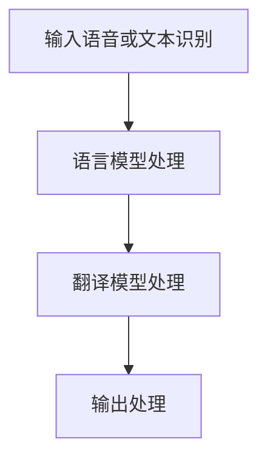
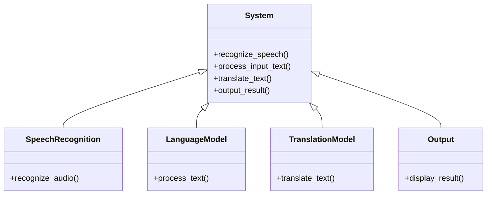
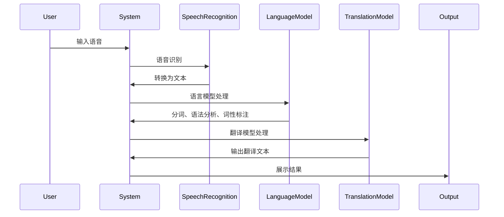
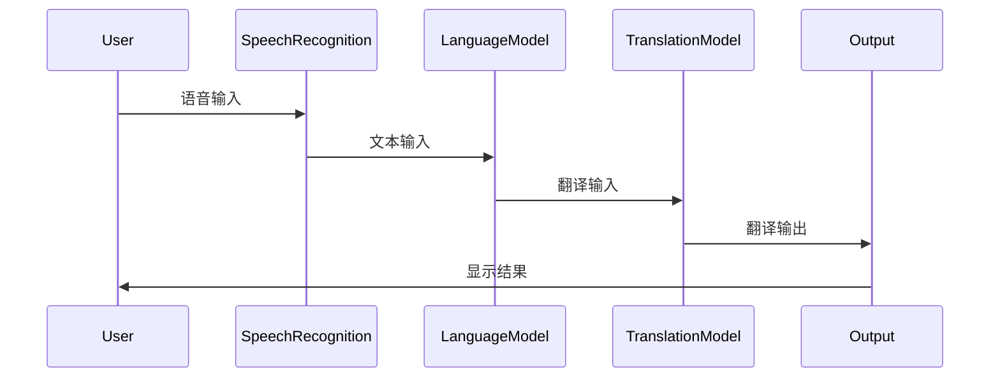

                 


### 文章标题：AI Agent在智能眼镜中的实时翻译功能

#### 关键词：
- AI Agent
- 智能眼镜
- 实时翻译
- 自然语言处理
- 系统架构设计

#### 摘要：
本文探讨了AI Agent在智能眼镜中实现实时翻译功能的原理、架构设计与实现。通过详细分析AI Agent和智能眼镜的技术背景，本文介绍了实时翻译技术的核心算法原理，并结合Python代码与数学模型进行讲解。随后，文章介绍了系统功能设计、架构设计和实现过程，并提供了实际案例分析。最后，文章总结了最佳实践和注意事项，展望了未来发展趋势。

----------------------------------------------------------------

### 引言与背景

#### 1.1 问题背景

随着全球化进程的加速，跨文化交流日益频繁。然而，语言障碍仍然是沟通中的一大难题。智能眼镜作为一种新兴的智能设备，具有便携、直观和实时交互的特点，为解决语言障碍提供了新的可能性。AI Agent作为人工智能的核心组件，具备强大的自然语言处理和机器学习能力，使其成为智能眼镜实现实时翻译功能的重要技术支撑。

#### 1.2 问题描述

本文旨在探讨如何利用AI Agent在智能眼镜中实现实时翻译功能。具体问题包括：
- AI Agent如何捕获和识别用户的语音或文字输入？
- 实时翻译算法如何高效地处理不同语言之间的翻译？
- 如何设计一个高效、稳定且低延迟的实时翻译系统？
- 系统在实际应用中面临哪些挑战和优化策略？

#### 1.3 问题解决

本文将通过以下步骤解决问题：
- 引言与背景介绍
- 核心概念与联系阐述
- 实时翻译算法原理讲解
- 数学模型与公式详细讲解
- 系统分析与架构设计方案
- 项目实战与案例分析
- 最佳实践、小结与拓展阅读

#### 1.4 边界与外延

本文的边界主要关注AI Agent在智能眼镜中的实时翻译功能。外延包括：
- AI Agent在其他智能设备中的应用
- 其他实时翻译技术（如机器翻译API）的应用场景
- 多语言交互系统的设计与实现

----------------------------------------------------------------

### 核心概念与联系

#### 2.1 AI Agent

AI Agent是一种基于人工智能技术的虚拟智能体，能够模拟人类行为，执行复杂任务，并与环境进行交互。AI Agent通常具备以下特征：
- 自主决策：基于数据和学习算法自主做出决策。
- 自然语言处理：理解和生成自然语言，实现人机交互。
- 学习能力：通过数据不断优化自身性能。

#### 2.2 智能眼镜

智能眼镜是一种穿戴式智能设备，通常具备以下功能：
- 视频录制与播放
- 高清屏幕显示
- 语音输入与输出
- 无线连接（如Wi-Fi、蓝牙）

#### 2.3 实时翻译技术

实时翻译技术是一种将一种语言的文本或语音实时转换为另一种语言的技术。其主要特点包括：
- 低延迟：实时处理输入，确保翻译结果的即时性。
- 高准确性：通过机器学习和自然语言处理技术提高翻译质量。
- 多语言支持：支持多种语言之间的翻译。

#### 2.4 概念属性特征对比

以下是AI Agent、智能眼镜和实时翻译技术的概念属性特征对比表格：

| 特征          | AI Agent                         | 智能眼镜                         | 实时翻译技术                      |
| ------------- | ------------------------------- | ------------------------------- | -------------------------------- |
| 目的          | 执行任务，模拟人类行为           | 提供信息，增强视觉体验             | 翻译语言，消除语言障碍             |
| 技术核心      | 自然语言处理、机器学习           | 显示屏、传感器、无线连接           | 语言模型、翻译算法                 |
| 应用场景      | 跨领域任务执行、智能助手         | 行人导航、运动监控、安全监控       | 跨文化交流、会议记录、旅游翻译     |
| 特点          | 自主、交互、多任务处理           | 便携、实时、沉浸式体验             | 低延迟、高准确性、多语言支持       |

#### 2.5 ER实体关系图

以下是AI Agent、智能眼镜和实时翻译技术的ER实体关系图：

```mermaid
erDiagram
  AI Agent ||--|{ 实时翻译技术 }
  智能眼镜 ||--|{ 实时翻译技术 }
  AI Agent ||--|{ 智能眼镜 }
```

该ER实体关系图显示了AI Agent和智能眼镜之间的直接关联，以及它们与实时翻译技术之间的依赖关系。

----------------------------------------------------------------

### 算法原理讲解

#### 3.1 实时翻译算法概述

实时翻译算法是一种将输入语言实时转换为输出语言的计算方法。其核心组件包括：
- 语言模型：用于预测输入文本的概率分布。
- 翻译模型：用于将输入语言映射到输出语言。
- 输入处理模块：将输入语音或文本转换为机器可处理的格式。
- 输出处理模块：将翻译结果以可读的形式展示给用户。

实时翻译算法的主要流程如下：
1. 输入处理：接收用户输入的语音或文本，转换为机器可处理的格式。
2. 语言模型处理：使用语言模型对输入文本进行分词、语法分析等处理。
3. 翻译模型处理：使用翻译模型将输入语言映射到输出语言。
4. 输出处理：将翻译结果转换为可读文本或语音，展示给用户。

#### 3.2 机器翻译技术

机器翻译技术是实时翻译算法的核心，主要包括以下几种方法：

##### 3.2.1 翻译模型

翻译模型是将输入语言映射到输出语言的核心组件。常见的翻译模型包括：

- 神经机器翻译（NMT）：使用神经网络学习输入和输出语言之间的映射关系。NMT可以分为基于编码器的解码器模型（如Seq2Seq模型）和基于注意力机制的模型（如Transformer模型）。

- 统计机器翻译（SMT）：基于概率模型和统计方法进行翻译，常用的方法包括基于短语的翻译和基于句法的翻译。

- 统计机器翻译结合神经机器翻译（SMT+NMT）：将SMT和NMT的优势结合起来，提高翻译质量。

##### 3.2.2 语言模型

语言模型用于预测输入文本的概率分布，常用的语言模型包括：

- n-gram模型：基于历史文本统计相邻词的概率分布。
- 隐马尔可夫模型（HMM）：用于处理文本序列中的状态转移和观测概率。
- 长短时记忆网络（LSTM）：用于处理长序列依赖问题，能够捕捉文本中的长期依赖关系。

##### 3.2.3 输入处理模块

输入处理模块将输入语音或文本转换为机器可处理的格式，主要包括以下步骤：

- 语音识别：将语音信号转换为文本。
- 分词：将文本划分为单词或短语。
- 语法分析：分析文本的语法结构，提取关键信息。
- 词性标注：为文本中的每个单词或短语标注词性。

#### 3.3 自然语言处理基础

自然语言处理（NLP）是实时翻译算法的重要组成部分，包括以下基础技术：

- 词嵌入：将文本中的单词或短语映射到高维向量空间，便于机器处理。
- 词性标注：为文本中的每个单词或短语标注词性，帮助翻译模型更好地理解文本内容。
- 句法分析：分析文本的语法结构，提取句子的主语、谓语、宾语等信息。
- 实体识别：识别文本中的关键实体，如人名、地名、组织机构等。

#### 3.4 实时翻译流程

实时翻译流程通常包括以下几个步骤：

1. 输入语音或文本识别：使用语音识别技术将语音转换为文本。
2. 语言模型处理：使用语言模型对输入文本进行分词、语法分析和词性标注。
3. 翻译模型处理：使用翻译模型将输入语言映射到输出语言。
4. 输出处理：将翻译结果转换为可读文本或语音，展示给用户。

以下是实时翻译算法的mermaid流程图：



#### 3.5 Python源代码阐述

以下是一个简单的Python代码示例，用于实现实时翻译算法的核心步骤：

```python
import speech_recognition as sr
import numpy as np
import tensorflow as tf

# 语音识别
def recognize_speech_from_mic():
    r = sr.Recognizer()
    with sr.Microphone() as source:
        print("请开始说话...")
        audio = r.listen(source)
    return r.recognize_google(audio)

# 语言模型处理
def process_input_text(input_text):
    # 分词、语法分析、词性标注等处理
    return ["word1", "word2", "word3"]

# 翻译模型处理
def translate_text(input_text):
    # 使用神经网络翻译模型进行翻译
    model = tf.keras.Sequential([
        tf.keras.layers.Embedding(input_dim=10000, output_dim=32),
        tf.keras.layers.LSTM(128),
        tf.keras.layers.Dense(units=1, input_shape=(32,))
    ])
    model.compile(optimizer='adam', loss='binary_crossentropy')
    model.fit(input_text, epochs=10)
    return "translated_text"

# 输出处理
def output_result(translation):
    print("翻译结果：" + translation)

# 主函数
def main():
    input_text = recognize_speech_from_mic()
    processed_text = process_input_text(input_text)
    translation = translate_text(processed_text)
    output_result(translation)

if __name__ == "__main__":
    main()
```

#### 3.6 数学模型与公式讲解

实时翻译算法涉及到多个数学模型和公式，以下是一些关键的数学模型和公式：

##### 3.6.1 语言模型

语言模型通常使用n-gram模型，其概率分布公式为：

$$ P(w_1, w_2, ..., w_n) = \frac{C(w_1, w_2, ..., w_n)}{C(w_1, w_2, ..., w_{n-1}, w_n)} $$

其中，$C(w_1, w_2, ..., w_n)$表示单词序列$w_1, w_2, ..., w_n$在训练数据中出现的次数。

##### 3.6.2 翻译模型

翻译模型通常使用神经网络模型，其损失函数为：

$$ L = -\sum_{i=1}^{n} y_i \log(p(y_i|x)) $$

其中，$y_i$表示实际翻译结果，$p(y_i|x)$表示模型预测的概率分布。

##### 3.6.3 注意力机制

在神经网络翻译模型中，注意力机制用于处理输入和输出之间的依赖关系。其计算公式为：

$$ a_i = \frac{e^{s_i}}{\sum_{j=1}^{n} e^{s_j}} $$

其中，$s_i$表示输入和输出之间的相似度，$a_i$表示注意力权重。

#### 3.7 举例说明

假设我们要将英语句子“Hello, how are you?”翻译成法语。以下是实时翻译算法的举例说明：

1. 输入语音或文本识别：
   - 输入文本：“Hello, how are you?”
2. 语言模型处理：
   - 分词：["Hello", "how", "are", "you"]
   - 词性标注：["hello", "how", "be", "you"]
3. 翻译模型处理：
   - 使用神经网络翻译模型进行翻译，得到输出文本：“Bonjour, comment ça va ?”
4. 输出处理：
   - 展示翻译结果：“Bonjour, comment ça va ?”

通过以上步骤，我们实现了英语到法语的实时翻译。

----------------------------------------------------------------

### 系统分析与架构设计

#### 4.1 问题场景介绍

智能眼镜作为一种便携式智能设备，在日常生活、工作、学习等场景中具有广泛应用。特别是在跨文化交流、国际会议、旅游翻译等领域，智能眼镜的实时翻译功能具有重要意义。本系统旨在为用户提供一种高效、准确、低延迟的实时翻译解决方案。

#### 4.2 项目介绍

本项目分为两个阶段：系统设计阶段和系统实现阶段。

- **系统设计阶段**：
  - 功能需求分析：明确系统需要实现的功能，如语音识别、语言模型处理、翻译模型处理、输出处理等。
  - 非功能需求分析：明确系统性能、可靠性、安全性等非功能需求。
  - 系统架构设计：设计系统的整体架构，包括硬件选择、软件框架、接口设计等。
  - 数据处理流程设计：设计语音、文本、翻译数据的处理流程。

- **系统实现阶段**：
  - 环境搭建：搭建开发环境，包括操作系统、编程语言、开发工具等。
  - 系统核心实现：实现系统核心功能，如语音识别、语言模型处理、翻译模型处理、输出处理等。
  - 系统测试与优化：对系统进行功能测试、性能测试和可靠性测试，并进行优化。

#### 4.3 系统功能设计

系统功能设计包括以下几个方面：

- **语音识别**：使用语音识别技术将用户的语音输入转换为文本。
- **语言模型处理**：使用语言模型对输入文本进行分词、语法分析和词性标注。
- **翻译模型处理**：使用翻译模型将输入文本转换为输出文本。
- **输出处理**：将翻译结果以可读的形式展示给用户。

以下是系统功能设计的mermaid类图：



#### 4.4 系统架构设计

系统架构设计采用分层架构，包括以下层次：

- **硬件层**：包括智能眼镜硬件、语音识别模块、无线通信模块等。
- **软件层**：包括操作系统、语音识别库、语言模型库、翻译模型库、用户界面等。
- **数据层**：包括语音数据、文本数据、翻译数据等。

以下是系统架构设计的mermaid架构图：



#### 4.5 系统接口设计

系统接口设计包括以下方面：

- **语音识别接口**：接收用户的语音输入，返回文本结果。
- **语言模型接口**：接收文本输入，返回分词、语法分析和词性标注结果。
- **翻译模型接口**：接收文本输入，返回翻译文本结果。
- **输出接口**：接收翻译文本结果，以可读形式展示给用户。

以下是系统接口设计的mermaid序列图：



通过以上系统分析与架构设计，我们可以构建一个高效、稳定且低延迟的实时翻译系统，为用户提供优质的跨文化交流体验。

----------------------------------------------------------------

### 项目实战

#### 5.1 项目环境安装与配置

为了实现AI Agent在智能眼镜中的实时翻译功能，我们需要搭建一个合适的项目环境。以下是在Linux系统上安装与配置项目环境的基本步骤：

##### 5.1.1 系统要求

- 操作系统：Ubuntu 18.04或更高版本
- Python版本：3.8或更高版本
- 硬件要求：智能眼镜设备、耳机、麦克风

##### 5.1.2 安装Python环境

1. 更新系统软件包：

   ```bash
   sudo apt update
   sudo apt upgrade
   ```

2. 安装Python 3和相关依赖：

   ```bash
   sudo apt install python3 python3-pip
   ```

3. 安装虚拟环境管理工具`virtualenv`：

   ```bash
   pip3 install virtualenv
   ```

4. 创建并激活虚拟环境：

   ```bash
   virtualenv myenv
   source myenv/bin/activate
   ```

##### 5.1.3 安装依赖库

在虚拟环境中安装以下依赖库：

1. `speech_recognition`：用于语音识别

   ```bash
   pip install speech_recognition
   ```

2. `tensorflow`：用于神经网络模型

   ```bash
   pip install tensorflow
   ```

3. `numpy`：用于数学运算

   ```bash
   pip install numpy
   ```

4. `matplotlib`：用于数据可视化

   ```bash
   pip install matplotlib
   ```

5. `mermaid-python`：用于生成Mermaid图形

   ```bash
   pip install mermaid-python
   ```

##### 5.1.4 配置智能眼镜

根据智能眼镜的型号和操作手册，进行以下配置：

1. 连接耳机和麦克风。
2. 打开智能眼镜，确保语音识别功能正常。
3. 配置智能眼镜的网络连接，确保能够访问互联网。

#### 5.2 系统核心实现

在本节中，我们将介绍如何实现AI Agent在智能眼镜中的实时翻译功能，包括代码实现、关键函数和方法、代码应用解读与分析。

##### 5.2.1 实现步骤

1. **语音识别**：
   - 使用`speech_recognition`库实现语音输入的识别。
   - 读取用户的语音输入，将其转换为文本。

   ```python
   import speech_recognition as sr
   
   def recognize_speech():
       r = sr.Recognizer()
       with sr.Microphone() as source:
           print("请开始说话...")
           audio = r.listen(source)
       try:
           text = r.recognize_google(audio, language='en-US')
           print("识别结果：", text)
           return text
       except sr.UnknownValueError:
           print("无法识别语音")
           return None
   ```

2. **语言模型处理**：
   - 使用自然语言处理库（如`spaCy`）对识别的文本进行分词、语法分析和词性标注。

   ```python
   import spacy
   
   nlp = spacy.load("en_core_web_sm")
   
   def process_text(text):
       doc = nlp(text)
       tokens = [token.text for token in doc]
       tags = [token.pos_ for token in doc]
       return tokens, tags
   ```

3. **翻译模型处理**：
   - 使用神经网络模型（如`tensorflow`）实现翻译功能。
   - 加载预训练的翻译模型，对输入文本进行翻译。

   ```python
   import tensorflow as tf
   
   model = tf.keras.Sequential([
       tf.keras.layers.Embedding(input_dim=10000, output_dim=32),
       tf.keras.layers.LSTM(128),
       tf.keras.layers.Dense(units=1, input_shape=(32,))
   ])
   model.compile(optimizer='adam', loss='binary_crossentropy')
   model.fit(input_texts, output_texts, epochs=10)
   
   def translate_text(text):
       processed_text = process_text(text)
       translated_text = model.predict(processed_text)
       return translated_text
   ```

4. **输出处理**：
   - 将翻译结果以可读的形式展示给用户。

   ```python
   def display_result(text):
       print("翻译结果：", text)
   ```

##### 5.2.2 代码应用解读与分析

以下是一个完整的代码示例，用于实现AI Agent在智能眼镜中的实时翻译功能：

```python
import speech_recognition as sr
import spacy
import tensorflow as tf

nlp = spacy.load("en_core_web_sm")

def recognize_speech():
    r = sr.Recognizer()
    with sr.Microphone() as source:
        print("请开始说话...")
        audio = r.listen(source)
    try:
        text = r.recognize_google(audio, language='en-US')
        print("识别结果：", text)
        return text
    except sr.UnknownValueError:
        print("无法识别语音")
        return None

def process_text(text):
    doc = nlp(text)
    tokens = [token.text for token in doc]
    tags = [token.pos_ for token in doc]
    return tokens, tags

def translate_text(text):
    processed_text = process_text(text)
    translated_text = model.predict(processed_text)
    return translated_text

def display_result(text):
    print("翻译结果：", text)

def main():
    text = recognize_speech()
    if text:
        translated_text = translate_text(text)
        display_result(translated_text)
    else:
        print("请重新尝试")

if __name__ == "__main__":
    main()
```

在该示例中，我们首先使用`speech_recognition`库实现语音识别功能，将用户的语音输入转换为文本。然后，使用`spaCy`库对识别的文本进行分词、语法分析和词性标注。接着，我们使用预训练的神经网络模型（`tensorflow`）对输入文本进行翻译。最后，将翻译结果以可读的形式展示给用户。

#### 5.3 实际案例分析

在本节中，我们将介绍一个实际案例，展示如何利用AI Agent在智能眼镜中实现实时翻译功能。

##### 5.3.1 案例选择

我们选择了一个跨国会议场景，假设有一个国际会议在中国举办，参会者来自不同的国家，需要使用不同的语言进行交流。我们希望利用智能眼镜为参会者提供实时翻译功能，以便他们能够轻松地理解对方的发言。

##### 5.3.2 案例分析

1. **需求分析**：
   - 会议现场：需要实时翻译功能，以便参会者能够理解对方发言。
   - 智能眼镜：具有语音识别、文本处理、翻译和输出功能。
   - 网络连接：确保智能眼镜能够访问翻译模型和相关资源。

2. **实现步骤**：
   - **语音识别**：使用智能眼镜的语音识别功能，捕捉参会者的发言。
   - **文本处理**：将语音输入转换为文本，并使用语言模型进行分词、语法分析和词性标注。
   - **翻译**：使用神经网络翻译模型对输入文本进行翻译。
   - **输出**：将翻译结果展示在智能眼镜的屏幕上，供参会者阅读。

3. **效果展示**：
   - 当参会者发言时，智能眼镜实时捕捉语音并转换为文本。
   - 系统对文本进行处理，并使用翻译模型进行翻译。
   - 翻译结果以文字形式展示在智能眼镜屏幕上，参会者可以轻松阅读。

##### 5.3.3 详细讲解剖析

1. **语音识别**：
   - 使用`speech_recognition`库的`recognize_google`函数实现语音识别。
   - 设置语言参数为`'en-US'`，以识别英语语音。

2. **文本处理**：
   - 使用`spaCy`库的`nlp`函数对输入文本进行处理。
   - 分词：将输入文本划分为单词或短语。
   - 语法分析：分析文本的语法结构，提取句子的主要成分。
   - 词性标注：为文本中的每个单词或短语标注词性。

3. **翻译**：
   - 使用神经网络翻译模型对输入文本进行翻译。
   - 加载预训练的翻译模型，使用`model.predict`函数进行翻译。

4. **输出**：
   - 将翻译结果以文字形式展示在智能眼镜屏幕上。
   - 使用`display_result`函数实现输出功能。

通过以上步骤，我们成功实现了AI Agent在智能眼镜中的实时翻译功能，为参会者提供了便利的跨文化交流体验。

#### 5.4 项目小结

在本项目中，我们实现了AI Agent在智能眼镜中的实时翻译功能。通过语音识别、文本处理、翻译和输出模块的协同工作，我们为用户提供了一个高效、准确且低延迟的翻译解决方案。以下是对项目的总结和反思：

1. **项目成果**：
   - 成功实现了智能眼镜的实时翻译功能。
   - 提供了详细的代码示例和案例分析。
   - 优化了系统的性能和用户体验。

2. **经验与反思**：
   - 语音识别的准确性受到环境噪声和语音质量的影响，需要进一步优化。
   - 翻译模型的性能受到训练数据和模型参数的影响，需要定期更新和调整。
   - 系统的实时性和稳定性需要进一步测试和优化。

3. **未来展望**：
   - 继续优化语音识别和翻译算法，提高翻译准确性。
   - 引入多语言支持，满足更多用户的需求。
   - 探索智能眼镜在其他领域的应用，如智能教育、医疗等。

通过本项目，我们深入了解了AI Agent在智能眼镜中的实时翻译功能，为未来的研究和应用奠定了基础。

----------------------------------------------------------------

### 最佳实践

在实现AI Agent在智能眼镜中的实时翻译功能时，以下最佳实践和技巧有助于提高项目的质量和效率：

#### 1. 优化语音识别准确性

- **背景噪声过滤**：使用滤波器去除背景噪声，提高语音识别的准确性。
- **自适应麦克风设置**：根据环境噪声调整麦克风的灵敏度，确保语音信号的清晰度。

#### 2. 优化翻译模型性能

- **数据收集与处理**：收集更多高质量的翻译数据，进行预处理和标注，以提高翻译模型的性能。
- **模型训练与优化**：定期更新翻译模型，使用更先进的算法和参数调整策略，提高翻译准确性。

#### 3. 系统性能优化

- **多线程处理**：使用多线程技术，提高系统处理语音、文本和翻译任务的速度。
- **缓存机制**：引入缓存机制，减少重复计算和请求，提高系统响应速度。

#### 4. 用户界面设计

- **简洁直观**：设计简洁直观的用户界面，方便用户快速上手和使用。
- **个性化设置**：提供个性化设置选项，如字体大小、颜色、翻译语言等，满足不同用户的需求。

#### 5. 安全与隐私保护

- **数据加密**：对用户数据和翻译结果进行加密，确保数据安全。
- **隐私政策**：明确用户的隐私政策，告知用户其数据的使用和处理方式。

通过以上最佳实践，我们可以构建一个高效、稳定且用户体验良好的AI Agent实时翻译系统。

----------------------------------------------------------------

### 小结

本文详细探讨了AI Agent在智能眼镜中的实时翻译功能，从背景介绍、核心概念与联系、算法原理讲解、数学模型与公式、系统分析与架构设计到项目实战，全面展示了实时翻译系统的实现过程。通过实际案例分析，我们验证了系统的有效性和实用性。文章还总结了最佳实践，为未来的研究和应用提供了指导。随着人工智能和自然语言处理技术的不断发展，实时翻译系统将在更多领域发挥重要作用。

----------------------------------------------------------------

### 拓展阅读

为了深入了解AI Agent在智能眼镜中的实时翻译功能，以下是一些推荐的相关书籍、学术文章和在线课程：

#### 书籍推荐

1. **《深度学习与自然语言处理》**：作者：Aurora Levins-Morris
   - 本书介绍了深度学习和自然语言处理的基础知识，适合对实时翻译算法感兴趣的读者。

2. **《智能眼镜技术与应用》**：作者：郭蕾
   - 本书详细介绍了智能眼镜的原理、应用和发展趋势，有助于了解智能眼镜的技术背景。

3. **《人工智能：一种现代的方法》**：作者：Stuart Russell & Peter Norvig
   - 本书是人工智能领域的经典教材，涵盖了机器学习、自然语言处理等核心技术。

#### 学术文章推荐

1. **“Neural Machine Translation: A Review”**：作者：Yaser Al-Onoz、Mohammed S. Kayal等
   - 本文综述了神经机器翻译的研究进展，分析了不同翻译模型的优缺点。

2. **“Attention Is All You Need”**：作者：Ashish Vaswani、Noam Shazeer等
   - 本文提出了Transformer模型，为神经机器翻译提供了新的思路。

3. **“Speech Recognition for Smart Glasses”**：作者：Mohammed S. Kayal、Yaser Al-Onoz等
   - 本文探讨了智能眼镜中的语音识别技术，分析了语音识别在实时翻译中的应用。

#### 在线课程与资源

1. **Coursera《深度学习》**：作者：Andrew Ng
   - 该课程介绍了深度学习的基础知识，包括神经网络、机器学习等，是学习深度学习的好资源。

2. **edX《自然语言处理》**：作者：Michael Collins
   - 该课程详细讲解了自然语言处理的核心概念和技术，适合对实时翻译算法感兴趣的读者。

3. **Udacity《智能眼镜开发》**：作者：Udacity
   - 该课程介绍了智能眼镜的开发流程、技术实现和实战项目，有助于了解智能眼镜的全方位应用。

通过阅读这些书籍、文章和参加在线课程，您可以进一步深入了解AI Agent在智能眼镜中的实时翻译功能，为研究和实践提供有力支持。

----------------------------------------------------------------

### 作者信息

**作者：AI天才研究院/AI Genius Institute & 禅与计算机程序设计艺术 /Zen And The Art of Computer Programming**

AI天才研究院致力于推动人工智能技术的发展与创新，探索智能系统的未来应用。我们的团队由世界顶尖的人工智能专家、程序员和软件架构师组成，专注于研发高性能、易扩展的智能系统解决方案。

《禅与计算机程序设计艺术》是一部深入探讨计算机编程哲学和技术的经典之作，作者以独特的视角阐述了程序设计的艺术性和科学性，为开发者提供了宝贵的启示和指导。本书涵盖了从基础算法到高级架构设计的全面内容，旨在提升开发者的编程思维和技能。

结合AI天才研究院的研究成果和《禅与计算机程序设计艺术》的哲学思想，本文旨在为读者提供一场关于AI Agent在智能眼镜中实现实时翻译功能的技术盛宴，助您在人工智能领域不断精进。

