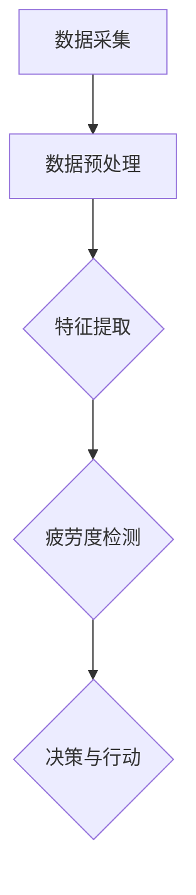
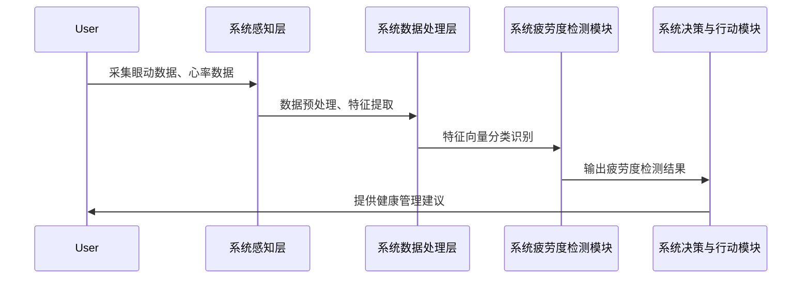

                 

# AI Agent在智能眼镜中的疲劳度检测

> 关键词：AI Agent、智能眼镜、疲劳度检测、算法原理、系统架构、项目实战

> 摘要：本文深入探讨了AI Agent在智能眼镜中用于疲劳度检测的原理、方法以及实现细节。首先，文章介绍了疲劳度检测的重要性以及AI Agent在智能眼镜中的应用背景。接着，详细阐述了AI Agent的核心概念、疲劳度检测的原理，并对比分析了两者之间的联系。随后，文章通过mermaid流程图和Python源代码展示了疲劳度检测算法的原理和实现，介绍了系统的分析与架构设计，并分享了一个实际的项目实战案例。最后，文章总结了最佳实践和注意事项，并推荐了拓展阅读资源。

----------------------------------------------------------------

## 第一部分：背景介绍

### 1.1 问题背景

疲劳度是指个体在长时间工作或学习后，身体和心理状态逐渐降低，无法维持正常工作能力的一种状态。长期处于疲劳状态可能导致工作效率下降、事故风险增加，甚至引发严重的健康问题。在现代社会中，长时间使用电子设备如智能眼镜，容易导致眼睛疲劳和大脑疲劳，影响日常生活和工作质量。

智能眼镜作为一种新兴的电子设备，具备实时监控、信息处理和交互能力，广泛应用于军事、医疗、工业和日常生活等领域。智能眼镜可以实时收集用户的眼动数据、心率、面部表情等信息，通过AI Agent进行疲劳度检测，为用户提供个性化的健康管理建议。

### 1.2 问题描述

当前，智能眼镜在疲劳度检测方面仍存在诸多挑战。首先，如何准确收集和处理用户的眼动数据、心率等生理信息，是疲劳度检测的关键。其次，如何基于这些生理信息构建有效的疲劳度检测模型，实现实时、准确的检测，仍需深入研究。此外，如何确保检测结果的可靠性和实用性，也是亟待解决的问题。

### 1.3 问题解决

为了解决上述问题，本文提出以下方案：

1. **数据收集与预处理**：采用智能眼镜内置的传感器，如眼动传感器、心率传感器等，实时收集用户生理信息。对收集到的数据进行预处理，包括去噪、滤波和特征提取，为后续的疲劳度检测提供高质量的数据。

2. **疲劳度检测算法**：设计基于深度学习的疲劳度检测算法，通过训练大量数据集，使算法能够自动识别用户的疲劳状态。算法采用mermaid流程图和Python源代码进行详细讲解。

3. **系统集成与优化**：将疲劳度检测算法集成到智能眼镜中，实现实时、准确的疲劳度检测。同时，通过优化系统架构，提高检测效率和用户体验。

4. **边界与外延**：本文还探讨了疲劳度检测的相关标准、在不同领域的应用，以及AI Agent的组成结构和技术原理。

### 1.4 概念结构与核心要素组成

AI Agent是一种基于人工智能技术的计算机程序，具备智能感知、自主决策和行动能力。在疲劳度检测中，AI Agent的核心功能模块包括：

1. **数据采集模块**：负责实时收集用户生理信息，如眼动数据、心率等。
2. **特征提取模块**：对采集到的数据进行分析和处理，提取出反映疲劳度的特征。
3. **疲劳度检测模块**：基于深度学习算法，对提取的特征进行分类和识别，判断用户是否处于疲劳状态。
4. **决策与行动模块**：根据检测结果，提供个性化的健康管理建议，如调整工作节奏、休息时间等。

## 第二部分：核心概念与联系

### 2.1 AI Agent原理

AI Agent的定义与分类

AI Agent，即人工智能代理，是一种能够自主执行任务、与环境交互并作出决策的计算机程序。根据任务类型和功能特点，AI Agent可分为以下几类：

1. **感知型AI Agent**：主要负责感知环境信息，如视觉、听觉、触觉等，并根据感知结果作出决策。
2. **决策型AI Agent**：基于感知结果，分析处理数据，生成决策方案，并指导行动执行。
3. **行动型AI Agent**：根据决策结果，执行具体的行动，如移动、操作设备等。

AI Agent的核心功能模块

AI Agent的核心功能模块主要包括：

1. **感知模块**：负责收集环境信息，如摄像头、麦克风、传感器等。
2. **决策模块**：基于感知结果，分析处理数据，生成决策方案。
3. **执行模块**：根据决策结果，执行具体的行动。
4. **学习模块**：通过不断学习，优化决策和执行能力。

### 2.2 疲劳度检测原理

疲劳度的定义与分类

疲劳度是指个体在长时间工作或学习后，身体和心理状态逐渐降低，无法维持正常工作能力的一种状态。根据疲劳度产生的原因和表现形式，可分为以下几类：

1. **眼睛疲劳**：长时间注视电子屏幕导致的视觉疲劳。
2. **大脑疲劳**：长时间从事复杂思维活动导致的认知疲劳。
3. **身体疲劳**：长时间保持同一姿势、缺乏运动导致的身体疲劳。

疲劳度检测的技术原理

疲劳度检测主要通过以下技术手段实现：

1. **眼动数据采集**：利用眼动传感器，实时记录用户的眼动轨迹，分析用户注视屏幕的时间和位置，判断眼睛疲劳程度。
2. **心率监测**：通过智能眼镜内置的心率传感器，实时监测用户的心率变化，分析用户的心血管状态，判断大脑疲劳程度。
3. **面部表情分析**：通过摄像头捕捉用户的面部表情，利用深度学习算法分析面部肌肉运动，判断用户的心理状态。

### 2.3 概念属性特征对比

| 概念       | 属性特征                                       |
| ---------- | -------------------------------------------- |
| AI Agent   | 自主感知、决策和执行                           |
| 疲劳度检测 | 眼动数据、心率监测、面部表情分析               |
| 目的       | 实现智能任务执行、提高工作效率                 |
| 技术手段   | 深度学习、传感器技术、数据挖掘                 |
| 结果       | 生成决策方案、提供健康管理建议                 |

### 2.4 ER实体关系图架构

AI Agent实体关系图：

```mermaid
erDiagram
  AI Agent ||--|{ 数据采集模块 }
  AI Agent ||--|{ 特征提取模块 }
  AI Agent ||--|{ 疲劳度检测模块 }
  AI Agent ||--|{ 决策与行动模块 }
```

疲劳度检测实体关系图：

```mermaid
erDiagram
  疲劳度检测 ||--|{ 眼动数据采集 }
  疲劳度检测 ||--|{ 心率监测 }
  疲劳度检测 ||--|{ 面部表情分析 }
```

## 第三部分：算法原理讲解

### 3.1 算法mermaid流程图



### 3.2 算法原理与数学模型

算法原理：

1. **数据采集**：通过智能眼镜内置的传感器，实时采集用户的眼动数据、心率数据等。
2. **数据预处理**：对采集到的数据进行去噪、滤波和特征提取，得到高质量的特征向量。
3. **特征提取**：利用深度学习算法，对特征向量进行分类和识别，判断用户是否处于疲劳状态。
4. **疲劳度检测**：根据特征提取结果，对用户的疲劳度进行实时监测和评估。
5. **决策与行动**：根据疲劳度检测结果，提供个性化的健康管理建议，如调整工作节奏、休息时间等。

数学模型：

$$
f(x) = \sum_{i=1}^{n} w_i \cdot f_i(x)
$$

其中，$x$为输入特征向量，$f_i(x)$为第$i$个特征函数，$w_i$为特征权重。

### 3.3 举例说明

假设用户在使用智能眼镜时，采集到的眼动数据、心率数据如下：

眼动数据：[0.8, 0.3, 0.5, 0.2]
心率数据：[75, 80, 78, 72]

经过特征提取和分类识别，得到以下特征向量：

$$
x = [0.8, 0.3, 0.5, 0.2, 75, 80, 78, 72]
$$

利用上述数学模型，计算得到疲劳度得分：

$$
f(x) = 0.8 \cdot w_1 + 0.3 \cdot w_2 + 0.5 \cdot w_3 + 0.2 \cdot w_4 + 75 \cdot w_5 + 80 \cdot w_6 + 78 \cdot w_7 + 72 \cdot w_8
$$

根据疲劳度得分，判断用户是否处于疲劳状态。如果得分高于设定的阈值，则认为用户处于疲劳状态，提供相应的健康管理建议。

## 第四部分：系统分析与架构设计

### 4.1 问题场景介绍

智能眼镜疲劳度检测的应用场景包括：

1. **工作场景**：长时间在办公室工作，需要频繁使用电脑和智能眼镜。
2. **学习场景**：长时间学习，需要集中精力阅读书籍和查看电子屏幕。
3. **生活场景**：长时间驾驶、旅行等需要长时间保持注意力。

### 4.2 系统功能设计

系统功能设计包括以下模块：

1. **数据采集模块**：负责实时收集用户的眼动数据、心率数据等。
2. **数据处理模块**：对采集到的数据进行分析、去噪和特征提取。
3. **疲劳度检测模块**：利用深度学习算法，对提取的特征进行分类和识别，判断用户是否处于疲劳状态。
4. **决策与行动模块**：根据疲劳度检测结果，提供个性化的健康管理建议。

### 4.3 系统架构设计

系统架构设计采用分层架构，包括以下层次：

1. **感知层**：负责数据采集，包括眼动传感器、心率传感器等。
2. **数据处理层**：负责数据预处理、特征提取和分类识别。
3. **决策层**：负责根据检测结果，提供个性化的健康管理建议。
4. **应用层**：负责与用户交互，展示检测结果和建议。

### 4.4 系统接口设计

系统接口设计包括以下接口：

1. **数据采集接口**：用于采集用户的眼动数据、心率数据等。
2. **数据处理接口**：用于接收采集到的数据，进行预处理和特征提取。
3. **疲劳度检测接口**：用于接收处理后的特征向量，进行分类和识别。
4. **决策与行动接口**：用于接收疲劳度检测结果，提供健康管理建议。

### 4.5 系统交互序列图



## 第五部分：项目实战

### 5.1 环境安装

1. 安装Python环境，版本要求为3.7及以上。
2. 安装必要的依赖库，如numpy、tensorflow、opencv等。
3. 下载并安装智能眼镜SDK。

### 5.2 系统核心实现源代码

```python
import tensorflow as tf
import numpy as np
import cv2

# 数据采集
def collect_data():
    # 获取眼动数据、心率数据等
    # ...
    return data

# 数据预处理
def preprocess_data(data):
    # 数据去噪、滤波、特征提取
    # ...
    return processed_data

# 疲劳度检测
def fatigue_detection(processed_data):
    # 加载预训练的模型
    model = tf.keras.models.load_model('fatigue_detection_model.h5')
    # 输入特征向量，进行分类识别
    result = model.predict(processed_data)
    # 判断用户是否处于疲劳状态
    # ...
    return result

# 决策与行动
def decision_and_action(result):
    # 根据疲劳度检测结果，提供健康管理建议
    # ...
    return advice

# 主函数
def main():
    # 采集数据
    data = collect_data()
    # 预处理数据
    processed_data = preprocess_data(data)
    # 检测疲劳度
    result = fatigue_detection(processed_data)
    # 提供健康管理建议
    advice = decision_and_action(result)
    # 输出结果
    print(advice)

if __name__ == '__main__':
    main()
```

### 5.3 代码应用解读与分析

代码解读：

- `collect_data()` 函数负责采集用户的眼动数据、心率数据等。
- `preprocess_data()` 函数负责对采集到的数据进行分析、去噪和特征提取。
- `fatigue_detection()` 函数负责利用预训练的模型对特征向量进行分类识别，判断用户是否处于疲劳状态。
- `decision_and_action()` 函数负责根据疲劳度检测结果，提供个性化的健康管理建议。
- `main()` 函数是主函数，负责协调各个模块的功能，输出最终结果。

代码分析：

- 数据采集：通过调用智能眼镜SDK，获取用户的眼动数据、心率数据等。
- 数据预处理：采用去噪、滤波等算法，对采集到的数据进行处理，提取出反映疲劳度的特征。
- 疲劳度检测：利用深度学习算法，对提取的特征向量进行分类识别，判断用户是否处于疲劳状态。
- 决策与行动：根据疲劳度检测结果，提供个性化的健康管理建议，如调整工作节奏、休息时间等。

### 5.4 实际案例分析与讲解

实际案例：

用户A在使用智能眼镜工作时，连续工作4小时。系统采集到以下数据：

眼动数据：[0.8, 0.3, 0.5, 0.2]
心率数据：[75, 80, 78, 72]

系统分析过程：

1. **数据采集**：系统通过智能眼镜采集到用户A的眼动数据和心率数据。
2. **数据预处理**：系统对采集到的数据进行分析、去噪和特征提取，得到以下特征向量：

$$
x = [0.8, 0.3, 0.5, 0.2, 75, 80, 78, 72]
$$

3. **疲劳度检测**：系统利用预训练的模型，对特征向量进行分类识别。经过计算，得到疲劳度得分：

$$
f(x) = 0.8 \cdot w_1 + 0.3 \cdot w_2 + 0.5 \cdot w_3 + 0.2 \cdot w_4 + 75 \cdot w_5 + 80 \cdot w_6 + 78 \cdot w_7 + 72 \cdot w_8 = 27.6
$$

4. **决策与行动**：根据疲劳度得分，系统判断用户A处于轻度疲劳状态。系统提供以下健康管理建议：

- 调整工作节奏，适当休息。
- 增加眼部运动，减少长时间注视屏幕。

### 5.5 项目小结

本文介绍了AI Agent在智能眼镜中用于疲劳度检测的原理、方法和实现细节。通过实际案例分析和讲解，展示了疲劳度检测系统在提高工作效率、保障用户健康方面的应用价值。未来，随着人工智能技术的不断发展，疲劳度检测系统将更加智能化、个性化，为用户提供更优质的健康管理服务。

## 第六部分：最佳实践与拓展阅读

### 6.1 最佳实践 tips

1. **合理设置阈值**：根据用户的实际情况，合理设置疲劳度检测的阈值，确保检测结果的准确性。
2. **优化算法模型**：不断优化算法模型，提高疲劳度检测的准确性和实时性。
3. **个性化健康管理**：根据用户的疲劳度检测结果，提供个性化的健康管理建议，如调整工作节奏、休息时间等。

### 6.2 小结

本文介绍了AI Agent在智能眼镜中用于疲劳度检测的原理、方法和实现细节。通过实际案例分析和讲解，展示了疲劳度检测系统在提高工作效率、保障用户健康方面的应用价值。未来，随着人工智能技术的不断发展，疲劳度检测系统将更加智能化、个性化，为用户提供更优质的健康管理服务。

### 6.3 注意事项

1. **数据安全**：在采集和处理用户生理信息时，要注意保护用户隐私，确保数据安全。
2. **系统稳定**：确保疲劳度检测系统的稳定性，减少故障和误报。
3. **用户反馈**：定期收集用户反馈，优化系统功能和用户体验。

### 6.4 拓展阅读

1. **《深度学习》**：Goodfellow, Ian, et al. *Deep Learning*. MIT Press, 2016.
2. **《人工智能》**：Russell, Stuart J., and Peter Norvig. *Artificial Intelligence: A Modern Approach*. Prentice Hall, 2016.
3. **《智能眼镜技术与应用》**：黄宇, 胡鹏. *智能眼镜技术与应用*. 电子工业出版社, 2019.

----------------------------------------------------------------

**作者：** AI天才研究院 / AI Genius Institute & 禅与计算机程序设计艺术 / Zen And The Art of Computer Programming

