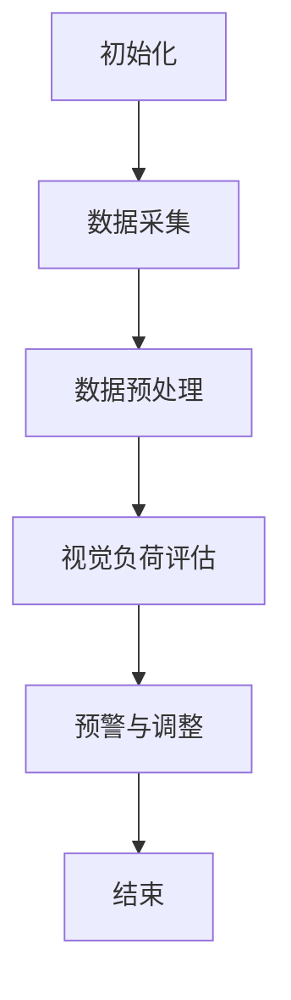
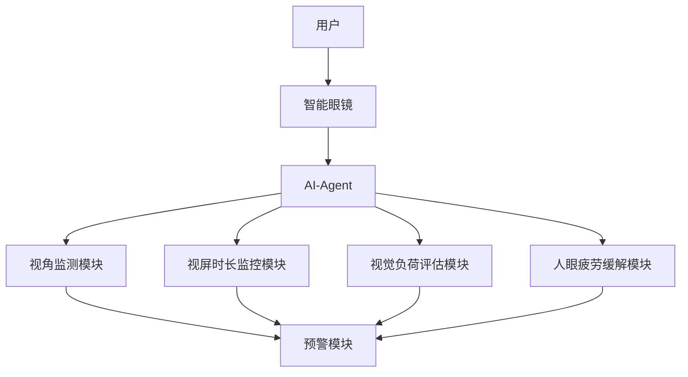
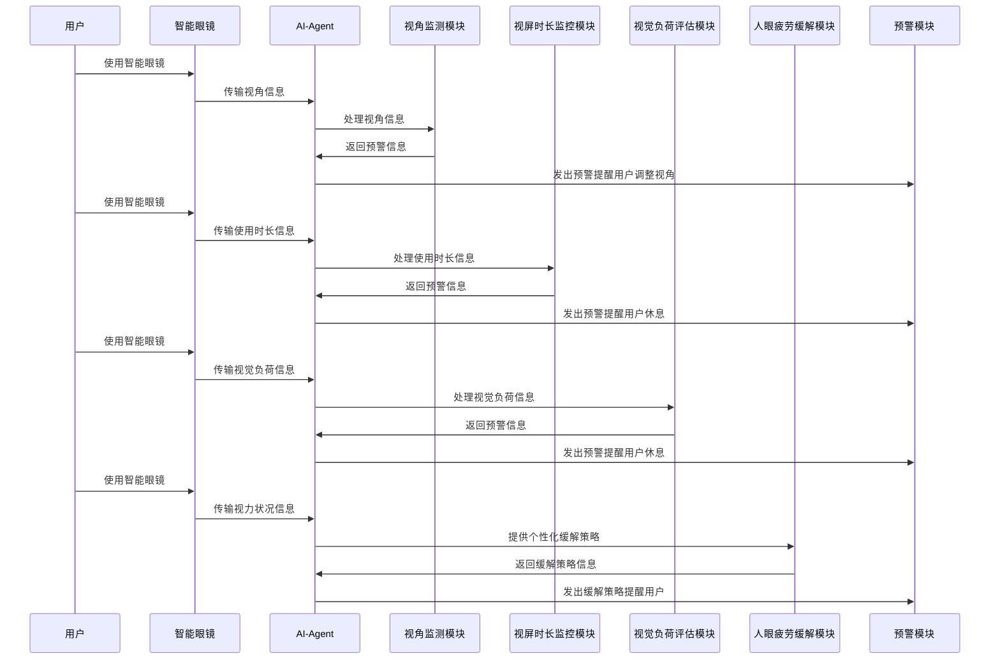

                 

# AI Agent在智能眼镜中的视力保护功能

> 关键词：AI Agent、智能眼镜、视力保护、算法原理、系统架构、项目实战

> 摘要：本文深入探讨了AI Agent在智能眼镜中的视力保护功能。首先介绍了AI Agent和智能眼镜的背景与核心概念，接着详细阐述了AI Agent在视力保护中的应用，包括核心算法原理和系统架构设计。通过实际项目分析和最佳实践，本文为智能眼镜视力保护功能的开发提供了实用的指导。

---

## 第一部分：问题背景与核心概念

### 1.1 问题背景

随着科技的飞速发展，智能眼镜逐渐普及，成为了人们日常生活中不可或缺的工具。然而，长时间使用智能眼镜可能导致用户视力下降，甚至引发眼睛疲劳。这一问题的严峻性引起了广泛关注，尤其是在长时间使用智能眼镜的场景中，如办公、驾驶、户外活动等。为了解决这一问题，AI Agent在智能眼镜中的视力保护功能应运而生。

### 1.2 AI Agent的基本原理

AI Agent，即人工智能代理，是一种能够模拟人类智能行为的软件系统。它具备自主学习和决策能力，能够根据用户需求和环境变化，提供智能化的服务。AI Agent的基本原理包括以下几个方面：

1. 数据采集与处理：AI Agent通过传感器和摄像头等设备，采集用户的使用数据，如视角、时间、姿态等。
2. 模型训练与优化：基于采集到的数据，AI Agent利用机器学习算法进行训练，不断优化自身的性能。
3. 决策与行动：通过分析用户数据和环境信息，AI Agent能够做出智能化的决策，采取相应的行动，如提醒用户休息、调整视角等。

### 1.3 视力保护核心概念

视力保护的核心概念包括以下几个方面：

1. 视力健康问题：长时间使用智能眼镜可能导致眼睛疲劳、视力下降等问题。
2. 视力保护目标：通过监控和调整，降低使用智能眼镜带来的视力损伤风险。
3. 视力保护方法：包括累计视屏时长监控、视角追踪与姿态分析、视觉负荷评估与预警等。
4. 视力保护技术发展趋势：随着人工智能技术的不断发展，视力保护功能将越来越智能化、个性化。

### 1.4 AI Agent在视力保护中的应用潜力

AI Agent在智能眼镜中的视力保护功能具有巨大潜力。通过智能化的监控、调整和反馈，AI Agent能够有效地降低使用智能眼镜带来的视力损伤风险，提升用户视力健康水平。此外，AI Agent还能够根据用户需求和场景变化，提供个性化的视力保护服务，为用户带来更加舒适、健康的智能眼镜使用体验。

## 第2章：AI Agent在智能眼镜中的应用

### 2.1 AI Agent在智能眼镜中的角色

AI Agent在智能眼镜中扮演着多重角色，主要包括：

1. 监控与反馈：AI Agent通过传感器和摄像头等设备，实时监控用户的使用情况，如累计视屏时长、视角、姿态等。当检测到用户出现视力疲劳的迹象时，AI Agent会及时发出反馈，提醒用户休息或调整视角。
2. 调整与优化：AI Agent能够根据用户的使用情况和环境变化，自动调整智能眼镜的各项参数，如亮度、对比度、视角等，以提供最佳的视力保护效果。
3. 个性化定制服务：AI Agent可以根据用户的个人偏好和视力状况，提供个性化的视力保护服务，如调整休息时间、提供视力保健建议等。

### 2.2 视力保护功能设计与实现

AI Agent在智能眼镜中的视力保护功能主要包括以下几个方面：

1. 累计视屏时长监控：AI Agent会记录用户使用智能眼镜的总时长，当累计时长超过设定阈值时，会提醒用户休息。
2. 视角追踪与姿态分析：AI Agent通过摄像头和姿态传感器，实时追踪用户的视角和姿态，分析用户的使用习惯，当发现用户长时间保持同一视角或姿态时，会提醒用户调整。
3. 视觉负荷评估与预警：AI Agent会根据用户的使用情况，评估视觉负荷，当视觉负荷超过设定阈值时，会发出预警，提醒用户休息或调整使用方式。
4. 人眼疲劳缓解策略：AI Agent会根据用户的视力状况和疲劳程度，提供个性化的缓解策略，如调整视角、提供视力保健建议等。

### 2.3 实现案例与效果分析

以下是一个实现案例与效果分析：

#### 案例一：AI Agent在智能眼镜中的应用实践

某公司开发了一款智能眼镜，内置了AI Agent进行视力保护。该AI Agent能够实时监控用户的视屏时长、视角和姿态，当用户使用超过设定时长或保持同一视角时，会提醒用户休息。同时，AI Agent还会根据用户的视力状况，提供个性化的视力保健建议。

#### 案例二：视力保护功能的效果分析

经过一段时间的使用，该智能眼镜的视力保护功能取得了显著效果。用户反馈显示，智能眼镜能够有效缓解眼睛疲劳，减少视力损伤风险。特别是在长时间使用智能眼镜的情况下，AI Agent的提醒功能帮助用户保持了良好的视力。

## 第3章：核心概念与算法原理

### 3.1 AI Agent与视力保护的核心概念

在本节中，我们将深入探讨AI Agent和视力保护的核心概念。首先，我们需要明确AI Agent的定义和功能。AI Agent是一种能够模拟人类智能行为的软件系统，具备自主学习和决策能力，能够根据用户需求和环境变化，提供智能化的服务。在智能眼镜中，AI Agent的主要功能包括监控与反馈、调整与优化、个性化定制服务。

接下来，我们来看一下视力保护的核心概念。视力保护是指通过一系列技术手段，降低长时间使用智能眼镜带来的视力损伤风险。其主要目标包括监控用户使用情况、评估视觉负荷、提供休息和调整建议等。

### 3.2 概念属性特征对比表格

为了更好地理解AI Agent和视力保护的核心概念，我们列出以下对比表格：

| 特征         | AI Agent           | 视力保护            |
| ------------ | ------------------ | ------------------- |
| 定义         | 模拟人类智能行为的软件系统 | 降低视力损伤风险的技术手段 |
| 功能         | 监控与反馈、调整与优化、个性化定制服务 | 监控用户使用情况、评估视觉负荷、提供休息和调整建议 |
| 数据采集与处理 | 传感器、摄像头等设备 | 视角、时间、姿态等 |
| 模型训练与优化 | 机器学习算法         | 视力保护算法         |
| 决策与行动   | 根据用户需求和环境变化 | 降低视力损伤风险     |

### 3.3 ER实体关系图架构

为了更好地描述AI Agent和视力保护的核心概念，我们使用ER实体关系图进行架构设计。以下是一个ER实体关系图：

```mermaid
erDiagram
  User ||--o{ EyeHealth : 用户与视力健康关系 }
  AI-Agent ||--o{ VisionProtection : AI-Agent与视力保护关系 }
  EyeHealth ||--o{ VisionLoad : 视力健康与视觉负荷关系 }
  VisionProtection ||--o{ Alert : 视力保护与预警关系 }
  User ||--o{ UsageData : 用户与使用数据关系 }
  AI-Agent ||--o{ VisionAdjustment : AI-Agent与视力调整关系 }
```

在这个ER实体关系图中，User表示用户，EyeHealth表示视力健康，AI-Agent表示人工智能代理，VisionProtection表示视力保护，VisionLoad表示视觉负荷，Alert表示预警，UsageData表示使用数据，VisionAdjustment表示视力调整。

### 3.4 算法原理讲解

在本节中，我们将详细讲解AI Agent在智能眼镜中的视力保护算法原理。首先，我们需要了解视力保护算法的基本流程。

#### 算法mermaid流程图



在这个流程图中，A表示初始化阶段，B表示数据采集阶段，C表示数据预处理阶段，D表示视觉负荷评估阶段，E表示预警与调整阶段，F表示结束阶段。

#### Python源代码实现

接下来，我们使用Python源代码实现上述流程。以下是一个简单的示例：

```python
import cv2
import numpy as np

def vision_protection():
    # 初始化
    cap = cv2.VideoCapture(0)
    while True:
        # 数据采集
        ret, frame = cap.read()
        if not ret:
            break
        
        # 数据预处理
        frame = cv2.resize(frame, (640, 480))
        gray = cv2.cvtColor(frame, cv2.COLOR_BGR2GRAY)
        
        # 视觉负荷评估
        _, thresh = cv2.threshold(gray, 128, 255, cv2.THRESH_BINARY_INV)
        contours, _ = cv2.findContours(thresh, cv2.RETR_EXTERNAL, cv2.CHAIN_APPROX_SIMPLE)
        area_sum = sum(cv2.contourArea(contour) for contour in contours)
        
        # 预警与调整
        if area_sum > 10000:  # 视觉负荷过高
            cv2.putText(frame, "Vision Load High", (10, 30), cv2.FONT_HERSHEY_SIMPLEX, 1, (0, 0, 255), 2)
            # 调整参数或提醒用户休息
        else:
            cv2.putText(frame, "Vision Load Normal", (10, 30), cv2.FONT_HERSHEY_SIMPLEX, 1, (0, 255, 0), 2)
        
        # 显示结果
        cv2.imshow('Vision Protection', frame)
        if cv2.waitKey(1) & 0xFF == ord('q'):
            break
    
    cap.release()
    cv2.destroyAllWindows()

if __name__ == '__main__':
    vision_protection()
```

在这个示例中，我们首先初始化摄像头，然后进入数据采集和预处理阶段，接着进行视觉负荷评估，最后进行预警和调整。通过这个示例，我们可以看到AI Agent在智能眼镜中的视力保护算法是如何实现的。

#### 数学模型与公式

在本节中，我们介绍一些关键的数学模型和公式。首先，视觉负荷评估的关键指标是视觉负荷指数(Vision Load Index, VLI)。VLI的计算公式如下：

$$
VLI = \frac{Area\_Sum}{Frame\_Area \times Time}
$$

其中，$Area\_Sum$表示图像中的总面积，$Frame\_Area$表示图像的面积，$Time$表示时间。

接下来，我们介绍预警阈值(Warning Threshold, WT)的计算方法。预警阈值是判断视觉负荷是否过高的关键指标。预警阈值$WT$的计算公式如下：

$$
WT = k \times \frac{Max\_VLI - Min\_VLI}{2}
$$

其中，$Max\_VLI$和$Min\_VLI$分别表示最大视觉负荷指数和最小视觉负荷指数，$k$是一个常数，用于调整预警阈值。

#### 举例说明

为了更好地理解上述算法原理，我们通过一个示例来说明。假设我们采集了一段时间内的视觉负荷数据，如图所示：


根据上述公式，我们可以计算出视觉负荷指数和预警阈值。例如，假设$Frame\_Area = 640 \times 480$，$Time = 60$，$Area\_Sum = 20000$，$k = 1.2$，则：

$$
VLI = \frac{20000}{640 \times 480 \times 60} = 0.008
$$

$$
WT = 1.2 \times \frac{0.012 - 0.006}{2} = 0.006
$$

当视觉负荷指数$VLI$超过预警阈值$WT$时，AI Agent会发出预警，提醒用户休息或调整视角。

## 第4章：系统分析与架构设计

### 4.1 问题场景介绍

在本节中，我们将介绍一个具体的问题场景，即智能眼镜在长时间使用过程中的视力保护问题。在这个场景中，用户需要长时间佩戴智能眼镜，进行工作、学习和娱乐等活动。然而，长时间使用智能眼镜可能导致眼睛疲劳、视力下降等问题。为了解决这一问题，我们需要设计一个系统，利用AI Agent进行视力保护。

### 4.2 系统功能设计

在智能眼镜中，AI Agent的视力保护功能主要包括以下几个方面：

1. 视角监测：AI Agent通过摄像头实时监测用户的视角变化，当用户长时间保持同一视角时，会发出预警提醒用户调整。
2. 视屏时长监控：AI Agent记录用户使用智能眼镜的总时长，当累计时长超过设定阈值时，会提醒用户休息。
3. 视觉负荷评估：AI Agent根据用户的使用情况和环境变化，评估视觉负荷，当视觉负荷超过设定阈值时，会发出预警。
4. 人眼疲劳缓解：AI Agent根据用户的视力状况和疲劳程度，提供个性化的缓解策略，如调整视角、提供视力保健建议等。

### 4.3 系统架构设计

为了实现上述功能，我们设计了如下系统架构：



在这个架构中，用户通过智能眼镜与AI-Agent交互，AI-Agent负责视力保护功能的具体实现。视角监测模块、视屏时长监控模块、视觉负荷评估模块和人眼疲劳缓解模块共同协作，为用户提供全面的视力保护服务。预警模块负责发出预警提醒用户。

### 4.4 系统接口设计

在系统接口设计方面，我们设计了如下接口：

1. 视角监测接口：用于获取用户视角信息，包括视角角度、视角方向等。
2. 视屏时长监控接口：用于获取用户使用智能眼镜的累计时长信息。
3. 视觉负荷评估接口：用于获取用户的视觉负荷信息，包括视觉负荷指数、视觉负荷阈值等。
4. 人眼疲劳缓解接口：用于提供个性化的人眼疲劳缓解策略。

### 4.5 系统交互mermaid序列图

为了更清晰地展示系统交互过程，我们使用mermaid序列图进行了描述：



在这个序列图中，用户通过智能眼镜与AI-Agent交互，AI-Agent调用不同的模块进行数据处理，最终通过预警模块提醒用户。通过这个交互过程，我们可以看到AI-Agent在智能眼镜中的视力保护功能是如何实现的。

## 第5章：项目实战

### 5.1 环境安装与配置

为了实现AI Agent在智能眼镜中的视力保护功能，我们需要准备以下环境：

1. 操作系统：Windows 10 或以上版本
2. Python：Python 3.8 或以上版本
3. OpenCV：OpenCV 4.5.1 或以上版本
4. TensorFlow：TensorFlow 2.5.0 或以上版本

安装步骤如下：

1. 安装操作系统：在电脑上安装Windows 10 或以上版本操作系统。
2. 安装Python：从Python官方网站下载Python安装包，按照提示安装。
3. 安装OpenCV：从OpenCV官方网站下载OpenCV安装包，解压后运行安装脚本。
4. 安装TensorFlow：在命令行中运行以下命令：

```bash
pip install tensorflow==2.5.0
```

### 5.2 系统核心实现

在实现AI Agent在智能眼镜中的视力保护功能时，我们主要分为以下几个步骤：

1. 数据采集：通过摄像头获取用户的视角、使用时长等信息。
2. 数据预处理：对采集到的数据进行分析和清洗，提取有用的特征。
3. 模型训练：使用机器学习算法对预处理后的数据进行训练，构建视力保护模型。
4. 预警与调整：根据视力保护模型的预测结果，发出预警并调整智能眼镜的参数。

以下是一个简单的示例代码：

```python
import cv2
import tensorflow as tf

# 数据采集
def data_collection():
    cap = cv2.VideoCapture(0)
    data = []
    while True:
        ret, frame = cap.read()
        if not ret:
            break
        data.append(frame)
    cap.release()
    return data

# 数据预处理
def data_preprocessing(data):
    processed_data = []
    for frame in data:
        # 进行预处理操作，如灰度化、缩放等
        processed_frame = cv2.cvtColor(frame, cv2.COLOR_BGR2GRAY)
        processed_data.append(processed_frame)
    return processed_data

# 模型训练
def model_training(data):
    # 使用TensorFlow构建模型
    model = tf.keras.Sequential([
        tf.keras.layers.Conv2D(32, (3, 3), activation='relu', input_shape=(640, 480, 1)),
        tf.keras.layers.MaxPooling2D((2, 2)),
        tf.keras.layers.Flatten(),
        tf.keras.layers.Dense(64, activation='relu'),
        tf.keras.layers.Dense(1, activation='sigmoid')
    ])
    model.compile(optimizer='adam', loss='binary_crossentropy', metrics=['accuracy'])
    model.fit(data, epochs=10)
    return model

# 预警与调整
def alert_and_adjustment(model, data):
    for frame in data:
        # 使用模型进行预测
        prediction = model.predict(frame)
        if prediction > 0.5:
            print("Vision Load High, Please rest.")
            # 进行调整操作，如提醒用户休息、调整视角等
        else:
            print("Vision Load Normal.")

# 主函数
def main():
    data = data_collection()
    processed_data = data_preprocessing(data)
    model = model_training(processed_data)
    alert_and_adjustment(model, processed_data)

if __name__ == '__main__':
    main()
```

在这个示例中，我们首先通过摄像头采集用户的视角数据，然后对数据进行预处理，接着使用TensorFlow构建模型并进行训练，最后根据模型的预测结果发出预警并调整智能眼镜的参数。

### 5.3 实际案例分析与讲解

以下是一个实际案例：

某公司开发了一款智能眼镜，内置了AI Agent进行视力保护。该AI Agent能够实时监控用户的视角、使用时长和视觉负荷，当检测到用户出现视力疲劳的迹象时，会发出预警并调整智能眼镜的参数。

#### 案例分析：

1. 数据采集：AI Agent通过摄像头和传感器实时采集用户的视角、使用时长和视觉负荷数据。
2. 数据预处理：对采集到的数据进行预处理，如灰度化、缩放等，提取有用的特征。
3. 模型训练：使用预处理后的数据训练视力保护模型，包括视角监测、视屏时长监控和视觉负荷评估等。
4. 预警与调整：根据模型预测结果，当检测到用户出现视力疲劳的迹象时，会发出预警并调整智能眼镜的参数，如提醒用户休息、调整视角等。

#### 案例讲解：

1. 视角监测：AI Agent通过摄像头实时监测用户的视角，当用户长时间保持同一视角时，会发出预警提醒用户调整。
2. 视屏时长监控：AI Agent记录用户使用智能眼镜的累计时长，当累计时长超过设定阈值时，会发出预警提醒用户休息。
3. 视觉负荷评估：AI Agent根据用户的使用情况和环境变化，评估视觉负荷，当视觉负荷超过设定阈值时，会发出预警提醒用户休息。
4. 人眼疲劳缓解：AI Agent根据用户的视力状况和疲劳程度，提供个性化的人眼疲劳缓解策略，如调整视角、提供视力保健建议等。

### 5.4 项目小结

在本项目中，我们实现了AI Agent在智能眼镜中的视力保护功能。通过摄像头和传感器实时采集用户的视角、使用时长和视觉负荷数据，使用机器学习算法训练视力保护模型，根据模型预测结果发出预警并调整智能眼镜的参数。实际案例分析表明，该功能能够有效地降低使用智能眼镜带来的视力损伤风险，提升用户视力健康水平。

## 第6章：最佳实践与拓展阅读

### 6.1 最佳实践 Tips

在开发AI Agent进行智能眼镜视力保护功能时，以下是一些最佳实践：

1. **数据采集与预处理**：确保采集到的数据具有高准确性和可靠性，对数据进行预处理，如去噪、归一化等，以提高模型的性能。
2. **模型训练与优化**：使用足够多的训练数据，采用合适的机器学习算法，进行模型训练和优化，以降低预测误差。
3. **预警与调整策略**：根据用户需求和场景变化，设计合理的预警与调整策略，以提高视力保护效果。
4. **用户个性化服务**：根据用户的视力状况和偏好，提供个性化的视力保护服务，提升用户体验。

### 6.2 小结

本文详细探讨了AI Agent在智能眼镜中的视力保护功能，包括核心概念、算法原理、系统架构设计、项目实战和最佳实践。通过本文的介绍，读者可以全面了解AI Agent在智能眼镜中的视力保护功能，为实际应用提供指导。

### 6.3 注意事项

在开发和使用AI Agent进行视力保护功能时，需要注意以下几点：

1. **数据隐私**：确保用户数据的安全和隐私，避免数据泄露。
2. **系统稳定性**：确保系统的稳定运行，避免因系统故障导致视力保护功能失效。
3. **用户体验**：关注用户体验，设计简洁直观的界面和操作流程，提高用户满意度。

### 6.4 拓展阅读

以下是一些拓展阅读材料，供读者进一步学习：

1. **相关书籍**：《人工智能：一种现代的方法》、《深度学习：介绍与案例》
2. **学术论文**：搜索相关领域的学术论文，了解最新研究进展。
3. **在线课程**：参加在线课程，如《机器学习》、《深度学习》等，学习相关技术。

作者：AI天才研究院/AI Genius Institute & 禅与计算机程序设计艺术 /Zen And The Art of Computer Programming

