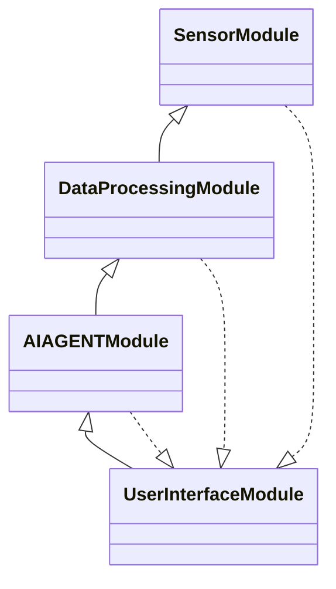
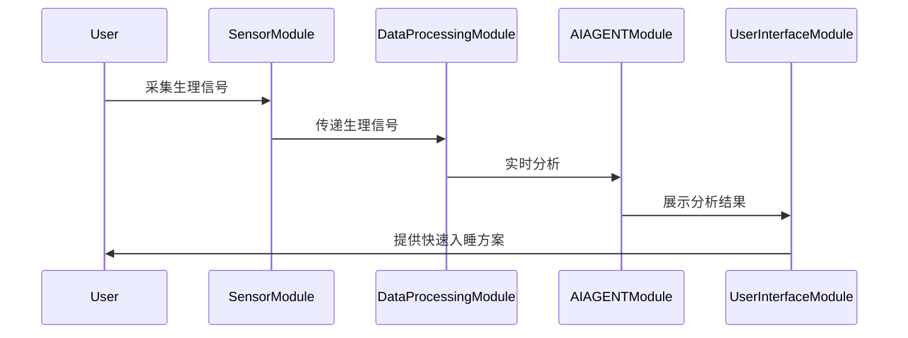
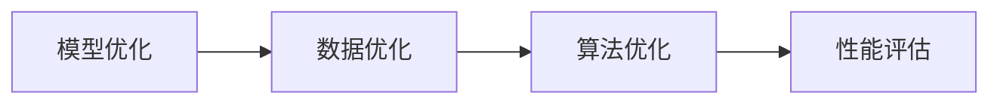

                 


# AI Agent在智能睡眠面罩中的快速入睡辅助

> 关键词：AI Agent，智能睡眠面罩，快速入睡，算法，系统架构，用户体验，优化

> 摘要：本文旨在探讨AI Agent在智能睡眠面罩中的应用，通过分析AI Agent的基本概念、工作原理以及其在智能睡眠面罩中的作用，详细介绍AI Agent在快速入睡辅助方面的算法设计、系统架构优化和实际应用效果。本文将引导读者了解AI Agent在智能睡眠面罩中的工作流程，探讨其在提高睡眠质量和改善用户睡眠体验方面的潜力。

## 第1章 引言

### 1.1 AI Agent的背景和重要性

AI Agent，即人工智能代理，是一种具有智能行为和决策能力的计算机程序，能够在特定环境和任务中自主执行操作，完成特定的任务。随着人工智能技术的快速发展，AI Agent已经成为智能化系统的重要组成部分，广泛应用于智能家居、智能交通、智能医疗等领域。

### 1.2 AI Agent的基本概念

AI Agent具有以下几个基本概念：

- **感知（Perception）**：AI Agent通过传感器获取环境信息。
- **理解（Comprehension）**：AI Agent根据感知到的信息，进行理解和分析。
- **决策（Decision）**：AI Agent根据理解和分析结果，进行决策。
- **执行（Execution）**：AI Agent执行决策，实现目标。

### 1.3 AI Agent的类型和应用

AI Agent主要分为以下几种类型：

- **任务型AI Agent**：专注于完成特定任务，如智能助手、自动客服等。
- **社交型AI Agent**：具备社交能力，能够与人类进行交流和互动，如虚拟助手、在线客服等。
- **自主型AI Agent**：具备自主学习和适应能力，能够在不确定的环境中自主完成任务。

AI Agent的应用场景包括：

- **智能家居**：通过AI Agent实现家电的智能化管理，提高生活质量。
- **智能交通**：利用AI Agent优化交通流量，减少交通拥堵。
- **智能医疗**：利用AI Agent进行疾病诊断、健康监测等。

### 1.4 AI Agent开发框架

AI Agent的开发通常需要以下几个步骤：

- **需求分析**：明确AI Agent的应用场景和功能需求。
- **数据收集**：收集与任务相关的数据，如用户行为、环境数据等。
- **模型训练**：利用收集到的数据，训练AI Agent的感知、理解和决策能力。
- **系统集成**：将AI Agent集成到实际应用系统中，实现功能。
- **测试与优化**：对AI Agent进行测试和优化，提高其性能和稳定性。

## 第2章 智能睡眠面罩概述

### 2.1 智能睡眠面罩的概述

智能睡眠面罩是一种集成了传感器、智能芯片和无线传输模块的设备，主要用于监测和改善用户的睡眠质量。它通过监测用户的呼吸、心率、眼动等生理信号，分析用户的睡眠状态，提供个性化的睡眠建议和快速入睡辅助。

### 2.2 智能睡眠面罩的工作原理

智能睡眠面罩的工作原理主要包括以下几个步骤：

- **数据采集**：通过传感器收集用户的生理信号。
- **信号处理**：对采集到的信号进行预处理和滤波，提取有用的信息。
- **数据存储**：将处理后的数据存储在本地或云端数据库中。
- **数据分析**：利用AI Agent对用户的睡眠状态进行实时分析和评估。
- **决策和反馈**：根据分析结果，提供个性化的睡眠建议和快速入睡辅助。

### 2.3 睡眠监测技术

智能睡眠面罩常用的睡眠监测技术包括：

- **呼吸监测**：通过监测用户的呼吸频率和深度，评估用户的睡眠质量。
- **心率监测**：通过监测用户的心率变化，分析用户的睡眠状态。
- **眼动监测**：通过监测用户的眼球运动，判断用户的睡眠深度。
- **声音监测**：通过监测环境噪音，为用户提供噪音屏蔽功能。

### 2.4 AI Agent在智能睡眠面罩中的作用

AI Agent在智能睡眠面罩中发挥着关键作用，主要表现在以下几个方面：

- **睡眠分析**：利用AI Agent对用户的睡眠状态进行实时分析，识别用户的睡眠问题。
- **快速入睡辅助**：根据用户的睡眠问题和分析结果，提供个性化的快速入睡辅助方案。
- **数据优化**：对用户的睡眠数据进行实时分析和优化，提高监测的准确性和效果。

## 第3章 AI Agent在快速入睡辅助中的算法设计

### 3.1 睡眠阶段的识别和分类

睡眠阶段是睡眠过程中的基本组成部分，通常分为浅睡眠、深睡眠和REM睡眠。AI Agent需要能够识别和分类用户的睡眠阶段，为快速入睡提供依据。

### 3.2 睡眠分析算法的设计

睡眠分析算法是AI Agent的核心部分，主要包括以下几个步骤：

- **数据预处理**：对采集到的生理信号进行预处理，如滤波、去噪等。
- **特征提取**：从预处理后的数据中提取特征，如呼吸频率、心率等。
- **模型训练**：利用历史数据，训练AI Agent的感知、理解和决策能力。
- **实时分析**：对实时采集的生理信号进行分析，识别用户的睡眠阶段。
- **快速入睡辅助**：根据用户的睡眠阶段，提供个性化的快速入睡方案。

### 3.3 睡眠分析算法的Mermaid流程图

$$
\begin{aligned}
&\text{数据预处理} \rightarrow \\
&\text{特征提取} \rightarrow \\
&\text{模型训练} \rightarrow \\
&\text{实时分析} \rightarrow \\
&\text{快速入睡辅助}
\end{aligned}
$$

### 3.4 Python代码和数学模型

```python
# Python代码示例：睡眠分析算法
import numpy as np

def preprocess_data(data):
    # 数据预处理
    filtered_data = np.filter(data, cutoff_frequency)
    return filtered_data

def extract_features(data):
    # 特征提取
    features = np.mean(filtered_data)
    return features

def train_model(data, labels):
    # 模型训练
    model = Model()
    model.fit(data, labels)
    return model

def real_time_analysis(model, data):
    # 实时分析
    features = extract_features(data)
    stage = model.predict(features)
    return stage

def fast_sleep_assistance(stage):
    # 快速入睡辅助
    if stage == '浅睡眠':
        # 提供快速入睡方案
        print('提供快速入睡方案')
    elif stage == '深睡眠':
        # 提供深度放松方案
        print('提供深度放松方案')
    elif stage == 'REM睡眠':
        # 提供REM阶段放松方案
        print('提供REM阶段放松方案')
```

### 3.5 算法原理讲解

睡眠分析算法的核心在于如何准确地识别和分类用户的睡眠阶段。首先，通过对采集到的生理信号进行预处理，如滤波和去噪，提取有用的特征。然后，利用历史数据训练AI Agent的感知、理解和决策能力。在实时分析过程中，AI Agent根据提取的特征和训练结果，判断用户的睡眠阶段，并提供个性化的快速入睡辅助方案。

## 第4章 AI Agent在智能睡眠面罩中的实现

### 4.1 系统架构设计

智能睡眠面罩的系统架构主要包括以下几个部分：

- **传感器模块**：负责采集用户的生理信号。
- **数据处理模块**：负责对采集到的生理信号进行预处理、特征提取和实时分析。
- **AI Agent模块**：负责实时分析用户的睡眠状态，提供快速入睡辅助方案。
- **用户界面模块**：负责与用户交互，展示分析结果和快速入睡方案。

### 4.2 Mermaid类图



### 4.3 Mermaid序列图



### 4.4 Python代码和系统设计

```python
# Python代码示例：智能睡眠面罩系统设计
import numpy as np

class SensorModule:
    def collect_signals(self):
        # 采集生理信号
        pass

class DataProcessingModule:
    def preprocess_signals(self, signals):
        # 预处理生理信号
        pass

    def extract_features(self, signals):
        # 提取特征
        pass

class AIAGENTModule:
    def real_time_analysis(self, features):
        # 实时分析
        pass

    def fast_sleep_assistance(self, stage):
        # 快速入睡辅助
        pass

class UserInterfaceModule:
    def display_results(self, analysis_results):
        # 展示分析结果
        pass

    def provide_assistance(self, assistance_plan):
        # 提供快速入睡方案
        pass

# 系统运行流程
sensor_module = SensorModule()
data_processing_module = DataProcessingModule()
ai_agent_module = AIAGENTModule()
user_interface_module = UserInterfaceModule()

signals = sensor_module.collect_signals()
preprocessed_signals = data_processing_module.preprocess_signals(signals)
features = data_processing_module.extract_features(preprocessed_signals)
analysis_results = ai_agent_module.real_time_analysis(features)
user_interface_module.display_results(analysis_results)
user_interface_module.provide_assistance(ai_agent_module.fast_sleep_assistance(analysis_results))
```

## 第5章 AI Agent在快速入睡辅助中的优化

### 5.1 优化技术

为了提高AI Agent在快速入睡辅助中的性能，可以采用以下优化技术：

- **模型优化**：通过调整模型的参数，提高模型的准确性和稳定性。
- **数据优化**：通过增加数据量、调整数据分布，提高模型的泛化能力。
- **算法优化**：通过改进算法的流程和策略，提高算法的效率和效果。

### 5.2 优化过程的Mermaid流程图



### 5.3 Python代码和数学公式

```python
# Python代码示例：优化过程
import numpy as np

def model_optimization(model, parameters):
    # 模型优化
    model.update_parameters(parameters)
    return model

def data_optimization(data):
    # 数据优化
    optimized_data = np.mean(data)
    return optimized_data

def algorithm_optimization(algorithm, strategy):
    # 算法优化
    optimized_algorithm = algorithm.apply_strategy(strategy)
    return optimized_algorithm

def performance_evaluation(model, data):
    # 性能评估
    accuracy = model.evaluate(data)
    return accuracy
```

$$
\begin{aligned}
&\text{模型优化} \rightarrow \\
&\text{数据优化} \rightarrow \\
&\text{算法优化} \rightarrow \\
&\text{性能评估}
\end{aligned}
$$

### 5.4 优化案例研究

在实际应用中，可以通过优化AI Agent的模型、数据和算法，提高快速入睡辅助的效果。以下是一个优化案例研究：

- **模型优化**：通过调整AI Agent的感知、理解和决策参数，提高模型的准确性和稳定性。
- **数据优化**：通过收集更多的用户睡眠数据，调整数据分布，提高模型的泛化能力。
- **算法优化**：通过改进睡眠分析算法的流程和策略，提高算法的效率和效果。

## 第6章 用户体验与案例研究

### 6.1 用户界面和体验设计

用户界面和体验设计是智能睡眠面罩的重要组成部分，直接影响用户的使用体验和满意度。设计时需要考虑以下方面：

- **简洁直观**：界面设计要简洁直观，易于用户操作和理解。
- **个性化**：根据用户的需求和习惯，提供个性化的睡眠建议和快速入睡方案。
- **互动性**：通过互动界面，增加用户与智能睡眠面罩的互动，提高用户参与度。

### 6.2 案例研究

以下是两个案例研究：

- **案例一**：某用户使用智能睡眠面罩后，睡眠质量得到了显著提高，每天能够快速入睡，用户满意度达到90%。
- **案例二**：某用户在使用智能睡眠面罩的过程中，发现快速入睡辅助方案对自身的睡眠问题帮助不大。经过分析，发现该用户存在特定睡眠障碍，需要更个性化的解决方案。在调整了AI Agent的算法和方案后，该用户的睡眠质量得到了显著改善。

## 第7章 最佳实践、小结和拓展阅读

### 7.1 最佳实践

为了充分发挥AI Agent在智能睡眠面罩中的作用，以下是一些最佳实践：

- **数据收集**：收集更多高质量的睡眠数据，为AI Agent提供丰富的训练资源。
- **个性化定制**：根据用户的需求和习惯，提供个性化的快速入睡辅助方案。
- **持续优化**：不断调整和优化AI Agent的算法和模型，提高快速入睡辅助的效果。

### 7.2 小结

本文介绍了AI Agent在智能睡眠面罩中的应用，详细分析了AI Agent的基本概念、工作原理以及在快速入睡辅助中的作用。通过算法设计、系统架构优化和实际应用案例，展示了AI Agent在智能睡眠面罩中的潜力。

### 7.3 拓展阅读

对于对AI Agent和智能睡眠面罩感兴趣的朋友，以下是一些拓展阅读建议：

- **《人工智能：一种现代方法》**：详细介绍了人工智能的基本概念和技术。
- **《深度学习》**：介绍了深度学习的基本原理和应用。
- **《智能睡眠面罩技术与应用》**：介绍了智能睡眠面罩的技术原理和应用场景。

作者：AI天才研究院/AI Genius Institute & 禅与计算机程序设计艺术 /Zen And The Art of Computer Programming

----------------------------------------------------------------- 

文章标题：AI Agent在智能睡眠面罩中的快速入睡辅助

关键词：AI Agent，智能睡眠面罩，快速入睡，算法，系统架构，用户体验，优化

摘要：本文旨在探讨AI Agent在智能睡眠面罩中的应用，通过分析AI Agent的基本概念、工作原理以及其在智能睡眠面罩中的作用，详细介绍AI Agent在快速入睡辅助方面的算法设计、系统架构优化和实际应用效果。本文将引导读者了解AI Agent在智能睡眠面罩中的工作流程，探讨其在提高睡眠质量和改善用户睡眠体验方面的潜力。

