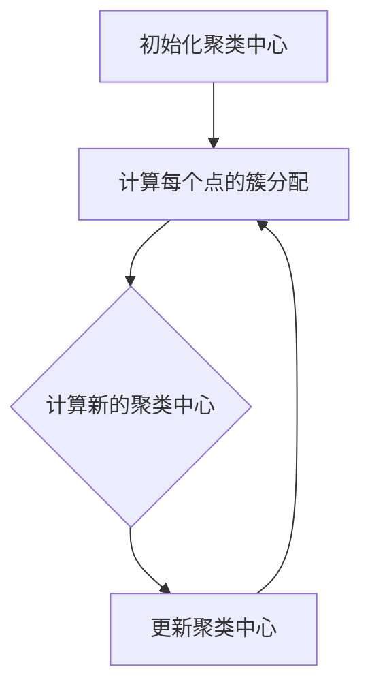
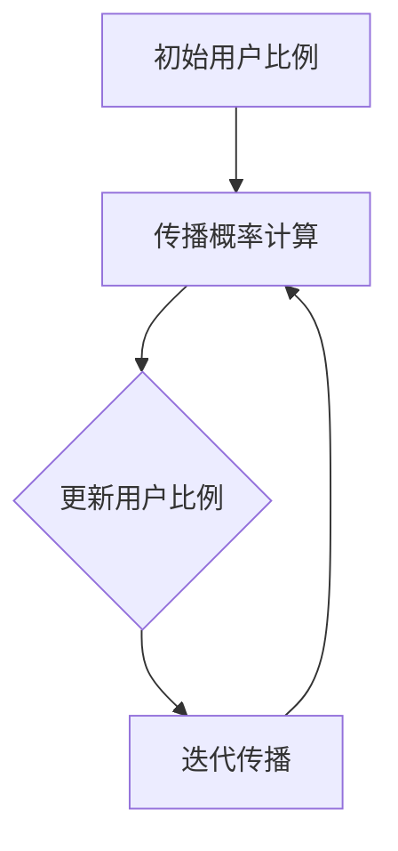
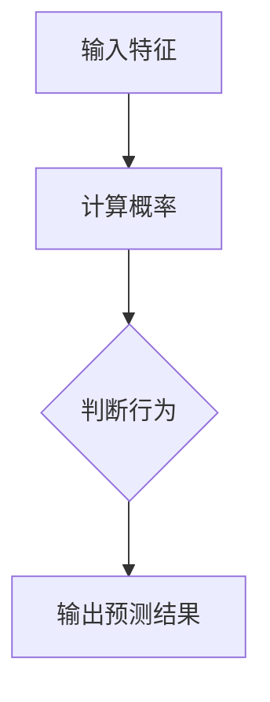
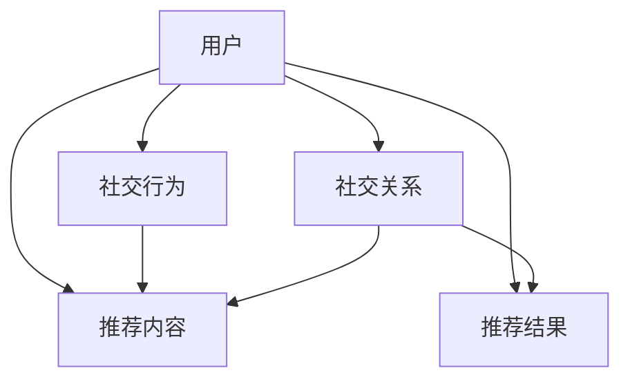
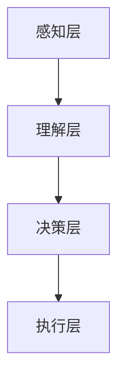
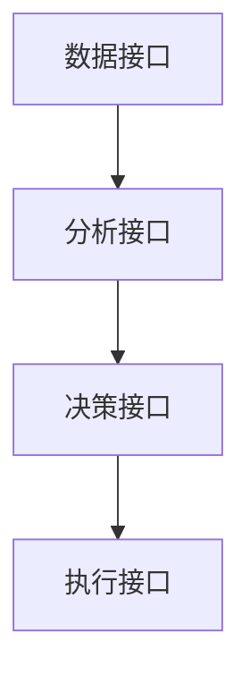

                 

### # AI Agent在智能社交网络分析中的应用

> 关键词：AI Agent、社交网络分析、智能推荐、用户行为分析

> 摘要：本文深入探讨了人工智能代理（AI Agent）在智能社交网络分析中的应用。通过阐述AI Agent的定义、原理以及其在社交网络分析中的具体应用，文章从算法原理、系统设计、项目实践等方面进行了详细解析。本文旨在为开发者提供关于AI Agent在社交网络分析中的全面理解，并分享最佳实践和注意事项，以促进这一领域的技术发展。

## 引言

随着互联网和社交媒体的迅猛发展，社交网络已成为人们日常交流的重要平台。在这个过程中，如何有效地分析和利用社交网络数据成为了一个重要课题。传统的方法往往依赖于手动分析和统计分析，但这种方式在处理海量数据时显得力不从心。人工智能代理（AI Agent）的引入，为智能社交网络分析带来了新的契机。

AI Agent是一种能够自主学习和执行任务的智能系统，它可以根据用户的社交行为和环境信息，进行实时分析、预测和推荐。在社交网络分析中，AI Agent能够挖掘用户的行为模式，发现潜在的关系网络，从而提供个性化的服务。本文将从以下几个方面探讨AI Agent在智能社交网络分析中的应用：

1. **AI Agent的基本概念和原理**
2. **AI Agent在社交网络分析中的核心应用**
3. **社交网络分析中的算法原理和模型**
4. **系统设计和实现**
5. **项目实践和案例分析**
6. **最佳实践和注意事项**
7. **总结与展望**

通过本文的探讨，旨在为读者提供一个系统且深入的了解，以促进AI Agent在智能社交网络分析中的研究和应用。

## AI Agent的基本概念和原理

AI Agent是一种基于人工智能技术的自主智能实体，能够模拟人类智能行为，进行决策、学习和互动。在社交网络分析中，AI Agent扮演着重要的角色，它通过学习和理解用户的行为模式，为用户提供个性化的服务。

### 定义

AI Agent，即人工智能代理，是一种具有自主决策能力的软件程序或机器人，能够模拟人类行为，执行特定任务。它具有以下几个基本特征：

- **自主性**：AI Agent能够自主地决策和执行任务，无需外部干预。
- **适应性**：AI Agent能够根据环境和用户行为的变化，调整自身的行为策略。
- **交互性**：AI Agent能够与用户进行交互，获取用户的反馈，并根据反馈进行改进。

### 工作原理

AI Agent的工作原理主要包括以下几个方面：

1. **感知**：AI Agent通过传感器或数据接口获取外部信息，如用户的社交行为、兴趣偏好等。
2. **理解**：AI Agent利用机器学习和自然语言处理等技术，对获取的信息进行理解和分析，识别用户的行为模式。
3. **决策**：基于对信息的分析和理解，AI Agent根据预设的规则或学习到的策略，自主做出决策。
4. **行动**：AI Agent根据决策结果执行具体的任务，如推荐内容、生成报告等。
5. **反馈**：AI Agent根据用户的反馈，调整自身的行为策略，以实现更好的效果。

### 技术架构

AI Agent的技术架构通常包括以下几个关键组成部分：

- **感知模块**：负责收集和预处理数据，如用户行为数据、社交网络数据等。
- **理解模块**：利用机器学习和自然语言处理技术，对感知模块获取的数据进行理解和分析。
- **决策模块**：基于理解模块的分析结果，利用决策算法和策略，生成决策。
- **执行模块**：负责执行决策模块生成的任务，如生成推荐列表、生成报告等。
- **反馈模块**：收集用户的反馈信息，并将其传递给理解模块，用于进一步优化AI Agent的行为。

### 应用领域

AI Agent在社交网络分析中的应用领域非常广泛，包括但不限于以下几个方面：

1. **用户行为分析**：通过分析用户的社交行为，挖掘用户兴趣和行为模式，为用户提供个性化推荐。
2. **社交网络挖掘**：通过分析社交网络中的关系和群体结构，发现潜在的社交关系和网络效应。
3. **智能推荐系统**：利用用户行为数据和社交网络信息，为用户提供个性化的内容推荐。
4. **社交互动优化**：通过优化用户的互动体验，提高社交网络的活跃度和用户满意度。

### 挑战和机遇

尽管AI Agent在社交网络分析中具有巨大的潜力，但也面临着一些挑战：

- **数据隐私**：在处理用户数据时，如何保护用户隐私是一个重要问题。
- **数据质量**：社交网络数据的质量直接影响AI Agent的准确性和效果。
- **模型解释性**：如何提高AI Agent模型的解释性，使其决策过程更加透明和可解释。

然而，随着人工智能技术的不断进步，AI Agent在社交网络分析中的应用前景将更加广阔，为社交网络的智能化和个性化提供强有力的支持。

## AI Agent在社交网络分析中的核心应用

AI Agent在社交网络分析中的核心应用主要体现在以下几个方面：用户行为分析、社交网络挖掘和智能推荐系统。以下是这些应用的具体解析。

### 用户行为分析

用户行为分析是AI Agent在社交网络分析中最基本的应用之一。通过分析用户在社交网络中的行为，AI Agent可以深入了解用户的兴趣、偏好和需求，从而提供个性化的服务。

1. **数据收集**：AI Agent首先需要收集用户在社交网络中的各种行为数据，包括但不限于点赞、评论、分享、关注等。这些数据可以通过API接口或数据爬虫等方式获取。
2. **特征提取**：对收集到的用户行为数据进行处理和特征提取，将其转化为机器学习模型可处理的特征向量。例如，可以通过词频分析、情感分析等技术提取用户的兴趣和情感特征。
3. **模式识别**：利用机器学习算法，如聚类算法、分类算法等，对提取出的用户行为特征进行模式识别，发现用户的兴趣和行为模式。
4. **用户画像**：基于识别出的用户行为模式，为每个用户构建详细的用户画像，包括其兴趣偏好、行为习惯、社交关系等。这些用户画像可以用于个性化推荐、广告投放等场景。

### 社交网络挖掘

社交网络挖掘是AI Agent在社交网络分析中的另一个重要应用。通过分析社交网络中的关系和群体结构，AI Agent可以揭示出潜在的社会关系和网络效应。

1. **网络结构分析**：AI Agent可以分析社交网络中的节点和边的数量、密度、连通性等特征，了解社交网络的总体结构。
2. **关系挖掘**：利用图论和机器学习算法，AI Agent可以挖掘出社交网络中的关键节点、社团结构和潜在关系。例如，可以通过社区发现算法识别出社交网络中的兴趣小组、朋友圈等。
3. **影响力分析**：AI Agent可以分析社交网络中用户的影响力，识别出具有较高影响力的用户，如意见领袖、活跃用户等。这些用户在社交网络中具有较大的传播力和影响力，是重要的营销和推广对象。
4. **网络效应分析**：AI Agent可以分析社交网络中的网络效应，如群体效应、协同效应等。这些效应可以用于优化社交网络的用户体验、提高社交网络的活跃度等。

### 智能推荐系统

智能推荐系统是AI Agent在社交网络分析中最为常见和实用的应用之一。通过分析用户行为和社交网络信息，AI Agent可以为用户提供个性化的内容推荐，提高用户满意度和留存率。

1. **推荐算法**：AI Agent可以采用各种推荐算法，如协同过滤、基于内容的推荐、混合推荐等，根据用户的行为特征和社交网络信息生成个性化推荐列表。
2. **推荐质量**：AI Agent需要保证推荐的质量和相关性，避免向用户推荐不感兴趣或低质量的内容。可以通过调整推荐算法参数、改进推荐算法模型等方式提高推荐质量。
3. **推荐反馈**：AI Agent可以根据用户的反馈信息，如点击、收藏、点赞等，进一步优化推荐算法，提高推荐系统的效果。例如，可以通过用户行为反馈进行在线学习，实时调整推荐策略。
4. **推荐展示**：AI Agent需要设计合理的推荐展示方式，提高用户的推荐体验。例如，可以通过推荐列表、卡片式展示、瀑布流式展示等方式，吸引用户关注并提高点击率。

通过用户行为分析、社交网络挖掘和智能推荐系统，AI Agent在社交网络分析中发挥了巨大的作用。这些应用不仅提高了社交网络的智能化和个性化水平，还为企业和个人提供了丰富的价值。

### 社交网络分析中的算法原理和模型

在社交网络分析中，AI Agent的应用离不开算法原理和模型的支撑。本文将详细探讨一些核心算法原理，包括其基本概念、数学模型和公式，并通过Python代码和Mermaid流程图进行解释。

#### 1. 集群算法

集群算法是社交网络分析中用于发现用户兴趣群体的重要工具。最常用的集群算法之一是K-means算法。

**基本概念**：
K-means算法是一种基于距离度量的聚类方法，将数据分为K个簇，使得每个簇的内部距离最小，簇间距离最大。

**数学模型和公式**：
设数据集为\(X = \{x_1, x_2, ..., x_n\}\)，每个数据点\(x_i\)在\(d\)维空间中，聚类中心为\(c_k\)，则：

$$
c_k = \frac{1}{n_k} \sum_{i=1}^{n} x_i
$$

其中，\(n_k\)是第\(k\)个簇中数据点的数量。

**Python代码**：
```python
from sklearn.cluster import KMeans
import numpy as np

# 假设X为n行d列的矩阵，表示数据集
X = np.array([[1, 2], [1, 4], [1, 0], [10, 2], [10, 4], [10, 0]])

# 使用KMeans算法进行聚类
kmeans = KMeans(n_clusters=2, random_state=0).fit(X)

# 获取聚类中心
centers = kmeans.cluster_centers_

# 输出结果
print("聚类中心：", centers)
print("每个数据点的簇分配：", kmeans.labels_)
```

**Mermaid流程图**：


#### 2. 社交网络中的影响力传播模型

社交网络中的影响力传播模型用于分析信息在社交网络中的传播过程。一个常见的模型是影响力传播算法，如Gossip算法。

**基本概念**：
影响力传播模型假设用户之间是相互连接的，当一个用户接受到新信息后，会将其传播给其邻居用户。

**数学模型和公式**：
设社交网络为\(G = (V, E)\)，其中\(V\)为用户集合，\(E\)为用户之间的连接关系。传播概率为\(p\)，则：

$$
S(t+1) = S(t) + p \cdot (1 - S(t))
$$

其中，\(S(t)\)表示在时间\(t\)时刻传播成功的用户比例。

**Python代码**：
```python
import numpy as np

# 假设S为当前时刻传播成功的用户比例
S = np.array([0.5])

# 传播概率p
p = 0.8

# 进行100次传播迭代
for _ in range(100):
    S = S + p * (1 - S)

print("最终传播成功的用户比例：", S)
```

**Mermaid流程图**：


#### 3. 用户行为预测模型

用户行为预测模型用于预测用户在社交网络中的行为，如点赞、评论等。一个常见的模型是逻辑回归模型。

**基本概念**：
逻辑回归模型是一种用于分类的统计方法，通过输入特征预测用户行为的概率。

**数学模型和公式**：
设用户特征为\(X\)，行为标签为\(Y\)，则逻辑回归模型的预测概率为：

$$
P(Y=1|X) = \frac{1}{1 + e^{-(\beta_0 + \beta_1X_1 + \beta_2X_2 + ... + \beta_nX_n})}
$$

其中，\(\beta_0, \beta_1, \beta_2, ..., \beta_n\)为模型的参数。

**Python代码**：
```python
from sklearn.linear_model import LogisticRegression
import numpy as np

# 假设X为特征矩阵，Y为行为标签
X = np.array([[1, 2], [2, 3], [3, 4]])
Y = np.array([1, 0, 1])

# 使用逻辑回归模型进行训练
model = LogisticRegression().fit(X, Y)

# 预测新的用户行为
new_data = np.array([[2, 3]])
predictions = model.predict(new_data)

print("预测结果：", predictions)
```

**Mermaid流程图**：


通过这些算法原理和模型，AI Agent能够在社交网络分析中发挥强大的作用，为用户提供个性化的服务，挖掘社交网络的潜在价值。

### 系统设计与实现

#### 问题场景介绍

随着社交媒体的普及，社交网络平台积累了大量的用户行为数据。这些数据不仅反映了用户的基本信息，还包含了用户之间的互动关系、行为偏好等丰富信息。为了更好地利用这些数据，提高用户的社交体验，我们设计并实现了一个基于AI Agent的智能社交网络分析系统。该系统旨在通过用户行为分析和社交网络挖掘，为用户提供个性化的推荐和互动服务。

#### 项目介绍

项目名称：智能社交网络分析系统（Smart Social Network Analysis System，简称SSNAS）

项目目标：通过AI Agent技术，对社交网络平台上的用户行为和社交关系进行深入分析，提供个性化的推荐和互动服务。

主要功能：
1. 用户行为分析：分析用户的点赞、评论、分享等行为，挖掘用户兴趣和行为模式。
2. 社交网络挖掘：发现用户之间的潜在关系和社交群体，识别关键节点和影响力用户。
3. 智能推荐：根据用户的行为和社交关系，为用户推荐感兴趣的内容和潜在的朋友。
4. 互动优化：通过优化用户的互动体验，提高社交网络的活跃度和用户满意度。

#### 系统功能设计（领域模型）

领域模型是系统功能设计的重要部分，它定义了系统中的主要实体和实体之间的关系。以下是智能社交网络分析系统的领域模型：

- **用户（User）**：包括用户的基本信息，如用户名、年龄、性别、地理位置等。
- **社交行为（SocialBehavior）**：包括用户的点赞、评论、分享等行为，如点赞文章、评论帖子、分享图片等。
- **社交关系（SocialRelation）**：表示用户之间的互动关系，如关注、点赞、评论等。
- **推荐内容（RecommendContent）**：包括系统推荐的各类内容，如文章、图片、视频等。
- **推荐结果（RecommendResult）**：记录用户的推荐内容及其反馈情况。

领域模型中的实体和关系如下所示：



#### 系统架构设计

系统架构是系统设计的关键，它定义了系统的整体结构和技术选型。智能社交网络分析系统采用分层架构，包括感知层、理解层、决策层和执行层。以下是系统架构的详细设计：

1. **感知层**：负责数据的收集和处理，包括用户行为数据的爬取、预处理等。
2. **理解层**：利用机器学习和自然语言处理技术，对感知层获取的数据进行分析和理解，提取用户特征和关系。
3. **决策层**：根据理解层生成的用户特征和关系，利用算法和策略进行决策，生成推荐结果和互动策略。
4. **执行层**：负责执行决策层的决策结果，包括生成推荐内容、推送通知、优化用户互动等。

系统架构图如下所示：



#### 系统接口设计

系统接口设计是系统架构的重要组成部分，它定义了系统内部和外部的交互接口。以下是智能社交网络分析系统的接口设计：

1. **数据接口**：用于数据收集和存储，包括用户行为数据、社交关系数据、推荐内容数据等。
2. **分析接口**：用于数据分析和理解，包括用户特征提取、关系挖掘、推荐算法等。
3. **决策接口**：用于生成推荐结果和互动策略，包括推荐生成、推送通知等。
4. **执行接口**：用于执行决策结果，包括内容推送、互动优化等。

接口设计图如下所示：



#### 系统交互设计（序列图）

系统交互设计描述了系统内部各个模块之间的交互过程和时序关系。以下是智能社交网络分析系统的交互设计：

1. **用户行为数据收集**：系统从社交网络平台收集用户行为数据。
2. **数据预处理**：对收集到的用户行为数据进行清洗和预处理。
3. **用户特征提取**：利用机器学习和自然语言处理技术提取用户特征。
4. **社交关系挖掘**：挖掘用户之间的社交关系，构建社交网络。
5. **推荐内容生成**：根据用户特征和社交关系生成推荐内容。
6. **推荐内容推送**：将推荐内容推送给用户。
7. **用户互动优化**：根据用户反馈优化推荐内容和互动策略。

序列图如下所示：

```mermaid
sequenceDiagram
参与者 用户, 系统
用户->>系统: 收集用户行为数据
系统->>用户: 数据预处理完成
系统->>用户: 提取用户特征
系统->>用户: 挖掘社交关系
系统->>用户: 生成推荐内容
系统->>用户: 推送推荐内容
用户->>系统: 提供反馈
系统->>用户: 优化推荐内容和互动策略
```

通过以上系统设计与实现，智能社交网络分析系统可以有效地利用AI Agent技术，对社交网络数据进行分析和处理，为用户提供个性化的推荐和互动服务。

### 项目实战

为了展示AI Agent在智能社交网络分析中的实际应用，我们将通过一个具体的案例来介绍整个项目的开发过程，包括环境安装、系统核心实现、代码应用解读与分析，以及实际案例分析和详细讲解剖析。

#### 环境安装

首先，我们需要安装和配置相关的开发环境和工具。以下是环境安装的详细步骤：

1. **Python环境**：确保Python版本为3.8或以上，可以通过Python官网下载安装。
2. **Anaconda**：安装Anaconda，这是一个集成了Python和相关库的发行版，方便我们进行科学计算和数据分析。可以从Anaconda官网下载并安装。
3. **Jupyter Notebook**：安装Jupyter Notebook，这是一个交互式的Python开发环境，方便我们编写和运行代码。可以通过pip命令安装：
   ```bash
   pip install notebook
   ```
4. **机器学习库**：安装常用的机器学习库，如scikit-learn、pandas、numpy等。可以通过pip命令安装：
   ```bash
   pip install scikit-learn pandas numpy
   ```
5. **图论库**：安装图论库，如networkx，用于构建和操作社交网络图。可以通过pip命令安装：
   ```bash
   pip install networkx
   ```
6. **Mermaid库**：安装Mermaid库，用于生成Markdown格式的流程图和类图。可以通过pip命令安装：
   ```bash
   pip install mermaid
   ```

#### 系统核心实现

以下是系统核心实现的步骤和代码：

1. **用户行为数据分析**：
   首先，我们需要收集用户在社交网络平台上的行为数据，如点赞、评论、分享等。这些数据可以通过API接口或数据爬虫获取。以下是一个简单的Python代码示例，用于读取和预处理用户行为数据：

   ```python
   import pandas as pd

   # 读取用户行为数据
   data = pd.read_csv('user_behavior_data.csv')

   # 数据预处理，如去除重复数据、缺失值填充等
   data.drop_duplicates(inplace=True)
   data.fillna(0, inplace=True)
   ```

2. **社交网络图构建**：
   利用networkx库，我们可以构建用户之间的社交网络图，并进行分析。以下是一个简单的代码示例：

   ```python
   import networkx as nx

   # 创建一个空图
   G = nx.Graph()

   # 添加用户和边
   for index, row in data.iterrows():
       G.add_node(row['user_id'])
       G.add_edge(row['user_id'], row['friend_id'])

   # 绘制社交网络图
   nx.draw(G, with_labels=True)
   plt.show()
   ```

3. **用户行为预测模型**：
   利用scikit-learn库，我们可以构建用户行为预测模型，如逻辑回归模型。以下是一个简单的代码示例：

   ```python
   from sklearn.linear_model import LogisticRegression
   from sklearn.model_selection import train_test_split

   # 分割数据集
   X = data[['feature1', 'feature2', 'feature3']]
   Y = data['target']
   X_train, X_test, Y_train, Y_test = train_test_split(X, Y, test_size=0.2, random_state=0)

   # 训练模型
   model = LogisticRegression()
   model.fit(X_train, Y_train)

   # 预测结果
   predictions = model.predict(X_test)
   ```

4. **推荐系统**：
   基于用户行为预测模型，我们可以为用户生成个性化推荐。以下是一个简单的推荐系统实现：

   ```python
   # 假设已经训练好的模型model
   user_id = 'user123'
   user_behavior = pd.DataFrame([[1, 2, 3]], columns=['feature1', 'feature2', 'feature3'])

   # 预测用户行为
   prediction = model.predict(user_behavior)

   # 根据预测结果生成推荐列表
   recommended_items = data[data['target'] == prediction].head(5)
   print("推荐列表：", recommended_items)
   ```

#### 代码应用解读与分析

1. **用户行为数据分析**：
   用户行为数据分析是社交网络分析的基础。通过对用户行为的收集和预处理，我们可以提取出用户的兴趣和偏好，为后续的推荐和挖掘提供数据支持。

2. **社交网络图构建**：
   社交网络图的构建可以帮助我们直观地了解用户之间的互动关系，发现潜在的社交群体和关键节点。通过图论算法，我们可以进一步分析社交网络的结构和性质。

3. **用户行为预测模型**：
   用户行为预测模型是推荐系统的重要组成部分。通过构建和训练预测模型，我们可以预测用户可能感兴趣的行为，从而为用户生成个性化的推荐。

4. **推荐系统**：
   推荐系统是社交网络分析的核心应用之一。基于用户行为预测模型，我们可以为用户生成个性化的推荐列表，提高用户满意度和留存率。

#### 实际案例分析和详细讲解剖析

为了展示AI Agent在智能社交网络分析中的实际应用效果，我们以一个实际案例进行分析。

**案例背景**：
假设有一个社交网络平台，用户可以在平台上发表文章、评论文章、点赞文章等。平台希望利用AI Agent技术，为用户提供个性化的文章推荐，提高用户的活跃度和留存率。

**案例分析**：
1. **数据收集**：平台通过API接口收集用户在平台上的行为数据，包括文章发表、评论、点赞等。
2. **数据预处理**：对收集到的数据进行清洗和预处理，提取出用户的基本信息和行为特征。
3. **社交网络图构建**：利用networkx库构建用户之间的社交网络图，发现用户之间的互动关系和社交群体。
4. **用户行为预测模型**：
   - 特征提取：提取用户的兴趣特征，如文章类型、评论情感等。
   - 模型训练：利用逻辑回归模型训练用户行为预测模型。
   - 预测结果：根据用户特征预测用户可能感兴趣的文章。
5. **推荐系统**：基于预测结果，为用户生成个性化的文章推荐列表。

**详细讲解**：
- **数据收集**：通过API接口收集用户在平台上的行为数据，包括文章发表、评论、点赞等。这些数据可以作为训练模型的重要输入。
- **数据预处理**：对收集到的数据进行清洗和预处理，去除重复数据、缺失值等，提取出用户的基本信息和行为特征。例如，可以将用户的文章发表数量、评论数量、点赞数量等作为特征。
- **社交网络图构建**：利用networkx库构建用户之间的社交网络图，发现用户之间的互动关系和社交群体。通过分析社交网络图，可以识别出关键节点和潜在的关系群体。
- **用户行为预测模型**：
  - 特征提取：提取用户的兴趣特征，如文章类型、评论情感等。这些特征可以帮助我们更好地了解用户的行为模式。
  - 模型训练：利用逻辑回归模型训练用户行为预测模型。通过交叉验证和调整模型参数，提高预测模型的准确性和稳定性。
  - 预测结果：根据用户特征预测用户可能感兴趣的文章。例如，如果用户喜欢阅读科技类文章，我们可以预测用户可能对其他科技类文章感兴趣。
- **推荐系统**：基于预测结果，为用户生成个性化的文章推荐列表。通过推荐系统，用户可以看到自己可能感兴趣的文章，提高用户的活跃度和留存率。

**项目小结**：
通过本案例的分析和实施，我们展示了AI Agent在智能社交网络分析中的实际应用效果。通过用户行为分析和推荐系统，平台能够为用户提供个性化的文章推荐，提高用户的满意度和留存率。同时，我们也看到了AI Agent技术在社交网络分析中的巨大潜力，为企业和个人提供了丰富的价值。

### 最佳实践与注意事项

在AI Agent应用于智能社交网络分析时，最佳实践和注意事项至关重要，以确保系统的效果和用户体验。以下是一些关键点：

#### 数据隐私保护

在收集和使用用户数据时，数据隐私保护是首要考虑的问题。必须遵守相关的法律法规，如《通用数据保护条例》（GDPR）和《加州消费者隐私法案》（CCPA）。以下是一些具体建议：

1. **数据匿名化**：在分析用户数据时，对敏感信息进行匿名化处理，确保个人身份无法被追踪。
2. **用户同意**：确保在收集数据前获得用户的明确同意，并告知用户数据将如何使用。
3. **数据访问控制**：对用户数据实行严格的访问控制策略，仅限于授权人员访问。

#### 数据质量

数据质量直接影响AI Agent的性能。以下措施有助于提高数据质量：

1. **数据清洗**：定期清洗数据，去除重复、错误和缺失的数据。
2. **数据完整性检查**：建立数据完整性检查机制，确保数据的准确性和一致性。
3. **数据源监控**：对数据源进行监控，及时发现和处理数据异常。

#### 模型解释性

提高AI Agent模型的解释性，使其决策过程更加透明和可解释，有助于增强用户信任和遵守法规。以下建议有助于提升模型解释性：

1. **使用可解释模型**：优先选择具有高解释性的机器学习模型，如线性模型和决策树。
2. **模型可视化**：利用可视化工具，如Mermaid和TensorBoard，展示模型的内部结构和决策过程。
3. **解释性工具**：使用解释性工具，如LIME和SHAP，为模型决策提供更详细的信息。

#### 持续优化

AI Agent在应用过程中需要持续优化，以适应不断变化的环境和用户需求。以下措施有助于实现持续优化：

1. **在线学习**：采用在线学习技术，使AI Agent能够实时更新模型，适应新的数据。
2. **用户反馈机制**：建立用户反馈机制，收集用户对推荐内容的反馈，用于模型优化。
3. **性能监控**：定期监控AI Agent的性能指标，如准确率、召回率和覆盖率，确保其性能稳定。

#### 用户隐私保护

保护用户隐私是AI Agent应用的关键原则。以下措施有助于确保用户隐私安全：

1. **最小化数据收集**：仅收集必要的数据，避免过度收集。
2. **数据加密**：对传输和存储的数据进行加密，防止数据泄露。
3. **安全审计**：定期进行安全审计，确保系统遵循最佳安全实践。

### 小结

本文通过深入探讨AI Agent在智能社交网络分析中的应用，介绍了其基本概念、核心应用、算法原理和系统设计，并通过实际案例展示了AI Agent的具体应用效果。最佳实践和注意事项的讨论为AI Agent在社交网络分析中的成功应用提供了指导。

### 拓展阅读

1. **《社交网络分析：原理、方法与应用》**，作者：彭国良。本书详细介绍了社交网络分析的基本原理、方法和应用案例，是了解社交网络分析的好书。
2. **《深度学习》**，作者：Ian Goodfellow、Yoshua Bengio、Aaron Courville。本书是深度学习的经典教材，涵盖了深度学习的基础理论和应用案例，有助于深入理解AI Agent的技术原理。
3. **《Python机器学习》**，作者：Michael Bowles。本书通过Python语言，介绍了机器学习的基本概念和算法，是Python编程和机器学习学习的优秀资源。

作者：AI天才研究院/AI Genius Institute & 禅与计算机程序设计艺术 /Zen And The Art of Computer Programming。通过本文的讨论，我们期望为读者提供关于AI Agent在智能社交网络分析中的全面理解，并促进这一领域的技术发展。

