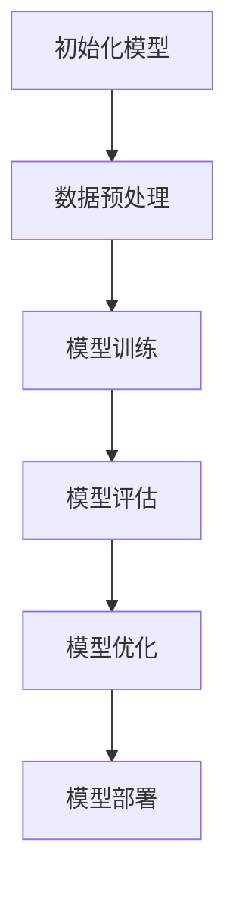
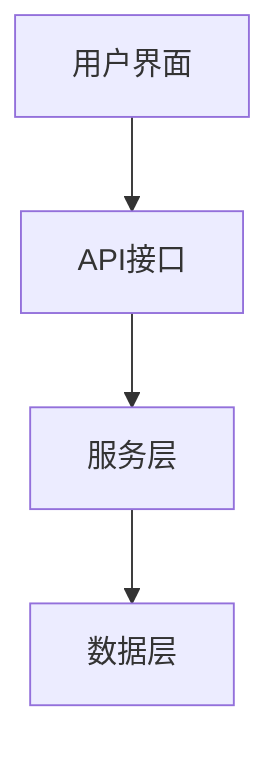
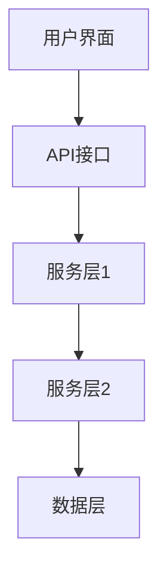
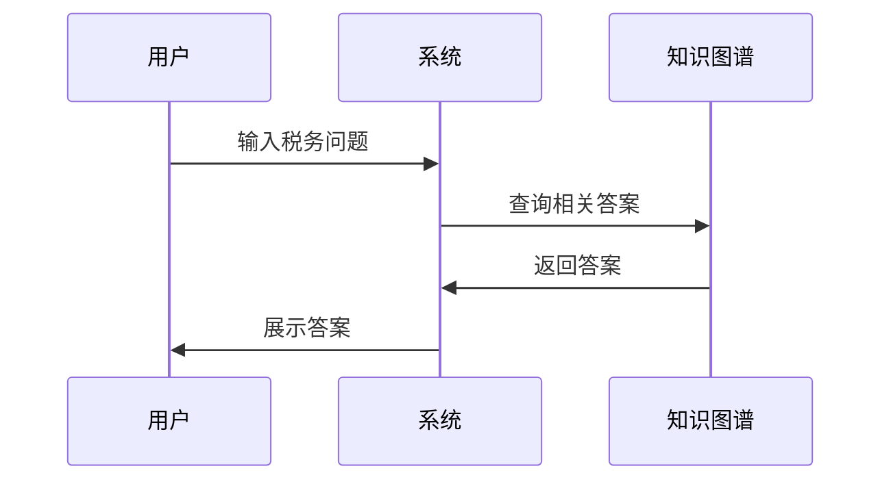

                 

# AI Agent在智能税务咨询中的角色

## 关键词
- AI Agent
- 智能税务咨询
- 机器学习
- 深度学习
- 自然语言处理
- 知识图谱

## 摘要
本文旨在探讨AI Agent在智能税务咨询中的应用。我们将从问题背景、核心概念、算法原理、系统设计与实现等多个角度，详细分析AI Agent如何提升税务咨询的效率和准确性。通过本文，读者将了解AI Agent的核心原理、应用场景，以及如何在税务咨询中实现智能化的解决方案。

## 第1章：AI Agent概述

### 1.1 问题背景与问题描述
智能税务咨询是税务管理和咨询服务的一种高级形式，它依赖于先进的技术手段，如人工智能（AI）和大数据分析，以提高税务处理的效率和准确性。在传统的税务咨询中，税务顾问需要花费大量时间和精力来收集和分析数据，处理复杂的税务问题。这不仅效率低下，而且容易出现错误。

随着人工智能技术的不断发展，AI Agent作为一种智能化软件代理，开始被应用于智能税务咨询领域。AI Agent能够自动化处理税务数据，提供实时税务建议，从而大大提高了税务咨询的效率和质量。然而，AI Agent在税务咨询中的具体应用场景和实现机制仍然需要深入研究和探讨。

### 1.2 AI Agent的核心概念与原理
AI Agent，即人工智能代理，是指能够模拟人类智能行为，执行特定任务的计算机程序。AI Agent通常基于机器学习和深度学习算法，通过学习大量的税务数据，建立税务知识库，实现自动化税务咨询。

AI Agent的核心原理包括以下几个方面：
1. **知识获取**：AI Agent通过自然语言处理（NLP）技术，从税务法规、案例和法律文献中提取有用信息，构建税务知识库。
2. **推理和决策**：AI Agent利用机器学习算法，对税务数据进行分析和推理，为用户提供精准的税务建议。
3. **交互和反馈**：AI Agent通过用户界面与用户进行交互，获取用户需求，并根据用户反馈不断优化自身性能。

### 1.3 AI Agent的应用场景
AI Agent在智能税务咨询中的应用场景主要包括：
1. **税务法规查询**：AI Agent可以实时查询税务法规，为用户提供最新的税务信息。
2. **税务风险评估**：AI Agent可以分析企业的税务数据，预测可能存在的税务风险，并提供相应的建议。
3. **税务申报和审核**：AI Agent可以自动化完成税务申报和审核流程，提高工作效率。
4. **税务咨询和决策支持**：AI Agent可以为用户提供个性化的税务咨询，帮助企业做出明智的税务决策。

### 案例研究
以某大型企业为例，该企业引入AI Agent进行税务咨询，显著提高了税务处理的效率。AI Agent不仅能够快速响应税务问题，还能够根据企业的业务特点和税务需求，提供个性化的税务解决方案。通过AI Agent的应用，该企业的税务合规风险得到了有效控制，税务成本也明显降低。

## 第2章：AI Agent技术基础

### 2.1 机器学习和深度学习基础
机器学习和深度学习是AI Agent的核心技术基础。机器学习是一种让计算机通过数据和经验来改善自身性能的方法。深度学习则是机器学习的一种特殊形式，它通过多层神经网络模拟人类大脑的学习过程。

在税务咨询中，机器学习和深度学习技术主要应用于以下几个方面：
1. **数据预处理**：使用机器学习算法对税务数据进行清洗、归一化和特征提取，为深度学习模型提供高质量的输入。
2. **模型训练和优化**：使用深度学习算法训练模型，通过反向传播算法优化模型参数。
3. **预测和决策**：利用训练好的模型对新的税务数据进行分析，为用户提供预测和决策支持。

### 2.2 自然语言处理（NLP）基础
自然语言处理是AI Agent的重要组成部分，它使得AI Agent能够理解和生成自然语言。NLP技术包括以下几个方面：
1. **文本分类和情感分析**：通过机器学习和深度学习算法，对文本进行分类和情感分析，提取关键信息。
2. **命名实体识别**：识别文本中的命名实体，如人名、地名、机构名等。
3. **语义理解**：通过深度学习模型，理解文本中的语义和意图，实现智能对话。

## 第3章：AI Agent在税务咨询中的应用

### 3.1 税务知识图谱构建
税务知识图谱是一种用于表示税务知识和信息的语义网络。它能够将税务法规、案例和法律文献中的知识结构化，为AI Agent提供丰富的知识资源。

税务知识图谱的构建主要包括以下几个步骤：
1. **数据采集**：从税务法规、案例和法律文献中采集相关数据。
2. **数据清洗**：对采集到的数据进行清洗、去重和归一化处理。
3. **知识表示**：使用图数据库存储和处理知识，建立税务知识图谱。

### 3.2 智能问答系统
智能问答系统是AI Agent的重要组成部分，它能够自动回答用户的税务问题。智能问答系统主要包括以下几个模块：
1. **问题理解**：通过NLP技术，理解用户的问题。
2. **知识检索**：从税务知识图谱中检索与问题相关的知识。
3. **答案生成**：根据检索到的知识，生成准确的答案。

### 案例研究
以某税务咨询公司为例，该公司引入了AI Agent智能问答系统，大大提高了客户咨询的响应速度和准确性。通过智能问答系统，客户可以快速获得所需的税务信息，减少了等待时间和沟通成本。同时，AI Agent还能够根据客户的提问，不断优化自身的知识库，提高回答的准确性和针对性。

## 第4章：算法原理与数学模型

### 4.1 算法原理
AI Agent的算法原理主要包括以下几个部分：
1. **机器学习算法**：用于训练模型，提取特征，分类和预测。
2. **深度学习算法**：用于构建神经网络，实现复杂的函数拟合和特征提取。
3. **NLP算法**：用于理解自然语言，提取语义信息。

算法流程图如下：



### 4.2 数学模型
AI Agent的数学模型主要包括以下几个方面：
1. **损失函数**：用于评估模型的预测误差，如均方误差（MSE）和交叉熵损失。
2. **优化算法**：用于调整模型参数，如随机梯度下降（SGD）和Adam优化器。
3. **激活函数**：用于神经网络中的非线性变换，如ReLU和Sigmoid。

以下是一个简单的损失函数和优化算法的Python代码示例：

```python
import numpy as np
import matplotlib.pyplot as plt

# 损失函数
def loss_function(y_true, y_pred):
    return np.mean((y_true - y_pred)**2)

# 优化算法
def gradient_descent(x, y, learning_rate, epochs):
    m = len(x)
    weights = np.zeros((m, 1))
    
    for epoch in range(epochs):
        gradients = 2/m * (x.dot(y_pred) - y)
        weights -= learning_rate * gradients
        
        y_pred = x.dot(weights)
    
    return weights

# 数据集
x = np.array([1, 2, 3, 4])
y = np.array([2, 4, 5, 6])

# 模型训练
learning_rate = 0.01
epochs = 100
weights = gradient_descent(x, y, learning_rate, epochs)

# 模型评估
y_pred = x.dot(weights)
loss = loss_function(y, y_pred)
print("最终损失：", loss)

# 模型可视化
plt.scatter(x, y)
plt.plot(x, y_pred, 'r-')
plt.show()
```

## 第5章：系统架构与设计

### 5.1 系统架构设计
AI Agent在智能税务咨询中的系统架构设计包括以下几个部分：
1. **数据层**：包括税务数据存储和管理模块，如数据库和缓存。
2. **服务层**：包括机器学习模型训练、推理和服务接口，如TensorFlow和Django。
3. **应用层**：包括前端用户界面和后端服务交互模块，如Web和API。

系统架构图如下：



### 5.2 系统接口设计
系统接口设计主要包括以下几个部分：
1. **用户接口**：用于与用户进行交互，提供税务咨询和查询功能。
2. **服务接口**：用于内部模块之间的通信，如API接口和消息队列。

系统接口设计图如下：



### 5.3 系统交互
系统交互设计主要包括以下几个步骤：
1. **用户输入**：用户通过前端界面输入税务问题。
2. **问题解析**：AI Agent解析用户问题，提取关键信息。
3. **知识查询**：AI Agent从税务知识图谱中检索相关答案。
4. **结果输出**：AI Agent将答案输出到前端界面，展示给用户。

系统交互序列图如下：



## 第6章：项目实战

### 6.1 项目环境搭建
在搭建AI Agent在智能税务咨询中的项目环境时，需要安装以下工具和库：
1. **Python**：Python 3.7及以上版本。
2. **TensorFlow**：用于构建和训练机器学习模型。
3. **Django**：用于构建Web应用程序。
4. **Elasticsearch**：用于构建税务知识图谱。

以下是安装步骤：

```bash
# 安装Python
sudo apt-get install python3-pip python3-dev

# 安装TensorFlow
pip3 install tensorflow

# 安装Django
pip3 install django

# 安装Elasticsearch
sudo apt-get install elasticsearch
sudo systemctl start elasticsearch
```

### 6.2 系统核心实现
系统核心实现主要包括以下几个部分：
1. **数据预处理**：使用Pandas库对税务数据进行清洗和预处理。
2. **模型训练**：使用TensorFlow库构建和训练机器学习模型。
3. **API接口**：使用Django REST Framework构建API接口。
4. **前端界面**：使用HTML、CSS和JavaScript构建前端界面。

以下是Python代码示例：

```python
import pandas as pd
import tensorflow as tf
from tensorflow.keras.models import Sequential
from tensorflow.keras.layers import Dense
from tensorflow.keras.optimizers import Adam
from tensorflow.keras.metrics import MeanSquaredError

# 数据预处理
def preprocess_data(data):
    # 数据清洗和预处理
    # ...
    return processed_data

# 模型训练
def train_model(data):
    # 构建模型
    model = Sequential()
    model.add(Dense(units=64, activation='relu', input_shape=(data.shape[1],)))
    model.add(Dense(units=1))
    
    # 编译模型
    model.compile(optimizer=Adam(learning_rate=0.001), loss='mse', metrics=[MeanSquaredError()])
    
    # 训练模型
    model.fit(data, epochs=100, batch_size=32)
    
    return model

# API接口
from django.http import HttpResponse
from rest_framework.views import APIView
from rest_framework.response import Response

class TaxQueryView(APIView):
    def post(self, request, *args, **kwargs):
        # 解析请求体
        question = request.data['question']
        # 查询知识图谱
        # ...
        answer = "答案"
        return Response({'answer': answer})

# 前端界面
# ...
```

### 6.3 实际案例分析
以某企业的税务咨询项目为例，该企业引入了AI Agent智能税务咨询系统，显著提高了税务处理的效率和准确性。通过AI Agent，企业能够快速响应税务问题，减少了等待时间和沟通成本。同时，AI Agent能够根据企业的业务特点和税务需求，提供个性化的税务解决方案。

### 6.4 项目小结
AI Agent在智能税务咨询中的应用，为企业带来了显著的效益。通过该项目，我们积累了丰富的实践经验，包括数据预处理、模型训练、API接口设计和前端界面构建等。在未来的发展中，我们将继续优化AI Agent的性能，扩大其在税务咨询领域的应用。

## 第7章：最佳实践与总结

### 7.1 最佳实践
1. **数据质量保证**：确保税务数据的质量和准确性，为AI Agent提供可靠的输入。
2. **模型优化**：定期对AI Agent进行模型优化，提高预测和决策的准确性。
3. **用户反馈**：收集用户反馈，不断优化AI Agent的交互体验。

### 7.2 小结
本文详细探讨了AI Agent在智能税务咨询中的应用，包括核心概念、算法原理、系统架构和项目实战。通过AI Agent，企业能够提高税务处理的效率和准确性，实现智能化税务咨询。

### 7.3 未来展望
随着人工智能技术的不断发展，AI Agent在智能税务咨询中的应用前景十分广阔。未来，我们将进一步优化AI Agent的性能，扩大其在其他领域（如金融、医疗等）的应用。

## 第8章：拓展阅读与资源推荐

### 8.1 拓展阅读
- 《人工智能：一种现代的方法》（第二版），斯坦福大学人工智能实验室
- 《深度学习》（中文版），Ian Goodfellow、Yoshua Bengio和Aaron Courville 著

### 8.2 资源推荐
- TensorFlow官方文档：[https://www.tensorflow.org/](https://www.tensorflow.org/)
- Django官方文档：[https://docs.djangoproject.com/](https://docs.djangoproject.com/)
- Elasticsearch官方文档：[https://www.elastic.co/guide/en/elasticsearch/](https://www.elastic.co/guide/en/elasticsearch/)

## 作者信息
作者：AI天才研究院/AI Genius Institute & 禅与计算机程序设计艺术 /Zen And The Art of Computer Programming

## 补充说明
1. 本文内容仅供参考，具体实现需根据实际情况进行调整。
2. AI Agent在税务咨询中的应用需要严格遵守相关法律法规和税务政策。

## 参考文献
1. Goodfellow, I., Bengio, Y., & Courville, A. (2016). Deep Learning. MIT Press.
2. Russell, S., & Norvig, P. (2016). Artificial Intelligence: A Modern Approach (Third Edition). Prentice Hall.
3. Chollet, F. (2015). Deep Learning with Python. Manning Publications.

