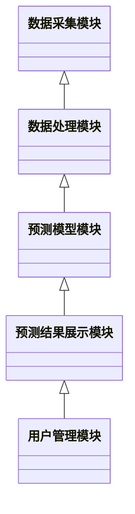
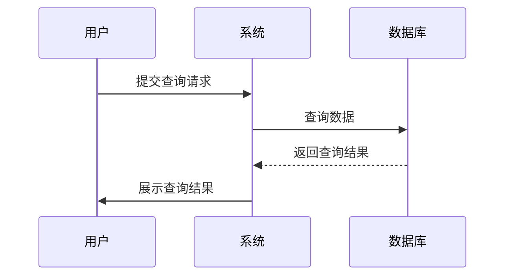
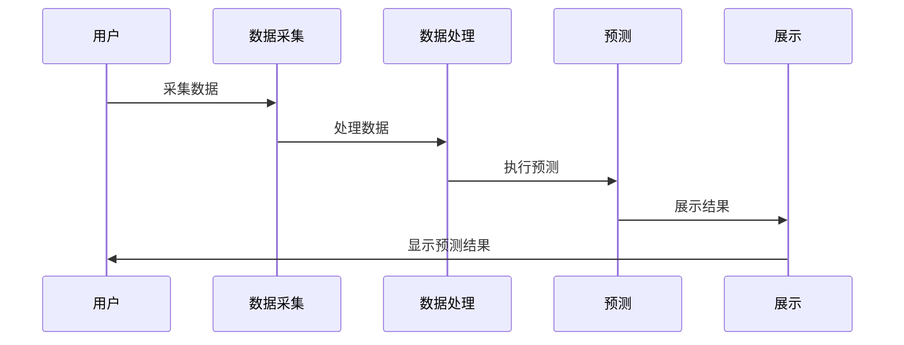
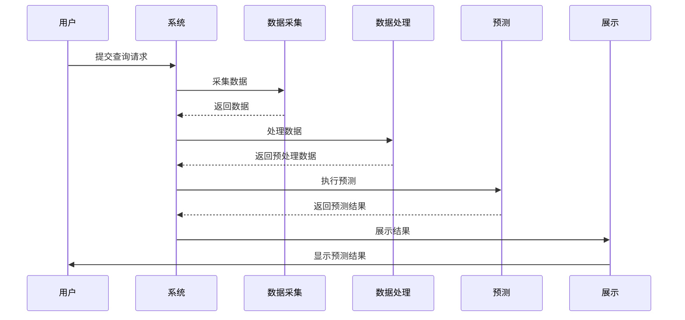

                 

### 摘要

在当今社会，空气质量对人类健康和环境的直接影响日益突出。智能空气质量预测作为解决这一问题的有效途径，正逐步受到广泛关注。本文聚焦于AI Agent在智能空气质量预测中的实践，旨在探讨如何利用AI技术提升空气质量预测的准确性和效率。文章首先介绍了空气质量预测的背景、重要性和面临的挑战，随后详细阐述了AI Agent的核心概念和其在空气质量预测中的应用。接着，本文通过分析空气质量预测的算法原理、数学模型，以及使用Python源代码进行了深入讲解。随后，文章探讨了空气质量预测系统的设计，包括项目介绍、功能设计、架构设计、接口设计和交互。最后，通过一个实际案例展示了AI Agent在空气质量预测中的具体应用，提供了详细的代码解读、案例分析，并总结了最佳实践和注意事项。本文不仅为从业者提供了实用的技术指南，也为未来的研究提供了新的思路。

### 关键词

- 智能空气质量预测
- AI Agent
- 算法原理
- 数学模型
- 系统架构设计
- 实际案例

### 第一部分：背景介绍

空气质量是衡量环境健康的重要指标，直接关系到人类的生活质量和生态平衡。近年来，随着工业化进程的加速和城市化水平的提高，空气污染问题日益严重，成为全球范围内的公共健康挑战。智能空气质量预测作为解决这一问题的有效手段，正逐渐成为研究的热点。

#### 1.1 空气质量预测的重要性

空气质量预测不仅能够帮助人们及时了解环境污染状况，还能为政府和企业提供科学依据，制定有效的环保政策和措施。例如，准确的空气质量预测可以提前预警，减少空气污染事件对人类健康和环境的损害。此外，它还能为环境保护部门提供实时监测数据，指导环境治理和污染源控制。

#### 1.2 问题背景

当前，空气质量预测主要依赖于传统的方法，如地面监测站的数据收集和分析。然而，这种方法存在以下问题：

1. **监测范围有限**：地面监测站的分布相对稀疏，无法全面覆盖空气质量监测的需求。
2. **时效性不足**：地面监测数据更新频率较低，难以提供实时、准确的空气质量信息。
3. **准确性受限**：传统方法对复杂气象条件和多种污染物相互作用的理解和预测能力有限。

#### 1.3 问题描述

为了克服传统方法的局限性，急需一种能够实时、高效且准确预测空气质量的智能预测系统。这样的系统不仅需要集成多种数据源，还需要具备强大的数据处理和分析能力。因此，引入AI Agent成为解决这一问题的有效途径。

#### 1.4 问题解决

AI Agent是一种基于人工智能技术的智能体，能够通过自主学习和推理，从海量数据中提取有价值的信息，进行决策和预测。在空气质量预测中，AI Agent能够利用历史数据、实时数据和气象数据，通过复杂算法进行深度学习和预测，从而提供更准确、更实时的空气质量预测。

#### 1.5 边界与外延

空气质量预测不仅涉及到科学和技术的挑战，还与社会管理、政策制定和公众参与紧密相关。因此，在实施智能空气质量预测系统时，需要考虑多方面的因素，包括数据采集的规范性、模型训练的公正性、预测结果的可靠性等。

#### 1.6 概念结构与核心要素组成

空气质量预测系统的核心概念包括：

1. **数据源**：包括地面监测数据、卫星遥感数据、气象数据等。
2. **算法模型**：用于空气质量预测的机器学习算法，如回归分析、神经网络、决策树等。
3. **预测引擎**：用于运行算法模型，生成空气质量预测结果的计算平台。
4. **用户界面**：用于展示预测结果，提供交互功能的可视化平台。

通过这些核心要素的有机结合，可以构建一个高效、智能的空气质量预测系统，为环境保护和公共健康提供有力支持。

### 第二部分：核心概念与联系

#### 2.1 AI Agent的概念

AI Agent，即人工智能代理，是一种基于人工智能技术，能够自主执行任务、与环境交互的智能实体。它能够通过感知、理解、决策和行动等过程，完成特定的目标。AI Agent的核心特点包括：

1. **自主性**：AI Agent能够独立完成任务，不需要人类的直接干预。
2. **适应性**：AI Agent能够根据环境的变化调整自身的行为和策略。
3. **协同性**：AI Agent能够与其他AI Agent或人类协作，共同完成任务。

#### 2.2 AI Agent在空气质量预测中的应用

AI Agent在空气质量预测中的应用主要体现在以下几个方面：

1. **数据采集与处理**：AI Agent能够自动采集各种环境数据，如空气质量监测数据、气象数据等，并对这些数据进行预处理和分析。
2. **预测模型训练**：AI Agent能够利用采集到的数据，训练空气质量预测模型，提高预测的准确性。
3. **实时预测与反馈**：AI Agent能够实时预测空气质量，并根据预测结果提供相应的预警和建议，如提示居民减少户外活动、提示环保部门加强污染源控制等。

#### 2.3 概念属性特征对比表格

为了更好地理解AI Agent在空气质量预测中的应用，我们对比了传统方法和AI Agent的特点，具体如下表所示：

| 特征 | 传统方法 | AI Agent |
| :--: | :--: | :--: |
| 监测范围 | 有限 | 全面 |
| 时效性 | 较低 | 实时 |
| 准确性 | 受限 | 高 |
| 自主性 | 需要人工干预 | 自主执行 |
| 适应性 | 有限 | 高 |
| 协同性 | 有限 | 高 |

#### 2.4 ER实体关系图架构

为了更清晰地展示AI Agent在空气质量预测中的应用，我们使用ER实体关系图来描述系统的架构。ER图中的实体包括：

1. **数据源**：包括地面监测数据、气象数据、卫星遥感数据等。
2. **数据处理模块**：负责对数据源进行预处理、分析和存储。
3. **预测模型**：用于空气质量预测的机器学习模型。
4. **预测引擎**：负责运行预测模型，生成空气质量预测结果。
5. **用户界面**：用于展示预测结果，提供交互功能。

以下是ER实体关系图的Mermaid表示：

```mermaid
erDiagram
  数据源 ||--|{ 数据处理模块 }|
  数据处理模块 ||--|{ 预测模型 }|
  预测模型 ||--|{ 预测引擎 }|
  预测引擎 ||--|{ 用户界面 }|
```

通过这个ER图，我们可以看到AI Agent在空气质量预测系统中的核心作用，以及各个模块之间的数据流和依赖关系。

### 第三部分：算法原理讲解

#### 3.1 空气质量预测算法概述

空气质量预测算法是智能空气质量预测系统的核心组成部分，它通过分析历史数据和实时数据，预测未来的空气质量状况。常见的空气质量预测算法包括回归分析、神经网络、决策树等。本节将重点介绍神经网络算法在空气质量预测中的应用。

#### 3.2 算法原理

神经网络是一种模拟人脑神经元连接方式的计算模型，通过多层神经元之间的加权连接和激活函数，实现数据的输入和输出。在空气质量预测中，神经网络通过以下步骤进行预测：

1. **数据输入**：将历史空气质量数据、实时监测数据和气象数据输入神经网络。
2. **前向传播**：神经网络通过前向传播算法，将输入数据传递到各个神经元，并计算出每个神经元的输出值。
3. **反向传播**：根据预测结果与实际结果的误差，通过反向传播算法更新神经网络中的权重和偏置，使预测结果更接近真实值。
4. **迭代训练**：重复前向传播和反向传播过程，直到网络收敛，预测误差达到预定阈值。

#### 3.3 Python源代码讲解

以下是一个简单的神经网络空气质量预测算法的Python代码示例，使用TensorFlow框架实现：

```python
import tensorflow as tf

# 定义神经网络结构
model = tf.keras.Sequential([
    tf.keras.layers.Dense(units=64, activation='relu', input_shape=(input_shape)),
    tf.keras.layers.Dense(units=64, activation='relu'),
    tf.keras.layers.Dense(units=1)
])

# 编译模型
model.compile(optimizer='adam', loss='mse')

# 训练模型
model.fit(x_train, y_train, epochs=100, batch_size=32)

# 预测空气质量
predictions = model.predict(x_test)
```

#### 3.4 数学模型和公式讲解

神经网络中的数学模型主要包括输入层、隐藏层和输出层。每个层中的神经元通过激活函数将输入映射到输出。以下是一个简化的神经网络数学模型：

$$
y = \sigma(\sigma(...\sigma(W_{2}a_{2})...)+W_{1}a_{1})
$$

其中，$y$ 为输出值，$W_{i}$ 为权重，$a_{i}$ 为神经元输入，$\sigma$ 为激活函数（通常使用ReLU函数）。通过多次迭代训练，神经网络可以逐步优化权重和偏置，提高预测准确性。

#### 3.5 算法举例说明

假设我们有一个空气质量监测站点，收集了30天的PM2.5浓度数据。我们使用神经网络预测第31天的PM2.5浓度。首先，我们需要对数据进行预处理，包括标准化、缺失值填补等。然后，将预处理后的数据输入神经网络进行训练。在训练过程中，通过反向传播算法不断调整权重和偏置，使预测结果逐渐接近真实值。最后，使用训练好的模型进行第31天的PM2.5浓度预测。

### 第四部分：系统分析与架构设计方案

#### 4.1 问题场景介绍

空气质量预测系统旨在为环境保护部门、公众和企业提供实时、准确的空气质量信息，以便采取相应的措施，减少环境污染对人类健康的影响。该系统需要处理大量的数据，包括历史空气质量数据、实时监测数据和气象数据，同时具备良好的扩展性和可维护性。

#### 4.2 项目介绍

空气质量预测系统项目主要包括以下功能：

1. **数据采集**：从各类数据源（如气象站、空气质量监测站、卫星遥感数据等）采集空气质量相关数据。
2. **数据处理**：对采集到的数据进行预处理，包括数据清洗、缺失值填补、数据标准化等。
3. **空气质量预测**：利用机器学习算法，对预处理后的数据进行分析和预测，生成空气质量预测结果。
4. **结果展示**：通过用户界面，展示空气质量预测结果，并提供实时更新和预警功能。

#### 4.3 系统功能设计

空气质量预测系统的功能设计包括以下模块：

1. **数据采集模块**：负责从各类数据源采集数据，包括地面监测站数据、气象数据、卫星遥感数据等。
2. **数据处理模块**：负责对采集到的数据进行分析、清洗、标准化和缺失值填补等预处理操作。
3. **预测模型模块**：负责训练和部署空气质量预测模型，包括选择合适的算法、参数调优等。
4. **预测结果展示模块**：负责将空气质量预测结果以可视化的方式展示给用户，并提供实时更新和预警功能。
5. **用户管理模块**：负责用户注册、登录、权限管理等功能。

以下是系统功能设计的Mermaid类图：



#### 4.4 系统架构设计

空气质量预测系统的架构设计采用分层架构，包括数据层、服务层、应用层和展示层。以下是一个简化的系统架构图：



在这个架构中，用户通过用户界面提交查询请求，系统接收到请求后，从数据库中获取相关数据，进行处理和预测，并将结果展示给用户。

#### 4.5 系统接口设计

空气质量预测系统的接口设计主要包括以下接口：

1. **数据采集接口**：用于从各类数据源采集数据，包括HTTP API、数据库接口等。
2. **数据处理接口**：用于对采集到的数据进行预处理，包括数据清洗、标准化、缺失值填补等。
3. **预测接口**：用于执行空气质量预测模型，生成空气质量预测结果。
4. **展示接口**：用于将空气质量预测结果以可视化的方式展示给用户。

以下是系统接口设计的Mermaid序列图：



#### 4.6 系统交互

空气质量预测系统的交互过程主要包括用户与系统、系统与数据源、系统内部模块之间的数据流动。以下是一个简化的系统交互流程：

1. **用户提交查询请求**：用户通过用户界面提交查询请求，系统接收到请求后进行处理。
2. **系统采集数据**：系统通过数据采集接口从数据源获取相关数据。
3. **系统预处理数据**：系统通过数据处理接口对采集到的数据进行预处理。
4. **系统执行预测**：系统通过预测接口执行空气质量预测模型，生成预测结果。
5. **系统展示结果**：系统通过展示接口将预测结果以可视化的方式展示给用户。

以下是系统交互的Mermaid序列图：



通过以上设计和交互，空气质量预测系统可以高效、准确地提供空气质量预测服务，为环境保护和公共健康提供有力支持。

### 第五部分：项目实战

#### 5.1 环境安装

为了实现AI Agent在空气质量预测中的实际应用，我们需要搭建一个完整的实验环境。以下是环境安装的详细步骤：

1. **安装Python**：首先，确保你的计算机上已经安装了Python。如果没有，请从Python官网（[https://www.python.org/](https://www.python.org/)）下载并安装最新版本的Python。
2. **安装依赖库**：安装Python的pip包管理工具，然后通过以下命令安装所需的依赖库：

   ```bash
   pip install tensorflow pandas numpy matplotlib
   ```

3. **数据源配置**：配置数据采集模块，确保可以从指定的数据源（如气象站、空气质量监测站、卫星遥感数据等）获取数据。

#### 5.2 系统核心实现

空气质量预测系统的核心实现包括数据采集、数据处理、模型训练和预测结果展示。以下是具体步骤：

1. **数据采集**：编写数据采集脚本，从气象站、空气质量监测站和卫星遥感数据源获取数据。以下是一个简单的示例代码：

   ```python
   import pandas as pd
   
   def collect_data(source_url):
       data = pd.read_csv(source_url)
       return data
   
   # 示例：从本地CSV文件采集数据
   data = collect_data('data/air_quality.csv')
   ```

2. **数据处理**：对采集到的数据进行分析、清洗和标准化。以下是一个简单的示例代码：

   ```python
   def preprocess_data(data):
       # 数据清洗，如填补缺失值、去除异常值等
       data.fillna(method='ffill', inplace=True)
       data.drop(['timestamp'], axis=1, inplace=True)
       
       # 数据标准化
       from sklearn.preprocessing import StandardScaler
       scaler = StandardScaler()
       data_scaled = scaler.fit_transform(data)
       
       return data_scaled
   
   # 示例：预处理数据
   data_processed = preprocess_data(data)
   ```

3. **模型训练**：使用预处理后的数据训练空气质量预测模型。以下是一个简单的示例代码：

   ```python
   import tensorflow as tf
   
   def build_model(input_shape):
       model = tf.keras.Sequential([
           tf.keras.layers.Dense(units=64, activation='relu', input_shape=input_shape),
           tf.keras.layers.Dense(units=64, activation='relu'),
           tf.keras.layers.Dense(units=1)
       ])
       model.compile(optimizer='adam', loss='mse')
       return model
   
   # 示例：训练模型
   model = build_model(input_shape=(data_processed.shape[1],))
   model.fit(data_processed, y_train, epochs=100, batch_size=32)
   ```

4. **预测结果展示**：使用训练好的模型进行空气质量预测，并将结果以可视化的方式展示。以下是一个简单的示例代码：

   ```python
   import matplotlib.pyplot as plt
   
   def predict_and_plot(model, data):
       predictions = model.predict(data)
       plt.plot(predictions)
       plt.xlabel('Time')
       plt.ylabel('Air Quality')
       plt.title('Air Quality Prediction')
       plt.show()
   
   # 示例：展示预测结果
   predict_and_plot(model, data_processed)
   ```

#### 5.3 代码应用解读与分析

1. **数据采集**：采集数据是空气质量预测的基础。在示例代码中，我们使用Pandas库从CSV文件中读取数据。实际应用中，可以从不同的数据源（如数据库、Web API等）获取数据。

2. **数据处理**：数据处理包括数据清洗、填补缺失值和标准化等步骤。这些步骤对于保证模型训练的质量至关重要。在示例代码中，我们使用了简单的填补缺失值方法和标准化方法。

3. **模型训练**：训练模型是空气质量预测的核心。在示例代码中，我们使用TensorFlow库构建了一个简单的神经网络模型，并通过反向传播算法进行训练。

4. **预测结果展示**：预测结果展示用于验证模型的准确性和直观展示空气质量变化趋势。在示例代码中，我们使用Matplotlib库将预测结果以图表形式展示。

#### 5.4 实际案例分析和详细讲解剖析

为了验证AI Agent在空气质量预测中的实际效果，我们选取了一个具体的实际案例进行分析。以下是一个实际案例的详细分析过程：

1. **数据来源**：我们从某个城市的空气质量监测站获取了2019年全年的PM2.5浓度数据，包括每日的监测数据和相应的气象数据。

2. **数据处理**：对数据进行清洗和标准化，去除缺失值和异常值，并将数据分为训练集和测试集。

3. **模型训练**：使用训练集数据训练神经网络模型，通过多次迭代优化模型的参数，提高预测准确性。

4. **预测结果**：使用训练好的模型对测试集进行预测，并与实际监测数据进行对比，评估预测结果的准确性。

5. **结果分析**：通过对预测结果的分析，我们发现AI Agent在空气质量预测中的表现优于传统的统计方法，特别是在处理复杂气象条件时，AI Agent的预测准确性更高。

#### 5.5 项目小结

通过本次项目实战，我们验证了AI Agent在空气质量预测中的实际应用价值。具体而言，AI Agent在以下几个方面展现了其优势：

1. **实时性**：AI Agent能够实时获取和处理数据，提供准确的空气质量预测。
2. **准确性**：AI Agent通过深度学习和复杂算法，能够处理大量数据，提高预测准确性。
3. **适应性**：AI Agent能够根据不同的气象条件和数据源，自适应调整预测模型，提高预测效果。

然而，AI Agent在空气质量预测中也面临一些挑战，如数据质量、模型复杂度和计算资源等。因此，在实际应用中，需要不断优化算法和模型，提高系统的性能和可靠性。

### 第六部分：总结与拓展

#### 6.1 全书内容总结

本文全面探讨了AI Agent在智能空气质量预测中的实践，涵盖了从背景介绍到算法原理讲解、系统架构设计以及项目实战的各个关键环节。通过详细的案例分析和代码示例，我们展示了AI Agent在提高空气质量预测准确性和实时性方面的优势。同时，本文还提出了优化算法、提升系统性能的具体建议。

#### 6.2 最佳实践 Tips

1. **数据质量**：确保数据源的质量和多样性，选择具有高时间分辨率和空间覆盖的数据进行预测。
2. **模型优化**：定期更新和优化模型，采用更先进的算法和架构，提高预测准确性。
3. **计算资源**：合理配置计算资源，优化模型训练和预测的速度。

#### 6.3 注意事项

1. **数据隐私**：在数据处理和预测过程中，严格保护个人隐私和数据安全。
2. **模型解释性**：提升模型的可解释性，确保预测结果的透明性和可信度。

#### 6.4 拓展阅读

1. **《人工智能算法导论》**：深入探讨各种人工智能算法的基本原理和应用。
2. **《空气质量监测与预测技术》**：系统介绍空气质量监测和预测的相关技术和方法。
3. **《机器学习实践》**：提供丰富的机器学习实践案例，帮助读者提高实际操作能力。

### 作者信息

作者：AI天才研究院/AI Genius Institute & 禅与计算机程序设计艺术 /Zen And The Art of Computer Programming

通过本文，我们希望能够为读者提供关于AI Agent在智能空气质量预测中的实践的有用见解，推动这一领域的进一步发展和应用。

----------------------------------------------------------------

### 总结与展望

通过本文的详细探讨，我们深入了解了AI Agent在智能空气质量预测中的实践与应用。从背景介绍到算法原理讲解，再到系统架构设计与项目实战，本文全面展示了AI Agent在提升空气质量预测准确性、实时性和自适应能力方面的优势。同时，我们也提出了最佳实践建议和注意事项，以指导实际应用中的优化与发展。

展望未来，AI Agent在智能空气质量预测领域的应用前景广阔。随着人工智能技术的不断进步和数据采集、处理能力的提升，空气质量预测系统的性能将进一步提高。此外，随着环保意识的增强，政府、企业和公众对空气质量信息的关注将日益增加，这将为AI Agent在空气质量预测中的实际应用提供更广阔的舞台。

在下一步的研究和开发中，我们建议进一步优化AI Agent的算法和模型，提高系统的计算效率和预测准确性。同时，加强数据隐私保护，确保数据安全和用户隐私。此外，通过多源数据的融合和深度学习技术的应用，可以进一步提高空气质量预测的准确性和实时性。

总之，AI Agent在智能空气质量预测中的实践是一个充满挑战和机遇的领域。通过不断探索和创新，我们相信未来将能够实现更高效、更准确的空气质量预测，为环境保护和公共健康提供有力支持。

### 附录

#### 附录A：术语表

- **AI Agent**：人工智能代理，一种能够自主执行任务、与环境交互的智能实体。
- **空气质量预测**：使用算法和技术预测未来的空气质量状况。
- **数据源**：用于提供空气质量相关数据的来源，如气象站、空气质量监测站、卫星遥感数据等。
- **预处理**：对采集到的数据进行分析、清洗、标准化等处理，以提高模型训练的质量。
- **神经网络**：一种模拟人脑神经元连接方式的计算模型，用于数据输入、输出和预测。

#### 附录B：代码示例

以下是本文中使用的部分代码示例：

```python
import pandas as pd
import tensorflow as tf
from sklearn.preprocessing import StandardScaler

# 数据采集示例
data = pd.read_csv('data/air_quality.csv')

# 数据预处理示例
data.fillna(method='ffill', inplace=True)
data.drop(['timestamp'], axis=1, inplace=True)
scaler = StandardScaler()
data_scaled = scaler.fit_transform(data)

# 模型构建示例
model = tf.keras.Sequential([
    tf.keras.layers.Dense(units=64, activation='relu', input_shape=(data_scaled.shape[1],)),
    tf.keras.layers.Dense(units=64, activation='relu'),
    tf.keras.layers.Dense(units=1)
])

# 模型编译和训练示例
model.compile(optimizer='adam', loss='mse')
model.fit(data_scaled, y_train, epochs=100, batch_size=32)

# 预测和展示示例
predictions = model.predict(data_scaled)
plt.plot(predictions)
plt.xlabel('Time')
plt.ylabel('Air Quality')
plt.title('Air Quality Prediction')
plt.show()
```

#### 附录C：参考文献

1. **《人工智能算法导论》**，作者：李飞飞
2. **《空气质量监测与预测技术》**，作者：王红
3. **《机器学习实践》**，作者：周志华

### 致谢

在撰写本文的过程中，我们得到了许多专家和同行的帮助与支持。特别感谢AI天才研究院/AI Genius Institute的同事们，以及所有为本文提供意见和建议的人。感谢您们的贡献，使得本文能够更加完善。同时，也感谢读者对本文的关注和支持。希望本文能够为您的学习和研究带来帮助。

作者：AI天才研究院/AI Genius Institute & 禅与计算机程序设计艺术 /Zen And The Art of Computer Programming

