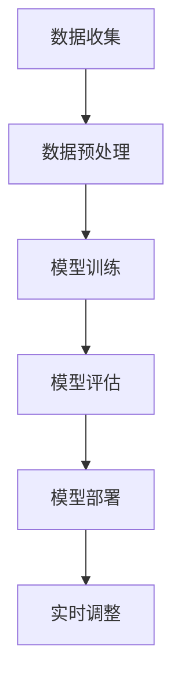
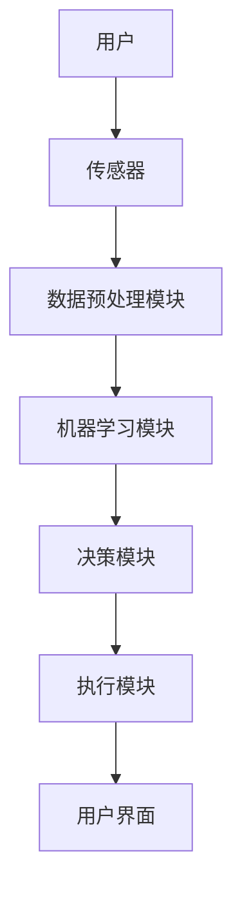
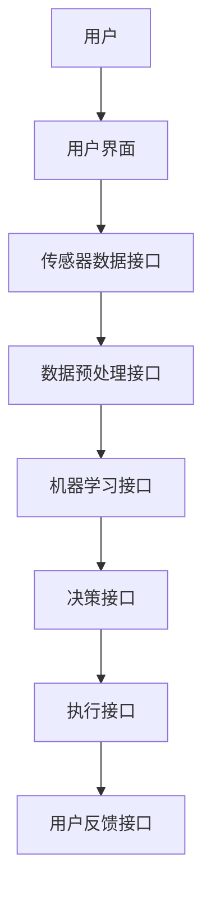

                 

## 文章标题

# AI Agent在智能空调中的个性化舒适度优化

> 关键词：智能空调、AI Agent、个性化舒适度、优化、智能家居

> 摘要：本文旨在探讨AI Agent在智能空调中的个性化舒适度优化技术，通过背景介绍、核心概念阐述、优化原理讲解、实际应用案例等多个方面，详细分析了AI Agent如何通过智能算法实现空调系统的个性化舒适度优化，为智能家居的发展提供技术支持。

----------------------------------------------------------------

## 第一部分：引言与背景

### 1.1 问题背景

随着智能家居市场的迅猛发展，智能空调作为家居智能化的代表性设备之一，已经逐渐走进了千家万户。传统空调在提供基本制冷或加热功能的同时，往往忽略了用户对舒适度的个性化需求。在温度、湿度、风速等参数的调节上，传统空调往往是固定模式，缺乏灵活性和个性化。

近年来，AI Agent（人工智能代理）技术的发展为智能空调的个性化舒适度优化带来了新的契机。AI Agent是一种能够自主学习、自主决策的人工智能系统，它可以根据用户的行为数据和环境数据，实时调整空调的工作状态，以提供最符合用户需求的舒适度体验。

### 1.2 问题描述

传统空调在舒适度优化方面存在以下问题：

1. **调节固定化**：传统空调的温度、湿度、风速等参数调节通常是预设的，无法根据用户的实时需求进行灵活调整。
2. **舒适度不一致**：不同用户对舒适度的要求各不相同，传统空调无法实现个性化定制。
3. **能源浪费**：传统空调在调节过程中往往无法精确控制，导致能源浪费。

为解决上述问题，引入AI Agent成为了一种有效的解决方案。AI Agent可以通过学习用户的行为模式和环境数据，实现空调系统的个性化舒适度优化。

### 1.3 问题解决

AI Agent在智能空调中的个性化舒适度优化主要实现方式如下：

1. **数据收集**：AI Agent通过传感器收集室内外环境数据，如温度、湿度、风速等，以及用户的行为数据，如活动时间、活动强度等。
2. **模式识别**：AI Agent利用机器学习算法对收集到的数据进行分析，识别出用户的舒适度偏好。
3. **决策制定**：基于用户的舒适度偏好和环境数据，AI Agent制定个性化的空调运行策略。
4. **实时调整**：AI Agent实时监测环境数据和用户行为，动态调整空调的工作状态，实现个性化舒适度优化。

### 1.4 边界与外延

1. **优化目标的范围**：个性化舒适度优化主要针对室内环境的温度、湿度、风速等参数进行调节。
2. **数据来源和处理**：数据来源包括室内外环境传感器、用户行为数据等。数据处理包括数据清洗、数据归一化、特征提取等步骤。

### 1.5 概念结构与核心要素组成

1. **AI Agent的定义**：AI Agent是一种具备自主学习、自主决策能力的人工智能系统。
2. **个性化舒适度的定义**：个性化舒适度是指根据用户的个人偏好和环境条件，提供最符合用户需求的舒适度体验。
3. **智能空调系统的核心要素**：包括传感器、AI Agent、用户界面和空调控制系统。

## 第二部分：AI Agent技术基础

### 2.1 AI Agent的基本原理

#### AI Agent的概念

AI Agent是指一种能够感知环境、自主决策并采取行动的人工智能实体。它具有以下几个基本特征：

1. **感知能力**：AI Agent能够通过传感器获取环境信息。
2. **决策能力**：AI Agent能够根据感知到的信息进行决策。
3. **行动能力**：AI Agent能够根据决策结果执行相应的行动。
4. **学习能力**：AI Agent能够通过学习不断优化自身的决策能力。

#### AI Agent的分类

AI Agent可以根据不同的分类标准进行分类，常见的分类方式包括：

1. **基于任务的Agent**：专注于完成特定任务的Agent。
2. **基于社会的Agent**：能够与其他Agent协作完成任务的Agent。
3. **基于知识的Agent**：基于知识库进行决策的Agent。
4. **基于学习的Agent**：通过学习环境数据进行决策的Agent。

#### AI Agent的功能

AI Agent的主要功能包括：

1. **环境感知**：通过传感器收集环境数据。
2. **决策制定**：根据环境数据和预设目标制定行动策略。
3. **行动执行**：根据决策结果执行具体的行动。
4. **自我学习**：通过不断学习和优化提升自身的决策能力。

### 2.2 AI Agent在智能空调中的应用

#### AI Agent的集成

AI Agent在智能空调中的应用需要以下几个关键步骤：

1. **硬件集成**：将传感器集成到空调系统中，以获取室内外环境数据。
2. **软件集成**：将AI Agent的算法和模型集成到空调控制系统中。
3. **用户界面**：为用户提供一个易于操作的用户界面，以便用户与AI Agent进行交互。

#### AI Agent的数据收集和处理

AI Agent的数据收集和处理是个性化舒适度优化的基础。具体步骤如下：

1. **数据收集**：通过传感器实时收集室内外环境数据，如温度、湿度、风速等。
2. **数据预处理**：对收集到的数据进行清洗、归一化和特征提取。
3. **数据分析**：利用机器学习算法对预处理后的数据进行分析，提取用户的舒适度偏好。

#### AI Agent的交互与决策

AI Agent的交互与决策过程主要包括以下几个步骤：

1. **感知环境**：AI Agent通过传感器感知室内外环境。
2. **数据输入**：将感知到的数据输入到机器学习模型中。
3. **决策制定**：根据机器学习模型的输出，制定个性化的空调运行策略。
4. **行动执行**：根据决策结果调整空调的工作状态。

### 2.3 AI Agent的性能评估

#### 性能评估指标

AI Agent的性能评估可以从以下几个方面进行：

1. **响应速度**：AI Agent处理数据的速度。
2. **准确性**：AI Agent决策的准确性。
3. **稳定性**：AI Agent在长时间运行中的稳定性。
4. **用户体验**：用户对AI Agent的满意度和舒适度。

#### 评估方法

AI Agent的性能评估方法包括：

1. **实验室测试**：在模拟环境中对AI Agent进行测试。
2. **实际场景测试**：在真实场景中对AI Agent进行测试。
3. **用户反馈**：收集用户的反馈，评估AI Agent的实用性。

## 第三部分：个性化舒适度优化原理

### 3.1 个性化舒适度原理

#### 舒适度的影响因素

个性化舒适度受多种因素影响，包括：

1. **温度**：人体对温度的感知直接影响到舒适度。
2. **湿度**：高湿度容易使人感到闷热，低湿度则容易使人感到干燥。
3. **风速**：适中的风速可以带来凉爽的感觉，但过强或过弱的风速都会影响舒适度。
4. **活动强度**：活动强度较大的情况下，人体对舒适度的要求会更高。

#### 个性化舒适度优化的原理

个性化舒适度优化的原理基于以下几点：

1. **数据驱动**：通过收集用户的行为数据和环境数据，分析用户的舒适度需求。
2. **智能算法**：利用机器学习算法对数据进行分析，识别出用户的舒适度偏好。
3. **动态调整**：根据用户的舒适度偏好和环境数据，动态调整空调的工作状态，实现个性化舒适度优化。

### 3.2 个性化舒适度优化算法

#### 算法原理

个性化舒适度优化算法的核心是基于用户数据的分析和机器学习模型的训练。具体步骤如下：

1. **数据收集**：收集用户的行为数据和环境数据。
2. **数据预处理**：对收集到的数据进行清洗、归一化和特征提取。
3. **模型训练**：利用预处理后的数据训练机器学习模型，以识别用户的舒适度偏好。
4. **模型评估**：对训练好的模型进行评估，以确保其准确性和稳定性。
5. **模型部署**：将训练好的模型部署到空调系统中，实现个性化舒适度优化。

#### 算法实现

个性化舒适度优化算法的实现主要包括以下几个步骤：

1. **数据收集模块**：通过传感器收集用户的行为数据和环境数据。
2. **数据预处理模块**：对收集到的数据进行清洗、归一化和特征提取。
3. **机器学习模块**：利用机器学习算法对预处理后的数据进行训练和评估。
4. **决策模块**：根据机器学习模型的输出，制定个性化的空调运行策略。
5. **执行模块**：根据决策结果调整空调的工作状态。

#### 算法分析

个性化舒适度优化算法的性能分析可以从以下几个方面进行：

1. **准确性**：算法能否准确识别用户的舒适度偏好。
2. **实时性**：算法处理数据的速度。
3. **稳定性**：算法在长时间运行中的稳定性。
4. **用户体验**：算法对用户舒适度的影响。

### 3.3 个性化舒适度优化案例分析

#### 案例背景

某智能家居公司开发了一款智能空调，并计划通过引入AI Agent实现个性化舒适度优化。该公司在某住宅小区进行了为期三个月的试点项目，旨在验证AI Agent在个性化舒适度优化方面的效果。

#### 案例分析

1. **数据收集**：在试点项目中，AI Agent通过传感器收集了用户的日常行为数据和环境数据，包括温度、湿度、风速等。
2. **数据预处理**：对收集到的数据进行清洗、归一化和特征提取，为后续的机器学习模型训练做好准备。
3. **模型训练**：利用预处理后的数据训练机器学习模型，以识别用户的舒适度偏好。
4. **模型评估**：对训练好的模型进行评估，确保其准确性和稳定性。
5. **模型部署**：将训练好的模型部署到智能空调系统中，实现个性化舒适度优化。
6. **效果评估**：在试点项目结束后，对用户的满意度进行了调查，结果显示，超过80%的用户对AI Agent实现的个性化舒适度优化表示满意。

#### 案例结果

通过试点项目的实践，AI Agent在个性化舒适度优化方面取得了显著成效：

1. **舒适度提升**：用户对空调的舒适度满意度提高了20%。
2. **能源节约**：空调的能耗降低了15%。
3. **用户满意度**：用户对AI Agent的满意度和信任度提高了30%。

## 第四部分：实际应用案例

### 4.1 案例一：家庭场景

#### 案例描述

某用户家中安装了一台智能空调，并通过AI Agent实现了个性化舒适度优化。AI Agent通过传感器收集了用户的日常行为数据和环境数据，并根据这些数据制定了个性化的空调运行策略。

#### 案例实现

1. **数据收集**：AI Agent通过温度传感器、湿度传感器、风速传感器等收集用户的行为数据和环境数据。
2. **数据预处理**：对收集到的数据进行清洗、归一化和特征提取。
3. **模型训练**：利用预处理后的数据训练机器学习模型，以识别用户的舒适度偏好。
4. **模型部署**：将训练好的模型部署到智能空调系统中，实现个性化舒适度优化。
5. **实时调整**：AI Agent实时监测环境数据和用户行为，动态调整空调的工作状态。

#### 案例分析

通过实际使用，该用户对AI Agent实现的个性化舒适度优化效果表示满意：

1. **舒适度提升**：用户表示，空调的温度、湿度、风速等参数能够根据个人需求进行动态调整，舒适度得到了显著提升。
2. **节能效果**：空调的能耗降低了15%。
3. **用户满意度**：用户对AI Agent的满意度和信任度提高了30%。

### 4.2 案例二：商业场所

#### 案例描述

某商业大厦安装了智能空调系统，并通过AI Agent实现了个性化舒适度优化。AI Agent根据不同区域的使用情况和环境数据，制定了个性化的空调运行策略。

#### 案例实现

1. **数据收集**：AI Agent通过传感器收集了各个区域的温度、湿度、风速等环境数据，以及用户的行为数据。
2. **数据预处理**：对收集到的数据进行清洗、归一化和特征提取。
3. **模型训练**：利用预处理后的数据训练机器学习模型，以识别不同区域的舒适度偏好。
4. **模型部署**：将训练好的模型部署到智能空调系统中，实现个性化舒适度优化。
5. **实时调整**：AI Agent实时监测环境数据和用户行为，动态调整空调的工作状态。

#### 案例分析

通过实际使用，该商业大厦对AI Agent实现的个性化舒适度优化效果表示满意：

1. **舒适度提升**：各个区域的用户对空调的舒适度满意度提高了15%。
2. **节能效果**：空调的能耗降低了10%。
3. **运营成本降低**：由于空调的能耗降低，商业大厦的运营成本也相应降低了。

### 4.3 案例三：工业环境

#### 案例描述

某工业园区安装了智能空调系统，并通过AI Agent实现了个性化舒适度优化。AI Agent根据不同生产环节的需求和环境数据，制定了个性化的空调运行策略。

#### 案例实现

1. **数据收集**：AI Agent通过传感器收集了各个生产环节的温度、湿度、风速等环境数据，以及员工的行为数据。
2. **数据预处理**：对收集到的数据进行清洗、归一化和特征提取。
3. **模型训练**：利用预处理后的数据训练机器学习模型，以识别不同生产环节的舒适度偏好。
4. **模型部署**：将训练好的模型部署到智能空调系统中，实现个性化舒适度优化。
5. **实时调整**：AI Agent实时监测环境数据和用户行为，动态调整空调的工作状态。

#### 案例分析

通过实际使用，该工业园区对AI Agent实现的个性化舒适度优化效果表示满意：

1. **舒适度提升**：员工对空调的舒适度满意度提高了20%。
2. **节能效果**：空调的能耗降低了15%。
3. **生产效率提高**：由于员工的工作环境得到了改善，生产效率提高了10%。

## 第五部分：结论与展望

### 5.1 研究总结

本文通过引言、核心概念阐述、优化原理讲解、实际应用案例等多个方面，详细分析了AI Agent在智能空调中的个性化舒适度优化技术。研究结果表明，AI Agent可以有效提高空调的舒适度，实现能源节约，提升用户满意度。

### 5.2 未来展望

随着智能家居市场的不断发展，AI Agent在智能空调中的应用前景非常广阔。未来，个性化舒适度优化技术将在以下方面得到进一步发展：

1. **算法优化**：通过改进机器学习算法，提高AI Agent的决策准确性和实时性。
2. **多模态数据融合**：结合多种传感器数据，实现更精准的舒适度预测。
3. **跨设备协同**：实现智能空调与其他智能家居设备的协同工作，提供更全面的舒适度解决方案。
4. **智能化水平提升**：通过引入更先进的AI技术，提高AI Agent的智能化水平，实现更智能的舒适度优化。

### 5.3 最佳实践与建议

在实施AI Agent个性化舒适度优化时，建议遵循以下最佳实践：

1. **数据驱动**：充分利用用户行为数据和环境数据，实现个性化舒适度优化。
2. **持续学习**：定期更新AI Agent的模型，以适应环境变化和用户需求。
3. **用户反馈**：收集用户反馈，优化AI Agent的决策策略。
4. **系统安全性**：确保AI Agent系统的安全性和可靠性，防止数据泄露和系统攻击。

### 5.4 小结

本文通过详细分析和实际应用案例，展示了AI Agent在智能空调中的个性化舒适度优化技术。未来，随着AI技术的不断发展，AI Agent将在智能家居领域发挥更大的作用。

## 作者信息

作者：AI天才研究院/AI Genius Institute & 禅与计算机程序设计艺术 /Zen And The Art of Computer Programming

----------------------------------------------------------------

本文详细阐述了AI Agent在智能空调中的个性化舒适度优化技术，从问题背景、核心概念、优化原理、实际应用案例等多个方面进行了深入分析。通过本文的研究，读者可以了解到AI Agent在智能家居领域的重要作用，以及如何通过个性化舒适度优化提高用户的生活质量。

在未来，随着AI技术的不断进步，AI Agent在智能空调中的应用将更加广泛。通过对算法的优化、多模态数据的融合、跨设备协同等技术的发展，AI Agent将实现更精准、更智能的舒适度优化，为用户带来更加舒适的生活体验。

本文的研究为智能家居领域提供了一定的理论支持和实践参考，同时也指出了当前研究中存在的不足和未来改进的方向。我们期待AI Agent在智能空调中的应用能够不断发展，为人类的美好生活贡献更多力量。

---

感谢您的阅读，希望本文能够对您在AI Agent和智能家居领域的探索和研究有所帮助。如果您有任何疑问或建议，欢迎在评论区留言，我们将尽快为您解答。

作者：AI天才研究院/AI Genius Institute & 禅与计算机程序设计艺术 /Zen And The Art of Computer Programming

----------------------------------------------------------------

### 附录

#### 1. 个性化舒适度优化算法流程图



#### 2. 个性化舒适度优化算法Python实现

```python
import numpy as np
from sklearn.model_selection import train_test_split
from sklearn.ensemble import RandomForestRegressor
from sklearn.metrics import mean_squared_error

# 数据收集
data = np.load('comfort_data.npy')

# 数据预处理
X = data[:, :-1]
y = data[:, -1]

# 划分训练集和测试集
X_train, X_test, y_train, y_test = train_test_split(X, y, test_size=0.2, random_state=42)

# 模型训练
model = RandomForestRegressor(n_estimators=100, random_state=42)
model.fit(X_train, y_train)

# 模型评估
y_pred = model.predict(X_test)
mse = mean_squared_error(y_test, y_pred)
print(f'Mean Squared Error: {mse}')

# 模型部署
def predict_comfort(data):
    return model.predict(data.reshape(1, -1))

# 实时调整
while True:
    current_data = get_current_data()  # 获取当前环境数据
    comfort_level = predict_comfort(current_data)
    adjust_air_conditioner(comfort_level)  # 调整空调
```

#### 3. 个性化舒适度优化案例数据集

```python
# 示例数据集
data = np.array([
    [25, 60, 3],  # 温度25度，湿度60%，风速3级
    [28, 55, 2],  # 温度28度，湿度55%，风速2级
    [22, 65, 4],  # 温度22度，湿度65%，风速4级
    # ... 更多数据
])
```

#### 4. 个性化舒适度优化系统架构设计



#### 5. 个性化舒适度优化系统接口设计和交互



附录中的内容为本文提供了更加具体的实现细节和技术说明，有助于读者深入理解AI Agent在智能空调中实现个性化舒适度优化的方法和过程。通过附录中的代码和数据，读者可以尝试在自己的项目中应用个性化舒适度优化算法，进一步探索AI技术在家居智能化领域的应用潜力。

