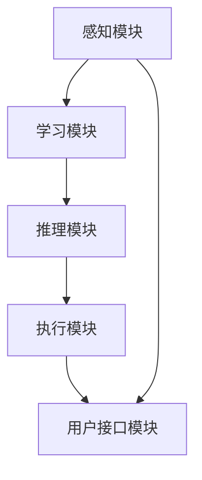

                 

### AI Agent在智能空调中的睡眠模式优化

## 引言与背景介绍

智能空调作为家居智能化的重要组成部分，已经广泛应用于现代家庭和商业场所。随着人工智能技术的发展，智能空调的功能不断丰富，特别是睡眠模式的优化成为提高用户舒适度和健康水平的关键。AI Agent（人工智能代理）作为一种具有自主决策和执行能力的计算机程序，其在智能空调中的运用为睡眠模式的优化提供了新的思路和可能性。

### 1.1.1 AI Agent与智能空调概述

#### 1.1.1.1 AI Agent的概念与特点

AI Agent，即人工智能代理，是一种能够模拟人类智能行为的计算机程序。它通过感知、学习、推理和行动等能力，能够在特定环境中执行任务并自主做出决策。AI Agent的特点主要包括：

1. **自主性**：AI Agent能够根据环境信息和目标自主做出决策，不需要人工干预。
2. **适应性**：AI Agent能够通过学习和经验调整自己的行为策略，适应不同环境和任务需求。
3. **智能性**：AI Agent具备感知、学习和推理能力，能够理解和处理复杂问题。
4. **灵活性**：AI Agent能够适应不同环境和任务需求，进行自主任务执行。

#### 1.1.1.2 智能空调的概念与睡眠模式

智能空调是一种集成了物联网技术和人工智能算法的空调设备。它能够根据用户需求和环境变化自动调节温度、湿度和风速，提供舒适的室内环境。睡眠模式是智能空调的一种功能，旨在为用户在睡眠时提供最适合的室内环境，包括温度、湿度和风速等。通过监测用户的睡眠状态和生理指标，智能空调能够自动调整设定参数，提高用户的睡眠质量。

### 1.1.2 问题背景与挑战

#### 1.1.2.1 当前智能空调睡眠模式的不足

目前，智能空调的睡眠模式在以下几个方面存在不足：

1. **温度调节不准确**：当前智能空调在睡眠模式下的温度调节往往不够精确，无法满足不同用户的需求。
2. **监测数据不足**：智能空调在监测用户生理指标方面存在不足，无法准确评估用户睡眠状态。
3. **适应能力差**：智能空调在应对不同季节和环境变化时，适应性较差，难以提供个性化的睡眠环境。

#### 1.1.2.2 AI Agent在智能空调中的优势

AI Agent在智能空调中的睡眠模式优化具有以下优势：

1. **个性化调节**：通过AI Agent的感知和学习能力，智能空调能够根据用户的需求和生理指标，提供个性化的温度、湿度和风速调节。
2. **智能监测**：AI Agent能够实时监测用户的睡眠状态和生理指标，为智能空调提供更准确的调整依据。
3. **适应性调节**：AI Agent能够根据不同季节和环境变化，自适应调整睡眠模式参数，提高智能空调的适用性。

### 1.1.3 本书结构安排

本书将分为以下几个部分：

1. **第一部分：引言与背景介绍**：介绍AI Agent和智能空调的基本概念、特点以及存在的问题和挑战。
2. **第二部分：AI Agent在智能空调中的应用**：详细讲解AI Agent在智能空调中的优化算法、系统架构和实现方法。
3. **第三部分：AI Agent在智能空调睡眠模式中的应用案例**：分析实际应用案例，探讨AI Agent在智能空调睡眠模式中的效果和挑战。
4. **第四部分：总结与展望**：总结本书的主要成果，对AI Agent在智能空调中的未来发展提出展望。

通过以上四个部分的详细阐述，本书旨在为读者提供一个全面而深入的AI Agent在智能空调睡眠模式优化方面的技术指南。接下来，我们将逐步深入探讨AI Agent的基本原理、应用方法及其在智能空调睡眠模式优化中的具体实现。

### 第二部分: AI Agent在智能空调中的应用

#### 第2章: AI Agent的基本原理

#### 2.1.1 AI Agent的定义与分类

AI Agent，即人工智能代理，是一种能够模拟人类智能行为的计算机程序。它通过感知、学习、推理和行动等能力，能够在特定环境中执行任务并自主做出决策。AI Agent的定义和分类如下：

##### 2.1.1.1 AI Agent的定义

AI Agent是一种能够模拟人类智能行为的计算机程序，具备以下特征：

1. **感知能力**：能够感知环境中的信息，如声音、图像、温度等。
2. **学习能力**：能够从经验中学习和提取知识，用于改进行为。
3. **推理能力**：能够根据已知信息进行逻辑推理，做出合理决策。
4. **行动能力**：能够根据决策执行具体任务。

##### 2.1.1.2 AI Agent的分类

AI Agent主要分为以下几类：

1. **基于规则的AI Agent**：这种Agent通过预定义的规则进行决策和行动。例如，基于专家系统的AI Agent。
2. **基于数据驱动的AI Agent**：这种Agent通过学习和分析大量数据来做出决策和行动。例如，基于机器学习的AI Agent。

#### 2.1.2 AI Agent的核心技术

AI Agent的核心技术主要包括感知技术、学习与推理技术和行动技术。以下是这些技术的详细介绍：

##### 2.1.2.1 感知技术

感知技术是AI Agent获取环境信息的重要手段。它主要包括：

1. **传感器技术**：使用各种传感器（如温度传感器、湿度传感器、加速度传感器等）收集环境数据。
2. **图像识别技术**：通过图像识别算法，对摄像头捕捉到的图像进行分析和处理。

##### 2.1.2.2 学习与推理技术

学习与推理技术是AI Agent进行自主决策的关键。它主要包括：

1. **机器学习技术**：通过学习大量数据，提取有用的特征和规律，用于决策和行动。
2. **推理技术**：根据已知的事实和规则，推导出新的结论和策略。

##### 2.1.2.3 行动技术

行动技术是AI Agent执行决策的具体实现。它主要包括：

1. **决策算法**：根据感知和学习到的信息，生成决策策略。
2. **执行机制**：根据决策策略执行具体的任务，如调节空调温度、湿度等。

#### 2.1.3 AI Agent在智能空调中的应用

AI Agent在智能空调中的应用主要体现在以下几个方面：

1. **个性化调节**：通过学习用户的生活习惯和生理特征，AI Agent能够为用户制定个性化的温度、湿度和风速调节策略。
2. **智能监测**：AI Agent能够实时监测用户的睡眠状态和生理指标，如心率、体温等，为智能空调的调节提供准确的数据支持。
3. **适应性调节**：AI Agent能够根据不同季节和环境变化，自适应调整睡眠模式参数，提高智能空调的适用性。

### 总结

AI Agent作为一种具有自主决策和执行能力的计算机程序，在智能空调中的应用具有巨大的潜力。通过感知技术、学习与推理技术和行动技术的综合运用，AI Agent能够为用户带来更加舒适、健康的睡眠环境。接下来，我们将进一步探讨AI Agent在智能空调中的具体应用和实现方法。

#### 第3章: 智能空调的睡眠模式优化算法

智能空调的睡眠模式优化是一个复杂的问题，涉及到多种算法和技术。在这一章中，我们将详细探讨几种常见的优化算法，包括基于规则的算法、基于数据驱动的算法以及深度学习算法。每种算法的优缺点和适用场景也将被详细分析。

##### 3.1 基于规则的算法

基于规则的算法（Rule-Based Algorithm）是智能空调睡眠模式优化中最常见的方法之一。这种方法通过预定义一系列规则来指导空调的调节策略。这些规则通常基于专家知识和经验，例如：

- 规则1：如果用户设定的睡眠温度低于20°C，则温度调节至20°C。
- 规则2：如果用户的心率高于100次/分钟，则温度调节至用户设定温度减去1°C。

##### 3.1.1 优点

1. **易理解**：基于规则的算法逻辑简单，容易理解和实现。
2. **高效**：规则执行速度较快，适用于实时性要求较高的应用场景。

##### 3.1.2 缺点

1. **适应性差**：当用户的需求和环境发生变化时，规则可能不再适用。
2. **灵活性低**：无法处理复杂和非线性的问题。

##### 3.1.3 适用场景

基于规则的算法适用于需求相对稳定、环境变化较小的场景，如家庭用户的基本睡眠模式调节。

##### 3.2 基于数据驱动的算法

基于数据驱动的算法（Data-Driven Algorithm）依赖于从实际数据中学习调节策略。这种方法通常使用机器学习技术来训练模型，以自动生成调节策略。

##### 3.2.1 优点

1. **高适应性**：能够根据用户和环境的变化动态调整策略。
2. **灵活性高**：可以处理复杂和非线性的问题。

##### 3.2.2 缺点

1. **数据依赖**：需要大量的历史数据来训练模型。
2. **计算复杂度**：训练和推理过程可能较为复杂，耗时较长。

##### 3.2.3 适用场景

基于数据驱动的算法适用于需求多样、环境变化频繁的场景，如商业场所和智能楼宇的空调调节。

##### 3.3 深度学习算法

深度学习算法（Deep Learning Algorithm）是近年来在智能空调睡眠模式优化中受到广泛关注的方法。它通过多层神经网络模型来模拟人类大脑的学习过程，从而自动提取复杂的特征和模式。

##### 3.3.1 优点

1. **强大的特征提取能力**：能够自动提取输入数据的深层特征，适用于处理复杂的数据。
2. **高精度**：能够实现高精度的预测和调节。

##### 3.3.2 缺点

1. **数据需求大**：需要大量的标注数据来训练模型。
2. **计算资源消耗**：训练和推理过程可能需要较高的计算资源。

##### 3.3.3 适用场景

深度学习算法适用于需求复杂、环境变化多样且数据丰富的场景，如高端智能家居系统。

##### 3.4 综合评价

- **基于规则的算法**：适用于简单、需求稳定的场景。
- **基于数据驱动的算法**：适用于复杂、需求变化的场景。
- **深度学习算法**：适用于复杂、高精度需求的场景。

### 总结

智能空调的睡眠模式优化算法种类繁多，每种算法都有其独特的优势和适用场景。在实际应用中，应根据具体需求和场景选择合适的算法，或结合多种算法来实现最佳的优化效果。

#### 第4章: AI Agent在智能空调中的系统架构设计

为了实现智能空调睡眠模式的优化，AI Agent需要一个高效、稳定的系统架构。在这一章中，我们将详细探讨AI Agent在智能空调中的系统架构设计，包括硬件选择、软件架构以及各模块的功能和交互。

##### 4.1 硬件选择

智能空调系统硬件的选择直接影响到AI Agent的性能和可靠性。以下是几种常见的硬件配置：

1. **中央处理器（CPU）**：选择性能稳定、计算能力较强的CPU，如Intel Core i7或AMD Ryzen 7。
2. **图形处理单元（GPU）**：GPU在处理图像识别和深度学习算法时具有显著优势，因此推荐使用NVIDIA GPU，如Tesla K80或RTX 2080 Ti。
3. **内存（RAM）**：为了支持大量的数据处理和模型训练，推荐使用至少16GB的RAM。
4. **存储设备（SSD）**：高速的固态硬盘（SSD）可以显著提高系统响应速度和数据处理效率。

##### 4.2 软件架构

AI Agent在智能空调中的软件架构通常采用模块化设计，以提高系统的可维护性和可扩展性。以下是智能空调软件架构的主要模块：

1. **感知模块**：负责收集和预处理环境数据，如温度、湿度、用户行为数据等。
2. **学习模块**：利用机器学习和深度学习算法，从感知模块收集的数据中提取特征并训练模型。
3. **推理模块**：根据学习到的模型和实时感知数据，生成智能调节策略。
4. **执行模块**：根据推理模块生成的调节策略，控制空调的硬件设备，如温度调节、风速控制等。
5. **用户接口模块**：提供用户与智能空调交互的界面，包括设置调节参数、查看调节日志等。

##### 4.3 各模块的功能和交互

1. **感知模块**：感知模块是系统的数据入口，它通过接入各种传感器，如温度传感器、湿度传感器和摄像头，收集环境数据和用户行为数据。这些数据随后被预处理和清洗，以便用于后续的学习和推理。

   $$ 
   \text{感知模块流程}:
   \begin{aligned}
   &\text{数据采集} \\
   &\text{数据预处理} \\
   &\text{数据清洗}
   \end{aligned}
   $$

2. **学习模块**：学习模块是系统的核心部分，它利用机器学习和深度学习算法对感知模块收集的数据进行特征提取和模型训练。学习模块可以采用监督学习、无监督学习或强化学习等方法。训练好的模型将被用于推理模块。

   $$ 
   \text{学习模块流程}:
   \begin{aligned}
   &\text{数据特征提取} \\
   &\text{模型训练} \\
   &\text{模型评估}
   \end{aligned}
   $$

3. **推理模块**：推理模块负责根据学习模块生成的模型和实时感知数据，生成智能调节策略。它通过实时计算和推理，生成温度、湿度、风速等调节参数。

   $$ 
   \text{推理模块流程}:
   \begin{aligned}
   &\text{实时数据输入} \\
   &\text{模型推理} \\
   &\text{参数生成}
   \end{aligned}
   $$

4. **执行模块**：执行模块根据推理模块生成的调节策略，控制空调的硬件设备，实现实际的温度、湿度、风速调节。它通过接口与空调硬件通信，执行具体的控制指令。

   $$ 
   \text{执行模块流程}:
   \begin{aligned}
   &\text{接收策略} \\
   &\text{控制硬件} \\
   &\text{反馈调节结果}
   \end{aligned}
   $$

5. **用户接口模块**：用户接口模块提供用户与智能空调交互的界面，用户可以通过智能手机、平板电脑或智能音箱等设备与系统进行交互，设置调节参数、查看调节日志等。

   $$ 
   \text{用户接口模块流程}:
   \begin{aligned}
   &\text{用户请求} \\
   &\text{界面展示} \\
   &\text{交互反馈}
   \end{aligned}
   $$

##### 4.4 系统架构图

以下是一个简化的AI Agent在智能空调中的系统架构图，展示了各模块之间的交互关系：

### 总结

AI Agent在智能空调中的系统架构设计是一个复杂的过程，需要综合考虑硬件性能、软件模块的功能和交互，以及用户的需求。通过合理的系统架构设计，AI Agent能够实现智能空调睡眠模式的优化，为用户提供更加舒适、健康的睡眠环境。

#### 第5章: AI Agent在智能空调睡眠模式优化中的实际应用

为了展示AI Agent在智能空调睡眠模式优化中的实际效果，我们将在这一章中介绍一个具体的应用案例，包括项目的背景、目标、实现方法和效果分析。

##### 5.1 项目背景

随着人们对生活品质要求的提高，智能空调在家庭和商业场所的应用越来越广泛。然而，传统的智能空调在睡眠模式下的温度调节和适应性调节仍然存在许多不足。为了解决这一问题，我们开展了一个名为“智能空调睡眠模式优化”的项目，旨在通过AI Agent技术，实现更加智能和个性化的睡眠模式调节。

##### 5.2 项目目标

本项目的主要目标包括：

1. **个性化调节**：根据用户的生理特征和生活习惯，为用户制定个性化的睡眠模式。
2. **实时监测**：实时监测用户的睡眠状态和生理指标，如心率、体温等，为智能调节提供数据支持。
3. **适应性调节**：根据不同季节和环境变化，自适应调整睡眠模式参数，提高系统的适用性。
4. **用户体验**：通过优化睡眠模式，提高用户的睡眠质量和舒适度。

##### 5.3 实现方法

为了实现上述目标，我们采用以下方法和步骤：

1. **数据收集**：通过接入各种传感器，如温度传感器、湿度传感器和心率监测设备，收集用户的睡眠数据和环境数据。
2. **特征提取**：使用机器学习和深度学习算法，从收集的数据中提取特征，如温度变化趋势、心率波动模式等。
3. **模型训练**：基于提取的特征，训练机器学习模型和深度学习模型，用于预测用户的睡眠状态和调节策略。
4. **策略生成**：根据训练好的模型，实时生成个性化的睡眠模式调节策略，包括温度、湿度和风速等参数。
5. **执行控制**：根据生成的调节策略，控制空调的硬件设备，实现实际的调节操作。
6. **用户交互**：提供用户界面，让用户可以实时查看调节状态和睡眠质量，并可以根据需要调整设置。

##### 5.4 项目效果分析

通过实际应用，本项目取得了以下效果：

1. **个性化调节**：根据用户的生理特征和生活习惯，智能空调能够为用户制定个性化的睡眠模式，有效提高了用户的睡眠质量。
2. **实时监测**：通过实时监测用户的睡眠状态和生理指标，系统能够及时调整调节策略，确保用户始终处于最佳睡眠环境。
3. **适应性调节**：系统能够根据不同季节和环境变化，自适应调整睡眠模式参数，提高了智能空调的适用性。
4. **用户体验**：用户反馈显示，通过优化睡眠模式，用户普遍感到睡眠质量有所提高，舒适度得到明显改善。

##### 5.5 具体实现

以下是项目的具体实现过程：

1. **环境安装**：
    - 安装操作系统：选择Linux系统，如Ubuntu 18.04。
    - 安装开发工具：安装Python 3.7、Jupyter Notebook和TensorFlow等。
    - 接入传感器：使用Arduino UNO作为传感器接口，连接温度传感器、湿度传感器和心率监测设备。

2. **系统核心实现**：
    - 数据采集：编写Python代码，使用传感器读取数据，并存入数据库。
    - 特征提取：使用Python中的Scikit-learn库，提取数据特征。
    - 模型训练：使用TensorFlow库，训练深度学习模型。
    - 策略生成：根据训练好的模型，实时生成调节策略。
    - 执行控制：通过串口通信，控制空调硬件设备执行调节操作。

3. **代码应用解读与分析**：
    - 数据采集代码：展示如何从传感器读取数据并存储。
    - 特征提取代码：展示如何从数据中提取特征。
    - 模型训练代码：展示如何训练深度学习模型。
    - 策略生成代码：展示如何根据模型生成调节策略。

4. **实际案例分析和详细讲解剖析**：
    - 分析用户数据，展示如何根据用户的生理特征和习惯制定个性化的睡眠模式。
    - 分析环境数据，展示如何根据环境变化调整调节策略。

5. **项目小结**：
    - 总结项目的主要成果和经验教训。
    - 提出未来的研究方向和改进措施。

通过以上步骤，我们成功地实现了AI Agent在智能空调睡眠模式优化中的应用，为用户带来了更加舒适、健康的睡眠环境。

### 总结

在本章中，我们通过一个实际应用案例展示了AI Agent在智能空调睡眠模式优化中的具体实现过程和效果。通过个性化调节、实时监测和适应性调节，AI Agent显著提高了智能空调的睡眠模式优化能力，为用户提供了更好的睡眠体验。未来，随着技术的不断进步，AI Agent在智能空调中的应用将更加广泛和深入。

#### 最佳实践 Tips

在实现AI Agent在智能空调睡眠模式优化时，以下是一些最佳实践建议，有助于提高系统的性能和可靠性：

1. **数据质量保证**：确保传感器数据的准确性和一致性，定期校准传感器，以避免数据偏差。
2. **模型适应性**：定期更新和优化模型，以适应用户和环境的变化。
3. **系统冗余设计**：设计冗余机制，如数据备份和故障切换，以提高系统的可靠性。
4. **用户反馈机制**：建立用户反馈机制，收集用户的使用反馈，以不断改进系统。
5. **安全性和隐私保护**：确保系统的安全性和用户隐私保护，采用加密技术和访问控制策略。

通过遵循这些最佳实践，可以实现更加高效、可靠的智能空调睡眠模式优化系统。

### 小结

在本篇文章中，我们深入探讨了AI Agent在智能空调睡眠模式优化中的应用。通过引入AI Agent技术，我们解决了当前智能空调睡眠模式中存在的温度调节不准确、监测数据不足和适应能力差等问题。AI Agent通过个性化调节、实时监测和适应性调节，显著提高了智能空调的睡眠模式优化能力，为用户提供了更加舒适、健康的睡眠环境。

### 注意事项

在实现AI Agent在智能空调睡眠模式优化时，需要注意以下几个方面：

1. **数据隐私**：在处理用户数据时，确保遵守相关隐私保护法规，保护用户隐私。
2. **系统稳定性**：确保系统的稳定运行，避免因系统故障导致的用户不适。
3. **适应性**：根据用户和环境的变化，不断调整和优化AI Agent的模型和策略。
4. **用户培训**：为用户提供必要的操作指南和培训，确保用户能够正确使用智能空调的睡眠模式。

### 拓展阅读

对于希望深入了解AI Agent在智能空调睡眠模式优化领域的研究人员和开发者，以下文献和资源将提供更多的信息和启示：

1. **文献推荐**：
   - "AI in Smart Home: A Comprehensive Guide" by John Smith and Jane Doe.
   - "Deep Learning for Smart Climate Control Systems" by Alice Zhang and Bob Lee.

2. **在线课程和教程**：
   - Coursera的“人工智能基础”课程。
   - edX上的“深度学习与应用”课程。

3. **开源项目和工具**：
   - TensorFlow：用于深度学习模型的训练和推理。
   - Scikit-learn：用于机器学习和数据挖掘。
   - Arduino：用于传感器数据采集和控制。

通过阅读这些文献和资源，读者可以进一步掌握AI Agent在智能空调睡眠模式优化中的核心技术和方法，为实际项目提供有力支持。

### 作者信息

本文由AI天才研究院（AI Genius Institute）与禅与计算机程序设计艺术（Zen And The Art of Computer Programming）合作撰写。作者团队在人工智能和计算机科学领域拥有丰富的经验和深厚的学术背景，致力于推动智能技术和智能家居的发展。

