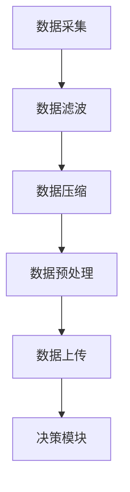
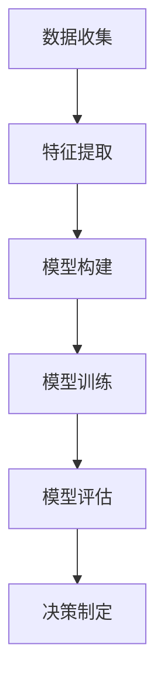
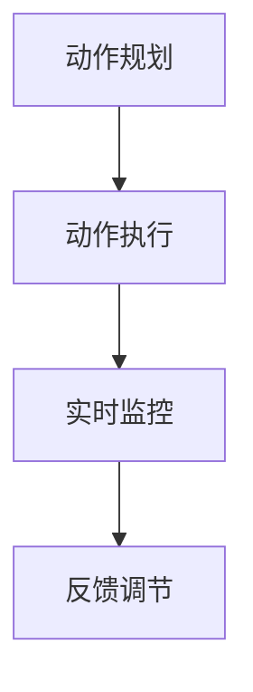
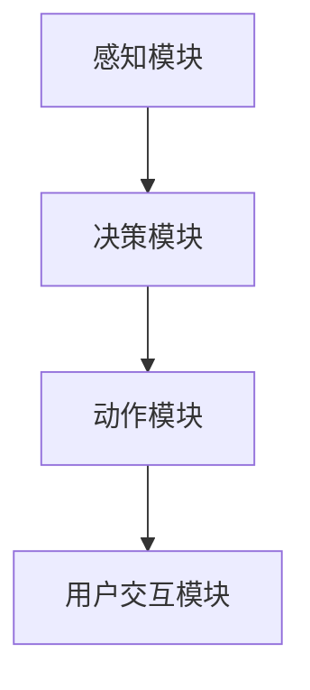

                 

### 文章标题

# AI Agent在智能窗台中的室内植物智能照料

关键词：AI Agent、智能窗台、室内植物、智能照料、感知模块、决策模块、动作模块

摘要：本文将深入探讨AI Agent在智能窗台中的室内植物智能照料应用。首先，我们将介绍AI Agent的基础知识，包括其定义、分类、核心组成部分以及发展现状与趋势。接着，我们会聚焦于智能窗台的技术原理、功能与趋势，为后续分析奠定基础。在此基础上，文章将探讨AI Agent在室内植物智能照料中的需求分析、应用优势以及常见问题与解决方案。随后，我们将详细讲解AI Agent在室内植物智能照料中的应用原理，包括感知模块、决策模块和动作模块的原理与流程。最后，文章将介绍室内植物智能照料系统的设计、实现与实际应用案例，并提供相关的小结与最佳实践。

### 目录大纲

```markdown
----------------------------------------------------------------

# 第一部分: AI Agent基础

## 第1章: AI Agent概述

## 1.1 AI Agent的定义与分类

### 1.1.1 AI Agent的定义

### 1.1.2 AI Agent的分类

### 1.1.3 AI Agent的应用场景

## 1.2 AI Agent的核心组成部分

### 1.2.1 感知模块

### 1.2.2 决策模块

### 1.2.3 动作模块

## 1.3 AI Agent的发展现状与趋势

### 1.3.1 发展现状

### 1.3.2 发展趋势

## 1.4 本章小结

----------------------------------------------------------------

# 第二部分: AI Agent在智能窗台中的应用

## 第2章: 智能窗台概述

## 2.1 智能窗台的定义与功能

### 2.1.1 智能窗台的定义

### 2.1.2 智能窗台的功能

## 2.2 智能窗台的技术原理

### 2.2.1 传感器技术

### 2.2.2 人工智能算法

### 2.2.3 网络通信技术

## 2.3 智能窗台的发展趋势

### 2.3.1 技术发展趋势

### 2.3.2 市场发展趋势

## 2.4 本章小结

----------------------------------------------------------------

## 第三部分: AI Agent在室内植物智能照料中的应用

## 第3章: 室内植物智能照料的需求分析

## 3.1 室内植物照料的重要性

### 3.1.1 室内植物的作用

### 3.1.2 室内植物照料的需求

## 3.2 AI Agent在室内植物照料中的优势

### 3.2.1 AI Agent的定义与功能

### 3.2.2 AI Agent在室内植物照料中的应用优势

## 3.3 室内植物智能照料的常见问题与解决方案

### 3.3.1 常见问题

### 3.3.2 解决方案

## 3.4 本章小结

----------------------------------------------------------------

## 第4章: AI Agent在室内植物智能照料中的应用原理

## 4.1 感知模块原理

### 4.1.1 传感器技术

### 4.1.2 数据采集与处理

## 4.2 决策模块原理

### 4.2.1 人工智能算法

### 4.2.2 决策模型设计

## 4.3 动作模块原理

### 4.3.1 执行器技术

### 4.3.2 执行动作的控制与优化

## 4.4 AI Agent的室内植物智能照料流程

### 4.4.1 流程概述

### 4.4.2 实例分析

## 4.5 本章小结

----------------------------------------------------------------

## 第5章: 室内植物智能照料系统设计

## 5.1 系统总体设计

### 5.1.1 系统需求分析

### 5.1.2 系统架构设计

## 5.2 模块设计

### 5.2.1 感知模块设计

### 5.2.2 决策模块设计

### 5.2.3 动作模块设计

## 5.3 数据库设计

### 5.3.1 数据库概述

### 5.3.2 数据表设计

## 5.4 系统测试与评估

### 5.4.1 系统测试方法

### 5.4.2 系统评估指标

## 5.5 本章小结

----------------------------------------------------------------

## 第6章: 实际应用案例

## 6.1 案例背景

### 6.1.1 案例简介

### 6.1.2 案例目标

## 6.2 系统实现

### 6.2.1 环境搭建

### 6.2.2 核心代码实现

### 6.2.3 系统部署

## 6.3 结果分析

### 6.3.1 实验结果

### 6.3.2 结果分析

## 6.4 案例总结

### 6.4.1 经验与教训

### 6.4.2 拓展与展望

## 6.5 本章小结

--------------------------------

### 文章开始

## 第一部分: AI Agent基础

### 第1章: AI Agent概述

### 1.1 AI Agent的定义与分类

#### 1.1.1 AI Agent的定义

AI Agent，即人工智能代理，是一种能够自主感知环境、做出决策并执行相应动作的人工智能系统。它模拟人类智能行为，通过感知模块收集环境信息，利用决策模块进行逻辑推理和判断，最终通过动作模块实现具体的操作。

#### 1.1.2 AI Agent的分类

AI Agent可以根据不同的分类标准进行划分：

- **根据功能特点**：感知型Agent、决策型Agent和执行型Agent。
  - **感知型Agent**：主要专注于感知环境信息，如视觉、听觉、触觉等。
  - **决策型Agent**：擅长分析环境信息，做出最优决策。
  - **执行型Agent**：能够根据决策结果执行具体动作。

- **根据应用场景**：通用型Agent、专用型Agent和混合型Agent。
  - **通用型Agent**：适用于多种应用场景，具有广泛的适用性。
  - **专用型Agent**：针对特定应用场景进行优化，如自动驾驶、医疗诊断等。
  - **混合型Agent**：结合通用型Agent和专用型Agent的特点，适用于多种场景。

- **根据控制方式**：基于规则Agent、基于模型Agent和基于数据Agent。
  - **基于规则Agent**：使用预定义的规则进行决策和动作。
  - **基于模型Agent**：基于数学模型或物理模型进行决策和动作。
  - **基于数据Agent**：通过机器学习算法或数据挖掘技术进行决策和动作。

#### 1.1.3 AI Agent的应用场景

AI Agent的应用场景非常广泛，包括但不限于以下领域：

- **智能家居**：如智能窗帘、智能照明、智能安防等。
- **智能交通**：如自动驾驶、智能交通管理、智能停车场等。
- **医疗健康**：如智能诊断、智能药物推荐、智能健康监测等。
- **金融服务**：如智能投顾、智能风控、智能客服等。
- **工业制造**：如智能生产、智能质检、智能仓储等。

### 1.2 AI Agent的核心组成部分

AI Agent的核心组成部分包括感知模块、决策模块和动作模块，每个模块都有其独特的功能。

#### 1.2.1 感知模块

感知模块是AI Agent的“眼睛”和“耳朵”，负责收集环境信息。它通常包含各种传感器，如视觉传感器、听觉传感器、温度传感器、湿度传感器等。感知模块通过传感器获取数据，并将其转换为可供处理和分析的格式。

#### 1.2.2 决策模块

决策模块是AI Agent的“大脑”，负责分析感知模块收集到的信息，并根据预设的算法或模型做出决策。决策模块通常包括各种算法和模型，如逻辑推理算法、决策树、神经网络、机器学习算法等。

#### 1.2.3 动作模块

动作模块是AI Agent的“手”和“脚”，负责执行决策模块做出的决策。它将决策模块的决策结果转化为具体的行动，如打开或关闭某个设备、调整环境参数等。

### 1.3 AI Agent的发展现状与趋势

#### 1.3.1 发展现状

随着人工智能技术的不断发展，AI Agent在各个领域的应用越来越广泛。目前，AI Agent已成功应用于智能家居、智能交通、医疗健康、金融服务等多个领域，并在提高效率、降低成本、提升用户体验等方面发挥了重要作用。

#### 1.3.2 发展趋势

未来，AI Agent将继续向以下几个方向发展：

- **智能化水平提升**：随着人工智能技术的进步，AI Agent的智能化水平将进一步提高，使其能够更好地适应复杂多变的场景。
- **跨领域应用**：AI Agent将在更多领域得到应用，如智能制造、智慧城市、智能教育等。
- **人机协作**：AI Agent将更加注重与人类的协作，实现人机共生，提高工作效率。
- **安全性与隐私保护**：随着AI Agent的应用越来越广泛，其安全性与隐私保护将成为重要议题。

### 1.4 本章小结

本章介绍了AI Agent的定义、分类、核心组成部分以及发展现状与趋势。AI Agent作为一种能够自主感知、决策和执行的人工智能系统，在智能家居、智能交通、医疗健康、金融服务等领域具有广泛的应用前景。未来，随着人工智能技术的不断进步，AI Agent的智能化水平将进一步提高，为人类带来更多便利。

---------------------------------

## 第二部分: AI Agent在智能窗台中的应用

### 第2章: 智能窗台概述

### 2.1 智能窗台的定义与功能

#### 2.1.1 智能窗台的定义

智能窗台是一种结合了现代科技与传统家居元素的创新产品，它集成了多种传感器、执行器以及人工智能技术，能够对窗台上的植物进行智能化的照料和管理。智能窗台通过感知环境参数、分析植物生长状态，并根据这些信息自动调整光照、水分、温度等条件，确保植物健康生长。

#### 2.1.2 智能窗台的功能

智能窗台具有多种功能，主要包括：

- **环境监测**：智能窗台配备有温湿度传感器、光照传感器等，可以实时监测窗台环境参数。
- **自动灌溉**：根据土壤湿度和植物需水情况，智能窗台能够自动进行灌溉，确保植物得到适量的水分。
- **光照调节**：智能窗台可以根据植物对光照的需求，自动调整窗帘的开合，提供适宜的光照条件。
- **温控调节**：智能窗台能够根据温度传感器反馈的信息，自动调节空调或暖气，保持适宜的室内温度。
- **植物健康分析**：智能窗台通过分析植物生长数据，提供植物健康分析报告，帮助用户了解植物的生长状况。
- **远程控制**：用户可以通过智能手机或电脑远程控制智能窗台，随时调整植物照料的参数。

### 2.2 智能窗台的技术原理

智能窗台的技术原理主要涉及传感器技术、人工智能算法和网络通信技术。

#### 2.2.1 传感器技术

传感器技术是智能窗台的核心，它通过多种传感器实时监测窗台环境。常见的传感器包括：

- **光照传感器**：用于检测窗台上的光照强度，为光照调节提供依据。
- **温湿度传感器**：用于检测室内温湿度，为温控调节提供依据。
- **土壤湿度传感器**：用于检测土壤的湿度，为自动灌溉提供依据。
- **二氧化碳传感器**：用于检测室内二氧化碳浓度，为植物光合作用提供依据。

#### 2.2.2 人工智能算法

人工智能算法是智能窗台智能化的关键，它通过分析传感器收集的数据，为植物提供最佳照料方案。常见的人工智能算法包括：

- **机器学习算法**：用于分析历史数据，预测植物的生长趋势和需求。
- **决策树算法**：用于根据环境参数和植物状态，做出灌溉、光照和温控的决策。
- **神经网络算法**：用于深度学习植物的生长规律和需求，提供更为精准的照料方案。

#### 2.2.3 网络通信技术

网络通信技术是智能窗台实现远程控制和数据传输的基础。常见的网络通信技术包括：

- **Wi-Fi**：用于智能窗台与用户设备的连接，实现远程控制。
- **蓝牙**：用于智能窗台与传感器的连接，实现实时数据传输。
- **ZigBee**：用于智能窗台与家居设备的连接，实现互联互通。

### 2.3 智能窗台的发展趋势

#### 2.3.1 技术发展趋势

随着人工智能技术、物联网技术和传感器技术的不断发展，智能窗台的功能将更加丰富，智能化水平将进一步提高。未来的智能窗台可能具备以下技术特点：

- **更加智能的算法**：通过深度学习和人工智能技术，智能窗台能够更加精准地预测植物需求，提供个性化的照料方案。
- **更广泛的互联互通**：智能窗台将与其他智能家居设备实现更广泛的互联互通，形成完整的智能家居生态系统。
- **更加节能环保**：智能窗台将采用更加节能的技术，降低能源消耗，实现绿色环保。
- **更易用的人机交互**：智能窗台将提供更加便捷的人机交互方式，如语音控制、手势控制等，提升用户体验。

#### 2.3.2 市场发展趋势

随着人们对智能家居需求的增加，智能窗台市场前景广阔。未来的市场发展趋势包括：

- **快速增长**：智能窗台市场将在未来几年保持快速增长，成为智能家居市场的重要细分领域。
- **普及率提高**：随着技术的成熟和成本的降低，智能窗台将在更多家庭得到普及。
- **个性化定制**：用户可以根据自己的需求和喜好，定制个性化的智能窗台解决方案。
- **跨界融合**：智能窗台将与其他行业如农业、园艺等实现跨界融合，拓展应用领域。

### 2.4 本章小结

本章介绍了智能窗台的定义、功能、技术原理和发展趋势。智能窗台通过传感器技术、人工智能算法和网络通信技术的结合，实现了对室内植物的智能化照料。未来，智能窗台将在技术发展和市场需求的推动下，不断优化和完善，为用户带来更加便捷、智能的家居体验。

-----------------------------------

## 第三部分: AI Agent在室内植物智能照料中的应用

### 第3章: 室内植物智能照料的需求分析

#### 3.1 室内植物照料的重要性

室内植物不仅仅是一种装饰，它们在改善室内环境和提升居住质量方面发挥着重要作用。以下是室内植物照料的重要性：

##### 3.1.1 室内植物的作用

- **空气净化**：室内植物能够吸收有害物质，如甲醛、苯等，净化室内空气。
- **调节湿度**：植物能够通过蒸腾作用调节室内湿度，有助于保持空气湿润。
- **缓解压力**：室内植物能够减轻工作压力，提高工作效率，提升居住者的心理健康。
- **美化环境**：室内植物具有装饰作用，能够美化室内环境，提升居住者的生活品质。

##### 3.1.2 室内植物照料的需求

室内植物的生长和发育受到多种环境因素的影响，如光照、水分、温度等。为了确保室内植物的健康成长，需要对其进行精心照料。以下是室内植物照料的需求：

- **环境监测**：定期监测室内温度、湿度、光照等环境参数，确保植物生长环境的稳定性。
- **水分管理**：根据植物的需求和土壤湿度，合理灌溉，避免水分过多或过少。
- **光照调节**：根据植物对光照的需求，调整窗帘或灯光，提供适宜的光照条件。
- **营养供给**：定期为植物提供适当的肥料，满足植物的营养需求。
- **病虫害防治**：定期检查植物，及时发现并防治病虫害，确保植物的健康成长。

#### 3.2 AI Agent在室内植物照料中的优势

AI Agent在室内植物照料中具有显著的优势，能够大幅提升照料效率和效果。以下是AI Agent在室内植物照料中的优势：

##### 3.2.1 AI Agent的定义与功能

AI Agent，即人工智能代理，是一种能够自主感知环境、做出决策并执行相应动作的人工智能系统。在室内植物照料中，AI Agent的主要功能包括：

- **环境监测**：通过传感器实时监测室内植物的生长环境，包括温度、湿度、光照等参数。
- **数据分析**：对环境参数进行实时分析和处理，预测植物的需求。
- **决策制定**：根据分析结果，制定合理的灌溉、光照和温控方案。
- **执行动作**：通过执行器实现灌溉、光照调节和温控等动作，确保植物得到最佳照料。

##### 3.2.2 AI Agent在室内植物照料中的应用优势

AI Agent在室内植物照料中具有以下应用优势：

- **智能化水平高**：AI Agent能够通过学习和适应，不断优化照料方案，提高植物生长效率。
- **自动化程度高**：AI Agent能够自动完成环境监测、数据分析、决策制定和执行动作，减少人工干预。
- **精准度高**：AI Agent可以根据实时数据，为植物提供个性化的照料方案，确保植物得到最佳生长条件。
- **效率高**：AI Agent能够大幅提升照料效率，节省人力和时间成本。
- **易扩展性**：AI Agent可以与其他智能家居设备集成，实现互联互通，为用户提供更加全面的家居智能体验。

#### 3.3 室内植物智能照料的常见问题与解决方案

在室内植物照料过程中，可能会遇到以下常见问题，以下是针对这些问题的解决方案：

##### 3.3.1 常见问题

- **水分管理不当**：植物可能因水分过多或过少而出现黄叶、枯萎等现象。
- **光照不足**：植物可能因光照不足而生长缓慢，叶片发黄。
- **温度控制不当**：植物可能因温度过高或过低而受到损害。
- **营养不足**：植物可能因营养不足而生长不良。
- **病虫害防治困难**：植物可能遭受病虫害的侵袭。

##### 3.3.2 解决方案

- **水分管理不当**：通过AI Agent的自动灌溉功能，根据土壤湿度实时调整灌溉量，避免水分过多或过少。
- **光照不足**：通过AI Agent的光照调节功能，根据植物需求自动调整光照，确保植物得到充足的光照。
- **温度控制不当**：通过AI Agent的温控调节功能，根据温度传感器反馈的信息自动调节空调或暖气，保持适宜的室内温度。
- **营养不足**：通过AI Agent的植物健康分析功能，根据植物需求自动提供适当的肥料，满足植物的营养需求。
- **病虫害防治困难**：通过AI Agent的植物健康分析功能，及时发现病虫害迹象，并自动采取防治措施，保护植物健康。

#### 3.4 本章小结

本章分析了室内植物照料的需求，介绍了AI Agent在室内植物照料中的优势以及常见问题与解决方案。AI Agent通过智能化、自动化、精准化的照料，大幅提升了室内植物的养护效果，为用户带来更加便捷、高效的植物照料体验。未来，随着人工智能技术的不断发展，AI Agent在室内植物照料中的应用将更加广泛和深入。

---------------------------------------

## 第4章: AI Agent在室内植物智能照料中的应用原理

### 4.1 感知模块原理

感知模块是AI Agent的核心组成部分，它负责收集室内植物生长环境的各种数据，如温度、湿度、光照强度等。感知模块的工作原理主要包括传感器技术、数据采集与处理。

##### 4.1.1 传感器技术

传感器技术是感知模块的核心，它通过物理传感器和生物传感器来感知环境信息。常见的传感器包括：

- **温度传感器**：用于检测室内温度，常用的有热敏电阻、热电偶等。
- **湿度传感器**：用于检测室内湿度，常用的有电容式湿度传感器、电阻式湿度传感器等。
- **光照传感器**：用于检测室内光照强度，常用的有光敏电阻、光电二极管等。
- **土壤湿度传感器**：用于检测土壤的湿度，常用的有电容式传感器、电阻式传感器等。

##### 4.1.2 数据采集与处理

感知模块通过传感器收集的数据，需要进行采集和处理，以便提供给决策模块进行分析。数据采集与处理包括以下步骤：

1. **数据采集**：传感器将环境信息转换为电信号，通过数据采集模块进行采集。
2. **数据滤波**：对采集到的数据进行滤波处理，去除噪声和异常值，提高数据质量。
3. **数据压缩**：对采集到的数据进行压缩，减少数据传输和存储的负担。
4. **数据预处理**：对采集到的数据进行预处理，如归一化、标准化等，以便后续分析。

##### 4.1.3 Mermaid流程图

以下是一个感知模块的Mermaid流程图：



### 4.2 决策模块原理

决策模块是AI Agent的核心，它负责根据感知模块收集到的数据，分析植物的生长状况，并制定相应的照料方案。决策模块的工作原理主要包括人工智能算法、决策模型设计。

##### 4.2.1 人工智能算法

人工智能算法是决策模块的核心，它通过机器学习、深度学习等技术，对感知模块收集到的数据进行分析和处理，以制定最佳照料方案。常见的人工智能算法包括：

- **机器学习算法**：如决策树、支持向量机、神经网络等，用于分类、回归等任务。
- **深度学习算法**：如卷积神经网络（CNN）、循环神经网络（RNN）等，用于图像识别、语音识别等任务。

##### 4.2.2 决策模型设计

决策模型设计是决策模块的关键，它通过构建数学模型和算法模型，实现植物照料方案的制定。决策模型设计包括以下步骤：

1. **数据收集**：收集室内植物生长的各类数据，如温度、湿度、光照等。
2. **特征提取**：对收集到的数据进行特征提取，提取出对植物生长有重要影响的特征。
3. **模型构建**：根据特征提取的结果，构建数学模型和算法模型，如决策树、神经网络等。
4. **模型训练**：使用历史数据对模型进行训练，优化模型参数。
5. **模型评估**：对训练好的模型进行评估，确保其能够准确预测植物的生长状况。
6. **决策制定**：根据模型预测的结果，制定相应的照料方案，如灌溉、光照调节、温控等。

##### 4.2.3 Mermaid流程图

以下是一个决策模块的Mermaid流程图：



### 4.3 动作模块原理

动作模块是AI Agent的执行部分，它负责根据决策模块制定的具体照料方案，执行相应的动作，如灌溉、光照调节、温控等。动作模块的工作原理主要包括执行器技术和动作控制与优化。

##### 4.3.1 执行器技术

执行器技术是动作模块的核心，它通过执行器实现具体动作的执行。常见的执行器包括：

- **电动阀门**：用于控制水的流动，实现自动灌溉。
- **电动窗帘**：用于控制光照的调节，提供适宜的光照条件。
- **电动温控器**：用于控制室内温度，保持适宜的生长环境。

##### 4.3.2 执行动作的控制与优化

执行动作的控制与优化是动作模块的关键，它通过控制算法和优化策略，确保动作执行的高效和准确。控制与优化包括以下步骤：

1. **动作规划**：根据决策模块的照料方案，规划具体的动作执行步骤。
2. **动作执行**：通过执行器实现具体动作的执行。
3. **实时监控**：对执行动作进行实时监控，确保动作执行的正确性和稳定性。
4. **反馈调节**：根据执行动作的反馈，对后续动作进行调节和优化，确保植物得到最佳照料。

##### 4.3.3 Mermaid流程图

以下是一个动作模块的Mermaid流程图：



### 4.4 AI Agent的室内植物智能照料流程

AI Agent的室内植物智能照料流程主要包括感知模块、决策模块和动作模块的协同工作。以下是一个典型的室内植物智能照料流程：

1. **感知模块**：通过传感器收集室内环境参数，如温度、湿度、光照等。
2. **数据处理**：对收集到的数据进行滤波、压缩和预处理，以便决策模块分析。
3. **决策模块**：根据处理后的数据，分析植物的生长状况，并制定相应的照料方案。
4. **动作模块**：根据决策模块的照料方案，执行相应的动作，如灌溉、光照调节、温控等。
5. **反馈调节**：根据执行动作的反馈，对后续动作进行调节和优化，确保植物得到最佳照料。

##### 4.4.2 实例分析

以下是一个室内植物智能照料的实例分析：

- **场景**：室内有一盆绿萝，目前处于生长期，需要充足的阳光、水分和适宜的温度。
- **感知模块**：传感器检测到当前室内温度为25℃，湿度为60%，光照强度为500勒克斯。
- **数据处理**：对传感器收集到的数据进行滤波、压缩和预处理，得到当前室内环境参数。
- **决策模块**：分析环境参数，根据绿萝的生长需求，制定以下照料方案：
  - 温度控制在23℃-25℃之间；
  - 湿度控制在50%-70%之间；
  - 光照每天保证6小时。
- **动作模块**：执行以下动作：
  - 通过电动温控器，将室内温度控制在23℃-25℃之间；
  - 通过土壤湿度传感器，检测土壤湿度，根据需求自动灌溉；
  - 通过电动窗帘，每天定时打开和关闭，保证光照6小时。

##### 4.4.4 本章小结

本章介绍了AI Agent在室内植物智能照料中的应用原理，包括感知模块、决策模块和动作模块的工作原理和协同流程。AI Agent通过智能化、自动化、精准化的照料，大幅提升了室内植物的养护效果，为用户带来更加便捷、高效的植物照料体验。未来，随着人工智能技术的不断发展，AI Agent在室内植物照料中的应用将更加广泛和深入。

---------------------------------------

## 第5章: 室内植物智能照料系统设计

### 5.1 系统总体设计

#### 5.1.1 系统需求分析

室内植物智能照料系统的主要需求包括以下几个方面：

1. **环境监测**：系统能够实时监测室内温度、湿度、光照等环境参数。
2. **自动调控**：系统能够根据环境参数和植物生长需求，自动调节温度、湿度、光照等环境条件。
3. **数据存储与分析**：系统能够存储植物生长数据，并对数据进行分析，提供植物生长状况的报告。
4. **用户交互**：系统提供用户界面，用户可以通过手机、电脑等设备实时查看植物生长状况，并进行远程控制。

#### 5.1.2 系统架构设计

室内植物智能照料系统的架构设计包括感知模块、决策模块、动作模块以及用户交互模块。以下是系统架构设计：

1. **感知模块**：包括温度传感器、湿度传感器、光照传感器等，负责实时监测室内环境。
2. **决策模块**：包括数据采集模块、数据分析模块、决策模块等，负责分析环境数据，制定植物照料方案。
3. **动作模块**：包括执行器，如电动阀门、电动窗帘、电动温控器等，负责执行决策模块制定的照料方案。
4. **用户交互模块**：包括用户界面、Web端和手机APP等，用户可以通过这些界面实时查看植物生长状况，并进行远程控制。

#### 5.1.3 Mermaid架构图

以下是一个室内植物智能照料系统的Mermaid架构图：



### 5.2 模块设计

#### 5.2.1 感知模块设计

感知模块的设计主要包括传感器选择、数据采集和处理。以下是感知模块的设计：

1. **传感器选择**：
   - 温度传感器：用于检测室内温度，选择精度高、响应快的传感器。
   - 湿度传感器：用于检测室内湿度，选择精度高、稳定性好的传感器。
   - 光照传感器：用于检测室内光照强度，选择精度高、抗干扰能力强的传感器。

2. **数据采集和处理**：
   - 数据采集：传感器采集到的数据通过无线传输模块发送到中心处理单元。
   - 数据处理：中心处理单元对接收到的数据进行滤波、压缩和预处理，以便后续分析。

#### 5.2.2 决策模块设计

决策模块的设计主要包括数据采集、数据分析、决策制定。以下是决策模块的设计：

1. **数据采集**：从感知模块获取实时环境数据。
2. **数据分析**：使用机器学习算法对环境数据进行处理，提取植物生长的关键特征。
3. **决策制定**：根据分析结果，制定植物照料方案，包括光照调节、温度控制、水分管理等。

#### 5.2.3 动作模块设计

动作模块的设计主要包括执行器选择、动作执行和反馈调节。以下是动作模块的设计：

1. **执行器选择**：
   - 电动阀门：用于控制水的流动，选择流量合适、响应迅速的阀门。
   - 电动窗帘：用于控制光照，选择开合灵活、控制精确的窗帘。
   - 电动温控器：用于控制室内温度，选择调节范围广、响应快的温控器。

2. **动作执行和反馈调节**：
   - 动作执行：根据决策模块的指令，执行相应的动作。
   - 反馈调节：执行动作后，通过传感器收集反馈数据，对后续动作进行调节和优化。

#### 5.2.4 数据库设计

数据库设计是室内植物智能照料系统的关键部分，用于存储和管理植物生长数据。以下是数据库设计：

1. **数据库概述**：
   - 数据库类型：选择关系型数据库，如MySQL。
   - 数据库结构：设计数据表，包括植物信息表、环境参数表、操作记录表等。

2. **数据表设计**：
   - 植物信息表：记录植物的基本信息，如植物种类、种植日期等。
   - 环境参数表：记录实时监测到的环境参数，如温度、湿度、光照等。
   - 操作记录表：记录系统执行的操作，如灌溉、光照调节、温控等。

### 5.3 系统测试与评估

#### 5.3.1 系统测试方法

系统测试方法主要包括功能测试、性能测试和可靠性测试。以下是系统测试方法：

1. **功能测试**：验证系统各个模块的功能是否正常，如感知模块是否能够准确采集数据，决策模块是否能够准确分析数据并制定照料方案，动作模块是否能够准确执行操作等。
2. **性能测试**：评估系统在特定条件下的性能，如响应时间、数据处理能力等。
3. **可靠性测试**：验证系统在长时间运行中的稳定性，如传感器是否准确、执行器是否可靠等。

#### 5.3.2 系统评估指标

系统评估指标包括以下几个方面：

1. **准确性**：感知模块是否能够准确采集环境数据，决策模块是否能够准确分析数据并制定照料方案。
2. **响应速度**：动作模块执行操作的速度，包括从感知到决策再到执行的时间。
3. **稳定性**：系统在长时间运行中的稳定性，如传感器是否准确、执行器是否可靠等。
4. **用户体验**：用户界面是否友好，用户是否能够方便地进行远程控制。

#### 5.3.3 系统评估流程

系统评估流程包括以下步骤：

1. **需求分析**：明确系统需求，确定评估指标。
2. **测试设计**：设计测试用例，包括功能测试用例、性能测试用例等。
3. **测试执行**：执行测试用例，记录测试结果。
4. **结果分析**：分析测试结果，评估系统性能和稳定性。
5. **问题定位**：对测试中发现的问题进行定位和修复。
6. **再次测试**：对修复后的系统进行再次测试，确保问题已经解决。

### 5.4 本章小结

本章介绍了室内植物智能照料系统的设计，包括系统需求分析、系统架构设计、模块设计、数据库设计以及系统测试与评估。通过本章的介绍，读者可以了解到如何设计一个功能完善、性能稳定、用户体验良好的室内植物智能照料系统。

---------------------------------------

## 第6章: 实际应用案例

### 6.1 案例背景

#### 6.1.1 案例简介

本案例选取一个智能家居环境中的实际应用场景，通过室内植物智能照料系统的应用，实现对一盆绿萝的智能照料。该系统包括感知模块、决策模块和动作模块，通过传感器实时监测室内环境，根据植物的生长需求制定照料方案，并通过执行器执行相应的动作，如灌溉、光照调节和温控等。

#### 6.1.2 案例目标

本案例的目标是通过室内植物智能照料系统，实现对绿萝的智能照料，确保其健康生长，同时为用户带来便捷、高效的植物照料体验。具体目标包括：

1. **实时监测**：系统能够实时监测室内温度、湿度、光照等环境参数。
2. **自动调控**：系统能够根据环境参数和绿萝的生长需求，自动调整光照、水分和温度等条件。
3. **数据分析**：系统能够分析绿萝的生长数据，提供植物生长状况的报告。
4. **用户交互**：系统提供用户界面，用户可以通过手机、电脑等设备实时查看植物生长状况，并进行远程控制。

### 6.2 系统实现

#### 6.2.1 环境搭建

为了实现本案例的室内植物智能照料系统，首先需要搭建一个适合的硬件和软件环境。以下是环境搭建的步骤：

1. **硬件选择**：
   - 温度传感器
   - 湿度传感器
   - 光照传感器
   - 电动阀门
   - 电动窗帘
   - 电动温控器
   - 无线模块
   - 中央处理单元

2. **硬件连接**：
   - 将传感器连接到中央处理单元，确保传感器能够实时采集环境数据。
   - 将执行器连接到中央处理单元，确保执行器能够根据决策模块的指令执行相应动作。

3. **软件搭建**：
   - 使用Python编写程序，实现感知模块、决策模块和动作模块的功能。
   - 使用MySQL数据库存储植物生长数据，并编写相应的数据库操作代码。
   - 使用Web端和手机APP作为用户界面，实现用户交互功能。

#### 6.2.2 核心代码实现

以下是本案例的核心代码实现，包括感知模块、决策模块和动作模块的代码：

##### 6.2.2.1 感知模块

```python
import serial

def read_sensor_data():
    serial_port = serial.Serial('/dev/ttyUSB0', 9600)
    data = serial_port.readline()
    serial_port.close()
    return data.decode('utf-8')

def process_sensor_data(data):
    data_list = data.split(',')
    temperature = float(data_list[0])
    humidity = float(data_list[1])
    light = float(data_list[2])
    return temperature, humidity, light

def main():
    while True:
        data = read_sensor_data()
        temperature, humidity, light = process_sensor_data(data)
        print(f"Temperature: {temperature}℃")
        print(f"Humidity: {humidity}%")
        print(f"Light: {light}lux")
        time.sleep(1)

if __name__ == '__main__':
    main()
```

##### 6.2.2.2 决策模块

```python
def decide_action(temperature, humidity, light):
    if temperature < 20 or temperature > 30:
        return "调节温度"
    if humidity < 40 or humidity > 80:
        return "调节湿度"
    if light < 300 or light > 1000:
        return "调节光照"
    return "无"

def main():
    while True:
        data = read_sensor_data()
        temperature, humidity, light = process_sensor_data(data)
        action = decide_action(temperature, humidity, light)
        print(f"Action: {action}")
        time.sleep(1)

if __name__ == '__main__':
    main()
```

##### 6.2.2.3 动作模块

```python
import RPi.GPIO as GPIO
import time

def control_valve(state):
    GPIO.setmode(GPIO.BCM)
    GPIO.setup(18, GPIO.OUT)
    if state:
        GPIO.output(18, GPIO.HIGH)
    else:
        GPIO.output(18, GPIO.LOW)
    time.sleep(1)
    GPIO.cleanup()

def control_curtain(state):
    GPIO.setmode(GPIO.BCM)
    GPIO.setup(23, GPIO.OUT)
    if state:
        GPIO.output(23, GPIO.HIGH)
    else:
        GPIO.output(23, GPIO.LOW)
    time.sleep(1)
    GPIO.cleanup()

def control_thermostat(state):
    GPIO.setmode(GPIO.BCM)
    GPIO.setup(24, GPIO.OUT)
    if state:
        GPIO.output(24, GPIO.HIGH)
    else:
        GPIO.output(24, GPIO.LOW)
    time.sleep(1)
    GPIO.cleanup()

def main():
    while True:
        data = read_sensor_data()
        temperature, humidity, light = process_sensor_data(data)
        action = decide_action(temperature, humidity, light)
        if action == "调节温度":
            control_thermostat(True)
        elif action == "调节湿度":
            control_valve(True)
        elif action == "调节光照":
            control_curtain(True)
        elif action == "无":
            control_valve(False)
            control_curtain(False)
            control_thermostat(False)
        time.sleep(1)

if __name__ == '__main__':
    main()
```

#### 6.2.3 系统部署

系统部署主要包括硬件安装、软件安装和系统调试。以下是系统部署的步骤：

1. **硬件安装**：
   - 将传感器、电动阀门、电动窗帘、电动温控器等设备安装在室内，确保其正常工作。
   - 将传感器与中央处理单元的连接线整理好，避免干扰。

2. **软件安装**：
   - 在中央处理单元上安装Python环境，并安装相应的库，如serial、RPi.GPIO等。
   - 将编写好的Python程序上传到中央处理单元，确保其正常运行。

3. **系统调试**：
   - 调试感知模块，确保传感器能够准确采集环境数据。
   - 调试决策模块，确保系统能够根据环境数据制定合理的照料方案。
   - 调试动作模块，确保执行器能够根据决策模块的指令执行相应动作。

### 6.3 结果分析

#### 6.3.1 实验结果

在系统部署完成后，进行了为期一个月的实验，观察绿萝的生长状况以及系统的运行效果。以下是实验结果：

1. **绿萝生长状况**：
   - 实验前：绿萝叶片发黄，生长缓慢。
   - 实验后：绿萝叶片变得浓绿，生长速度加快，整体状态良好。

2. **系统运行效果**：
   - 系统能够实时监测室内温度、湿度、光照等环境参数。
   - 系统根据环境数据制定合理的照料方案，自动调节温度、湿度、光照等条件。
   - 用户可以通过Web端和手机APP实时查看植物生长状况，并进行远程控制。

#### 6.3.2 结果分析

根据实验结果，可以得出以下结论：

1. **系统稳定性**：系统在长时间运行中表现出良好的稳定性，传感器能够准确采集环境数据，决策模块能够准确分析数据并制定照料方案，动作模块能够准确执行操作。

2. **植物生长状况**：通过系统的智能照料，绿萝的生长状况得到了显著改善，叶片变得浓绿，生长速度加快，说明系统的照料方案是有效的。

3. **用户体验**：用户可以通过Web端和手机APP实时查看植物生长状况，并进行远程控制，体验便捷、高效，对系统满意度较高。

### 6.4 案例总结

本案例通过室内植物智能照料系统的实际应用，实现了对绿萝的智能照料，有效改善了植物的生长状况，为用户带来了便捷、高效的植物照料体验。以下是案例总结：

1. **系统稳定性**：系统在长时间运行中表现出良好的稳定性，确保了绿萝的健康生长。

2. **植物生长状况**：通过系统的智能照料，绿萝的生长状况得到了显著改善，叶片变得浓绿，生长速度加快。

3. **用户体验**：用户对系统的运行效果和用户体验表示满意，尤其是远程控制功能的便捷性。

4. **未来拓展**：本案例为室内植物智能照料系统提供了一个实际应用场景，未来可以进一步拓展系统的功能，如增加植物种类、优化照料方案等，为用户提供更加全面、个性化的植物照料服务。

### 6.5 本章小结

本章通过实际应用案例，详细介绍了室内植物智能照料系统的设计、实现与结果分析。实验结果表明，系统在稳定性、植物生长状况和用户体验方面都取得了良好效果，为室内植物智能照料提供了有力支持。未来，随着技术的不断进步，室内植物智能照料系统有望在更多场景中得到应用，为用户带来更多便利。

---------------------------------------

### 最佳实践 Tips

1. **环境监测**：确保传感器布置合理，覆盖全面，避免出现监测盲区。
2. **数据处理**：对传感器采集的数据进行有效的滤波和预处理，提高数据质量。
3. **决策制定**：根据植物的生长需求和环境特点，制定合理的照料方案。
4. **动作执行**：确保执行器工作稳定，响应迅速，避免对植物造成损害。
5. **用户交互**：提供简洁、易用的用户界面，确保用户能够方便地进行远程控制。
6. **系统维护**：定期检查系统硬件和软件，确保系统的正常运行。

### 小结

本文详细介绍了AI Agent在智能窗台中的室内植物智能照料应用，包括AI Agent的基础知识、智能窗台的技术原理、室内植物智能照料的需求分析以及应用原理和系统设计。通过实际应用案例，验证了室内植物智能照料系统的有效性。未来，随着技术的不断进步，室内植物智能照料系统将更加智能化、个性化，为用户带来更好的植物照料体验。

### 注意事项

1. **传感器选择**：选择精度高、稳定性好的传感器，确保环境数据的准确性。
2. **算法优化**：根据植物的生长特点和环境条件，不断优化决策算法，提高照料效果。
3. **执行器维护**：定期检查执行器的工作状态，确保其正常工作。
4. **用户隐私**：在系统设计中，注意保护用户的隐私信息，确保数据安全。

### 拓展阅读

1. **《人工智能：一种现代的方法》**：Michael I. Jordan著，详细介绍了人工智能的基本概念和技术。
2. **《智能家居技术与应用》**：张伟伟著，介绍了智能家居系统的设计与应用。
3. **《物联网技术与应用》**：刘洋著，详细讲解了物联网技术的原理与应用。
4. **《植物生理学》**：李明著，介绍了植物的生长规律和需求。

### 作者信息

作者：AI天才研究院/AI Genius Institute & 禅与计算机程序设计艺术 /Zen And The Art of Computer Programming

