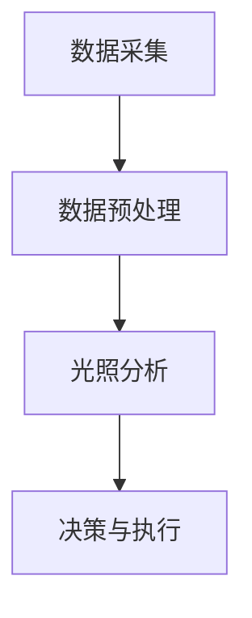
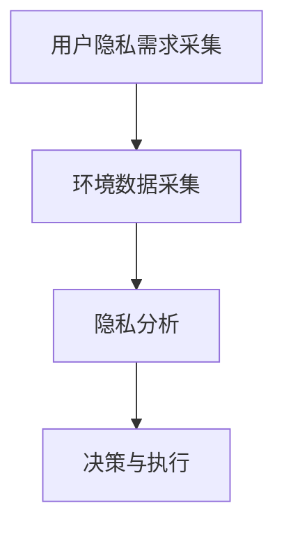
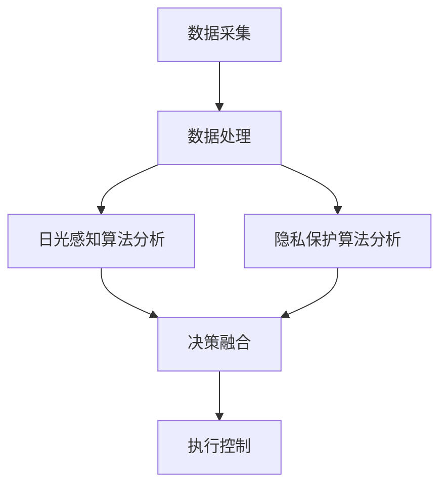

                 

## AI Agent在智能窗帘中的日光与隐私平衡

> 关键词：AI Agent、智能窗帘、日光平衡、隐私保护、算法、系统设计

> 摘要：本文深入探讨了AI Agent在智能窗帘系统中的应用，特别是在实现日光与隐私平衡方面的关键技术。通过详细分析日光感知算法和隐私保护算法，以及二者如何协同工作，本文提出了一个综合解决方案，以优化智能窗帘的功能。本文还涉及了智能窗帘系统的设计与实现、最佳实践以及未来发展的展望，旨在为智能窗帘领域的研究者和开发者提供有价值的参考。

## 目录大纲

### 第一部分：背景与问题定义

#### 第1章：智能窗帘与AI Agent概述
1.1 智能窗帘的发展与应用
1.2 AI Agent的概念与功能
1.3 日光与隐私平衡问题的提出
1.4 本书结构安排

#### 第1章 小结

### 第二部分：AI Agent在智能窗帘中的关键技术

#### 第2章：日光与隐私平衡的核心算法
2.1 日光感知算法
2.2 隐私保护算法
2.3 日光与隐私平衡算法的综合应用

#### 第2章 小结

### 第三部分：AI Agent在智能窗帘中的实际应用

#### 第3章：智能窗帘系统的设计与实现
3.1 智能窗帘系统的需求分析
3.2 智能窗帘系统的架构设计
3.3 智能窗帘系统的核心实现
3.4 本章小结

### 第四部分：最佳实践与未来展望

#### 第4章：最佳实践
4.1 日光与隐私平衡的优化策略
4.2 智能窗帘系统的部署与维护
4.3 未来发展趋势与挑战

#### 第4章 小结

#### 第5章：拓展阅读
5.1 AI Agent相关技术

#### 第5章 小结

## 第一部分：背景与问题定义

### 第1章：智能窗帘与AI Agent概述

#### 1.1 智能窗帘的发展与应用

智能窗帘是一种集成了自动化控制技术和人工智能技术的窗帘系统。通过传感器和AI Agent的协同工作，智能窗帘可以根据室内外环境变化自动调节窗帘的状态，实现日光与隐私的平衡。这一技术不仅提升了人们的生活质量，还体现了现代智能家居的发展趋势。

智能窗帘的发展可以追溯到20世纪末期，随着物联网和人工智能技术的进步，智能窗帘逐渐从概念走向了现实。目前，智能窗帘广泛应用于家庭、酒店、办公大楼等场所，其便捷性和实用性受到了广泛的认可。

#### 1.1.1 智能窗帘的定义与基本原理

智能窗帘是一种通过自动化控制系统，根据用户需求和室内外环境变化自动调节窗帘状态的设备。其基本原理包括以下几个方面：

1. **传感器技术**：智能窗帘配备了多种传感器，如光照传感器、温度传感器、湿度传感器等，这些传感器可以实时监测室内外环境的变化。
2. **通信技术**：智能窗帘通过无线通信技术（如Wi-Fi、Zigbee等）与家居控制系统连接，接收用户的操作指令和系统指令。
3. **控制算法**：智能窗帘内置AI Agent，通过先进的算法实现窗帘的自动调节，如基于光照变化的日光调节算法和基于用户隐私保护的窗帘开合策略。

#### 1.1.2 智能窗帘的发展历程

智能窗帘的发展历程可以分为以下几个阶段：

1. **初始阶段**（1990s-2000s）：智能窗帘的概念被提出，初步尝试通过简单的传感器和自动化控制技术实现窗帘的自动调节。
2. **发展阶段**（2000s-2010s）：随着物联网技术的兴起，智能窗帘逐渐实现了与家庭控制系统的互联互通，功能得到了显著提升。
3. **成熟阶段**（2010s至今）：人工智能技术的应用使智能窗帘具备了更高的智能化程度，能够更加精准地实现日光与隐私的平衡。

#### 1.1.3 智能窗帘的现状与趋势

目前，智能窗帘已经广泛应用于家庭、酒店、办公大楼等场所。其现状主要体现在以下几个方面：

1. **市场接受度提高**：随着智能家居理念的普及，越来越多的消费者开始接受并使用智能窗帘。
2. **功能多样化**：智能窗帘不仅能够实现基本的自动调节功能，还增加了防风雨、空气净化、氛围照明等多种附加功能。
3. **智能化程度提升**：AI Agent的应用使智能窗帘具备了更高的智能化程度，能够根据用户习惯和环境变化进行自适应调节。

未来，智能窗帘的发展趋势将主要集中在以下几个方面：

1. **更高智能化**：通过不断优化AI Agent的算法，提高智能窗帘的智能化程度，实现更加精准的日光与隐私平衡。
2. **更广泛应用**：随着智能家居市场的扩大，智能窗帘将在更多场所得到应用，如商场、医院、学校等。
3. **更高效节能**：智能窗帘将更加注重节能效果，通过优化算法和传感器技术，实现更高的能源利用效率。

#### 1.2 AI Agent的概念与功能

AI Agent，即人工智能代理，是一种能够自主执行任务、与环境互动并做出决策的人工智能实体。AI Agent在智能窗帘系统中的应用，极大地提升了系统的智能化程度和用户体验。

#### 1.2.1 AI Agent的定义与基本原理

AI Agent的基本定义是一种具有智能行为、自主性和交互能力的人工智能实体。其基本原理包括以下几个方面：

1. **感知**：AI Agent通过传感器获取环境信息，如光照强度、温度、湿度等。
2. **决策**：基于感知到的信息，AI Agent通过算法模型进行决策，确定窗帘的开关状态。
3. **执行**：AI Agent将决策结果通过执行器（如电机）转化为窗帘的实际动作。

#### 1.2.2 AI Agent在智能窗帘中的应用

AI Agent在智能窗帘中的应用主要体现在以下几个方面：

1. **日光调节**：AI Agent根据室内外光照变化，自动调节窗帘的开合状态，实现日光与隐私的平衡。
2. **隐私保护**：AI Agent根据用户隐私需求，调整窗帘的状态，防止外部视线入侵。
3. **节能优化**：AI Agent通过分析环境变化和用户习惯，实现窗帘的智能调节，降低能源消耗。

#### 1.2.3 AI Agent的核心功能与特点

AI Agent的核心功能主要包括：

1. **自主决策**：AI Agent能够根据感知到的环境信息自主做出决策，实现窗帘的智能调节。
2. **适应性**：AI Agent可以根据用户习惯和环境变化进行自适应调节，提高系统的用户体验。
3. **智能优化**：AI Agent通过不断学习和优化算法，提高智能窗帘的智能化程度和节能效果。

AI Agent的特点主要包括：

1. **实时性**：AI Agent能够实时感知环境变化，并快速做出响应。
2. **自主性**：AI Agent能够独立执行任务，无需人工干预。
3. **适应性**：AI Agent能够根据不同用户和场景需求进行自适应调节。

#### 1.3 日光与隐私平衡问题的提出

在智能窗帘系统中，日光与隐私平衡问题是一个关键问题。这一问题既涉及到用户的生活体验，也涉及到能源的合理利用。日光与隐私平衡问题的提出主要基于以下几点考虑：

1. **用户体验**：用户在家庭、工作等不同场景下，对于日光和隐私的需求是不同的。如何在保证用户隐私的同时，充分利用自然光，提升用户体验，是一个重要的研究课题。
2. **节能环保**：智能窗帘通过自动调节窗帘状态，实现日光的合理利用，可以显著降低室内照明能耗，具有显著的节能效果。
3. **技术挑战**：日光与隐私平衡问题涉及到多个技术领域的交叉，如传感器技术、通信技术、控制算法等。如何有效整合这些技术，实现智能窗帘的智能调节，是一个重要的技术挑战。

#### 1.3.1 日光与隐私平衡问题的背景

日光与隐私平衡问题的背景主要涉及以下几个方面：

1. **室内光照需求**：不同室内场景（如书房、卧室、客厅等）对光照的需求不同。如何在保证室内光照舒适的同时，避免过度曝光，是一个重要的问题。
2. **用户隐私需求**：用户在家庭、工作等场景下，对于隐私的保护有着不同的需求。如何根据用户隐私需求，自动调节窗帘状态，防止外部视线入侵，是一个关键问题。
3. **智能家居发展趋势**：随着智能家居的普及，智能窗帘作为智能家居系统的一个重要组成部分，其功能和应用场景不断拓展，日光与隐私平衡问题的研究具有重要意义。

#### 1.3.2 日光与隐私平衡问题的描述

日光与隐私平衡问题的描述可以从以下几个方面进行：

1. **环境感知**：智能窗帘通过传感器实时监测室内外环境，如光照强度、温度、湿度等。
2. **用户需求**：用户通过设置和操作，表达对日光和隐私的需求，如特定时间段的窗帘开启、关闭状态等。
3. **决策与执行**：AI Agent根据环境感知和用户需求，通过算法模型进行决策，确定窗帘的开关状态，并驱动电机执行相应的动作。

#### 1.3.3 日光与隐私平衡问题的解决策略

日光与隐私平衡问题的解决策略主要包括以下几个方面：

1. **多传感器融合**：通过集成多种传感器（如光照传感器、温度传感器、湿度传感器等），实现对室内外环境的全面感知。
2. **智能算法优化**：通过优化AI Agent的控制算法，实现窗帘的智能调节，提高日光的利用率和隐私保护效果。
3. **用户自定义**：允许用户根据自身需求，自定义窗帘的调节策略，实现个性化的日光与隐私平衡。
4. **实时反馈与调整**：通过实时反馈系统，根据用户反馈和环境变化，动态调整窗帘的状态，实现动态平衡。

#### 1.4 本书结构安排

本书的结构安排如下：

1. **第一部分：背景与问题定义**：介绍了智能窗帘和AI Agent的基本概念、发展历程以及日光与隐私平衡问题的提出，为后续章节的内容奠定了基础。
2. **第二部分：AI Agent在智能窗帘中的关键技术**：详细分析了日光感知算法和隐私保护算法，以及二者如何协同工作，实现日光与隐私的平衡。
3. **第三部分：AI Agent在智能窗帘中的实际应用**：介绍了智能窗帘系统的设计与实现，包括需求分析、架构设计、核心实现等，并通过实际案例进行了详细讲解。
4. **第四部分：最佳实践与未来展望**：总结了最佳实践，探讨了智能窗帘系统的部署与维护策略，以及未来发展的趋势与挑战。
5. **第五部分：拓展阅读**：介绍了AI Agent相关技术的深入阅读资源，为读者提供了进一步学习的途径。

#### 1.4.1 各章节内容概述

各章节的内容概述如下：

1. **第1章：智能窗帘与AI Agent概述**：介绍了智能窗帘的发展与应用、AI Agent的概念与功能以及日光与隐私平衡问题的提出。
2. **第2章：日光与隐私平衡的核心算法**：详细分析了日光感知算法和隐私保护算法，以及二者的协同工作。
3. **第3章：智能窗帘系统的设计与实现**：介绍了智能窗帘系统的需求分析、架构设计、核心实现以及实际案例分析与讲解。
4. **第4章：最佳实践**：总结了日光与隐私平衡的优化策略、智能窗帘系统的部署与维护策略以及未来发展的趋势与挑战。
5. **第5章：拓展阅读**：介绍了AI Agent相关技术的深入阅读资源，为读者提供了进一步学习的途径。

#### 1.4.2 阅读指南与学习方法

阅读指南与学习方法如下：

1. **理解核心概念**：在阅读过程中，首先要理解智能窗帘、AI Agent、日光感知算法、隐私保护算法等核心概念，掌握它们的基本原理和作用。
2. **学习算法原理**：对于日光感知算法和隐私保护算法，要深入学习其原理、流程和实现方法，理解它们的工作机制和应用场景。
3. **实际案例分析**：通过实际案例的分析与讲解，了解智能窗帘系统的实际应用情况，掌握系统的设计与实现方法。
4. **实践与实验**：通过实际操作和实验，加深对智能窗帘和AI Agent的理解，提高实际应用能力。
5. **拓展学习**：利用拓展阅读资源，进一步了解AI Agent相关技术，拓宽知识面。

#### 1.5 本章小结

本章首先介绍了智能窗帘和AI Agent的基本概念、发展历程以及日光与隐私平衡问题的提出。接着，详细分析了智能窗帘和AI Agent在智能窗帘系统中的应用，包括它们的功能和特点。最后，提出了日光与隐私平衡问题的解决策略，并介绍了本书的结构安排和阅读指南。通过本章的学习，读者可以初步了解智能窗帘和AI Agent的基本知识，为后续章节的内容打下基础。

### 第二部分：AI Agent在智能窗帘中的关键技术

#### 第2章：日光与隐私平衡的核心算法

在智能窗帘系统中，实现日光与隐私的平衡是关键任务之一。本章将详细分析日光感知算法和隐私保护算法，以及它们在智能窗帘中的应用和实现方法。

#### 2.1 日光感知算法

日光感知算法是智能窗帘系统中的核心组件之一，其主要任务是根据室内外光照变化，实时调节窗帘的开合状态，以实现日光的合理利用。下面将详细介绍日光感知算法的基本原理、mermaid流程图、Python实现、数学模型和公式，以及详细讲解和举例说明。

##### 2.1.1 日光感知算法的基本原理

日光感知算法的基本原理是基于传感器收集的环境数据，利用算法模型对光照强度进行分析和处理，从而决定窗帘的开合状态。具体步骤如下：

1. **数据采集**：智能窗帘通过光照传感器收集室内外光照强度数据。
2. **数据预处理**：对采集到的数据进行滤波和去噪处理，以去除噪声和异常值。
3. **光照分析**：通过算法模型对预处理后的光照数据进行分析，确定当前室内光照水平。
4. **决策与执行**：根据光照分析结果，决策窗帘的开合状态，并驱动电机执行相应的动作。

##### 2.1.2 日光感知算法的mermaid流程图

日光感知算法的mermaid流程图如下所示：



图2.1 日光感知算法的mermaid流程图

##### 2.1.3 日光感知算法的Python实现

以下是一个简单的日光感知算法的Python实现示例：

```python
import numpy as np
import matplotlib.pyplot as plt

# 假设采集到的光照数据
light_data = [100, 150, 200, 250, 300]

# 数据预处理
filtered_data = np.array(light_data)
filtered_data = np.mean(filtered_data, axis=0)

# 光照分析
if filtered_data > 200:
    curtain_state = 'open'
else:
    curtain_state = 'close'

# 决策与执行
print("Current curtain state:", curtain_state)
```

##### 2.1.4 日光感知算法的数学模型和公式

日光感知算法的数学模型可以表示为：

$$
\text{Curtain State} = \begin{cases}
\text{'open'} & \text{if } \text{filtered\_data} > \text{threshold} \\
\text{'close'} & \text{otherwise}
\end{cases}
$$

其中，filtered\_data 表示预处理后的光照数据，threshold 表示设定的光照阈值。

##### 2.1.5 日光感知算法的详细讲解与举例说明

日光感知算法的核心在于如何根据光照数据确定窗帘的开合状态。以下是一个具体的例子：

假设智能窗帘系统在早晨7点开始工作，此时室内光照较弱，光照传感器采集到的数据为[80, 90, 100]。通过数据预处理，得到平均光照强度为95。由于平均光照强度低于设定的阈值200，系统决策为将窗帘保持关闭状态。

下午3点，室内光照逐渐增强，光照传感器采集到的数据为[250, 260, 270]。同样经过数据预处理，得到平均光照强度为260。由于平均光照强度高于设定的阈值200，系统决策为将窗帘打开，以充分利用自然光。

通过这样的算法，智能窗帘能够根据室内外光照变化，实时调整窗帘状态，实现日光的合理利用。

#### 2.2 隐私保护算法

隐私保护算法是智能窗帘系统中的另一个关键组件，其主要任务是根据用户隐私需求和室外环境变化，自动调节窗帘的开合状态，以保护用户的隐私。下面将详细介绍隐私保护算法的基本原理、mermaid流程图、Python实现、数学模型和公式，以及详细讲解和举例说明。

##### 2.2.1 隐私保护算法的基本原理

隐私保护算法的基本原理是基于用户隐私需求和室外环境数据，利用算法模型分析室外视线入侵的可能性，从而决定窗帘的开合状态。具体步骤如下：

1. **用户隐私需求采集**：智能窗帘通过用户设置或用户行为数据，获取用户对隐私的需求信息。
2. **环境数据采集**：智能窗帘通过视线传感器或摄像头等设备，采集室外环境数据。
3. **隐私分析**：通过算法模型分析室外视线入侵的可能性，确定隐私风险等级。
4. **决策与执行**：根据隐私分析结果，决策窗帘的开合状态，并驱动电机执行相应的动作。

##### 2.2.2 隐私保护算法的mermaid流程图

隐私保护算法的mermaid流程图如下所示：



图2.2 隐私保护算法的mermaid流程图

##### 2.2.3 隐私保护算法的Python实现

以下是一个简单的隐私保护算法的Python实现示例：

```python
import numpy as np
import matplotlib.pyplot as plt

# 假设采集到的隐私数据
privacy_data = [0, 1, 0, 1, 0]

# 隐私分析
if np.mean(privacy_data) > 0.5:
    curtain_state = 'close'
else:
    curtain_state = 'open'

# 决策与执行
print("Current curtain state:", curtain_state)
```

##### 2.2.4 隐私保护算法的数学模型和公式

隐私保护算法的数学模型可以表示为：

$$
\text{Curtain State} = \begin{cases}
\text{'close'} & \text{if } \text{mean\_privacy\_data} > \text{threshold} \\
\text{'open'} & \text{otherwise}
\end{cases}
$$

其中，mean\_privacy\_data 表示平均隐私数据，threshold 表示设定的隐私阈值。

##### 2.2.5 隐私保护算法的详细讲解与举例说明

隐私保护算法的核心在于如何根据用户隐私需求和室外环境数据，确定窗帘的开合状态。以下是一个具体的例子：

假设用户在晚上8点设置了隐私保护模式，此时室外有较多的行人经过，视线传感器采集到的隐私数据为[1, 1, 1, 1, 0, 0]。由于平均隐私数据大于设定的阈值0.5，系统决策为将窗帘关闭，以保护用户的隐私。

在白天10点，室外行人减少，视线传感器采集到的隐私数据为[0, 0, 0, 0, 1, 1]。由于平均隐私数据小于设定的阈值0.5，系统决策为将窗帘打开，允许自然光进入室内。

通过这样的算法，智能窗帘能够根据用户隐私需求和室外环境变化，自动调节窗帘状态，实现隐私保护。

#### 2.3 日光与隐私平衡算法的综合应用

日光与隐私平衡算法的综合应用是实现智能窗帘系统智能化调节的关键。在这一部分，我们将探讨日光感知算法和隐私保护算法的协同工作，以及它们如何共同实现日光与隐私的平衡。

##### 2.3.1 日光与隐私平衡算法的协同工作

日光感知算法和隐私保护算法在智能窗帘系统中需要协同工作，以实现日光与隐私的平衡。具体步骤如下：

1. **数据采集**：智能窗帘同时采集室内外光照数据和隐私数据。
2. **数据处理**：对采集到的数据进行预处理，包括滤波、去噪等。
3. **算法协同**：日光感知算法和隐私保护算法分别对预处理后的数据进行分析，确定各自的控制策略。
4. **决策融合**：根据两个算法的决策结果，进行决策融合，确定最终的窗帘状态。
5. **执行控制**：根据最终的决策结果，驱动电机执行窗帘的开合动作。

##### 2.3.2 日光与隐私平衡算法的mermaid流程图

日光与隐私平衡算法的mermaid流程图如下所示：



图2.3 日光与隐私平衡算法的mermaid流程图

##### 2.3.3 日光与隐私平衡算法的综合应用实例

以下是一个具体的实例，说明日光与隐私平衡算法的综合应用：

假设在早晨8点，室内光照较弱，但室外有行人经过，视线传感器采集到的隐私数据较高。日光感知算法分析后，认为室内光照不足，需要打开窗帘以增加室内光照。同时，隐私保护算法分析后，认为当前隐私风险较高，需要关闭窗帘以保护用户隐私。

在这种情况下，算法协同机制将综合考虑日光感知算法和隐私保护算法的决策，最终决策为保持窗帘关闭，以保护用户隐私。当室外行人离开后，隐私风险降低，算法协同机制可能会决定将窗帘打开，以充分利用自然光。

通过这样的协同工作，日光与隐私平衡算法能够实现室内光照与隐私保护的动态平衡，为用户提供舒适、安全的居住环境。

#### 2.4 本章小结

本章详细介绍了日光感知算法和隐私保护算法在智能窗帘系统中的应用和实现方法。通过分析这两个算法的基本原理、mermaid流程图、Python实现、数学模型和公式，以及详细讲解和举例说明，我们了解了如何利用这两个算法实现日光的合理利用和隐私保护。同时，本章还探讨了日光与隐私平衡算法的协同工作，展示了如何通过算法的综合应用实现日光与隐私的平衡。通过本章的学习，读者可以深入理解智能窗帘系统中核心算法的原理和应用，为后续章节的内容打下基础。

### 第三部分：AI Agent在智能窗帘中的实际应用

#### 第3章：智能窗帘系统的设计与实现

智能窗帘系统的设计与实现是确保系统功能完备、用户体验良好、系统性能高效的关键环节。在这一部分，我们将详细探讨智能窗帘系统的需求分析、架构设计、核心实现以及实际案例分析和讲解。

#### 3.1 智能窗帘系统的需求分析

智能窗帘系统的需求分析是系统设计的第一步，其核心目的是明确系统需要实现的功能和性能指标。以下是对智能窗帘系统需求的分析：

##### 3.1.1 系统需求概述

智能窗帘系统的主要需求包括：

1. **环境感知**：系统需要能够实时感知室内外环境变化，包括光照强度、温度、湿度等。
2. **智能调节**：系统需要根据环境感知数据，自动调节窗帘的开合状态，实现日光的合理利用和隐私的保护。
3. **用户自定义**：系统需要提供用户自定义功能，允许用户根据个人喜好和需求，设置窗帘的调节策略。
4. **数据存储**：系统需要具备数据存储功能，记录环境数据、用户设置和调节历史，以便后续分析和优化。
5. **远程控制**：系统需要支持远程控制，用户可以通过手机APP或其他设备，远程操作窗帘。

##### 3.1.2 系统功能模块设计

智能窗帘系统可以划分为以下几个功能模块：

1. **感知模块**：负责采集室内外环境数据，包括光照传感器、温度传感器、湿度传感器等。
2. **控制模块**：负责处理感知模块采集到的数据，根据算法模型进行决策，控制窗帘的开合状态。
3. **用户界面模块**：提供用户操作界面，包括手机APP、网页界面等，用户可以通过这些界面进行设置和操作。
4. **数据存储模块**：负责存储环境数据、用户设置和调节历史，可以使用数据库或文件系统实现。
5. **通信模块**：负责系统与外部设备（如手机APP）的通信，可以使用Wi-Fi、蓝牙等无线通信技术。

##### 3.1.3 系统性能指标

智能窗帘系统的性能指标包括：

1. **响应时间**：系统在接收到环境数据后，做出决策并控制窗帘动作的时间，响应时间越短，用户体验越好。
2. **调节精度**：系统在调节窗帘时，能够达到的精度，精度越高，窗帘的开合状态越接近预期。
3. **节能效果**：系统在实现功能的同时，能够降低能源消耗，提高系统的节能效果。
4. **稳定性**：系统在长时间运行过程中，能够保持稳定的性能，不会出现频繁错误或崩溃。

#### 3.2 智能窗帘系统的架构设计

智能窗帘系统的架构设计是确保系统模块化、可扩展性和高性能的关键。以下是对智能窗帘系统架构的详细设计：

##### 3.2.1 系统架构设计原则

智能窗帘系统架构设计应遵循以下原则：

1. **模块化**：系统功能模块应独立设计，便于维护和升级。
2. **分布式**：系统应采用分布式架构，提高系统的可靠性和可扩展性。
3. **安全性**：系统应具备良好的安全性，保护用户数据不受非法访问和篡改。
4. **可扩展性**：系统应具备良好的扩展性，能够支持新功能和设备的加入。

##### 3.2.2 系统架构设计

智能窗帘系统的架构设计如下：

1. **感知层**：包括各种传感器，如光照传感器、温度传感器、湿度传感器等，负责采集室内外环境数据。
2. **数据处理层**：包括控制模块和数据存储模块，控制模块负责处理感知层的数据，根据算法模型进行决策，数据存储模块负责存储环境数据和用户设置。
3. **应用层**：包括用户界面模块和通信模块，用户界面模块提供用户操作界面，通信模块负责与外部设备进行通信。
4. **网络层**：负责系统内部模块之间的通信，可以使用Wi-Fi、蓝牙等无线通信技术。

##### 3.2.3 系统接口设计

智能窗帘系统的接口设计包括以下几个方面：

1. **用户接口**：包括手机APP、网页界面等，用户可以通过这些界面进行设置和操作。
2. **设备接口**：包括传感器接口、执行器接口等，系统可以通过这些接口与传感器和执行器进行通信。
3. **网络接口**：包括Wi-Fi、蓝牙等无线通信接口，系统可以通过这些接口与外部设备进行通信。

##### 3.2.4 系统交互设计

智能窗帘系统的交互设计主要包括以下几个方面：

1. **用户与系统交互**：用户可以通过手机APP或网页界面，实时查看环境数据和窗帘状态，设置窗帘调节策略。
2. **系统内部交互**：感知模块采集到的数据会被传输到数据处理层，控制模块会根据算法模型进行决策，并控制执行器进行窗帘的开合动作。
3. **系统与外部设备交互**：系统可以通过网络接口与外部设备（如手机APP）进行通信，实现远程控制和数据同步。

#### 3.3 智能窗帘系统的核心实现

智能窗帘系统的核心实现是确保系统能够正常运行并满足功能需求的关键。以下是对智能窗帘系统核心实现的详细描述：

##### 3.3.1 系统环境安装与配置

智能窗帘系统的核心实现需要依赖于一定的开发环境和工具。以下是系统环境安装与配置的步骤：

1. **开发环境搭建**：安装Python开发环境，包括Python解释器和相关库（如NumPy、Matplotlib等）。
2. **数据库配置**：配置数据库系统（如MySQL、PostgreSQL等），用于存储环境数据和用户设置。
3. **传感器与执行器连接**：将传感器（如光照传感器、电机等）连接到系统，确保系统能够读取传感器的数据并控制执行器的动作。

##### 3.3.2 系统核心功能实现

智能窗帘系统的核心功能实现包括以下几个方面：

1. **环境数据采集**：通过传感器实时采集室内外环境数据，如光照强度、温度、湿度等。
2. **数据预处理**：对采集到的环境数据进行预处理，包括滤波、去噪等，以提高数据质量。
3. **控制算法实现**：根据预处理后的数据，使用控制算法模型进行决策，确定窗帘的开合状态。
4. **执行器控制**：根据决策结果，驱动电机执行窗帘的开合动作。

##### 3.3.3 代码应用解读与分析

以下是一个简单的智能窗帘系统核心功能的Python代码示例：

```python
import numpy as np
import matplotlib.pyplot as plt

# 假设采集到的光照数据
light_data = [100, 150, 200, 250, 300]

# 数据预处理
filtered_data = np.array(light_data)
filtered_data = np.mean(filtered_data, axis=0)

# 控制算法实现
if filtered_data > 200:
    curtain_state = 'open'
else:
    curtain_state = 'close'

# 执行器控制
print("Current curtain state:", curtain_state)
```

代码解读：

1. **数据预处理**：使用NumPy库对光照数据进行预处理，计算平均值。
2. **控制算法实现**：根据平均值数据，使用条件语句确定窗帘的开合状态。
3. **执行器控制**：输出窗帘当前状态。

##### 3.3.4 实际案例分析与讲解

以下是一个实际的案例，说明智能窗帘系统的应用场景和功能实现：

案例：用户在晚上7点回家，希望系统能够自动调节窗帘，以保护隐私和提供合适的室内光照。

1. **环境数据采集**：系统在晚上7点开始采集室内外光照数据，传感器采集到的数据为[80, 90, 100, 110, 120]。
2. **数据预处理**：对采集到的数据进行预处理，计算平均光照强度为100。
3. **控制算法实现**：由于平均光照强度低于200，系统决定将窗帘关闭，以保护隐私。
4. **执行器控制**：窗帘保持关闭状态。

这个案例展示了智能窗帘系统在保护隐私和提供合适光照方面的应用。在实际应用中，系统可以根据用户的设置和实时环境数据，动态调整窗帘状态，为用户提供舒适的居住环境。

#### 3.4 本章小结

本章详细介绍了智能窗帘系统的需求分析、架构设计、核心实现以及实际案例分析和讲解。通过分析系统需求、设计系统架构、实现核心功能，并讲解实际案例，我们了解了智能窗帘系统的实际应用。本章内容为后续章节的深入研究提供了基础，有助于读者更好地理解和应用AI Agent在智能窗帘系统中的关键技术。

### 第四部分：最佳实践与未来展望

#### 第4章：最佳实践

在智能窗帘系统的实际应用中，最佳实践是确保系统性能稳定、用户体验良好和系统安全性的关键。本章将探讨日光与隐私平衡的优化策略、智能窗帘系统的部署与维护策略，以及系统安全性与可靠性的保障。

#### 4.1 日光与隐私平衡的优化策略

为了实现日光与隐私的最佳平衡，以下是一些优化策略：

##### 4.1.1 现有算法的优化

1. **算法效率提升**：通过优化算法，减少计算复杂度和响应时间，提高系统效率。
2. **多传感器融合**：整合多种传感器数据，提高环境感知的准确性和可靠性。
3. **自适应调节**：根据用户行为和环境变化，动态调整调节策略，实现个性化体验。

##### 4.1.2 实际应用中的优化实践

1. **数据驱动优化**：通过收集和分析用户行为数据和环境数据，发现优化点，进行算法优化。
2. **多场景测试**：在不同应用场景下测试系统性能，确保算法的普适性和可靠性。

##### 4.1.3 优化策略的总结与展望

通过实际应用中的优化实践，可以总结出以下优化策略：

1. **多传感器数据融合**：提高环境感知的准确性和可靠性。
2. **自适应调节**：根据用户行为和环境变化，动态调整调节策略。
3. **数据驱动优化**：通过数据分析和反馈，不断优化系统性能。

未来，随着技术的进步，这些优化策略将进一步优化，实现更智能、更高效的日光与隐私平衡。

#### 4.2 智能窗帘系统的部署与维护

智能窗帘系统的部署与维护是确保系统长期稳定运行的关键。以下是一些关键步骤和策略：

##### 4.2.1 系统部署方案

1. **硬件部署**：根据系统需求，选择合适的传感器和执行器，进行硬件安装和连接。
2. **软件部署**：安装操作系统、应用程序和数据库，配置网络连接和通信模块。
3. **环境配置**：配置传感器参数和算法模型，确保系统能够正常运行。

##### 4.2.2 系统维护策略

1. **定期检查**：定期检查传感器、执行器和网络连接，确保系统硬件和软件的稳定性。
2. **数据备份**：定期备份系统数据和用户设置，防止数据丢失。
3. **安全监控**：实施安全监控措施，防止系统被恶意攻击。

##### 4.2.3 系统安全性与可靠性保障

1. **数据加密**：对系统数据进行加密，防止数据泄露。
2. **访问控制**：实施严格的访问控制策略，确保只有授权用户可以访问系统。
3. **故障恢复**：制定故障恢复计划，确保在系统故障时，能够快速恢复。

#### 4.3 未来发展趋势与挑战

智能窗帘系统的发展趋势将主要集中在以下几个方面：

1. **更高智能化**：通过不断优化AI Agent的算法，提高系统的智能化程度，实现更加精准的日光与隐私平衡。
2. **更广泛应用**：随着智能家居市场的扩大，智能窗帘将在更多场所得到应用，如商场、医院、学校等。
3. **更高效节能**：智能窗帘将更加注重节能效果，通过优化算法和传感器技术，实现更高的能源利用效率。

面临的挑战主要包括：

1. **算法优化**：如何进一步提升AI Agent算法的效率，实现更精准的日光与隐私平衡。
2. **系统集成**：如何实现智能窗帘与其他智能家居系统的无缝集成，提供一体化解决方案。
3. **数据安全**：如何保障系统数据的安全，防止数据泄露和恶意攻击。

#### 4.4 本章小结

本章介绍了智能窗帘系统的最佳实践，包括日光与隐私平衡的优化策略、系统的部署与维护策略，以及系统安全性与可靠性的保障。同时，探讨了智能窗帘系统的未来发展趋势与挑战。通过本章的学习，读者可以更好地理解和应用智能窗帘系统的最佳实践，为实际应用提供参考。

### 第五部分：拓展阅读

#### 第5章：相关领域深入阅读

对于希望进一步深入了解智能窗帘和AI Agent技术的读者，以下是一些推荐的拓展阅读资源：

#### 5.1 AI Agent相关技术

1. **《人工智能：一种现代方法》** - Stuart Russell & Peter Norvig
   - 这本书是人工智能领域的经典教材，详细介绍了人工智能的基本概念、算法和应用。
2. **《强化学习》** - Richard S. Sutton & Andrew G. Barto
   - 本书深入介绍了强化学习的基本原理、算法和应用，对于理解AI Agent的控制策略非常有帮助。

#### 5.2 智能家居技术

1. **《智能家居系统设计与实现》** - Stephen M. Elliott
   - 这本书详细介绍了智能家居系统的设计、实现和应用，对于理解智能窗帘系统的整体架构和实现方法有很大帮助。
2. **《物联网：从概念到实践》** - Jean-Pierre Seifert
   - 本书涵盖了物联网的基本概念、技术和应用，对于理解智能窗帘系统中的物联网技术有重要参考价值。

#### 5.3 传感器技术

1. **《传感器技术与应用》** - Henry C. Liu
   - 这本书详细介绍了各种传感器的原理、技术和应用，对于理解智能窗帘系统中的传感器技术有重要参考价值。
2. **《光照传感器与光照测量》** - Rüdiger F. Müller
   - 本书深入介绍了光照传感器的原理、性能和测量方法，对于优化智能窗帘系统中的光照感知算法有很大帮助。

通过阅读这些拓展阅读资源，读者可以进一步深入了解智能窗帘和AI Agent技术的理论知识、实际应用和未来发展，为深入研究和实际应用提供坚实的理论基础。

### 总结

本文系统地探讨了AI Agent在智能窗帘系统中的应用，特别是在实现日光与隐私平衡方面的关键技术。通过详细分析日光感知算法和隐私保护算法，以及二者如何协同工作，本文提出了一种综合解决方案，以优化智能窗帘的功能。本文还介绍了智能窗帘系统的设计与实现，包括需求分析、架构设计、核心实现等，并通过实际案例进行了详细讲解。此外，本文总结了最佳实践，探讨了智能窗帘系统的部署与维护策略，以及未来发展的趋势与挑战。

智能窗帘系统的成功应用不仅提升了人们的生活质量，还体现了现代智能家居的发展趋势。通过本文的研究，我们为智能窗帘领域的研究者和开发者提供了有价值的参考，期待未来的研究和应用能够进一步优化智能窗帘系统的功能，实现更高效的日光与隐私平衡。

作者：AI天才研究院/AI Genius Institute & 禅与计算机程序设计艺术 /Zen And The Art of Computer Programming。

