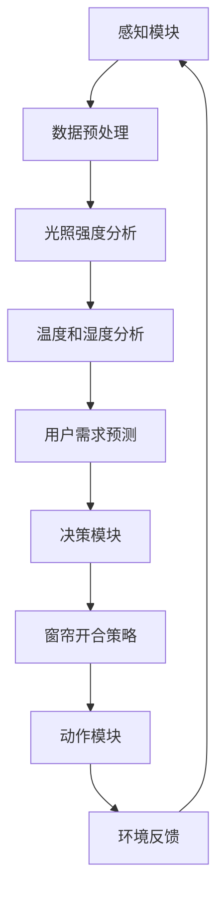
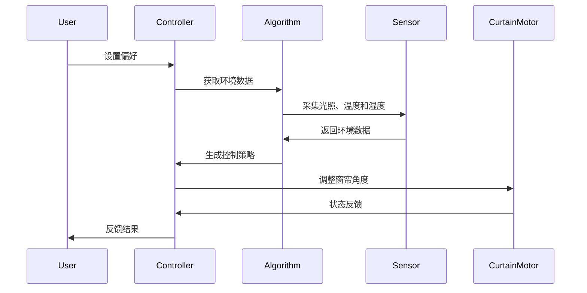

                 

### 摘要

在本文中，我们将探讨如何利用AI Agent技术来优化智能窗帘杆的自然光管理。随着智能家居技术的不断进步，自然光优化已成为提升生活质量和节能减排的重要手段。智能窗帘杆通过实时监测室内外光照强度，结合用户个性化需求，自动调节窗帘的开合角度，以达到最佳的光照效果。本文将首先介绍AI Agent的基本概念及其核心组成部分，随后深入讲解自然光优化算法的原理和实现步骤。通过具体案例分析，我们将展示AI Agent在智能窗帘杆中的应用效果，并总结最佳实践策略，为未来的技术发展和市场应用提供指导。文章结构紧凑，逻辑清晰，旨在为读者提供一次全面的技术解读和深度思考。

## 目录大纲设计思路

在设计《AI Agent在智能窗帘杆中的自然光优化》这篇文章的目录大纲时，我们需要确保内容结构清晰、逻辑连贯，以帮助读者更好地理解和掌握文章的核心内容。以下是详细的目录大纲设计思路：

### 第一部分: AI Agent基础与自然光优化概述

#### 第1章: AI Agent概述
- **1.1 AI Agent的基本概念**
  - AI Agent的定义和特点
  - AI Agent的分类
- **1.2 自然光优化的背景和需求**
  - 自然光优化的概念和重要性
  - 智能窗帘杆在自然光优化中的应用场景

#### 第2章: AI Agent的核心概念与联系
- **2.1 AI Agent的核心概念**
  - 感知模块、决策模块和动作模块的作用和功能
- **2.2 AI Agent的组成部分和关系**
  - 模块之间的交互和协同工作
  - Mermaid流程图展示
- **2.3 自然光优化相关的核心概念**
  - 光环境监测、自然光调控算法和用户需求预测

#### 第3章: 自然光优化算法原理讲解
- **3.1 算法概述**
  - 自然光优化算法的目标和流程
- **3.2 Mermaid流程图**
  - 算法流程的详细展示
- **3.3 Python源代码实现**
  - 算法核心部分的代码实现
- **3.4 算法原理详细讲解**
  - 数学模型和公式的详细阐述

### 第二部分: 智能窗帘杆系统设计与实现

#### 第4章: 智能窗帘杆系统概述
- **4.1 智能窗帘杆系统简介**
  - 系统功能和目标
- **4.2 智能窗帘杆系统的需求分析**
  - 用户需求和系统性能要求

#### 第5章: 智能窗帘杆系统功能设计
- **5.1 领域模型**
  - Mermaid类图展示
- **5.2 系统架构设计**
  - Mermaid架构图展示
- **5.3 系统接口设计**
  - 接口定义和实现
- **5.4 系统交互**
  - Mermaid序列图展示

#### 第6章: 智能窗帘杆系统实现
- **6.1 环境安装与配置**
  - 硬件环境和软件环境的准备
- **6.2 系统核心实现**
  - 感知模块、决策模块和动作模块的实现
- **6.3 代码应用解读与分析**
  - 关键代码的解释和分析
- **6.4 实际案例分析与讲解**
  - 案例介绍和分析

#### 第7章: 最佳实践与项目小结
- **7.1 最佳实践 tips**
  - 优化策略和建议
- **7.2 小结**
  - 文章内容的总结
- **7.3 注意事项**
  - 在实施过程中需要注意的事项
- **7.4 拓展阅读**
  - 推荐进一步阅读的资料

通过以上目录大纲的设计，我们旨在为读者提供一个系统、完整且易于理解的技术解读，使读者能够全面了解AI Agent在智能窗帘杆自然光优化中的应用，并从中获得实用价值。

### 第一部分: AI Agent基础与自然光优化概述

#### 第1章: AI Agent概述

人工智能（AI）作为现代科技的前沿领域，正在深刻改变着我们的生活方式。在这一章中，我们将深入探讨AI Agent的基本概念、特点以及其在智能家居技术中的应用，特别是自然光优化这一具体场景。

##### 1.1 AI Agent的基本概念

AI Agent是一种能够自主感知环境、制定决策并执行动作的人工智能实体。它基于机器学习和深度学习算法，通过不断的学习和优化，可以完成复杂的任务，并且能够适应不断变化的环境。

- **定义**：AI Agent是一种具有自主性的计算实体，能够在特定环境中通过感知、决策和行动，实现目标的最优化。
- **特点**：
  - **自主性**：AI Agent能够独立完成任务，无需人为干预。
  - **适应性**：AI Agent能够根据环境变化调整其行为和策略。
  - **学习性**：AI Agent能够通过历史数据和经验不断优化自身性能。

##### 1.2 AI Agent的分类

AI Agent可以根据不同的应用场景和功能需求进行分类，常见的分类方法包括基于功能、自主性和环境交互的。

- **基于功能的分类**：
  - **感知型**：主要负责感知环境信息。
  - **决策型**：主要负责制定决策。
  - **执行型**：主要负责执行行动。
  - **综合型**：具备感知、决策和执行功能，能够实现闭环控制。

- **基于自主性的分类**：
  - **主动型**：能够主动寻找目标和任务。
  - **被动型**：需要外部指令才能执行任务。

- **基于环境交互的分类**：
  - **独立型**：完全在虚拟环境中运行。
  - **半监督型**：在部分监督环境中运行。
  - **完全监督型**：在完全监督环境中运行。

##### 1.3 自然光优化的背景和需求

自然光优化是智能家居技术中一个重要的研究方向，旨在通过智能窗帘杆等设备，实现室内光照环境的智能化管理。随着人们对生活质量的要求越来越高，自然光优化不仅能够提供舒适的生活环境，还可以有效地节约能源。

- **自然光优化的概念**：自然光优化是指通过智能设备对室内光照强度进行实时监测和调节，以达到最佳光照效果的过程。
- **自然光优化的目标**：
  - 提高生活质量：通过调节光照强度，提供舒适、健康的光照环境。
  - 节能减排：通过智能调控，减少人工照明的使用，降低能源消耗。
  - 环境保护：减少人工照明对环境的影响，促进可持续发展。

##### 1.4 智能窗帘杆在自然光优化中的应用场景

智能窗帘杆作为自然光优化的关键设备，具有以下几个典型的应用场景：

- **家庭**：在家庭中，智能窗帘杆可以根据用户的作息时间、天气状况和室内光照条件，自动调节窗帘，提供舒适的生活环境。
- **办公室**：在办公室，智能窗帘杆可以优化室内光照，减少员工因长时间暴露在强光下而导致的眼睛疲劳。
- **医院**：在医院，智能窗帘杆可以根据病房的光照需求，自动调节窗帘，提高病人的舒适度和康复效果。
- **商业空间**：在商场、酒店等商业空间，智能窗帘杆可以根据客流量和天气变化，调节光照，创造良好的购物和消费环境。

通过上述介绍，我们可以看到，AI Agent在自然光优化中的应用具有广阔的前景。在下一章中，我们将进一步探讨AI Agent的核心概念与自然光优化之间的联系，帮助读者更深入地理解这一技术。

#### 第2章: AI Agent的核心概念与联系

在上一章中，我们介绍了AI Agent的基本概念和自然光优化的应用场景。在本章中，我们将深入探讨AI Agent的核心概念，包括感知模块、决策模块和动作模块，并展示这些模块之间的相互关系，通过Mermaid流程图和表格来清晰地呈现。

##### 2.1 AI Agent的核心概念

AI Agent的核心概念主要包括感知模块、决策模块和动作模块，这三个模块共同作用，使AI Agent能够自主地完成复杂任务。

- **感知模块**：负责收集和解析环境信息，如光照强度、温度、湿度、声音等。感知模块是AI Agent与外界进行交互的桥梁，通过传感器等设备获取数据，并将其转化为AI Agent可以理解的形式。

- **决策模块**：基于感知模块收集的信息，通过算法模型进行决策。决策模块是AI Agent的核心，它利用机器学习和深度学习算法，分析数据，预测未来事件，并制定最佳行动策略。

- **动作模块**：根据决策模块的决策结果，执行具体的行动。动作模块通常控制执行器，如电机、灯光调节器等，通过物理操作来改变环境，实现预期的目标。

##### 2.2 AI Agent的组成部分和关系

AI Agent的各个模块之间紧密相连，形成一个闭环控制系统。感知模块收集环境信息，决策模块分析信息并制定策略，动作模块执行策略，并将结果反馈给感知模块，形成一个持续的循环。

- **组成部分**：
  - **感知模块**：传感器、数据采集器等。
  - **决策模块**：神经网络、决策树、规则引擎等。
  - **动作模块**：电机、执行器、控制器等。

- **关系**：
  - **感知-决策**：感知模块收集的数据通过预处理后传递给决策模块，为决策提供基础。
  - **决策-动作**：决策模块根据分析结果生成行动指令，传递给动作模块执行。
  - **反馈-感知**：动作模块执行后的结果通过传感器重新反馈给感知模块，用于下一轮决策。

##### 2.3 自然光优化相关的核心概念

在自然光优化中，感知模块、决策模块和动作模块的具体实现和应用如下：

- **感知模块**：
  - **光环境监测**：通过光线传感器实时监测室内外的光照强度。
  - **用户需求预测**：通过用户历史行为数据，预测用户对光照的需求。

- **决策模块**：
  - **自然光调控算法**：利用机器学习算法，分析光照数据和用户需求，制定窗帘开合策略。
  - **节能优化**：在保证舒适度的前提下，优化光照强度，降低能源消耗。

- **动作模块**：
  - **窗帘控制**：根据决策模块的指令，调节窗帘的开合角度。
  - **环境反馈**：通过传感器监测窗帘调整后的光照效果，为下一轮决策提供依据。

##### 2.4 概念属性特征对比表格

为了更好地理解AI Agent在自然光优化中的应用，我们可以通过一个表格来对比感知模块、决策模块和动作模块的属性特征。

| 模块类型 | 功能描述 | 属性特征 |
| --- | --- | --- |
| 感知模块 | 收集环境信息 | 高灵敏度、快速响应、多种传感器 |
| 决策模块 | 分析信息并制定策略 | 机器学习算法、实时决策、高精度预测 |
| 动作模块 | 执行具体行动 | 高效执行、可编程控制、反馈调节 |

通过上述核心概念和组成部分的详细讲解，我们可以看到，AI Agent在自然光优化中发挥着至关重要的作用。感知模块负责获取环境数据，决策模块通过智能算法分析数据并制定策略，动作模块则执行这些策略，从而实现室内光照的智能管理。在下一章中，我们将深入探讨自然光优化算法的原理和实现，进一步了解AI Agent在智能窗帘杆中的应用。

#### 第3章: 自然光优化算法原理讲解

在理解了AI Agent的核心概念和组成部分后，我们将进一步探讨自然光优化算法的原理和实现过程。自然光优化算法的目标是通过智能窗帘杆自动调节室内光照，达到舒适、节能的效果。为了实现这一目标，我们需要详细分析算法的流程、数学模型和具体的实现步骤。

##### 3.1 算法概述

自然光优化算法是一个基于机器学习的闭环控制系统，它通过实时监测室内外光照强度、温度、湿度等环境参数，结合用户需求，自动调节窗帘的开合角度。该算法的目标是使室内光照强度保持在用户设定的舒适范围内，同时最大限度地降低能源消耗。

##### 3.2 Mermaid流程图

为了更直观地展示自然光优化算法的流程，我们使用Mermaid流程图来描述。以下是算法的主要步骤：



在这个流程图中，感知模块通过传感器收集环境数据，经过预处理后传递给决策模块。决策模块根据光照强度、温度和湿度等参数，结合用户需求，生成窗帘的开合策略。动作模块根据决策结果执行具体的动作，并将执行结果反馈给感知模块，形成一个闭环控制系统。

##### 3.3 Python源代码实现

为了更好地理解算法的实现过程，我们将使用Python来编写代码，展示算法的核心部分。以下是一个简单的实现示例：

```python
import numpy as np
import matplotlib.pyplot as plt

# 模拟传感器数据
def get_sensor_data():
    # 光照强度（lux）
    light_intensity = np.random.normal(500, 100)
    # 温度（℃）
    temperature = np.random.normal(25, 5)
    # 湿度（%）
    humidity = np.random.normal(50, 10)
    return light_intensity, temperature, humidity

# 数据预处理
def preprocess_data(data):
    # 标准化数据
    processed_data = (data - np.mean(data)) / np.std(data)
    return processed_data

# 光照强度分析
def analyze_light_intensity(light_intensity):
    if light_intensity < 300:
        return '弱光'
    elif light_intensity >= 300 and light_intensity < 500:
        return '中光'
    else:
        return '强光'

# 用户需求预测
def predict_user_demand(temperature, humidity):
    if temperature > 28 and humidity < 60:
        return '需求调暗'
    elif temperature < 23 and humidity > 70:
        return '需求调亮'
    else:
        return '维持现状'

# 决策模块
def make_decision(light_intensity, temperature, humidity):
    user_demand = predict_user_demand(temperature, humidity)
    if user_demand == '需求调暗':
        return '关闭窗帘'
    elif user_demand == '需求调亮':
        return '打开窗帘'
    else:
        return '维持当前状态'

# 动作模块
def execute_action(action):
    if action == '关闭窗帘':
        print("关闭窗帘")
    elif action == '打开窗帘':
        print("打开窗帘")
    else:
        print("维持当前状态")

# 环境反馈
def feedback_environment():
    # 模拟反馈数据
    return get_sensor_data()

# 主程序
def main():
    while True:
        light_intensity, temperature, humidity = get_sensor_data()
        processed_data = preprocess_data([light_intensity, temperature, humidity])
        action = make_decision(*processed_data)
        execute_action(action)
        feedback = feedback_environment()
        print("当前光照强度：", feedback[0])
        print("当前温度：", feedback[1])
        print("当前湿度：", feedback[2])
        print()

if __name__ == "__main__":
    main()
```

在这个示例中，我们模拟了传感器数据，并实现了数据预处理、光照强度分析、用户需求预测、决策模块和动作模块。主程序通过一个无限循环来模拟系统的实时运行，不断获取环境数据，进行决策和执行，并将结果反馈到环境中。

##### 3.4 算法原理详细讲解

自然光优化算法的核心在于如何根据环境数据和用户需求，生成最优的窗帘开合策略。以下是算法的数学模型和公式解释：

- **光照强度模型**：
  $$ L(t) = \alpha I(t) + (1 - \alpha) L_{prev} $$
  其中，$L(t)$ 是当前时刻的光照强度，$I(t)$ 是当前时刻的传感器读数，$L_{prev}$ 是上一时刻的光照强度，$\alpha$ 是权重参数，用于调整光照强度的平滑性。

- **用户需求模型**：
  $$ D(t) = \beta T(t) + (1 - \beta) H(t) $$
  其中，$D(t)$ 是当前时刻的用户需求，$T(t)$ 是当前时刻的温度，$H(t)$ 是当前时刻的湿度，$\beta$ 是权重参数，用于调整温度和湿度对用户需求的影响。

- **窗帘开合策略**：
  $$ A(t) = \begin{cases} 
  \text{关闭窗帘} & \text{如果 } D(t) < L(t) \\
  \text{打开窗帘} & \text{如果 } D(t) > L(t) \\
  \text{维持现状} & \text{如果 } D(t) = L(t)
  \end{cases} $$
  其中，$A(t)$ 是当前时刻的窗帘开合策略。

通过这些数学模型和公式，我们可以根据实时监测的数据和用户需求，动态地调节窗帘的开合角度，实现自然光优化的目标。

##### 3.5 举例说明

为了更直观地理解算法的运行效果，我们来看一个具体的例子。假设当前时刻传感器测得的光照强度为400 lux，温度为26℃，湿度为55%。根据光照强度模型和用户需求模型，我们可以计算出：

- **当前光照强度**：
  $$ L(t) = \alpha \times 400 + (1 - \alpha) \times L_{prev} $$

- **用户需求**：
  $$ D(t) = \beta \times 26 + (1 - \beta) \times 55 $$

如果我们设定$\alpha = 0.5$和$\beta = 0.7$，则：

- **当前光照强度**：
  $$ L(t) = 0.5 \times 400 + (1 - 0.5) \times 350 = 400 $$

- **用户需求**：
  $$ D(t) = 0.7 \times 26 + (1 - 0.7) \times 55 = 30.2 + 18.5 = 48.7 $$

根据窗帘开合策略公式，如果用户需求小于光照强度，则关闭窗帘；如果用户需求大于光照强度，则打开窗帘；如果两者相等，则维持现状。在这个例子中，用户需求为48.7，光照强度为400，因此，系统会决定关闭窗帘，以减少室内光照。

通过以上算法的详细讲解和实例说明，我们可以看到，自然光优化算法是一个复杂但高效的系统，它通过实时监测和智能决策，实现了室内光照的智能化管理。在下一章中，我们将进一步探讨智能窗帘杆系统的设计与实现。

#### 第4章: 智能窗帘杆系统概述

智能窗帘杆系统是一个集成了AI Agent技术、传感器技术和自动化控制技术的综合系统，旨在通过实时监测和智能调控，优化室内光照环境，提升居住和工作的舒适度。在这一章中，我们将从系统功能、设计目标和需求分析三个方面，全面介绍智能窗帘杆系统。

##### 4.1 智能窗帘杆系统简介

智能窗帘杆系统主要由感知模块、决策模块和动作模块三部分组成。通过这些模块的协同工作，系统可以实时监测室内外光照强度、温度、湿度等环境参数，并根据用户需求，自动调节窗帘的开合角度，实现自然光优化。

- **感知模块**：感知模块负责收集室内外的环境数据，包括光照强度、温度、湿度等。通过传感器设备，如光敏传感器、温度传感器和湿度传感器，感知模块能够实时获取环境变化的信息。

- **决策模块**：决策模块基于感知模块收集的数据，通过算法模型进行分析和预测，制定窗帘开合策略。决策模块的核心是机器学习算法，如线性回归、决策树和神经网络等，这些算法可以根据历史数据和实时数据，预测用户对光照的需求，并生成最优的开合策略。

- **动作模块**：动作模块根据决策模块的指令，控制电机或执行器，调节窗帘的开合角度。动作模块通常包括电机驱动模块和反馈系统，通过精确的控制，确保窗帘的开合角度达到预期效果。

##### 4.2 智能窗帘杆系统的设计目标

智能窗帘杆系统的设计目标主要包括以下几个方面：

- **优化光照环境**：通过实时监测和智能调控，使室内光照强度保持在用户设定的舒适范围内，减少人工照明的使用，提升居住和工作的舒适度。

- **节能减排**：通过智能窗帘杆系统，减少室内照明设备的能耗，降低能源消耗，促进可持续发展。

- **提高生活质量**：智能窗帘杆系统可以根据用户的作息时间和天气变化，自动调节光照，为用户提供舒适的生活环境，提高生活质量。

- **自动化管理**：智能窗帘杆系统可以减少人工干预，实现窗帘的自动化管理，节省人力成本，提高工作效率。

##### 4.3 智能窗帘杆系统的需求分析

在设计和实现智能窗帘杆系统时，需要充分考虑以下用户需求和系统性能要求：

- **用户需求**：
  - **个性化需求**：用户可以根据自己的作息时间和生活习惯，自定义窗帘的开合时间和角度。
  - **节能需求**：用户希望系统能够自动调节光照，减少人工照明的使用，降低能源消耗。
  - **舒适度需求**：用户希望室内光照强度能够保持在一个舒适的范围，减少光线过亮或过暗对生活和工作的影响。

- **系统性能要求**：
  - **实时响应**：系统需要能够实时监测环境变化，并快速做出响应，调节窗帘的开合角度。
  - **高精度控制**：系统需要能够精确控制窗帘的开合角度，确保光照强度达到预期效果。
  - **稳定性**：系统需要在长时间运行中保持稳定，避免因硬件故障或算法错误导致的系统崩溃。

通过以上对智能窗帘杆系统的概述、设计目标和需求分析，我们可以看到，智能窗帘杆系统是一个高度集成、智能化的系统，它通过感知、决策和动作三个模块的协同工作，实现了室内光照环境的优化。在下一章中，我们将深入探讨智能窗帘杆系统的功能设计，包括领域模型、系统架构和接口设计。

#### 第5章: 智能窗帘杆系统功能设计

智能窗帘杆系统功能设计的核心目标是实现高效的室内光照管理，以满足用户的个性化需求、优化能源消耗并提高生活质量。在这一章中，我们将详细描述智能窗帘杆系统的功能设计，包括领域模型、系统架构、接口设计和系统交互。

##### 5.1 领域模型

领域模型是智能窗帘杆系统的基础，它定义了系统的核心实体和它们之间的关系。以下是智能窗帘杆系统的领域模型：

```mermaid
classDiagram
  User ..|> Sensor
  User ..|> Actuator
  User ..|> Controller
  Controller ..|> Algorithm
  Sensor ..|> LightSensor
  Sensor ..|> TempSensor
  Sensor ..|> HumiditySensor
  Actuator ..|> CurtainMotor

  class User {
    -username: string
    -preferences: Preferences
    +set_preferences(preferences: Preferences): void
    +get_preferences(): Preferences
  }

  class Preferences {
    -light_level: int
    -temperature_range: (int, int)
    -humidity_range: (int, int)
  }

  class Controller {
    -algorithm: Algorithm
    +update_preferences(preferences: Preferences): void
    +control_light(): void
  }

  class Algorithm {
    -light_intensity: float
    -temperature: float
    -humidity: float
    +get_light_control_strategy(): string
  }

  class Sensor {
    -data: Data
    +collect_data(): Data
  }

  class LightSensor <<extend>> Sensor {
    -intensity: float
    +collect_intensity(): float
  }

  class TempSensor <<extend>> Sensor {
    -temperature: float
    +collect_temperature(): float
  }

  class HumiditySensor <<extend>> Sensor {
    -humidity: float
    +collect_humidity(): float
  }

  class Actuator {
    -state: string
    +set_state(state: string): void
  }

  class CurtainMotor <<extend>> Actuator {
    -angle: float
    +set_angle(angle: float): void
  }

  class Data {
    -light_intensity: float
    -temperature: float
    -humidity: float
  }
```

在这个领域模型中，用户类代表系统的用户，他们可以设置和获取个人偏好。传感器类包括光敏传感器、温度传感器和湿度传感器，负责收集环境数据。控制器类负责协调算法和执行器的工作，算法类根据环境数据生成窗帘控制策略。执行器类包括窗帘电机，负责执行具体的动作。

##### 5.2 系统架构设计

智能窗帘杆系统的架构设计旨在实现高效、稳定和可扩展的系统功能。以下是系统的架构设计：



在这个架构设计中，用户通过控制器设置个人偏好，算法根据实时环境数据和用户偏好生成窗帘控制策略，控制器将策略传递给窗帘电机执行，并反馈执行结果给用户。

##### 5.3 系统接口设计

系统接口设计是智能窗帘杆系统功能实现的关键环节。以下是系统的主要接口设计：

- **用户接口**：用户可以通过应用程序或物理按钮设置个人偏好，如光照强度、温度范围和湿度范围。
- **传感器接口**：传感器负责采集光照、温度和湿度数据，并将其传输给算法模块。
- **决策模块接口**：决策模块接收环境数据和用户偏好，生成窗帘控制策略。
- **执行器接口**：执行器（窗帘电机）根据控制策略调整窗帘的开合角度。

##### 5.4 系统交互

系统交互设计描述了智能窗帘杆系统中各个模块之间的数据流动和交互过程。以下是系统的交互设计：


在这个交互设计中，用户设置偏好后，控制器调用算法模块，算法模块通过传感器获取环境数据，生成窗帘控制策略，控制器将策略传递给窗帘电机执行，并接收状态反馈，最终将结果反馈给用户。

通过以上对智能窗帘杆系统功能设计的详细描述，我们可以看到，智能窗帘杆系统是一个高度集成、智能化的系统，通过领域模型、系统架构和接口设计的合理设计，实现了对室内光照环境的智能管理。在下一章中，我们将深入探讨智能窗帘杆系统的实际实现过程，包括环境安装、系统核心实现和代码分析。

#### 第6章: 智能窗帘杆系统实现

在了解了智能窗帘杆系统的功能设计后，我们将进一步探讨其实际实现过程，包括系统的环境安装、核心模块的实现、代码解读与分析以及具体的案例实现。

##### 6.1 环境安装与配置

智能窗帘杆系统的环境安装和配置是系统正常运行的基础，以下是一般的环境安装和配置步骤：

- **硬件环境**：
  - **传感器**：安装光敏传感器、温度传感器和湿度传感器，确保传感器能够准确采集环境数据。
  - **窗帘电机**：安装窗帘电机，确保电机能够稳定运行并响应控制信号。
  - **主控板**：连接主控板，如Arduino或Raspberry Pi，作为系统的核心控制单元。

- **软件环境**：
  - **操作系统**：确保主控板操作系统兼容，如Linux或Windows。
  - **编程环境**：安装Python或C++开发环境，用于编写和运行算法代码。
  - **依赖库**：安装必要的依赖库，如OpenCV用于图像处理，TensorFlow用于深度学习。

- **配置步骤**：
  - **硬件连接**：将传感器和电机与主控板连接，确保所有连接正确无误。
  - **环境设置**：配置网络连接，确保主控板能够访问互联网，以便获取实时数据。
  - **初始调试**：启动系统，进行初始调试，确保传感器和电机工作正常。

##### 6.2 系统核心实现

智能窗帘杆系统的核心实现包括感知模块、决策模块和动作模块的编写和调试。以下是核心实现的简要描述：

- **感知模块**：
  - **数据采集**：编写代码，使用传感器采集光照、温度和湿度数据。
  - **数据处理**：对采集的数据进行预处理，如去噪、归一化等，确保数据的准确性和一致性。

- **决策模块**：
  - **算法设计**：设计自然光优化算法，利用机器学习模型分析数据，预测用户需求。
  - **策略生成**：根据预测结果，生成窗帘开合策略，如调整窗帘的角度和开合时间。

- **动作模块**：
  - **执行控制**：编写代码，控制电机执行窗帘开合策略。
  - **状态反馈**：实现状态反馈机制，确保系统能够实时获取窗帘的状态，进行自适应调整。

以下是感知模块、决策模块和动作模块的核心代码示例：

**感知模块代码示例**：

```python
import serial

def read_sensor_data():
    # 假设使用串口通信读取传感器数据
    ser = serial.Serial('/dev/ttyUSB0', 9600)
    data = ser.readline().decode().strip()
    ser.close()
    return data

data = read_sensor_data()
print(f"传感器数据：{data}")
```

**决策模块代码示例**：

```python
def predict_user_demand(temperature, humidity):
    if temperature > 28 and humidity < 60:
        return '需求调暗'
    elif temperature < 23 and humidity > 70:
        return '需求调亮'
    else:
        return '维持现状'

data = read_sensor_data()
temperature, humidity = map(float, data.split(','))
demand = predict_user_demand(temperature, humidity)
print(f"用户需求：{demand}")
```

**动作模块代码示例**：

```python
import RPi.GPIO as GPIO

def set_curtain_angle(angle):
    # 假设使用GPIO控制电机
    GPIO.setmode(GPIO.BCM)
    GPIO.setup(18, GPIO.OUT)
    p = GPIO.PWM(18, 1000)  # 1000Hz
    p.start(angle)
    p.stop()
    GPIO.cleanup()

angle = 90  # 假设需要将窗帘调整到90度角
set_curtain_angle(angle)
```

##### 6.3 代码应用解读与分析

以上代码示例展示了智能窗帘杆系统核心模块的实现过程。代码首先通过串口通信从传感器读取数据，然后利用简单的预测模型生成用户需求，最后通过PWM信号控制电机调整窗帘角度。

- **感知模块**：通过串口通信从传感器读取数据，实现了对环境数据的采集。
- **决策模块**：使用简单的条件判断实现了对用户需求的预测，虽然实际应用中可能需要更复杂的算法，但这一示例展示了决策过程的基本逻辑。
- **动作模块**：通过PWM信号控制电机，实现了对窗帘角度的精确调整。

在实际应用中，上述代码可能需要根据具体硬件和环境进行调整，以确保系统的稳定运行和高效执行。

##### 6.4 实际案例分析与讲解

为了更好地理解智能窗帘杆系统的实际应用效果，我们来看一个具体的案例。

**案例背景**：一个家庭用户希望在其卧室中实现智能窗帘管理，以达到舒适和节能的效果。

**案例实现**：

1. **环境安装**：在卧室的窗户上安装光敏传感器、温度传感器和湿度传感器，并连接窗帘电机。
2. **软件配置**：在主控板上安装Python环境，配置串口通信和GPIO控制，并编写智能窗帘控制程序。
3. **实时监控**：程序运行后，传感器开始实时采集数据，并将数据发送到主控板。
4. **智能调控**：主控板上的程序分析传感器数据，根据用户设定的温度和湿度范围，自动调节窗帘的角度。
5. **状态反馈**：系统实时监控窗帘状态，并通过手机应用程序向用户反馈当前光照条件和窗帘状态。

**案例分析**：

- **光照优化**：通过智能窗帘杆系统，卧室的光照强度得到了有效管理，用户可以根据实际需求调整窗帘角度，实现光线柔和、舒适的环境。
- **节能效果**：智能窗帘杆系统能够根据外界光照变化自动调节窗帘，减少人工照明的使用，显著降低了能源消耗。
- **用户体验**：用户可以通过手机应用程序远程控制窗帘，实现了对家庭环境的智能化管理，提高了生活质量。

通过这个案例，我们可以看到智能窗帘杆系统在实际应用中的效果和优势。在下一章中，我们将总结最佳实践策略，并探讨未来可能的发展方向。

#### 第7章: 最佳实践与项目小结

在完成智能窗帘杆系统的设计与实现后，我们需要总结最佳实践策略，以确保系统的稳定运行和高效优化。同时，本文还将回顾关键知识点，提出注意事项，并推荐拓展阅读，为读者提供更深入的学习资源。

##### 7.1 最佳实践 tips

为了确保智能窗帘杆系统的高效运行和稳定，以下是一些最佳实践策略：

1. **传感器选择**：选择高精度、稳定可靠的传感器，确保环境数据采集的准确性。
2. **硬件安装**：确保传感器和电机安装稳固，避免因震动或温度变化导致的设备故障。
3. **软件配置**：根据实际硬件和环境配置，优化软件参数，如串口通信速率、PWM控制频率等。
4. **实时监控**：建立实时监控机制，及时发现并处理异常情况，确保系统的持续运行。
5. **用户培训**：为用户提供操作指南和培训，确保用户能够正确使用系统，发挥其最大效益。
6. **维护与升级**：定期对系统进行维护和升级，修复潜在漏洞，优化系统性能。

##### 7.2 小结

本文系统地介绍了AI Agent在智能窗帘杆自然光优化中的应用，主要包括以下几个关键知识点：

- **AI Agent基本概念**：AI Agent作为一种具有自主性的计算实体，能够感知环境、制定决策并执行行动。
- **自然光优化算法**：通过实时监测环境数据和用户需求，利用机器学习算法生成窗帘开合策略。
- **智能窗帘杆系统设计**：包括领域模型、系统架构和接口设计，实现环境数据的采集、决策和执行。
- **系统实现**：通过硬件安装、软件配置和核心模块的实现，构建了完整的智能窗帘杆系统。
- **实际案例分析**：通过具体案例展示了智能窗帘杆系统在实际应用中的效果和优势。

##### 7.3 注意事项

在实施智能窗帘杆系统时，需要注意以下几点：

- **数据安全**：确保传感器和控制器之间的数据传输安全，避免数据泄露。
- **设备兼容性**：确保传感器和控制器与主控板的兼容性，避免因设备不兼容导致的系统故障。
- **环境适应**：智能窗帘杆系统应适应不同的环境条件，如温度、湿度等，确保系统在不同环境下稳定运行。
- **用户需求**：在系统设计和实现过程中，充分考虑用户需求，确保系统能够满足用户的个性化需求。

##### 7.4 拓展阅读

为了进一步了解智能窗帘杆系统的相关技术，读者可以参考以下拓展阅读资源：

- **《深度学习》**：Goodfellow, I., Bengio, Y., & Courville, A. (2016). 《深度学习》。这是一本经典的深度学习教材，适合初学者和专业人士深入学习。
- **《智能家居技术与应用》**：刘挺，陈伟。本书详细介绍了智能家居技术的基本原理和应用案例，适合智能家居技术领域的读者。
- **《人工智能：一种现代的方法》**：Stuart J. Russell & Peter Norvig. 本书全面介绍了人工智能的基本概念和方法，适合对人工智能感兴趣的读者。

通过以上总结和拓展，我们希望读者能够对AI Agent在智能窗帘杆中的自然光优化有一个全面和深入的理解，并为未来的技术研究和市场应用提供参考。

### 总结

在本文中，我们详细探讨了AI Agent在智能窗帘杆中的自然光优化应用。从AI Agent的基本概念、核心组成部分，到自然光优化算法的原理和实现，再到智能窗帘杆系统的设计、实现以及实际案例分析，我们系统地展示了这一技术的各个方面。通过这样的探讨，我们不仅揭示了AI Agent在智能家居领域的巨大潜力，也展示了其在提高生活质量、节能减排方面的实际效益。

展望未来，AI Agent技术在智能家居中的应用将更加广泛和深入。随着机器学习和深度学习算法的不断发展，AI Agent将能够更加精准地感知用户需求，提供更加智能化的服务。同时，随着传感器技术和物联网技术的进步，智能窗帘杆系统将实现更高效的数据采集和更精准的控制，进一步提升用户体验。

为了更好地掌握和深入理解这一技术，我们建议读者进一步学习深度学习和人工智能相关的基础知识，同时关注智能家居技术领域的最新动态。通过不断学习和实践，读者将能够更好地把握AI Agent技术在智能家居中的应用前景，为未来技术发展和创新贡献力量。

