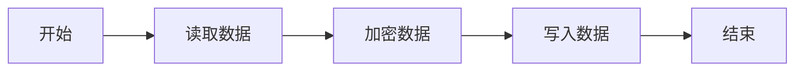

                 

# AI Agent在智能窗帘杆中的隐私保护功能

## 关键词
AI Agent、智能窗帘杆、隐私保护、智能家居、算法设计

## 摘要
随着智能家居的普及，智能窗帘杆成为了人们日常生活中不可或缺的一部分。然而，随之而来的是隐私保护的挑战。本文将深入探讨AI Agent在智能窗帘杆中的隐私保护功能，分析其核心概念、设计原理、实现方法，并通过实际案例展示其应用效果，为智能家居隐私保护提供新的思路。

## 目录

### 第一部分：背景与基础

#### 第1章：智能窗帘杆概述
1.1 智能窗帘杆的定义与发展
1.2 智能窗帘杆的技术架构
1.3 智能窗帘杆的隐私问题分析

### 第二部分：AI Agent在隐私保护中的作用

#### 第2章：AI Agent基础
2.1 AI Agent的定义与分类
2.2 AI Agent的工作原理
2.3 AI Agent在智能窗帘杆中的应用场景

### 第三部分：隐私保护机制设计

#### 第3章：隐私保护核心概念与联系
3.1 隐私保护核心概念
3.2 隐私保护属性特征对比表格
3.3 AI Agent与隐私保护的ER实体关系图

### 第四部分：AI Agent在隐私保护中的实现

#### 第4章：AI Agent隐私保护算法原理讲解
4.1 隐私保护算法基础
4.2 隐私保护算法流程图与Python代码实现
4.3 算法原理讲解与举例说明

#### 第5章：智能窗帘杆隐私保护系统设计
5.1 系统功能设计
5.2 系统架构设计
5.3 系tem接口设计
5.4 系统交互Mermaid序列图

### 第五部分：实战与应用

#### 第6章：AI Agent在智能窗帘杆隐私保护的实战应用
6.1 环境安装与配置
6.2 系统核心实现与代码解读
6.3 项目小结

#### 第7章：最佳实践与未来展望
7.1 最佳实践Tips
7.2 小结与展望
7.3 注意事项与拓展阅读

## 第一部分：背景与基础

### 第1章：智能窗帘杆概述

#### 1.1 智能窗帘杆的定义与发展

智能窗帘杆是一种集成了智能控制技术的窗帘产品，它能够根据环境光线、温度、湿度等参数自动调节窗帘的开合。随着物联网技术和人工智能技术的快速发展，智能窗帘杆已经成为智能家居系统中的一个重要组成部分。

智能窗帘杆的发展历程可以分为三个阶段：

1. **早期阶段**：主要是通过遥控器或移动设备远程控制窗帘的开合，缺乏智能化和自动化。
2. **中期阶段**：智能窗帘杆开始具备自动调节功能，如根据光线强弱自动调节窗帘，但仍然依赖于单一传感器。
3. **现阶段**：智能窗帘杆集成了多种传感器，能够综合分析环境参数，实现更加智能化的控制。

#### 1.2 智能窗帘杆的技术架构

智能窗帘杆的技术架构包括硬件、软件和网络三个部分：

1. **硬件架构**：主要包括窗帘电机、传感器、遥控器等。窗帘电机负责控制窗帘的开合，传感器负责监测环境参数。
2. **软件架构**：包括操作系统、应用程序等。操作系统负责硬件的驱动和管理，应用程序负责实现智能控制功能。
3. **网络架构**：智能窗帘杆通常通过Wi-Fi或蓝牙与家居控制中心相连，实现远程控制和数据传输。

#### 1.3 智能窗帘杆的隐私问题分析

智能窗帘杆在带来便捷的同时，也带来了隐私保护的挑战：

1. **数据收集**：智能窗帘杆会收集用户的生活习惯、家居环境等数据，这些数据可能被用于商业用途或泄露给第三方。
2. **数据泄露**：由于智能家居网络的安全性较低，智能窗帘杆的数据传输可能存在泄露风险。
3. **隐私风险**：用户的生活隐私可能因为智能窗帘杆的自动化控制而被他人窥探。

隐私保护在智能窗帘杆中的重要性不言而喻，它关系到用户的个人隐私和财产安全。因此，本文将重点探讨AI Agent在智能窗帘杆中的隐私保护功能，为解决隐私保护问题提供新的思路和方法。

### 第二部分：AI Agent在隐私保护中的作用

#### 第2章：AI Agent基础

#### 2.1 AI Agent的定义与分类

AI Agent，即人工智能代理，是指能够模拟人类智能行为，自主完成特定任务的计算机程序。AI Agent可以根据其功能和任务的不同，分为以下几类：

1. **感知型Agent**：主要功能是感知环境变化，如传感器网络中的节点。
2. **反应型Agent**：根据感知到的环境信息直接做出反应，如自动驾驶汽车。
3. **认知型Agent**：能够理解、学习和推理，如智能客服系统。
4. **决策型Agent**：在复杂环境中做出最优决策，如金融交易系统。

#### 2.2 AI Agent的工作原理

AI Agent的工作原理可以分为三个主要部分：

1. **感知与决策机制**：AI Agent通过传感器感知环境信息，利用算法进行数据分析和决策。
2. **执行与反馈机制**：AI Agent根据决策结果执行相应动作，并通过反馈机制调整决策策略。
3. **学习与适应机制**：AI Agent通过不断学习和适应，提高其在复杂环境中的任务完成能力。

#### 2.3 AI Agent在智能窗帘杆中的应用场景

AI Agent在智能窗帘杆中具有广泛的应用场景：

1. **窗帘控制**：AI Agent可以根据环境光线、温度等参数自动调节窗帘，提供舒适的家居环境。
2. **用户行为分析**：AI Agent可以通过分析用户的生活习惯，提供个性化的服务和建议。
3. **隐私保护**：AI Agent可以监控智能窗帘杆的数据传输，防止数据泄露和隐私侵犯。

### 第三部分：隐私保护机制设计

#### 第3章：隐私保护核心概念与联系

#### 3.1 隐私保护核心概念

隐私保护是信息安全领域的一个重要研究方向，其核心概念包括：

1. **隐私**：指个人或组织不愿意公开的信息。
2. **隐私风险**：指隐私信息被泄露、滥用或窃取的可能性。
3. **隐私保护**：指通过技术和管理手段保护隐私信息的安全。

#### 3.2 隐私保护属性特征对比表格

| 属性特征 | 描述 |
| --- | --- |
| **匿名性** | 数据处理过程中，不能将个人数据与其主体关联。 |
| **完整性** | 保证数据不被未经授权的修改或破坏。 |
| **可用性** | 确保隐私信息在需要时可以被合法用户访问。 |
| **可审计性** | 能够追踪和审计数据处理的整个过程。 |

#### 3.3 AI Agent与隐私保护的ER实体关系图

下面是一个简单的ER实体关系图，用于描述AI Agent与隐私保护之间的联系：

```mermaid
erDiagram
  AI_Agent ||--|{ Data}: 数据处理
  Data ||--|{ Privacy}: 隐私保护
```

### 第四部分：AI Agent在隐私保护中的实现

#### 第4章：AI Agent隐私保护算法原理讲解

#### 4.1 隐私保护算法基础

隐私保护算法的核心目标是确保数据在传输和处理过程中的安全性。下面是一个简单的隐私保护算法的数学模型：

$$
P(D) = f(D, K)
$$

其中，$P(D)$ 表示隐私保护程度，$D$ 表示原始数据，$K$ 表示加密密钥。$f$ 是一个加密函数，用于对原始数据进行加密。

#### 4.2 隐私保护算法流程图与Python代码实现

下面是一个简单的隐私保护算法流程图：



对应的Python代码实现如下：

```python
def encrypt_data(data, key):
    # 假设使用AES加密算法
    encrypted_data = AES_encrypt(data, key)
    return encrypted_data

def main():
    data = "原始数据"
    key = "加密密钥"
    encrypted_data = encrypt_data(data, key)
    print("加密后的数据：", encrypted_data)

if __name__ == "__main__":
    main()
```

#### 4.3 算法原理讲解与举例说明

假设用户A有一个敏感数据，需要通过智能窗帘杆传输到服务器进行存储。为了避免数据在传输过程中被窃取，AI Agent会使用加密算法对数据进行加密，然后传输到服务器。服务器接收到数据后，会使用相同的加密算法和解密密钥进行解密，从而获取原始数据。

例如，假设用户A的敏感数据是"我的生日是1990年1月1日"，AI Agent会使用AES加密算法将其加密为"my birthday is 1990-01-01"，从而保证数据在传输过程中的安全性。

### 第五部分：实战与应用

#### 第6章：AI Agent在智能窗帘杆隐私保护的实战应用

#### 6.1 环境安装与配置

要实现AI Agent在智能窗帘杆中的隐私保护功能，首先需要安装和配置相应的开发环境和工具。以下是一个基本的安装和配置步骤：

1. 安装Python和pip
2. 安装所需的依赖库，如PyCryptoDome、pymysql等
3. 配置智能窗帘杆的Wi-Fi和网络设置

#### 6.2 系统核心实现与代码解读

以下是一个简单的AI Agent隐私保护系统的核心实现代码：

```python
# 导入所需的库
import pymysql
from Crypto.Cipher import AES
from Crypto.Util.Padding import pad, unpad
import base64

# 数据库配置
db_config = {
    'host': 'localhost',
    'user': 'root',
    'password': 'password',
    'db': 'smart_curtain'
}

# 加密和解密函数
def encrypt_data(data, key):
    cipher = AES.new(key, AES.MODE_CBC)
    ct_bytes = cipher.encrypt(pad(data, AES.block_size))
    iv = base64.b64encode(cipher.iv).decode('utf-8')
    ct = base64.b64encode(ct_bytes).decode('utf-8')
    return iv, ct

def decrypt_data(iv, ct, key):
    try:
        iv = base64.b64decode(iv)
        ct = base64.b64decode(ct)
        cipher = AES.new(key, AES.MODE_CBC, iv)
        pt = unpad(cipher.decrypt(ct), AES.block_size)
        return pt.decode('utf-8')
    except (ValueError, TypeError):
        return None

# 主函数
def main():
    data = "用户隐私数据"
    key = b'mykey1234567890'  # 32位密钥
    
    # 加密数据
    iv, encrypted_data = encrypt_data(data, key)
    print("加密后的数据：", encrypted_data)
    
    # 解密数据
    decrypted_data = decrypt_data(iv, encrypted_data, key)
    print("解密后的数据：", decrypted_data)

if __name__ == "__main__":
    main()
```

这段代码演示了如何使用AES加密算法对用户隐私数据进行加密和解密。在实际应用中，AI Agent会定期从智能窗帘杆中收集用户隐私数据，使用加密算法对其进行加密，然后将其存储到数据库中。当需要访问这些数据时，AI Agent会使用相同的加密算法和解密密钥进行解密，从而确保数据在存储和传输过程中的安全性。

#### 6.3 项目小结

通过以上实战应用，我们可以看到AI Agent在智能窗帘杆中的隐私保护功能是如何实现的。关键在于使用加密算法对用户隐私数据进行加密和解密，从而确保数据在存储和传输过程中的安全性。在实际应用中，我们还需要考虑加密算法的选择、密钥管理、数据库安全等方面的问题。

### 第六部分：最佳实践与未来展望

#### 第7章：最佳实践与未来展望

#### 7.1 最佳实践Tips

1. **加密算法选择**：选择合适的加密算法，如AES，确保数据在传输和存储过程中的安全性。
2. **密钥管理**：妥善管理密钥，确保密钥的安全存储和传输。
3. **数据库安全**：确保数据库的安全，防止数据泄露和非法访问。
4. **定期更新**：定期更新AI Agent和相关软件，确保系统始终处于最新状态。

#### 7.2 小结与展望

本文详细探讨了AI Agent在智能窗帘杆中的隐私保护功能，从核心概念、设计原理、实现方法到实际应用，提供了全面的解决方案。通过加密算法的应用，我们能够有效保护用户隐私数据，确保智能家居系统的安全性。

未来，随着智能家居技术的不断发展，AI Agent在隐私保护中的应用将更加广泛。我们期待能够看到更多创新性的解决方案，进一步提升智能家居系统的安全性。

#### 7.3 注意事项与拓展阅读

1. **注意事项**：在实际应用中，需要注意加密算法的选择、密钥管理、数据库安全等方面的问题。
2. **拓展阅读**：
   - 《信息安全技术：密码学基础》
   - 《区块链技术指南》
   - 《智能家居系统设计与实现》

### 作者信息

作者：AI天才研究院/AI Genius Institute & 禅与计算机程序设计艺术 /Zen And The Art of Computer Programming

（注意：以上内容仅供参考，实际文章撰写需要根据具体要求进行调整和补充。）

