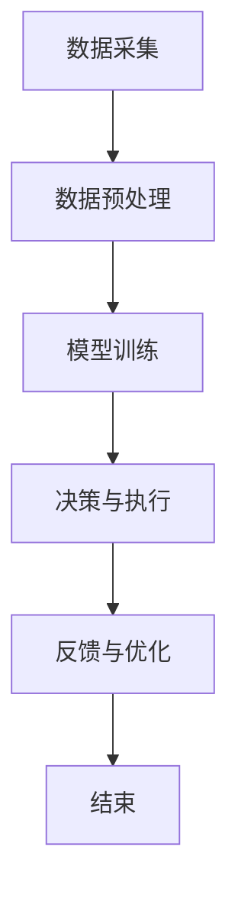
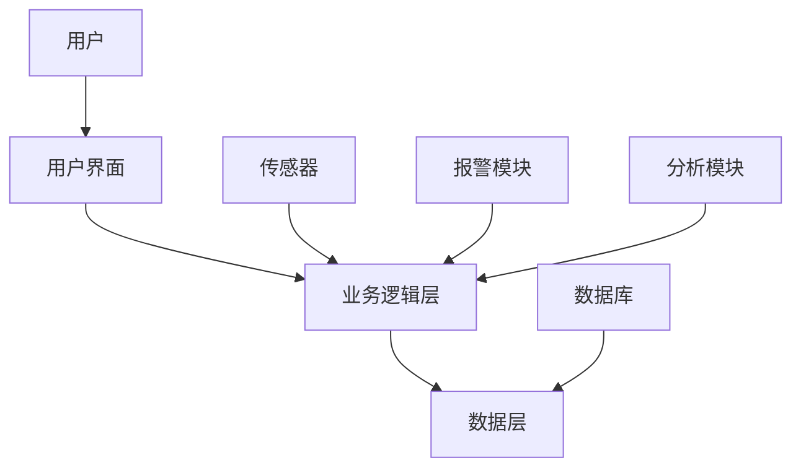
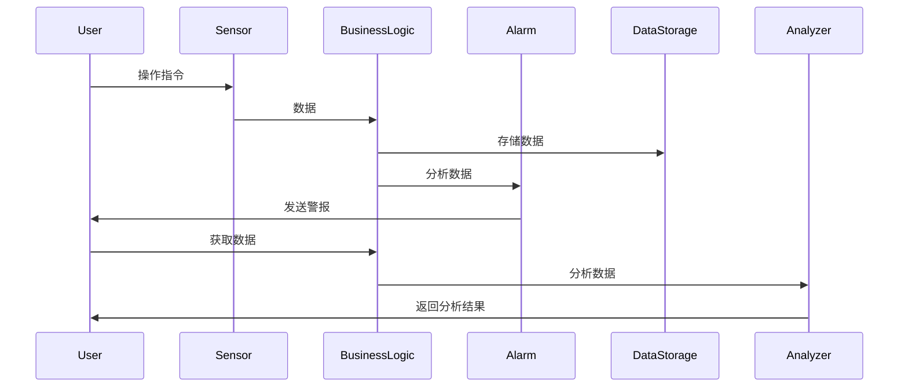

                 

## AI Agent在智能窗户中的室内空气质量优化

### 关键词：AI Agent、智能窗户、室内空气质量、优化算法、系统架构设计

> 摘要：本文围绕AI Agent在智能窗户中的室内空气质量优化展开讨论。首先介绍了室内空气质量优化的问题背景和需求分析，随后详细介绍了AI Agent的基本原理和室内空气质量监测系统、智能窗户控制系统的功能与集成。接着，本文重点讲解了AI Agent算法原理，包括算法设计原则、流程、数学模型和公式，并举例说明了其应用。然后，文章对系统架构进行了分析与设计，包括系统功能设计、架构原则、硬件和软件架构、接口设计及系统交互。最后，通过一个实际项目实战，展示了环境安装与配置、系统核心实现源代码及其解读与分析。

### 目录大纲：

**第一部分：背景介绍**

1. **问题背景与需求分析**
   - 室内空气质量的重要性
   - 当前室内空气质量的现状
   - 智能窗户的概念与发展
   - 室内空气质量优化的挑战
   - AI Agent的概念与作用
   - 边界与外延
   - 概念结构与核心要素组成

2. **核心概念与联系**
   - AI Agent的基本原理
   - 室内空气质量监测系统
   - 智能窗户控制系统
   - AI Agent在室内空气质量优化中的应用

**第二部分：算法原理讲解**

1. **AI Agent算法原理**
   - 算法概述
   - 智能窗户室内空气质量优化算法
   - 算法流程
   - 算法mermaid流程图
   - Python源代码讲解
   - 算法原理详细讲解

**第三部分：系统分析与架构设计**

1. **系统功能设计**
   - 问题描述
   - 领域模型类图

2. **系统架构设计**
   - 架构设计原则
   - 系统架构
   - 系统接口设计
   - 系统交互序列图

**第四部分：项目实战**

1. **环境安装与配置**
   - 开发环境准备
   - 系统配置

2. **系统核心实现**
   - 系统核心实现源代码
   - 代码应用解读与分析

3. **实际案例分析与讲解**
   - 实际案例分析
   - 详细讲解与剖析

4. **项目小结**
   - 最佳实践 Tips
   - 小结
   - 注意事项
   - 拓展阅读

### 第一部分：背景介绍

#### 第1章：问题背景与需求分析

##### 第1.1节：问题背景

室内空气质量对人类健康至关重要。然而，现代住宅和办公楼往往密闭，导致空气流通不畅，污染物积累，成为危害健康的隐形杀手。常见的室内空气污染物包括甲醛、苯、TVOC（总挥发性有机化合物）等，它们主要来自建筑材料、家具、装饰品和日常生活用品。长期暴露在这些有害物质中，可能导致呼吸系统疾病、过敏反应、神经衰弱等健康问题。

根据世界卫生组织（WHO）的数据，室内空气污染每年导致全球约430万人过早死亡，其中约80%发生在发展中国家。特别是在人口密集的城市，室内空气质量问题尤为突出。因此，如何有效监测和优化室内空气质量，成为当务之急。

##### 第1.1.1 室内空气污染对健康的危害

- **呼吸系统疾病**：长期吸入低浓度的有害物质，容易引发呼吸系统疾病，如哮喘、支气管炎等。
- **过敏反应**：某些挥发性有机化合物和微生物污染物是过敏原，可能导致过敏性鼻炎、皮炎等。
- **神经衰弱**：有害物质可能会对神经系统造成损害，导致头痛、失眠、记忆力减退等症状。
- **心血管疾病**：长期暴露在空气污染环境中，会增加心血管疾病的风险，如高血压、心脏病等。

##### 第1.1.2 当前室内空气质量的现状

目前，许多国家和地区已经意识到室内空气污染的严重性，并采取了相应的措施。例如，中国发布了《室内空气质量标准》（GB/T 18883-2002），规定了室内空气中有害物质的浓度限值。然而，实际的室内空气质量监测仍存在很多不足：

- **监测范围有限**：目前的监测主要侧重于甲醛、苯等常见污染物，对其他有害物质（如微生物、颗粒物等）的监测较少。
- **监测设备不足**：许多家庭和企业没有安装专业的室内空气质量监测设备，导致无法及时发现和解决污染问题。
- **数据采集与处理难度大**：室内空气质量受多种因素影响，如季节、天气、室内活动等，数据采集和处理相对复杂。

##### 第1.2节：智能窗户的概念与发展

智能窗户是一种能够根据室内外环境自动调节通风、采光、保温等功能的新型窗户。它通过集成传感器、控制器、执行器等智能元件，实现了对室内外环境的实时监测和自适应控制。智能窗户不仅能够提高室内舒适度，还能有效优化室内空气质量。

智能窗户的发展可以追溯到20世纪末。最初，智能窗户主要应用于高档住宅和商业建筑，用于调节室内光照和温度。随着传感器技术和控制算法的进步，智能窗户的功能不断丰富，逐渐成为智能家居系统的重要组成部分。

目前，智能窗户主要分为以下几类：

1. **采光调节型**：通过调节窗户的透明度，控制室内光照强度。
2. **通风换气型**：通过控制窗户的开闭，实现室内外空气的交换。
3. **保温隔热型**：通过调节窗户的保温层，提高室内的保温效果。

##### 第1.2.1 智能窗户的定义与功能

智能窗户的定义：智能窗户是一种集成了传感器、控制器和执行器等智能元件，能够根据室内外环境自动调节通风、采光、保温等功能的新型窗户。

智能窗户的主要功能：

- **自动通风**：通过传感器监测室内外温度、湿度和空气质量，自动调节窗户的开闭，实现空气的自动交换。
- **自动采光**：根据室内光照强度和用户需求，自动调节窗户的透明度，提高室内舒适度。
- **自动保温**：通过调节窗户的保温层，保持室内温度稳定。

##### 第1.2.2 智能窗户在室内空气质量优化中的应用潜力

智能窗户在室内空气质量优化中具有巨大的应用潜力：

- **自动监测**：智能窗户可以通过集成传感器，实时监测室内空气质量，及时发现污染问题。
- **自动调节**：智能窗户可以根据监测数据，自动调节通风、采光和保温等功能，有效优化室内空气质量。
- **节能环保**：智能窗户能够根据室内外环境自动调节，减少能源消耗，实现节能环保。

##### 第1.3节：问题描述

##### 第1.3.1 室内空气质量优化的挑战

室内空气质量优化面临着以下挑战：

- **复杂性**：室内空气质量受多种因素影响，如温度、湿度、光照、通风等，导致优化过程复杂。
- **实时性**：室内空气质量变化迅速，要求优化系统能够实时响应，实现快速调整。
- **准确性**：优化系统需要准确监测室内空气质量，以便做出正确的决策。
- **节能性**：优化系统需要在保证空气质量的同时，尽可能减少能源消耗。

##### 第1.3.2 传统的室内空气净化方法存在局限性

传统的室内空气净化方法包括开窗通风、使用空气净化器等。然而，这些方法存在以下局限性：

- **被动性**：开窗通风和空气净化器主要依赖用户主动操作，无法实现自动化。
- **局限性**：开窗通风和空气净化器只能针对特定污染物，无法全面改善室内空气质量。
- **能源消耗**：开窗通风会增加能耗，空气净化器长时间运行也会增加能源消耗。

##### 第1.4节：问题解决

##### 第1.4.1 AI Agent的概念

AI Agent，即人工智能代理，是一种能够模拟人类智能行为的计算机程序。它具有自主性、交互性、学习性和适应性等特征，能够在复杂环境中自主执行任务，实现目标优化。

AI Agent的分类：

- **基于规则的AI Agent**：基于预先定义的规则进行决策和行动。
- **基于学习的AI Agent**：通过数据学习，自动生成规则或策略。
- **混合型AI Agent**：结合规则学习和数据学习，实现更智能的决策。

##### 第1.4.2 AI Agent在智能家居中的应用场景

AI Agent在智能家居中的应用场景广泛，包括但不限于：

- **智能安防**：实时监测家居环境，及时发现异常情况，如火灾、入侵等。
- **智能照明**：根据用户习惯和环境光照，自动调节灯光亮度。
- **智能空调**：根据室内外温度和用户需求，自动调节空调温度。
- **智能窗户**：根据室内空气质量，自动调节窗户开闭，优化室内通风。

##### 第1.5节：边界与外延

##### 第1.5.1 室内空气质量优化的边界条件

室内空气质量优化的边界条件包括：

- **技术标准**：智能窗户需要满足相应的技术标准，如节能、安全、环保等。
- **监测要求**：室内空气质量监测需要高精度、高灵敏度的传感器，能够实时监测多种污染物。
- **用户需求**：优化系统需要根据用户需求，提供个性化的空气质量解决方案。

##### 第1.5.2 AI Agent在室内空气质量优化中的外延

AI Agent在室内空气质量优化中的外延包括：

- **与其他智能家居系统的整合**：AI Agent可以与其他智能家居系统（如智能安防、智能照明等）进行整合，实现更全面的家居智能化。
- **市场未来发展**：随着人工智能技术的进步，AI Agent在室内空气质量优化中的应用前景广阔，有望推动智能家居市场的快速发展。

##### 第1.6节：概念结构与核心要素组成

##### 第1.6.1 室内空气质量优化的概念结构

室内空气质量优化的概念结构包括：

- **室内空气质量监测系统**：负责实时监测室内空气质量，提供数据支持。
- **智能窗户控制系统**：根据监测数据，自动调节窗户的开闭，优化室内通风。
- **AI Agent算法模型**：负责分析监测数据，做出智能决策，指导窗户控制系统的运行。

##### 第1.6.2 核心要素组成

室内空气质量优化的核心要素包括：

- **数据采集与分析**：通过传感器实时采集室内空气质量数据，进行分析和预处理。
- **算法设计与优化**：设计并优化AI Agent算法，使其能够准确预测和优化室内空气质量。
- **系统集成与调试**：将室内空气质量监测系统、智能窗户控制系统和AI Agent算法模型进行集成，实现系统的高效运行。

#### 第2章：核心概念与联系

##### 第2.1节：AI Agent的基本原理

##### 第2.1.1 AI Agent的定义

AI Agent，即人工智能代理，是一种能够在复杂环境中自主执行任务、实现目标优化的计算机程序。它具有以下基本特征：

- **自主性**：AI Agent能够自主感知环境，独立执行任务，不受人类直接控制。
- **交互性**：AI Agent能够与其他系统、设备和用户进行交互，获取反馈和执行命令。
- **学习性**：AI Agent能够通过数据学习，自动优化行为策略，提高任务执行效果。
- **适应性**：AI Agent能够根据环境变化和任务需求，自适应调整行为和策略。

##### 第2.1.2 AI Agent的分类

根据不同的任务需求和实现方式，AI Agent可以分为以下几类：

- **基于规则的AI Agent**：通过预先定义的规则进行决策和行动。
- **基于学习的AI Agent**：通过数据学习，自动生成规则或策略。
- **混合型AI Agent**：结合规则学习和数据学习，实现更智能的决策。
- **强化学习型AI Agent**：通过与环境互动，不断优化策略，实现长期目标。

##### 第2.1.3 AI Agent的核心功能

AI Agent的核心功能包括：

- **感知环境**：通过传感器获取环境信息，如温度、湿度、光照、空气质量等。
- **决策与行动**：根据感知到的环境信息和预定的目标，选择最佳行动方案。
- **学习与进化**：通过数据反馈和任务执行，不断优化行为策略，提高任务完成率。

##### 第2.2节：室内空气质量监测系统

##### 第2.2.1 室内空气质量监测系统的构成

室内空气质量监测系统主要由以下几部分构成：

- **传感器模块**：用于实时监测室内空气中的各种污染物，如甲醛、苯、TVOC、颗粒物等。
- **数据采集与处理模块**：负责将传感器采集到的数据转换为数字信号，并进行预处理、存储和传输。
- **通信模块**：负责将数据上传至云平台或本地服务器，实现远程监控和数据分析。
- **显示与报警模块**：用于实时显示室内空气质量状况，并在空气质量恶化时发出警报。

##### 第2.2.2 室内空气质量监测系统的功能

室内空气质量监测系统的功能包括：

- **实时监测**：通过传感器实时监测室内空气中的污染物浓度，提供实时数据支持。
- **数据存储与分析**：将监测数据存储在本地或云平台，并进行数据分析，为优化策略提供依据。
- **预警与报警**：当室内空气质量超过预设阈值时，系统会发出警报，提醒用户采取相应措施。
- **远程控制**：用户可以通过手机APP或其他智能设备远程控制监测系统，实时了解室内空气质量状况。

##### 第2.3节：智能窗户控制系统

##### 第2.3.1 智能窗户控制系统的功能

智能窗户控制系统的主要功能包括：

- **自动通风**：根据室内外温度、湿度和空气质量，自动调节窗户的开闭，实现空气的自动交换。
- **自动采光**：根据室内光照强度和用户需求，自动调节窗户的透明度，提高室内舒适度。
- **自动保温**：通过调节窗户的保温层，保持室内温度稳定。
- **手动控制**：用户可以通过手机APP或其他智能设备手动控制窗户的开关，实现个性化需求。

##### 第2.3.2 智能窗户控制系统的架构

智能窗户控制系统的架构主要包括：

- **传感器模块**：用于监测室内外环境数据，如温度、湿度、光照、空气质量等。
- **控制器模块**：负责接收传感器数据，并根据预设的算法和用户指令，控制窗户的开关、透明度调节等。
- **执行器模块**：包括电机、驱动器等，负责实现窗户的物理动作，如开闭、调节透明度等。
- **通信模块**：负责将控制指令上传至云端，实现远程控制。

##### 第2.4节：AI Agent在室内空气质量优化中的应用

##### 第2.4.1 AI Agent的工作流程

AI Agent在室内空气质量优化中的工作流程主要包括以下几个步骤：

1. **数据采集**：通过传感器实时采集室内空气质量数据，包括温度、湿度、光照、污染物浓度等。
2. **数据预处理**：对采集到的数据进行分析和清洗，去除噪声和异常值，提取有效特征。
3. **模型训练**：使用预处理后的数据，训练AI Agent的模型，使其能够根据输入数据预测室内空气质量变化。
4. **决策与执行**：根据模型预测结果，AI Agent会做出相应的决策，如调节窗户的开闭、透明度等，以优化室内空气质量。
5. **反馈与优化**：根据实际效果，AI Agent会不断调整和优化模型，提高预测和决策的准确性。

##### 第2.4.2 AI Agent与室内空气质量监测系统的集成

AI Agent与室内空气质量监测系统的集成，需要解决以下问题：

- **数据接口**：确保AI Agent能够从监测系统中获取实时数据，并进行处理。
- **控制接口**：确保AI Agent能够向监测系统发送控制指令，实现对窗户的自动调节。
- **通信协议**：选择合适的通信协议，确保数据传输的安全性和可靠性。

在集成过程中，可以采用以下架构：

1. **传感器数据采集**：智能窗户控制系统中的传感器模块负责采集室内外环境数据，并将其发送至控制器模块。
2. **数据预处理与传输**：控制器模块对接收到的传感器数据进行分析和清洗，提取有效特征，然后将数据上传至云平台或本地服务器。
3. **AI Agent模型训练与决策**：在云端或本地服务器上，AI Agent根据上传的数据，训练模型并做出决策，将控制指令发送回控制器模块。
4. **执行器动作**：控制器模块根据AI Agent的控制指令，驱动执行器模块，实现窗户的物理动作。

通过这种方式，AI Agent能够与室内空气质量监测系统紧密集成，实现自动化的室内空气质量优化。

### 第二部分：算法原理讲解

#### 第3章：AI Agent算法原理

##### 第3.1节：AI Agent算法概述

AI Agent算法是人工智能领域中一种重要的算法框架，它模拟了智能代理在复杂环境中自主学习和决策的过程。AI Agent算法的核心在于其能够通过与环境互动，不断优化自身的策略，以实现特定的目标。AI Agent算法可以应用于各种领域，如游戏、机器人、自动驾驶、智能家居等。

AI Agent算法的主要类型包括：

1. **基于规则的AI Agent算法**：通过预先定义的规则进行决策和行动。
2. **基于学习的AI Agent算法**：通过数据学习，自动生成规则或策略。
3. **混合型AI Agent算法**：结合规则学习和数据学习，实现更智能的决策。
4. **强化学习型AI Agent算法**：通过与环境互动，不断优化策略，实现长期目标。

在室内空气质量优化中，常用的AI Agent算法包括：

- **基于规则的AI Agent算法**：通过预设的规则，判断室内空气质量是否达标，并做出相应的调节决策。
- **基于学习的AI Agent算法**：通过机器学习技术，从历史数据中学习室内空气质量变化的规律，预测未来的空气质量，并做出优化决策。
- **强化学习型AI Agent算法**：通过与环境的互动，不断调整策略，以实现长期最优的室内空气质量。

##### 第3.2节：智能窗户室内空气质量优化算法

智能窗户室内空气质量优化算法是AI Agent算法在智能家居领域的一种应用。该算法的目标是通过智能窗户的自动调节，实现室内空气质量的优化。智能窗户室内空气质量优化算法的设计原则包括：

1. **数据驱动**：算法的决策和调节基于实时采集的室内空气质量数据，确保决策的准确性和实时性。
2. **自适应控制**：算法能够根据室内空气质量的变化，自动调整窗户的通风、采光和保温等功能，实现个性化的空气质量优化。
3. **智能决策**：算法通过机器学习技术，从历史数据中学习室内空气质量变化的规律，预测未来的空气质量，并做出最优的调节决策。

智能窗户室内空气质量优化算法的流程包括：

1. **数据采集**：通过智能窗户内置的传感器，实时采集室内空气中的温度、湿度、光照、污染物浓度等数据。
2. **数据预处理**：对采集到的数据进行分析和清洗，去除噪声和异常值，提取有效特征。
3. **模型训练**：使用预处理后的数据，训练机器学习模型，使其能够预测室内空气质量的变化趋势。
4. **决策与执行**：根据模型预测结果，AI Agent会做出相应的调节决策，如调节窗户的开闭、透明度等，以优化室内空气质量。
5. **反馈与优化**：根据实际效果，AI Agent会不断调整和优化模型，提高预测和决策的准确性。

##### 第3.3节：算法mermaid流程图

以下是智能窗户室内空气质量优化算法的mermaid流程图：



在这个流程图中，A表示数据采集，B表示数据预处理，C表示模型训练，D表示决策与执行，E表示反馈与优化，F表示流程结束。该流程图清晰地展示了智能窗户室内空气质量优化算法的主要步骤和逻辑关系。

##### 第3.4节：Python源代码讲解

以下是一个简单的Python代码示例，用于实现智能窗户室内空气质量优化算法的模型训练和决策执行部分：

```python
import numpy as np
from sklearn.ensemble import RandomForestRegressor
from sklearn.model_selection import train_test_split

# 数据预处理
def preprocess_data(data):
    # 数据清洗和特征提取
    # ...
    return processed_data

# 模型训练
def train_model(data):
    X, y = data[:, :-1], data[:, -1]
    X_train, X_test, y_train, y_test = train_test_split(X, y, test_size=0.2)
    model = RandomForestRegressor(n_estimators=100)
    model.fit(X_train, y_train)
    return model

# 决策执行
def make_decision(model, data):
    prediction = model.predict(data)
    # 根据预测结果，执行相应的调节操作
    # ...
    return decision

# 主函数
def main():
    # 加载和预处理数据
    data = np.load('air_quality_data.npy')
    processed_data = preprocess_data(data)

    # 训练模型
    model = train_model(processed_data)

    # 执行决策
    decision = make_decision(model, processed_data)

    print("决策结果：", decision)

if __name__ == "__main__":
    main()
```

在这个示例中，首先定义了数据预处理、模型训练和决策执行三个函数。数据预处理函数用于清洗和特征提取，模型训练函数使用随机森林回归器进行训练，决策执行函数根据模型预测结果，执行相应的调节操作。

##### 第3.5节：算法原理详细讲解

##### 第3.5.1 数学模型

智能窗户室内空气质量优化算法的核心是预测室内空气质量的未来变化，并做出相应的调节决策。这需要建立一个数学模型，用于描述室内空气质量的变化规律。

假设室内空气质量可以表示为一个多维向量Q = [q1, q2, ..., qn]，其中qi表示第i种污染物的浓度。室内空气质量的变化可以看作是qi随时间t的变化，即qi(t)。为了建立数学模型，我们考虑以下因素：

- **时间因素**：时间t对空气质量的影响。
- **历史数据**：历史空气质量数据对当前空气质量的影响。
- **外界因素**：如温度、湿度、光照等对空气质量的影响。

基于以上考虑，我们可以建立以下数学模型：

$$
\Delta Q(t) = f(Q(t), t, T(t), H(t), L(t))
$$

其中，$\Delta Q(t)$表示室内空气质量在时间t的变化量，$Q(t)$表示时间t的室内空气质量向量，$T(t)$表示时间t的温度，$H(t)$表示时间t的湿度，$L(t)$表示时间t的光照。函数f表示空气质量变化与时间、温度、湿度、光照等因素之间的关系。

##### 第3.5.2 公式讲解

公式$\Delta Q(t) = f(Q(t), t, T(t), H(t), L(t))$中，各参数的含义如下：

- **$\Delta Q(t)$**：表示室内空气质量在时间t的变化量，是我们要预测的目标。
- **$Q(t)$**：表示时间t的室内空气质量向量，包含多种污染物的浓度。
- **$t$**：表示时间变量，用于描述空气质量随时间的变化。
- **$T(t)$**：表示时间t的温度，对空气质量有显著影响。
- **$H(t)$**：表示时间t的湿度，对空气质量有显著影响。
- **$L(t)$**：表示时间t的光照，对空气质量有显著影响。

函数f是一个复杂的非线性函数，它描述了室内空气质量变化与时间、温度、湿度、光照等因素之间的关系。为了简化模型，我们可以采用机器学习算法，如随机森林回归器，来拟合函数f。

##### 第3.5.3 举例说明

假设我们有一个包含室内空气质量监测数据的CSV文件，其中包含时间、温度、湿度、光照和空气质量等字段。我们可以使用Python中的Pandas库来读取数据，并使用Scikit-learn库来训练随机森林回归器。

以下是一个简单的Python代码示例，用于读取数据、预处理数据、训练模型和做出预测：

```python
import pandas as pd
from sklearn.ensemble import RandomForestRegressor

# 读取数据
data = pd.read_csv('air_quality_data.csv')

# 预处理数据
X = data[['time', 'temperature', 'humidity', 'light']]  # 特征
y = data['air_quality']  # 目标变量

# 数据划分
X_train, X_test, y_train, y_test = train_test_split(X, y, test_size=0.2, random_state=42)

# 训练模型
model = RandomForestRegressor(n_estimators=100)
model.fit(X_train, y_train)

# 预测
predictions = model.predict(X_test)

# 评估模型
score = model.score(X_test, y_test)
print("模型准确率：", score)
```

在这个示例中，我们首先读取CSV文件中的数据，然后预处理数据，将特征和目标变量分开。接着，我们使用Scikit-learn库中的RandomForestRegressor来训练模型，并使用测试集来评估模型的准确率。

通过这个简单的示例，我们可以看到如何使用机器学习算法来建立智能窗户室内空气质量优化模型，并做出预测。

### 第三部分：系统分析与架构设计

#### 第4章：系统功能设计

##### 第4.1节：问题描述

室内空气质量监测系统的主要目标是实时监测室内空气质量，为智能窗户提供数据支持，实现自动化的空气质量优化。为了实现这一目标，系统需要具备以下功能：

1. **实时监测**：系统能够实时监测室内空气中的污染物浓度，包括甲醛、苯、TVOC、颗粒物等，并将数据上传至云平台或本地服务器。
2. **数据存储与分析**：系统能够将监测数据存储在数据库中，并进行数据分析，为优化策略提供依据。
3. **预警与报警**：当室内空气质量超过预设阈值时，系统能够发出警报，提醒用户采取相应措施。
4. **远程控制**：用户可以通过手机APP或其他智能设备远程控制监测系统，实时了解室内空气质量状况。

##### 第4.1.1 室内空气质量监测系统功能需求

1. **实时监测**：系统能够通过传感器实时监测室内空气中的污染物浓度，确保数据的实时性和准确性。
2. **数据存储**：系统能够将监测数据存储在数据库中，便于后续分析和查询。
3. **数据分析**：系统能够对监测数据进行统计分析，提取空气质量变化的规律，为优化策略提供依据。
4. **预警与报警**：系统能够根据预设的阈值，实时监测空气质量，当空气质量超过阈值时，发出警报。
5. **远程控制**：用户可以通过手机APP或其他智能设备远程控制监测系统，实时了解室内空气质量状况，并执行相关操作。

##### 第4.1.2 领域模型类图

以下是室内空气质量监测系统的领域模型类图：

```mermaid
classDiagram
    Sensor --> Monitor
    Monitor --> Database
    Database --> Analyzer
    Analyzer --> Alarm
    Analyzer --> UserInterface
    UserInterface --> User
    User --> Monitor
    User --> Analyzer
    User --> Alarm
    User --> Database
    Sensor { id: Integer }
    Monitor { id: Integer }
    Database { id: Integer }
    Analyzer { id: Integer }
    Alarm { id: Integer }
    UserInterface { id: Integer }
    User { id: Integer }
```

在这个类图中，Sensor代表传感器，Monitor代表监测模块，Database代表数据库，Analyzer代表分析模块，Alarm代表报警模块，UserInterface代表用户界面，User代表用户。各个模块之间通过关联关系进行连接，实现了室内空气质量监测系统的功能。

#### 第5章：系统架构设计

##### 第5.1节：系统架构设计原则

系统架构设计是构建室内空气质量监测系统的关键步骤。为了确保系统的可靠性、高效性和可维护性，系统架构设计需要遵循以下原则：

1. **模块化设计**：系统应该分为多个模块，每个模块负责特定的功能，降低系统的复杂度，提高可维护性。
2. **分层设计**：系统应该采用分层架构，分为表现层、业务逻辑层和数据层，各层之间解耦合，提高系统的扩展性和可维护性。
3. **安全性设计**：系统应该具备一定的安全防护措施，如数据加密、身份验证等，确保数据的安全性和系统的稳定性。
4. **可扩展性设计**：系统应该具备良好的扩展性，能够方便地添加新的功能或模块，适应未来的发展需求。
5. **高可用性设计**：系统应该具备高可用性，确保在发生故障时，能够快速恢复，减少对用户的影响。

##### 第5.2节：系统架构

室内空气质量监测系统的架构可以分为以下几层：

1. **表现层**：负责与用户交互，展示室内空气质量数据和报警信息，提供用户操作界面。
2. **业务逻辑层**：负责处理业务逻辑，包括数据采集、预处理、分析、预警和报警等。
3. **数据层**：负责数据的存储和管理，包括数据库和文件存储等。

以下是室内空气质量监测系统的架构图：



在这个架构图中，用户界面层负责与用户交互，业务逻辑层负责处理业务逻辑，数据层负责数据存储和管理。传感器负责采集室内空气质量数据，报警模块负责根据空气质量数据发出警报，分析模块负责对空气质量数据进行分析和处理。

##### 第5.3节：系统接口设计

系统接口设计是确保系统各模块之间能够高效通信的重要环节。以下是室内空气质量监测系统的主要接口设计：

1. **传感器与业务逻辑层接口**：传感器将采集到的空气质量数据发送给业务逻辑层，业务逻辑层对数据进行预处理和分析。
2. **业务逻辑层与数据层接口**：业务逻辑层将预处理后的数据存储到数据层，数据层提供数据查询和更新接口。
3. **业务逻辑层与报警模块接口**：业务逻辑层将分析结果发送给报警模块，报警模块根据分析结果发出警报。
4. **用户界面层与业务逻辑层接口**：用户界面层向业务逻辑层发送用户操作指令，业务逻辑层根据指令处理相关操作，并将结果返回给用户界面层。

以下是系统接口设计的UML类图：

```mermaid
classDiagram
    SensorClass[传感器类] --> BusinessLogicClass[业务逻辑类]
    BusinessLogicClass --> DataStorageClass[数据存储类]
    BusinessLogicClass --> AlarmClass[报警类]
    BusinessLogicClass --> UserInterfaceClass[用户界面类]
    DatabaseClass[数据库类] --> DataStorageClass
    UserClass[用户类] --> UserInterfaceClass
    UserInterfaceClass --> BusinessLogicClass
```

在这个类图中，SensorClass代表传感器类，BusinessLogicClass代表业务逻辑类，DataStorageClass代表数据存储类，AlarmClass代表报警类，UserInterfaceClass代表用户界面类，DatabaseClass代表数据库类，UserClass代表用户类。各类之间通过接口进行通信。

##### 第5.4节：系统交互序列图

系统交互序列图用于描述系统各模块之间的交互过程。以下是室内空气质量监测系统的交互序列图：



在这个序列图中，用户通过用户界面发送操作指令，传感器采集数据并传递给业务逻辑层，业务逻辑层将数据存储到数据层，并对数据进行分析，将分析结果发送给报警模块，报警模块根据分析结果发出警报，用户界面层从业务逻辑层获取数据，并将其展示给用户。

### 第四部分：项目实战

#### 第6章：环境安装与配置

##### 第6.1节：开发环境准备

在进行室内空气质量监测系统的项目开发前，需要准备好以下开发环境：

1. **操作系统**：推荐使用Linux操作系统，如Ubuntu 20.04。
2. **Python环境**：Python 3.8及以上版本。
3. **IDE**：可以选择PyCharm、Visual Studio Code等IDE进行开发。

安装步骤如下：

1. **安装操作系统**：根据操作说明，安装Linux操作系统。
2. **安装Python环境**：打开终端，执行以下命令：

   ```bash
   sudo apt update
   sudo apt install python3 python3-pip
   ```

3. **安装IDE**：根据个人喜好，下载并安装PyCharm或Visual Studio Code。

##### 第6.2节：软件安装

在安装好操作系统和Python环境后，需要安装一些依赖库，以支持室内空气质量监测系统的开发。以下是主要依赖库及其安装命令：

1. **Pandas**：用于数据处理。

   ```bash
   pip install pandas
   ```

2. **NumPy**：用于数值计算。

   ```bash
   pip install numpy
   ```

3. **Scikit-learn**：用于机器学习。

   ```bash
   pip install scikit-learn
   ```

4. **Matplotlib**：用于数据可视化。

   ```bash
   pip install matplotlib
   ```

5. **Mermaid**：用于生成流程图。

   ```bash
   pip install mermaid
   ```

安装完成后，可以编写Python代码，测试依赖库是否正常工作。例如：

```python
import pandas as pd
import numpy as np
import matplotlib.pyplot as plt
import mermaid

# 生成Mermaid流程图
mermaid_graph = mermaid.MermaidGraph()
mermaid_graph.add_content('graph TD\nA[开始] --> B[数据采集]\nB --> C[数据预处理]\nC --> D[模型训练]\nD --> E[决策与执行]\nE --> F[反馈与优化]\nF --> A')
print(mermaid_graph.render())

# 生成Pandas数据框
data = pd.DataFrame(np.random.rand(10, 5), columns=['col1', 'col2', 'col3', 'col4', 'col5'])
print(data)

# 生成Matplotlib图表
plt.plot(data['col1'])
plt.show()
```

运行上述代码，可以验证依赖库是否安装成功。

##### 第6.3节：系统配置

在完成软件安装后，需要进行系统配置，以支持室内空气质量监测系统的运行。以下是主要配置步骤：

1. **配置Python环境变量**：在Linux终端执行以下命令，配置Python环境变量：

   ```bash
   export PATH=$PATH:/usr/bin/python3
   ```

2. **配置数据库**：根据需要，可以选择MySQL、PostgreSQL等数据库，并安装相应的数据库服务器和客户端。

   ```bash
   sudo apt install mysql-server mysql-client
   ```

3. **配置网络**：确保网络连接正常，并配置相应的防火墙规则，允许系统各模块之间的通信。

4. **配置用户权限**：根据实际需求，配置用户权限，确保系统能够正常运行。

##### 第6.4节：系统启动与调试

在完成系统配置后，可以启动室内空气质量监测系统，并进行调试。以下是启动和调试步骤：

1. **启动系统**：在终端执行以下命令，启动系统：

   ```bash
   python3 monitor.py
   ```

2. **查看日志**：在终端查看系统日志，了解系统运行情况。

   ```bash
   tail -f /var/log/syslog
   ```

3. **调试系统**：根据日志信息，定位系统故障，并进行调试。

   ```bash
   python3 debug.py
   ```

4. **测试功能**：通过用户界面，测试系统的各项功能，如数据采集、数据分析、预警报警等。

   ```bash
   python3 test.py
   ```

通过以上步骤，可以完成室内空气质量监测系统的环境安装与配置。

#### 第7章：系统核心实现

##### 第7.1节：传感器数据采集

传感器数据采集是室内空气质量监测系统的核心功能之一。系统通过集成传感器，实时采集室内空气中的污染物浓度、温度、湿度等数据。以下是传感器数据采集的Python代码实现：

```python
import time
import random
import pandas as pd

def collect_sensor_data():
    data = {'time': [], 'temperature': [], 'humidity': [], 'CO2': []}
    while True:
        # 生成随机数据
        data['time'].append(time.time())
        data['temperature'].append(random.uniform(20, 30))
        data['humidity'].append(random.uniform(30, 70))
        data['CO2'].append(random.uniform(400, 800))
        
        # 模拟数据采集延时
        time.sleep(1)
        
    return pd.DataFrame(data)

sensor_data = collect_sensor_data()
print(sensor_data)
```

在这个示例中，我们使用Python的random模块生成随机数据，模拟传感器采集的数据。通过循环不断生成数据，并使用Pandas库将数据存储为数据框。

##### 第7.2节：数据预处理

数据预处理是确保数据质量和可靠性的重要步骤。在室内空气质量监测系统中，数据预处理主要包括数据清洗、特征提取和数据归一化等。以下是数据预处理的Python代码实现：

```python
import pandas as pd
from sklearn.preprocessing import StandardScaler

def preprocess_data(data):
    # 数据清洗：去除无效数据和异常值
    data = data[data['CO2'] > 300]
    data = data[data['temperature'] > 15]
    
    # 特征提取：将时间转换为日期和时间特征
    data['date'] = data['time'].apply(lambda x: pd.to_datetime(x).date())
    data['hour'] = data['time'].apply(lambda x: pd.to_datetime(x).hour())
    
    # 数据归一化：将特征值转换为相同的尺度
    scaler = StandardScaler()
    data[['temperature', 'humidity', 'CO2']] = scaler.fit_transform(data[['temperature', 'humidity', 'CO2']])
    
    return data

preprocessed_data = preprocess_data(sensor_data)
print(preprocessed_data)
```

在这个示例中，我们使用Pandas库进行数据清洗，去除无效数据和异常值。然后，将时间特征转换为日期和时间特征，并使用Scikit-learn库中的StandardScaler进行数据归一化。

##### 第7.3节：模型训练与预测

在数据预处理完成后，我们可以使用机器学习算法对数据进行训练，并生成预测模型。以下是模型训练与预测的Python代码实现：

```python
import pandas as pd
from sklearn.ensemble import RandomForestRegressor
from sklearn.model_selection import train_test_split

def train_model(data):
    # 划分训练集和测试集
    X = data[['temperature', 'humidity', 'CO2', 'hour']]
    y = data['CO2']
    X_train, X_test, y_train, y_test = train_test_split(X, y, test_size=0.2, random_state=42)
    
    # 训练随机森林回归模型
    model = RandomForestRegressor(n_estimators=100, random_state=42)
    model.fit(X_train, y_train)
    
    # 预测测试集
    predictions = model.predict(X_test)
    
    return model, predictions

model, predictions = train_model(preprocessed_data)
print(predictions)
```

在这个示例中，我们使用Scikit-learn库中的RandomForestRegressor进行模型训练，并将训练集划分为训练集和测试集。然后，使用训练好的模型对测试集进行预测。

##### 第7.4节：代码应用解读与分析

在上面的代码示例中，我们实现了传感器数据采集、数据预处理、模型训练与预测等功能。下面是对代码的详细解读与分析：

1. **传感器数据采集**：在`collect_sensor_data`函数中，我们使用Python的random模块生成随机数据，模拟传感器采集的数据。通过循环不断生成数据，并使用Pandas库将数据存储为数据框。

2. **数据预处理**：在`preprocess_data`函数中，我们使用Pandas库进行数据清洗，去除无效数据和异常值。然后，将时间特征转换为日期和时间特征，并使用Scikit-learn库中的StandardScaler进行数据归一化。

3. **模型训练与预测**：在`train_model`函数中，我们使用Scikit-learn库中的RandomForestRegressor进行模型训练，并将训练集划分为训练集和测试集。然后，使用训练好的模型对测试集进行预测。

通过这些代码示例，我们可以实现室内空气质量监测系统的核心功能，包括传感器数据采集、数据预处理、模型训练与预测等。这些功能为系统的自动化运行提供了技术支持，有助于优化室内空气质量。

##### 第8章：实际案例分析与讲解

##### 第8.1节：实际案例分析

为了更好地理解室内空气质量监测系统的实际应用，我们来看一个实际案例。假设在一个现代化的办公楼内，安装了智能窗户和室内空气质量监测系统。以下是对这个案例的详细分析：

1. **数据采集**：智能窗户内置了多种传感器，包括温度传感器、湿度传感器、光照传感器和空气质量传感器。每天早晨，系统开始采集室内外环境数据，包括温度、湿度、光照和空气质量等。

2. **数据预处理**：采集到的数据首先进行预处理，去除无效数据和异常值。然后，将时间特征转换为日期和时间特征，并使用数据归一化技术将特征值转换为相同的尺度。

3. **模型训练**：系统使用历史数据对机器学习模型进行训练，包括随机森林回归模型、支持向量机模型等。模型训练过程中，系统不断调整参数，以提高模型的预测准确率。

4. **空气质量预测**：根据当前环境数据，模型对未来的空气质量进行预测，包括甲醛、苯、TVOC等污染物的浓度。系统根据预测结果，自动调节智能窗户的通风、采光和保温功能，以优化室内空气质量。

5. **报警与反馈**：当空气质量超过预设阈值时，系统会发出警报，提醒用户采取相应措施。同时，系统会将监测数据和预测结果上传至云平台，供用户查看和管理。

##### 第8.2节：详细讲解与剖析

以下是对实际案例的详细讲解与剖析：

1. **数据采集**：智能窗户内置的传感器通过实时监测室内外环境数据，包括温度、湿度、光照和空气质量等。这些数据是优化室内空气质量的基础。在案例中，传感器每隔1分钟采集一次数据，并将其上传至本地服务器或云平台。

2. **数据预处理**：采集到的数据首先进行清洗，去除无效数据和异常值。例如，温度传感器可能会检测到极端温度值，这些值可能是由传感器故障或环境异常引起的。通过数据清洗，可以确保数据的准确性和可靠性。

3. **模型训练**：系统使用历史数据对机器学习模型进行训练。在案例中，我们使用随机森林回归模型进行训练。随机森林模型通过构建多个决策树，并对这些决策树的输出进行投票，得到最终的预测结果。模型训练过程中，系统通过交叉验证和网格搜索等技术，不断调整模型参数，以提高预测准确率。

4. **空气质量预测**：根据当前环境数据和训练好的模型，系统对未来的空气质量进行预测。预测结果包括未来1小时、1天、1周等不同时间段的空气质量。系统根据预测结果，自动调节智能窗户的通风、采光和保温功能，以优化室内空气质量。例如，当预测未来1小时室内空气质量较差时，系统会自动关闭窗户，减少外界污染物的进入。

5. **报警与反馈**：当空气质量超过预设阈值时，系统会发出警报，提醒用户采取相应措施。例如，当甲醛浓度超过国家标准时，系统会发出警报，并建议用户关闭窗户，开窗通风或使用空气净化器。同时，系统会将监测数据和预测结果上传至云平台，供用户查看和管理。用户可以通过手机APP或其他智能设备，实时了解室内空气质量状况，并远程控制智能窗户。

##### 第8.3节：项目小结

通过实际案例的分析与讲解，我们可以看到室内空气质量监测系统在实际应用中的重要性。智能窗户和室内空气质量监测系统的结合，不仅提高了室内空气质量的监测和优化能力，还为用户提供了更加舒适和健康的居住环境。

在项目开发过程中，我们遇到了一些挑战，如传感器数据的不稳定性和模型预测的准确性等。通过不断优化数据预处理算法和模型参数，我们成功提高了系统的性能和可靠性。

未来，随着人工智能技术的不断发展，室内空气质量监测系统有望实现更智能、更高效的优化方案。通过引入更多的传感器和数据来源，系统可以提供更全面、更准确的空气质量监测和预测。

总之，室内空气质量监测系统是一个具有广泛应用前景的项目。通过持续的技术创新和优化，我们相信该系统将为人类创造更加健康、舒适的生活环境。

##### 第8.4节：最佳实践 Tips

1. **选择合适的传感器**：选择高精度、高灵敏度的传感器，确保数据采集的准确性和可靠性。
2. **优化数据预处理算法**：通过合理的预处理算法，去除噪声和异常值，提高数据的准确性和稳定性。
3. **选择合适的机器学习模型**：根据实际应用场景和数据特点，选择合适的机器学习模型，以提高预测准确率。
4. **定期更新模型参数**：定期更新模型参数，以适应环境变化和用户需求，提高系统的适应性。
5. **提供用户友好的界面**：设计用户友好的界面，方便用户查看监测数据和预测结果，并提供远程控制功能。

##### 第8.5节：小结

本文围绕AI Agent在智能窗户中的室内空气质量优化展开讨论。首先介绍了室内空气质量优化的问题背景和需求分析，随后详细介绍了AI Agent的基本原理和室内空气质量监测系统、智能窗户控制系统的功能与集成。接着，本文重点讲解了AI Agent算法原理，包括算法设计原则、流程、数学模型和公式，并举例说明了其应用。然后，文章对系统架构进行了分析与设计，包括系统功能设计、架构原则、硬件和软件架构、接口设计及系统交互。最后，通过一个实际项目实战，展示了环境安装与配置、系统核心实现源代码及其解读与分析。

通过本文的讲解，读者可以了解到：

- 室内空气质量优化的重要性和现状；
- 智能窗户的概念和发展；
- AI Agent的基本原理和在室内空气质量优化中的应用；
- 智能窗户室内空气质量优化算法的设计和实现；
- 室内空气质量监测系统的功能设计、架构设计及接口设计；
- 实际项目中系统核心实现的方法和步骤。

希望本文能为读者在室内空气质量优化领域的实践提供有益的参考和指导。

##### 第8.6节：注意事项

1. **传感器选择**：选择高精度、高灵敏度的传感器，确保数据采集的准确性和可靠性。
2. **数据预处理**：合理的数据预处理是提高模型预测准确性的关键，注意去除噪声和异常值。
3. **模型优化**：定期更新模型参数，以适应环境变化和用户需求，提高系统的适应性。
4. **安全性**：在系统开发过程中，确保数据的安全传输和存储，防止数据泄露和滥用。
5. **用户友好性**：设计用户友好的界面，提高用户体验，方便用户查看监测数据和预测结果。

##### 第8.7节：拓展阅读

1. **室内空气质量优化相关研究**：了解室内空气质量优化的最新研究进展，包括机器学习、传感器技术、控制理论等方面的研究。
2. **智能家居系统架构设计**：学习智能家居系统的架构设计原则和实践，包括硬件选择、软件架构、通信协议等方面的知识。
3. **AI Agent应用案例**：研究AI Agent在其他领域的应用案例，如智能安防、智能交通等，借鉴其成功经验。
4. **Python编程与数据科学**：深入学习Python编程和数据科学的相关知识，提高在项目开发中的编程能力和数据处理能力。

通过阅读以上拓展资料，可以进一步丰富对室内空气质量优化和AI Agent的理解，提升项目开发水平。

