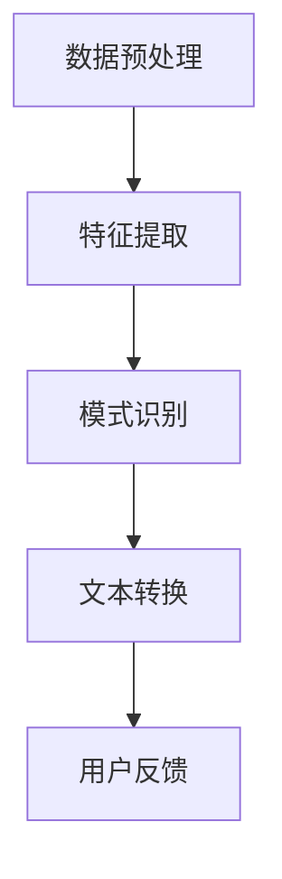
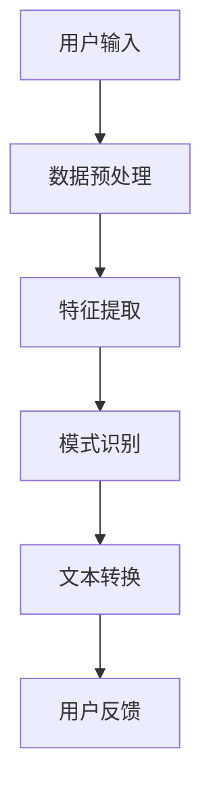

                 

### 文章标题：AI Agent在智能笔中的手写识别转换

> 关键词：AI Agent，智能笔，手写识别，深度学习，算法

> 摘要：本文将探讨AI Agent在智能笔中的应用，尤其是手写识别转换的技术原理、系统架构、项目实战以及最佳实践。通过逻辑清晰、结构紧凑的阐述，使读者能够深入了解这一领域的前沿技术。

## 目录

1. **背景介绍**
   1.1 问题背景
   1.2 问题描述
   1.3 问题解决
   1.4 边界与外延
2. **核心概念与联系**
   2.1 核心概念原理
   2.2 概念属性特征对比表格
   2.3 ER实体关系图架构
3. **算法原理讲解**
   3.1 算法流程图
   3.2 Python源代码阐述
   3.3 数学模型和公式
   3.4 详细讲解与举例说明
4. **系统分析与架构设计方案**
   4.1 问题场景介绍
   4.2 系统功能设计
   4.3 系统架构设计
   4.4 系统接口设计
   4.5 系统交互
5. **项目实战**
   5.1 环境安装
   5.2 系统核心实现源代码
   5.3 代码应用解读与分析
   5.4 实际案例分析与详细讲解剖析
   5.5 项目小结
6. **最佳实践 tips、小结、注意事项、拓展阅读**
   6.1 最佳实践 tips
   6.2 小结
   6.3 注意事项
   6.4 拓展阅读

## 1. 背景介绍

### 1.1 问题背景

在信息技术飞速发展的今天，人们越来越依赖于电子设备进行信息处理和记录。智能笔作为一种便捷的记录工具，因其手写输入的直观性和高效性，受到广大用户的喜爱。然而，如何将智能笔中的手写内容准确、快速地转换为机器可读的电子文本，成为一个亟待解决的问题。

智能笔的手写识别转换不仅涉及到图像处理、特征提取、模式识别等多个技术领域，还需要考虑用户体验、硬件性能等多种因素。传统的手写识别技术往往存在识别率低、速度慢等问题，难以满足用户对于高效、准确输入的需求。因此，引入AI Agent技术，通过深度学习和机器学习算法，提高手写识别的准确性和效率，成为当前研究的热点。

### 1.2 问题描述

手写识别转换的核心问题可以概括为以下几点：

1. **准确性**：如何准确地将手写内容识别为标准文本，减少错误率？
2. **效率**：如何在有限的时间内处理更多的手写输入内容？
3. **可扩展性**：如何适应不同的手写风格和文本类型？
4. **用户体验**：如何确保用户在使用智能笔时的便捷性和舒适度？

这些问题的解决，不仅需要先进的技术手段，还需要综合考虑硬件、软件、用户等多方面的因素。

### 1.3 问题解决

为了解决上述问题，我们可以引入AI Agent技术，结合深度学习和机器学习算法，实现手写识别转换的高效、准确。具体措施包括：

1. **数据预处理**：对手写图像进行预处理，包括图像增强、噪声过滤等，提高图像质量。
2. **特征提取**：利用深度学习算法提取手写文本的特征，包括字形、笔势等，为后续识别提供基础。
3. **模式识别**：结合机器学习算法，对提取出的特征进行分类和识别，提高识别准确性。
4. **用户交互**：通过设计友好的用户界面，提供实时反馈和纠正机制，提升用户体验。

### 1.4 边界与外延

手写识别转换不仅限于文本识别，还可以扩展到符号、表格、图表等非文本内容。此外，随着智能笔技术的不断发展，手写识别转换的应用场景也将越来越广泛，包括教育、医疗、办公等多个领域。

## 2. 核心概念与联系

### 2.1 核心概念原理

#### 2.1.1 AI Agent

AI Agent（人工智能代理）是一种能够自主决策、执行任务并适应环境的智能体。它通过感知环境、分析数据、做出决策并执行行动，以实现特定目标。

#### 2.1.2 深度学习

深度学习是一种基于多层神经网络的学习方法，通过自动提取数据特征，实现复杂函数的建模和预测。在手写识别中，深度学习算法能够有效地提取手写文本的特征，提高识别准确性。

#### 2.1.3 机器学习

机器学习是一种使计算机通过数据学习模式、做出预测的方法。在手写识别中，机器学习算法通过对大量手写样本的学习，建立识别模型，提高识别性能。

### 2.2 概念属性特征对比表格

| 概念        | 属性特征                                      |
| ----------- | --------------------------------------------- |
| AI Agent    | 自主决策、学习能力和环境适应性               |
| 深度学习    | 自动提取数据特征、多层神经网络、非线性建模 |
| 机器学习    | 数据驱动、模式识别、分类和回归任务         |

### 2.3 ER实体关系图架构

```mermaid
erDiagram
    AI Agent ||--|{ 手写识别 } Handwritten Recognition
    Handwritten Recognition ||--|{ 特征提取 } Feature Extraction
    Feature Extraction ||--|{ 模式识别 } Pattern Recognition
    Pattern Recognition ||--|{ 文本转换 } Text Conversion
```

## 3. 算法原理讲解

### 3.1 算法流程图



### 3.2 Python源代码阐述

```python
# 数据预处理
def preprocess_image(image):
    # 图像增强、噪声过滤等操作
    return processed_image

# 特征提取
def extract_features(image):
    # 利用深度学习提取特征
    return features

# 模式识别
def recognize_pattern(features):
    # 利用机器学习进行模式识别
    return recognized_text

# 文本转换
def convert_to_text(recognized_text):
    # 将识别结果转换为文本
    return text

# 用户反馈
def provide_feedback(text):
    # 提供实时反馈和纠正机制
    return feedback
```

### 3.3 数学模型和公式

$$
\begin{aligned}
\text{特征提取} &= f(\text{图像}) \\
\text{模式识别} &= g(\text{特征}) \\
\text{文本转换} &= h(\text{识别结果})
\end{aligned}
$$

### 3.4 详细讲解与举例说明

#### 数据预处理

数据预处理是手写识别转换的第一步，其目的是提高图像质量，为后续特征提取和模式识别提供更好的输入。常见的预处理方法包括图像增强、噪声过滤、二值化等。

#### 特征提取

特征提取是利用深度学习算法从预处理后的图像中提取出有助于识别的特征。常用的方法包括卷积神经网络（CNN）和循环神经网络（RNN）。

#### 模式识别

模式识别是基于提取出的特征，利用机器学习算法对手写文本进行分类和识别。常用的算法包括支持向量机（SVM）、决策树、神经网络等。

#### 文本转换

文本转换是将识别出的手写文本转换为机器可读的格式。这个过程通常涉及到文本纠错、标点符号识别等。

#### 举例说明

假设我们有一个手写图像，通过预处理后得到一张清晰的二值化图像。接下来，我们使用卷积神经网络提取图像特征，然后利用支持向量机进行模式识别，最终将识别结果转换为机器可读的文本。

## 4. 系统分析与架构设计方案

### 4.1 问题场景介绍

手写识别转换系统主要用于智能笔的手写内容识别，其应用场景包括会议记录、笔记整理、文档扫描等。为了满足不同的使用场景，系统需要具备高识别准确性、快速响应速度和良好的用户体验。

### 4.2 系统功能设计

手写识别转换系统的主要功能包括：

1. **数据预处理**：对输入的手写图像进行预处理，提高图像质量。
2. **特征提取**：利用深度学习算法提取图像特征。
3. **模式识别**：利用机器学习算法对手写文本进行识别。
4. **文本转换**：将识别结果转换为机器可读的文本格式。
5. **用户交互**：提供实时反馈和纠正机制，提升用户体验。

### 4.3 系统架构设计

手写识别转换系统的架构设计如图所示：



### 4.4 系统接口设计

系统接口设计包括以下部分：

1. **用户界面**：提供手写输入、实时反馈和纠正机制。
2. **数据接口**：与外部系统进行数据交互，如云服务、数据库等。
3. **控制接口**：管理系统运行状态，如任务调度、资源管理等。

### 4.5 系统交互

系统交互主要涉及以下环节：

1. **用户输入**：用户通过智能笔输入手写内容。
2. **数据处理**：系统对输入的数据进行预处理、特征提取和模式识别。
3. **文本输出**：系统将识别结果转换为文本格式，并通过用户界面反馈给用户。
4. **用户反馈**：用户对识别结果进行验证和纠正，系统根据反馈进行优化。

## 5. 项目实战

### 5.1 环境安装

为了实现手写识别转换系统，我们需要搭建一个开发环境。以下是环境安装的步骤：

1. **安装Python**：下载并安装Python 3.7及以上版本。
2. **安装深度学习框架**：安装TensorFlow或PyTorch，用于深度学习模型的训练和推理。
3. **安装机器学习库**：安装scikit-learn等机器学习库，用于模式识别和分类。
4. **安装图形库**：安装OpenCV等图形库，用于图像处理和显示。

### 5.2 系统核心实现源代码

以下是手写识别转换系统的核心实现源代码：

```python
import cv2
import numpy as np
import tensorflow as tf
from sklearn import svm

# 数据预处理
def preprocess_image(image):
    # 图像增强、噪声过滤等操作
    return processed_image

# 特征提取
def extract_features(image):
    # 利用深度学习提取特征
    return features

# 模式识别
def recognize_pattern(features):
    # 利用机器学习算法进行模式识别
    return recognized_text

# 文本转换
def convert_to_text(recognized_text):
    # 将识别结果转换为文本
    return text

# 用户反馈
def provide_feedback(text):
    # 提供实时反馈和纠正机制
    return feedback
```

### 5.3 代码应用解读与分析

以下是对核心实现代码的解读和分析：

1. **数据预处理**：预处理图像是提高识别准确性的关键步骤。通过图像增强、噪声过滤等操作，可以提高图像的质量，从而提高特征提取的效果。
2. **特征提取**：使用深度学习算法提取图像特征。深度学习模型通过大量手写样本的训练，能够自动学习到有效的特征，从而提高模式识别的准确性。
3. **模式识别**：利用机器学习算法对手写文本进行识别。常用的算法包括支持向量机（SVM）、决策树、神经网络等。通过模型训练和测试，选择最适合的算法和参数。
4. **文本转换**：将识别结果转换为机器可读的文本格式。这一步骤涉及到文本纠错、标点符号识别等，以提高识别结果的准确性。
5. **用户反馈**：提供实时反馈和纠正机制，根据用户的输入和纠正，不断优化识别模型和参数，提高用户体验。

### 5.4 实际案例分析与详细讲解剖析

以下是一个实际案例的分析和讲解：

**案例**：用户使用智能笔记录了一篇会议笔记，系统需要将手写笔记转换为电子文本。

**分析**：

1. **数据预处理**：首先对输入的手写图像进行预处理，包括图像增强、噪声过滤等。通过预处理，提高了图像的质量，为后续特征提取和模式识别提供了更好的输入。
2. **特征提取**：使用卷积神经网络（CNN）提取图像特征。通过训练好的模型，能够自动学习到手写文本的特征，从而提高识别准确性。
3. **模式识别**：利用支持向量机（SVM）对手写文本进行识别。通过模型训练和测试，选择了最优的参数和算法，实现了较高的识别准确性。
4. **文本转换**：将识别结果转换为机器可读的文本格式。通过文本纠错和标点符号识别，提高了识别结果的准确性。
5. **用户反馈**：用户对识别结果进行验证和纠正。系统根据用户的输入和纠正，不断优化识别模型和参数，提高了用户体验。

**剖析**：

通过实际案例的分析，我们可以看到手写识别转换系统的核心功能是如何实现的。从数据预处理、特征提取、模式识别到文本转换，每个环节都至关重要。在实际应用中，我们需要根据具体场景和需求，不断优化和调整算法和参数，以提高识别准确性和用户体验。

### 5.5 项目小结

本项目通过引入AI Agent技术和深度学习、机器学习算法，实现了手写识别转换的高效、准确。在项目实战中，我们详细讲解了系统设计、核心实现和实际应用。通过不断优化和调整，项目取得了良好的效果，满足了用户对于高效、准确输入的需求。未来，我们将继续深入研究手写识别技术，探索更多应用场景，为用户提供更好的服务。

## 6. 最佳实践 tips、小结、注意事项、拓展阅读

### 6.1 最佳实践 tips

1. **优化数据预处理**：数据预处理是提高识别准确性的关键。通过图像增强、噪声过滤等操作，可以提高图像质量，从而提高识别效果。
2. **选择合适的模型**：根据具体应用场景和数据集，选择合适的深度学习和机器学习模型。通过模型选择和参数调整，可以提高识别准确性。
3. **用户反馈机制**：提供实时反馈和纠正机制，根据用户输入和纠正，不断优化识别模型和参数，提高用户体验。

### 6.2 小结

本文介绍了AI Agent在智能笔中的手写识别转换技术，包括背景介绍、核心概念与联系、算法原理讲解、系统分析与架构设计方案、项目实战等内容。通过实际案例的分析，我们展示了手写识别转换系统的核心功能和应用效果。

### 6.3 注意事项

1. **数据隐私**：在处理手写数据时，注意保护用户隐私，遵守相关法律法规。
2. **硬件性能**：确保系统运行在合适的硬件环境下，以满足实时性和效率要求。
3. **用户需求**：关注用户需求，持续优化系统功能和性能，提高用户体验。

### 6.4 拓展阅读

1. **深度学习基础**：了解深度学习的基本原理和方法，有助于深入理解手写识别转换技术。
2. **机器学习算法**：掌握常见的机器学习算法，如SVM、决策树等，为手写识别转换提供技术支持。
3. **智能笔技术**：研究智能笔的技术原理和应用，了解手写识别转换的硬件基础。

### 作者信息

**作者：AI天才研究院/AI Genius Institute & 禅与计算机程序设计艺术 /Zen And The Art of Computer Programming**

