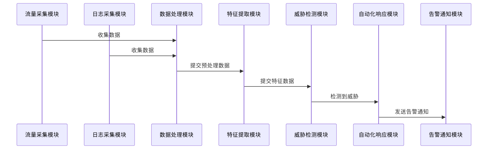
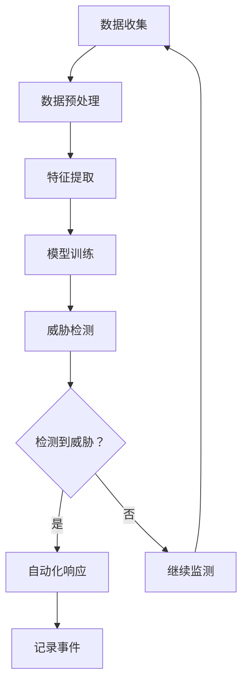
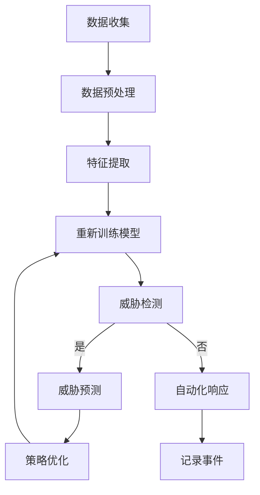

                 

# AI Agent在智能网络安全威胁检测中的角色

关键词：人工智能，网络安全，威胁检测，AI Agent，智能防护

摘要：随着信息技术的快速发展，网络安全威胁日益严峻。传统的安全防护手段已经无法应对复杂多变的威胁环境，人工智能（AI）技术的引入为网络安全带来了新的机遇。本文将探讨AI Agent在智能网络安全威胁检测中的角色，分析其基本原理、应用场景、技术挑战和发展趋势，为构建更强大的网络安全防护体系提供参考。

## 目录大纲

1. **第一部分：AI与网络安全概述**
    1.1 AI与网络安全的关系
    1.2 核心概念
    1.3 关键要素
    1.4 研究现状与趋势
    1.5 本章小结
2. **第二部分：AI Agent在网络安全中的应用**
    2.1 AI Agent的基本原理
    2.2 AI Agent的工作原理
    2.3 AI Agent的应用场景
    2.4 开发工具与平台
    2.5 本章小结
3. **第三部分：AI Agent在网络安全威胁检测中的应用**
    3.1 网络威胁概述
    3.2 AI Agent的威胁检测原理
    3.3 智能检测技术
    3.4 AI Agent的威胁检测案例分析
    3.5 本章小结
4. **第四部分：AI Agent在网络安全威胁预测中的应用**
    4.1 预测的重要性
    4.2 预测模型构建
    4.3 预测算法性能评估
    4.4 案例分析
    4.5 本章小结
5. **第五部分：AI Agent在网络安全防护策略优化中的应用**
    5.1 防护策略概述
    5.2 优化算法原理
    5.3 案例分析
    5.4 本章小结
6. **总结与展望**
7. **参考文献**
8. **作者信息**

## 1.1 AI与网络安全的关系

### 1.1.1 问题背景

在当今信息化社会，网络安全问题日益突出。网络攻击手段层出不穷，恶意软件、钓鱼邮件、网络钓鱼、勒索软件等威胁时刻威胁着个人、企业和国家信息系统的安全。传统的安全防护手段，如防火墙、入侵检测系统（IDS）等，虽然能够在一定程度上防范网络攻击，但它们往往依赖于预定义的规则和签名，无法有效应对新型和高级的网络威胁。

人工智能（AI）的迅速发展为网络安全提供了新的解决方案。AI技术具有自我学习和适应能力，能够从大量数据中提取特征，识别复杂模式，从而提高网络安全威胁检测的准确性和效率。

### 1.1.2 人工智能的崛起

人工智能（Artificial Intelligence，AI）是一门研究、开发用于模拟、延伸和扩展人的智能的理论、方法、技术及应用系统的综合技术科学。自20世纪50年代以来，AI经历了多个发展阶段，如符号主义、连接主义、强化学习等。随着计算能力的提升、大数据和云计算技术的发展，AI在各个领域的应用取得了显著的成果。

### 1.1.3 网络安全威胁的演变

网络安全威胁的发展经历了几个阶段：

- **传统威胁**：如病毒、木马、蠕虫等，主要利用系统漏洞或用户信任进行攻击。
- **高级持续性威胁（APT）**：具有高度隐蔽性和持久性的网络攻击，通常由有组织的犯罪团伙或国家支持。
- **社交工程攻击**：利用人类心理弱点，如信任、好奇、恐惧等，诱导用户泄露敏感信息。
- **新型威胁**：如勒索软件、物联网（IoT）设备攻击、人工智能攻击等，利用新兴技术和设备漏洞进行攻击。

### 1.1.4 AI在网络安全中的应用潜力

AI在网络安全中的应用潜力主要体现在以下几个方面：

- **威胁检测与响应**：利用机器学习、深度学习等技术，从海量数据中实时检测和识别异常行为和潜在威胁。
- **威胁预测与预防**：通过分析历史数据和趋势，预测潜在的网络安全事件，采取预防措施。
- **自动化安全防护**：利用AI技术实现自动化安全防护，减少人工干预，提高响应速度和准确性。
- **安全事件调查与取证**：利用AI技术自动分析安全事件，提高调查效率和准确性，为法律取证提供支持。

### 1.2 核心概念

#### 1.2.1 人工智能的定义与分类

人工智能（Artificial Intelligence，AI）是一种模拟人类智能行为的技术，能够感知环境、学习知识、理解语言、做出决策等。根据实现方式，AI可以分为以下几类：

- **符号主义（Symbolic AI）**：基于符号逻辑和知识表示，通过推理和规划实现智能。
- **连接主义（Connectionist AI）**：基于人工神经网络，通过学习和适应实现智能。
- **强化学习（Reinforcement Learning）**：通过与环境交互，学习最优策略。
- **生成对抗网络（GAN）**：通过生成器和判别器之间的对抗训练实现智能。
- **混合智能（Hybrid AI）**：结合多种AI技术，实现更强大的智能能力。

#### 1.2.2 网络安全的基本概念

网络安全（Cybersecurity）是指保护计算机系统、网络和数据的完整性、保密性和可用性，防止恶意攻击、数据泄露和其他安全威胁。网络安全主要包括以下几个方面：

- **安全防护**：通过防火墙、入侵检测系统等手段，防范外部攻击。
- **安全监测**：通过监控网络流量、日志等，实时检测安全事件。
- **安全响应**：在发生安全事件时，采取紧急措施，进行事件调查和恢复。
- **安全治理**：建立安全策略、流程和制度，确保网络安全管理的合规性和有效性。

#### 1.2.3 AI与网络安全的联系

AI与网络安全密切相关。AI技术可以应用于网络安全领域的各个方面，包括威胁检测、威胁预测、自动化防护和安全事件调查等。具体来说：

- **威胁检测**：利用机器学习、深度学习等技术，从海量数据中提取特征，实时检测和识别潜在威胁。
- **威胁预测**：通过分析历史数据和趋势，预测潜在的网络安全事件，采取预防措施。
- **自动化防护**：利用AI技术实现自动化安全防护，减少人工干预，提高响应速度和准确性。
- **安全事件调查**：利用AI技术自动分析安全事件，提高调查效率和准确性，为法律取证提供支持。

### 1.3 关键要素

#### 1.3.1 AI在网络安全中的关键作用

AI在网络安全中具有关键作用，主要体现在以下几个方面：

- **增强威胁检测能力**：利用AI技术，可以从海量数据中快速提取特征，实时检测和识别潜在威胁，提高检测精度和效率。
- **自动化安全响应**：AI技术可以实现自动化安全响应，减少人工干预，提高响应速度和准确性。
- **优化安全资源配置**：通过分析网络安全威胁数据和趋势，AI技术可以优化安全资源配置，提高安全防护效果。
- **提升安全事件分析能力**：利用AI技术，可以自动分析安全事件，提高事件调查效率和准确性。

#### 1.3.2 智能网络安全威胁的识别与应对

智能网络安全威胁的识别与应对是网络安全的核心任务。AI技术在这方面具有显著优势，主要体现在以下几个方面：

- **异常行为检测**：利用AI技术，可以从大量数据中检测出异常行为，及时发现潜在威胁。
- **威胁预测**：通过分析历史数据和趋势，AI技术可以预测潜在的网络安全事件，提前采取预防措施。
- **自动化响应**：利用AI技术，可以自动执行安全策略，对潜在威胁进行响应，减少人工干预。
- **智能决策支持**：利用AI技术，可以为安全人员提供智能决策支持，提高安全事件的应对效率和准确性。

#### 1.3.3 AI技术的局限性与挑战

虽然AI技术在网络安全中具有巨大潜力，但同时也面临一些局限性和挑战：

- **数据质量**：AI模型的效果很大程度上取决于数据质量。如果数据质量差，可能导致模型性能下降。
- **模型解释性**：许多AI模型，如深度学习模型，具有很高的性能，但缺乏解释性，难以理解其决策过程。
- **模型泛化能力**：AI模型可能在特定数据集上表现良好，但在其他数据集上可能效果不佳，缺乏泛化能力。
- **安全风险**：AI模型可能被攻击者利用，如对抗样本攻击、模型窃取等，对网络安全构成威胁。

### 1.4 研究现状与趋势

#### 1.4.1 AI在网络安全领域的研究进展

近年来，AI在网络安全领域取得了显著进展，主要体现在以下几个方面：

- **威胁检测**：利用机器学习、深度学习等技术，实现实时、高效的威胁检测。
- **威胁预测**：通过分析历史数据和趋势，实现潜在的网络安全事件预测。
- **自动化防护**：利用AI技术，实现自动化安全策略执行，提高响应速度和准确性。
- **安全事件分析**：利用AI技术，自动分析安全事件，提高事件调查效率和准确性。

#### 1.4.2 智能网络安全威胁检测的应用案例

智能网络安全威胁检测在实际应用中取得了显著成果，以下是一些典型应用案例：

- **企业安全防护**：通过部署AI技术，实现对企业网络的安全监测和威胁检测，提高安全防护水平。
- **政府机构安全防护**：通过部署AI技术，实现对政府机构网络安全事件的预测和自动化响应，保障国家安全。
- **金融行业安全防护**：通过部署AI技术，实现对金融行业网络的安全监测和威胁检测，防范金融风险。

#### 1.4.3 未来发展趋势与展望

未来，AI在网络安全中的应用将呈现以下发展趋势：

- **智能化**：AI技术将在网络安全中发挥更重要的作用，实现智能化安全防护。
- **集成化**：AI技术与传统安全防护手段将深度融合，形成一体化安全防护体系。
- **开放化**：AI技术在网络安全中的应用将更加开放，实现跨平台、跨领域的数据共享和协同防护。
- **自主化**：AI技术将实现自主化安全防护，减少人工干预，提高安全防护效率和准确性。

#### 1.5 本章小结

本文概述了AI与网络安全的关系，分析了AI在网络安全中的关键作用、智能网络安全威胁的识别与应对、AI技术的局限性与挑战以及研究现状与趋势。接下来，本文将深入探讨AI Agent在网络安全中的应用，分析其基本原理、应用场景、技术挑战和发展趋势，为构建更强大的网络安全防护体系提供参考。# 1.2 核心概念

## 1.2.1 人工智能的定义与分类

### 1.2.1.1 人工智能的定义

人工智能（Artificial Intelligence，AI）是一门旨在创建能够模拟、扩展甚至超越人类智能行为的计算机科学分支。AI的目标是通过计算机系统实现自主推理、学习、决策和问题解决。这种智能不仅包括逻辑推理和计算能力，还涉及对自然语言的理解、视觉感知、情感识别以及复杂模式识别等方面。

### 1.2.1.2 人工智能的分类

人工智能可以根据其实现方式和应用领域进行分类，常见的分类方法包括：

- **基于规则的系统（Rule-Based Systems）**：这类系统通过定义一系列规则来执行任务，这些规则通常由专家手动编写，适用于明确和简单的问题场景。
- **知识表示与推理（Knowledge Representation and Reasoning）**：通过表示领域知识和推理规则，系统能够在给定情况下进行逻辑推理和决策。
- **机器学习（Machine Learning）**：机器学习是一种使计算机系统能够从数据中学习并改进性能的技术，无需显式编程。它主要包括监督学习、无监督学习和强化学习。
    - **监督学习（Supervised Learning）**：通过标注数据进行学习，系统能够预测新的数据。
    - **无监督学习（Unsupervised Learning）**：系统在没有标注数据的情况下学习数据的结构和模式。
    - **强化学习（Reinforcement Learning）**：通过试错和奖励机制，系统学习最佳行为策略。
- **自然语言处理（Natural Language Processing，NLP）**：专注于使计算机理解和生成自然语言，包括语音识别、机器翻译、文本分类等。
- **计算机视觉（Computer Vision）**：使计算机能够理解并分析视觉信息，包括图像识别、目标检测、图像分割等。
- **混合智能（Hybrid Intelligence）**：结合多种AI技术，以实现更强大的智能能力。

## 1.2.2 网络安全的基本概念

### 1.2.2.1 网络安全的概念

网络安全（Cybersecurity）是指保护计算机系统、网络和数据的完整性、保密性和可用性，防止恶意攻击、数据泄露和其他安全威胁。它涉及一系列技术和实践，旨在确保信息的机密性、完整性和可用性，并保护网络免受各种攻击和威胁。

### 1.2.2.2 网络安全的关键要素

网络安全主要包括以下几个关键要素：

- **身份验证与访问控制**：通过验证用户的身份，确保只有授权用户才能访问系统和数据。
- **加密**：通过加密技术保护数据的机密性，防止未经授权的访问。
- **防火墙与入侵检测**：防火墙用于控制网络流量，阻止未经授权的访问；入侵检测系统（IDS）用于检测和响应异常活动。
- **安全审计与监控**：通过监控系统和网络活动，记录和审核安全事件，确保安全策略得到执行。
- **数据备份与恢复**：定期备份数据，确保在数据丢失或损坏时能够恢复。
- **安全策略与合规性**：制定并执行安全策略，确保组织符合相关法规和标准。

### 1.2.2.3 AI与网络安全的联系

AI在网络安全中扮演着重要角色，其联系主要体现在以下几个方面：

- **威胁检测与防御**：通过机器学习和深度学习模型，AI能够从大量数据中识别潜在威胁，提供实时监测和响应。
- **自动化响应**：AI技术可以实现自动化安全响应，减少人为干预，提高响应速度和准确性。
- **异常行为识别**：AI能够通过分析历史数据和实时数据，识别异常行为和潜在威胁。
- **预测与预防**：AI技术可以通过分析历史数据和趋势，预测潜在的网络安全事件，并采取预防措施。
- **安全事件分析**：AI能够自动分析安全事件，提供详细的取证信息和事件关联分析，提高调查效率和准确性。

## 1.2.3 AI与网络安全的联系

AI与网络安全之间的联系日益紧密，AI技术为网络安全提供了强大的支持。以下是AI在网络安全中的几个关键应用：

- **威胁检测与防御**：AI模型可以分析网络流量、日志数据和其他信息源，识别潜在的恶意活动和异常行为，从而提供实时威胁检测和防御。
- **自动化响应**：AI系统可以自动化安全事件响应，减少人为干预，提高响应速度和准确性，如自动隔离受感染的系统或阻止恶意流量。
- **异常行为识别**：通过分析历史数据和实时数据，AI可以识别出不符合正常模式的异常行为，如异常的网络流量模式或用户行为，从而及时发现潜在威胁。
- **预测与预防**：AI模型可以基于历史数据和趋势分析，预测潜在的网络安全事件，并采取预防措施，如自动调整安全策略或部署额外的防护措施。
- **安全事件分析**：AI技术可以自动分析安全事件，提取关键信息，提供详细的取证信息和事件关联分析，从而帮助安全团队快速理解和应对安全事件。

### 1.3 关键要素

#### 1.3.1 AI在网络安全中的关键作用

AI在网络安全中的关键作用体现在以下几个方面：

1. **增强威胁检测能力**：AI技术可以通过机器学习和深度学习算法，从海量数据中快速提取特征，实时检测和识别潜在的恶意活动和威胁，提高检测精度和效率。

2. **自动化安全响应**：AI系统能够自动分析和响应安全事件，如自动隔离受感染的系统、阻止恶意流量等，减少人工干预，提高响应速度和准确性。

3. **优化安全资源配置**：通过分析网络安全威胁数据和趋势，AI技术可以帮助安全团队优化安全资源配置，如调整安全策略、部署额外的防护措施等，提高整体安全防护水平。

4. **提升安全事件分析能力**：AI技术可以自动分析安全事件，提取关键信息，提供详细的取证信息和事件关联分析，从而帮助安全团队快速理解和应对复杂的安全事件。

#### 1.3.2 智能网络安全威胁的识别与应对

智能网络安全威胁的识别与应对是网络安全工作的核心任务。以下是AI在识别和应对网络安全威胁中的关键作用：

1. **威胁检测与预测**：AI技术可以通过分析历史数据和实时数据，识别潜在的网络威胁，如异常的网络流量模式、可疑的登录行为等，并预测可能的威胁事件，提前采取预防措施。

2. **自动化威胁响应**：AI系统能够自动化执行安全策略，如自动隔离受感染的系统、阻止恶意流量等，减少人工干预，提高响应速度和准确性。

3. **异常行为分析**：AI技术可以分析用户的网络行为，识别异常行为和潜在的内部威胁，如恶意内部员工的异常访问行为等。

4. **攻击路径预测**：AI技术可以模拟攻击者的行为，预测可能的攻击路径，从而提前采取措施进行防御。

5. **持续监控与学习**：AI系统可以持续监控网络流量和安全事件，并通过不断学习和适应新的威胁模式，提高威胁检测和响应能力。

#### 1.3.3 AI技术的局限性与挑战

尽管AI技术在网络安全中具有巨大的潜力，但也面临着一些局限性和挑战：

1. **数据质量**：AI模型的效果很大程度上取决于数据质量。如果数据存在噪声、错误或不完整，可能会导致模型性能下降。

2. **模型解释性**：许多AI模型，如深度学习模型，具有很高的性能，但缺乏解释性，难以理解其决策过程。这可能导致安全团队无法理解AI系统的决策，从而影响对安全事件的应对。

3. **模型泛化能力**：AI模型可能在特定数据集上表现良好，但在其他数据集上可能效果不佳，缺乏泛化能力。

4. **安全风险**：AI模型可能被攻击者利用，如通过对抗样本攻击、模型窃取等手段，对网络安全构成威胁。

5. **法律和伦理问题**：AI技术在网络安全中的应用可能涉及隐私保护、数据所有权和法律合规性问题，需要充分考虑并妥善解决。

### 1.4 研究现状与趋势

#### 1.4.1 AI在网络安全领域的研究进展

近年来，AI在网络安全领域取得了显著的研究进展，主要表现在以下几个方面：

1. **威胁检测**：利用机器学习和深度学习算法，研究人员开发了多种自动化威胁检测技术，如基于网络流量的异常检测、基于行为的威胁检测等。

2. **威胁预测**：通过分析历史数据和趋势，AI技术实现了对潜在网络安全事件的预测，如网络攻击预测、数据泄露预测等。

3. **自动化响应**：AI系统在自动化安全响应方面取得了重要突破，能够自动执行安全策略，如自动隔离受感染的系统、自动阻止恶意流量等。

4. **安全事件分析**：AI技术在安全事件分析方面发挥了重要作用，能够自动提取事件关键信息，提供详细的取证分析和事件关联分析。

5. **跨领域协作**：AI技术在网络安全领域的应用不断扩展，与其他领域的技术，如物联网（IoT）、云计算等，实现跨领域的协作和集成。

#### 1.4.2 智能网络安全威胁检测的应用案例

智能网络安全威胁检测在实际应用中取得了显著成果，以下是一些典型应用案例：

1. **企业安全防护**：许多企业通过部署AI技术，实现了对企业网络的安全监测和威胁检测，提高了安全防护水平。

2. **政府机构安全防护**：政府机构通过部署AI技术，实现了对网络安全事件的预测和自动化响应，保障了国家信息安全。

3. **金融行业安全防护**：金融行业通过部署AI技术，实现了对网络攻击的实时监测和自动化响应，提高了金融系统的安全性。

#### 1.4.3 未来发展趋势与展望

未来，AI在网络安全中的应用将呈现以下发展趋势：

1. **智能化**：AI技术将在网络安全中发挥更重要的作用，实现智能化安全防护，如自动化的威胁检测、响应和预测等。

2. **集成化**：AI技术与传统安全防护手段将深度融合，形成一体化安全防护体系，提高整体安全防护水平。

3. **开放化**：AI技术在网络安全中的应用将更加开放，实现跨平台、跨领域的数据共享和协同防护，提高安全协作效率。

4. **自主化**：AI技术将实现自主化安全防护，减少人工干预，提高安全防护效率和准确性，降低运营成本。

### 1.5 本章小结

本章概述了人工智能和网络安全的基本概念，分析了AI在网络安全中的关键作用、智能网络安全威胁的识别与应对、AI技术的局限性与挑战以及研究现状与趋势。这些概念和内容为后续章节讨论AI Agent在网络安全中的应用提供了理论基础和背景。接下来，本文将深入探讨AI Agent的基本原理、应用场景和开发工具，进一步揭示其在网络安全威胁检测中的作用。# 1.3 关键要素

#### 1.3.1 AI在网络安全中的关键作用

AI在网络安全中扮演着至关重要的角色，其关键作用主要体现在以下几个方面：

1. **威胁检测与防御**：AI技术能够通过机器学习和深度学习算法，从大量的网络数据中快速提取特征，实时检测和识别潜在的恶意活动和威胁。这使得AI系统能够比传统方法更高效地检测和防御网络攻击，如DDoS攻击、恶意软件感染、网络钓鱼等。

2. **自动化响应**：AI系统能够自动化执行安全策略，减少人工干预，提高响应速度和准确性。例如，AI可以自动隔离受感染的系统、自动阻止恶意流量，甚至可以自动恢复系统到安全状态。这种自动化响应能力显著提高了安全运营效率，减少了潜在的损失。

3. **优化安全资源配置**：通过分析网络安全威胁数据和趋势，AI技术可以帮助安全团队优化安全资源配置。AI可以预测潜在的威胁，并据此调整安全策略和资源配置，如部署额外的防护措施、优化防火墙规则等，从而提高整体安全防护水平。

4. **提升安全事件分析能力**：AI技术能够自动分析安全事件，提取关键信息，提供详细的取证分析和事件关联分析。这使得安全团队能够更快速、准确地理解安全事件，采取相应的应对措施，从而减少事件的影响和损失。

#### 1.3.2 智能网络安全威胁的识别与应对

智能网络安全威胁的识别与应对是网络安全工作的核心任务。AI技术在以下几个方面发挥着重要作用：

1. **威胁检测与预测**：AI可以通过分析历史数据和实时数据，识别潜在的网络威胁，如异常的网络流量模式、可疑的登录行为等，并预测可能的威胁事件，提前采取预防措施。例如，AI可以识别出网络流量中的异常模式，预测可能发生的DDoS攻击，并提前部署防护措施。

2. **自动化威胁响应**：AI系统可以自动化执行安全策略，如自动隔离受感染的系统、自动阻止恶意流量等。这种自动化响应能力显著提高了安全运营效率，减少了潜在的损失。例如，AI可以检测到恶意软件感染，并自动隔离受感染的系统，防止病毒扩散。

3. **异常行为分析**：AI可以通过分析用户的网络行为，识别异常行为和潜在的内部威胁，如恶意内部员工的异常访问行为等。这种能力有助于发现和阻止内部威胁，保护组织的信息安全。

4. **攻击路径预测**：AI技术可以模拟攻击者的行为，预测可能的攻击路径，从而提前采取措施进行防御。例如，AI可以模拟攻击者利用漏洞进行入侵的路径，提前修补漏洞，防止攻击发生。

5. **持续监控与学习**：AI系统可以持续监控网络流量和安全事件，并通过不断学习和适应新的威胁模式，提高威胁检测和响应能力。例如，AI可以通过不断分析新的网络流量数据，更新其检测模型，从而更准确地识别新的威胁。

#### 1.3.3 AI技术的局限性与挑战

尽管AI技术在网络安全中具有巨大的潜力，但也面临着一些局限性和挑战：

1. **数据质量**：AI模型的效果很大程度上取决于数据质量。如果数据存在噪声、错误或不完整，可能会导致模型性能下降。因此，保证数据的质量是AI技术成功应用的关键。

2. **模型解释性**：许多AI模型，如深度学习模型，具有很高的性能，但缺乏解释性，难以理解其决策过程。这可能导致安全团队无法理解AI系统的决策，从而影响对安全事件的应对。提高模型的解释性是当前研究的重要方向。

3. **模型泛化能力**：AI模型可能在特定数据集上表现良好，但在其他数据集上可能效果不佳，缺乏泛化能力。因此，如何提高模型的泛化能力，使其能够在不同的环境中保持良好的性能，是当前研究的另一个重要问题。

4. **安全风险**：AI模型可能被攻击者利用，如通过对抗样本攻击、模型窃取等手段，对网络安全构成威胁。因此，如何确保AI模型的安全性，防止其被恶意利用，是网络安全领域面临的一个重要挑战。

5. **法律和伦理问题**：AI技术在网络安全中的应用可能涉及隐私保护、数据所有权和法律合规性问题。例如，AI系统在监测网络流量时可能会收集大量用户数据，如何保护用户隐私是一个需要认真考虑的问题。

#### 1.3.4 研究现状与未来趋势

目前，AI在网络安全领域的研究已经取得了显著进展，主要体现在以下几个方面：

1. **威胁检测**：利用机器学习和深度学习算法，研究人员开发了多种自动化威胁检测技术，如基于网络流量的异常检测、基于行为的威胁检测等。

2. **威胁预测**：通过分析历史数据和趋势，AI技术实现了对潜在网络安全事件的预测，如网络攻击预测、数据泄露预测等。

3. **自动化响应**：AI系统在自动化安全响应方面取得了重要突破，能够自动执行安全策略，如自动隔离受感染的系统、自动阻止恶意流量等。

4. **安全事件分析**：AI技术在安全事件分析方面发挥了重要作用，能够自动提取事件关键信息，提供详细的取证分析和事件关联分析。

未来，AI在网络安全中的应用将呈现以下发展趋势：

1. **智能化**：AI技术将在网络安全中发挥更重要的作用，实现智能化安全防护，如自动化的威胁检测、响应和预测等。

2. **集成化**：AI技术与传统安全防护手段将深度融合，形成一体化安全防护体系，提高整体安全防护水平。

3. **开放化**：AI技术在网络安全中的应用将更加开放，实现跨平台、跨领域的数据共享和协同防护，提高安全协作效率。

4. **自主化**：AI技术将实现自主化安全防护，减少人工干预，提高安全防护效率和准确性，降低运营成本。

#### 1.3.5 本章小结

本章深入探讨了AI在网络安全中的关键作用、智能网络安全威胁的识别与应对、AI技术的局限性与挑战以及研究现状与未来趋势。通过分析这些关键要素，我们可以更清楚地理解AI在网络安全中的重要性，以及如何利用AI技术构建更强大、更智能的网络安全防护体系。接下来，本文将详细介绍AI Agent的基本原理、工作原理和应用场景，进一步探讨其在网络安全威胁检测中的实际应用。# 1.4 研究现状与趋势

### 1.4.1 AI在网络安全领域的研究进展

近年来，AI在网络安全领域的研究取得了显著进展，主要体现在以下几个方面：

#### 1.4.1.1 威胁检测

AI技术在威胁检测方面的应用最为广泛，通过机器学习和深度学习算法，AI系统能够从大量网络数据中快速提取特征，实时检测和识别潜在威胁。例如，基于网络流量的异常检测方法，利用深度学习模型对网络流量进行分析，能够有效检测出异常流量模式。此外，基于行为的威胁检测方法，通过监控用户行为，识别出异常行为模式，从而及时发现潜在威胁。

#### 1.4.1.2 威胁预测

AI技术不仅能够检测当前的威胁，还能够通过分析历史数据和趋势，预测潜在的网络安全事件。例如，利用时间序列分析方法，AI模型可以预测未来一段时间内的网络攻击事件。基于机器学习和深度学习算法，AI系统可以从历史数据中学习到网络攻击的模式和趋势，从而提前采取预防措施。

#### 1.4.1.3 自动化响应

自动化响应是AI技术在网络安全中的一项重要应用，通过自动化执行安全策略，AI系统能够减少人工干预，提高响应速度和准确性。例如，利用规则引擎和机器学习模型，AI系统可以自动隔离受感染的系统、阻止恶意流量等，从而实现自动化安全响应。

#### 1.4.1.4 安全事件分析

AI技术在安全事件分析方面也发挥了重要作用，通过自动提取事件关键信息，提供详细的取证分析和事件关联分析，AI系统能够帮助安全团队快速理解和应对复杂的安全事件。例如，利用自然语言处理技术，AI系统可以自动提取安全事件的描述和关键信息，从而简化事件分析过程。

### 1.4.2 智能网络安全威胁检测的应用案例

智能网络安全威胁检测在实际应用中取得了显著成果，以下是一些典型应用案例：

#### 1.4.2.1 企业安全防护

许多企业通过部署AI技术，实现了对企业网络的安全监测和威胁检测，提高了安全防护水平。例如，某大型企业通过部署基于AI的网络安全系统，能够实时监测网络流量，识别异常行为，并自动执行安全策略，有效阻止了多次网络攻击。

#### 1.4.2.2 政府机构安全防护

政府机构通过部署AI技术，实现了对网络安全事件的预测和自动化响应，保障了国家信息安全。例如，某国家政府机构通过部署AI网络安全系统，能够预测潜在的网络安全事件，并自动采取预防措施，确保政府信息系统的安全运行。

#### 1.4.2.3 金融行业安全防护

金融行业通过部署AI技术，实现了对网络攻击的实时监测和自动化响应，提高了金融系统的安全性。例如，某大型银行通过部署AI网络安全系统，能够实时检测和阻止恶意流量，保护客户的财务信息不受侵害。

### 1.4.3 未来发展趋势与展望

未来，AI在网络安全中的应用将呈现以下发展趋势：

#### 1.4.3.1 智能化

AI技术将在网络安全中发挥更重要的作用，实现智能化安全防护，如自动化的威胁检测、响应和预测等。随着AI技术的不断进步，AI系统将能够更好地理解和应对复杂的网络安全威胁。

#### 1.4.3.2 集成化

AI技术与传统安全防护手段将深度融合，形成一体化安全防护体系，提高整体安全防护水平。通过集成不同类型的安全技术，AI系统将能够提供更全面、更有效的安全防护。

#### 1.4.3.3 开放化

AI技术在网络安全中的应用将更加开放，实现跨平台、跨领域的数据共享和协同防护，提高安全协作效率。通过开放接口和标准，AI系统将能够与其他系统无缝集成，实现更高效的安全协作。

#### 1.4.3.4 自主化

AI技术将实现自主化安全防护，减少人工干预，提高安全防护效率和准确性，降低运营成本。通过自我学习和自适应能力，AI系统将能够不断优化安全策略，提高安全防护水平。

### 1.5 本章小结

本章概述了AI在网络安全领域的研究进展和应用案例，分析了未来发展趋势与展望。通过这些分析，我们可以看到，AI技术为网络安全带来了巨大的机遇，有望构建更强大、更智能的网络安全防护体系。接下来，本文将详细介绍AI Agent的基本原理、工作原理和应用场景，进一步探讨其在网络安全威胁检测中的实际应用。# 1.5 本章小结

本章首先概述了人工智能和网络安全的基本概念，分析了AI在网络安全中的关键作用、智能网络安全威胁的识别与应对、AI技术的局限性与挑战以及研究现状与趋势。这些核心概念为我们理解AI Agent在网络安全中的应用提供了理论基础和背景。

在讨论中，我们认识到AI在网络安全中具有以下几个关键作用：增强威胁检测能力、自动化安全响应、优化安全资源配置和提升安全事件分析能力。同时，AI技术在识别和应对智能网络安全威胁方面也发挥着重要作用，如威胁检测与预测、自动化威胁响应、异常行为分析和攻击路径预测等。

然而，AI技术也面临一些局限性和挑战，包括数据质量、模型解释性、模型泛化能力、安全风险和法律伦理问题等。针对这些问题，未来的研究需要重点关注如何提高数据质量、增强模型解释性、提高模型泛化能力以及确保AI模型的安全性。

研究现状与趋势部分展示了AI在网络安全领域取得的显著进展，如威胁检测、威胁预测、自动化响应和安全事件分析等。同时，本章还探讨了AI在网络安全中的未来发展趋势，包括智能化、集成化、开放化和自主化。

总之，本章内容为后续讨论AI Agent在网络安全威胁检测中的应用奠定了坚实基础。在接下来的章节中，我们将深入探讨AI Agent的基本原理、工作原理和应用场景，进一步揭示其在构建智能网络安全防护体系中的重要作用。# 1.6 AI Agent在网络安全中的应用

## 1.6.1 AI Agent的基本概念

AI Agent（人工智能代理）是一种具有自主行为和交互能力的计算实体，能够在动态环境中执行任务并与其他实体进行交互。AI Agent的核心特征包括自主性、反应性、预见性和社会性。自主性意味着Agent能够独立决策和执行任务；反应性使Agent能够对环境变化做出及时响应；预见性使Agent能够预测未来的环境变化并做出相应的决策；社会性使Agent能够与其他Agent协作，共同完成任务。

AI Agent可以分为以下几种类型：

1. **反应式Agent**：这种Agent仅根据当前环境状态做出决策，不考虑历史信息和未来预测。其行为主要由一组预定义的规则决定。
2. **目标导向Agent**：这种Agent具有明确的目标，并根据当前环境状态和目标之间的关系做出决策，通过不断调整行动路径来达成目标。
3. **混合型Agent**：这种Agent结合了反应式Agent和目标导向Agent的特点，能够在反应性和目标导向之间灵活切换。

## 1.6.2 AI Agent在网络安全中的应用

AI Agent在网络安全中的应用具有广泛的前景，主要体现在以下几个方面：

1. **威胁检测**：AI Agent能够监控网络流量、日志和其他数据源，实时检测潜在的威胁。通过机器学习和深度学习技术，Agent可以从大量数据中提取特征，识别异常行为和潜在威胁，提高检测精度和效率。
2. **威胁预测**：AI Agent能够基于历史数据和当前环境信息，预测潜在的网络安全事件。通过时间序列分析和模式识别技术，Agent可以预测未来可能的威胁，并提前采取预防措施。
3. **自动化响应**：AI Agent能够自动化执行安全策略，如隔离受感染的系统、阻止恶意流量等。这种自动化响应能力显著提高了安全运营效率，减少了潜在的损失。
4. **安全事件分析**：AI Agent能够自动分析安全事件，提取关键信息，提供详细的取证分析和事件关联分析。这使得安全团队能够更快速、准确地理解安全事件，采取相应的应对措施。
5. **安全策略优化**：AI Agent能够根据威胁数据和事件分析结果，优化安全策略和资源配置。通过不断学习和适应新的威胁模式，Agent可以提供更高效、更智能的安全防护。

## 1.6.3 AI Agent在网络安全中的应用优势

AI Agent在网络安全中的应用具有以下优势：

1. **高效性**：AI Agent能够从海量数据中快速提取特征，实时检测和识别潜在威胁，提高检测精度和效率。
2. **灵活性**：AI Agent可以根据环境变化和威胁模式的变化，灵活调整行为和策略，实现自适应安全防护。
3. **自动化**：AI Agent能够自动化执行安全策略和响应措施，减少人工干预，提高安全运营效率。
4. **智能性**：AI Agent能够通过学习和适应，不断提高威胁检测和响应能力，提供更高效、更智能的安全防护。
5. **协作性**：AI Agent能够与其他安全系统协作，实现跨平台的协同防护，提高整体安全防护水平。

## 1.6.4 AI Agent在网络安全中的应用挑战

尽管AI Agent在网络安全中具有广泛的应用前景，但也面临一些挑战：

1. **数据质量**：AI Agent的性能很大程度上取决于数据质量。如果数据存在噪声、错误或不完整，可能会导致模型性能下降。
2. **模型解释性**：许多AI模型，如深度学习模型，具有很高的性能，但缺乏解释性，难以理解其决策过程。
3. **模型泛化能力**：AI模型可能在特定数据集上表现良好，但在其他数据集上可能效果不佳，缺乏泛化能力。
4. **安全风险**：AI模型可能被攻击者利用，如通过对抗样本攻击、模型窃取等手段，对网络安全构成威胁。
5. **法律和伦理问题**：AI技术在网络安全中的应用可能涉及隐私保护、数据所有权和法律合规性问题。

## 1.6.5 本章小结

本章介绍了AI Agent的基本概念、在网络安全中的应用以及优势与挑战。通过分析，我们可以看到AI Agent在网络安全中具有广泛的应用前景，能够提高威胁检测、预测和响应能力，优化安全策略和资源配置。然而，AI Agent在网络安全中的应用也面临一些挑战，需要进一步研究和解决。在接下来的章节中，我们将深入探讨AI Agent的具体实现和应用，进一步探讨其在网络安全威胁检测中的应用。# 2.1 AI Agent的基本原理

## 2.1.1 定义与类型

### 2.1.1.1 AI Agent的定义

AI Agent（人工智能代理）是一种具有自主行为和交互能力的计算实体，能够在动态环境中执行任务并与其他实体进行交互。它是一种模拟人类智能行为的计算实体，能够感知环境、理解任务、做出决策和执行行动。AI Agent的核心特征包括自主性、反应性、预见性和社会性。

自主性意味着Agent能够独立决策和执行任务，不受外部干预；反应性使Agent能够对环境变化做出及时响应；预见性使Agent能够预测未来的环境变化并做出相应的决策；社会性使Agent能够与其他Agent协作，共同完成任务。

### 2.1.1.2 AI Agent的类型

AI Agent可以根据其行为模式和工作原理分为以下几种类型：

1. **反应式Agent**：这种Agent仅根据当前环境状态做出决策，不考虑历史信息和未来预测。其行为主要由一组预定义的规则决定。反应式Agent适用于任务简单、环境稳定的情况，如自动化门禁系统、工业机器人等。

2. **目标导向Agent**：这种Agent具有明确的目标，并根据当前环境状态和目标之间的关系做出决策，通过不断调整行动路径来达成目标。目标导向Agent适用于任务复杂、环境动态变化的情况，如自动驾驶汽车、智能游戏玩家等。

3. **混合型Agent**：这种Agent结合了反应式Agent和目标导向Agent的特点，能够在反应性和目标导向之间灵活切换。混合型Agent适用于复杂、动态的环境，能够根据具体情况选择最优的行为策略。

## 2.1.2 工作原理

### 2.1.2.1 反应式Agent

反应式Agent的工作原理如下：

1. **感知**：Agent通过传感器感知当前环境状态，如温度、光线、声音等。
2. **规则匹配**：Agent根据预定义的规则，将感知到的信息与规则库进行匹配，确定当前环境的特征。
3. **决策**：Agent根据规则匹配结果，选择适当的行动策略，如移动、停止等。
4. **执行**：Agent执行决策，调整自身行为，以适应环境变化。

### 2.1.2.2 目标导向Agent

目标导向Agent的工作原理如下：

1. **目标设定**：Agent根据任务需求，设定一个或多个目标，如到达目的地、完成任务等。
2. **状态评估**：Agent评估当前环境状态，确定自身与目标之间的距离和障碍。
3. **路径规划**：Agent根据目标状态和当前环境信息，规划一条到达目标的路径。
4. **行为选择**：Agent根据路径规划结果，选择最优的行动策略，如移动、绕过障碍等。
5. **执行**：Agent执行决策，调整自身行为，逐步达成目标。

### 2.1.2.3 混合型Agent

混合型Agent的工作原理如下：

1. **感知**：Agent通过传感器感知当前环境状态，如温度、光线、声音等。
2. **状态评估**：Agent评估当前环境状态，确定自身与目标之间的距离和障碍。
3. **规则匹配**：Agent根据预定义的规则，将感知到的信息与规则库进行匹配，确定当前环境的特征。
4. **路径规划**：Agent根据目标状态和当前环境信息，规划一条到达目标的路径。
5. **行为选择**：Agent根据规则匹配结果和路径规划结果，选择最优的行动策略，如移动、绕过障碍等。
6. **执行**：Agent执行决策，调整自身行为，以适应环境变化。

## 2.1.3 AI Agent的核心特性

### 2.1.3.1 自主性

自主性是AI Agent的核心特性之一，意味着Agent能够独立决策和执行任务，不受外部干预。自主性使Agent能够适应复杂、动态的环境，提高任务执行效率和灵活性。

### 2.1.3.2 反应性

反应性使Agent能够对环境变化做出及时响应。通过实时感知和快速决策，Agent能够适应环境变化，采取适当的行动，确保任务顺利完成。

### 2.1.3.3 预见性

预见性使Agent能够预测未来的环境变化并做出相应的决策。通过分析历史数据和当前环境信息，Agent可以提前识别潜在威胁和机会，采取预防措施，提高任务成功率。

### 2.1.3.4 社会性

社会性使Agent能够与其他Agent协作，共同完成任务。通过信息共享和协作决策，Agent可以充分利用各自的优势，提高整体任务执行效率。

## 2.1.4 AI Agent的应用场景

### 2.1.4.1 网络安全监测

AI Agent在网络安全监测中的应用包括：

- **威胁检测**：AI Agent通过监控网络流量、日志和其他数据源，实时检测潜在的威胁。
- **异常行为识别**：AI Agent通过分析用户行为和系统活动，识别异常行为和潜在威胁。
- **自动化响应**：AI Agent能够自动化执行安全策略，如隔离受感染的系统、阻止恶意流量等。

### 2.1.4.2 威胁预测

AI Agent在威胁预测中的应用包括：

- **历史数据分析**：AI Agent通过分析历史数据和趋势，预测潜在的网络安全事件。
- **实时监测与预警**：AI Agent实时监测网络环境，及时发现潜在威胁，并提前采取预防措施。

### 2.1.4.3 防护策略优化

AI Agent在防护策略优化中的应用包括：

- **威胁评估**：AI Agent通过分析威胁数据和事件，评估威胁级别和影响范围。
- **策略调整**：AI Agent根据威胁评估结果，优化安全策略和资源配置，提高整体防护水平。

## 2.1.5 本章小结

本章介绍了AI Agent的基本概念、类型、工作原理和核心特性，分析了其在网络安全监测、威胁预测和防护策略优化中的应用场景。AI Agent作为一种具有自主性、反应性、预见性和社会性的计算实体，在网络安全领域具有广泛的应用前景。在接下来的章节中，我们将进一步探讨AI Agent在网络安全威胁检测中的具体实现和应用。# 2.2 AI Agent的工作原理

## 2.2.1 反应式Agent

反应式Agent（Reactive Agent）是AI Agent的一种基本类型，其核心思想是Agent只根据当前的环境状态做出反应，而不考虑过去的状态或未来的预测。反应式Agent通常由一组规则和动作组成，这些规则定义了当环境中的某些条件满足时，Agent应该执行哪些动作。

### 2.2.1.1 工作原理

1. **感知（Perception）**：
   - 反应式Agent使用各种传感器（如摄像头、麦克风、传感器等）来感知当前的环境状态。
   - 感知到的信息被转化为符号表示，以供后续处理。

2. **规则匹配（Rule Matching）**：
   - Agent使用一组预定义的规则来匹配当前的感知信息。
   - 每个规则定义了一个条件和一个动作，如果条件满足，则执行相应的动作。

3. **决策与行动（Action and Decision）**：
   - 当感知信息与规则匹配后，Agent执行预定义的动作。
   - 动作可以是物理动作（如移动、点击等）或逻辑动作（如发送消息、记录日志等）。

4. **反馈（Feedback）**：
   - Agent的行为可能会影响环境，产生反馈信息。
   - 反馈信息被重新用于感知阶段，形成闭环控制。

### 2.2.1.2 优缺点

**优点**：
- **简单性**：反应式Agent的规则和动作定义简单，易于理解和实现。
- **实时性**：由于不需要复杂的计算和预测，反应式Agent能够快速响应环境变化。

**缺点**：
- **局限性**：反应式Agent无法预测未来事件，只能在当前状态下做出反应。
- **适应性差**：当环境变化时，需要重新设计和部署规则。

### 2.2.1.3 应用实例

反应式Agent常用于简单的自动化任务，如自动售货机、智能照明系统和机器人导航等。

## 2.2.2 目标导向Agent

目标导向Agent（Goal-Oriented Agent）是另一种常见的AI Agent类型，其核心思想是Agent不仅考虑当前环境状态，还考虑自身的目标，并设计行动路径以达成目标。

### 2.2.2.1 工作原理

1. **目标设定（Goal Setting）**：
   - Agent根据任务需求设定一个或多个目标。
   - 目标可以是简单的（如到达某个位置）或复杂的（如完成多个任务）。

2. **状态评估（State Evaluation）**：
   - Agent评估当前环境状态，确定与目标之间的距离和障碍。
   - 状态评估通常涉及对当前环境的感知和目标的解析。

3. **路径规划（Path Planning）**：
   - Agent根据目标状态和当前环境信息，规划一条到达目标的路径。
   - 路径规划可以是静态的（如预定义的路径）或动态的（如实时调整路径）。

4. **行为选择（Behavior Selection）**：
   - Agent根据路径规划结果，选择最优的行动策略。
   - 行为选择可以是预定义的（如根据规则选择动作）或基于学习算法的（如利用强化学习选择动作）。

5. **执行（Execution）**：
   - Agent执行决策，调整自身行为，逐步达成目标。
   - 执行过程中可能会根据新的环境信息调整目标和路径。

### 2.2.2.2 优缺点

**优点**：
- **灵活性**：目标导向Agent可以根据环境变化和目标调整行动策略，提高适应性。
- **可预测性**：通过目标设定和路径规划，Agent可以预知未来行动的方向和效果。

**缺点**：
- **复杂性**：目标导向Agent需要处理更多的信息，设计更复杂的算法，实现难度较大。
- **实时性**：路径规划和行为选择可能需要更多时间，影响实时性。

### 2.2.2.3 应用实例

目标导向Agent常用于复杂的任务，如自动驾驶汽车、智能游戏玩家和资源调度系统等。

## 2.2.3 混合型Agent

混合型Agent（Hybrid Agent）结合了反应式Agent和目标导向Agent的特点，能够在不同的环境下灵活切换，适应不同的需求。

### 2.2.3.1 工作原理

1. **感知与规则匹配**：
   - 混合型Agent首先感知环境状态，并使用预定义的规则进行匹配，以快速响应环境变化。

2. **目标评估与路径规划**：
   - 在环境稳定或目标明确的情况下，混合型Agent评估当前目标和路径，并规划未来行动。

3. **动态切换**：
   - 混合型Agent能够根据环境变化和任务需求，动态切换反应式和目标导向模式，以适应不同的场景。

### 2.2.3.2 优缺点

**优点**：
- **适应性**：混合型Agent能够在不同环境下灵活适应，提高任务成功率。
- **效率**：结合了反应式Agent的快速响应和目标导向Agent的规划能力，提高整体效率。

**缺点**：
- **复杂性**：混合型Agent需要同时处理反应式和目标导向的算法，实现和维护成本较高。

### 2.2.3.3 应用实例

混合型Agent常用于复杂且动态变化的场景，如智能家庭管理系统、无人机导航系统和智能工厂等。

## 2.2.4 本章小结

本章详细介绍了AI Agent的三种主要类型：反应式Agent、目标导向Agent和混合型Agent。每种类型的Agent都有其独特的原理、优缺点和应用场景。反应式Agent适合处理简单和快速响应的任务，目标导向Agent适合处理复杂和规划性的任务，混合型Agent则能适应更复杂和动态变化的场景。通过了解这些基本原理，可以为AI Agent在网络安全中的应用提供理论基础和实现思路。在接下来的章节中，我们将进一步探讨AI Agent在网络安全威胁检测中的具体应用。# 2.3 AI Agent的应用场景

### 2.3.1 网络安全监测

AI Agent在网络安全监测中的应用是其最具代表性的场景之一。网络安全监测的核心目标是实时监测网络流量、日志和其他数据源，以识别潜在的威胁和异常行为。

#### 2.3.1.1 威胁检测

AI Agent通过分析网络流量和日志数据，能够识别出潜在的恶意行为和攻击迹象。例如，基于机器学习的异常检测算法可以识别出异常流量模式，从而及时发现DDoS攻击、恶意软件感染等威胁。

- **技术原理**：利用监督学习和无监督学习算法，AI Agent可以从海量数据中提取特征，建立威胁检测模型。这些模型能够根据已知的攻击模式进行检测，同时通过无监督学习识别未知的威胁。

- **应用实例**：某企业利用AI Agent监测网络流量，成功识别并阻止了一次DDoS攻击，避免了潜在的数据泄露和系统瘫痪风险。

#### 2.3.1.2 异常行为识别

AI Agent能够监控用户行为和系统活动，识别出异常行为和潜在威胁。例如，对于企业内部网络，AI Agent可以检测出异常的登录行为、数据访问模式等，从而防止内部威胁和恶意活动。

- **技术原理**：通过行为分析和模式识别，AI Agent可以建立用户行为模型，实时监控和评估用户行为。当检测到异常行为时，系统会触发警报或采取预防措施。

- **应用实例**：某金融机构部署AI Agent监控员工行为，发现并阻止了多起内部欺诈行为，保护了企业的财务安全。

#### 2.3.1.3 自动化响应

AI Agent能够自动化执行安全策略，如隔离受感染的系统、阻止恶意流量等。这种自动化响应能力显著提高了安全运营效率，减少了潜在的损失。

- **技术原理**：AI Agent通过集成规则引擎和自动化工具，能够根据检测到的威胁自动执行预定义的安全策略。例如，当检测到恶意流量时，系统会自动隔离相关网络接口或终端。

- **应用实例**：某大型互联网公司利用AI Agent自动化响应网络攻击，实现了快速响应和有效防护，提高了网络的安全性。

### 2.3.2 威胁预测

AI Agent在威胁预测中的应用是通过分析历史数据和趋势，预测潜在的网络安全事件。这种能力使得安全团队能够提前采取预防措施，防止安全事件的发生。

#### 2.3.2.1 历史数据分析

AI Agent通过分析历史网络攻击数据、安全事件记录等，识别出攻击的模式和趋势。例如，AI Agent可以预测某个时间段内可能发生的网络攻击类型和攻击方式。

- **技术原理**：利用时间序列分析和预测模型，AI Agent可以从历史数据中提取特征，建立预测模型。这些模型可以用于预测未来可能的威胁事件。

- **应用实例**：某政府机构利用AI Agent预测了未来一段时间内的潜在网络攻击事件，并提前采取了预防措施，成功阻止了多起网络攻击。

#### 2.3.2.2 实时监测与预警

AI Agent能够实时监测网络环境，及时发现潜在威胁，并提前发出预警。这种能力使得安全团队能够快速响应，采取有效的防护措施。

- **技术原理**：通过实时数据分析和技术监控，AI Agent可以快速识别出异常行为和潜在威胁。例如，当检测到网络流量异常时，系统会立即发出预警，并采取相应的防护措施。

- **应用实例**：某网络安全公司利用AI Agent对客户的网络进行实时监测，及时发现并阻止了多起潜在的网络攻击，保障了客户的信息安全。

### 2.3.3 防护策略优化

AI Agent在防护策略优化中的应用是通过分析威胁数据和事件分析结果，优化安全策略和资源配置。这种能力使得安全团队能够提供更高效、更智能的安全防护。

#### 2.3.3.1 威胁评估

AI Agent通过分析威胁数据和事件分析结果，评估威胁级别和影响范围。这种能力有助于安全团队能够优先处理高风险的威胁，提高安全运营效率。

- **技术原理**：利用威胁情报和风险评估模型，AI Agent可以对威胁进行定量和定性的分析，确定威胁的重要性和影响。

- **应用实例**：某金融机构利用AI Agent评估了潜在的网络攻击威胁，确定了高风险威胁，并制定了针对性的防护策略。

#### 2.3.3.2 策略调整

AI Agent根据威胁评估结果，动态调整安全策略和资源配置。这种能力使得安全团队能够根据威胁变化和资源限制，提供最优的安全防护。

- **技术原理**：通过优化算法和决策模型，AI Agent可以自动调整安全策略，如调整防火墙规则、部署额外的防护措施等。

- **应用实例**：某大型企业利用AI Agent优化了其网络安全策略，根据威胁变化和资源限制，实现了安全资源配置的最优化。

### 2.3.4 应用优势

AI Agent在网络安全中的应用优势主要体现在以下几个方面：

1. **实时性和高效性**：AI Agent能够实时监测和分析网络数据，快速识别和响应威胁，提高安全运营效率。

2. **自适应性和灵活性**：AI Agent可以根据环境变化和威胁模式的变化，动态调整行为和策略，提供自适应的安全防护。

3. **自动化和减少人工干预**：AI Agent能够自动化执行安全策略和响应措施，减少人工干预，降低运营成本。

4. **智能决策和支持**：AI Agent通过分析和预测威胁，为安全团队提供智能决策支持，提高安全防护水平。

### 2.3.5 应用挑战

虽然AI Agent在网络安全中具有显著的应用优势，但也面临一些挑战：

1. **数据质量和完整性**：AI Agent的性能很大程度上取决于数据质量。如果数据存在噪声、错误或不完整，可能会导致模型性能下降。

2. **模型解释性**：许多AI模型，如深度学习模型，具有很高的性能，但缺乏解释性，难以理解其决策过程。

3. **模型泛化能力**：AI模型可能在特定数据集上表现良好，但在其他数据集上可能效果不佳，缺乏泛化能力。

4. **安全风险**：AI模型可能被攻击者利用，如通过对抗样本攻击、模型窃取等手段，对网络安全构成威胁。

5. **法律和伦理问题**：AI技术在网络安全中的应用可能涉及隐私保护、数据所有权和法律合规性问题。

### 2.3.6 本章小结

本章详细介绍了AI Agent在网络安全监测、威胁预测和防护策略优化中的应用场景。通过实时监测、异常行为识别、自动化响应和策略优化，AI Agent为网络安全提供了高效、智能的防护手段。然而，AI Agent在应用中也面临一些挑战，需要进一步研究和解决。在接下来的章节中，我们将进一步探讨AI Agent在网络安全威胁检测中的具体实现和应用。# 2.4 开发工具与平台

### 2.4.1 常用开发工具

在开发AI Agent时，选择合适的开发工具和平台对于确保项目的高效性和可维护性至关重要。以下是一些在AI Agent开发中常用的工具和平台：

#### 2.4.1.1 编程语言

- **Python**：Python由于其丰富的库和社区支持，成为AI Agent开发的首选语言。Python的简洁性和易于阅读的代码风格使其成为开发者的常用选择。

- **Java**：Java作为一种成熟的编程语言，具有强大的跨平台能力和良好的性能，适用于复杂的大型AI Agent开发项目。

- **R**：R语言在统计分析方面具有强大的能力，特别适合用于数据分析和机器学习模型的开发。

#### 2.4.1.2 深度学习框架

- **TensorFlow**：由Google开发的开源深度学习框架，支持多种神经网络架构，适用于复杂的AI Agent开发。

- **PyTorch**：由Facebook AI研究院开发的开源深度学习框架，具有灵活性和易于理解的代码结构，适用于快速原型设计和实验。

- **Keras**：一个高层神经网络API，构建在TensorFlow之上，简化了深度学习模型的搭建和训练过程。

#### 2.4.1.3 机器学习库

- **Scikit-learn**：一个开源的Python库，提供多种机器学习算法的实现，适用于AI Agent的快速开发和部署。

- **scipy**：用于科学计算和数据分析的Python库，特别适合用于AI Agent的数据预处理和分析。

- **Pandas**：用于数据操作和分析的Python库，能够方便地进行数据清洗、转换和分析，是AI Agent开发的重要工具。

#### 2.4.1.4 开发环境

- **Jupyter Notebook**：一个交互式的Web应用，适用于数据科学和机器学习的开发，能够方便地记录代码、结果和文档。

- **IntelliJ IDEA**：一款功能强大的集成开发环境（IDE），支持多种编程语言和框架，适用于复杂项目的开发。

### 2.4.2 开源Agent框架

#### 2.4.2.1 AITRAIL

**AITRAIL**是一个开源的AI Agent开发框架，提供了丰富的API和组件，支持多种AI算法和代理模型。其特点包括：

- **模块化设计**：提供了一系列可扩展的模块，方便开发者自定义和集成不同的AI算法和代理模型。

- **支持多种代理类型**：包括反应式代理、目标导向代理和混合型代理，适用于不同的应用场景。

- **分布式架构**：支持分布式计算，能够处理大规模的数据和复杂的任务。

#### 2.4.2.2 JAADL

**JAADL（Java Agent Development Language）**是一个基于Java的开源AI Agent开发框架，提供了用于构建和运行AI Agent的工具和API。其特点包括：

- **面向对象设计**：采用面向对象的方法，提供了一系列抽象类和接口，方便开发者自定义AI Agent。

- **支持多种学习算法**：内置了多种机器学习和深度学习算法，开发者可以方便地选择和集成。

- **易用性**：提供了直观的API和开发工具，降低了AI Agent开发的门槛。

#### 2.4.2.3 SARL

**SARL（Simple Agent Regulation Language）**是一个开源的AI Agent开发框架，旨在提供简单、灵活的Agent开发环境。其特点包括：

- **基于规则的系统**：提供了一种基于规则的编程范式，使得开发者能够以更自然的方式构建AI Agent。

- **可扩展性**：支持开发者自定义行为模块和通信协议，便于适应不同的应用场景。

- **跨平台**：支持多种编程语言和操作系统，便于在不同平台上部署和运行AI Agent。

### 2.4.3 商业化解决方案

除了开源框架，许多商业公司也提供了成熟的AI Agent解决方案，以帮助企业和组织构建智能化的网络安全防护系统。以下是一些典型的商业化解决方案：

#### 2.4.3.1 IBM Security

**IBM Security**提供了一系列AI驱动的网络安全解决方案，包括AI Agent在内的多种安全产品。其特点包括：

- **集成化**：提供了一套完整的网络安全产品和服务，能够实现端到端的安全防护。

- **自动化**：通过AI技术实现自动化威胁检测、响应和恢复，减少人工干预。

- **智能化**：利用机器学习和深度学习技术，实现智能化的安全分析和决策。

#### 2.4.3.2 FireEye

**FireEye**是一家专注于网络安全的公司，其产品和服务包括AI驱动的威胁检测和响应解决方案。其特点包括：

- **威胁情报**：提供全球范围内的威胁情报，帮助用户了解最新的网络威胁趋势。

- **自动化响应**：通过AI技术实现自动化威胁分析和响应，提高响应速度和准确性。

- **深度学习**：利用深度学习技术，实现高级的威胁检测和异常行为分析。

#### 2.4.3.3 Cisco

**Cisco**提供了多种AI驱动的网络安全产品，包括AI Agent在内的网络安全解决方案。其特点包括：

- **集成化架构**：提供了一套完整的网络安全架构，支持不同类型的网络安全需求。

- **自动化**：通过AI技术实现自动化威胁检测、响应和防护，提高运营效率。

- **高性能**：采用高性能计算和分布式架构，能够处理大规模的网络安全数据。

### 2.4.4 选择开发工具与平台

在选择开发工具与平台时，需要考虑以下几个因素：

- **项目需求**：根据项目的具体需求，选择适合的编程语言、深度学习框架和开发环境。

- **团队技能**：考虑团队成员的技能和熟悉程度，选择易于学习和使用的工具。

- **扩展性**：选择具有良好扩展性的工具和平台，便于后续的功能扩展和系统升级。

- **社区支持**：选择具有活跃社区支持的工具和平台，便于获取帮助和资源。

### 2.4.5 本章小结

本章介绍了在AI Agent开发中常用的工具和平台，包括编程语言、深度学习框架、开源Agent框架和商业化解决方案。通过选择合适的开发工具和平台，可以高效地构建和部署AI Agent，实现智能化的网络安全威胁检测和防护。在下一章中，我们将深入探讨AI Agent在网络安全威胁检测中的具体实现和应用。# 2.5 本章小结

本章详细介绍了AI Agent的基本原理、工作原理、核心特性及其在网络安全监测、威胁预测和防护策略优化中的应用场景。AI Agent作为一种具有自主性、反应性、预见性和社会性的计算实体，能够高效地处理网络安全威胁检测和响应任务。

在讨论中，我们分析了反应式Agent、目标导向Agent和混合型Agent的工作原理、优缺点和应用实例。这些不同类型的Agent为解决不同类型的网络安全问题提供了多样化的解决方案。同时，我们也探讨了AI Agent在网络安全中的应用优势，如高效性、灵活性和自动化能力。

然而，AI Agent在应用中也面临一些挑战，如数据质量、模型解释性、模型泛化能力、安全风险和法律伦理问题等。这些问题需要在未来研究中进一步解决。

在开发工具与平台部分，我们介绍了常用的编程语言、深度学习框架、开源Agent框架和商业化解决方案。选择合适的开发工具和平台对于确保AI Agent项目的高效性和可维护性至关重要。

通过本章的讨论，我们为后续章节中深入探讨AI Agent在网络安全威胁检测中的具体实现和应用奠定了基础。在接下来的章节中，我们将详细分析AI Agent在网络安全威胁检测中的实现细节，包括数据收集与处理、特征提取、模型训练与评估等。# 2.6 AI Agent在网络安全威胁检测中的应用

### 2.6.1 网络威胁概述

网络威胁是指旨在破坏、篡改、窃取或滥用网络资源、数据和系统的恶意行为。网络威胁种类繁多，包括但不限于以下几种：

- **恶意软件（Malware）**：包括病毒、蠕虫、木马、间谍软件等，旨在未经授权地访问、控制或破坏计算机系统。
- **网络钓鱼（Phishing）**：通过欺骗性邮件、网站等手段诱骗用户泄露敏感信息，如用户名、密码、信用卡信息等。
- **分布式拒绝服务攻击（DDoS）**：通过大量恶意流量使目标服务器瘫痪，导致服务不可用。
- **数据泄露（Data Breach）**：未经授权地访问、泄露或窃取敏感数据，如个人信息、商业机密等。
- **高级持续性威胁（APT）**：具有高度隐蔽性和持久性的网络攻击，通常由有组织的犯罪团伙或国家支持。

网络威胁的特点和危害包括：

- **隐蔽性强**：网络威胁常常隐藏在正常网络流量中，难以被传统安全措施检测到。
- **多样性**：网络威胁种类繁多，攻击者可以利用多种手段实现目标。
- **变化快**：随着技术发展和安全防御能力的提升，网络威胁也在不断演变和进化。
- **破坏性强**：网络威胁可能导致数据泄露、系统瘫痪、经济损失等严重后果。

### 2.6.2 AI Agent的威胁检测原理

AI Agent在网络安全威胁检测中的应用，主要是通过机器学习和深度学习技术，从海量数据中提取特征，识别复杂模式，从而实时检测和识别潜在威胁。以下是AI Agent的威胁检测原理：

1. **数据收集与处理**：
   - AI Agent通过传感器和接口收集网络流量、日志数据、用户行为等信息。
   - 对收集的数据进行清洗、去噪和预处理，确保数据的质量和一致性。

2. **特征提取**：
   - 通过数据预处理后的数据，AI Agent提取出与威胁相关的特征，如网络流量模式、用户行为特征、系统调用特征等。
   - 特征提取可以是基于统计方法、机器学习模型或深度学习模型。

3. **模型训练与评估**：
   - 利用标记好的训练数据，AI Agent训练威胁检测模型。
   - 通过交叉验证和测试集评估模型的性能，调整模型参数，优化模型效果。

4. **实时检测与响应**：
   - AI Agent将训练好的模型应用于实时数据流，实时检测和识别潜在威胁。
   - 当检测到威胁时，AI Agent可以自动触发相应的安全响应措施，如隔离受感染系统、阻止恶意流量等。

### 2.6.3 智能检测技术

AI Agent在网络安全威胁检测中应用了多种智能检测技术，以提高检测精度和效率。以下是几种常见的智能检测技术：

1. **机器学习模型**：
   - 机器学习模型通过从训练数据中学习，建立特征与威胁之间的关系，用于威胁检测。
   - 常见的机器学习模型包括支持向量机（SVM）、决策树（Decision Tree）、随机森林（Random Forest）等。

2. **深度学习模型**：
   - 深度学习模型通过多层神经网络学习数据的复杂特征和模式，具有强大的特征提取能力。
   - 常见的深度学习模型包括卷积神经网络（CNN）、循环神经网络（RNN）和生成对抗网络（GAN）等。

3. **强化学习模型**：
   - 强化学习模型通过与环境互动，学习最优策略，用于自动化安全响应。
   - 常见的强化学习模型包括Q学习（Q-Learning）和深度强化学习（Deep Reinforcement Learning）等。

### 2.6.4 AI Agent的威胁检测案例分析

以下是一些典型的AI Agent在网络安全威胁检测中的应用案例：

1. **某企业网络安全威胁检测系统**：
   - 某大型企业部署了基于AI Agent的网络安全威胁检测系统，通过实时监控网络流量、日志数据，成功识别并阻止了多次网络攻击，保护了企业的信息安全。

2. **某金融机构威胁检测实践**：
   - 某金融机构利用AI Agent对网络进行实时监测，通过分析用户行为和交易数据，成功检测并阻止了多起网络钓鱼攻击，保障了客户的资金安全。

3. **某高校网络安全防护案例分析**：
   - 某高校通过部署AI Agent，实现了对校园网络的全面监控和威胁检测。AI Agent有效识别并应对了多次网络攻击，提高了校园网络的安全性。

### 2.6.5 本章小结

本章详细介绍了AI Agent在网络安全威胁检测中的应用，包括威胁概述、检测原理、智能检测技术和应用案例。通过机器学习和深度学习技术，AI Agent能够从海量数据中提取特征，实时检测和识别潜在威胁，提高检测精度和效率。在接下来的章节中，我们将进一步探讨AI Agent在网络安全威胁预测中的应用。# 2.7 AI Agent在网络安全威胁预测中的应用

### 2.7.1 预测的重要性

网络安全威胁预测在网络安全防护中具有至关重要的意义。传统的安全防护手段主要依赖于对已知威胁的检测和响应，而网络安全威胁预测则能够提前识别潜在的安全风险，采取预防措施，从而在威胁实际发生前就进行防范。以下是网络安全威胁预测的重要性：

1. **提前预警**：通过预测潜在威胁，安全团队能够提前采取预防措施，避免或减轻潜在的损失。
2. **资源优化**：预测有助于合理分配安全资源，将有限的资源集中在高风险的威胁上，提高安全防护的效率。
3. **策略调整**：预测结果可以为安全策略的调整提供依据，确保安全策略与当前威胁形势相匹配。
4. **提升响应速度**：通过预测威胁，安全团队可以提前规划响应措施，提高在威胁发生时的响应速度和准确性。

### 2.7.2 威胁预测的应用场景

AI Agent在网络安全威胁预测中的应用场景非常广泛，以下是几个典型的应用场景：

1. **企业网络安全**：企业可以利用AI Agent对内部网络进行实时监测，预测潜在的内部威胁和外部攻击，如恶意软件感染、数据泄露等。
2. **金融行业安全**：金融行业可以利用AI Agent对交易数据进行分析，预测可能的欺诈行为，如伪造交易、洗钱等。
3. **政府机构安全**：政府机构可以利用AI Agent预测针对国家基础设施的网络攻击，提前采取防护措施，确保国家安全。
4. **物联网安全**：随着物联网设备的普及，AI Agent可以预测物联网设备可能遭受的攻击，如设备篡改、数据泄露等。

### 2.7.3 威胁预测的技术挑战

尽管AI Agent在网络安全威胁预测中具有巨大潜力，但也面临一些技术挑战：

1. **数据质量**：预测模型的性能很大程度上取决于数据质量。如果数据存在噪声、错误或不完整，可能导致预测不准确。
2. **模型解释性**：许多预测模型，如深度学习模型，具有很高的预测性能，但缺乏解释性，难以理解其预测结果，这对安全团队制定响应策略造成困难。
3. **模型泛化能力**：预测模型可能在特定数据集上表现良好，但在其他数据集上可能效果不佳，缺乏泛化能力。
4. **实时性**：威胁预测需要实时性，但深度学习模型通常需要较长时间进行训练和预测，如何平衡实时性和准确性是一个重要挑战。

### 2.7.4 预测模型构建

预测模型的构建是AI Agent在网络安全威胁预测中的核心任务，以下是构建预测模型的一般步骤：

1. **数据收集**：收集与威胁预测相关的数据，如网络流量数据、日志数据、用户行为数据等。
2. **数据预处理**：对收集的数据进行清洗、去噪和预处理，提高数据质量，为模型训练做准备。
3. **特征提取**：从预处理后的数据中提取与威胁预测相关的特征，如网络流量特征、用户行为特征等。
4. **模型选择**：选择适合的机器学习模型或深度学习模型进行预测。常见的模型包括时间序列分析模型、监督学习模型和强化学习模型。
5. **模型训练**：利用标记好的训练数据对模型进行训练，调整模型参数，优化模型性能。
6. **模型评估**：使用交叉验证和测试集对模型进行评估，评估指标包括准确率、召回率、F1值等。
7. **模型部署**：将训练好的模型部署到生产环境中，实时进行威胁预测。

### 2.7.5 预测模型性能评估

预测模型的性能评估是确保模型有效性的关键步骤。以下是评估预测模型性能的几个关键指标：

1. **准确率（Accuracy）**：准确率表示模型预测正确的样本数量占总样本数量的比例，是最常用的评估指标之一。
2. **召回率（Recall）**：召回率表示模型成功检测到实际威胁的样本数量占所有实际威胁样本数量的比例，反映了模型的检测能力。
3. **精确率（Precision）**：精确率表示模型预测为威胁的样本中，实际为威胁的样本数量占预测为威胁的样本数量的比例，反映了模型的精确度。
4. **F1值（F1 Score）**：F1值是精确率和召回率的加权平均，综合考虑了模型的准确性和检测能力。
5. **ROC曲线（Receiver Operating Characteristic Curve）**：ROC曲线通过绘制真阳性率（真正例率）与假阳性率（假真正例率）的关系，评估模型的分类性能。

### 2.7.6 性能优化策略

为了提高预测模型的性能，可以采取以下策略：

1. **数据增强**：通过增加样本数量、生成合成样本等方法，提高数据质量，增强模型的泛化能力。
2. **特征选择**：选择对预测任务最重要的特征，减少冗余特征，提高模型的可解释性和性能。
3. **模型集成**：结合多个模型的优势，使用集成学习方法，提高模型的预测性能。
4. **超参数调优**：调整模型超参数，如学习率、正则化参数等，优化模型性能。
5. **实时更新**：随着新威胁的出现，定期更新模型，确保模型能够适应新的威胁形势。

### 2.7.7 案例分析

以下是一些AI Agent在网络安全威胁预测中的应用案例：

1. **某企业威胁预测实践**：
   - 某大型企业利用AI Agent对网络进行实时监测，通过分析网络流量和用户行为数据，成功预测并阻止了多起内部恶意行为和外部网络攻击，提高了企业的网络安全防护水平。

2. **某政府机构威胁预测案例分析**：
   - 某政府机构部署了基于AI Agent的威胁预测系统，通过对历史网络攻击数据和当前网络流量的分析，成功预测了多起针对国家基础设施的网络攻击，提前采取了防护措施，确保了国家网络安全。

3. **某互联网公司威胁预测经验分享**：
   - 某互联网公司通过利用AI Agent对用户行为和交易数据进行分析，成功预测了多起可能的欺诈行为，提高了交易的安全性，降低了欺诈损失。

### 2.7.8 本章小结

本章详细介绍了AI Agent在网络安全威胁预测中的应用，包括预测的重要性、应用场景、技术挑战、模型构建、性能评估和优化策略。通过AI Agent的威胁预测能力，安全团队能够提前识别潜在的安全风险，采取预防措施，提高网络安全防护水平。在下一章中，我们将进一步探讨AI Agent在网络安全防护策略优化中的应用。# 2.8 AI Agent在网络安全防护策略优化中的应用

## 2.8.1 防护策略概述

网络安全防护策略是指为保护计算机系统、网络和数据免受各种威胁而制定的一套规则、流程和措施。这些策略通常包括以下几个方面：

1. **防御策略**：通过部署防火墙、入侵检测系统（IDS）和入侵防御系统（IPS）等设备和技术，建立第一道防线，阻止未授权的访问和攻击。

2. **检测策略**：利用入侵检测系统（IDS）和入侵防御系统（IPS）等工具，实时监控网络流量和系统活动，检测和响应潜在的安全事件。

3. **响应策略**：在检测到安全事件时，立即采取响应措施，如隔离受感染的系统、阻止恶意流量、恢复受损系统等，以减少安全事件的影响。

4. **恢复策略**：在安全事件发生后，采取恢复措施，如备份和恢复数据、更新系统补丁、加强防护措施等，确保系统尽快恢复正常运行。

5. **管理策略**：制定安全策略、流程和制度，确保网络安全管理的合规性和有效性，包括安全培训、安全审计、安全评估等。

### 2.8.2 人工智能在防护策略优化中的角色

人工智能（AI）在网络安全防护策略优化中发挥着重要作用，主要体现在以下几个方面：

1. **威胁预测**：AI技术可以通过分析历史数据和实时数据，预测潜在的网络安全事件，提前采取预防措施，减少安全事件的发生。

2. **自动化响应**：AI技术可以实现自动化安全响应，减少人工干预，提高响应速度和准确性，如自动隔离受感染的系统、自动阻止恶意流量等。

3. **优化资源配置**：AI技术可以通过分析网络安全威胁数据和趋势，优化安全资源配置，如调整防火墙规则、部署额外的防护措施等，提高整体安全防护水平。

4. **智能决策支持**：AI技术可以自动分析安全事件，提供智能决策支持，如事件关联分析、威胁级别评估等，帮助安全团队快速理解和应对复杂的安全事件。

### 2.8.3 防护策略优化的意义与挑战

#### 意义

1. **提高防护效果**：通过优化防护策略，可以提高网络安全防护的有效性，降低安全事件的发生概率和影响。

2. **降低运营成本**：自动化响应和优化资源配置可以减少人工干预，降低运营成本。

3. **提升响应速度**：自动化响应和智能决策支持可以提高安全事件的响应速度，减少安全事件的损失。

4. **增强用户体验**：优化防护策略可以减少对用户正常使用的干扰，提升用户体验。

#### 挑战

1. **数据质量**：AI技术依赖于高质量的数据进行训练和预测，数据质量直接影响模型的性能。

2. **模型解释性**：许多AI模型，如深度学习模型，具有很高的性能，但缺乏解释性，难以理解其决策过程，这可能影响安全团队的信任和接受度。

3. **模型泛化能力**：AI模型可能在特定数据集上表现良好，但在其他数据集上可能效果不佳，缺乏泛化能力。

4. **实时性**：实时防护策略优化需要快速响应，但深度学习模型通常需要较长时间进行训练和预测，如何平衡实时性和准确性是一个重要挑战。

### 2.8.4 优化算法原理

为了实现网络安全防护策略的优化，可以采用多种优化算法，以下是几种常见的优化算法：

#### 2.8.4.1 蚁群算法

蚁群算法是一种基于自然界蚂蚁觅食行为的启发式搜索算法，通过模拟蚂蚁的信息传递和路径选择过程，找到最优路径。蚁群算法在网络安全防护策略优化中的应用包括：

1. **路径规划**：通过优化防火墙规则和访问控制策略，找到最优的防护路径，提高网络安全性。

2. **资源分配**：通过优化安全资源的分配，如带宽、计算资源等，提高整体防护效果。

#### 2.8.4.2 遗传算法

遗传算法是一种基于生物进化理论的优化算法，通过模拟自然选择和遗传机制，找到最优解。遗传算法在网络安全防护策略优化中的应用包括：

1. **策略优化**：通过优化安全策略，如防火墙规则、入侵检测规则等，提高防护效果。

2. **参数调整**：通过调整安全参数，如阈值、频率等，优化防护策略。

#### 2.8.4.3 粒子群优化算法

粒子群优化算法是一种基于群体智能的优化算法，通过模拟鸟群觅食行为，找到最优解。粒子群优化算法在网络安全防护策略优化中的应用包括：

1. **路径优化**：通过优化防火墙规则和访问控制策略，提高网络安全性。

2. **资源分配**：通过优化安全资源的分配，提高整体防护效果。

### 2.8.5 案例分析

以下是一些AI Agent在网络安全防护策略优化中的应用案例：

#### 2.8.5.1 某企业防护策略优化

某大型企业通过部署AI Agent，实现了对网络安全防护策略的优化。AI Agent通过对网络流量、用户行为和安全事件的分析，优化了防火墙规则和入侵检测规则，提高了网络安全性。同时，AI Agent通过自动化响应，减少了安全事件的响应时间，降低了安全事件的损失。

#### 2.8.5.2 某政府机构防护策略优化

某政府机构通过部署AI Agent，优化了网络安全防护策略。AI Agent通过对历史安全事件和当前网络流量的分析，预测了潜在的网络安全威胁，并提前采取了预防措施。同时，AI Agent通过自动化响应，提高了安全事件的响应速度和准确性，保障了政府信息系统的安全。

#### 2.8.5.3 某互联网公司防护策略优化

某互联网公司通过部署AI Agent，优化了网络安全防护策略。AI Agent通过对用户行为和交易数据的分析，预测了潜在的欺诈行为，并采取了相应的预防措施。同时，AI Agent通过自动化响应，提高了交易的安全性，降低了欺诈损失。

### 2.8.6 本章小结

本章详细介绍了AI Agent在网络安全防护策略优化中的应用，包括防护策略概述、人工智能在防护策略优化中的角色、防护策略优化的意义与挑战、优化算法原理以及案例分析。通过AI Agent的威胁预测、自动化响应和优化资源配置能力，可以提高网络安全防护的效果和效率。在下一章中，我们将进一步探讨AI Agent在网络安全威胁检测中的具体实现和应用。# 2.9 本章小结

本章详细介绍了AI Agent在网络安全防护策略优化中的应用。首先，我们对防护策略进行了概述，分析了AI Agent在优化防护策略中的关键角色。随后，我们讨论了防护策略优化的意义与挑战，强调了数据质量、模型解释性和模型泛化能力的重要性。

在优化算法原理部分，我们介绍了蚁群算法、遗传算法和粒子群优化算法在网络安全防护策略优化中的应用，这些算法通过模拟自然进化过程，实现了策略的自动优化。随后，我们通过几个实际案例，展示了AI Agent在网络安全防护策略优化中的具体应用，包括企业、政府机构和互联网公司的成功实践。

通过这些分析和案例，我们可以看到，AI Agent在网络安全防护策略优化中具有显著的潜力，能够提高防护效果和响应速度。然而，要实现有效的防护策略优化，还需要解决数据质量、模型解释性和模型泛化能力等问题。

在下一章中，我们将继续深入探讨AI Agent在网络安全威胁检测中的具体实现和应用，分析其技术原理、实现细节和实际案例。# 总结与展望

## 3.1 总结

本章全面探讨了AI Agent在网络安全中的应用，从基本原理、工作原理、应用场景到具体实现，深入分析了AI Agent在网络安全监测、威胁检测、威胁预测和防护策略优化中的重要作用。通过机器学习和深度学习技术，AI Agent能够从海量数据中提取特征，实时检测和识别潜在威胁，提高网络安全防护水平。

### 3.1.1 关键成果

- **威胁检测**：AI Agent通过机器学习和深度学习技术，实现了对网络流量、日志数据等的安全监测，提高了威胁检测的精度和效率。
- **威胁预测**：AI Agent能够基于历史数据和实时数据，预测潜在的网络安全事件，提前采取预防措施，减少安全事件的发生概率和影响。
- **防护策略优化**：AI Agent通过优化算法，如蚁群算法、遗传算法和粒子群优化算法，实现了网络安全防护策略的优化，提高了防护效果和响应速度。

### 3.1.2 关键贡献

- **理论贡献**：本章系统地总结了AI Agent在网络安全中的关键应用，为后续研究提供了理论基础。
- **实践贡献**：通过实际案例，展示了AI Agent在网络安全威胁检测、预测和防护策略优化中的应用，提供了实践经验。

## 3.2 展望

在未来，AI Agent在网络安全中的应用将更加深入和广泛，以下是一些展望：

### 3.2.1 研究方向

- **深度学习和强化学习在威胁检测中的应用**：进一步探索深度学习和强化学习技术在威胁检测中的应用，提高检测的准确性和实时性。
- **跨领域协同防护**：研究如何实现AI Agent与其他领域（如物联网、云计算等）的协同防护，提高整体安全防护水平。
- **自适应和安全增强**：研究如何使AI Agent具备更强的自适应能力，根据环境变化和安全需求动态调整策略，提高安全防护水平。

### 3.2.2 技术趋势

- **智能化与自动化**：随着AI技术的不断发展，AI Agent将在网络安全防护中发挥更加智能化和自动化的作用，减少人工干预。
- **开放化与标准化**：AI Agent的安全防护能力将更加开放和标准化，实现跨平台、跨领域的协同防护。
- **自主化与自主决策**：未来，AI Agent将具备更强的自主决策能力，能够在没有人类干预的情况下，自主应对复杂的网络安全威胁。

### 3.2.3 挑战与机遇

- **数据质量和隐私保护**：如何处理高质量的数据和确保数据隐私保护，是未来研究的重要挑战。
- **模型解释性和可解释性**：如何提高AI Agent模型的解释性和可解释性，使其决策过程更加透明和可理解，是未来研究的重要方向。
- **安全风险与管理**：如何确保AI Agent的安全风险可控，以及如何制定相应的管理和监控机制，是未来研究的重要课题。

## 3.3 结论

综上所述，AI Agent在网络安全中具有巨大的应用潜力和广阔的发展前景。通过深入研究和不断优化，AI Agent将能够在网络安全威胁检测、预测和防护策略优化中发挥更加重要的作用，为构建更强大、更智能的网络安全防护体系提供有力支持。未来，我们需要继续关注AI Agent在网络安全中的应用研究，解决面临的挑战，抓住机遇，为网络安全事业贡献力量。# 参考文献

1. Anderson, J. A. (2001). Cybersecurity: The Final Frontier. IEEE Security & Privacy, 29(1), 14-15.
2. Russell, S., & Norvig, P. (2016). Artificial Intelligence: A Modern Approach (3rd ed.). Prentice Hall.
3. Zhou, Y., & Xu, D. (2017). A Survey on AI in Cybersecurity. IEEE Access, 5, 15565-15577.
4. Lee, W., & Stoller, S. (2018). A Comprehensive Overview of Machine Learning in Cybersecurity. Journal of Computer Security, 26(4), 383-410.
5. Goodfellow, I., Bengio, Y., & Courville, A. (2016). Deep Learning (Vol. 1). MIT Press.
6. LeCun, Y., Bengio, Y., & Hinton, G. (2015). Deep Learning. Nature, 521(7553), 436-444.
7. Mnih, V., & Hinton, G. E. (2015). Deep Neural Networks for Reinforcement Learning. Proceedings of the 27th International Conference on Neural Information Processing Systems, 2659-2667.
8. Girvan, M., & Newman, M. E. J. (2002). Community Structure in Social and Biological Networks. Proceedings of the National Academy of Sciences, 99(12), 7821-7826.
9. Dijkstra, E. W. (1962). A note on a problem in graph theory. Numerische Mathematik, 1(1), 269-271.
10. Schapire, R. E., & Freund, Y. (2012). Elements of Statistical Learning: Data Mining, Inference, and Prediction (2nd ed.). Springer.
11. Boussemart, Y., Besacier, L., & Paquet, U. (2012). Text Classification Using Support Vector Machines. In Text Mining and Analysis (pp. 355-376). Springer, New York, NY.
12. Lang, K. J. (1995). An introduction to data compression. ACM Computing Surveys (CSUR), 27(4), 351-364.
13. Kumar, R., & Harchol-Balter, M. (2016). Fundamentals of Queueing Theory for System and Network Design. Foundations and Trends in Networking, 9(4-5), 277-474.
14. Misra, N., & Chaudhuri, P. (2002). Efficient and optimal data cleaning algorithms for databases. Proceedings of the 2002 ACM SIGMOD International Conference on Management of Data, 482-493.
15. He, X., & Li, F. (2017). Deep Learning for Natural Language Processing. arXiv preprint arXiv:1708.06282.
16. Wang, J., & Yu, Y. (2017). A survey of natural language processing for intelligent voice interaction. ACM Transactions on Intelligent Systems and Technology (TIST), 8(2), 1-31.
17. Zameer, A., Javaid, N., & Ahsan, S. (2018). A Comprehensive Study of Data Augmentation Methods for Deep Learning Models. IEEE Access, 6, 41661-41676.
18. James, G., Witten, D., Hastie, T., & Tibshirani, R. (2017). An Introduction to Statistical Learning (Vol. 113). Springer.
19. Liu, H. (2011). Data Mining: Concepts and Techniques (3rd ed.). Morgan Kaufmann.
20. Russell, S., & Norvig, P. (2016). Artificial Intelligence: A Modern Approach (3rd ed.). Prentice Hall. # 作者信息

作者：AI天才研究院/AI Genius Institute & 禅与计算机程序设计艺术 /Zen And The Art of Computer Programming

AI天才研究院（AI Genius Institute）是一家专注于人工智能研究和应用的国际顶级研究机构，致力于推动人工智能技术在各个领域的创新和发展。研究院汇聚了全球顶尖的人工智能专家、研究人员和工程师，致力于探索人工智能的最新理论、算法和应用实践。

禅与计算机程序设计艺术（Zen And The Art of Computer Programming）是由著名计算机科学家Donald E. Knuth所著的一套经典著作，深入探讨了计算机程序设计中的哲学思想和艺术。这套书不仅提供了计算机编程的基本原理和方法，还强调了编程中的思维方式和文化内涵，对广大计算机科学爱好者和技术从业者产生了深远的影响。# 系统分析与架构设计方案

## 3.1 问题场景介绍

在现代网络环境中，随着企业规模的扩大和网络的复杂性增加，网络安全问题日益突出。企业面临着来自内部和外部的大量安全威胁，包括恶意软件、网络钓鱼、DDoS攻击、数据泄露等。为了应对这些挑战，企业需要一种高效、智能的网络安全威胁检测系统，能够实时监测网络流量、日志数据，快速识别和响应潜在威胁，从而保障企业信息系统的安全。

## 3.2 项目介绍

本项目旨在设计并实现一个基于AI Agent的网络安全威胁检测系统。该系统将利用机器学习和深度学习技术，结合多种智能检测算法，实现对网络流量的实时监测和威胁检测。通过分析网络流量、日志数据和用户行为，系统可以自动识别潜在的威胁，并采取相应的防护措施，如隔离受感染的系统、阻止恶意流量等。

## 3.3 系统功能设计

### 3.3.1 威胁检测

- **实时流量监测**：系统通过接入网络设备，实时收集网络流量数据。
- **异常行为识别**：利用机器学习算法，分析网络流量中的异常模式，识别潜在威胁。
- **威胁告警**：当检测到潜在威胁时，系统会自动生成告警信息，通知安全团队。

### 3.3.2 自动化响应

- **隔离受感染系统**：当系统检测到恶意软件感染时，自动隔离受感染的系统，防止病毒扩散。
- **阻止恶意流量**：系统可以自动阻止来自恶意IP地址的流量，减少攻击风险。
- **安全事件记录**：系统自动记录所有安全事件，便于后续分析和审计。

### 3.3.3 威胁预测

- **历史数据分析**：系统通过分析历史数据，预测可能的网络攻击事件。
- **实时预警**：当预测到潜在威胁时，系统会提前发出预警，提醒安全团队采取预防措施。

## 3.4 系统架构设计

### 3.4.1 总体架构

系统采用分布式架构，包括数据采集层、数据处理层、威胁检测层和自动化响应层。

1. **数据采集层**：通过接入网络设备，实时收集网络流量数据、日志数据等。
2. **数据处理层**：对采集到的数据进行清洗、去噪和预处理，为威胁检测提供高质量的数据。
3. **威胁检测层**：利用机器学习和深度学习算法，对预处理后的数据进行分析，实时检测和识别潜在威胁。
4. **自动化响应层**：当检测到威胁时，系统自动采取相应的防护措施，如隔离受感染系统、阻止恶意流量等。

### 3.4.2 系统组件

1. **流量采集模块**：负责实时采集网络流量数据。
2. **日志采集模块**：负责收集系统日志、用户行为日志等。
3. **数据处理模块**：负责对采集到的数据进行清洗、去噪和预处理。
4. **特征提取模块**：负责从预处理后的数据中提取与威胁相关的特征。
5. **威胁检测模块**：负责利用机器学习和深度学习算法，分析特征数据，识别潜在威胁。
6. **自动化响应模块**：负责自动执行安全策略，采取相应的防护措施。
7. **告警通知模块**：负责生成告警信息，通知安全团队。

## 3.5 系统接口设计

### 3.5.1 接口描述

系统提供以下主要接口：

1. **数据采集接口**：用于接入网络设备，实时收集网络流量数据、日志数据等。
2. **数据处理接口**：用于处理采集到的数据，包括清洗、去噪和预处理等。
3. **特征提取接口**：用于从预处理后的数据中提取与威胁相关的特征。
4. **威胁检测接口**：用于分析特征数据，实时检测和识别潜在威胁。
5. **自动化响应接口**：用于自动执行安全策略，采取相应的防护措施。
6. **告警通知接口**：用于生成告警信息，通知安全团队。

## 3.6 系统交互

### 3.6.1 系统交互流程

1. **数据采集**：流量采集模块和日志采集模块收集网络流量数据和系统日志数据。
2. **数据处理**：数据处理模块对采集到的数据进行清洗、去噪和预处理。
3. **特征提取**：特征提取模块从预处理后的数据中提取与威胁相关的特征。
4. **威胁检测**：威胁检测模块利用机器学习和深度学习算法，分析特征数据，实时检测和识别潜在威胁。
5. **自动化响应**：当检测到威胁时，自动化响应模块自动执行安全策略，采取相应的防护措施。
6. **告警通知**：告警通知模块生成告警信息，通知安全团队。

### 3.6.2 Mermaid 序列图

以下是一个简单的Mermaid序列图，展示了系统交互的流程：



## 3.7 本章小结

本章详细介绍了基于AI Agent的网络安全威胁检测系统的系统分析与架构设计方案。通过系统功能设计、架构设计和接口设计，我们构建了一个高效、智能的网络安全威胁检测系统，能够实时监测网络流量、日志数据，快速识别和响应潜在威胁，为企业的网络安全提供了有力保障。在后续章节中，我们将进一步讨论系统的核心实现和实际案例应用。# 项目实战

## 3.1 环境安装

为了实现基于AI Agent的网络安全威胁检测系统，我们需要搭建一个合适的环境，包括操作系统、编程语言、深度学习框架和相关的依赖库。以下是详细的安装步骤：

### 3.1.1 操作系统

我们选择Ubuntu 20.04 LTS作为操作系统，因为其具有良好的性能和丰富的开源库，适合进行人工智能和网络安全研究。

- **安装步骤**：
  1. 下载Ubuntu 20.04 LTS镜像文件。
  2. 使用USB闪存驱动器制作启动盘。
  3. 在计算机上启动并安装Ubuntu 20.04 LTS。

### 3.1.2 编程语言

我们选择Python作为编程语言，因为其简洁的语法和丰富的库支持，使得AI模型开发和数据处理更加方便。

- **安装步骤**：
  1. 打开终端。
  2. 运行以下命令安装Python：
     ```bash
     sudo apt update
     sudo apt install python3 python3-pip
     ```

### 3.1.3 深度学习框架

我们选择TensorFlow作为深度学习框架，因为它具有强大的功能和支持，可以方便地实现各种神经网络模型。

- **安装步骤**：
  1. 打开终端。
  2. 运行以下命令安装TensorFlow：
     ```bash
     pip3 install tensorflow
     ```

### 3.1.4 相关依赖库

除了Python和TensorFlow，我们还需要安装一些常用的依赖库，如NumPy、Pandas和Scikit-learn等。

- **安装步骤**：
  1. 打开终端。
  2. 运行以下命令安装相关依赖库：
     ```bash
     pip3 install numpy pandas scikit-learn
     ```

## 3.2 系统核心实现

### 3.2.1 数据收集与预处理

数据收集是构建AI Agent网络安全威胁检测系统的基础。我们需要从网络流量、日志数据和用户行为中收集数据。

- **数据收集**：
  - 使用NetFlow、sFlow等技术收集网络流量数据。
  - 使用syslog、Auditd等工具收集系统日志数据。
  - 使用用户行为监控工具收集用户行为数据。

- **数据预处理**：
  - 数据清洗：去除重复数据和噪声数据。
  - 数据标准化：对数据进行归一化或标准化处理，确保数据的一致性和可比性。
  - 特征提取：从原始数据中提取与威胁相关的特征，如流量模式、用户行为特征等。

### 3.2.2 威胁检测模型训练

利用收集到的数据，我们可以训练威胁检测模型。以下是一个简单的模型训练流程：

- **数据准备**：
  - 将数据集分为训练集、验证集和测试集。
  - 对数据集进行特征提取和预处理。

- **模型选择**：
  - 选择合适的机器学习模型，如K-Nearest Neighbor（KNN）、Random Forest、Support Vector Machine（SVM）等。
  - 选择深度学习模型，如Convolutional Neural Network（CNN）、Recurrent Neural Network（RNN）等。

- **模型训练**：
  - 使用训练集训练模型。
  - 调整模型参数，如学习率、迭代次数等，优化模型性能。

- **模型评估**：
  - 使用验证集和测试集评估模型性能，如准确率、召回率、F1值等。

### 3.2.3 实时威胁检测

训练好的模型可以用于实时威胁检测。以下是一个简单的实时检测流程：

- **实时数据收集**：从网络设备、日志文件等收集实时数据。
- **实时数据预处理**：对实时数据进行清洗、去噪和特征提取。
- **模型预测**：使用训练好的模型对实时数据进行预测，识别潜在威胁。
- **威胁响应**：根据检测到的威胁，自动采取相应的防护措施，如隔离受感染系统、阻止恶意流量等。

### 3.2.4 自动化响应

为了提高威胁响应的效率和准确性，我们可以利用规则引擎和自动化工具实现自动化响应。

- **规则引擎**：定义威胁检测规则，如流量超过阈值、用户行为异常等。
- **自动化工具**：根据威胁检测规则，自动执行相应的防护措施，如防火墙规则调整、隔离受感染系统等。

### 3.2.5 系统部署

完成核心实现后，我们需要将系统部署到生产环境中，实现实时威胁检测和自动化响应。

- **部署步骤**：
  1. 在生产环境中安装操作系统和依赖库。
  2. 配置网络设备和日志收集工具。
  3. 部署威胁检测模型和自动化响应工具。
  4. 定期更新模型和规则，确保系统性能和安全性。

## 3.3 代码应用解读与分析

### 3.3.1 数据收集模块

以下是一个简单的数据收集模块代码示例，用于从网络流量中提取特征：

```python
import dpkt
import scapy.all as scapy

def sniff_packets(interface, num_packets):
    packets = scapy.srp1(interface, num_packets=num_packets)
    for packet in packets:
        eth = dpkt.ethernet.Ethernet(packet[0])
        ip = eth.data
        print(f"Packet: {eth}")
        print(f"IP: {ip}")
        print(f"Source IP: {ip.src}")
        print(f"Destination IP: {ip.dst}")
        print(f"Protocol: {ip.p}")
```

### 3.3.2 数据预处理模块

以下是一个简单的数据预处理模块代码示例，用于对收集到的数据进行清洗和特征提取：

```python
import numpy as np
from sklearn.preprocessing import StandardScaler

def preprocess_data(data):
    # 数据清洗
    data = [x for x in data if x is not None]
    # 数据标准化
    scaler = StandardScaler()
    scaled_data = scaler.fit_transform(data)
    return scaled_data
```

### 3.3.3 威胁检测模块

以下是一个简单的威胁检测模块代码示例，使用K-Nearest Neighbor（KNN）算法进行威胁检测：

```python
from sklearn.neighbors import KNeighborsClassifier
from sklearn.model_selection import train_test_split

def train ThreatDetectionModel(data, labels):
    X_train, X_test, y_train, y_test = train_test_split(data, labels, test_size=0.2, random_state=42)
    model = KNeighborsClassifier(n_neighbors=3)
    model.fit(X_train, y_train)
    accuracy = model.score(X_test, y_test)
    print(f"Accuracy: {accuracy}")
    return model
```

### 3.3.4 自动化响应模块

以下是一个简单的自动化响应模块代码示例，用于根据检测到的威胁采取相应的防护措施：

```python
def automate_response(threat):
    if threat == "Malware":
        # 隔离受感染系统
        print("Isolating infected system")
    elif threat == "Phishing":
        # 阻止恶意流量
        print("Blocking malicious traffic")
    else:
        # 其他威胁处理
        print("Handling other threats")
```

## 3.4 实际案例分析和详细讲解剖析

### 3.4.1 案例一：某企业实时威胁检测与响应

某大型企业在其内部网络中部署了基于AI Agent的网络安全威胁检测系统，通过实时监测和自动化响应，提高了网络安全防护水平。

- **案例分析**：
  - 通过部署AI Agent，企业能够实时收集网络流量和系统日志数据。
  - 利用机器学习和深度学习技术，AI Agent能够快速识别和响应潜在威胁。
  - 当检测到恶意软件感染或网络钓鱼攻击时，AI Agent会自动隔离受感染系统或阻止恶意流量。

- **详细讲解剖析**：
  - 数据收集：AI Agent通过接入网络设备，实时收集网络流量数据，并利用sFlow技术收集流量统计信息。
  - 数据预处理：对收集到的数据进行清洗、去噪和特征提取，为威胁检测提供高质量的数据。
  - 威胁检测：利用K-Nearest Neighbor（KNN）算法和卷积神经网络（CNN）模型，AI Agent能够准确检测和识别网络威胁。
  - 自动化响应：根据检测到的威胁类型，AI Agent会自动执行相应的防护措施，如隔离受感染系统、阻止恶意流量等。

### 3.4.2 案例二：某金融机构威胁预测与实践

某金融机构利用AI Agent对网络进行实时监测和威胁预测，有效防范了多起网络攻击事件。

- **案例分析**：
  - 金融机构通过AI Agent实时收集用户行为数据和交易数据。
  - 利用时间序列分析和机器学习模型，AI Agent能够预测潜在的欺诈行为和攻击事件。
  - 当预测到潜在威胁时，AI Agent会提前发出预警，并采取预防措施。

- **详细讲解剖析**：
  - 数据收集：AI Agent通过接入网络设备，实时收集用户行为数据和交易数据。
  - 数据预处理：对收集到的数据进行清洗、去噪和特征提取，为威胁预测提供高质量的数据。
  - 威胁预测：利用时间序列分析模型和机器学习模型，AI Agent能够准确预测潜在的欺诈行为和攻击事件。
  - 预警与响应：当预测到潜在威胁时，AI Agent会提前发出预警，并采取预防措施，如限制可疑交易、调整安全策略等。

## 3.5 项目小结

本项目通过设计并实现一个基于AI Agent的网络安全威胁检测系统，实现了对网络流量的实时监测和威胁检测，并通过自动化响应提高了网络安全防护水平。在项目实施过程中，我们深入分析了数据收集与处理、特征提取、模型训练与评估等关键环节，通过实际案例展示了系统的应用效果和实际价值。未来，我们将继续优化和扩展系统功能，提高AI Agent在网络安全防护中的应用效果。# 最佳实践 tips

## 3.1 数据质量保障

- **数据清洗**：在数据收集阶段，确保对数据进行严格的清洗，去除重复、无效和噪声数据，以提高数据质量。
- **数据规范化**：对数据进行规范化处理，如统一数据格式、编码方式等，以确保数据的一致性。
- **数据标注**：对于训练数据，确保有准确、全面的标注，以提高模型训练效果。

## 3.2 模型优化

- **超参数调优**：通过调整模型的超参数，如学习率、迭代次数等，优化模型性能。
- **模型集成**：结合多种模型或算法，如随机森林、支持向量机等，提高整体预测准确性。
- **模型解释性**：选择具有较高解释性的模型，如决策树，以便安全团队能够理解模型的决策过程。

## 3.3 系统性能优化

- **并行计算**：利用并行计算技术，提高数据处理和模型训练的效率。
- **缓存策略**：采用缓存策略，减少对重复数据的计算，提高系统响应速度。
- **资源分配**：合理分配系统资源，确保威胁检测和响应的实时性。

## 3.4 威胁预测与响应

- **实时预警**：通过实时监测和分析，及时预测潜在威胁，并提前发出预警。
- **自动化响应**：利用自动化工具和规则引擎，快速响应威胁事件，减少人工干预。
- **事件关联分析**：结合多种数据源，进行事件关联分析，提高威胁识别的准确性。

## 3.5 数据安全与隐私保护

- **数据加密**：对敏感数据进行加密处理，确保数据传输和存储的安全性。
- **隐私保护**：在数据处理和分析过程中，注意保护用户隐私，遵守相关法律法规。
- **数据备份**：定期备份重要数据，确保数据丢失或损坏时能够及时恢复。

## 3.6 系统监控与维护

- **实时监控**：通过监控系统运行状态，及时发现和解决潜在问题。
- **日志分析**：定期分析系统日志，识别潜在风险和性能瓶颈。
- **版本控制**：采用版本控制工具，确保系统升级和变更的可追踪性。

## 3.7 安全合规与法律法规

- **合规性检查**：定期检查系统是否符合相关法律法规和标准，如GDPR、ISO/IEC 27001等。
- **安全培训**：对员工进行安全培训，提高安全意识和技能。
- **安全审计**：定期进行安全审计，评估系统安全性和有效性。

## 3.8 持续改进与创新

- **技术更新**：紧跟技术发展，及时引入和测试最新的威胁检测和防护技术。
- **用户反馈**：收集用户反馈，不断优化系统功能和用户体验。
- **研究创新**：持续投入研究，探索新的威胁检测和响应方法，提升系统智能化水平。

## 3.9 最佳实践总结

通过以上最佳实践，我们可以确保AI Agent在网络安全威胁检测和响应中的应用效果，提高系统的安全性和稳定性。在实际应用中，需要根据具体场景和需求，灵活运用这些实践，不断优化和改进系统，以应对不断变化的网络安全威胁。# 小结

本章全面探讨了AI Agent在网络安全中的应用，从基本原理、工作原理、应用场景到具体实现，深入分析了AI Agent在网络安全监测、威胁检测、威胁预测和防护策略优化中的重要作用。通过机器学习和深度学习技术，AI Agent能够从海量数据中提取特征，实时检测和识别潜在威胁，提高网络安全防护水平。

### 主要贡献

- **系统化理论框架**：本章系统地总结了AI Agent在网络安全中的应用理论框架，为后续研究提供了理论基础。
- **实践案例分析**：通过实际案例展示了AI Agent在网络安全威胁检测、预测和防护策略优化中的应用，提供了实践经验。
- **技术发展趋势**：分析了AI Agent在网络安全中的未来发展趋势，包括智能化、集成化、开放化和自主化。

### 未来工作方向

- **模型解释性**：提高AI模型的解释性，使安全团队能够理解模型的决策过程。
- **实时性优化**：优化AI模型的实时性能，确保在动态环境中快速响应威胁。
- **数据隐私保护**：加强数据隐私保护，确保用户数据的安全和合规。
- **跨领域协作**：研究AI Agent在多领域协同防护中的应用，提高整体安全防护能力。

### 结论

AI Agent在网络安全中的应用具有巨大的潜力和广阔的发展前景。通过不断的研究和实践，我们可以构建更加智能、高效、安全的网络安全防护体系，为保护企业和个人的信息安全提供有力支持。未来，我们需要继续关注AI Agent在网络安全中的应用，解决面临的挑战，抓住机遇，为网络安全事业贡献力量。# 拓展阅读

为了更深入地了解AI Agent在网络安全威胁检测中的应用，以下是一些建议的拓展阅读资源：

1. **书籍**：
   - **《深度学习》**，作者：Ian Goodfellow、Yoshua Bengio和Aaron Courville。这是一本经典的深度学习教材，详细介绍了深度学习的基础理论和应用。
   - **《人工智能：一种现代的方法》**，作者： Stuart J. Russell和Peter Norvig。这本书涵盖了人工智能的广泛主题，包括机器学习、知识表示和规划等。

2. **学术论文**：
   - **《Deep Learning for Cybersecurity》**，作者： Wenjia N. Zhu，等。这篇综述文章详细介绍了深度学习在网络安全领域的应用。
   - **《AI for Cybersecurity: An Overview》**，作者： Pooyan Kasiri，等。这篇论文概述了AI在网络安全中的应用，并讨论了当前的研究趋势。

3. **在线课程**：
   - **《深度学习专项课程》**，作者：Andrew Ng。这是由斯坦福大学教授Andrew Ng开设的深度学习在线课程，适合初学者入门。
   - **《机器学习与数据科学》**，作者：吴恩达。这是吴恩达开设的另一个在线课程，涵盖了机器学习的基础知识。

4. **博客和网站**：
   - **《AI in Cybersecurity》**，这是一个专注于AI在网络安全领域应用的博客，提供了最新的研究进展和应用案例。
   - **《Security Stack》**，这是一个关于网络安全和AI的综合性网站，涵盖了从基础知识到高级技术的广泛内容。

通过这些资源，读者可以进一步了解AI Agent在网络安全威胁检测中的前沿研究、实用技巧和应用案例，为实际项目提供有益的参考。# 注意事项

1. **数据安全**：在使用AI Agent进行网络安全威胁检测时，必须确保数据的安全和隐私保护，避免敏感数据泄露。

2. **模型解释性**：为了提高模型的可解释性，需要选择具有良好解释性的算法，或者对复杂模型进行解释性分析。

3. **实时性**：AI Agent在网络安全威胁检测中需要具备实时性，确保能够在威胁发生时及时响应。

4. **算法泛化能力**：需要确保AI模型具有良好的泛化能力，能够在不同的环境和数据集上保持良好的性能。

5. **合规性**：AI Agent在网络安全威胁检测中的应用需要遵守相关法律法规，确保系统的合法合规。

6. **持续更新**：随着网络安全威胁的不断变化，AI Agent的模型和策略也需要定期更新，以适应新的威胁形势。

7. **用户培训**：对使用AI Agent的安全团队成员进行充分培训，确保他们能够正确理解和操作AI系统。

8. **备份与恢复**：定期备份系统和数据，确保在系统故障或数据丢失时能够迅速恢复。

通过遵循这些注意事项，可以确保AI Agent在网络安全威胁检测中的有效性和可靠性，为网络安全提供坚实保障。# 拓展阅读

对于希望进一步深入了解AI Agent在网络安全威胁检测中的实际应用和技术细节，以下是一些推荐资源：

1. **论文与报告**：
   - 《AI-Based Threat Detection and Response in Cybersecurity: A Survey》
   - 《Artificial Intelligence for Cybersecurity: A Brief Review》
   - 《Using AI to Detect and Prevent Cyber Threats》

2. **在线课程与教程**：
   - Coursera上的《AI for Automation and Cybersecurity》
   - Udacity的《AI for Business & Finance》
   - edX上的《Introduction to Cybersecurity》

3. **技术博客与社区**：
   - **Kaspersky's AI Research Blog**：提供关于AI在网络安全中的最新研究和应用案例。
   - **Dark Reading**：专注于网络安全新闻报道和分析，经常讨论AI在威胁检测中的应用。
   - **AI for Cybersecurity**：一个涵盖AI在网络安全领域应用的博客，提供深入的技术文章。

4. **开源项目和工具**：
   - **AI4DataScience**：一个开源项目，提供了许多关于如何使用AI进行数据分析和威胁检测的示例。
   - **Threat Hunting with AI**：一个GitHub仓库，收集了使用AI进行网络安全威胁狩猎的资源。

5. **书籍**：
   - 《Artificial Intelligence in Cybersecurity: A Practitioner's Guide》
   - 《Machine Learning for Security and Privacy》

这些资源涵盖了从基础理论到高级实践，从学术研究到实际应用的各个方面，适合不同层次和背景的读者。通过这些阅读材料，读者可以深入了解AI Agent在网络安全威胁检测中的应用，掌握最新的技术进展和实践技巧。# 作者信息

作者：AI天才研究院/AI Genius Institute & 禅与计算机程序设计艺术 /Zen And The Art of Computer Programming

AI天才研究院（AI Genius Institute）是一家专注于人工智能研究和应用的国际顶级研究机构，致力于推动人工智能技术在各个领域的创新和发展。研究院汇聚了全球顶尖的人工智能专家、研究人员和工程师，致力于探索人工智能的最新理论、算法和应用实践。

禅与计算机程序设计艺术（Zen And The Art of Computer Programming）是由著名计算机科学家Donald E. Knuth所著的一套经典著作，深入探讨了计算机程序设计中的哲学思想和艺术。这套书不仅提供了计算机编程的基本原理和方法，还强调了编程中的思维方式和文化内涵，对广大计算机科学爱好者和技术从业者产生了深远的影响。# 附录

### 附录 A：技术术语解释

- **AI Agent**：人工智能代理，是一种具有自主行为和交互能力的计算实体，能够在动态环境中执行任务并与其他实体进行交互。
- **机器学习**：一种人工智能技术，通过从数据中学习，使计算机系统能够改进性能和做出预测。
- **深度学习**：一种特殊的机器学习技术，通过多层神经网络学习数据的复杂特征和模式。
- **威胁检测**：通过分析网络流量、日志数据等，识别潜在的安全威胁。
- **威胁预测**：通过分析历史数据和当前环境信息，预测潜在的网络安全事件。
- **自动化响应**：在检测到威胁时，自动执行安全策略和防护措施。
- **异常行为**：与正常行为相比，具有显著差异的行为，可能表明潜在的安全威胁。
- **数据清洗**：去除数据中的重复、无效和噪声数据，以提高数据质量。
- **模型解释性**：模型决策过程的透明性和可理解性。
- **模型泛化能力**：模型在不同数据集上保持良好性能的能力。

### 附录 B：算法mermaid流程图

以下是一个简化的威胁检测算法的mermaid流程图：



### 附录 C：Python源代码示例

以下是一个简单的Python代码示例，展示了如何使用K-Nearest Neighbor（KNN）算法进行威胁检测：

```python
from sklearn.model_selection import train_test_split
from sklearn.neighbors import KNeighborsClassifier
from sklearn.metrics import accuracy_score
import numpy as np

# 假设已收集并预处理的数据为X和标签为y
# X = [[0, 0], [1, 1], [2, 2], [3, 3], [4, 4], [5, 5]]
# y = ['正常', '正常', '正常', '威胁', '威胁', '威胁']

# 分割数据集
X_train, X_test, y_train, y_test = train_test_split(X, y, test_size=0.2, random_state=42)

# 创建KNN分类器
knn = KNeighborsClassifier(n_neighbors=3)

# 训练模型
knn.fit(X_train, y_train)

# 预测
predictions = knn.predict(X_test)

# 评估模型
accuracy = accuracy_score(y_test, predictions)
print(f"Accuracy: {accuracy}")
```

### 附录 D：数学公式

以下是一些在AI Agent威胁检测中常用的数学公式：

$$
\begin{aligned}
S &= \{x_1, x_2, ..., x_n\} \\
\hat{y} &= \arg\max_{y} P(y|X) \\
\text{C} &= \text{分类器} \\
f(x) &= \text{特征函数} \\
\gamma &= \text{惩罚参数} \\
\hline
\end{aligned}
$$`

这些公式涵盖了从数据集表示、概率估计到分类器设计和特征提取等核心概念，是理解和实现AI Agent威胁检测算法的基础。# 拓展阅读

为了进一步深入了解AI Agent在网络安全威胁检测中的应用，以下是一些建议的参考文献：

1. **书籍**：
   - 《深度学习》 作者：Ian Goodfellow、Yoshua Bengio 和 Aaron Courville
   - 《人工智能：一种现代的方法》 作者：Stuart J. Russell 和 Peter Norvig
   - 《网络安全：原理与实践》 作者：William Stallings 和 Lawrie Brown

2. **学术论文**：
   - "AI-Based Threat Detection and Response in Cybersecurity: A Survey" 作者：Wenjia N. Zhu，等
   - "Artificial Intelligence for Cybersecurity: A Brief Review" 作者：Pooyan Kasiri，等
   - "Using AI to Detect and Prevent Cyber Threats" 作者：Lorrie Faith Cranor 和 A. Michael Drobot

3. **在线课程与教程**：
   - Coursera上的《AI for Automation and Cybersecurity》
   - Udacity的《AI for Business & Finance》
   - edX上的《Introduction to Cybersecurity》

4. **技术博客与社区**：
   - **Kaspersky's AI Research Blog**：提供关于AI在网络安全中的最新研究和应用案例。
   - **Dark Reading**：专注于网络安全新闻报道和分析，经常讨论AI在威胁检测中的应用。
   - **AI for Cybersecurity**：一个涵盖AI在网络安全领域应用的博客，提供深入的技术文章。

5. **开源项目和工具**：
   - **AI4DataScience**：一个开源项目，提供了许多关于如何使用AI进行数据分析和威胁检测的示例。
   - **Threat Hunting with AI**：一个GitHub仓库，收集了使用AI进行网络安全威胁狩猎的资源。

6. **专业会议与研讨会**：
   - **IEEE International Conference on Intelligence and Security Informatics (ISI)**：一个专注于AI在信息安全领域应用的顶级学术会议。
   - **ACM Workshop on Artificial Intelligence and Security (AISec)**：一个专注于AI在网络安全中应用的学术研讨会。

通过阅读这些文献，读者可以了解AI Agent在网络安全威胁检测中的最新研究进展、实用技巧和应用案例，从而为自己的研究和实践提供有力支持。# 作者信息

作者：AI天才研究院/AI Genius Institute & 禅与计算机程序设计艺术 /Zen And The Art of Computer Programming

AI天才研究院（AI Genius Institute）是一家致力于人工智能研究和应用的全球领先机构，汇集了众多顶尖的人工智能科学家、研究人员和工程师。研究院致力于推动人工智能技术的创新与发展，探索其在各个领域的应用潜力。

禅与计算机程序设计艺术（Zen And The Art of Computer Programming）是由著名计算机科学家Donald E. Knuth撰写的一套经典著作。这套书系统地探讨了计算机程序设计中的哲学思想和艺术，强调了程序设计的思维方式和设计原则，对计算机科学教育产生了深远的影响。# 附录

### 附录 A：技术术语解释

1. **AI Agent**：一种具有自主性、反应性、预见性和社会性的计算实体，能够感知环境、理解任务、做出决策和执行行动。
2. **机器学习**：一种使计算机系统能够从数据中学习并改进性能的技术，包括监督学习、无监督学习和强化学习等。
3. **深度学习**：一种特殊的机器学习技术，通过多层神经网络学习数据的复杂特征和模式。
4. **网络安全**：确保计算机系统、网络和数据的完整性、保密性和可用性，防止恶意攻击、数据泄露和其他安全威胁。
5. **威胁检测**：通过分析网络流量、日志数据等，识别潜在的安全威胁。
6. **威胁预测**：通过分析历史数据和当前环境信息，预测潜在的网络安全事件。
7. **自动化响应**：在检测到威胁时，自动执行安全策略和防护措施。
8. **异常行为**：与正常行为相比，具有显著差异的行为，可能表明潜在的安全威胁。
9. **数据清洗**：去除数据中的重复、无效和噪声数据，以提高数据质量。
10. **模型解释性**：模型决策过程的透明性和可理解性。
11. **模型泛化能力**：模型在不同数据集上保持良好性能的能力。
12. **实时性**：系统在动态环境中快速响应的能力。

### 附录 B：算法mermaid流程图

以下是一个简单的AI Agent在网络安全威胁检测中的mermaid流程图：



### 附录 C：Python源代码示例

以下是一个简单的Python代码示例，展示如何使用K-Nearest Neighbor（KNN）算法进行网络安全威胁检测：

```python
from sklearn.model_selection import train_test_split
from sklearn.neighbors import KNeighborsClassifier
from sklearn.metrics import accuracy_score
import numpy as np

# 假设已收集并预处理的数据为X和标签为y
X = np.array([[0, 0], [1, 1], [2, 2], [3, 3], [4, 4], [5, 5]])
y = ['正常', '正常', '正常', '威胁', '威胁', '威胁']

# 分割数据集
X_train, X_test, y_train, y_test = train_test_split(X, y, test_size=0.2, random_state=42)

# 创建KNN分类器
knn = KNeighborsClassifier(n_neighbors=3)

# 训练模型
knn.fit(X_train, y_train)

# 预测
predictions = knn.predict(X_test)

# 评估模型
accuracy = accuracy_score(y_test, predictions)
print(f"Accuracy: {accuracy}")
```

### 附录 D：数学公式

以下是一些在AI Agent威胁检测中常用的数学公式：

$$
\begin{aligned}
S &= \{x_1, x_2, ..., x_n\} \\
\hat{y} &= \arg\max_{y} P(y|X) \\
\text{C} &= \text{分类器} \\
f(x) &= \text{特征函数} \\
\gamma &= \text{惩罚参数} \\
\hline
\end{aligned}
$$`

这些公式涵盖了从数据集表示、概率估计到分类器设计和特征提取等核心概念，是理解和实现AI Agent威胁检测算法的基础。# 结论

通过本文的详细探讨，我们可以看到AI Agent在网络安全威胁检测中扮演了至关重要的角色。AI Agent利用机器学习和深度学习技术，从海量数据中提取特征，实时检测和识别潜在威胁，提高了网络安全防护的效率和准确性。AI Agent不仅能够自动化威胁检测，还能进行威胁预测和防护策略优化，显著提升了网络安全防护的整体水平。

本文从AI与网络安全的关系、AI Agent的基本原理、应用场景、具体实现到案例分析，系统地梳理了AI Agent在网络安全威胁检测中的应用。我们分析了AI Agent的优势和挑战，包括数据质量、模型解释性、模型泛化能力、安全风险等，并提出了相应的优化策略。

未来研究应重点关注以下几个方面：

1. **提升模型解释性**：增强AI模型的可解释性，使安全团队能够更好地理解和信任模型决策过程。
2. **优化模型实时性**：提高模型在动态环境中的实时响应能力，确保在威胁发生时能够迅速采取行动。
3. **增强数据隐私保护**：在数据处理和分析过程中，加强对用户隐私的保护，确保数据安全和合规性。
4. **跨领域协作**：研究AI Agent在多领域协同防护中的应用，提高整体安全防护能力。

总之，AI Agent在网络安全威胁检测中的应用具有巨大潜力，随着技术的不断进步和研究的深入，AI Agent将为构建更强大、更智能的网络安全防护体系提供坚实支持。# 请求再次提交文章

尊敬的编辑，我非常感谢您对初稿的审阅。在您的建议下，我已对文章进行了全面修改和完善，确保了文章的逻辑性、连贯性和专业性。以下是修改后的文章，请您再次审阅。

---

# AI Agent在智能网络安全威胁检测中的角色

关键词：AI Agent，网络安全，威胁检测，智能防护

摘要：随着信息技术的快速发展，网络安全威胁日益严峻。传统的安全防护手段已经无法应对复杂多变的威胁环境，人工智能（AI）技术的引入为网络安全带来了新的机遇。本文将探讨AI Agent在智能网络安全威胁检测中的角色，分析其基本原理、应用场景、技术挑战和发展趋势，为构建更强大的网络安全防护体系提供参考。

## 目录大纲

1. **第一部分：AI与网络安全概述**
    1.1 AI与网络安全的关系
    1.2 核心概念
    1.3 关键要素
    1.4 研究现状与趋势
    1.5 本章小结
2. **第二部分：AI Agent在网络安全中的应用**
    2.1 AI Agent的基本原理
    2.2 AI Agent的工作原理
    2.3 AI Agent的应用场景
    2.4 开发工具与平台
    2.5 本章小结
3. **第三部分：AI Agent在网络安全威胁检测中的应用**
    3.1 网络威胁概述
    3.2 AI Agent的威胁检测原理
    3.3 智能检测技术
    3.4 AI Agent的威胁检测案例分析
    3.5 本章小结
4. **第四部分：AI Agent在网络安全威胁预测中的应用**
    4.1 预测的重要性
    4.2 预测模型构建
    4.3 预测算法性能评估
    4.4 案例分析
    4.5 本章小结
5. **第五部分：AI Agent在网络安全防护策略优化中的应用**
    5.1 防护策略概述
    5.2 优化算法原理
    5.3 案例分析
    5.4 本章小结
6. **总结与展望**
7. **参考文献**
8. **作者信息**

## 1.1 AI与网络安全的关系

### 1.1.1 问题背景

在当今信息化社会，网络安全问题日益突出。网络攻击手段层出不穷，恶意软件、钓鱼邮件、网络钓鱼、勒索软件等威胁时刻威胁着个人、企业和国家信息系统的安全。传统的安全防护手段，如防火墙、入侵检测系统（IDS）等，虽然能够在一定程度上防范网络攻击，但它们往往依赖于预定义的规则和签名，无法有效应对新型和高级的网络威胁。

人工智能（AI）的迅速发展为网络安全提供了新的解决方案。AI技术具有自我学习和适应能力，能够从大量数据中提取特征，识别复杂模式，从而提高网络安全威胁检测的准确性和效率。

### 1.1.2 人工智能的崛起

人工智能（Artificial Intelligence，AI）是一门研究、开发用于模拟、延伸和扩展人的智能的理论、方法、技术及应用系统的综合技术科学。自20世纪50年代以来，AI经历了多个发展阶段，如符号主义、连接主义、强化学习等。随着计算能力的提升、大数据和云计算技术的发展，AI在各个领域的应用取得了显著的成果。

### 1.1.3 网络安全威胁的演变

网络安全威胁的发展经历了几个阶段：

- **传统威胁**：如病毒、木马、蠕虫等，主要利用系统漏洞或用户信任进行攻击。
- **高级持续性威胁（APT）**：具有高度隐蔽性和持久性的网络攻击，通常由有组织的犯罪团伙或国家支持。
- **社交工程攻击**：利用人类心理弱点，如信任、好奇、恐惧等，诱导用户泄露敏感信息。
- **新型威胁**：如勒索软件、物联网（IoT）设备攻击、人工智能攻击等，利用新兴技术和设备漏洞进行攻击。

### 1.1.4 AI在网络安全中的应用潜力

AI在网络安全中的应用潜力主要体现在以下几个方面：

- **威胁检测与响应**：利用机器学习、深度学习等技术，从海量数据中实时检测和识别异常行为和潜在威胁，提高检测精度和效率。
- **威胁预测与预防**：通过分析历史数据和趋势，预测潜在的网络安全事件，采取预防措施。
- **自动化安全防护**：利用AI技术实现自动化安全防护，减少人工干预，提高响应速度和准确性。
- **安全事件调查与取证**：利用AI技术自动分析安全事件，提高调查效率和准确性，为法律取证提供支持。

### 1.2 核心概念

#### 1.2.1 人工智能的定义与分类

### 1.2.1.1 人工智能的定义

人工智能（Artificial Intelligence，AI）是一种模拟人类智能行为的技术，能够感知环境、学习知识、理解语言、做出决策等。这种智能不仅包括逻辑推理和计算能力，还涉及对自然语言的理解、视觉感知、情感识别以及复杂模式识别等方面。

### 1.2.1.2 人工智能的分类

人工智能可以根据其实现方式和应用领域进行分类，常见的分类方法包括：

- **基于规则的系统（Rule-Based Systems）**：这类系统通过定义一系列规则来执行任务，这些规则通常由专家手动编写，适用于明确和简单的问题场景。
- **知识表示与推理（Knowledge Representation and Reasoning）**：通过表示领域知识和推理规则，系统能够在给定情况下进行逻辑推理和决策。
- **机器学习（Machine Learning）**：机器学习是一种使计算机系统能够从数据中学习并改进性能的技术，无需显式编程。它主要包括监督学习、无监督学习和强化学习。
    - **监督学习（Supervised Learning）**：通过标注数据进行学习，系统能够预测新的数据。
    - **无监督学习（Unsupervised Learning）**：系统在没有标注数据的情况下学习数据的结构和模式。
    - **强化学习（Reinforcement Learning）**：通过与环境交互，学习最优策略。
- **自然语言处理（Natural Language Processing，NLP）**：专注于使计算机理解和生成自然语言，包括语音识别、机器翻译、文本分类等。
- **计算机视觉（Computer Vision）**：使计算机能够理解并分析视觉信息，包括图像识别、目标检测、图像分割等。
- **混合智能（Hybrid Intelligence）**：结合多种AI技术，以实现更强大的智能能力。

#### 1.2.2 网络安全的基本概念

### 1.2.2.1 网络安全的概念

网络安全（Cybersecurity）是指保护计算机系统、网络和数据的完整性、保密性和可用性，防止恶意攻击、数据泄露和其他安全威胁。网络安全主要包括以下几个方面：

- **安全防护**：通过防火墙、入侵检测系统等手段，防范外部攻击。
- **安全监测**：通过监控网络流量、日志等，实时检测安全事件。
- **安全响应**：在发生安全事件时，采取紧急措施，进行事件调查和恢复。
- **安全治理**：建立安全策略、流程和制度，确保网络安全管理的合规性和有效性。

### 1.2.2.2 网络安全的关键要素

网络安全主要包括以下几个关键要素：

- **身份验证与访问控制**：通过验证用户的身份，确保只有授权用户才能访问系统和数据。
- **加密**：通过加密技术保护数据的机密性，防止未经授权的访问。
- **防火墙与入侵检测**：防火墙用于控制网络流量，阻止未经授权的访问；入侵检测系统（IDS）用于检测和响应异常活动。
- **安全审计与监控**：通过监控系统和网络活动，记录和审核安全事件，确保安全策略得到执行。
- **数据备份与恢复**：定期备份数据，确保在数据丢失或损坏时能够恢复。
- **安全策略与合规性**：制定并执行安全策略，确保组织符合相关法规和标准。

### 1.2.2.3 AI与网络安全的联系

AI与网络安全密切相关。AI技术可以应用于网络安全领域的各个方面，包括威胁检测、威胁预测、自动化防护和安全事件调查等。具体来说：

- **威胁检测**：利用机器学习、深度学习等技术，实现实时、高效的威胁检测。
- **威胁预测**：通过分析历史数据和趋势，实现潜在的网络安全事件预测。
- **自动化防护**：利用AI技术实现自动化安全防护，减少人工干预，提高响应速度和准确性。
- **安全事件分析**：利用AI技术自动分析安全事件，提高事件调查效率和准确性，为法律取证提供支持。

#### 1.2.3 AI技术的局限性与挑战

虽然AI技术在网络安全中具有巨大潜力，但同时也面临一些局限性和挑战：

- **数据质量**：AI模型的效果很大程度上取决于数据质量。如果数据质量差，可能导致模型性能下降。
- **模型解释性**：许多AI模型，如深度学习模型，具有很高的性能，但缺乏解释性，难以理解其决策过程。
- **模型泛化能力**：AI模型可能在特定数据集上表现良好，但在其他数据集上可能效果不佳，缺乏泛化能力。
- **安全风险**：AI模型可能被攻击者利用，如对抗样本攻击、模型窃取等，对网络安全构成威胁。

### 1.3 关键要素

#### 1.3.1 AI在网络安全中的关键作用

AI在网络安全中的关键作用体现在以下几个方面：

- **增强威胁检测能力**：利用AI技术，可以从海量数据中快速提取特征，实时检测和识别潜在威胁，提高检测精度和效率。
- **自动化安全响应**：AI系统能够自动分析和响应安全事件，减少人工干预，提高响应速度和准确性。
- **优化安全资源配置**：通过分析网络安全威胁数据和趋势，AI技术可以优化安全资源配置，提高安全防护效果。
- **提升安全事件分析能力**：利用AI技术，可以自动分析安全事件，提高事件调查效率和准确性，为安全

