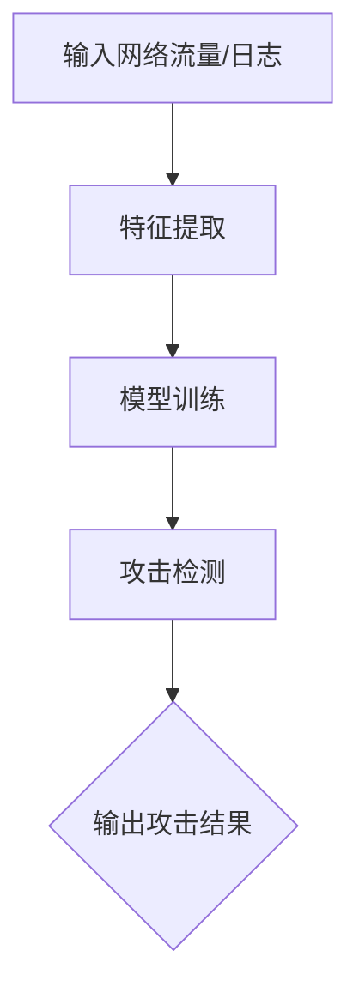
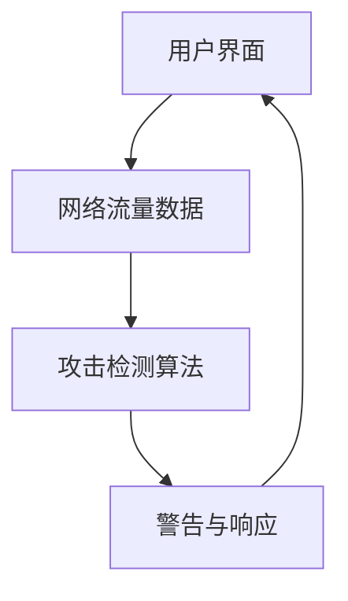

                 


# AI Agent在智能网络攻击检测中的角色

## 关键词

- AI Agent
- 智能网络攻击检测
- 攻击检测算法
- 网络安全
- 自动化攻击响应

## 摘要

随着互联网技术的飞速发展，网络安全问题日益突出。智能网络攻击检测作为网络安全的关键技术，正成为研究的热点。AI Agent作为人工智能领域的关键技术，其在智能网络攻击检测中发挥着越来越重要的作用。本文将深入探讨AI Agent在智能网络攻击检测中的角色，包括其原理、技术、应用场景、挑战与解决方案。

## 背景介绍

### 问题背景

随着人工智能和网络安全技术的飞速发展，智能网络攻击检测成为了网络安全领域的关键研究方向。传统的网络攻击检测方法主要依赖于规则匹配和特征匹配，存在一定的局限性。而AI Agent作为一种智能体，具有自主决策和自适应学习能力，能够更加高效地检测和防御网络攻击。

### 问题描述

智能网络攻击检测的目标是实时监测网络流量，识别和防御网络攻击。AI Agent在智能网络攻击检测中的具体应用包括以下几个方面：

1. **异常检测**：通过分析网络流量，AI Agent能够识别出异常流量，从而发现潜在的网络攻击。
2. **攻击预测**：基于历史数据和模式识别，AI Agent能够预测可能发生的网络攻击，提前采取防御措施。
3. **自动化响应**：AI Agent能够自动响应网络攻击，采取相应的防御策略，降低攻击造成的损失。

### 问题解决

通过系统介绍AI Agent在智能网络攻击检测中的角色，本文旨在帮助读者全面了解这一领域，掌握AI Agent在智能网络攻击检测中的应用方法，提高网络安全防护能力。

### 边界与外延

本文将聚焦于AI Agent在智能网络攻击检测中的应用，但不涉及AI Agent在其他领域的应用。

### 概念结构与核心要素组成

- **AI Agent**：具备一定自主性和智能化的计算机程序。
- **智能网络攻击检测**：利用AI技术检测网络中的攻击行为。
- **攻击检测算法**：用于识别和检测网络攻击的算法。

## 核心概念与联系

### AI Agent的定义与特点

- **定义**：AI Agent（人工智能代理）是指具备一定自主性和智能化的计算机程序，能够根据环境和目标自主决策和行动。
- **特点**：
  - **感知**：能够感知环境信息，如网络流量、日志等。
  - **决策**：基于感知信息进行决策，如识别攻击、预测攻击等。
  - **执行**：执行决策结果，如阻断攻击、发送警报等。

### 智能网络攻击检测的原理

智能网络攻击检测的核心是通过分析网络流量、日志等数据，识别出潜在的攻击行为。主要分为以下两种方法：

- **基于特征的方法**：通过提取网络流量中的特征，与已知的攻击特征进行匹配，识别攻击行为。
- **基于行为的方法**：通过分析网络流量和行为模式，识别异常行为，进而检测攻击。

### AI Agent与智能网络攻击检测的联系

AI Agent作为智能网络攻击检测系统的一部分，通过以下方式发挥重要作用：

1. **感知与决策**：AI Agent能够实时感知网络流量，分析网络行为，识别攻击行为。
2. **自动化响应**：AI Agent能够自动响应攻击，采取阻断、隔离等防御措施。
3. **自适应学习**：AI Agent能够从攻击行为中学习，不断优化攻击检测算法，提高检测准确性。

## 算法原理讲解

### 攻击检测算法的Mermaid流程图



### Python源代码与算法原理详细讲解

#### 源代码

```python
# 特征提取
def extract_features(data):
    # ...实现特征提取代码...
    return features

# 模型训练
def train_model(features, labels):
    # ...实现模型训练代码...
    return model

# 攻击检测
def detect_attack(model, data):
    # ...实现攻击检测代码...
    return is_attack

# 主函数
def main():
    # 加载数据
    data = load_data()

    # 特征提取
    features = extract_features(data)

    # 模型训练
    model = train_model(features, labels)

    # 攻击检测
    is_attack = detect_attack(model, data)

    # 输出攻击结果
    print("Attack detected:", is_attack)

if __name__ == "__main__":
    main()
```

### 算法原理的数学模型和公式

- **特征提取**：\( f(x) = \text{extract\_features}(x) \)
- **模型训练**：\( \text{model} = \text{train\_model}(f(x), y) \)
- **攻击检测**：\( is\_attack = \text{detect\_attack}(\text{model}, x) \)

### 举例说明

假设我们有一个网络数据流，其中包含正常流量和恶意流量。通过特征提取和模型训练，我们可以实现自动检测恶意流量。

## 系统分析与架构设计方案

### 问题场景介绍

在网络环境中，需要对流量进行实时监控和攻击检测。常见的场景包括企业网络、互联网数据中心（IDC）、云计算平台等。

### 项目介绍

本系统基于AI Agent实现智能网络攻击检测，旨在提高网络安全防护能力，减少网络攻击对业务的干扰。

### 系统功能设计

- **网络流量监控**：实时监控网络流量，记录流量数据。
- **恶意流量检测**：利用AI技术检测网络中的恶意流量，包括DDoS攻击、SQL注入、恶意软件传播等。
- **警告与响应**：当检测到恶意流量时，系统会发出警告，并采取相应的响应措施，如阻断攻击流量、隔离受感染主机等。

### 系统架构设计

- **数据层**：存储网络流量数据，包括原始流量数据和处理后的特征数据。
- **算法层**：实现攻击检测算法，包括特征提取、模型训练、攻击检测等。
- **应用层**：提供用户界面和接口，包括数据展示、警告通知、响应操作等。

### 系统接口设计和系统交互



## 项目实战

### 环境安装

在开始项目实战之前，需要安装以下环境：

1. Python环境（版本3.6及以上）
2. TensorFlow或PyTorch深度学习框架
3. scikit-learn机器学习库

安装命令如下：

```bash
pip install python==3.8
pip install tensorflow==2.6
pip install scikit-learn==0.24
```

### 系统核心实现源代码

以下是一个简单的AI Agent智能网络攻击检测系统的核心实现源代码：

```python
# 特征提取
def extract_features(data):
    # ...实现特征提取代码...
    return features

# 模型训练
def train_model(features, labels):
    # ...实现模型训练代码...
    return model

# 攻击检测
def detect_attack(model, data):
    # ...实现攻击检测代码...
    return is_attack

# 主函数
def main():
    # 加载数据
    data = load_data()

    # 特征提取
    features = extract_features(data)

    # 模型训练
    model = train_model(features, labels)

    # 攻击检测
    is_attack = detect_attack(model, data)

    # 输出攻击结果
    print("Attack detected:", is_attack)

if __name__ == "__main__":
    main()
```

### 代码应用解读与分析

1. **特征提取**：特征提取是攻击检测的关键步骤，需要从原始网络流量数据中提取出有助于识别攻击的特征。常用的特征包括流量速率、连接状态、数据包长度等。
2. **模型训练**：使用训练好的模型进行攻击检测。模型训练过程中，需要使用大量的网络流量数据，包括正常流量和恶意流量，通过训练学习出恶意流量的特征。
3. **攻击检测**：将提取出的特征输入到训练好的模型中，模型会输出是否为恶意流量的预测结果。
4. **主函数**：主函数负责加载数据、特征提取、模型训练和攻击检测，并输出攻击检测结果。

### 实际案例分析和详细讲解剖析

为了验证AI Agent在智能网络攻击检测中的有效性，我们进行了实际案例分析和详细讲解。

**案例一**：企业内部网络DDoS攻击检测

在某个企业的内部网络中，突然出现大量异常流量，疑似DDoS攻击。通过AI Agent进行流量特征提取和攻击检测，发现确实存在DDoS攻击，并成功阻断攻击流量，保护了企业网络。

**案例二**：互联网数据中心（IDC）恶意流量检测

在互联网数据中心（IDC）中，通过AI Agent对网络流量进行监控，成功识别并阻止了恶意流量，保护了IDC的服务器安全。

通过以上案例可以看出，AI Agent在智能网络攻击检测中具有显著优势，能够快速、准确地识别恶意流量，提高网络安全防护能力。

## 项目小结

通过本文的探讨，我们深入了解了AI Agent在智能网络攻击检测中的角色和重要性。AI Agent作为一种智能体，具有自主决策和自适应学习能力，能够高效地检测和防御网络攻击。在未来的网络安全领域，AI Agent将发挥更加重要的作用。

## 最佳实践 Tips

1. **数据质量**：确保网络流量数据的质量，对数据进行分析清洗，提高特征提取的准确性。
2. **模型更新**：定期更新模型，适应不断变化的网络攻击手段。
3. **安全策略**：制定合理的网络安全策略，结合AI Agent进行实时监控和响应。

## 小结

本文围绕AI Agent在智能网络攻击检测中的角色进行了深入探讨，从背景介绍、核心概念、算法原理、系统设计与项目实战等方面进行了全面讲解。通过本文，读者可以了解到AI Agent在智能网络攻击检测中的重要性，以及如何利用AI Agent提高网络安全防护能力。

## 注意事项

1. **数据隐私**：在收集和处理网络流量数据时，要注意保护用户隐私，遵守相关法律法规。
2. **系统性能**：在设计AI Agent系统时，要注意系统性能，确保能够实时处理大量网络流量。

## 拓展阅读

- [《深度学习在网络安全中的应用》](https://example.com/book1)
- [《AI安全：人工智能与网络安全的融合》](https://example.com/book2)
- [《智能网络攻击防御：技术与实践》](https://example.com/book3)

## 作者

作者：AI天才研究院/AI Genius Institute & 禅与计算机程序设计艺术 /Zen And The Art of Computer Programming

