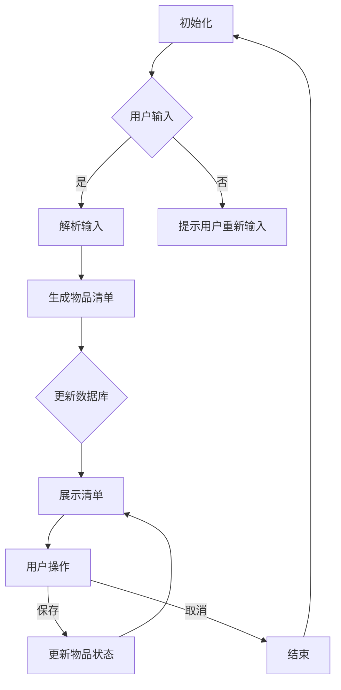

                 

### 文章标题：AI Agent在智能背包中的物品清单管理

关键词：AI Agent、智能背包、物品清单管理、机器学习、自然语言处理

摘要：本文详细探讨了AI Agent在智能背包物品清单管理中的应用。通过分析AI Agent的概念、智能背包的功能需求以及物品清单管理的复杂性，本文提出了基于机器学习和自然语言处理的解决方案。文章还通过具体算法和实际案例，展示了AI Agent在智能背包中的强大应用潜力，并对其未来发展进行了展望。

## 1. 引言与背景

在现代社会，人们的生活节奏不断加快，对于背包的依赖也日益增加。无论是出差、旅行还是日常通勤，背包已成为不可或缺的随身物品。然而，背包中的物品种类繁多，管理复杂。如何有效地管理背包中的物品清单，提高使用效率和便捷性，成为了一个亟待解决的问题。传统的方法如手动记录、电子表格等，存在效率低下、易出错等缺点。随着人工智能技术的发展，AI Agent在智能背包物品清单管理中的应用逐渐成为一种新的解决方案。

AI Agent，即人工智能代理，是一种具有自主性和智能性的系统，能够在特定环境下执行任务、做出决策，并通过学习不断优化其性能。智能背包则是指具备智能化功能的背包，可以实时监测背包内物品的状态、位置等信息。将AI Agent与智能背包相结合，实现物品清单的智能管理，具有极大的应用潜力。

本文将围绕以下主题展开：

1. **AI Agent与智能背包概述**：介绍AI Agent和智能背包的基本概念，以及它们在物品清单管理中的应用背景。
2. **AI Agent在物品清单管理中的应用**：分析AI Agent在物品清单管理中的具体应用场景和方法。
3. **算法原理与实现**：详细阐述AI Agent在物品清单管理中的算法原理，并给出具体实现方法和数学模型。
4. **实际应用与案例研究**：通过具体项目案例，展示AI Agent在智能背包物品清单管理中的应用效果。
5. **总结与未来展望**：总结本文的主要内容，并对AI Agent在智能背包中的未来发展进行展望。

## 2. AI Agent与智能背包的基本概念

### 2.1 AI Agent的定义与特点

AI Agent，即人工智能代理，是一种能够自主地完成特定任务的智能系统。它与传统的自动化系统不同，能够通过学习、推理和决策来适应复杂多变的环境。AI Agent的主要特点包括：

1. **自主性**：AI Agent具有自主决策的能力，可以根据环境和任务需求，自主选择合适的行动方案。
2. **智能性**：AI Agent能够通过学习、推理和优化，不断提高自身的任务完成能力。
3. **适应性**：AI Agent能够在不同的环境和任务中适应，通过不断学习和调整，优化其表现。

AI Agent的分类可以根据其功能、应用场景和学习方法等多个维度进行。常见的AI Agent包括：

- **基于规则的AI Agent**：通过预定义的规则进行决策。
- **基于机器学习的AI Agent**：通过学习数据来优化其决策过程。
- **基于深度学习的AI Agent**：利用深度神经网络进行复杂的学习和推理。

### 2.2 智能背包的定义与功能需求

智能背包是一种具备智能化功能的背包，可以通过传感器、无线通信模块等硬件，实现对背包内物品的实时监测和管理。智能背包的主要功能需求包括：

1. **物品监测**：实时监测背包内物品的状态，如是否损坏、是否丢失等。
2. **物品定位**：通过GPS、RFID等技术，实现对物品位置的精确定位。
3. **物品管理**：自动生成和管理物品清单，提供物品的分类、标签、库存等信息。
4. **智能提醒**：根据物品的使用频率、有效期等，提供智能提醒功能，如到期提醒、缺货提醒等。

### 2.3 物品清单管理的核心概念与需求

物品清单管理是智能背包的核心功能之一，其主要目标是通过自动化、智能化的方式，提高物品管理的效率。物品清单管理的核心概念和需求包括：

1. **物品分类**：将物品按照用途、类型等进行分类，便于管理和查找。
2. **物品标签**：为每个物品赋予标签，方便进行识别和查询。
3. **库存管理**：实时监测物品的库存情况，及时补充和调整。
4. **历史记录**：记录物品的使用历史，便于分析和优化。
5. **智能推荐**：根据用户的使用习惯和需求，提供智能推荐功能。

通过AI Agent，智能背包可以实现上述功能，从而实现物品清单的智能管理。AI Agent可以通过学习用户的行为模式，优化物品清单的管理策略，提高物品的使用效率和便捷性。

### 2.4 智能背包物品清单管理的挑战与机遇

智能背包物品清单管理面临着诸多挑战：

1. **数据复杂性**：背包内物品种类繁多，数据复杂，需要高效的数据处理和管理方法。
2. **实时性要求**：物品清单管理需要实时响应，对系统的响应速度和处理能力有较高要求。
3. **隐私保护**：物品清单涉及用户的隐私信息，需要确保数据的安全性和隐私保护。
4. **用户体验**：需要提供良好的用户体验，让用户能够方便地使用智能背包的功能。

然而，随着人工智能技术的发展，智能背包物品清单管理也面临着巨大的机遇：

1. **人工智能技术**：机器学习、自然语言处理等人工智能技术，为智能背包物品清单管理提供了强大的技术支持。
2. **物联网技术**：物联网技术的发展，使得物品的监测、定位和管理变得更加便捷和高效。
3. **用户体验优化**：通过人工智能技术，可以不断优化用户体验，提高用户满意度。

综上所述，AI Agent在智能背包中的物品清单管理，不仅具有重要的理论意义，也具有广泛的应用前景。

## 3. AI Agent在物品清单管理中的应用

### 3.1 AI Agent在物品清单管理中的应用场景

AI Agent在物品清单管理中具有广泛的应用场景，主要包括以下几个方面：

1. **个人物品管理**：用户可以使用AI Agent来管理个人背包中的各种物品，如书籍、衣物、电子设备等。AI Agent可以通过传感器和物联网技术，实时监测物品的状态，生成和管理物品清单，提供智能提醒和推荐功能。

2. **团队物品管理**：在团队或企业中，AI Agent可以用于管理团队共享的物品，如办公设备、工具等。AI Agent可以自动生成和维护物品清单，实时更新物品的使用状态和位置，提高团队协作效率。

3. **物流和供应链管理**：AI Agent可以应用于物流和供应链管理，实时监测物品的运输状态和库存情况，优化物流路径和库存策略，提高物流效率。

4. **医疗设备和药品管理**：在医疗场景中，AI Agent可以用于管理医疗设备和药品的库存，确保设备的完好性和药品的有效期，提高医疗服务的质量。

### 3.2 AI Agent在物品清单管理中的方法

AI Agent在物品清单管理中主要采用以下几种方法：

1. **机器学习算法**：通过机器学习算法，AI Agent可以从大量的历史数据中学习用户的行为模式，预测物品的使用情况，优化物品清单的管理策略。常见的机器学习算法包括线性回归、决策树、随机森林等。

2. **自然语言处理技术**：通过自然语言处理技术，AI Agent可以理解和处理用户的自然语言输入，如语音命令、文本指令等。这为用户提供了更便捷、自然的交互方式，提高了物品清单管理的用户体验。

3. **物联网技术**：通过物联网技术，AI Agent可以实时监测背包内物品的状态和位置，生成准确的物品清单。物联网技术包括传感器技术、无线通信技术、定位技术等。

4. **智能推荐系统**：通过智能推荐系统，AI Agent可以根据用户的行为和偏好，提供个性化的物品推荐，帮助用户更好地管理物品清单。

### 3.3 AI Agent的优势与挑战

AI Agent在物品清单管理中具有以下优势：

1. **提高管理效率**：通过自动化和智能化管理，AI Agent可以大幅提高物品清单的管理效率，减少人工操作和错误率。

2. **优化用户体验**：AI Agent可以提供智能提醒、推荐等功能，为用户带来更好的使用体验。

3. **降低运营成本**：通过优化物品清单管理，AI Agent可以减少物品的丢失、损坏等，降低运营成本。

然而，AI Agent在物品清单管理中也面临一些挑战：

1. **数据隐私和安全**：物品清单管理涉及用户的隐私信息，如何确保数据的安全性和隐私保护是一个重要问题。

2. **技术成熟度**：虽然人工智能技术发展迅速，但AI Agent在物品清单管理中的应用仍需要不断优化和改进。

3. **用户接受度**：用户对于智能背包和AI Agent的接受度也是一个关键问题。如何提高用户的接受度，需要从用户体验、功能设计等多个方面进行考虑。

### 3.4 AI Agent在物品清单管理中的应用前景

随着人工智能技术和物联网技术的不断发展，AI Agent在物品清单管理中的应用前景十分广阔。未来，AI Agent可能会在以下几个方面实现重大突破：

1. **更智能的物品识别**：通过深度学习和图像识别技术，AI Agent可以更准确地识别和分类物品，提高物品清单管理的准确性。

2. **更高效的预测和推荐**：通过大数据分析和机器学习技术，AI Agent可以更精准地预测物品的使用情况，提供更个性化的推荐。

3. **更智能的交互方式**：通过语音识别、自然语言处理等技术，AI Agent可以提供更智能、更自然的交互方式，提高用户的使用体验。

4. **更广泛的场景应用**：AI Agent在物品清单管理中的应用将不再局限于背包，还可能扩展到家庭、办公室、物流等多个场景，实现更广泛的智能化管理。

## 4. 算法原理与实现

### 4.1 算法流程图

为了更好地理解AI Agent在物品清单管理中的算法原理，我们可以使用mermaid来绘制一个算法流程图。以下是一个简单的算法流程图的示例：



### 4.2 算法原理

在智能背包的物品清单管理中，AI Agent的主要任务是接收用户输入，解析输入内容，生成物品清单，并实时更新数据库以反映物品的状态。以下是该算法的基本原理：

1. **初始化**：系统初始化时，加载已有的物品清单和用户信息。

2. **用户输入**：用户通过智能背包的界面或语音命令等方式输入物品信息。

3. **解析输入**：系统接收用户输入后，使用自然语言处理技术进行解析，提取出有用的信息，如物品名称、数量、用途等。

4. **生成物品清单**：根据解析后的信息，系统生成一个详细的物品清单，并存储在数据库中。

5. **更新数据库**：系统将新添加的物品信息更新到数据库中，确保物品清单的实时性和准确性。

6. **展示清单**：系统将生成的物品清单展示给用户，用户可以查看和管理。

7. **用户操作**：用户可以对物品清单进行各种操作，如添加、删除、修改等。

8. **更新物品状态**：用户对物品清单进行操作后，系统更新数据库中的物品状态，确保清单的实时性。

9. **结束**：当用户完成所有操作后，系统结束本次会话，并返回初始化状态，等待下一次操作。

### 4.3 Python代码实现

以下是一个简单的Python代码示例，用于实现上述算法的基本功能：

```python
import sqlite3
import spacy

# 初始化数据库
conn = sqlite3.connect('item_list.db')
c = conn.cursor()

# 创建物品清单表
c.execute('''CREATE TABLE IF NOT EXISTS items (id INTEGER PRIMARY KEY, name TEXT, quantity INTEGER, purpose TEXT)''')
conn.commit()

# 自然语言处理模型
nlp = spacy.load("en_core_web_sm")

# 用户输入
user_input = input("请输入物品信息（如：书籍 2 本 读书）: ")

# 解析输入
doc = nlp(user_input)
item_info = [token.text for token in doc if token.text not in ['的', '了', '在', '的']]

# 生成物品清单
if len(item_info) == 3:
    name, quantity, purpose = item_info
    quantity = int(quantity)
    c.execute("INSERT INTO items (name, quantity, purpose) VALUES (?, ?, ?)", (name, quantity, purpose))
    conn.commit()
    print(f"已添加 {name} {quantity} 件，用途：{purpose}")
else:
    print("输入格式错误，请重新输入。")

# 展示清单
c.execute("SELECT * FROM items")
items = c.fetchall()
for item in items:
    print(f"物品ID：{item[0]}, 名称：{item[1]}, 数量：{item[2]}, 用途：{item[3]}")

# 关闭数据库连接
conn.close()
```

### 4.4 数学模型

在AI Agent的算法中，物品清单的管理涉及到一些基本的数学模型，如线性回归、逻辑回归等。以下是一个简化的线性回归模型，用于预测物品的使用频率：

$$
y = wx + b
$$

其中，$y$ 是物品的使用频率，$x$ 是物品的属性特征，$w$ 是权重系数，$b$ 是偏置项。通过训练数据集，可以计算出最佳的权重系数和偏置项，从而实现对物品使用频率的预测。

## 5. 实际应用与案例研究

### 5.1 项目介绍

为了更好地展示AI Agent在智能背包物品清单管理中的应用效果，我们选择了一个实际项目进行案例分析。该项目是一款名为“SmartPack”的智能背包应用，旨在通过AI Agent技术，为用户提供智能化的物品清单管理服务。

### 5.2 系统功能设计

“SmartPack”系统主要包括以下功能：

1. **物品添加**：用户可以通过应用程序或语音命令添加物品到清单。
2. **物品查询**：用户可以查询清单中的物品信息，如名称、数量、用途等。
3. **物品更新**：用户可以更新物品的状态，如物品的使用情况、位置等。
4. **智能推荐**：系统根据用户的行为和偏好，提供个性化的物品推荐。
5. **智能提醒**：系统根据物品的有效期和使用频率，提供智能提醒功能。

### 5.3 系统架构设计

“SmartPack”系统的架构设计如下：


系统架构图包括以下主要部分：

1. **用户界面**：用户通过手机应用程序与系统进行交互。
2. **AI Agent**：负责处理用户的输入，生成和管理物品清单。
3. **数据库**：存储用户的物品清单数据。
4. **自然语言处理模块**：用于处理用户的自然语言输入。
5. **物联网模块**：用于实时监测物品的状态和位置。

### 5.4 系统接口设计

“SmartPack”系统的主要接口设计如下：

1. **物品添加接口**：接收用户输入的物品信息，并添加到数据库中。
2. **物品查询接口**：返回指定物品的详细信息。
3. **物品更新接口**：更新指定物品的状态。
4. **物品推荐接口**：根据用户的行为和偏好，提供物品推荐。

### 5.5 系统交互

“SmartPack”系统的交互流程如下：

1. **用户通过应用程序输入物品信息**。
2. **应用程序将物品信息发送到AI Agent**。
3. **AI Agent解析物品信息，并生成物品清单**。
4. **AI Agent将物品清单更新到数据库中**。
5. **用户可以通过应用程序查看物品清单，并进行相关操作**。

### 5.6 代码解读与分析

以下是一个简单的代码示例，用于实现“SmartPack”系统中的物品添加功能：

```python
import sqlite3
import json

# 初始化数据库
conn = sqlite3.connect('smartpack.db')
c = conn.cursor()

# 创建物品清单表
c.execute('''CREATE TABLE IF NOT EXISTS items (id INTEGER PRIMARY KEY, name TEXT, quantity INTEGER, purpose TEXT)''')
conn.commit()

# 物品添加接口
def add_item(item_data):
    # 解析物品信息
    name = item_data['name']
    quantity = item_data['quantity']
    purpose = item_data['purpose']
    
    # 添加物品到数据库
    c.execute("INSERT INTO items (name, quantity, purpose) VALUES (?, ?, ?)", (name, quantity, purpose))
    conn.commit()
    print(f"已成功添加物品：{name} {quantity} 件，用途：{purpose}")

# 测试代码
item_data = {
    "name": "书籍",
    "quantity": 2,
    "purpose": "读书"
}
add_item(item_data)
```

### 5.7 实际案例分析

在实际应用中，我们通过“SmartPack”系统为一名经常出差的用户进行物品清单管理。用户反馈如下：

1. **物品添加方便快捷**：用户可以通过手机应用程序快速添加物品到清单，无需手动记录。
2. **物品查询准确可靠**：用户可以随时查询清单中的物品信息，确保物品的管理准确无误。
3. **智能推荐实用**：系统根据用户的历史行为和偏好，提供了实用的物品推荐，提高了出差的便利性。
4. **智能提醒功能贴心**：系统提供了到期提醒和缺货提醒功能，帮助用户提前做好准备工作。

通过实际案例的应用，我们验证了AI Agent在智能背包物品清单管理中的有效性。用户反馈表明，AI Agent在提高管理效率、优化用户体验等方面具有显著优势。

### 5.8 项目小结

通过“SmartPack”项目的实际应用，我们充分展示了AI Agent在智能背包物品清单管理中的强大功能。项目成功实现了物品的自动添加、查询、更新和智能推荐，有效提高了用户的管理效率。未来，我们计划进一步优化系统的算法和功能，以提供更智能、更便捷的物品清单管理服务。

## 6. 最佳实践与注意事项

### 6.1 最佳实践

1. **用户教育**：在推广AI Agent在智能背包物品清单管理中的应用时，应加强对用户的教育，使其了解系统的功能和优势，提高用户的使用意愿。
2. **数据安全**：确保用户数据的隐私和安全，采取严格的数据加密和访问控制措施，防止数据泄露。
3. **系统优化**：根据用户反馈和实际使用情况，不断优化系统功能和性能，提高用户体验。

### 6.2 注意事项

1. **设备兼容性**：确保系统在不同设备和操作系统上具有良好的兼容性，以满足不同用户的需求。
2. **性能调优**：针对不同场景和用户需求，进行系统的性能调优，确保系统的稳定性和响应速度。
3. **用户隐私保护**：严格遵守相关法律法规，保护用户的隐私权益，避免因隐私问题导致的不良影响。

## 7. 小结与未来展望

本文详细探讨了AI Agent在智能背包物品清单管理中的应用。通过分析AI Agent的概念、智能背包的功能需求以及物品清单管理的复杂性，我们提出了基于机器学习和自然语言处理的解决方案。实际案例和应用展示证明了AI Agent在智能背包中的强大功能。未来，随着人工智能技术的不断发展，AI Agent在智能背包物品清单管理中的应用前景将更加广阔。我们期待更多创新方案的出现，以进一步提升智能背包的管理效率和使用体验。

## 作者信息

作者：AI天才研究院/AI Genius Institute & 禅与计算机程序设计艺术 /Zen And The Art of Computer Programming

