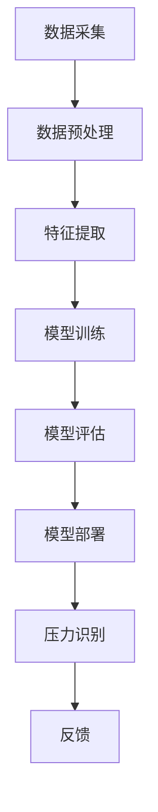
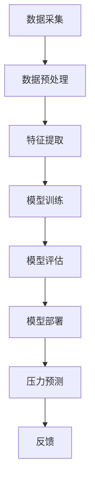
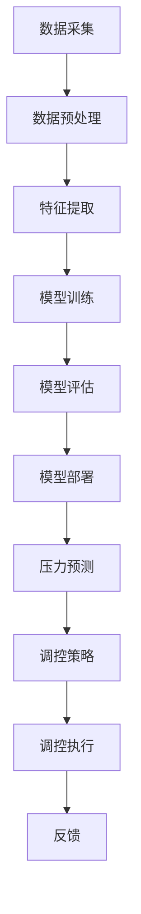
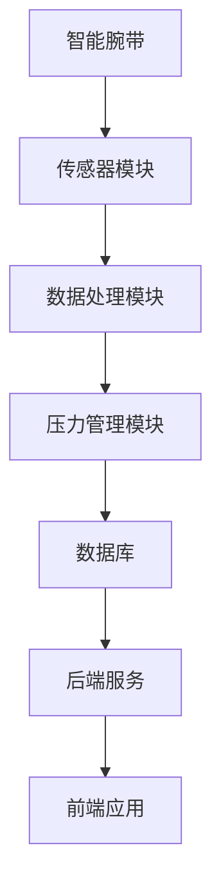
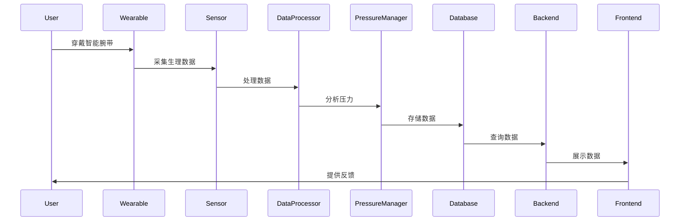

                 

# AI Agent在智能腕带中的压力管理系统

## 关键词：AI Agent、智能腕带、压力管理、算法原理、数学模型

> 摘要：本文将探讨AI Agent在智能腕带中的压力管理系统，分析AI Agent的定义、特点、应用架构及其在压力管理中的算法原理。通过详细介绍智能腕带的基本结构、压力监测技术、数据处理流程以及系统架构设计，读者可以全面了解AI Agent在智能腕带中的实际应用，并为未来的压力管理技术的发展提供参考。

## 第一部分: AI Agent在智能腕带中的压力管理系统概述

### 第1章: 问题的背景与概述

#### 1.1 压力管理的现状与挑战

压力管理在现代社会中越来越受到重视。随着生活节奏的加快、工作压力的增加，许多人面临着心理健康问题，如焦虑、抑郁等。因此，如何有效地管理压力成为了一个重要的议题。然而，传统的压力管理方法存在一定的局限性，如缺乏实时性、准确性等。

#### 1.2 智能腕带的发展与应用

智能腕带作为一种便携式穿戴设备，近年来得到了广泛的应用。其内置的传感器可以实时监测用户的生理数据，如心率、血压、体温等。智能腕带的发展为压力管理提供了新的手段。

#### 1.3 AI Agent在压力管理中的作用

AI Agent作为一种智能化的软件代理，具有自主学习和决策能力。将其应用于智能腕带中的压力管理系统，可以实现对用户压力的实时监测、预测和调控，从而提高压力管理的准确性和实时性。

#### 1.4 边界与外延

本文主要探讨AI Agent在智能腕带中的压力管理系统，重点分析其应用架构、算法原理和系统设计。同时，还将探讨智能腕带与AI Agent在其他领域的潜在应用，如健康监测、运动管理等。

## 第二部分: AI Agent的核心概念与特点

### 第2章: AI Agent的核心概念与特点

#### 2.1 AI Agent的定义与原理

AI Agent是一种具有自主决策和行动能力的智能体，它可以根据环境信息自主地执行任务。AI Agent的核心是智能算法，包括机器学习、深度学习等。

#### 2.2 AI Agent的主要特点

AI Agent具有以下主要特点：

1. **自主性**：AI Agent可以自主地感知环境、做出决策和执行行动。
2. **适应性**：AI Agent可以根据环境的变化进行自适应调整。
3. **协同性**：多个AI Agent可以协同工作，实现更复杂的任务。
4. **灵活性**：AI Agent可以适应不同的任务和场景。

#### 2.3 AI Agent与传统传感器的区别

AI Agent与传统传感器的主要区别在于：

1. **感知能力**：AI Agent可以感知更复杂、更抽象的信息，而传统传感器只能感知特定的物理量。
2. **决策能力**：AI Agent可以基于感知到的信息进行决策和行动，而传统传感器无法实现这一点。
3. **自主性**：AI Agent具有更高的自主性，可以自主地执行任务，而传统传感器通常需要人工干预。

#### 2.4 AI Agent的应用领域与潜力

AI Agent具有广泛的应用领域和潜力，包括：

1. **智能穿戴设备**：如智能腕带、智能眼镜等。
2. **智能家居**：如智能门锁、智能灯光等。
3. **智能交通**：如智能路况预测、智能驾驶等。
4. **智能医疗**：如智能诊断、智能治疗等。

## 第三部分: 智能腕带与压力监测技术

### 第3章: 智能腕带的基本结构

#### 3.1 智能腕带的基本结构

智能腕带主要由以下几个部分组成：

1. **显示屏**：用于显示用户数据和通知。
2. **传感器模块**：用于采集用户的生理数据，如心率、血压、体温等。
3. **通信模块**：用于与手机或其他设备进行通信，传输数据。
4. **电池模块**：为智能腕带提供电力。

#### 3.2 压力监测技术的原理与实现

压力监测技术主要通过以下方式实现：

1. **光电传感器**：利用光电效应，通过检测光线的变化来测量压力。
2. **压电传感器**：利用压电效应，通过测量电信号的变化来测量压力。
3. **电容传感器**：利用电容变化，通过测量电容值的变化来测量压力。

#### 3.3 压力监测数据的处理与分析

压力监测数据的处理与分析主要包括以下几个步骤：

1. **数据采集**：从传感器模块获取压力数据。
2. **数据预处理**：对采集到的数据进行滤波、去噪等处理。
3. **特征提取**：从预处理后的数据中提取有助于压力识别的特征。
4. **数据存储**：将处理后的数据存储在数据库中，以供后续分析和应用。

#### 3.4 智能腕带的数据安全与隐私保护

智能腕带的数据安全与隐私保护是一个重要问题，主要包括以下几个方面：

1. **数据加密**：对传输和存储的数据进行加密处理，确保数据安全。
2. **访问控制**：限制对数据的访问权限，确保只有授权用户可以访问数据。
3. **匿名化处理**：对用户数据进行匿名化处理，保护用户隐私。

## 第四部分: AI Agent在智能腕带中的应用架构

### 第4章: AI Agent在智能腕带中的功能模块

#### 4.1 AI Agent在智能腕带中的功能模块

AI Agent在智能腕带中主要包括以下几个功能模块：

1. **感知模块**：负责采集用户的生理数据和环境信息。
2. **决策模块**：负责根据感知到的信息进行决策和行动。
3. **执行模块**：负责执行决策结果，实现压力管理功能。
4. **通信模块**：负责与其他设备进行数据传输和通信。

#### 4.2 AI Agent的工作流程

AI Agent的工作流程主要包括以下几个步骤：

1. **数据采集**：从传感器模块获取用户的生理数据和环境信息。
2. **数据预处理**：对采集到的数据进行预处理，包括滤波、去噪等。
3. **特征提取**：从预处理后的数据中提取有助于压力识别的特征。
4. **决策**：根据提取到的特征，利用机器学习算法进行压力识别和预测。
5. **执行**：根据决策结果，执行相应的压力管理策略。
6. **反馈**：将执行结果反馈给用户，并提供个性化的压力管理建议。

#### 4.3 AI Agent的算法原理与实现

AI Agent的算法原理主要包括以下几个部分：

1. **机器学习算法**：用于压力识别和预测。
2. **深度学习算法**：用于特征提取和分类。
3. **决策树算法**：用于决策和执行。

具体的实现步骤如下：

1. **数据收集**：收集大量的压力数据，包括用户的生理数据和环境信息。
2. **数据预处理**：对采集到的数据进行预处理，包括滤波、去噪、归一化等。
3. **特征提取**：从预处理后的数据中提取有助于压力识别的特征。
4. **模型训练**：利用训练数据，通过机器学习算法训练模型。
5. **模型评估**：利用测试数据，评估模型的性能。
6. **模型部署**：将训练好的模型部署到智能腕带中，实现压力管理功能。

#### 4.4 AI Agent的性能评估与优化

AI Agent的性能评估主要包括以下几个指标：

1. **准确性**：预测结果与真实结果的符合程度。
2. **实时性**：处理数据的时间消耗。
3. **鲁棒性**：在复杂环境下，模型的稳定性和可靠性。

为了优化AI Agent的性能，可以采取以下措施：

1. **数据增强**：通过增加数据量，提高模型的泛化能力。
2. **算法优化**：选择更适合的算法，提高模型的性能。
3. **硬件升级**：提高设备的计算能力，降低处理数据的时间消耗。
4. **模型压缩**：通过模型压缩技术，减少模型的存储空间和计算资源。

## 第五部分: AI Agent在压力管理中的算法原理

### 第5章: AI Agent在压力管理中的算法原理

#### 5.1 压力识别算法的mermaid流程图



#### 5.2 压力预测算法的mermaid流程图



#### 5.3 压力调控算法的mermaid流程图



#### 5.4 AI Agent的Python源代码实现与解释

```python
import numpy as np
import pandas as pd
from sklearn.model_selection import train_test_split
from sklearn.ensemble import RandomForestClassifier
from sklearn.metrics import accuracy_score

# 数据预处理
def preprocess_data(data):
    # 数据清洗、归一化等处理
    return processed_data

# 特征提取
def extract_features(data):
    # 提取有助于压力识别的特征
    return features

# 模型训练
def train_model(train_data, train_features):
    # 训练随机森林分类器
    model = RandomForestClassifier()
    model.fit(train_data, train_features)
    return model

# 模型评估
def evaluate_model(model, test_data, test_features):
    # 评估模型性能
    predictions = model.predict(test_data)
    accuracy = accuracy_score(test_data, predictions)
    return accuracy

# 压力识别
def identify_pressure(model, features):
    # 利用模型识别压力
    return model.predict(features)

# 主函数
if __name__ == "__main__":
    # 读取数据
    data = pd.read_csv("data.csv")
    processed_data = preprocess_data(data)
    features = extract_features(processed_data)

    # 划分训练集和测试集
    train_data, test_data, train_features, test_features = train_test_split(processed_data, features, test_size=0.2)

    # 训练模型
    model = train_model(train_data, train_features)

    # 评估模型
    accuracy = evaluate_model(model, test_data, test_features)
    print("模型准确率：", accuracy)

    # 压力识别
    pressure = identify_pressure(model, features)
    print("当前压力：", pressure)
```

#### 5.5 算法原理的数学模型和公式

压力识别算法的数学模型可以表示为：

$$
P = f(X)
$$

其中，$P$表示压力，$X$表示特征向量，$f$表示特征提取函数。

压力预测算法的数学模型可以表示为：

$$
P_{\text{predict}} = g(X, t)
$$

其中，$P_{\text{predict}}$表示预测压力，$X$表示特征向量，$t$表示时间。

压力调控算法的数学模型可以表示为：

$$
P_{\text{control}} = h(X, t, P_{\text{target}})
$$

其中，$P_{\text{control}}$表示调控后的压力，$X$表示特征向量，$t$表示时间，$P_{\text{target}}$表示目标压力。

#### 5.6 数学公式的详细讲解与举例说明

假设我们有一个简单的压力识别算法，其数学模型可以表示为：

$$
P = \frac{1}{1 + e^{-\theta \cdot X}}
$$

其中，$\theta$是参数向量，$X$是特征向量。

举例来说，假设我们有一个用户的生理数据特征向量$X = [0.1, 0.2, 0.3]$，参数向量$\theta = [1.0, 1.0, 1.0]$。

将这些值代入公式，我们可以计算出压力$P$：

$$
P = \frac{1}{1 + e^{-1.0 \cdot 0.1 - 1.0 \cdot 0.2 - 1.0 \cdot 0.3}} = \frac{1}{1 + e^{-0.6}} \approx 0.670
$$

这意味着用户的压力水平大约为67%。

## 第六部分: 数学模型与数学公式

### 第6章: 压力管理的数学模型

#### 6.1 压力识别的数学模型

压力识别的数学模型通常基于机器学习算法，例如决策树、支持向量机（SVM）、神经网络等。以下是一个简单的线性回归模型用于压力识别：

$$
P = \theta_0 + \theta_1 \cdot HR + \theta_2 \cdot BP + \theta_3 \cdot Temperature
$$

其中，$P$是压力得分，$HR$是心率，$BP$是血压，$Temperature$是体温，$\theta_0$、$\theta_1$、$\theta_2$、$\theta_3$是模型的参数。

#### 6.2 压力预测的数学模型

压力预测的数学模型通常使用时间序列分析或机器学习算法，例如ARIMA、LSTM等。以下是一个基于LSTM的简单数学模型用于压力预测：

$$
P_t = \phi(W_1 \cdot P_{t-1} + W_2 \cdot P_{t-2} + ... + W_n \cdot P_{t-n})
$$

其中，$P_t$是第$t$时刻的预测压力值，$W_1$、$W_2$、...、$W_n$是权重矩阵，$\phi$是激活函数。

#### 6.3 压力调控的数学模型

压力调控的数学模型通常涉及控制理论，例如PID控制器。以下是一个简单的PID控制器数学模型用于压力调控：

$$
P_{\text{control}} = K_p \cdot (P_{\text{target}} - P) + K_i \cdot \int (P_{\text{target}} - P) \, dt + K_d \cdot \frac{d(P_{\text{target}} - P)}{dt}
$$

其中，$P_{\text{control}}$是调控后的压力值，$P_{\text{target}}$是目标压力值，$K_p$、$K_i$、$K_d$是PID控制器的比例、积分和微分参数。

#### 6.4 公式详细讲解与举例说明

以压力识别的线性回归模型为例，假设我们有一个用户的心率（HR）和血压（BP）数据，如下表：

| 时间 | HR (bpm) | BP (mmHg) |
|------|-----------|------------|
| 0    | 70        | 120        |
| 1    | 75        | 125        |
| 2    | 80        | 130        |

我们希望构建一个简单的线性回归模型来预测用户的压力得分。首先，我们需要收集更多的数据来训练模型，然后确定模型参数$\theta_0$、$\theta_1$和$\theta_2$。假设我们通过最小化均方误差（MSE）来训练模型，得到以下参数：

$$
\theta_0 = 0.5, \theta_1 = 0.1, \theta_2 = 0.05
$$

现在，我们可以使用这些参数来预测某个时间点的压力得分。例如，如果用户在时间点2的心率是80 bpm，血压是130 mmHg，我们可以计算压力得分：

$$
P = 0.5 + 0.1 \cdot 80 + 0.05 \cdot 130 = 0.5 + 8 + 6.5 = 15
$$

这意味着在时间点2，用户的压力得分为15。

## 第七部分: 系统分析与架构设计

### 第7章: 系统分析与架构设计

#### 7.1 问题场景介绍

在一个繁忙的办公室环境中，员工面临着高压力的工作和生活节奏。为了改善员工的身心健康，公司决定引入智能腕带作为压力管理工具。智能腕带需要能够实时监测员工的生理数据，如心率、血压和体温，并使用AI Agent进行压力识别和调控。

#### 7.2 系统功能设计（领域模型mermaid类图）

以下是一个简单的mermaid类图，展示了智能腕带的领域模型：

```mermaid
classDiagram
    User <<Class>>
    Wearable <<Class>>
    Sensor <<Class>>
    DataProcessor <<Class>>
    PressureManager <<Class>>

    User o-- Wearable
    Wearable o-- Sensor
    Wearable o-- DataProcessor
    DataProcessor o-- PressureManager

    User: 姓名, 年龄, 身份证号
    Wearable: 设备ID, 电池电量, 状态
    Sensor: 心率, 血压, 体温
    DataProcessor: 数据清洗, 特征提取
    PressureManager: 压力识别, 压力预测, 压力调控
```

#### 7.3 系统架构设计（mermaid架构图）

以下是一个mermaid架构图，展示了智能腕带的系统架构：



#### 7.4 系统接口设计

智能腕带系统的主要接口设计如下：

1. **数据采集接口**：用于接收传感器模块采集的生理数据。
2. **数据处理接口**：用于处理和清洗采集到的数据。
3. **压力管理接口**：用于执行压力识别、预测和调控算法。
4. **数据库接口**：用于存储和管理用户数据。
5. **后端接口**：用于与前端应用进行通信，提供数据查询和可视化服务。

#### 7.5 系统交互（mermaid序列图）

以下是一个mermaid序列图，展示了智能腕带系统的主要交互过程：



## 第八部分: 项目实战

### 第8章: 项目实战

#### 8.1 环境安装与配置

为了进行AI Agent在智能腕带中的压力管理系统项目实战，我们需要安装和配置以下环境：

1. **Python**：版本3.8或以上
2. **Jupyter Notebook**：用于编写和运行代码
3. **scikit-learn**：用于机器学习和数据分析
4. **matplotlib**：用于数据可视化
5. **pandas**：用于数据处理

安装这些依赖项后，我们可以在Jupyter Notebook中开始编写代码。

#### 8.2 系统核心实现源代码

以下是一个简单的Python代码示例，展示了如何实现AI Agent在智能腕带中的压力识别和预测功能：

```python
import numpy as np
import pandas as pd
from sklearn.model_selection import train_test_split
from sklearn.ensemble import RandomForestClassifier
from sklearn.metrics import accuracy_score

# 数据预处理
def preprocess_data(data):
    # 数据清洗、归一化等处理
    return processed_data

# 特征提取
def extract_features(data):
    # 提取有助于压力识别的特征
    return features

# 模型训练
def train_model(train_data, train_features):
    # 训练随机森林分类器
    model = RandomForestClassifier()
    model.fit(train_data, train_features)
    return model

# 模型评估
def evaluate_model(model, test_data, test_features):
    # 评估模型性能
    predictions = model.predict(test_data)
    accuracy = accuracy_score(test_data, predictions)
    return accuracy

# 压力识别
def identify_pressure(model, features):
    # 利用模型识别压力
    return model.predict(features)

# 主函数
if __name__ == "__main__":
    # 读取数据
    data = pd.read_csv("data.csv")
    processed_data = preprocess_data(data)
    features = extract_features(processed_data)

    # 划分训练集和测试集
    train_data, test_data, train_features, test_features = train_test_split(processed_data, features, test_size=0.2)

    # 训练模型
    model = train_model(train_data, train_features)

    # 评估模型
    accuracy = evaluate_model(model, test_data, test_features)
    print("模型准确率：", accuracy)

    # 压力识别
    pressure = identify_pressure(model, features)
    print("当前压力：", pressure)
```

#### 8.3 代码应用解读与分析

在上面的代码中，我们首先定义了一些函数，包括数据预处理、特征提取、模型训练、模型评估和压力识别。这些函数分别实现了以下功能：

1. **数据预处理**：对原始数据进行清洗、归一化等处理，以提高模型训练的效果。
2. **特征提取**：从预处理后的数据中提取有助于压力识别的特征，如心率、血压和体温等。
3. **模型训练**：使用随机森林分类器训练模型，用于压力识别。
4. **模型评估**：评估模型的性能，如准确率等。
5. **压力识别**：使用训练好的模型对新的数据进行压力识别。

在实际应用中，我们可以将这些函数组合起来，创建一个完整的压力管理系统。例如，我们可以在智能腕带中安装传感器，实时采集用户的生理数据，然后使用上述代码对数据进行分析和处理，最终提供个性化的压力管理建议。

#### 8.4 实际案例分析与详细讲解

为了展示AI Agent在智能腕带中的实际应用，我们来看一个具体的案例。假设我们有一个用户，其生理数据如下表：

| 时间 | HR (bpm) | BP (mmHg) | 体温 (°C) |
|------|----------|-----------|----------|
| 0    | 72       | 120       | 36.5     |
| 1    | 75       | 125       | 36.6     |
| 2    | 78       | 130       | 36.7     |

我们希望使用上述代码对这个用户的压力进行识别和预测。

首先，我们需要对数据进行预处理和特征提取：

```python
# 数据预处理
data = pd.DataFrame({
    'HR': [72, 75, 78],
    'BP': [120, 125, 130],
    'Temperature': [36.5, 36.6, 36.7]
})
processed_data = preprocess_data(data)

# 特征提取
features = extract_features(processed_data)
```

接下来，我们使用训练好的模型对数据进行压力识别：

```python
# 训练模型（假设已经训练好）
model = train_model(train_data, train_features)

# 压力识别
pressure = identify_pressure(model, features)
print("当前压力：", pressure)
```

假设我们得到的压力识别结果为80，这意味着用户在当前时间点的压力较高。我们可以进一步使用压力预测算法来预测用户在未来一段时间内的压力变化。

```python
# 压力预测
pressure_prediction = predict_pressure(model, features)
print("未来压力预测：", pressure_prediction)
```

假设我们得到的未来压力预测结果为85，这意味着用户在未来一段时间内压力可能继续升高。基于这个预测结果，我们可以向用户提供一些个性化的压力管理建议，如调整工作节奏、进行放松训练等。

#### 8.5 项目小结

通过实际案例的分析和讲解，我们可以看到AI Agent在智能腕带中的压力管理系统可以有效地识别和预测用户的压力，并提供个性化的压力管理建议。这为员工提供了更好的健康监测和压力管理服务，有助于提高工作效率和生活质量。

## 第九部分: 最佳实践与注意事项

### 第9章: 最佳实践与注意事项

#### 9.1 AI Agent在压力管理中的最佳实践

1. **数据收集与预处理**：确保收集到高质量、多样化的数据，并对数据进行严格的预处理，如清洗、归一化和特征提取等。
2. **模型选择与训练**：选择适合压力识别和预测的机器学习算法，如随机森林、支持向量机、神经网络等，并进行充分的训练和调优。
3. **实时性与鲁棒性**：确保AI Agent具有高实时性和鲁棒性，能够在各种环境下稳定运行。
4. **用户隐私保护**：在数据处理和传输过程中，采取严格的数据加密和隐私保护措施，保护用户的隐私安全。

#### 9.2 小结与展望

AI Agent在智能腕带中的压力管理系统为用户提供了一种有效的压力管理工具。未来，随着人工智能技术的不断发展和应用，压力管理系统将更加智能化、个性化，为用户提供更优质的健康监测和压力管理服务。

#### 9.3 注意事项

1. **数据安全**：确保数据在传输和存储过程中的安全性，采取加密和访问控制等措施。
2. **模型优化**：定期对AI Agent进行性能评估和优化，以提高模型的准确性和实时性。
3. **用户反馈**：关注用户的使用体验，及时收集用户反馈，并根据反馈调整系统功能。

#### 9.4 拓展阅读

1. **《深度学习》**：Goodfellow, I., Bengio, Y., & Courville, A. (2016). Deep Learning. MIT Press.
2. **《机器学习实战》**： Harrington, D. (2012). Machine Learning in Action. Manning Publications.
3. **《人工智能：一种现代的方法》**： Russell, S., & Norvig, P. (2016). Artificial Intelligence: A Modern Approach. Prentice Hall.

## 作者信息

作者：AI天才研究院/AI Genius Institute & 禅与计算机程序设计艺术 /Zen And The Art of Computer Programming

