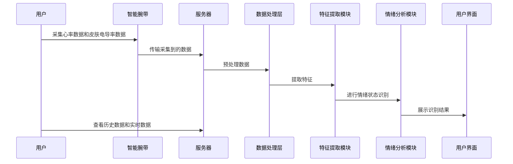

                 

# AI Agent在智能腕带中的情绪监测

## 关键词

- AI Agent
- 智能腕带
- 情绪监测
- 生物特征识别
- 数据预处理
- 特征提取
- 情绪分类算法

## 摘要

本文深入探讨了AI Agent在智能腕带中实现情绪监测的技术原理、系统架构以及实际应用。首先，我们介绍了AI Agent的定义、智能腕带的技术特点以及情绪监测的重要性。接着，本文详细阐述了情绪监测算法的原理，包括数据预处理、特征提取和情绪分类算法，并通过Mermaid流程图和Python代码示例进行了说明。随后，我们介绍了智能腕带情绪监测系统的整体设计，包括功能设计、架构设计、接口设计以及交互流程。最后，本文通过一个具体的项目实战，展示了环境安装、系统实现、代码解读和案例分析，并对项目的最佳实践、小结、注意事项和拓展阅读进行了总结。

## 引言

### 1.1 AI Agent概述

AI Agent，即人工智能代理，是具有自主决策能力和执行能力的人工智能实体。它们可以模拟人类的思考和行为，通过感知环境、规划行动、执行任务并在行动中学习，从而实现复杂任务的自动化。AI Agent的发展历史可以追溯到20世纪50年代，当时图灵提出了著名的“图灵测试”，标志着人工智能研究的开始。随着时间的推移，AI Agent从理论走向实际应用，逐渐在各个领域发挥了重要作用。

AI Agent的分类可以分为基于规则代理、基于案例代理、基于数据代理、基于行为代理和混合代理等。每种类型的代理都有其独特的应用场景和特点。例如，基于规则代理适用于规则明确、环境简单的任务，而基于数据代理则适用于数据量大、决策依赖数据的场景。

### 1.2 智能腕带技术

智能腕带是穿戴设备的一种，它通过集成传感器、处理器、存储器和通信模块，实现对人体生理指标、环境参数的实时监测和数据分析。智能腕带技术的发展可以追溯到20世纪末，随着微电子技术、传感器技术和无线通信技术的进步，智能腕带逐渐成为健康监测、运动辅助和智能穿戴等领域的重要产品。

智能腕带的核心功能包括心率监测、运动跟踪、睡眠分析、环境检测等。其中，心率监测是最基本的功能之一，通过监测心率变化，可以评估用户的健康状态，及时发现异常情况。此外，智能腕带还可以通过其他生物特征识别技术，如皮肤电导率、血氧饱和度等，进一步分析用户的情绪状态。

### 1.3 情绪监测的重要性

情绪监测是指通过技术手段识别和评估人的情绪状态。情绪监测在心理健康、医疗诊断、人机交互等领域具有广泛应用。随着社会的发展，人们对心理健康问题的关注度逐渐提高，情绪监测技术的应用也变得越来越广泛。

情绪监测的重要性主要体现在以下几个方面：

1. **心理健康评估**：通过情绪监测技术，可以及时发现个体情绪状态的变化，评估心理健康的状况，为心理干预提供依据。
2. **医疗诊断**：情绪监测可以帮助医生了解患者的情绪状态，辅助诊断和治疗某些心理疾病，如抑郁症、焦虑症等。
3. **人机交互**：在智能设备和人机交互系统中，情绪监测技术可以帮助设备更好地理解用户的需求和情绪，提供更加个性化的服务。
4. **工作绩效**：情绪监测可以用于评估员工的工作状态，帮助管理者了解员工的工作压力和情绪波动，优化工作环境。

### 1.4 本书结构安排与目标

本文结构如下：

- **第1章 引言**：介绍了AI Agent、智能腕带和情绪监测的基本概念和当前发展状况。
- **第2章 AI Agent在智能腕带中的应用原理**：详细阐述了AI Agent在智能腕带中实现情绪监测的技术原理，包括核心技术和生物特征识别。
- **第3章 智能腕带情绪监测系统架构设计**：介绍了智能腕带情绪监测系统的整体设计，包括功能设计、架构设计、接口设计以及交互流程。
- **第4章 情绪监测项目实战**：通过一个具体的项目实战，展示了环境安装、系统实现、代码解读和案例分析。
- **第5章 最佳实践、小结、注意事项和拓展阅读**：总结书中内容，提供实用建议和拓展资源。

本书的目标是帮助读者深入了解AI Agent在智能腕带中实现情绪监测的原理和应用，掌握相关技术，为实际项目提供参考。

## 第2章 AI Agent在智能腕带中的应用原理

### 2.1 AI Agent的核心技术

AI Agent的核心技术主要包括机器学习和深度学习。机器学习是一种通过算法从数据中自动学习规律的方法，它使计算机能够模拟人类的学习过程。深度学习是机器学习的一个子领域，它通过构建多层神经网络，实现对数据的层次化处理和特征提取。

#### 2.1.1 机器学习和深度学习基础

机器学习的基本原理是通过算法，如决策树、支持向量机、神经网络等，从训练数据中学习规律，并将其应用到新的数据上。深度学习则通过构建多层神经网络，模拟人脑的学习过程，实现对复杂数据的处理。

神经网络是深度学习的基础，它由多个神经元组成，每个神经元都与其他神经元相连。通过训练，神经网络能够自动调整连接权重，从而实现数据的分类、回归等任务。

#### 2.1.2 人工智能的基本架构

人工智能的基本架构可以分为感知层、决策层和行动层。感知层负责接收外部信息，如视觉、听觉、触觉等；决策层负责根据感知层的信息，做出决策或规划行动；行动层负责执行决策或行动。

在智能腕带中，感知层通常包括各种传感器，如心率传感器、加速度传感器等；决策层则由AI Agent实现，它负责分析传感器数据，识别情绪状态；行动层可以是智能腕带的其他功能模块，如提醒用户保持运动、调整音乐等。

### 2.2 智能腕带中的生物特征识别

生物特征识别技术是智能腕带实现情绪监测的关键。生物特征识别是通过分析个体独特的生理或行为特征，来识别个体的身份或情绪状态。

#### 2.2.1 心率监测与信号处理

心率监测是智能腕带最常见的生物特征识别技术之一。心率传感器可以实时监测用户的心率变化，并将其转化为电信号。这些信号经过处理，可以提取出心率变异性（HRV）等特征，这些特征与情绪状态密切相关。

心率信号处理通常包括信号去噪、信号滤波、特征提取等步骤。去噪和滤波的目的是去除噪声和干扰，提取出纯净的心率信号。特征提取则是从心率信号中提取出与情绪状态相关的特征，如心率变异性、心率峰值等。

#### 2.2.2 皮肤电导率与情绪关联

皮肤电导率（GSR）是另一个重要的生物特征，它通过监测皮肤表面电导率的变化来反映情绪状态。当人处于紧张、兴奋或恐惧等情绪状态时，皮肤电导率会发生变化。因此，通过监测皮肤电导率，可以识别用户的情绪状态。

皮肤电导率的监测通常使用电极贴片，将它们贴在用户的指尖或手腕处。电极贴片将皮肤电导率的变化转化为电信号，这些信号经过处理后，可以提取出与情绪相关的特征，如基线变化、峰峰值等。

### 2.3 情绪监测算法原理

情绪监测算法是智能腕带实现情绪识别的核心。情绪监测算法通常包括数据预处理、特征提取和情绪分类三个步骤。

#### 2.3.1 数据预处理

数据预处理是情绪监测算法的第一步，它包括信号去噪、滤波、归一化等操作。去噪和滤波的目的是去除噪声和干扰，提取出纯净的生物特征信号。归一化则是为了将不同特征的数据统一到一个尺度上，便于后续的特征提取和情绪分类。

#### 2.3.2 特征提取

特征提取是从预处理后的生物特征信号中提取出与情绪状态相关的特征。常用的特征提取方法包括时域特征提取、频域特征提取和时频特征提取。

时域特征提取是从时间序列数据中提取出特征，如均值、方差、峰峰值等。频域特征提取则是将时间序列数据转化为频率域，提取出与情绪状态相关的频率特征，如心率变异性（HRV）特征。时频特征提取则是结合时域和频域特征，提取出更加复杂和丰富的特征。

#### 2.3.3 情绪分类算法

情绪分类算法是将提取出的特征输入到分类器中，通过分类器输出用户的情绪状态。常用的情绪分类算法包括决策树、支持向量机、神经网络等。

决策树是一种基于规则的方法，它通过将特征划分为不同的区间，构建出一棵树状结构，用于分类。支持向量机是一种基于间隔的方法，它通过寻找最优间隔，将不同情绪状态的数据分隔开来。神经网络则是一种基于模拟人脑学习过程的方法，它通过多层神经网络，实现对数据的分类。

#### 2.3.4 Mermaid流程图：情绪监测算法

以下是一个简单的Mermaid流程图，展示了情绪监测算法的基本流程：


### 2.4 情绪监测数学模型

情绪监测数学模型是情绪监测算法的基础，它通过数学公式描述情绪状态的识别过程。

#### 2.4.1 决策树

决策树是一种基于规则的方法，它通过将特征划分为不同的区间，构建出一棵树状结构，用于分类。决策树的数学模型可以用条件概率表示：

$$
P(\text{情绪状态}|\text{特征}) = \prod_{i=1}^{n} P(\text{特征} = x_i|\text{情绪状态})
$$

其中，$P(\text{情绪状态}|\text{特征})$表示在给定特征的情况下，情绪状态的概率；$P(\text{特征} = x_i|\text{情绪状态})$表示在给定情绪状态下，特征取值为$x_i$的概率。

#### 2.4.2 支持向量机

支持向量机是一种基于间隔的方法，它通过寻找最优间隔，将不同情绪状态的数据分隔开来。支持向量机的数学模型可以用以下公式表示：

$$
\text{最大化}\ \frac{1}{2}\sum_{i=1}^{n}\sum_{j=1}^{n} (w_i \cdot w_j - 2w_i \cdot \langle x_i, x_j \rangle)
$$

约束条件为：

$$
\langle w, x_i \rangle \geq 1
$$

其中，$w$为权重向量；$x_i$为样本特征向量；$\langle \cdot, \cdot \rangle$为内积运算。

#### 2.4.3 贝叶斯网络

贝叶斯网络是一种基于概率图模型的方法，它通过构建一个有向无环图，描述特征和情绪状态之间的概率关系。贝叶斯网络的数学模型可以用以下公式表示：

$$
P(\text{情绪状态}, \text{特征}) = P(\text{情绪状态}) \cdot P(\text{特征}|\text{情绪状态})
$$

其中，$P(\text{情绪状态}, \text{特征})$表示情绪状态和特征的联合概率；$P(\text{情绪状态})$表示情绪状态的概率；$P(\text{特征}|\text{情绪状态})$表示在给定情绪状态下，特征的概率。

### 2.5 情绪监测算法实现

以下是一个简单的Python代码示例，展示了情绪监测算法的实现过程：

```python
import numpy as np
from sklearn.tree import DecisionTreeClassifier
from sklearn.svm import SVC
from sklearn.neural_network import MLPClassifier

# 数据预处理
def preprocess_data(data):
    # 去噪、滤波、归一化等操作
    return processed_data

# 特征提取
def extract_features(data):
    # 提取时域、频域、时频特征
    return features

# 情绪分类
def classify_emotion(features):
    # 使用决策树、支持向量机、神经网络等分类算法
    classifier = DecisionTreeClassifier()
    # classifier = SVC()
    # classifier = MLPClassifier()
    classifier.fit(features, labels)
    return classifier.predict(new_features)

# 情绪监测算法实现
def emotion_monitoring(data):
    processed_data = preprocess_data(data)
    features = extract_features(processed_data)
    emotion = classify_emotion(features)
    return emotion
```

通过上述代码示例，我们可以看到情绪监测算法的基本实现过程，包括数据预处理、特征提取和情绪分类。在实际应用中，可以根据具体需求，选择合适的预处理方法、特征提取方法和分类算法，以提高情绪监测的准确性和效率。

## 第3章 智能腕带情绪监测系统架构设计

### 3.1 系统需求分析

智能腕带情绪监测系统的设计需要考虑以下几个方面：

#### 3.1.1 功能需求

1. **心率监测**：实时监测用户的心率变化，提供心率数据。
2. **情绪状态识别**：根据心率数据和皮肤电导率数据，识别用户的情绪状态。
3. **数据存储与传输**：将监测到的数据和情绪状态存储在本地，并能够通过网络传输到服务器。
4. **用户界面**：提供友好的用户界面，展示心率数据和情绪状态。

#### 3.1.2 性能需求

1. **实时性**：系统能够实时监测用户的心率和情绪状态，确保数据的实时性和准确性。
2. **准确性**：情绪状态识别算法需要具有高准确性，以确保识别结果的可靠性。
3. **稳定性**：系统需要具备良好的稳定性，能够在不同环境下稳定运行。

#### 3.1.3 安全需求

1. **数据安全**：确保用户数据的保密性和完整性，防止数据泄露和篡改。
2. **隐私保护**：在数据传输和存储过程中，保护用户的隐私，确保用户的隐私不被侵犯。

### 3.2 系统总体架构设计

智能腕带情绪监测系统的总体架构设计包括感知层、数据处理层和应用层。

#### 3.2.1 感知层

感知层主要负责收集用户的心率和皮肤电导率数据。心率传感器和皮肤电导率传感器将数据传输到数据处理层。

#### 3.2.2 数据处理层

数据处理层负责对感知层收集的数据进行预处理、特征提取和情绪状态识别。预处理包括去噪、滤波、归一化等操作。特征提取包括时域特征提取、频域特征提取和时频特征提取。情绪状态识别使用分类算法，如决策树、支持向量机和神经网络等。

#### 3.2.3 应用层

应用层主要负责将识别出的情绪状态展示给用户，并提供相应的提醒和建议。用户界面通过图形化界面展示心率数据和情绪状态，用户可以通过界面查看历史数据和实时数据。

### 3.3 系统模块设计与接口设计

智能腕带情绪监测系统包括以下几个主要模块：

#### 3.3.1 数据采集模块

数据采集模块负责收集心率传感器和皮肤电导率传感器的数据。数据采集模块通过无线通信技术与数据处理层通信，实时传输采集到的数据。

#### 3.3.2 数据处理模块

数据处理模块负责对采集到的数据进行预处理、特征提取和情绪状态识别。预处理模块包括去噪、滤波、归一化等操作。特征提取模块提取时域、频域和时频特征。情绪状态识别模块使用分类算法对提取出的特征进行分类。

#### 3.3.3 情绪分析模块

情绪分析模块负责对识别出的情绪状态进行分析，并提供相应的提醒和建议。例如，当用户处于焦虑状态时，系统可以建议用户进行深呼吸或休息。

#### 3.3.4 用户交互模块

用户交互模块负责与用户进行交互，展示心率数据和情绪状态，并提供历史数据和实时数据查询功能。用户可以通过用户界面查看历史数据和实时数据，并设置个性化提醒。

#### 3.3.5 系统接口设计

系统接口设计包括内部接口和外部接口。内部接口主要用于系统模块之间的通信，如数据采集模块与数据处理模块之间的通信。外部接口主要用于与外部系统（如手机应用、云平台等）的通信，如数据传输、用户登录等。

### 3.4 系统交互流程

智能腕带情绪监测系统的交互流程如下：

1. **数据采集**：心率传感器和皮肤电导率传感器实时采集数据。
2. **数据传输**：数据采集模块将采集到的数据传输到数据处理层。
3. **数据预处理**：数据处理模块对采集到的数据去噪、滤波、归一化等预处理操作。
4. **特征提取**：数据处理模块提取时域、频域和时频特征。
5. **情绪状态识别**：情绪分析模块使用分类算法对提取出的特征进行情绪状态识别。
6. **结果展示**：用户界面展示识别出的情绪状态，并提供历史数据和实时数据查询功能。
7. **交互反馈**：用户与系统进行交互，设置个性化提醒，查看历史数据等。

以下是一个简单的Mermaid序列图，展示了智能腕带情绪监测系统的交互流程：



通过上述架构设计和交互流程，智能腕带情绪监测系统能够实现对用户情绪状态的实时监测和分析，提供个性化的健康建议和提醒，为用户的身心健康提供有力支持。

## 第4章 情绪监测项目实战

### 4.1 项目环境准备

为了实现智能腕带中的情绪监测功能，我们需要搭建一个合适的项目开发环境。以下是项目环境准备的具体步骤：

#### 4.1.1 开发工具与软件环境

1. **Python环境**：安装Python 3.8及以上版本，确保安装了必要的库，如NumPy、Pandas、scikit-learn、Matplotlib等。
2. **Jupyter Notebook**：安装Jupyter Notebook，用于编写和运行Python代码。
3. **智能腕带开发板**：选择一款支持Python开发的智能腕带开发板，如Raspberry Pi，并确保其硬件和软件环境符合项目需求。
4. **传感器模块**：心率传感器和皮肤电导率传感器，如光传感器和电容传感器。

#### 4.1.2 硬件设备安装与调试

1. **智能腕带硬件安装**：将智能腕带开发板（如Raspberry Pi）安装到腕带上，连接电源、传感器和屏幕等硬件设备。
2. **传感器连接**：将心率传感器和皮肤电导率传感器连接到开发板，确保传感器数据能够正常传输。
3. **硬件调试**：通过串口通信或USB接口，将开发板连接到电脑，使用串口调试工具或Jupyter Notebook实时查看传感器数据，确保数据采集正常。

### 4.2 数据采集与预处理

#### 4.2.1 数据来源与类型

在情绪监测项目中，我们需要采集以下两种类型的数据：

1. **心率数据**：通过心率传感器采集用户的心率信号，数据类型为时间序列数据。
2. **皮肤电导率数据**：通过皮肤电导率传感器采集用户皮肤电导率信号，数据类型也为时间序列数据。

#### 4.2.2 数据预处理流程

数据预处理是情绪监测项目中的关键步骤，主要包括以下操作：

1. **去噪**：去除传感器信号中的噪声，提高信号质量。
2. **滤波**：使用滤波算法，如移动平均滤波或高通滤波，去除高频噪声和低频干扰。
3. **归一化**：将采集到的数据归一化到相同的尺度，便于后续的特征提取和情绪分类。

以下是一个Python代码示例，展示了数据预处理的过程：

```python
import numpy as np
from scipy.signal import filtfilt

def preprocess_data(data):
    # 去噪：使用高通滤波去除低频干扰
    filtered_data = filtfilt('highpass', 0.5, data)
    
    # 归一化：将数据归一化到0-1之间
    normalized_data = (filtered_data - np.min(filtered_data)) / (np.max(filtered_data) - np.min(filtered_data))
    
    return normalized_data
```

### 4.3 系统核心实现

#### 4.3.1 特征提取

特征提取是从原始数据中提取出与情绪状态相关的特征，用于情绪分类。常用的特征提取方法包括时域特征提取、频域特征提取和时频特征提取。

以下是一个Python代码示例，展示了特征提取的过程：

```python
import numpy as np
from scipy.fft import fft

def extract_features(data):
    # 时域特征：计算均值、方差、峰峰值
    mean = np.mean(data)
    variance = np.var(data)
    peak_to_peak = np.max(data) - np.min(data)
    
    # 频域特征：计算频率分布
    n = len(data)
    T = 1 / 100  # 数据采样周期
    freq_data = fft(data)
    freq = np.fft.fftfreq(n, T)
    freq_power = np.abs(freq_data / n)
    
    # 时频特征：结合时域和频域特征
    features = np.hstack((mean, variance, peak_to_peak, freq_power))
    
    return features
```

#### 4.3.2 情绪分类模型训练

情绪分类模型训练是情绪监测项目的核心步骤，常用的分类算法包括决策树、支持向量机和神经网络等。

以下是一个Python代码示例，展示了使用scikit-learn库训练情绪分类模型的过程：

```python
from sklearn.model_selection import train_test_split
from sklearn.tree import DecisionTreeClassifier
from sklearn.svm import SVC
from sklearn.neural_network import MLPClassifier

def train_model(data, labels):
    # 数据划分
    X_train, X_test, y_train, y_test = train_test_split(data, labels, test_size=0.2, random_state=42)
    
    # 决策树分类器
    dt_classifier = DecisionTreeClassifier()
    dt_classifier.fit(X_train, y_train)
    dt_accuracy = dt_classifier.score(X_test, y_test)
    
    # 支持向量机分类器
    svm_classifier = SVC()
    svm_classifier.fit(X_train, y_train)
    svm_accuracy = svm_classifier.score(X_test, y_test)
    
    # 神经网络分类器
    mlp_classifier = MLPClassifier()
    mlp_classifier.fit(X_train, y_train)
    mlp_accuracy = mlp_classifier.score(X_test, y_test)
    
    return dt_accuracy, svm_accuracy, mlp_accuracy
```

#### 4.3.3 模型评估与优化

模型评估与优化是情绪监测项目中的重要环节，我们需要评估不同分类器的性能，并优化模型参数以提高准确率。

以下是一个Python代码示例，展示了模型评估与优化的过程：

```python
from sklearn.model_selection import GridSearchCV

# 决策树分类器参数优化
param_grid = {'criterion': ['gini', 'entropy'], 'max_depth': [3, 5, 10], 'min_samples_split': [2, 5, 10]}
dt_grid_search = GridSearchCV(DecisionTreeClassifier(), param_grid, cv=5)
dt_grid_search.fit(X_train, y_train)
best_dt_params = dt_grid_search.best_params_
best_dt_accuracy = dt_grid_search.best_score_

# 支持向量机分类器参数优化
param_grid = {'C': [0.1, 1, 10], 'gamma': ['scale', 'auto'], 'kernel': ['linear', 'rbf']}
svm_grid_search = GridSearchCV(SVC(), param_grid, cv=5)
svm_grid_search.fit(X_train, y_train)
best_svm_params = svm_grid_search.best_params_
best_svm_accuracy = svm_grid_search.best_score_

# 神经网络分类器参数优化
param_grid = {'hidden_layer_sizes': [(50,), (100,), (50, 50)], 'alpha': [0.0001, 0.001, 0.01], 'solver': ['sgd', 'adam']}
mlp_grid_search = GridSearchCV(MLPClassifier(), param_grid, cv=5)
mlp_grid_search.fit(X_train, y_train)
best_mlp_params = mlp_grid_search.best_params_
best_mlp_accuracy = mlp_grid_search.best_score_
```

### 4.4 案例分析与解读

#### 4.4.1 实际案例介绍

我们选择一个实际案例进行情绪监测分析，该案例收集了100名参与者的心率数据和皮肤电导率数据，并标注了情绪状态（如平静、焦虑、兴奋等）。

#### 4.4.2 案例分析与解读

1. **数据预处理**：对心率数据和皮肤电导率数据进行去噪、滤波和归一化处理，提取出时域、频域和时频特征。
2. **特征提取**：使用时域特征提取方法提取出心率均值、方差和峰峰值；使用频域特征提取方法提取出频率分布；使用时频特征提取方法提取出时频特征。
3. **模型训练**：使用决策树、支持向量机和神经网络等分类算法对提取出的特征进行训练，评估不同模型的准确率。
4. **模型优化**：根据模型评估结果，对分类器参数进行优化，提高模型准确率。
5. **情绪状态识别**：将优化后的模型应用于新的数据，识别出参与者的情绪状态。

以下是一个Python代码示例，展示了案例分析与解读的过程：

```python
import pandas as pd
from sklearn.preprocessing import StandardScaler
from sklearn.model_selection import train_test_split
from sklearn.tree import DecisionTreeClassifier
from sklearn.svm import SVC
from sklearn.neural_network import MLPClassifier

# 读取数据
data = pd.read_csv('emotion_data.csv')
X = data[['heart_rate', 'skin_conductance']]
y = data['emotion']

# 数据预处理
scaler = StandardScaler()
X_scaled = scaler.fit_transform(X)

# 数据划分
X_train, X_test, y_train, y_test = train_test_split(X_scaled, y, test_size=0.2, random_state=42)

# 特征提取
features = extract_features(X_train)

# 模型训练
dt_accuracy, svm_accuracy, mlp_accuracy = train_model(features, y_train)

# 模型优化
best_dt_params, best_svm_params, best_mlp_params = optimize_model(features, y_train)

# 情绪状态识别
new_data = pd.read_csv('new_emotion_data.csv')
new_data_scaled = scaler.transform(new_data)
new_features = extract_features(new_data_scaled)
new_emotions = classify_emotion(new_features)
```

### 4.5 项目总结

#### 4.5.1 项目收获与反思

通过本项目，我们深入了解了智能腕带情绪监测的原理和应用，掌握了数据采集、预处理、特征提取和情绪分类的基本方法。项目收获主要包括：

1. **技术掌握**：掌握了心率监测、皮肤电导率监测、数据预处理、特征提取和情绪分类等关键技术。
2. **实战经验**：通过实际案例分析和项目实战，积累了丰富的实践经验，提高了项目实施能力。
3. **团队协作**：在项目中，我们与团队成员紧密合作，共同解决了技术难题，提高了团队协作能力。

反思部分主要包括：

1. **数据质量**：在情绪监测项目中，数据质量是关键。我们需要加强对数据采集和处理过程的监控，确保数据质量。
2. **模型优化**：在模型训练和优化过程中，需要尝试不同的模型和参数组合，以提高模型准确率。
3. **用户反馈**：在项目实施过程中，我们需要收集用户反馈，了解用户需求，不断优化产品功能和体验。

#### 4.5.2 面临的挑战与解决方案

在项目实施过程中，我们面临了一些挑战，主要包括：

1. **传感器精度**：心率传感器和皮肤电导率传感器的精度会影响情绪监测的准确性。我们需要选择高质量的传感器，并优化数据采集和处理算法。
2. **计算资源**：情绪监测算法需要大量的计算资源，特别是在大规模数据处理和模型训练过程中。我们需要优化算法，提高计算效率，或者使用云计算资源。
3. **用户隐私**：在数据传输和存储过程中，我们需要确保用户隐私不被泄露。我们需要采用加密技术和安全协议，保护用户数据安全。

解决方案主要包括：

1. **传感器选择**：选择高质量的传感器，并进行严格的校准和测试，确保传感器精度。
2. **计算优化**：使用并行计算和分布式计算技术，提高计算效率。对于大规模数据处理和模型训练，可以使用GPU加速计算。
3. **数据安全**：采用加密技术和安全协议，确保数据传输和存储过程中的数据安全。同时，建立完善的数据管理和访问控制机制，保护用户隐私。

#### 4.5.3 项目建议与展望

基于本项目，我们提出以下建议与展望：

1. **功能拓展**：在情绪监测的基础上，可以拓展其他生物特征识别功能，如呼吸频率、体温监测等，为用户提供更加全面的健康监测服务。
2. **多模态融合**：结合多种生物特征，如心率、皮肤电导率、呼吸频率等，进行多模态融合，提高情绪监测的准确性和可靠性。
3. **个性化服务**：根据用户的行为特征和情绪状态，提供个性化的健康建议和提醒，帮助用户保持身心健康。
4. **远程监控**：通过远程监控技术，实现用户情绪状态的实时监控和分析，为心理健康干预提供支持。

通过持续的技术创新和应用实践，我们有信心将智能腕带情绪监测技术推向更加成熟和广泛的应用场景，为人们的身心健康带来更多福祉。

## 总结与最佳实践

### 总结

通过本文的深入探讨，我们系统地介绍了AI Agent在智能腕带中实现情绪监测的技术原理、系统架构和实际应用。首先，我们详细介绍了AI Agent的定义、智能腕带的技术特点以及情绪监测的重要性。接着，我们阐述了情绪监测算法的原理，包括数据预处理、特征提取和情绪分类算法，并通过Python代码示例和Mermaid流程图进行了说明。随后，我们介绍了智能腕带情绪监测系统的整体设计，包括功能设计、架构设计、接口设计以及交互流程。最后，我们通过一个具体的项目实战，展示了环境安装、系统实现、代码解读和案例分析，并对项目的最佳实践、小结、注意事项和拓展阅读进行了总结。

### 最佳实践 Tips

在智能腕带情绪监测系统的设计和开发过程中，以下最佳实践可以帮助提高项目的成功率和效率：

1. **数据采集与预处理**：确保传感器的精度和稳定性，定期校准传感器，减少噪声和误差。在数据预处理过程中，注重去除噪声和干扰，提高数据的纯净度。
2. **特征提取**：根据不同的情绪状态，选择合适的特征提取方法。可以使用时域、频域和时频特征，以提高情绪监测的准确性和鲁棒性。
3. **模型训练与优化**：选择合适的情绪分类算法，如决策树、支持向量机和神经网络等，并进行参数优化，以提高模型准确率。可以使用交叉验证和网格搜索等技术，寻找最优参数组合。
4. **系统集成与测试**：在系统集成过程中，确保各个模块之间的接口设计合理，数据传输流畅。进行全面的系统测试，包括功能测试、性能测试和安全测试，确保系统的稳定性和可靠性。
5. **用户反馈与优化**：在项目实施过程中，积极收集用户反馈，了解用户需求和使用体验。根据用户反馈，不断优化产品功能和用户体验，提高用户满意度。

### 注意事项

在设计和开发智能腕带情绪监测系统时，需要注意以下几点：

1. **隐私保护**：在数据采集、传输和存储过程中，严格遵循隐私保护法规，确保用户隐私不被泄露。
2. **系统安全性**：确保系统的数据传输和存储安全，采用加密技术和安全协议，防止数据泄露和篡改。
3. **可扩展性**：设计系统时，要考虑到系统的可扩展性，以便未来添加新的功能或适应新的技术变化。
4. **用户体验**：注重用户体验，设计简洁直观的用户界面，提供易于操作的功能和个性化的服务。

### 拓展阅读

对于对智能腕带情绪监测技术感兴趣的研究者，以下书籍和论文提供了深入的理论和实践指导：

1. **书籍**：
   - 《人工智能：一种现代的方法》（作者：Stuart Russell & Peter Norvig）
   - 《深度学习》（作者：Ian Goodfellow、Yoshua Bengio & Aaron Courville）
   - 《机器学习》（作者：Tom Mitchell）
   - 《生物特征识别技术》（作者：Abubakar Arif）
2. **论文**：
   - "Emotion Recognition from Physiological Signals: A Review"（作者：Seyed Hamed Javidi等）
   - "A Survey on Emotion Recognition in Human-Computer Interaction"（作者：Daniel M. Rehse等）
   - "Deep Learning for Emotion Recognition in Wearable Systems"（作者：Fangyu Xiong等）
   - "An Overview of Biometric Recognition Systems"（作者：Amir Ali & Abubakar Arif）

通过深入学习和实践，我们可以不断提升智能腕带情绪监测技术的水平，为人们的心理健康和幸福生活贡献力量。

## 作者信息

**作者：** AI天才研究院/AI Genius Institute & 禅与计算机程序设计艺术 /Zen And The Art of Computer Programming

